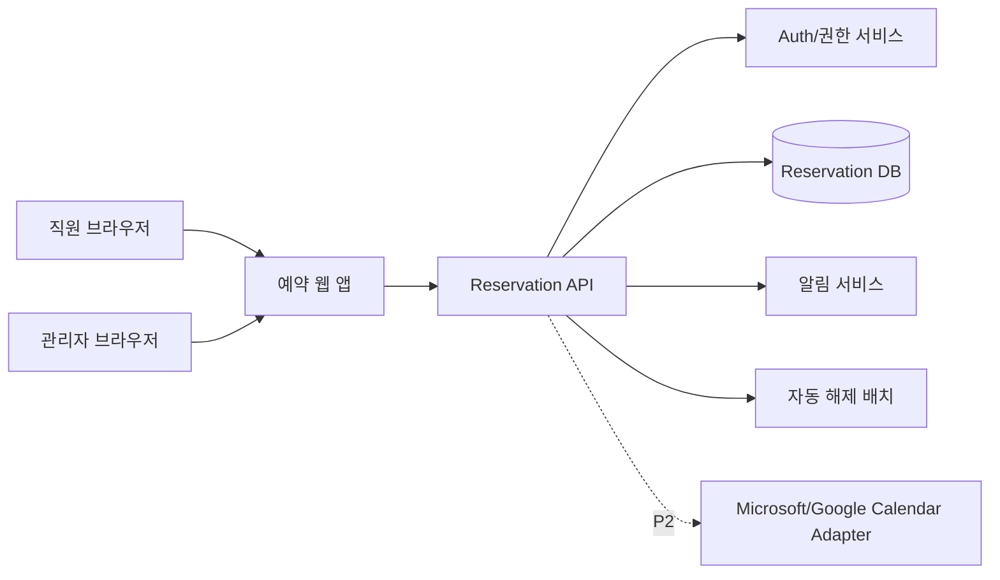
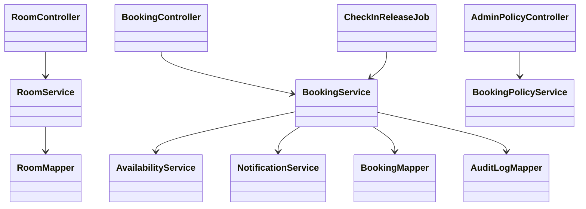
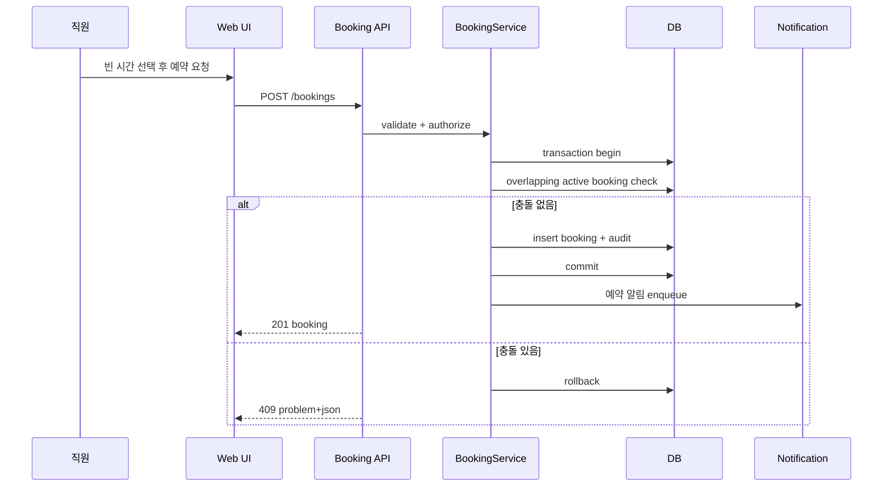
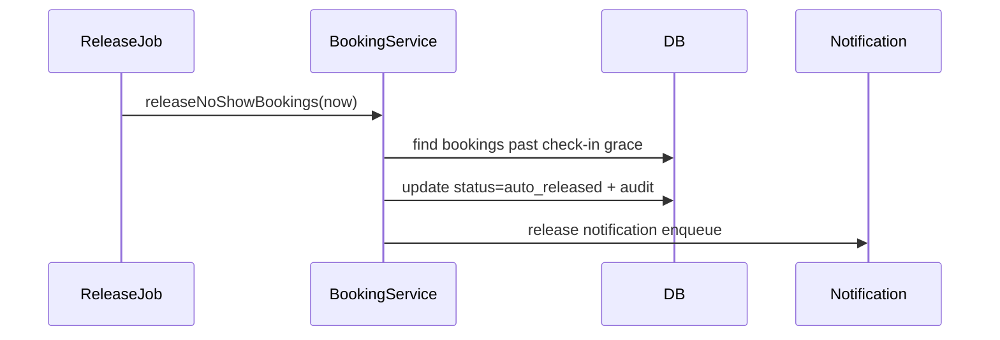
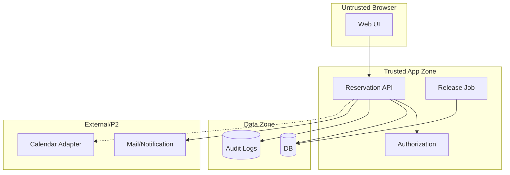

# Architecture - 사내 회의실 웹 예약

## Context & Scope

웹 브라우저에서 직원과 관리자가 회의실 예약 원장을 사용한다. MVP는 독립 예약 원장을 기준으로 하며 외부 캘린더 동기화는 P2 어댑터로 분리한다.

## Goals / Non-goals

- Goals: 중복 예약 차단, 권한 기반 상세 마스킹, 감사 로그, 체크인/자동 해제, 관리자 정책 관리.
- Non-goals: 외부 캘린더 동기화의 즉시 구현, 좌석 예약, 방문자 관리, AI 추천.

## 시스템 컨텍스트

## 구현 접근

- Frontend: 회의실 타임라인, 빈 방 검색, 예약 모달, 내 예약, 관리자 설정.
- Backend: Controller -> Service -> Repository/Mapper 구조. 예약 생성은 Service 트랜잭션에서 충돌 검사와 insert를 한 단위로 처리한다.
- DB: 활성 예약의 시간 겹침을 애플리케이션 트랜잭션 + DB exclusion/locking 전략으로 방지한다. PostgreSQL은 range constraint 후보, MSSQL은 serializable transaction 또는 key-range lock 후보.
- Job: 체크인 유예 시간이 지난 예약을 주기적으로 auto_released 상태로 전환한다.
- Notification: 예약 생성/변경/취소/자동해제 알림을 비동기로 발송한다.

## 컴포넌트 구조

## 데이터 흐름

### 예약 생성

### 자동 해제

## 데이터 저장 설계 결정

- `booking.status`: pending_approval, confirmed, checked_in, cancelled, auto_released, rejected.
- 시간은 UTC 저장, UI는 조직 시간대(기본 Asia/Seoul)로 표시한다.
- 예약 변경은 현재 row 업데이트와 audit append를 병행한다. 법적 불변 기록은 아니므로 revision 테이블은 P2로 둔다.
- 삭제는 회의실/정책에는 soft delete, 예약은 상태 전이로 처리한다.

## 검토한 대안

| 대안 | 판단 |
|---|---|
| Google/Microsoft Calendar만 사용 | 빠르지만 사내 정책/노쇼/분석/현장 타임라인 커스터마이징이 제한된다. |
| 전문 SaaS 구매 | 기능은 풍부하지만 온프레미스/폐쇄망/비용 제약에 취약하다. |
| 독립 예약 원장 후 캘린더 연동 | MVP 통제력이 높고 향후 확장 가능하므로 채택한다. |

## Threat Modeling

### 무엇을 만드는가

### STRIDE

| 경계 | S | T | R | I | D | E |
|---|---|---|---|---|---|---|
| Browser -> API | 세션 탈취 | bookingId/roomId 변조 | 예약 변경 부인 | 타인 상세 조회 | 반복 조회/생성 | admin API 호출 |
| API -> DB | 서비스 계정 남용 | SQL 변조 | DB 변경자 불명 | DB 직접 노출 | 잠금/느린 쿼리 | DB 권한 과다 |
| API -> Notification | 발신자 위조 | 알림 내용 변조 | 발송 부인 | 회의 제목 노출 | 알림 폭주 | 알림 템플릿 권한 상승 |

### 완화책

- Mitigate: 인증 필수, CSRF 또는 SameSite 쿠키/JWT 정책, 서버 권한 검사, rate limit, audit log, Problem JSON 오류.
- Mitigate: 모든 SQL 파라미터 바인딩, 예약 생성 트랜잭션, DB 최소 권한.
- Mitigate: 권한별 상세 마스킹, private 기본값, 알림에는 최소 정보만 포함.
- Accept: 사내망 장애 시 오프라인 예약은 지원하지 않는다. 장애 중 예약은 중단하고 복구 후 재시도한다.

## 상위 리스크

1. 동시 예약 충돌 방지가 DB별로 다르게 구현될 수 있다. 완화: MSSQL/PostgreSQL 각각 통합 테스트.
2. 회의 제목/참석자 노출이 개인정보 이슈가 될 수 있다. 완화: free/busy 기본값과 권한별 필드 마스킹.
3. 체크인 자동 해제가 실제 회의 중인 방을 풀 수 있다. 완화: 체크인 유예 시간, 관리자 복구, 알림 후 해제.
