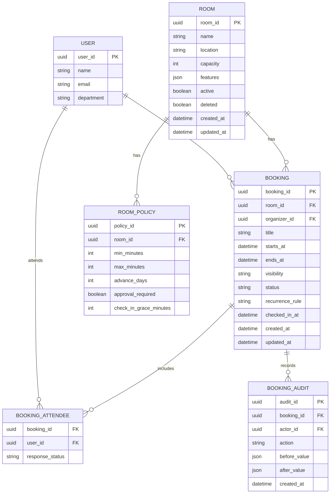

# API Contract & Data Schema - 사내 회의실 웹 예약

## 규약

- Base path: `/api/meeting-rooms`
- 인증: 사내 로그인 세션 또는 Bearer JWT.
- 오류 포맷: RFC 9457 Problem JSON (`type`, `title`, `status`, `detail`, `instance`, `code`).
- 페이지네이션: cursor 우선. 관리자 CSV는 별도 export endpoint.
- 멱등성: `POST /bookings`는 `Idempotency-Key` 헤더를 지원하고 4시간 동안 최초 응답을 재사용한다.
- 시간: 요청/응답은 ISO 8601 UTC. UI 표시 시간대는 사용자/조직 설정.
- 권한 스코프: `meeting-room:read`, `meeting-room:book`, `meeting-room:admin`, `meeting-room:audit`.

## 엔드포인트

| ID | 메서드 경로 | 요청 | 응답 | 주요 오류 | 권한 |
|---|---|---|---|---|---|
| EP-001 | GET `/rooms` | `capacityMin`, `features`, `activeOnly` | room list | 401, 403 | read |
| EP-002 | POST `/rooms` | name, location, capacity, features, operatingHours, policies | room | 400, 409 | admin |
| EP-003 | PATCH `/rooms/{roomId}` | 변경 필드 | room | 400, 404, 409 | admin |
| EP-004 | GET `/availability` | dateFrom, dateTo, capacityMin, features | room availability blocks | 400 | read |
| EP-005 | GET `/bookings` | dateFrom, dateTo, roomId, mine | booking list(masked) | 400 | read |
| EP-006 | POST `/bookings` | roomId, title, startsAt, endsAt, attendees, visibility, recurrence | booking | 400, 403, 409 | book |
| EP-007 | PATCH `/bookings/{bookingId}` | mutable fields | booking | 400, 403, 404, 409 | organizer/admin |
| EP-008 | POST `/bookings/{bookingId}/cancel` | reason | booking | 403, 404, 409 | organizer/admin |
| EP-009 | POST `/bookings/{bookingId}/check-in` | optional device/location | booking | 403, 404, 409 | organizer/attendee/admin |
| EP-010 | GET `/admin/audit-events` | dateFrom, dateTo, actorId, bookingId | audit list | 403 | audit/admin |
| EP-011 | GET `/admin/utilization.csv` | dateFrom, dateTo | CSV | 403 | admin |

## OpenAPI sketch

```yaml
openapi: 3.1.0
info:
  title: Meeting Room Booking API
  version: 0.1.0
paths:
  /api/meeting-rooms/bookings:
    post:
      operationId: createBooking
      parameters:
        - name: Idempotency-Key
          in: header
          schema: { type: string, maxLength: 128 }
      requestBody:
        required: true
        content:
          application/json:
            schema:
              $ref: '#/components/schemas/CreateBookingRequest'
      responses:
        '201':
          description: Created
        '409':
          description: Booking conflict
          content:
            application/problem+json:
              schema:
                $ref: '#/components/schemas/Problem'
components:
  schemas:
    CreateBookingRequest:
      type: object
      required: [roomId, title, startsAt, endsAt, visibility]
      properties:
        roomId: { type: string, format: uuid }
        title: { type: string, minLength: 1, maxLength: 120 }
        startsAt: { type: string, format: date-time }
        endsAt: { type: string, format: date-time }
        visibility: { type: string, enum: [private, organization] }
        attendees:
          type: array
          items: { type: string, format: uuid }
    Problem:
      type: object
      required: [type, title, status]
```

## ERD



## 데이터 규칙

- 예약 시간은 `starts_at < ends_at`이어야 한다.
- 활성 예약 상태는 `pending_approval`, `confirmed`, `checked_in`이다. 이 상태끼리는 같은 room/time overlap을 허용하지 않는다.
- 회의실 삭제는 soft delete이며, 과거 예약은 보존한다.
- 예약 취소/자동해제는 row 삭제가 아니라 상태 전이다.
- CSV export는 Excel formula injection 방지를 위해 `=`, `+`, `-`, `@` 시작 셀을 이스케이프한다.

## 커버리지 매핑

| FR-ID | 엔드포인트/이벤트 |
|---|---|
| FR-001 | EP-001, EP-004 |
| FR-002 | EP-006, DB overlap constraint/transaction |
| FR-003 | EP-006 |
| FR-004 | EP-007, EP-008 |
| FR-005 | BOOKING_AUDIT, EP-010 |
| FR-006 | EP-002, EP-003 |
| FR-007 | ROOM_POLICY.approval_required, booking.status |
| FR-008 | EP-009, CheckInReleaseJob |
| FR-009 | EP-005 response masking |
| FR-010 | EP-011 |
| FR-011 | P2 Calendar Adapter events |

P0/P1 요구사항 커버리지 누락: 0건.
