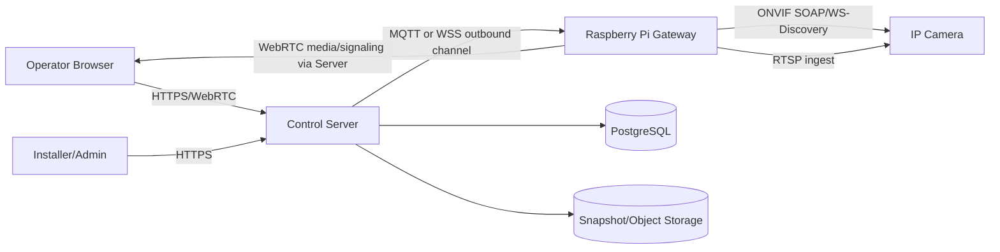
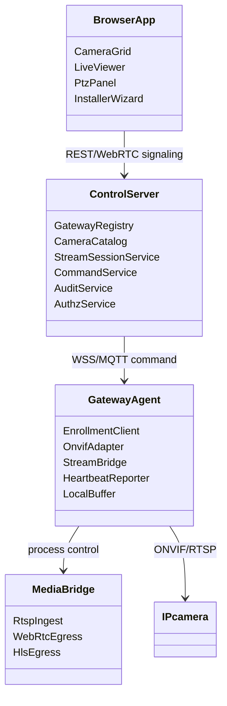
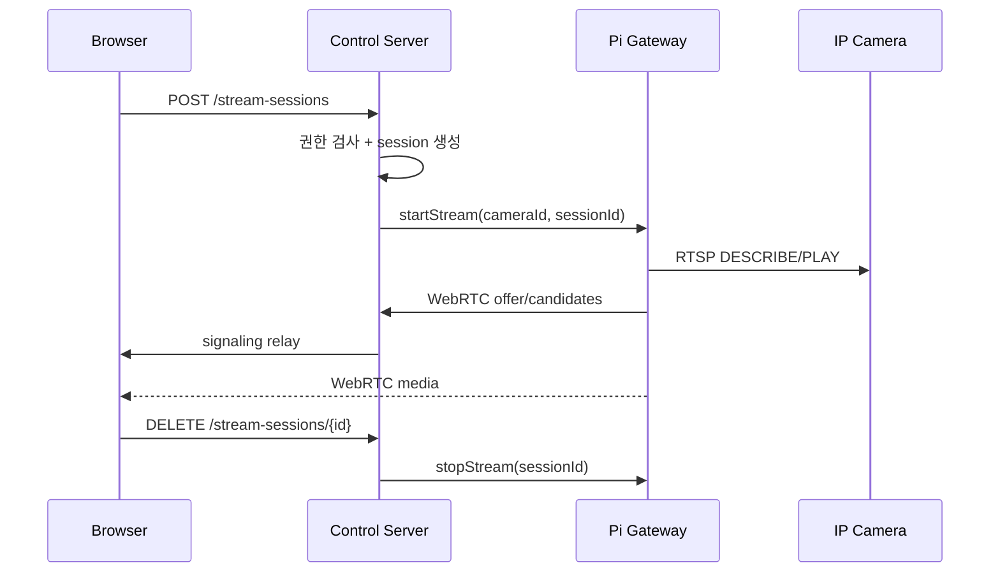
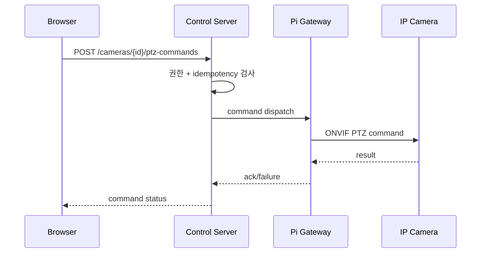
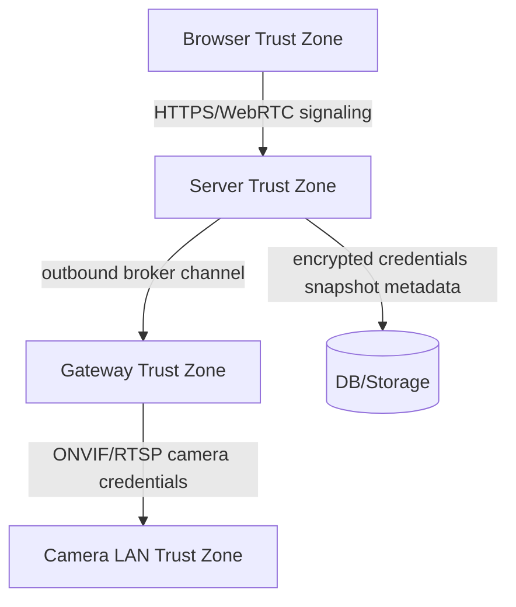

# Architecture - Raspberry Pi IP Camera Control & Monitoring

## Context & Scope

이 시스템은 중앙 관리 서버, 브라우저 관제 UI, 현장 Raspberry Pi gateway, IP 카메라로 구성된다. Pi는 카메라 검색/제어/스트림 변환을 담당하고, 중앙 서버는 사용자·권한·감사·설정·상태를 담당한다.

## Goals / Non-goals

- Goals: 낮은 지연의 실시간 보기, 권한 기반 PTZ 제어, 폐쇄망 설치, gateway fleet 운영 가능성, 감사 가능성.
- Non-goals: 연속 녹화 NVR, AI 영상 분석, 카메라 펌웨어 관리, 포트포워딩 기반 원격 접속.

## 시스템 컨텍스트

## 구현 접근

- 중앙 서버: REST API, WebRTC signaling, command broker, RBAC, audit log, gateway registry.
- Gateway agent: enrollment, heartbeat, ONVIF discovery/control adapter, RTSP ingest, WebRTC/HLS bridge, local bounded queue.
- Streaming: MediaMTX 또는 동등한 gateway media process를 sidecar로 두고 agent가 lifecycle을 제어한다.
- UI: camera grid, detail viewer, PTZ controls, event/status panel, installer wizard.

## 컴포넌트 구조

## 데이터 흐름

### 실시간 보기

### PTZ 제어

## 데이터 저장 결정

- 관계형 DB: gateway, camera, role binding, stream session metadata, command, event, audit log.
- 파일/오브젝트 저장: snapshot/event image. MVP에서는 연속 녹화 저장 제외.
- Gateway local: encrypted camera credential cache, bounded command/event queue, volatile stream state.

## 검토한 대안

| 대안 | 선택 여부 | 이유 |
|---|---|---|
| HLS-only streaming | 기각 | PTZ 관제에 지연이 커질 가능성이 높음 |
| Pi를 IP 카메라 자체로 구성 | 기각 | 기존 IP 카메라 제어 요구와 맞지 않음 |
| 카메라 직접 클라우드 연결 | 기각 | 폐쇄망/보안 요구와 충돌 |
| Gateway WebRTC bridge | 채택 | 저지연과 브라우저 호환 균형 |
| Profile T 우선 + S 호환 | 채택 | 최신 ONVIF 권고와 구형 장비 호환 균형 |

## Threat Model

| 자산/경계 | S | T | R | I | D | E | 판정 |
|---|---|---|---|---|---|---|---|
| Browser-Server | 세션 탈취 | 요청 변조 | 사용자 부인 | 영상 권한 누출 | API flood | 권한 우회 | 모두 유효 |
| Server-Gateway | gateway spoofing | 명령 변조 | ack 부인 | 인증서 유출 | broker flood | gateway 권한 상승 | 모두 유효 |
| Gateway-Camera | 카메라 위장 | ONVIF 명령 변조 | 제어 이력 부인 | RTSP/자격증명 노출 | 카메라 연결 고갈 | 카메라 admin 탈취 | 모두 유효 |
| Server-DB/Storage | DB 계정 위장 | 감사로그 변조 | 로그 삭제 부인 | 스냅샷 노출 | 저장소 고갈 | DB 권한 상승 | 모두 유효 |

## 위협별 대응

- Spoofing: 사용자 MFA 옵션, gateway별 X.509 인증서, camera credential vault, short-lived stream token.
- Tampering: TLS, signed OTA, command idempotency, 감사로그 append-only 정책.
- Repudiation: 사용자·gateway·camera 단위 audit log, command correlation id, clock sync 검증.
- Information Disclosure: RBAC/ABAC, snapshot signed URL 만료, credential encryption, 로그 마스킹.
- Denial of Service: stream session limit, per-camera concurrency cap, rate limiting, alarm grouping.
- Elevation of Privilege: 서버 권한 검사 기준, gateway scope 제한, admin action step-up auth.

## 상위 리스크

1. 카메라 제조사별 ONVIF 구현 편차: capability matrix, adapter 격리, 인증 장비 목록 운영.
2. Pi 성능 한계: gateway당 동시 스트림 제한, transcoding 회피, hardware acceleration 검증.
3. 현장 전원/SD 장애: SSD 권장, read-only rootfs, watchdog, OTA rollback.
4. 영상 개인정보 노출: 기본 미녹화, 스냅샷 권한/보존 정책, 감사로그.

## Cross-cutting

- 관측성: gateway heartbeat, stream startup latency, PTZ ack latency, camera online 상태, media process saturation.
- 프라이버시: 영상 원본 기본 저장 금지, snapshot 보존 기간 설정, 접근 감사 필수.
- 오프라인: 서버 단절 시 로컬 UI는 read/control 제한 모드로 유지, 복구 후 이벤트 동기화.
