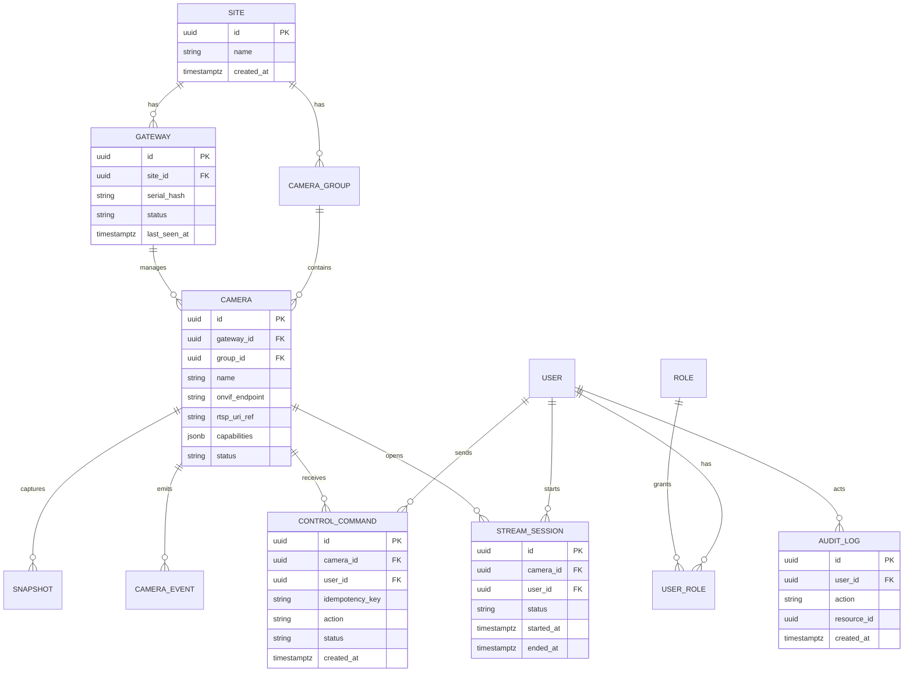

# API Contract & Data Schema - Raspberry Pi IP Camera Control & Monitoring

## 공통 규약

- 인증: Bearer JWT for users, mTLS or signed token for gateway.
- 오류: RFC 9457 Problem JSON (`type`, `title`, `status`, `detail`, `instance`, `code`, `correlationId`).
- 버전: URL 버전 대신 media type 또는 header 기반. 예: `Accept: application/vnd.camera-monitor+json;version=1`.
- 페이지네이션: cursor 기반 우선.
- 멱등성: 제어/등록/스냅샷 생성 POST는 `Idempotency-Key` 지원.
- 권한 코드: `camera:view`, `camera:control`, `camera:admin`, `gateway:admin`, `audit:read`.

## 엔드포인트

| ID | 메서드/경로 | 요청 | 응답 | 주요 오류 | 권한 |
|---|---|---|---|---|---|
| EP-001 | POST `/gateways/enrollments` | `siteId`, `label`, `expiresAt` | enrollment token | 403, 409 | gateway:admin |
| EP-002 | POST `/gateways/enroll` | token, device fingerprint | gateway cert/bootstrap config | 400, 401, 409 | device bootstrap |
| EP-003 | GET `/gateways` | cursor, status | gateway list | 401, 403 | gateway:admin |
| EP-004 | POST `/gateways/{gatewayId}/discoveries` | network scope | discovery job | 409, 422 | gateway:admin |
| EP-005 | GET `/gateways/{gatewayId}/discoveries/{jobId}` | - | discovered cameras | 404 | gateway:admin |
| EP-006 | POST `/cameras` | gatewayId, onvifUrl, rtspUrl, credentialsRef, groupId | camera | 400, 409 | camera:admin |
| EP-007 | GET `/cameras` | groupId, status, cursor | camera list | 403 | camera:view |
| EP-008 | GET `/cameras/{cameraId}/capabilities` | - | ONVIF capabilities | 404 | camera:view |
| EP-009 | POST `/stream-sessions` | cameraId, mode=`webrtc` | sessionId, signaling endpoint, expiresAt | 403, 409, 503 | camera:view |
| EP-010 | DELETE `/stream-sessions/{sessionId}` | - | closed | 404 | camera:view |
| EP-011 | POST `/cameras/{cameraId}/ptz-commands` | action, vector/preset, durationMs | commandId, status | 403, 409, 422, 503 | camera:control |
| EP-012 | POST `/cameras/{cameraId}/snapshots` | reason | snapshotId, status | 403, 503 | camera:view |
| EP-013 | GET `/events` | cameraId, type, cursor | event list | 403 | camera:view |
| EP-014 | GET `/audit-logs` | actorId, cameraId, action, cursor | audit list | 403 | audit:read |
| EP-015 | POST `/gateway-channel/heartbeat` | gateway status, metrics | ack/config delta | 401, 409 | gateway cert |

## OpenAPI sketch

```yaml
paths:
  /stream-sessions:
    post:
      summary: Create a WebRTC live stream session
      security:
        - bearerAuth: []
      requestBody:
        required: true
        content:
          application/json:
            schema:
              type: object
              required: [cameraId, mode]
              properties:
                cameraId: { type: string, format: uuid }
                mode: { type: string, enum: [webrtc] }
      responses:
        "201":
          description: Created
        "403":
          description: Forbidden problem
  /cameras/{cameraId}/ptz-commands:
    post:
      summary: Send an idempotent PTZ command
      parameters:
        - name: Idempotency-Key
          in: header
          required: true
          schema: { type: string, maxLength: 128 }
      responses:
        "202": { description: Accepted }
        "422": { description: Camera does not support requested capability }
```

## ERD



## 데이터 규칙

- 시간: 서버/DB는 UTC ISO 8601, UI는 사이트 시간대로 표시.
- 카메라 비밀번호/RTSP URI credential: 평문 저장 금지, KMS 또는 OS keyring 기반 암호화.
- 감사로그: append-only, 관리자 삭제 API 없음. 보존 기간 기본 1년.
- 스냅샷: 기본 보존 30일, 민감 현장에서는 7일로 축소 가능.
- 금액 데이터 없음. 수치 metric은 정수 밀리초/바이트/퍼센트로 저장.

## 커버리지 매핑

| FR-ID | 엔드포인트/이벤트 |
|---|---|
| FR-001 | EP-001, EP-002, EP-015 |
| FR-002 | EP-004, EP-005, EP-006, EP-008 |
| FR-003 | EP-009, EP-010, gateway `stream.started/failed/stopped` |
| FR-004 | EP-011, gateway `command.ack/failed` |
| FR-005 | EP-006~EP-014 권한 정책 |
| FR-006 | EP-009~EP-014 audit event |
| FR-007 | EP-003, EP-007, EP-015 |
| FR-008 | EP-012, EP-013 |
| FR-009 | EP-015, gateway `buffer.replayed` |
| FR-010 | gateway `ota.started/succeeded/rolled_back` |

P0/P1 요구사항 매핑 누락: 0건.
