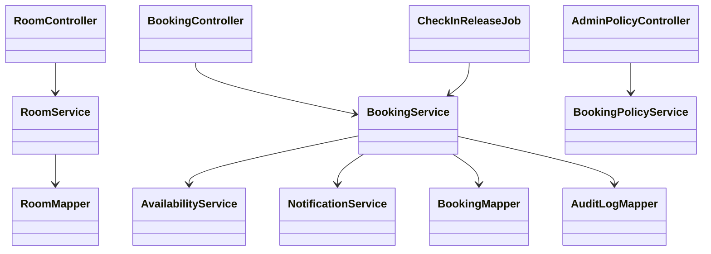
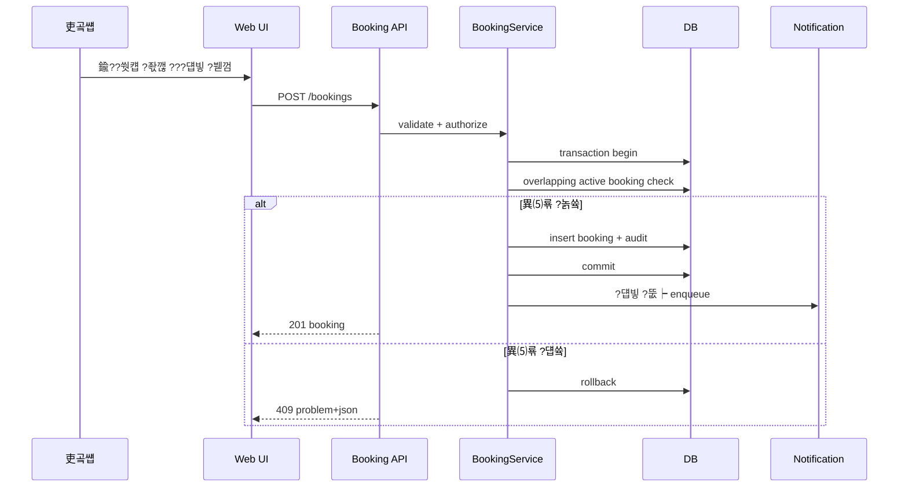
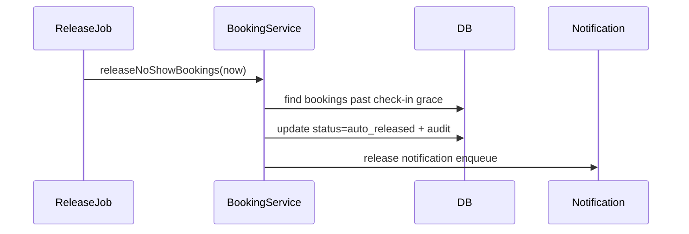
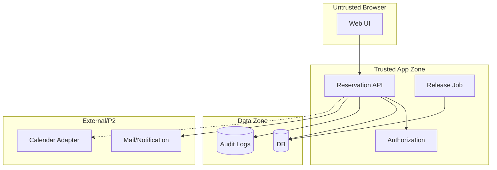
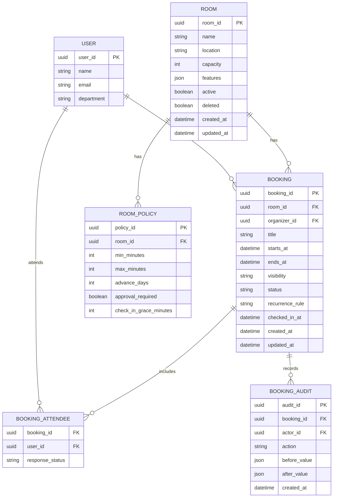

# Recon - ?щ궡 ?뚯쓽?????덉빟

議곗궗 湲곗??? 2026-07-09

## ?꾨찓???낅Т ?먮쫫

?뚯쓽???덉빟?€ 臾쇰━ 怨듦컙???쒓컙 ?⑥쐞濡?諛고? ?먯쑀?섎뒗 ?낅Т?? Microsoft 365???뚯쓽?ㅼ쓣 "room mailbox"濡?留뚮뱾??Outlook ?쇱젙?먯꽌 怨듭쑀 ?먯썝???덉빟?섍쾶 ?섍퀬, Google Workspace??嫄대Ъ, 湲곕뒫, ?뚯쓽??由ъ냼?ㅻ? 愿€由?肄섏넄?먯꽌 ?뺤쓽??Calendar?먯꽌 ?덉빟?섍쾶 ?쒕떎.

- Microsoft 365 room/equipment mailbox: https://learn.microsoft.com/en-us/microsoft-365/admin/manage/room-and-equipment-mailboxes
- Exchange room mailbox/resource mailbox: https://learn.microsoft.com/en-us/exchange/recipients/room-mailboxes
- Google Workspace buildings/features/calendar resources: https://knowledge.workspace.google.com/admin/calendar/create-buildings-features-and-calendar-resources
- Google resource calendar permissions: https://knowledge.workspace.google.com/admin/calendar/share-room-and-resource-calendars

?붿씠?몃낫??諛⑹떇?먯꽌 ?뱀쑝濡??꾪솚?????듭떖 蹂€?붾뒗 "?꾧? ?몄젣 ?대뼡 諛⑹쓣 ?곕뒗吏€"瑜???吏곸썝??媛숈? ?먯옣?쇰줈 ?뺤씤?섍퀬, 以묐났 ?덉빟???쒖뒪?쒖씠 ?먯쿇 李⑤떒?섎ʼn, 蹂€寃?痍⑥냼 ?대젰??媛먯궗 媛€?ν븯寃??④린??寃껋씠??

## ?댄빐愿€怨꾩옄

| ?댄빐愿€怨꾩옄 | 愿€?ъ궗 | ?ㅽ뙣 ???곹뼢 |
|---|---|---|
| ?쇰컲 吏곸썝 | 鍮??뚯쓽??鍮좊Ⅸ 寃€?? 利됱떆 ?덉빟, ???덉빟 蹂€寃?痍⑥냼 | ?뚯쓽 以€鍮?吏€?? 以묐났 ?ъ슜 異⑸룎 |
| ?€???덉빟??| 李몄꽍 ?몄썝怨??λ퉬 議곌굔??留욌뒗 諛??좏깮 | ??諛???퉬 ?먮뒗 ?λ퉬 遺€議?|
| 珥앸Т/愿€由ъ옄 | ?뚯쓽???깅줉, ?댁쁺 ?쒓컙, ?덉빟 ?뺤콉, ?댁슜瑜??뺤씤 | ?섍린 媛쒖엯 利앷?, ?뺤콉 吏묓뻾 ?ㅽ뙣 |
| IT/蹂댁븞 | ?몄쬆, 沅뚰븳, 濡쒓렇, 諛깆뾽, ?μ븷 蹂듦뎄 | 媛쒖씤?뺣낫/?낅Т?뺣낫 ?몄텧, 梨낆엫 異붿쟻 遺덇? |

## 洹쒖젣쨌?쒖?쨌蹂댁븞 怨좊젮

- 吏곸젒?곸씤 ?곗뾽 洹쒖젣?????留? ?덉빟 ?쒕ぉ/李몄꽍??遺€???뺣낫???낅Т??媛쒖씤?뺣낫 ?먮뒗 誘쇨컧???쇱젙 ?뺣낫媛€ ?????덈떎.
- 罹섎┛??由ъ냼??沅뚰븳?€ 理쒖냼??free/busy 以묒떖 怨듦컻瑜?湲곕낯媛믪쑝濡??붾떎. Google Workspace??由ъ냼??罹섎┛??沅뚰븳?먯꽌 free/busy?€ ?곸꽭 蹂닿린 沅뚰븳??援щ텇?쒕떎.
- API ?ㅻ쪟??RFC 9457 Problem JSON ?뺥깭瑜?梨꾪깮?섍퀬 ?대? 寃쎈줈/?ㅽ깮/SQL???몄텧?섏? ?딅뒗?? 洹쇨굅: https://www.rfc-editor.org/rfc/rfc9457
- REST API ?ㅺ퀎??Zalando RESTful API Guidelines??由ъ냼??以묒떖, 臾몄젣 ?곸꽭 ?묐떟, 沅뚰븳 ?ㅼ퐫???먯튃??李멸퀬?쒕떎. 洹쇨굅: https://opensource.zalando.com/restful-api-guidelines/

## ?좎궗 ?쒗뭹쨌?€??
| ?쒗뭹/?€??| 愿€李?湲곕뒫 | ?곸슜 ?먮떒 |
|---|---|---|
| Microsoft 365 room mailbox | 議곗쭅 怨꾩젙 湲곕컲 諛??덉빟, Outlook ?쇱젙怨?怨듭쑀 ?먯썝 ?듯빀 | ?대? Microsoft 365瑜??곕뒗 議곗쭅?대㈃ 2?④퀎 ?곕룞 ?꾨낫 |
| Google Workspace Calendar resources | 嫄대Ъ/湲곕뒫/?뚯쓽??由ъ냼???뺤쓽, free/busy 沅뚰븳 | Google Workspace ?ъ슜 議곗쭅?대㈃ 2?④퀎 ?곕룞 ?꾨낫 |
| Skedda | ?뚯쓽??怨듭쑀怨듦컙 ?덉빟, ?묎렐 ?쒖뼱, ?덉빟 荑쇳꽣, ?ъ쟾 ?덉빟 湲곌컙, ?뱀씤 ?뚰겕?뚮줈 | ?뺤콉 ?붿쭊 ?붽뎄?ы빆??醫뗭? 李몄“ |
| Envoy Rooms | 泥댄겕???뚮┝, ?묒? 諛??ъ슜 ?좊룄, ?댁슜瑜?李⑦듃 | ?몄눥/怨듦컙 ??퉬 ?€??湲곕뒫 李몄“ |
| Robin | 怨듦컙 ?덉빟, ?ㅼ떆媛??곗씠?? AI 湲곕컲 ?덉빟, ?щТ??吏€??遺꾩꽍 | ?뺤옣 ?④퀎??吏€??遺꾩꽍 李몄“ |

異쒖쿂:
- Skedda room booking: https://www.skedda.com/platform/meeting-room-booking-system
- Envoy conference room scheduling: https://envoy.com/products/conference-room-scheduling-software
- Robin workplace management: https://robinpowered.com/

## ?ㅽ깮 ?꾨낫

| ?꾨낫 | ?μ젏 | ?⑥젏 | fit |
|---|---|---|---|
| 湲곗〈 ?щ궡 ???ㅽ깮??紐⑤뱢 異붽? | ?몄쬆/沅뚰븳/諛고룷/諛깆뾽 ?ъ궗?? ?⑦봽?덈???媛€??| 湲곗〈 ?쒗뭹 踰붿쐞?€ 異⑸룎 媛€??| ?믪쓬 |
| Microsoft/Google 由ъ냼??罹섎┛?붾쭔 ?ъ슜 | 鍮좊Ⅸ ?꾩엯, ?듭닕??罹섎┛??UI | ?붿씠?몃낫???€泥댁슜 ?꾩옣 ?붾㈃/?뺤콉/遺꾩꽍 而ㅼ뒪?곕쭏?댁쭠 ?쒗븳 | 以묎컙 |
| ?꾨Ц SaaS 援щℓ | 湲곕뒫 ?띾?, ?댁쁺 遺€????쓬 | 鍮꾩슜, ?곗씠???꾩튂, ?щ궡 ?뺤콉 ?쒖빟 | 以묎컙 |

異붿쿇: MVP??湲곗〈 ?щ궡 ???ㅽ깮???낅┰ ?덉빟 ?먯옣??留뚮뱾怨? Microsoft/Google Calendar ?묐갑???숆린?붾뒗 P2濡??붾떎. ?댁쑀???낅젰 ?꾩씠?붿뼱媛€ "?뱀뿉???섍퀬 ?띕떎"?대ʼn ?꾩옱 ?섍린 ?댁쁺?대?濡? 珥덇린 ?깃났?€ 踰붿슜 罹섎┛???듯빀蹂대떎 以묐났 ?덉빟 李⑤떒怨??꾩궗 媛€?쒖꽦???덈떎.

---

# Blindspot Register - ?щ궡 ?뚯쓽?????덉빟

?ㅼ틪 踰붿쐞: 怨듯넻 10異?+ STRIDE 6踰붿＜ + P2 SaaS

## 怨듯넻 10異?
| 異???ぉ | ?곹깭 | 泥섎━ | 洹쇨굅쨌異쒖쿂 |
|---|---|---|---|
| 1. 湲곕뒫 踰붿쐞 | Assumed | MVP???뚯쓽??紐⑸줉/媛€???쒓컙 議고쉶/?덉빟/蹂€寃?痍⑥냼/愿€由ъ옄 ?뚯쓽??愿€由??대젰?쇰줈 ?쒗븳 | Seed, Microsoft/Google 由ъ냼???덉빟 紐⑤뜽 |
| 2. ?꾨찓???곗씠??紐⑤뜽 | Assumed | Room, Booking, BookingAttendee, BookingAudit, BookingPolicy瑜??듭떖 ?뷀떚?곕줈 梨꾪깮 | M365 room mailbox, Google Calendar resource |
| 3. UX ?먮쫫 | Assumed | 二쇨컙/?쇨컙 ?€?꾨씪??+ 議곌굔 ?꾪꽣 + 鍮좊Ⅸ ?덉빟 紐⑤떖 | ?붿씠?몃낫???€泥댁뿉???쒕늿??蹂대뒗 ?쒓컙?쒓? ?꾩슂 |
| 4. 鍮꾧린??紐⑺몴 | Assumed | ??湲??낅Т?쒓컙 湲곗? p95 議고쉶 800ms ?댄븯, ?덉빟 ?앹꽦 p95 1.5s ?댄븯, ??媛€?⑹꽦 99.5% | ?대? ?낅Т ?쒖뒪??珥덇린 SLO-lite |
| 5. ?듯빀/?몃? ?섏〈??| Assumed | MVP ?몃? 罹섎┛???곕룞 ?놁쓬, CSV ?대낫?닿린留??쒓났 | ?꾩엯 ?띾룄 ?곗꽑, ?곕룞?€ P2 |
| 6. ?ｌ?耳€?댁뒪/?ㅽ뙣 泥섎━ | Assumed | 以묐났 ?덉빟?€ DB ?쒖빟+?몃옖??뀡?쇰줈 李⑤떒, ?숈떆 ?붿껌?€ 409 諛섑솚 | ?덉빟 ?쒖뒪???듭떖 臾닿껐??|
| 7. ?쒖빟/?몃젅?대뱶?ㅽ봽 | Assumed | ?щ궡留??⑦봽?덈???諛고룷 媛€??援ъ“, ?⑥씪 議곗쭅/?ㅼ쨷 吏€???뺤옣 媛€??| ?ъ슜???낅젰怨??쇰컲 ?щ궡 ?꾧뎄 ?댁쁺 ?쒖빟 |
| 8. ?⑹뼱/?쇨???| Assumed | ?뚯쓽??Room, ?덉빟=Booking, ?덉빟??Organizer, 李몄꽍??Attendee | Microsoft/Google 由ъ냼??紐⑤뜽怨??쇱튂 |
| 9. ?꾨즺 ?좏샇 | Assumed | 以묐났 ?덉빟 0嫄? 愿€由ъ옄 ?섍린 議곗젙 ?놁씠 吏곸썝??吏곸젒 ?덉빟 ?꾨즺 | ?붿씠?몃낫???€泥??깃났議곌굔 |
| 10. 鍮꾩슜/?쇱씠?좎뒪 | Assumed | ?ㅽ뵂?뚯뒪/湲곗〈 ?щ궡 ?명봽???곗꽑, ?좊즺 SaaS ?섏〈 ?놁쓬 | ?⑦봽?덈???諛??먯뇙留?媛€?μ꽦 |

## P2 SaaS ??ぉ

| ??ぉ | ?곹깭 | 泥섎━ | 洹쇨굅쨌異쒖쿂 |
|---|---|---|---|
| ?뚮꼳??| Clear | ?⑥씪 ?щ궡 議곗쭅 湲곕낯, tenant_id??誘몃옒 ?뺤옣???꾪빐 ?좏깮 而щ읆?쇰줈留?寃€??| ?낅젰???щ궡 ?⑥씪 ?⑸룄 |
| ?몄쬆 | Assumed | ?щ궡 怨꾩젙 濡쒓렇???꾩닔, 愿€由ъ옄/?쇰컲 ?ъ슜??沅뚰븳 遺꾨━ | ?대? ?쇱젙 ?뺣낫 蹂댄샇 |
| 寃곗젣/援щ룆 | Clear | ?대떦 ?놁쓬 | ?щ궡 ?대? ?쒖뒪??|
| 諛깆뾽/DR | Assumed | ??1??DB 諛깆뾽, 遺꾧린 1??蹂듦뎄 由ы뿀??| ?낅Т ?덉빟 ?곗씠??蹂댁〈 |
| 媛쒖씤?뺣낫 | Assumed | ?덉빟??李몄꽍???뚯쓽 ?쒕ぉ 蹂닿?, ?쒕ぉ 怨듦컻 踰붿쐞 ?ㅼ젙 | Google resource 沅뚰븳??free/busy 援щ텇 |
| ?대찓???뚮┝ | Assumed | MVP???????뚮┝/釉뚮씪?곗? ?뚮┝ ?먮뒗 ?대찓???좏깮, ?ㅽ뙣 ?ъ떆??3??| ?덉빟 蹂€寃??몄? ?꾩슂 |

## STRIDE ?ㅼ틪

| ?먯궛/寃쎄퀎 | S | T | R | I | D | E | 泥섎━ |
|---|---|---|---|---|---|---|---|
| 濡쒓렇???ъ슜??-> ?덉빟 API | ?꾩“ ?몄뀡 媛€??| ?붿껌 ?뚮씪誘명꽣 蹂€議?| ?덉빟 遺€??| ?€???덉빟 ?곸꽭 ?몄텧 | 諛섎났 ?붿껌 ??＜ | role 蹂€議?| JWT/?몄뀡 寃€利? ?쒕쾭 沅뚰븳 寃€?? 媛먯궗 濡쒓렇, rate limit |
| ?덉빟 API -> DB | ?쒕퉬??怨꾩젙 ?ㅻ궓??| SQL/?곗씠??蹂€議?| 蹂€寃쎌옄 異붿쟻 ?ㅽ뙣 | DB ?ㅽ봽 ?몄텧 | ?좉툑 寃쏀빀 | 愿€由ъ옄 沅뚰븳 ?⑥슜 | ?뚮씪誘명꽣 諛붿씤?? ?몃옖??뀡, 理쒖냼 沅뚰븳, 諛깆뾽 ?뷀샇??|
| 愿€由ъ옄 UI -> ?뺤콉 愿€由?| 愿€由ъ옄 ?ъ묶 | ?댁쁺?쒓컙/沅뚰븳 ?뺤콉 蹂€議?| ?뺤콉 蹂€寃?遺€??| ?꾩껜 ?덉빟 ?곸꽭 ?몄텧 | ?섎せ???뺤콉?쇰줈 ?덉빟 遺덇? | ?쇰컲 ?ъ슜?먯쓽 愿€由ъ옄 API ?몄텧 | admin 沅뚰븳, audit log, 蹂€寃??꾪썑媛??€??|
| ?뚮┝ 諛쒖넚 | 諛쒖떊???꾩“ | ?뚮┝ ?댁슜 蹂€議?| 諛쒖넚 ?щ? 遺꾩웳 | ?뚯쓽紐??몄텧 | ?€???뚮┝ | ?뚮┝ API 沅뚰븳 ?곸듅 | ?뚮┝ 理쒖냼 ?뺣낫, ?ъ떆???쒗븳, 諛쒖넚 濡쒓렇 |

## 吏덈Ц 諛곗튂(?먮룞 梨꾪깮)

?ъ슜???붿껌???곕씪 吏덈Ц?섏? ?딄퀬 異붿쿇?덉쓣 ?먮룞 梨꾪깮?덈떎.

| 吏덈Ц ?꾨낫 | 異붿쿇 梨꾪깮 | ?댁쑀 | decision-log |
|---|---|---|---|
| ?몃? 罹섎┛???곕룞??MVP???ｌ쓣源? | ?꾨땲?? P2濡??붾떎 | ?붿씠?몃낫???€泥댁쓽 泥?媛€移섎뒗 以묐났 ?덉빟 李⑤떒怨?媛€?쒖꽦?대떎. M365/Google ?곕룞?€ 議곗쭅 ?섍꼍 ?섏〈?깆씠 ?щ떎. | DL-001 |
| ?뚯쓽 ?쒕ぉ????吏곸썝?먭쾶 怨듦컻?좉퉴? | 湲곕낯?€ free/busy, ?곸꽭???덉빟??李몄꽍??愿€由ъ옄留?| ?뚯쓽紐낆? ?낅Т??誘쇨컧?????덈떎. | DL-002 |
| ?덉빟 ?뱀씤 ?뚰겕?뚮줈媛€ ?꾩슂?쒓?? | ?쇰컲 ?뚯쓽?ㅼ? 利됱떆 ?덉빟, ?쒗븳 ?뚯쓽?ㅻ쭔 愿€由ъ옄 ?뱀씤 | ?섍린 ?붿씠?몃낫?쒕낫??鍮⑤씪???섎ʼn 怨좉?/?꾩썝 ?뚯쓽?ㅼ? ?듭젣媛€ ?꾩슂?섎떎. | DL-003 |
| ?몄눥 泥섎━??MVP?멸?? | 泥댄겕???먮룞 ?댁젣??P1???ы븿 | Envoy ???좎궗 ?쒗뭹??泥댄겕??怨듦컙 ??퉬 媛먯냼瑜??듭떖?쇰줈 ?쒓났?쒕떎. | DL-004 |
| 諛섎났 ?덉빟??MVP???ｌ쓣源? | 二쇨컙 諛섎났留?P1, 蹂듭옟??RRULE?€ P2 | ?ㅼ궗??鍮덈룄???믪?留?蹂듭옟?꾨? ?쒗븳?댁빞 ?쒕떎. | DL-005 |

## 諛섏쁺 湲곕줉

- DL-001?€ PRD 踰붿쐞 諛? API 怨꾩빟??externalCalendarSync瑜?P2濡?諛섏쁺.
- DL-002??PRD 媛쒖씤?뺣낫 ?붽뎄?ы빆, API ?묐떟 ?꾨뱶 留덉뒪?? STRIDE ?꾪솕梨낆뿉 諛섏쁺.
- DL-003?€ BookingPolicy?€ approvalStatus 紐⑤뜽??諛섏쁺.
- DL-004??check-in ?붾뱶?ъ씤?? ?먮룞 ?댁젣 諛곗튂, ?뚯뒪???ㅺ퀎??諛섏쁺.
- DL-005??recurrenceRule ?⑥닚 紐⑤뜽怨?P2 non-goal??諛섏쁺.

---

# PRD - ?щ궡 ?뚯쓽?????덉빟

## 諛곌꼍

?꾩옱 ?뚯쓽???덉빟?€ ?붿씠?몃낫?쒖뿉 ?섍린濡??곷뒗 諛⑹떇?대떎. ??諛⑹떇?€ ?먭꺽/?먮━ 諛??ъ슜?먭? 鍮?諛⑹쓣 ?뺤씤?섍린 ?대졄怨? 蹂€寃??대젰怨?以묐났 ?덉빟 ?듭젣媛€ ?녿떎. Microsoft 365?€ Google Workspace???뚯쓽?ㅼ쓣 怨듭쑀 由ъ냼?ㅻ줈 紐⑤뜽留곹빐 罹섎┛?붿뿉???덉빟?섍쾶 ?섎ʼn, Skedda/Envoy/Robin 媛숈? ?쒗뭹?€ ?뺤콉, 泥댄겕?? 怨듦컙 遺꾩꽍???쒓났?쒕떎.

## ?쒗뭹 紐⑺몴

1. 吏곸썝???뱀뿉??30珥??대궡??鍮??뚯쓽?ㅼ쓣 李얘퀬 ?덉빟?????덇쾶 ?쒕떎.
2. 媛숈? ?뚯쓽?ㅒ룹떆媛꾨???以묐났 ?덉빟???쒖뒪?쒖쟻?쇰줈 0嫄댁쑝濡?留뚮뱺??
3. 愿€由ъ옄 ?섍린 媛쒖엯 ?놁씠 ?뚯쓽?? ?덉빟 ?뺤콉, ?댁슜 ?꾪솴??愿€由ы븯寃??쒕떎.

## ?ъ슜???ㅽ넗由?
| ID | ?곗꽑?쒖쐞 | ?ㅽ넗由?| ?섏슜 ?뚯뒪??|
|---|---|---|---|
| US-001 | P1 | As a 吏곸썝, I want ?좎쭨/?쒓컙/?몄썝?쇰줈 鍮??뚯쓽?ㅼ쓣 寃€?? so that ?뚯쓽 ?μ냼瑜?鍮좊Ⅴ寃??〓뒗?? | 議곌굔 寃€??寃곌낵媛€ ?덉빟 媛€??遺덇? ?곹깭?€ ?④퍡 ?쒖떆?쒕떎. |
| US-002 | P1 | As a 吏곸썝, I want ?뚯쓽?ㅼ쓣 利됱떆 ?덉빟, so that ?붿씠?몃낫?쒖뿉 吏곸젒 ?곸? ?딅뒗?? | 以묐났???놁쑝硫??덉빟???앹꽦?섍퀬 ???덉빟 紐⑸줉???쒖떆?쒕떎. |
| US-003 | P1 | As a ?덉빟?? I want ???덉빟??蹂€寃?痍⑥냼, so that ?쇱젙 蹂€寃쎌쓣 諛섏쁺?쒕떎. | 沅뚰븳 ?덈뒗 ?덉빟?먮쭔 ?섏젙/痍⑥냼 媛€?ν븯硫??대젰???⑤뒗?? |
| US-004 | P1 | As a 愿€由ъ옄, I want ?뚯쓽???댁쁺?쒓컙/?덉빟 ?쒗븳??愿€由? so that 怨듦컙???쇨??섍쾶 ?댁쁺?쒕떎. | ?뺤콉 ?꾨컲 ?덉빟?€ ?앹꽦?섏? ?딅뒗?? |
| US-005 | P1 | As a 愿€由ъ옄, I want ?몄눥 ?덉빟???댁젣, so that ?ㅼ젣 ?ъ슜 媛€?ν븳 怨듦컙???뚯닔?쒕떎. | 泥댄겕??湲고븳??吏€?섎㈃ ?뺤콉???곕씪 ?먮룞 ?댁젣?쒕떎. |
| US-006 | P2 | As a 吏곸썝, I want ?뚯궗 罹섎┛?붿? ?숆린?? so that 媛쒖씤 ?쇱젙?먯꽌???덉빟??蹂몃떎. | Microsoft/Google 罹섎┛?붿? ?앹꽦/蹂€寃?痍⑥냼媛€ ?숆린?붾맂?? |

## ?붽뎄?ы빆 ??
| ID | ?붽뎄?ы빆 | ?곗꽑?쒖쐞 | 異쒖쿂 |
|---|---|---|---|
| FR-001 | ?쒖뒪?쒖? ?좎쭨, ?쒓컙, ?몄썝, ?λ퉬 議곌굔?쇰줈 ?덉빟 媛€?ν븳 ?뚯쓽?ㅼ쓣 議고쉶?댁빞 ?쒕떎. | P0 | US-001 |
| FR-002 | ?쒖뒪?쒖? 媛숈? ?뚯쓽?ㅼ뿉???쒓컙??寃뱀튂???쒖꽦 ?덉빟 ?앹꽦??嫄곕??댁빞 ?쒕떎. | P0 | US-002 |
| FR-003 | ?쒖뒪?쒖? 吏곸썝???뚯쓽 ?쒕ぉ, ?쒓컙, ?뚯쓽?? 李몄꽍?? 怨듦컻 踰붿쐞瑜??낅젰???덉빟???앹꽦?섍쾶 ?댁빞 ?쒕떎. | P0 | US-002 |
| FR-004 | ?쒖뒪?쒖? ?덉빟???먮뒗 愿€由ъ옄留??덉빟??蹂€寃?痍⑥냼?섍쾶 ?댁빞 ?쒕떎. | P0 | US-003 |
| FR-005 | ?쒖뒪?쒖? 紐⑤뱺 ?덉빟 ?앹꽦/蹂€寃?痍⑥냼/?먮룞?댁젣瑜?媛먯궗 ?대젰?쇰줈 ?④꺼???쒕떎. | P0 | US-003, 蹂댁븞 |
| FR-006 | ?쒖뒪?쒖? 愿€由ъ옄?먭쾶 ?뚯쓽??CRUD, ?댁쁺?쒓컙, 理쒖냼/理쒕? ?덉빟?쒓컙, ?ъ쟾 ?덉빟 媛€??湲곌컙 ?뺤콉???쒓났?댁빞 ?쒕떎. | P1 | US-004 |
| FR-007 | ?쒖뒪?쒖? ?쒗븳 ?뚯쓽?ㅼ뿉 ?뱀씤 ?꾩슂 ?뺤콉???곸슜?????덉뼱???쒕떎. | P1 | DL-003 |
| FR-008 | ?쒖뒪?쒖? ?뚯쓽 ?쒖옉 ?꾪썑 ?뺤콉 ?쒓컙 ??泥댄겕?몄쓣 吏€?먰븯怨?誘몄껜?ъ씤 ?덉빟???먮룞 ?댁젣?댁빞 ?쒕떎. | P1 | US-005, Envoy 李몄“ |
| FR-009 | ?쒖뒪?쒖? ?덉빟 ?곸꽭瑜?沅뚰븳???곕씪 free/busy ?먮뒗 ?곸꽭濡?留덉뒪?뱁빐???쒕떎. | P1 | DL-002 |
| FR-010 | ?쒖뒪?쒖? ?뚯쓽???댁슜瑜?CSV瑜?愿€由ъ옄?먭쾶 ?쒓났?댁빞 ?쒕떎. | P1 | 愿€由ъ옄 遺꾩꽍 |
| FR-011 | ?쒖뒪?쒖? Microsoft/Google Calendar ?묐갑???숆린?붾? 吏€?먰빐???쒕떎. | P2 | RECON |

## ?ｌ?耳€?댁뒪

1. Given ???ъ슜?먭? 媛숈? 諛??쒓컙???숈떆???덉빟???? When ???붿껌??嫄곗쓽 ?숈떆???꾩갑?섎㈃, Then ?섎굹留??깃났?섍퀬 ?ㅻⅨ ?섎굹??409 conflict瑜?諛쏅뒗??
2. Given ?덉빟?먭? ?꾨땶 ?ъ슜?먭? ?덉빟 蹂€寃쎌쓣 ?쒕룄???? When 蹂€寃?API瑜??몄텧?섎㈃, Then 403 forbidden怨?媛먯궗 濡쒓렇媛€ ?⑤뒗??
3. Given ?뚯쓽媛€ ?쒖옉?먯?留?泥댄겕?몄씠 ?놁쓣 ?? When 泥댄겕???좎삁 ?쒓컙??吏€?섎㈃, Then ?덉빟?€ auto_released媛€ ?섍퀬 諛⑹? ?ㅼ떆 ?덉빟 媛€?ν빐吏꾨떎.
4. Given ?뚯쓽 ?쒕ぉ 怨듦컻 踰붿쐞媛€ private???? When ?ㅻⅨ 吏곸썝???€?꾨씪?몄쓣 蹂대㈃, Then ?쒕ぉ/李몄꽍???€??"?덉빟??留??쒖떆?쒕떎.

## ?깃났 湲곗?

| ID | 湲곗? | 痢≪젙 諛⑸쾿 |
|---|---|---|
| SC-001 | ?뚯씪??2二??숈븞 ?쒖뒪?쒖긽 以묐났 ?덉빟 ?깃났 0嫄?| DB ?덉빟 寃뱀묠 寃€利?荑쇰━?€ 409 濡쒓렇 ?뺤씤 |
| SC-002 | 吏곸썝 5紐??ъ슜???뚯뒪?몄뿉??鍮??뚯쓽??寃€?????덉빟 ?꾨즺 以묒븰媛?30珥??댄븯 | 愿€李??뚯뒪??|
| SC-003 | ?덉빟 紐⑸줉 議고쉶 p95 800ms ?댄븯, ?덉빟 ?앹꽦 p95 1.5s ?댄븯 | API latency metric |
| SC-004 | 愿€由ъ옄 ?놁씠 吏곸썝??吏곸젒 ?앹꽦???덉빟 鍮꾩쑉 90% ?댁긽 | audit event 吏묎퀎 |
| SC-005 | 誘몄껜?ъ씤 ?먮룞 ?댁젣 ?€???덉빟??95%媛€ ?뺤콉 ?쒓컙+1遺??대궡 ?댁젣 | batch job metric |

## UI 諛⑺뼢

- 泥??붾㈃?€ ?ㅻ뒛/?대쾲 二??뚯쓽???€?꾨씪?몄씠??
- ?곷떒?먮뒗 ?좎쭨, ?쒓컙 踰붿쐞, ?몄썝, ?λ퉬 ?꾪꽣瑜??붾떎.
- ?뚯쓽???됯낵 ?쒓컙 ?댁? 怨좎젙 ?ш린 洹몃━?쒕줈 援ъ꽦???덉빟 釉붾줉???붾뱾由ъ? ?딄쾶 ?쒕떎.
- ?덉빟 ?곸꽭??沅뚰븳???곕씪 ?쒕ぉ/李몄꽍???먮뒗 "?덉빟??留??쒖떆?쒕떎.
- 紐⑤컮?쇱? "鍮?諛?李얘린" 以묒떖??由ъ뒪??酉곕? ?곗꽑 ?쒓났?쒕떎.

## 踰붿쐞 諛?
- 蹂듭옟??諛섎났 洹쒖튃(RRULE ?꾩껜), ?몃? 諛⑸Ц??異쒖엯 愿€由? 寃곗젣, 醫뚯꽍 ?덉빟, AI ?먮룞 諛곗젙, ?ㅼ쨷 ?뚯궗 ?뚮꼳?쒕뒗 MVP 踰붿쐞 諛뽰씠??
- Microsoft/Google Calendar ?묐갑???숆린?붾뒗 P2濡??붾떎.

## 媛€??紐⑸줉

- ?⑥씪 ?щ궡 議곗쭅 ?쒕퉬?ㅻ줈 ?쒖옉?쒕떎.
- ?щ궡 怨꾩젙 濡쒓렇?몄? ?대? ?덇굅??MVP?먯꽌 ?대찓??鍮꾨?踰덊샇濡??쒓났?쒕떎.
- ?뚯쓽 ?쒕ぉ?€ 湲곕낯 鍮꾧났媛쒖씠硫? ?덉빟?먮뒗 怨듦컻/鍮꾧났媛쒕? ?좏깮?????덈떎.
- ?쇰컲 ?뚯쓽?ㅼ? 利됱떆 ?덉빟, ?쒗븳 ?뚯쓽?ㅻ쭔 ?뱀씤 ?뚰겕?뚮줈瑜??ъ슜?쒕떎.

---

# Architecture - ?щ궡 ?뚯쓽?????덉빟

## Context & Scope

??釉뚮씪?곗??먯꽌 吏곸썝怨?愿€由ъ옄媛€ ?뚯쓽???덉빟 ?먯옣???ъ슜?쒕떎. MVP???낅┰ ?덉빟 ?먯옣??湲곗??쇰줈 ?섎ʼn ?몃? 罹섎┛???숆린?붾뒗 P2 ?대뙌?곕줈 遺꾨━?쒕떎.

## Goals / Non-goals

- Goals: 以묐났 ?덉빟 李⑤떒, 沅뚰븳 湲곕컲 ?곸꽭 留덉뒪?? 媛먯궗 濡쒓렇, 泥댄겕???먮룞 ?댁젣, 愿€由ъ옄 ?뺤콉 愿€由?
- Non-goals: ?몃? 罹섎┛???숆린?붿쓽 利됱떆 援ы쁽, 醫뚯꽍 ?덉빟, 諛⑸Ц??愿€由? AI 異붿쿇.

## ?쒖뒪??而⑦뀓?ㅽ듃

```mermaid
flowchart LR
  Employee[吏곸썝 釉뚮씪?곗?] --> Web[?덉빟 ????
  Admin[愿€由ъ옄 釉뚮씪?곗?] --> Web
  Web --> API[Reservation API]
  API --> Auth[Auth/沅뚰븳 ?쒕퉬??
  API --> DB[(Reservation DB)]
  API --> Notify[?뚮┝ ?쒕퉬??
  API --> Job[?먮룞 ?댁젣 諛곗튂]
  API -. P2 .-> Calendar[Microsoft/Google Calendar Adapter]
```

## 援ы쁽 ?묎렐

- Frontend: ?뚯쓽???€?꾨씪?? 鍮?諛?寃€?? ?덉빟 紐⑤떖, ???덉빟, 愿€由ъ옄 ?ㅼ젙.
- Backend: Controller -> Service -> Repository/Mapper 援ъ“. ?덉빟 ?앹꽦?€ Service ?몃옖??뀡?먯꽌 異⑸룎 寃€?ъ? insert瑜????⑥쐞濡?泥섎━?쒕떎.
- DB: ?쒖꽦 ?덉빟???쒓컙 寃뱀묠???좏뵆由ъ??댁뀡 ?몃옖??뀡 + DB exclusion/locking ?꾨왂?쇰줈 諛⑹??쒕떎. PostgreSQL?€ range constraint ?꾨낫, MSSQL?€ serializable transaction ?먮뒗 key-range lock ?꾨낫.
- Job: 泥댄겕???좎삁 ?쒓컙??吏€???덉빟??二쇨린?곸쑝濡?auto_released ?곹깭濡??꾪솚?쒕떎.
- Notification: ?덉빟 ?앹꽦/蹂€寃?痍⑥냼/?먮룞?댁젣 ?뚮┝??鍮꾨룞湲곕줈 諛쒖넚?쒕떎.

## 而댄룷?뚰듃 援ъ“



## ?곗씠???먮쫫

### ?덉빟 ?앹꽦



### ?먮룞 ?댁젣



## ?곗씠???€???ㅺ퀎 寃곗젙

- `booking.status`: pending_approval, confirmed, checked_in, cancelled, auto_released, rejected.
- ?쒓컙?€ UTC ?€?? UI??議곗쭅 ?쒓컙?€(湲곕낯 Asia/Seoul)濡??쒖떆?쒕떎.
- ?덉빟 蹂€寃쎌? ?꾩옱 row ?낅뜲?댄듃?€ audit append瑜?蹂묓뻾?쒕떎. 踰뺤쟻 遺덈? 湲곕줉?€ ?꾨땲誘€濡?revision ?뚯씠釉붿? P2濡??붾떎.
- ??젣???뚯쓽???뺤콉?먮뒗 soft delete, ?덉빟?€ ?곹깭 ?꾩씠濡?泥섎━?쒕떎.

## 寃€?좏븳 ?€??
| ?€??| ?먮떒 |
|---|---|
| Google/Microsoft Calendar留??ъ슜 | 鍮좊Ⅴ吏€留??щ궡 ?뺤콉/?몄눥/遺꾩꽍/?꾩옣 ?€?꾨씪??而ㅼ뒪?곕쭏?댁쭠???쒗븳?쒕떎. |
| ?꾨Ц SaaS 援щℓ | 湲곕뒫?€ ?띾??섏?留??⑦봽?덈????먯뇙留?鍮꾩슜 ?쒖빟??痍⑥빟?섎떎. |
| ?낅┰ ?덉빟 ?먯옣 ??罹섎┛???곕룞 | MVP ?듭젣?μ씠 ?믨퀬 ?ν썑 ?뺤옣 媛€?ν븯誘€濡?梨꾪깮?쒕떎. |

## Threat Modeling

### 臾댁뾿??留뚮뱶?붽?



### STRIDE

| 寃쎄퀎 | S | T | R | I | D | E |
|---|---|---|---|---|---|---|
| Browser -> API | ?몄뀡 ?덉랬 | bookingId/roomId 蹂€議?| ?덉빟 蹂€寃?遺€??| ?€???곸꽭 議고쉶 | 諛섎났 議고쉶/?앹꽦 | admin API ?몄텧 |
| API -> DB | ?쒕퉬??怨꾩젙 ?⑥슜 | SQL 蹂€議?| DB 蹂€寃쎌옄 遺덈챸 | DB 吏곸젒 ?몄텧 | ?좉툑/?먮┛ 荑쇰━ | DB 沅뚰븳 怨쇰떎 |
| API -> Notification | 諛쒖떊???꾩“ | ?뚮┝ ?댁슜 蹂€議?| 諛쒖넚 遺€??| ?뚯쓽 ?쒕ぉ ?몄텧 | ?뚮┝ ??＜ | ?뚮┝ ?쒗뵆由?沅뚰븳 ?곸듅 |

### ?꾪솕梨?
- Mitigate: ?몄쬆 ?꾩닔, CSRF ?먮뒗 SameSite 荑좏궎/JWT ?뺤콉, ?쒕쾭 沅뚰븳 寃€?? rate limit, audit log, Problem JSON ?ㅻ쪟.
- Mitigate: 紐⑤뱺 SQL ?뚮씪誘명꽣 諛붿씤?? ?덉빟 ?앹꽦 ?몃옖??뀡, DB 理쒖냼 沅뚰븳.
- Mitigate: 沅뚰븳蹂??곸꽭 留덉뒪?? private 湲곕낯媛? ?뚮┝?먮뒗 理쒖냼 ?뺣낫留??ы븿.
- Accept: ?щ궡留??μ븷 ???ㅽ봽?쇱씤 ?덉빟?€ 吏€?먰븯吏€ ?딅뒗?? ?μ븷 以??덉빟?€ 以묐떒?섍퀬 蹂듦뎄 ???ъ떆?꾪븳??

## ?곸쐞 由ъ뒪??
1. ?숈떆 ?덉빟 異⑸룎 諛⑹?媛€ DB蹂꾨줈 ?ㅻⅤ寃?援ы쁽?????덈떎. ?꾪솕: MSSQL/PostgreSQL 媛곴컖 ?듯빀 ?뚯뒪??
2. ?뚯쓽 ?쒕ぉ/李몄꽍???몄텧??媛쒖씤?뺣낫 ?댁뒋媛€ ?????덈떎. ?꾪솕: free/busy 湲곕낯媛믨낵 沅뚰븳蹂??꾨뱶 留덉뒪??
3. 泥댄겕???먮룞 ?댁젣媛€ ?ㅼ젣 ?뚯쓽 以묒씤 諛⑹쓣 ?€ ???덈떎. ?꾪솕: 泥댄겕???좎삁 ?쒓컙, 愿€由ъ옄 蹂듦뎄, ?뚮┝ ???댁젣.

---

# API Contract & Data Schema - ?щ궡 ?뚯쓽?????덉빟

## 洹쒖빟

- Base path: `/api/meeting-rooms`
- ?몄쬆: ?щ궡 濡쒓렇???몄뀡 ?먮뒗 Bearer JWT.
- ?ㅻ쪟 ?щ㎎: RFC 9457 Problem JSON (`type`, `title`, `status`, `detail`, `instance`, `code`).
- ?섏씠吏€?ㅼ씠?? cursor ?곗꽑. 愿€由ъ옄 CSV??蹂꾨룄 export endpoint.
- 硫깅벑?? `POST /bookings`??`Idempotency-Key` ?ㅻ뜑瑜?吏€?먰븯怨?4?쒓컙 ?숈븞 理쒖큹 ?묐떟???ъ궗?⑺븳??
- ?쒓컙: ?붿껌/?묐떟?€ ISO 8601 UTC. UI ?쒖떆 ?쒓컙?€???ъ슜??議곗쭅 ?ㅼ젙.
- 沅뚰븳 ?ㅼ퐫?? `meeting-room:read`, `meeting-room:book`, `meeting-room:admin`, `meeting-room:audit`.

## ?붾뱶?ъ씤??
| ID | 硫붿꽌??寃쎈줈 | ?붿껌 | ?묐떟 | 二쇱슂 ?ㅻ쪟 | 沅뚰븳 |
|---|---|---|---|---|---|
| EP-001 | GET `/rooms` | `capacityMin`, `features`, `activeOnly` | room list | 401, 403 | read |
| EP-002 | POST `/rooms` | name, location, capacity, features, operatingHours, policies | room | 400, 409 | admin |
| EP-003 | PATCH `/rooms/{roomId}` | 蹂€寃??꾨뱶 | room | 400, 404, 409 | admin |
| EP-004 | GET `/availability` | dateFrom, dateTo, capacityMin, features | room availability blocks | 400 | read |
| EP-005 | GET `/bookings` | dateFrom, dateTo, roomId, mine | booking list(masked) | 400 | read |
| EP-006 | POST `/bookings` | roomId, title, startsAt, endsAt, attendees, visibility, recurrence | booking | 400, 403, 409 | book |
| EP-007 | PATCH `/bookings/{bookingId}` | mutable fields | booking | 400, 403, 404, 409 | organizer/admin |
| EP-008 | POST `/bookings/{bookingId}/cancel` | reason | booking | 403, 404, 409 | organizer/admin |
| EP-009 | POST `/bookings/{bookingId}/check-in` | optional device/location | booking | 403, 404, 409 | organizer/attendee/admin |
| EP-010 | GET `/admin/audit-events` | dateFrom, dateTo, actorId, bookingId | audit list | 403 | audit/admin |
| EP-011 | GET `/admin/utilization.csv` | dateFrom, dateTo | CSV | 403 | admin |

## OpenAPI sketch

```yaml
openapi: 3.1.0
info:
  title: Meeting Room Booking API
  version: 0.1.0
paths:
  /api/meeting-rooms/bookings:
    post:
      operationId: createBooking
      parameters:
        - name: Idempotency-Key
          in: header
          schema: { type: string, maxLength: 128 }
      requestBody:
        required: true
        content:
          application/json:
            schema:
              $ref: '#/components/schemas/CreateBookingRequest'
      responses:
        '201':
          description: Created
        '409':
          description: Booking conflict
          content:
            application/problem+json:
              schema:
                $ref: '#/components/schemas/Problem'
components:
  schemas:
    CreateBookingRequest:
      type: object
      required: [roomId, title, startsAt, endsAt, visibility]
      properties:
        roomId: { type: string, format: uuid }
        title: { type: string, minLength: 1, maxLength: 120 }
        startsAt: { type: string, format: date-time }
        endsAt: { type: string, format: date-time }
        visibility: { type: string, enum: [private, organization] }
        attendees:
          type: array
          items: { type: string, format: uuid }
    Problem:
      type: object
      required: [type, title, status]
```

## ERD



## ?곗씠??洹쒖튃

- ?덉빟 ?쒓컙?€ `starts_at < ends_at`?댁뼱???쒕떎.
- ?쒖꽦 ?덉빟 ?곹깭??`pending_approval`, `confirmed`, `checked_in`?대떎. ???곹깭?쇰━??媛숈? room/time overlap???덉슜?섏? ?딅뒗??
- ?뚯쓽????젣??soft delete?대ʼn, 怨쇨굅 ?덉빟?€ 蹂댁〈?쒕떎.
- ?덉빟 痍⑥냼/?먮룞?댁젣??row ??젣媛€ ?꾨땲???곹깭 ?꾩씠??
- CSV export??Excel formula injection 諛⑹?瑜??꾪빐 `=`, `+`, `-`, `@` ?쒖옉 ?€???댁뒪耳€?댄봽?쒕떎.

## 而ㅻ쾭由ъ? 留ㅽ븨

| FR-ID | ?붾뱶?ъ씤???대깽??|
|---|---|
| FR-001 | EP-001, EP-004 |
| FR-002 | EP-006, DB overlap constraint/transaction |
| FR-003 | EP-006 |
| FR-004 | EP-007, EP-008 |
| FR-005 | BOOKING_AUDIT, EP-010 |
| FR-006 | EP-002, EP-003 |
| FR-007 | ROOM_POLICY.approval_required, booking.status |
| FR-008 | EP-009, CheckInReleaseJob |
| FR-009 | EP-005 response masking |
| FR-010 | EP-011 |
| FR-011 | P2 Calendar Adapter events |

P0/P1 ?붽뎄?ы빆 而ㅻ쾭由ъ? ?꾨씫: 0嫄?

---

# Test Design - ?щ궡 ?뚯쓽?????덉빟

## ?먯튃

- 媛??섏슜 湲곗??€ 援ы쁽 ?꾩뿉 ?ㅽ뙣?섎뒗 ?뚯뒪?몃줈 癒쇱? ?묒꽦?쒕떎.
- ?섏쐞 怨꾩링?먯꽌 寃€利?媛€?ν븳 議곌굔?€ ?곸쐞 E2E?먯꽌 諛섎났 寃€利앺븯吏€ ?딅뒗??
- ?덉빟 異⑸룎, 沅뚰븳, 留덉뒪?? ?곹깭 ?꾩씠???뚭? ?꾪뿕???믪쑝誘€濡?unit/integration/E2E瑜?紐⑤몢 ?붾떎.

## ?섏슜 湲곗? ?쒕굹由ъ삤 蹂€??
| SC/FR ID | Gherkin ?쒕굹由ъ삤 | ?덉씠??| ?곗씠??紐⑥쓽 |
|---|---|---|---|
| FR-001 | Given 6?몄떎 A?€ 12?몄떎 B媛€ ?덇퀬 B留??꾨줈?앺꽣媛€ ?덉쓣 ?? When ?ъ슜?먭? 8紐??꾨줈?앺꽣 議곌굔?쇰줈 議고쉶?섎㈃, Then B留??덉빟 媛€???꾨낫濡??쒖떆?쒕떎. | integration, E2E | room fixture |
| FR-002 | Given ?뚯쓽??A??10:00-11:00 ?덉빟???덉쓣 ?? When ?ㅻⅨ ?ъ슜?먭? 10:30-11:30 ?덉빟???앹꽦?섎㈃, Then 409 conflict媛€ 諛섑솚?쒕떎. | integration | DB |
| FR-002 | Given ???ъ슜?먭? 媛숈? ?쒓컙??鍮??뚯쓽?ㅼ쓣 ?숈떆???덉빟???? When ?붿껌???숈떆??泥섎━?섎㈃, Then ?섎굹留?201?닿퀬 ?섎굹??409?대떎. | integration | DB concurrency |
| FR-003 | Given 濡쒓렇?명븳 吏곸썝???좏슚???덉빟 ?뺣낫瑜??낅젰???? When ?덉빟???앹꽦?섎㈃, Then ?덉빟 ?곹깭??confirmed?닿퀬 媛먯궗 濡쒓렇媛€ ?앹꽦?쒕떎. | unit, integration | auth stub |
| FR-004 | Given ?덉빟?먭? ?꾨땶 吏곸썝???덉빟 蹂€寃쎌쓣 ?쒕룄???? When PATCH瑜??몄텧?섎㈃, Then 403??諛섑솚?섍퀬 ?덉빟?€ 蹂€寃쎈릺吏€ ?딅뒗?? | integration, E2E | auth stub |
| FR-005 | Given ?덉빟???앹꽦/蹂€寃?痍⑥냼???? Then 媛?action??before/after audit event媛€ 湲곕줉?쒕떎. | integration | DB |
| FR-006 | Given 愿€由ъ옄媛€ 理쒕? ?덉빟?쒓컙 2?쒓컙 ?뺤콉???ㅼ젙?덉쓣 ?? When 吏곸썝??3?쒓컙 ?덉빟???붿껌?섎㈃, Then 400 policy violation??諛섑솚?쒕떎. | unit, integration | policy fixture |
| FR-007 | Given approval_required ?뚯쓽?ㅼ씪 ?? When 吏곸썝???덉빟???앹꽦?섎㈃, Then status??pending_approval?대떎. | integration | room policy |
| FR-008 | Given 泥댄겕???좎삁?쒓컙??吏€??confirmed ?덉빟???덉쓣 ?? When release job???ㅽ뻾?섎㈃, Then status??auto_released媛€ ?쒕떎. | unit, integration | clock fake |
| FR-009 | Given private ?덉빟???덉쓣 ?? When 李몄꽍?먭? ?꾨땶 ?ъ슜?먭? 紐⑸줉??議고쉶?섎㈃, Then ?쒕ぉ怨?李몄꽍?먮뒗 ?④? 泥섎━?쒕떎. | integration, E2E | auth stub |
| FR-010 | Given ?????덉빟 ?곗씠?곌? ?덉쓣 ?? When 愿€由ъ옄媛€ CSV瑜??대낫?대㈃, Then ?댁슜瑜?而щ읆怨?formula injection ?댁뒪耳€?댄봽媛€ 寃€利앸맂?? | integration | CSV parser |
| SC-002 | Given ?뚯씪???ъ슜?먯뿉寃??뚯뒪??怨꾩젙???덉쓣 ?? When 鍮?諛?寃€?????덉빟???꾨즺?섎㈃, Then 以묒븰媛?30珥??댄븯?대떎. | usability smoke | stopwatch |

## 怨꾩빟 ?뚯뒪??
- 紐⑤뱺 ?붾뱶?ъ씤?몃뒗 OpenAPI schema validation???듦낵?댁빞 ?쒕떎.
- 400/403/404/409/500 ?ㅻ쪟??`application/problem+json` ?ㅽ궎留덈? ?곕Ⅸ??
- `POST /bookings`??媛숈? `Idempotency-Key` ?ъ떆?????숈씪 ?묐떟??諛섑솚?쒕떎.
- ?덉빟 紐⑸줉?€ 沅뚰븳???곕씪 masked/unmasked ?묐떟 snapshot??鍮꾧탳?쒕떎.

## E2E ?꾨낫

1. 吏곸썝: ?ㅻ뒛 鍮??뚯쓽??李얘린 -> ?덉빟 ?앹꽦 -> ???덉빟?먯꽌 ?뺤씤 -> 痍⑥냼.
2. ?숈떆??異⑸룎: ?대? ?덉빟???щ’???ㅻⅨ ?ъ슜?먮줈 ?대엺 ???덉빟 ?쒕룄 -> 409/?붾㈃ ?ㅻ쪟 硫붿떆吏€.
3. 愿€由ъ옄: ?뚯쓽???앹꽦 -> ?뺤콉 ?ㅼ젙 -> ?뺤콉 ?꾨컲 ?덉빟 李⑤떒 -> ?댁슜瑜?CSV ?ㅼ슫濡쒕뱶.

## 由ъ뒪??湲곕컲 而ㅻ쾭由ъ? 紐⑺몴

| 由ъ뒪??| ?뚯뒪??紐⑺몴 |
|---|---|
| 以묐났 ?덉빟 | DB蹂??듯빀 ?뚯뒪??100%, ?숈떆 ?붿껌 ?뚯뒪???ы븿 |
| 沅뚰븳 ?고쉶 | ?덉빟 ?섏젙/痍⑥냼/愿€由ъ옄 API 403 耳€?댁뒪 ?꾨? ?ы븿 |
| ?곸꽭 ?뺣낫 ?몄텧 | masked response snapshot怨?E2E ?쒖떆 寃€利?|
| ?먮룞 ?댁젣 ?ㅼ옉??| clock fake 湲곕컲 ?곹깭 ?꾩씠 ?뚯뒪?? ?섎룞 蹂듦뎄 ?뚯뒪??|
| CSV 二쇱엯 | export cell prefix ?댁뒪耳€?댄봽 unit/integration ?뚯뒪??|

?깃났 湲곗?怨?P0/P1 FR ?쒕굹由ъ삤 ?꾨씫: 0嫄?

---

# Ops Design - ?щ궡 ?뚯쓽?????덉빟

## 諛고룷

- 諛고룷 ?뺥깭: ?щ궡 ?쒕쾭 ?먮뒗 而⑦뀒?대꼫 諛고룷. ?먯뇙留앹뿉?쒕룄 ?숈옉?섎룄濡??몃? CDN/?몃? API ?섏〈??MVP?먯꽌 ?쒓굅?쒕떎.
- CI/CD ?④퀎: lint -> unit test -> integration test -> build -> contract test -> deploy -> smoke.
- ?ㅼ젙/鍮꾨?: DB URL, JWT/?몄뀡 secret, SMTP ?뺣낫???섍꼍 蹂€???먮뒗 ?щ궡 secret store?먯꽌 二쇱엯?쒕떎.
- 留덉씠洹몃젅?댁뀡: room/booking/policy/audit ?뚯씠釉붿? backward-compatible DDL遺€???곸슜?섍퀬, 諛고룷 ??feature flag濡?硫붾돱瑜??몄텧?쒕떎.

## 愿€痢≪꽦

### SLI/SLO-lite

| SLI | SLO |
|---|---|
| ?덉빟 紐⑸줉 議고쉶 ?깃났瑜?| ?낅Т?쒓컙 ?붽컙 99.5% ?댁긽 |
| ?덉빟 ?앹꽦 ?깃났 ?붿껌 p95 latency | 1.5珥??댄븯 |
| 媛€?⑹꽦 議고쉶 p95 latency | 800ms ?댄븯 |
| ?먮룞 ?댁젣 吏€??| ?€???덉빟 95%媛€ ?뺤콉 ?쒓컙+1遺??대궡 泥섎━ |
| 以묐났 ?덉빟 ?깃났 嫄댁닔 | 0嫄?|

### 4 Golden Signals

| Signal | 痢≪젙 |
|---|---|
| Latency | `/availability`, `/bookings` ?앹꽦/?섏젙/議고쉶 p50/p95/p99 |
| Traffic | 遺꾨떦 API ?붿껌 ?? ?덉빟 ?앹꽦 ?? 議고쉶 ??|
| Errors | 4xx/5xx, 409 conflict, policy violation, notification failure |
| Saturation | DB connection pool, slow query count, release job queue lag |

### 濡쒓렇

- ?좏뵆由ъ??댁뀡 濡쒓렇: ?붿껌 ID, actorId, endpoint, status, latency, error code.
- 媛먯궗 濡쒓렇: ?덉빟 ?앹꽦/蹂€寃?痍⑥냼/泥댄겕???먮룞?댁젣/?뺤콉 蹂€寃??꾪썑媛?
- 蹂댁븞 濡쒓렇: ?몄쬆 ?ㅽ뙣, 沅뚰븳 ?녿뒗 愿€由ъ옄 API ?묎렐, rate limit.
- 媛쒖씤?뺣낫 留덉뒪?? ?쒕ぉ/李몄꽍???대찓?쇱? ?쇰컲 濡쒓렇???④린吏€ ?딄퀬 audit?먮뒗 沅뚰븳 ?덈뒗 ?€?μ냼?먮쭔 蹂닿??쒕떎.
- 蹂닿?: ?쇰컲 濡쒓렇 30?? 媛먯궗 濡쒓렇 1??議곗쭅 ?뺤콉???곕씪 議곗젙), 諛깆뾽 ?뷀샇??

## ?뚮┝

| ?뚮┝ | 議곌굔 | ?ш컖??| ?섏떊??| ?곌껐 ?덉감 |
|---|---|---|---|---|
| ?덉빟 ?앹꽦 5xx 利앷? | 5遺꾧컙 5xx 鍮꾩쑉 2% 珥덇낵 | High | IT ?댁쁺 | API 濡쒓렇?€ DB ?곹깭 ?뺤씤 |
| 以묐났 ?덉빟 寃€利??ㅽ뙣 | DB 寃€利?荑쇰━?먯꽌 overlap 諛쒓껄 | Critical | IT+珥앸Т | ?덉빟 ?숆껐, 異⑸룎 ?덉빟 ?섎룞 議곗젙 |
| ?먮룞 ?댁젣 job 吏€??| lag 5遺?珥덇낵 | Medium | IT ?댁쁺 | job ?ъ떆?? ?ㅽ뙣 ?덉빟 ?ъ쿂由?|
| 諛깆뾽 ?ㅽ뙣 | ?쇱씪 諛깆뾽 ?ㅽ뙣 | High | IT ?댁쁺 | ?섎룞 諛깆뾽 ?ㅽ뻾, ?먯씤 ?뺤씤 |
| ?뚮┝ 諛쒖넚 ?ㅽ뙣 | 10遺꾧컙 ?ㅽ뙣 20嫄?珥덇낵 | Low | IT ?댁쁺 | SMTP/?뚮┝ ???뺤씤 |

## 諛깆뾽쨌蹂듦뎄

- 諛깆뾽: DB ?꾩껜 ??1?? ?몃옖??뀡 濡쒓렇 ?먮뒗 利앸텇 諛깆뾽?€ ?댁쁺 以묒슂?꾩뿉 ?곕씪 15遺?1?쒓컙.
- 蹂듦뎄 由ы뿀?? 遺꾧린 1??staging?먯꽌 諛깆뾽 蹂듭썝 寃€利?
- RPO: 1?쒓컙 ?댄븯. RTO: 4?쒓컙 ?댄븯.

| ?μ븷 | 媛먯? 諛⑸쾿 | ?곹뼢 | 蹂듦뎄 ?덉감 | RTO/RPO |
|---|---|---|---|---|
| DB ?μ븷 | health check, DB connection error | ?덉빟/議고쉶 以묐떒 | standby ?먮뒗 諛깆뾽 蹂듭썝, ???ш린??| RTO 4h / RPO 1h |
| ?섎せ???뺤콉 諛고룷 | ?덉빟 ?ㅽ뙣 湲됱쬆, audit diff | ?좉퇋 ?덉빟 李⑤떒 | ?뺤콉 rollback, ?ㅽ뙣 ?덉빟 ?ъ떆???덈궡 | RTO 1h |
| ?먮룞 ?댁젣 ?ㅼ옉??| auto_released 湲됱쬆 | ?ㅼ젣 ?뚯쓽 ?덉빟 ?댁젣 | job 以묒?, audit 湲곗? ?곹깭 蹂듦뎄, ?ъ슜??怨듭? | RTO 1h |
| ?뚮┝ ?μ븷 | notification failure metric | ?덉빟 蹂€寃??몄? 吏€??| ???ъ쿂由? ?????뚮┝?쇰줈 ?€泥?| RTO 4h |
| ?좏뵆由ъ??댁뀡 諛고룷 ?ㅽ뙣 | smoke test ?ㅽ뙣 | ?쒕퉬???묎렐 遺덇? | ?댁쟾 踰꾩쟾 rollback | RTO 30m |

## ?댁쁺 ?먭?

- ?쇱씪: ?먮윭?? conflict?? ?먮룞 ?댁젣 嫄댁닔, 諛깆뾽 ?깃났 ?щ? ?뺤씤.
- 二쇨컙: ?뚯쓽???댁슜瑜? ?몄눥?? ?뺤콉 ?꾨컲 ?덉빟 ?쒕룄 寃€??
- ?붽컙: 愿€由ъ옄/沅뚰븳 怨꾩젙 由щ럭, 媛먯궗 濡쒓렇 ?섑뵆 寃€??

---

# Readiness Report - ?щ궡 ?뚯쓽?????덉빟

?먯젙: PASS

## 寃€??寃곌낵

| ?ш컖??| 諛쒓껄 | 臾몄꽌/?뱀뀡 | 議곗튂 |
|---|---|---|---|
| Medium | ?몃? 罹섎┛???곕룞???녿뒗 MVP???쇰? 議곗쭅?먯꽌 ?댁쨷 ?낅젰 遺덈쭔???앷만 ???덈떎. | 03 PRD 踰붿쐞 諛? 01 RECON | P2濡?紐낆떆?덇퀬, 珥덇린 ?깃났 湲곗??€ ?붿씠?몃낫???€泥대줈 ?쒗븳?덈떎. |
| Medium | MSSQL/PostgreSQL???쒓컙 寃뱀묠 ?쒖빟 援ы쁽 諛⑹떇???ㅻⅤ?? | 04 Architecture, 06 Test | DB蹂??듯빀 ?뚯뒪?몄? ?몃옖??뀡 ?꾨왂 寃€利앹쓣 ?뚯뒪???ㅺ퀎??諛섏쁺?덈떎. |
| Low | 泥댄겕???먮룞 ?댁젣媛€ ?ㅼ젣 ?ъ슜 以묒씤 ?뚯쓽瑜??€ ???덈떎. | 03 PRD, 07 Ops | ?좎삁 ?쒓컙, ?뚮┝, 愿€由ъ옄 蹂듦뎄, ?ㅼ옉???뚮┝??諛섏쁺?덈떎. |

## 而ㅻ쾭由ъ? 媛먯궗

- P0/P1 FR -> API endpoint 留ㅽ븨 ?꾨씫: 0嫄?
- SC -> ?뚯뒪???쒕굹由ъ삤 留ㅽ븨 ?꾨씫: 0嫄?
- STRIDE 6踰붿＜ 寃€???꾨씫: 0嫄?
- 吏덈Ц ?꾨낫 誘몄쿂由???ぉ: 0嫄? 紐⑤몢 ?먮룞 梨꾪깮 諛?decision-log ?곌껐.
- ?댁쁺 ?ㅺ퀎??濡쒓렇/諛깆뾽/蹂듦뎄 ?꾨씫: 0嫄?

## 紐⑦샇??媛먯궗

- "吏곴???, "鍮좊Ⅸ", "?ъ슜??移쒗솕?? 媛숈? 鍮꾧?利??쒗쁽?€ SC-002, SC-003???쒓컙/latency 湲곗??쇰줈 蹂€?섑뻽??
- "?뱀뿉???섍퀬 ?띕떎"???붽뎄??PC/紐⑤컮??釉뚮씪?곗? 吏€?먯쑝濡??댁꽍?덈떎.
- "?щ궡"???⑥씪 議곗쭅 ?대? ?쒕퉬?ㅻ줈 ?댁꽍?덈떎.

## 援ы쁽 ?몃뱶?ㅽ봽

service-prompt-workflow SPEC ?낅젰:

```text
/service-prompt-workflow 濡??ㅼ쓬???ㅽ뻾:
<inputs>
autopilot/meeting-room-booking/03-prd.md
autopilot/meeting-room-booking/04-architecture.md
autopilot/meeting-room-booking/05-api-contract.md
autopilot/meeting-room-booking/06-test-design.md
autopilot/meeting-room-booking/07-ops-design.md
</inputs>
<first_task>
SPEC.md ?묒꽦 ??臾몄꽌瑜?吏꾨떒?곸쑝濡?寃€?좏븯怨? 泥?援ы쁽 媛€?ν븳 ?몃줈 ?щ씪?댁뒪瑜?8/10 ?댁긽??以€鍮꾨룄濡??쒖븞?쒕떎.
</first_task>
UI媛€ ?ы븿?섎?濡?BUILD/REVIEW ?④퀎?먯꽌 ?묎렐?? 怨좎젙 洹몃━??移섏닔, 沅뚰븳蹂?留덉뒪???쒖떆瑜?寃€利앺븳??
```

---

