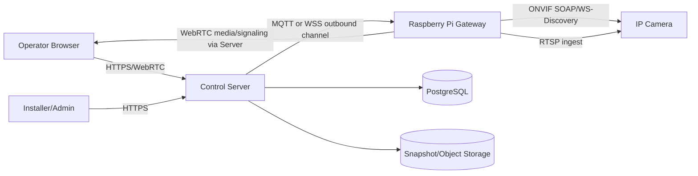
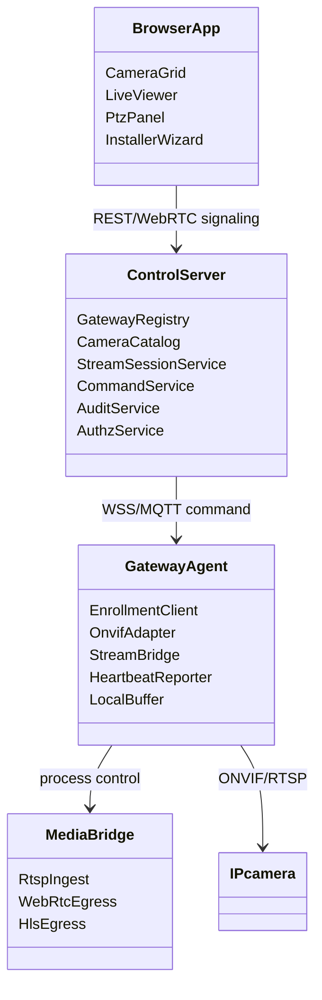
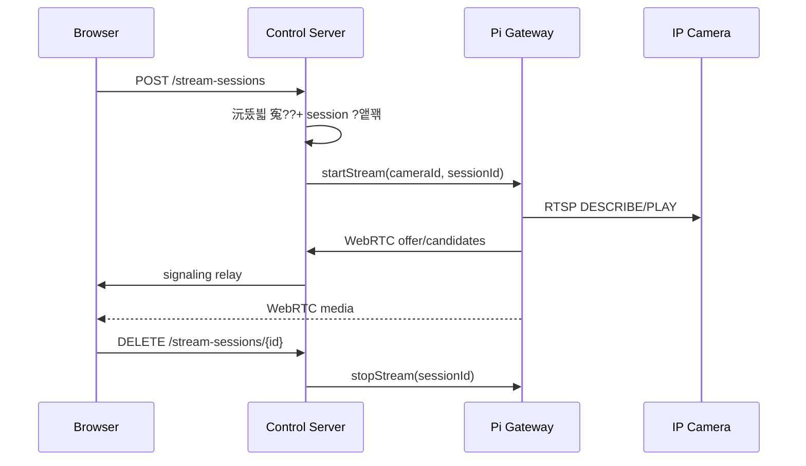
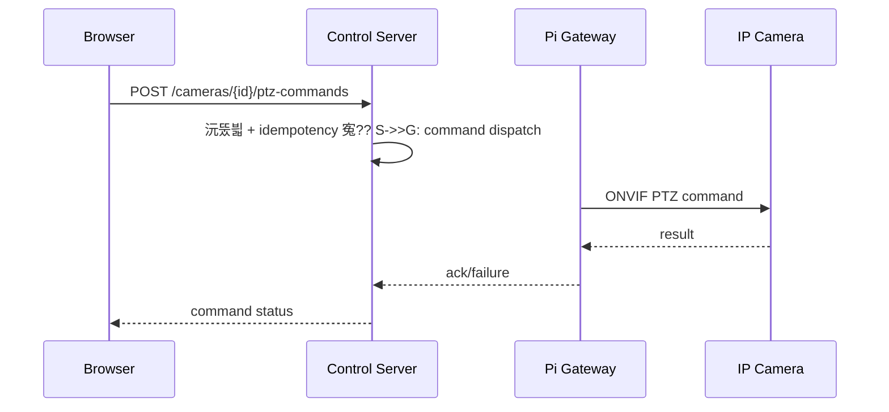
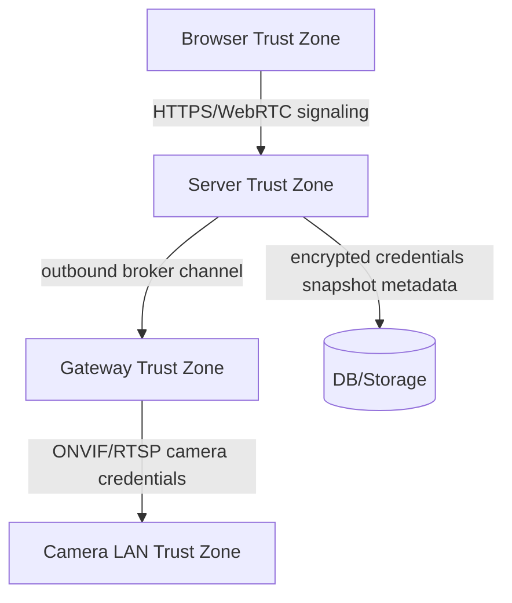
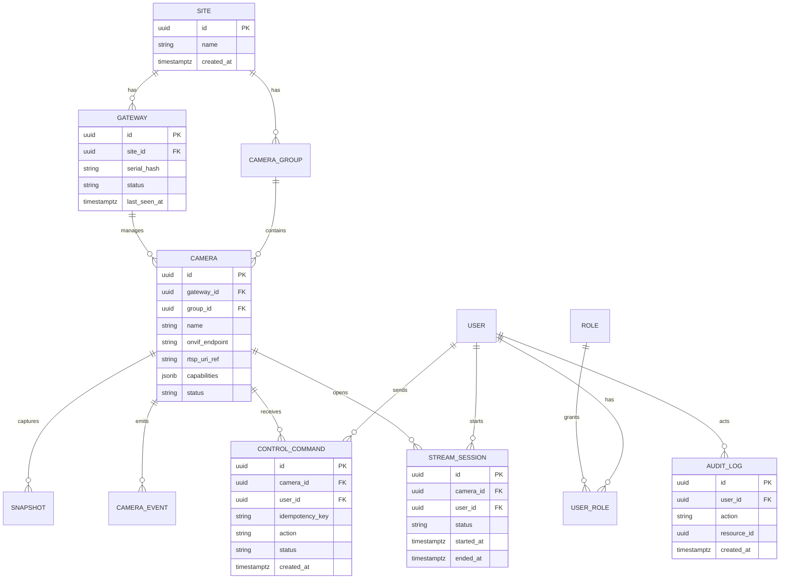

# Recon - Raspberry Pi IP Camera Control & Monitoring

議곗궗?? 2026-07-09

## ?꾨찓???낅Т ?먮쫫

1. ?꾩옣 愿€由ъ옄媛€ Raspberry Pi 寃뚯씠?몄썾?대? ?ㅼ튂?섍퀬 移대찓???ㅽ듃?뚰겕???곌껐?쒕떎.
2. 寃뚯씠?몄썾?대뒗 媛숈? LAN??ONVIF 移대찓?쇰? 寃€?됲븯嫄곕굹 ?섎룞 ?깅줉?쒕떎.
3. ?ъ슜?먮뒗 ???€?쒕낫?쒖뿉???ㅼ떆媛??곸긽??蹂닿퀬 PTZ/?꾨━???ㅻ깄???뱁솕 ?붿껌??蹂대궦??
4. 寃뚯씠?몄썾?대뒗 移대찓???쒖뼱 紐낅졊怨??ㅽ듃由?蹂€?섏쓣 ?섑뻾?섍퀬, 以묒븰 ?쒕쾭???ъ슜??沅뚰븳/媛먯궗濡쒓렇/?μ튂 ?곹깭瑜?愿€由ы븳??
5. ?ㅽ듃?뚰겕 ?⑥젅 ??濡쒖뺄 紐⑤땲?곕쭅怨??쒗븳???쒖뼱瑜??좎??섍퀬, ?곌껐 蹂듦뎄 ???곹깭?€ ?대깽?몃? ?숆린?뷀븳??

## ?댄빐愿€怨꾩옄

- ?쒖꽕 ?댁쁺?? ?ㅼ떆媛??곸긽 ?뺤씤, PTZ ?쒖뼱, ?μ븷 ?뚮┝ ?뺤씤.
- ?꾩옣 ?ㅼ튂 湲곗궗: Pi ?대?吏€ ?뚮옒?? 移대찓??寃€?? ?ㅽ듃?뚰겕/?쒓컙 ?ㅼ젙.
- 蹂댁븞 愿€由ъ옄: ?ъ슜??沅뚰븳, ?묎렐 媛먯궗, ?곸긽 ?묎렐 ?뺤콉.
- ?쒖뒪???댁쁺?? Pi fleet ?곹깭, OTA ?낅뜲?댄듃, 濡쒓렇/諛깆뾽/蹂듦뎄.
- 理쒖쥌 怨좉컼/嫄대Ъ二? ?먯뇙留??먮뒗 ?⑦봽?덈????댁쁺, 媛쒖씤?뺣낫/?곸긽 諛섏텧 ?듭젣.

## 洹쒖젣?€ ?쒖?

- ONVIF Profile T??IP 湲곕컲 ?곸긽 ?쒖뒪?쒖슜 ?꾨줈?뚯씪?대ʼn H.264/H.265, ?대?吏€ ?ㅼ젙, 紐⑥뀡/?ы띁留??대깽?? PTZ ?쒖뼱 ?깆쓣 ?ㅻ，?? Profile S??IP ?곸긽 ?ㅽ듃由щ컢怨??쒖뼱??湲곗〈 ?명솚 湲곕컲?대굹, ONVIF??Profile S 吏€??醫낅즺?€ Profile T 沅뚭퀬瑜?諛쒗몴?덈떎.
- Raspberry Pi 怨듭떇 臾몄꽌??移대찓??紐⑤뱢怨?libcamera 湲곕컲 珥ъ쁺???ㅻ（吏€留? IP 移대찓??VMS/ONVIF ?대씪?댁뼵???꾩껜 ?ㅽ깮???쒓났?섏? ?딅뒗??
- Pi 湲곕컲 ?쒗뭹???꾩옣??諛곗튂???뚮뒗 SD 移대뱶 ?곌린, ?꾩썝 李⑤떒, watchdog, OTA/rollback, ?μ튂蹂??몄쬆?쒓? 二쇱슂 ?댁쁺 由ъ뒪?щ떎.
- ?곸긽 ?쒕퉬?ㅻ뒗 媛쒖씤?뺣낫?€ ?쒖꽕 蹂댁븞 ?곗씠?곕? ?ㅻ（誘€濡?理쒖냼 沅뚰븳, 媛먯궗濡쒓렇, ?뷀샇???€???꾩넚, ?묎렐 留뚮즺媛€ ?꾩닔??

## ?좎궗 ?꾧뎄?€ ?곸슜 媛€?μ꽦

| ?꾧뎄/?쒗뭹 | ?곸슜 | ?쒓퀎 |
|---|---|---|
| Frigate/NVR 怨꾩뿴 | RTSP 移대찓???섏쭛, ?대깽??媛먯?, 濡쒖뺄 ?댁쁺??媛뺥븿 | 蹂??꾩씠?붿뼱???듭떖??BMS??沅뚰븳/媛먯궗/?μ튂 fleet ?댁쁺?€ 蹂꾨룄 援ы쁽 ?꾩슂 |
| MediaMTX | RTSP/WebRTC/HLS 蹂€??寃뚯씠?몄썾?댁뿉 ?곹빀 | ?ъ슜??沅뚰븳/移대찓??愿€由?API???몃??먯꽌 援ы쁽 ?꾩슂 |
| MotionEye 怨꾩뿴 | Pi 湲곕컲 媛꾨떒 紐⑤땲?곕쭅???곹빀 | ?ㅼ떆媛??€吏€?? ONVIF PTZ, ?댁쁺 ?깃툒 OTA?먮뒗 遺€議?|
| Home Assistant 移대찓???듯빀 | ???뚰삎 ?꾩옣 ?듯빀???곹빀 | ?곸뾽???ㅼ쨷 ?뚮꼳??媛먯궗/沅뚰븳 紐⑤뜽?€ 蹂꾨룄 ?꾩슂 |
| 湲곗〈 CCTV 紐⑤뱢 | 湲곗〈 HLS/WebRTC CCTV 怨꾪쉷怨??묒젏 | 蹂??뚯씠?꾨씪?몄? ?낅┰ ?쒕퉬??湲곗??대ʼn, 援ы쁽 ??湲곗〈 愿€???쒖뒪???듯빀 踰붿쐞瑜??ㅼ떆 ?뺤젙?댁빞 ??|

## ?ㅽ깮 ?꾨낫

| ?꾨낫 | 洹쇨굅 | ?몃젅?대뱶?ㅽ봽 | fit |
|---|---|---|---|
| Pi Gateway: Go ?먮뒗 Node.js + MediaMTX + ONVIF ?대씪?댁뼵??| ?ｌ??먯꽌 ??? ?ㅻ쾭?ㅻ뱶?€ ?ㅽ듃由?蹂€??遺꾨━ 媛€??| ONVIF ?μ튂蹂??몄감 ?€???꾩슂 | ?믪쓬 |
| 以묒븰 API: Spring Boot/Java ?먮뒗 FastAPI | ?ъ슜??沅뚰븳/媛먯궗/?μ튂 愿€由ъ뿉 ?덉젙??| ?묒? MVP?먮뒗 臾닿굅?????덉쓬 | 以묎컙 |
| ?ㅼ떆媛?UI: React + WebRTC player | 釉뚮씪?곗? ?묎렐?? 愿€??UI 援ъ꽦 ?⑹씠 | WebRTC signaling/ICE ?댁쁺 ?꾩슂 | ?믪쓬 |
| DB: PostgreSQL | ?μ튂/媛먯궗/?곹깭 ?대젰 ?€?μ뿉 ?곹빀 | ?⑦봽?덈????ㅼ튂 ?ㅽ겕由쏀듃 ?꾩슂 | ?믪쓬 |
| 硫붿떆吏? MQTT ?먮뒗 WebSocket | Pi媛€ outbound ?곌껐留??좎? 媛€??| 紐낅졊 硫깅벑???쒖꽌 蹂댁옣 ?ㅺ퀎 ?꾩슂 | ?믪쓬 |

## 二쇱슂 異쒖쿂

- Raspberry Pi camera software: https://www.raspberrypi.com/documentation/computers/camera_software.html
- ONVIF Profile T: https://www.onvif.org/profiles/profile-t/
- ONVIF Profile S: https://www.onvif.org/profiles/profile-s/
- ONVIF Profile S support end notice: https://www.onvif.org/?p=8621&post_type=pressrelease
- Mender Raspberry Pi in production: https://mender.io/blog/raspberry-pi-in-production
- AWS IoT Lens: https://docs.aws.amazon.com/wellarchitected/latest/iot-lens/
- Google SRE SLO/monitoring: https://sre.google/sre-book/service-level-objectives/ , https://sre.google/sre-book/monitoring-distributed-systems/
- Zalando REST API Guidelines: https://opensource.zalando.com/restful-api-guidelines/
- RFC 9457 Problem Details: https://www.rfc-editor.org/rfc/rfc9457
- Stripe idempotent requests: https://docs.stripe.com/api/idempotent_requests

---

# Blindspot Register - Raspberry Pi IP Camera Control & Monitoring

踰붿쐞: 怨듯넻 10異?+ STRIDE 6踰붿＜ + P1 IoT/?ｌ? + P3 愿€??SCADA/BMS.
?ъ슜??吏덈Ц 湲덉? 議곌굔???곕씪 紐⑤뱺 吏덈Ц ?꾨낫??異붿쿇?덉쓣 ?먮룞 梨꾪깮?덈떎.

| 異???ぉ | ?곹깭 | 泥섎━ | 洹쇨굅/異쒖쿂 |
|---|---|---|---|
| 湲곕뒫 踰붿쐞 | Assumed | MVP??移대찓???깅줉/寃€?? ?ㅼ떆媛?蹂닿린, PTZ/?꾨━?? ?ㅻ깄?? ?곹깭 ?뚮┝, 媛먯궗濡쒓렇濡??쒗븳 | Seed |
| ?꾨찓???곗씠??紐⑤뜽 | Assumed | Gateway, Camera, StreamSession, ControlCommand, Event, AuditLog, User/Role 以묒떖 | ONVIF Profile T/S |
| UX ?먮쫫 | Assumed | 愿€???€?쒕낫?? 移대찓???곸꽭, ?ㅼ튂 留덈쾿?? ?μ븷/濡쒓렇 ?붾㈃ | 愿€???꾨찓??|
| 鍮꾧린??紐⑺몴 | Assumed | ?ㅼ떆媛??쒖옉 3珥??대궡, 紐낅졊 ack 1珥??대궡, gateway heartbeat 10珥?| SRE SLI/SLO |
| ?듯빀/?꾨줈?좎퐳 | Assumed | ONVIF Profile T ?곗꽑, Profile S ?명솚, RTSP ingest, WebRTC egress, MQTT/WebSocket command channel | ONVIF, WebRTC/RTSP ?ㅻТ ?⑦꽩 |
| ?ㅽ뙣 泥섎━ | Assumed | 以묐났 紐낅졊?€ idempotency key濡??쒓굅, offline gateway??紐낅졊 嫄곗젅 ?먮뒗 ???뺤콉 紐낆떆 | Stripe idempotency |
| ?쒖빟/?몃젅?대뱶?ㅽ봽 | Assumed | Pi 4/5 ?댁긽, ?좎꽑 LAN 沅뚯옣, ?먯뇙留??ㅼ튂 ?곗꽑 | Mender Pi production |
| ?⑹뼱 | Clear | IP camera, gateway, stream session, PTZ, preset, event ?⑹뼱 ?ъ슜 | ONVIF |
| ?꾨즺 ?좏샇 | Assumed | SC-001~SC-008 ?깃났 湲곗? ?듦낵 | PRD |
| 鍮꾩슜/?쇱씠?좎뒪 | Assumed | ?ㅽ뵂?뚯뒪 援ъ꽦?붿냼??Apache/MIT/BSD ?곗꽑, GPL 而댄룷?뚰듃??諛고룷 ?곹뼢 寃€???꾧퉴吏€ ?쒖쇅 | 諛고룷 由ъ뒪??|
| P1 SD 移대뱶 留덈え | Assumed | 濡쒓렇/踰꾪띁??tmpfs ?먮뒗 以묒븰 ?꾩넚, ?곴뎄 DB??SSD/NVMe 沅뚯옣, noatime ?곸슜 | Mender, dzombak SD wear |
| P1 ?꾩썝 李⑤떒 | Assumed | read-only rootfs ?먮뒗 ?곌린 理쒖냼?? UPS ?듭뀡, 遺€????fsck/?곹깭 蹂듦뎄 | Mender |
| P1 watchdog | Assumed | systemd watchdog + ?섎뱶?⑥뼱 watchdog, 臾댄븳 ?щ???諛⑹? backoff | Mender |
| P1 OTA ?낅뜲?댄듃 | Assumed | A/B ?대?吏€, ?쒕챸 寃€利? ?④퀎 諛고룷, ?먮룞 rollback | AWS IoT Lens |
| P1 ?쒓컙 ?숆린??| Assumed | NTP 媛€???섍꼍 ?곗꽑, ?먯뇙留앹? RTC 紐⑤뱢 沅뚯옣 | Pi ?꾩옣 ?댁쁺 ?⑦꽩 |
| P1 ?μ튂 ?좎썝 | Assumed | gateway蹂?X.509 ?몄쬆?? 移대찓???먭꺽利앸챸?€ 寃뚯씠?몄썾??濡쒖뺄 ?뷀샇???€??| AWS IoT Lens |
| P1 ?곌껐 ?⑥젅 | Assumed | gateway 濡쒖뺄 紐⑤뱶 ?좎?, ?대깽??媛먯궗濡쒓렇??bounded buffer ???ъ쟾??| IoT Lens |
| P1 ?곸긽 ?ㅽ듃由щ컢 | Assumed | WebRTC ?€吏€??蹂닿린, HLS???명솚/?뱁솕 ?ъ깮??| WebRTC/RTSP ?ㅻТ |
| P1 ?먭꺽 ?묎렐 | Assumed | inbound port-forward 湲덉?, gateway outbound tunnel ?먮뒗 broker ?곌껐 | 蹂댁븞 湲곕낯媛?|
| P1 ?꾨줈鍮꾩???| Assumed | ?대?吏€ ?뚮옒??+ enrollment token + 理쒖큹 ?묒냽 ???몄쬆??諛쒓툒 | IoT Lens |
| P3 ?먯뇙留?| Assumed | ?⑥씪 踰덈뱾 ?ㅼ튂, ?몃? CDN/API ?섏〈 ?놁쓬 | ?꾩옣 愿€???댁쁺 |
| P3 ?ㅼ떆媛꾩꽦 | Assumed | ?곸긽 glass-to-glass p95 700ms ?댄븯瑜?紐⑺몴, PTZ ack p95 1珥??댄븯 | 愿€??UX |
| P3 ?뚮엺 ??＜ | Assumed | 移대찓??offline/蹂듦뎄 ?대깽?몃뒗 洹몃９?뫢룹엥?ㅼ슫 ?곸슜 | SRE alerting |
| P3 ?꾨줈?좎퐳 | Assumed | ONVIF ?몄감??adapter濡?寃⑸━, ?μ튂 capability matrix 蹂닿? | ONVIF |
| P3 ?대젰 利앷? | Assumed | ?곸긽 ?먮낯?€ 湲곕낯 ?€?ν븯吏€ ?딄퀬 ?대깽???ㅻ깄??以묒떖, ?뱁솕???좏깮 湲곕뒫 | ?€?λ퉬???덇컧 |
| P3 臾댁쨷??| Assumed | 以묒븰 API ?ъ떆??以?gateway 濡쒖뺄 蹂닿린 ?좎?, ?쒕쾭 蹂듦뎄 ???щ룞湲고솕 | ?ｌ? ?ㅺ퀎 |

## 吏덈Ц ?꾨낫?€ ?먮룞 梨꾪깮

### Q1. Raspberry Pi????븷?€ 臾댁뾿?멸??

| ?듭뀡 | ?댁슜 | 洹쇨굅/?몃젅?대뱶?ㅽ봽 |
|---|---|---|
| A (異붿쿇) | Pi??IP 移대찓???쒖뼱/?ㅽ듃由?蹂€???ｌ? 寃뚯씠?몄썾?대줈 ?ъ슜 | 湲곗〈 IP 移대찓???먯궛 ?쒖슜, ONVIF/RTSP ?명솚???믪쓬 |
| B | Pi ?먯껜瑜?移대찓?쇰줈 ?ъ슜 | ?섎뱶?⑥뼱 ?④??????留?IP 移대찓???쒖뼱 ?붽뎄?€ ?닿툔??|

梨꾪깮: A. decision-log D-001.

### Q2. ?ㅼ떆媛??ㅽ듃由щ컢 諛⑹떇?€ 臾댁뾿?멸??

| ?듭뀡 | ?댁슜 | 洹쇨굅/?몃젅?대뱶?ㅽ봽 |
|---|---|---|
| A (異붿쿇) | RTSP ingest + WebRTC live egress, HLS 蹂댁“ | ?€吏€?곌낵 釉뚮씪?곗? ?명솚 洹좏삎 |
| B | HLS留??ъ슜 | 援ы쁽?€ ?⑥닚?섎굹 吏€?곗씠 而ㅼ꽌 PTZ 愿€?쒖뿉 遺€?곹빀 |
| C | MJPEG ?ъ슜 | ?⑥닚?섏?留??€??룺怨??뺤옣??遺덈━ |

梨꾪깮: A. decision-log D-002.

### Q3. 諛고룷 ?섍꼍?€ 臾댁뾿?멸??

| ?듭뀡 | ?댁슜 | 洹쇨굅/?몃젅?대뱶?ㅽ봽 |
|---|---|---|
| A (異붿쿇) | ?⑦봽?덈????먯뇙留??곗꽑, ?대씪?곕뱶 由대젅???좏깮 | ?쒖꽕 ?곸긽 蹂댁븞怨??꾩옣 愿€??留λ씫???곹빀 |
| B | ?대씪?곕뱶 SaaS ?곗꽑 | ?댁쁺 ?몄쓽???믪쑝???곸긽 諛섏텧/留앸텇由?由ъ뒪??|

梨꾪깮: A. decision-log D-003.

### Q4. ONVIF 吏€??湲곗??€ 臾댁뾿?멸??

| ?듭뀡 | ?댁슜 | 洹쇨굅/?몃젅?대뱶?ㅽ봽 |
|---|---|---|
| A (異붿쿇) | Profile T ?곗꽑, Profile S ?명솚 | ONVIF??理쒖떊 沅뚭퀬?€ 湲곗〈 ?λ퉬 ?명솚 洹좏삎 |
| B | Profile S留?吏€??| 援ы삎 ?명솚?€ 醫뗭?留?蹂댁븞/湲곕뒫 理쒖떊??遺€議?|

梨꾪깮: A. decision-log D-004.

### Q5. ?곸긽 ?€?μ? MVP???ы븿?섎뒗媛€?

| ?듭뀡 | ?댁슜 | 洹쇨굅/?몃젅?대뱶?ㅽ봽 |
|---|---|---|
| A (異붿쿇) | MVP???ㅼ떆媛??ㅻ깄???대깽?몃쭔, ?곗냽 ?뱁솕??P2 | ?€?μ옣移?媛쒖씤?뺣낫/蹂듦뎄 踰붿쐞 ??쬆 諛⑹? |
| B | ?곗냽 ?뱁솕 ?ы븿 | NVR 寃쎌웳?μ? ?믪쑝??MVP 由ъ뒪????|

梨꾪깮: A. decision-log D-005.

## 諛섏쁺 湲곕줉

- D-001~D-005??PRD 踰붿쐞, API 怨꾩빟, ?뚯뒪???ㅺ퀎, ?댁쁺 ?ㅺ퀎??諛섏쁺?덈떎.
- 誘명빐寃?吏덈Ц?€ 0嫄댁씠?? ?ъ슜?먮퀎 ?덉궛/移대찓???€?섎뒗 媛€?뺢컪?쇰줈 ?쒓린?섍퀬 援ы쁽 ??site sizing ?낅젰?쇰줈 寃€利앺븳??

---

# PRD - Raspberry Pi IP Camera Control & Monitoring

## 諛곌꼍

?쒖꽕 ?꾩옣?먮뒗 ?대? RTSP/ONVIF IP 移대찓?쇨? ?ㅼ튂??寃쎌슦媛€ 留롫떎. Raspberry Pi???€?댄븳 ?꾩옣 寃뚯씠?몄썾?대줈 諛곗튂?섍린 ?쎌?留? ?앹궛 ?댁쁺?먯꽌??SD 移대뱶 留덈え, ?꾩썝 李⑤떒, ?μ튂 ?몄쬆, OTA rollback, ?쒓컙 ?숆린?붽? ?듭떖 由ъ뒪?щ떎. ?ㅼ떆媛?愿€?쒕뒗 ?⑥닚 HLS蹂대떎 WebRTC 媛숈? ?€吏€??寃쎈줈媛€ ?꾩슂?섎ʼn, ONVIF??Profile T ?곗꽑怨?Profile S ?명솚 ?꾨왂???⑸━?곸씠??

## ?쒗뭹 紐⑺몴

1. ?꾩옣 ?댁쁺?먭? 釉뚮씪?곗??먯꽌 IP 移대찓???곸긽??3珥??대궡???닿퀬 PTZ 紐낅졊 寃곌낵瑜?1珥??대궡???뺤씤?쒕떎.
2. ?ㅼ튂 湲곗궗媛€ Raspberry Pi 寃뚯씠?몄썾?대? 15遺??대궡???깅줉?섍퀬 媛숈? LAN??ONVIF 移대찓?쇰? 寃€???깅줉?쒕떎.
3. 蹂댁븞 愿€由ъ옄媛€ ?ъ슜?먮퀎 移대찓???묎렐쨌?쒖뼱 沅뚰븳怨?媛먯궗濡쒓렇瑜??뺤씤?쒕떎.

## ?ъ슜???ㅽ넗由?
- P1: As a ?쒖꽕 ?댁쁺?? I want ?ㅼ떆媛?移대찓???곸긽????? 吏€?곗쑝濡?蹂닿퀬 PTZ瑜??쒖뼱?쒕떎, so that ?꾩옣 ?댁긽 ?곹솴??利됱떆 ?뺤씤?쒕떎.
- P1: As a ?ㅼ튂 湲곗궗, I want Pi gateway媛€ ONVIF 移대찓?쇰? 寃€?됲븯怨?capability瑜??쒖떆?쒕떎, so that ?μ튂 ?깅줉 ?쒓컙??以꾩씤??
- P1: As a 蹂댁븞 愿€由ъ옄, I want ?ъ슜?먮퀎 蹂닿린/?쒖뼱 沅뚰븳怨?媛먯궗濡쒓렇瑜?愿€由ы븳?? so that ?곸긽 ?묎렐 梨낆엫??異붿쟻?쒕떎.
- P2: As a ?댁쁺?? I want ?대깽???ㅻ깄?룰낵 吏㏃? ?대┰??議고쉶?쒕떎, so that ?μ븷 ?먯씤???ы썑 ?뺤씤?쒕떎.
- P2: As a ?쒖뒪???댁쁺?? I want gateway fleet ?곹깭?€ ?낅뜲?댄듃 吏꾪뻾瑜좎쓣 蹂몃떎, so that ?꾩옣 異쒕룞??以꾩씤??

## ?붽뎄?ы빆

| ID | ?붽뎄?ы빆 | ?곗꽑?쒖쐞 | 異쒖쿂 |
|---|---|---|---|
| FR-001 | 寃뚯씠?몄썾??enrollment token?쇰줈 Pi瑜??깅줉?섍퀬 ?μ튂蹂??몄쬆?쒕? 諛쒓툒?쒕떎 | P0 | D-003 |
| FR-002 | ONVIF Profile T/S 移대찓??寃€?? ?섎룞 ?깅줉, capability 議고쉶瑜??쒓났?쒕떎 | P0 | D-004 |
| FR-003 | RTSP ingest瑜?WebRTC live session?쇰줈 蹂€?섑빐 釉뚮씪?곗??먯꽌 ?쒖떆?쒕떎 | P0 | D-002 |
| FR-004 | PTZ move/stop/preset 紐낅졊??沅뚰븳 寃€利???移대찓?쇱뿉 ?꾨떖?섍퀬 ack瑜?湲곕줉?쒕떎 | P0 | D-001 |
| FR-005 | ?ъ슜????븷/移대찓??洹몃９蹂?蹂닿린쨌?쒖뼱 沅뚰븳???곸슜?쒕떎 | P0 | 蹂댁븞 |
| FR-006 | 紐⑤뱺 蹂닿린 ?쒖옉, ?ㅻ깄?? PTZ 紐낅졊, 濡쒓렇?? ?ㅼ젙 蹂€寃쎌쓣 媛먯궗濡쒓렇濡??④릿??| P0 | 蹂댁븞 |
| FR-007 | gateway heartbeat, camera online/offline, stream session ?곹깭瑜??쒖떆?쒕떎 | P1 | ?댁쁺 |
| FR-008 | ?ㅻ깄??罹≪쿂?€ ?대깽???대?吏€瑜??€?ν븯怨?議고쉶?쒕떎 | P1 | D-005 |
| FR-009 | ?ㅽ듃?뚰겕 ?⑥젅 以?gateway 濡쒖뺄 紐⑤뱶?€ bounded event buffer瑜??쒓났?쒕떎 | P1 | P1/P3 |
| FR-010 | OTA ?낅뜲?댄듃???쒕챸 寃€利? staged rollout, rollback ?곹깭瑜?湲곕줉?쒕떎 | P2 | ?댁쁺 |
| FR-011 | ?곗냽 ?뱁솕/NVR 蹂닿? ?뺤콉???쒓났?쒕떎 | P2 | D-005 |

## ?좎뒪耳€?댁뒪

### UC-001 ?ㅼ떆媛?蹂닿린

Given ?댁쁺?먭? 移대찓??蹂닿린 沅뚰븳??蹂댁쑀?섍퀬 gateway媛€ online???? 
When ?댁쁺?먭? 移대찓?쇰? ?좏깮?쒕떎  
Then WebRTC ?몄뀡???앹꽦?섍퀬 p95 3珥??대궡??泥??꾨젅?꾩씠 ?쒖떆?쒕떎.

### UC-002 PTZ ?쒖뼱

Given ?댁쁺?먭? 移대찓???쒖뼱 沅뚰븳??蹂댁쑀?섍퀬 移대찓?쇨? PTZ capability瑜??쒓났???? 
When ?댁쁺?먭? pan/tilt/zoom ?먮뒗 preset 紐낅졊??蹂대궦?? 
Then 紐낅졊?€ idempotency key?€ ?④퍡 gateway濡??꾨떖?섍퀬 p95 1珥??대궡 ack ?먮뒗 ?ㅽ뙣 ?ъ쑀媛€ ?쒖떆?쒕떎.

### UC-003 ?ㅼ튂 ?깅줉

Given ?ㅼ튂 湲곗궗媛€ enrollment token??蹂댁쑀?섍퀬 Pi媛€ ?쒕쾭??outbound ?곌껐?????덉쓣 ?? 
When ?ㅼ튂 湲곗궗媛€ gateway ?깅줉???꾨즺?쒕떎  
Then ?쒕쾭???몄쬆?쒕? 諛쒓툒?섍퀬 gateway??ONVIF discovery 寃곌낵瑜?蹂닿퀬?쒕떎.

### UC-004 沅뚰븳 李⑤떒

Given ?ъ슜?먭? ?뱀젙 移대찓???쒖뼱 沅뚰븳???놁쓣 ?? 
When ?ъ슜?먭? PTZ 紐낅졊 API瑜??몄텧?쒕떎  
Then ?쒕쾭??403 Problem JSON??諛섑솚?섍퀬 嫄곕? 媛먯궗濡쒓렇瑜??④릿??

## ?깃났 湲곗?

| ID | 湲곗? | Pass/Fail |
|---|---|---|
| SC-001 | ?⑥씪 gateway, 4媛?1080p 移대찓???섍꼍?먯꽌 live session p95 ?쒖옉 ?쒓컙??3珥??댄븯 | ?먮룞 痢≪젙 |
| SC-002 | PTZ 紐낅졊 ack p95媛€ 1珥??댄븯?닿퀬 ?ㅽ뙣 ???먯씤 肄붾뱶媛€ ?쒖떆??| ?먮룞 痢≪젙 |
| SC-003 | 沅뚰븳 ?녿뒗 移대찓??蹂닿린/?쒖뼱 ?붿껌?€ 100% 李⑤떒?섍퀬 媛먯궗濡쒓렇媛€ ?⑥쓬 | ?뚯뒪??|
| SC-004 | gateway媛€ 60珥??댁긽 offline?대㈃ UI?€ ?뚮┝??offline ?곹깭媛€ ?쒖떆??| ?뚯뒪??|
| SC-005 | 移대찓???먭꺽利앸챸怨?gateway ?몄쬆?쒕뒗 ?됰Ц ?€?λ릺吏€ ?딆쓬 | 蹂댁븞 ?뚯뒪??|
| SC-006 | ?숈씪 idempotency key??PTZ 紐낅졊 ?ъ떆?꾨뒗 以묐났 ?ㅽ뻾?섏? ?딆쓬 | ?듯빀 ?뚯뒪??|
| SC-007 | 釉뚮씪?곗? ?덈줈怨좎묠/?ㅽ듃?뚰겕 ?ъ뿰寃???stream session???뺣━??| E2E |
| SC-008 | ?ㅻ깄???뚯씪?€ 沅뚰븳 寃€?щ? ?듦낵???붿껌?먮쭔 ?ㅼ슫濡쒕뱶??| E2E/蹂댁븞 |

## UI 諛⑺뼢

- 泥??붾㈃?€ 愿€???€?쒕낫?쒕떎. 移대찓??洹몃━?? 醫뚯륫 洹몃９ ?몃━, ?곗륫 ?대깽???곹깭 ?⑤꼸??諛곗튂?쒕떎.
- ?곸긽 移대뱶?먮뒗 live/offline/degraded ?곹깭, latency, ?쒖뼱 媛€???щ?瑜??꾩씠肄섍낵 吏㏃? ?곹깭 ?띿뒪?몃줈 ?쒖떆?쒕떎.
- PTZ 而⑦듃濡ㅼ? 移대찓???곸꽭 ?⑤꼸??怨좎젙?섍퀬, 沅뚰븳???녾굅??capability媛€ ?놁쑝硫?鍮꾪솢???ъ쑀瑜??쒖떆?쒕떎.
- ?ㅼ튂 ?붾㈃?€ gateway ?깅줉, ?ㅽ듃?뚰겕 ?곹깭, discovery 寃곌낵, 移대찓??留ㅽ븨??4?④퀎濡?援ъ꽦?쒕떎.

## 踰붿쐞 諛?
- MVP?먯꽌 ?곗냽 ?뱁솕/NVR ?κ린 蹂닿??€ ?쒖쇅?쒕떎.
- ?쇨뎬 ?몄떇, 媛앹껜 ?먯?, 移⑥엯 ?먯? AI???쒖쇅?쒕떎.
- 移대찓???뚯썾???낅뜲?댄듃 ?€?됱? ?쒖쇅?쒕떎.
- 怨듭씤 ?명꽣?룹뿉 移대찓???ы듃瑜?吏곸젒 ?몄텧?섎뒗 湲곕뒫?€ ?쒓났?섏? ?딅뒗??

## 媛€??紐⑸줉

- Pi??4GB RAM ?댁긽??Raspberry Pi 4/5, ?좎꽑 LAN ?ъ슜??沅뚯옣?쒕떎.
- 移대찓?쇰뒗 ONVIF Profile T ?먮뒗 S?€ RTSP ?ㅽ듃由쇱쓣 ?쒓났?쒕떎.
- ?ㅼ튂 ?꾩옣?€ ?⑦봽?덈????먯뇙留??곗꽑?대ʼn, ?대씪?곕뱶 由대젅?대뒗 ?좏깮 湲곕뒫?대떎.
- MVP??gateway??4媛?1080p live stream ?숈떆 ?쒖떆瑜?湲곗??쇰줈 sizing?쒕떎.

## 誘명빐寃?
0嫄?

---

# Architecture - Raspberry Pi IP Camera Control & Monitoring

## Context & Scope

???쒖뒪?쒖? 以묒븰 愿€由??쒕쾭, 釉뚮씪?곗? 愿€??UI, ?꾩옣 Raspberry Pi gateway, IP 移대찓?쇰줈 援ъ꽦?쒕떎. Pi??移대찓??寃€???쒖뼱/?ㅽ듃由?蹂€?섏쓣 ?대떦?섍퀬, 以묒븰 ?쒕쾭???ъ슜?먃룰텒?쑣룰컧??룹꽕?빧룹긽?쒕? ?대떦?쒕떎.

## Goals / Non-goals

- Goals: ??? 吏€?곗쓽 ?ㅼ떆媛?蹂닿린, 沅뚰븳 湲곕컲 PTZ ?쒖뼱, ?먯뇙留??ㅼ튂, gateway fleet ?댁쁺 媛€?μ꽦, 媛먯궗 媛€?μ꽦.
- Non-goals: ?곗냽 ?뱁솕 NVR, AI ?곸긽 遺꾩꽍, 移대찓???뚯썾??愿€由? ?ы듃?ъ썙??湲곕컲 ?먭꺽 ?묒냽.

## ?쒖뒪??而⑦뀓?ㅽ듃



## 援ы쁽 ?묎렐

- 以묒븰 ?쒕쾭: REST API, WebRTC signaling, command broker, RBAC, audit log, gateway registry.
- Gateway agent: enrollment, heartbeat, ONVIF discovery/control adapter, RTSP ingest, WebRTC/HLS bridge, local bounded queue.
- Streaming: MediaMTX ?먮뒗 ?숇벑??gateway media process瑜?sidecar濡??먭퀬 agent媛€ lifecycle???쒖뼱?쒕떎.
- UI: camera grid, detail viewer, PTZ controls, event/status panel, installer wizard.

## 而댄룷?뚰듃 援ъ“



## ?곗씠???먮쫫

### ?ㅼ떆媛?蹂닿린



### PTZ ?쒖뼱



## ?곗씠???€??寃곗젙

- 愿€怨꾪삎 DB: gateway, camera, role binding, stream session metadata, command, event, audit log.
- ?뚯씪/?ㅻ툕?앺듃 ?€?? snapshot/event image. MVP?먯꽌???곗냽 ?뱁솕 ?€???쒖쇅.
- Gateway local: encrypted camera credential cache, bounded command/event queue, volatile stream state.

## 寃€?좏븳 ?€??
| ?€??| ?좏깮 ?щ? | ?댁쑀 |
|---|---|---|
| HLS-only streaming | 湲곌컖 | PTZ 愿€?쒖뿉 吏€?곗씠 而ㅼ쭏 媛€?μ꽦???믪쓬 |
| Pi瑜?IP 移대찓???먯껜濡?援ъ꽦 | 湲곌컖 | 湲곗〈 IP 移대찓???쒖뼱 ?붽뎄?€ 留욎? ?딆쓬 |
| 移대찓??吏곸젒 ?대씪?곕뱶 ?곌껐 | 湲곌컖 | ?먯뇙留?蹂댁븞 ?붽뎄?€ 異⑸룎 |
| Gateway WebRTC bridge | 梨꾪깮 | ?€吏€?곌낵 釉뚮씪?곗? ?명솚 洹좏삎 |
| Profile T ?곗꽑 + S ?명솚 | 梨꾪깮 | 理쒖떊 ONVIF 沅뚭퀬?€ 援ы삎 ?λ퉬 ?명솚 洹좏삎 |

## Threat Model



| ?먯궛/寃쎄퀎 | S | T | R | I | D | E | ?먯젙 |
|---|---|---|---|---|---|---|---|
| Browser-Server | ?몄뀡 ?덉랬 | ?붿껌 蹂€議?| ?ъ슜??遺€??| ?곸긽 沅뚰븳 ?꾩텧 | API flood | 沅뚰븳 ?고쉶 | 紐⑤몢 ?좏슚 |
| Server-Gateway | gateway spoofing | 紐낅졊 蹂€議?| ack 遺€??| ?몄쬆???좎텧 | broker flood | gateway 沅뚰븳 ?곸듅 | 紐⑤몢 ?좏슚 |
| Gateway-Camera | 移대찓???꾩옣 | ONVIF 紐낅졊 蹂€議?| ?쒖뼱 ?대젰 遺€??| RTSP/?먭꺽利앸챸 ?몄텧 | 移대찓???곌껐 怨좉컝 | 移대찓??admin ?덉랬 | 紐⑤몢 ?좏슚 |
| Server-DB/Storage | DB 怨꾩젙 ?꾩옣 | 媛먯궗濡쒓렇 蹂€議?| 濡쒓렇 ??젣 遺€??| ?ㅻ깄???몄텧 | ?€?μ냼 怨좉컝 | DB 沅뚰븳 ?곸듅 | 紐⑤몢 ?좏슚 |

## ?꾪삊蹂??€??
- Spoofing: ?ъ슜??MFA ?듭뀡, gateway蹂?X.509 ?몄쬆?? camera credential vault, short-lived stream token.
- Tampering: TLS, signed OTA, command idempotency, 媛먯궗濡쒓렇 append-only ?뺤콉.
- Repudiation: ?ъ슜?먃톑ateway쨌camera ?⑥쐞 audit log, command correlation id, clock sync 寃€利?
- Information Disclosure: RBAC/ABAC, snapshot signed URL 留뚮즺, credential encryption, 濡쒓렇 留덉뒪??
- Denial of Service: stream session limit, per-camera concurrency cap, rate limiting, alarm grouping.
- Elevation of Privilege: ?쒕쾭 沅뚰븳 寃€??湲곗?, gateway scope ?쒗븳, admin action step-up auth.

## ?곸쐞 由ъ뒪??
1. 移대찓???쒖“?щ퀎 ONVIF 援ы쁽 ?몄감: capability matrix, adapter 寃⑸━, ?몄쬆 ?λ퉬 紐⑸줉 ?댁쁺.
2. Pi ?깅뒫 ?쒓퀎: gateway???숈떆 ?ㅽ듃由??쒗븳, transcoding ?뚰뵾, hardware acceleration 寃€利?
3. ?꾩옣 ?꾩썝/SD ?μ븷: SSD 沅뚯옣, read-only rootfs, watchdog, OTA rollback.
4. ?곸긽 媛쒖씤?뺣낫 ?몄텧: 湲곕낯 誘몃끃?? ?ㅻ깄??沅뚰븳/蹂댁〈 ?뺤콉, 媛먯궗濡쒓렇.

## Cross-cutting

- 愿€痢≪꽦: gateway heartbeat, stream startup latency, PTZ ack latency, camera online ?곹깭, media process saturation.
- ?꾨씪?대쾭?? ?곸긽 ?먮낯 湲곕낯 ?€??湲덉?, snapshot 蹂댁〈 湲곌컙 ?ㅼ젙, ?묎렐 媛먯궗 ?꾩닔.
- ?ㅽ봽?쇱씤: ?쒕쾭 ?⑥젅 ??濡쒖뺄 UI??read/control ?쒗븳 紐⑤뱶濡??좎?, 蹂듦뎄 ???대깽???숆린??

---

# API Contract & Data Schema - Raspberry Pi IP Camera Control & Monitoring

## 怨듯넻 洹쒖빟

- ?몄쬆: Bearer JWT for users, mTLS or signed token for gateway.
- ?ㅻ쪟: RFC 9457 Problem JSON (`type`, `title`, `status`, `detail`, `instance`, `code`, `correlationId`).
- 踰꾩쟾: URL 踰꾩쟾 ?€??media type ?먮뒗 header 湲곕컲. ?? `Accept: application/vnd.camera-monitor+json;version=1`.
- ?섏씠吏€?ㅼ씠?? cursor 湲곕컲 ?곗꽑.
- 硫깅벑?? ?쒖뼱/?깅줉/?ㅻ깄???앹꽦 POST??`Idempotency-Key` 吏€??
- 沅뚰븳 肄붾뱶: `camera:view`, `camera:control`, `camera:admin`, `gateway:admin`, `audit:read`.

## ?붾뱶?ъ씤??
| ID | 硫붿꽌??寃쎈줈 | ?붿껌 | ?묐떟 | 二쇱슂 ?ㅻ쪟 | 沅뚰븳 |
|---|---|---|---|---|---|
| EP-001 | POST `/gateways/enrollments` | `siteId`, `label`, `expiresAt` | enrollment token | 403, 409 | gateway:admin |
| EP-002 | POST `/gateways/enroll` | token, device fingerprint | gateway cert/bootstrap config | 400, 401, 409 | device bootstrap |
| EP-003 | GET `/gateways` | cursor, status | gateway list | 401, 403 | gateway:admin |
| EP-004 | POST `/gateways/{gatewayId}/discoveries` | network scope | discovery job | 409, 422 | gateway:admin |
| EP-005 | GET `/gateways/{gatewayId}/discoveries/{jobId}` | - | discovered cameras | 404 | gateway:admin |
| EP-006 | POST `/cameras` | gatewayId, onvifUrl, rtspUrl, credentialsRef, groupId | camera | 400, 409 | camera:admin |
| EP-007 | GET `/cameras` | groupId, status, cursor | camera list | 403 | camera:view |
| EP-008 | GET `/cameras/{cameraId}/capabilities` | - | ONVIF capabilities | 404 | camera:view |
| EP-009 | POST `/stream-sessions` | cameraId, mode=`webrtc` | sessionId, signaling endpoint, expiresAt | 403, 409, 503 | camera:view |
| EP-010 | DELETE `/stream-sessions/{sessionId}` | - | closed | 404 | camera:view |
| EP-011 | POST `/cameras/{cameraId}/ptz-commands` | action, vector/preset, durationMs | commandId, status | 403, 409, 422, 503 | camera:control |
| EP-012 | POST `/cameras/{cameraId}/snapshots` | reason | snapshotId, status | 403, 503 | camera:view |
| EP-013 | GET `/events` | cameraId, type, cursor | event list | 403 | camera:view |
| EP-014 | GET `/audit-logs` | actorId, cameraId, action, cursor | audit list | 403 | audit:read |
| EP-015 | POST `/gateway-channel/heartbeat` | gateway status, metrics | ack/config delta | 401, 409 | gateway cert |

## OpenAPI sketch

```yaml
paths:
  /stream-sessions:
    post:
      summary: Create a WebRTC live stream session
      security:
        - bearerAuth: []
      requestBody:
        required: true
        content:
          application/json:
            schema:
              type: object
              required: [cameraId, mode]
              properties:
                cameraId: { type: string, format: uuid }
                mode: { type: string, enum: [webrtc] }
      responses:
        "201":
          description: Created
        "403":
          description: Forbidden problem
  /cameras/{cameraId}/ptz-commands:
    post:
      summary: Send an idempotent PTZ command
      parameters:
        - name: Idempotency-Key
          in: header
          required: true
          schema: { type: string, maxLength: 128 }
      responses:
        "202": { description: Accepted }
        "422": { description: Camera does not support requested capability }
```

## ERD



## ?곗씠??洹쒖튃

- ?쒓컙: ?쒕쾭/DB??UTC ISO 8601, UI???ъ씠???쒓컙?€濡??쒖떆.
- 移대찓??鍮꾨?踰덊샇/RTSP URI credential: ?됰Ц ?€??湲덉?, KMS ?먮뒗 OS keyring 湲곕컲 ?뷀샇??
- 媛먯궗濡쒓렇: append-only, 愿€由ъ옄 ??젣 API ?놁쓬. 蹂댁〈 湲곌컙 湲곕낯 1??
- ?ㅻ깄?? 湲곕낯 蹂댁〈 30?? 誘쇨컧 ?꾩옣?먯꽌??7?쇰줈 異뺤냼 媛€??
- 湲덉븸 ?곗씠???놁쓬. ?섏튂 metric?€ ?뺤닔 諛€由ъ큹/諛붿씠???쇱꽱?몃줈 ?€??

## 而ㅻ쾭由ъ? 留ㅽ븨

| FR-ID | ?붾뱶?ъ씤???대깽??|
|---|---|
| FR-001 | EP-001, EP-002, EP-015 |
| FR-002 | EP-004, EP-005, EP-006, EP-008 |
| FR-003 | EP-009, EP-010, gateway `stream.started/failed/stopped` |
| FR-004 | EP-011, gateway `command.ack/failed` |
| FR-005 | EP-006~EP-014 沅뚰븳 ?뺤콉 |
| FR-006 | EP-009~EP-014 audit event |
| FR-007 | EP-003, EP-007, EP-015 |
| FR-008 | EP-012, EP-013 |
| FR-009 | EP-015, gateway `buffer.replayed` |
| FR-010 | gateway `ota.started/succeeded/rolled_back` |

P0/P1 ?붽뎄?ы빆 留ㅽ븨 ?꾨씫: 0嫄?

---

# Test Design - Raspberry Pi IP Camera Control & Monitoring

## ?먯튃

- PRD??AC/SC??援ы쁽 ?꾩뿉 ?ㅽ뙣?섎뒗 ?뚯뒪?몃줈 議댁옱?댁빞 ?쒕떎.
- ?뚯뒪???쇰씪誘몃뱶??unit 70%, integration/contract 20%, E2E 10%瑜?紐⑺몴濡??쒕떎.
- 蹂댁븞쨌沅뚰븳쨌硫깅벑?굿룹옣移?offline 寃쎈줈??happy path?€ 媛숈? ?섏??쇰줈 寃€利앺븳??

## ?쒕굹由ъ삤 蹂€?섑몴

| SC/FR ID | Gherkin ?쒕굹由ъ삤 | ?덉씠??| ?곗씠??紐?|
|---|---|---|---|
| FR-001 | Given ?좏슚??enrollment token When gateway媛€ enroll Then ?몄쬆?쒖? bootstrap config媛€ 諛쒓툒?쒕떎 | integration | fake gateway fingerprint |
| FR-001 | Given 留뚮즺??token When enroll Then 401 Problem JSON??諛섑솚?쒕떎 | integration | expired token |
| FR-002 | Given ONVIF mock camera When discovery job ?ㅽ뻾 Then capabilities媛€ ?€?λ맂??| integration | ONVIF mock |
| FR-003/SC-001 | Given online camera When stream session ?앹꽦 Then p95 3珥??대궡 泥??꾨젅??metric??湲곕줉?쒕떎 | E2E/perf smoke | media bridge stub + test stream |
| FR-004/SC-002 | Given PTZ camera When move command Then ack p95 1珥??댄븯?닿퀬 audit媛€ ?⑤뒗??| integration/E2E | ONVIF PTZ mock |
| FR-004/SC-006 | Given 媛숈? Idempotency-Key When PTZ command ?ъ떆??Then 移대찓???몄텧?€ 1?뚮쭔 諛쒖깮?쒕떎 | integration | command spy |
| FR-005/SC-003 | Given camera:control???녿뒗 ?ъ슜??When PTZ command Then 403怨?嫄곕? 媛먯궗濡쒓렇媛€ ?⑤뒗??| integration | RBAC fixture |
| FR-006 | Given ?ъ슜?먭? stream ?쒖옉 When session ?앹꽦 Then audit action `stream.start`媛€ 湲곕줉?쒕떎 | integration | audit repository |
| FR-007/SC-004 | Given gateway heartbeat ?놁쓬 When 60珥?寃쎄낵 Then gateway offline event?€ UI ?곹깭媛€ ?쒖떆?쒕떎 | unit/E2E | fake clock |
| FR-008/SC-008 | Given 沅뚰븳 ?녿뒗 ?ъ슜??When snapshot download Then 403 Problem JSON | integration/E2E | snapshot fixture |
| FR-009 | Given gateway offline buffer???대깽??議댁옱 When ?곌껐 蹂듦뎄 Then ?쒖꽌 蹂댁〈 ?ъ쟾?↔낵 以묐났 ?쒓굅媛€ ?섑뻾?쒕떎 | gateway integration | local buffer |
| SC-005 | Given ?€?μ냼 寃€??When credential fields 議고쉶 Then ?됰Ц credential???녿떎 | security test | DB dump scanner |
| SC-007 | Given stream session active When browser closes Then session cleanup command媛€ gateway???꾩넚?쒕떎 | E2E | Playwright + mock gateway |

## ?⑥쐞 ?뚯뒪??
- Capability parser: Profile T/S feature flags, PTZ 吏€???щ?, RTSP URI ?좏깮.
- Command validator: action enum, duration limit, preset existence.
- Authz policy: view/control/admin 沅뚰븳 議고빀.
- Idempotency service: same key replay, conflict body mismatch.
- Offline state machine: heartbeat timeout, reconnect, degraded.
- Audit event builder: 誘쇨컧?뺣낫 留덉뒪??

## ?듯빀/怨꾩빟 ?뚯뒪??
- REST Problem JSON schema 寃€利?
- Gateway channel heartbeat/config delta 怨꾩빟.
- ONVIF mock server against discovery/control adapter.
- Media bridge lifecycle: start/stop ?ㅽ뙣, duplicate stop, process crash.
- DB migration: append-only audit, FK, unique idempotency key.

## E2E ?꾨낫

1. ?ㅼ튂 湲곗궗 ?뚮줈?? enrollment token ?앹꽦 -> gateway ?깅줉 -> camera discovery -> camera ?€??
2. ?댁쁺???뚮줈?? 濡쒓렇??-> camera grid -> live open -> PTZ command -> audit ?뺤씤.
3. 蹂댁븞 ?뚮줈?? 沅뚰븳 ?녿뒗 ?ъ슜?먮줈 live/PTZ/snapshot ?묎렐 李⑤떒 ?뺤씤.

## 由ъ뒪??湲곕컲 而ㅻ쾭由ъ? 紐⑺몴

| 由ъ뒪??| ?뚯뒪??|
|---|---|
| ONVIF ?쒖“???몄감 | mock profile matrix + ?몄쬆 ?λ퉬 smoke list |
| Pi ?깅뒫 ?쒓퀎 | gateway??1/2/4 stream soak test |
| ?곸긽 沅뚰븳 ?꾩텧 | RBAC negative tests + signed URL expiry tests |
| 以묐났 ?쒖뼱 | idempotency integration tests |
| offline/蹂듦뎄 | heartbeat timeout + buffer replay tests |

?꾨씫??SC/P0/P1 ?쒕굹由ъ삤: 0嫄?

---

# Ops Design - Raspberry Pi IP Camera Control & Monitoring

## 諛고룷

- 以묒븰 ?쒕쾭: Docker Compose ?먮뒗 ?⑦봽?덈???VM ?ㅼ튂. 援ъ꽦?붿냼??API server, PostgreSQL, object storage, broker, reverse proxy.
- Gateway: Raspberry Pi OS 湲곕컲 immutable image. agent + media bridge + watchdog service瑜?systemd濡??ㅽ뻾.
- ?먯뇙留? ?대?吏€/而⑦뀒?대꼫/?⑦궎吏€ ?⑥씪 踰덈뱾 ?쒓났, ?몃? CDN/API ?섏〈 ?놁쓬.
- OTA: A/B partition, signed update, canary gateway 1?€ -> site 10% -> ?꾩껜 rollout. ?ㅽ뙣 ???먮룞 rollback.

## CI/CD

1. lint/static analysis
2. unit tests
3. API contract tests
4. gateway integration tests with ONVIF mock
5. build server image/gateway image
6. security scan and license check
7. staging deploy
8. smoke: enroll, discovery, live session, PTZ mock, audit

## ?ㅼ젙怨?鍮꾨?

- ?쒕쾭 鍮꾨?: ?섍꼍蹂€???먮뒗 secret manager.
- Gateway 鍮꾨?: enrollment ?댄썑 ?μ튂蹂??몄쬆?? 移대찓??credential?€ gateway 濡쒖뺄 ?뷀샇???€??
- 濡쒓렇?먮뒗 RTSP URI credential, token, ?몄쬆??private key, snapshot ?뚯씪 蹂몃Ц???④린吏€ ?딅뒗??

## 愿€痢≪꽦

### SLI/SLO-lite

| SLI | 紐⑺몴 |
|---|---|
| API availability | ??99.5% ?댁긽 |
| stream startup latency | p95 <= 3s |
| PTZ ack latency | p95 <= 1s |
| gateway heartbeat freshness | online gateway p95 <= 15s |
| command failure rate | 5遺?rolling <= 2% |
| media process crash loop | 0????紐⑺몴, 諛쒖깮 ???뚮┝ |

### Golden signals

- Latency: stream start, PTZ ack, API request, discovery job duration.
- Traffic: active sessions, commands/min, gateway heartbeat/min, RTSP reconnect count.
- Errors: ONVIF auth failure, stream start failure, command failure, Problem JSON type count.
- Saturation: CPU, memory, temperature, disk write rate, network throughput, media process fd count.

## 濡쒓퉭

- 以묒븰: API access log, audit log, command log, gateway status log.
- Gateway: agent log??journald + size cap, ?곸꽭 media log??tmpfs rolling ??以묒슂 ?대깽?몃쭔 以묒븰 ?꾩넚.
- 蹂댁〈: audit 1?? operational logs 30?? gateway local logs 7???먮뒗 256MB cap.
- SD 蹂댄샇: persistent write 理쒖냼?? noatime, swap 鍮꾪솢???먮뒗 ?쒗븳, SSD/NVMe 沅뚯옣.

## ?뚮┝

| ?뚮┝ | 議곌굔 | ?ш컖??| ?섏떊 | ?€??|
|---|---|---|---|---|
| Gateway offline | heartbeat 60珥??놁쓬 | High | ?댁쁺??| ?꾩썝/?ㅽ듃?뚰겕 ?뺤씤, 濡쒖뺄 ?묒냽 |
| Camera offline storm | 媛숈? site?먯꽌 5遺???5?€ ?댁긽 offline | High | ?댁쁺??| ?ㅼ쐞移?PoE/留??먭? |
| Stream failure surge | stream failure rate 5遺?10% 珥덇낵 | Medium | ?댁쁺??| media bridge ?ъ떆??由ъ냼???뺤씤 |
| PTZ command failure | ?뱀젙 移대찓??5遺?5???댁긽 ?ㅽ뙣 | Medium | ?댁쁺??| ONVIF credential/capability ?뺤씤 |
| Disk write high | gateway disk write > 湲곗?移?10遺?吏€??| Medium | ?쒖뒪???댁쁺 | 濡쒓렇 cap/SSD/?꾨줈?몄뒪 ?먭? |
| OTA rollback | ?낅뜲?댄듃 ?먮룞 rollback 諛쒖깮 | High | ?쒖뒪???댁쁺 | 由대━??以묒?/濡쒓렇 ?섏쭛 |

紐⑤뱺 ?뚮┝?€ 議곗튂 媛€?ν븳 runbook 留곹겕?€ owner瑜?媛€?몄빞 ?쒕떎.

## ?μ븷/蹂듦뎄

| ?μ븷 | 媛먯? | ?곹뼢 | 蹂듦뎄 ?덉감 | RTO/RPO |
|---|---|---|---|---|
| 以묒븰 ?쒕쾭 ?ㅼ슫 | health check ?ㅽ뙣 | ?먭꺽 UI 遺덇?, gateway local ?쒗븳 紐⑤뱶 | Docker compose ?ш린?? DB ?곹깭 ?뺤씤, 理쒓렐 諛고룷 rollback | RTO 30遺? RPO 5遺?|
| Gateway offline | heartbeat timeout | ?대떦 site 移대찓???먭꺽 ?묎렐 遺덇? | ?꾩썝/?ㅽ듃?뚰겕 ?뺤씤, watchdog reboot, ?꾩옣 援먯껜 | RTO 4?쒓컙, RPO bounded buffer |
| Media bridge crash | process exit metric | live stream ?ㅽ뙣 | systemd restart, crash loop?대㈃ stream ?쒗븳/rollback | RTO 5遺?|
| DB ?먯긽 | backup/health ?ㅽ뙣 | ?ㅼ젙/媛먯궗 議고쉶 遺덇? | PITR ?먮뒗 ??諛깆뾽 蹂듭썝, audit integrity check | RTO 2?쒓컙, RPO 24?쒓컙 ?먮뒗 WAL 湲곗? |
| SD 移대뱶 ?μ븷 | boot failure/log missing | gateway 遺€??遺덇? | ?덈퉬 ?대?吏€ SD/SSD 援먯껜, enrollment ?ъ궗???쒗븳 ?뺤콉 | RTO 4?쒓컙 |

## 諛깆뾽

- DB: 留ㅼ씪 ?꾩껜 諛깆뾽 + WAL/PITR 媛€????5遺?RPO, ??1??蹂듭썝 由ы뿀??
- Snapshot storage: 蹂댁〈 ?뺤콉???곕씪 lifecycle ??젣, ???⑥쐞 硫뷀??곗씠??寃€利?
- Gateway: stateless??媛€源앷쾶 ?좎?. 移대찓??credential 蹂듦뎄???쒕쾭 escrow ?먮뒗 ?щ벑濡??덉감濡?泥섎━.

## ?댁쁺 runbook 珥덉븞

1. ?뚮┝ ?뺤씤: site, gateway, camera, correlationId ?뺤씤.
2. ?곹뼢 踰붿쐞: active sessions, offline cameras, 理쒓렐 諛고룷 ?щ? ?뺤씤.
3. 吏꾨떒: gateway metrics, media bridge logs, ONVIF auth failures, network latency ?뺤씤.
4. ?닿껐: ?꾨줈?몄뒪 ?ъ떆?? gateway reboot, credential ?ш?利? rollout 以묒?.
5. 寃€利? stream smoke, PTZ mock/live command, audit log 湲곕줉 ?뺤씤.
6. ?ы썑: incident note?€ decision-log ?낅뜲?댄듃.

---

# Readiness Report - Raspberry Pi IP Camera Control & Monitoring

?먯젙: CONCERNS

## 寃뚯씠???먭?

| ??ぉ | 寃곌낵 | 洹쇨굅 |
|---|---|---|
| FR -> API/event 而ㅻ쾭由ъ? | PASS | P0/P1 FR 留ㅽ븨 ?꾨씫 0嫄?|
| SC -> ?뚯뒪???쒕굹由ъ삤 而ㅻ쾭由ъ? | PASS | SC-001~SC-008 紐⑤몢 06-test-design??留ㅽ븨 |
| 紐⑦샇??誘명빐寃?吏덈Ц | PASS | ?ъ슜??吏덈Ц 湲덉? 議곌굔???곕씪 異붿쿇???먮룞 梨꾪깮, 誘명빐寃?0嫄?|
| STRIDE 6踰붿＜ 寃€??| PASS | 紐⑤뱺 trust boundary?먯꽌 S/T/R/I/D/E 寃€??|
| ?댁쁺 ?ㅺ퀎 | PASS | 濡쒓렇/諛깆뾽/蹂듦뎄/?뚮┝/SLO-lite ?ы븿 |
| 洹쇨굅 ?녿뒗 異붿쿇 | PASS | 二쇱슂 ?좏깮??ONVIF, Raspberry Pi, SRE, API guideline 異쒖쿂 ?ы븿 |
| 援ы쁽 李⑹닔 由ъ뒪??| CONCERNS | ?ㅼ젣 移대찓???쒖“?щ퀎 ONVIF ?몄감?€ Pi ?깅뒫?€ ?꾩옣 ?λ퉬 smoke ?놁씠???뺤젙 遺덇? |

## 諛쒓껄?ы빆

1. HIGH - ONVIF ?명솚?깆? 臾몄꽌留뚯쑝濡?蹂댁옣?섏? ?딅뒗?? 援ы쁽 ??理쒖냼 3媛??쒖“??移대찓?쇰줈 discovery, RTSP, PTZ, preset smoke matrix媛€ ?꾩슂?섎떎.
2. HIGH - Raspberry Pi?먯꽌 4媛?1080p WebRTC ?숈떆 泥섎━??transcoding ?щ????곕씪 ?ш쾶 ?щ씪吏꾨떎. MVP??passthrough ?곗꽑?닿퀬 ?깅뒫 ?뚯뒪?????숈떆 ?ㅽ듃由??섎? 怨꾩빟媛믪쑝濡?怨좎젙?섎㈃ ???쒕떎.
3. MEDIUM - ?먯뇙留?OTA???몄쬆???쒕챸/rollback ?€?μ냼 ?댁쁺源뚯? ?ы븿?섎?濡?MVP?먯꽌???섎룞 ?대?吏€ ?낅뜲?댄듃 + signed package 寃€利앹쑝濡?異뺤냼?????덈떎.
4. MEDIUM - ?ㅻ깄?룸룄 媛쒖씤?뺣낫???대떦?????덉쑝誘€濡?湲곕낯 蹂댁〈 湲곌컙怨?諛섏텧 ?뺤콉???ъ씠?몃퀎 ?ㅼ젙?쇰줈 ?몄텧?댁빞 ?쒕떎.

## 以€鍮꾨룄 ?먮떒

- PRD/API/?꾪궎?띿쿂/?뚯뒪???댁쁺 ?ㅺ퀎??援ы쁽 SPEC ?묒꽦??異⑸텇?섎떎.
- ?? ?깅뒫 ?섏튂?€ 移대찓???명솚 踰붿쐞???쒖큹湲?紐⑺몴?앹씠硫??ㅼ젣 ?섎뱶?⑥뼱 smoke 寃곌낵濡?議곗젙?댁빞 ?쒕떎.
- ?곕씪??PASS媛€ ?꾨땲??CONCERNS濡??먯젙?쒕떎.

## 援ы쁽 ?몃뱶?ㅽ봽

`service-prompt-workflow` SPEC ?낅젰:

```text
/service-prompt-workflow 濡??ㅼ쓬???ㅽ뻾:
<inputs>
autopilot/raspberry-pi-ip-camera-monitoring/03-prd.md
autopilot/raspberry-pi-ip-camera-monitoring/04-architecture.md
autopilot/raspberry-pi-ip-camera-monitoring/05-api-contract.md
autopilot/raspberry-pi-ip-camera-monitoring/06-test-design.md
autopilot/raspberry-pi-ip-camera-monitoring/07-ops-design.md
</inputs>
<first_task>
SPEC.md ?묒꽦 ?? MVP 1李?援ы쁽??gateway enrollment + camera discovery + live stream session skeleton + 沅뚰븳/媛먯궗 湲곕컲?쇰줈 ?쒖옉?????덈뒗吏€ ?됯??쒕떎.
</first_task>
```

---

