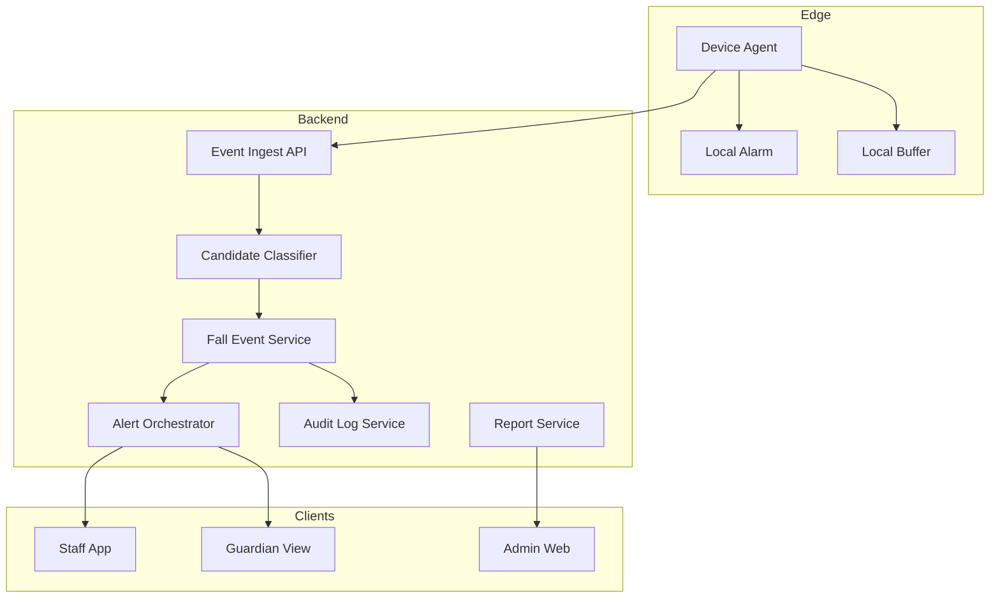
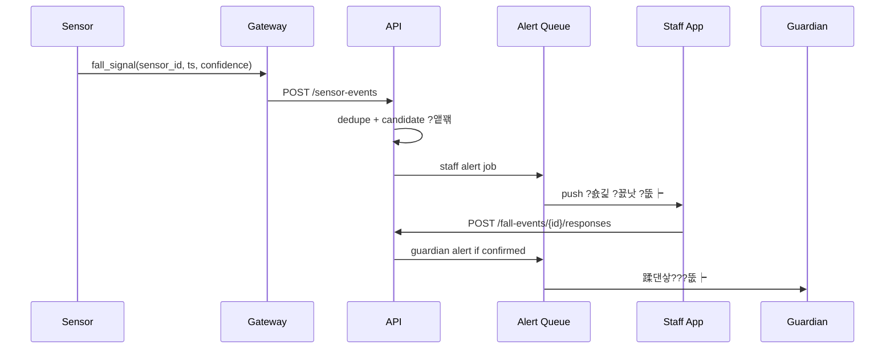
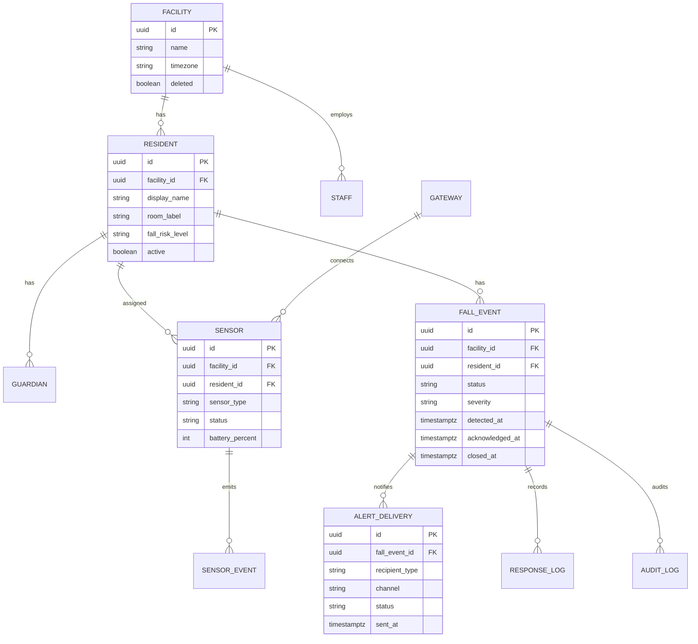

# Recon - ?붿뼇?쒖꽕 ?숈긽 媛먯? ?뚮┝ ?쒕퉬??
議곗궗 ?쒖젏: 2026-07-09

## ?꾨찓???낅Т ?먮쫫

1. ?낆냼?먮퀎 ?숈긽 ?꾪뿕?꾩? 蹂댄샇???곕씫泥섎? ?깅줉?쒕떎.
2. 移⑥긽, ?붿옣???? ?앺솢?? 蹂듬룄 ???꾪뿕 援ъ뿭???쇱꽌 ?먮뒗 李⑹슜??湲곌린瑜?諛곗튂?쒕떎.
3. ?쇱꽌媛€ ?숈긽 ?꾨낫 ?대깽?몃? 媛먯??섎㈃ 吏곸썝?먭쾶 ?곗꽑 ?뚮┝??蹂대궦??
4. 吏곸썝?€ ?꾩옣 ?뺤씤 ???ㅼ젣 ?숈긽/?ㅽ깘/?꾩? ?붿껌??遺꾨쪟?섍퀬 議곗튂 ?댁슜??湲곕줉?쒕떎.
5. 蹂댄샇?먮뒗 ?쒖꽕 ?뺤콉???곕씪 ?뺤젙 ?숈긽 ?먮뒗 ?κ린 誘명솗???대깽?몃쭔 ?섏떊?쒕떎.

## ?댄빐愿€怨꾩옄

- ?낆냼?? ?ъ깮?쒓낵 議댁뾼??蹂댄샇諛쏆쑝硫댁꽌 鍮좊Ⅸ ?꾩???諛쏆븘???쒕떎.
- ?붿뼇蹂댄샇??媛꾪샇?몃젰: ?쇨컙쨌援먮? ?곹솴?먯꽌???꾨씫 ?놁씠 ?뚮┝??諛쏆븘???쒕떎.
- ?쒖꽕??愿€由ъ옄: ?ш퀬 ?€??湲곕줉, 洹쒖젣 ?€?? ?쇱꽌 ?곹깭, ?뚮┝ ?ㅽ뙣瑜?愿€由ы빐???쒕떎.
- 蹂댄샇?? ?ㅼ젣 ?숈긽 ?먮뒗 以묐? ?대깽?몃? ?좎냽?섍퀬 ?좊ː 媛€?ν븯寃?諛쏆븘???쒕떎.
- ?ㅼ튂쨌?댁쁺 ?낆껜: ?쇱꽌 諛고꽣由? ?ㅽ듃?뚰겕, OTA, ?μ븷 蹂듦뎄瑜?梨낆엫?몄빞 ?쒕떎.

## 洹쒖젣쨌?쒖? 怨좊젮

- CDC??65???댁긽 ?숈긽???뷀븯怨??덈갑 媛€?ν븳 二쇱슂 ?먯긽 ?먯씤?대씪怨??ㅻ챸?섎ʼn, 2021??誘멸뎅?먯꽌 ?숈긽?쇰줈 38,000紐??댁긽???щ쭩?섍퀬 ?묎툒??諛⑸Ц????300留?嫄댁씠?덈떎怨??쒖떆?쒕떎. https://www.cdc.gov/falls/about/index.html
- CDC??2026???곗씠???섏씠吏€??誘멸뎅 65???댁긽 ?깆씤 4紐?以?1紐??댁긽??留ㅻ뀈 ?숈긽??蹂닿퀬?섍퀬, ??以???37%媛€ 移섎즺 ?먮뒗 ?쒕룞 ?쒗븳??珥덈옒???먯긽??寃쏀뿕?덈떎怨??쒖떆?쒕떎. https://www.cdc.gov/falls/data-research/index.html
- FDA??"fall prevention alarm/sensor"瑜?bed-patient monitor 怨꾩뿴 ?μ튂濡?遺꾨쪟?섎ʼn, ?щ엺?먭쾶 遺€李⑺븯嫄곕굹 ?쇱꽌 ?⑤뱶濡??ъ슜?섎뒗 諛⑹떇怨?nurse call ?곕룞 媛€?μ꽦???ㅻ챸?쒕떎. https://www.accessdata.fda.gov/scripts/cdrh/cfdocs/cfpcd/classification.cfm?id=PJO
- CMS ?κ린?붿뼇?쒖꽕 吏€移⑥? 嫄곗＜?먯쓽 議댁뾼, ?좏깮, ?덉쟾, 媛먮룆 ?섎Т瑜?媛뺤“?쒕떎. ?숈긽 ?뚮┝?€ 媛먯떆媛€ ?꾨땲???덉쟾 議곗튂?€ 湲곕줉?쇰줈 ?ㅺ퀎?댁빞 ?쒕떎. https://www.cms.gov/Regulations-and-Guidance/Guidance/Manuals/downloads/som107ap_pp_guidelines_ltcf.pdf
- ?쒓뎅 蹂닿굔蹂듭?遺€???κ린?붿뼇湲곌? CCTV ?ㅼ튂쨌愿€由ъ? ?곸긽 蹂닿?쨌?대엺 湲곗????ㅻ， 諛??덈떎. ?곸긽 ?ъ슜???듭뀡?€ 蹂꾨룄 ?숈쓽, 蹂닿?湲곌컙, ?대엺沅? ??젣 ?덉감瑜??ㅺ퀎?댁빞 ?쒕떎. https://www.mohw.go.kr/board.es?act=view&bid=0027&list_no=376156&mid=a10503010100
- 媛쒖씤?뺣낫蹂댄샇?꾩썝?뚮뒗 怨좎젙???곸긽?뺣낫泥섎━湲곌린 ?ㅼ튂쨌?댁쁺 媛€?대뱶?쇱씤???쒓났?쒕떎. ?곸긽???숈긽 媛먯???紐⑹쟻 ?쒗븳, ?덈궡, ?묎렐沅뚰븳, 蹂닿?湲곌컙, ?뱀쓬 湲덉? ?깆쓣 寃€?좏빐???쒕떎. https://www.pipc.go.kr/np/cop/bbs/selectBoardArticle.do?bbsId=BS217&mCode=D010030000&nttId=9870

## ?좎궗 ?쒗뭹쨌湲곕뒫 ?⑦꽩

- NCOA???숈긽 媛먯? ?μ튂媛€ 二쇰줈 媛€?띾룄怨? 湲곗븬怨? ?뚭퀬由ъ쬁??議고빀?섍퀬, ?숈긽 媛먯? ??紐⑤땲?곕쭅 ?쇳꽣 ?먮뒗 蹂댄샇?먯? ?곌껐?쒕떎怨??ㅻ챸?쒕떎. https://www.ncoa.org/product-resources/medical-alert-systems/best-medical-alert-systems-with-fall-detection/
- NCOA???먮ぉ?뺣낫??紐⑷구???덈━ 李⑹슜?뺤씠 ???€吏곸엫 ?ㅽ깘???곹뼢????諛쏆쓣 ???덈떎怨??ㅻ챸?쒕떎.
- LeadingAge CAST???κ린?붿뼇쨌?붿뼇?쒖꽕 ?덉쟾 湲곗닠???ш퀬 ?덈갑쨌蹂닿퀬, 鍮꾩긽 ?뚮┝, nurse call, ?꾩튂 異붿쟻, ?숈긽 媛먯?쨌?덈갑???ш큵?섎ʼn, ?꾩엯 ???멸뎄吏묐떒, 吏곸썝 ?붽뎄, IT ?명봽?? ?ъ씠踰꾨낫?? ?뚰듃????웾??寃€?좏븯?쇨퀬 沅뚭퀬?쒕떎. https://leadingage.org/safety-technology-for-long-term-and-post-acute-care-a-primer-and-provider-selection-guide/

## ?ㅽ깮 ?꾨낫

| ?꾨낫 | 援ъ꽦 | fit | ?몃젅?대뱶?ㅽ봽 |
|---|---|---:|---|
| A. ?쇱꽌 ?듯빀 ?곗꽑 | 移⑥긽/諛붾떏 ?뺣젰?쇱꽌 + 李⑹슜??IMU + 吏곸썝 ??| ?믪쓬 | ?꾨씪?대쾭??遺€????퀬 ?ㅼ튂 ?ъ?. 誘몄갑?㈑룸같?곕━ ?댁뒋 愿€由??꾩슂 |
| B. ?덉씠??鍮꾩쟾 AI | mmWave ?먮뒗 移대찓??湲곕컲 媛먯? + ?ｌ? 異붾줎 | 以묎컙 | 李⑹슜 遺€????쓬. 鍮꾩슜쨌?쒕떇쨌?곸긽/媛쒖씤?뺣낫 由ъ뒪????|
| C. 湲곗〈 nurse call ?뺤옣 | nurse call ?대깽??釉뚮━吏€ + 蹂댄샇???뚮┝ | 以묎컙 | ?쒖꽕 ?꾩엯?λ꼍 ??쓬. ?먮룞 ?숈긽 媛먯? ?뺥솗?꾨뒗 ?쒗븳 |
| D. ?ㅻ쭏?몄썙移?以묒떖 | ?곸슜 ?뚯튂 ??+ ?대씪?곕뱶 ?뚮┝ | ??쓬 | 鍮좊Ⅸ ?꾨줈?좏???媛€?? ?쒖꽕 ?⑥껜 ?댁쁺怨?李⑹슜 ?쒖쓳????쓣 ???덉쓬 |

## ?먮룞 梨꾪깮

MVP???꾨낫 A瑜?梨꾪깮?쒕떎. ?ъ쑀: ?붿뼇?쒖꽕?€ ?ъ깮?? ?ㅼ튂鍮? ?ㅽ깘 ?€?? 吏곸썝 ?뚰겕?뚮줈媛€ 以묒슂?섎?濡??곸긽 AI蹂대떎 ?쇱꽌 ?듯빀怨?吏곸썝 ?뺤씤 湲곕컲 ?뚮┝??珥덇린 ?곹빀?꾧? ?믩떎.


---

# Blindspot Register - ?붿뼇?쒖꽕 ?숈긽 媛먯? ?뚮┝ ?쒕퉬??
踰붿쐞: 怨듯넻 10異?+ STRIDE 6踰붿＜ + IoT/?ｌ? + B2B SaaS + 紐⑤컮??+ 愿€???뚮┝

| 異???ぉ | ?곹깭 | 泥섎━ | 洹쇨굅쨌異쒖쿂 |
|---|---|---|---|
| 湲곕뒫 踰붿쐞 | Assumed | MVP??媛먯?, 吏곸썝 ?뺤씤, 蹂댄샇???뚮┝, ?€??湲곕줉?쇰줈 ?쒗븳 | Seed |
| ?꾨찓???곗씠??紐⑤뜽 | Assumed | facility, resident, guardian, staff, sensor, fall_event, alert_delivery, response_log | ?붿뼇?쒖꽕 ?댁쁺 ?먮쫫 |
| UX ?먮쫫 | Assumed | 吏곸썝 ?곗꽑 ?뺤씤 ??蹂댄샇???뚮┝ | ?ㅽ깘 蹂댄샇, ?쇨컙 ?€??|
| 鍮꾧린??| Assumed | 吏곸썝 ?뚮┝ p95 10珥? ?뺤젙 ?대깽??蹂댄샇???뚮┝ p95 30珥?| ?앸챸?덉쟾 ?뚮┝ 湲곗???蹂댁닔?곸쑝濡??ㅼ젙 |
| ?듯빀 | Assumed | nurse call/webhook/MQTT/FCM/SMS 寃뚯씠?몄썾??| FDA 遺꾨쪟 ?ㅻ챸??nurse call ?곕룞 媛€?μ꽦 |
| ?ㅽ뙣 泥섎━ | Assumed | 以묐났 ?뚮┝ ?듭젣, 誘명솗??escalaton, ?ㅽ봽?쇱씤 踰꾪띁 | SRE ?뚮┝ ?먯튃 |
| ?쒖빟 | Assumed | ?먯뇙留??듭뀡, ?곸긽 誘몄궗??湲곕낯, ?섎즺 ?먮떒 湲덉? | 媛쒖씤?뺣낫쨌?섎즺湲곌린 由ъ뒪??異뺤냼 |
| ?⑹뼱 | Clear | ?숈긽 ?꾨낫, ?뺤젙 ?숈긽, ?ㅽ깘, 誘명솗?? ?κ린 誘몄쓳???뺤쓽 | PRD??諛섏쁺 |
| ?꾨즺 ?좏샇 | Assumed | SC-001~SC-008 pass/fail 湲곗? | quality-decomposition ?곸슜 |
| 鍮꾩슜쨌?쇱씠?좎뒪 | Assumed | ?쇱꽌+寃뚯씠?몄썾????援щ룆, SMS 醫낅웾 怨쇨툑 | B2B SaaS 愿€??|
| STRIDE Spoofing | Assumed | ?쇱꽌蹂?X.509 ?먮뒗 per-device key, 吏곸썝 MFA ?듭뀡 | AWS IoT Lens ?먯튃 |
| STRIDE Tampering | Assumed | ?대깽???댁떆, append-only 媛먯궗濡쒓렇 | ?ш퀬湲곕줉 ?좊ː??|
| STRIDE Repudiation | Assumed | ?뚮┝ ?섏떊/?뺤씤/議곗튂???쒓컖 湲곕줉 | CMS瑜?媛먮룆쨌湲곕줉 ?붽뎄 |
| STRIDE Information Disclosure | Assumed | 蹂댄샇?먮퀎 ?낆냼??踰붿쐞 沅뚰븳, ?곸긽 湲곕낯 ?쒖쇅 | 媛쒖씤?뺣낫 理쒖냼?섏쭛 |
| STRIDE Denial of Service | Assumed | ?뚮┝ ??遺꾨━, rate limit, storm suppression | SRE ?뚮┝ ?먯튃 |
| STRIDE Elevation of Privilege | Assumed | ?쒖꽕/?낆냼??蹂댄샇???ㅼ퐫??RBAC | 硫€?고뀒?뚰듃 SaaS |
| IoT 諛고꽣由?| Asked -> Assumed | 異붿쿇??梨꾪깮: ?쇱꽌 諛고꽣由?6媛쒖썡 ?댁긽 紐⑺몴, 14????援먯껜 ?뚮┝ | ?댁쁺 異쒕룞 鍮꾩슜 |
| IoT ?ㅽ봽?쇱씤 | Asked -> Assumed | 異붿쿇??梨꾪깮: 寃뚯씠?몄썾??濡쒖뺄 踰꾪띁 24?쒓컙, 蹂듦뎄 ???쒖꽌 蹂댁옣 ?꾩넚 | ?먯뇙留씲룹옣???€鍮?|
| IoT OTA | Assumed | ?쒕챸??OTA, canary, ?먮룞 濡ㅻ갚 | IoT ?댁쁺 湲곕낯媛?|
| IoT ?쒓컖 ?숆린??| Assumed | 寃뚯씠?몄썾??NTP, ?먯뇙留앹? 濡쒖뺄 NTP | 媛먯궗濡쒓렇 ?쒖꽌 |
| 紐⑤컮???뚮┝ | Asked -> Assumed | 異붿쿇??梨꾪깮: 吏곸썝 ??push + SMS fallback, 蹂댄샇?먮뒗 ??移댁뭅??SMS ?좏깮 | ?뚮┝ ?ㅽ뙣 ?€??|
| 蹂댄샇??怨듦컻 踰붿쐞 | Asked -> Assumed | 異붿쿇??梨꾪깮: ?뺤젙 ?숈긽쨌?κ린 誘명솗?몃쭔 蹂댄샇???뚮┝, ?먯떆 ?쇱꽌媛?鍮꾧났媛?| ?ъ깮?쑣룹삤??誘쇱썝 異뺤냼 |
| ?곸긽 ?ъ슜 | Asked -> Assumed | 異붿쿇??梨꾪깮: MVP ?곸긽 誘몄궗?? ?좏깮 紐⑤뱢濡쒕쭔 ?ㅺ퀎 | 媛쒖씤?뺣낫쨌?ㅼ튂 由ъ뒪??|
| 洹쒖젣 ?ъ??붾떇 | Asked -> Assumed | 異붿쿇??梨꾪깮: ?섎즺 吏꾨떒쨌移섎즺媛€ ?꾨땶 ?덉쟾 ?뚮┝/湲곕줉 ?쒕퉬??| ?명뿀媛€ 由ъ뒪??愿€由?|

## 吏덈Ц 諛곗튂?€ ?먮룞 梨꾪깮

### Q1. 媛먯? 諛⑹떇

| ?듭뀡 | ?댁슜 | ?몃젅?대뱶?ㅽ봽 |
|---|---|---|
| A (異붿쿇) | 移⑥긽/諛붾떏 ?쇱꽌 + 李⑹슜??IMU ?듯빀 | ?꾨씪?대쾭????쓬, ?뺥솗??蹂댁셿 媛€?? 李⑹슜 ?쒖쓳??愿€由??꾩슂 |
| B | 移대찓??AI | 媛먯? 踰붿쐞 ?볦쓬, 媛쒖씤?뺣낫쨌?숈쓽쨌蹂닿? 遺€????|
| C | ?곸슜 ?뚯튂 | 鍮좊Ⅸ ?쒖옉, ?쒖꽕 ?⑥껜 ?댁쁺쨌異⑹쟾 愿€由??대젮?€ |

梨꾪깮: A

### Q2. 蹂댄샇???뚮┝ 議곌굔

| ?듭뀡 | ?댁슜 | ?몃젅?대뱶?ㅽ봽 |
|---|---|---|
| A (異붿쿇) | 吏곸썝 ?뺤씤 ???뺤젙 ?숈긽留?利됱떆 ?뚮┝, 誘명솗??3遺?珥덇낵???뚮┝ | ?ㅽ깘 誘쇱썝怨??€???섏떖??洹좏삎 泥섎━ |
| B | 紐⑤뱺 ?숈긽 ?꾨낫 利됱떆 蹂댄샇???뚮┝ | ?щ챸?섏?留??ㅽ깘 遺덉븞怨??쇨컙 誘쇱썝 利앷? |
| C | ?쒖꽕???섎룞?쇰줈留?蹂댄샇???뚮┝ | ?낅Т 遺€?닿낵 ?꾨씫 ?꾪뿕 利앷? |

梨꾪깮: A

### Q3. ?곸긽 ?ъ슜

| ?듭뀡 | ?댁슜 | ?몃젅?대뱶?ㅽ봽 |
|---|---|---|
| A (異붿쿇) | MVP ?곸긽 誘몄궗?? ?쇱꽌 ?대깽?몄? 議곗튂 湲곕줉留??€??| ?꾨씪?대쾭?쑣룸룞??遺€????쓬 |
| B | ?대깽???꾪썑 吏㏃? ?곸긽 ?대┰ ?€??| ?뺤씤???믪쓬, ?곸긽?뺣낫 洹쒖젣 ?€???꾩슂 |
| C | ?곸떆 ?뱁솕 遺꾩꽍 | ?뺥솗??媛€?μ꽦, ?꾩엯쨌洹쒖젣 由ъ뒪????|

梨꾪깮: A

### Q4. ?ㅽ듃?뚰겕 ?μ븷 ?€??
| ?듭뀡 | ?댁슜 | ?몃젅?대뱶?ㅽ봽 |
|---|---|---|
| A (異붿쿇) | 寃뚯씠?몄썾??濡쒖뺄 ?뚮┝쨌踰꾪띁, 蹂듦뎄 ??以묒븰 ?숆린??| ?꾩옣 ?€???좎?, 援ы쁽 蹂듭옟??利앷? |
| B | ?대씪?곕뱶 ?곌껐 ?꾩닔 | ?⑥닚?섏?留??μ븷 ??移섎챸??|

梨꾪깮: A

### Q5. ?쒕퉬???ъ??붾떇

| ?듭뀡 | ?댁슜 | ?몃젅?대뱶?ㅽ봽 |
|---|---|---|
| A (異붿쿇) | ?덉쟾 ?뚮┝/?€??湲곕줉 ?쒕퉬?? ?섎즺 吏꾨떒 二쇱옣 湲덉? | 異쒖떆 由ъ뒪????쓬, 留덉????쒗쁽 ?쒗븳 |
| B | ?섎즺湲곌린 ?몄쬆 ?꾩젣濡?吏꾨떒쨌?섏옄媛먯떆?μ튂 二쇱옣 | ?좊ː??媛€?? ?쇱젙쨌?명뿀媛€ 鍮꾩슜 ??|

梨꾪깮: A

## 諛섏쁺 湲곕줉

- decision-log #1: ?쇱꽌 ?듯빀 MVP 梨꾪깮
- decision-log #2: 吏곸썝 ?뺤씤 ?곗꽑 蹂댄샇???뚮┝ 梨꾪깮
- decision-log #3: ?곸긽 誘몄궗??湲곕낯 梨꾪깮
- decision-log #4: 寃뚯씠?몄썾??濡쒖뺄 ?μ븷 ?€??梨꾪깮
- decision-log #5: ?덉쟾 ?뚮┝ ?쒕퉬???ъ??붾떇 梨꾪깮


---

# PRD - ?붿뼇?쒖꽕 ?숈긽 媛먯? ?뚮┝ ?쒕퉬??
## 諛곌꼍

怨좊졊???숈긽?€ 鍮덈쾲?섍퀬 ?덈갑 媛€?ν븳 二쇱슂 ?덉쟾 ?댁뒋?? ?붿뼇?쒖꽕?먯꽌???숈긽 ?먯껜蹂대떎 諛쒓껄 吏€?? ?쇨컙 誘명솗?? 蹂댄샇???뚰넻 ?꾨씫, ?ш퀬湲곕줉 遺€?ㅼ씠 ?????댁쁺 由ъ뒪?ш? ?쒕떎. MVP??"?숈긽 ?꾨낫 媛먯??€ ?€???꾨씫 諛⑹?"??吏묒쨷?쒕떎.

## ?쒗뭹 紐⑺몴

1. ?숈긽 ?꾨낫 ?대깽??諛쒖깮 ??吏곸썝??10珥??대궡 ?뚮┝??諛쏅룄濡??쒕떎.
2. 吏곸썝???ㅼ젣 ?숈긽 ?щ??€ 議곗튂 寃곌낵瑜?2遺??대궡 湲곕줉?섎룄濡??좊룄?쒕떎.
3. 蹂댄샇?먯뿉寃??뺤젙 ?숈긽 ?먮뒗 ?κ린 誘명솗???대깽?몃? 30珥??대궡 ?꾨떖?쒕떎.

## ?ъ슜???ㅽ넗由?
- P1: ?붿뼇蹂댄샇?щ줈???숈긽 ?꾨낫 ?대깽?몃? 利됱떆 諛쏆븘 ?꾩옣??鍮좊Ⅴ寃??대룞?섍퀬 ?띕떎.
- P1: 媛꾪샇梨낆엫?먮줈???ㅼ젣 ?숈긽, ?ㅽ깘, 誘명솗???대깽?몃? 異붿쟻??援먮? 以??꾨씫??留됯퀬 ?띕떎.
- P1: 蹂댄샇?먮줈???ㅼ젣 ?숈긽 ?먮뒗 ?뺤씤 吏€???곹솴留??좊ː???덇쾶 諛쏄퀬 ?띕떎.
- P2: ?쒖꽕?μ쑝濡쒖꽌 ?낆냼?먮퀎 ?꾪뿕?? ?쇱꽌 ?곹깭, ?€???쒓컙??由ы룷?몃줈 蹂닿퀬 ?띕떎.
- P2: ?ㅼ튂 ?댁쁺?먮줈??諛고꽣由? ?듭떊, ?쇱꽌 ?μ븷瑜??먭꺽 ?먭??섍퀬 ?띕떎.

## ?붽뎄?ы빆

| ID | ?붽뎄?ы빆 | ?곗꽑?쒖쐞 | 異쒖쿂 |
|---|---|---|---|
| FR-001 | ?쒖뒪?쒖? ?낆냼?? 蹂댄샇?? 吏곸썝, ?쒖꽕, ?쇱꽌瑜??깅줉쨌?섏젙쨌鍮꾪솢?깊솕?댁빞 ?쒕떎. | P0 | ?ㅽ넗由?P1 |
| FR-002 | ?쒖뒪?쒖? ?쇱꽌 ?대깽?몃? ?섏떊?섍퀬 ?숈긽 ?꾨낫 ?대깽?몃? ?앹꽦?댁빞 ?쒕떎. | P0 | ?ㅽ넗由?P1 |
| FR-003 | ?쒖뒪?쒖? ?숈씪 ?낆냼?먃룰뎄??뿉??諛쒖깮??以묐났 ?숈긽 ?꾨낫瑜??ㅼ젙 ?쒓컙 ?숈븞 蹂묓빀?댁빞 ?쒕떎. | P0 | ?ㅽ깘/?뚮┝ ??＜ |
| FR-004 | ?쒖뒪?쒖? 吏곸썝?먭쾶 ?숈긽 ?꾨낫 ?뚮┝??push濡?蹂대궡怨??ㅽ뙣 ??SMS fallback???섑뻾?댁빞 ?쒕떎. | P0 | Q4 |
| FR-005 | 吏곸썝?€ ?뚮┝???뺤씤?섍퀬 ?곹깭瑜??ㅼ젣 ?숈긽, ?ㅽ깘, ?꾩????꾩슂?? 誘명솗?몄쑝濡?湲곕줉?댁빞 ?쒕떎. | P0 | ?ㅽ넗由?P1 |
| FR-006 | ?쒖뒪?쒖? ?뺤젙 ?숈긽 ?먮뒗 3遺?珥덇낵 誘명솗???대깽?몃? 蹂댄샇?먯뿉寃??뚮젮???쒕떎. | P0 | Q2 |
| FR-007 | 紐⑤뱺 ?대깽?? ?뚮┝, ?뺤씤, 議곗튂 湲곕줉?€ append-only 媛먯궗濡쒓렇濡??€?ν빐???쒕떎. | P0 | STRIDE R/T |
| FR-008 | ?쒖뒪?쒖? ?쇱꽌 諛고꽣由? ?ㅽ봽?쇱씤, ?듭떊 吏€???곹깭瑜?愿€由ъ옄?먭쾶 蹂댁뿬以섏빞 ?쒕떎. | P1 | IoT ?댁쁺 |
| FR-009 | ?쒖뒪?쒖? ?쒖꽕쨌?낆냼??踰붿쐞 沅뚰븳??寃€?ы빐???쒕떎. | P0 | 蹂댁븞 |
| FR-010 | ?쒖뒪?쒖? ?붽컙 ?숈긽 ?꾨낫, ?ㅼ젣 ?숈긽, ?됯퇏 ?뺤씤 ?쒓컙, ?ㅽ깘瑜?由ы룷?몃? ?쒓났?댁빞 ?쒕떎. | P1 | ?쒖꽕 ?댁쁺 |
| FR-011 | ?쒖뒪?쒖? ?곸긽 ?놁씠 ?숈옉?댁빞 ?섎ʼn, ?곸긽 紐⑤뱢???쒖꽦?붾맂 寃쎌슦 蹂꾨룄 ?숈쓽쨌蹂닿??뺤콉???붽뎄?댁빞 ?쒕떎. | P1 | Q3 |
| FR-012 | 寃뚯씠?몄썾?대뒗 以묒븰 ?곌껐 ?μ븷 以묒뿉??濡쒖뺄 ?뚮┝怨?24?쒓컙 踰꾪띁留곸쓣 吏€?먰빐???쒕떎. | P1 | Q4 |

## ?ｌ? 耳€?댁뒪

- Given ?쇱꽌媛€ 媛숈? ?낆냼?먯뿉寃?30珥??덉뿉 5???대깽?몃? 蹂대궪 ?? When ?쒕쾭媛€ ?대깽?몃? ?섏떊?섎㈃, Then ?⑥씪 ?숈긽 ?꾨낫濡?蹂묓빀?섍퀬 storm 吏€?쒕? 湲곕줉?쒕떎.
- Given 吏곸썝 push媛€ ?ㅽ뙣???? When 5珥??덉뿉 ?섏떊 ?뺤씤???놁쑝硫? Then SMS fallback怨??ㅼ쓬 ?뱀쭅??escalaton???ㅽ뻾?쒕떎.
- Given 以묒븰 ?쒕쾭 ?곌껐???딄꼈???? When ?숈긽 ?꾨낫媛€ 諛쒖깮?섎㈃, Then 寃뚯씠?몄썾?대뒗 ?꾩옣 ?뚮┝???몃━怨?蹂듦뎄 ???대깽?몃? ?쒖꽌?€濡??꾩넚?쒕떎.
- Given 蹂댄샇?먭? ?ㅻⅨ ?낆냼???뚮┝ URL?????? When 沅뚰븳 寃€?щ? ?섑뻾?섎㈃, Then 403??諛섑솚?섍퀬 ?묎렐 ?쒕룄瑜?媛먯궗濡쒓렇???④릿??

## ?깃났 湲곗?

| ID | 湲곗? | 紐⑺몴 | 痢≪젙 諛⑸쾿 |
|---|---|---:|---|
| SC-001 | 吏곸썝 ?뚮┝ 吏€??| p95 10珥??댄븯 | ?대깽???섏떊 ?쒓컖~吏곸썝 ?⑤쭚 ?섏떊 ?쒓컖 |
| SC-002 | 蹂댄샇???뚮┝ 吏€??| p95 30珥??댄븯 | ?뺤젙/?κ린 誘명솗???쒓컖~諛쒖넚 ?깃났 ?쒓컖 |
| SC-003 | 誘명솗??諛⑹? | 誘명솗??3遺?珥덇낵 0嫄???紐⑺몴 | escalaton 濡쒓렇 |
| SC-004 | ?ㅽ깘 愿€由?| ?뚯씪??4二????ㅽ깘瑜?湲곗????€鍮?30% 媛쒖꽑 | 吏곸썝 ?먯젙 ?쇰꺼 |
| SC-005 | ?쇱꽌 媛€?⑹꽦 | ?쇱꽌 ?⑤씪??鍮꾩쑉 ??99% ?댁긽 | heartbeat |
| SC-006 | 媛먯궗 異붿쟻 | ?숈긽 ?대깽??100%媛€ 議곗튂?먃룹떆媛겶룹긽??蹂댁쑀 | DB 寃€??|
| SC-007 | 沅뚰븳 蹂댄샇 | 援먯감 ?쒖꽕 ?묎렐 ?뚯뒪??100% 李⑤떒 | 蹂댁븞 ?뚯뒪??|
| SC-008 | ?μ븷 蹂듦뎄 | 24?쒓컙 ?댄븯 ?ㅽ봽?쇱씤 ?대깽??100% ?숆린??| 寃뚯씠?몄썾???ъ뿰寃??뚯뒪??|

## UI 諛⑺뼢

- 吏곸썝 ??泥??붾㈃?€ "誘명솗???숈긽 ?꾨낫" 紐⑸줉怨????뺤씤 踰꾪듉??以묒떖?쇰줈 ?쒕떎.
- 蹂댄샇???붾㈃?€ ?ш퀬 ?ъ떎, ?뺤씤 ?쒓컖, ?쒖꽕 ?곕씫 寃쎈줈留?蹂댁뿬二쇨퀬 ?먯떆 ?쇱꽌媛믪? ?쒖떆?섏? ?딅뒗??
- 愿€由ъ옄 ?붾㈃?€ ?쒖꽕蹂??쇱꽌 ?곹깭, ?됯퇏 ?뺤씤 ?쒓컙, ?ㅽ깘瑜? 誘명솗???대깽?몃? ?쒖? ?꾪꽣 以묒떖?쇰줈 ?쒓났?쒕떎.

## 踰붿쐞 諛?
- ?섎즺 吏꾨떒, 移섎즺 沅뚭퀬, ?먮룞 119 ?좉퀬??MVP 踰붿쐞媛€ ?꾨땲??
- ?곸떆 ?곸긽 ?뱁솕?€ ?곸긽 AI ?먯젙?€ MVP 踰붿쐞媛€ ?꾨땲??
- 蹂댄뿕 泥?뎄, ?꾩옄?섎Т湲곕줉 ?ъ링 ?곕룞?€ MVP 踰붿쐞媛€ ?꾨땲??

## 媛€??
- ?낆냼???먮뒗 踰뺤젙?€由ъ씤???쒕퉬???댁슜 ?숈쓽瑜??쒖꽕???섏쭛?쒕떎.
- ?붿뼇?쒖꽕 ??Wi-Fi ?먮뒗 ?좎꽑 寃뚯씠?몄썾?대? ?ㅼ튂?????덈떎.
- 吏곸썝?€ 洹쇰Т 以????먮뒗 ?낅Т???⑤쭚???ъ슜?쒕떎.


---

# Architecture - ?붿뼇?쒖꽕 ?숈긽 媛먯? ?뚮┝ ?쒕퉬??
## Context & Scope

MVP???쇱꽌 ?대깽?몃? ?섏떊?섍퀬, ?숈긽 ?꾨낫瑜?吏곸썝?먭쾶 ?곗꽑 ?뚮┝???? 吏곸썝 ?뺤씤 寃곌낵???곕씪 蹂댄샇???뚮┝怨?媛먯궗 湲곕줉???④린???쒖뒪?쒖씠?? ?곸긽 AI?€ ?섎즺 吏꾨떒?€ ?쒖쇅?쒕떎.

## ?쒖뒪??而⑦뀓?ㅽ듃

```mermaid
flowchart LR
  Sensor[?쇱꽌/李⑹슜???붾컮?댁뒪] --> Gateway[?쒖꽕 寃뚯씠?몄썾??
  Gateway --> API[Fall Alert API]
  API --> DB[(Operational DB)]
  API --> Queue[Alert Queue]
  Queue --> Push[Push/SMS/Kakao Provider]
  Push --> Staff[吏곸썝 ??
  Push --> Guardian[蹂댄샇????硫붿떆吏€]
  Admin[愿€由ъ옄 ?? --> API
  NurseCall[Nurse Call/Webhook] <--> Gateway
```

## 援ы쁽 ?묎렐

- ?쇱꽌?€ ?쒕쾭 ?ъ씠?먮뒗 ?쒖꽕 寃뚯씠?몄썾?대? ?붾떎. 寃뚯씠?몄썾?대뒗 濡쒖뺄 ?뚮┝, 踰꾪띁, ?쇱꽌 heartbeat, ?쒕챸 寃€利앹쓣 ?대떦?쒕떎.
- ?쒕쾭??硫€?고뀒?뚰듃 SaaS濡?facility_id ?ㅼ퐫?꾨? 紐⑤뱺 荑쇰━?€ 沅뚰븳 寃€?ъ뿉 媛뺤젣?쒕떎.
- ?뚮┝?€ ?대깽???섏떊 ?몃옖??뀡怨?遺꾨━???먮줈 泥섎━?섍퀬, idempotency key濡?以묐났 諛쒖넚??留됰뒗??
- ?대깽??湲곕줉?€ append-only event_log?€ ?꾩옱 ?곹깭 fall_event瑜?遺꾨━?쒕떎.

## 而댄룷?뚰듃 援ъ“



## ?곗씠???먮쫫



## ?곗씠???€??寃곗젙

- ?댁쁺 DB: PostgreSQL ?곗꽑, MSSQL ?명솚 ?ㅽ궎留??좎? 媛€?? 援ъ“???대깽?맞룰텒?쑣룸━?ы듃???곹빀?섎떎.
- ?대깽??濡쒓렇: append-only ?뚯씠釉? ?댁떆 泥댁씤 ?먮뒗 ?댁쟾 濡쒓렇 ID瑜??€?ν빐 蹂€議??먯?瑜?吏€?먰븳??
- 寃뚯씠?몄썾??踰꾪띁: SQLite ?먮뒗 embedded KV. 24?쒓컙 ?대깽?몃? ?쒖꽌 蹂댁옣?쇰줈 ?€?ν븳??
- ?먯떆 ?쇱꽌媛? MVP?먯꽌???숈긽 ?꾨낫 ?먮떒???꾩슂??理쒖냼媛믩쭔 30??蹂닿?, ?κ린 遺꾩꽍?€ ?듬챸 吏묎퀎留?蹂닿??쒕떎.

## 寃€?좏븳 ?€??
| ?€??| 寃곗젙 | ?ъ쑀 |
|---|---|---|
| 移대찓??AI 以묒떖 | 蹂대쪟 | ?꾨씪?대쾭?쑣룸룞?샕룸낫愿€쨌?ㅼ튂 鍮꾩슜 由ъ뒪?ш? ??|
| ?대씪?곕뱶 吏곸젒 ?쇱꽌 ?곌껐 | ?쒖쇅 | ?쒖꽕 ?ㅽ듃?뚰겕 ?μ븷 ???꾩옣 ?뚮┝ 遺덇? |
| 紐⑤뱺 ?대깽??蹂댄샇??利됱떆 ?뚮┝ | ?쒖쇅 | ?ㅽ깘 誘쇱썝怨?遺덉븞????|
| 吏곸썝 ?뺤씤 ?곗꽑 | 梨꾪깮 | ?€???덉쭏怨?蹂댄샇???좊ː瑜?洹좏삎??|

## ?꾪삊 紐⑤뜽

### DFD?€ trust boundary

```mermaid
flowchart LR
  subgraph FacilityTrust[?쒖꽕 ?대?]
    Sensor
    Gateway
    StaffDevice[吏곸썝 ?⑤쭚]
  end
  subgraph CloudTrust[?쒕퉬???쒕쾭]
    API
    DB
    Queue
  end
  subgraph ExternalTrust[?몃?]
    PushProvider[?뚮┝ ?ъ뾽??
    GuardianDevice[蹂댄샇???⑤쭚]
  end
  Sensor --> Gateway --> API --> DB
  API --> Queue --> PushProvider --> StaffDevice
  PushProvider --> GuardianDevice
```

| 寃쎄퀎/?먯궛 | S | T | R | I | D | E |
|---|---|---|---|---|---|---|
| ?쇱꽌->寃뚯씠?몄썾??| ?μ튂 ?ㅻ줈 ?꾩“ 諛⑹? | ?쒕챸쨌nonce | ?섏떊 濡쒓렇 | 理쒖냼 payload | rate limit | ?μ튂蹂?沅뚰븳 |
| 寃뚯씠?몄썾??>API | mTLS/API key | body hash | request id | TLS | queue/backoff | tenant scope |
| 吏곸썝/蹂댄샇????>API | JWT/MFA ?듭뀡 | CSRF 諛⑹? | audit log | RBAC | rate limit | 沅뚰븳肄붾뱶 |
| ?뚮┝ ?ъ뾽??| 諛쒖떊??寃€利?| callback 寃€利?| delivery log | 誘쇨컧?뺣낫 理쒖냼??| fallback | provider 沅뚰븳 寃⑸━ |

## ?곸쐞 由ъ뒪?ъ? ?꾪솕

1. 誘명깘?쇰줈 ?ㅼ젣 ?숈긽 ?€??吏€?? ?쇱꽌 ?듯빀, heartbeat, 吏곸썝 ?좉퀬 踰꾪듉, ?뺢린 ?깅뒫 由ы룷?몃줈 ?꾪솕?쒕떎.
2. ?ㅽ깘?쇰줈 吏곸썝 ?쇰줈?€ 蹂댄샇??遺덉븞 利앷?: 吏곸썝 1李??뺤씤, storm suppression, ?낆냼?먮퀎 誘쇨컧??議곗젙?쇰줈 ?꾪솕?쒕떎.
3. 媛쒖씤?뺣낫쨌?곸긽?뺣낫 移⑦빐: ?곸긽 誘몄궗??湲곕낯, 理쒖냼?섏쭛, 蹂댄샇??踰붿쐞 沅뚰븳, 蹂닿?湲곌컙 ?쒗븳?쇰줈 ?꾪솕?쒕떎.
4. ?ㅽ듃?뚰겕 ?μ븷: 寃뚯씠?몄썾??濡쒖뺄 ?뚮┝怨?24?쒓컙 踰꾪띁留곸쑝濡??꾪솕?쒕떎.


---

# API Contract & Data Schema - ?붿뼇?쒖꽕 ?숈긽 媛먯? ?뚮┝ ?쒕퉬??
## 怨듯넻 洹쒖빟

- ?몄쬆: 吏곸썝/愿€由ъ옄/蹂댄샇??JWT, 寃뚯씠?몄썾?대뒗 mTLS ?먮뒗 device API key
- 硫€?고뀒?뚰듃: 紐⑤뱺 由ъ냼?ㅻ뒗 facility_id ?ㅼ퐫?꾨? 媛€吏꾨떎.
- ?ㅻ쪟 ?щ㎎: RFC 9457 Problem JSON
- ?쒓컙: UTC ISO-8601 ?€?? UI???쒖꽕 ?쒓컙?€濡??쒖떆
- 硫깅벑?? ?쇱꽌 ?대깽?몄? ?뚮┝ 諛쒖넚?€ Idempotency-Key ?먮뒗 device_event_id瑜??ъ슜?쒕떎.
- ?섏씠吏€?ㅼ씠?? cursor 湲곕컲

## ?붾뱶?ъ씤??
| ID | 硫붿꽌??寃쎈줈 | ?붿껌 | ?묐떟 | ?ㅻ쪟 | 沅뚰븳 |
|---|---|---|---|---|---|
| API-001 | POST /api/v1/facilities/{facilityId}/residents | ?대쫫, 諛?援ъ뿭, ?꾪뿕?? 蹂댄샇??紐⑸줉 | resident | 400,403,409 | fall:resident:write |
| API-002 | POST /api/v1/facilities/{facilityId}/sensors | sensor_type, location, resident_id? | sensor | 400,403 | fall:sensor:write |
| API-003 | POST /api/v1/gateways/{gatewayId}/sensor-events | device_event_id, sensor_id, ts, signal_type, confidence | fall_event? | 400,401,409,422 | device:events:write |
| API-004 | GET /api/v1/facilities/{facilityId}/fall-events | status, resident_id, cursor | event page | 403 | fall:event:read |
| API-005 | POST /api/v1/fall-events/{eventId}/ack | staff_id, location_confirmed | event | 403,409 | fall:event:ack |
| API-006 | POST /api/v1/fall-events/{eventId}/responses | status, severity, note, actions[] | event | 400,403,409 | fall:event:respond |
| API-007 | POST /api/v1/fall-events/{eventId}/guardian-notifications | reason, channels[] | delivery ids | 403,409 | fall:guardian:notify |
| API-008 | GET /api/v1/facilities/{facilityId}/sensor-health | status filter | health list | 403 | fall:sensor:read |
| API-009 | GET /api/v1/facilities/{facilityId}/reports/fall-summary | period | metrics | 403 | fall:report:read |
| API-010 | GET /api/v1/guardian/fall-events/{shareToken} | token | guardian-safe event | 401,403,410 | guardian:event:read |

## OpenAPI ?ㅼ?移?
```yaml
paths:
  /api/v1/gateways/{gatewayId}/sensor-events:
    post:
      summary: Ingest sensor event from facility gateway
      parameters:
        - name: gatewayId
          in: path
          required: true
          schema: { type: string }
        - name: Idempotency-Key
          in: header
          required: true
          schema: { type: string, maxLength: 128 }
      requestBody:
        required: true
        content:
          application/json:
            schema:
              type: object
              required: [deviceEventId, sensorId, occurredAt, signalType]
              properties:
                deviceEventId: { type: string }
                sensorId: { type: string }
                occurredAt: { type: string, format: date-time }
                signalType: { type: string, enum: [impact, pressure_change, inactivity, manual_call] }
                confidence: { type: number, minimum: 0, maximum: 1 }
      responses:
        "202": { description: Accepted }
        "409": { description: Duplicate event }
```

## ERD



## ?곗씠??洹쒖튃

- fall_event.status: candidate, acknowledged, confirmed_fall, false_alarm, needs_help, unresolved, closed
- severity: low, medium, high, emergency
- 蹂댄샇???붾㈃?먮뒗 resident display_name, detected_at, confirmed_at, facility contact, staff note summary留??몄텧?쒕떎.
- ?먯떆 ?쇱꽌 ?대깽?몃뒗 湲곕낯 30?? 媛먯궗濡쒓렇?€ ?뺤젙 ?숈긽 湲곕줉?€ 怨꾩빟쨌踰뺣Т ?뺤콉???곕씪 蹂꾨룄 蹂댁〈?쒕떎.

## ?붽뎄?ы빆 而ㅻ쾭由ъ?

| FR-ID | ?붾뱶?ъ씤???대깽??|
|---|---|
| FR-001 | API-001, API-002 |
| FR-002 | API-003 |
| FR-003 | API-003 ?대? dedupe |
| FR-004 | API-003 -> alert job |
| FR-005 | API-005, API-006 |
| FR-006 | API-007, API-010 |
| FR-007 | 紐⑤뱺 write API -> AUDIT_LOG |
| FR-008 | API-008 |
| FR-009 | 紐⑤뱺 API 沅뚰븳 |
| FR-010 | API-009 |
| FR-011 | ?ㅼ젙 ?뚮옒洹몄? guardian-safe projection |
| FR-012 | Gateway buffer protocol |

P0/P1 ?붽뎄?ы빆 而ㅻ쾭由ъ?: 100%


---

# Test Design - ?붿뼇?쒖꽕 ?숈긽 媛먯? ?뚮┝ ?쒕퉬??
## ?먯튃

- PRD??SC?€ P0/P1 FR?€ 援ы쁽 ???ㅽ뙣 ?뚯뒪?몃줈 癒쇱? ?묒꽦?쒕떎.
- ?뚯뒪???쇰씪誘몃뱶??unit 70%, integration/contract 20%, E2E 10%瑜?紐⑺몴濡??쒕떎.
- ?앸챸?덉쟾 ?뚮┝ 寃쎈줈???뺤긽, 寃쎄퀎, ?ㅽ뙣, 沅뚰븳 ?놁쓬, 以묐났, 吏€?곗쓣 紐⑤몢 ?ы븿?쒕떎.

## ?쒕굹由ъ삤 蹂€?섑몴

| SC/FR | Gherkin ?쒕굹由ъ삤 | ?덉씠??| ?곗씠??|
|---|---|---|---|
| FR-002/SC-001 | Given ?쇱꽌媛€ ?숈긽 ?좏샇瑜?蹂대깉????When API媛€ ?대깽?몃? ?섏떊?섎㈃ Then 吏곸썝 ?뚮┝ job??10珥?SLO ?쒓렇濡??앹꽦?쒕떎 | integration | sensor_event |
| FR-003 | Given ?숈씪 ?낆냼???대깽?멸? 30珥??덉뿉 諛섎났????When ?섏떊?섎㈃ Then fall_event??1嫄댁씠怨?以묐났 移댁슫?몃쭔 利앷??쒕떎 | unit/integration | duplicate events |
| FR-004/SC-001 | Given push provider媛€ ?ㅽ뙣????When 5珥???ack媛€ ?놁쑝硫?Then SMS fallback??諛쒖넚?쒕떎 | contract/integration | provider mock |
| FR-005/SC-006 | Given 吏곸썝???ㅼ젣 ?숈긽?쇰줈 ?묐떟????When 議곗튂 ?댁슜???€?ν븯硫?Then ?곹깭, 議곗튂?? ?쒓컖, 媛먯궗濡쒓렇媛€ ?€?λ맂??| integration | staff response |
| FR-006/SC-002 | Given fall_event媛€ confirmed_fall????When 蹂댄샇???뚮┝ ?뺤콉???됯??섎㈃ Then 蹂댄샇???뚮┝??30珥?SLO ?쒓렇濡??앹꽦?쒕떎 | unit/integration | guardian |
| FR-006 | Given ?숈긽 ?꾨낫媛€ 3遺꾧컙 誘명솗?몄씪 ??When escalator媛€ ?ㅽ뻾?섎㈃ Then 蹂댄샇?먯? 梨낆엫?먯뿉寃?誘명솗???뚮┝???앹꽦?쒕떎 | integration | scheduler |
| FR-007 | Given ?대깽???곹깭媛€ 蹂€寃쎈맆 ??When ?€?ν븯硫?Then append-only audit log???댁쟾 ?됱쓣 ?섏젙?섏? ?딅뒗??| integration | audit table |
| FR-008/SC-005 | Given ?쇱꽌 heartbeat媛€ ?꾧퀎?쒓컙??珥덇낵????When health job???ㅽ뻾?섎㈃ Then offline ?곹깭?€ 愿€由ъ옄 ?뚮┝???앹꽦?쒕떎 | unit/integration | heartbeat |
| FR-009/SC-007 | Given ?€ ?쒖꽕 吏곸썝???대깽?몃? 議고쉶????When API ?몄텧?섎㈃ Then 403怨?媛먯궗濡쒓렇瑜?諛섑솚?쒕떎 | contract/security | tenant ids |
| FR-010 | Given ?붽컙 ?대깽???곗씠?곌? ?덉쓣 ??When 由ы룷?몃? ?붿껌?섎㈃ Then ?됯퇏 ?뺤씤 ?쒓컙怨??ㅽ깘瑜좎씠 怨꾩궛?쒕떎 | unit/integration | report fixture |
| FR-011 | Given ?곸긽 紐⑤뱢??鍮꾪솢?깆씪 ??When 蹂댄샇???붾㈃??議고쉶?섎㈃ Then ?곸긽 URL ?꾨뱶???녿떎 | contract | guardian projection |
| FR-012/SC-008 | Given 以묒븰 ?곌껐???딄꼈????When 寃뚯씠?몄썾?닿? ?대깽?몃? ?섏떊?섎㈃ Then 濡쒖뺄 ?뚮┝怨?踰꾪띁 ?€?μ씠 ?섑뻾?쒕떎 | edge integration | gateway |

## 怨꾩빟 ?뚯뒪??
- API-003?€ device_event_id?€ Idempotency-Key 以묐났 ??409 ?먮뒗 ?숈씪 泥섎━ 寃곌낵瑜?諛섑솚?쒕떎.
- 紐⑤뱺 ?ㅻ쪟 ?묐떟?€ Problem JSON ?꾩닔 ?꾨뱶 type, title, status, detail, instance瑜?媛€吏꾨떎.
- 蹂댄샇??議고쉶 API??shareToken 留뚮즺 ??410??諛섑솚?섍퀬 ?낆냼??踰붿쐞 ???곗씠?곕? ?ы븿?섏? ?딅뒗??
- ?뚮┝ provider callback?€ ?쒕챸 寃€利??ㅽ뙣 ??401??諛섑솚?쒕떎.

## E2E ?꾨낫

1. ?쇨컙 ?숈긽 ?꾨낫 -> 吏곸썝 push -> 吏곸썝 ?뺤젙 -> 蹂댄샇???뚮┝ -> 愿€由ъ옄 由ы룷??諛섏쁺
2. ?숈긽 ?꾨낫 -> 吏곸썝 誘몄쓳??3遺?-> escalaton -> 蹂댄샇???κ린 誘명솗???뚮┝
3. ?€ ?쒖꽕 ?ъ슜??濡쒓렇??-> ?대깽???묎렐 李⑤떒 -> 媛먯궗濡쒓렇 ?뺤씤

## ?꾪뿕 湲곕컲 而ㅻ쾭由ъ? 紐⑺몴

- 誘명깘/?ㅽ깘 濡쒖쭅: ?⑥쐞 ?뚯뒪??遺꾧린 90% ?댁긽
- 沅뚰븳쨌硫€?고뀒?뚰듃: 紐⑤뱺 read/write API 援먯감 ?쒖꽕 ?뚯뒪??- ?뚮┝ ?ㅽ뙣: push, SMS, provider timeout, callback ?꾩“ ?뚯뒪??- 寃뚯씠?몄썾???μ븷: ?ㅽ봽?쇱씤 24?쒓컙 踰꾪띁, ?ъ쟾???쒖꽌, 以묐났 ?ъ쟾???뚯뒪??

---

# Ops Design - ?붿뼇?쒖꽕 ?숈긽 媛먯? ?뚮┝ ?쒕퉬??
## 諛고룷

- ?쒕쾭: 而⑦뀒?대꼫 湲곕컲 API, worker, scheduler, DB, message queue
- ?쒖꽕: 寃뚯씠?몄썾???λ퉬 1?€ ?댁긽, ?쇱꽌 BLE/Zigbee/Wi-Fi ?곌껐, 濡쒖뺄 寃쎈낫 ?μ튂
- ?먯뇙留??듭뀡: ?⑦봽?덈???API/DB/queue ?⑦궎吏€?€ ?ㅽ봽?쇱씤 ?쇱씠?좎뒪 ?뚯씪 ?쒓났
- CI/CD: lint -> unit -> integration -> contract -> build -> security scan -> deploy -> smoke
- OTA: 寃뚯씠?몄썾?대뒗 ?쒕챸???낅뜲?댄듃, canary ?쒖꽕, ?먮룞 濡ㅻ갚??吏€?먰븳??

## ?ㅼ젙쨌鍮꾨?

- JWT secret, provider API key, device CA, SMS/Kakao credential?€ ?섍꼍蹂€???먮뒗 secret manager???€?ν븳??
- ?쒖꽕蹂??뚮┝ ?뺤콉, escalaton ?쒓컙, 蹂댄샇??梨꾨꼸?€ DB ?ㅼ젙?쇰줈 愿€由ы븯怨?蹂€寃?媛먯궗濡쒓렇瑜??④릿??

## 愿€痢≪꽦

### SLI/SLO

| SLI | SLO |
|---|---:|
| sensor_event ingest availability | ??99.9% |
| 吏곸썝 ?뚮┝ p95 latency | 10珥??댄븯 |
| 蹂댄샇???뚮┝ p95 latency | 30珥??댄븯 |
| ?쇱꽌 heartbeat online ratio | ??99% ?댁긽 |
| 寃뚯씠?몄썾???щ룞湲고솕 ?깃났瑜?| 99.5% ?댁긽 |

### 4 golden signals

- Latency: sensor ingest, alert enqueue, provider delivery, app ack
- Traffic: sensor events/min, alert jobs/min, active sensors
- Errors: provider failures, auth failures, duplicate storm, gateway offline
- Saturation: queue depth, DB connection pool, worker lag, gateway buffer size

## 濡쒓퉭

- 以묒븰 濡쒓렇: API request id, facility_id, actor_id, event_id, action, result, latency
- 濡쒖뺄 濡쒓렇: 寃뚯씠?몄썾???곹깭, ?쇱꽌 ?곌껐, 踰꾪띁 ?ш린, OTA 寃곌낵
- 蹂닿?: ?댁쁺 濡쒓렇 90?? 媛먯궗濡쒓렇 怨꾩빟 湲곌컙, ?먯떆 ?쇱꽌 ?대깽??湲곕낯 30??- 留덉뒪?? 蹂댄샇???꾪솕踰덊샇, ?낆냼???대쫫 ?쇰? 留덉뒪?? ?좏겙/???먮Ц 湲덉?

## ?뚮┝

| ?뚮┝ | 議곌굔 | ?ш컖??| ?섏떊??| runbook |
|---|---|---|---|---|
| 吏곸썝 ?뚮┝ 吏€??| p95 10珥?珥덇낵 5遺?吏€??| high | ?댁쁺?€/?쒖꽕 愿€由ъ옄 | queue/provider ?곹깭 ?뺤씤 |
| 誘명솗???대깽??| ?꾨낫 ?대깽??3遺?珥덇낵 | critical | 梨낆엫??蹂댄샇???뺤콉 | ?꾩옣 ?꾪솕 ?뺤씤 |
| ?쇱꽌 ?ㅽ봽?쇱씤 | heartbeat 10遺?珥덇낵 | medium | ?쒖꽕 愿€由ъ옄 | 諛고꽣由??듭떊 ?먭? |
| 寃뚯씠?몄썾???ㅽ봽?쇱씤 | 3遺?珥덇낵 | high | ?댁쁺?€/?쒖꽕 愿€由ъ옄 | ?ㅽ듃?뚰겕/?꾩썝 ?뺤씤 |
| provider ?μ븷 | 諛쒖넚 ?ㅽ뙣??5% 珥덇낵 | high | ?댁쁺?€ | SMS fallback ?꾪솚 |

## ?μ븷쨌蹂듦뎄

| ?μ븷 | 媛먯? | ?곹뼢 | 蹂듦뎄 ?덉감 | RTO/RPO |
|---|---|---|---|---|
| 以묒븰 API ?μ븷 | health check, 5xx | ?대씪?곕뱶 ?뚮┝ 吏€??| 寃뚯씠?몄썾??濡쒖뺄 ?뚮┝ ?좎?, API 濡ㅻ갚/?ъ떆??| RTO 30遺? RPO 0 以묒븰 ?섏떊遺?|
| ?뚮┝ provider ?μ븷 | callback ?ㅽ뙣??| 蹂댄샇??吏곸썝 ?뚮┝ 吏€??| SMS fallback, provider failover | RTO 10遺?|
| ?쒖꽕 ?ㅽ듃?뚰겕 ?μ븷 | gateway offline | 以묒븰 ?숆린??吏€??| 濡쒖뺄 ?뚮┝, 24h buffer, 蹂듦뎄 ???ъ쟾??| RTO ?꾩옣 ?뚮┝ 0遺? RPO 24h ??0 |
| DB ?μ븷 | DB health | 議고쉶/湲곕줉 以묐떒 | PITR 蹂듦뎄, read-only 怨듭? | RTO 1h, RPO 5遺?|
| ?쇱꽌 諛고꽣由?怨좉컝 | heartbeat/battery | 媛먯? ?꾨씫 | 14??7??1??援먯껜 ?뚮┝, ?덈퉬 ?쇱꽌 | RTO ?쒖꽕 議곗튂 |

## 諛깆뾽

- ?댁쁺 DB: 留ㅼ씪 ?꾩껜 諛깆뾽, 5遺?WAL/PITR, ??1??蹂듦뎄 由ы뿀??- 媛먯궗濡쒓렇: append-only 諛깆뾽, ?댁떆 寃€利?- 寃뚯씠?몄썾???ㅼ젙: 以묒븰 ?깅줉?뺣낫 湲곗? ?ы봽濡쒕퉬?€??媛€?ν빐???쒕떎.


---

# Readiness Report - ?붿뼇?쒖꽕 ?숈긽 媛먯? ?뚮┝ ?쒕퉬??
?먯젙: CONCERNS

## 寃뚯씠??寃€??
| ??ぉ | 寃곌낵 | 洹쇨굅 |
|---|---|---|
| FR -> API 而ㅻ쾭由ъ? | PASS | 05-api-contract?먯꽌 P0/P1 100% 留ㅽ븨 |
| SC -> ?뚯뒪??而ㅻ쾭由ъ? | PASS | 06-test-design?먯꽌 SC/FR蹂??쒕굹由ъ삤 ?ы븿 |
| STRIDE 寃€??| PASS | 04-architecture?먯꽌 6踰붿＜?€ trust boundary 寃€??|
| 釉붾씪?몃뱶?ㅽ뙚 ?깅줉 | PASS | 02-blindspot-register??吏덈Ц쨌媛€?빧룹옄?숈콈??湲곕줉 |
| ?댁쁺 濡쒓렇쨌諛깆뾽쨌蹂듦뎄 | PASS | 07-ops-design???꾩튂, 二쇨린, ?덉감, RTO/RPO ?ы븿 |
| 洹쒖젣 ?ъ??붾떇 | CONCERNS | ?쒓뎅/誘멸뎅 湲곗????④퍡 寃€?좏뻽?쇰굹 ?ㅼ젣 異쒖떆援? ?섎즺湲곌린 ?대떦?? ?곸긽 ?ъ슜 ?щ???踰뺣Т 寃€???꾩슂 |
| 媛먯? ?깅뒫 | CONCERNS | ?쇱꽌 ?듯빀??梨꾪깮?덉?留??ㅼ젣 誘쇨컧???뱀씠?꾨뒗 ?뚯씪???곗씠???놁씠???뺤젙 遺덇? |
| 蹂댄샇???뚮┝ ?뺤콉 | CONCERNS | 吏곸썝 ?뺤씤 ?곗꽑 ?뺤콉?€ ?⑸━?곸씠???쒖꽕 怨꾩빟怨?蹂댄샇???숈쓽 臾멸뎄 寃€利??꾩슂 |

## 諛쒓껄 ?ы빆

- HIGH: ?숈긽 媛먯? ?깅뒫?€ ?쒗뭹 ?붽뎄?ы빆???꾨땲???뚯씪??寃€利?紐⑺몴濡??④꺼???쒕떎. PRD??SC-004媛€ ?대? 諛섏쁺?쒕떎.
- HIGH: ?곸긽 紐⑤뱢??異붽??섎㈃ 媛쒖씤?뺣낫, ?곸긽?뺣낫, 蹂닿?쨌?대엺 ?뺤콉??蹂꾨룄 ?쒗뭹 踰붿쐞媛€ ?쒕떎. MVP?먯꽌???쒖쇅?댁빞 ?쒕떎.
- MEDIUM: 吏곸썝 ?뚮┝ 10珥?p95??provider?€ ?⑤쭚 ?곹깭???곹뼢??諛쏅뒗?? ?꾩옣 濡쒖뺄 寃쎈낫瑜?蹂묓뻾?댁빞 ?쒕떎.
- MEDIUM: 蹂댄샇?먯뿉寃??먯떆 ?쇱꽌媛믪쓣 怨듦컻?섎㈃ ?ㅽ빐?€ 媛쒖씤?뺣낫 由ъ뒪?ш? 而ㅼ쭊?? guardian-safe projection???좎??댁빞 ?쒕떎.

## 以€鍮꾨룄

- 援ы쁽 以€鍮꾨룄: 7/10
- ?뚯씪??以€鍮꾨룄: 6/10
- 洹쒖젣쨌踰뺣Т 以€鍮꾨룄: 4/10
- ?댁쁺 以€鍮꾨룄: 7/10

## 援ы쁽 ?몃뱶?ㅽ봽

service-prompt-workflow SPEC ?낅젰:

```text
inputs:
  - autopilot/s8-elder-fall-alert/03-prd.md
  - autopilot/s8-elder-fall-alert/04-architecture.md
  - autopilot/s8-elder-fall-alert/05-api-contract.md
  - autopilot/s8-elder-fall-alert/06-test-design.md
  - autopilot/s8-elder-fall-alert/07-ops-design.md
first_task:
  SPEC.md瑜??묒꽦?섍퀬, ?쇱꽌 ?대깽???섏떊 -> 吏곸썝 ?뺤씤 -> 蹂댄샇???뚮┝??P0 寃쎈줈留?1李?援ы쁽?쒕떎.
constraints:
  - ?곸긽 AI ?쒖쇅
  - ?섎즺 吏꾨떒 ?쒗쁽 ?쒖쇅
  - 硫€?고뀒?뚰듃 沅뚰븳怨?媛먯궗濡쒓렇 ?곗꽑
```


---

