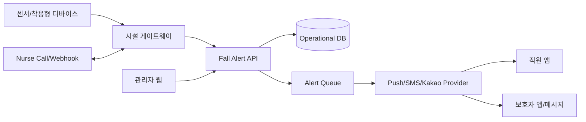
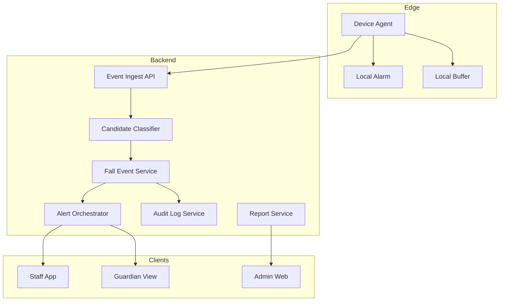
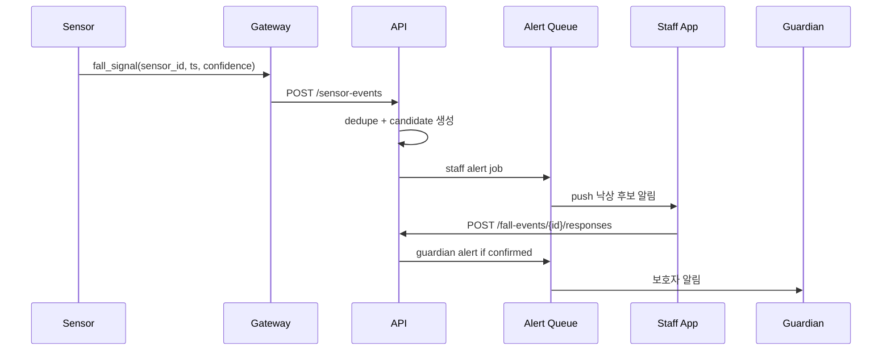
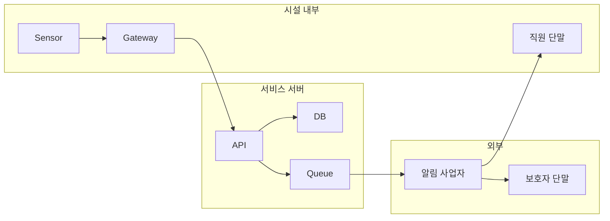

# Architecture - 요양시설 낙상 감지 알림 서비스

## Context & Scope

MVP는 센서 이벤트를 수신하고, 낙상 후보를 직원에게 우선 알림한 뒤, 직원 확인 결과에 따라 보호자 알림과 감사 기록을 남기는 시스템이다. 영상 AI와 의료 진단은 제외한다.

## 시스템 컨텍스트

## 구현 접근

- 센서와 서버 사이에는 시설 게이트웨이를 둔다. 게이트웨이는 로컬 알림, 버퍼, 센서 heartbeat, 서명 검증을 담당한다.
- 서버는 멀티테넌트 SaaS로 facility_id 스코프를 모든 쿼리와 권한 검사에 강제한다.
- 알림은 이벤트 수신 트랜잭션과 분리된 큐로 처리하고, idempotency key로 중복 발송을 막는다.
- 이벤트 기록은 append-only event_log와 현재 상태 fall_event를 분리한다.

## 컴포넌트 구조

## 데이터 흐름

## 데이터 저장 결정

- 운영 DB: PostgreSQL 우선, MSSQL 호환 스키마 유지 가능. 구조화 이벤트·권한·리포트에 적합하다.
- 이벤트 로그: append-only 테이블. 해시 체인 또는 이전 로그 ID를 저장해 변조 탐지를 지원한다.
- 게이트웨이 버퍼: SQLite 또는 embedded KV. 24시간 이벤트를 순서 보장으로 저장한다.
- 원시 센서값: MVP에서는 낙상 후보 판단에 필요한 최소값만 30일 보관, 장기 분석은 익명 집계만 보관한다.

## 검토한 대안

| 대안 | 결정 | 사유 |
|---|---|---|
| 카메라 AI 중심 | 보류 | 프라이버시·동의·보관·설치 비용 리스크가 큼 |
| 클라우드 직접 센서 연결 | 제외 | 시설 네트워크 장애 시 현장 알림 불가 |
| 모든 이벤트 보호자 즉시 알림 | 제외 | 오탐 민원과 불안이 큼 |
| 직원 확인 우선 | 채택 | 대응 품질과 보호자 신뢰를 균형화 |

## 위협 모델

### DFD와 trust boundary

| 경계/자산 | S | T | R | I | D | E |
|---|---|---|---|---|---|---|
| 센서->게이트웨이 | 장치 키로 위조 방지 | 서명·nonce | 수신 로그 | 최소 payload | rate limit | 장치별 권한 |
| 게이트웨이->API | mTLS/API key | body hash | request id | TLS | queue/backoff | tenant scope |
| 직원/보호자 앱->API | JWT/MFA 옵션 | CSRF 방지 | audit log | RBAC | rate limit | 권한코드 |
| 알림 사업자 | 발신자 검증 | callback 검증 | delivery log | 민감정보 최소화 | fallback | provider 권한 격리 |

## 상위 리스크와 완화

1. 미탐으로 실제 낙상 대응 지연: 센서 융합, heartbeat, 직원 신고 버튼, 정기 성능 리포트로 완화한다.
2. 오탐으로 직원 피로와 보호자 불안 증가: 직원 1차 확인, storm suppression, 입소자별 민감도 조정으로 완화한다.
3. 개인정보·영상정보 침해: 영상 미사용 기본, 최소수집, 보호자 범위 권한, 보관기간 제한으로 완화한다.
4. 네트워크 장애: 게이트웨이 로컬 알림과 24시간 버퍼링으로 완화한다.

