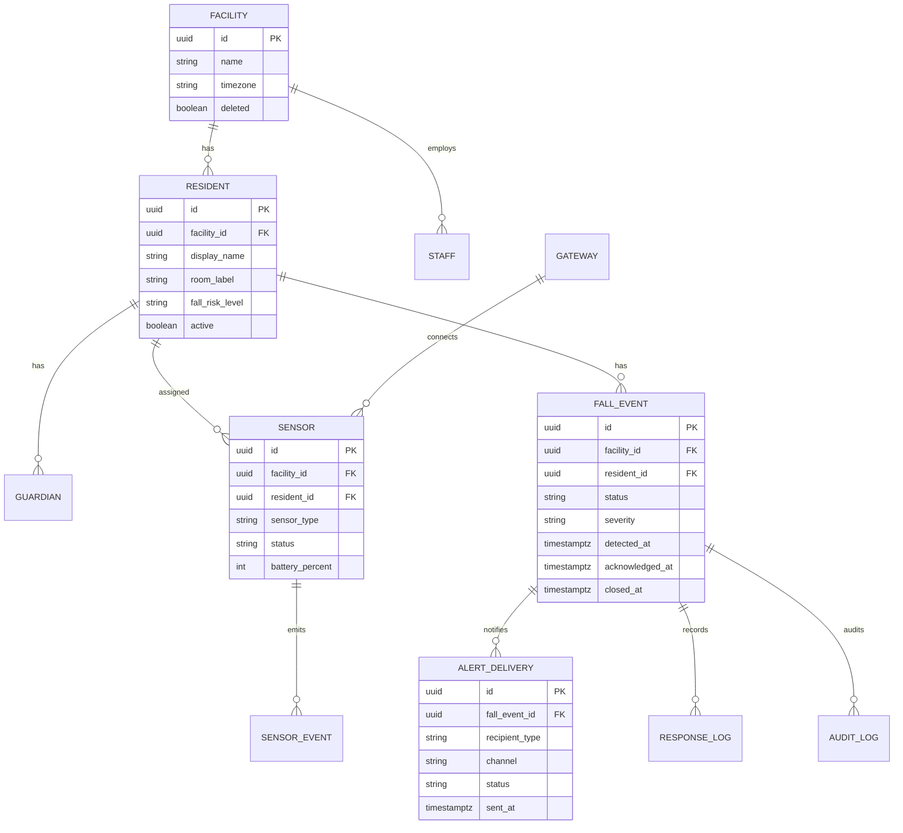

# API Contract & Data Schema - 요양시설 낙상 감지 알림 서비스

## 공통 규약

- 인증: 직원/관리자/보호자 JWT, 게이트웨이는 mTLS 또는 device API key
- 멀티테넌트: 모든 리소스는 facility_id 스코프를 가진다.
- 오류 포맷: RFC 9457 Problem JSON
- 시간: UTC ISO-8601 저장, UI는 시설 시간대로 표시
- 멱등성: 센서 이벤트와 알림 발송은 Idempotency-Key 또는 device_event_id를 사용한다.
- 페이지네이션: cursor 기반

## 엔드포인트

| ID | 메서드/경로 | 요청 | 응답 | 오류 | 권한 |
|---|---|---|---|---|---|
| API-001 | POST /api/v1/facilities/{facilityId}/residents | 이름, 방/구역, 위험도, 보호자 목록 | resident | 400,403,409 | fall:resident:write |
| API-002 | POST /api/v1/facilities/{facilityId}/sensors | sensor_type, location, resident_id? | sensor | 400,403 | fall:sensor:write |
| API-003 | POST /api/v1/gateways/{gatewayId}/sensor-events | device_event_id, sensor_id, ts, signal_type, confidence | fall_event? | 400,401,409,422 | device:events:write |
| API-004 | GET /api/v1/facilities/{facilityId}/fall-events | status, resident_id, cursor | event page | 403 | fall:event:read |
| API-005 | POST /api/v1/fall-events/{eventId}/ack | staff_id, location_confirmed | event | 403,409 | fall:event:ack |
| API-006 | POST /api/v1/fall-events/{eventId}/responses | status, severity, note, actions[] | event | 400,403,409 | fall:event:respond |
| API-007 | POST /api/v1/fall-events/{eventId}/guardian-notifications | reason, channels[] | delivery ids | 403,409 | fall:guardian:notify |
| API-008 | GET /api/v1/facilities/{facilityId}/sensor-health | status filter | health list | 403 | fall:sensor:read |
| API-009 | GET /api/v1/facilities/{facilityId}/reports/fall-summary | period | metrics | 403 | fall:report:read |
| API-010 | GET /api/v1/guardian/fall-events/{shareToken} | token | guardian-safe event | 401,403,410 | guardian:event:read |

## OpenAPI 스케치

```yaml
paths:
  /api/v1/gateways/{gatewayId}/sensor-events:
    post:
      summary: Ingest sensor event from facility gateway
      parameters:
        - name: gatewayId
          in: path
          required: true
          schema: { type: string }
        - name: Idempotency-Key
          in: header
          required: true
          schema: { type: string, maxLength: 128 }
      requestBody:
        required: true
        content:
          application/json:
            schema:
              type: object
              required: [deviceEventId, sensorId, occurredAt, signalType]
              properties:
                deviceEventId: { type: string }
                sensorId: { type: string }
                occurredAt: { type: string, format: date-time }
                signalType: { type: string, enum: [impact, pressure_change, inactivity, manual_call] }
                confidence: { type: number, minimum: 0, maximum: 1 }
      responses:
        "202": { description: Accepted }
        "409": { description: Duplicate event }
```

## ERD



## 데이터 규칙

- fall_event.status: candidate, acknowledged, confirmed_fall, false_alarm, needs_help, unresolved, closed
- severity: low, medium, high, emergency
- 보호자 화면에는 resident display_name, detected_at, confirmed_at, facility contact, staff note summary만 노출한다.
- 원시 센서 이벤트는 기본 30일, 감사로그와 확정 낙상 기록은 계약·법무 정책에 따라 별도 보존한다.

## 요구사항 커버리지

| FR-ID | 엔드포인트/이벤트 |
|---|---|
| FR-001 | API-001, API-002 |
| FR-002 | API-003 |
| FR-003 | API-003 내부 dedupe |
| FR-004 | API-003 -> alert job |
| FR-005 | API-005, API-006 |
| FR-006 | API-007, API-010 |
| FR-007 | 모든 write API -> AUDIT_LOG |
| FR-008 | API-008 |
| FR-009 | 모든 API 권한 |
| FR-010 | API-009 |
| FR-011 | 설정 플래그와 guardian-safe projection |
| FR-012 | Gateway buffer protocol |

P0/P1 요구사항 커버리지: 100%

