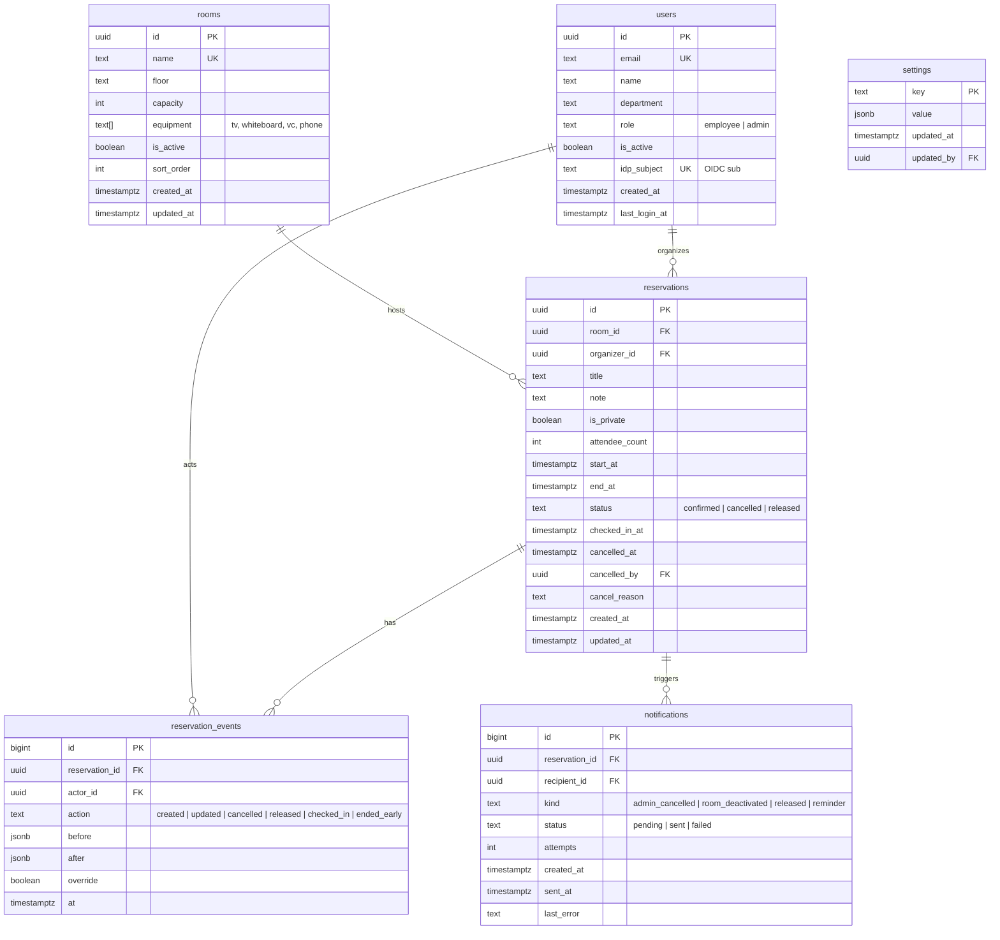

# 사내 회의실 웹 예약 서비스 — 기획·설계 문서

| 항목 | 내용 |
|---|---|
| 문서 ID | s1-a |
| 작성일 | 2026-09-03 |
| 상태 | Draft v0.1 (구현 착수 가능 수준) |
| 대상 독자 | 발주자(총무/운영 담당), 구현 개발자, 검수자 |
| 입력 아이디어 | "사내 회의실 예약을 웹에서 하고 싶다. 지금은 화이트보드에 수기로 적는다." |
| 작성 방식 | 질문 없이 작성. 필요한 가정은 §1에 모두 명시하고, 가정이 틀렸을 때의 영향을 함께 적음 |

---

## 0. 한 줄 요약

화이트보드에 수기로 적던 회의실 예약을 웹으로 옮긴다. 성공 조건은 세 가지다.

1. **누구나 30초 안에 예약한다** — 로그인 후 클릭 4번 이내.
2. **더블부킹이 구조적으로 불가능하다** — 앱 코드가 아니라 DB 제약으로 막는다.
3. **30일 안에 화이트보드를 철거할 수 있을 만큼 단순하다** — 반복 예약·캘린더 연동 같은 것은 나중이다.

MVP는 6주, 1~2인 개발, 서버 1대 기준으로 설계했다.

---

## 1. 가정 (Assumptions)

질문할 수 없는 조건에서 작성했으므로, 아래 가정이 이 문서의 전제다. **틀린 가정이 있으면 해당 항목만 바꾸면 되도록** 설계를 분리했다.

| ID | 항목 | 가정값 | 근거 | 틀렸을 때 영향 |
|---|---|---|---|---|
| A1 | 조직 규모 | 임직원 50~200명, 단일 사무실(층 1~3개) | 화이트보드로 운영 가능한 규모 | 500명 이상이면 §11 단일 서버 구성을 이중화로 변경 |
| A2 | 회의실 수 | 3~15개 | 화이트보드 한 장에 들어가는 수 | 30개 이상이면 타임라인 UI에 층/건물 필터 추가 |
| A3 | 사내 계정 | 회사 이메일 도메인 존재. Google Workspace 또는 Microsoft 365 중 하나 사용 | 대다수 국내 중소·중견 기업 | 둘 다 없으면 이메일 매직링크 로그인으로 대체 (§13) |
| A4 | 운영 시간 | 평일 08:00~20:00, 시간대 Asia/Seoul 단일 | 일반 사무직 | 24시간/주말이면 설정값만 변경 (§7 R3) |
| A5 | 예약 규칙 | 15분 단위, 최소 15분, 최대 4시간, 최대 30일 전 예약 | 상용 제품의 일반 기본값 | 관리자 설정으로 변경 가능하게 둠 |
| A6 | 예약 주체 | 임직원 개인 1명. 팀 공용 계정·외부 방문객 없음 | 사내 도구 | 방문객 예약이 필요하면 Phase 2 |
| A7 | 배포 환경 | 사내 Docker 호스트 1대 또는 소형 클라우드 VM 1대(2vCPU/4GB) | 별도 운영팀 없음 | 클라우드 관리형 DB를 쓰면 백업 절차만 바뀜 |
| A8 | 개발 인력·기간 | 1~2명, 6주 | 사내 도구 규모 | 1명이면 Should 항목을 Phase 1.5로 미룸 |
| A9 | 개인정보 | 이름·이메일·부서만. 예약 제목은 민감할 수 있음(인사 면담 등) | 회의실 도메인 특성 | 비공개 예약 옵션으로 대응 (§7 R11) |
| A10 | 접속 경로 | 사내망 또는 VPN. 인터넷 공개 안 함 | 사내 도구 | 인터넷 공개 시 §14 위협 모델의 외부 공격 항목 강화 |
| A11 | 이메일 발송 | 사내 SMTP 릴레이 또는 Google/MS SMTP 사용 가능 | 회사 이메일 존재 | 없으면 통지를 화면 내 알림으로 대체 |
| A12 | 브라우저 | Chrome/Edge 최신 2버전, iOS Safari·Android Chrome | 일반 사무 환경 | IE 지원 요구 시 설계 재검토 |
| A13 | 개발 스택 익숙도 | TypeScript 가능 인력 있음 | 미확인 | Java/.NET 팀이면 §11 스택 옵션 B로 교체. API·ERD·규칙은 스택 무관 |
| A14 | 화이트보드 현황 | 회의실 × 시간 격자에 이름·용도 수기, 주 단위로 지움 | 일반적 운영 형태 | 초기 데이터 이관은 관리자 수기 입력으로 충분 |

---

## 2. 문제 정의

### 2.1 현재 상태 (As-Is)

- 사무실 벽의 화이트보드에 `회의실 × 시간` 격자를 그려 놓고, 쓰는 사람이 이름과 용도를 적는다.
- 주 1회(또는 매일) 누군가 지운다.

### 2.2 화이트보드 운영에서 일반적으로 나타나는 문제 (가정 A14 기반)

| # | 문제 | 결과 |
|---|---|---|
| P1 | 자리에서/다른 층에서/재택에서 확인 불가 | 직접 가서 봐야 함. 가 봤더니 이미 찼음 |
| P2 | 덮어쓰기·지움 분쟁 | "내가 먼저 썼는데" — 증거 없음 |
| P3 | 노쇼 회의실 방치 | 적어 놓고 안 쓰는 방을 아무도 못 씀 |
| P4 | 이력·통계 없음 | 회의실 증설/폐지, 정원 조정 판단 근거 없음 |
| P5 | 반복 회의를 매주 다시 적음 | 놓치면 방을 뺏김 |
| P6 | 정원·장비 정보 없음 | 12인 회의를 4인 방에 잡음 |

### 2.3 해결하지 않는 것 (Non-goals)

- 좌석(핫데스크) 예약, 방문객 출입 관리, 회의록/안건 관리
- 화상회의(Zoom/Teams) 링크 자동 생성
- 다국어, 다지점·다시간대
- 회의실 사용료 청구·정산
- 모바일 네이티브 앱 (반응형 웹으로 대체)

---

## 3. 목표와 성공 지표

| ID | 목표 | 지표 | 목표치 | 측정 방법 |
|---|---|---|---|---|
| G1 | 화이트보드 철거 | 철거일 | 전사 출시 D+30 이내 | 총무 확인 |
| G2 | 더블부킹 0 | 동일 회의실·시간 겹침 건수 | 0건 (DB 제약으로 보장) | DB 제약 위반 시 409 카운트 + 월간 감사 쿼리 |
| G3 | 예약 속도 | 로그인 후 예약 완료까지 소요 시간 중앙값 / 클릭 수 | ≤ 30초 / ≤ 4클릭 | 클라이언트 이벤트 타임스탬프 |
| G4 | 채택률 | 주간 활성 사용자(WAU) / 임직원 수 | D+30 ≥ 50%, D+60 ≥ 70% | 로그인 로그 집계 |
| G5 | 노쇼 회수 (Phase 1.5) | 미체크인 자동 해제로 회수된 시간/주 | 측정 후 기준선 설정 | released 상태 예약 합산 |
| G6 | 운영 부담 | 관리자 개입(강제 취소·분쟁 중재) 건수/주 | ≤ 2건 | 감사 로그 |

---

## 4. 사용자와 시나리오

### 4.1 페르소나

| 페르소나 | 역할 | 대표 질문 | 빈도 |
|---|---|---|---|
| P1 예약자 (일반 직원) | 회의를 잡는 사람 | "지금 빈 방 어디?" "다음 주 화요일 2시 6명 들어가는 방" | 주 1~5회 |
| P2 참석자 | 방만 확인 | "오늘 3시 기획 회의 어느 방?" | 주 1~3회 |
| P3 관리자 (총무) | 회의실·규칙 관리, 분쟁 중재 | "3층 소회의실 다음 주 공사라 막아야 해" "저 사람 매일 오후 통째로 잡아 놨는데" | 월 수 회 |

### 4.2 사용자 스토리 (MVP 범위) 와 인수 기준

| ID | 스토리 | 인수 기준 (Given/When/Then 요약) |
|---|---|---|
| US-1 | 예약자로서 사내 계정으로 로그인한다 | 회사 SSO 클릭 → 3초 내 타임라인 화면. 비회사 계정은 거부 |
| US-2 | 예약자로서 오늘/특정 날짜의 모든 회의실 현황을 한 화면에서 본다 | 회의실 행 × 시간 열 그리드. 빈 칸/찬 칸/내 예약이 색과 텍스트로 구분 |
| US-3 | 예약자로서 빈 칸을 클릭(또는 드래그)해서 예약한다 | 클릭 → 모달에 회의실·시간 자동 채움 → 제목 입력 → 저장. 4클릭 이내 |
| US-4 | 예약자로서 겹치는 예약을 시도하면 즉시 안내받는다 | 409 응답 → "이미 ○○님이 14:00~15:00 예약" 표시. 저장 안 됨 |
| US-5 | 예약자로서 내 예약을 수정·취소한다 | 내 예약만 수정/취소 버튼 노출. 타인 예약은 읽기 전용 |
| US-6 | 예약자로서 내 예약 목록(예정/지난)을 본다 | 예정 순 정렬. 취소된 건은 별도 표시 |
| US-7 | 예약자로서 제목을 숨긴 비공개 예약을 만든다 | 타인에게는 "비공개 회의 · 인사팀"으로 보임 |
| US-8 | 예약자로서 정원·장비를 보고 방을 고른다 | 회의실 이름 옆에 정원·층·장비 아이콘. 참석 인원 > 정원이면 경고(차단은 안 함) |
| US-9 | 관리자로서 회의실을 등록·수정·비활성화한다 | 비활성화 시 미래 예약 수와 목록을 보여주고 확인 후 일괄 취소 + 통지 |
| US-10 | 관리자로서 타인의 예약을 사유와 함께 취소한다 | 사유 필수. 예약자에게 이메일 통지. 감사 로그 기록 |
| US-11 | 관리자로서 운영 규칙(시간 단위·운영시간·최대 길이·선예약 일수·1인 상한)을 바꾼다 | 설정 화면. 변경 즉시 반영. 기존 예약에는 소급 안 함 |
| US-12 | 관리자로서 회의실별 사용률을 본다 | 기간 선택 → 회의실별 예약 시간/운영 시간 비율, 예약 건수, 취소·해제 건수 |
| US-13 (Phase 1.5) | 예약자로서 회의 시작 시 체크인하고, 안 하면 자동 해제된다 | 시작 -5분~+10분 체크인 창. +10분에 미체크인이면 해제 + 통지 |

---

## 5. 도메인 조사 요약

### 5.1 상용 제품에서 공통으로 보이는 패턴

Google Calendar 리소스 예약, Microsoft Exchange 룸 메일박스, Robin, Joan, Envoy Rooms, Skedda 등에서 공통적으로 나타나는 구성 요소:

| 요소 | 설명 | 이 문서에서의 위치 |
|---|---|---|
| 타임라인 그리드 | 회의실 × 시간 격자, 빈 칸 클릭으로 예약 | MVP (§8) |
| 정원·장비 메타데이터 | 인원, TV/화이트보드/화상장비 | MVP |
| 체크인 + 자동 해제 | 노쇼 회수. 도어 태블릿 또는 앱 버튼 | Phase 1.5 |
| 캘린더 양방향 동기화 | 초대장에 회의실 리소스 포함 | Phase 2 |
| 도어/로비 디스플레이 | 방 앞 태블릿, 로비 대형 화면 | Phase 2 |
| 반복 예약 | 매주 같은 시간 | Phase 2 |
| 사용률 리포트 | 방별 점유율, 피크 시간 | MVP 최소형 |

### 5.2 이 도메인의 알려진 함정과 대응

| # | 함정 | 대응 (본 설계) |
|---|---|---|
| D1 | **더블부킹 레이스**: 앱에서 "겹침 없음" 확인 후 INSERT 하는 사이에 다른 요청이 들어감 | PostgreSQL `EXCLUDE` 제약으로 DB가 원자적으로 거부 (§12) |
| D2 | **경계 접촉 오판**: 11:00 종료와 11:00 시작을 겹침으로 처리 | 반개구간 `[start, end)` 사용. 접촉은 허용 |
| D3 | **노쇼**: 예약해 놓고 안 옴 → 시스템 신뢰 하락 | Phase 1.5 체크인·자동 해제. MVP는 "지금 안 쓰면 취소해 주세요" 리마인더 없이 출시, 수치 측정 후 도입 |
| D4 | **반복 예약 예외 처리 복잡성**: "이번 주만 취소" | MVP에서 제외. 도입 시 회차 단위 행 생성(materialize) 방식 |
| D5 | **시간대**: KST 단일이어도 서버·DB 기본 시간대가 UTC인 경우 날짜 경계 버그 | DB `timestamptz`(UTC 저장), 표시·입력 변환은 Asia/Seoul 고정 |
| D6 | **민감 제목 노출**: "○○○ 징계 면담" 이 전 직원에게 보임 | 비공개 옵션 (§7 R11) |
| D7 | **관리자 강제 취소 분쟁**: 말없이 지워짐 | 사유 필수 + 이메일 통지 + 감사 로그 |
| D8 | **선점 남용**: 한 사람이 매일 오후를 통째로 잡음 | 1인 활성 예약 상한, 최대 길이, 사용률 리포트로 관리자가 확인 |
| D9 | **화이트보드 관성**: "그냥 적는 게 편한데" | 2주 병행 → 철거. 로비 화면(Phase 2) 전까지는 화이트보드에 "웹 우선" 공지만 |

---

## 6. 요구사항

### 6.1 기능 요구사항 (MoSCoW)

**Must (MVP, 6주)**

| ID | 요구사항 |
|---|---|
| F1 | 사내 계정 SSO 로그인 (OIDC). 회사 도메인 외 계정 거부 |
| F2 | 회의실 목록: 이름, 층, 정원, 장비, 활성 여부 |
| F3 | 일간 타임라인: 회의실 × 시간(15분 격자) 그리드, 날짜 이동, 오늘 버튼 |
| F4 | 예약 생성/수정/취소 (본인) |
| F5 | 겹침 방지 — DB 제약 수준 |
| F6 | 규칙 검증: 격자 정렬, 길이, 운영시간, 선예약 일수, 과거 금지, 1인 상한 |
| F7 | 내 예약 목록 (예정/지난/취소) |
| F8 | 비공개 예약 (제목 마스킹) |
| F9 | 관리자: 회의실 CRUD·비활성화, 설정 변경, 타인 예약 취소(사유 필수) |
| F10 | 이메일 통지: 관리자 취소(필수), 회의실 비활성화로 인한 취소(필수). 본인 생성/수정 통지는 선택(기본 off) |
| F11 | 감사 로그: 예약 생성·수정·취소·해제의 전/후 값과 행위자 |
| F12 | 사용률 리포트 (최소형: 회의실별 기간 점유율·건수) |

**Should (Phase 1.5, 출시 +2~4주)**

| ID | 요구사항 |
|---|---|
| F13 | 체크인 / 미체크인 자동 해제 |
| F14 | 주간 뷰 (회의실 1개 선택 × 7일) |
| F15 | 정원·장비 필터, "지금 빈 방" 바로가기 |
| F16 | 회의 시작 15분 전 이메일 리마인더 (선택 옵션) |

**Could (Phase 2)**

| ID | 요구사항 |
|---|---|
| F17 | 반복 예약 (매주/격주, 종료일, 회차 단위 예외) |
| F18 | Google/Microsoft 캘린더 연동 (예약 → 캘린더 이벤트 생성) |
| F19 | 도어/로비 디스플레이용 읽기 전용 화면 (토큰 인증) |
| F20 | Slack/Teams 알림 |
| F21 | CSV 내보내기 |

**Won't (이번 릴리스)**

좌석 예약, 방문객 관리, 다지점, 비용 청구, 네이티브 앱.

### 6.2 비기능 요구사항

| 영역 | 요구사항 |
|---|---|
| 성능 | 동시 사용자 100. 타임라인 조회 p95 < 300ms, 예약 생성 p95 < 500ms (서버 측) |
| 가용성 | 업무시간(평일 08~20시) 기준 99.5% (월 약 1시간 다운 허용). 야간 점검 허용 |
| 장애 시 대안 | 서비스 다운 시 임시 화이트보드 복귀 절차 문서화 (§17.4) |
| 보안 | TLS 필수. 세션 쿠키 `HttpOnly; Secure; SameSite=Lax`. RBAC(employee/admin). CSRF 방어. 감사 로그 1년 보관 |
| 데이터 보호 | 일 1회 DB 백업, 30일 보관, 분기 1회 복구 리허설. 퇴사자 계정 비활성화 시 예약 이력은 유지(익명화 안 함 — 감사 목적) |
| 접근성 | 키보드만으로 예약 완료 가능. 상태를 색 외에 텍스트/패턴으로도 표시. 명도 대비 4.5:1 |
| 호환성 | A12 브라우저. 모바일 폭 360px부터 |
| 국제화 | 한국어 단일. 날짜 표기 `2026-09-07 (월) 14:00`. 주 시작 월요일 |
| 운영 단순성 | 단일 레포, `docker compose up -d` 한 줄 배포, 1인 운영 가능 |
| 관측성 | 구조화 로그, 헬스체크, 핵심 지표 4개 이상 (§16.3) |

---

## 7. 비즈니스 규칙 (예약 규칙)

모든 규칙은 서버에서 검증한다. 클라이언트 검증은 UX 보조일 뿐이다. 값은 관리자 설정(`settings`)에서 읽는다.

| ID | 규칙 | 기본값 | 위반 시 에러 코드 |
|---|---|---|---|
| R1 | `start_at`, `end_at`는 슬롯 격자(분)에 정렬 | 15분 | `TIME_NOT_ALIGNED` |
| R2 | 길이: `min_minutes ≤ end − start ≤ max_minutes` | 15분 / 240분 | `DURATION_OUT_OF_RANGE` |
| R3 | 운영시간 내, 같은 날짜(KST). 자정 넘김 금지. 운영 요일 밖(주말) 금지 | 월~금 08:00~20:00 | `OUTSIDE_BUSINESS_HOURS` |
| R4 | `start_at ≤ now + max_advance_days` | 30일 | `TOO_FAR_AHEAD` |
| R5 | `end_at > now`. 진행 중 시각의 예약은 허용하되 `start_at`은 현재 시각을 슬롯으로 내림한 값 이상 | — | `IN_PAST` |
| R6 | 같은 `room_id`에서 `status = 'confirmed'`인 예약과 `[start, end)` 교집합 금지. 경계 접촉(11:00 종료 / 11:00 시작) 허용 | — | `OVERLAP` (HTTP 409) |
| R7 | 1인 활성 예약(`status='confirmed' AND end_at > now`) 수 상한 | 10건 | `USER_QUOTA_EXCEEDED` |
| R8 | 수정: 본인 또는 관리자. 시작 이후에는 `end_at`만 변경 가능(연장/단축). 연장도 R6 적용 | — | `FORBIDDEN_NOT_OWNER`, `STARTED_CANNOT_MOVE` |
| R9 | 취소: 본인 또는 관리자. 관리자 취소는 사유 필수 + 예약자 통지. 시작 이후 취소 = 조기 종료(`end_at = now`, status는 confirmed 유지, 감사 로그에 `ended_early`) | — | `REASON_REQUIRED` |
| R10 | 회의실 비활성화: 미래 confirmed 예약이 있으면 목록·건수 표시 → 관리자 확인 → 일괄 취소(사유 "회의실 사용 중지") + 통지 | — | — |
| R11 | 비공개(`is_private`): 타인 조회 시 `title`을 `"비공개 회의"`로, `note`는 숨김, 예약자는 부서명만 | — | — |
| R12 | 정원 초과(`attendee_count > capacity`)는 경고만, 차단 안 함 | — | 응답에 `warnings: ["CAPACITY_EXCEEDED"]` |
| R13 (Phase 1.5) | 체크인 창: `start − 5분 ≤ now ≤ start + grace`. 창 종료 시 미체크인이면 `status = 'released'` + 통지. 해제된 슬롯은 즉시 재예약 가능 | grace 10분 | `CHECKIN_WINDOW_CLOSED` |
| R14 | 관리자는 R4·R7을 우회할 수 있음(회의실 점검 블록 등). 우회 시 감사 로그에 `override=true` | — | — |

**규칙 우선순위**: 인증 → 권한 → 형식(R1) → 값 범위(R2~R5, R7) → 회의실 상태 → 겹침(R6, DB). 앞 단계에서 실패하면 뒤를 검사하지 않는다.

---

## 8. 화면 설계

### 8.1 화면 목록

| # | 화면 | 경로 | 권한 |
|---|---|---|---|
| S1 | 타임라인 (홈) | `/` , `/?date=2026-09-07` | 로그인 사용자 |
| S2 | 예약 생성/수정 모달 | S1 위 오버레이 | 로그인 사용자 |
| S3 | 예약 상세 | `/reservations/:id` | 로그인 사용자 (비공개는 마스킹) |
| S4 | 내 예약 | `/me/reservations` | 로그인 사용자 |
| S5 | 관리자 — 회의실 | `/admin/rooms` | admin |
| S6 | 관리자 — 설정 | `/admin/settings` | admin |
| S7 | 관리자 — 리포트 | `/admin/reports` | admin |
| S8 | 로그인 | `/login` | 공개 |

### 8.2 S1 타임라인 (데스크톱)

```
┌────────────────────────────────────────────────────────────────────────┐
│ 회의실 예약        ◀  2026-09-07 (월)  ▶   [오늘]        김OO ▾  [내 예약] │
├──────────────┬─────────────────────────────────────────────────────────┤
│ 회의실        │ 08   09   10   11   12   13   14   15   16   17   18   19 │
├──────────────┼─────────────────────────────────────────────────────────┤
│ 대회의실      │      ████████            ▒▒▒▒▒▒▒▒▒                       │
│ 3F · 12인 · 📺 │      주간회의 · 기획팀       비공개 회의 · 인사팀           │
├──────────────┼─────────────────────────────────────────────────────────┤
│ 소회의실 A    │                ████                                     │
│ 3F · 4인      │                1:1 · 나  ← 내 예약은 테두리 강조            │
├──────────────┼─────────────────────────────────────────────────────────┤
│ 소회의실 B    │                                   ┆                     │
│ 2F · 6인 · 🖊 │                                   ┆ ← 빈 칸 hover: "+ 14:00" │
└──────────────┴─────────────────────────────────────────────────────────┘
  범례: ████ 예약됨   ▒▒▒▒ 비공개   ┃ 현재 시각(빨간 세로선)   회색 = 운영시간 외
```

동작:
- 빈 칸 클릭 → 그 시각부터 기본 1시간으로 S2 열림. 드래그 시 드래그 범위가 시간으로.
- 찬 칸 클릭 → S3 요약 팝오버 (제목, 예약자, 시간, 본인이면 수정/취소).
- 날짜 이동은 URL 쿼리에 반영(공유 가능).
- 15분 격자지만 열 헤더는 1시간 단위. 격자선은 30분마다 얇게.
- 30초마다 자동 새로고침(폴링). 실시간 푸시는 하지 않는다 (사용자 100명 규모에서 불필요).

### 8.3 S1 타임라인 (모바일, 폭 < 768px)

```
┌──────────────────────────────┐
│ ◀ 09-07 (월) ▶  [오늘]  ≡    │
│ [대회의실 ▾]  3F · 12인       │
├──────────────────────────────┤
│ 08:00  ─────────────────     │
│ 09:00  ████ 주간회의 · 기획팀  │
│ 10:00  ████                  │
│ 11:00  ─────────────────     │
│ 12:00  ─────────────────     │
│ 13:00  ▒▒▒▒ 비공개 회의       │
│ 14:00  ─────────────────     │
│ ...                          │
│                     [+ 예약]  │
└──────────────────────────────┘
```

모바일은 회의실 하나를 골라 세로 타임라인으로 본다. 드래그 대신 `[+ 예약]` 버튼 → 폼 입력.

### 8.4 S2 예약 생성/수정 모달

```
┌ 예약 만들기 ─────────────────────────────────┐
│ 회의실     소회의실 B (2F · 6인)          [변경] │
│ 날짜       2026-09-07 (월)                    │
│ 시간       [14:00 ▾] ~ [15:00 ▾]   (1시간)     │
│ 제목       [ 디자인 리뷰                     ]  │
│ 참석 인원  [ 4 ]   정원 6                      │
│ 메모       [ 선택                            ]  │
│ ☐ 비공개 — 다른 사람에게 제목과 메모를 숨깁니다     │
│                                               │
│ ⚠ 14:30~15:00 은 이미 박OO님 예약이 있습니다     │  ← 서버 409 시 표시
│                          [취소]   [예약하기]    │
└───────────────────────────────────────────────┘
```

- 시간 선택은 15분 단위 드롭다운. 종료 시각은 시작 + 15분부터 최대 길이까지만 노출.
- 저장 버튼은 요청 중 비활성화(더블 클릭 방지). 성공 시 모달 닫고 그리드에 즉시 반영.
- 409 응답은 모달을 닫지 않고 충돌 예약 정보를 보여준다.

### 8.5 S4 내 예약

```
┌ 내 예약 ──────────────────────────────────────┐
│ [예정]  [지난]  [취소/해제]                     │
├───────────────────────────────────────────────┤
│ 09-07 (월) 10:00~11:00  소회의실 A  1:1        │
│                               [수정] [취소]    │
│ 09-09 (수) 14:00~16:00  대회의실   분기 리뷰    │
│                               [수정] [취소]    │
└───────────────────────────────────────────────┘
```

### 8.6 S5~S7 관리자

- S5 회의실: 표(이름/층/정원/장비/활성/정렬순서) + 행 편집. 비활성화 버튼 → 확인 다이얼로그에 "미래 예약 N건이 취소되고 예약자에게 통지됩니다" + 목록.
- S6 설정: 슬롯 단위, 운영 요일·시간, 최소/최대 길이, 선예약 일수, 1인 상한, 체크인 유예(Phase 1.5). 저장 시 확인.
- S7 리포트: 기간 선택 → 회의실별 표(점유율 %, 건수, 취소, 해제, 평균 길이). 막대 그래프 1개. CSV 내보내기는 Phase 2.

### 8.7 접근성 체크리스트

- 그리드 셀은 `role="gridcell"`, 화살표 키로 이동, Enter로 예약 시작.
- 예약 블록은 색 + 텍스트 라벨. 비공개는 빗금 패턴 + "비공개" 텍스트.
- 모달 열릴 때 포커스 이동, Esc로 닫기, 포커스 트랩.
- 폼 오류는 필드 옆 텍스트 + `aria-describedby`.

---

## 9. 데이터 모델

### 9.1 ERD



### 9.2 DDL (PostgreSQL 16)

```sql
CREATE EXTENSION IF NOT EXISTS btree_gist;   -- EXCLUDE 제약에 필요
CREATE EXTENSION IF NOT EXISTS pgcrypto;     -- gen_random_uuid()

CREATE TABLE users (
  id            uuid PRIMARY KEY DEFAULT gen_random_uuid(),
  email         text NOT NULL UNIQUE,
  name          text NOT NULL,
  department    text,
  role          text NOT NULL DEFAULT 'employee' CHECK (role IN ('employee','admin')),
  is_active     boolean NOT NULL DEFAULT true,
  idp_subject   text UNIQUE,
  created_at    timestamptz NOT NULL DEFAULT now(),
  last_login_at timestamptz
);

CREATE TABLE rooms (
  id         uuid PRIMARY KEY DEFAULT gen_random_uuid(),
  name       text NOT NULL UNIQUE,
  floor      text,
  capacity   int  NOT NULL CHECK (capacity > 0),
  equipment  text[] NOT NULL DEFAULT '{}',
  is_active  boolean NOT NULL DEFAULT true,
  sort_order int NOT NULL DEFAULT 0,
  created_at timestamptz NOT NULL DEFAULT now(),
  updated_at timestamptz NOT NULL DEFAULT now()
);

CREATE TABLE reservations (
  id             uuid PRIMARY KEY DEFAULT gen_random_uuid(),
  room_id        uuid NOT NULL REFERENCES rooms(id),
  organizer_id   uuid NOT NULL REFERENCES users(id),
  title          text NOT NULL CHECK (length(title) BETWEEN 1 AND 100),
  note           text CHECK (length(note) <= 500),
  is_private     boolean NOT NULL DEFAULT false,
  attendee_count int CHECK (attendee_count IS NULL OR attendee_count > 0),
  start_at       timestamptz NOT NULL,
  end_at         timestamptz NOT NULL,
  status         text NOT NULL DEFAULT 'confirmed'
                 CHECK (status IN ('confirmed','cancelled','released')),
  checked_in_at  timestamptz,
  cancelled_at   timestamptz,
  cancelled_by   uuid REFERENCES users(id),
  cancel_reason  text,
  created_at     timestamptz NOT NULL DEFAULT now(),
  updated_at     timestamptz NOT NULL DEFAULT now(),
  CONSTRAINT chk_time_order CHECK (end_at > start_at),
  -- 핵심: 같은 방, confirmed 상태끼리 [start,end) 겹침 금지. 경계 접촉은 허용.
  CONSTRAINT no_overlap EXCLUDE USING gist (
    room_id WITH =,
    tstzrange(start_at, end_at, '[)') WITH &&
  ) WHERE (status = 'confirmed')
);

CREATE INDEX idx_res_room_time  ON reservations (room_id, start_at) WHERE status = 'confirmed';
CREATE INDEX idx_res_organizer  ON reservations (organizer_id, start_at DESC);
CREATE INDEX idx_res_day        ON reservations (start_at) WHERE status = 'confirmed';

CREATE TABLE reservation_events (
  id             bigserial PRIMARY KEY,
  reservation_id uuid NOT NULL REFERENCES reservations(id),
  actor_id       uuid REFERENCES users(id),      -- NULL = 시스템(자동 해제)
  action         text NOT NULL,
  before         jsonb,
  after          jsonb,
  override       boolean NOT NULL DEFAULT false,
  at             timestamptz NOT NULL DEFAULT now()
);
CREATE INDEX idx_events_res ON reservation_events (reservation_id, at);

CREATE TABLE notifications (
  id             bigserial PRIMARY KEY,
  reservation_id uuid REFERENCES reservations(id),
  recipient_id   uuid NOT NULL REFERENCES users(id),
  kind           text NOT NULL,
  status         text NOT NULL DEFAULT 'pending' CHECK (status IN ('pending','sent','failed')),
  attempts       int NOT NULL DEFAULT 0,
  created_at     timestamptz NOT NULL DEFAULT now(),
  sent_at        timestamptz,
  last_error     text
);
CREATE INDEX idx_notif_pending ON notifications (created_at) WHERE status = 'pending';

CREATE TABLE settings (
  key        text PRIMARY KEY,
  value      jsonb NOT NULL,
  updated_at timestamptz NOT NULL DEFAULT now(),
  updated_by uuid REFERENCES users(id)
);

INSERT INTO settings (key, value) VALUES
  ('slot_minutes',        '15'),
  ('min_minutes',         '15'),
  ('max_minutes',         '240'),
  ('max_advance_days',    '30'),
  ('business_days',       '[1,2,3,4,5]'),
  ('business_open',       '"08:00"'),
  ('business_close',      '"20:00"'),
  ('user_active_quota',   '10'),
  ('checkin_grace_minutes','10'),
  ('checkin_enabled',     'false');
```

### 9.3 설계 노트

- `status` 전이: `confirmed → cancelled` (사람), `confirmed → released` (시스템, Phase 1.5). 되돌리기 없음. 다시 잡으려면 새 예약.
- 감사 로그(`reservation_events`)는 예약 행의 스냅샷(`before/after`)을 jsonb로 보관 → 예약 행을 나중에 정리하더라도 이력 유지.
- `notifications`는 아웃박스 패턴. 요청 트랜잭션 안에서 행을 넣고, 워커가 30초마다 `pending`을 발송. 이메일 서버 장애가 예약 저장을 막지 않는다.
- 회의실 삭제는 없다. `is_active=false`만. 과거 예약이 FK로 참조하기 때문.
- 사용자 삭제도 없다. `is_active=false`. SSO 로그인 시 도메인·활성 여부 확인.

---

## 10. API 계약

### 10.1 공통

| 항목 | 규약 |
|---|---|
| Base URL | `/api/v1` |
| 형식 | JSON (`application/json`), UTF-8 |
| 인증 | 세션 쿠키 (`sid`). 미인증 시 `401` |
| CSRF | `SameSite=Lax` + 상태 변경 요청은 `Origin` 헤더 검사. (JSON API이므로 폼 CSRF 토큰은 생략) |
| 시간 | ISO 8601, 오프셋 포함. 응답은 항상 `+09:00`. 요청은 오프셋 필수 |
| ID | UUID v4 |
| 오류 | RFC 9457 `application/problem+json` |
| 페이지네이션 | 목록은 `?limit=50&cursor=` (내 예약·감사 로그만). 타임라인은 날짜 단위라 불필요 |
| 멱등성 | `POST /reservations`에 `Idempotency-Key` 헤더 선택. 같은 키 24시간 내 재요청 시 첫 응답 반환 (네트워크 재시도로 인한 중복 생성 방지) |

오류 본문 예:

```json
{
  "type": "https://example.internal/errors/overlap",
  "title": "이미 예약된 시간입니다",
  "status": 409,
  "code": "OVERLAP",
  "detail": "소회의실 B 14:30~15:00 은 박OO님이 예약했습니다",
  "conflict": {
    "reservation_id": "5f0e…",
    "start_at": "2026-09-07T14:30:00+09:00",
    "end_at":   "2026-09-07T15:00:00+09:00",
    "organizer": { "name": "박OO", "department": "영업팀" }
  }
}
```

에러 코드 목록: `UNAUTHENTICATED`(401), `FORBIDDEN`(403), `FORBIDDEN_NOT_OWNER`(403), `NOT_FOUND`(404), `OVERLAP`(409), `CHECKIN_WINDOW_CLOSED`(409), `ALREADY_CANCELLED`(409), `VALIDATION`(422, `errors[]` 동반), `TIME_NOT_ALIGNED`, `DURATION_OUT_OF_RANGE`, `OUTSIDE_BUSINESS_HOURS`, `TOO_FAR_AHEAD`, `IN_PAST`, `ROOM_INACTIVE`, `USER_QUOTA_EXCEEDED`, `STARTED_CANNOT_MOVE`, `REASON_REQUIRED`(모두 422), `RATE_LIMITED`(429).

### 10.2 엔드포인트

#### 인증

| 메서드 | 경로 | 설명 |
|---|---|---|
| GET | `/auth/login` | IdP로 리다이렉트 (OIDC Authorization Code + PKCE) |
| GET | `/auth/callback` | IdP 콜백. 도메인 검증 → users upsert → 세션 발급 → `/`로 리다이렉트 |
| POST | `/auth/logout` | 세션 폐기 |
| GET | `/api/v1/me` | `{ id, name, email, department, role }` |

#### 회의실

| 메서드 | 경로 | 권한 | 설명 |
|---|---|---|---|
| GET | `/api/v1/rooms?include_inactive=false` | 사용자 | 활성 회의실 목록, `sort_order` 순 |
| GET | `/api/v1/rooms/{id}` | 사용자 | 단건 |
| POST | `/api/v1/admin/rooms` | admin | 생성 |
| PATCH | `/api/v1/admin/rooms/{id}` | admin | 이름/층/정원/장비/정렬 수정 |
| POST | `/api/v1/admin/rooms/{id}/deactivate` | admin | `{ "cancel_future": true, "reason": "…" }`. `cancel_future=false`이고 미래 예약이 있으면 `409 HAS_FUTURE_RESERVATIONS` + 목록 |
| POST | `/api/v1/admin/rooms/{id}/activate` | admin | 재활성화 |

회의실 응답:

```json
{ "id": "…", "name": "소회의실 B", "floor": "2F", "capacity": 6,
  "equipment": ["tv", "whiteboard"], "is_active": true, "sort_order": 30 }
```

#### 예약

| 메서드 | 경로 | 권한 | 설명 |
|---|---|---|---|
| GET | `/api/v1/reservations?date=2026-09-07&room_id=` | 사용자 | 해당 날짜(KST)의 confirmed 예약. `room_id` 생략 시 전체. 타임라인용 |
| GET | `/api/v1/reservations?from=…&to=…&room_id=` | 사용자 | 기간 조회 (주간 뷰, 최대 31일) |
| POST | `/api/v1/reservations` | 사용자 | 생성. `201` + Location |
| GET | `/api/v1/reservations/{id}` | 사용자 | 단건 (비공개 마스킹 적용) |
| PATCH | `/api/v1/reservations/{id}` | 본인/admin | `title, note, is_private, attendee_count, start_at, end_at` 부분 수정 |
| POST | `/api/v1/reservations/{id}/cancel` | 본인/admin | `{ "reason": "…" }` admin은 필수 |
| POST | `/api/v1/reservations/{id}/checkin` | 본인 | Phase 1.5 |
| GET | `/api/v1/me/reservations?scope=upcoming\|past\|cancelled&limit=&cursor=` | 사용자 | 내 예약 |

생성 요청/응답:

```json
POST /api/v1/reservations
Idempotency-Key: 8d3c…
{
  "room_id": "…",
  "title": "디자인 리뷰",
  "start_at": "2026-09-07T14:00:00+09:00",
  "end_at":   "2026-09-07T15:00:00+09:00",
  "attendee_count": 4,
  "is_private": false,
  "note": null
}

201 Created
{
  "id": "…", "room": { "id": "…", "name": "소회의실 B" },
  "organizer": { "id": "…", "name": "김OO", "department": "개발팀" },
  "title": "디자인 리뷰", "note": null, "is_private": false, "attendee_count": 4,
  "start_at": "2026-09-07T14:00:00+09:00", "end_at": "2026-09-07T15:00:00+09:00",
  "status": "confirmed", "checked_in_at": null,
  "can_edit": true, "can_cancel": true,
  "warnings": [],
  "created_at": "2026-09-03T10:12:00+09:00", "updated_at": "2026-09-03T10:12:00+09:00"
}
```

타인이 비공개 예약을 조회할 때:

```json
{ "id": "…", "title": "비공개 회의", "note": null, "is_private": true,
  "organizer": { "id": null, "name": null, "department": "인사팀" },
  "can_edit": false, "can_cancel": false, "…": "…" }
```

`can_edit / can_cancel`는 서버가 계산한다. 클라이언트는 이 값으로 버튼만 그리고, 권한 판단은 서버가 다시 한다.

#### 관리자

| 메서드 | 경로 | 설명 |
|---|---|---|
| GET | `/api/v1/admin/settings` | 전체 설정 |
| PUT | `/api/v1/admin/settings` | 전체 교체. 값 검증(슬롯 단위는 5/10/15/30/60, open < close 등) |
| GET | `/api/v1/admin/reports/usage?from=&to=` | 회의실별 `{ room, reserved_minutes, business_minutes, utilization, count, cancelled, released }` |
| GET | `/api/v1/admin/audit?reservation_id=&actor_id=&from=&to=&limit=&cursor=` | 감사 로그 |
| GET | `/api/v1/admin/users?q=` | 사용자 검색·역할 변경(`PATCH /admin/users/{id}` `{ role }`) |

#### 운영

| 메서드 | 경로 | 설명 |
|---|---|---|
| GET | `/healthz` | 프로세스 살아 있음. 200 고정 |
| GET | `/readyz` | DB `SELECT 1` 성공 시 200, 실패 503 |
| GET | `/metrics` | Prometheus 형식 (선택, 사내망 IP만 허용) |

### 10.3 속도 제한

| 대상 | 한도 |
|---|---|
| `POST /reservations`, `PATCH`, `cancel` | 사용자당 30회/분 |
| `GET` 전체 | 사용자당 300회/분 |
| `/auth/*` | IP당 20회/분 |

초과 시 `429 RATE_LIMITED` + `Retry-After`. 메모리 기반 토큰 버킷(단일 인스턴스 가정 A7).

---

## 11. 아키텍처

### 11.1 스택 선택

| 기준 | **A. Next.js(TypeScript) 풀스택 + PostgreSQL** | B. Spring Boot + React SPA | C. Django + HTMX |
|---|---|---|---|
| 1~2인 개발 속도 | 상 | 중 | 상 |
| 타임라인 드래그 인터랙션 | 상 | 상 | 중 (HTMX로 드래그 구현 번거로움) |
| 운영 프로세스 수 | 1 | 2 (API + 정적 서빙) 또는 1 | 1 |
| 배포 이미지 크기·메모리 | 중 (~200MB, 300MB RAM) | 큼 (JVM) | 작음 |
| PostgreSQL EXCLUDE 지원 | ORM 무관 (raw SQL 마이그레이션) | 동일 | 동일 |
| 팀 익숙도 | A13 가정 | 미확인 | 미확인 |

**선택: A.** 이유: 한 언어로 프론트·백엔드·검증 스키마(Zod)를 공유하고, 타임라인 UI가 이 서비스의 핵심 UX이므로 React가 유리하다. **A13이 틀리면 B로 교체**하되, §7 규칙·§9 ERD·§10 API는 그대로 쓴다.

세부:

| 구성 | 선택 | 비고 |
|---|---|---|
| 프레임워크 | Next.js 15 (App Router), Node 22 LTS | Route Handlers로 API |
| 언어 | TypeScript strict | |
| DB 접근 | Drizzle ORM + `postgres.js` | 마이그레이션은 SQL 파일(EXCLUDE 제약을 ORM DSL로 표현하기 어려움) |
| 검증 | Zod (요청 스키마, 설정값) | 프론트·백엔드 공유 |
| 인증 | `openid-client` 로 OIDC 직접 구현 (Google / Microsoft Entra ID) | Auth.js 같은 라이브러리는 선택 사항. 요구가 단순하므로 직접 구현이 더 작다 |
| 세션 | 서버 세션 (DB `sessions` 테이블) + 쿠키 `sid` | JWT 대신: 즉시 폐기 가능, 비밀키 로테이션 부담 없음 |
| UI | React + Tailwind CSS. 컴포넌트 라이브러리 최소(Radix Primitives로 모달·드롭다운) | |
| 날짜 | `date-fns` + `date-fns-tz` (Asia/Seoul 고정) | |
| 이메일 | Nodemailer → SMTP 릴레이 | 아웃박스 워커 |
| 스케줄러 | 앱 내 `setInterval` 워커 (30초: 알림 발송, 60초: 체크인 해제) | 단일 인스턴스이므로 외부 큐 불필요. 다중 인스턴스로 가면 `SELECT … FOR UPDATE SKIP LOCKED`로 잠금 |
| 리버스 프록시/TLS | Caddy (자동 인증서 또는 사내 CA 인증서 지정) | |
| 컨테이너 | Docker Compose: `caddy`, `app`, `db` | |
| 테스트 | Vitest (단위·통합), Playwright (E2E), Testcontainers-node (실 DB 통합) | |

### 11.2 구성도

```
                    사내망 / VPN
  ┌──────────┐  HTTPS   ┌──────────┐        ┌─────────────────────────┐        ┌──────────────┐
  │ 브라우저   │ ───────▶ │  Caddy   │ ─────▶ │ app (Next.js, Node 22)  │ ─────▶ │ PostgreSQL 16 │
  │ PC/모바일  │          │ TLS 종단  │  :3000 │  - SSR 페이지            │  :5432 │  volume: pgdata│
  └──────────┘          └──────────┘        │  - /api/v1 Route Handlers│        └──────────────┘
                                            │  - 워커(알림·체크인 해제)  │
                                            └───────┬─────────┬───────┘
                                                    │         │
                                     OIDC (443)     │         │ SMTP (587)
                                                    ▼         ▼
                                         ┌───────────────┐ ┌──────────────┐
                                         │ Google / MS   │ │ SMTP 릴레이   │
                                         │ IdP           │ │ (사내/클라우드)│
                                         └───────────────┘ └──────────────┘
```

### 11.3 애플리케이션 내부 계층

```
app/                      # Next.js 라우트 (페이지 + API)
  (pages)/…               # S1~S8
  api/v1/…/route.ts       # 얇게: 인증 → 파싱(Zod) → 서비스 호출 → 응답 매핑
src/
  domain/
    reservation/
      rules.ts            # R1~R14 순수 함수 (DB 접근 없음, 단위 테스트 대상)
      service.ts          # 트랜잭션 경계, EXCLUDE 위반 → OVERLAP 매핑, 감사 로그·아웃박스 기록
      repo.ts             # SQL
    room/…  user/…  settings/…
  auth/                   # OIDC, 세션, 권한 가드
  workers/                # notification.ts, checkin-release.ts
  lib/                    # time.ts(KST 변환·슬롯 정렬), problem.ts(RFC 9457), logger.ts
db/migrations/*.sql
tests/ unit/ integration/ e2e/
```

원칙: **규칙은 순수 함수**, **트랜잭션은 서비스 한 곳**, **라우트는 얇게**. 스택을 B로 바꿔도 이 계층 구조는 같다.

### 11.4 주요 시퀀스 — 예약 생성

```
브라우저          API Route        ReservationService        PostgreSQL
   │  POST /reservations │                  │                     │
   │────────────────────▶│ 세션 확인          │                     │
   │                     │ Zod 파싱          │                     │
   │                     │─────────────────▶│ settings 로드         │
   │                     │                  │ rules.validate()      │  (R1~R5, R7 순수 검증)
   │                     │                  │ BEGIN                 │
   │                     │                  │──────────────────────▶│ SELECT room (is_active)
   │                     │                  │──────────────────────▶│ SELECT count(활성 예약) — R7
   │                     │                  │──────────────────────▶│ INSERT reservations
   │                     │                  │                       │   ├─ 성공
   │                     │                  │                       │   └─ 23P01 exclusion_violation
   │                     │                  │◀──────────────────────│
   │                     │                  │ (성공) INSERT reservation_events, notifications(옵션)
   │                     │                  │ COMMIT                │
   │                     │                  │ (실패) ROLLBACK → 충돌 예약 조회 → OVERLAP
   │                     │◀─────────────────│                     │
   │◀────────────────────│ 201 / 409 problem+json                  │
```

### 11.5 결정 기록 (ADR 요약)

| ID | 결정 | 대안 | 이유 |
|---|---|---|---|
| ADR-1 | 겹침 방지를 DB `EXCLUDE` 제약으로 | 앱 레벨 `SELECT` 후 `INSERT`, 회의실 행 잠금 | 레이스 컨디션을 DB가 원자적으로 차단. 코드 경로가 아무리 늘어도 우회 불가 |
| ADR-2 | 반복 예약 MVP 제외 | RRULE 저장 + 전개 | 예외 처리(한 회차 취소·변경) 복잡도가 MVP 6주에 맞지 않음. 화이트보드 대체가 1차 목표 |
| ADR-3 | 서버 1대 Docker Compose | Kubernetes, 서버리스 | 사용자 ≤ 200, 운영자 1인. 복잡도 대비 이득 없음 |
| ADR-4 | 서버 세션 + 쿠키 | JWT | 즉시 로그아웃·강제 폐기 가능. 키 관리 부담 없음 |
| ADR-5 | Next.js 풀스택 단일 프로세스 | API/프론트 분리 | 배포 단위 1개. 타입·검증 스키마 공유 |
| ADR-6 | 15분 격자 + 반개구간 `[start, end)` | 자유 시각, 폐구간 | 경계 접촉 허용. 그리드 UI와 1:1 대응 |
| ADR-7 | 통지는 아웃박스 + 워커 | 요청 안에서 동기 발송 | SMTP 장애가 예약을 막지 않음. 재시도 가능 |
| ADR-8 | 30초 폴링 | WebSocket/SSE | 100명 규모에서 실시간 푸시 불필요. 인프라 단순 |
| ADR-9 | 회의실·사용자 물리 삭제 없음 | CASCADE 삭제 | 감사·리포트 무결성 |

---

## 12. 동시성·더블부킹 방지 설계 (심화)

### 12.1 왜 앱 레벨 검사로는 부족한가

```
요청 A: SELECT 겹침 없음 ─┐
요청 B: SELECT 겹침 없음 ─┤  ← 둘 다 "비어 있음"을 봄
요청 A: INSERT 성공      ─┤
요청 B: INSERT 성공      ─┘  ← 더블부킹
```

READ COMMITTED 격리 수준에서 위 순서는 언제든 가능하다. 월요일 09:00 "이번 주 방 잡기" 폭주에서 실제로 발생한다.

### 12.2 채택: PostgreSQL EXCLUDE 제약

```sql
CONSTRAINT no_overlap EXCLUDE USING gist (
  room_id WITH =,
  tstzrange(start_at, end_at, '[)') WITH &&
) WHERE (status = 'confirmed')
```

- GiST 인덱스 기반. INSERT/UPDATE 시 같은 `room_id`에서 범위가 겹치는(`&&`) 행이 있으면 `23P01 exclusion_violation`으로 즉시 실패.
- 두 트랜잭션이 동시에 INSERT하면 한쪽은 다른 쪽의 커밋을 기다렸다가 실패한다. 애플리케이션 락 불필요.
- `WHERE (status='confirmed')` 부분 제약이라 취소·해제된 예약은 검사 대상에서 빠진다.
- `[)` 반개구간이므로 `10:00~11:00` 과 `11:00~12:00` 은 겹치지 않는다.
- UPDATE로 시간을 옮길 때도 같은 제약이 적용된다. 자기 자신은 갱신 중인 행이므로 충돌하지 않는다.

앱 처리:

```ts
try {
  await tx.insert(reservations).values(row);
} catch (e) {
  if (isPgError(e, '23P01') && e.constraint === 'no_overlap') {
    const conflict = await findConflict(tx, row);   // 안내용 조회
    throw new Overlap(conflict);                     // → 409
  }
  throw e;
}
```

### 12.3 대안 (PostgreSQL이 아닐 때)

MySQL/SQL Server 등 범위 제약이 없는 DB라면:

```sql
BEGIN;
SELECT id FROM rooms WHERE id = :room_id FOR UPDATE;   -- 회의실 단위 직렬화
SELECT 1 FROM reservations
 WHERE room_id = :room_id AND status = 'confirmed'
   AND start_at < :end_at AND end_at > :start_at;       -- 겹침
-- 없으면 INSERT
COMMIT;
```

회의실 행 잠금으로 같은 방에 대한 쓰기를 직렬화한다. 다른 방끼리는 병렬. 이 방식은 **모든 쓰기 경로가 반드시 잠금을 먼저 잡아야** 하므로 코드 리뷰 체크리스트에 넣는다.

### 12.4 클라이언트 측 보조

- 저장 버튼 요청 중 비활성화.
- `Idempotency-Key`로 네트워크 재시도 중복 생성 방지.
- 409 수신 시 그리드 즉시 재조회 → 사용자가 최신 상태를 본다.

### 12.5 검증 방법

통합 테스트 T16 (§15): 같은 슬롯에 대해 50개 병렬 `POST`. 기대: 정확히 1건 `201`, 49건 `409`, DB에 confirmed 1행. 이 테스트가 통과하지 않으면 출시하지 않는다.

---

## 13. 인증·인가

### 13.1 인증

| 단계 | 내용 |
|---|---|
| 방식 | OIDC Authorization Code + PKCE. IdP는 설정으로 선택: `google` / `microsoft` |
| 도메인 제한 | ID 토큰의 `email` 도메인이 `ALLOWED_EMAIL_DOMAINS`에 없으면 거부. Google은 `hd` 클레임도 확인 |
| 사용자 프로비저닝 | 첫 로그인 시 `users` upsert (JIT). 부서는 IdP 클레임에 있으면 채우고 없으면 사용자가 프로필에서 입력 |
| 세션 | 서버 세션 테이블(`sessions`: id, user_id, expires_at, created_at, ip, ua). 쿠키 `sid`: `HttpOnly; Secure; SameSite=Lax; Path=/`. 유효 12시간, 활동 시 연장, 절대 만료 7일 |
| 로그아웃 | 세션 행 삭제. IdP 로그아웃은 하지 않음 |
| 폴백 (A3 불성립 시) | 이메일 매직링크: 회사 도메인 이메일 입력 → 15분 유효 일회용 토큰 → 클릭 시 세션 발급. 코드 경로는 `auth/provider/` 아래 어댑터로 분리 |

### 13.2 인가 (RBAC)

| 역할 | 권한 |
|---|---|
| `employee` | 회의실·예약 조회, 본인 예약 생성/수정/취소/체크인, 프로필 수정 |
| `admin` | employee 권한 전부 + 회의실 관리, 설정, 타인 예약 취소·수정, 리포트, 감사 로그, 역할 변경 |

- 최초 admin은 환경변수 `BOOTSTRAP_ADMIN_EMAILS`로 지정. 이후 admin이 UI에서 추가.
- 자원 소유권 검사는 서비스 계층에서 `organizer_id === actor.id || actor.role === 'admin'`. 라우트에서 하지 않는다(누락 방지).
- admin이 타인 예약을 건드리면 `reservation_events.override=true`, 사유 필수.

---

## 14. 위협 모델 (STRIDE)

전제: 사내망/VPN(A10). 그래도 내부자·계정 탈취를 가정한다.

| 분류 | 위협 | 영향 | 대응 | 잔여 위험 |
|---|---|---|---|---|
| **S**poofing | 타인 계정으로 로그인 | 타인 명의 예약·취소 | SSO(IdP MFA 위임), 세션 쿠키 속성, 세션 절대 만료 | IdP 계정 탈취 시 — IdP 정책에 의존 |
| S | 세션 고정/탈취 | 동일 | 로그인 시 세션 ID 재발급, `Secure`, TLS 강제 | 낮음 |
| **T**ampering | IDOR: 남의 `reservation_id`로 `PATCH/cancel` | 타인 예약 파괴 | 서비스 계층 소유권 검사, UUID(추측 불가), 테스트 T17 | 낮음 |
| T | 시간 값 조작(과거·자정 넘김·미정렬) | 규칙 우회 | 서버 검증 R1~R5, DB CHECK/EXCLUDE | 낮음 |
| T | CSRF로 예약 생성/취소 | 의도치 않은 변경 | `SameSite=Lax` + `Origin` 검사, JSON only | 낮음 |
| **R**epudiation | "내가 취소 안 했는데" | 분쟁 | 감사 로그(행위자·전후값·시각·IP), 관리자 취소 사유 필수 | 낮음 |
| **I**nfo Disclosure | 민감 회의 제목 노출 | 인사 정보 유출 | 비공개 옵션(R11), 목록·상세·리포트·알림 모두 마스킹 | 예약자가 비공개를 안 켜는 경우 — UI에서 제목 입력 시 힌트 |
| I | 감사 로그·리포트에서 비공개 제목 노출 | 동일 | 감사 로그는 admin만. 리포트는 집계값만 | admin 신뢰 필요 |
| I | 로그에 이메일·제목 기록 | 유출 | 앱 로그에 제목 미기록, 사용자 ID만 | 낮음 |
| I | DB 백업 파일 유출 | 전체 유출 | 백업 암호화(age/gpg), 접근 권한 최소화 | 운영 규율 |
| **D**oS | 예약 API 폭주(스크립트) | 서비스 불능, 방 선점 | 속도 제한(§10.3), 1인 상한 R7, 최대 길이 R2 | 낮음 |
| D | 대량 예약으로 선점 | 다른 사용자 피해 | R7, 리포트로 관리자 확인, admin 강제 취소 | 낮음 |
| D | 타임라인 조회 부하 | 느려짐 | 날짜 단위 조회 + 인덱스, 30초 폴링 | 낮음 |
| **E**levation | employee가 `/admin/*` 호출 | 설정 변경, 타인 예약 취소 | 라우트 가드 + 서비스 계층 역할 검사, 테스트 T22 | 낮음 |
| E | 역할 변경 남용 | admin 증식 | 역할 변경도 감사 로그, 최초 admin은 환경변수 | 낮음 |
| 공급망 | npm 의존성 취약점 | 다양 | `npm audit` CI, Dependabot, 락파일 고정 | 중 — 주기 점검 |
| 설정 | `.env` 시크릿 커밋 | 자격증명 유출 | `.env`는 `.gitignore`, `.env.example`만 커밋, pre-commit 시크릿 스캔 | 낮음 |

**인터넷 공개로 바뀔 경우(A10 불성립)** 추가: WAF/봇 차단, 로그인 무차별 대입 감지, `/metrics` 비공개, 보안 헤더(CSP, HSTS) 강화.

보안 헤더 기본값: `Strict-Transport-Security`, `X-Content-Type-Options: nosniff`, `X-Frame-Options: DENY`, `Referrer-Policy: same-origin`, `Content-Security-Policy: default-src 'self'` (Next.js 인라인 스크립트는 nonce).

---

## 15. 테스트 설계

### 15.1 계층

| 계층 | 도구 | 대상 | 목표 |
|---|---|---|---|
| 단위 | Vitest | `rules.ts`(R1~R14), `time.ts`(KST·슬롯 정렬), 마스킹 함수 | 규칙 함수 100% 분기 커버 |
| 통합 | Vitest + Testcontainers(PostgreSQL 16) | 서비스 계층 + 실 DB. EXCLUDE 제약, 트랜잭션, 감사 로그, 아웃박스 | 아래 매트릭스 전부 |
| API 계약 | Vitest + supertest | 라우트: 상태 코드, problem+json 형식, 권한 | 엔드포인트별 정상 1 + 오류 각 1 |
| E2E | Playwright | 브라우저 흐름 5개 | 매 배포 전 실행 |
| 부하 | k6 | 월요일 09:00 시나리오 | p95 목표 확인 |
| 접근성 | Playwright + axe-core | S1, S2, S4 | 심각(critical) 0 |

### 15.2 예약 규칙·충돌 테스트 매트릭스

기존 예약: 소회의실 B, `10:00~11:00` confirmed (별도 표기 없으면).

| # | 케이스 | 입력 | 기대 |
|---|---|---|---|
| T1 | 정상 생성 | 다른 시간 `14:00~15:00` | 201, DB 1행, 이벤트 `created` |
| T2 | 완전 겹침 | `10:00~11:00` | 409 `OVERLAP`, conflict 정보 포함 |
| T3 | 앞쪽 부분 겹침 | `09:30~10:30` | 409 |
| T4 | 뒤쪽 부분 겹침 | `10:30~11:30` | 409 |
| T5 | 포함 | `09:00~12:00` | 409 |
| T6 | 내부 포함 | `10:15~10:45` | 409 |
| T7 | 경계 접촉 (뒤) | `11:00~12:00` | 201 |
| T8 | 경계 접촉 (앞) | `09:00~10:00` | 201 |
| T9 | 취소된 예약과 겹침 | 기존이 cancelled, `10:00~11:00` | 201 |
| T10 | 다른 방 같은 시간 | 소회의실 A `10:00~11:00` | 201 |
| T11 | 격자 미정렬 | `10:05~11:00` | 422 `TIME_NOT_ALIGNED` |
| T12 | 최소 길이 미만 | `14:00~14:10` (슬롯 15) | 422 `TIME_NOT_ALIGNED` 또는 `DURATION_OUT_OF_RANGE` (정렬 먼저 검사 → 전자) |
| T13 | 최대 길이 초과 | `13:00~17:15` | 422 `DURATION_OUT_OF_RANGE` |
| T14 | 운영시간 전 | `07:00~08:00` | 422 `OUTSIDE_BUSINESS_HOURS` |
| T15 | 운영시간 걸침 | `19:30~20:30` | 422 |
| T16 | 자정 넘김 | `23:00~00:30` | 422 |
| T17 | 주말 | 토요일 | 422 |
| T18 | 31일 후 | now + 31d | 422 `TOO_FAR_AHEAD` |
| T19 | 30일 후 정확히 | now + 30d (같은 시각) | 201 |
| T20 | 과거 | 어제 | 422 `IN_PAST` |
| T21 | 진행 중 시각 | now = 14:07, `14:00~15:00` | 201 (start는 슬롯 내림값 허용) |
| T22 | 비활성 방 | `is_active=false` | 422 `ROOM_INACTIVE` |
| T23 | 1인 상한 | 활성 10건 상태에서 11번째 | 422 `USER_QUOTA_EXCEEDED` |
| T24 | 상한 계산에 취소 제외 | 활성 9 + 취소 5, 10번째 | 201 |
| T25 | 정원 초과 경고 | 정원 6, 인원 8 | 201 + `warnings: ["CAPACITY_EXCEEDED"]` |
| **T26** | **동시 경쟁** | 같은 슬롯 50개 병렬 POST | **정확히 1건 201, 49건 409, DB confirmed 1행** |
| T27 | 수정으로 겹침 | 내 `14:00~15:00`을 `10:30~11:30`으로 PATCH | 409 |
| T28 | 수정으로 자기 자신과 겹침 | 내 `14:00~15:00`을 `14:15~15:15`로 PATCH | 200 (자기 행은 충돌 아님) |
| T29 | 시작 후 시간 이동 | 진행 중 예약 `start_at` 변경 | 422 `STARTED_CANNOT_MOVE` |
| T30 | 시작 후 연장 | 진행 중 예약 `end_at` +30분 (빈 슬롯) | 200 |
| T31 | 타인 예약 수정 | employee가 남의 예약 PATCH | 403 `FORBIDDEN_NOT_OWNER` |
| T32 | 타인 예약 취소 (admin, 사유 없음) | admin cancel, reason 없음 | 422 `REASON_REQUIRED` |
| T33 | 타인 예약 취소 (admin, 사유 있음) | | 200, 이벤트 `override=true`, notifications 1행 `admin_cancelled` |
| T34 | 이미 취소된 예약 취소 | | 409 `ALREADY_CANCELLED` |
| T35 | 비공개 마스킹 — 타인 | 타인이 GET | `title="비공개 회의"`, `note=null`, organizer.name=null |
| T36 | 비공개 마스킹 — 본인/admin | | 원문 |
| T37 | 비공개 마스킹 — 타임라인 목록 | | 동일 마스킹 |
| T38 | employee의 admin 엔드포인트 호출 | `PUT /admin/settings` | 403 |
| T39 | 회의실 비활성화, 미래 예약 존재, `cancel_future=false` | | 409 `HAS_FUTURE_RESERVATIONS` + 목록 |
| T40 | 회의실 비활성화, `cancel_future=true` | 미래 3건 | 200, 3건 cancelled, notifications 3행 |
| T41 | 멱등 키 재요청 | 같은 키로 POST 2회 | 두 번째도 201 + 같은 id, DB 1행 |
| T42 | 설정 검증 | `business_open >= business_close` | 422 |
| T43 | KST 날짜 경계 | `date=2026-09-07` 조회, UTC로는 09-06 23:00 시작 예약 | 09-07 목록에 포함 |
| T44 (1.5) | 체크인 창 안 | start−3분 | 200, `checked_in_at` 설정 |
| T45 (1.5) | 체크인 창 밖 | start+11분 | 409 `CHECKIN_WINDOW_CLOSED` |
| T46 (1.5) | 자동 해제 | 미체크인, 워커 실행 at start+10분 | `status=released`, 이벤트 `released`(actor NULL), 통지 |
| T47 (1.5) | 체크인 완료 시 해제 안 됨 | | confirmed 유지 |
| T48 | 아웃박스 재시도 | SMTP 실패 3회 후 성공 | `attempts=4`, `status=sent` |

### 15.3 E2E 시나리오 (Playwright)

| # | 흐름 |
|---|---|
| E1 | 로그인(테스트용 로컬 IdP 목) → 오늘 타임라인 → 빈 칸 클릭 → 제목 입력 → 저장 → 그리드 반영 → 내 예약에 표시 |
| E2 | 예약 수정(시간 변경) → 취소 → 취소 탭에 표시 |
| E3 | 두 브라우저 컨텍스트가 같은 슬롯 동시 저장 → 한쪽 성공, 한쪽 충돌 안내 표시 |
| E4 | admin: 회의실 추가 → 타임라인에 행 추가. 비활성화(미래 예약 있음) → 확인 다이얼로그 → 취소 처리 |
| E5 | 키보드만으로 E1 수행 |

### 15.4 부하 시나리오 (k6)

- 사용자 100명, 5분간: 70%는 타임라인 조회(30초 폴링 흉내), 30%는 예약 생성(랜덤 방·시간, 충돌 포함).
- 통과 기준: 조회 p95 < 300ms, 생성 p95 < 500ms, 5xx 0건, 409는 허용.

### 15.5 테스트 데이터

- 시드: 회의실 5개(정원 4/6/8/12/20), 사용자 3명(employee 2, admin 1), 이번 주 예약 20건(비공개 3건 포함).
- 시간 의존 테스트는 `now`를 주입(`Clock` 인터페이스)해 고정.

---

## 16. 배포·IaC·관측성

### 16.1 환경

| 환경 | 용도 | 구성 |
|---|---|---|
| local | 개발 | `docker compose up db` + `npm run dev` |
| staging | 파일럿, E2E | 운영과 동일 compose, 별도 호스트 또는 포트. 테스트 IdP 클라이언트 |
| production | 전사 | 서버 1대 |

### 16.2 Docker Compose (운영)

```yaml
# docker-compose.yml
services:
  caddy:
    image: caddy:2
    restart: unless-stopped
    ports: ["80:80", "443:443"]
    volumes:
      - ./Caddyfile:/etc/caddy/Caddyfile:ro
      - caddy_data:/data
    depends_on: [app]

  app:
    image: ghcr.io/<org>/room-booking:${APP_VERSION}
    restart: unless-stopped
    env_file: .env
    environment:
      TZ: Asia/Seoul
      DATABASE_URL: postgres://app:${DB_PASSWORD}@db:5432/rooms
    depends_on:
      db: { condition: service_healthy }
    healthcheck:
      test: ["CMD", "wget", "-qO-", "http://localhost:3000/readyz"]
      interval: 30s
      timeout: 3s
      retries: 3
    logging:
      driver: json-file
      options: { max-size: "50m", max-file: "5" }

  db:
    image: postgres:16
    restart: unless-stopped
    environment:
      POSTGRES_DB: rooms
      POSTGRES_USER: app
      POSTGRES_PASSWORD: ${DB_PASSWORD}
    volumes:
      - pgdata:/var/lib/postgresql/data
    healthcheck:
      test: ["CMD-SHELL", "pg_isready -U app -d rooms"]
      interval: 10s
      timeout: 3s
      retries: 5

  backup:
    image: postgres:16
    restart: unless-stopped
    environment:
      PGPASSWORD: ${DB_PASSWORD}
    volumes:
      - ./backups:/backups
    entrypoint: >
      sh -c 'while true; do
        pg_dump -h db -U app rooms | gzip > /backups/rooms-$$(date +%F).sql.gz;
        find /backups -name "*.sql.gz" -mtime +30 -delete;
        sleep 86400; done'
    depends_on: [db]

volumes:
  pgdata:
  caddy_data:
```

```
# Caddyfile
rooms.example.internal {
  # 사내 CA 인증서를 쓸 경우: tls /certs/rooms.crt /certs/rooms.key
  reverse_proxy app:3000
  encode gzip
  header {
    Strict-Transport-Security "max-age=31536000"
    X-Content-Type-Options nosniff
    X-Frame-Options DENY
    Referrer-Policy same-origin
  }
  @metrics path /metrics
  handle @metrics {
    remote_ip 10.0.0.0/8 192.168.0.0/16
    reverse_proxy app:3000
  }
}
```

`.env.example`:

```
APP_VERSION=1.0.0
APP_BASE_URL=https://rooms.example.internal
SESSION_SECRET=            # 32바이트 랜덤, openssl rand -hex 32
DB_PASSWORD=
OIDC_PROVIDER=google       # google | microsoft
OIDC_CLIENT_ID=
OIDC_CLIENT_SECRET=
OIDC_TENANT_ID=            # microsoft만
ALLOWED_EMAIL_DOMAINS=example.com
BOOTSTRAP_ADMIN_EMAILS=admin@example.com
SMTP_HOST=
SMTP_PORT=587
SMTP_USER=
SMTP_PASSWORD=
SMTP_FROM=rooms-noreply@example.com
LOG_LEVEL=info
```

### 16.3 배포 절차

1. CI(GitHub Actions 또는 사내 CI): `lint → typecheck → unit/integration(Testcontainers) → build image → push`. `main` 브랜치 태그 시 `APP_VERSION` 부여.
2. 서버: `git pull`(compose 파일) → `.env`의 `APP_VERSION` 갱신 → `docker compose pull app && docker compose up -d app`.
3. 앱 시작 시 마이그레이션 자동 적용(`db/migrations` 순차, 적용 이력 테이블). 실패하면 기동 중단 → 이전 이미지로 롤백(`APP_VERSION` 되돌리고 `up -d`).
4. 배포 후 `curl /readyz`, E1 스모크(Playwright 1개) 실행.

다운타임: 이미지 교체 시 수 초. 업무시간 외 배포 원칙.

### 16.4 관측성

**필수 (MVP)**

| 항목 | 구현 |
|---|---|
| 구조화 로그 | pino JSON. 필드: `ts, level, request_id, user_id, method, path, status, duration_ms, code(오류 코드)`. 제목·이메일은 기록하지 않음 |
| 헬스체크 | `/healthz`, `/readyz`. 외부 감시 1개(사내 감시 도구 또는 cron `curl` → 실패 시 관리자 이메일/Slack) 5분 간격 |
| 핵심 지표 (로그 집계 또는 `/metrics`) | `http_requests_total{path,status}`, `http_request_duration_seconds` p95, `reservation_created_total`, `reservation_conflict_total`(409), `notification_failed_total`, `db_pool_in_use` |
| 백업 확인 | 일 백업 파일 생성 여부 + 크기 > 0 확인 (backup 컨테이너 로그). 분기 1회 스테이징에 복원 리허설 |
| 오류 추적 | 5xx 발생 시 스택을 로그에. Sentry 등은 선택 |

**선택 (Phase 2, 필요 시)**: Prometheus + Grafana 대시보드, Loki 로그 검색.

**알림 규칙 (최소)**

| 조건 | 동작 |
|---|---|
| `/readyz` 3회 연속 실패 | 관리자 알림 |
| 5분간 5xx 비율 > 1% | 관리자 알림 |
| `notification_failed_total` 10분간 > 5 | 관리자 알림 (SMTP 확인) |
| 5분간 409 비율 > 30% | 정보성 알림 (UI 상태 갱신 버그 의심) |
| 디스크 사용률 > 80% | 관리자 알림 |

### 16.5 운영 런북 (요약)

| 상황 | 절차 |
|---|---|
| 서비스 다운 | `docker compose ps` → `logs app --tail 200` → 재시작 `up -d app` → 복구 안 되면 이전 버전 롤백 → 30분 이상이면 §17.4 임시 화이트보드 안내 |
| DB 복구 | `gunzip -c backups/rooms-YYYY-MM-DD.sql.gz \| psql -U app rooms` (빈 DB에) |
| 이메일 미발송 | `SELECT * FROM notifications WHERE status='failed'` → SMTP 설정 확인 → `UPDATE … SET status='pending', attempts=0` 재시도 |
| 분쟁 조사 | `/admin/audit?reservation_id=` 로 전후값·행위자 확인 |
| admin 계정 잠김 | `BOOTSTRAP_ADMIN_EMAILS`에 추가 후 재기동 |

---

## 17. 이관·출시 계획

### 17.1 초기 데이터

- 회의실: 관리자가 S5에서 직접 입력 (≤ 15개, 10분).
- 기존 화이트보드 예약: 출시 시점의 이번 주·다음 주 분량을 관리자가 S1에서 대신 입력. 예약자 본인 명의가 필요하면 관리자가 입력 후 메모에 "화이트보드 이관 · 실제 예약자 ○○○" 기록. (A14: 양이 적어 CSV 임포트 불필요)

### 17.2 단계

| 주차 | 활동 | 완료 기준 |
|---|---|---|
| W5 | 스테이징 파일럿: 부서 1개(10~20명) 2주 | E1~E5 통과, 파일럿 피드백 반영 목록 확정 |
| W6 | 전사 출시. 화이트보드에 "웹 우선, 충돌 시 웹 예약이 우선" 공지 부착 | 전 직원 안내 메일, 1페이지 사용법 |
| W6+2주 | 병행 운영 종료. 화이트보드 철거 | WAU ≥ 50%, 더블부킹 신고 0 |
| W6+2~4주 | Phase 1.5 (체크인·자동 해제) 배포 | 노쇼 기준선 측정 후 |

### 17.3 커뮤니케이션

- 출시 D-3: 안내 메일 (URL, 로그인 방법, 3줄 사용법, 문의 창구).
- 출시 D+0: 화이트보드 공지문. 관리자 1명이 첫 주 문의 대응.
- D+14: 철거 공지.

### 17.4 장애 시 임시 절차

- 30분 이상 서비스 불능이면 관리자가 전사 메시지: "임시로 화이트보드/구두 조율". 복구 후 그 사이 구두 예약을 관리자가 시스템에 입력.
- 화이트보드는 철거 후에도 1개월간 창고 보관.

---

## 18. 로드맵 (6주 MVP)

| 주차 | 산출물 | 검증 |
|---|---|---|
| W1 | 레포·CI·Compose 셋업, 마이그레이션(§9.2), OIDC 로그인, 회의실 목록 API·관리 화면 | 로그인 E2E 통과, `no_overlap` 제약 생성 확인 |
| W2 | 규칙 함수(R1~R7, R12) + 단위 테스트, 예약 생성 API, T1~T26 통합 테스트, 타임라인 화면(조회·클릭 생성) | **T26 동시성 테스트 통과** |
| W3 | 수정·취소 API(R8~R9) + T27~T34, 내 예약 화면, 비공개 마스킹(T35~T37), 감사 로그, 아웃박스·이메일 워커(T48) | 계약 테스트 전부 통과 |
| W4 | 관리자(설정·강제 취소·비활성화 T38~T42), 리포트 최소형, 접근성 점검, 모바일 레이아웃, 속도 제한 | axe critical 0, k6 기준 통과 |
| W5 | 스테이징 배포, 파일럿, 피드백 수정, 런북·백업 검증 | 복원 리허설 1회 |
| W6 | 운영 배포, 전사 안내, 병행 운영 시작 | 출시 후 3일 5xx 0건 |
| +2~4주 | Phase 1.5: 체크인·자동 해제(R13, T44~T47), 주간 뷰, 필터 | 노쇼 회수 지표 수집 시작 |
| 이후 | Phase 2: 반복 예약, 캘린더 연동, 도어/로비 디스플레이, Slack | 수요 확인 후 |

1인 개발이면 W4의 리포트·필터·주간 뷰를 Phase 1.5로 미룬다.

---

## 19. 리스크와 오픈 이슈

### 19.1 리스크

| # | 리스크 | 가능성 | 영향 | 완화 |
|---|---|---|---|---|
| K1 | IdP가 Google/MS가 아님 (A3) | 중 | 로그인 구현 변경 | 매직링크 어댑터 준비. 인증 모듈을 인터페이스로 분리 |
| K2 | SMTP 릴레이 없음 (A11) | 중 | 통지 불가 | 통지를 화면 상단 배너로 대체. 관리자 취소는 취소 목록에 사유 노출 |
| K3 | 채택 저항 (화이트보드 관성) | 중 | 병행 기간 장기화 | 파일럿 부서 성공 사례, 철거 일자 고정, 로비 화면(Phase 2) |
| K4 | 서버 1대 장애 | 낮 | 서비스 중단 | 백업·롤백·임시 절차. 필요 시 클라우드 관리형 DB로 이전 |
| K5 | 모바일 드래그 UX 불만 | 중 | 모바일 사용 저조 | 모바일은 폼 입력 우선. 드래그는 데스크톱만 |
| K6 | 노쇼로 시스템 신뢰 하락 | 중 | "웹에 있어도 방이 비어 있다" | Phase 1.5 체크인을 출시 4주 내 배포 |
| K7 | 팀이 TypeScript에 익숙하지 않음 (A13) | 중 | 일정 지연 | 스택 B로 교체. 설계 문서 재사용 |
| K8 | 관리자 1인 의존 | 중 | 부재 시 분쟁 미해결 | admin 2명 이상 지정 |

### 19.2 발주자 확인이 필요한 항목 (현재는 가정으로 진행)

| # | 질문 | 현재 가정 | 확인 시점 |
|---|---|---|---|
| Q1 | 사내 계정 체계는? (Google / MS / 기타) | Google 또는 MS | W1 착수 전 |
| Q2 | 회의실 목록·정원·장비·층 | 5개 시드로 개발 | W1 |
| Q3 | 운영 시간·최대 길이·선예약 일수 | A4, A5 | W1 (설정값이라 언제든 변경 가능) |
| Q4 | 관리자는 누구? (2명 이상) | 총무 담당자 | W1 |
| Q5 | 이메일 발송 경로 | 사내 SMTP | W3 |
| Q6 | 접속 범위: 사내망 전용? VPN? 인터넷? | 사내망/VPN | W5 배포 전 |
| Q7 | 노쇼 정책: 체크인 강제 여부, 유예 시간 | 10분, Phase 1.5 | 출시 후 |
| Q8 | 비공개 예약을 기본값으로 할 것인가 | 기본 공개 | W2 |
| Q9 | 예약 시 참석자 초대(캘린더)가 꼭 필요한가 | Phase 2 | 파일럿 피드백 |

---

## 부록 A. 용어

| 용어 | 정의 |
|---|---|
| 슬롯 | 예약 시간의 최소 격자 단위 (기본 15분) |
| 활성 예약 | `status='confirmed' AND end_at > now` |
| 해제(released) | 체크인 미이행으로 시스템이 자동으로 풀어준 예약 |
| 조기 종료 | 진행 중 예약을 취소하면 `end_at`을 현재로 당기는 것 |
| 비공개 예약 | 제목·메모를 예약자와 관리자만 볼 수 있는 예약 |
| 아웃박스 | 통지를 DB에 먼저 기록하고 워커가 나중에 발송하는 패턴 |

## 부록 B. 사용자 안내문 초안 (1페이지)

```
회의실 예약이 웹으로 바뀝니다 — https://rooms.example.internal

1. 회사 계정으로 로그인
2. 날짜를 고르고 빈 칸을 클릭
3. 제목 입력 → [예약하기]

- 다른 사람 예약은 수정/취소할 수 없습니다. 급하면 총무팀(관리자)에게.
- 인사 면담처럼 제목을 숨기고 싶으면 "비공개"를 켜세요.
- 회의가 취소되면 꼭 취소해 주세요. 다른 팀이 씁니다.
- 9월 21일부터 화이트보드는 없어집니다. 그 전까지는 웹 예약이 우선입니다.
```

## 부록 C. 문서 변경 이력

| 버전 | 일자 | 변경 |
|---|---|---|
| 0.1 | 2026-09-03 | 최초 작성 (가정 기반, 질문 없음) |
