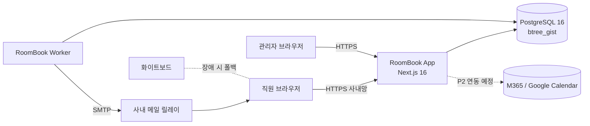
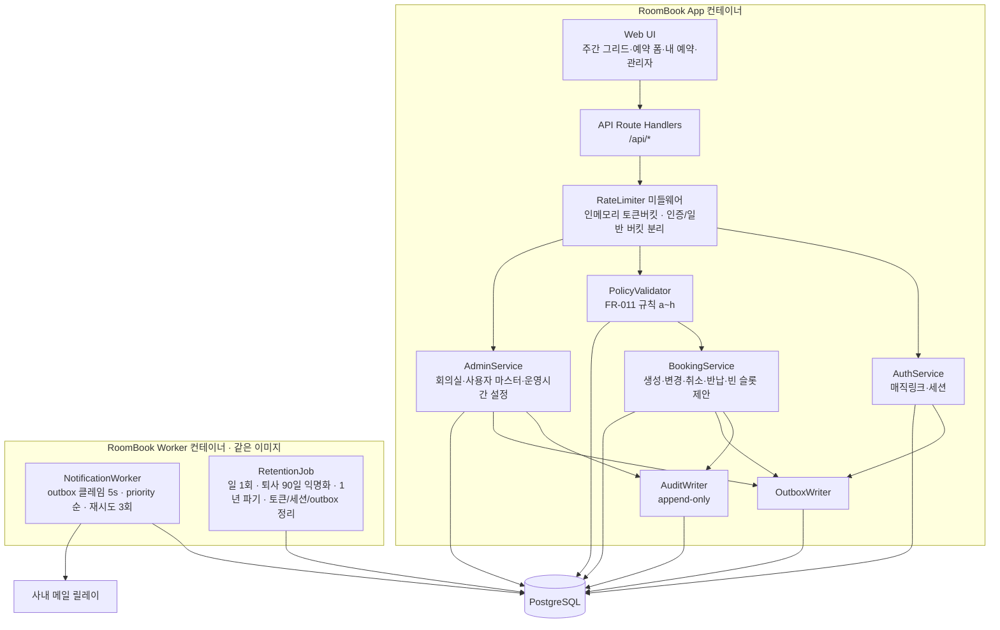
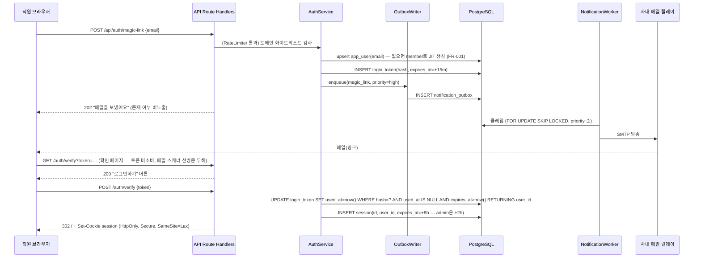
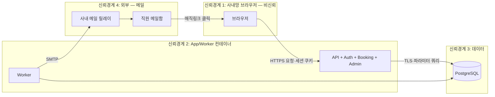
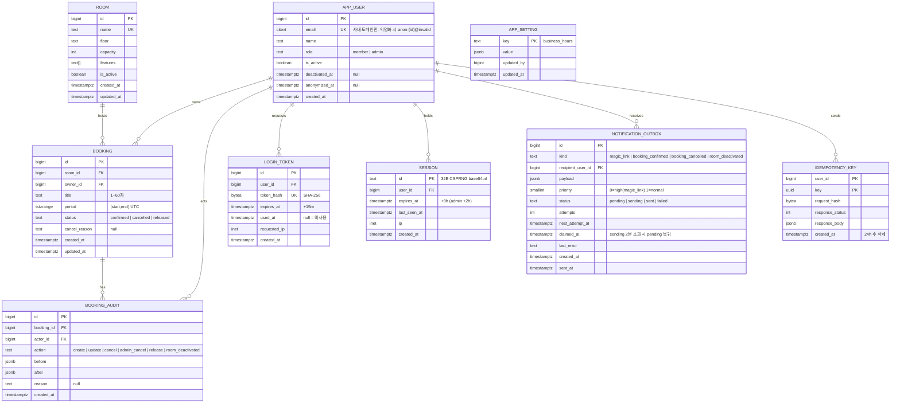

# Seed — 사내 회의실 웹 예약 (가칭: RoomBook)

- 원문: 사내 회의실 예약을 웹에서 하고 싶다. 지금은 화이트보드에 수기로 적는다.
- 서비스 유형: 웹 SaaS(사내 내부 도구 — 단일 테넌트, 직원 전용)
- 주 도메인 / 인접 도메인: 회의실·공간 자원 예약(workplace resource scheduling) / 사내 캘린더(M365·Google Workspace)·사내 인증(SSO)·근무지 운영(총무)
- 감지된 제약:
  - 현재 운영 방식이 화이트보드 수기 → 시스템 도입 시 "화이트보드보다 느리면 실패" (전환 마찰)
  - "웹에서" 명시 → 데스크톱 브라우저 우선, 별도 네이티브 앱 요구 없음
  - 규모·회의실 수·조직의 캘린더 플랫폼(M365/Google/없음)·인증 방식은 입력에 없음 → A1·A2가 채운다
- 로드할 블라인드스팟 프로파일: P2 (웹 SaaS) — 단, 사내 도구이므로 테넌시·결제 축은 "해당없음" 후보

정규화 일시: 2026-09-03 · 되묻지 않음 (A0 규칙)


---

# Recon — 사내 회의실 웹 예약 (RoomBook)

조사 기준일: 2026-09-03 · 방법: WebSearch(11회) + 공식 문서 우선 (`evidence-map.md` 절차)
증거 경계 표기 (ecc:research-ops): **[사실]** 출처 있는 사실 · **[입력]** 사용자 제공 · **[추론]** 사실에서 도출 · **[추천]** 판단

## 도메인 업무 흐름 — 회의실 예약은 실제로 어떻게 돌아가는가

- **[사실]** 기업용 표준 흐름은 "회의실 = 캘린더 자원(resource)"이다. Microsoft 365는 회의실을 room mailbox로 만들고 Outlook 일정에서 초대하면 가용 시 자동 수락(AutomateProcessing=AutoAccept)한다. 예약 가능자·승인 필요자를 분리 설정할 수 있다.
  - https://learn.microsoft.com/en-us/exchange/recipients/room-mailboxes (확인 2026-09-03)
  - https://learn.microsoft.com/en-us/answers/questions/4667220/automatic-process-of-room-reservation-requests-in (확인 2026-09-03)
- **[사실]** Google Workspace는 Admin Console > Directory > Buildings and resources 에서 회의실을 자원으로 등록(수용 인원·층·설비)하며, 모든 유료 플랜에 포함이다. free/busy만 공개하고 상세는 숨기는 설정이 있다.
  - https://support.google.com/a/answer/9025584 (확인 2026-09-03)
  - https://knowledge.workspace.google.com/admin/calendar/allow-free-busy-google-calendar-room-booking (확인 2026-09-03)
- **[사실]** 예약 시스템 도입 후 가장 큰 운영 문제는 "고스트 미팅(예약 후 미사용)"이다. 워크플레이스 분석사 자료로 주당 예약 회의실의 30~45%가 미사용, 체크인 없는 조직은 50% 초과. 표준 대책은 체크인 + 유예시간(10~15분) 후 자동 해제.
  - https://myseat.io/meeting-room-analytics-utilization-tips/ (확인 2026-09-03)
  - https://www.deskbird.com/blog/ghost-meetings (확인 2026-09-03)
  - https://www.worklytics.co/resources/stop-ghost-meetings-microsoft-teams-check-in-auto-release-reduce-no-shows (확인 2026-09-03)
- **[입력]** 현재는 화이트보드 수기. → **[추론]** 현 상태의 실패 모드는 (a) 자리를 떠나야 현황을 알 수 있음, (b) 중복 기입·지우개 분쟁, (c) 변경·취소 이력 없음, (d) 노쇼여도 칸이 남아 있음. 시스템의 첫 가치는 "어디서나 현황 확인 + 중복 예약 원천 차단"이다.

## 이해관계자 — 누가 쓰고, 누가 책임지는가

| 이해관계자 | 관심사 | 실패 시 영향 | 근거 |
|---|---|---|---|
| 일반 직원 (예약자) | 빈 방을 10초 안에 찾고 예약, 내 예약 변경·취소 | 화이트보드보다 느리면 이탈 → 도입 실패 | [추론] + 자동 해제/체크인 관행 (deskbird) |
| 회의 참석자 | 어느 방인지 알림 | 방 못 찾아 회의 지연 | [추론] |
| 총무/시설 담당 (관리자) | 회의실 마스터 관리, 노쇼·점유율 파악, 분쟁 중재 | 운영 부담 증가 | myseat.io 지표(점유율·노쇼율) |
| IT 담당 | 인증 연동, 배포·백업, 개인정보 | 보안 사고·복구 불능 | P2 프로파일 |
| 비용 결정자 (경영지원) | 상용 SaaS 대비 구축 비용 | 과잉 투자 | 아래 유사 솔루션 가격 |

돈을 내는 주체는 회사(내부 도구, 과금 없음). **[추론]** 결제·구독 축은 해당 없음.

## 규제·표준 — 반드시 준수해야 하는 것

- **[사실] 개인정보보호법(국내)**: 직원 이름·이메일·예약 이력은 개인정보. 최소 수집, 목적 달성 시 지체 없는 파기, 취급자 최소 지정이 원칙. 사내 도구라도 적용된다.
  - https://www.privacy.go.kr/front/contents/cntntsView.do?contsNo=121 (확인 2026-09-03)
  - https://www.catchsecu.com/archives/13133 (보유기간 해설, 확인 2026-09-03)
- **[추론]** 결제·의료·금융 규제 해당 없음(내부 도구, 과금 없음, 민감정보 없음). GDPR은 EU 거주 직원이 없다는 가정 하에 해당 없음 → register `Assumed`.
- **[사실] 인증 표준**: SSO 연동 시 OIDC(OpenID Connect)가 사실상 표준이며 M365(Entra ID)·Google 모두 OIDC IdP다. 초기엔 설계만 열어둔다(P2 기본값).
  - https://openid.net/specs/openid-connect-core-1_0.html (확인 2026-09-03)
- **[사실] 시간 표현**: 예약은 시간 구간이므로 저장은 UTC·교환은 ISO 8601, DB는 range 타입이 표준 관행 (아래 스택 근거).

## 유사 솔루션 — 실제 기능 범위 (오픈소스 + 상용)

| 솔루션 | 유형/라이선스 | 핵심 기능 | 비용 | 우리 fit | 출처 |
|---|---|---|---|---|---|
| **M365 room mailbox** | 상용 번들(기존 구독에 포함) | 자동 수락, 예약 가능자 제한, 승인 정책, Outlook/Teams 통합 | 추가 비용 0 (M365 보유 시) | **높음 — 조직이 M365면 "만들지 말고 설정"** | learn.microsoft.com (위) |
| **Google Calendar 자원** | 상용 번들 | 회의실 자원, 층·설비, free/busy 공개, 자동 방 추천 | 추가 비용 0 (Workspace 보유 시) | **높음 — 조직이 Google이면 설정만** | support.google.com (위) |
| **MRBS** | 오픈소스 GPLv2, PHP+MySQL/PostgreSQL | 회의실/구역 관리, 반복 예약, 승인, 다국어. v1.12.2 (2026-05-26) 활발 유지 | 호스팅만 | 중간 — 기능은 충분하나 UI 노후·PHP 운영 역량 필요 | https://github.com/meeting-room-booking-system/mrbs-code · https://www.vizitorapp.com/blog/free-and-open-source-meeting-room-booking-systems-the-2026-edition/ (확인 2026-09-03) |
| **Cal.com** | 오픈소스 AGPLv3 (Cal.diy 포크는 MIT) | 사람 일정 예약(Calendly 대체), 팀 라운드로빈. 회의실 자원 예약은 주 목적 아님 | 호스팅만 (상용 라이선스는 30석 이상) | 낮음 — 사람 예약이 목적, 회의실 자원 모델 없음 | https://cal.com/blog/cal-diy-open-source-to-closed-source (확인 2026-09-03) |
| **Skedda** | 상용 SaaS | 공간 예약, 반복, 캘린더 뷰, 셀프서비스 | Starter $99/월(15 공간)~Premier $199/월(25 공간) | 중간 — 즉시 사용 가능하나 월 고정비, 국내 SSO·데이터 위치 검토 필요 | https://www.capterra.com/p/132372/Skedda-Bookings/pricing/ (확인 2026-09-03) |
| **Robin** | 상용 SaaS | 회의실+데스크, 체크인/자동 해제, 분석 | 자원당 약 $4~6/월, 연 $15,000~ 플랜 | 낮음 — 소규모 사내 도구엔 과잉 | https://www.vendr.com/marketplace/robin (확인 2026-09-03) |

**[추천] search-first 판정 (Adopt / Extend / Build)**
1. 조직이 **M365 또는 Google Workspace를 이미 쓰고 있다면 → Adopt(설정)**. 구축 자체가 불필요. 이 조건은 조사로 알 수 없어 A2 질문 Q1로 승격.
2. 둘 다 없거나(또는 캘린더 문화가 없어 화이트보드를 쓰는 조직) 웹 전용 도구를 원하면 → **Build (경량)**. MRBS Extend도 후보였으나 PHP/노후 UI/커스터마이즈 비용으로 "얇은 자체 구축"이 총비용에서 유리 **[추론]** — 도메인 핵심(시간 구간 중복 방지)은 DB 제약 한 줄로 해결되므로 구축 난이도가 낮다.
3. 상용 SaaS(Skedda 등)는 "월 $99~ 고정비 vs 내부 개발 1~2주"의 비교 문제 — 비용 결정자에게 선택지로 남기고, 이 패키지는 Build 경로를 설계한다.

## 스택 후보 — 후보별 근거·트레이드오프 (인기 ≠ 적합)

| 후보 | 근거 | fit | 트레이드오프 |
|---|---|---|---|
| **PostgreSQL 16+ (range + EXCLUDE 제약)** | `EXCLUDE USING gist (room_id WITH =, period WITH &&)` 로 동시 요청에서도 중복 예약을 DB 수준에서 원천 차단. btree_gist 확장 필요. PostgreSQL 18은 temporal constraint 문법 추가 | **높음** — 요구 1순위(중복 차단)를 직접 충족 | 운영자가 PostgreSQL을 알아야 함(가정: 소규모 IT라도 Docker 운영 가능) · https://www.postgresql.org/docs/current/rangetypes.html · https://dev.to/franckpachot/postgresql-exclude-constraints-for-better-concurrency-than-serializable-pob (확인 2026-09-03) |
| **Next.js 16 (React, App Router) + TypeScript** | v16.3.x Active LTS, 보안 지원 2027-10 예정. 단일 저장소에 UI+API(Route Handlers) 동거 → 소규모 팀 운영 단순 | **높음** — "웹에서" 요구 + 한 컨테이너 배포 | 프레임워크 학습 곡선, SSR 불필요하면 과잉일 수 있음 · https://nextjs.org/blog/next-16 · https://versionlog.com/nextjs/16/ (확인 2026-09-03) |
| **FastAPI + React(Vite)** (대안) | Python 팀이면 백엔드 생산성 높음 | 중간 — 팀 역량에 따라 | 저장소·배포 2개, 타입 공유 별도 작업 |
| **MRBS 채택 후 커스터마이즈** (대안) | 검증된 기능 세트, GPLv2 | 중간 | PHP, GPL 파생물 공개 의무(사내 배포면 무관), UI 노후 |
| **인증: 사내 IdP OIDC(있으면) / 없으면 이메일 매직링크** | OIDC 표준. 비밀번호 저장을 피하면 자격증명 유출 리스크 자체 제거 | 높음 | IdP 없으면 SMTP 의존 → 메일 발송 실패 = 로그인 불가 (A4 위협모델·A7 알림에 반영) |
| **배포: Docker Compose 단일 호스트** | 사내 도구 규모(가정 ≤ 300명, 회의실 ≤ 30)엔 충분 | 높음 | HA 없음 — 장애 시 화이트보드 폴백(운영 절차로 흡수) |

**[추천] 최종 후보**: Next.js 16 + TypeScript + PostgreSQL 16(range/EXCLUDE) + Docker Compose, 인증은 OIDC 우선·매직링크 폴백. fit 근거: 요구 충족(중복 차단·웹)·운영 단순성(컨테이너 1~2개)·총비용(라이선스 0). 팀 역량은 미상 → register `Assumed`(TypeScript 가능 인력 1명 이상).

## 반복 조사 필요성 (research-ops 5단계)
일회성 조사로 충분. 단, "Skedda/Robin 가격·M365 정책"은 연 1회 재확인 권고 (Build 유지 근거 재검토).


---

# 블라인드스팟 레지스터 — 사내 회의실 웹 예약 (RoomBook)

스캔: 공통 10축 + STRIDE 6범주 + 프로파일 P2 웹 SaaS(6항목) = 22항목 + 도메인 고유 3 + 하류 단계(A3~A7·GATE)에서 생긴 Assumed 6 = 31항목 · 스캔일 2026-09-03 (GATE 패치 2026-09-03)
모드: 오토파일럿(무응답) — Asked 문항은 추천안을 `Assumed(무응답)`로 채택

## 사전 진단 (ecc:product-lens Mode 1 — "왜"의 검증)

| # | 질문 | 답 (근거) |
|---|---|---|
| 1 | 누구를 위한 것인가 | 회의실을 쓰는 전 직원 + 회의실을 관리하는 총무 1~2명 (01-recon 이해관계자) |
| 2 | 고통은 무엇인가 | 화이트보드는 그 앞에 가야 보이고, 중복 기입·지움 분쟁이 생기며, 취소·변경 이력이 없다 [추론]. 예약 후 미사용은 업계 평균 30~45% (myseat.io) |
| 3 | 왜 지금인가 | 사용자 입력에 "지금은 수기" — 규모나 원격/하이브리드 근무로 화이트보드의 물리적 한계에 도달 [추론] |
| 4 | 10점짜리 버전 | 캘린더·회의실 패널·센서 연동, 자동 방 추천, 점유율 분석 (Robin·Google 수준) |
| 5 | MVP | 로그인 → 오늘/주간 회의실 현황 보기 → 빈 칸 클릭 → 예약 확정(중복 원천 차단) → 내 예약 취소. 이 5단계만으로 화이트보드를 대체한다 |
| 6 | 안티골 | 데스크 예약, 방문자 관리, 회의실 패널 하드웨어, 외부 캘린더 양방향 동기화(MVP), 결제 |
| 7 | 작동 판단 지표 | 도입 4주 후 화이트보드 철거 가능 여부 = 주간 예약의 100%가 시스템 경유 + 중복 예약 분쟁 0건 (03-prd SC로 정형화) |

Go/No-go: **Go — 단, 조직이 M365/Google Workspace 캘린더를 이미 쓴다면 No-go(설정으로 해결)**. 이 조건이 Q1이다.

## 레지스터 (전 축 전 항목)

| 축/항목 | 상태 | 처리 | 근거·출처 |
|---|---|---|---|
| 1. 기능 범위·행동 | Partial | Assumed: MVP = 현황 조회·예약·변경·취소·회의실 관리. non-goal = 데스크·방문자·패널·결제 | seed + product-lens #5·#6 |
| 2. 도메인·데이터 모델 | Partial | Assumed: 엔티티 Room·Booking·User·AuditLog. 예약 단위 15분, 최대 길이 4시간, 선예약 창 60일, 사용자당 미래 confirmed 예약 ≤ 20건, 시간대 Asia/Seoul 단일, 저장 UTC. 사용자 계정은 허용 도메인 이메일 첫 요청 시 JIT 생성(사전 등록 없음) | M365 정책 항목(BookingWindowInDays·MaximumDurationInMinutes)이 동일 개념을 정책화 — learn.microsoft.com room-mailboxes. 값 자체는 사내 기본값 가정 |
| 3. 상호작용·UX 플로우 | Partial | Assumed: 주 여정 = 주간 타임라인 그리드에서 빈 칸 클릭 → 3필드(제목·시작·종료) 입력 → 확정. 역할 2개(member/admin). 에러는 복구 경로 동반 (L-06) | ux-principles-kr.md L-03·L-06·L-10; 화이트보드의 "주간 그리드" 멘탈모델 유지 (L-01 제이콥) |
| 4. 비기능 품질 | Missing | Assumed: 가용성 99.5%/월(근무시간), 예약 확정 p95 ≤ 1s, 현황 화면 첫 표시 ≤ 2s, 동시 사용자 50, 관측성=구조화 로그+헬스체크 | 사내 도구 관행; 도허티 임계 L-10; 상세는 03-prd SC·07-ops SLO |
| 5. 통합·외부 의존성 | Missing | **Asked → Q1**(캘린더 플랫폼), **Q2**(인증). 이메일 발송은 Assumed(사내 SMTP 릴레이 + STARTTLS, 실패 시 재시도·화면 알림 폴백). 사내 릴레이가 없어 SES 등 외부 발송을 쓰면 직원 이메일이 외부로 나가므로 **개인정보 처리위탁 검토가 전제조건** | Impact: 구축 불필요 가능성 / Uncertainty: 조직 환경 |
| 6. 엣지케이스·실패 처리 | Partial | Assumed: 동시 예약 → DB EXCLUDE 제약으로 한 쪽 409; 과거 시각 예약 불가; 종료≤시작 거부; 운영시간 밖 거부; 회의실 비활성화 시 기존 예약 유지+관리자 알림 | PostgreSQL rangetypes 문서; 03-prd 엣지케이스 표 |
| 7. 제약·트레이드오프 | Missing | **Asked → Q5**(배포 환경·규모). 팀 역량은 Assumed(TypeScript 가능 1명 이상, Docker 운영 가능) | Impact: IaC·백업·접근 방식 / Uncertainty: 조직 인프라 |
| 8. 용어·일관성 | Partial | Assumed: 용어집 — 회의실(Room)·예약(Booking)·예약자(Owner)·관리자(Admin)·반납(Release)·운영시간(Business hours). "회의" ≠ "예약"으로 구분 | 문서 전반 동일 용어 사용, 05 ERD 이름과 일치 |
| 9. 완료 신호 | Partial | Assumed: SC-001~006 pass/fail (03-prd). 인수 = 4주 파일럿 후 화이트보드 철거 | product-lens #7 |
| 10. 비용·라이선스 | Clear | 라이선스 비용 0 (Next.js MIT·PostgreSQL License·Docker CE). 런타임 = VM 1대. 상용 대안 Skedda $99/월~ 은 비용 결정자 참고 | 01-recon 유사 솔루션 표 |
| S. Spoofing | Partial | Assumed: 비밀번호 미보유(매직링크/OIDC), 세션 쿠키 HttpOnly·SameSite=Lax·8h 만료, 사내 이메일 도메인 화이트리스트 | A4 위협모델 ②에서 경계별 재검토 |
| T. Tampering | Partial | Assumed: 예약 소유자·관리자만 변경, 서버측 권한 검사, 중복 방지는 DB 제약(앱 우회 불가) | A4 |
| R. Repudiation | Partial | Assumed: booking_audit 테이블에 생성·변경·취소·반납 이벤트 + actor + 시각 기록(1년 보존) | 화이트보드의 "누가 지웠나" 분쟁이 원 고통 → 감사 로그가 핵심 가치 |
| I. Information Disclosure | Partial | **Q3와 결합**: 예약 제목·예약자는 전사 공개(화이트보드와 동일 정보 수준). 이메일 주소는 예약자 본인·관리자만. 로그에 PII 최소화 | 개인정보 최소 수집(privacy.go.kr) |
| D. Denial of Service | Partial | Assumed: 사내망/로그인 뒤. 매직링크 요청 레이트리밋(이메일당 5회/10분), 예약 API 사용자당 60회/분 | A4·A7 |
| E. Elevation of Privilege | Partial | Assumed: 역할은 서버 세션에서만 결정, 클라이언트 파라미터로 role 전달 금지, admin 경로 미들웨어 검사 | A4 |
| P2. 테넌시 | Clear | 해당없음 — 단일 회사·단일 인스턴스. tenant_id 없음 | seed(사내 도구) |
| P2. 인증 | Missing | **Asked → Q2** | Impact: 인증 재작업 / Uncertainty: 사내 IdP 유무 |
| P2. 결제·구독 | Clear | 해당없음 — 내부 도구, 과금 없음 | 01-recon 이해관계자 |
| P2. 백업·DR | Missing | Assumed: pg_dump 일 1회 02:00 KST, 보관 30일, 오프사이트(사내 NAS 또는 오브젝트 스토리지) 1부, 복원 리허설 월 1회(outplane.com 가이드 권고, 07 근거). RPO 24h·RTO 4h(그 사이 화이트보드 폴백) | blindspot-checklists P2 기본값; 화이트보드 폴백은 이 도메인 고유 장점 |
| P2. 개인정보 | Partial | Assumed: 수집=이름·사내 이메일·예약 이력. 퇴사 시 계정 비활성화 + 90일 후 이름 익명화, 예약 이력 1년 보존 후 파기. 처리방침 사내 공지 | 개인정보보호법 최소수집·파기 원칙 (privacy.go.kr, 확인 2026-09-03) |
| P2. 이메일/알림 | Partial | Assumed: 매직링크·예약 확정·취소·회의실 비활성화 알림 4종만. 사내 SMTP 릴레이(없으면 SES — 위탁 검토 전제). 큐 + 실패 재시도 3회(지수 백오프), 최종 실패는 화면 배너로 대체 | blindspot-checklists P2 기본값 |
| 도메인 고유. 노쇼·자동 해제 | Missing | **Asked → Q4** | Impact: 데이터 모델·잡·화면 / Uncertainty: 조직 노쇼 실태 |
| 도메인 고유. 반복 예약 | Partial | Assumed: MVP 제외(P2). 반복 예약이 고스트 미팅 최대 원인(deskbird)이므로 초기엔 단발만 | https://www.deskbird.com/blog/ghost-meetings (확인 2026-09-03) |
| 도메인 고유. 언어·시간대 | Clear | 한국어 단일, Asia/Seoul 단일 오피스 | seed(사내) |
| 하류 신규(A1). GDPR | Clear | 해당없음 — EU 거주 직원 없음 Assumed | 01-recon 규제 절 |
| 하류 신규(A6). 브라우저 | Partial | Assumed: 사내 표준 브라우저 Chrome/Edge → E2E는 chromium+mobile-chrome만 | Impact 낮음(Playwright 프로젝트 추가로 해결) |
| 하류 신규(A7). 중앙 로그 수집 | Partial | Assumed: 사내 Loki/ELK 있으면 Promtail 연결, 없으면 VM 로컬 7일 보관 | 07 로깅 전략 |
| 하류 신규(A7). TLS·인증서 | Partial | Assumed: 사내 CA가 서버 인증서를 발급해 줌 → Caddy 컨테이너가 TLS 종단·폴백 페이지 담당 | 07 런타임. 없으면 사내 리버스 프록시에 위임 |
| 하류 신규(A7). 알림 채널 | Partial | Assumed: 웹훅 수신 가능한 사내 메신저 존재 → 호스트 cron `alert-check.sh`가 평가·발송. 없으면 이메일(메일 장애 알람은 그 경로로 못 감 → 전화 목록) | 07 알림 |
| 하류 신규(GATE). 관리자 감사 범위 | Partial | Assumed: MVP 감사 로그는 예약 관련 행위만. 회의실·설정·사용자 변경 감사(admin_audit)는 P2 | 04 STRIDE 관리자 행 |

미마킹 축: **0** (게이트 조건 충족)

## 질문 배치 (5문항, 1회) — 제시 2026-09-03 · 오토파일럿: 무응답

### Q1. 회사가 이미 쓰는 캘린더 플랫폼이 있나? (있으면 구축 대신 설정이 정답일 수 있다)
| 옵션 | 내용 | 근거·트레이드오프 |
|---|---|---|
| A (추천) | 없음 또는 미상 → 독립 웹앱으로 구축. 캘린더 연동은 P2(착수 시 설계, 지금 인터페이스를 만들지 않음) | 화이트보드를 쓰는 조직은 캘린더 자원 문화가 없을 가능성이 높고, 사용자가 "웹 도구"를 명시함. 리스크: M365/Google 보유 시 과잉 구축 |
| B | Microsoft 365 보유 → room mailbox 설정으로 대체, 구축 중단 | 추가 비용 0, Outlook/Teams 통합. 단, 웹 전용 현황판이 필요하면 Graph API 읽기 전용 화면만 별도 |
| C | Google Workspace 보유 → 자원 캘린더 설정으로 대체, 구축 중단 | 추가 비용 0, 자동 방 추천 포함 |
→ 답: 무응답 → **A Assumed(무응답)**. 잔여 리스크로 08-readiness에 기록.

### Q2. 로그인은 어떻게 하나?
| 옵션 | 내용 | 근거·트레이드오프 |
|---|---|---|
| A (추천) | 사내 이메일 도메인 제한 매직링크(비밀번호 없음) + OIDC 어댑터를 P2로 설계 | 비밀번호 저장 자체를 없애 유출 리스크 제거(Spoofing 완화). 리스크: 메일 발송 장애 = 로그인 불가 → 07에서 알림·폴백 |
| B | 사내 IdP(Entra ID/Google/Keycloak) OIDC 즉시 연동 | IdP가 있으면 최선. 없으면 IdP 구축이 선행 과제가 되어 범위 폭발 |
| C | 자체 ID/비밀번호 | 비밀번호 리셋·해시·정책 구현 부담, 유출 리스크 |
→ 답: 무응답 → **A Assumed(무응답)**

### Q3. 예약 정보 공개 범위와 승인 정책은?
| 옵션 | 내용 | 근거·트레이드오프 |
|---|---|---|
| A (추천) | 전 회의실 즉시 확정(승인 없음), 제목·예약자 이름 전사 공개 | 화이트보드와 동일한 정보 수준·속도. 승인 상태 기계 없음 → 모델 단순. 리스크: 민감 회의 제목 노출 → 입력란에 "제목은 전사에 보여요" 안내 |
| B | 제한 회의실(임원실·대형)만 관리자 승인 | 희소 자원 통제. pending 상태·알림·관리 화면 추가 |
| C | 제목 비공개, free/busy만 표시 | 프라이버시 최대. 화이트보드보다 정보가 줄어 "누가 쓰나" 문의 증가 |
→ 답: 무응답 → **A Assumed(무응답)**

### Q4. 노쇼(예약 후 미사용) 대책을 MVP에 넣나?
| 옵션 | 내용 | 근거·트레이드오프 |
|---|---|---|
| A (추천) | MVP는 "조기 반납" 버튼만. 체크인·자동 해제는 P2 — 도입 4주 후 관리자 노쇼 민원 건수로 판단 | 체크인 강제는 화이트보드보다 마찰이 커 초기 정착을 해침. 소규모 조직은 노쇼 비용이 낮음 [추론]. 업계 노쇼율 30~45%는 대형 하이브리드 오피스 기준(myseat.io) |
| B | 체크인 + 유예 15분 자동 해제 P1 | 고스트 미팅 즉시 차단. 체크인 화면(QR/버튼)·스케줄러 잡·알림 추가 |
| C | 없음 | 노쇼 방치 |
→ 답: 무응답 → **A Assumed(무응답)**

### Q5. 어디에 배포하고 규모는 얼마나 되나?
| 옵션 | 내용 | 근거·트레이드오프 |
|---|---|---|
| A (추천) | 사내 VM(또는 사내 클라우드 계정 VM) 1대, Docker Compose. 직원 ≤300·회의실 ≤30 가정 | 데이터 사내 보관, 운영 단순. HA 없음 → 장애 시 화이트보드 폴백 |
| B | 퍼블릭 관리형(Vercel + 관리형 Postgres) | 운영 최소. 직원 개인정보가 외부 SaaS에 저장 → 처리 위탁 검토 필요 |
| C | 폐쇄망 온프레미스 | 이메일 발송·외부 폰트·CDN 전부 차단 → 매직링크 불가, Q2를 B/C로 바꿔야 함 |
→ 답: 무응답 → **A Assumed(무응답)**

## 반영 기록
- Q1 A → 04-architecture 컨텍스트에 "P2 연동 예정"만 표기(포트 선제 정의 안 함, DL-008), 08에 "M365/Google 보유 시 No-go" 잔여 리스크 (decision-log #1)
- Q2 A → 04 인증 컴포넌트=매직링크, 05 `/auth/magic-link` 엔드포인트, 07 SMTP 장애 알림 (decision-log #2)
- Q3 A → 03 FR-004 공개 범위, 05 Booking 응답에 title·owner_name 포함, 04 STRIDE-I 검토 (decision-log #3)
- Q4 A → 03 FR-006 조기 반납 P1, 체크인/자동 해제 P2. 05 `POST /bookings/{id}/release` (decision-log #4)
- Q5 A → 07 Compose 스케치·백업 경로, 04 Context (decision-log #5)


---

# PRD — RoomBook (사내 회의실 웹 예약)

> 근거 (A3 진입 사전조사, 2026-09-03)
> - **정량**: M365 room mailbox 기본 정책값 BookingWindowInDays=180일, MaximumDurationInMinutes=1440분 — https://learn.microsoft.com/en-us/powershell/module/exchangepowershell/set-calendarprocessing (확인 2026-09-03). 업계 표준 "정책 항목"이 선예약 창·최대 길이임을 확인. 우리 기본값(60일·4시간)은 사내 보수값으로 Assumed.
> - **정성**: "Double bookings waste valuable time and fray employee nerves" — 회의실 이중 예약 가이드 (https://www.yarooms.com/blog/how-to-prevent-double-bookings-in-meeting-and-conference-rooms 외, 검색 요약 인용, 확인 2026-09-03). 원 고통 = 이중 예약과 그 분쟁.
> - **사용자 영향**: 화면은 화이트보드와 같은 "회의실 × 시간" 주간 그리드를 유지한다(L-01 제이콥). 한 화면의 결정은 "이 칸을 잡는다" 하나(L-03 힉).

## 배경
화이트보드 수기 예약은 (a) 보드 앞에 가야 현황이 보이고 (b) 이중 기입·지움 분쟁이 생기며 (c) 변경·취소 이력이 없다(01-recon [추론]). 기업 표준은 "회의실 = 캘린더 자원"이나(M365·Google), 조직의 캘린더 플랫폼이 미상이라 독립 웹앱을 구축한다(DL-001). 업계 최대 운영 문제는 예약 후 미사용(30~45%, myseat.io)이지만 MVP에서는 조기 반납만 두고 체크인은 P2로 미룬다(DL-004). 상세 조사: `01-recon.md`.

## Capability (ecc:product-capability 재진술)
로그인한 직원 누구나, 어디서든 브라우저로 이번 주 회의실 현황을 보고 빈 칸을 3단계 안에 확정 예약하며, 시스템이 같은 방·같은 시간의 이중 예약을 원천적으로 불가능하게 만든다. 총무는 회의실 마스터와 "누가 언제 무엇을 바꿨나"를 조회한다. 결과: 화이트보드 철거.

## 제품 목표 (≤3, 직교)
| # | 목표 | 측정 |
|---|---|---|
| G1 | 이중 예약이 **구조적으로** 불가능하다 | SC-001 |
| G2 | 화이트보드보다 느리지 않다 (어디서나, 3단계, 1초) | SC-002·SC-003 |
| G3 | 변경·취소의 책임 추적이 가능하다 | SC-005·FR-009 |

## 유저 스토리 (P1만으로 MVP 성립)
| ID | 우선순위 | 스토리 | 독립 테스트 |
|---|---|---|---|
| US-1 | P1 | As a 직원, I want 이번 주 회의실 현황을 한 화면에서 보고 빈 칸을 클릭해 예약하고 싶다, so that 보드 앞에 가지 않고 자리를 확보한다 | 로그인 → 그리드 → 빈 칸 클릭 → 제목 입력 → 확정, 그리드에 블록 표시 |
| US-2 | P1 | As a 직원, I want 내 예약을 바꾸거나 취소하고, 회의가 일찍 끝나면 방을 반납하고 싶다, so that 남이 그 시간을 쓸 수 있다 | 내 예약 → 취소/반납 → 그리드에서 사라짐, 감사 로그 기록 |
| US-3 | P1 | As a 총무(관리자), I want 회의실을 등록·수정·비활성화하고 문제가 된 예약의 이력을 보고 싶다, so that 분쟁을 사실로 중재한다 | 관리자 로그인 → 회의실 추가 → 직원 화면에 나타남; 감사 로그에서 특정 예약의 변경 이력 조회 |
| US-4 | P2 | As a 직원, I want 매주 같은 시간 정기회의를 한 번에 예약하고 싶다 | (P2 — MVP 제외) |
| US-5 | P2 | As a 총무, I want 노쇼를 자동으로 해제하고 점유율을 보고 싶다 | (P2 — MVP 제외) |

## 요구사항 풀
P0 = 없으면 제품이 성립하지 않음 · P1 = MVP 포함 · P2 = 이후

| ID | 요구사항 (EARS) | 우선순위 | 출처 |
|---|---|---|---|
| FR-001 | 사용자가 사내 도메인 이메일을 입력하면, 시스템은 해당 사용자가 없을 경우 member로 즉시 생성하고(JIT, 이름 초기값 = 이메일 로컬파트, 이후 본인·관리자가 수정) 15분 유효·1회용 매직링크를 발송해야 한다. 링크는 확인 페이지를 거쳐 "로그인하기" 1클릭(POST)으로만 소비되며, 검증 시 세션을 발급한다(member 8시간, admin 2시간). 허용 도메인 외 이메일은 거부한다 | P0 | US-1, DL-002 |
| FR-002 | 로그인한 사용자가 접속하면, 시스템은 이번 주(월~일) 회의실 × 시간(15분 단위, 운영시간 내) 그리드에 예약 블록(제목·예약자 이름)을 표시해야 한다. 주 이동·오늘로 이동을 제공한다 | P0 | US-1 |
| FR-003 | 사용자가 회의실·시작·종료·제목(1~60자)을 제출하면, 시스템은 정책(FR-011)을 검증하고 즉시 `confirmed` 예약을 생성해야 한다. 겹치는 예약이 있으면 409와 함께 같은 방의 가장 가까운 빈 슬롯 1개를 제안한다 | P0 | US-1, DL-003 |
| FR-004 | 로그인한 모든 사용자에게 예약의 제목·예약자 이름을 표시해야 한다. 예약자 이메일은 본인과 관리자에게만 표시한다 | P0 | DL-003, 개인정보 최소화 |
| FR-005 | 예약 소유자 또는 관리자가 요청하면, 시스템은 시작 전 예약의 시간·제목 변경과 취소를 허용해야 한다. 그 외 사용자의 요청은 403으로 거부한다 | P1 | US-2 |
| FR-006 | 예약 소유자 또는 관리자가 진행 중(start_at ≤ now < end_at) 예약을 반납하면, 시스템은 end_at을 현재 시각으로 줄이고 상태를 `released`로 바꿔 즉시 다른 예약을 허용해야 한다 | P1 | US-2, DL-004 |
| FR-007 | 사용자가 내 예약을 열면, 시스템은 예정 예약 전부와 지난 30일 예약을 시간순으로 표시해야 한다 | P1 | US-2 |
| FR-008 | 관리자가 회의실을 등록·수정·비활성화하면, 시스템은 이름·위치(층)·수용 인원·설비 태그를 저장하고 비활성 회의실을 그리드에서 숨겨야 한다. 비활성화 시 기존 예약은 유지하고 소유자에게 알린다. 운영시간(기본 07:00~22:00 KST)은 전역 설정이다 | P1 | US-3 |
| FR-009 | 예약이 생성·변경·취소·반납될 때마다, 시스템은 행위자·시각·변경 전후 값을 추가 전용(append-only) 감사 로그에 기록하고 관리자가 예약 단위로 조회할 수 있어야 한다. 보존 1년 | P1 | US-3, G3 |
| FR-010 | 예약이 확정·취소되면, 시스템은 소유자에게 이메일을 발송해야 한다. 발송 실패 시 지수 백오프로 3회 재시도하고, 최종 실패는 화면 배너로 대체한다 | P1 | P2 프로파일 |
| FR-011 | 예약 요청을 받으면, 시스템은 (a) 시작·종료가 15분 경계 (b) 시작 < 종료 (c) 길이 ≤ 240분 (d) 시작 ≥ 현재 15분 슬롯 시작 (e) 시작 ≤ 오늘+60일 (f) 운영시간 내 (g) 활성 회의실 (h) 요청자의 미래 `confirmed` 예약 ≤ 20건 — 을 모두 검증하고 위반 시 422와 위반 항목을 반환해야 한다. 409 충돌 시 제안하는 대안 슬롯은 요청 시작 시각 이후 당일 운영시간 종료까지 전방 탐색한 같은 방·같은 길이의 첫 후보이되 같은 규칙을 통과한 것만이며, 후보가 없으면 "오늘 안에 빈 시간이 없어요 — 다른 회의실을 볼까요?"와 회의실 목록으로 안내한다 | P0 | US-1, register 축2 |
| FR-012 | 화면 폭 < 768px이면, 시스템은 하루 단위 그리드로 전환해야 한다(모바일 브라우저 대응) | P1 | ux-principles L-02 |
| FR-013 | 사용자가 로그아웃하거나 세션이 만료되면, 시스템은 서버 세션을 폐기해야 한다 | P1 | STRIDE-S |
| FR-014 | 관리자가 타인의 예약을 취소할 때, 시스템은 사유(1~200자)를 요구하고 소유자에게 사유를 포함해 알려야 한다 | P1 | G3 |
| FR-015 | 관리자가 사용자를 비활성화하면, 시스템은 로그인을 차단하고 그 사용자의 미래 `confirmed` 예약을 사유 "퇴사 처리"로 `admin_cancel`(감사 기록)하며, 90일 후 이름·이메일을 익명화해야 한다(예약 이력은 익명 상태로 1년 보존 후 파기) | P1 | 개인정보보호법 파기 원칙 |
| FR-016 | 체크인 + 유예 15분 미체크인 시 자동 해제 | P2 | DL-004 |
| FR-017 | 주간 반복 예약 | P2 | DL-006 |
| FR-018 | 캘린더(M365/Google) 연동 | P2 | DL-001 |
| FR-019 | OIDC SSO 로그인 | P2 | DL-002 |
| FR-020 | 회의실별 점유율·노쇼 리포트 | P2 | US-5 |

## 불변식 (구현 전에 참이어야 하는 규칙 — product-capability CONSTRAINTS)
| ID | 불변식 | 강제 위치 |
|---|---|---|
| INV-1 | 같은 회의실에서 `confirmed` 예약의 시간 구간은 서로 겹치지 않는다 | DB EXCLUDE 제약 (앱 우회 불가) |
| INV-2 | `cancelled`·`released` 예약은 다시 `confirmed`로 돌아가지 않는다 | 상태 전이 표 |
| INV-3 | 감사 로그는 앱 경로에서 수정·삭제되지 않는다. 유일한 예외는 보존기간(1년) 만료 파기이며, 이는 별도 DB 롤을 쓰는 RetentionJob만 수행한다 | 앱 DB 계정 INSERT/SELECT만, 파기 롤 분리 |
| INV-4 | 역할(member/admin)은 서버 세션에서만 읽는다. 요청 본문·쿼리의 role은 무시한다 | 미들웨어 |
| INV-5 | 시각은 UTC로 저장하고 Asia/Seoul로만 표시한다 | 데이터 규칙 (05) |

### 상태 전이 (Booking)
```
confirmed --(소유자/관리자, 시작 전)--> cancelled
confirmed --(소유자/관리자, 진행 중)--> released
confirmed --(end_at 경과)--> (파생 상태 "ended", 저장 안 함)
```

## 엣지케이스 (Given/When/Then)
### 흐름 A: 로그인
| ID | Given | When | Then |
|---|---|---|---|
| EC-A1 | 허용 도메인이 `@corp.example` | `user@gmail.com`으로 링크 요청 | 422 "회사 이메일로만 로그인할 수 있어요" (기본 요청 수 동일 응답 시간으로 계정 존재 여부 비노출) |
| EC-A2 | 링크 발급 16분 경과 | 링크 클릭 → "로그인하기" | 링크 만료 화면 + "새 링크 받기" 버튼 (막다른 에러 없음, L-06) |
| EC-A3 | 같은 링크를 이미 1회 사용 | 다시 "로그인하기" | 무효 처리, 기존 세션은 유지 |
| EC-A5 | 사내 메일 보안 스캐너가 링크를 GET으로 3회 선방문 | 사용자가 나중에 "로그인하기" | GET은 토큰을 소비하지 않으므로 정상 로그인 (POST 1회만 소비) |
| EC-A4 | 같은 이메일로 10분 내 6번째 요청 | 링크 요청 | 429 + "10분 뒤 다시 시도해요" |

### 흐름 B: 예약 생성
| ID | Given | When | Then |
|---|---|---|---|
| EC-B1 | 회의실 R 14:00~15:00 예약 존재 | 두 사용자가 동시에 R 14:30~15:30 요청 | 정확히 1건만 `confirmed`, 나머지는 409 + 대안 슬롯 제안 |
| EC-B2 | 현재 14:07 | 14:00~14:30 요청 | 허용 (현재 15분 슬롯 14:00 시작 ≥ 기준) |
| EC-B3 | 현재 14:07 | 13:45~14:15 요청 | 422 "지난 시간은 예약할 수 없어요" |
| EC-B4 | — | 09:00~13:15 (255분) 요청 | 422 "한 번에 4시간까지 예약할 수 있어요" |
| EC-B5 | 운영시간 07:00~22:00 | 21:45~22:15 요청 | 422 "운영시간은 07:00~22:00이에요" |
| EC-B6 | 회의실 R 비활성화됨 | R로 신규 요청 | 422 "이 회의실은 지금 사용할 수 없어요" |
| EC-B7 | 제목 61자 | 제출 | 422 + 필드별 오류, 입력값 보존 |
| EC-B9 | 미래 confirmed 예약 20건 보유 | 21번째 요청 | 422 "예정된 예약이 20개예요. 안 쓰는 예약을 취소하면 더 잡을 수 있어요" + 내 예약 링크 |
| EC-B10 | 회의실 R 오늘 남은 시간 전부 예약됨 | R 충돌 요청 | 409 + suggestion null + "오늘 안에 빈 시간이 없어요 — 다른 회의실을 볼까요?" + 회의실 목록 |
| EC-B8 | 예약 확정 후 메일 서버 다운 | 확정 | 예약은 성립(200), 알림은 큐에 남아 재시도, 화면 배너 "메일이 늦게 갈 수 있어요" |

### 흐름 C: 변경·취소·반납
| ID | Given | When | Then |
|---|---|---|---|
| EC-C1 | 타인의 예약 | 취소 시도 | 403, 버튼 자체가 보이지 않음 |
| EC-C2 | 14:00~15:00 예약, 현재 14:20 | 소유자가 취소 클릭 | 취소 불가 → "지금 반납하기"로 안내 (진행 중은 반납만) |
| EC-C3 | 14:00~15:00 예약, 현재 14:20 | 반납 | end_at=14:20, `released`, 즉시 14:15~15:00(규칙 (a)(d): 현재 슬롯 14:15 시작·15분 경계) 신규 예약 201 |
| EC-C4 | 14:00~15:00 예약 | 변경 15:00~16:00, 그 시간 타인 예약 존재 | 409, 원 예약 유지 |
| EC-C5 | 관리자가 타인 예약 취소 | 사유 없이 제출 | 422 "사유를 적어 주세요" |
| EC-C6 | 예약 종료 후(ended) | 취소·변경 시도 | 409 "이미 끝난 예약이에요" (취소=`booking-already-closed`, 변경=`booking-not-editable`) |
| EC-C7 | 미래 예약 2건 보유 사용자 | 관리자가 비활성화 | 2건 `cancelled`(사유 "퇴사 처리"), audit `admin_cancel` 2건, 그리드에서 사라짐, 로그인 차단 |

## 성공 기준 (pass/fail, 기술 중립)
| ID | 기준 | 측정 방법 | 목표 |
|---|---|---|---|
| SC-001 | 겹치는 `confirmed` 예약 0건 | 같은 방·겹치는 구간 100 동시 요청 부하 테스트 후 DB 조회 | confirmed ≤ 1 (pass) |
| SC-002 | 예약 완료까지 사용자 결정 지점 ≤ 3 (칸 클릭 → 제목 → 확정), 무설명 첫 사용 완료율 | 화면 플로우 카운트; 신규 사용자 5인 사용성 테스트 | 3 이하 & 80% 이상 |
| SC-003 | 예약 확정 API 서버 처리 p95 ≤ 1,000ms, 주간 그리드 LCP ≤ 2,000ms | 서버 로그 p95(1주), Lighthouse(사내망) | 둘 다 충족 |
| SC-004 | 파일럿 4주 후 화이트보드 기입 0건 | 총무 주 1회 점검 기록 | 4주차 0건 |
| SC-005 | 이중 예약 분쟁 신고 0건 / 4주 | 총무 접수 대장 | 0건 |
| SC-006 | 매직링크 도착 p95 ≤ 60초, 로그인 실패 문의 ≤ 2건/주 | 발송 로그 타임스탬프; 총무 접수 | 충족 |
| SC-007 | 근무시간(평일 07~22 KST) 월 가용성 ≥ 99.5% (≈ 월 허용 다운 100분; 계획 배포는 근무시간 외로 제외) | 1분 주기 헬스체크 | 충족 |
| SC-008 | 막다른 에러 0 — 모든 에러 메시지에 다음 행동 제시 | UI 리뷰 체크리스트(에러 상태 전수) | 100% |

## UI 방향 (frontend-design-taste dial + ux-principles-kr)
- 프로파일: **제품/앱 UI** 기반. dial = VISUAL_DENSITY **6** (그리드는 촘촘히, 폼은 여유) · MOTION_INTENSITY **3** · DESIGN_VARIANCE **3**
- 하드룰 적용: 세리프 금지, 시각·수용 인원 등 숫자는 `font-mono`, 테마 토큰(다크/라이트), `min-h-[100dvh]`, Grid 레이아웃, 빈/로딩/에러 상태 전부 구현
- 측정 기준 (quality-decomposition):
  | ID | 기준 | 목표 | 근거 |
  |---|---|---|---|
  | UX-01 | 예약 완료까지 결정 지점 수 | ≤ 3 | L-03, SC-002 |
  | UX-02 | 에러 시 복구 경로 제시율 | 100% | L-06, SC-008 |
  | UX-03 | 액션 시각 피드백 지연 | ≤ 400ms (초과 시 스켈레톤) | L-10 |
  | UX-04 | 그리드 클릭 타깃 | 슬롯 높이 ≥ 32px | L-02 |
  | UX-05 | 화면당 강조 CTA | 1개 ("이 시간 예약하기") | L-09 |
- 문구: 해요체·능동형·긍정형(T-09~T-11). CTA는 다음 행동 그대로 ("확인" 대신 "이 시간 예약하기", T-08). 진입 즉시 모달 금지(T-04).
- 제목 입력란 보조 문구: "제목은 모든 직원에게 보여요" (DL-003 완화책)

## 범위 밖 (non-goals)
데스크·주차 예약, 방문자 관리, 회의실 도어 패널 하드웨어, 외부 캘린더 양방향 동기화(MVP), 결제·과금, 다국어, 다중 오피스/시간대, 화상회의 링크 생성, Slack/Teams 봇.

## 가정 목록 (register `Assumed` 요약)
Q1 독립 웹앱(캘린더 미연동) · Q2 매직링크 인증 · Q3 즉시 확정·전사 공개 · Q4 조기 반납만 · Q5 사내 VM Compose · 규모 직원 ≤300, 회의실 ≤30, 동시 50 · 15분/4h/60일/07~22 정책 · 한국어·Asia/Seoul 단일 · 팀에 TypeScript 가능 인력 ≥1 · GDPR 비대상 · 반복 예약 P2 · 사용자 JIT 생성 · 사내 표준 브라우저 Chrome/Edge · 사내 CA 인증서 발급 가능 · 웹훅 가능 메신저 존재 · 중앙 로그 수집은 있으면 연결 · SES 폴백 시 처리위탁 검토 · 관리자 감사는 예약 관련만(MVP). 전문: `02-blindspot-register.md`.

## 미결정
**0건.** (Q1~Q5는 추천안을 Assumed(무응답)로 채택 — 잔여 리스크는 08에 기록)


---

# 아키텍처 — RoomBook (사내 회의실 웹 예약)

> 근거 (A4 진입 사전조사, 2026-09-03)
> - **정량**: 매직링크 토큰은 CSPRNG ≥128bit, 서버에는 SHA-256 해시만 저장, 만료 5~15분, 1회용(`UPDATE … WHERE used_at IS NULL` 원자 소비) — https://securityboulevard.com/2026/05/are-magic-links-secure-a-technical-deep-dive-into-email-based-authentication/ · https://guptadeepak.com/mastering-magic-link-security-a-deep-dive-for-developers/ (확인 2026-09-03). 두 글 모두 15분을 OWASP 권고로 인용 — OWASP 원문은 미확인, 근거는 독립 블로그 2건 교차.
> - **정성**: "EXCLUDE 제약이 SERIALIZABLE이나 assertion보다 동시성이 낫다" — 겹침 방지를 앱 로직이 아닌 DB 제약으로 두라는 실무자 권고 (https://dev.to/franckpachot/postgresql-exclude-constraints-for-better-concurrency-than-serializable-pob, 확인 2026-09-03)
> - **사용자 영향**: 충돌은 "실패"가 아니라 "가장 가까운 빈 슬롯 제안"으로 보인다(L-06 피크엔드, UX-02). 로그인은 비밀번호 없이 메일 링크 1클릭(UX-01).
>
> 독립 검토: ecc:architect 서브에이전트 8건 지적 중 7건 반영·1건 부분 반영 (decision-log DL-008).

## Context & Scope
- 신규 시스템: 사내 직원 전용 웹앱 1개 + Worker 1개 + PostgreSQL 1개. 사내 VM 1대에 Docker Compose로 배포(DL-005).
- 기존 시스템: 화이트보드(대체 대상, 장애 시 폴백). 사내 메일 릴레이(가정, STARTTLS 필수). 릴레이가 없어 SES 등 외부 발송을 쓰면 직원 이메일이 외부로 나가므로 개인정보 처리위탁 검토가 전제조건(02 축5). 사내 IdP는 미상 → 연동 없음(DL-002).
- 규모 가정: 직원 ≤300, 회의실 ≤30, 동시 사용자 ≤50, 예약 ≤200건/일. 단일 오피스·Asia/Seoul.
- 가용성 제약(SC-007 99.5%/근무시간 ≈ 월 허용 다운 100분): 배포는 근무시간 외(평일 22:00 이후)에만, 컨테이너 `restart: unless-stopped` + 헬스체크 자동 재기동, 앱 장애 RTO 30분(이미지 롤백), DB 전체 복원 RTO 4h(월 1회 이상 발생 시 SC-007 미달로 원인 리뷰). 상세 07.
- 범위 밖: 캘린더 동기화·체크인·반복 예약(P2). CalendarAdapter는 FR-018 착수 시 도입한다 — 지금 포트를 미리 만들지 않는다(YAGNI, DL-008).

## Goals / Non-goals
- Goals: G1 이중 예약 구조적 불가 · G2 3단계·1초 예약 · G3 책임 추적 (03-prd).
- Non-goals: HA/다중 인스턴스, 다중 오피스, 외부 공개, 모바일 네이티브.

## 설계

### 시스템 컨텍스트


### 구현 접근 — 난점과 선택
| 난점 | 선택 | 이유 |
|---|---|---|
| 동시 요청에서 이중 예약 (INV-1) | `booking.period tstzrange` + `EXCLUDE USING gist (room_id WITH =, period WITH &&) WHERE (status='confirmed')` | 앱 레벨 검사는 레이스에 뚫린다. DB 제약은 우회 불가. 23P01 에러를 409로 변환 |
| 23P01 이후 대안 슬롯 조회 | INSERT 실패 트랜잭션은 ROLLBACK 후 **새 읽기 트랜잭션**에서 탐색. 탐색 창 = 요청 start_at 이후 **당일 운영시간 종료까지 전방**, 15분 스텝, 같은 방·같은 길이. 후보는 PolicyValidator(FR-011 전 항목)를 다시 통과한 것만. 후보 없으면 `suggestion: null` + 문구 "오늘 안에 빈 시간이 없어요 — 다른 회의실을 볼까요?" | abort된 트랜잭션에서 SELECT는 25P02로 실패(검토 지적 #1). 막다른 에러 0(SC-008) |
| 비밀번호 없는 인증의 메일 의존 | 매직링크(해시 저장·15분·1회용) + DB 세션(HttpOnly 쿠키) | 자격증명 저장 제거. 메일 장애는 A7 알림 P1로 흡수 |
| 알림 발송 실패가 예약 트랜잭션을 막으면 안 됨 | 트랜잭셔널 아웃박스(`notification_outbox`, `priority`·`claimed_at`) + 별도 Worker | 예약 커밋과 발송 분리. 매직링크는 priority=high로 예약 메일보다 먼저(SC-006). `FOR UPDATE SKIP LOCKED` 클레임으로 재시작 시 중복 발송 방지 |
| UI가 메일 장애를 어떻게 아는가 | `GET /api/me` 응답의 `mail_degraded`(최근 1h failed 존재 또는 outbox 지연 > 5분) → 전역 배너 "메일이 늦게 갈 수 있어요" | FR-010·EC-B8 |
| 시간대·경계 | 저장 UTC, 정책 검증은 Asia/Seoul로 변환 후 15분 경계 검사, 구간은 반개구간 `[start,end)` | 14:00~15:00 과 15:00~16:00 은 겹치지 않아야 함 |
| 주기 작업(익명화·파기·정리) | Worker 컨테이너의 RetentionJob 일 1회 02:30 KST | FR-009·FR-015의 실행 주체 명시(검토 지적 #2) |
| 단일 저장소·단일 배포 | Next.js App Router: UI + Route Handlers 동거, TypeScript 타입 공유 | 소규모 팀 운영 단순성 (01-recon fit) |

프레임워크·라이브러리(구현 시 `package.json` 실존 확인 — frontend-design-taste 하드룰):
- Next.js 16(01-recon 근거) · React · TypeScript · zod(입력 검증) · Tailwind(버전 잠금) · nodemailer.
- **Drizzle ORM** 단일 선택. EXCLUDE 제약은 Drizzle 스키마 DSL이 아직 미지원(기능 요청 https://github.com/drizzle-team/drizzle-orm/issues/3388)이므로 `drizzle-kit generate --custom`으로 만든 SQL 마이그레이션에 기술한다 — https://orm.drizzle.team/docs/kit-custom-migrations (확인 2026-09-03). 대안 Prisma는 EXCLUDE·range를 스키마로 표현 못 해 동일하게 raw SQL이 필요하고 타입 생성 단계가 하나 더 있어 기각 [추론].
- 런타임 **Node.js 24**(Active LTS, EOL 2028-04-30; Node 22는 2026-09 현재 Maintenance) — https://endoflife.date/nodejs (확인 2026-09-03).
- 커모디티 도구(대체 가능, 근거 생략을 명시): Caddy(TLS 종단), age(백업 암호화), gitleaks(비밀 스캔), Mailpit(개발용 SMTP), k6(부하 테스트 — 06 TS-003 단일 확정).
- 문자열 결합 SQL은 CI lint로 금지.

### 컴포넌트 구조


### 데이터 흐름
**시나리오 1 — 매직링크 로그인 (FR-001)**


**시나리오 2 — 예약 생성과 동시 충돌 (FR-003·FR-011, EC-B1)**
```mermaid
sequenceDiagram
  participant U1 as 직원 A
  participant U2 as 직원 B
  participant API as API Route Handlers
  participant POL as PolicyValidator
  participant BK as BookingService
  participant AUD as AuditWriter
  participant OUT as OutboxWriter
  participant DB as PostgreSQL
  par 동시 요청
    U1->>API: POST /api/bookings {room, 14:30-15:30}
    U2->>API: POST /api/bookings {room, 14:30-15:30}
  end
  API->>POL: 규칙 a~h 검사
  POL-->>API: OK
  API->>BK: create()
  BK->>DB: BEGIN; INSERT booking(period=[14:30,15:30))
  DB-->>BK: A: OK / B: 23P01 exclusion_violation
  BK->>AUD: (A) write(create, before=null, after=booking)
  BK->>OUT: (A) enqueue(booking_confirmed)
  BK->>DB: (A) COMMIT
  BK->>DB: (B) ROLLBACK
  BK->>DB: (B) 새 트랜잭션: 같은 방·같은 길이, 요청 start_at 이후 당일 운영시간 종료까지 전방 탐색(15분 스텝)
  BK->>POL: (B) 후보마다 규칙 a~h 재검증, 첫 통과 후보 채택
  API-->>U1: 201 Booking
  API-->>U2: 409 Problem{type:booking-overlap, suggestion:{15:30-16:30} 또는 null}
```

**시나리오 3 — 조기 반납 (FR-006, EC-C3)**
```mermaid
sequenceDiagram
  participant U as 소유자
  participant API as API Route Handlers
  participant BK as BookingService
  participant AUD as AuditWriter
  participant DB as PostgreSQL
  U->>API: POST /api/bookings/{id}/release
  API->>BK: release(actor)
  BK->>DB: BEGIN; UPDATE booking SET period=tstzrange(lower(period), now()), status='released' WHERE id=? AND (owner_id=? OR actor.role='admin') AND status='confirmed' AND period @> now()
  DB-->>BK: 1 row (0 rows → ROLLBACK, 409 not-in-progress)
  BK->>AUD: write(release, before, after)
  BK->>DB: COMMIT
  API-->>U: 200 Booking{status: released}
```

### 데이터 저장 (설계 결정 관련 부분만 — 전체 스키마는 05)
- `booking.period tstzrange` 반개구간, `status ∈ {confirmed, cancelled, released}`. EXCLUDE 제약은 `confirmed`에만 적용 — 반납된 예약은 잘린 구간이라 새 예약을 막지 않고, 취소된 예약은 자리를 비운다.
- `login_token`은 원문이 아닌 SHA-256 해시 저장. `session`은 불투명 ID(32바이트 랜덤) — 서버 폐기 가능(FR-013).
- `booking_audit`는 앱 DB 계정(`roombook_app`)에 INSERT/SELECT만 허용(UPDATE/DELETE 권한 회수 — INV-3). 1년 만료 파기는 Worker의 RetentionJob이 **별도 롤 `roombook_retention`**(booking·booking_audit DELETE 허용, 그 외 권한 없음)으로만 수행 — 앱 경로에서는 삭제 불가.
- `notification_outbox`는 예약과 같은 트랜잭션에 기록 → 발송 유실 없음. `priority`(high=magic_link, normal=그 외), `claimed_at`(2분 넘게 `sending`이면 RetentionJob이 아닌 워커 자체가 pending으로 되돌림).

## 검토한 대안
| 대안 | 장점 | 단점 | 왜 아닌가 |
|---|---|---|---|
| MRBS 채택(Extend) | 검증된 기능, 무료 | PHP·노후 UI·커스터마이즈 비용, 매직링크·감사 요구를 맞추려면 코어 수정 | 얇은 자체 구축이 총비용 낮음 [추론] (01-recon) |
| 앱 레벨 겹침 검사(SELECT 후 INSERT) | DB 확장 불필요 | 레이스 조건 → 이중 예약 가능 | G1(구조적 불가) 위반 |
| SQLite 단일 파일 | 운영 최소 | 범위 EXCLUDE 없음 → 직렬화 락 자작 | INV-1을 DB에 두지 못함 |
| SERIALIZABLE 격리 + 앱 검사 | 정합성 확보 | 재시도 로직 필요, 처리량 저하 | EXCLUDE가 더 단순·동시성 우수 (근거 위) |
| FastAPI + React SPA | Python 팀 생산성 | 저장소·배포 2개, 타입 공유 별도 | 팀 역량 미상 → 단일 저장소 우선. 팀이 Python이면 교체 가능 |
| Vercel + 관리형 Postgres | 운영 0 | 직원 개인정보 외부 저장·위탁 검토 | DL-005 |
| 앱 내부 cron으로 알림 발송 | 컨테이너 1개 적음 | 앱 재시작·요청 처리와 경합 | Worker 분리가 재시도·관측 단순 |
| CalendarAdapter 포트 선제 정의 | P2 착수 시 형태가 있음 | 구현 없는 인터페이스 = 투기적 설계 | P2 착수 시 도입해도 비용 동일(검토 지적 #8) |

## 위협모델 (Cross-cutting: 보안 — ecc:security-review 체크리스트 반영)

### ① 무엇을 만드는가 — DFD + trust boundary


### ② 무엇이 잘못될 수 있는가 — STRIDE (자산/경계 × 6범주)
| 자산/경계 | S | T | R | I | D | E |
|---|---|---|---|---|---|---|
| 매직링크 (메일함→브라우저) | 링크 탈취·추측으로 타인 로그인 | 링크 파라미터 변조 | 해당없음(로그인 이벤트는 session 테이블+IP 기록) | 링크가 메일 로그·프록시에 남음 | 이메일 폭탄(대량 요청) · 메일 보안 스캐너의 GET 선방문이 1회용 토큰을 소비해 사용자에겐 항상 "만료" | 해당없음(링크는 member 세션만 발급, role은 DB) |
| 세션 쿠키 (브라우저↔App) | 쿠키 탈취(XSS) | 해당없음(불투명 ID, 서버 조회) | 해당없음(세션 생성·폐기가 session 테이블에 IP·시각과 함께 남음) | XSS로 쿠키 읽기 | 해당없음(사용자당 세션 ≤ 10개, 만료분은 RetentionJob 정리 — 고갈 경로 없음) | role 파라미터 주입으로 admin 흉내 |
| 예약 API (App) | 해당없음(세션 필수) | 타인 예약 변경·취소(IDOR) | "내가 취소 안 했다" 분쟁 | 타인 이메일·과거 이력 열람 | 대량 예약 생성·부하 | 관리자 전용 경로 접근 |
| PostgreSQL (App↔DB) | DB 자격증명 유출 | SQL 인젝션·감사 로그 삭제 | 감사 로그 변조 | 백업 파일 유출(직원 PII) | 디스크 포화(로그·아웃박스 누적) | 앱 계정 과권한 |
| 메일 릴레이 (Worker→릴레이) | 발신자 위장 메일(피싱) | 메일 내용 변조(평문 SMTP 구간) | 해당없음(발송 시도·결과가 outbox에 남음) | 예약 제목이 메일에 실려 외부 경유 | 릴레이 스로틀·다운 = 로그인 불가 | 해당없음(릴레이에는 앱 권한 개념이 없음) |
| 관리자 화면 | 관리자 세션 탈취 | 회의실 마스터 무단 변경 | 관리자 취소 사유 부인 | 전 직원 이메일 열람 | 해당없음(관리자 경로도 일반 레이트리밋 적용, 별도 고갈 자원 없음) | member→admin 승격 |

### ③ 무엇을 할 것인가
| 위협 | 대응 | 대책 |
|---|---|---|
| 매직링크 탈취·추측 | Mitigate | CSPRNG 32바이트, SHA-256 해시 저장, 15분 만료, 1회용 원자 소비, 사내 도메인만, 링크 검증 후 즉시 302로 URL에서 토큰 제거 |
| 이메일 폭탄 | Mitigate | 이메일당 5회/10분, IP당 20회/10분 (RateLimiter 인증 버킷). 429 |
| 메일 스캐너의 링크 선소비 | Mitigate | `GET /auth/verify`는 확인 페이지만 렌더(토큰 미소비), 소비는 `POST /auth/verify` 1회 (EC-A5, EP-02) |
| 메일 내용 변조 (릴레이 T) | Transfer | 앱→릴레이 구간은 STARTTLS 필수(`requireTLS`, 07 SMTP_URL). 릴레이 이후 구간은 사내 메일 인프라에 위임 |
| 쿠키 탈취(XSS) | Mitigate | HttpOnly·Secure·SameSite=Lax, CSP `default-src 'self'`, React 기본 이스케이프, `dangerouslySetInnerHTML` 금지 |
| CSRF (SameSite=Lax 선택의 대가) | Mitigate | 상태 변경은 JSON POST/PATCH + `Origin` 헤더 검증 + 커스텀 헤더 요구. Lax를 택한 이유: Strict는 메일 링크 클릭 후 첫 이동에서 쿠키 미전송 → 로그인 직후 로그아웃처럼 보임 |
| IDOR (타인 예약 변경) | Mitigate | 모든 변경 쿼리에 `owner_id = session.user_id OR role='admin'` 조건 서버 강제 (INV-4) |
| 부인 | Mitigate | booking_audit append-only + actor + before/after + 관리자 취소 사유 필수 (FR-009·FR-014) |
| 타인 이메일 노출 | Mitigate | 응답 DTO에서 email은 본인·admin에만 포함 (FR-004) |
| 대량 예약·부하 | Mitigate | RateLimiter 일반 버킷 사용자당 60 req/분(모든 라우트 앞단), 사용자당 미래 `confirmed` 예약 ≤ 20건 = FR-011(h), 422 `active-limit` |
| 관리자 경로 접근 | Mitigate | `/admin/*`·`/api/admin/*` 미들웨어에서 세션 role 검사, role은 요청에서 절대 읽지 않음 |
| SQL 인젝션 | Eliminate | Drizzle 파라미터 쿼리만. 문자열 결합 SQL 금지(CI lint) |
| 감사 로그 삭제·변조 | Mitigate | 앱 DB 계정에 booking_audit UPDATE/DELETE 권한 없음(INV-3), 백업 30일 |
| DB 자격증명·SMTP 비밀 | Mitigate | 환경변수·`.env` 미커밋, Compose `env_file`, 저장소 secret scan |
| 백업 파일 유출 | Mitigate | 백업 암호화(age) + 접근 제한 디렉터리 |
| 디스크 포화 | Mitigate | 로그 로테이션 7일, outbox 발송 완료분 30일 후 삭제(RetentionJob), 디스크 80% 알림 (A7) |
| 발신자 위장 피싱 | Transfer | 사내 메일 인프라의 SPF/DKIM 정책에 위임. 앱은 고정 발신 주소만 사용 |
| 제목이 메일로 외부 경유 | Accept | 사내 릴레이 경유·사내 수신자 한정. 민감 제목은 입력 안내로 완화 (DL-003) |
| 릴레이 다운 = 로그인 불가 | Mitigate | 알림 P1 + 관리자 수동 발급 URL(EP-18, 감사 기록) + `mail_degraded` 배너. 관리자 세션(2h)까지 만료된 장기 장애용으로 세션 불필요 비상 경로: 컨테이너 CLI `node cli.js issue-link <email>`(VM 셸 접근자만, 감사 기록) |
| 스택트레이스 노출 | Eliminate | RFC 9457 Problem JSON만, 상세는 서버 로그 |

### ④ 충분한가 — 상위 리스크 3 재검토
1. **메일함 접근 = 계정 접근** (매직링크 본질). 잔여: 메일함이 뚫리면 로그인된다. 사내 메일 계정이 이미 회사 신원의 근간이므로 수용 범위. OIDC 연동(P2)이 근본 대책.
2. **단일 인스턴스 인메모리 레이트리밋**. 잔여: 재시작 시 카운터 초기화. 규모(≤300명)에서 수용. 확장 시 DB 카운터로 이관.
3. **관리자 계정 탈취**. 잔여: 관리자도 매직링크만. 완화: 관리자 세션 만료 2시간, 예약 관련 관리자 행위(admin_cancel·회의실 비활성화 알림)는 감사 로그. 회의실·설정·사용자 변경 자체의 감사(admin_audit)는 P2(02 하류 신규 항목). 잔여 리스크 수용(내부 도구, 회의실 데이터).

## Cross-cutting: 관측성·프라이버시
- 관측성: 구조화 JSON 로그(요청 ID·user_id·경로·상태·지연), `/api/health`(DB ping·outbox 지연 포함), 핵심 카운터: 예약 생성 성공/409/422, 매직링크 발송·실패, outbox 지연. 상세는 07.
- 프라이버시: 수집 = 이름·사내 이메일·예약 이력. 로그에 이메일 대신 user_id. 퇴사 90일 후 익명화(FR-015, RetentionJob), 감사·예약 이력 1년 보존 후 파기. 백업 암호화. 개인정보 처리방침 사내 공지.


---

# API 계약 & 데이터 스키마 — RoomBook (사내 회의실 웹 예약)

> 근거 (A5 진입 사전조사, 2026-09-03)
> - **정량**: 에러 포맷 RFC 9457 Problem Details (2023-07, RFC 7807 대체) — https://www.rfc-editor.org/rfc/rfc9457 · 멱등성 키는 클라 생성, 서버 24h 보관 후 최초 응답 재생 (Stripe) — https://docs.stripe.com/api/idempotent_requests · 중복 방지 제약 `EXCLUDE USING gist` + `btree_gist` — https://www.postgresql.org/docs/current/rangetypes.html (모두 확인 2026-09-03)
> - **정성**: 스킬 충돌 — ecc:api-design은 URL 경로 버저닝(`/api/v1/`)을 권장하고 stage-templates(Zalando #115)는 회피를 요구. 내부 도구·단일 클라이언트이므로 URL 버전 없이 `/api/*` + 응답 헤더 `API-Version: 1` 로 통일하고 04의 경로를 함께 수정했다 (DL-007).
> - **사용자 영향**: 409 응답의 `suggestion`이 화면에서 "15:30~16:30은 비어 있어요 — 이 시간 예약하기" 버튼이 된다(UX-02 복구 경로 100%). 422의 `errors[]`는 필드별 인라인 오류가 된다.

## 규약 (전 엔드포인트 공통)
- **인증**: 세션 쿠키 `rb_session` (HttpOnly·Secure·SameSite=Lax). 미인증 → 401 `type: …/unauthenticated`. `/api/health`·`/api/auth/magic-link`·`/auth/verify`(GET·POST)만 공개.
- **CSRF**: 상태 변경 요청은 `Content-Type: application/json` + `Origin` 검증 + 헤더 `X-Requested-With: RoomBook` 필수(없으면 403).
- **에러 포맷**: RFC 9457 `application/problem+json` — `type`(URI, `https://roombook.internal/problems/<slug>`), `title`, `status`, `detail`(사용자 문구, 해요체), `instance`(요청 ID). 확장: `errors[]{field,code,message}`(422), `suggestion{start_at,end_at}`(409 overlap), `retry_after`(429). 스택트레이스·SQL 노출 금지 (Zalando #176·#177).
- **버저닝**: URL 버전 없음(Zalando #115). 응답 헤더 `API-Version: 1`. 스펙 파일(`openapi.yaml`) semver. 파괴적 변경은 미디어타입 `application/vnd.roombook.v2+json`으로만.
- **페이지네이션**: 커서 기반 `?cursor=&limit=`(기본 20, 최대 100), 응답 `meta.next_cursor`(불투명 base64url). offset 미제공 (Zalando #160). **EP-16(감사 로그)·EP-17(사용자 목록)에만 적용** — 주간 그리드(창 ≤8일·회의실 ≤30)·내 예약(예정 ≤20건 + 지난 30일)은 유계라 페이지네이션 없음 (GATE YAGNI 지적 반영).
- **멱등성**: `POST /api/bookings`는 `Idempotency-Key`(클라 UUID v4) 필수. `(user_id, key)`로 24h 보관, 동일 키 재요청은 최초 응답 상태·본문 재생, 본문 해시 불일치 시 422 `idempotency-key-reused`. cancel/release는 상태 전이라 자연 멱등(이미 전이됨 → 409).
- **레이트리밋**: 인증 사용자 60 req/분, 매직링크 이메일당 5회/10분·IP당 20회/10분. 초과 시 429 + `Retry-After`. 헤더 `X-RateLimit-Limit/Remaining`.
- **네이밍·권한**: 경로 kebab-case 복수 명사, 필드 snake_case, 시각 ISO 8601 UTC. 권한 스코프 `roombook:<자원>:<행위>` — member = `booking:read`·`booking:write`·`room:read`; admin = 전부 + `room:admin`·`user:admin`·`audit:read`·`setting:admin`. **스코프는 문서 표기용이다** — 저장·검사는 `app_user.role` 2값(member/admin)으로만 하며 별도 스코프 저장소·토큰 클레임은 만들지 않는다.

## 엔드포인트 표
| ID | 메서드 경로 | 요청(핵심 필드) | 응답 | 주요 에러(RFC 9457 type slug) | 권한 스코프 |
|---|---|---|---|---|---|
| EP-01 | `POST /api/auth/magic-link` | `{email}` | 202 `{message}` (존재 여부 무관 동일) | 422 `invalid-email-domain` · 429 `rate-limited` | 공개 |
| EP-02 | `GET /auth/verify?token=` (페이지 라우트) · `POST /auth/verify` | GET: 쿼리 token → 확인 페이지(토큰 미소비) · POST: `{token}` (폼) | GET 200 "로그인하기" 버튼 · POST 302 `/` + Set-Cookie (member 8h / admin 2h) | POST 실패 → 302 `/login?error=expired-link` (만료·재사용·불일치 동일) | 공개 |
| EP-03 | `POST /api/auth/logout` | — | 204, 세션 삭제 | 401 | 세션 |
| EP-04 | `GET /api/me` · `PATCH /api/me` | — · `{name}`(1~50자) | 200 `{id,name,email,role,mail_degraded}` (`mail_degraded`=최근 1h failed outbox 존재 또는 pending 지연 > 5분 → UI 전역 배너) | 401 · 422 | 세션 |
| EP-05 | `GET /api/rooms` | `?include_inactive=false` | 200 `{data:[Room]}` (≤30, 비페이지) | 401 | `room:read` |
| EP-06 | `GET /api/bookings` | `?from&to`(ISO, 창 ≤8일) `&room_id?` | 200 `{data:[Booking]}` — email은 본인·admin에만 | 401 · 422 `invalid-range` | `booking:read` |
| EP-07 | `POST /api/bookings` | 헤더 `Idempotency-Key`; `{room_id,start_at,end_at,title}` | 201 `{data:Booking}` + `Location` | 409 `booking-overlap`(+`suggestion` — 요청 start_at 이후 당일 운영시간 종료까지 전방 탐색, 같은 방·같은 길이, FR-011 전 규칙을 통과한 첫 후보, 없으면 `null`) · 422 `policy-violation`(errors[]: slot_alignment/duration/past/window/business-hours/room-inactive/active-limit/title) · 422 `idempotency-key-reused` · 400 `missing-idempotency-key` | `booking:write` |
| EP-08 | `GET /api/bookings/{id}` | — | 200 `{data:Booking}` | 404 `not-found` | `booking:read` |
| EP-09 | `PATCH /api/bookings/{id}` | `{start_at?,end_at?,title?}` | 200 `{data:Booking}` | 403 `forbidden`(소유자·admin 외) · 409 `booking-overlap` · 409 `booking-not-editable`(진행 중·종료·취소됨) · 422 `policy-violation` | `booking:write` |
| EP-10 | `POST /api/bookings/{id}/cancel` | `{reason?}` (admin이 타인 예약이면 필수 1~200자) | 200 `{data:Booking(status=cancelled)}` | 403 · 409 `booking-not-cancellable`(이미 시작 → release 안내) · 409 `booking-already-closed` · 422 `reason-required` | `booking:write` |
| EP-11 | `POST /api/bookings/{id}/release` | — | 200 `{data:Booking(status=released, end_at=now)}` | 403 · 409 `booking-not-in-progress` | `booking:write` |
| EP-12 | `GET /api/me/bookings` | `?scope=upcoming\|past` | 200 `{data:[Booking]}` (upcoming ≤20건 정책상 유계, past = 지난 30일 최대 100건; 페이지네이션 없음) | 401 | `booking:read` |
| EP-13 | `POST /api/admin/rooms` | `{name,floor,capacity,features[]}` | 201 `{data:Room}` | 403 · 409 `room-name-taken` · 422 | `room:admin` |
| EP-14 | `PATCH /api/admin/rooms/{id}` | `{name?,floor?,capacity?,features?,is_active?}` | 200 `{data:Room}`; `is_active=false` 시 미래 예약 소유자에게 outbox 알림 | 403 · 404 · 409 `room-name-taken` · 422 | `room:admin` |
| EP-15 | `GET/PUT /api/admin/settings` | `{business_hours_start:"07:00",business_hours_end:"22:00"}` | 200 `{data:Settings}` | 403 · 422 `invalid-hours` | `setting:admin` |
| EP-16 | `GET /api/admin/bookings/{id}/audit` | `?cursor&limit` | 200 `{data:[AuditEntry],meta}` | 403 · 404 | `audit:read` |
| EP-17 | `GET /api/admin/users` · `PATCH /api/admin/users/{id}` | `?q&cursor` · `{is_active?,role?,name?}` | 200; `is_active=false` 시 그 사용자의 미래 confirmed 예약을 사유 "퇴사 처리"로 `admin_cancel`(감사·outbox 없음 — 수신자 비활성) | 403 · 404 · 409 `last-admin`(마지막 admin 강등·비활성화 금지) | `user:admin` |
| EP-18 | `POST /api/admin/users/{id}/login-link` | — | 200 `{url,expires_at}` (메일 장애 시 수동 전달, 감사 기록) | 403 · 404 · 429 | `user:admin` |
| EP-19 | `GET /api/health` | — | 200 `{status:"ok",db:"ok",outbox_lag_s}` / 503 | — | 공개(사내망) |

Booking 응답 DTO: `{id, room_id, owner:{id,name,email?}, title, start_at, end_at, status, created_at, updated_at, can_edit:boolean}` — `email`은 본인·admin에만, `can_edit`는 서버가 계산(클라가 role 판단 안 함, INV-4).

## OpenAPI 스케치 (핵심 3개만)
```yaml
openapi: 3.1.0
info: { title: RoomBook API, version: 1.0.0 }
paths:
  /api/bookings:
    post:
      parameters:
        - { name: Idempotency-Key, in: header, required: true, schema: { type: string, format: uuid } }
      requestBody:
        content:
          application/json:
            schema:
              type: object
              required: [room_id, start_at, end_at, title]
              properties:
                room_id: { type: integer }
                start_at: { type: string, format: date-time }   # ISO 8601, 15분 경계(Asia/Seoul 기준)
                end_at:   { type: string, format: date-time }   # start < end, ≤ 240분
                title:    { type: string, minLength: 1, maxLength: 60 }
      responses:
        "201": { description: Created, headers: { Location: { schema: { type: string } } },
                 content: { application/json: { schema: { $ref: "#/components/schemas/BookingEnvelope" } } } }
        "409": { description: overlap, content: { application/problem+json: { schema: { $ref: "#/components/schemas/Problem" } } } }
        "422": { description: policy violation, content: { application/problem+json: { schema: { $ref: "#/components/schemas/Problem" } } } }
  /api/bookings/{id}/release:
    post:
      responses:
        "200": { description: released }
        "409": { description: not in progress, content: { application/problem+json: { schema: { $ref: "#/components/schemas/Problem" } } } }
components:
  schemas:
    Booking:
      type: object
      properties:
        id: { type: integer }
        room_id: { type: integer }
        owner: { type: object, properties: { id: { type: integer }, name: { type: string }, email: { type: string } } }
        title: { type: string }
        start_at: { type: string, format: date-time }
        end_at: { type: string, format: date-time }
        status: { type: string, enum: [confirmed, cancelled, released] }
        can_edit: { type: boolean }
    BookingEnvelope: { type: object, properties: { data: { $ref: "#/components/schemas/Booking" } } }
    Problem:
      type: object
      required: [type, title, status]
      properties:
        type: { type: string, format: uri }
        title: { type: string }
        status: { type: integer }
        detail: { type: string }
        instance: { type: string }
        errors: { type: array, items: { type: object, properties: { field: {type: string}, code: {type: string}, message: {type: string} } } }
        suggestion: { type: object, properties: { start_at: {type: string}, end_at: {type: string} } }
        retry_after: { type: integer }
```

## ERD


### DDL 핵심 (ecc:postgres-patterns 반영)
```sql
CREATE EXTENSION IF NOT EXISTS btree_gist;
CREATE EXTENSION IF NOT EXISTS citext;

CREATE TABLE booking (
  id bigint GENERATED ALWAYS AS IDENTITY PRIMARY KEY,
  room_id bigint NOT NULL REFERENCES room(id),
  owner_id bigint NOT NULL REFERENCES app_user(id),
  title text NOT NULL CHECK (char_length(title) BETWEEN 1 AND 60),
  period tstzrange NOT NULL CHECK (lower_inc(period) AND NOT upper_inc(period) AND upper(period) > lower(period)),
  status text NOT NULL CHECK (status IN ('confirmed','cancelled','released')),
  cancel_reason text,
  created_at timestamptz NOT NULL DEFAULT now(),
  updated_at timestamptz NOT NULL DEFAULT now(),
  -- INV-1: 같은 방, 겹치는 confirmed 구간 금지 (앱 우회 불가)
  EXCLUDE USING gist (room_id WITH =, period WITH &&) WHERE (status = 'confirmed')
);
CREATE INDEX booking_owner_idx ON booking (owner_id, lower(period) DESC);   -- 내 예약
-- 주간 그리드는 EXCLUDE의 gist 인덱스(room_id, period)가 그대로 사용됨

CREATE INDEX login_token_hash_idx ON login_token (token_hash);
CREATE INDEX session_expires_idx ON session (expires_at);
CREATE INDEX outbox_pending_idx ON notification_outbox (priority, next_attempt_at) WHERE status = 'pending';  -- 부분 인덱스, priority 순
CREATE INDEX audit_booking_idx ON booking_audit (booking_id, created_at);

-- INV-3: 감사 로그 append-only — 앱 계정은 INSERT/SELECT만
REVOKE UPDATE, DELETE, TRUNCATE ON booking_audit FROM roombook_app;
GRANT INSERT, SELECT ON booking_audit TO roombook_app;
-- 보존기간 파기 전용 롤 (RetentionJob만 사용, RETENTION_DATABASE_URL)
CREATE ROLE roombook_retention LOGIN PASSWORD '...';
GRANT SELECT, DELETE ON booking, booking_audit, login_token, session, notification_outbox, idempotency_key TO roombook_retention;
GRANT SELECT, UPDATE ON app_user TO roombook_retention;   -- 익명화(UPDATE name/email)

-- Worker 큐 클레임 (SKIP LOCKED, priority 순) → 발송 → sent/failed 갱신. 재시작 중복 발송 방지
UPDATE notification_outbox SET status='sending', claimed_at=now()
WHERE id = (SELECT id FROM notification_outbox WHERE status='pending' AND next_attempt_at <= now()
            ORDER BY priority, next_attempt_at LIMIT 1 FOR UPDATE SKIP LOCKED) RETURNING *;
-- 워커 기동 시: sending 상태가 2분 초과면 pending으로 복귀
UPDATE notification_outbox SET status='pending' WHERE status='sending' AND claimed_at < now() - interval '2 minutes';

-- 매직링크 1회 소비 (원자)
UPDATE login_token SET used_at = now()
WHERE token_hash = $1 AND used_at IS NULL AND expires_at > now() RETURNING user_id;

-- 409 시 대안 슬롯: 같은 방, 같은 길이, 요청 start_at 이후 당일 운영시간 종료까지 전방 탐색 (앱에서 15분 스텝, 최대 60스텝), 후보마다 FR-011 재검증, 없으면 null
```
DB 설정: `statement_timeout=30s`, `idle_in_transaction_session_timeout=30s`, `pg_stat_statements` 활성, timestamptz만 사용, ID는 bigint identity.

## 데이터 규칙
- 시각: 저장 `timestamptz`(UTC), API는 ISO 8601(`2026-09-07T05:00:00Z` 또는 오프셋 표기 허용, 응답은 항상 Z). 15분 경계·운영시간 검증은 Asia/Seoul로 변환 후 수행.
- 구간: 반개구간 `[start, end)`. 14:00~15:00과 15:00~16:00은 겹치지 않는다.
- 식별자: bigint identity(JSON number). UUID는 Idempotency-Key·요청 ID(`instance`)에만.
- 금액: 없음(과금 없음).
- 소프트삭제: 없음 — Booking은 status로, User는 익명화로 처리. Room은 `is_active`.
- 보존: booking·booking_audit 1년(RetentionJob이 전용 롤 `roombook_retention`으로 매일 만료분 삭제 — 앱 계정 `roombook_app`은 DELETE 불가, INV-3), login_token 24h, session 만료 후 즉시, notification_outbox sent/failed 30일, idempotency_key 24h. 퇴사자는 비활성화 90일 후 name/email 익명화(FR-015).
- 문자열: title 1~60자, reason 1~200자, name ≤ 50자. 제어문자 거부.

## 커버리지 매핑 (P0·P1 요구사항 → 엔드포인트/잡) — 매핑 0건 = 결함
| FR-ID | 우선순위 | 담당 엔드포인트 / 이벤트 |
|---|---|---|
| FR-001 | P0 | EP-01(APP_USER JIT upsert 포함), EP-02(GET 확인 페이지 + POST 소비), EP-04 PATCH(이름 수정), LOGIN_TOKEN·SESSION(member 8h/admin 2h), outbox `magic_link` |
| FR-002 | P0 | EP-05, EP-06 (UI 주간 그리드) |
| FR-003 | P0 | EP-07 (201 / 409 + suggestion) |
| FR-004 | P0 | EP-06·EP-08·EP-12 DTO 마스킹 규칙 (`email` 본인·admin만) |
| FR-005 | P1 | EP-09, EP-10 |
| FR-006 | P1 | EP-11 |
| FR-007 | P1 | EP-12 |
| FR-008 | P1 | EP-13, EP-14 (비활성화 → outbox `room_deactivated`), EP-15 |
| FR-009 | P1 | BOOKING_AUDIT 기록(EP-07·09·10·11·14 트랜잭션 내), EP-16 조회 |
| FR-010 | P1 | outbox `booking_confirmed`·`booking_cancelled` + NotificationWorker 재시도 3회, 실패 시 EP-04 `mail_degraded` 배너·EP-19 `outbox_lag_s` |
| FR-011 | P0 | EP-07·EP-09 PolicyValidator 규칙 a~h (422 `policy-violation` errors[]), 409 `suggestion` 재검증·null 처리 |
| FR-012 | P1 | UI 반응형(EP-06 동일 데이터, 창을 1일로) |
| FR-013 | P1 | EP-03, SESSION.expires_at, RetentionJob 만료 세션 삭제 |
| FR-014 | P1 | EP-10 `reason` 필수 규칙 + outbox `booking_cancelled(reason)` + audit `admin_cancel` |
| FR-015 | P1 | EP-17 `is_active=false`(미래 예약 `admin_cancel` "퇴사 처리" + audit) + RetentionJob(`roombook_retention` 롤, 90일 익명화·1년 파기) |
| FR-016~020 | P2 | 미구현 — P2 착수 시 설계(04 DL-008). 커버리지 대상 아님 |

P0·P1 매핑 누락: **0건**.


---

# 테스트 설계 — RoomBook (사내 회의실 웹 예약)

> 근거 (A6 진입 사전조사, 2026-09-03)
> - **정량**: 테스트 피라미드 — 단위 다수·통합 소수·E2E 최소, 좁은 통합 테스트는 실제 의존성을 로컬에서 띄워 검증 — https://martinfowler.com/articles/practical-test-pyramid.html (확인 2026-09-03). 실제 PostgreSQL 컨테이너로 통합 테스트: `testcontainers` + `@testcontainers/postgresql`, Vitest globalSetup — https://testcontainers.com/guides/getting-started-with-testcontainers-for-nodejs/ (확인 2026-09-03)
> - **정성**: "목(mock)이 놓치는 트랜잭션·제약 관련 통합 버그를 잡는다" — Testcontainers Postgres 가이드 (https://qaskills.sh/blog/testcontainers-postgres-node-guide, 확인 2026-09-03). INV-1(EXCLUDE 제약)은 목으로 검증 불가 → 실제 DB 필수.
> - **사용자 영향**: 에러 시나리오의 Then은 사용자가 보는 문구·복구 버튼까지 명시한다(UX-02 막다른 에러 0, L-06).

## 원칙
- AC는 개발 시작 전에 존재한다. 각 시나리오는 처음엔 **반드시 실패(RED)** 해야 하며, RED가 확인되기 전에는 프로덕션 코드를 쓰지 않는다 (ecc:tdd-workflow RED 게이트). Git 체크포인트: `test:` RED → `fix:` GREEN → `refactor:`.
- 피라미드 목표 비율 unit : integration(+contract) : E2E ≈ 70 : 20 : 10. "가능한 한 아래층으로" — 하위에서 검증된 것을 상위에서 반복하지 않는다.
- **INV-1은 반드시 실제 PostgreSQL에서** 검증한다(EXCLUDE 제약은 목으로 재현 불가). 통합 테스트는 Testcontainers로 마이그레이션까지 적용한 임시 DB 사용.
- 커버리지는 리스크 기반(아래 표). ecc:tdd-workflow의 "80% 일률"은 채택하지 않는다(라우팅 충돌 규칙).
- 시간 의존 로직은 시계 주입(`now()` 파라미터화)으로 단위 테스트. 메일은 outbox 테이블을 직접 읽어 검증(SMTP 목 불필요), E2E는 Mailpit 컨테이너.

## 수용 기준 → 시나리오 변환표
레이어: U=unit · I=integration(실 DB) · C=contract(API 스키마) · E=E2E(Playwright)

### 성공 기준 (SC)
| ID | 근거 | Gherkin | 레이어 | 데이터/목킹 |
|---|---|---|---|---|
| TS-001 | SC-001 | Given 회의실 R에 예약 없음 When 같은 구간 14:30~15:30 요청 100건을 동시에(Promise.all) 보내면 Then `confirmed`는 정확히 1건, 99건은 409 `booking-overlap` | I | Testcontainers PG, 사용자 100명 시드 |
| TS-002 | SC-002 | Given 로그인 상태 When 그리드 빈 칸 클릭 → 제목 입력 → "이 시간 예약하기" Then 3번의 사용자 결정으로 예약 블록이 그리드에 나타난다 | E | Mailpit, 시드 회의실 3개 |
| TS-003 | SC-003 | Given 예약 500건·회의실 30개 시드 When `POST /api/bookings` 200회 Then 서버 처리 p95 ≤ 1,000ms; `GET /api/bookings?from&to` p95 ≤ 300ms | I (perf) | k6, CI nightly |
| TS-004 | SC-004·005 | (운영 지표 — 자동 테스트 대상 아님) 파일럿 4주 후 총무 점검표로 판정 | — | 08 핸드오프에 운영 체크로 명시 |
| TS-005 | SC-006 | Given 매직링크 요청 When outbox 워커가 처리하면 Then 발송 `sent_at - created_at` p95 ≤ 60s (워커 폴링 5s 기준) | I | Mailpit, 워커 프로세스 실행 |
| TS-006 | SC-007 | Given 앱 기동 When `GET /api/health` Then 200 `{db:"ok"}`; DB 중단 시 503 | I | PG 컨테이너 stop/start |
| TS-007 | SC-008 | Given 에러 상태 목록(EC 전부) When 각 화면 렌더 Then 모든 에러 컴포넌트에 `data-testid="recovery-action"` 버튼이 존재 | U (컴포넌트) | RTL, Problem 픽스처 |

### 기능 요구사항 (P0·P1 FR 전부)
| ID | 근거 | Gherkin | 레이어 | 데이터/목킹 |
|---|---|---|---|---|
| TS-010 | FR-001 | Given 허용 도메인 `corp.example`, `a@corp.example` 미등록 When 링크 요청 Then 202, app_user 1건 JIT 생성(role=member, name="a"), login_token 1건(해시 저장·원문 없음·expires_at=+15m), outbox `magic_link` 1건(priority=high) | I | 시계 고정 |
| TS-011 | FR-001 | Given 유효 토큰 When `GET /auth/verify?token=` Then 200 확인 페이지, used_at 여전히 null; When `POST /auth/verify` Then 302 `/`, Set-Cookie HttpOnly·Secure·SameSite=Lax, session expires_at=+8h(admin 사용자는 +2h), used_at 기록 | I | member·admin 2케이스 |
| TS-012 | FR-002 | Given 회의실 3개·예약 2건 When `GET /api/bookings?from=월&to=일` Then 2건 반환, 각 항목에 title·owner.name 포함 | I | 시드 |
| TS-013 | FR-002 | Given 그리드 렌더 When 주 이동 버튼 클릭 Then from/to가 7일 이동하고 "오늘" 버튼으로 복귀 | U | RTL, fetch 목 |
| TS-014 | FR-003 | Given 빈 구간 When 유효 요청 Then 201 + Location + `status=confirmed`, audit `create` 1건, outbox `booking_confirmed` 1건 (같은 트랜잭션) | I | — |
| TS-015 | FR-003 | Given R 14:00~15:00 존재 When R 14:30~15:30 요청(60분) Then 409 + `suggestion={15:00,16:00}` (같은 길이의 가장 가까운 빈 구간) | I | — |
| TS-016 | FR-004 | Given 직원 A의 예약 When B가 조회 Then `owner.email` 없음; A 본인·admin 조회 시 있음 | I | 사용자 3명 |
| TS-017 | FR-005 | Given A의 미래 예약 When A가 PATCH title Then 200, audit `update` before/after 기록 | I | — |
| TS-018 | FR-005 | Given A의 미래 예약 When B가 PATCH Then 403 `forbidden`; When admin이 PATCH Then 200 | I | — |
| TS-019 | FR-006 | Given 14:00~15:00 confirmed, now=14:20 When 소유자 release Then 200, period upper=14:20, status released; 이어서 다른 사용자의 14:15~15:00 신규 예약 201(규칙 (a)(d) 통과, released 구간과의 겹침은 EXCLUDE 대상 아님), 14:20~15:00 요청은 422 `slot_alignment` | I | 시계 고정 |
| TS-020 | FR-007 | Given 예정 3건·31일 전 1건·10일 전 1건 When `GET /api/me/bookings?scope=past` Then 10일 전 1건만; `upcoming` 3건 시간순 | I | 시계 고정 |
| TS-021 | FR-008 | Given admin When 회의실 등록(이름·층·수용 4·features) Then 201, `GET /api/rooms`에 노출; 비활성화 시 그리드 목록에서 사라지고 미래 예약 소유자에게 outbox `room_deactivated` | I | — |
| TS-022 | FR-008 | Given 운영시간 PUT 08:00~20:00 When 07:30 예약 요청 Then 422 `business-hours` | I | — |
| TS-023 | FR-009 | Given 예약 생성→변경→취소 When admin이 `GET /api/admin/bookings/{id}/audit` Then 3건 시간순, 각 actor·before·after | I | — |
| TS-024 | FR-009 | Given 앱 DB 계정 When `UPDATE booking_audit` 시도 Then 권한 오류(42501) | I | roombook_app 계정 |
| TS-025 | FR-010 | Given SMTP 불가(Mailpit 중단) When 예약 생성 Then 201(예약 성립), outbox attempts 증가·next_attempt_at 백오프(5s→25s→125s), 3회 후 `failed`; Mailpit 복구 후 재시도 성공 | I | Mailpit stop/start |
| TS-026 | FR-011 | 정책 8항목 각각 (15분 경계 위반 / start≥end / 241분 / 과거 / 61일 후 / 운영시간 밖 / 비활성 방 / 미래 confirmed 21건째) When 요청 Then 422 `policy-violation` + `errors[].code` 해당 값 | U (PolicyValidator, 시계 주입) | 테이블 드리븐 8케이스 |
| TS-032 | FR-011 | Given R 14:00~15:00 예약, 운영시간 22:00 종료, R의 15:00~22:00 전부 예약됨 When R 14:30~15:30 요청 Then 409 + `suggestion: null` (후보가 운영시간 규칙을 통과 못 함) | I | 시드 |
| TS-033 | FR-003 | Given INSERT가 23P01로 실패 When 대안 탐색 Then 새 트랜잭션에서 수행되어 25P02 없이 응답(로그에 25P02 0건) | I | — |
| TS-027 | FR-011 | Given `2026-09-07T14:00+09:00` 입력 When 검증 Then Asia/Seoul 기준 15분 경계 통과(UTC 05:00), 경계 계산이 오프셋에 무관 | U | — |
| TS-028 | FR-012 | Given 뷰포트 375px When 그리드 렌더 Then 1일 뷰, 슬롯 높이 ≥ 32px | U + E(mobile-chrome) | — |
| TS-029 | FR-013 | Given 세션 When `POST /api/auth/logout` Then 204, 같은 쿠키로 `GET /api/me` 401; 만료 세션도 401 | I | 시계 고정 |
| TS-030 | FR-014 | Given admin이 타인 예약 취소 When reason 없음 Then 422 `reason-required`; reason 있음 Then 200, audit `admin_cancel(reason)`, outbox `booking_cancelled` payload에 reason | I | — |
| TS-031 | FR-015 | Given 사용자 비활성화 90일 경과 When RetentionJob(`roombook_retention` 롤) 실행 Then name=`(퇴사자)`, email=`anon-{id}@invalid`, anonymized_at 기록, 예약 이력은 유지; 1년 경과 booking·audit 삭제 성공(같은 삭제를 `roombook_app`으로 시도하면 42501 — TS-024와 정합) | I | 시계 고정, 롤 2개 |
| TS-058 | FR-015·EC-C7 | Given 미래 confirmed 예약 2건 보유 사용자 When admin이 `is_active=false` Then 예약 2건 `cancelled`(cancel_reason="퇴사 처리"), audit `admin_cancel` 2건, 그 사용자 세션 전부 삭제, 이후 매직링크 요청 202이나 토큰 미발급 | I | — |

### 엣지케이스 (03-prd EC 전부)
| ID | 근거 | Gherkin 요약 | 레이어 |
|---|---|---|---|
| TS-040 | EC-A1 | `x@gmail.com` 요청 → 422 `invalid-email-domain`, 응답 시간이 유효 도메인 기존 사용자 요청과 ±50ms 이내(열거 방지) | I |
| TS-041 | EC-A2 | 발급 16분 후 "로그인하기"(POST) → 302 `/login?error=expired-link`, 화면에 "새 링크 받기" 버튼 | I + U |
| TS-042 | EC-A3 | 같은 토큰 POST 2회 → 두 번째 302 expired, 첫 세션 유지 | I |
| TS-043 | EC-A4 | 10분 내 6번째 요청 → 429 + `Retry-After` | I |
| TS-059 | EC-A5 | 같은 링크 GET 3회 후 POST 1회 → GET 3회 모두 200·used_at null, POST 302 로그인 성공 | I |
| TS-044 | EC-B1 | = TS-001 (2명 동시) | I |
| TS-045 | EC-B2·B3 | now=14:07: 14:00~14:30 허용 / 13:45~14:15 거부 `past` | U |
| TS-046 | EC-B4·B5·B6·B7 | 255분 / 21:45~22:15 / 비활성 방 / 61자 제목 → 각 422 코드, UI는 입력값 보존·필드 인라인 오류 | U + U(컴포넌트) |
| TS-047 | EC-B8 | = TS-025 + `GET /api/me` `mail_degraded=true` + UI 배너 "메일이 늦게 갈 수 있어요" | I + U |
| TS-054 | EC-B9 | 미래 confirmed 20건 보유 → 21번째 422 `active-limit`, UI 문구 + 내 예약 링크 | I + U |
| TS-055 | EC-B10 | = TS-032 + UI "다른 회의실을 볼까요?" + 회의실 목록 | I + U |
| TS-048 | EC-C1 | 타인 예약 카드에 취소 버튼 미렌더(can_edit=false) + API 403 | U + I |
| TS-049 | EC-C2 | 진행 중 예약 cancel → 409 `booking-not-cancellable`, UI가 "지금 반납하기"로 안내 | I + U |
| TS-050 | EC-C3 | = TS-019 | I |
| TS-051 | EC-C4 | 변경 대상 구간에 타인 예약 → 409, 원 예약 불변 | I |
| TS-052 | EC-C5 | = TS-030 | I |
| TS-053 | EC-C6 | 종료된 예약 cancel → 409 `booking-already-closed`; 종료된 예약 patch → 409 `booking-not-editable` (두 단언 분리) | I |

| TS-056 | 04 outbox | Given 워커가 발송 중 강제 종료(sending 잔존) When 워커 재기동 Then 2분 경과분은 pending 복귀 후 1회만 발송(Mailpit 수신 1통) | I |
| TS-057 | 04 outbox | Given normal 50건 pending·high 1건 When 워커 1사이클 Then high(magic_link)가 먼저 발송 | I |

누락 확인: SC 8/8 · P0/P1 FR 15/15 · EC 22/22 → **누락 0**.

## 계약 테스트 (A5 엔드포인트 표 기준)
| 대상 | 검증 |
|---|---|
| 전 EP 응답 | `openapi.yaml` 스키마 검증(응답 본문·상태코드), `API-Version: 1` 헤더 존재 |
| 에러 | 4xx/5xx는 `application/problem+json`, `type`이 `https://roombook.internal/problems/` 로 시작, 본문에 `stack`·`sql` 문자열 없음 |
| EP-07 멱등성 | 같은 `Idempotency-Key` 2회 → 두 번째는 최초 201 본문·상태 재생, DB에 예약 1건; 본문 다르면 422 `idempotency-key-reused`; 키 없으면 400 |
| CSRF | `X-Requested-With` 없는 POST → 403; `Origin` 불일치 → 403 |
| 레이트리밋 | 61번째 요청 → 429, `X-RateLimit-Remaining: 0` |
| 권한 | member가 `/api/admin/*` 전부 → 403; 요청 본문 `role:"admin"` 주입 시 무시(INV-4) |
| 페이지네이션 | EP-12·16 `next_cursor` 로 끝까지 순회 시 중복·누락 0 |

## E2E 후보 (Playwright, 핵심 여정 3개만)
| ID | 여정 | 단계 | 판정 |
|---|---|---|---|
| E2E-1 | 로그인 → 예약 | 이메일 입력 → Mailpit API로 링크 추출 → 방문(확인 페이지) → "로그인하기" → 그리드 → 빈 칸 클릭 → 제목 → "이 시간 예약하기" | 그리드에 블록·내 예약에 1건, 스크린샷 |
| E2E-2 | 충돌 → 대안 채택 | 이미 찬 칸 시도 → 409 안내 "15:30~16:30은 비어 있어요" → 제안 버튼 클릭 | 제안 시간으로 예약 성립 |
| E2E-3 | 반납 → 재예약 | 진행 중 예약 "지금 반납하기" → 다른 사용자가 같은 방을 현재 15분 슬롯 시작(예: 14:15)부터 예약 | 두 번째 사용자 201 |
- POM: `LoginPage`(emailInput, sendButton) · `GridPage`(weekNav, slot(room,time), bookingBlock) · `BookingDialog`(titleInput, submit, suggestionButton) · `MyBookingsPage`(releaseButton). 셀렉터는 `data-testid`만.
- flaky 대책: `waitForTimeout` 금지, `waitForResponse('/api/bookings')` 사용; 시계는 `page.clock.setFixedTime`; 메일은 Mailpit REST 폴링(최대 10s); 테스트별 고유 회의실·사용자 시드로 격리; CI `retries: 2`, `trace: on-first-retry`; 반복 실패는 `test.fixme(이슈#)`로 격리 후 24h 내 수정.
- 프로젝트: chromium + mobile-chrome(FR-012). webkit/firefox는 사내 표준 브라우저가 Chrome/Edge라는 가정(Assumed)으로 제외.

## 리스크 기반 커버리지 목표
| 영역 | 목표 | 이유 |
|---|---|---|
| PolicyValidator·시간 계산(U) | 분기 100% | P0, 시간대·경계 버그가 가장 흔함 |
| BookingService 생성/변경/취소/반납 + INV-1 (I) | 시나리오 100% (TS-001·014·015·019·051) | G1 핵심, 위협모델 T·R |
| AuthService 매직링크·세션 (I) | 시나리오 100% + 열거 방지 타이밍 | 위협모델 상위 리스크 1 |
| 권한(IDOR·admin 경로) (I/C) | 전 EP × member/admin 매트릭스 100% | 위협모델 E·T |
| 아웃박스·워커 (I) | 정상·재시도·실패 3경로 | FR-010, 메일 장애 = 로그인 불가 |
| UI 컴포넌트 (U) | 에러 상태 100%(TS-007), 그 외 라인 ≥ 60% | SC-008 |
| 관리자 CRUD·설정 (I) | 정상 경로 + 권한 | P1, 저빈도 |
| E2E | 3 여정만 | 돈·법 없음, 핵심 여정만 |
전체 라인 커버리지는 보고만 하고 게이트로 쓰지 않는다. 게이트 = 위 표의 시나리오 100% + RED→GREEN 이력.


---

# 배포·운영 설계 — RoomBook (사내 회의실 웹 예약)

> 근거 (A7 진입 사전조사, 2026-09-03)
> - **정량**: 4 골든 시그널(지연·트래픽·오류·포화)과 "증상 기반으로 페이지하고 원인은 대시보드로", "모든 페이지는 조치 가능해야 한다", 알람마다 플레이북 항목 — https://sre.google/sre-book/monitoring-distributed-systems/ (확인 2026-09-03). 백업은 "복원이 지루해질 때까지 리허설, 최소 월 1회 복원 테스트" — https://outplane.com/blog/postgresql-backup-guide (확인 2026-09-03)
> - **정성**: "pg_dump는 핵심은 잘 하지만 스케줄·저장·보존·알림·암호화·모니터링은 전부 직접 만들어야 한다" — PostgreSQL 백업 가이드 (outplane.com, 위 URL, 확인 2026-09-03). 그래서 이 문서는 그 "주변"을 전부 명시한다.
> - **사용자 영향**: 장애 시 사용자는 막다른 화면 대신 "지금은 화이트보드에 적어 주세요 — 복구되면 옮겨 드릴게요" 정적 폴백 페이지를 본다(L-06). 메일 지연은 배너로 미리 알린다(EP-04 `mail_degraded`).

## 배포

### 런타임·형상 (DL-005)
- 사내 VM 1대 (권장 2 vCPU / 4 GB / 40 GB SSD, Ubuntu LTS + Docker Engine + Compose v2).
- 컨테이너 4개: `caddy`(TLS 종단 — 사내 CA 발급 인증서 파일 마운트, upstream 장애 시 `fallback.html` 서빙) · `app`(Next.js standalone) · `worker`(같은 이미지, `node worker.js`) · `db`(postgres:16-alpine). 개발용 `mailpit`은 override 파일에만. Caddy·age·gitleaks·Mailpit은 커모디티 도구로 대체 가능(04 근거 절).
- 이미지: 멀티스테이지(deps → build → runner), `node:24-alpine` 고정 태그(Node 24 Active LTS, EOL 2028-04-30 — https://endoflife.date/nodejs, 확인 2026-09-03), non-root(uid 1001), `HEALTHCHECK` 내장, `.dockerignore`에 `.env*`·`node_modules`·`.git`.

```yaml
# docker-compose.yml (프로덕션 스케치)
services:
  caddy:
    image: caddy:2-alpine
    ports: ["443:443"]
    volumes:
      - ./caddy/Caddyfile:/etc/caddy/Caddyfile:ro   # reverse_proxy app:3000; handle_errors → fallback.html; 보안 헤더(CSP·HSTS·X-Frame-Options)
      - ./caddy/certs:/certs:ro                      # 사내 CA 발급 인증서·키
      - ./caddy/fallback.html:/srv/fallback.html:ro
    depends_on: [app]
    restart: unless-stopped
  app:
    image: registry.internal/roombook:${TAG}      # CI가 sha 태그로 푸시
    env_file: .env                                 # 미커밋, 0600
    environment: { ROLE: app }
    # ports 없음 — caddy만 Docker 네트워크로 접근
    depends_on: { db: { condition: service_healthy } }
    restart: unless-stopped
    read_only: true
    tmpfs: [/tmp]
    security_opt: [no-new-privileges:true]
    deploy: { resources: { limits: { cpus: "1.0", memory: 768M } } }
    healthcheck: { test: ["CMD", "wget", "-qO-", "http://localhost:3000/api/health"], interval: 30s, timeout: 3s, retries: 3, start_period: 20s }
    logging: { driver: json-file, options: { max-size: "20m", max-file: "7" } }
  worker:
    image: registry.internal/roombook:${TAG}
    command: ["node", "worker.js"]
    env_file: .env
    environment: { ROLE: worker }
    depends_on: { db: { condition: service_healthy } }
    restart: unless-stopped
    deploy: { resources: { limits: { cpus: "0.5", memory: 256M } } }
    logging: { driver: json-file, options: { max-size: "20m", max-file: "7" } }
  db:
    image: postgres:16-alpine
    env_file: .env.db                              # POSTGRES_PASSWORD 등, 미커밋
    volumes:
      - pgdata:/var/lib/postgresql/data
      - ./db/init:/docker-entrypoint-initdb.d      # btree_gist·citext 확장, roombook_app 계정·권한(REVOKE audit UPDATE/DELETE)
    restart: unless-stopped
    healthcheck: { test: ["CMD-SHELL", "pg_isready -U postgres"], interval: 10s, timeout: 3s, retries: 5 }
    # ports 없음 — Docker 네트워크 내부에서만 접근
volumes: { pgdata: {} }
```

### CI/CD 단계
```
PR:       lint(eslint + "문자열 결합 SQL 금지" 규칙) → typecheck → unit(vitest) → integration(Testcontainers PG + Mailpit) → contract(openapi 스키마) → build 이미지(푸시 안 함)
main 병합: 위 전부 → npm audit(high 이상 실패) → 이미지 빌드·푸시(registry.internal/roombook:<sha>) → E2E 3여정(스테이징 compose) → 태그 승격 `release-<date>`
배포(수동 트리거, 평일 22:00 이후만 — SC-007):
  1. VM에서 `TAG=<sha> docker compose pull`
  2. `docker compose run --rm app node migrate.js`   # Drizzle 마이그레이션, 전방 호환(컬럼 삭제 금지, 2단계 배포)
  3. `TAG=<sha> docker compose up -d`                 # app·worker 재생성 (다운 ≤ 30초)
  4. smoke: `GET /api/health` 200 + E2E-1 1회 (스테이징 계정)
  5. 실패 시 롤백: `TAG=<이전 sha> docker compose up -d` (마이그레이션은 전방 호환이므로 스키마 롤백 불필요)
```
- 태그 2개(현재·직전)를 항상 레지스트리와 VM 로컬에 보관 — 즉시 롤백.
- 최초 배포: `.env`에 `BOOTSTRAP_ADMIN_EMAIL` → 앱 기동 시 해당 사용자를 admin으로 upsert(최초 1회, 이후 EP-17로 관리). 일반 직원 계정은 사전 등록 없이 첫 매직링크 요청 때 JIT 생성(FR-001). 회의실 마스터는 admin 화면에서 입력.

### 설정·비밀 (12-factor, 기동 시 zod 검증 — 불량이면 기동 실패)
| 변수 | 예 | 비고 |
|---|---|---|
| `DATABASE_URL` | `postgres://roombook_app:***@db:5432/roombook` | 앱 계정(감사 로그 UPDATE/DELETE 없음) |
| `RETENTION_DATABASE_URL` | `postgres://roombook_retention:***@db:5432/roombook` | Worker의 RetentionJob 전용(파기·익명화 권한, INV-3 예외) |
| `APP_BASE_URL` | `https://roombook.corp.example` | 매직링크 URL 생성 |
| `ALLOWED_EMAIL_DOMAINS` | `corp.example` | 쉼표 구분 |
| `SMTP_URL` · `MAIL_FROM` | `smtp://relay.corp.example:587?requireTLS=true` · `roombook@corp.example` | 사내 릴레이, STARTTLS 필수(평문 25 금지 — 04 STRIDE T). 릴레이가 없어 SES를 쓰면 개인정보 처리위탁 검토가 전제(02 축5) |
| `BOOTSTRAP_ADMIN_EMAIL` | `it-admin@corp.example` | 최초 admin |
| `TZ` | `Asia/Seoul` | 표시 시간대 (저장은 UTC) |
| `LOG_LEVEL` | `info` | |
| `BACKUP_AGE_RECIPIENT` | age 공개키 | 백업 암호화 |
- 비밀은 `.env`·`.env.db`(0600, 미커밋)에만. 저장소는 gitleaks CI 스캔. 폐쇄망 아님(Q5-A)이므로 오프라인 설치 경로는 불필요 — 단, 이미지 `docker save` tar를 배포마다 VM에 함께 보관(레지스트리 장애 대비).

## 관측성

### SLI / SLO-lite (사용자 대면 서비스: 가용성·지연·정확성)
| SLI | 측정 | SLO | 근거 |
|---|---|---|---|
| 가용성 | 근무시간(평일 07~22 KST) 1분 주기 `GET /api/health` 200 비율 | ≥ 99.5% / 월 | SC-007. 100%는 금지(SRE) |
| 예약 확정 지연 | `POST /api/bookings` 서버 처리 시간 p95 (성공·실패 분리) | ≤ 1,000ms | SC-003 |
| 그리드 조회 지연 | `GET /api/bookings` p95 | ≤ 300ms | SC-003 LCP 2s의 서버 몫 |
| 메일 도착 | outbox `sent_at - created_at` p95 (magic_link) | ≤ 60s | SC-006 |
| 정확성 | 겹치는 confirmed 예약 건수 (일 1회 SQL 점검) | 0 | SC-001 |
SLO는 4개뿐. 사용자 기대(화이트보드보다 빠르고, 근무시간에 열려 있음)에서 도출했다.

### 4 골든 시그널 계측
| 시그널 | 지표 | 어디서 |
|---|---|---|
| Latency | 라우트별 처리 시간 히스토그램, 성공/오류 분리 | 앱 미들웨어 → 구조화 로그 필드 `duration_ms` |
| Traffic | 분당 요청 수(라우트별), 활성 세션 수 | 로그 집계, `session` 테이블 카운트 |
| Errors | 5xx 비율, 409/422/429 카운트(정상 동작이므로 오류 아님·대시보드만), outbox failed | 로그 + `/api/health` 필드 |
| Saturation | 컨테이너 CPU/메모리(`docker stats`), 디스크 사용률, DB 연결 수, outbox pending 수·최대 지연 | `alert-check.sh`가 `docker stats --no-stream`·`df` + `/api/health` 필드를 읽음 |

`/api/health`(EP-19)는 인프로세스 5분 롤링 창으로 `p95_5m_ms`·`error_rate_5m`·`disk_pct`·`db_connections`·`outbox_lag_s`·`outbox_failed_1h`·`last_backup_at`을 노출한다 — 단일 인스턴스이므로 별도 지표 저장소 없이 충분하다. 사내에 Prometheus가 있으면 같은 값을 `/api/metrics`로 노출하는 것은 P2.

### 로깅 전략
- **무엇을**: 요청 로그(요청 ID·라우트·상태·`duration_ms`·`user_id`) · 도메인 이벤트(booking.created/updated/cancelled/released, auth.link_sent/verified/failed, outbox.sent/failed, retention.run) · 오류(스택은 로그에만).
- **어디에**: 컨테이너 stdout(JSON) → Docker json-file 드라이버. 중앙 수집은 사내에 Loki/ELK가 있으면 Promtail로 전송(Assumed: 있으면 연결, 없으면 VM 로컬 보관).
- **얼마나**: 로컬 로테이션 20MB × 7파일(≈ 7일) 서비스당. 중앙 전송 시 30일. 감사 이력은 로그가 아니라 `booking_audit`(1년).
- **개인정보 마스킹**: 로그에 이메일·이름 금지(`user_id`만), 매직링크 토큰·세션 ID 절대 기록 금지, 예약 제목 기록 금지.

### 대시보드 (운영자 질문 3개에만 답한다)
1. "지금 예약이 되나?" — 가용성 30일 추이, 예약 확정 p95, 5xx 비율
2. "메일이 나가나?" — outbox pending 수·최대 지연·failed(1h)
3. "디스크·DB가 괜찮나?" — 디스크 %, DB 연결 수, 백업 마지막 성공 시각

## 알림 — 모든 알람은 조치 가능, 알람:런북 = 1:1, 증상 기반
**평가·발송 주체**: 호스트 cron이 1분마다 `alert-check.sh`를 실행 — `/api/health` JSON(위 필드) + `docker inspect --format '{{.State.Health.Status}}'` + `df` + 백업 파일 mtime을 읽어 아래 임계를 평가하고, 상태 파일로 중복 억제(같은 알람은 30분에 1회)한 뒤 사내 메신저 웹훅(Assumed, 02 하류 신규)으로 보낸다. 웹훅이 없으면 이메일 — 단 메일 장애 알람(RB-02)은 그 경로로 못 가므로 IT 담당 전화 목록을 스크립트에 둔다. 근무시간 외(평일 22:00~07:00·주말)는 평가만 하고 발송하지 않는다.

| 조건 | 심각도 | 수신자 | 런북 |
|---|---|---|---|
| `/api/health` 3회 연속 실패(3분) 근무시간 중 | P1 | IT 담당(전화/메신저) | RB-01 서비스 다운 |
| outbox `magic_link` 최대 지연 > 5분 또는 failed ≥ 3건/10분 | P1 | IT 담당 | RB-02 메일 발송 장애 (= 로그인 불가) |
| 예약 확정 p95 > 2s (5분 창) 또는 5xx > 2%/5분 | P2 | IT 담당(메신저) | RB-03 지연·오류 |
| 디스크 사용률 > 80% | P2 | IT 담당 | RB-04 디스크 |
| 백업 24h 이상 성공 없음 | P2 | IT 담당 | RB-05 백업 실패 |
| 겹치는 confirmed 예약 ≥ 1건 (일 1회 점검) | P1 | IT + 개발 | RB-06 정합성 위반(제약 누락 의심) |
| 근무시간 외 다운 | 없음(알람 안 함) | — | 07:00 헬스체크에서 재판정 |
409·422·429 증가, CPU 사용률 같은 원인 지표는 알람하지 않고 대시보드로만 본다.

## 장애·복구

### 시나리오 (상위 5)
| 장애 | 감지 | 영향 | 복구 절차 | RTO / RPO |
|---|---|---|---|---|
| 앱 컨테이너 크래시/무한 재시작 | health 실패, `docker compose ps` restarting | 예약 불가 → 폴백 페이지 | `docker compose logs --tail=200 app` → 직전 태그로 롤백 `TAG=<prev> docker compose up -d app worker` → health 확인 | 30분 / 0 |
| DB 컨테이너 다운·볼륨 손상 | health `db:"error"` | 전면 불가 | `docker compose restart db` → 실패 시 RB-07 복원(최근 백업) | 4h / 24h |
| 메일 릴레이 다운 | outbox 지연 알람 | 신규 로그인 불가(기존 세션은 member 8h·admin 2h 유지), 알림 지연 | `mail_degraded` 배너 자동 표시 → 릴레이 담당 연락 → 급한 사용자는 admin이 EP-18로 링크 수동 발급 → admin 세션까지 만료된 장기 장애면 VM에서 `docker compose exec app node cli.js issue-link <email>`(세션 불필요, 감사 기록) → 복구 후 워커가 자동 재시도 | 즉시 우회 / 0 (outbox 보존) |
| 디스크 포화 | 80% 알람 | 쓰기 실패 → 예약 불가 | `docker system prune -f`, 로그 로테이션 확인, `notification_outbox` 30일 초과분·오래된 백업 삭제, 필요 시 볼륨 확장 | 1h / 0 |
| VM 자체 손실 | health 실패 + SSH 불가 | 전면 불가 | 새 VM에 Docker 설치 → 레지스트리(또는 보관 tar)에서 이미지 → 오프사이트 백업 복원(RB-07) → DNS/프록시 전환 | 4h / 24h |
장애 중 사용자 안내: Caddy가 upstream 연결 실패·5xx 시 `handle_errors`로 정적 `fallback.html`("지금은 화이트보드에 적어 주세요 — 복구되면 옮겨 드릴게요")을 서빙.

### 백업
- **무엇을**: `pg_dump -Fc roombook`(스키마+데이터) + `.env`·`.env.db`·compose 파일(비밀은 별도 금고).
- **주기**: 매일 02:00 KST 호스트 cron. 배포 직전 수동 1회 추가.
- **보관처**: VM 로컬 `/var/backups/roombook/`(7일) + 오프사이트(사내 NAS 또는 오브젝트 스토리지) 30일. age 공개키로 암호화 후 전송.
- **복원 리허설**: 월 1회(근거 위 — outplane.com 권고 채택, 02 백업·DR 행과 일치). 임시 `postgres:16-alpine` 컨테이너에 `pg_restore` → 예약 건수·최신 예약 시각 대조 → 소요 시간 기록(RTO 4h 검증). 결과를 decision-log가 아닌 운영 일지에 남긴다.
- 백업 성공 여부는 cron 끝에 `/api/admin/…`가 아니라 파일 mtime 검사 스크립트로 알람(RB-05).

### 런북 골격 — RB-02 메일 발송 장애 (가장 사용자 영향이 큰 것)
```
메타: 알람 "outbox magic_link 지연 > 5분 / failed ≥ 3건" · 심각도 P1 · 담당 IT
트리거·영향: 신규 로그인 불가(기존 세션 8h 유지), 예약 확인 메일 지연. 예약 기능 자체는 정상.
진단:
  docker compose logs --tail=100 worker | grep outbox            # SMTP 오류 코드 확인
  docker compose exec db psql -U roombook_app -c "select status,count(*),max(now()-created_at) from notification_outbox group by 1"
  nc -zv relay.corp.example 25                                    # 릴레이 연결
해결:
  - 릴레이 장애: 메일 담당 연락. 급한 사용자는 admin 화면 > 사용자 > "로그인 링크 발급"(EP-18) → 메신저로 전달
  - admin 세션(2h)도 만료됨: docker compose exec app node cli.js issue-link <email>   # 세션 불필요, booking_audit 아닌 앱 로그 + 콘솔 출력, VM 셸 접근자만
  - 자격증명 만료: .env SMTP_URL 갱신 → docker compose up -d worker
  - 워커 크래시: docker compose restart worker
에스컬레이션: 30분 내 미복구 → 개발 담당
검증: outbox pending 최대 지연 < 60s, Mailpit/실계정으로 매직링크 1건 수신 확인, 배너 소멸
롤백: 워커 이미지 변경 직후라면 TAG=<prev> docker compose up -d worker
```
RB-01·03~07은 같은 골격(메타→트리거·영향→진단→해결→에스컬레이션→검증→롤백)으로 구현 단계에서 작성. RB-07(복원)은 리허설 절차와 동일 문서.

## 준비도 체크리스트 (ecc:deployment-patterns 축약 — 배포 전 전부 체크)
- [ ] 06 시나리오 전부 GREEN, E2E 3여정 통과 · [ ] `.env` 미커밋·gitleaks 통과 · [ ] 로그에 PII 없음(샘플 100줄 검사)
- [ ] 이미지 태그 고정·non-root·read_only · [ ] 리소스 limits 설정 · [ ] TLS 프록시 + 보안 헤더(CSP·HSTS·X-Frame-Options DENY)
- [ ] `/api/health` 사내 모니터 등록(1분) · [ ] 알람 6종 등록 + RB-01~07 존재 · [ ] 백업 cron 동작 + 첫 복원 리허설 완료
- [ ] 직전 태그 롤백 리허설 1회 · [ ] `fallback.html` 프록시 설정 · [ ] 총무에게 관리자 화면·화이트보드 병행 4주 계획 전달


---

# 준비도 리포트 — RoomBook (사내 회의실 웹 예약)

검토일 2026-09-03 · 모드: 오토파일럿(무응답, Q1~Q5 추천안 Assumed) · 스모크 런(`eval/PROTOCOL.md`) — 예산 제약: GATE 검토 1회, 패치 1회, 재검토 없음

## 검토 방식
- **A4 독립 검토**: `ecc:architect` 서브에이전트 1회 (03·04 입력) → 8건 지적, 7건 반영·1건 부분 반영 (DL-008)
- **GATE 적대적 검토**: fresh-context `general-purpose` 서브에이전트 1회 (00~07 + decision-log 입력, stage-templates GATE 프롬프트) → 원판정 **FAIL** (CRITICAL 1 · HIGH 8 · MEDIUM 6 · 참고 6)
- **타당성 필터**: 거짓 양성 0건 — 모든 지적이 문서 근거를 갖는 실제 결함이었다. 패치 1회로 대응 (DL-009). `ecc:santa-method`(독립 리뷰어 2명)는 돈·안전·법 도메인이 아니라 미적용.

## GATE 발견과 처리
| # | 심각도 | 지적 (문서:섹션) | 처리 | 반영 위치 |
|---|---|---|---|---|
| 1 | CRITICAL | 04·07 — Drizzle·Node 22·Caddy·age·gitleaks·k6/autocannon·Mailpit 근거 없음, OWASP 인용 원문 없음 | **반영** — Drizzle(공식 custom-migration 문서 + EXCLUDE 미지원 이슈), Node 24 LTS(endoflife.date) URL·확인일 추가, k6 단일 확정, 나머지는 "커모디티 — 근거 생략" 명시, OWASP는 "블로그 2건 교차"로 정정 | 04 구현 접근·근거, 07 런타임 |
| 2 | HIGH | 03 INV-3·05 DDL vs 05 보존·06 TS-031 — 감사 로그 삭제 불가와 1년 파기가 동시에 참일 수 없음 | **반영** — `roombook_retention` 롤 + `RETENTION_DATABASE_URL`, INV-3 "앱 경로 불가, 파기 롤 예외" | 03·04·05·06·07 |
| 3 | HIGH | 03 FR-001·05 — 직원 계정 생성 경로 없음 | **반영** — 허용 도메인 첫 요청 시 member JIT 생성, `PATCH /api/me {name}` | 03·04 시퀀스1·05·06 TS-010·07 |
| 4 | HIGH | 03 EC-C3·06 TS-019 — 반납 직후 14:20 재예약이 15분 경계 규칙에 걸림 | **반영** — 14:15~15:00으로 정정, 14:20 요청은 422 단언 추가 | 03·06 |
| 5 | HIGH | 03 "오늘" vs 04/05 "24h" — 대안 슬롯 탐색 창 불일치 | **반영** — "요청 start_at 이후 당일 운영시간 종료까지 전방 탐색"으로 통일 | 03·04·05 |
| 6 | HIGH | 04 ④#3·05 SESSION·07 — admin 2h 세션이 장기 메일 장애 시 EP-18 우회를 무력화 | **반영** — 세션 불필요 CLI `issue-link`(VM 셸, 감사), FR-001·TS-011에 admin 2h 명시 | 03·04·06·07 |
| 7 | HIGH | 05 EP-09/10 vs 06 TS-053 — 에러 slug 드리프트 | **반영** — TS-053 두 단언 분리, EC-C6 slug 병기 | 03·06 |
| 8 | HIGH | 07 — 알람 평가·발송 주체, 지표 저장소, TLS 종단 미결정 | **반영** — `alert-check.sh` 1분 cron + `/api/health` 5분 롤링 필드, Caddy 컨테이너 확정(compose 4개) | 07·02 |
| 9 | HIGH | 02 — 하류 문서에서 생긴 Assumed 미등재 | **반영** — 7행 추가(GDPR·브라우저·중앙 로그·TLS·알림 채널·관리자 감사 범위·JIT) | 02·03 가정 목록 |
| 10 | MEDIUM | 04 vs 05 — "관리자 행위 전부 감사" 주장이 스키마와 불일치 | **반영** — "예약 관련만, admin_audit P2"로 축소 | 04·02 |
| 11 | MEDIUM | 04 STRIDE — 미대응 위협(메일 변조)·이유 없는 해당없음 5셀·평문 SMTP·스캐너 링크 선소비 | **반영** — STARTTLS Transfer 행, 5셀 이유 기재, verify 2단계(GET 확인 → POST 소비), EC-A5/TS-059 | 03·04·05·06·07 |
| 12 | MEDIUM | decision-log·02 — 스테일 결정 기록(DL-001 포트, DL-005 컨테이너 수, 이메일 3종, 20건 상한) | **반영** | decision-log·02 |
| 13 | MEDIUM | 02·04·07 — SES 폴백이 "사내 보관" 근거와 충돌 | **반영** — 처리위탁 검토를 전제조건으로 명시 | 02·04·07 |
| 14 | MEDIUM | 03 FR-015 — 퇴사자 미래 예약 처리 미정 | **반영** — `admin_cancel` "퇴사 처리" + EC-C7/TS-058 | 03·05·06 |
| 15 | MEDIUM | 05 — 규모 대비 과설계(Idempotency-Key·커서 페이지네이션·미디어타입 버저닝·스코프 체계) | **부분 반영** — 페이지네이션 EP-16·17로 축소, 스코프는 문서 표기용으로 축소. Idempotency-Key·버저닝 규약은 유지(템플릿 규약, 재시도 이중 예약 방지) | 05 |
| 참고 | LOW | PolicyValidator→DB 엣지, EP-02 공개 목록, audit→push 순서, 복원 리허설 월 1회 | **반영** | 04·05·07·02 |
| 참고 | LOW | EC 번호 순서, DL-006 위치, yarooms "검색 요약 인용" 표기 | 보류(정보 손실 없음) | — |

## 패치 후 정합성 카운트 (자체 확인 — 재검토 미실시)
| 항목 | 결과 |
|---|---|
| P0/P1 FR → 05 엔드포인트/잡 매핑 | 15/15 (FR-001·011·015 갱신) |
| SC → 06 시나리오 | 8/8 (SC-004·005는 운영 점검 위임 명시) |
| EC → 06 시나리오 | 22/22 (EC-A5·C7 추가분 포함) |
| STRIDE 셀 | 36/36 검토, "해당없음"에 전부 이유 기재, ②→③ 미대응 위협 0 |
| 02 register 마킹 | 31/31, 미마킹 0 |
| 07 로그·백업·복구 "어디에·얼마나·어떻게" | 답변됨 (로그: stdout JSON 20MB×7 + 중앙 30일 / 백업: pg_dump 일 1회, 로컬 7일 + 오프사이트 30일 암호화, 복원 리허설 월 1회 / 복구: 시나리오 5 + RB-02 골격) |
| 미결정(03) | 0건 |
| 측정 불가 표현(03 FR/SC) | 0건 |

## 판정: **CONCERNS**
사유:
1. 검토관 원판정이 FAIL이었고, 패치는 1회 적용됐으나 **재검토를 돌리지 않았다**(스모크 런 예산). 패치가 새 드리프트를 만들지 않았는지는 자체 확인뿐이다 — 구현 SPEC 단계에서 03↔05↔06 교차 대조를 첫 작업으로 둔다.
2. YAGNI 지적 1건(#15)을 부분 반영 — Idempotency-Key·미디어타입 버저닝은 템플릿 규약을 우선했다. 구현자가 규모를 근거로 제거해도 설계는 성립한다.
3. 오토파일럿 특유의 잔여 리스크(아래)가 실제 조직 환경 확인 전까지 남는다.

## 잔여 리스크 (Assumed 무응답 + 하류 가정)
| 우선 | 가정 | 틀리면 | 확인 방법 (5분) |
|---|---|---|---|
| **1** | Q1 캘린더 플랫폼 없음 | **조직이 M365/Google Workspace를 쓰면 이 패키지는 폐기** — room mailbox/자원 캘린더 설정으로 끝난다 (01-recon Adopt) | IT에 "Outlook/Google 캘린더로 회의실 초대가 되나요?" 한 줄 질문 |
| 2 | Q2 사내 IdP 없음 → 매직링크 | IdP가 있으면 OIDC 즉시 연동이 더 낫다(FR-019 P2 → P1 승격, 매직링크·JIT 삭제) | SSO 로그인하는 사내 시스템이 있는지 |
| 3 | Q5 사내 VM·인터넷 가능 | 폐쇄망이면 매직링크 자체가 불가 → Q2 재결정 | 서버가 사내 메일 릴레이·레지스트리에 닿는지 |
| 4 | Q3 제목 전사 공개 | 임원 회의 등 민감 제목 노출 민원 → "비공개" 토글(P2) 조기 도입 | 총무에게 사례 확인 |
| 5 | Q4 노쇼 대책 P2 | 노쇼 민원이 4주 내 급증하면 FR-016 체크인·자동 해제 앞당김 | 파일럿 4주 후 총무 접수 대장 |
| 6 | 하류 7건(02 "하류 신규" 행) — GDPR 비대상·Chrome/Edge·중앙 로그·사내 CA·웹훅 메신저·관리자 감사 범위·JIT | 각각 07 대체 경로 명시됨. 사내 CA 없으면 Caddy 대신 사내 프록시에 TLS 위임 | IT 확인 |
| 7 | 팀에 TypeScript 인력 ≥1 | Python 팀이면 FastAPI+React 대안(04 검토한 대안)으로 교체 — 계약(05)·테스트(06)는 그대로 유효 | — |

## 핵심 결정 5줄
1. 독립 웹앱 구축(캘린더 미연동) — 단, M365/Google 보유 시 No-go (DL-001)
2. 이중 예약은 PostgreSQL `EXCLUDE USING gist` 제약으로 구조적 차단, 충돌 시 당일 내 대안 슬롯 제안 (INV-1, DL-008)
3. 비밀번호 없는 매직링크 + JIT 계정, 2단계 소비(GET 확인 → POST), 세션 member 8h/admin 2h (DL-002, DL-009)
4. 즉시 확정·전사 공개·승인 없음, 노쇼 대책은 조기 반납만(체크인 P2) (DL-003·004)
5. 사내 VM Compose 4컨테이너(caddy·app·worker·db), 트랜잭셔널 아웃박스, 근무시간 외 배포, 화이트보드 폴백 (DL-005·007·009)

## 구현 핸드오프 (service-prompt-workflow SPEC 입력)
/service-prompt-workflow 로 다음을 실행:
<inputs>autopilot/s1-meeting-room-booking/03-prd.md, 04-architecture.md, 05-api-contract.md, 06-test-design.md, 07-ops-design.md (+ 02-blindspot-register.md 가정 목록, decision-log.md DL-001~009)</inputs>
<first_task>SPEC.md 작성 — 위 문서를 진실원으로, 낯선 구현자 실행 가능 수준(≥7/10). 착수 전 확인 2가지: (a) 회사가 M365/Google Workspace 캘린더를 쓰는가 → 쓰면 중단·설정 경로, (b) 03↔05↔06 교차 대조(FR-ID·에러 slug·정책 숫자·상태값)로 GATE 패치 후 드리프트 0 확인</first_task>
<constraints>INV-1~5 불변, RED→GREEN 체크포인트(06 원칙), P0/P1만 MVP, FR-016~020 착수 금지</constraints>
UI 있음 → BUILD·REVIEW에서 frontend-design-taste dial = VISUAL_DENSITY 6 · MOTION_INTENSITY 3 · DESIGN_VARIANCE 3 (제품/앱 UI 프로파일), UX-01~05 기준, 해요체·T-08 CTA 라벨 적용


---

# Decision Log — 사내 회의실 웹 예약 (RoomBook)

형식: 결정 / 이유 / 버린 대안 / 영향 (ecc:architecture-decision-records 형식을 이 파일에 흡수)

## 단계별 스킬 사용 기록
- [A0] 스킬 없음 — 라우팅 표대로 정규화는 모델만으로 수행
- [A1] ecc:research-ops — 증거 경계 4분류([사실]/[입력]/[추론]/[추천])를 01-recon 전 항목에 적용, 확인일 강제
- [A1] ecc:search-first — Adopt/Extend/Build 판정 추가: "M365/Google 보유 시 Adopt(설정)" 조건을 Q1로 승격, MRBS Extend 기각 근거 기록. (ecc:market-research는 단계당 2개 상한으로 미호출 — 경쟁 비교는 research-ops + 검색으로 충당)
- [A2] ecc:product-lens — Mode 1 진단 7문항을 register 상단에 추가, Go/No-go 조건(캘린더 플랫폼 유무)이 Q1 Impact 판단을 보강
- [A3] ecc:product-capability — Capability 재진술·불변식 INV-1~5·상태 전이 표를 PRD에 추가(요구사항 풀만으로는 숨어 있던 "DB 제약 강제·append-only·role은 세션에서만" 제약이 드러남)
- [A3] frontend-design-taste — 제품/앱 UI 프로파일에서 dial(DENSITY 6·MOTION 3·VARIANCE 3) 고정, 하드룰(font-mono 숫자·테마 토큰·상태 4종)을 UI 방향에 명시. UX-01~05 측정 기준 발급
- [A4] ecc:architecture-decision-records — Nygard ADR 형식(결정/이유/버린 대안/영향)을 이 파일 DL-### 항목으로 흡수, 04 "검토한 대안" 표 7건 작성. docs/adr 별도 생성 안 함
- [A4] ecc:security-review — STRIDE 표에 자산/경계 6행 전수 검토, CSRF(SameSite=Lax 선택의 대가)·IDOR·감사 로그 권한 회수·스택트레이스 제거를 대책에 추가
- [A4] ecc:architect (서브에이전트) — 03·04 독립 검토 의뢰(확장성·불변식 위반·YAGNI·다이어그램 정합). 결과는 아래 DL-008에 반영
- [A5] ecc:api-design — 상태코드 표·Idempotency-Key·레이트리밋 헤더·`can_edit` 서버 계산을 엔드포인트 표에 반영. 스킬의 URL 버저닝 권장은 stage-templates(Zalando #115)와 충돌 → 템플릿 우선(DL-007). 스킬의 `{error:{code}}` 봉투 대신 RFC 9457 채택
- [A5] ecc:postgres-patterns — bigint identity·timestamptz·citext·부분 인덱스(outbox pending)·SKIP LOCKED 큐·statement_timeout 설정을 DDL에 반영, 감사 로그 REVOKE로 INV-3 강제
- [A6] ecc:tdd-workflow — RED 게이트(실패 확인 전 프로덕션 코드 금지)·Git 체크포인트(test→fix→refactor)를 원칙에 채택. 스킬의 "80% 일률" 커버리지는 라우팅 충돌 규칙대로 기각, 리스크 기반 표로 대체
- [A6] ecc:e2e-testing — POM 4개·`data-testid` 전용·`waitForResponse`·`retries:2`·`trace:on-first-retry`·fixme 격리 정책을 E2E 절에 반영. 브라우저 프로젝트는 chromium+mobile-chrome으로 축소(사내 표준 브라우저 가정)
- [A7] ecc:deployment-patterns — CI/CD 단계(lint→typecheck→unit→integration→contract→build→audit→E2E)·헬스체크 상세·전방 호환 마이그레이션 2단계 배포·롤백 체크리스트·준비도 체크리스트를 07에 축약 반영. 배포 전략은 롤링/블루그린 대신 "근무시간 외 단일 인스턴스 재생성"(규모 적합)
- [A7] ecc:docker-patterns — compose 스케치에 `127.0.0.1` 포트 바인딩·db 포트 미노출·`read_only`+`tmpfs`·`no-new-privileges`·리소스 limits·json-file 로그 로테이션·`env_file` 비밀 분리·Mailpit은 override 전용을 반영. (ecc:dashboard-builder는 단계당 2개 상한으로 미호출 — 대시보드는 SRE 원칙대로 운영자 질문 3개로 축약)
- [GATE] fresh-context 서브에이전트(general-purpose) 1명 적대적 검토 1회 — CRITICAL 1·HIGH 8·MEDIUM 6 + 참고 6건 → 타당성 필터 후 패치 1회(DL-009). ecc:santa-method는 돈·안전·법 도메인이 아니라 미호출. 예산 제약으로 재검토 루프 없음 → 판정 CONCERNS

## DL-001 — 독립 웹앱 구축, 캘린더 연동은 P2 포트만
- 결정: Q1 무응답 → 추천안 A 채택. 독립 웹앱을 만든다. 캘린더 연동은 P2 착수 시 설계한다 (초안의 "CalendarAdapter 포트만 정의"는 DL-008 #8에서 철회 — 구현 없는 인터페이스는 투기적 설계).
- 이유: 사용자가 "웹에서" 도구를 명시했고 화이트보드 운영은 캘린더 자원 문화 부재를 시사한다. 연동 구현은 플랫폼(M365/Google)에 따라 권한 모델이 달라 지금 결정할 수 없다.
- 버린 대안: (B) M365 room mailbox로 대체 — 조직이 M365면 이게 정답이나 확인 불가. (C) Google 자원 캘린더 — 동일.
- 영향: 04 컨텍스트에 "P2 연동 예정"만 표기(포트 선제 정의는 DL-008에서 제거), 08 잔여 리스크 1순위. **조직이 M365/Google을 쓰면 이 패키지는 폐기하고 설정으로 간다.**

## DL-002 — 인증은 사내 도메인 매직링크, 비밀번호 없음
- 결정: Q2 무응답 → A. 사내 이메일 도메인 화이트리스트 + 매직링크(15분 유효, 1회용). OIDC는 어댑터 P2.
- 이유: 비밀번호를 저장하지 않으면 자격증명 유출·리셋 흐름·해시 정책이 전부 사라진다(Spoofing 위협 자체 축소). 사내 IdP 유무를 모르므로 OIDC 즉시 연동은 선행 과제가 될 위험.
- 버린 대안: (B) OIDC 즉시 — IdP 있으면 최선, 없으면 범위 폭발. (C) 자체 ID/PW — 구현·보안 부담.
- 영향: 05 `/auth/magic-link`·`/auth/verify`, 04 STRIDE-S, 07 SMTP 장애 = 로그인 불가 알림 P1.

## DL-003 — 즉시 확정·전사 공개 (승인 없음)
- 결정: Q3 무응답 → A. 모든 회의실 즉시 확정, 제목·예약자 이름은 로그인한 전 직원에게 공개.
- 이유: 화이트보드와 같은 정보 수준·속도를 유지해야 전환 마찰이 없다. 승인 상태 기계를 없애 모델·화면·알림이 단순해진다.
- 버린 대안: (B) 제한 회의실 승인제 — pending 상태·관리 화면 추가. (C) free/busy만 — "누가 쓰나" 문의 증가.
- 영향: 03 FR-004, 05 Booking 응답 필드, 04 STRIDE-I (제목 민감정보 입력 안내로 완화).

## DL-004 — 노쇼 대책은 조기 반납만, 체크인·자동 해제는 P2
- 결정: Q4 무응답 → A. MVP는 "지금 반납" 버튼(P1). 체크인+자동 해제는 P2, 도입 4주 후 관리자 노쇼 민원 건수로 재결정.
- 이유: 체크인 강제는 화이트보드 대비 마찰 증가. 30~45% 노쇼 통계는 대형 하이브리드 오피스 기준이라 소규모 사내에 그대로 적용하기 어렵다.
- 버린 대안: (B) 체크인+자동해제 P1 — 스케줄러 잡·체크인 화면·알림 추가. (C) 없음.
- 영향: 03 FR-006·SC-005, 05 `POST /bookings/{id}/release`, 04 ReleaseJob 없음(P2).

## DL-005 — 사내 VM 1대 + Docker Compose, HA 없음
- 결정: Q5 무응답 → A. 사내(또는 사내 클라우드 계정) VM 1대, Compose로 caddy+app+worker+db 4컨테이너 (초안 app+db 2개 → A4에서 Worker 분리, GATE 패치에서 TLS 종단 Caddy 확정). 규모 가정 직원 ≤300·회의실 ≤30.
- 이유: 직원 개인정보를 사내에 보관, 운영 단순. 장애 시 화이트보드 폴백이 가능한 드문 도메인이라 HA 투자 가치가 낮다.
- 버린 대안: (B) Vercel+관리형 DB — 개인정보 외부 저장·위탁 검토. (C) 폐쇄망 — 매직링크 불가로 Q2 재결정 필요.
- 영향: 07 Compose 스케치·백업 경로·RTO 4h, 04 Context & Scope.

## DL-007 — API 경로에 버전 없음 (`/api/*` + `API-Version` 헤더)
- 결정: URL 버저닝을 쓰지 않는다. 응답 헤더 `API-Version: 1`, 스펙 파일 semver, 파괴적 변경은 미디어타입으로만.
- 이유: stage-templates(Zalando #115)가 URL 버저닝 회피를 요구하고, 내부 도구·단일 클라이언트라 버전 분기 자체가 YAGNI. ecc:api-design의 `/api/v1/` 권장과 충돌 → 라우팅 규칙 2(템플릿 우선) 적용.
- 버린 대안: `/api/v1/` 경로 버저닝 — 명시적이나 두 문서(04·05)가 다른 경로를 쓰게 되어 용어 드리프트 발생.
- 영향: 04의 `/api/v1/*` 전부를 `/api/*`로 수정. 05 규약 섹션.

## DL-008 — A4 독립 검토(ecc:architect) 8건 반영
- 결정: 지적 8건 중 7건 반영, 1건(#6 SC-007) 부분 반영.
  - #1 HIGH 23P01 후 같은 트랜잭션 SELECT는 25P02 → ROLLBACK 후 새 트랜잭션 탐색 + 후보 FR-011 재검증 + `suggestion:null` 문구 (04 구현 접근·시나리오 2, 03 FR-011·EC-B10, 05 EP-07, 06 TS-032·033·055)
  - #2 HIGH 주기 실행 주체 없음 → Worker에 RetentionJob 노드 (04)
  - #3 MED FR-008/014/015 소유 컴포넌트 없음 → AdminService 추가, AUD·OUT 엣지 (04)
  - #4 MED 레이트리밋이 인증 경로만 → RL을 전 라우트 앞단 미들웨어로, 인증/일반 버킷 분리 (04)
  - #5 MED outbox 우선순위·클레임·배너 계약 없음 → `priority`·`claimed_at`·SKIP LOCKED 클레임, `GET /api/me.mail_degraded` (04·05, 06 TS-047·056·057)
  - #6 MED SC-007 99.5% vs 단일 VM → 배포 창 근무시간 외·자동 재기동·RTO 분리(앱 30분/DB 복원 4h)로 SC 유지, DB 전체 복원은 그 달 SC 미달로 리뷰 (03 SC-007 주석, 04 Context, 07)
  - #7 LOW 다이어그램 정합 → AUTH→OUT 엣지, 시퀀스에 AUD/OUT participant, 메일 릴레이 이름 통일 (04)
  - #8 LOW PRD 밖 정책·이중 선택·투기적 포트 → "미래 예약 ≤20건"을 FR-011(h)로 승격(03·05·06), ORM은 Drizzle 단일 확정, CalendarAdapter 포트 제거 (03·04·05·02)
- 이유: 거짓 양성 필터링 결과 8건 모두 문서 근거가 있는 실제 결함이었다. #6만은 SC를 낮추는 대신 운영 제약으로 달성하는 쪽을 택했다(사용자 기대 기준의 SLO 원칙).
- 버린 대안: 지적 무시(GATE에서 재발), SC-007 하향(사용자 기대 기준 위반).
- 영향: 02·03·04·05·06 수정. 07은 이 결정을 전제로 작성.

## DL-009 — GATE 적대적 검토 지적 반영 (패치 1회, 재생성 루프 없음)
- 결정: 검토관 판정 FAIL(CRITICAL 1 + HIGH 8 + MEDIUM 6)에 대해 타당성 필터 후 **패치 1회**로 대응하고, 재검토 없이 08에 CONCERNS로 기록한다(스모크 런 예산 제약).
- 반영(전부 타당):
  - CRITICAL 근거 없는 기술 채택 → Drizzle(custom migration 문서 + EXCLUDE 미지원 이슈 URL), Node 24 LTS(endoflife.date), k6 단일 확정, Caddy·age·gitleaks·Mailpit은 "커모디티, 근거 생략" 명시, OWASP 인용은 "블로그 2건 교차"로 정정 (04·07)
  - HIGH 감사 로그 파기 vs REVOKE 모순 → `roombook_retention` 롤 + `RETENTION_DATABASE_URL`, INV-3 재기술 (03·04·05·06 TS-031·07)
  - HIGH 계정 생성 경로 없음 → FR-001 JIT 생성 + `PATCH /api/me {name}` (03·04 시퀀스1·05·06 TS-010·07)
  - HIGH 반납 후 재예약 vs 15분 경계 → EC-C3/TS-019/E2E-3을 14:15~15:00으로 정정 (03·06)
  - HIGH 대안 슬롯 창 "오늘" vs "24h" → "요청 start_at 이후 당일 운영시간 종료까지 전방 탐색"으로 통일 (03·04·05)
  - HIGH admin 2h 세션이 메일 장애 우회 무력화 → 세션 불필요 CLI `issue-link` + FR-001에 admin 2h 명시 (03·04·06 TS-011·07)
  - HIGH 에러 slug 드리프트 → TS-053 두 단언 분리, EC-C6에 slug 병기 (03·06)
  - HIGH 알람 평가 주체·TLS 종단 미결정 → `alert-check.sh` 1분 cron + `/api/health` 확장 필드, Caddy 컨테이너 확정 (07·02)
  - HIGH 하류 Assumed 미등재 → 02에 7행 추가(GDPR·브라우저·중앙 로그·TLS·알림 채널·관리자 감사 범위·JIT)
  - MEDIUM 관리자 감사 범위 과장 → "예약 관련만, admin_audit P2"로 축소 (04·02) · STRIDE 이유 없는 해당없음 5셀·미대응 위협(메일 변조)·스캐너 선소비 → 이유 기재, STARTTLS Transfer, verify 2단계(GET 확인 페이지 → POST 소비) (03 EC-A5·04·05 EP-02·06 TS-059) · 스테일 결정 기록 → DL-001·DL-005 정정, 02 축2·이메일 행 갱신 · SES 폴백 vs 사내 보관 → 처리위탁 검토 전제조건 명시 (02·04·07) · 퇴사자 미래 예약 → FR-015 admin_cancel "퇴사 처리" + EC-C7/TS-058 (03·05·06) · 참고 항목 중 PolicyValidator→DB 엣지, EP-02 공개 목록, audit→push 순서, 복원 리허설 월 1회도 반영
- 부분 반영(YAGNI MEDIUM): 커서 페이지네이션은 EP-16·17로 축소, 스코프 체계는 "문서 표기용, 저장은 role 2값"으로 축소. **Idempotency-Key와 미디어타입 버저닝은 유지** — stage-templates 규약이며, 재시도로 인한 이중 예약은 409로만 막으면 사용자에게 "내 예약과 충돌"이라는 혼란을 준다 [추론]. 잔여 지적으로 08에 기록.
- 미반영(LOW): EC 번호 순서(B9·B10이 B8 앞), DL-006 위치, 03 yarooms "검색 요약 인용" 표기 — 정보 손실 없어 보류.
- 영향: 02·03·04·05·06·07·decision-log 패치. 08은 패치 후 상태 기준으로 작성하되 재검토 미실시를 명시.

## DL-006 — 반복 예약 MVP 제외
- 결정: 단발 예약만 P1. 주간 반복은 P2.
- 이유: 반복 예약이 고스트 미팅의 최대 원인(deskbird)이고, 예외일·RRULE 처리가 초기 복잡도를 키운다.
- 버린 대안: 주간 반복 P1.
- 영향: 05 Booking에 recurrence 컬럼 없음(P2 시 별도 테이블), 06 시나리오 없음.


---

