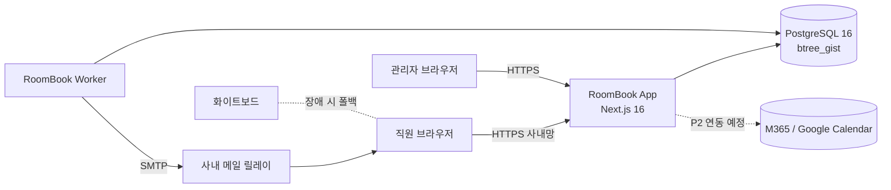
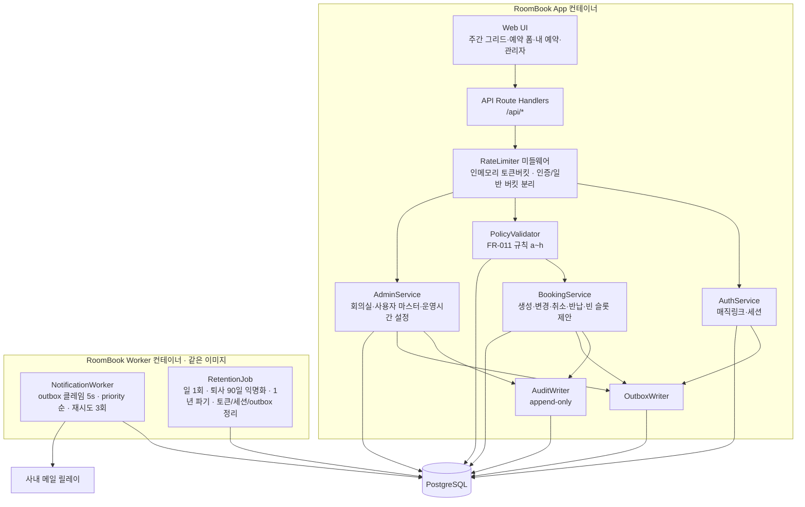
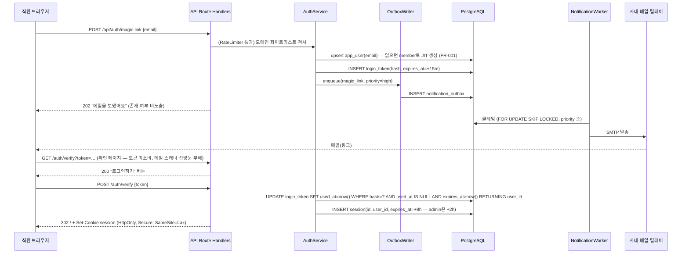
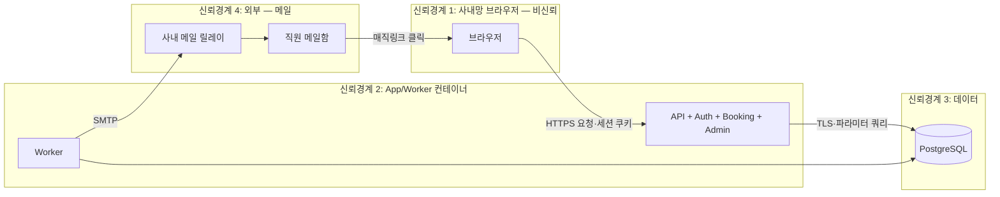

# 아키텍처 — RoomBook (사내 회의실 웹 예약)

> 근거 (A4 진입 사전조사, 2026-09-03)
> - **정량**: 매직링크 토큰은 CSPRNG ≥128bit, 서버에는 SHA-256 해시만 저장, 만료 5~15분, 1회용(`UPDATE … WHERE used_at IS NULL` 원자 소비) — https://securityboulevard.com/2026/05/are-magic-links-secure-a-technical-deep-dive-into-email-based-authentication/ · https://guptadeepak.com/mastering-magic-link-security-a-deep-dive-for-developers/ (확인 2026-09-03). 두 글 모두 15분을 OWASP 권고로 인용 — OWASP 원문은 미확인, 근거는 독립 블로그 2건 교차.
> - **정성**: "EXCLUDE 제약이 SERIALIZABLE이나 assertion보다 동시성이 낫다" — 겹침 방지를 앱 로직이 아닌 DB 제약으로 두라는 실무자 권고 (https://dev.to/franckpachot/postgresql-exclude-constraints-for-better-concurrency-than-serializable-pob, 확인 2026-09-03)
> - **사용자 영향**: 충돌은 "실패"가 아니라 "가장 가까운 빈 슬롯 제안"으로 보인다(L-06 피크엔드, UX-02). 로그인은 비밀번호 없이 메일 링크 1클릭(UX-01).
>
> 독립 검토: ecc:architect 서브에이전트 8건 지적 중 7건 반영·1건 부분 반영 (decision-log DL-008).

## Context & Scope
- 신규 시스템: 사내 직원 전용 웹앱 1개 + Worker 1개 + PostgreSQL 1개. 사내 VM 1대에 Docker Compose로 배포(DL-005).
- 기존 시스템: 화이트보드(대체 대상, 장애 시 폴백). 사내 메일 릴레이(가정, STARTTLS 필수). 릴레이가 없어 SES 등 외부 발송을 쓰면 직원 이메일이 외부로 나가므로 개인정보 처리위탁 검토가 전제조건(02 축5). 사내 IdP는 미상 → 연동 없음(DL-002).
- 규모 가정: 직원 ≤300, 회의실 ≤30, 동시 사용자 ≤50, 예약 ≤200건/일. 단일 오피스·Asia/Seoul.
- 가용성 제약(SC-007 99.5%/근무시간 ≈ 월 허용 다운 100분): 배포는 근무시간 외(평일 22:00 이후)에만, 컨테이너 `restart: unless-stopped` + 헬스체크 자동 재기동, 앱 장애 RTO 30분(이미지 롤백), DB 전체 복원 RTO 4h(월 1회 이상 발생 시 SC-007 미달로 원인 리뷰). 상세 07.
- 범위 밖: 캘린더 동기화·체크인·반복 예약(P2). CalendarAdapter는 FR-018 착수 시 도입한다 — 지금 포트를 미리 만들지 않는다(YAGNI, DL-008).

## Goals / Non-goals
- Goals: G1 이중 예약 구조적 불가 · G2 3단계·1초 예약 · G3 책임 추적 (03-prd).
- Non-goals: HA/다중 인스턴스, 다중 오피스, 외부 공개, 모바일 네이티브.

## 설계

### 시스템 컨텍스트


### 구현 접근 — 난점과 선택
| 난점 | 선택 | 이유 |
|---|---|---|
| 동시 요청에서 이중 예약 (INV-1) | `booking.period tstzrange` + `EXCLUDE USING gist (room_id WITH =, period WITH &&) WHERE (status='confirmed')` | 앱 레벨 검사는 레이스에 뚫린다. DB 제약은 우회 불가. 23P01 에러를 409로 변환 |
| 23P01 이후 대안 슬롯 조회 | INSERT 실패 트랜잭션은 ROLLBACK 후 **새 읽기 트랜잭션**에서 탐색. 탐색 창 = 요청 start_at 이후 **당일 운영시간 종료까지 전방**, 15분 스텝, 같은 방·같은 길이. 후보는 PolicyValidator(FR-011 전 항목)를 다시 통과한 것만. 후보 없으면 `suggestion: null` + 문구 "오늘 안에 빈 시간이 없어요 — 다른 회의실을 볼까요?" | abort된 트랜잭션에서 SELECT는 25P02로 실패(검토 지적 #1). 막다른 에러 0(SC-008) |
| 비밀번호 없는 인증의 메일 의존 | 매직링크(해시 저장·15분·1회용) + DB 세션(HttpOnly 쿠키) | 자격증명 저장 제거. 메일 장애는 A7 알림 P1로 흡수 |
| 알림 발송 실패가 예약 트랜잭션을 막으면 안 됨 | 트랜잭셔널 아웃박스(`notification_outbox`, `priority`·`claimed_at`) + 별도 Worker | 예약 커밋과 발송 분리. 매직링크는 priority=high로 예약 메일보다 먼저(SC-006). `FOR UPDATE SKIP LOCKED` 클레임으로 재시작 시 중복 발송 방지 |
| UI가 메일 장애를 어떻게 아는가 | `GET /api/me` 응답의 `mail_degraded`(최근 1h failed 존재 또는 outbox 지연 > 5분) → 전역 배너 "메일이 늦게 갈 수 있어요" | FR-010·EC-B8 |
| 시간대·경계 | 저장 UTC, 정책 검증은 Asia/Seoul로 변환 후 15분 경계 검사, 구간은 반개구간 `[start,end)` | 14:00~15:00 과 15:00~16:00 은 겹치지 않아야 함 |
| 주기 작업(익명화·파기·정리) | Worker 컨테이너의 RetentionJob 일 1회 02:30 KST | FR-009·FR-015의 실행 주체 명시(검토 지적 #2) |
| 단일 저장소·단일 배포 | Next.js App Router: UI + Route Handlers 동거, TypeScript 타입 공유 | 소규모 팀 운영 단순성 (01-recon fit) |

프레임워크·라이브러리(구현 시 `package.json` 실존 확인 — frontend-design-taste 하드룰):
- Next.js 16(01-recon 근거) · React · TypeScript · zod(입력 검증) · Tailwind(버전 잠금) · nodemailer.
- **Drizzle ORM** 단일 선택. EXCLUDE 제약은 Drizzle 스키마 DSL이 아직 미지원(기능 요청 https://github.com/drizzle-team/drizzle-orm/issues/3388)이므로 `drizzle-kit generate --custom`으로 만든 SQL 마이그레이션에 기술한다 — https://orm.drizzle.team/docs/kit-custom-migrations (확인 2026-09-03). 대안 Prisma는 EXCLUDE·range를 스키마로 표현 못 해 동일하게 raw SQL이 필요하고 타입 생성 단계가 하나 더 있어 기각 [추론].
- 런타임 **Node.js 24**(Active LTS, EOL 2028-04-30; Node 22는 2026-09 현재 Maintenance) — https://endoflife.date/nodejs (확인 2026-09-03).
- 커모디티 도구(대체 가능, 근거 생략을 명시): Caddy(TLS 종단), age(백업 암호화), gitleaks(비밀 스캔), Mailpit(개발용 SMTP), k6(부하 테스트 — 06 TS-003 단일 확정).
- 문자열 결합 SQL은 CI lint로 금지.

### 컴포넌트 구조


### 데이터 흐름
**시나리오 1 — 매직링크 로그인 (FR-001)**


**시나리오 2 — 예약 생성과 동시 충돌 (FR-003·FR-011, EC-B1)**
```mermaid
sequenceDiagram
  participant U1 as 직원 A
  participant U2 as 직원 B
  participant API as API Route Handlers
  participant POL as PolicyValidator
  participant BK as BookingService
  participant AUD as AuditWriter
  participant OUT as OutboxWriter
  participant DB as PostgreSQL
  par 동시 요청
    U1->>API: POST /api/bookings {room, 14:30-15:30}
    U2->>API: POST /api/bookings {room, 14:30-15:30}
  end
  API->>POL: 규칙 a~h 검사
  POL-->>API: OK
  API->>BK: create()
  BK->>DB: BEGIN; INSERT booking(period=[14:30,15:30))
  DB-->>BK: A: OK / B: 23P01 exclusion_violation
  BK->>AUD: (A) write(create, before=null, after=booking)
  BK->>OUT: (A) enqueue(booking_confirmed)
  BK->>DB: (A) COMMIT
  BK->>DB: (B) ROLLBACK
  BK->>DB: (B) 새 트랜잭션: 같은 방·같은 길이, 요청 start_at 이후 당일 운영시간 종료까지 전방 탐색(15분 스텝)
  BK->>POL: (B) 후보마다 규칙 a~h 재검증, 첫 통과 후보 채택
  API-->>U1: 201 Booking
  API-->>U2: 409 Problem{type:booking-overlap, suggestion:{15:30-16:30} 또는 null}
```

**시나리오 3 — 조기 반납 (FR-006, EC-C3)**
```mermaid
sequenceDiagram
  participant U as 소유자
  participant API as API Route Handlers
  participant BK as BookingService
  participant AUD as AuditWriter
  participant DB as PostgreSQL
  U->>API: POST /api/bookings/{id}/release
  API->>BK: release(actor)
  BK->>DB: BEGIN; UPDATE booking SET period=tstzrange(lower(period), now()), status='released' WHERE id=? AND (owner_id=? OR actor.role='admin') AND status='confirmed' AND period @> now()
  DB-->>BK: 1 row (0 rows → ROLLBACK, 409 not-in-progress)
  BK->>AUD: write(release, before, after)
  BK->>DB: COMMIT
  API-->>U: 200 Booking{status: released}
```

### 데이터 저장 (설계 결정 관련 부분만 — 전체 스키마는 05)
- `booking.period tstzrange` 반개구간, `status ∈ {confirmed, cancelled, released}`. EXCLUDE 제약은 `confirmed`에만 적용 — 반납된 예약은 잘린 구간이라 새 예약을 막지 않고, 취소된 예약은 자리를 비운다.
- `login_token`은 원문이 아닌 SHA-256 해시 저장. `session`은 불투명 ID(32바이트 랜덤) — 서버 폐기 가능(FR-013).
- `booking_audit`는 앱 DB 계정(`roombook_app`)에 INSERT/SELECT만 허용(UPDATE/DELETE 권한 회수 — INV-3). 1년 만료 파기는 Worker의 RetentionJob이 **별도 롤 `roombook_retention`**(booking·booking_audit DELETE 허용, 그 외 권한 없음)으로만 수행 — 앱 경로에서는 삭제 불가.
- `notification_outbox`는 예약과 같은 트랜잭션에 기록 → 발송 유실 없음. `priority`(high=magic_link, normal=그 외), `claimed_at`(2분 넘게 `sending`이면 RetentionJob이 아닌 워커 자체가 pending으로 되돌림).

## 검토한 대안
| 대안 | 장점 | 단점 | 왜 아닌가 |
|---|---|---|---|
| MRBS 채택(Extend) | 검증된 기능, 무료 | PHP·노후 UI·커스터마이즈 비용, 매직링크·감사 요구를 맞추려면 코어 수정 | 얇은 자체 구축이 총비용 낮음 [추론] (01-recon) |
| 앱 레벨 겹침 검사(SELECT 후 INSERT) | DB 확장 불필요 | 레이스 조건 → 이중 예약 가능 | G1(구조적 불가) 위반 |
| SQLite 단일 파일 | 운영 최소 | 범위 EXCLUDE 없음 → 직렬화 락 자작 | INV-1을 DB에 두지 못함 |
| SERIALIZABLE 격리 + 앱 검사 | 정합성 확보 | 재시도 로직 필요, 처리량 저하 | EXCLUDE가 더 단순·동시성 우수 (근거 위) |
| FastAPI + React SPA | Python 팀 생산성 | 저장소·배포 2개, 타입 공유 별도 | 팀 역량 미상 → 단일 저장소 우선. 팀이 Python이면 교체 가능 |
| Vercel + 관리형 Postgres | 운영 0 | 직원 개인정보 외부 저장·위탁 검토 | DL-005 |
| 앱 내부 cron으로 알림 발송 | 컨테이너 1개 적음 | 앱 재시작·요청 처리와 경합 | Worker 분리가 재시도·관측 단순 |
| CalendarAdapter 포트 선제 정의 | P2 착수 시 형태가 있음 | 구현 없는 인터페이스 = 투기적 설계 | P2 착수 시 도입해도 비용 동일(검토 지적 #8) |

## 위협모델 (Cross-cutting: 보안 — ecc:security-review 체크리스트 반영)

### ① 무엇을 만드는가 — DFD + trust boundary


### ② 무엇이 잘못될 수 있는가 — STRIDE (자산/경계 × 6범주)
| 자산/경계 | S | T | R | I | D | E |
|---|---|---|---|---|---|---|
| 매직링크 (메일함→브라우저) | 링크 탈취·추측으로 타인 로그인 | 링크 파라미터 변조 | 해당없음(로그인 이벤트는 session 테이블+IP 기록) | 링크가 메일 로그·프록시에 남음 | 이메일 폭탄(대량 요청) · 메일 보안 스캐너의 GET 선방문이 1회용 토큰을 소비해 사용자에겐 항상 "만료" | 해당없음(링크는 member 세션만 발급, role은 DB) |
| 세션 쿠키 (브라우저↔App) | 쿠키 탈취(XSS) | 해당없음(불투명 ID, 서버 조회) | 해당없음(세션 생성·폐기가 session 테이블에 IP·시각과 함께 남음) | XSS로 쿠키 읽기 | 해당없음(사용자당 세션 ≤ 10개, 만료분은 RetentionJob 정리 — 고갈 경로 없음) | role 파라미터 주입으로 admin 흉내 |
| 예약 API (App) | 해당없음(세션 필수) | 타인 예약 변경·취소(IDOR) | "내가 취소 안 했다" 분쟁 | 타인 이메일·과거 이력 열람 | 대량 예약 생성·부하 | 관리자 전용 경로 접근 |
| PostgreSQL (App↔DB) | DB 자격증명 유출 | SQL 인젝션·감사 로그 삭제 | 감사 로그 변조 | 백업 파일 유출(직원 PII) | 디스크 포화(로그·아웃박스 누적) | 앱 계정 과권한 |
| 메일 릴레이 (Worker→릴레이) | 발신자 위장 메일(피싱) | 메일 내용 변조(평문 SMTP 구간) | 해당없음(발송 시도·결과가 outbox에 남음) | 예약 제목이 메일에 실려 외부 경유 | 릴레이 스로틀·다운 = 로그인 불가 | 해당없음(릴레이에는 앱 권한 개념이 없음) |
| 관리자 화면 | 관리자 세션 탈취 | 회의실 마스터 무단 변경 | 관리자 취소 사유 부인 | 전 직원 이메일 열람 | 해당없음(관리자 경로도 일반 레이트리밋 적용, 별도 고갈 자원 없음) | member→admin 승격 |

### ③ 무엇을 할 것인가
| 위협 | 대응 | 대책 |
|---|---|---|
| 매직링크 탈취·추측 | Mitigate | CSPRNG 32바이트, SHA-256 해시 저장, 15분 만료, 1회용 원자 소비, 사내 도메인만, 링크 검증 후 즉시 302로 URL에서 토큰 제거 |
| 이메일 폭탄 | Mitigate | 이메일당 5회/10분, IP당 20회/10분 (RateLimiter 인증 버킷). 429 |
| 메일 스캐너의 링크 선소비 | Mitigate | `GET /auth/verify`는 확인 페이지만 렌더(토큰 미소비), 소비는 `POST /auth/verify` 1회 (EC-A5, EP-02) |
| 메일 내용 변조 (릴레이 T) | Transfer | 앱→릴레이 구간은 STARTTLS 필수(`requireTLS`, 07 SMTP_URL). 릴레이 이후 구간은 사내 메일 인프라에 위임 |
| 쿠키 탈취(XSS) | Mitigate | HttpOnly·Secure·SameSite=Lax, CSP `default-src 'self'`, React 기본 이스케이프, `dangerouslySetInnerHTML` 금지 |
| CSRF (SameSite=Lax 선택의 대가) | Mitigate | 상태 변경은 JSON POST/PATCH + `Origin` 헤더 검증 + 커스텀 헤더 요구. Lax를 택한 이유: Strict는 메일 링크 클릭 후 첫 이동에서 쿠키 미전송 → 로그인 직후 로그아웃처럼 보임 |
| IDOR (타인 예약 변경) | Mitigate | 모든 변경 쿼리에 `owner_id = session.user_id OR role='admin'` 조건 서버 강제 (INV-4) |
| 부인 | Mitigate | booking_audit append-only + actor + before/after + 관리자 취소 사유 필수 (FR-009·FR-014) |
| 타인 이메일 노출 | Mitigate | 응답 DTO에서 email은 본인·admin에만 포함 (FR-004) |
| 대량 예약·부하 | Mitigate | RateLimiter 일반 버킷 사용자당 60 req/분(모든 라우트 앞단), 사용자당 미래 `confirmed` 예약 ≤ 20건 = FR-011(h), 422 `active-limit` |
| 관리자 경로 접근 | Mitigate | `/admin/*`·`/api/admin/*` 미들웨어에서 세션 role 검사, role은 요청에서 절대 읽지 않음 |
| SQL 인젝션 | Eliminate | Drizzle 파라미터 쿼리만. 문자열 결합 SQL 금지(CI lint) |
| 감사 로그 삭제·변조 | Mitigate | 앱 DB 계정에 booking_audit UPDATE/DELETE 권한 없음(INV-3), 백업 30일 |
| DB 자격증명·SMTP 비밀 | Mitigate | 환경변수·`.env` 미커밋, Compose `env_file`, 저장소 secret scan |
| 백업 파일 유출 | Mitigate | 백업 암호화(age) + 접근 제한 디렉터리 |
| 디스크 포화 | Mitigate | 로그 로테이션 7일, outbox 발송 완료분 30일 후 삭제(RetentionJob), 디스크 80% 알림 (A7) |
| 발신자 위장 피싱 | Transfer | 사내 메일 인프라의 SPF/DKIM 정책에 위임. 앱은 고정 발신 주소만 사용 |
| 제목이 메일로 외부 경유 | Accept | 사내 릴레이 경유·사내 수신자 한정. 민감 제목은 입력 안내로 완화 (DL-003) |
| 릴레이 다운 = 로그인 불가 | Mitigate | 알림 P1 + 관리자 수동 발급 URL(EP-18, 감사 기록) + `mail_degraded` 배너. 관리자 세션(2h)까지 만료된 장기 장애용으로 세션 불필요 비상 경로: 컨테이너 CLI `node cli.js issue-link <email>`(VM 셸 접근자만, 감사 기록) |
| 스택트레이스 노출 | Eliminate | RFC 9457 Problem JSON만, 상세는 서버 로그 |

### ④ 충분한가 — 상위 리스크 3 재검토
1. **메일함 접근 = 계정 접근** (매직링크 본질). 잔여: 메일함이 뚫리면 로그인된다. 사내 메일 계정이 이미 회사 신원의 근간이므로 수용 범위. OIDC 연동(P2)이 근본 대책.
2. **단일 인스턴스 인메모리 레이트리밋**. 잔여: 재시작 시 카운터 초기화. 규모(≤300명)에서 수용. 확장 시 DB 카운터로 이관.
3. **관리자 계정 탈취**. 잔여: 관리자도 매직링크만. 완화: 관리자 세션 만료 2시간, 예약 관련 관리자 행위(admin_cancel·회의실 비활성화 알림)는 감사 로그. 회의실·설정·사용자 변경 자체의 감사(admin_audit)는 P2(02 하류 신규 항목). 잔여 리스크 수용(내부 도구, 회의실 데이터).

## Cross-cutting: 관측성·프라이버시
- 관측성: 구조화 JSON 로그(요청 ID·user_id·경로·상태·지연), `/api/health`(DB ping·outbox 지연 포함), 핵심 카운터: 예약 생성 성공/409/422, 매직링크 발송·실패, outbox 지연. 상세는 07.
- 프라이버시: 수집 = 이름·사내 이메일·예약 이력. 로그에 이메일 대신 user_id. 퇴사 90일 후 익명화(FR-015, RetentionJob), 감사·예약 이력 1년 보존 후 파기. 백업 암호화. 개인정보 처리방침 사내 공지.
