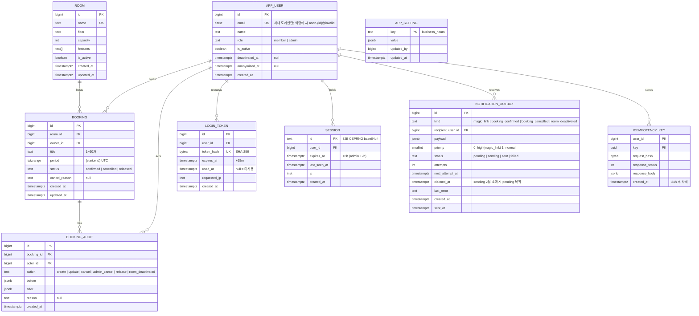

# API 계약 & 데이터 스키마 — RoomBook (사내 회의실 웹 예약)

> 근거 (A5 진입 사전조사, 2026-09-03)
> - **정량**: 에러 포맷 RFC 9457 Problem Details (2023-07, RFC 7807 대체) — https://www.rfc-editor.org/rfc/rfc9457 · 멱등성 키는 클라 생성, 서버 24h 보관 후 최초 응답 재생 (Stripe) — https://docs.stripe.com/api/idempotent_requests · 중복 방지 제약 `EXCLUDE USING gist` + `btree_gist` — https://www.postgresql.org/docs/current/rangetypes.html (모두 확인 2026-09-03)
> - **정성**: 스킬 충돌 — ecc:api-design은 URL 경로 버저닝(`/api/v1/`)을 권장하고 stage-templates(Zalando #115)는 회피를 요구. 내부 도구·단일 클라이언트이므로 URL 버전 없이 `/api/*` + 응답 헤더 `API-Version: 1` 로 통일하고 04의 경로를 함께 수정했다 (DL-007).
> - **사용자 영향**: 409 응답의 `suggestion`이 화면에서 "15:30~16:30은 비어 있어요 — 이 시간 예약하기" 버튼이 된다(UX-02 복구 경로 100%). 422의 `errors[]`는 필드별 인라인 오류가 된다.

## 규약 (전 엔드포인트 공통)
- **인증**: 세션 쿠키 `rb_session` (HttpOnly·Secure·SameSite=Lax). 미인증 → 401 `type: …/unauthenticated`. `/api/health`·`/api/auth/magic-link`·`/auth/verify`(GET·POST)만 공개.
- **CSRF**: 상태 변경 요청은 `Content-Type: application/json` + `Origin` 검증 + 헤더 `X-Requested-With: RoomBook` 필수(없으면 403).
- **에러 포맷**: RFC 9457 `application/problem+json` — `type`(URI, `https://roombook.internal/problems/<slug>`), `title`, `status`, `detail`(사용자 문구, 해요체), `instance`(요청 ID). 확장: `errors[]{field,code,message}`(422), `suggestion{start_at,end_at}`(409 overlap), `retry_after`(429). 스택트레이스·SQL 노출 금지 (Zalando #176·#177).
- **버저닝**: URL 버전 없음(Zalando #115). 응답 헤더 `API-Version: 1`. 스펙 파일(`openapi.yaml`) semver. 파괴적 변경은 미디어타입 `application/vnd.roombook.v2+json`으로만.
- **페이지네이션**: 커서 기반 `?cursor=&limit=`(기본 20, 최대 100), 응답 `meta.next_cursor`(불투명 base64url). offset 미제공 (Zalando #160). **EP-16(감사 로그)·EP-17(사용자 목록)에만 적용** — 주간 그리드(창 ≤8일·회의실 ≤30)·내 예약(예정 ≤20건 + 지난 30일)은 유계라 페이지네이션 없음 (GATE YAGNI 지적 반영).
- **멱등성**: `POST /api/bookings`는 `Idempotency-Key`(클라 UUID v4) 필수. `(user_id, key)`로 24h 보관, 동일 키 재요청은 최초 응답 상태·본문 재생, 본문 해시 불일치 시 422 `idempotency-key-reused`. cancel/release는 상태 전이라 자연 멱등(이미 전이됨 → 409).
- **레이트리밋**: 인증 사용자 60 req/분, 매직링크 이메일당 5회/10분·IP당 20회/10분. 초과 시 429 + `Retry-After`. 헤더 `X-RateLimit-Limit/Remaining`.
- **네이밍·권한**: 경로 kebab-case 복수 명사, 필드 snake_case, 시각 ISO 8601 UTC. 권한 스코프 `roombook:<자원>:<행위>` — member = `booking:read`·`booking:write`·`room:read`; admin = 전부 + `room:admin`·`user:admin`·`audit:read`·`setting:admin`. **스코프는 문서 표기용이다** — 저장·검사는 `app_user.role` 2값(member/admin)으로만 하며 별도 스코프 저장소·토큰 클레임은 만들지 않는다.

## 엔드포인트 표
| ID | 메서드 경로 | 요청(핵심 필드) | 응답 | 주요 에러(RFC 9457 type slug) | 권한 스코프 |
|---|---|---|---|---|---|
| EP-01 | `POST /api/auth/magic-link` | `{email}` | 202 `{message}` (존재 여부 무관 동일) | 422 `invalid-email-domain` · 429 `rate-limited` | 공개 |
| EP-02 | `GET /auth/verify?token=` (페이지 라우트) · `POST /auth/verify` | GET: 쿼리 token → 확인 페이지(토큰 미소비) · POST: `{token}` (폼) | GET 200 "로그인하기" 버튼 · POST 302 `/` + Set-Cookie (member 8h / admin 2h) | POST 실패 → 302 `/login?error=expired-link` (만료·재사용·불일치 동일) | 공개 |
| EP-03 | `POST /api/auth/logout` | — | 204, 세션 삭제 | 401 | 세션 |
| EP-04 | `GET /api/me` · `PATCH /api/me` | — · `{name}`(1~50자) | 200 `{id,name,email,role,mail_degraded}` (`mail_degraded`=최근 1h failed outbox 존재 또는 pending 지연 > 5분 → UI 전역 배너) | 401 · 422 | 세션 |
| EP-05 | `GET /api/rooms` | `?include_inactive=false` | 200 `{data:[Room]}` (≤30, 비페이지) | 401 | `room:read` |
| EP-06 | `GET /api/bookings` | `?from&to`(ISO, 창 ≤8일) `&room_id?` | 200 `{data:[Booking]}` — email은 본인·admin에만 | 401 · 422 `invalid-range` | `booking:read` |
| EP-07 | `POST /api/bookings` | 헤더 `Idempotency-Key`; `{room_id,start_at,end_at,title}` | 201 `{data:Booking}` + `Location` | 409 `booking-overlap`(+`suggestion` — 요청 start_at 이후 당일 운영시간 종료까지 전방 탐색, 같은 방·같은 길이, FR-011 전 규칙을 통과한 첫 후보, 없으면 `null`) · 422 `policy-violation`(errors[]: slot_alignment/duration/past/window/business-hours/room-inactive/active-limit/title) · 422 `idempotency-key-reused` · 400 `missing-idempotency-key` | `booking:write` |
| EP-08 | `GET /api/bookings/{id}` | — | 200 `{data:Booking}` | 404 `not-found` | `booking:read` |
| EP-09 | `PATCH /api/bookings/{id}` | `{start_at?,end_at?,title?}` | 200 `{data:Booking}` | 403 `forbidden`(소유자·admin 외) · 409 `booking-overlap` · 409 `booking-not-editable`(진행 중·종료·취소됨) · 422 `policy-violation` | `booking:write` |
| EP-10 | `POST /api/bookings/{id}/cancel` | `{reason?}` (admin이 타인 예약이면 필수 1~200자) | 200 `{data:Booking(status=cancelled)}` | 403 · 409 `booking-not-cancellable`(이미 시작 → release 안내) · 409 `booking-already-closed` · 422 `reason-required` | `booking:write` |
| EP-11 | `POST /api/bookings/{id}/release` | — | 200 `{data:Booking(status=released, end_at=now)}` | 403 · 409 `booking-not-in-progress` | `booking:write` |
| EP-12 | `GET /api/me/bookings` | `?scope=upcoming\|past` | 200 `{data:[Booking]}` (upcoming ≤20건 정책상 유계, past = 지난 30일 최대 100건; 페이지네이션 없음) | 401 | `booking:read` |
| EP-13 | `POST /api/admin/rooms` | `{name,floor,capacity,features[]}` | 201 `{data:Room}` | 403 · 409 `room-name-taken` · 422 | `room:admin` |
| EP-14 | `PATCH /api/admin/rooms/{id}` | `{name?,floor?,capacity?,features?,is_active?}` | 200 `{data:Room}`; `is_active=false` 시 미래 예약 소유자에게 outbox 알림 | 403 · 404 · 409 `room-name-taken` · 422 | `room:admin` |
| EP-15 | `GET/PUT /api/admin/settings` | `{business_hours_start:"07:00",business_hours_end:"22:00"}` | 200 `{data:Settings}` | 403 · 422 `invalid-hours` | `setting:admin` |
| EP-16 | `GET /api/admin/bookings/{id}/audit` | `?cursor&limit` | 200 `{data:[AuditEntry],meta}` | 403 · 404 | `audit:read` |
| EP-17 | `GET /api/admin/users` · `PATCH /api/admin/users/{id}` | `?q&cursor` · `{is_active?,role?,name?}` | 200; `is_active=false` 시 그 사용자의 미래 confirmed 예약을 사유 "퇴사 처리"로 `admin_cancel`(감사·outbox 없음 — 수신자 비활성) | 403 · 404 · 409 `last-admin`(마지막 admin 강등·비활성화 금지) | `user:admin` |
| EP-18 | `POST /api/admin/users/{id}/login-link` | — | 200 `{url,expires_at}` (메일 장애 시 수동 전달, 감사 기록) | 403 · 404 · 429 | `user:admin` |
| EP-19 | `GET /api/health` | — | 200 `{status:"ok",db:"ok",outbox_lag_s}` / 503 | — | 공개(사내망) |

Booking 응답 DTO: `{id, room_id, owner:{id,name,email?}, title, start_at, end_at, status, created_at, updated_at, can_edit:boolean}` — `email`은 본인·admin에만, `can_edit`는 서버가 계산(클라가 role 판단 안 함, INV-4).

## OpenAPI 스케치 (핵심 3개만)
```yaml
openapi: 3.1.0
info: { title: RoomBook API, version: 1.0.0 }
paths:
  /api/bookings:
    post:
      parameters:
        - { name: Idempotency-Key, in: header, required: true, schema: { type: string, format: uuid } }
      requestBody:
        content:
          application/json:
            schema:
              type: object
              required: [room_id, start_at, end_at, title]
              properties:
                room_id: { type: integer }
                start_at: { type: string, format: date-time }   # ISO 8601, 15분 경계(Asia/Seoul 기준)
                end_at:   { type: string, format: date-time }   # start < end, ≤ 240분
                title:    { type: string, minLength: 1, maxLength: 60 }
      responses:
        "201": { description: Created, headers: { Location: { schema: { type: string } } },
                 content: { application/json: { schema: { $ref: "#/components/schemas/BookingEnvelope" } } } }
        "409": { description: overlap, content: { application/problem+json: { schema: { $ref: "#/components/schemas/Problem" } } } }
        "422": { description: policy violation, content: { application/problem+json: { schema: { $ref: "#/components/schemas/Problem" } } } }
  /api/bookings/{id}/release:
    post:
      responses:
        "200": { description: released }
        "409": { description: not in progress, content: { application/problem+json: { schema: { $ref: "#/components/schemas/Problem" } } } }
components:
  schemas:
    Booking:
      type: object
      properties:
        id: { type: integer }
        room_id: { type: integer }
        owner: { type: object, properties: { id: { type: integer }, name: { type: string }, email: { type: string } } }
        title: { type: string }
        start_at: { type: string, format: date-time }
        end_at: { type: string, format: date-time }
        status: { type: string, enum: [confirmed, cancelled, released] }
        can_edit: { type: boolean }
    BookingEnvelope: { type: object, properties: { data: { $ref: "#/components/schemas/Booking" } } }
    Problem:
      type: object
      required: [type, title, status]
      properties:
        type: { type: string, format: uri }
        title: { type: string }
        status: { type: integer }
        detail: { type: string }
        instance: { type: string }
        errors: { type: array, items: { type: object, properties: { field: {type: string}, code: {type: string}, message: {type: string} } } }
        suggestion: { type: object, properties: { start_at: {type: string}, end_at: {type: string} } }
        retry_after: { type: integer }
```

## ERD


### DDL 핵심 (ecc:postgres-patterns 반영)
```sql
CREATE EXTENSION IF NOT EXISTS btree_gist;
CREATE EXTENSION IF NOT EXISTS citext;

CREATE TABLE booking (
  id bigint GENERATED ALWAYS AS IDENTITY PRIMARY KEY,
  room_id bigint NOT NULL REFERENCES room(id),
  owner_id bigint NOT NULL REFERENCES app_user(id),
  title text NOT NULL CHECK (char_length(title) BETWEEN 1 AND 60),
  period tstzrange NOT NULL CHECK (lower_inc(period) AND NOT upper_inc(period) AND upper(period) > lower(period)),
  status text NOT NULL CHECK (status IN ('confirmed','cancelled','released')),
  cancel_reason text,
  created_at timestamptz NOT NULL DEFAULT now(),
  updated_at timestamptz NOT NULL DEFAULT now(),
  -- INV-1: 같은 방, 겹치는 confirmed 구간 금지 (앱 우회 불가)
  EXCLUDE USING gist (room_id WITH =, period WITH &&) WHERE (status = 'confirmed')
);
CREATE INDEX booking_owner_idx ON booking (owner_id, lower(period) DESC);   -- 내 예약
-- 주간 그리드는 EXCLUDE의 gist 인덱스(room_id, period)가 그대로 사용됨

CREATE INDEX login_token_hash_idx ON login_token (token_hash);
CREATE INDEX session_expires_idx ON session (expires_at);
CREATE INDEX outbox_pending_idx ON notification_outbox (priority, next_attempt_at) WHERE status = 'pending';  -- 부분 인덱스, priority 순
CREATE INDEX audit_booking_idx ON booking_audit (booking_id, created_at);

-- INV-3: 감사 로그 append-only — 앱 계정은 INSERT/SELECT만
REVOKE UPDATE, DELETE, TRUNCATE ON booking_audit FROM roombook_app;
GRANT INSERT, SELECT ON booking_audit TO roombook_app;
-- 보존기간 파기 전용 롤 (RetentionJob만 사용, RETENTION_DATABASE_URL)
CREATE ROLE roombook_retention LOGIN PASSWORD '...';
GRANT SELECT, DELETE ON booking, booking_audit, login_token, session, notification_outbox, idempotency_key TO roombook_retention;
GRANT SELECT, UPDATE ON app_user TO roombook_retention;   -- 익명화(UPDATE name/email)

-- Worker 큐 클레임 (SKIP LOCKED, priority 순) → 발송 → sent/failed 갱신. 재시작 중복 발송 방지
UPDATE notification_outbox SET status='sending', claimed_at=now()
WHERE id = (SELECT id FROM notification_outbox WHERE status='pending' AND next_attempt_at <= now()
            ORDER BY priority, next_attempt_at LIMIT 1 FOR UPDATE SKIP LOCKED) RETURNING *;
-- 워커 기동 시: sending 상태가 2분 초과면 pending으로 복귀
UPDATE notification_outbox SET status='pending' WHERE status='sending' AND claimed_at < now() - interval '2 minutes';

-- 매직링크 1회 소비 (원자)
UPDATE login_token SET used_at = now()
WHERE token_hash = $1 AND used_at IS NULL AND expires_at > now() RETURNING user_id;

-- 409 시 대안 슬롯: 같은 방, 같은 길이, 요청 start_at 이후 당일 운영시간 종료까지 전방 탐색 (앱에서 15분 스텝, 최대 60스텝), 후보마다 FR-011 재검증, 없으면 null
```
DB 설정: `statement_timeout=30s`, `idle_in_transaction_session_timeout=30s`, `pg_stat_statements` 활성, timestamptz만 사용, ID는 bigint identity.

## 데이터 규칙
- 시각: 저장 `timestamptz`(UTC), API는 ISO 8601(`2026-09-07T05:00:00Z` 또는 오프셋 표기 허용, 응답은 항상 Z). 15분 경계·운영시간 검증은 Asia/Seoul로 변환 후 수행.
- 구간: 반개구간 `[start, end)`. 14:00~15:00과 15:00~16:00은 겹치지 않는다.
- 식별자: bigint identity(JSON number). UUID는 Idempotency-Key·요청 ID(`instance`)에만.
- 금액: 없음(과금 없음).
- 소프트삭제: 없음 — Booking은 status로, User는 익명화로 처리. Room은 `is_active`.
- 보존: booking·booking_audit 1년(RetentionJob이 전용 롤 `roombook_retention`으로 매일 만료분 삭제 — 앱 계정 `roombook_app`은 DELETE 불가, INV-3), login_token 24h, session 만료 후 즉시, notification_outbox sent/failed 30일, idempotency_key 24h. 퇴사자는 비활성화 90일 후 name/email 익명화(FR-015).
- 문자열: title 1~60자, reason 1~200자, name ≤ 50자. 제어문자 거부.

## 커버리지 매핑 (P0·P1 요구사항 → 엔드포인트/잡) — 매핑 0건 = 결함
| FR-ID | 우선순위 | 담당 엔드포인트 / 이벤트 |
|---|---|---|
| FR-001 | P0 | EP-01(APP_USER JIT upsert 포함), EP-02(GET 확인 페이지 + POST 소비), EP-04 PATCH(이름 수정), LOGIN_TOKEN·SESSION(member 8h/admin 2h), outbox `magic_link` |
| FR-002 | P0 | EP-05, EP-06 (UI 주간 그리드) |
| FR-003 | P0 | EP-07 (201 / 409 + suggestion) |
| FR-004 | P0 | EP-06·EP-08·EP-12 DTO 마스킹 규칙 (`email` 본인·admin만) |
| FR-005 | P1 | EP-09, EP-10 |
| FR-006 | P1 | EP-11 |
| FR-007 | P1 | EP-12 |
| FR-008 | P1 | EP-13, EP-14 (비활성화 → outbox `room_deactivated`), EP-15 |
| FR-009 | P1 | BOOKING_AUDIT 기록(EP-07·09·10·11·14 트랜잭션 내), EP-16 조회 |
| FR-010 | P1 | outbox `booking_confirmed`·`booking_cancelled` + NotificationWorker 재시도 3회, 실패 시 EP-04 `mail_degraded` 배너·EP-19 `outbox_lag_s` |
| FR-011 | P0 | EP-07·EP-09 PolicyValidator 규칙 a~h (422 `policy-violation` errors[]), 409 `suggestion` 재검증·null 처리 |
| FR-012 | P1 | UI 반응형(EP-06 동일 데이터, 창을 1일로) |
| FR-013 | P1 | EP-03, SESSION.expires_at, RetentionJob 만료 세션 삭제 |
| FR-014 | P1 | EP-10 `reason` 필수 규칙 + outbox `booking_cancelled(reason)` + audit `admin_cancel` |
| FR-015 | P1 | EP-17 `is_active=false`(미래 예약 `admin_cancel` "퇴사 처리" + audit) + RetentionJob(`roombook_retention` 롤, 90일 익명화·1년 파기) |
| FR-016~020 | P2 | 미구현 — P2 착수 시 설계(04 DL-008). 커버리지 대상 아님 |

P0·P1 매핑 누락: **0건**.
