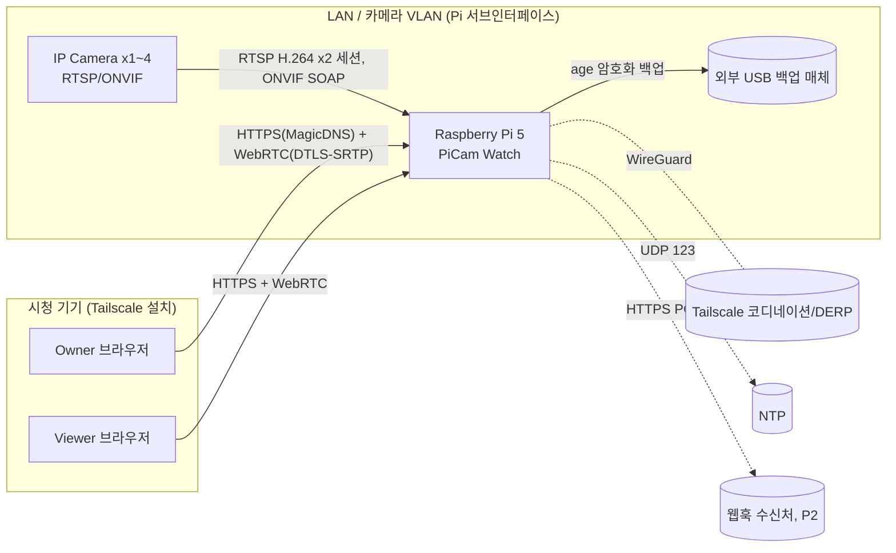
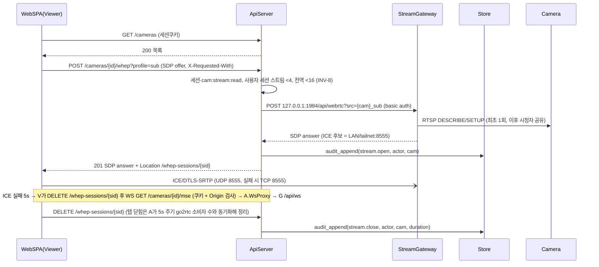
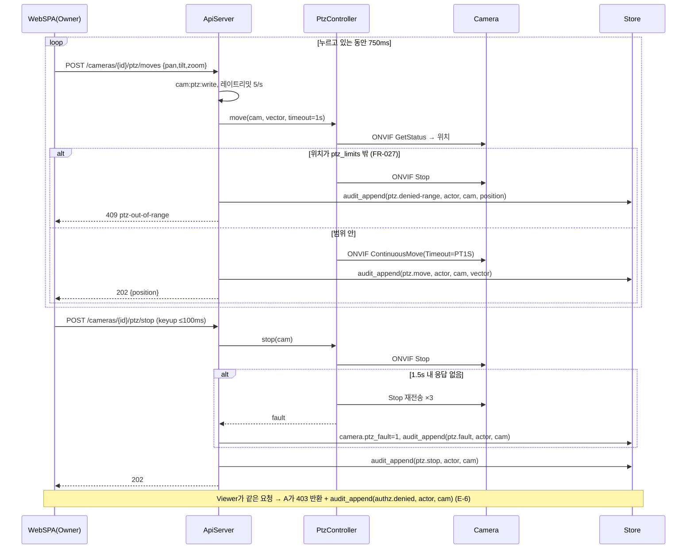

<!-- ===== 00-seed.md ===== -->

# Seed — PiCam Watch (라즈베리파이 IP 카메라 제어·실시간 모니터링, 가칭)

- 원문: 라즈베리파이로 IP 카메라를 제어하고 실시간 모니터링하는 서비스를 만들고 싶다
- 서비스 유형: 복합 — **IoT·엣지**(주) + **관제**(라이브 뷰·이벤트) + 웹 대시보드(부)
- 주 도메인 / 인접 도메인: 영상 감시(IP 카메라·RTSP/ONVIF·PTZ 제어) / 엣지 컴퓨팅(라즈베리파이 운영), 개인정보(영상정보 = 개인정보), 홈·소규모 사업장 보안
- 감지된 제약:
  - 엣지 하드웨어가 **라즈베리파이로 고정** (CPU·메모리·SD카드·전원·RTC 배터리 부재(Pi 5는 RTC 회로 내장, 배터리 별매) 제약이 따라옴)
  - 카메라는 "IP 카메라" — 별도 USB/CSI 카메라가 아니라 **네트워크 카메라를 Pi가 클라이언트로 접속**하는 구조
  - "제어" = 최소 PTZ·프리셋·녹화 on/off 수준의 카메라 조작이 요구됨 (ONVIF 여부는 미상 → A2)
  - "실시간" = 측정 기준 미정 (지연 상한, 동시 시청자 수 미상 → A2·A3에서 수치화)
  - 대수·설치 장소(가정/사업장)·시청 경로(LAN/외부망) 미상 → A2 심문 대상
- 로드할 블라인드스팟 프로파일: **P1 IoT·엣지** (주) + **P3 관제** 중 실시간성·알람 폭주·이력 증가 항목 (부분 적용). P2 웹 SaaS는 단일 운영자 전제라 테넌시 항목만 "해당없음" 근거로 기록.

작성: 2026-09-03 · 오토파일럿 모드(되묻지 않음)


<!-- ===== 01-recon.md ===== -->

# RECON — PiCam Watch (라즈베리파이 IP 카메라 제어·실시간 모니터링)

조사일: 2026-09-03 · 방법: WebSearch 8회 + WebFetch 4회 (GitHub 저장소·법령 페이지 직접 확인) · 스킬: `ecc:research-ops`(근거 유형 분리), `ecc:search-first`(사라/써라 판정)
표기: **[사실]** 출처 직접 확인 · **[2차]** 블로그·요약 등 2차 출처(교차 확인 필요) · **[추론]** 사실에서 도출

## 도메인 업무 흐름 — 이 영역이 실제로 어떻게 돌아가는가

셀프호스팅 NVR(Frigate·ZoneMinder·MotionEye·Shinobi)의 공통 워크플로 [사실 — 각 프로젝트 README·비교 기사 교차]:

1. **카메라 등록** — ONVIF 디스커버리(WS-Discovery) 또는 RTSP URL 수동 입력. ONVIF Profile S가 스트리밍·PTZ의 사실상 표준 ([ONVIF PTZ Service Spec v26.06](https://www.onvif.org/specs/srv/ptz/ONVIF-PTZ-Service-Spec.pdf), 확인 2026-09-03).
2. **스트림 중계** — 카메라 RTSP(H.264/H.265)를 게이트웨이가 받아 브라우저용(WebRTC/MSE/HLS)으로 **재패키징(트랜스코딩 없이)**. go2rtc·MediaMTX가 이 계층을 담당 ([go2rtc](https://github.com/AlexxIT/go2rtc), [MediaMTX](https://github.com/bluenviron/mediamtx), 확인 2026-09-03).
3. **라이브 뷰** — 브라우저 그리드/단일 뷰. 저지연은 WebRTC, 호환성 폴백은 MSE·HLS.
4. **제어(PTZ)** — ONVIF PTZ 서비스: `ContinuousMove`(timeout으로 자동 정지, 축별 0 전송 시 정지)·`GotoPreset`(non-blocking, 다른 move로 인터럽트 가능)·`SetPreset` ([ONVIF PTZ Spec](https://www.onvif.org/specs/srv/ptz/ONVIF-PTZ-Service-Spec.pdf) · [python-onvif-zeep continuous_move.py](https://github.com/FalkTannhaeuser/python-onvif-zeep/blob/zeep/examples/continuous_move.py), 확인 2026-09-03).
5. **이벤트·녹화** — 모션/객체 감지 → 클립 저장 → 알림. 상시 녹화는 저장 용량·SD 마모 문제로 별도 스토리지(NVMe/NAS) 전제 [2차: [helgeklein Pi5+Frigate](https://helgeklein.com/blog/frigate-nvr-with-object-detection-on-raspberry-pi-5-coral-tpu/)].
6. **보존·파기** — 보관기간 만료 클립 자동 삭제(법적 요구, 아래 규제 절).

## 이해관계자 — 누가 쓰고, 누가 돈을 내는가

| 역할 | 누구 | 하는 일 / 관심사 | 근거 |
|---|---|---|---|
| 운영자(Owner) | 집주인·소상공인·소규모 시설 관리자 | 카메라 등록, PTZ, 이벤트 확인, 보존 정책 설정. **비용 지불자**(하드웨어 1회 구매, 구독 없음이 셀프호스팅 선택 이유) | [2차: raspberrytips 비교](https://raspberrytips.com/best-raspberry-pi-security-camera/) — "구독 없는 로컬 제어"가 공통 동기 |
| 시청자(Viewer) | 가족·직원 | 라이브 뷰·클립 조회만, 설정·PTZ 불가 | [추론] 권한 분리 필요 — 법 제25조⑤ 임의조작 금지와 연결 |
| 정보주체 | 촬영되는 사람(방문객·직원·행인) | 안내판·목적 외 촬영 금지·보관기간 | 개인정보보호법 제25조 (아래) |
| 카메라 벤더 | ONVIF 준수 카메라 제조사 | 프로파일·펌웨어 호환성 | ONVIF 사양 |

## 규제·표준 — 반드시 준수해야 하는 것

**[사실] 개인정보보호법 제25조(고정형 영상정보처리기기) — 2023.3.14 개정** ([법령정보센터 제25조](https://www.law.go.kr/LSW//lsLawLinkInfo.do?lsJoLnkSeq=900079397&lsId=011357&chrClsCd=010202&print=print) · [찾기쉬운 생활법령](https://www.easylaw.go.kr/CSP/CnpClsMain.laf?csmSeq=1257&ccfNo=2&cciNo=3&cnpClsNo=3), 확인 2026-09-03):

| 조항 | 요구 | 이 서비스에 미치는 영향 |
|---|---|---|
| 제25조① | 공개된 장소 설치는 시설 안전·관리, 범죄 예방 등 열거 사유에 한함 | 설치 목적을 시스템에 **기록**(카메라 메타데이터) |
| 제25조② | 목욕실·화장실·탈의실 등 설치 금지 | 범위 밖(설치자 책임) — 문서에 고지만 |
| 제25조④·시행령 제24조 | 안내판: 설치 목적·장소, 촬영 범위·시간, 관리책임자 성명·연락처 | 안내판 문구 생성 기능은 P2 후보. 관리책임자 필드 필요 |
| **제25조⑤** | **설치 목적과 다른 목적으로 임의 조작하거나 다른 곳을 비추는 행위 금지, 녹음 기능 사용 금지.** 위반 시 3년 이하 징역/3천만원 이하 벌금(제72조①) | **PTZ 기능의 핵심 제약** — 조작 감사로그 필수, 역할 분리(Viewer는 PTZ 불가), 오디오 기본 OFF |
| 제25조⑦·시행령 제25조 | 운영·관리 방침에 촬영시간·**보관기간**·보관장소·처리방법 명시 | 보관기간을 설정값으로 강제, 만료 자동 파기 |
| 보관기간 기본값 | 별도 정함 없으면 **30일** 후 복구 불가 방식 파기 — 개인정보위 [영상정보처리기기 가이드라인](https://www.privacy.go.kr/cmm/fms/FileDown.do?atchFileId=FILE_000000000814419&fileSn=0) 기준 [2차: 검색 요약, 가이드라인 원문 재확인 권고] | 기본 보존 30일, 상한 설정 가능 |

- **가정 내 사적 이용**: 법 제25조는 "공개된 장소"의 개인정보처리자를 규율. 자택 내부만 촬영하는 개인 사용은 규제 강도가 낮으나 **명시적 예외 조문은 확인되지 않음**(easylaw 페이지 기준) → *가능성*으로 분류, 사업장 설치 시나리오를 기본 전제로 설계한다 (보수적).
- **이동형 기기(제25조의2)**: 2023 개정 신설. 본 서비스는 고정형만 대상 → 해당없음(근거: 카메라가 고정 설치).
- **기술 표준**: ONVIF Profile S(스트리밍·PTZ), RTSP(RFC 2326/7826), WebRTC(WHEP 시그널링). 규제 아닌 상호운용 표준.

## 유사 솔루션 — 실제 기능 범위 (확인 2026-09-03)

| 솔루션 | 라이선스·규모 | 실제 기능 | 라즈베리파이 적합성 | 이 프로젝트 관점 |
|---|---|---|---|---|
| [Frigate](https://github.com/blakeblackshear/frigate) | MIT, 35.6k★ [사실] | NVR + 객체감지(AI 가속기 권장), go2rtc 내장, ONVIF PTZ·오토트래킹 | Pi 5 8GB + NVMe + Hailo AI HAT(≈$130) 권장 [2차: [terminalbytes](https://terminalbytes.com/best-hardware-for-frigate-nvr-2026/), [helgeklein](https://helgeklein.com/blog/frigate-nvr-with-object-detection-on-raspberry-pi-5-coral-tpu/)]. Coral 드라이버 2026-04 아카이브 [2차, 공식 확인 필요] | **가장 강한 "사서 쓰기" 후보**. 단, 객체감지가 시드 요구 밖이고 가속기 추가 비용 → 범위 초과. 설계 참조 |
| [go2rtc](https://github.com/AlexxIT/go2rtc) | MIT, 14.1k★ [사실] | RTSP/ONVIF 입력 → WebRTC/MSE/HLS/RTSP 출력, 트랜스코딩 없음, ARM 바이너리·Docker(arm64/v7/v6) [사실] | Pi 4에서 약 10 스트림 [2차: [korben](https://korben.info/en/go2rtc-swiss-army-knife-video-streaming.html)] | **스트림 계층 채택**. PTZ 제어는 미포함 → 별도 ONVIF 클라이언트 필요 |
| [MediaMTX](https://github.com/bluenviron/mediamtx) | MIT, 20k★ [사실] | RTSP proxy·WebRTC(WHEP)·SRT·LL-HLS·fMP4 녹화, 제로 의존성 [사실]; v1.15.4 (2025-11) [2차] | Linux ARM 지원 [사실] | go2rtc 대안. 녹화 내장이 장점, ONVIF 디스커버리 없음 |
| [MotionEye](https://raspberrytips.com/best-raspberry-pi-security-camera/) | GPL (motion 기반) [2차] | motion 데몬 웹 프론트, 모션 감지·녹화 | Pi Zero 2 W도 가능. MotionEyeOS는 2021 이후 미유지 [2차: [raspberry.tips](https://raspberry.tips/en/raspberrypi-tutorials/raspberry-pi-security-camera)] | 저사양 대안. PTZ·WebRTC 없음 |
| [ZoneMinder](https://www.pistack.xyz/posts/self-hosted-video-surveillance-nvr-frigate-zoneminder-motioneye/) / Shinobi | GPL / 자체 라이선스 [2차] | 풀 NVR, 다중 카메라, PTZ(ZM) | 무겁고 설정 복잡 [2차] | 기능 참조만 |

`ecc:search-first` 판정: **Extend/Compose** — go2rtc(스트림) + python-onvif-zeep(PTZ) + 얇은 제어 API·UI. "Adopt as-is"(Frigate)는 객체감지·가속기가 시드 범위 밖이라 보류하되, 향후 확장 시 Frigate 마이그레이션 경로를 열어둔다.

## 스택 후보 — 근거·트레이드오프 (fit = 사용자 제약 매칭, 인기 ≠ 적합)

| 계층 | 후보 | 근거 | 트레이드오프 | fit |
|---|---|---|---|---|
| 엣지 HW | **Raspberry Pi 5 (8GB) + NVMe SSD** | Pi 5는 H.265 HW 디코드만, **H.264 HW 인코더 없음·H.264 디코드도 SW** [사실: [Pi 포럼](https://forums.raspberrypi.com/viewtopic.php?t=357999), [HN](https://brianlovin.com/hn/38068801)] → 트랜스코딩 회피가 설계 원칙 | Pi 4도 가능하나 NVMe 없음(USB SSD) | 높음 — 트랜스코딩 안 하면 CPU 여유 |
| 스트림 게이트웨이 | **go2rtc** | ONVIF 입력·WebRTC 출력·트랜스코딩 없음·ARM 바이너리 [사실] | 기본 웹UI(1984 포트) 무인증 [2차: [webrtc.link](https://webrtc.link/en/articles/go2rtc-ultimate-streaming-solution/)] → 외부 노출 금지, 제어 API 뒤에 격리 | 높음 |
| 스트림 대안 | MediaMTX | 녹화 내장, WHEP | ONVIF 디스커버리 없음 | 중간 |
| PTZ 제어 | **python-onvif-zeep** | ContinuousMove/GotoPreset 예제 존재 [사실] | zeep/SOAP 의존, 카메라 벤더별 편차 | 높음 |
| 제어 API | **Python FastAPI** | onvif-zeep와 동일 런타임, 비동기 | Node 대비 Pi 메모리 사용 유사 | 높음 |
| 저장 | **SQLite(WAL) — 메타/이벤트**, 클립은 NVMe 파일시스템 | 단일 노드·저볼륨, 운영 단순 | 다중 Pi 집계 시 중앙 DB 필요(범위 밖) | 높음 |
| 프론트 | **React + Tailwind (SPA, 정적 번들)** + go2rtc `video-rtc` WebRTC 플레이어 | 정적 파일로 Pi에서 서빙, 외부 CDN 0 | — | 높음 |
| 원격 접근 | **Tailscale(사설)** | NAT 뒤 Pi 접근, 포트포워딩 불필요, 이중 NAT 시 DERP 릴레이 [사실: [SunFounder](https://www.sunfounder.com/blogs/news/how-to-access-raspberry-pi-remotely-with-tailscale-no-port-forwarding)] | 공개 서비스에는 부적합(reverse proxy 필요) [2차: [wirelog](https://www.wirelog.net/posts/2025-02-15-api-server-on-raspberry-pi/)]; WebRTC는 hole-punching 실패 시 TURN 필요 [사실: [RaspberryPi-WebRTC](https://github.com/TzuHuanTai/RaspberryPi-WebRTC)] | 높음(가족·직원 소수) |
| 원격 대안 | Cloudflare Tunnel | 공개 HTTPS | UDP/WebRTC 미디어 경로 미지원 → MSE/HLS 폴백 강제 | 낮음(지연 증가) |
| OS 강화 | Raspberry Pi OS Lite 64-bit + overlayfs read-only + log2ram | Mender Pi 체크리스트·dzombak SD 마모 대책 (`blindspot-checklists.md` 출처) | 쓰기 구역 설계 필요 | 높음 |

## 미확인 (A2로 이월)
- 카메라 대수·설치 장소(가정/사업장)·시청 경로(LAN만/외부) — 사용자 환경 의존.
- 카메라 ONVIF 준수 여부(구형 카메라는 벤더 전용 PTZ) — 보유 장비 의존.
- 상시 녹화 필요 여부 — 저장 매체 구매 결정에 직결.


<!-- ===== 02-blindspot-register.md ===== -->

# 블라인드스팟 레지스터 — PiCam Watch

스캔: 공통 10축 + STRIDE 6범주 + 프로파일 P1 IoT·엣지(10) + P3 관제 부분(3) + P2 웹 SaaS 부분(4) + 시드 특이 항목(3) = **36항목, 전수 마킹**
작성: 2026-09-03 · 모드: 오토파일럿(질문 배치 1회 제시, 무응답 → 추천안 `Assumed(무응답)`) · v1.2 GATE 반영(값 동기화·가정 2건 추가)
스킬: `ecc:product-lens` Mode 1(제품 진단 7문) — 질문 후보의 Impact 판단 보강에 사용

## 제품 진단 (product-lens Mode 1 — 요약)

| # | 질문 | 답 (근거: 01-recon) |
|---|---|---|
| 1 | 누구를 위한 것인가 | 카메라 1~4대를 둔 집주인·소상공인 1인 운영자 + 가족·직원 시청자 소수 |
| 2 | 어떤 고통인가 | 벤더 앱은 구독·클라우드 종속, 벤더 혼합 시 앱이 여러 개, PTZ·보존정책이 벤더마다 다름. 셀프호스팅 NVR(Frigate 등)은 설정 부담·가속기 비용 |
| 3 | 왜 지금인가 | go2rtc·MediaMTX가 트랜스코딩 없는 WebRTC 중계를 Pi급에서 실용화(14k/20k★, MIT). Pi 5 + NVMe 보급 |
| 4 | 10점짜리 버전 | 어떤 벤더 카메라든 꽂으면 자동 등록, 1초 미만 라이브, 프리셋 순찰, 법정 보존정책 자동, 어디서나 안전 접속 |
| 5 | MVP | ONVIF 카메라 등록 → WebRTC 라이브 그리드 → PTZ/프리셋 → 이벤트 클립 + 보존 파기 → Tailscale 원격 |
| 6 | 안티골 | 객체 인식(AI), 클라우드 SaaS·다중 테넌트, 벤더 전용 프로토콜 역공학, 모바일 네이티브 앱 |
| 7 | 작동 판정 지표 | 라이브 지연 p95, 스트림 가동률, PTZ 명령 성공률, 만료 클립 파기 정확도 (→ PRD SC-###) |

판정: **Go** — 단, "제어"는 개인정보보호법 제25조⑤(임의조작 금지)와 충돌 가능성이 있어 감사로그·역할분리를 P0로 올린다.

## 레지스터

| 축/항목 | 상태 | 처리 | 근거·출처 |
|---|---|---|---|
| **공통 1. 기능 범위·행동** | Partial | Assumed: MVP = 등록·라이브·PTZ·이벤트클립·보존·원격. non-goal = AI 감지·클라우드·모바일 앱 | seed + product-lens #5·#6 |
| 공통 2. 도메인·데이터 모델 | Partial | Assumed: 엔티티 Camera/Preset/Event/Clip/User/AuditLog, 클립은 파일+메타, 시각 UTC ISO8601, 식별자 ULID | 01-recon 업무 흐름 |
| 공통 3. 상호작용·UX 플로우 | Partial | Assumed: 역할 2개(Owner/Viewer), 화면 4개(라이브 그리드·단일뷰+PTZ·이벤트·설정). 에러 시 복구 경로 제시(L-06) | ux-principles-kr L-03·L-06 |
| 공통 4. 비기능 품질 | Missing | Assumed: 라이브 지연 p95 ≤ 1.0s(WebRTC, LAN), 스트림 가동률 ≥ 99%/월, PTZ 명령 응답 p95 ≤ 500ms, 동시 세션 사용자당 ≤ 4·전역 ≤ 16(INV-8, 설정 불가) | go2rtc WebRTC 특성 [01-recon], 도허티 임계 L-10 |
| 공통 5. 통합·외부 의존성 | Partial | **Asked → Q2** (카메라 프로토콜) · Assumed: 카메라 오프라인 시 30s 백오프 재접속, 타일에 "연결 끊김" 상태 표시 | ONVIF/RTSP [01-recon] |
| 공통 6. 엣지케이스·실패 처리 | Missing | Assumed: PTZ 동시 명령 = 최후 명령 우선(ONVIF non-blocking 특성), 잠금 없음; 디스크 90% 시 최구 클립부터 삭제; 카메라 자격증명 오류 3회 후 비활성 | ONVIF PTZ Spec [01-recon] |
| 공통 7. 제약·트레이드오프 | Partial | Assumed: 1인 개발, 예산 = Pi 5 8GB + NVMe 256GB, 폐쇄망 아님(NTP·Tailscale 가능) | seed(라즈베리파이 고정) |
| 공통 8. 용어·일관성 | Missing | Assumed: 용어집 — Camera(카메라), Stream(스트림), Preset(프리셋), Event(이벤트), Clip(클립), Retention(보존기간), Owner/Viewer | 이 문서가 원본 |
| 공통 9. 완료 신호 | Missing | Assumed: PRD MVP 게이트 SC 전부 pass(SC-002는 P2 게이트, SC-014 실카메라는 P1 게이트) + 06 시나리오 전부 green + 07 장애 시나리오 3건 리허설 | stage-templates A3·A6 |
| 공통 10. 비용·라이선스 | Clear | go2rtc MIT·MediaMTX MIT·python-onvif-zeep MIT·FastAPI MIT. 런타임 비용 0(Tailscale 개인 무료 티어) | 01-recon 유사 솔루션 표 |
| **STRIDE S (Spoofing)** | Partial | Assumed: 사용자 인증 = 로컬 계정(argon2id) + 세션 쿠키; 카메라 자격증명은 서버 측 암호화 저장; go2rtc는 localhost 바인딩 | A4에서 경계별 확정 |
| STRIDE T (Tampering) | Partial | Assumed: 클립 파일 SHA-256 기록, 설정 변경은 AuditLog | A4 |
| STRIDE R (Repudiation) | Missing | Assumed: **PTZ·설정·클립 삭제·로그인 전부 감사로그(append-only)** — 법 제25조⑤ 대응 | 01-recon 규제 |
| STRIDE I (Info Disclosure) | Partial | Assumed: 스트림은 세션 쿠키 인증 후 API 프록시로만(별도 토큰 없음), 카메라 비밀번호는 API·go2rtc API·설정 파일·백업 평문 미포함, 클립 경로 직접 노출 금지 | A4 |
| STRIDE D (DoS) | Partial | Assumed: 동시 세션 사용자당 4·전역 16, PTZ 5/s, 로그인 시도 제한 | A4 |
| STRIDE E (Elevation) | Partial | Assumed: 스코프 기반 인가(`cam:ptz:write`는 Owner만), 서버 측 검사 | A4 |
| **P1. SD카드 마모** | Missing | Assumed: rootfs overlay(read-only) + log2ram + noatime + swap off; SQLite·클립은 **NVMe** | Mender Pi 체크리스트·dzombak (checklists 출처) |
| P1. 전원 차단 | Missing | Assumed: read-only rootfs + 쓰기 구역(NVMe) ext4 저널링; UPS 미채택(설치 환경 미상, 상용 전원 전제) | 위와 동일 |
| P1. 자가 복구 | Missing | Assumed: HW watchdog 10s(15s 상한 이내), systemd Restart=always, 호스트 헬스 타이머(30s)가 3회 연속 실패(90s) 시 api 컨테이너 재시작(Docker healthcheck는 재시작하지 않음) | checklists P1(Pi watchdog 15s 상한) |
| P1. OTA 업데이트 | Missing | Assumed: MVP는 **컨테이너 이미지 태그 교체 + 이전 태그 보관(수동 롤백)**, A/B 파티션은 P2. 무결성은 레지스트리 다이제스트 고정 | AWS IoT Lens 표준 대비 축소(단일 기기·현장 접근 가능) |
| P1. 시계 드리프트 | Missing | Assumed: NTP + Pi 5 내장 RTC에 배터리 장착(BOM); 미동기 시 E-11 단조시계 보정 규칙, 동기 전 TLS 의존 작업 대기 | checklists P1 |
| P1. 디바이스 신원 | Clear(해당없음) | 단일 Pi가 서버 자체. 기기→클라우드 인증 구조 없음. 원격 접근 신원은 Tailscale 노드 키 | seed(단일 기기) |
| P1. 연결 끊김 | Partial | Assumed: 카메라↔Pi 끊김 = 재접속 백오프 + 이벤트 camera.offline; Pi↔시청자 끊김 = 플레이어 자동 재협상. 이벤트 큐 상한 1,000건 | go2rtc 재접속 동작 [01-recon] |
| P1. 영상 스트림 | Partial | Assumed: WebRTC 우선, MSE 폴백, **트랜스코딩 금지**(Pi 5 HW 인코더 없음), 카메라 서브스트림(≤720p)을 그리드에, 메인스트림을 단일뷰에; 링버퍼는 메인(≤4Mbps, 초과 시 서브) tmpfs 128MB | 01-recon 스택 표 |
| P1. 원격 접근 | Missing | **Asked → Q3** | 사용자 요구 의존 |
| P1. 프로비저닝 | Partial | Assumed: 첫 부팅 시 웹 설정 마법사(Owner 계정 생성) + ONVIF 디스커버리로 카메라 자동 탐색 | 01-recon 업무 흐름 1 |
| **P3. 실시간성** | Missing | Assumed: "실시간" = 카메라→화면 glass-to-glass p95 ≤ 1.0s(LAN)/≤ 2.5s(Tailscale DERP 릴레이) | RaspberryPi-WebRTC 100~200ms 사례 [01-recon] + 릴레이 지연 여유 |
| P3. 알람 폭주 | Partial | Assumed: 진행 중 클립이 있으면 새 이벤트 대신 종료 시각 연장(마지막 모션+20s, 상한 120s) — 사각지대 0 | SRE "조치 가능한 알람" |
| P3. 이력 증가 | Missing | **Asked → Q4** (녹화 정책이 용량 결정) · Assumed: 이벤트 메타는 보존기간 + 90일, 클립은 보존기간(기본 30일) 후 파기 | 법 제25조⑦·가이드라인 30일 [01-recon] |
| **P2. 테넌시** | Clear(해당없음) | 단일 운영자·단일 Pi. tenant_id 없음 | seed |
| P2. 인증 | Partial | Assumed: 로컬 계정(ID/비밀번호, argon2id), SSO 없음 | 오프라인 동작 우선 |
| P2. 백업·DR | Missing | Assumed: 설정+SQLite 일 1회 **age 암호화** 스냅샷을 **외부 USB(BOM 필수)** 에 저장 + NVMe 부본 7세대; 클립은 백업 대상 아님(RPO 24h, USB 없으면 복구 불능으로 정직 기재) | A7에서 리허설 주기 확정 |
| P2. 개인정보 | Partial | **Asked → Q1** (적용 범위) · Assumed: 안내판 5항목(촬영범위·촬영시간 포함) 필수 입력, 보존기간 설정 필수(상한 90일은 Assumed), 오디오 기능 부재(Eliminate), 클립 다운로드 Owner 전용, PTZ 허용 범위(FR-027) | 법 제25조 [01-recon] |
| **시드 특이. 이벤트 감지 범위** | Missing | **Asked → Q5** | 가속기 구매 여부 결정 |
| 시드 특이. 보존 상한·파기 방식 | Missing | Assumed: 상한 90일(무기한 보존 방지 운영 상한, 법정 수치 아님); 파기 = unlink+fsync+일 1회 fstrim(물리 포렌식 잔여 Accept) | 가이드라인 "필요 최소기간"·"복구 불가 방법" 해석 [01-recon 2차] |
| 시드 특이. 알림 채널 | Missing | Assumed: 앱 내 배너(P1) + 웹훅 URL 1개·heartbeat(P2, FR-028); 외부 프로브 운영은 non-goal | SRE "조치 가능한 알람" |

## 질문 배치 (5문항) — 제시 2026-09-03 (오토파일럿: 무응답 처리)

### Q1. 카메라를 어디에 설치하나요? (개인정보보호법 적용 범위가 달라집니다)
| 옵션 | 내용 | 근거·트레이드오프 |
|---|---|---|
| A (추천) | **사업장·공용 공간 포함(보수적)** — 안내판 정보·관리책임자·보존기간·PTZ 감사로그를 필수로 설계 | 법 제25조 전면 적용 시나리오를 덮으면 가정용도 자동 충족. 비용은 필드 몇 개와 감사로그(STRIDE R 대응에 어차피 필요) |
| B | 자택 내부만 | 안내판·방침 기능 생략 가능하나, 나중에 사업장으로 옮기면 재작업 |
→ 답: 무응답 → **A Assumed(무응답)**

### Q2. 보유 카메라의 프로토콜과 대수는?
| 옵션 | 내용 | 근거·트레이드오프 |
|---|---|---|
| A (추천) | **ONVIF Profile S 준수 카메라 1~4대** (RTSP + ONVIF PTZ) | go2rtc·python-onvif-zeep로 표준 경로만 구현. Pi 4에서 ~10 스트림 사례 [01-recon] → 4대는 여유 |
| B | ONVIF 5~8대 | 그리드 서브스트림 대역·CPU 재실측 필요, NVMe 용량 상향 |
| C | 벤더 전용 프로토콜(Tapo/Wyze 등) 혼합 | go2rtc가 일부 벤더 입력을 지원하나 PTZ는 벤더별 역공학 → 범위 폭발 |
→ 답: 무응답 → **A Assumed(무응답)**

### Q3. 집·사무실 밖에서도 봐야 하나요?
| 옵션 | 내용 | 근거·트레이드오프 |
|---|---|---|
| A (추천) | **LAN + Tailscale 사설망**(가족·직원 기기에 Tailscale 설치) | 포트포워딩 0, 인증서·도메인 불필요, 무료 티어. 이중 NAT 시 DERP 릴레이로 지연 증가(≤2.5s 목표) |
| B | 공개 HTTPS(도메인 + reverse proxy + TURN 서버) | 누구나 접속 가능하나 TURN 운영·인증 강화·공격면 증가 |
| C | LAN만 | 가장 단순. 외출 중 확인 불가 |
→ 답: 무응답 → **A Assumed(무응답)**

### Q4. 녹화는 어떻게 남기나요? (저장 매체 구매가 결정됩니다)
| 옵션 | 내용 | 근거·트레이드오프 |
|---|---|---|
| A (추천) | **이벤트 클립만**(이벤트 전 10s + 후 20s) NVMe 저장, 기본 보존 30일 | 4대 × 하루 50건 × 30s × 4Mbps(메인) ≈ 3GB/일 → 30일 ≈ 90GB(256GB NVMe); 연장 최대 130s·200건/일 최악 시 ≈ 390GB → 90% 자동 정리(FR-016) + 512GB 권장 안내. SD 마모 회피 |
| B | 24/7 상시 녹화 | 4대 × 2Mbps ≈ 86GB/일 → 30일 2.6TB. NAS 필수, Pi I/O 상시 부하 |
| C | 녹화 없음(라이브만) | 가장 단순하나 "무슨 일 있었나" 확인 불가 |
→ 답: 무응답 → **A Assumed(무응답)**

### Q5. 이벤트(움직임) 감지는 어디서 하나요?
| 옵션 | 내용 | 근거·트레이드오프 |
|---|---|---|
| A (추천) | **카메라 내장 모션 감지를 ONVIF Events로 수신** | 추가 하드웨어 0, Pi CPU 부담 0. 정확도는 카메라 의존(오탐 있음 → 쿨다운으로 완화) |
| B | Pi에서 객체 인식(Hailo AI HAT ≈ $130 + Frigate 채택) | 사람/차량 구분 가능하나 하드웨어 구매 + Frigate로 아키텍처 전환 |
| C | 감지 없음 | 클립 트리거가 수동뿐 |
→ 답: 무응답 → **A Assumed(무응답)**

## 반영 기록
- Q1 A → 03-prd FR-010~012(안내판 정보·보존기간·감사로그 P0), 04 위협모델 R 범주 (decision-log #4)
- Q2 A → 04 컴포넌트(go2rtc + onvif-zeep, 벤더 어댑터 없음), 05 Camera 엔티티에 onvif_profile (decision-log #5)
- Q3 A → 04 배포 토폴로지(Tailscale, 공개 포트 0), 07 네트워크 절차 (decision-log #6)
- Q4 A → 05 Clip 엔티티·보존 잡, 07 스토리지 용량·백업 정책 (decision-log #7)
- Q5 A → 04 EventIngest 컴포넌트(ONVIF PullPoint), Frigate 마이그레이션은 non-goal (decision-log #8)

- v1.2 GATE 반영 → 03 v1.2(FR-027/028/029, INV-6 Eliminate, 다운로드 Owner), 04 v1.2(런타임 등록·PTZ 범위·백업 경계), 05 v1.2(ID 접두사·촬영범위 필드), 07 v1.2(BOM·암호화 백업·8443) (decision-log #24~#40)

## 미마킹 축: 0 (게이트 조건 충족)


<!-- ===== 03-prd.md ===== -->

# PRD — PiCam Watch

> 근거 (A3 진입 사전조사, 검색 2회, 2026-09-03)
> - **정량**: 브라우저 라이브 지연 — WebRTC 최저, MSE ≈ 0.5~1s(사용자 보고 최대 3s), jsmpeg 최고 ([Frigate Live View 문서](https://docs.frigate.video/configuration/live/) · [Discussion #12695](https://github.com/blakeblackshear/frigate/discussions/12695)); Pi 네이티브 WebRTC 100~200ms glass-to-glass ([RaspberryPi-WebRTC](https://github.com/TzuHuanTai/RaspberryPi-WebRTC)) → SC-001 목표 1.0s는 **WebRTC 경로 한정**의 여유 있는 상한, MSE 폴백은 SC-001b로 분리.
> - **정성**: "PTZ 버튼이 보이는데 카메라가 안 움직인다 / ContinuousMove 후 멈추지 않는다 / Hikvision은 표준 ONVIF PTZ를 안 따른다" ([Frigate #11087](https://github.com/blakeblackshear/frigate/discussions/11087) · [scrypted #1567](https://github.com/koush/scrypted/issues/1567) · [python-onvif-zeep-async #155](https://github.com/openvideolibs/python-onvif-zeep-async/issues/155)) → PTZ는 **호환성 검사·강제 정지 안전장치**가 요구사항이 된다 (FR-007·FR-024).
> - **사용자 영향**: 시청자는 "지금 화면이 몇 초 전인가"를 알 수 없으면 신뢰하지 않는다 → 타일마다 stale 표시(L-10 도허티 임계, frontend-design-taste "실시간이면 stale 상태 필수").

스킬: `ecc:product-capability`(제약·불변식·상태전이 절 추가) · `frontend-design-taste`(관제 프로파일 dial 고정)
개정: v1.1 (2026-09-03) — A4 독립 검토 반영. **v1.2 (2026-09-03)** — GATE 리뷰어 B·C 반영: 오디오 경로 제거(Eliminate), 안내판 촬영범위·촬영시간 필드, 다운로드 Owner 전용, PTZ 허용 범위(FR-027), 알림 웹훅(FR-028 P2), 사용자 관리(FR-029), SC-002 P2 게이트, E-11 규칙 수치화, 90일 상한 Assumed 명시.

## 배경 (RECON 요약)
- 셀프호스팅 NVR은 Frigate(35.6k★)·go2rtc(14.1k★)·MediaMTX(20k★)로 성숙했지만, "제어 + 실시간 + 법정 보존"을 **Pi 한 대·가속기 없이·설정 최소로** 묶은 얇은 제품은 비어 있다 (`01-recon.md` 유사 솔루션 표).
- Pi 5는 H.264 HW 인코더가 없다 → **트랜스코딩 없는 중계**가 성립 조건 (`01-recon.md` 스택 표).
- 개인정보보호법 제25조⑤(임의조작·녹음 금지, 위반 시 형사처벌)가 "제어" 기능의 설계 제약 (`01-recon.md` 규제 표). 사업장 설치 시나리오 전제(register Q1) → 오디오는 **기능 자체를 두지 않는다**.

## 제품 목표 — 3개, 직교
| ID | 목표 | 측정 (→ SC) |
|---|---|---|
| G1 | **보이는 즉시 믿을 수 있는 라이브** — 카메라 1~4대를 1초 안에, 끊기면 끊겼다고 보여준다 | SC-001·001b·003·007·009 (원격은 SC-002, P2 게이트) |
| G2 | **책임 추적되는 제어와 열람** — Owner만 PTZ·프리셋·반출을 쓰고, 조작·열람·반출이 모두 기록되며 PTZ는 설정한 촬영범위를 넘지 않는다 | SC-004·005·010·014 |
| G3 | **손 안 대는 법정 보존** — 이벤트 클립을 자동 저장하고 보존기간이 지나면 자동 파기한다 | SC-006·008·011·013 |

## 유저 스토리 (P1만으로 MVP 성립)
| ID | 우선순위 | 스토리 | 독립 테스트 |
|---|---|---|---|
| US-1 | P1 | As an **Owner**, I want LAN의 ONVIF 카메라를 찾아 등록하고 싶다, so that 벤더 앱 없이 한 화면에서 관리한다 | 카메라 1대 등록 → 그리드에 타일 생성 |
| US-2 | P1 | As a **Viewer/Owner**, I want 카메라들을 그리드로 보고 하나를 골라 크게 보고 싶다, so that 지금 무슨 일이 있는지 안다 | 그리드 4타일 재생 + 단일뷰 전환 |
| US-3 | P1 | As an **Owner**, I want 카메라를 상하좌우·줌 이동하고 프리셋으로 보내고 싶다, so that 필요한 곳을 본다 (설치 목적·촬영범위 안에서) | PTZ 이동·정지·프리셋 이동, 범위 밖 거부, 감사로그 확인 |
| US-4 | P1 | As an **Owner**, I want 움직임이 있을 때 클립이 저장되고 보존기간 후 지워지길 원한다, so that 사건을 확인하면서도 법을 지킨다 | 모션 트리거 → 클립 생성 → 만료 후 파기 |
| US-5 | P2 | As a **Viewer**, I want 집 밖에서도 보고 싶다, so that 외출 중에도 확인한다 | Tailscale 기기에서 접속·재생 (SC-002) |
| US-6 | P3 | As an **Owner**, I want 안내판 문구를 자동으로 받고 싶다, so that 법정 기재사항을 빠뜨리지 않는다 | 생성 문구에 5개 기재사항 포함 |

## 제약·불변식 (product-capability)
- **INV-1** 트랜스코딩 금지: 서버는 카메라 코덱을 그대로 전달한다. **브라우저 재생 가능한 H.264 프로파일이 하나도 없는 카메라는 등록을 거부**하고 사유를 표시한다(변환하지 않는다).
- **INV-2** Viewer는 어떤 경로로도 PTZ·설정·삭제·다운로드를 실행할 수 없다(서버 측 스코프 검사, UI 숨김은 보조).
- **INV-3** 감사로그는 append-only. 수정·삭제 API가 존재하지 않는다. 각 행은 직전 행 해시를 포함한다(해시 체인). 1년 초과분의 아카이브·삭제는 문서화된 단일 절차(05)로만.
- **INV-4** 보존기간을 지난 클립은 파기 잡 실행 후 파일·DB 어디에도 남지 않는다. 보존기간 상한 90일(**Assumed** — 가이드라인 "필요 최소기간" 요구에 따라 무기한 보존을 막는 운영 상한, 법정 수치 아님).
- **INV-5** 카메라 자격증명은 저장 시 암호화, 어떤 API 응답·로그·설정 파일·백업 평문에도 비노출(go2rtc에는 런타임 메모리 등록만).
- **INV-6** **오디오 기능이 존재하지 않는다**: 스트림 정의·링버퍼·클립 어디에도 오디오 트랙이 포함되지 않으며, 이를 켜는 설정·API·코드 경로가 없다(녹음 금지, Eliminate).
- **INV-7** SD카드 루트는 읽기 전용. 영구 쓰기는 NVMe `/data`에만, 휘발 쓰기는 RAM(tmpfs)에만.
- **INV-8** 동시 시청 한도는 2단: 사용자 세션당 동시 스트림 ≤ 4(그리드 4타일), 전역 동시 WHEP/MSE 세션 ≤ 16(4명 × 4타일). 설정으로 올릴 수 없다.
- **INV-9** PTZ는 카메라별 허용 범위(설정된 촬영범위) 밖으로 이동시키지 않는다(FR-027).
- 상태 전이 — Camera: `registered → online ↔ offline → disabled(자격증명 3회 실패)`, 어느 상태에서든 `ptz_fault` 플래그; Clip: `recording → stored → expired → purged`(부팅 시 `recording` 고아는 `failed`); PTZ 세션: `idle → moving(클라이언트 750ms 주기 갱신, 갱신 없으면 ≤ 1s 자동 정지) → idle`.

## 요구사항 풀
| ID | 요구사항 (EARS) | 우선순위 | 출처 |
|---|---|---|---|
| FR-001 | Owner가 탐색을 요청하면, 시스템은 WS-Discovery(3702/UDP 멀티캐스트, Pi가 카메라 세그먼트에 인터페이스를 가진 경우)로 LAN의 ONVIF 기기를 10초 내 목록으로 보여야 한다 | P0 | US-1 |
| FR-002 | Owner가 카메라(ONVIF 주소 또는 RTSP URL + 자격증명)를 등록하면, 시스템은 연결·프로파일별 코덱·GOP 길이(≤ 4s)·비트레이트·PTZ 지원·RTSP 세션 상한을 검증한 뒤 저장해야 하며, H.264 프로파일이 없으면 415로 거부해야 한다 | P0 | US-1, INV-1 |
| FR-003 | 카메라 자격증명을 저장할 때, 시스템은 암호화해 저장하고 API 응답·로그·go2rtc API 응답·설정 파일·백업 평문 어디에도 노출하지 않아야 한다 | P0 | INV-5, STRIDE I |
| FR-004 | 그리드 화면에서, 시스템은 카메라별 H.264 서브스트림을 WebRTC로 재생하고 ICE 실패 시 5초 내 MSE로 폴백해야 한다 | P0 | US-2, INV-1 |
| FR-005 | 단일 뷰에서, 시스템은 H.264 메인스트림을 재생해야 한다(메인이 H.265면 서브스트림으로 대체하고 표시) | P0 | US-2 |
| FR-006 | 카메라 스트림이 10초 이상 프레임을 내지 않으면, 시스템은 타일에 offline을 표시하고(StreamHealth 폴러 5s 주기) go2rtc 재접속(30초 백오프)을 유지해야 한다 | P0 | US-2, P1 연결끊김 |
| FR-007 | Owner가 PTZ 패드를 누르고 있는 동안, 클라이언트는 750ms 주기로 이동 요청을 갱신하고 시스템은 ContinuousMove(Timeout=1s)를 보내며, 키를 떼면 100ms 내 Stop을 보내야 한다 | P0 | US-3 |
| FR-008 | Owner가 프리셋을 저장·이동·삭제하면, 시스템은 ONVIF SetPreset/GotoPreset/RemovePreset을 실행해야 한다 | P0 | US-3 |
| FR-009 | PTZ·프리셋·설정·삭제·다운로드 요청에 대해, 시스템은 `cam:ptz:write` 등 스코프를 서버 측에서 검사하고 Viewer는 403으로 거부해야 한다 | P0 | INV-2, 법 제25조⑤ |
| FR-010 | PTZ·프리셋·카메라 설정·클립 삭제·라이브 시청 시작/종료·클립 재생·클립 다운로드·로그인 성공/실패·권한 거부·범위 밖 거부가 발생하면, 시스템은 행위자·시각·대상·결과를 append-only 감사로그(해시 체인)에 기록해야 한다 | P0 | INV-3, STRIDE R, 법 제25조⑦ |
| FR-011 | 카메라를 등록할 때, 시스템은 설치 목적·설치 장소·**촬영 범위·촬영 시간**·관리책임자(성명·연락처)를 필수로 받아야 한다 | P0 | 법 제25조④·시행령 제24조 |
| FR-012 | 보존기간(기본 30일, 1~90일)이 지난 클립에 대해, 시스템은 1시간 내 파기(unlink + fsync, 일 1회 fstrim)하고 DB 상태를 purged로 바꿔야 한다 | P0 | INV-4, 법 제25조⑦ |
| FR-013 | 카메라가 ONVIF 모션 이벤트를 보내면, 시스템은 진행 중 클립이 없을 때만 새 이벤트를 생성하고, 진행 중이면 그 클립의 종료 시각을 "마지막 모션 + 20초"로 연장(상한 시작 + 120초)해야 한다 | P0 | US-4, Q5 |
| FR-014 | 이벤트가 생성되면, 시스템은 메인스트림(비트레이트 ≤ 4Mbps, 초과 시 서브스트림) 링버퍼에서 이벤트 전 10초를 확보하고 종료 시각까지 이어 붙여 NVMe에 저장(단일 클립 ≤ 200MB)하며 SHA-256을 기록해야 한다 | P0 | US-4, STRIDE T |
| FR-015 | Viewer/Owner가 이벤트 목록을 열면, 시스템은 카메라·기간 필터와 클립 재생을 제공해야 하며, **다운로드는 Owner만** 가능하고 재생·다운로드는 감사 기록되어야 한다 | P1 | US-4, decision-log #22 논리 일관 |
| FR-016 | 데이터 볼륨 사용률이 90%에 도달하면, 시스템은 가장 오래된 클립부터 삭제하고 경고를 표시해야 한다 | P1 | 엣지 E-9 |
| FR-017 | 사용자가 로그인하면, 시스템은 argon2id 검증 후 역할(Owner/Viewer)이 담긴 세션을 발급해야 한다 | P0 | STRIDE S |
| FR-018 | 첫 부팅 시, 시스템은 콘솔·`/data/config/setup-token`에 기록된 1회용 설정 토큰을 요구하는 Owner 계정 생성 마법사를 제공하고, 백업 복구 키를 1회 표시한 뒤 마법사를 비활성화해야 한다 | P1 | P1 프로비저닝, STRIDE S |
| FR-019 | 시스템은 어떤 스트림·링버퍼·클립에도 오디오 트랙을 포함하지 않아야 하며, 이를 켜는 설정·API를 제공하지 않아야 한다 | P0 | INV-6, 법 제25조⑤ |
| FR-020 | Tailscale 노드(MagicDNS origin)로 접속하면, 시스템은 LAN과 동일한 기능을 제공해야 한다(공개 포트 0) | P2 | US-5, Q3 |
| FR-021 | Owner가 요청하면, 시스템은 안내판 문구(목적·장소·촬영범위·촬영시간·관리책임자)를 FR-011 필드에서 생성해야 한다 | P2 | US-6 |
| FR-022 | 시스템은 카메라별 스트림·go2rtc·링버퍼·디스크·NTP·백업 상태를 헬스 엔드포인트로 노출해야 한다 | P1 | A7 관측성 |
| FR-023 | PTZ 요청은 사용자당 5회/초, 로그인 실패는 IP당 10회/10분으로 제한해야 한다(750ms 갱신 루프는 1.3회/초로 한도 내) | P1 | STRIDE D |
| FR-024 | Stop 전송 후 1.5초 내 응답이 없으면, 시스템은 Stop을 3회 재전송하고 실패 시 카메라를 ptz_fault로 표시해야 한다 | P0 | 정성 근거(멈추지 않는 카메라) |
| FR-025 | 라이브 타일에서 3초 이상 프레임이 갱신되지 않으면, 시스템은 stale 표시를 해야 한다 | P1 | 사용자 영향, L-10 |
| FR-026 | 부팅 시, 시스템은 `recording` 상태로 남은 이벤트를 `failed`로 정리하고 클립 파일 해시를 재검증해 불일치를 감사로그에 기록해야 한다 | P1 | 전원 차단(P1), INV-3 |
| FR-027 | Owner가 카메라별 PTZ 허용 범위(pan/tilt/zoom 한계, 기본 = 등록 시 위치 ± 카메라 전 범위)를 설정하면, 시스템은 이동 갱신마다 GetStatus 위치를 확인해 범위 밖이면 Stop을 보내고 409로 거부·감사 기록해야 하며, 위치 조회 미지원 카메라는 유휴 5분 후 홈 프리셋으로 자동 복귀해야 한다 | P1 | INV-9, 법 제25조⑤ "다른 곳을 비추는 행위" |
| FR-028 | Owner가 웹훅 URL 1개를 등록하면, 시스템은 알람(07 알람 표)과 5분 주기 heartbeat를 해당 URL로 POST해야 한다(미등록 시 앱 내 배너만) | P2 | 07 알림, 외부 감지 |
| FR-029 | Owner는 Viewer/Owner 계정을 생성·삭제하고 비밀번호를 변경할 수 있어야 하며, 마지막 Owner는 삭제할 수 없어야 한다 | P1 | 역할 모델, STRIDE E |

## 엣지케이스 (Given/When/Then)
| ID | 흐름 | Given | When | Then |
|---|---|---|---|---|
| E-1 | 라이브 | 카메라 4대 online | 1대 랜선 분리 | 10s 내 해당 타일 offline, 나머지 3대 영향 없음, 30s 백오프 재접속 |
| E-2 | 라이브 | 브라우저가 WebRTC ICE 실패(UDP 차단) | 그리드 진입 | 5s 내 MSE로 폴백, 타일에 "MSE" 배지 |
| E-3 | 라이브 | 전역 세션 16개 사용 중 | 17번째 WHEP 요청 | 409 + "동시 시청 한도에 닿았어요" 안내, 기존 세션 영향 없음; 사용자 세션당 5번째 타일도 409 |
| E-4 | PTZ | Owner A가 이동 중 | Owner B가 반대 방향 명령 | 최후 명령 우선, 두 명령 모두 감사로그 |
| E-5 | PTZ | 카메라가 Stop에 응답 없음 | 키를 뗌 | 1.5s 내 Stop 3회 재전송, 실패 시 ptz_fault 표시·감사로그 |
| E-6 | PTZ | Viewer 세션 | PTZ API 직접 호출 | 403 Problem JSON, 감사로그(authz.denied) |
| E-7 | PTZ | 프리셋 토큰이 카메라에서 삭제됨 | GotoPreset | 404 Problem JSON + 프리셋 목록 재동기화 제안 |
| E-8 | 이벤트 | 클립 진행 중(t=0 시작) | t=15s, t=25s에 모션 | 이벤트 1건, 클립 종료 = t=45s(마지막 모션 + 20s), 사각지대 없음 |
| E-9 | 보존 | 볼륨 90% | 새 클립 저장 | 최구 클립 삭제 후 저장, 경고 배너, 감사로그(auto-purge) |
| E-10 | 보존 | 보존기간 30→7일로 단축 | 저장 | 소급 적용: 7일 초과 클립 다음 파기 잡에서 파기, 확인 대화상자 1회 |
| E-11 | 보존 | 부팅 직후 NTP 미동기(RTC 배터리 방전) | 이벤트 발생 | 클립 저장하되 `time_unsynced=true` + 단조시계 오프셋 기록; NTP 동기 시 `created_at`·`expires_at`을 오프셋으로 보정; 미동기가 단조시계 기준 90일 지속되면 파기 |
| E-12 | 등록 | 카메라가 H.265 프로파일만 제공 | 등록 검증 | 415 `codec-unsupported` + "카메라 설정에서 H.264 서브스트림을 켜 주세요" 안내(INV-1) |
| E-13 | 등록 | 메인 H.265 + 서브 H.264 | 등록 검증 | 등록 허용, 그리드·단일뷰·링버퍼 모두 서브스트림, 상세에 "메인 재생 불가" 표시 |
| E-14 | 클립 | 링버퍼 소스가 스마트코덱(가변 GOP > 4s) | 등록 검증 | 경고 + 등록 허용, 전 10초 대신 "직전 키프레임부터" 명시 |
| E-15 | PTZ | 허용 범위 pan ±30° | 범위 밖으로 홀드 이동 | 경계 도달 갱신에서 Stop + 409 `ptz-out-of-range`, 감사 `ptz.denied-range` |
| E-16 | 반출 | Viewer 세션 | `intent=download` 요청 | 403, 감사 `authz.denied`; 재생(`intent=view`)은 허용·감사 |

## 성공 기준 (전부 pass/fail)
| ID | 기준 | 측정 방법 | 게이트 |
|---|---|---|---|
| SC-001 | **WebRTC 경로** LAN 라이브 glass-to-glass 지연 p95 ≤ 1.0s | 카메라 앞 ms 스톱워치 촬영 → 화면 표시 차이, 30회 (HW rig) | MVP |
| SC-001b | MSE 폴백 경로 지연 p95 ≤ 3.0s | 동일 방법, UDP 차단 환경 30회 (HW rig) | MVP |
| SC-002 | Tailscale(DERP 릴레이 포함) WebRTC 지연 p95 ≤ 2.5s | 동일 방법, 외부 LTE 기기 30회 (HW rig) | **P2(US-5 출시)** |
| SC-003 | 4대 그리드 × 시청자 4명(전역 16세션)에서 Pi CPU 5분 평균 ≤ 60%, 프레임 드롭 ≤ 1% | `top`/go2rtc 통계 (HW rig) | MVP |
| SC-004 | PTZ API 응답 p95 ≤ 500ms, Stop 후 실제 정지 ≤ 1.0s, 3초 홀드 시 연속 이동(끊김 0) | 100회 명령(contract), 정지·연속은 영상 확인(HW rig) | MVP |
| SC-005 | PTZ 100회 → 감사로그 100건, 누락 0, 해시 체인 검증 통과 | DB 카운트 + `picam audit verify` | MVP |
| SC-006 | 만료 클립 파기 지연 ≤ 1h, 파기 후 파일·DB 잔존 0 | 시계 조작 테스트 | MVP |
| SC-007 | 카메라 분리 → offline 표시 ≤ 10s, 재연결 → 복구 ≤ 60s | 10회 | MVP |
| SC-008 | 모션 트리거 100회 → 클립 생성 ≥ 99건, 각 SHA-256 일치, 클립 첫 프레임 ≤ 이벤트 −8s(GOP 2s 카메라) | 카메라 앞 이동 테스트 | MVP |
| SC-009 | 스트림 가용성 ≥ 99%/30일(07 SLI) — 출시 전에는 24h 소크 테스트에서 ≥ 99.5% | 헬스 롤업 집계 | MVP(소크) / 운영(30일) |
| SC-010 | Viewer 세션의 PTZ·설정·삭제·다운로드 API 호출 100% 403 | 계약 테스트 | MVP |
| SC-011 | 전원 강제 차단 10회 → 부팅 10/10, SQLite `integrity_check` OK, 차단 직전 커밋된 감사 행 보존 10/10, 고아 `recording` 이벤트 0 | 리허설(차단 직전 PTZ 1회 후 즉시 차단, HW rig) | MVP |
| SC-012 | 신규 Viewer가 설명 없이 "라이브 → 이벤트 클립 재생" 완료 ≥ 4/5 (UX-02) | 5인 사용성 테스트 | MVP |
| SC-013 | 모든 스트림 정의·링버퍼 세그먼트·클립에 오디오 트랙 0개, 오디오 관련 설정 키·API 0개 | ffprobe + 설정·OpenAPI 검사 | MVP |
| SC-014 | 허용 범위 밖 홀드 이동 20회 → 경계 초과 각도 ≤ 5°(카메라 GetStatus 기준), 409·감사 20건 | mock + 실카메라 1종 | MVP(mock) / P1 게이트(실카메라) |

## UI 방향 (frontend-design-taste + ux-principles-kr)
- **dial**: 관제/대시보드 프로파일 — VISUAL_DENSITY **8**, MOTION_INTENSITY **2**, DESIGN_VARIANCE **3**. Cockpit 모드(카드 남발 금지, 1px 구분선, 숫자 `font-mono`).
- 화면 4개: ① 라이브 그리드(1·2·4 분할) ② 단일 뷰 + PTZ 패드(Owner만 표시, 누르는 동안 갱신, 범위 경계 표시) ③ 이벤트 타임라인 ④ 설정(카메라·PTZ 범위·보존·계정·웹훅·감사로그).
- 상태 4종 필수 구현: 빈(카메라 0대 → 등록 CTA) / 로딩 / 에러(복구 경로 제시) / **stale**(FR-025).
- 측정 기준: **UX-01** 그리드 진입 시 사용자 결정 지점 0(자동 재생), 근거 L-03·L-07 / **UX-02** 무설명 태스크 완료율 ≥ 80%(SC-012), 근거 L-01 / **UX-03** PTZ 키 누름→시각 피드백 ≤ 400ms(첫 갱신 요청 즉시 전송), 근거 L-10 / **UX-04** 화면당 강조 CTA 1개, 근거 L-09. 문구는 해요체·능동형(T-09·T-10), 버튼 라벨은 다음 행동(T-08: "프리셋으로 이동").

## 범위 밖 (non-goals)
- 객체 인식·사람/차량 분류(Frigate + Hailo로 확장 가능, 본 범위 아님)
- 영구 상시 녹화(24/7 저장), NAS 연동 — 40초 휘발 링버퍼(RAM)는 저장이 아니며 재부팅 시 소실
- **오디오 스트리밍·녹음(자택 전용 모드 포함)** — 녹음 금지 조항 대응으로 기능 자체 부재
- 다중 Pi·다중 테넌트·클라우드 릴레이, 공개 인터넷 노출, 외부 메트릭 수집기(Prometheus)·외부 업타임 프로브 운영(웹훅 heartbeat를 받는 쪽은 사용자 선택)
- 벤더 전용 프로토콜(Tapo/Wyze/Hikvision ISAPI) PTZ 어댑터, H.265 전용 카메라 지원(트랜스코딩)
- 모바일 네이티브 앱(반응형 웹으로 대체), 이메일·SMS 등 웹훅 외 알림 채널
- 이동형 영상정보처리기기(제25조의2) 대응

## 가정 목록
`02-blindspot-register.md`의 Assumed 32건 + Assumed(무응답) 5건(Q1 사업장 전제, Q2 ONVIF 1~4대, Q3 Tailscale, Q4 이벤트 클립 30일, Q5 카메라 내장 모션). 핵심 6개: 트랜스코딩 금지 / 사업장 법 적용 전제 / Pi 5 8GB + NVMe 256GB(+ RTC 배터리 + 외부 USB 백업 매체) / NTP 가능 / 동시 세션 ≤ 16(사용자당 4) / 보존 상한 90일·파기 방식(unlink+fstrim)은 운영 가정. 가정은 "결정된 전제"이며 미결정이 아니다 — 사용자가 답을 바꾸면 register 반영 기록의 산출물을 갱신한다.

## 미결정 — 0건
(v1.2에서 리뷰어가 미결정으로 지목한 4건 — 알림 채널·외부 프로브·녹화 소스·90일 근거 — 는 각각 FR-028·non-goal·FR-014·INV-4 Assumed로 결정했다.)


<!-- ===== 04-architecture.md ===== -->

# 아키텍처 — PiCam Watch

> 근거 (A4 진입 사전조사, 검색 2회, 2026-09-03)
> - **정량**: go2rtc 기본 포트 1984(웹UI/API)·8554(RTSP)·8555(WebRTC)는 **LAN 전체에 무인증 노출**, localhost 요청은 인증 설정이 있어도 기본 통과(`api.local_auth: true`로 강제 가능) ([go2rtc HTTP API 문서](https://go2rtc.org/internal/api/) · [internal/api/README](https://github.com/AlexxIT/go2rtc/blob/master/internal/api/README.md)) → API·웹UI는 `listen: "127.0.0.1:1984"` + `local_auth` + basic auth(API만 보유)로 묶고 우리 API가 인증 후 프록시한다.
> - **정성**: "PullMessages 응답 파싱 시 Topic이 None으로 나온다"(zeep WSDL 이슈) ([python-onvif-zeep #69](https://github.com/FalkTannhaeuser/python-onvif-zeep/issues/69) · [python-zeep #1182](https://github.com/mvantellingen/python-zeep/issues/1182)) → 이벤트 수신기는 Topic 파싱 실패를 **카메라별 격리·재구독**으로 처리하고 raw XML을 디버그 로그에 남긴다.
> - **사용자 영향**: 시청자는 브라우저만 열면 되고(WebRTC 시그널링은 로그인 세션으로 자동), Owner는 카메라 비밀번호를 한 번만 넣는다(L-07 테슬러 — 복잡성은 시스템이 흡수).

스킬: `ecc:architecture-decision-records`(검토한 대안 절을 ADR 형식으로 decision-log에 흡수) · `ecc:security-review`(시크릿·입력·인증·레이트리밋·에러노출 체크리스트를 STRIDE 표에 반영) · `ecc:architect` 서브에이전트(독립 검토 12건 → v1.1)
개정: v1.1 — 링버퍼·ICE·origin·감사 소유자·WAL·DFD 보강. **v1.2 (2026-09-03, GATE 리뷰어 B·C 반영)** — go2rtc 자격증명 런타임 등록(설정 파일 비밀 0), 오디오 Eliminate, PTZ 허용 범위, StreamHealth 폴러, api↔recorder IPC 명시, 백업 매체·웹훅 경계 추가, "해당없음" 셀 근거 보강, 파서 격리, VLAN 조건, 8443 바인딩, 호스트 헬스 타이머.

## Context & Scope
- 단일 Raspberry Pi 5(8GB) + NVMe 256GB + RTC 배터리 + 외부 USB 백업 매체가 **서버이자 엣지**. 카메라 1~4대(ONVIF Profile S, H.264 프로파일 필수)가 같은 L2 세그먼트에 있거나, 카메라 VLAN을 분리한 경우 Pi가 그 VLAN에 서브인터페이스를 가진다(WS-Discovery는 링크로컬 멀티캐스트라 세그먼트를 넘지 않음). 시청자는 LAN 또는 Tailscale로 접속. 인터넷은 NTP·Tailscale·이미지 갱신·웹훅(P2)에만 쓴다.
- 기존 시스템 없음(그린필드). 카메라 벤더 앱과 병행 사용 가능 — 이 시스템은 **카메라당 RTSP 세션 2개(서브: 라이브, 메인: 링버퍼)** 를 상시 점유하므로 카메라 세션 상한을 등록 시 확인한다(CAM-3 `max_rtsp_sessions`).
- **접속 origin·TLS**: 기본 origin은 Tailscale MagicDNS 이름 `picam.<tailnet>.ts.net`(HTTPS, `tailscale cert`). 시청 기기(LAN 포함)에는 Tailscale을 설치한다(Q3). LAN IP 직접 접속은 self-signed 인증서로 **첫 설정 마법사와 비상 접근에만** 허용. 두 origin은 별개 세션. 쿠키 `Secure; HttpOnly; SameSite=Lax` + REST 상태 변경은 `X-Requested-With`, WebSocket은 `Origin` 허용 목록 검사. API 프로세스는 비루트로 **8443**에 바인딩하고 호스트 nftables가 443→8443으로 리다이렉트한다.
- 제약: 트랜스코딩 금지(INV-1), SD 루트 읽기 전용(INV-7), 공개 포트 0(Q3), 동시 세션 2단 한도(INV-8), 오디오 기능 부재(INV-6), PTZ 허용 범위(INV-9).

## Goals / Non-goals
- Goals: G1 1초 라이브(WebRTC) · G2 책임 추적 제어·열람·반출 · G3 자동 법정 보존 (03-prd)
- Non-goals: 객체 인식, 영구 상시 녹화, 오디오, 다중 Pi, 공개 인터넷, 벤더 전용 PTZ, H.265 전용 카메라, 외부 메트릭 수집기·외부 프로브 운영 (03-prd 범위 밖)

## 설계

### 시스템 컨텍스트


### 구현 접근 (난점 → 선택)
| 난점 | 선택 | 근거 |
|---|---|---|
| Pi 5에 H.264 HW 인코더 없음 | 카메라 코덱 **패스스루** — go2rtc가 RTSP→WebRTC/MSE 재패키징만. H.264 프로파일 없는 카메라는 등록 거부(INV-1) | 01-recon [사실] |
| 이벤트 "전 10초" 클립 | 카메라별 ffmpeg `-c:v copy -an -f segment -segment_format mpegts -segment_time 10 -segment_wrap 4`를 **tmpfs 링버퍼**(`/run/picam/ring`)에 상시 기록. MPEG-TS는 진행 중 세그먼트도 판독 가능 → pre-roll = **직전 완료 세그먼트 + 진행 중 세그먼트**(10~20초 확보, 키프레임 경계 오차 ≤ GOP). post-roll은 **같은 링의 후속 세그먼트를 이어 붙임**(DTS 연속). 소스 = 메인스트림(등록 검증 비트레이트 ≤ 4Mbps·GOP ≤ 4s, 초과 시 서브스트림·경고). 사이징: 4대 × 4Mbps × 40s ≈ 80MB → tmpfs 128MB | NVMe·SD 쓰기 회피(P1 SD 마모); A4 독립 검토 H2 |
| go2rtc 무인증·자격증명 | go2rtc.yaml에는 `api/rtsp/webrtc` 설정만(비밀 0). **스트림은 API가 기동 시·변경 시 go2rtc 런타임 API(`PUT /api/streams`)로 메모리 등록**(복호화한 자격증명 포함, go2rtc 재시작 시 API가 재등록). `api.listen: 127.0.0.1:1984` + `api.local_auth: true` + basic auth(비밀은 api 컨테이너 환경변수만). API가 인증 후 WHEP·MSE를 프록시하고 go2rtc 응답 본문은 전달하지 않는다 | 사전조사 정량; GATE 리뷰어 C #3 |
| WebRTC ICE 도달성 | 컨테이너 3개 모두 `network_mode: host`. go2rtc `webrtc.candidates: [<LAN_IP>:8555, <TAILNET_100.x>:8555, "<LAN_IP>:8555/tcp"]`를 API가 부팅 시 생성. STUN/TURN 없음 | A4 독립 검토 H3 |
| 오디오(녹음 금지) | **Eliminate**: go2rtc 스트림 등록 URL에 `#media=video` 고정, ffmpeg `-an` 고정, 오디오 관련 설정·API·컬럼 없음(INV-6, SC-013) | 법 제25조⑤; GATE B #9·C #4 |
| 멈추지 않는 PTZ / 목적 외 방향 | PtzController: Stop 워치독(1.5s, 3회, ptz_fault) + **허용 범위 검사** — 이동 갱신(750ms)마다 `GetStatus` 위치를 `ptz_limits`와 비교, 밖이면 Stop + 409 + 감사; 위치 미지원 카메라는 유휴 5분 후 홈 프리셋 복귀(FR-027) | FR-007·024·027 |
| 벤더별 ONVIF 편차 | 등록 시 `GetCapabilities`·`GetProfiles`·`GetVideoEncoderConfiguration`(GOP·비트레이트)·PTZ `GetNodes`·`GetStatus` 지원 여부로 **지원 매트릭스** 저장, UI는 지원 기능만 노출 | 03-prd 정성 근거 |
| 오프라인 판정 주체 | **StreamHealth 폴러**(ApiServer, 5s): go2rtc `/api/streams` 프로듀서 상태·최근 패킷 시각으로 `last_frame_at` 갱신, 10s 초과 시 offline. RTSP 재접속은 go2rtc(30s 백오프), PullPoint 재구독은 EventIngest — 판정은 폴러 한 곳 | GATE C #12 |
| 전원 차단 | SD 루트 overlayfs 읽기 전용, `/data`(NVMe, ext4 `data=ordered`, NVMe 휘발성 쓰기 캐시 비활성 권장)만 영구 쓰기. SQLite WAL — 일반 `synchronous=NORMAL`, **감사 커넥션 `synchronous=FULL`**. 부팅 시 정합성 잡(FR-026). RTC 배터리로 시계 유지 | P1 프로파일; A4 M8 |
| api↔recorder IPC | **SQLite 테이블 폴링(outbox)**: recorder는 `event.status='recording'`(1s)·`camera`(10s)를 폴링. 별도 소켓·큐 없음(단일 노드, 초당 수 건) | GATE B #12·C #12 |
| 감사 기록 소유자 | `Store.audit_append()` 단일 함수(해시 체인)만 쓴다. 사용자 행위는 ApiServer, 시스템 행위는 백그라운드 잡·recorder가 `actor=system`으로 호출. 트리거로 UPDATE/DELETE 차단, 1년 아카이브는 05의 단일 절차 | A4 M7; GATE B #7·C #11 |
| 알림 | 앱 내 배너(P1) + **웹훅 URL 1개 + 5분 heartbeat**(P2, Notifier 모듈). Pi 자체 다운은 Pi가 알릴 수 없으므로 heartbeat 부재를 수신처가 감지(수신처 운영은 사용자 선택) | GATE B #11·C #2 |

### 컴포넌트 구조
```mermaid
classDiagram
  class WebSPA {
    React+Tailwind 정적 번들
    video-rtc 플레이어(WebRTC→MSE 폴백)
    PTZ 패드(750ms 갱신 루프, 범위 경계 표시)
  }
  class ApiServer {
    FastAPI :8443 (api 컨테이너, 비루트)
    AuthN(argon2id, 세션쿠키 Secure/HttpOnly/Lax)
    AuthZ(스코프) · RateLimit · ProblemJSON
    WhepProxy(POST/DELETE → go2rtc, 세션 카운트)
    WsProxy(MSE, Origin 검사 → go2rtc /api/ws)
    StreamRegistrar(go2rtc 런타임 등록, #media=video)
    StreamHealth(5s 폴러 → online/offline)
    SetupWizard(1회용 토큰, 복구 키 1회 표시)
    RetentionJob(매시) · BootReconcile(FR-026)
    BackupJob(일 1회, age 암호화 → USB) · Notifier(웹훅, P2)
  }
  class EventIngest {
    api 컨테이너 태스크
    ONVIF PullPoint 폴러(카메라당, 재구독)
    클립 시작/연장 판정(FR-013)
  }
  class PtzController {
    api 컨테이너 모듈
    python-onvif-zeep (XML 외부 엔티티 비활성)
    ContinuousMove/Stop/Preset + Stop 워치독
    GetStatus 범위 검사(FR-027) · 유휴 홈 복귀
  }
  class StreamGateway {
    go2rtc (host net, 별도 UID)
    api 127.0.0.1:1984 local_auth + basic auth
    RTSP 127.0.0.1:8554 · WebRTC :8555
    스트림은 메모리 등록만(설정 파일에 비밀 0)
  }
  class RecorderSupervisor {
    recorder 컨테이너 (별도 UID)
    camera 테이블 10s 폴링 → ffmpeg 기동/정지
    30s 무출력 감시·재시작
  }
  class ClipRecorder {
    recorder 컨테이너
    ffmpeg -c:v copy -an → ring(tmpfs, TS)
    recording 이벤트 1s 폴링 → 클립 조립(fMP4) → /data/clips + SHA-256
  }
  class Store {
    SQLite WAL (/data/db)
    Camera Preset Event Clip User Session Settings MetricsRollup AuditLog
    audit_append(해시 체인, sync=FULL)
  }
  WebSPA --> ApiServer : HTTPS REST + WHEP + WS
  ApiServer --> StreamGateway : 127.0.0.1 프록시·등록 (basic auth)
  ApiServer --> PtzController
  ApiServer --> EventIngest : 카메라 등록/삭제 시 태스크 갱신
  ApiServer --> Store
  EventIngest --> Store : Event 생성/연장 (outbox)
  RecorderSupervisor --> Store : camera 폴링
  RecorderSupervisor --> ClipRecorder : 기동/정지/감시
  ClipRecorder --> Store : recording 폴링, Clip 행, audit_append(system)
  ClipRecorder --> StreamGateway : rtsp://127.0.0.1:8554/{cam}_rec
```
스트림 이름 규약(StreamGateway): `{cam}_sub`(그리드·MSE), `{cam}_main`(단일 뷰), `{cam}_rec`(링버퍼 소스 = main 또는 sub). 오디오 스트림 없음.

### 데이터 흐름

**시나리오 1 — 라이브 뷰 (WebRTC, MSE 폴백, 세션 한도, 열람 감사)**


**시나리오 2 — PTZ 홀드 이동, 범위 검사, 정지 워치독, 권한 거부 감사**


**시나리오 3 — 모션 이벤트 → 링버퍼 조립 → 연장 → 보존 파기**
```mermaid
sequenceDiagram
  participant C as Camera
  participant E as EventIngest
  participant S as Store
  participant R as ClipRecorder
  participant J as RetentionJob
  loop 카메라당 PullMessages(2s)
    C-->>E: tns1:RuleEngine/CellMotionDetector/Motion IsMotion=true
  end
  alt 진행 중 이벤트 없음
    E->>S: INSERT Event(status=recording, end_at = now+20s)
  else 진행 중
    E->>S: UPDATE Event end_at = max(end_at, now+20s), 상한 start+120s (FR-013)
  end
  R->>S: recording 이벤트 폴링(1s, outbox)
  R->>R: ring에서 start-10s 이후 세그먼트 수집, end_at 도달까지 후속 세그먼트 이어 붙임 → fMP4 remux(-c copy -an)
  R->>S: INSERT Clip(path, sha256, expires_at = start + retention), Event status=stored, audit_append(system, clip.create)
  J->>S: 매시: SELECT Clip WHERE status=stored AND expires_at < now (time_unsynced 제외, E-11 규칙)
  J->>J: unlink + fsync(dir), 디스크 90% 시 최구부터; 일 1회 fstrim
  J->>S: UPDATE Clip status=purged, audit_append(system, clip.auto-purge)
```

### 데이터 저장 (설계 결정 관련 부분만)
- `/data`(NVMe, ext4): `db/picam.sqlite`(WAL) · `clips/{camera_id}/{ulid}.mp4` · `config/`(master.key·setup-token·go2rtc.yaml(비밀 없음)·tls/·previous.env) · `backups/`(NVMe 부본 7세대) · `log/` · `docker/` · `tailscale/`(tailscaled 상태)
- `/run/picam/ring`(tmpfs 128MB 상한): 카메라별 MPEG-TS 세그먼트 4개(10s) — 재부팅 시 소실 허용(저장이 아님)
- 카메라 자격증명: `config/master.key`(0600, 첫 부팅 생성)로 AES-256-GCM 암호화 후 DB 저장(INV-5). 평문은 API 프로세스 메모리와 go2rtc 프로세스 메모리에만 존재
- 감사로그: `audit_append()`가 `prev_hash`·`row_hash` 계산, 트리거로 UPDATE/DELETE 차단(INV-3). 백업마다 마지막 `row_hash`를 백업 매니페스트에 기록(오프라인 변조 탐지)
- 백업: `sqlite3 .backup` 온라인 스냅샷 + `config/`를 tar → **age 암호화**(복구 키는 설정 마법사에서 1회 표시, 서버에는 해시만) → 외부 USB(`/mnt/backup`) + NVMe 부본. 클립 제외(단일 사본 정책)

## 검토한 대안 (ADR 형식 요약 — decision-log #10~#16, #24~#40)
| 결정 | 채택 | 버린 대안 | 왜 |
|---|---|---|---|
| 스트림 계층 | go2rtc | MediaMTX | ONVIF 디스커버리·입력이 go2rtc에만 있음 |
| 제품 형태 | 얇은 자체 서비스 | Frigate 통째 채택 | 객체 인식·가속기가 범위 밖, 법정 보존·감사·역할이 Frigate에 없음 |
| 백엔드 런타임 | Python FastAPI | Node/Go | python-onvif-zeep 동일 런타임, ffmpeg 서브프로세스 관리 단순 |
| 저장소 | SQLite WAL(감사 커넥션 FULL) | PostgreSQL | 단일 노드, 운영 데몬 0개, `.backup` 온라인 백업 |
| 원격 접근·origin | Tailscale + MagicDNS 단일 origin | 공개 HTTPS + coturn / LAN IP origin | 공개 포트 0, TURN 불필요, 신뢰 인증서를 `tailscale cert`로 조달 |
| 전 10초 확보 | tmpfs 링버퍼 MPEG-TS + 링 연장 | NVMe 상시 세그먼트 / 별도 post-roll 캡처 | NVMe 쓰기 회피; 별도 캡처는 키프레임 대기·DTS 불연속 |
| WebRTC 시그널링 | API가 WHEP 프록시(세션 쿠키) | go2rtc 직접 노출 / 별도 스트림 토큰 | 스코프·세션 한도·열람 감사가 API에 있어야 함 |
| go2rtc 자격증명 | 런타임 API 메모리 등록 | go2rtc.yaml에 URL 기재(0600) | 설정 파일·백업에 평문이 남지 않음(INV-5) |
| 오디오 | 기능 부재(Eliminate) | 경고 후 Owner 활성 옵션 | 사업장 전제에서 녹음 금지는 예외 없음; 옵션은 코드 경로를 남김 |
| PTZ 목적 외 이동 | GetStatus 범위 검사 + 홈 복귀 | 감사로그만 | 감사는 사후 입증뿐, 법 제25조⑤는 행위 자체를 금지 |
| 네트워크 | 컨테이너 3개 host + UID 분리, API 8443 + nftables 443 리다이렉트 | 브리지 / 비루트 443 직접 바인딩 | 브리지는 ICE·멀티캐스트 불가; 비루트 1024 미만 바인딩은 cap 의존 |
| 알림 | 앱 배너 + 웹훅 1개(P2) | 이메일/텔레그램 개별 연동 | 요청 밖 채널 다중화 회피, 웹훅 1개로 어디든 연결 |
| 메트릭 | `/health/details` + SQLite 롤업 | Prometheus `/metrics` | 외부 수집기는 non-goal |
| 백업 매체 | 외부 USB 필수 BOM + age 암호화 | NVMe 내부만 / 평문 rsync | 동일 매체 백업은 NVMe 고장에 무력; 키·자격증명 평문 반출 금지 |

## 위협모델

### ① 무엇을 만드는가 — DFD + trust boundary
```mermaid
flowchart TB
  subgraph TB1["TB1: 클라이언트 ↔ Pi (LAN/Tailscale)"]
    BR[브라우저]
    SETUP[첫 설정 마법사 클라이언트]
  end
  subgraph PI["Pi 내부 — TB2: 프로세스/UID 경계 (host 네트워크 공유)"]
    API[ApiServer :8443<br/>EventIngest · PtzController · StreamHealth · RetentionJob · BootReconcile · BackupJob · Notifier]
    G2[go2rtc 127.0.0.1:1984 local_auth<br/>:8554 · :8555 (스트림 메모리 등록)]
    REC[RecorderSupervisor + ffmpeg]
    RING[/run/picam/ring tmpfs<br/>평문 영상 40s]
    DB[(SQLite /data/db<br/>audit 해시 체인)]
    KEY[master.key · setup-token 0600]
    CLIPS[/data/clips]
  end
  subgraph TB3["TB3: Pi ↔ 카메라 (LAN, RTSP 평문)"]
    CAM[카메라]
  end
  subgraph TB4["TB4: 외부"]
    TSC[Tailscale 제어면]
    NTPS[NTP]
    REG[컨테이너 레지스트리]
    WH[웹훅 수신처 P2]
  end
  subgraph TB5["TB5: 백업 매체 (외부 USB)"]
    USB[(age 암호화 아카이브)]
  end
  BR -->|HTTPS 쿠키 + X-Requested-With / WS Origin| API
  SETUP -->|HTTPS self-signed + 1회용 토큰| API
  BR -->|DTLS-SRTP UDP/TCP 8555| G2
  API -->|basic auth, PUT /api/streams| G2
  API --> DB
  API --> KEY
  API -->|ONVIF SOAP| CAM
  G2 -->|RTSP x2| CAM
  REC -->|RTSP 127.0.0.1| G2
  REC --> RING
  REC --> CLIPS
  REC --> DB
  API -->|Range 응답| CLIPS
  API -->|암호화 아카이브| USB
  API -.->|HTTPS POST 알람·heartbeat| WH
  PI -.-> TSC
  PI -.-> NTPS
  PI -.-> REG
```

### ② 무엇이 잘못될 수 있는가 — STRIDE (경계별)
| 자산/경계 | S 위장 | T 변조 | R 부인 | I 노출 | D 서비스거부 | E 권한상승 |
|---|---|---|---|---|---|---|
| **TB1 브라우저→API** | 세션 탈취·크리덴셜 스터핑 | 요청 파라미터 변조(PTZ 벡터 범위 초과, camera_id 바꿔치기), WS cross-origin 연결 | "내가 PTZ/열람/반출 안 했다"; **Owner 본인의 목적 외 PTZ(법 주체)** | 에러에 스택트레이스, 클립 경로 추측 | 로그인 폭주, WHEP 세션 남발 | Viewer가 Owner API·다운로드 호출 |
| **TB1 첫 설정 마법사** | 첫 부팅 창에 제3자가 먼저 Owner 생성(선점) | 해당없음 — 생성 이전에 변조할 상태가 없음 | 해당없음 — 생성 행위가 감사 체인의 첫 행 | 복구 키 1회 표시 화면 노출 | 마법사 반복 호출 | 마법사 재활성화로 Owner 추가 |
| **TB1 브라우저↔go2rtc 8555** | 해당없음 — DTLS 인증서 지문·ICE ufrag/pwd가 인증된 시그널링으로만 전달됨 | 해당없음 — SRTP 무결성 | 해당없음 — 열람 행위는 API의 WHEP 세션 생성·종료 지점에서 감사(stream.open/close) | ICE 포트 스캔으로 존재 노출(내용 아님) | UDP 플러딩 | 미인증 UDP를 받는 미디어 스택(pion) 파싱 취약점 |
| **TB2 API↔go2rtc↔recorder (host net)** | 로컬 다른 프로세스가 1984 접근 | go2rtc 설정·webrtc 후보 변조; recorder가 DB에 clip/event 외 행 조작 | 해당없음 — 사용자 행위는 API 감사, 시스템 행위는 audit_append(system) | go2rtc `/api/streams`로 카메라 RTSP URL(비밀번호 포함) 조회 | ffmpeg 좀비·메모리 | 컨테이너 탈출 |
| **ring tmpfs (RAM 평문 영상 40s)** | 해당없음 — 파일 시스템 자산, 인증 주체 아님 | 루트 권한으로 세그먼트 교체 | 해당없음 — 클립 생성 시 해시 기록 | 루트 탈취 시 최근 40초 열람 | tmpfs 128MB 포화(비트레이트 초과) | 해당없음 — 권한 모델 없음(루트 탈취는 TB2-E) |
| **TB3 Pi→카메라** | 가짜 카메라(ARP 스푸핑)로 위장 | RTSP 평문 스트림 변조 | 해당없음 — 카메라는 행위자 아님 | 카메라 자격증명·영상 LAN 스니핑 | 카메라 RTSP 세션 고갈(2세션 상시 + 벤더 앱) | 카메라 펌웨어·악성 SOAP/RTSP 응답(XXE, 파서 취약점) → Pi 프로세스 |
| **/data (물리)** | 해당없음 — 저장 매체는 인증 주체가 아님(교체 매체는 T로 다룸) | 클립 파일 교체, NVMe 탈거 후 DB 직접 편집 | NVMe 탈거 후 감사 행 삭제(엔진 우회) | NVMe 탈취 시 클립·DB 열람 | 디스크 풀 | 해당없음 — 파일시스템 권한 상승은 TB2-E(컨테이너/OS)에서 다룸 |
| **TB4 외부(Tailscale/NTP/레지스트리/웹훅)** | 가짜 NTP로 시간 조작; 가짜 웹훅 수신처 | 변조된 컨테이너 이미지 | 해당없음 — 외부 서비스 행위의 부인은 Tailscale·레지스트리 약관 범위(Transfer) | Tailscale 노드 키 유출; 웹훅 본문 노출 | Tailscale/NTP/웹훅 불가 | 해당없음 — 외부 서비스가 Pi 프로세스 권한을 얻는 경로 없음(이미지 변조는 T) |
| **TB5 백업 매체(USB)** | 해당없음 — 매체는 인증 주체 아님 | 아카이브 변조·교체 | 해당없음 — 백업 실행은 감사 backup.ok/fail | 매체 분실 시 DB·키 노출 | 매체 분실·고장 → 복구 불능 | 해당없음 — 실행 파일 없음, 마운트 `noexec` |

### ③ 무엇을 할 것인가
| 위협 | 처리 | 대책 |
|---|---|---|
| TB1-S 세션 탈취 | Mitigate | Secure·HttpOnly·SameSite=Lax 쿠키 + `X-Requested-With`(REST)·`Origin` 허용 목록(WS), 세션 12h + 유휴 1h, argon2id, 실패 10회/10분 IP 차단(FR-023), 신뢰 인증서 |
| TB1-T 파라미터·WS | Mitigate | Pydantic 스키마(pan/tilt/zoom ∈ [-1,1]), camera_id 서버 검증, WS `Origin` 불일치 403 |
| TB1-R 부인 | Mitigate | append-only AuditLog + 해시 체인(FR-010: 조작·열람·반출·거부·범위 밖), 트리거로 수정·삭제 차단 |
| TB1-R Owner 본인의 목적 외 PTZ | Mitigate + Accept | PTZ 허용 범위(FR-027)로 촬영범위 밖 이동을 기술적으로 차단, 감사로 사후 입증. 범위 안에서의 목적 외 사용은 **Accept**(법적 책임은 운영자, 시스템은 기록·제한만) |
| TB1-I 스택트레이스·경로 | Mitigate | RFC 9457 `detail`만, 클립은 ULID + 스코프 + Range 응답, 로그 마스킹 |
| TB1-D 폭주 | Mitigate | 레이트리밋(PTZ 5/s, 로그인 10/10min), 세션 2단 한도(INV-8), 유령 세션 5s 동기화 |
| TB1-E Viewer→Owner·다운로드 | Mitigate | 모든 변경·다운로드 엔드포인트에 스코프 데코레이터, 계약 테스트 SC-010 |
| 설정-S 선점 | Mitigate | 1회용 설정 토큰(콘솔·`setup-token` 0600), Owner 생성 즉시 라우트 제거(FR-018) |
| 설정-I 복구 키 | Mitigate | 1회 표시·복사 확인 후 화면 파기, 서버에는 해시만 |
| 설정-D/E | Mitigate | 토큰 실패 5회 시 잠금(재부팅 해제), 재활성화 경로 없음(Owner 추가는 USR-2만) |
| 8555-I 포트 존재 노출 | Accept | 내용 노출 없음, nftables로 LAN·tailnet CIDR 외 차단 |
| 8555-D UDP 플러딩 | Accept(사유) | 내부 공격자 전제 시 다른 경로가 더 쉬움 |
| 8555-E pion 파싱 취약점 | Accept + Mitigate | go2rtc 다이제스트 고정 + 월 1회 갱신 확인, 별도 UID·read_only |
| TB2-S/I 1984·URL 노출 | Mitigate | `api.listen 127.0.0.1` + `local_auth` + basic auth(API만 보유), 설정 파일에 비밀 0(런타임 등록) → recorder·타 프로세스는 조회 불가(INV-5) |
| TB2-T 설정·DB 변조 | Mitigate | 설정은 API만 생성·읽기 전용 마운트; recorder DB 커넥션은 애플리케이션 계층에서 clip/event/audit_append로 한정(코드 리뷰 게이트), 감사 트리거 |
| TB2-D ffmpeg 좀비 | Mitigate | RecorderSupervisor 30s 무출력 kill·재시작, `pids_limit`·`mem_limit` |
| TB2-E 컨테이너 탈출 | Transfer/Mitigate | 비루트·`no-new-privileges`·read_only; OS 패치 주기 |
| ring-T/I 루트 탈취 | Accept(사유) | 루트 탈취 시 master.key·클립도 동반 노출 — 물리·OS 보안 범위, 재부팅 시 소실 |
| ring-D 포화 | Mitigate | 등록 검증 비트레이트 ≤ 4Mbps, `segment_wrap 4`, HLT-2 `ring_buffer` 경고 |
| TB3-S/T/I 카메라 세그먼트 | Mitigate + Accept | 카메라 VLAN 권장(Pi 서브인터페이스 조건 명시), ONVIF WS-UsernameToken; RTSP 평문은 **Accept** |
| TB3-D 세션 고갈 | Mitigate | 카메라당 2세션 고정, 등록 시 `max_rtsp_sessions` 확인 |
| TB3-E 카메라발 페이로드 | Mitigate | zeep/lxml `resolve_entities=False`·`no_network=True`(XXE), ffmpeg·go2rtc 별도 UID·read_only·다이제스트 고정, nftables 카메라 CIDR→Pi 인바운드 차단 |
| /data-T/R 오프라인 편집 | Mitigate + Accept | 감사 해시 체인 + 백업 매니페스트의 마지막 `row_hash`(탐지), 클립 SHA-256. 완전 방지는 **Accept** |
| /data-I 물리 탈취 | Accept(사유) | 클립 암호화는 성능·복구 복잡도 대비 이득 낮음 — 잠금 함체 안내 |
| /data-D 디스크 풀 | Mitigate | 90% 자동 정리(FR-016), 80% 경고 |
| TB4-S 가짜 NTP·웹훅 | Mitigate | chrony 복수 소스 + 미동기 시 E-11 보수 모드; 웹훅은 https만·본문에 영상 없음 |
| TB4-T 이미지 변조 | Mitigate | 다이제스트 고정, Owner 수동 승인 |
| TB4-I 노드 키·웹훅 본문 | Transfer + Mitigate | Tailscale 키는 Tailscale 책임(분실 시 노드 제거); 웹훅 본문은 카메라 이름·시각·알람 코드만 |
| TB4-D 외부 불가 | Mitigate | LAN 동작은 외부 의존 0 |
| TB5-T/I/D 백업 매체 | Mitigate | age 암호화(복구 키 없이는 무의미), 매니페스트 해시, NVMe 부본 7세대 + 분기 복원 리허설, `noexec,nodev` 마운트 |

### ④ 충분한가 — 상위 리스크 재검토
1. **Viewer→Owner 권한상승 / 열람·반출 부인(법적 결과 직결)**: 서버 측 스코프 + 계약 테스트 + 조작·열람·반출 감사(해시 체인) 3중, 다운로드는 Owner 전용. 잔여: 세션 쿠키 탈취 — 12h 만료·Tailscale 암호화·신뢰 인증서로 낮춤.
2. **카메라 자격증명 노출(go2rtc API·설정·백업)**: 런타임 등록·`local_auth`·UID 분리·로그 마스킹·백업 암호화. 잔여: Pi 루트 탈취 시 메모리·master.key 동반 노출 — Accept(물리 보안).
3. **PTZ 목적 외 방향 / 멈추지 않음 / 녹음(법 제25조⑤)**: 허용 범위 검사·홈 복귀·Stop 워치독·감사; 오디오는 코드 경로 부재. 잔여: 위치 조회 미지원 카메라는 범위 강제 불가 → 홈 복귀 + "검증된 카메라 목록"에 표시.

## Cross-cutting
- **관측성**: 구조화 JSON 로그(stdout → journald → log2ram), 카메라별 스트림 상태·PTZ 성공률·클립 생성 성공률·링버퍼·디스크·백업 상태를 `/health/details`로 노출하고 15분 롤업을 SQLite에 24h 보관(`/health/rollup`). 외부 수집기 없음. 상세 A7.
- **프라이버시**: 영상은 Pi 밖으로 나가지 않는다(클라우드 0, 웹훅 본문에 영상 없음). 보존기간 자동 파기(INV-4), 오디오 부재(INV-6), 안내판 5항목을 카메라 메타에 강제(FR-011), 열람·반출 감사(FR-010), 반출은 Owner 전용. 감사로그 자체도 개인정보(행위자 ID) — 1년 후 05 절차로 암호화 아카이브.


<!-- ===== 05-api-contract.md ===== -->

# API 계약 & 데이터 스키마 — PiCam Watch

> 근거 (A5 진입 사전조사, 검색 1회, 2026-09-03)
> - **정량**: WHEP는 POST(SDP offer) → 201 + `Location`(세션 URL) → DELETE로 종료, 4개 동사(POST/DELETE/PATCH/OPTIONS)·2개 URL. 2026-05 기준 draft-ietf-wish-whep-03, 아직 RFC 아님 ([IETF datatracker](https://datatracker.ietf.org/doc/draft-ietf-wish-whep/) · [wish-wg 저장소](https://github.com/wish-wg/webrtc-http-egress-protocol)) → 스트림 세션 엔드포인트는 WHEP 형태를 그대로 따르되 "draft 준수"로 표기.
> - **정성**: go2rtc API는 localhost 요청을 기본 통과시키고 카메라 URL(비밀번호 포함)을 API로 조회할 수 있다 ([go2rtc API 문서](https://go2rtc.org/internal/api/), A4 확인) → 우리 API는 go2rtc 응답을 **그대로 전달하지 않고** SDP만 추출해 돌려주며, 스트림은 런타임 API로 메모리에만 등록한다.
> - **사용자 영향**: 시청자는 API를 모른다. 유일하게 체감하는 계약은 "재생이 5초 안에 시작되고, 안 되면 이유가 보인다"(E-2·L-06) — WHEP 실패 응답의 `detail`이 그대로 타일 에러 문구가 된다(해요체, T-09).

스킬: `ecc:api-design`(자원 명명·상태코드·레이트리밋 헤더·페이지네이션 형식 적용. **URL 버저닝 권고는 stage-templates(Zalando #115)가 우선하여 미채택** — decision-log #17) · `ecc:postgres-patterns`(복합 인덱스 순서·부분 인덱스·append-only를 SQLite로 번안)
개정: v1.1 — 스트림 토큰 제거, 세션 2단 한도, 열람·반출 감사, 설정 토큰, 해시 체인. **v1.2 (2026-09-03, GATE 반영)** — 엔드포인트 ID 접두사 재부여(엣지케이스 E-·목표 G-·STRIDE S-와 충돌 제거), WebSocket 인증을 쿠키+Origin으로, 오디오 필드 제거, 촬영범위·시간 필드, 다운로드 Owner 스코프, PTZ 범위·웹훅·사용자 관리 FR 매핑, 감사로그 아카이브 절차 정정.

## 규약 (전 엔드포인트 공통)
- **에러 포맷**: RFC 9457 `application/problem+json` — `type`(`urn:picam:problem:<code>`)·`title`·`status`·`detail`(사용자 문구, 해요체)·`instance`. 스택트레이스·SQL·내부 경로 금지. 검증 실패는 422 + `errors[]{field,code}`.
- **버저닝**: `Accept: application/vnd.picam.v1+json`(생략 시 v1). URL 버저닝 없음. OpenAPI 파일은 semver(`1.2.0`).
- **페이지네이션**: 커서 — `?cursor=<opaque>&limit=20(≤100)`, 응답 `{data:[…], meta:{next_cursor, has_next}}`. 정렬은 `-created_at` 고정(ULID 역순 = 시간 역순).
- **멱등성**: 부작용 있는 POST(카메라 등록·프리셋 생성·사용자 생성)는 `Idempotency-Key`(클라 ULID) 필수, 서버 24h 보관, 재시도 시 최초 응답 재생. PTZ `stop`은 본질적으로 멱등. `moves`는 750ms 갱신 루프의 일부라 키 불필요(1s 자기 종료).
- **인증**: 세션 쿠키 `picam_session`(HttpOnly·Secure·SameSite=Lax, 12h/유휴 1h) **단일 수단**. REST 상태 변경·WHEP 요청은 `X-Requested-With: PiCam` 헤더 필수(CSRF). **WebSocket(MSE)은 브라우저가 커스텀 헤더를 못 보내므로 쿠키 + `Origin` 헤더가 허용 origin(MagicDNS·LAN self-signed 2개)과 일치할 때만 업그레이드**. origin별 세션 분리.
- **권한 스코프** `cam:<자원>:<행위>`: Viewer = `cam:camera:read cam:stream:read cam:event:read cam:clip:read`; Owner = Viewer + `cam:camera:write cam:ptz:write cam:preset:write cam:clip:download cam:clip:delete cam:audit:read cam:settings:write cam:user:write`.
- **세션 한도(INV-8)**: 사용자 세션당 동시 스트림(WHEP+MSE) ≤ 4, 전역 ≤ 16(고정, 설정 불가). 초과 시 409 `viewer-limit`. 활성 세션은 go2rtc 소비자 수와 5초 주기로 동기화(유령 세션 정리).
- **레이트리밋**: `X-RateLimit-Limit/Remaining/Reset` 헤더, 초과 시 429 + `Retry-After`. PTZ 5/s/user, 로그인 10/10min/IP, 기타 100/min/user.
- **네이밍**: 경로 kebab-case 복수형, JSON snake_case, 시각 UTC ISO 8601(`2026-09-03T01:23:45Z`), ID ULID(26자). 문서 ID 접두사: `AUTH- CAM- STR- PTZ- EVT- CLIP- SET- AUD- USR- HLT-`(03의 E-/G-/SC-/FR-, 04의 STRIDE S/T/R/I/D/E, 02의 P1~P6와 충돌 없음).

## 엔드포인트 표
| ID | 메서드 경로 | 요청(핵심 필드) | 응답 | 주요 에러(problem code) | 스코프 |
|---|---|---|---|---|---|
| AUTH-1 | `POST /auth/setup` | setup_token(콘솔 표시 1회용), username, password(≥12자) | 201 Owner 생성 + 세션 + `recovery_key`(백업 복구 키, 1회 표시), 마법사 라우트 제거 | 409 `setup-done`, 401 `setup-token-invalid`(5회 실패 시 423 `setup-locked`) | 없음(첫 부팅만) |
| AUTH-2 | `POST /auth/login` | username, password | 200 `{user{id,role}}` + Set-Cookie | 401 `invalid-credentials`, 429 | 없음 |
| AUTH-3 | `POST /auth/logout` | — | 204 | — | 세션 |
| AUTH-4 | `GET /auth/me` | — | 200 user + scopes | 401 | 세션 |
| CAM-1 | `POST /camera-discoveries` | timeout_s(≤10) | 200 `data[]{xaddr, model, manufacturer}` | 504 `discovery-timeout` | `cam:camera:write` |
| CAM-2 | `GET /cameras` | cursor, limit | 200 목록 `{id,name,status,ptz_fault,ptz_supported,profiles[]{name,codec,bitrate_kbps,gop_s},record_profile,ptz_limits}` | — | `cam:camera:read` |
| CAM-3 | `POST /cameras` (Idempotency-Key) | name, onvif_xaddr 또는 rtsp_url, username, password, purpose, location, coverage_area, operating_hours, manager{name,phone}, retention_days(1~90, 기본 30) | 201 + `Location`; 본문에 검증 결과(profiles, record_profile, max_rtsp_sessions, warnings[]) | 422, 502 `camera-unreachable`, 415 `codec-unsupported`(H.264 없음, INV-1/E-12), 409 `duplicate-camera` | `cam:camera:write` |
| CAM-4 | `GET /cameras/{id}` | — | 200 상세(자격증명 비포함, INV-5) | 404 | `cam:camera:read` |
| CAM-5 | `PATCH /cameras/{id}` | name, purpose, location, coverage_area, operating_hours, manager, retention_days, ptz_limits{pan_min,pan_max,tilt_min,tilt_max,zoom_max}, home_preset_token, enabled | 200 | 422, 404 | `cam:camera:write` |
| CAM-6 | `DELETE /cameras/{id}` | — | 204 (소프트삭제, 클립은 보존기간까지 유지) | 404 | `cam:camera:write` |
| CAM-7 | `GET /cameras/{id}/capabilities` | — | 200 `{ptz{continuous,presets,max_presets,position_status}, profiles[], events, max_rtsp_sessions}` | 404 | `cam:camera:read` |
| CAM-8 | `GET /cameras/{id}/signage` | — | 200 `{text}` 안내판 문구(FR-011 5항목) | 404 | `cam:camera:read` |
| STR-1 | `POST /cameras/{id}/whep?profile=sub\|main` | `application/sdp` offer, `X-Requested-With` | 201 `application/sdp` answer + `Location: /whep-sessions/{sid}`; 감사 `stream.open` | 409 `viewer-limit`(INV-8/E-3), 503 `camera-offline`, 406, 415 `profile-not-playable`(메인 H.265 → sub 안내) | `cam:stream:read` |
| STR-2 | `DELETE /whep-sessions/{sid}` | — | 204; 감사 `stream.close`(duration) | 404 | `cam:stream:read` |
| STR-3 | `GET /cameras/{id}/mse` (WebSocket) | 쿠키 + `Origin` 허용 목록 | 101 → fMP4 조각(go2rtc /api/ws 프록시); 감사 `stream.open/close` | 401, 403 `origin-not-allowed`, 409, 503 | `cam:stream:read` |
| PTZ-1 | `POST /cameras/{id}/ptz/moves` | pan, tilt, zoom ∈ [-1,1], timeout_ms(≤1000, 기본 1000) | 202 `{move_id, position?}` (클라이언트 750ms 주기 갱신; 서버는 GetStatus로 범위 검사) | 403, 404, 409 `ptz-unsupported`, 409 `ptz-fault`, 409 `ptz-out-of-range`(E-15, Stop 전송 후), 429, 502 `camera-error` | `cam:ptz:write` |
| PTZ-2 | `POST /cameras/{id}/ptz/stop` | — | 202 | 403, 404, 502 | `cam:ptz:write` |
| PTZ-3 | `GET /cameras/{id}/presets` | — | 200 `data[]{token,name}` | 404 | `cam:camera:read` |
| PTZ-4 | `POST /cameras/{id}/presets` (Idempotency-Key) | name | 201 + Location | 409 `preset-limit`, 409 `ptz-out-of-range`(현재 위치가 범위 밖), 502 | `cam:preset:write` |
| PTZ-5 | `DELETE /cameras/{id}/presets/{token}` | — | 204 | 404 | `cam:preset:write` |
| PTZ-6 | `POST /cameras/{id}/presets/{token}/recalls` | — | 202 | 404 `preset-not-found`(E-7), 409 `ptz-fault`, 502 | `cam:ptz:write` |
| EVT-1 | `GET /events` | camera_id, from, to, cursor, limit | 200 `data[]{id,camera_id,started_at,end_at,status,clip_id}` | 422 | `cam:event:read` |
| EVT-2 | `GET /events/{id}` | — | 200 상세 | 404 | `cam:event:read` |
| CLIP-1 | `GET /clips/{id}` | — | 200 `{id,event_id,duration_s,size_bytes,sha256,expires_at,status}` | 404, 410 `clip-purged` | `cam:clip:read` |
| CLIP-2 | `GET /clips/{id}/content?intent=view` | `Range` | 200/206 `video/mp4`; 감사 `clip.view`(첫 Range) | 404, 410 | `cam:clip:read` |
| CLIP-3 | `GET /clips/{id}/content?intent=download` | — | 200 `Content-Disposition: attachment`; 감사 `clip.download` | 403(Viewer, E-16), 404, 410 | `cam:clip:download` |
| CLIP-4 | `DELETE /clips/{id}` | — | 204 (즉시 파기 + 감사 `clip.delete`) | 404, 410 | `cam:clip:delete` |
| SET-1 | `GET /settings` | — | 200 `{default_retention_days, max_sessions_global:16, max_streams_per_user:4, webhook_url_set, ntp_synced, backup{last_ok_at,target}}` | — | `cam:camera:read` |
| SET-2 | `PATCH /settings` | default_retention_days(1~90), webhook_url(https, 1개, null로 해제) | 200 | 422 | `cam:settings:write` |
| SET-3 | `POST /settings/webhook-tests` | — | 202 (테스트 알람 1건 발송) | 409 `webhook-not-set`, 502 `webhook-failed` | `cam:settings:write` |
| AUD-1 | `GET /audit-logs` | actor_id, action, from, to, cursor, limit | 200 `data[]{id,at,actor_id,action,target,result,detail,row_hash}` | 403 | `cam:audit:read` |
| AUD-2 | `GET /audit-logs/verification` | from, to | 200 `{ok, checked_rows, first_broken_id}` 해시 체인 검증 | 403 | `cam:audit:read` |
| USR-1 | `GET /users` | — | 200 | — | `cam:user:write` |
| USR-2 | `POST /users` (Idempotency-Key) | username, password, role(owner\|viewer) | 201 | 409 `duplicate-username`, 422 | `cam:user:write` |
| USR-3 | `DELETE /users/{id}` | — | 204 | 404, 409 `last-owner` | `cam:user:write` |
| USR-4 | `PUT /users/{id}/password` | current_password(본인), new_password | 204 | 401, 422 | 본인 또는 `cam:user:write` |
| HLT-1 | `GET /health` | — | 200 `{status: ok\|degraded}` (최소 정보) | 503 | 없음 |
| HLT-2 | `GET /health/details` | — | 200 `{cameras[]{id,status,ptz_fault,last_frame_at,rtsp_sessions}, go2rtc, sessions{active,global_max}, disk{used_pct}, ring_buffer{bytes,max}, ntp_synced, backup{last_ok_at}, boot_reconcile{orphans_fixed,hash_mismatches}}` | — | `cam:audit:read` |
| HLT-3 | `GET /health/rollup` | hours(≤24) | 200 15분 롤업 시계열(가용성·지연·PTZ 성공률·클립 성공률·디스크) | — | `cam:audit:read` |

감사로그 기록 액션(FR-010): `auth.setup`, `auth.login.ok/fail`, `auth.logout`, `camera.create/update/delete`, `stream.open`, `stream.close`, `ptz.move`, `ptz.stop`, `ptz.fault`, `ptz.denied-range`, `preset.create/delete/recall`, `clip.create`(system), `clip.view`, `clip.download`, `clip.delete`, `clip.auto-purge`(system), `clip.hash-mismatch`(system), `boot.reconcile`(system), `settings.update`, `user.create/delete`, `authz.denied`(E-6·E-16), `audit.archive`(system), `ops.restore-drill`, `backup.ok/fail`(system).

## OpenAPI 스케치 (핵심 3개)
```yaml
openapi: 3.1.0
info: {title: PiCam Watch API, version: 1.2.0}
paths:
  /cameras:
    post:
      parameters: [{name: Idempotency-Key, in: header, required: true, schema: {type: string, pattern: '^[0-9A-HJKMNP-TV-Z]{26}$'}}]
      requestBody:
        content:
          application/json:
            schema:
              type: object
              required: [name, username, password, purpose, location, coverage_area, operating_hours, manager]
              properties:
                name: {type: string, maxLength: 60}
                onvif_xaddr: {type: string, format: uri}
                rtsp_url: {type: string, format: uri}
                username: {type: string}
                password: {type: string, writeOnly: true}
                purpose: {type: string, maxLength: 200}
                location: {type: string, maxLength: 200}
                coverage_area: {type: string, maxLength: 200}      # 촬영 범위 (시행령 §24)
                operating_hours: {type: string, maxLength: 60}     # 촬영 시간, 예 "24시간" / "09:00-18:00"
                manager: {type: object, required: [name, phone], properties: {name: {type: string}, phone: {type: string}}}
                retention_days: {type: integer, minimum: 1, maximum: 90, default: 30}
      responses:
        '201':
          description: created (검증 결과 포함)
          headers: {Location: {schema: {type: string}}}
          content:
            application/json:
              schema:
                type: object
                properties:
                  id: {type: string}
                  profiles: {type: array, items: {type: object, properties: {name: {type: string, enum: [main, sub]}, codec: {type: string}, bitrate_kbps: {type: integer}, gop_s: {type: number}}}}
                  record_profile: {type: string, enum: [main, sub]}
                  max_rtsp_sessions: {type: integer}
                  warnings: {type: array, items: {type: string}}   # gop-over-4s, main-h265-not-playable, bitrate-over-4mbps
        '415': {$ref: '#/components/responses/Problem'}   # codec-unsupported
        '502': {$ref: '#/components/responses/Problem'}   # camera-unreachable
  /cameras/{id}/whep:
    post:
      summary: WHEP (draft-ietf-wish-whep) 시청 세션 생성 — 세션 쿠키 인증
      parameters:
        - {name: profile, in: query, schema: {type: string, enum: [sub, main], default: sub}}
        - {name: X-Requested-With, in: header, required: true, schema: {type: string, enum: [PiCam]}}
      requestBody: {content: {application/sdp: {schema: {type: string}}}}
      responses:
        '201': {description: SDP answer, headers: {Location: {schema: {type: string}}}, content: {application/sdp: {schema: {type: string}}}}
        '409': {$ref: '#/components/responses/Problem'}   # viewer-limit (per-user 4 / global 16)
        '503': {$ref: '#/components/responses/Problem'}   # camera-offline
  /cameras/{id}/ptz/moves:
    post:
      requestBody:
        content:
          application/json:
            schema:
              type: object
              properties:
                pan: {type: number, minimum: -1, maximum: 1, default: 0}
                tilt: {type: number, minimum: -1, maximum: 1, default: 0}
                zoom: {type: number, minimum: -1, maximum: 1, default: 0}
                timeout_ms: {type: integer, minimum: 100, maximum: 1000, default: 1000}
      responses:
        '202': {description: accepted, content: {application/json: {schema: {type: object, properties: {move_id: {type: string}, position: {type: object, properties: {pan: {type: number}, tilt: {type: number}, zoom: {type: number}}}}}}}}
        '403': {$ref: '#/components/responses/Problem'}   # authz.denied → 감사로그
        '409': {$ref: '#/components/responses/Problem'}   # ptz-unsupported | ptz-fault | ptz-out-of-range
components:
  responses:
    Problem:
      description: RFC 9457
      content:
        application/problem+json:
          schema:
            type: object
            required: [type, title, status]
            properties:
              type: {type: string, format: uri}
              title: {type: string}
              status: {type: integer}
              detail: {type: string}
              instance: {type: string}
              errors: {type: array, items: {type: object, properties: {field: {type: string}, code: {type: string}}}}
```

## ERD
```mermaid
erDiagram
  USER ||--o{ SESSION : has
  USER ||--o{ AUDIT_LOG : acts
  CAMERA ||--|| CAMERA_CREDENTIAL : secures
  CAMERA ||--o{ PRESET : caches
  CAMERA ||--o{ EVENT : emits
  EVENT ||--o| CLIP : produces
  CAMERA ||--o{ CLIP : stores
  USER {
    text id PK "ULID"
    text username UK
    text password_hash "argon2id"
    text role "owner|viewer"
    text created_at
    text deleted_at "소프트삭제"
  }
  SESSION {
    text id PK
    text user_id FK
    text origin "magicdns|lan"
    text expires_at
    text last_seen_at
  }
  CAMERA {
    text id PK
    text name
    text onvif_xaddr
    text rtsp_main_url "비밀번호 제외"
    text rtsp_sub_url
    text profiles_json "codec/bitrate/gop per profile"
    text record_profile "main|sub"
    int max_rtsp_sessions
    int ptz_supported
    int ptz_fault
    text ptz_limits_json "pan/tilt/zoom 한계, null=전 범위"
    text home_preset_token
    text capabilities_json
    text purpose "법 25조④"
    text location
    text coverage_area "촬영 범위"
    text operating_hours "촬영 시간"
    text manager_name
    text manager_phone
    int retention_days "1~90"
    int enabled
    text status "online|offline|disabled"
    text created_at
    text deleted_at
  }
  CAMERA_CREDENTIAL {
    text camera_id PK FK
    blob username_enc "AES-256-GCM"
    blob password_enc
    blob nonce
  }
  PRESET {
    text camera_id FK
    text token "ONVIF PresetToken"
    text name
    text created_at
  }
  EVENT {
    text id PK
    text camera_id FK
    text started_at
    text end_at "마지막 모션+20s, 상한 +120s"
    text source "onvif_motion|manual"
    text status "recording|stored|failed"
    int time_unsynced "E-11"
    real mono_offset_s "미동기 시 단조시계 경과"
  }
  CLIP {
    text id PK
    text event_id FK
    text camera_id FK
    text path "clips/{camera_id}/{id}.mp4"
    int duration_s
    int size_bytes
    text sha256
    text created_at
    text expires_at
    text status "stored|expired|purged"
    text purged_at
  }
  AUDIT_LOG {
    text id PK
    text at
    text actor_id "nullable(system)"
    text action
    text target
    text result "ok|denied|fault"
    text detail_json
    text prev_hash
    text row_hash "sha256(prev_hash || row)"
  }
  IDEMPOTENCY_KEY {
    text key PK
    text user_id
    text request_hash
    int status
    text response_body
    text created_at
  }
  SETTINGS {
    text key PK
    text value "default_retention_days, webhook_url(암호화), recovery_key_hash"
  }
  METRICS_ROLLUP {
    text bucket_at PK "15분"
    text metric PK
    real value
  }
```

인덱스·제약(postgres-patterns 번안, SQLite):
- `event(camera_id, started_at DESC)` 복합(등치 → 범위 순서) · `event(status) WHERE status='recording'` 부분 인덱스(recorder 폴링·boot reconcile) · `clip(status, expires_at)` 부분 인덱스 `WHERE status='stored'`(파기 잡 전용) · `audit_log(at DESC)`, `audit_log(actor_id, at DESC)` · `session(expires_at)` · `user(username) WHERE deleted_at IS NULL` 유니크 부분 인덱스 · `metrics_rollup(bucket_at)`
- `CREATE TRIGGER audit_log_immutable BEFORE UPDATE ON audit_log BEGIN SELECT RAISE(ABORT,'append-only'); END;` + DELETE 동일 (INV-3).
- **감사로그 1년 아카이브(INV-3의 유일한 예외 절차)**: SQLite는 트리거 비활성화가 없으므로, 연 1회 Owner 승인(설정 화면 확인) 하에 전용 잡이 ① 대상 행을 암호화 아카이브 파일(`/data/backups/audit-YYYY.age`)로 내보내고 해시 체인 검증 ② `BEGIN IMMEDIATE` 후 트리거 2개 DROP → `DELETE WHERE at < now-1y` → 트리거 재생성 ③ `audit.archive` 행(삭제 건수·마지막 row_hash·아카이브 파일 해시)을 앵커로 추가해 체인 연속성 유지. 이 절차 외 트리거 조작은 없다(코드 리뷰 게이트).
- 커넥션 PRAGMA: 일반 `journal_mode=WAL; synchronous=NORMAL; foreign_keys=ON; busy_timeout=5000`; **감사 커넥션 `synchronous=FULL`**.

## 데이터 규칙
- 시각: UTC ISO 8601 `Z` 고정, SQLite `text`. NTP 미동기 중 생성된 이벤트는 `time_unsynced=1` + `mono_offset_s`(부팅 후 단조시계 경과). **동기 시 보정**: `created_at := synced_now − (mono_now − mono_offset_s)`, `expires_at` 재계산, `time_unsynced=0`. 미동기가 단조시계 기준 90일 지속되면 파기(E-11).
- 식별자: ULID(시간순 정렬, 커서로 재사용). 프리셋은 카메라의 `PresetToken`을 그대로.
- 자격증명: `camera_credential`에만, AES-256-GCM(master.key), 응답·로그·go2rtc API·설정 파일·백업 평문 비노출(INV-5). go2rtc 스트림은 API가 기동 시 런타임 API(`PUT /api/streams`)로 메모리 등록.
- 보존: `clip.expires_at = created_at + camera.retention_days`; 파기 = `unlink` + `fsync(dir)` + `status=purged` + 감사로그, 일 1회 `fstrim /data`(SSD TRIM으로 일반 복구 도구 복구 불가 — **Assumed**: 물리 포렌식 잔여는 Accept). 이벤트 메타는 클립 파기 후 90일 더 유지. 감사로그 1년(아카이브 절차 위). 세션 만료 후 7일 정리. 롤업 24h.
- 소프트삭제: user·camera만(`deleted_at`). 클립은 물리 파기(법정 요구).
- 크기: 클립 단일 최대 130s / 200MB(상한 도달 시 종료), 링버퍼 tmpfs 128MB, 이벤트 큐 상한 1,000.
- 오디오 관련 컬럼·키 없음(INV-6, SC-013).

## 커버리지 매핑 (P0·P1 요구사항 → 담당 엔드포인트/이벤트)
| FR | 우선순위 | 담당 |
|---|---|---|
| FR-001 | P0 | CAM-1 |
| FR-002 | P0 | CAM-3 (검증: 연결·프로파일 코덱·GOP·비트레이트·PTZ·세션 상한, 415 거부), CAM-7 |
| FR-003 | P0 | CAM-3/CAM-4 응답 스키마(비밀번호 writeOnly), CAMERA_CREDENTIAL 암호화, go2rtc 런타임 등록 + `local_auth`(04), 암호화 백업(07) |
| FR-004 | P0 | STR-1(profile=sub) → STR-3 폴백 |
| FR-005 | P0 | STR-1(profile=main, 415 `profile-not-playable` 시 sub) |
| FR-006 | P0 | StreamHealth 폴러(내부, 04) → CAM-2 `status`, HLT-2 `cameras[].last_frame_at` |
| FR-007 | P0 | PTZ-1(750ms 갱신), PTZ-2 |
| FR-008 | P0 | PTZ-3, PTZ-4, PTZ-5, PTZ-6 |
| FR-009 | P0 | 전 변경·다운로드 엔드포인트 스코프 열 + 403 `authz.denied` 감사 |
| FR-010 | P0 | AUD-1, AUD-2 + 감사 액션 목록 + AUDIT_LOG 트리거·해시 체인 |
| FR-011 | P0 | CAM-3 required[purpose, location, coverage_area, operating_hours, manager], CAM-5 |
| FR-012 | P0 | RetentionJob(내부, 매시) + CLIP.expires_at + CLIP-4 |
| FR-013 | P0 | EventIngest(내부) → EVENT.end_at 연장, EVT-1/EVT-2 조회 |
| FR-014 | P0 | ClipRecorder(내부, record_profile) → CLIP.sha256, CLIP-1 |
| FR-015 | P1 | EVT-1, EVT-2, CLIP-1, CLIP-2(view, Viewer 가능), CLIP-3(download, Owner) |
| FR-016 | P1 | RetentionJob 90% 정리 + HLT-2 `disk.used_pct` + `clip.auto-purge` 감사 |
| FR-017 | P0 | AUTH-2, AUTH-3, AUTH-4, SESSION |
| FR-018 | P1 | AUTH-1(setup_token, recovery_key, 423 잠금) |
| FR-019 | P0 | (부재로 충족) 오디오 필드·엔드포인트 없음 — SC-013 계약 테스트가 OpenAPI 전수 검사 |
| FR-020 | P2 | (배포, 07) — 엔드포인트 동일, SESSION.origin |
| FR-021 | P2 | CAM-8 |
| FR-022 | P1 | HLT-1, HLT-2, HLT-3 |
| FR-023 | P1 | 레이트리밋 규약(429) |
| FR-024 | P0 | PTZ-2 워치독(내부) + 409 `ptz-fault` + `ptz.fault` 감사 + CAM-2 `ptz_fault` |
| FR-025 | P1 | STR-1/STR-3 클라이언트 측 프레임 타이머(SPA) + HLT-2 `last_frame_at` |
| FR-026 | P1 | BootReconcile(내부) + HLT-2 `boot_reconcile` + `boot.reconcile`/`clip.hash-mismatch` 감사 |
| FR-027 | P1 | CAM-5 `ptz_limits`·`home_preset_token`, PTZ-1 409 `ptz-out-of-range` + `ptz.denied-range` 감사, PTZ-4 범위 검사, CAM-7 `position_status` |
| FR-028 | P2 | SET-2 `webhook_url`, SET-3, 내부 Notifier(07) |
| FR-029 | P1 | USR-1, USR-2, USR-3(`last-owner`), USR-4 |

P0·P1 매핑 0건: **없음** — P0 17건, P1 9건, P2 3건 전부 매핑. (계수: P0 = {001,002,003,004,005,006,007,008,009,010,011,012,013,014,017,019,024} = 17건, P1 = {015,016,018,022,023,025,026,027,029} = 9건, P2 = {020,021,028} = 3건, 합 29.)


<!-- ===== 06-test-design.md ===== -->

# 테스트 설계 — PiCam Watch

> 근거 (A6 진입 사전조사, 검색 1회, 2026-09-03)
> - **정량**: 하드웨어 없이 ONVIF Device/Media/PTZ/Events(PullPoint) + RTSP H.264를 제공하는 mock PTZ 카메라가 존재(ContinuousMove/Stop/Preset 지원, Docker) ([10bedicu/mock-ptz-camera](https://github.com/10bedicu/mock-ptz-camera) · [bugrauluyurt/onvif-devices](https://github.com/bugrauluyurt/onvif-devices) macvlan 디스커버리) → 통합·계약·E2E의 80%는 mock 카메라로 CI에서, 실카메라는 주 1회 HW 리그에서만.
> - **정성**: "PTZ 버튼은 보이는데 카메라가 안 움직인다"류 보고([Frigate #11087](https://github.com/blakeblackshear/frigate/discussions/11087))는 mock으로 재현 불가 → **실카메라 회귀 스위트**를 별도 레이어로 둔다.
> - **사용자 영향**: 시청자가 겪는 실패는 "재생이 안 됨"·"카메라가 안 멈춤"·"클립이 없음" 3가지 — 이 세 여정만 E2E로 고정한다(L-06 막다른 에러 0).

스킬: `ecc:tdd-workflow`(RED 게이트·독립 테스트·AAA 구조·목킹 패턴 적용. **"80%+ 일률 커버리지"는 리스크 기반 목표로 대체** — decision-log #18) · `ecc:e2e-testing`(POM·auto-wait 로케이터·`--repeat-each`로 flaky 판별·quarantine 규칙·아티팩트 보관 적용)
개정: v1.1 — PRD v1.1 반영. **v1.2 (2026-09-03, GATE 반영)** — SC-009·SC-014·E-15·E-16·FR-027/028/029 시나리오 추가, SC-001/004 HW rig 행 명시, 계수 재검산(P0 17·P1 9), 엔드포인트 ID를 05 v1.2 접두사로, E-2 차단 방법을 OS 방화벽으로, WS Origin 검사, 오디오 부재 검사.

## 원칙
- AC는 개발 시작 전에 존재한다. 각 시나리오는 처음엔 **반드시 실패(RED)** 해야 한다 — 컴파일/실행되어 의도한 이유로 실패한 것만 RED로 인정.
- 피라미드 ≈ unit 70 / integration+contract 20 / E2E 10. 하위에서 검증된 것은 상위에서 반복하지 않는다.
- 카메라 의존 테스트는 **mock 카메라(CI)** 와 **실카메라 리그(주 1회)** 로 분리, 실카메라 결과는 "검증된 카메라 목록"에 기록.
- 하드웨어 시간·전원 테스트(SC-011)는 리허설 체크리스트로 수행하고 결과를 07 운영 문서에 기록.
- MVP 게이트 = SC-002(P2)·SC-014 실카메라(P1 게이트)를 제외한 SC 전부 pass.

## 레이어 정의
| 레이어 | 도구 | 대상 | 목킹 |
|---|---|---|---|
| unit | pytest | 스코프 검사, 세션 한도 계산, 클립 연장 판정, 보존·E-11 보정 계산, ULID 커서, Problem 변환, 링 세그먼트 선택, 암호화, 해시 체인, PTZ 범위 판정 | 전부 목 |
| integration | pytest + SQLite 임시 파일 + mock 카메라 컨테이너 | EventIngest·ClipRecorder·RecorderSupervisor·RetentionJob·BootReconcile·PtzController·StreamRegistrar·StreamHealth·BackupJob | go2rtc 실행, ffmpeg 실행, 카메라 mock |
| contract | schemathesis(OpenAPI 1.2.0) + pytest | 05 엔드포인트 표 전부 | mock 카메라 |
| E2E | Playwright(chromium + mobile-chrome) | 3 여정 | mock 카메라, 실 브라우저 WebRTC |
| HW rig | 수동 체크리스트 + 스크립트 | SC-001/001b/002/003/004/011/014, 실카메라 PTZ | 없음 |

## 수용 기준 → 시나리오 변환표
| SC/FR | Gherkin 시나리오 | 레이어 | 데이터/목킹 |
|---|---|---|---|
| FR-001 | Given mock 카메라 2대가 같은 세그먼트(macvlan)에 있고 host 네트워크 / When `POST /camera-discoveries` / Then 10s 내 200, data 길이 2, 각각 xaddr 포함 | integration | onvif-devices |
| FR-002 | Given 유효한 ONVIF 주소·자격증명(main H.264 4Mbps GOP 2s, sub H.264) / When `POST /cameras` / Then 201, `ptz_supported=true`, `record_profile=main`, `max_rtsp_sessions` 양수, warnings 빈 배열, Location 헤더 | contract | mock-ptz-camera |
| FR-002 (실패) | Given 잘못된 비밀번호 / When `POST /cameras` / Then 502 `camera-unreachable`, DB에 행 없음 | contract | mock 401 |
| FR-002 / E-12 / INV-1 | Given 카메라가 H.265 프로파일만 제공 / When 등록 / Then 415 `codec-unsupported`, detail에 "H.264 서브스트림" 안내, DB 행 0, 트랜스코딩 프로세스 0개 | integration | mock H.265 only |
| FR-002 / E-13 | Given main H.265 + sub H.264 / When 등록 / Then 201, `record_profile=sub`, warnings에 `main-h265-not-playable` | contract | mock |
| FR-002 / E-14 | Given main GOP 8s / When 등록 / Then 201, warnings에 `gop-over-4s` | contract | mock GOP 설정 |
| FR-002 (비트레이트) | Given main 6Mbps / When 등록 / Then `record_profile=sub`, warnings에 `bitrate-over-4mbps` | contract | mock |
| FR-003 / INV-5 | Given 카메라 등록됨 / When `GET /cameras/{id}`, 로그 전체 grep, `curl 127.0.0.1:1984/api/streams`(인증 없음), `/data/config/go2rtc.yaml` grep, 백업 아카이브 `age -d` 없이 strings / Then 비밀번호 문자열 0회, go2rtc 무인증 401, yaml에 `rtsp://` 0회, DB `password_enc` ≠ 평문 | unit + integration | 고정 비밀번호 `Zz9!test` |
| FR-003 (재등록) | Given go2rtc 컨테이너 재시작 / When 30s 경과 / Then StreamRegistrar가 `{cam}_sub/_main/_rec` 재등록, 라이브 복구 | integration | — |
| FR-004 / SC-001 | Given 로그인 Viewer / When 그리드 진입 / Then 각 타일 `POST /whep` 201 + Location, 5s 내 `video.readyState≥2`, `getStats().framesDecoded` 증가 | E2E | mock testsrc |
| FR-004 / E-2 / SC-001b | Given 테스트 호스트 nftables로 8555/udp DROP / When 그리드 진입 / Then 5s 내 `DELETE /whep-sessions` 후 MSE 배지, 재생 진행 | E2E | OS 방화벽(page.route는 HTTP만이라 사용 안 함) |
| FR-005 | Given 그리드 / When 타일 클릭 / Then `profile=main` WHEP 1회, 단일 뷰 렌더; main H.265 카메라면 415 후 sub로 재요청 + 표시 | E2E | — |
| FR-006 / SC-007 / E-1 | Given 카메라 4대 online / When mock 1대 정지 / Then 10s 내 HLT-2 status=offline(StreamHealth), 타일 offline, 나머지 3대 유지; mock 재기동 후 60s 내 online | integration + E2E | mock stop/start |
| FR-007 / SC-004 | Given Owner / When `POST /ptz/moves {pan:0.5}` 100회 / Then 202 ≤500ms(p95), mock이 GetStatus + ContinuousMove(Timeout=PT1S) 수신 | contract + integration | mock 수신 로그 |
| FR-007 (홀드) | Given PTZ 패드를 3s 누름 / When 갱신 루프 / Then moves 요청 4회(750ms ±100ms), mock 수신 간격 ≤1s, keyup 후 Stop 요청 ≤100ms | E2E + integration | mock 타임스탬프 |
| FR-007 / SC-004 (실카메라) | HW rig: Stop 후 실제 정지 ≤ 1.0s(영상 확인), 3초 홀드 시 연속 이동 끊김 0 | HW rig | 실카메라 |
| FR-024 / E-5 | Given mock이 Stop에 무응답 / When stop / Then 1.5s 내 Stop 3회 재전송, `ptz_fault=1`, 감사 `ptz.fault`, 이후 moves 409 `ptz-fault` | integration | mock fault 모드 |
| FR-008 | Given PTZ 카메라 / When 프리셋 생성·목록·이동·삭제 / Then 201/200/202/204, mock의 SetPreset/GotoPreset/RemovePreset 수신 | contract | — |
| FR-008 / E-7 | Given 프리셋이 카메라에서 삭제됨 / When recalls / Then 404 `preset-not-found` | contract | mock 프리셋 제거 |
| FR-009 / SC-010 / E-6 / E-16 | Given Viewer 세션 / When Owner 전용 엔드포인트 17종(CAM-1/3/5/6, PTZ-1/2/4/5/6, CLIP-3/4, SET-2/3, AUD-1/2, USR-1/2/3) 전부 호출 / Then 100% 403 Problem JSON, 감사 `authz.denied` 17건 | contract | 파라미터화 |
| FR-010 / SC-005 | Given Owner / When PTZ moves 100회 / Then `audit_log` 100건, `GET /audit-logs/verification` ok=true, `picam audit verify` exit 0, `UPDATE/DELETE audit_log` → ABORT | integration + unit | — |
| FR-010 (열람·반출) | Given Viewer / When WHEP 생성→DELETE, `CLIP-2 intent=view` / Then 감사 `stream.open`·`stream.close(duration)`·`clip.view`; Given Owner / When `CLIP-3` / Then `clip.download` | contract | — |
| FR-010 (체인 변조) | Given 감사 행 50건 / When 파일 직접 편집으로 25번째 행 변경 / Then verification ok=false, first_broken_id = 25번째 | unit | SQLite 파일 조작 |
| FR-011 | Given purpose·coverage_area·operating_hours 중 하나 누락 / When `POST /cameras` / Then 422 errors[].field 해당 필드 | contract | 파라미터화 3건 |
| FR-021 (P2) | Given FR-011 5항목 입력 / When `GET /cameras/{id}/signage` / Then 문구에 목적·장소·촬영범위·촬영시간·관리책임자 성명·연락처 전부 포함 | contract | — |
| FR-012 / SC-006 / INV-4 | Given retention 1일 클립, 시계 +25h / When 파기 잡 / Then 파일 없음, status=purged, 감사 `clip.auto-purge`(system), `GET /clips/{id}` 410 | integration | freezegun + tmp 디렉터리 |
| FR-012 / E-10 | Given retention 30→7 변경 / When 저장 후 파기 잡 / Then 7일 초과 클립만 파기 | integration | — |
| FR-013 / E-8 | Given mock이 t=0, 15, 25s에 Motion 발행 / When 폴링 / Then EVENT 1건, end_at = t+45s, 클립 duration 53~57s | integration | mock 이벤트 주입 |
| FR-013 (상한) | Given 모션 150s 연속 / Then end_at = start+120s, 클립 ≤ 130s, 두 번째 이벤트가 이어서 생성 | integration | — |
| FR-013 (파싱 실패) | Given PullMessages 응답 Topic=None / When 폴링 / Then 해당 카메라만 재구독, 다른 카메라 정상 | unit | XML 픽스처 |
| FR-014 / SC-008 | Given 링버퍼(TS 10s×4) / When 모션 100회(각 60s 간격) / Then 클립 ≥99개, duration 28~32s, sha256 = 파일 해시 | integration | ffmpeg testsrc GOP 2s |
| FR-014 (전 10초) | Given 이벤트 시각 T / When 클립 생성 / Then 첫 프레임 PTS ≤ T−8s, 진행 중 세그먼트 포함, DTS 불연속 0(ffprobe) | integration | GOP 2s testsrc |
| FR-014 (링 포화·크기 상한) | Given 6Mbps 소스 강제 / When 60s 가동 / Then tmpfs ≤ 128MB, HLT-2 `ring_buffer.bytes` 보고; 200MB 도달 클립은 종료 | integration | — |
| FR-015 | Given 이벤트 3건 / When `GET /events?camera_id&limit=2` / Then 2건 + next_cursor, 두 번째 페이지 1건 | contract | — |
| FR-015 | Given 클립 / When `CLIP-2` Range: bytes=0-1023 / Then 206, 1024B; Viewer `CLIP-3` → 403 | contract | — |
| FR-016 / E-9 | Given 볼륨 90% / When 새 클립 저장 / Then 최구 클립 purged, 신규 stored, 경고 플래그 HLT-2 | integration | loop 디바이스(100MB) |
| FR-017 | Given Owner 계정 / When 로그인 성공·실패 / Then 쿠키 HttpOnly·Secure·SameSite=Lax, 실패 401·감사 `auth.login.fail`; `X-Requested-With` 없는 PATCH → 403; WS `Origin: https://evil` → 403 `origin-not-allowed` | contract | — |
| FR-018 | Given 빈 DB, setup-token 파일 / When 잘못된 토큰 5회 → 423, 올바른 토큰 → 201 + `recovery_key`, 재호출 → 409 | contract | — |
| FR-019 / SC-013 | Given 등록 카메라 / When go2rtc `/api/streams`(API 인증) 조회, ffmpeg 인자, ffprobe(링·클립), OpenAPI 스키마 grep / Then 스트림 URL에 `#media=video`, 인자에 `-an`, 오디오 트랙 0, OpenAPI에 `audio` 문자열 0회 | integration + contract | ffprobe |
| FR-022 | When `GET /health` 무인증 / Then 200 `{status}`만; `HLT-2`·`HLT-3` Viewer → 403; `HLT-2.backup.last_ok_at` 존재 | contract | — |
| FR-023 | When PTZ moves 6회/1s / Then 6번째 429 + Retry-After; 750ms 루프(4회/3s)는 429 없음 | contract | — |
| FR-025 | Given 재생 중 / When mock 스트림 3s 정지 / Then 타일 stale 배지 ≤ 4s | E2E | mock pause |
| FR-026 | Given `recording` 이벤트 1건 + 클립 파일 1바이트 변조 / When 서비스 재시작 / Then 이벤트 `failed`, 감사 `boot.reconcile`·`clip.hash-mismatch`, HLT-2 `boot_reconcile{1,1}` | integration | 파일 조작 |
| FR-027 / E-15 / SC-014 | Given ptz_limits pan ±30° / When 범위 밖으로 홀드 이동 20회 / Then 경계 도달 갱신에서 Stop + 409 `ptz-out-of-range`, 감사 `ptz.denied-range` 20건, mock 위치 초과 ≤ 5° | integration + contract | mock GetStatus |
| FR-027 (위치 미지원) | Given `position_status=false` 카메라, home_preset 설정 / When 5분 유휴 / Then GotoPreset(home) 1회, 감사 `preset.recall`(system) | integration | mock 캡 제거 |
| FR-027 / SC-014 (실카메라) | HW rig: 실카메라 1종에서 동일 절차, 초과 각도 ≤ 5° | HW rig | 실카메라 |
| FR-028 (P2) | Given webhook_url 설정 / When SET-3, 카메라 offline 5분, 5분 경과 / Then 수신처에 test·camera.offline·heartbeat POST 각 1건(https만 허용, http URL은 422) | integration | 로컬 HTTPS 수신 mock |
| FR-029 | Given Owner / When USR-2 viewer 생성, USR-4 비밀번호 변경, 마지막 Owner USR-3 / Then 201, 204, 409 `last-owner` | contract | — |
| E-3 / INV-8 | Given 사용자 A 세션 스트림 4개 / When 5번째 / Then 409; Given 전역 16 / When 17번째(다른 사용자) / Then 409, 기존 유지; 탭 강제 종료 후 10s 내 카운트 감소; SET-2로 16 초과 설정 시 422 | contract + integration | go2rtc 소비자 동기화 |
| E-4 | Given Owner A 이동 중 / When Owner B 반대 명령 / Then mock 마지막 벡터 = B, 감사 2건 | integration | — |
| E-11 | Given NTP 미동기(시계 1970) / When 이벤트 / Then `time_unsynced=1`·`mono_offset_s` 기록, 파기 잡 건너뜀; NTP 동기 시 `created_at` 보정·`expires_at` 재계산; 단조 90일 경과 시 파기 | unit + integration | chrony 상태 목, freezegun |
| SC-001 / SC-001b | HW rig: LAN WebRTC 30회 p95 ≤ 1.0s; 8555/udp 차단 MSE 30회 p95 ≤ 3.0s | HW rig | 실카메라 |
| SC-002 (P2 게이트) | HW rig: LTE 기기 + Tailscale DERP 강제 30회 p95 ≤ 2.5s, ICE 후보에 100.x 포함 | HW rig | 실카메라 |
| SC-003 | HW rig: 4대 × 시청자 4명(16세션) → CPU 5분 평균 ≤60%, go2rtc 드롭 ≤1% | HW rig | 실카메라 |
| SC-009 | 24h 소크: mock 4대 + 시청 세션 8개 상시, HLT-3 롤업 가용성 ≥ 99.5%, 재접속·좀비 재시작 이벤트 기록; 운영 30일 ≥ 99%는 07 SLI로 측정 | integration(소크) + 운영 | mock |
| SC-011 | HW rig: PTZ 1회 직후 전원 차단 ×10 → 부팅 10/10, `integrity_check`=ok, 직전 `ptz.move` 감사 행 보존 10/10, 고아 recording 0, 링 비어 있음 | HW rig | — |
| SC-012 / UX-02 | 5인 사용성: 설명 없이 라이브→클립 재생 ≥4/5 | 수동 | 프로토타입 |
| 백업(07) | Given USB 마운트 / When BackupJob / Then `/mnt/backup/*.age` 생성, `age -d`로 복원 후 DB `integrity_check` ok, 매니페스트 `row_hash` 일치, 감사 `backup.ok`; USB 없음 → `backup.fail` + HLT-2 경고 | integration | tmp 마운트 |

누락 확인(ID 전수 대조): SC-001, 001b, 002, 003, 004, 005, 006, 007, 008, 009, 010, 011, 012, 013, 014 = 15/15 · P0 FR 17건(001~014, 017, 019, 024) 17/17 · P1 FR 9건(015, 016, 018, 022, 023, 025, 026, 027, 029) 9/9 · P2 FR 3건(020은 SC-002 HW rig, 021, 028) 3/3 · E-1~E-16 16/16. **누락 0.**

## 계약 테스트 (A5 엔드포인트 표 기준)
- schemathesis로 OpenAPI 전 경로 퍼징: 스키마 위반 응답 0, 5xx 0(카메라 오류는 502/503으로 매핑).
- 에러 포맷: 모든 4xx/5xx가 `application/problem+json` + `type/title/status`, `detail`에 스택·경로·SQL 문자열 0회.
- 멱등성: `POST /cameras` 같은 `Idempotency-Key` 2회 → 두 번째 응답 동일, DB 행 1개; 키 재사용 + 다른 본문 → 422 `idempotency-mismatch`.
- 커서: 100건 생성 후 `limit=20` 5페이지 순회 → 100건 정확히 1회씩, 중간 삽입 후에도 중복 0.
- 인가 매트릭스: (Viewer, Owner, 무세션) × 전 엔드포인트 → 기대 코드 표와 일치. CSRF: `X-Requested-With` 누락 시 REST 상태 변경·WHEP 403; WS는 `Origin` 검사.
- go2rtc 경계: API가 go2rtc 응답 본문을 그대로 전달하지 않음(SDP만), `/api/streams` 원문이 어떤 응답에도 미포함.
- 오디오 부재: OpenAPI·설정 스키마·DB 스키마에 `audio` 키 0(SC-013).

## E2E 후보 (Playwright POM: LoginPage · GridPage · CameraViewPage · EventsPage)
1. **라이브 여정**: 로그인 → 그리드 4타일 재생 → 타일 클릭 → 단일 뷰 → 1대 mock 정지 → offline 표시 → 재기동 → 복구 → 탭 닫기 → 감사 `stream.close`. (FR-004/005/006/010/025)
2. **제어 여정**: Owner 로그인 → 단일 뷰 → PTZ 패드 3s 홀드/뗌 → mock 수신 확인 → 범위 경계까지 이동 → 409 토스트 → 프리셋 저장·이동 → 설정 > 감사로그에 move·denied-range·stop·preset 항목 + 체인 검증 ok. Viewer 로그인 → PTZ 패드 미표시 + API 직접 호출 403. (FR-007/008/009/010/027)
3. **보존 여정**: mock 모션 발생 → 이벤트 화면에 새 항목 ≤ 35s → 클립 재생(감사 clip.view) → Viewer는 다운로드 버튼 없음 → Owner 다운로드(감사) → Owner 삭제 → 410. (FR-013/014/015, CLIP-3/4)
- flaky 전략: WebRTC 재생 판정은 `video.readyState`·`getStats().framesDecoded` 증가로(`waitForTimeout` 금지), 신규 E2E는 `--repeat-each=10` 통과 후 편입, 실패 시 `test.fixme(이슈#)` 격리, trace/video는 실패 시만 보관, CI 재시도 2회.

## 리스크 기반 커버리지 목표
| 영역 | 근거 | 목표 |
|---|---|---|
| 인가·스코프·감사로그·해시 체인 (FR-009/010, 위협 1위) | 법 제25조⑤·⑦ 직결 | 라인 100%, 인가 매트릭스 전수 |
| PTZ 갱신·범위·워치독·fault (FR-007/024/027, 위협 3위) | 목적 외 촬영 우려 | 분기 100% (무응답·부분응답·범위 경계·예외) |
| 보존·파기·시간 보정·부팅 정합성 (FR-012/026, E-10/11) | 법정 보존 | 분기 100% + 시계 조작 테스트 |
| 자격증명 암호화·로그 마스킹·go2rtc 경계·백업 암호화 (FR-003, 위협 2위) | 시크릿 | 100% + 로그·yaml·아카이브 grep 게이트 |
| 오디오 부재 (FR-019, INV-6) | 녹음 금지 | 스키마·설정·ffprobe 게이트 |
| 스트림 프록시·세션 한도 (STR-1/3, INV-8) | 가용성 | 라인 80% |
| 링버퍼·클립 조립·연장 (FR-013/014) | 데이터 정확성 | 통합 시나리오 5종 + 전 10초·DTS 연속 검증 |
| UI 컴포넌트 | 사용성 | 4 상태(빈/로딩/에러/stale) 스냅샷만, 라인 목표 없음 |


<!-- ===== 07-ops-design.md ===== -->

# 배포·운영 설계 — PiCam Watch

> 근거 (A7 진입 사전조사, 검색 1회, 2026-09-03)
> - **정량**: BCM2835 HW 워치독 기본·최대 타임아웃 15초 ([Pi 포럼 watchdog](https://forums.raspberrypi.com/viewtopic.php?t=353094)); raspi-config 오버레이는 루트 전체를 initramfs 단계에서 읽기 전용화 ([Pi 포럼 read-only 배포](https://forums.raspberrypi.com/viewtopic.php?t=331887)) → 워치독 타임아웃 10s, 서비스 헬스는 호스트 타이머(30s × 3회 = 90s)가 먼저 처리.
> - **정성**: "overlayfs 켜니 Docker가 `invalid cross-device link`로 못 뜬다" ([grafolean — Docker on read-only Raspbian](https://grafolean.medium.com/run-docker-on-your-raspberry-pi-read-only-file-system-raspbian-1360cf94bace)) → Docker `data-root`를 NVMe `/data/docker`로, tailscaled 상태도 `/data/tailscale`로 옮기고 SD 루트만 오버레이.
> - **사용자 영향**: 운영자는 대시보드 1장에서 "지금 건강한가 / 어디가 막혔나 / 무엇을 해야 하나"를 30초 안에 알아야 한다(L-03 힉 — 화면당 결정 1개, dashboard-builder "운영자 질문에서 시작").

스킬: `ecc:deployment-patterns`(파이프라인 단계·헬스체크 2단·롤백 체크리스트·준비도 체크리스트 적용; 롤링/카나리는 단일 기기라 해당없음) · `ecc:dashboard-builder`(운영자 질문 4개 → 패널 최소 세트, 허영 패널 제거). `ecc:docker-patterns`는 단계당 2개 상한으로 미호출.
개정: **v1.2 (2026-09-03, GATE 반영)** — v1.1 값 동기화(tmpfs 128MB, 세션 16, ICE 후보, local_auth, `-an`, 설정 토큰, 감사 FULL, 부팅 정합성), go2rtc.yaml 비밀 0, 8443 + nftables 리다이렉트, 호스트 헬스 타이머(90s), tailscale 상태 경로, RTC 배터리·외부 USB BOM, age 암호화 백업·RPO 정직 기재, 웹훅 알림(P2)·RB-5 감지 정직 기재, `/metrics` → `/health/rollup`, fstrim·감사 아카이브·audit verify CLI.

## 배포

### 하드웨어 BOM (필수)
Raspberry Pi 5 8GB · NVMe HAT + NVMe 256GB(사이트가 바쁘면 512GB 권장, 02 Q4 산정) · **RTC 배터리(Pi 5 내장 RTC용)** · **외부 USB 백업 매체 ≥ 32GB** · 공식 전원 어댑터 · 잠금 함체(물리 보안, A4 /data-I). 선택: 카메라 VLAN 스위치.

### 런타임·형상 (엣지 단일 기기)
- **OS**: Raspberry Pi OS Lite 64-bit. SD카드 = 루트(raspi-config **overlay read-only**), NVMe = `/data`(ext4, `noatime`, 쓰기 전용 구역), USB = `/mnt/backup`(`noexec,nodev`). swap off, log2ram(journald → RAM, 1h마다 `/data/log` 동기화). Docker `data-root: /data/docker`, tailscaled `--statedir /data/tailscale`, chrony drift 파일 `/data/chrony`.
- **Docker**: 컨테이너 3개, compose 스케치:
```yaml
services:
  go2rtc:
    image: ghcr.io/alexxit/go2rtc@sha256:<digest>      # 다이제스트 고정
    network_mode: host                                  # WebRTC 8555/udp+tcp, RTSP 8554, loopback 공유
    volumes: ["/data/config/go2rtc.yaml:/config/go2rtc.yaml:ro"]   # api/rtsp/webrtc 설정만 — 카메라 URL·비밀 없음
    environment: [GO2RTC_API_USER=api, GO2RTC_API_PASS_FILE=/run/secrets/go2rtc_pass]
    secrets: [go2rtc_pass]
    user: "1002:1002"
    read_only: true
    tmpfs: ["/tmp"]
    security_opt: ["no-new-privileges:true"]
    restart: always
    mem_limit: 512m
  api:
    image: ghcr.io/<org>/picam-api@sha256:<digest>
    network_mode: host                                  # :8443 서빙(비루트), 127.0.0.1:1984 프록시·런타임 등록
    volumes:
      - "/data/db:/data/db"
      - "/data/clips:/data/clips"
      - "/data/config:/data/config"                     # master.key·setup-token 0600, tls/, previous.env
      - "/data/backups:/data/backups"
      - "/mnt/backup:/mnt/backup"                       # 외부 USB (age 아카이브)
      - "/run/picam/ring:/ring:ro"                      # 링 상태 보고용
    environment: [PICAM_ENV=prod, PICAM_DATA=/data, PICAM_PORT=8443, GO2RTC_URL=http://127.0.0.1:1984]
    secrets: [go2rtc_pass]
    user: "1001:1001"
    read_only: true
    tmpfs: ["/tmp"]
    security_opt: ["no-new-privileges:true"]
    healthcheck: {test: ["CMD", "curl", "-fsk", "https://127.0.0.1:8443/health"], interval: 30s, timeout: 3s, retries: 3, start_period: 20s}   # 상태 표시용 — 재시작은 호스트 타이머가 수행
    restart: always
    mem_limit: 1g
  recorder:                                             # ffmpeg 링버퍼 + 클립 조립 (api와 분리: 좀비 격리)
    image: ghcr.io/<org>/picam-recorder@sha256:<digest>
    network_mode: host
    volumes: ["/data/clips:/data/clips", "/run/picam/ring:/ring", "/data/db:/data/db"]
    user: "1003:1003"
    read_only: true
    security_opt: ["no-new-privileges:true"]
    restart: always
    mem_limit: 512m
    pids_limit: 64
secrets:
  go2rtc_pass: {file: /data/config/go2rtc_pass}         # 0600, 첫 부팅 생성
```
`/run/picam/ring`은 호스트 `tmpfs size=128m`. go2rtc.yaml 예: `api: {listen: "127.0.0.1:1984", local_auth: true, username: api, password: <env>}`, `rtsp: {listen: "127.0.0.1:8554"}`, `webrtc: {listen: ":8555", candidates: [<LAN_IP>:8555, <TAILNET_IP>:8555, "<LAN_IP>:8555/tcp"]}` — candidates는 API가 부팅 시 생성.
- **호스트 systemd**: `picam.service`(compose up, `Restart=always`) · `picam-health.timer`(30s, `curl -fsk https://127.0.0.1:8443/health` 3회 연속 실패 = 90s → `docker compose restart api`, 감사 `ops.restart`) · `watchdog.service`(`/dev/watchdog`, timeout 10s, `max-load-1 24`) · `chrony`(pool 2개 이상) · `tailscaled`(statedir `/data/tailscale`) · `fstrim.timer`(일 1회 `/data`) · `picam-backup.timer`(03:00) · `picam-audit-archive.timer`(연 1회, Owner 승인 플래그 필요).
- **네트워크(nftables)**: 인바운드 허용 = LAN CIDR·tailnet CIDR(100.64.0.0/10)에서 443/tcp(→ `redirect to :8443`)·8555/udp·8555/tcp; 3702/udp 멀티캐스트는 카메라 세그먼트 인터페이스에서만; 카메라 CIDR→Pi 인바운드 전부 차단(Pi→카메라 아웃바운드만); 그 외 인바운드 drop. 공개 포트 0. TLS: `tailscale cert <node>.<tailnet>.ts.net`(월 1회 타이머로 갱신 실행) + LAN 접속용 self-signed(첫 설정·비상).
- **첫 부팅**: `setup-token`을 콘솔(HDMI/시리얼)과 `/data/config/setup-token`(0600)에 기록 → Owner가 `https://<LAN_IP>`에서 마법사 진입 → Owner 생성 + **백업 복구 키 1회 표시**(복사 확인 필수) → Tailscale 인증 키 입력 → MagicDNS origin으로 안내.
- **엣지 갱신(OTA-lite)**: 이미지 태그 교체는 Owner가 설정 화면에서 "업데이트 확인 → 적용"으로 수동 승인. 이전 다이제스트를 `/data/config/previous.env`에 보관 → 롤백 = `compose up` 재실행 1명령. A/B 파티션은 P2.

### CI/CD 단계
`lint(ruff·eslint) → typecheck(mypy·tsc) → unit → integration(mock 카메라 compose) → contract(schemathesis 1.2.0) → build(arm64, 다이제스트 서명) → E2E(mock, chromium) → 24h 소크(주 1회, SC-009) → 릴리스 노트 + 다이제스트 게시 → (Owner 수동) 적용 → smoke(`/health` 200 + 카메라 전부 online ≤ 60s + 스트림 재등록 확인)`. HW rig 스위트(06)는 주 1회 수동 트리거. main 브랜치 보호: 위 게이트 전부 green.

### 설정·비밀
- 환경변수 + `/data/config/*.yaml`. 비밀 4종: `master.key`(카메라 자격증명 암호화), 세션 서명키, `go2rtc_pass`, TLS 키 — 모두 첫 부팅 생성·0600. 복구 키는 서버에 해시만. 코드·이미지·저장소·설정 파일·백업 평문에 비밀 0.
- 시작 시 설정 스키마 검증(Pydantic Settings) — 실패 시 기동 거부 + 명확한 로그(fail fast).
- 폐쇄망 아님이 전제(Q3). 인터넷 없이도 LAN 기능은 동작(NTP 미동기 시 E-11 보정 모드, RTC 배터리로 정상 시계 유지).

## 관측성

### SLI / SLO (적게, 100% 금지, 사용자 기대 기준)
| SLI | 정의 | SLO |
|---|---|---|
| 스트림 가용성 | 카메라별 `last_frame_at` ≤ 10s인 분(分)의 비율 | ≥ 99.0%/30일 (≈ 7.2h 허용); 출시 전 24h 소크 ≥ 99.5%(SC-009) |
| 라이브 시작 지연 | WHEP 201 → 첫 프레임 디코드 | p95 ≤ 3s |
| PTZ 성공률 | 202 응답 중 fault 없이 stop까지 완료 | ≥ 99% (fault·범위 거부는 분리 집계) |
| 클립 정확성 | 이벤트 대비 클립 stored 비율 | ≥ 99% |
| 보존 준수 | 만료 후 1h 내 purged 비율 | 100% (법정 — 예외적으로 100%, 위반 = 즉시 알람) |

### 4 골든 시그널 계측
- **Latency**: `http_request_seconds{route,status}`(성공/실패 분리), `whep_first_frame_seconds`, `ptz_roundtrip_seconds`
- **Traffic**: `sessions_active{user}`, `events_total{camera}`, `ptz_commands_total{camera,result}`
- **Errors**: `http_errors_total{route,code}`, `camera_reconnects_total{camera}`, `ptz_faults_total{camera}`, `ptz_range_denied_total{camera}`, `clip_failures_total`, `backup_failures_total`
- **Saturation**: `disk_used_ratio{mount="/data"}`, `ring_buffer_bytes`, CPU·메모리(API가 `/proc` 읽음), `go2rtc_streams_active`, `rtsp_sessions{camera}`
- 노출: `GET /health/details`(현재값) + **15분 롤업을 SQLite `metrics_rollup`에 24h 보관**(`GET /health/rollup`). 외부 수집기 없음(non-goal).

### 로깅 전략
- **무엇을**: 구조화 JSON — `auth.*`, `camera.state`(online/offline/ptz_fault 전이), `ptz.*`, `event.*`, `clip.*`(created/purged/failed + sha256), `retention.run`, `disk.warn`, `ntp.state`, `backup.*`, `update.apply/rollback`, `ops.restart`, 요청 로그(경로·상태·소요·user_id, 본문 없음). 감사로그는 DB(append-only)가 원본이고 로그는 부본.
- **어디에**: stdout → journald → **log2ram(RAM)** → 1h마다 `/data/log/`(NVMe)로 동기화. SD카드에는 쓰지 않는다(P1 SD 마모).
- **얼마나**: `/data/log/` 14일 로테이션(logrotate, 총 상한 500MB). 감사로그 DB 1년(05 아카이브 절차). 디버그 레벨(ONVIF raw XML)은 카메라별 스위치로 24h 자동 해제.
- **마스킹**: 비밀번호·세션 쿠키·RTSP URL 자격증명 부분(`rtsp://user:***@`) — 로그 파이프라인 단 정규식 마스킹 + 06 로그 grep 게이트.

### 대시보드 (dashboard-builder — 운영자 질문 4개, 패널 최소 세트)
| 질문 | 패널 | 단위·임계 |
|---|---|---|
| 건강한가? | 카메라별 상태 타일(online/offline/ptz_fault, 마지막 프레임 경과) · 스트림 가용성 30일 % · 보존 준수(만료 미파기 건수) · 마지막 백업 성공 시각 | 경과 >10s 경고, 미파기 >0 위험, 백업 >48h 위험 |
| 어디가 막혔나? | 라이브 시작 p95 · PTZ 왕복 p95 · 재접속 횟수/카메라 · 활성 세션(전역 상한 16) · RTSP 세션/카메라 | p95 >3s 경고 |
| 무엇이 변했나? | 최근 24h 이벤트/클립 생성 추이 · 범위 거부 횟수 · 최근 업데이트 적용 시각·다이제스트 · NTP 동기 상태 | — |
| 무엇을 해야 하나? | 디스크 사용률(80% 경고/90% 위험) · 링버퍼 크기 · 활성 알람 목록(런북 링크) | 80/90% |
허영 패널(요청 수 총합, CPU 그래프 상시 등)은 상세 화면으로 내리고 첫 화면에서 제외.

## 알림 ("조치 가능한 알람만", 알람:런북 = 1:1)
수신 경로: **앱 내 배너(P1, 항상)** + **웹훅 URL 1개(P2, FR-028 — Owner가 등록한 https 수신처; 5분 heartbeat 포함)**. 이메일·SMS·메신저 개별 연동은 non-goal(웹훅 수신처에서 변환).
| 조건 | 심각도 | 수신자 | 런북 |
|---|---|---|---|
| 카메라 offline ≥ 5분 (카메라별) | 경고 | Owner 배너 + 웹훅 | RB-1 카메라 오프라인 |
| 만료 클립 미파기 > 0 (1h 이상) | 위험 | Owner 배너 + 웹훅 | RB-2 보존 파기 실패 |
| `/data` 사용률 ≥ 90% | 위험 | Owner 배너 + 웹훅 | RB-3 디스크 풀 |
| `ptz_fault` 발생 | 경고 | Owner 배너 + 웹훅 | RB-4 PTZ 정지 실패 |
| 서비스 다운 | 위험 | **Pi는 스스로 알릴 수 없음** — (P1) Owner가 접속 실패로 인지 / (P2) 웹훅 heartbeat 10분 부재를 수신처가 감지 | RB-5 서비스 다운 |
| NTP 미동기 ≥ 30분 | 경고 | Owner 배너 + 웹훅 | RB-6 시간 미동기 |
| 백업 실패 또는 48h 이상 성공 없음 | 경고 | Owner 배너 + 웹훅 | RB-7 백업 실패 |
| 로그인 실패 IP 차단 발생 | 정보 | 감사로그만(알람 아님) | — |
원인 지표(CPU·메모리·재접속 횟수)는 대시보드로만, 알람으로 울리지 않는다.

## 장애·복구

### 시나리오 표
| 장애 | 감지 | 영향 | 복구 절차 | RTO / RPO |
|---|---|---|---|---|
| 카메라 1대 오프라인 (RB-1) | camera.state offline, 알람 5분 | 해당 타일만 | ① `curl -sk https://127.0.0.1:8443/health/details` ② 카메라 ping/`ffprobe rtsp://…` ③ 카메라 전원 재인가 ④ 자격증명 3회 실패로 disabled면 설정 화면에서 재입력(StreamRegistrar 재등록) | 10분 / 0 (그 사이 이벤트 미수집) |
| 보존 파기 실패 (RB-2) | 만료 미파기 >0 | 법정 보존기간 초과 | ① `docker compose logs api \| grep retention.run` ② `touch /data/clips/.w`로 쓰기 가능 확인 ③ `docker compose exec api picam retention run --now` ④ `GET /clips/{id}` 410 확인 | 1h / 0 |
| 디스크 90% (RB-3) | disk.warn | 신규 클립 저장 실패 위험 | ① `df -h /data` ② 자동정리 로그 확인 ③ `picam retention purge --oldest 10%` ④ 보존기간 단축 또는 NVMe 증설 검토 | 30분 / 0 |
| PTZ 정지 실패 (RB-4) | ptz.fault | 카메라 목적 외 방향 고정 우려 | ① 카메라 웹UI로 직접 Stop/홈 프리셋 복귀 ② 전원 재인가 ③ 검증 카메라 목록에서 해당 모델 PTZ 비활성 ④ 감사로그 확인 | 15분 / 0 |
| 서비스 다운 (RB-5) | 접속 실패(P1) / heartbeat 부재(P2) / 워치독 재부팅 | 전체 | ① `systemctl status picam picam-health.timer` ② `docker compose ps` ③ `docker compose restart` ④ 재발 시 롤백: `cp /data/config/previous.env /data/config/current.env && docker compose up -d` ⑤ SD 이미지 재작성(설정·DB는 /data) | 15분 / 0 |
| NTP 미동기 (RB-6) | ntp.state | 보존 계산 보정 모드 | ① `chronyc tracking` ② 방화벽 123/udp 확인 ③ RTC 배터리 확인 ④ 동기 후 `picam retention run --now` | 1h / 0 |
| 백업 실패 (RB-7) | backup.fail | 복구 가능 시점 정체 | ① `mount \| grep /mnt/backup` ② USB 재장착 ③ `picam backup run --now` ④ 복구 키 보관 여부 재확인 | 1h / 최대 48h |
| NVMe 고장 | 부팅 실패·I/O 에러 | 클립·DB·설정 전부 | ① 새 NVMe 장착 ② USB 최신 아카이브를 `picam restore --from /mnt/backup/<파일> --recovery-key`로 복원(DB·config·tailscale 상태) ③ 클립은 소실(단일 사본 정책, 사용자 고지) | 4h / **24h(외부 USB 정상 시), USB 미장착·고장 시 복구 불능** |
| SD카드 고장 | 부팅 실패 | OS만 | 이미지 재작성(오버레이 읽기 전용이라 마모 최소) → 부팅 → `/data` 자동 마운트 | 1h / 0 |
| 감사로그 체인 불일치 | `picam audit verify` 실패·AUD-2 | 부인방지 신뢰 상실 | ① 불일치 첫 행 확인 ② 백업 매니페스트의 마지막 `row_hash`와 대조해 변조 시점 특정 ③ 변조 사실을 감사 `audit.tamper-detected`로 기록(체인은 그 지점부터 새 앵커) ④ 물리 접근 이력 점검 | 4h / 0 |

### 백업
- **무엇을**: `/data/db/picam.sqlite`(`sqlite3 .backup` 온라인 스냅샷), `/data/config/`(master.key·TLS·go2rtc_pass·compose·현재/이전 다이제스트), `/data/tailscale/`, 매니페스트(감사 마지막 `row_hash`·파일 해시). **클립은 제외**(단일 사본 정책 — decision-log #22). 전체를 tar → **age 암호화**(복구 키; 서버에는 해시만).
- **주기·보관처**: 매일 03:00 → **외부 USB `/mnt/backup/`(30세대, 필수 BOM)** + NVMe `/data/backups/`(7세대 부본). USB 미장착 시 `backup.fail` 알람(RB-7). 감사로그 연 1회 아카이브(05 절차)도 같은 매체.
- **복원 리허설**: **분기 1회** — 예비 SD + 빈 NVMe에 이미지 재작성 → `picam restore` → `/health` 200 + 카메라 online + `picam audit verify` ok + 매니페스트 일치. 결과를 감사 `ops.restore-drill`로 기록.

### 런북 골격 (RB-1~7 공통)
```
# RB-n <제목>
메타: 알람 <조건> / 심각도 / 담당 Owner
트리거·영향: <무엇이 울렸고 사용자가 무엇을 못 하나>
진단: <복붙 명령 3~5개, 기대 출력>
해결: <단계별 명령>
에스컬레이션: 30분 내 미해결 → 카메라 벤더 지원 / 커뮤니티 이슈 등록 (검증 카메라 목록 갱신)
검증: /health 200, 대시보드 해당 패널 정상, 감사로그 ops.* 기록
롤백: previous.env로 compose up -d
```

## 준비도 체크리스트 (deployment-patterns 번안, 출시 전)
- [ ] 06 스위트 전부 green(MVP 게이트 SC), HW rig 1회 통과(SC-001/001b/003/004/011), 24h 소크 ≥ 99.5%(SC-009)
- [ ] 이미지 3개 다이제스트 고정·서명, 비루트(UID 3종)·read_only·no-new-privileges
- [ ] 코드·이미지·저장소·go2rtc.yaml·백업 아카이브(평문)에 비밀 0 (gitleaks + 06 grep 게이트)
- [ ] `/health`·`/health/details`·`/health/rollup` 노출 범위 확인(공개 포트 0, nftables 규칙·443→8443 리다이렉트 적용)
- [ ] 알람 7종 실제 발화 테스트(웹훅은 P2) + 런북 7개 링크 유효, `picam-health.timer` 3회 실패 재시작 실측(90s)
- [ ] 백업 잡 1회 성공(USB) + 복원 리허설 1회 완료 + 복구 키 보관 확인
- [ ] 롤백 1회 실제 수행(이전 다이제스트로 up → health 200)
- [ ] 오버레이 읽기 전용 + Docker data-root·tailscale statedir=/data 상태에서 재부팅 3회 정상, RTC 배터리 장착 후 오프라인 재부팅 시계 유지
- [ ] 안내판 5항목(FR-011) 입력 안내 + 운영·관리 방침 템플릿 문서 동봉, PTZ 허용 범위 설정 안내


<!-- ===== 08-readiness-report.md ===== -->

# 준비도 리포트 — PiCam Watch (GATE)

작성: 2026-09-03 · 대상: 00~07 v1.2 + decision-log · 검토 방식: `ecc:santa-method`(독립 리뷰어 2인, 동일 루브릭, 컨텍스트 격리) → 패치 1회 → fresh-context 리뷰어 1인 재검토(예산 제약으로 2인 규칙 부분 준수)

## 판정: **CONCERNS**

사유: 1차(B·C) FAIL 지적은 전부 반영 또는 근거 있는 거짓 양성으로 처리되어 CRITICAL 0건(커버리지 FR 29·SC 15·E 16 전수 대조, 레지스터 36항목, 계수 P0 17/P1 9/P2 3 검산 통과). 그러나 2차(D)에서 HIGH 7건이 남았고 그중 4건(Tailscale P1/P2 모순, E-11 재부팅 보정 무효, 프리셋 recall로 INV-9 우회, 자격증명 재입력 경로 부재)은 **결정 수정 없이는 MVP 착수 불가**다. 단계 재실행은 불필요하며 A3·A4·A5·A7 항목 패치로 해소 가능 → 핸드오프 SPEC 단계의 **선행 조건**으로 이관한다(예산 제약으로 3차 패치 루프는 돌리지 않음).

## 검토 이력
| 회차 | 리뷰어 | 대상 버전 | 판정 | 처리 |
|---|---|---|---|---|
| 1차 | B (fresh-context) | 03 v1.1, 04~07 v1.0 | FAIL (15건) | 아래 처리표 — 반영 21·거짓 양성 4 |
| 1차 | C (fresh-context) | 03 v1.0, 04~07 v1.0 | FAIL (15건) | 동일 표에 병합 |
| 패치 | — | v1.2 (2026-09-03 19:37~19:48) | — | 03·04·05·06·07 재작성, 00·02 국소 패치, decision-log #24~#42 |
| 2차 | D (fresh-context) | v1.2 | CONCERNS (HIGH 7·MEDIUM 7·LOW 1) | 잔여 — 핸드오프 선행 조건으로 이관 |
| A4 독립 | `ecc:architect` | 03·04 v1.0 | 12건 | v1.1에 전부 반영(decision-log #24 이전 항목·04 v1.1 개정 주석) |

## 1차 검토(리뷰어 B·C) 지적 처리표

| # | 출처 | 지적 요지 | 처리 | 반영 위치 |
|---|---|---|---|---|
| B1 | B | 03 v1.1이 04~07에 미전파(코덱 거부·세션 한도·연장 규칙·SC-003) | 반영 | 04/05/06 v1.1 + 07·02 v1.2 동기화 |
| B2 / C1 | B, C | 커버리지 카운트 거짓(FR-026 누락, SC-009·001b·013·E-13/14 누락, "누락 0" 주장) | 반영 | 05 매핑 FR-026~029, 06 SC-009 소크·SC-001/004 HW rig 행, 계수 재검산 P0 17·P1 9·P2 3 |
| B3 | B | WebSocket에 커스텀 헤더 불가 | 반영 | 05 규약·STR-3: 쿠키 + `Origin` 허용 목록 |
| B4 / C7 | B, C | 04 시퀀스 경로 ↔ 05 경로 불일치 | 반영(v1.1) | 04 시나리오 1·2 = `/cameras/{id}/whep`·`/mse`·`/ptz/moves` |
| B5 / C3 | B, C | go2rtc 평문 자격증명(설정 파일·백업), 파손 문장, recorder가 1984 도달 | 반영 | 04: 런타임 API 메모리 등록·`local_auth`·basic auth, 07: go2rtc.yaml 비밀 0, age 암호화 백업 |
| B6 / C2c | B, C | 링버퍼 용량(64MB vs 80MB), 녹화 소스 미정, NVMe 산정 무효 | 반영 | 04: tmpfs 128MB·메인 ≤4Mbps·10s×4; 02 Q4 재산정(90GB/최악 390GB → 자동 정리·512GB 권장) |
| B7 / C11 | B, C | 감사 트리거 vs 1년 삭제 자기모순, 해시 체인·검증 CLI 부재 | 반영 | 05: 연 1회 트리거 DROP→DELETE→재생성 + 앵커 행(유일 경로), `prev_hash/row_hash`, AUD-2·`picam audit verify` |
| B8 / C6 | B, C | 안내판 촬영범위·촬영시간 필드 부재, PTZ 목적 범위 강제 없음 | 반영 | 03 FR-011·FR-027(INV-9), 05 CAM-3 필수·`ptz_limits`·`ptz-out-of-range`, 06 E-15/SC-014 |
| B9 / C4 | B, C | 사업장 전제에서 "경고 후 오디오 활성"은 녹음 금지와 모순 | 반영(Eliminate) | 03 INV-6·FR-019 P0, 04·05·07 오디오 필드·API·스트림 제거, SC-013 |
| B10 / C10 | B, C | STRIDE "해당없음" 6셀 무근거, 백업·알림·프로브 경계 누락, XXE, VLAN vs WS-Discovery | 반영 | 04 ②·③: 셀 근거 기입, TB5 백업·웹훅 경계, 파서 격리, Pi 서브인터페이스 조건 |
| B11 / C2a·b | B, C | 알림 채널 "선택"·외부 프로브 미설계 = 미결정 | 반영 | 03 FR-028(P2 웹훅 + heartbeat), 07 알림 표·RB-5 "Pi는 스스로 알릴 수 없음" 정직 기재 |
| B12 / C12 | B, C | api↔recorder IPC 미정의, 오프라인 판정 주체 드리프트 | 반영 | 04: SQLite 폴링(outbox) 명시, StreamHealth 폴러 |
| B13 / C14c·d | B, C | Docker healthcheck는 재시작 안 함(90s), 비루트 443 바인딩 | 반영 | 07: 호스트 `picam-health.timer`(30s×3), API 8443 + nftables 443 리다이렉트; 02 자가복구 문구 |
| B14 / C13 | B, C | "복구 불가 파기" vs unlink, E-11 "보수적" 모호, Pi 5 RTC 내장 | 반영 | 03 FR-012(unlink+fsync+fstrim, Assumed), E-11 단조시계 보정·90일 상한(05 데이터 규칙), 07 BOM RTC 배터리, 00 문구 정정 |
| B15 / C8 | B, C | 05 엔드포인트 ID가 03 E-/G-, 04 STRIDE S-, 02 P-와 충돌 | 반영 | 05 접두사 재부여(AUTH/CAM/STR/PTZ/EVT/CLIP/SET/AUD/USR/HLT), 06 참조 갱신 |
| C2d | C | 90일 상한 출처 없음 | 반영(Assumed 명시) | 03 INV-4·가정 목록, 02 신규 행 |
| C5 | C | Viewer 다운로드 vs #22 논리 모순 | 반영 | 03 FR-015, 05 CLIP-3 `cam:clip:download`(Owner), E-16 |
| C9 | C | 시청자 상한 4/8/16 혼재, SC-003 부하 조건 | 반영(v1.1) | INV-8 2단 한도 고정, SET-2에서 설정 불가, SC-003 16세션 |
| C14a·b | C | 기본 백업처가 동일 NVMe(RPO 무한), tailscaled 상태 소실 | 반영 | 07: 외부 USB 필수 BOM·RPO 정직 기재, `/data/tailscale` statedir |
| C15 | C | 06 계수 오류, E-2 `page.route`로 UDP 차단 불가, SC-002(P2) 완료 게이트, USR FR 부재 | 반영 | 06 계수·OS 방화벽, 03 SC-002 P2 게이트·FR-029 |
| B10(일부) | B | TB3-E 대책이 Pi가 먼저 연 연결의 페이로드를 못 막음 | 반영 | 04 TB3-E: zeep/lxml `resolve_entities=False`, UID 분리 |
| B5(일부) | B | "go2rtc localhost 무조건 통과" 전제 | 거짓 양성(부분) | `api.local_auth: true` 옵션 존재 — 기본값은 통과이므로 설정 명시 유지 |
| B14(일부) | B | "복구 불가"가 단순 삭제를 포함하는지 | 거짓 양성(해석) | 가이드라인 해석 차이 → Assumed로 명시하고 Accept 사유 기록 |
| C5(일부) | C | 다운로드 = 법 위반 | 거짓 양성 | 제25조⑦은 반출 금지가 아님(리뷰어 자진 표기). 채택 이유는 #22 논리 일관성 |
| C15(일부) | C | `metrics_rollup` ERD 부재 | 거짓 양성 | v1.1에서 이미 추가(05 ERD) |

## 2차 검토(리뷰어 D) 잔여 지적 — 핸드오프 선행 조건

| # | 심각도 | 지적 요지 | 타당성 | 처리 계획(SPEC 단계 선행) |
|---|---|---|---|---|
| D1 | HIGH | 03은 Tailscale/FR-020을 P2로 두는데 04·07은 MagicDNS origin·Tailscale 설치를 MVP 필수 절차로 둠 — MVP 시청 origin 모순 | 타당 | **FR-020을 P1로 승격**(Q3 Assumed가 이미 Tailscale 전제), SC-002만 P2 게이트 유지, 06 E2E 측정 origin = MagicDNS 명시 |
| D2 | HIGH(검증 권고) | go2rtc `PUT /api/streams`가 `PatchConfig()`로 yaml에 URL을 기록할 수 있어 "메모리 등록만"은 `:ro` 마운트에 우연히 의존 | 타당(검증 필요) | 구현 착수 시 go2rtc `internal/streams/api.go` 확인 → `:ro` 의존을 명시하거나 `streams:` 섹션 없는 별도 설정으로 회피, 06 FR-003 yaml grep을 회귀 게이트로 유지 |
| D3 | HIGH | E-11의 단조시계 오프셋은 재부팅 시 리셋되어 보정식 무효; 미동기 중 "건너뜀"이 retention 7일 클립을 90일 보관 → INV-4 자기모순 | 타당 | EVENT에 `boot_id` 추가, 미동기 파기는 90일 고정이 아니라 단조 기준 `retention_days` 경과로, 재부팅 후는 RTC(배터리) 값 폴백 — 03 E-11·05 데이터 규칙 수정 |
| D4 | HIGH | PTZ-6 recall·홈 복귀에 범위 검사 없음(벤더 앱 프리셋으로 INV-9 우회), FR-027 기본값이 사실상 무제한 | 타당 | PTZ-6·홈 복귀 후 GetStatus 검사(밖이면 Stop+409), 프리셋 동기화 시 범위 밖 표시, 기본값 "설정 전까지 등록 위치 ±0(잠금)" — 03 FR-027·05 PTZ-6 수정 |
| D5 | HIGH | SC-014 "초과 ≤ 5°"가 메커니즘(750ms GetStatus + 1s ContinuousMove, 속도 상한 없음)에서 도출되지 않음 | 타당 | 경계 근접 시 timeout ≤ 250ms·속도 감속을 FR-027에 명시하거나 SC-014 임계를 도출값으로 재산정 |
| D6 | HIGH | nftables "LAN 허용" vs "카메라 CIDR 차단"이 같은 세그먼트 기본 배치에서 충돌, established/related 미기재 | 타당 | 카메라 차단 규칙을 VLAN 분리 시로 조건화, 동일 세그먼트는 TB3-E Accept로 정직 기재, `ct state established,related accept` 추가 — 07·04 수정 |
| D7 | HIGH | `disabled(자격증명 3회 실패)` 전이를 다루는 FR·CAM-5 자격증명 필드·06 시나리오 부재 | 타당 | `PUT /cameras/{id}/credentials`(writeOnly) 신설 + FR-030(실패 카운터→disabled→재입력 시 online) + 06 시나리오 |
| D8 | MEDIUM | 06 FR-009 행 계수 17 vs 나열 18(HLT-2/3 포함 시 20) | 타당 | 06 문구 20으로 정정 |
| D9 | MEDIUM(검증 권고) | `_sub/_main/_rec` 3스트림 → 단일 뷰 시 카메라 세션 3개, "2세션" 주장과 불일치 | 타당(미명세) | `_rec` 소스를 `rtsp://127.0.0.1:8554/{cam}_main` 내부 alias로 고정 — 04 스트림 규약 1줄 |
| D10 | MEDIUM | decision-log #7·#12·#13 스냅샷 값이 v1.2와 드리프트 | 타당 | 각 항목에 "→ v1.x에서 변경(#nn)" 주석 |
| D11 | MEDIUM | 05 감사 액션 목록에 `ops.restart`·`audit.tamper-detected`·`user.password-change` 없음 | 타당 | 05 목록 3건 추가, `ops.restart`는 api 재기동 시 자기 기록 |
| D12 | MEDIUM | RTSP 8554 무인증(로컬 UID 열람), Tailscale 계정 탈취 위협 미기재, 마법사-T "해당없음" 약함, 해시 체인 무키 | 타당 | go2rtc `rtsp.username/password`, TB4-S 행 추가("tailnet 노드 ≠ 앱 로그인"), 마법사-T Accept, 체인 앵커 HMAC(master.key 파생) |
| D13 | MEDIUM | RB-1 명령 무인증(HLT-2), 예비 SD·NVMe 미BOM, env 롤백 vs 다이제스트 하드코딩, `_FILE` env 미지원 | 타당(일부 검증 권고) | CLI `picam health details`, BOM 예비 매체 또는 RTO "조달 후 4h", compose `${API_DIGEST}`+`env_file`, entrypoint 파일→env 주입 |
| D14 | MEDIUM | 유령 세션 정리의 sid↔go2rtc consumer 상관 미명세, HLT-1 503 조건 미정(카메라 offline을 503으로 하면 헬스 타이머 재시작 루프) | 타당 | sid별 ICE ufrag 기록·매칭 명시, HLT-1 503 = api 자체 불능(DB/go2rtc 미도달)으로 한정 |
| D15 | LOW | Assumed 계수, 감사 1년·`max-load-1`·시작 지연 3s/5s 출처, NVMe 캐시 "권장", "영상은 Pi 밖으로 안 나감" 문구, 롤업 P1 YAGNI | 부분 타당 | 감사 1년은 안전성 확보조치 기준 §8 출처화(검증), 시작 지연 5s로 단일화, 캐시 비활성 필수/Accept 확정, "클라우드 반출 0"으로 수정, HLT-3 P2 |

거짓 양성 필터: D2·D9·D13(d)·D15(a)(b)는 리뷰어 자진 표기대로 "검증 권고"로 낮춰 두되 착수 전 확인 항목으로 유지. 15건 모두 단계 재실행 없이 항목 패치로 해소 가능하며, 예산 제약(패치 1회 규칙)에 따라 v1.3 패치는 SPEC 단계로 이관한다.

## 하드 게이트 점검
| 단계 | 게이트 | 결과 |
|---|---|---|
| A0 | 유형·도메인 분류 | PASS |
| A1 | 전 항목 출처 URL·확인일 | PASS (2차 출처는 [2차] 표기, 재확인 권고 항목 명시) |
| A2 | 전 축 마킹(36항목) | PASS (D 검산 일치) |
| A3 | SC 전부 pass/fail 판정 가능, 미결정 0 | CONCERNS — SC-014 임계 도출 근거 부족(D5), 자격증명 재입력 경로 미명세(D7) |
| A4 | STRIDE 6범주 전 경계 검토 | CONCERNS — RTSP 8554 무인증·Tailscale 계정 탈취·해시 체인 무키(D12) |
| A5 | P0/P1 커버리지 100% | PASS (FR-001~029 매핑, D 검산 일치) |
| A6 | 수용기준→시나리오 누락 0 | PASS (SC 15/15, E 16/16; FR-009 행 계수 오기 D8) |
| A7 | 로그·백업·복구 "어디에·얼마나·어떻게" | PASS(경미) — RTO의 예비 매체 전제·롤백 메커니즘 정합(D13) |
| GATE | 2인 모두 통과 | 부분 준수 — 1차 2인 FAIL → 패치 → 2차 1인 CONCERNS |

## 핵심 결정 5줄
1. 스트림은 go2rtc(패스스루, H.264 필수, 트랜스코딩 금지), 제어·보존·감사는 얇은 FastAPI + SQLite — Frigate 통째 채택·MediaMTX 기각.
2. 법 제25조⑤ 대응: 오디오 기능 부재(Eliminate), PTZ 허용 범위 검사(FR-027), 조작·열람·반출 감사 해시 체인, 다운로드 Owner 전용.
3. 이벤트 클립 = tmpfs MPEG-TS 링버퍼(10s×4, 128MB) + 링 연장(마지막 모션+20s, 상한 120s), 보존 30일(상한 90일 Assumed) 자동 파기.
4. 접근 = Tailscale MagicDNS 단일 origin, 공개 포트 0, 세션 쿠키 단일 인증, 동시 세션 사용자당 4·전역 16.
5. 운영 = SD 루트 읽기 전용 + NVMe `/data`, 호스트 헬스 타이머·HW 워치독, age 암호화 백업을 외부 USB(필수 BOM)로, RB-1~7 런북.

## 질문에서 가정으로 채택된 항목 (Assumed(무응답) 5)
Q1 사업장·공용 공간 포함(보수적) · Q2 ONVIF Profile S 1~4대 · Q3 LAN + Tailscale · Q4 이벤트 클립만 NVMe 30일 · Q5 카메라 내장 모션(ONVIF Events). 추가 운영 가정: 보존 상한 90일, 파기 = unlink+fsync+fstrim, 알림 = 배너 + 웹훅(P2).

## 구현 핸드오프 (service-prompt-workflow SPEC 입력)
```
/service-prompt-workflow 로 다음을 실행:
<inputs>C:/Users/dev/.claude/skills/service-autopilot/eval/runs/run-20260903-smoke/s4-rpi-ip-camera/03-prd.md,
04-architecture.md, 05-api-contract.md, 06-test-design.md, 07-ops-design.md, decision-log.md</inputs>
<preconditions>08-readiness-report.md의 D1~D7(HIGH)을 SPEC 작성 전에 반영한다:
 D1 FR-020 → P1 승격·E2E origin 명시 / D2 go2rtc PUT /api/streams PatchConfig 확인 /
 D3 E-11 boot_id·RTC 폴백·retention_days 기준 파기 / D4 PTZ-6·홈 복귀 범위 검사·기본값 잠금 /
 D5 SC-014 임계 재도출 / D6 nftables 규칙 조건화·established 허용 / D7 자격증명 재입력 엔드포인트 + FR-030.
 D8~D15는 SPEC의 "알려진 결함" 절에 옮겨 PLAN에서 처리.</preconditions>
<first_task>SPEC.md 작성 — 위 문서를 진실원으로, 낯선 구현자 실행 가능 수준(≥7/10)</first_task>
UI 포함 → BUILD·REVIEW에서 frontend-design-taste dial = DENSITY 8 / MOTION 2 / VARIANCE 3 (관제 프로파일) 적용
```


<!-- ===== decision-log.md ===== -->

# Decision Log — PiCam Watch

형식: `#n [단계] 결정 — 이유 / 버린 대안 — 이유`. 스킬 사용 기록은 `[단계] 스킬 — 무엇이 달라졌나` 한 줄.
실행: 2026-09-03 · 오토파일럿 모드(질문 무응답 → 추천안 채택)

## 스킬 사용 기록 (skill-routing 준수)
- [A0] 스킬 없음 — 라우팅 표대로 정규화는 모델만으로 수행
- [A1] ecc:research-ops — 출처를 [사실]/[2차]/[추론]으로 분리 표기, 확인일 강제 (01-recon 전 항목)
- [A1] ecc:search-first — Adopt/Extend/Build 판정 프레임 적용 → Extend/Compose(go2rtc + onvif-zeep + 얇은 API). ecc:market-research는 단계당 2개 상한으로 미호출(경쟁 비교는 research-ops 아래서 수행)
- [A2] ecc:product-lens — Mode 1 진단 7문을 register 상단에 추가, "제어 = 법 제25조⑤ 충돌" 발견으로 감사로그를 P0 승격
- [A3] ecc:product-capability — "제약·불변식" 절(INV-1~7, 상태 전이)을 PRD에 추가, 요구사항을 EARS 문장으로 통일
- [A3] frontend-design-taste — 관제/대시보드 프로파일 dial(DENSITY 8 / MOTION 2 / VARIANCE 3) 고정, 빈/로딩/에러/stale 4상태를 FR-025·UI 방향에 강제
- [A4] ecc:architecture-decision-records — "검토한 대안" 표를 ADR(Context/Decision/Alternatives/Consequences) 형식으로 decision-log #10~#16에 흡수(별도 docs/adr 미생성)
- [A4] ecc:security-review — 시크릿·입력 검증·쿠키 속성·레이트리밋·에러 노출 체크리스트를 STRIDE ③ 대책 표에 반영(HttpOnly/SameSite, Pydantic 범위 검증, 로그 마스킹)
- [A4] ecc:architect 서브에이전트 — 04 독립 검토(링버퍼·ICE 도달성·WAL·STRIDE 누락) → 결과는 GATE 전 반영(아래 #24~)
- [A5] ecc:api-design — 자원 명명(복수형 kebab-case)·상태코드(201+Location, 202, 409/422/429)·레이트리밋 헤더·커서 페이지네이션 형식 적용. URL 버저닝 권고는 미채택(#17)
- [A5] ecc:postgres-patterns — 복합 인덱스 순서(등치→범위)·부분 인덱스·소프트삭제 관례를 SQLite로 번안, append-only는 트리거로
- [A6] ecc:tdd-workflow — RED 게이트·AAA·독립 테스트·목킹 패턴 적용, 80% 일률 목표는 리스크 기반으로 대체(#18)
- [A6] ecc:e2e-testing — POM 4개·auto-wait·--repeat-each flaky 판별·quarantine·아티팩트 정책을 E2E 절에 적용
- [A7] ecc:deployment-patterns — 파이프라인 단계·헬스체크 2단(/health, /health/details)·롤백 체크리스트·준비도 체크리스트 번안. ecc:docker-patterns는 단계당 2개 상한으로 미호출
- [A7] ecc:dashboard-builder — 운영자 질문 4개(건강한가/어디가 막혔나/무엇이 변했나/무엇을 해야 하나)로 패널 최소 세트 구성, 허영 패널 제외
- [GATE] ecc:santa-method — 법(개인정보보호법 제25조) 도메인이므로 독립 리뷰어 2명(B·C, 동일 루브릭, 컨텍스트 격리) 모두 통과 규칙 적용. fresh-context 서브에이전트 2개를 Agent 도구로 병렬 실행, 거짓 양성은 반영 전 필터링. 1차 판정 FAIL·FAIL → 패치 1회 → 2차는 예산 제약으로 fresh-context 리뷰어 1명(D)만 재검토

## 결정
- #1 [A0] 서비스 유형을 IoT·엣지(주)+관제(부)로 분류 — Pi가 서버이자 엣지. 대안 "웹 SaaS"는 단일 운영자·셀프호스팅이라 기각
- #2 [A1] 스트림 게이트웨이 go2rtc 채택 — ONVIF 입력·WebRTC 출력·트랜스코딩 없음·ARM 바이너리(MIT, 14.1k★, 2026-09-03 확인) / MediaMTX 기각 — ONVIF 디스커버리 부재(녹화 내장은 장점, 클립 생성은 ffmpeg 세그먼트로 대체)
- #3 [A1] Frigate 통째 채택 기각 — 객체감지·가속기(≈$130)가 시드 범위 밖, 설정 부담. 향후 확장 경로로만 기록
- #4 [A2] Q1 무응답 → 사업장 시나리오 전제(보수적) — 안내판 정보·보존기간·PTZ 감사로그를 P0. 대안 "자택 전용"은 이전 시 재작업
- #5 [A2] Q2 무응답 → ONVIF Profile S 1~4대 전제 — 벤더 어댑터 없음. 대안 "벤더 전용 혼합"은 PTZ 역공학으로 범위 폭발
- #6 [A2] Q3 무응답 → LAN + Tailscale — 공개 포트 0, TURN 불필요. 대안 "공개 HTTPS"는 TURN·공격면 증가
- #7 [A2] Q4 무응답 → 이벤트 클립만 NVMe, 30일 보존 — 45GB/30일 추정. 대안 "24/7"은 2.6TB/30일로 NAS 필수
- #8 [A2] Q5 무응답 → 카메라 내장 모션(ONVIF Events) — 추가 HW 0. 대안 "Pi 객체인식"은 Hailo + Frigate 전환
- #9 [A2] 트랜스코딩 금지 원칙 — Pi 5 H.264 HW 인코더 없음(01-recon 사실). 그리드는 카메라 서브스트림 사용
- #10 [A4] 얇은 자체 서비스(go2rtc+FastAPI+onvif-zeep) — ADR: Context=법정 보존·감사·역할이 기존 NVR에 없음 / Decision=스트림은 사고 제어·보존은 만든다 / Alternatives=Frigate 통째(객체감지·가속기 범위 밖), MediaMTX(ONVIF 디스커버리 없음) / Consequences=+운영 데몬 3개로 단순, −객체감지 없음(향후 Frigate 이전 경로 유지)
- #11 [A4] Python FastAPI 백엔드 — python-onvif-zeep 동일 런타임, ffmpeg 서브프로세스 관리 단순 / Node·Go 기각 — 1인 개발 학습 비용, ONVIF 라이브러리 성숙도
- #12 [A4] SQLite WAL(synchronous=NORMAL) — 단일 노드, 백업=파일 복사 / PostgreSQL 기각 — 데몬 추가·다중 노드는 non-goal
- #13 [A4] 전 10초 확보 = tmpfs 링버퍼(ffmpeg -c copy, 10s×3 wrap) — NVMe 상시 쓰기 회피 / NVMe 상시 세그먼트 기각 — SD·NVMe 마모, 재부팅 소실은 허용 가능(이벤트 클립만 법정 대상)
- #14 [A4] WebRTC 시그널링은 API가 WHEP 프록시 — go2rtc localhost 무인증 특성(2026-09-03 확인), 스코프·동시 시청자 제한·감사가 우리 쪽에 있어야 함 / go2rtc basic auth 직접 노출 기각
- #15 [A4] RTSP 평문(TB3)은 Accept — 카메라 RTSPS 미지원이 일반적, 카메라 VLAN 분리·Pi 인바운드 차단으로 완화. 클립 저장 암호화도 Accept(물리 보안 범위, 성능·복구 복잡도)
- #16 [A4] 컨테이너 격리: 비루트·read_only·no-new-privileges, ffmpeg는 별도 recorder 컨테이너 — 좀비·메모리 격리 / 단일 컨테이너 기각
- #17 [A5] 버저닝: URL 버저닝 미채택(Accept 미디어타입, 기본 v1) — stage-templates(Zalando #115)가 ecc:api-design의 /api/v1/ 권고보다 우선. 단일 테넌트·번들 SPA라 실익도 낮음
- #18 [A6] 커버리지: ecc:tdd-workflow "80%+ 일률" 대신 리스크 기반 — 인가·감사·PTZ 워치독·보존·시크릿 100%, 스트림 80%, UI는 상태 스냅샷만
- #19 [A6] 카메라 의존 테스트를 mock 카메라(CI)와 실카메라 HW rig(주 1회)로 이원화 — 벤더 비표준 ONVIF는 mock으로 재현 불가(정성 근거)
- #20 [A7] Docker data-root=/data/docker + SD 루트만 overlay read-only — overlayfs 루트에서 Docker 기동 실패 사례(2026-09-03 확인) / 전체 read-only 기각
- #21 [A7] OTA = 다이제스트 고정 이미지 + Owner 수동 승인 + previous.env 롤백 — 단일 기기·현장 접근 가능 / A/B 파티션은 P2로 이월
- #22 [A7] 클립은 백업 제외(단일 사본 정책) — 백업 사본이 보존기간 통제를 어렵게 함(법 제25조⑦). DB·config만 일 1회 + 분기 복원 리허설
- #23 [A7] SLO는 5개만, 보존 준수만 100%(법정) — SRE "가능한 한 적게, 100% 금지" 원칙의 명시적 예외로 기록

## GATE 반영 결정 (v1.2)
- [GATE] fresh-context 서브에이전트(Reviewer B·C) 판정 FAIL 2건 수신 → 타당성 필터링 후 1회 패치. 거짓 양성 처리: B#13(c)/C#14(c) 443 바인딩은 cap 의존이라 8443+리다이렉트로 우회(지적 수용), C#3 go2rtc.yaml 평문은 런타임 등록으로 해소, C#5 다운로드 "법 위반"은 아니나 #22 논리 일관성 위해 Owner 전용 채택, C#13 Pi 5 RTC는 배터리 BOM으로 수용
- [GATE] 2차 검토: fresh-context 서브에이전트 1명(리뷰어 D) — 예산 제약으로 santa-method 2인 규칙 대신 1인 재검토(부분 준수, 08에 명시)
- #24 [A4] go2rtc 스트림을 런타임 API로 메모리 등록, 설정 파일에 비밀 0 — INV-5를 설정 파일·백업까지 확장 / yaml 기재(0600) 기각 — 백업·물리 탈취 시 평문 (GATE C#3)
- #25 [A3] 오디오 기능 Eliminate(FR-019 P0, INV-6) — 사업장 전제에서 녹음 금지는 예외 없음 / "경고 후 Owner 활성" 기각 — 코드 경로가 남음 (GATE B#9·C#4)
- #26 [A3/A5] 안내판 필드 촬영범위·촬영시간 추가(FR-011, CAM-3 필수) — 시행령 §24 기재사항 (GATE B#8·C#6)
- #27 [A3/A5] 클립 다운로드 Owner 전용 스코프 `cam:clip:download`, Viewer는 재생만 — #22(백업 사본이 보존 통제를 깨뜨림) 논리와 일관 (GATE C#5)
- #28 [A3/A4] PTZ 허용 범위 FR-027(P1): GetStatus 범위 검사 + 홈 복귀 — 법 제25조⑤ "다른 곳을 비추는 행위"를 기술적으로 제한 / 감사로그만 기각 — 사후 입증뿐 (GATE B#8·C#5)
- #29 [A3/A7] 알림 = 앱 배너(P1) + 웹훅 1개·heartbeat(P2, FR-028) — 채널 다중화 회피, Pi 다운은 heartbeat 부재로 수신처가 감지(정직 기재) / 이메일·텔레그램 개별 연동 기각 (GATE B#11·C#2)
- #30 [A3/A5] 사용자 관리 FR-029(P1) ↔ USR-1~4 매핑 — PRD 부재 해소 (GATE C#15)
- #31 [A5] 엔드포인트 ID 접두사 재부여(AUTH/CAM/STR/PTZ/EVT/CLIP/SET/AUD/USR/HLT) — 03 E-/G-/SC-, 04 STRIDE S/T/R/I/D/E, 02 P1~P6와 충돌 제거 (GATE B#15·C#8)
- #32 [A5] MSE WebSocket 인증 = 쿠키 + Origin 허용 목록 — 브라우저 WebSocket은 커스텀 헤더 불가 / X-Requested-With 기각 (GATE B#3)
- #33 [A5] 감사로그 1년 아카이브 = 트리거 DROP→DELETE→재생성 + 앵커 행, Owner 승인·연 1회 — SQLite에 트리거 비활성화가 없어 "우회 없이"는 불가능, 절차를 유일 경로로 문서화 (GATE B#7·C#11)
- #34 [A5] E-11 보정 규칙 수치화: 단조시계 오프셋으로 created_at·expires_at 재계산, 미동기 90일 지속 시 파기 — "보수적(늦게)" 모호성 제거 (GATE B#14·C#13)
- #35 [A3/A5] 보존 상한 90일·파기 방식(unlink+fsync+fstrim)을 Assumed로 명시 — 법정 수치·방법 아님, 가이드라인 해석 (GATE C#2d·B#14)
- #36 [A7] API 8443 바인딩 + nftables 443 리다이렉트 — 비루트 1024 미만 바인딩은 cap/sysctl 의존 / cap_add 기각 — no-new-privileges와 상호작용 불확실 (GATE B#13·C#14c)
- #37 [A7] 호스트 systemd 헬스 타이머(30s×3=90s)가 api 재시작 — Docker healthcheck는 재시작하지 않음 / autoheal 컨테이너 기각 — 의존 추가 (GATE B#13·C#14d)
- #38 [A7] 백업: 외부 USB 필수 BOM + age 암호화 + 복구 키 1회 표시, RPO는 USB 정상 시 24h·미장착 시 복구 불능으로 정직 기재 — 동일 NVMe 백업은 고장에 무력, 평문 반출 금지 (GATE C#14a·C#3)
- #39 [A7] tailscaled statedir·chrony drift를 /data로, RTC 배터리 BOM — 오버레이 루트에서 상태 소실 방지 (GATE C#14b·C#13)
- #40 [A4] STRIDE "해당없음" 6셀 근거 기입, TB5 백업 매체·웹훅 경계 추가, TB3-E 파서 격리(XXE), VLAN 조건(Pi 서브인터페이스), api↔recorder IPC = SQLite 폴링 명시, StreamHealth 폴러로 오프라인 판정 주체 단일화 (GATE B#10·B#12·C#10·C#12)
- #41 [A6] SC-009 24h 소크 + 운영 30일 SLI, SC-001/004 HW rig 행, E-2 차단은 OS 방화벽(page.route는 HTTP만), 계수 재검산 P0 17·P1 9 (GATE B#2·C#1·C#15)
- #42 [A3] SC-002를 P2 게이트로 분리(US-5 출시 시) — 완료 신호에서 제외 (GATE C#15)
