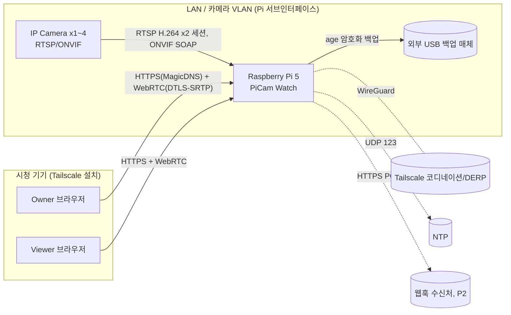
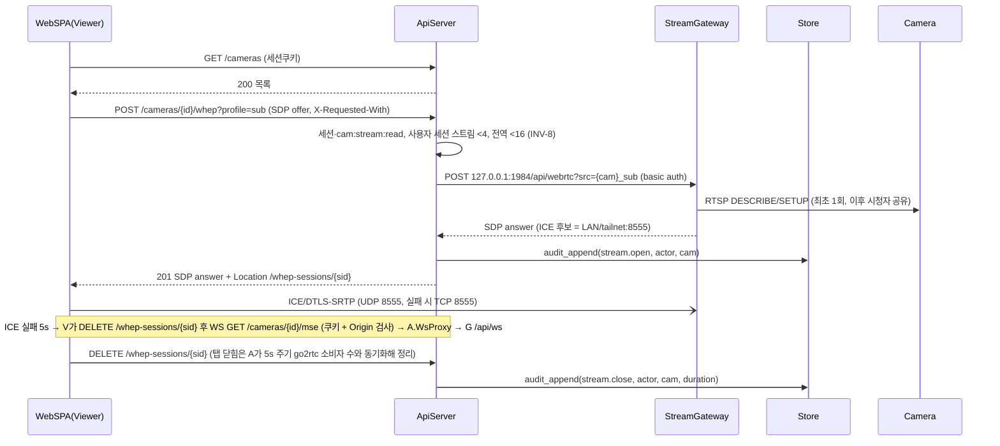
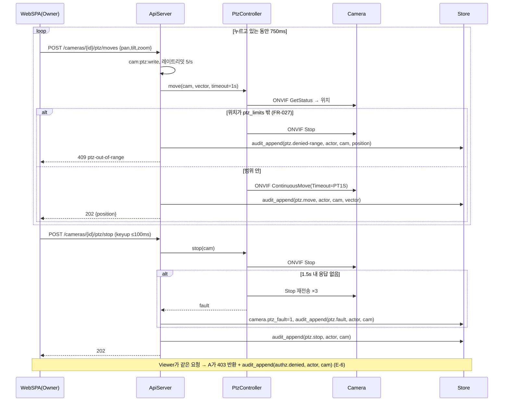

# 아키텍처 — PiCam Watch

> 근거 (A4 진입 사전조사, 검색 2회, 2026-09-03)
> - **정량**: go2rtc 기본 포트 1984(웹UI/API)·8554(RTSP)·8555(WebRTC)는 **LAN 전체에 무인증 노출**, localhost 요청은 인증 설정이 있어도 기본 통과(`api.local_auth: true`로 강제 가능) ([go2rtc HTTP API 문서](https://go2rtc.org/internal/api/) · [internal/api/README](https://github.com/AlexxIT/go2rtc/blob/master/internal/api/README.md)) → API·웹UI는 `listen: "127.0.0.1:1984"` + `local_auth` + basic auth(API만 보유)로 묶고 우리 API가 인증 후 프록시한다.
> - **정성**: "PullMessages 응답 파싱 시 Topic이 None으로 나온다"(zeep WSDL 이슈) ([python-onvif-zeep #69](https://github.com/FalkTannhaeuser/python-onvif-zeep/issues/69) · [python-zeep #1182](https://github.com/mvantellingen/python-zeep/issues/1182)) → 이벤트 수신기는 Topic 파싱 실패를 **카메라별 격리·재구독**으로 처리하고 raw XML을 디버그 로그에 남긴다.
> - **사용자 영향**: 시청자는 브라우저만 열면 되고(WebRTC 시그널링은 로그인 세션으로 자동), Owner는 카메라 비밀번호를 한 번만 넣는다(L-07 테슬러 — 복잡성은 시스템이 흡수).

스킬: `ecc:architecture-decision-records`(검토한 대안 절을 ADR 형식으로 decision-log에 흡수) · `ecc:security-review`(시크릿·입력·인증·레이트리밋·에러노출 체크리스트를 STRIDE 표에 반영) · `ecc:architect` 서브에이전트(독립 검토 12건 → v1.1)
개정: v1.1 — 링버퍼·ICE·origin·감사 소유자·WAL·DFD 보강. **v1.2 (2026-09-03, GATE 리뷰어 B·C 반영)** — go2rtc 자격증명 런타임 등록(설정 파일 비밀 0), 오디오 Eliminate, PTZ 허용 범위, StreamHealth 폴러, api↔recorder IPC 명시, 백업 매체·웹훅 경계 추가, "해당없음" 셀 근거 보강, 파서 격리, VLAN 조건, 8443 바인딩, 호스트 헬스 타이머.

## Context & Scope
- 단일 Raspberry Pi 5(8GB) + NVMe 256GB + RTC 배터리 + 외부 USB 백업 매체가 **서버이자 엣지**. 카메라 1~4대(ONVIF Profile S, H.264 프로파일 필수)가 같은 L2 세그먼트에 있거나, 카메라 VLAN을 분리한 경우 Pi가 그 VLAN에 서브인터페이스를 가진다(WS-Discovery는 링크로컬 멀티캐스트라 세그먼트를 넘지 않음). 시청자는 LAN 또는 Tailscale로 접속. 인터넷은 NTP·Tailscale·이미지 갱신·웹훅(P2)에만 쓴다.
- 기존 시스템 없음(그린필드). 카메라 벤더 앱과 병행 사용 가능 — 이 시스템은 **카메라당 RTSP 세션 2개(서브: 라이브, 메인: 링버퍼)** 를 상시 점유하므로 카메라 세션 상한을 등록 시 확인한다(CAM-3 `max_rtsp_sessions`).
- **접속 origin·TLS**: 기본 origin은 Tailscale MagicDNS 이름 `picam.<tailnet>.ts.net`(HTTPS, `tailscale cert`). 시청 기기(LAN 포함)에는 Tailscale을 설치한다(Q3). LAN IP 직접 접속은 self-signed 인증서로 **첫 설정 마법사와 비상 접근에만** 허용. 두 origin은 별개 세션. 쿠키 `Secure; HttpOnly; SameSite=Lax` + REST 상태 변경은 `X-Requested-With`, WebSocket은 `Origin` 허용 목록 검사. API 프로세스는 비루트로 **8443**에 바인딩하고 호스트 nftables가 443→8443으로 리다이렉트한다.
- 제약: 트랜스코딩 금지(INV-1), SD 루트 읽기 전용(INV-7), 공개 포트 0(Q3), 동시 세션 2단 한도(INV-8), 오디오 기능 부재(INV-6), PTZ 허용 범위(INV-9).

## Goals / Non-goals
- Goals: G1 1초 라이브(WebRTC) · G2 책임 추적 제어·열람·반출 · G3 자동 법정 보존 (03-prd)
- Non-goals: 객체 인식, 영구 상시 녹화, 오디오, 다중 Pi, 공개 인터넷, 벤더 전용 PTZ, H.265 전용 카메라, 외부 메트릭 수집기·외부 프로브 운영 (03-prd 범위 밖)

## 설계

### 시스템 컨텍스트


### 구현 접근 (난점 → 선택)
| 난점 | 선택 | 근거 |
|---|---|---|
| Pi 5에 H.264 HW 인코더 없음 | 카메라 코덱 **패스스루** — go2rtc가 RTSP→WebRTC/MSE 재패키징만. H.264 프로파일 없는 카메라는 등록 거부(INV-1) | 01-recon [사실] |
| 이벤트 "전 10초" 클립 | 카메라별 ffmpeg `-c:v copy -an -f segment -segment_format mpegts -segment_time 10 -segment_wrap 4`를 **tmpfs 링버퍼**(`/run/picam/ring`)에 상시 기록. MPEG-TS는 진행 중 세그먼트도 판독 가능 → pre-roll = **직전 완료 세그먼트 + 진행 중 세그먼트**(10~20초 확보, 키프레임 경계 오차 ≤ GOP). post-roll은 **같은 링의 후속 세그먼트를 이어 붙임**(DTS 연속). 소스 = 메인스트림(등록 검증 비트레이트 ≤ 4Mbps·GOP ≤ 4s, 초과 시 서브스트림·경고). 사이징: 4대 × 4Mbps × 40s ≈ 80MB → tmpfs 128MB | NVMe·SD 쓰기 회피(P1 SD 마모); A4 독립 검토 H2 |
| go2rtc 무인증·자격증명 | go2rtc.yaml에는 `api/rtsp/webrtc` 설정만(비밀 0). **스트림은 API가 기동 시·변경 시 go2rtc 런타임 API(`PUT /api/streams`)로 메모리 등록**(복호화한 자격증명 포함, go2rtc 재시작 시 API가 재등록). `api.listen: 127.0.0.1:1984` + `api.local_auth: true` + basic auth(비밀은 api 컨테이너 환경변수만). API가 인증 후 WHEP·MSE를 프록시하고 go2rtc 응답 본문은 전달하지 않는다 | 사전조사 정량; GATE 리뷰어 C #3 |
| WebRTC ICE 도달성 | 컨테이너 3개 모두 `network_mode: host`. go2rtc `webrtc.candidates: [<LAN_IP>:8555, <TAILNET_100.x>:8555, "<LAN_IP>:8555/tcp"]`를 API가 부팅 시 생성. STUN/TURN 없음 | A4 독립 검토 H3 |
| 오디오(녹음 금지) | **Eliminate**: go2rtc 스트림 등록 URL에 `#media=video` 고정, ffmpeg `-an` 고정, 오디오 관련 설정·API·컬럼 없음(INV-6, SC-013) | 법 제25조⑤; GATE B #9·C #4 |
| 멈추지 않는 PTZ / 목적 외 방향 | PtzController: Stop 워치독(1.5s, 3회, ptz_fault) + **허용 범위 검사** — 이동 갱신(750ms)마다 `GetStatus` 위치를 `ptz_limits`와 비교, 밖이면 Stop + 409 + 감사; 위치 미지원 카메라는 유휴 5분 후 홈 프리셋 복귀(FR-027) | FR-007·024·027 |
| 벤더별 ONVIF 편차 | 등록 시 `GetCapabilities`·`GetProfiles`·`GetVideoEncoderConfiguration`(GOP·비트레이트)·PTZ `GetNodes`·`GetStatus` 지원 여부로 **지원 매트릭스** 저장, UI는 지원 기능만 노출 | 03-prd 정성 근거 |
| 오프라인 판정 주체 | **StreamHealth 폴러**(ApiServer, 5s): go2rtc `/api/streams` 프로듀서 상태·최근 패킷 시각으로 `last_frame_at` 갱신, 10s 초과 시 offline. RTSP 재접속은 go2rtc(30s 백오프), PullPoint 재구독은 EventIngest — 판정은 폴러 한 곳 | GATE C #12 |
| 전원 차단 | SD 루트 overlayfs 읽기 전용, `/data`(NVMe, ext4 `data=ordered`, NVMe 휘발성 쓰기 캐시 비활성 권장)만 영구 쓰기. SQLite WAL — 일반 `synchronous=NORMAL`, **감사 커넥션 `synchronous=FULL`**. 부팅 시 정합성 잡(FR-026). RTC 배터리로 시계 유지 | P1 프로파일; A4 M8 |
| api↔recorder IPC | **SQLite 테이블 폴링(outbox)**: recorder는 `event.status='recording'`(1s)·`camera`(10s)를 폴링. 별도 소켓·큐 없음(단일 노드, 초당 수 건) | GATE B #12·C #12 |
| 감사 기록 소유자 | `Store.audit_append()` 단일 함수(해시 체인)만 쓴다. 사용자 행위는 ApiServer, 시스템 행위는 백그라운드 잡·recorder가 `actor=system`으로 호출. 트리거로 UPDATE/DELETE 차단, 1년 아카이브는 05의 단일 절차 | A4 M7; GATE B #7·C #11 |
| 알림 | 앱 내 배너(P1) + **웹훅 URL 1개 + 5분 heartbeat**(P2, Notifier 모듈). Pi 자체 다운은 Pi가 알릴 수 없으므로 heartbeat 부재를 수신처가 감지(수신처 운영은 사용자 선택) | GATE B #11·C #2 |

### 컴포넌트 구조
```mermaid
classDiagram
  class WebSPA {
    React+Tailwind 정적 번들
    video-rtc 플레이어(WebRTC→MSE 폴백)
    PTZ 패드(750ms 갱신 루프, 범위 경계 표시)
  }
  class ApiServer {
    FastAPI :8443 (api 컨테이너, 비루트)
    AuthN(argon2id, 세션쿠키 Secure/HttpOnly/Lax)
    AuthZ(스코프) · RateLimit · ProblemJSON
    WhepProxy(POST/DELETE → go2rtc, 세션 카운트)
    WsProxy(MSE, Origin 검사 → go2rtc /api/ws)
    StreamRegistrar(go2rtc 런타임 등록, #media=video)
    StreamHealth(5s 폴러 → online/offline)
    SetupWizard(1회용 토큰, 복구 키 1회 표시)
    RetentionJob(매시) · BootReconcile(FR-026)
    BackupJob(일 1회, age 암호화 → USB) · Notifier(웹훅, P2)
  }
  class EventIngest {
    api 컨테이너 태스크
    ONVIF PullPoint 폴러(카메라당, 재구독)
    클립 시작/연장 판정(FR-013)
  }
  class PtzController {
    api 컨테이너 모듈
    python-onvif-zeep (XML 외부 엔티티 비활성)
    ContinuousMove/Stop/Preset + Stop 워치독
    GetStatus 범위 검사(FR-027) · 유휴 홈 복귀
  }
  class StreamGateway {
    go2rtc (host net, 별도 UID)
    api 127.0.0.1:1984 local_auth + basic auth
    RTSP 127.0.0.1:8554 · WebRTC :8555
    스트림은 메모리 등록만(설정 파일에 비밀 0)
  }
  class RecorderSupervisor {
    recorder 컨테이너 (별도 UID)
    camera 테이블 10s 폴링 → ffmpeg 기동/정지
    30s 무출력 감시·재시작
  }
  class ClipRecorder {
    recorder 컨테이너
    ffmpeg -c:v copy -an → ring(tmpfs, TS)
    recording 이벤트 1s 폴링 → 클립 조립(fMP4) → /data/clips + SHA-256
  }
  class Store {
    SQLite WAL (/data/db)
    Camera Preset Event Clip User Session Settings MetricsRollup AuditLog
    audit_append(해시 체인, sync=FULL)
  }
  WebSPA --> ApiServer : HTTPS REST + WHEP + WS
  ApiServer --> StreamGateway : 127.0.0.1 프록시·등록 (basic auth)
  ApiServer --> PtzController
  ApiServer --> EventIngest : 카메라 등록/삭제 시 태스크 갱신
  ApiServer --> Store
  EventIngest --> Store : Event 생성/연장 (outbox)
  RecorderSupervisor --> Store : camera 폴링
  RecorderSupervisor --> ClipRecorder : 기동/정지/감시
  ClipRecorder --> Store : recording 폴링, Clip 행, audit_append(system)
  ClipRecorder --> StreamGateway : rtsp://127.0.0.1:8554/{cam}_rec
```
스트림 이름 규약(StreamGateway): `{cam}_sub`(그리드·MSE), `{cam}_main`(단일 뷰), `{cam}_rec`(링버퍼 소스 = main 또는 sub). 오디오 스트림 없음.

### 데이터 흐름

**시나리오 1 — 라이브 뷰 (WebRTC, MSE 폴백, 세션 한도, 열람 감사)**


**시나리오 2 — PTZ 홀드 이동, 범위 검사, 정지 워치독, 권한 거부 감사**


**시나리오 3 — 모션 이벤트 → 링버퍼 조립 → 연장 → 보존 파기**
```mermaid
sequenceDiagram
  participant C as Camera
  participant E as EventIngest
  participant S as Store
  participant R as ClipRecorder
  participant J as RetentionJob
  loop 카메라당 PullMessages(2s)
    C-->>E: tns1:RuleEngine/CellMotionDetector/Motion IsMotion=true
  end
  alt 진행 중 이벤트 없음
    E->>S: INSERT Event(status=recording, end_at = now+20s)
  else 진행 중
    E->>S: UPDATE Event end_at = max(end_at, now+20s), 상한 start+120s (FR-013)
  end
  R->>S: recording 이벤트 폴링(1s, outbox)
  R->>R: ring에서 start-10s 이후 세그먼트 수집, end_at 도달까지 후속 세그먼트 이어 붙임 → fMP4 remux(-c copy -an)
  R->>S: INSERT Clip(path, sha256, expires_at = start + retention), Event status=stored, audit_append(system, clip.create)
  J->>S: 매시: SELECT Clip WHERE status=stored AND expires_at < now (time_unsynced 제외, E-11 규칙)
  J->>J: unlink + fsync(dir), 디스크 90% 시 최구부터; 일 1회 fstrim
  J->>S: UPDATE Clip status=purged, audit_append(system, clip.auto-purge)
```

### 데이터 저장 (설계 결정 관련 부분만)
- `/data`(NVMe, ext4): `db/picam.sqlite`(WAL) · `clips/{camera_id}/{ulid}.mp4` · `config/`(master.key·setup-token·go2rtc.yaml(비밀 없음)·tls/·previous.env) · `backups/`(NVMe 부본 7세대) · `log/` · `docker/` · `tailscale/`(tailscaled 상태)
- `/run/picam/ring`(tmpfs 128MB 상한): 카메라별 MPEG-TS 세그먼트 4개(10s) — 재부팅 시 소실 허용(저장이 아님)
- 카메라 자격증명: `config/master.key`(0600, 첫 부팅 생성)로 AES-256-GCM 암호화 후 DB 저장(INV-5). 평문은 API 프로세스 메모리와 go2rtc 프로세스 메모리에만 존재
- 감사로그: `audit_append()`가 `prev_hash`·`row_hash` 계산, 트리거로 UPDATE/DELETE 차단(INV-3). 백업마다 마지막 `row_hash`를 백업 매니페스트에 기록(오프라인 변조 탐지)
- 백업: `sqlite3 .backup` 온라인 스냅샷 + `config/`를 tar → **age 암호화**(복구 키는 설정 마법사에서 1회 표시, 서버에는 해시만) → 외부 USB(`/mnt/backup`) + NVMe 부본. 클립 제외(단일 사본 정책)

## 검토한 대안 (ADR 형식 요약 — decision-log #10~#16, #24~#40)
| 결정 | 채택 | 버린 대안 | 왜 |
|---|---|---|---|
| 스트림 계층 | go2rtc | MediaMTX | ONVIF 디스커버리·입력이 go2rtc에만 있음 |
| 제품 형태 | 얇은 자체 서비스 | Frigate 통째 채택 | 객체 인식·가속기가 범위 밖, 법정 보존·감사·역할이 Frigate에 없음 |
| 백엔드 런타임 | Python FastAPI | Node/Go | python-onvif-zeep 동일 런타임, ffmpeg 서브프로세스 관리 단순 |
| 저장소 | SQLite WAL(감사 커넥션 FULL) | PostgreSQL | 단일 노드, 운영 데몬 0개, `.backup` 온라인 백업 |
| 원격 접근·origin | Tailscale + MagicDNS 단일 origin | 공개 HTTPS + coturn / LAN IP origin | 공개 포트 0, TURN 불필요, 신뢰 인증서를 `tailscale cert`로 조달 |
| 전 10초 확보 | tmpfs 링버퍼 MPEG-TS + 링 연장 | NVMe 상시 세그먼트 / 별도 post-roll 캡처 | NVMe 쓰기 회피; 별도 캡처는 키프레임 대기·DTS 불연속 |
| WebRTC 시그널링 | API가 WHEP 프록시(세션 쿠키) | go2rtc 직접 노출 / 별도 스트림 토큰 | 스코프·세션 한도·열람 감사가 API에 있어야 함 |
| go2rtc 자격증명 | 런타임 API 메모리 등록 | go2rtc.yaml에 URL 기재(0600) | 설정 파일·백업에 평문이 남지 않음(INV-5) |
| 오디오 | 기능 부재(Eliminate) | 경고 후 Owner 활성 옵션 | 사업장 전제에서 녹음 금지는 예외 없음; 옵션은 코드 경로를 남김 |
| PTZ 목적 외 이동 | GetStatus 범위 검사 + 홈 복귀 | 감사로그만 | 감사는 사후 입증뿐, 법 제25조⑤는 행위 자체를 금지 |
| 네트워크 | 컨테이너 3개 host + UID 분리, API 8443 + nftables 443 리다이렉트 | 브리지 / 비루트 443 직접 바인딩 | 브리지는 ICE·멀티캐스트 불가; 비루트 1024 미만 바인딩은 cap 의존 |
| 알림 | 앱 배너 + 웹훅 1개(P2) | 이메일/텔레그램 개별 연동 | 요청 밖 채널 다중화 회피, 웹훅 1개로 어디든 연결 |
| 메트릭 | `/health/details` + SQLite 롤업 | Prometheus `/metrics` | 외부 수집기는 non-goal |
| 백업 매체 | 외부 USB 필수 BOM + age 암호화 | NVMe 내부만 / 평문 rsync | 동일 매체 백업은 NVMe 고장에 무력; 키·자격증명 평문 반출 금지 |

## 위협모델

### ① 무엇을 만드는가 — DFD + trust boundary
```mermaid
flowchart TB
  subgraph TB1["TB1: 클라이언트 ↔ Pi (LAN/Tailscale)"]
    BR[브라우저]
    SETUP[첫 설정 마법사 클라이언트]
  end
  subgraph PI["Pi 내부 — TB2: 프로세스/UID 경계 (host 네트워크 공유)"]
    API[ApiServer :8443<br/>EventIngest · PtzController · StreamHealth · RetentionJob · BootReconcile · BackupJob · Notifier]
    G2[go2rtc 127.0.0.1:1984 local_auth<br/>:8554 · :8555 (스트림 메모리 등록)]
    REC[RecorderSupervisor + ffmpeg]
    RING[/run/picam/ring tmpfs<br/>평문 영상 40s]
    DB[(SQLite /data/db<br/>audit 해시 체인)]
    KEY[master.key · setup-token 0600]
    CLIPS[/data/clips]
  end
  subgraph TB3["TB3: Pi ↔ 카메라 (LAN, RTSP 평문)"]
    CAM[카메라]
  end
  subgraph TB4["TB4: 외부"]
    TSC[Tailscale 제어면]
    NTPS[NTP]
    REG[컨테이너 레지스트리]
    WH[웹훅 수신처 P2]
  end
  subgraph TB5["TB5: 백업 매체 (외부 USB)"]
    USB[(age 암호화 아카이브)]
  end
  BR -->|HTTPS 쿠키 + X-Requested-With / WS Origin| API
  SETUP -->|HTTPS self-signed + 1회용 토큰| API
  BR -->|DTLS-SRTP UDP/TCP 8555| G2
  API -->|basic auth, PUT /api/streams| G2
  API --> DB
  API --> KEY
  API -->|ONVIF SOAP| CAM
  G2 -->|RTSP x2| CAM
  REC -->|RTSP 127.0.0.1| G2
  REC --> RING
  REC --> CLIPS
  REC --> DB
  API -->|Range 응답| CLIPS
  API -->|암호화 아카이브| USB
  API -.->|HTTPS POST 알람·heartbeat| WH
  PI -.-> TSC
  PI -.-> NTPS
  PI -.-> REG
```

### ② 무엇이 잘못될 수 있는가 — STRIDE (경계별)
| 자산/경계 | S 위장 | T 변조 | R 부인 | I 노출 | D 서비스거부 | E 권한상승 |
|---|---|---|---|---|---|---|
| **TB1 브라우저→API** | 세션 탈취·크리덴셜 스터핑 | 요청 파라미터 변조(PTZ 벡터 범위 초과, camera_id 바꿔치기), WS cross-origin 연결 | "내가 PTZ/열람/반출 안 했다"; **Owner 본인의 목적 외 PTZ(법 주체)** | 에러에 스택트레이스, 클립 경로 추측 | 로그인 폭주, WHEP 세션 남발 | Viewer가 Owner API·다운로드 호출 |
| **TB1 첫 설정 마법사** | 첫 부팅 창에 제3자가 먼저 Owner 생성(선점) | 해당없음 — 생성 이전에 변조할 상태가 없음 | 해당없음 — 생성 행위가 감사 체인의 첫 행 | 복구 키 1회 표시 화면 노출 | 마법사 반복 호출 | 마법사 재활성화로 Owner 추가 |
| **TB1 브라우저↔go2rtc 8555** | 해당없음 — DTLS 인증서 지문·ICE ufrag/pwd가 인증된 시그널링으로만 전달됨 | 해당없음 — SRTP 무결성 | 해당없음 — 열람 행위는 API의 WHEP 세션 생성·종료 지점에서 감사(stream.open/close) | ICE 포트 스캔으로 존재 노출(내용 아님) | UDP 플러딩 | 미인증 UDP를 받는 미디어 스택(pion) 파싱 취약점 |
| **TB2 API↔go2rtc↔recorder (host net)** | 로컬 다른 프로세스가 1984 접근 | go2rtc 설정·webrtc 후보 변조; recorder가 DB에 clip/event 외 행 조작 | 해당없음 — 사용자 행위는 API 감사, 시스템 행위는 audit_append(system) | go2rtc `/api/streams`로 카메라 RTSP URL(비밀번호 포함) 조회 | ffmpeg 좀비·메모리 | 컨테이너 탈출 |
| **ring tmpfs (RAM 평문 영상 40s)** | 해당없음 — 파일 시스템 자산, 인증 주체 아님 | 루트 권한으로 세그먼트 교체 | 해당없음 — 클립 생성 시 해시 기록 | 루트 탈취 시 최근 40초 열람 | tmpfs 128MB 포화(비트레이트 초과) | 해당없음 — 권한 모델 없음(루트 탈취는 TB2-E) |
| **TB3 Pi→카메라** | 가짜 카메라(ARP 스푸핑)로 위장 | RTSP 평문 스트림 변조 | 해당없음 — 카메라는 행위자 아님 | 카메라 자격증명·영상 LAN 스니핑 | 카메라 RTSP 세션 고갈(2세션 상시 + 벤더 앱) | 카메라 펌웨어·악성 SOAP/RTSP 응답(XXE, 파서 취약점) → Pi 프로세스 |
| **/data (물리)** | 해당없음 — 저장 매체는 인증 주체가 아님(교체 매체는 T로 다룸) | 클립 파일 교체, NVMe 탈거 후 DB 직접 편집 | NVMe 탈거 후 감사 행 삭제(엔진 우회) | NVMe 탈취 시 클립·DB 열람 | 디스크 풀 | 해당없음 — 파일시스템 권한 상승은 TB2-E(컨테이너/OS)에서 다룸 |
| **TB4 외부(Tailscale/NTP/레지스트리/웹훅)** | 가짜 NTP로 시간 조작; 가짜 웹훅 수신처 | 변조된 컨테이너 이미지 | 해당없음 — 외부 서비스 행위의 부인은 Tailscale·레지스트리 약관 범위(Transfer) | Tailscale 노드 키 유출; 웹훅 본문 노출 | Tailscale/NTP/웹훅 불가 | 해당없음 — 외부 서비스가 Pi 프로세스 권한을 얻는 경로 없음(이미지 변조는 T) |
| **TB5 백업 매체(USB)** | 해당없음 — 매체는 인증 주체 아님 | 아카이브 변조·교체 | 해당없음 — 백업 실행은 감사 backup.ok/fail | 매체 분실 시 DB·키 노출 | 매체 분실·고장 → 복구 불능 | 해당없음 — 실행 파일 없음, 마운트 `noexec` |

### ③ 무엇을 할 것인가
| 위협 | 처리 | 대책 |
|---|---|---|
| TB1-S 세션 탈취 | Mitigate | Secure·HttpOnly·SameSite=Lax 쿠키 + `X-Requested-With`(REST)·`Origin` 허용 목록(WS), 세션 12h + 유휴 1h, argon2id, 실패 10회/10분 IP 차단(FR-023), 신뢰 인증서 |
| TB1-T 파라미터·WS | Mitigate | Pydantic 스키마(pan/tilt/zoom ∈ [-1,1]), camera_id 서버 검증, WS `Origin` 불일치 403 |
| TB1-R 부인 | Mitigate | append-only AuditLog + 해시 체인(FR-010: 조작·열람·반출·거부·범위 밖), 트리거로 수정·삭제 차단 |
| TB1-R Owner 본인의 목적 외 PTZ | Mitigate + Accept | PTZ 허용 범위(FR-027)로 촬영범위 밖 이동을 기술적으로 차단, 감사로 사후 입증. 범위 안에서의 목적 외 사용은 **Accept**(법적 책임은 운영자, 시스템은 기록·제한만) |
| TB1-I 스택트레이스·경로 | Mitigate | RFC 9457 `detail`만, 클립은 ULID + 스코프 + Range 응답, 로그 마스킹 |
| TB1-D 폭주 | Mitigate | 레이트리밋(PTZ 5/s, 로그인 10/10min), 세션 2단 한도(INV-8), 유령 세션 5s 동기화 |
| TB1-E Viewer→Owner·다운로드 | Mitigate | 모든 변경·다운로드 엔드포인트에 스코프 데코레이터, 계약 테스트 SC-010 |
| 설정-S 선점 | Mitigate | 1회용 설정 토큰(콘솔·`setup-token` 0600), Owner 생성 즉시 라우트 제거(FR-018) |
| 설정-I 복구 키 | Mitigate | 1회 표시·복사 확인 후 화면 파기, 서버에는 해시만 |
| 설정-D/E | Mitigate | 토큰 실패 5회 시 잠금(재부팅 해제), 재활성화 경로 없음(Owner 추가는 USR-2만) |
| 8555-I 포트 존재 노출 | Accept | 내용 노출 없음, nftables로 LAN·tailnet CIDR 외 차단 |
| 8555-D UDP 플러딩 | Accept(사유) | 내부 공격자 전제 시 다른 경로가 더 쉬움 |
| 8555-E pion 파싱 취약점 | Accept + Mitigate | go2rtc 다이제스트 고정 + 월 1회 갱신 확인, 별도 UID·read_only |
| TB2-S/I 1984·URL 노출 | Mitigate | `api.listen 127.0.0.1` + `local_auth` + basic auth(API만 보유), 설정 파일에 비밀 0(런타임 등록) → recorder·타 프로세스는 조회 불가(INV-5) |
| TB2-T 설정·DB 변조 | Mitigate | 설정은 API만 생성·읽기 전용 마운트; recorder DB 커넥션은 애플리케이션 계층에서 clip/event/audit_append로 한정(코드 리뷰 게이트), 감사 트리거 |
| TB2-D ffmpeg 좀비 | Mitigate | RecorderSupervisor 30s 무출력 kill·재시작, `pids_limit`·`mem_limit` |
| TB2-E 컨테이너 탈출 | Transfer/Mitigate | 비루트·`no-new-privileges`·read_only; OS 패치 주기 |
| ring-T/I 루트 탈취 | Accept(사유) | 루트 탈취 시 master.key·클립도 동반 노출 — 물리·OS 보안 범위, 재부팅 시 소실 |
| ring-D 포화 | Mitigate | 등록 검증 비트레이트 ≤ 4Mbps, `segment_wrap 4`, HLT-2 `ring_buffer` 경고 |
| TB3-S/T/I 카메라 세그먼트 | Mitigate + Accept | 카메라 VLAN 권장(Pi 서브인터페이스 조건 명시), ONVIF WS-UsernameToken; RTSP 평문은 **Accept** |
| TB3-D 세션 고갈 | Mitigate | 카메라당 2세션 고정, 등록 시 `max_rtsp_sessions` 확인 |
| TB3-E 카메라발 페이로드 | Mitigate | zeep/lxml `resolve_entities=False`·`no_network=True`(XXE), ffmpeg·go2rtc 별도 UID·read_only·다이제스트 고정, nftables 카메라 CIDR→Pi 인바운드 차단 |
| /data-T/R 오프라인 편집 | Mitigate + Accept | 감사 해시 체인 + 백업 매니페스트의 마지막 `row_hash`(탐지), 클립 SHA-256. 완전 방지는 **Accept** |
| /data-I 물리 탈취 | Accept(사유) | 클립 암호화는 성능·복구 복잡도 대비 이득 낮음 — 잠금 함체 안내 |
| /data-D 디스크 풀 | Mitigate | 90% 자동 정리(FR-016), 80% 경고 |
| TB4-S 가짜 NTP·웹훅 | Mitigate | chrony 복수 소스 + 미동기 시 E-11 보수 모드; 웹훅은 https만·본문에 영상 없음 |
| TB4-T 이미지 변조 | Mitigate | 다이제스트 고정, Owner 수동 승인 |
| TB4-I 노드 키·웹훅 본문 | Transfer + Mitigate | Tailscale 키는 Tailscale 책임(분실 시 노드 제거); 웹훅 본문은 카메라 이름·시각·알람 코드만 |
| TB4-D 외부 불가 | Mitigate | LAN 동작은 외부 의존 0 |
| TB5-T/I/D 백업 매체 | Mitigate | age 암호화(복구 키 없이는 무의미), 매니페스트 해시, NVMe 부본 7세대 + 분기 복원 리허설, `noexec,nodev` 마운트 |

### ④ 충분한가 — 상위 리스크 재검토
1. **Viewer→Owner 권한상승 / 열람·반출 부인(법적 결과 직결)**: 서버 측 스코프 + 계약 테스트 + 조작·열람·반출 감사(해시 체인) 3중, 다운로드는 Owner 전용. 잔여: 세션 쿠키 탈취 — 12h 만료·Tailscale 암호화·신뢰 인증서로 낮춤.
2. **카메라 자격증명 노출(go2rtc API·설정·백업)**: 런타임 등록·`local_auth`·UID 분리·로그 마스킹·백업 암호화. 잔여: Pi 루트 탈취 시 메모리·master.key 동반 노출 — Accept(물리 보안).
3. **PTZ 목적 외 방향 / 멈추지 않음 / 녹음(법 제25조⑤)**: 허용 범위 검사·홈 복귀·Stop 워치독·감사; 오디오는 코드 경로 부재. 잔여: 위치 조회 미지원 카메라는 범위 강제 불가 → 홈 복귀 + "검증된 카메라 목록"에 표시.

## Cross-cutting
- **관측성**: 구조화 JSON 로그(stdout → journald → log2ram), 카메라별 스트림 상태·PTZ 성공률·클립 생성 성공률·링버퍼·디스크·백업 상태를 `/health/details`로 노출하고 15분 롤업을 SQLite에 24h 보관(`/health/rollup`). 외부 수집기 없음. 상세 A7.
- **프라이버시**: 영상은 Pi 밖으로 나가지 않는다(클라우드 0, 웹훅 본문에 영상 없음). 보존기간 자동 파기(INV-4), 오디오 부재(INV-6), 안내판 5항목을 카메라 메타에 강제(FR-011), 열람·반출 감사(FR-010), 반출은 Owner 전용. 감사로그 자체도 개인정보(행위자 ID) — 1년 후 05 절차로 암호화 아카이브.
