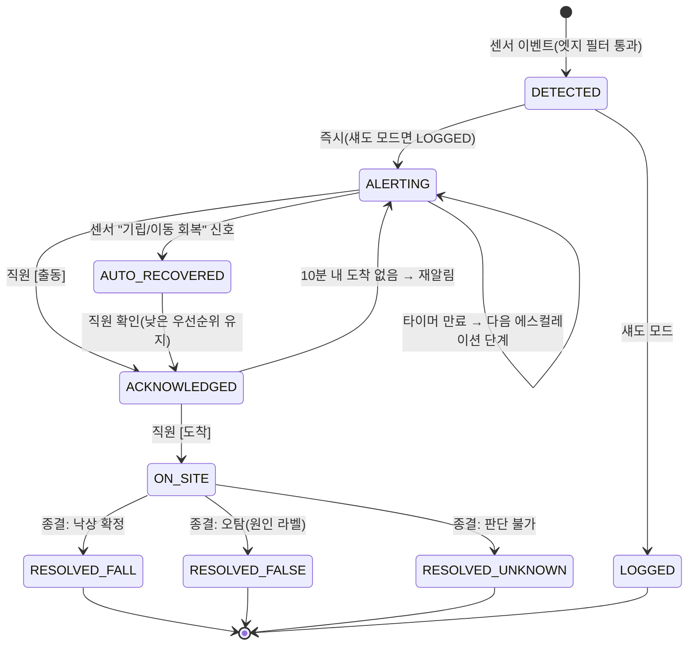
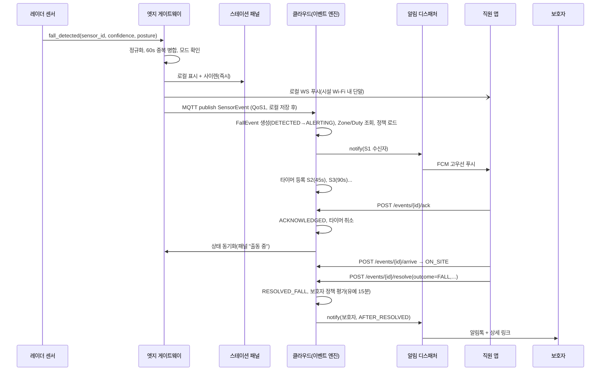
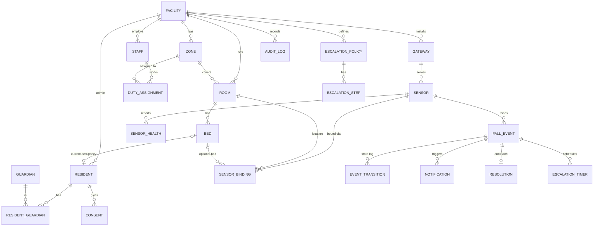

# 요양시설 어르신 낙상 감지·알림 서비스 — 기획·설계 문서

| 항목 | 내용 |
|---|---|
| 문서 ID | FALLCARE-DESIGN v0.1 |
| 작성일 | 2026-09-03 |
| 입력 | "요양시설 어르신 낙상을 감지해 보호자와 직원에게 알리는 서비스를 만들고 싶다." (한 줄 아이디어) |
| 상태 | 초안 — 구현 착수 가능 수준을 목표로 작성. 사용자 확인 없이 작성했으므로 **[가정]** 표시 항목은 착수 전 검토 필요 |
| 가칭 | FallCare (문서 내 임시 명칭) |

## 0. 이 문서를 읽는 법

- 모든 주장은 **[확정] / [가정] / [미확정]** 으로 구분한다.
  - **[확정]**: 공개 자료·통계·법령으로 뒷받침되는 사실.
  - **[가정]**: 사용자에게 물을 수 없어 작성자가 정한 결정. 근거와 대안을 같이 적었다. 부록 A에 전체 목록.
  - **[미확정]**: 지금 결정하지 않고 M0 검증 또는 파일럿에서 확인할 항목.
- 산출물 위치: §3 PRD → §4 알림·에스컬레이션 정책 → §5 아키텍처·ADR → §6 위협모델·개인정보 → §7 데이터 모델 → §8 API 계약 → §9 테스트 설계 → §10 배포·IaC·관측성 → §11 로드맵·리스크.
- 다이어그램은 Mermaid. 렌더러가 없으면 텍스트로 읽어도 되도록 설명을 붙였다.

---

## 1. 요약 (Executive Summary)

국내 노인요양시설에서 낙상은 가장 빈번한 손상 사고이며, 요양시설 낙상 사고는 최근 5년간 약 3배 증가했다 [확정]. 문제의 본질은 "넘어지는 것" 자체보다 **넘어진 뒤 아무도 모르는 시간(long lie)** 이다. 특히 야간·침실·화장실은 인력이 가장 적고 카메라를 둘 수 없는 구역이라 발견이 늦다.

FallCare는 이 **발견 지연을 줄이는 것**을 단일 목표로 한다. 낙상을 예방한다고 주장하지 않으며, 의료기기·진단 기능도 갖지 않는다.

### 핵심 결정 5가지

| # | 결정 | 근거 요약 |
|---|---|---|
| D1 | **고객은 B2B 노인요양시설**(30~100인 규모). 재가·독거노인은 범위 밖 | 다수 침상·교대 근무·법정 CCTV 의무 등 시설 고유 워크플로우가 존재. 재가는 전혀 다른 제품 |
| D2 | **센서는 mmWave 레이더**(침실·화장실). 카메라는 MVP에서 제외 | 침실은 CCTV 설치 시 전원 동의 필요, 화장실은 사실상 불가. 레이더는 영상 없이 자세·낙상 감지 가능 |
| D3 | **센서 내장 감지 + 우리가 만드는 것은 알림·에스컬레이션·운영 워크플로우** | 감지 알고리즘은 상용 센서가 이미 90%+ 수준. 제품이 죽는 이유는 오탐 피로와 알림 미응답이지 감지율이 아님 |
| D4 | **보호자 알림은 "직원 확인 후" 시설 정책에 따라 발송**. 원시 감지를 보호자에게 직접 쏘지 않음 | 오탐을 보호자가 받으면 시설 신뢰가 무너짐. 시설이 커뮤니케이션 주체 |
| D5 | **클라우드 불통 시에도 시설 내 알림이 동작하는 온프레미스 게이트웨이** 필수 | 알림은 안전 기능. 인터넷 장애가 미발견 낙상으로 이어지면 안 됨 |

### 성공 지표 (파일럿 종료 기준)

- 낙상 발생 → 직원 단말 알림 도착 **P95 ≤ 30초**
- 낙상 발생 → 직원 현장 도착 **중앙값 ≤ 3분** (도입 전 기준선 대비 측정)
- 파일럿 기간 **미감지 낙상 0건** (시설 낙상 보고서와 대조)
- 오탐 **≤ 1건 / 침상 / 주** (섀도 모드에서 튜닝 후)
- 직원이 "알림을 끄고 싶다"고 답한 비율 < 20% (오탐 피로 지표)

---

## 2. 도메인 조사

### 2.1 문제의 크기 [확정]

- 65세 이상 손상 입원의 주요 기전은 추락·미끄러짐이며, 75세 이상 손상 입원환자의 72.5%가 추락·낙상이다.
- 65세 이상 낙상 사고는 최근 5년간 요양시설과 버스를 중심으로 약 3배 증가했고, 최근 1년 기준 장소별로는 **노인요양시설 523건**으로 가장 많다 (소비자원 접수 기준).
- 국내 질병관리청 손상 통계: 65세 이상 손상 퇴원율 인구 10만 명당 3,799명, 여성이 남성보다 1.3배 높음.
- (문헌 일반) 낙상 후 1시간 이상 바닥에 방치되는 "long lie"는 탈수·욕창·횡문근융해·폐렴·사망률 상승과 연관된다. 이것이 "감지·알림"이 만드는 실질 가치의 근거다.

### 2.2 규제·법률 환경

| 항목 | 내용 | 상태 |
|---|---|---|
| 장기요양기관 CCTV 의무화 | 노인복지법·시행규칙 개정으로 2023-06-22부터 신규 기관, 2023-12-21까지 기존 기관 CCTV 설치 의무. 공동거실·복도·현관·치료실·프로그램실·식당·엘리베이터에 1대 이상. **침실은 수급자 또는 보호자 전원의 동의 필요.** 영상 60일 보관 후 삭제(열람 요청 시 예외). 위반 시 과태료 최대 300만 원 | [확정] |
| 화장실 | 법령상 CCTV 설치 대상이 아니며 사생활 보호상 사실상 설치 불가 | [확정] (설치 대상 목록에 없음) |
| 개인정보보호법 | 낙상 이벤트·처치 기록은 건강에 관한 정보로 **민감정보(제23조)** 에 해당할 가능성이 높음 → 별도 동의 필요. 레이더는 영상정보처리기기가 아니라고 보는 것이 합리적이나 법적 판단 필요 | [가정] 민감정보로 취급, 법무 검토는 M0 |
| 의사결정능력 저하 입소자 동의 | 치매 등으로 본인 동의가 어려운 경우 보호자(법정대리인) 동의 절차 필요. 시설의 입소 동의서에 통합하는 것이 현실적 | [가정] |
| 의료기기 해당 여부 | "낙상 감지 후 알림"은 진단·치료·예방 목적이 아닌 안전 알림으로 보아 **비의료기기로 가정**. 단, 호흡·심박 등 생체신호 표시 기능을 넣으면 판단이 달라질 수 있음 → MVP에서 생체신호 기능 제외 | [가정] 식약처 판단은 [미확정] |
| 장기요양보험 수가 | 낙상 감지 서비스에 대한 별도 수가 없음. 시설 자부담 모델 | [확정] |
| 장기요양기관 평가 | 국민건강보험공단 기관 평가에 낙상 예방·안전관리 항목 존재 → 도입 동기 | [확정] (세부 배점은 [미확정]) |
| 인력 배치 기준 | 요양보호사 1인당 수급자 2.1명(2025년~, 주간 기준). 야간은 실제 1인당 15~25명 수준 | 기준은 [확정], 야간 비율은 [가정] |

### 2.3 기존 솔루션·경쟁

| 구분 | 사례 | 특징 |
|---|---|---|
| 레이더 센서 완제품 | Milesight VS373(LoRaWAN, 60GHz), Vayyar Care, Linpowave 등 | 낙상 감지 내장, "99% 정확도" 마케팅, 이벤트만 송신. 대부분 자체 클라우드·앱은 빈약 |
| 국내 레이더 스타트업 | 아자이(호흡·맥박·위치, 낙상 추가 예정), 클레버러스(이상행동·낙상), 인지니어스(AI 레이더 환자 모니터링), 텀브샤인(배변 감지) | 대부분 병원·재가 중심. 시설 교대근무 워크플로우·보호자 커뮤니케이션은 미흡 |
| 대형 벤더 | 하이크비전 레이더 낙상 감지 솔루션 | 하드웨어 중심, VMS 연동 |
| 카메라 AI | 다수 (포즈 추정 기반) | 공용구역에서 강력하나 침실·화장실 불가, 동의·보관 규제 부담 |
| 웨어러블 | 스마트워치, 펜던트 | 착용 순응도가 치매 어르신에서 낮음, 충전·분실 문제 |
| 바닥·침대 센서 | 압력 매트, 이탈 감지 | 침대 이탈은 잘 잡지만 낙상 자체는 못 잡음. 보조 신호로 유용 |

**틈새 [가정]**: 센서 자체는 상품화되어 있으나, 요양시설의 "누가 어느 구역을 담당하는지 → 미응답 시 누구에게 넘어가는지 → 보호자에게 언제 무엇을 알리는지 → 낙상 보고서로 어떻게 남는지"까지 이어지는 **운영 계층**이 비어 있다. FallCare는 이 층을 제품화한다.

### 2.4 센서 기술 비교

| 기준 | 카메라 + 엣지 AI | mmWave 레이더 | 웨어러블 | 바닥/침대 센서 |
|---|---|---|---|---|
| 침실·화장실 사용 | 불가/전원 동의 | **가능** | 가능 | 가능 |
| 낙상 감지력 | 높음(가시 조건) | 높음(90~99% 주장, 실환경 검증 필요) | 중간(착용 시) | 낮음(이탈만) |
| 오탐 요인 | 조명·가림 | 다인실 혼동, 침대 눕기, 직원 보조 동작 | 팔 동작 | 침대 이탈 ≠ 낙상 |
| 낙상자 식별 | 가능(재식별 규제) | 위치 기반 추정만 | 확실 | 침상 기반 추정 |
| 프라이버시 | 낮음 | **높음** | 높음 | 높음 |
| 설치 비용(방당) | 중 | 중~고(다인실은 2~3대) | 저(인당) | 저 |
| 감지 지연 | 1~3초 | 약 3~5초(문헌 3.49±2.2초) | 즉시 | 즉시(이탈) |
| 운영 부담 | 보관·열람 관리 | 낮음 | 충전·분실 | 낮음 |

→ **MVP: mmWave 레이더 단독.** 2차: 침대 이탈 센서를 보조 신호로 융합(야간 이탈 → 낙상 위험 예고), 3차: 공용구역 기존 CCTV 영상에 엣지 AI(시설이 이미 설치했으므로 추가 카메라 없이 영상은 시설 내에서만 처리).

### 2.5 조사에서 얻은 핵심 인사이트

1. **가치는 예방이 아니라 발견 시간 단축이다.** 마케팅도 "낙상을 막는다"가 아니라 "혼자 넘어져 있는 시간을 줄인다"로 간다. 책임 범위도 이렇게 정의해야 한다.
2. **오탐 피로가 제품을 죽인다.** 문헌과 현장 모두 "long tail of false alarms" 때문에 직원이 알림을 끄고, 그 뒤 진짜 낙상을 놓치는 패턴을 보고한다. 오탐율은 기능이 아니라 **핵심 품질 지표**다.
3. **가장 위험한 곳이 가장 감시 못 하는 곳이다.** 침실·화장실·야간. 레이더 선택의 결정적 이유.
4. **보호자 알림은 기술 문제가 아니라 시설 책임 문제다.** 시설이 통제하지 못하는 보호자 알림은 시설이 도입을 거부하게 만든다.
5. **다인실이 국내 표준이다.** 4인실에서 "누가" 넘어졌는지 레이더는 확정하지 못한다. 제품은 "OO호 창가 침상 부근"처럼 **위치**를 말하고 사람은 추정으로만 표기해야 한다.

---

## 3. 블라인드스팟 심문 — 자문자답

사용자에게 질문할 수 없으므로, 보통 물었을 5개 질문에 대해 작성자가 답을 정하고 근거를 남긴다.

### Q1. 고객·이용 맥락은? → **B2B 노인요양시설(30~100인), 재가 제외** [가정]
- 대안: (a) 재가 독거노인 B2C, (b) 요양병원, (c) 시설+재가 동시.
- 선택 이유: 한 줄 아이디어가 "요양시설"과 "직원"을 명시. 시설은 교대근무·구역 담당·법정 CCTV 등 재가와 전혀 다른 워크플로우. 요양병원은 너스콜·EMR 연동이 필수라 2차.
- 영향: 다인실·구역 라우팅·야간 근무가 1급 요구사항이 된다.

### Q2. 센서 방식은? → **mmWave 레이더(침실·화장실 우선), 카메라 제외** [가정]
- 대안: 카메라 AI, 웨어러블, 하이브리드.
- 선택 이유: §2.4. 침실은 동의 없이는 CCTV 불가, 화장실은 불가. 낙상 다발 구역이 곧 카메라 금지 구역.
- 영향: 낙상자 개인 식별이 불확실 → UX는 "위치 우선".

### Q3. 하드웨어를 직접 만드나? → **아니오. 상용 레이더 센서를 통합하고, 벤더 2종 이상을 지원하는 어댑터 계층을 둔다** [가정]
- 대안: 자체 센서 개발(TI IWR6843 기반), 단일 벤더 종속.
- 선택 이유: 팀 규모·기간 미상. 하드웨어 개발은 12개월+. 벤더 2종 지원으로 종속 리스크를 줄인다.
- 영향: 센서별 이벤트 포맷 정규화가 엣지의 핵심 책임. 감지 알고리즘 튜닝 여지는 벤더가 제공하는 파라미터(민감도, 존 설정)로 제한.

### Q4. 보호자에게 무엇을, 언제 알리나? → **직원이 "낙상 확정"으로 종결한 뒤, 시설 정책에 따라 알림(기본값). 즉시 알림·미알림은 시설 선택** [가정]
- 대안: 감지 즉시 보호자 알림, 보호자 알림 아예 없음.
- 선택 이유: §2.5-4. 또한 보호자에게는 "무슨 일이 있었고 지금 어떤 상태인지"가 필요하지 "센서가 울렸다"가 아니다.
- 영향: 보호자 채널은 앱 강제 설치보다 **카카오 알림톡 + 웹 링크**가 현실적(앱 설치 마찰). 네이티브 보호자 앱은 2차.

### Q5. 사업 모델은? → **설치비 + 침상당 월 구독** [가정], 가격은 [미확정]
- 대안: 센서 판매 일회성, 시설당 정액.
- 선택 이유: 센서는 원가 회수, 지속 가치(알림·리포트·오탐 튜닝)는 구독. 침상당 과금이 시설 규모와 비례.
- 영향: 아키텍처는 멀티테넌트(시설 단위 격리)여야 한다. 기준 가격 예시: 센서 설치 30만 원/대, 구독 1만 원/침상/월 → 100인 시설 월 100만 원. 시장 검증은 M0.

---

## 4. PRD (제품 요구사항)

### 4.1 비전·목표

> "요양시설 어르신이 혼자 넘어져 있는 시간을 0에 가깝게."

- 목표 1: 낙상 발생부터 직원 인지까지 P95 30초 이내.
- 목표 2: 오탐이 직원 신뢰를 깨지 않는 수준(≤ 1건/침상/주) 유지.
- 목표 3: 보호자가 시설을 더 신뢰하게 만드는 커뮤니케이션(사후 알림 + 처치 내용).
- 목표 4: 낙상 기록이 자동으로 남아 시설 평가·보고 부담을 줄인다.

### 4.2 페르소나

| 페르소나 | 상황 | 니즈 | 두려움 |
|---|---|---|---|
| **어르신 (입소자)** — 82세, 치매 초기, 4인실, 야간 화장실 3회 | 혼자 화장실 가다 넘어짐 | 빨리 누가 와 주는 것 | 감시당하는 느낌, 카메라 |
| **요양보호사 김OO** — 야간 1인이 20명 담당, 시설 지급 스마트폰 소지, 장갑 자주 착용 | 순회 중 알림 수신 | 2탭 이내 응답, 어디로 갈지 즉시 표시, 오탐 적을 것 | 알림 폭탄, 놓쳤을 때 책임 |
| **간호사/시설장** — 야간 당직 관리, 평가·보고 담당 | 낙상 보고서 작성, 보호자 응대 | 자동 기록, 미응답 에스컬레이션, 보호자 알림 통제 | 보호자 민원, 법적 책임 |
| **보호자 (딸, 50대)** — 주 1회 방문, 카카오톡 사용 | 낙상 사실을 시설이 늦게 알려 줄까 불안 | 무슨 일이 있었고 지금 괜찮은지 | 앱 하나 더 깔기, 밤중 오탐 알림 |

### 4.3 핵심 사용자 여정 (Happy path)

1. 03:12 어르신이 화장실 앞에서 넘어짐 → 레이더가 "낙상 자세 + 5초 이상 지속" 감지.
2. 엣지 게이트웨이가 이벤트 정규화·중복 제거 → 즉시 시설 내 스테이션 패널에 표시 + 클라우드 전송.
3. 03:12:20 담당 구역 야간 근무자 앱에 강한 알림: **"302호 화장실 앞 — 낙상 감지 (박OO 추정)"**. 앱은 [출동] 버튼 하나.
4. 근무자가 [출동] → 상태 ACKNOWLEDGED, 다른 직원 알림 중지(구역 내 2인 이상이면 1명 더 유지 옵션).
5. 03:14 현장 도착, [도착] 탭 → 상황 확인, 처치.
6. 03:25 앱에서 종결: 결과 = 낙상 확정 / 부상 = 경미 / 조치 = 관찰 / 메모.
7. 시설 정책(기본: 종결 후 알림) → 보호자에게 알림톡: "박OO 어르신이 03:12경 넘어지셨고, 직원이 2분 내 도착해 살펴보았습니다. 현재 상태: 경미한 통증, 관찰 중. 상세 보기 [링크]".
8. 아침 인계 시 낙상 기록이 대시보드·보고서 초안에 자동 반영.

**보조 경로**: 90초 내 [출동] 없음 → 층 전체 + 스테이션 사이렌 → 180초 내 없음 → 당직 관리자 자동 음성전화 → 이후 시설장.

### 4.4 기능 요구사항

우선순위: P0 = MVP 필수, P1 = 파일럿 후 상용 전, P2 = 이후.

| ID | 기능 | 우선순위 | 비고 |
|---|---|---|---|
| F-01 | 레이더 이벤트 수집·정규화 (벤더 2종) | P0 | 엣지 어댑터 |
| F-02 | 낙상 이벤트 상태머신 (§4.6) | P0 | 핵심 |
| F-03 | 구역(Zone)·근무 배정 기반 1차 라우팅 | P0 | "지금 누가 이 층 담당인가" |
| F-04 | 시간 기반 에스컬레이션(미응답 시 확장) | P0 | 시설·시간대별 설정 |
| F-05 | 직원 앱: 알림 수신·출동·도착·종결 | P0 | Android 우선 |
| F-06 | 시설 내 로컬 알림 (스테이션 패널·사이렌), 클라우드 불통 시 동작 | P0 | 안전 요구 |
| F-07 | 관리자 웹: 시설·방·침상·입소자·보호자·센서·근무·정책 관리 | P0 | |
| F-08 | 보호자 알림 (알림톡 + 웹 상세) — 정책: 없음/종결 후/출동 확인 시 | P0 | 기본 "종결 후" |
| F-09 | 동의 관리 (입소자별 서비스 동의·보호자 알림 동의 상태, 미동의 침상 센서 비활성) | P0 | 법적 요건 |
| F-10 | 센서·게이트웨이 헬스 모니터링, 오프라인 알림 | P0 | 센서가 죽으면 "감시 중"이라 믿는 게 더 위험 |
| F-11 | 오탐 라벨링 (종결 시 원인 선택) + 오탐 통계 | P0 | 품질 루프 |
| F-12 | 낙상 이력·보고서 초안 (시설 낙상 보고 양식) | P1 | 평가 대응 |
| F-13 | 섀도 모드 (알림 없이 기록만) | P0 | 파일럿 첫 4주 튜닝용 |
| F-14 | 자동 음성전화(TTS) 에스컬레이션 | P1 | 야간 필수, 파일럿 중 검증 |
| F-15 | 침대 이탈 센서 융합 (야간 이탈 → 낮은 우선순위 사전 알림) | P2 | |
| F-16 | 기존 너스콜/사이렌 연동 (건식 접점, IP) | P2 | 시설마다 다름 |
| F-17 | 보호자 네이티브 앱, 주간 요약 | P2 | |
| F-18 | 공용구역 CCTV 엣지 AI | P2 | 영상은 시설 밖으로 나가지 않음 |
| F-19 | 다시설 운영 대시보드(법인 본부) | P2 | |

### 4.5 비기능 요구사항

| 영역 | 요구 | 측정 |
|---|---|---|
| 지연 | 센서 감지 → 직원 단말 표시 P95 ≤ 30초 (센서 자체 3~5초 포함), P99 ≤ 60초 | 합성 이벤트 E2E 측정 |
| 감지 품질 | 파일럿 시나리오 민감도 ≥ 95%, 오탐 ≤ 1건/침상/주 | §9.3 프로토콜 |
| 가용성 | 알림 경로(엣지 로컬) 99.95%, 클라우드 API 99.9% | SLO |
| 오프라인 | 인터넷 단절 시 로컬 패널·사이렌·시설 내 Wi-Fi 푸시(가능 시) 유지, 복구 후 이벤트 동기화, 유실 0 | 장애 주입 |
| 보안 | 시설 간 데이터 격리, 장치 mTLS, 전 구간 TLS 1.2+, 저장 시 암호화, 감사 로그 불변 | §6 |
| 개인정보 | 영상 미저장(MVP엔 카메라 없음), 레이더 원시 데이터 클라우드 미전송(이벤트 메타만), 국내 리전 | 설계 검토 |
| 사용성 | 장갑 낀 손으로 2탭 내 응답, 야간 화면 밝기·소리 프로파일, 한국어 큰 글씨 | 사용성 테스트 |
| 확장성 | 시설 300곳 × 100센서 = 30,000 센서 heartbeat/분 처리 | 부하 테스트 |
| 보관 | 이벤트 메타·처치 기록 3년 [가정], 센서 원시 요약 30일, 감사 로그 5년 | 정책 |
| 운영 | 센서 교체·재바인딩 10분 내, 게이트웨이 OTA 무중단 | 런북 |

### 4.6 낙상 이벤트 상태머신 [가정 — 파일럿에서 타이머 조정]



규칙:
- 동일 센서·60초 내 재감지는 같은 이벤트로 병합(중복 알림 금지).
- AUTO_RECOVERED는 알림을 지우지 않는다. "어르신이 일어난 것으로 보임 — 확인 필요"로 우선순위만 낮춘다 (넘어진 뒤 스스로 일어난 경우도 부상 가능).
- RESOLVED_FALL만 보호자 알림 트리거. RESOLVED_UNKNOWN은 관리자 검토 큐로.

### 4.7 범위 밖 (MVP에서 하지 않는 것)

- 낙상 **예방**(위험도 예측, 보행 분석), 생체신호(호흡·심박) 표시 — 의료기기 이슈.
- 카메라·영상 저장, 얼굴 인식.
- 재가·독거노인, 요양병원 EMR 연동.
- 보호자 네이티브 앱, 실시간 위치 조회.
- 직원 성과 평가 지표(응답 시간의 개인별 랭킹) — 시설 노무 갈등 유발, 집계는 구역·시간대 단위로만.

### 4.8 릴리스 계획 요약

M0 검증(4주) → M1 MVP 구축(10주) → M2 파일럿(8주: 섀도 4주 + 라이브 4주) → M3 상용. 상세 §11.

---

## 5. 알림·에스컬레이션 정책

### 5.1 라우팅 모델

- **Zone**: 알림 라우팅 단위(예: 3층 A구역). 방은 정확히 하나의 Zone에 속한다.
- **DutyAssignment**: "누가 언제 어떤 Zone을 담당하는가". 관리자가 근무표를 입력하거나 직원이 출근 시 앱에서 "3층 담당 시작"을 누른다. 담당자가 0명인 Zone은 시설 전체로 즉시 확장 + 관리자 경고.
- 1단계 수신자 = 해당 Zone의 현재 담당자 전원.

### 5.2 기본 에스컬레이션 정책 (시설·시간대별로 재정의 가능) [가정]

| 단계 | 시점 | 수신자 | 채널 |
|---|---|---|---|
| S1 | T0 | Zone 담당자 | 앱 푸시(고우선) + 앱 내 반복 알람음 + 스테이션 패널 |
| S2 | T0+45s 미응답 | 같은 층 전 직원 | 푸시 + 스테이션 사이렌 |
| S3 | T0+90s 미응답 | 당직 간호사/관리자 | 푸시 + **자동 음성전화(TTS)** |
| S4 | T0+180s 미응답 | 시설장 | 음성전화 + SMS |
| S5 | T0+300s 미응답 | (설정 시) 보호자 "확인 중" 알림, 운영사 관제 알림 | 알림톡 / 내부 온콜 |

- 주간 정책은 S2를 60s로 완화 가능. 야간은 위 기본값.
- 어떤 단계든 [출동]이 들어오면 이후 단계 취소.
- 채널 실패 시 폴백: 푸시 실패(토큰 만료 등) → SMS → 음성전화. 실패는 모두 Notification 레코드에 남긴다.

### 5.3 보호자 알림 정책

| 정책값 | 동작 |
|---|---|
| NONE | 시설이 직접 연락. 시스템은 알리지 않음 |
| AFTER_RESOLVED (기본) | RESOLVED_FALL 종결 시 알림톡 + 웹 상세 링크. 종결에 직원 메모 포함 |
| ON_ACK | 직원 [출동] 시 "확인 중" 1회 + 종결 시 결과 1회 |

- 종결 후 15분 내 관리자가 메시지를 수정·보류할 수 있는 **유예 창** 제공(기본 15분, 0으로 설정 시 즉시).
- 보호자별 알림 동의가 없으면 발송하지 않는다. 야간 시간대 보호자 알림을 아침 07:00으로 지연하는 옵션(부상 없음 판정 시에만).

### 5.4 오탐 피로 대책 (제품 규칙)

1. 종결 시 오탐 원인 라벨 필수(침대 눕기 / 바닥에 앉음 / 직원 보조 동작 / 물건 / 알 수 없음). 주간 오탐 리포트를 시설·운영사 양쪽이 본다.
2. 같은 침상이 주 3회 이상 오탐이면 자동으로 "튜닝 필요" 티켓 생성(감도·존 조정).
3. 알림음은 낙상(고) / 회복 확인(중) / 센서 오프라인(저) 3단계로 구분. 모두 같은 소리로 울리지 않는다.
4. 섀도 모드로 시작해 오탐 ≤ 목표일 때만 라이브 전환.

---

## 6. 아키텍처

### 6.1 시스템 컨텍스트

```mermaid
flowchart LR
    subgraph 시설[요양시설 (온프레미스)]
        S[mmWave 레이더 센서 ×N] -->|LoRaWAN / Wi-Fi| GW[엣지 게이트웨이]
        GW --> PANEL[스테이션 패널 / 사이렌]
        GW <-->|시설 Wi-Fi 로컬 WS| APP[직원 앱]
    end
    GW -->|MQTT over TLS, mTLS| IOT[클라우드 IoT 인입]
    IOT --> CORE[코어 API / 이벤트 엔진]
    CORE --> DB[(PostgreSQL)]
    CORE --> NOTI[알림 디스패처]
    NOTI --> FCM[FCM/APNs]
    NOTI --> KAKAO[알림톡 / SMS / 음성]
    FCM --> APP
    KAKAO --> GUARD[보호자]
    CORE <--> ADMIN[관리자 웹]
    GUARD --> GWEB[보호자 웹(상세 조회)]
    GWEB --> CORE
```

읽는 법: 센서 → 게이트웨이가 시설 내 1차 알림을 즉시 처리하고, 동시에 클라우드로 보내 라우팅·에스컬레이션·보호자 알림·기록을 수행한다. 클라우드가 죽어도 왼쪽 상자 안은 동작한다.

### 6.2 컴포넌트 책임

| 컴포넌트 | 위치 | 책임 | 하지 않는 것 |
|---|---|---|---|
| **센서 어댑터** | 게이트웨이 | 벤더별 프로토콜(LoRaWAN 페이로드/HTTP/MQTT) → 표준 `SensorEvent` 정규화, heartbeat 추적 | 감지 알고리즘 |
| **엣지 에이전트** | 게이트웨이 | 중복 병합, 섀도/라이브 모드, 로컬 패널·사이렌 구동, store-and-forward(SQLite), 로컬 WS로 시설 내 직원 앱에 직접 푸시, OTA 수신 | 라우팅 정책 판단(클라우드가 내려준 캐시 사용) |
| **IoT 인입** | 클라우드 | mTLS 장치 인증, 토픽 ACL, 큐 적재 | 비즈니스 로직 |
| **이벤트 엔진** | 클라우드 | 상태머신, 에스컬레이션 타이머, 라우팅(Zone·Duty), 정책 평가 | 채널 발송 |
| **알림 디스패처** | 클라우드 | 채널별 발송·재시도·폴백, 결과 기록 | 정책 판단 |
| **코어 API** | 클라우드 | REST/WS, 인증·인가, 멀티테넌트 격리, 동의·마스터 데이터 | |
| **직원 앱** | 모바일(Android 우선) | 고우선 알림, 출동/도착/종결, 근무 시작·종료, 오프라인 시 로컬 WS 폴백 | 데이터 조회 화면 최소화 |
| **관리자 웹** | 브라우저 | 마스터 데이터, 정책, 센서 헬스, 리포트, 동의 관리 | |
| **보호자 웹** | 브라우저(알림톡 링크) | 이벤트 상세, 동의 관리, 연락처 | 실시간 감시 |

### 6.3 낙상 이벤트 시퀀스



### 6.4 오프라인·장애 대응 설계

| 장애 | 동작 |
|---|---|
| 인터넷 단절 | 게이트웨이가 로컬 패널·사이렌·로컬 WS 푸시로 알림. 이벤트는 SQLite 큐에 저장, 복구 시 순서대로 전송(멱등 키). 클라우드는 게이트웨이 heartbeat 2분 부재 시 관리자에 "시설 오프라인" 알림 |
| 게이트웨이 다운 | 센서 heartbeat 누락 → 클라우드가 5분 내 관리자 알림. 게이트웨이 이중화는 P2 (시설당 2대, active-standby) |
| 센서 오프라인/전원 | 센서별 heartbeat(60s) 3회 누락 → 저우선 알림 + 관리자 웹 표시. **"감시 중" 배지는 절대 거짓으로 켜지 않는다** |
| 푸시 실패 | 채널 폴백(§5.2). 직원 앱은 앱 내 WS 연결로도 수신 |
| 클라우드 부분 장애 | 이벤트 엔진·디스패처는 무상태 워커, 타이머는 DB 영속 → 재시작 시 복원 |
| 시각 동기 | 게이트웨이 NTP 강제. 이벤트에 센서·게이트웨이·서버 시각 3개 기록 |

### 6.5 기술 스택 [가정]

| 계층 | 선택 | 근거 | 대안 |
|---|---|---|---|
| 센서 | 60GHz mmWave 상용 모듈 2종 (예: Milesight VS373 LoRaWAN 계열 + Wi-Fi/이더넷 계열 1종) | 낙상 감지 내장, 이벤트 송신, 국내 조달 가능 | 자체 개발(제외) |
| 시설 내 연결 | LoRaWAN 우선(전력·거리·구조물 투과 유리, 이벤트 페이로드 작음), 필요 시 Wi-Fi/PoE | 시설 Wi-Fi 품질을 믿을 수 없음 | Zigbee/BLE |
| 게이트웨이 | 산업용 ARM/x86 미니PC, Ubuntu 22.04 LTS, Docker, ChirpStack(LoRaWAN NS), Mosquitto, 엣지 에이전트(Go), SQLite | 팬리스·장기 지원, Go는 단일 바이너리·저자원 | Raspberry Pi(내구성 우려) |
| 엣지 플릿 관리 | Mender (OTA·인벤토리) | 오픈소스, A/B 업데이트 | balena |
| 클라우드 | AWS 서울 리전 | 국내 데이터 보관, IoT Core mTLS, 관리형 서비스로 초기 운영 최소화 | 네이버 클라우드(공공기관 요구 시 전환 고려) |
| IoT 인입 | AWS IoT Core → SQS | 장치 인증서·정책 관리 내장 | EMQX 자체 운영 |
| 백엔드 | TypeScript / NestJS, PostgreSQL 16 (RDS), Redis (WS 팬아웃·캐시) | 앱·웹과 언어 통일, 팀 확보 용이 | Kotlin/Spring, Go |
| 에스컬레이션 타이머 | PostgreSQL 스케줄 테이블 + 워커 1초 폴링 | 안전 기능은 영속성·관측 가능성이 우선. 규모(초당 수십 건)에 충분 | BullMQ, Temporal(과함) |
| 알림 채널 | FCM/APNs, 카카오 알림톡(국내 대행사), SMS·TTS 음성(NHN Cloud Notification 또는 동급) | 국내 발신번호 규제 대응 | Twilio(국내 음성 제약) |
| 직원 앱 | Flutter (Android 우선, iOS 후속) | 고우선 알림·포그라운드 서비스·전체화면 알림 구현 용이 | Kotlin 네이티브 |
| 관리자/보호자 웹 | Next.js + TypeScript | SSR, 알림톡 링크 랜딩 | |
| 인증 | AWS Cognito (OIDC), 역할: FACILITY_ADMIN / NURSE / CAREGIVER / GUARDIAN / OPS | 관리 부담 최소 | Keycloak |
| IaC | Terraform | 표준 | CDK |
| 관측성 | OpenTelemetry → CloudWatch + Grafana, Sentry | | |

### 6.6 아키텍처 결정 기록(ADR) 요약

| ADR | 결정 | 상태 |
|---|---|---|
| ADR-001 | 감지는 센서 내장, 우리는 운영 계층 | 채택 [가정] |
| ADR-002 | 온프레미스 게이트웨이 필수, 클라우드 불통 시 로컬 알림 | 채택 |
| ADR-003 | 레이더 원시 데이터는 클라우드로 보내지 않음(이벤트 메타·요약만) | 채택 (2차 자체 모델 시 재검토) |
| ADR-004 | 타이머는 DB 영속, 인메모리 큐 금지 | 채택 |
| ADR-005 | 멀티테넌트: 단일 DB, 모든 테이블 `facility_id` + Row Level Security | 채택 |
| ADR-006 | 보호자 채널 1차는 알림톡+웹, 앱 없음 | 채택 |
| ADR-007 | 직원 앱 Android 우선 | 채택 (시설 지급 단말이 대부분 Android라는 [가정]) |
| ADR-008 | 게이트웨이 이중화 | 보류 → P2 |

---

## 7. 위협 모델·개인정보 설계

### 7.1 자산

| 자산 | 민감도 | 비고 |
|---|---|---|
| 낙상 이벤트·처치 기록 | 높음(민감정보) | 건강 정보 |
| 입소자 신원·침상 배정 | 높음 | |
| 보호자 연락처·관계 | 중 | |
| 직원 계정·근무 배정 | 중 | 노무 |
| 센서·게이트웨이 자격증명 | 높음 | 스푸핑·DoS 경로 |
| **알림 경로의 가용성** | **최상(안전)** | 미전달 = 미발견 낙상 |
| 레이더 원시 데이터 | 중 (영상 아님) | 클라우드 미전송 |

### 7.2 STRIDE 분석

| 위협 | 시나리오 | 영향 | 대응 |
|---|---|---|---|
| **S**poofing 장치 | 가짜 게이트웨이가 이벤트 주입/센서 "정상" 위장 | 오탐 폭주 또는 미감지 은폐 | 장치별 X.509 인증서(mTLS), 토픽 ACL `fc/{facility}/gw/{gw}/#`, 인증서 폐기 절차 |
| Spoofing 보호자 | 타인이 보호자 링크로 정보 열람 | 개인정보 유출 | 알림톡 링크는 1회성 토큰(24h) + 휴대폰 본인확인(OTP), 보호자 계정은 시설 관리자가 등록 |
| **T**ampering 이벤트 | 직원이 응답 시각·결과 조작 | 책임 회피, 기록 무결성 | 상태 전이는 서버 시각 기준, 감사 로그 불변(S3 Object Lock), 수정은 별도 정정 레코드 |
| Tampering 펌웨어 | 공급망 공격, OTA 변조 | 게이트웨이 장악 | 서명된 OTA(Mender), 벤더 펌웨어 해시 관리, 게이트웨이 최소 권한 |
| **R**epudiation | "알림 못 받았다" 분쟁 | 법적 책임 | Notification 레코드에 채널·발송·전달·열람 시각, 앱 수신 ACK 기록 |
| **I**nformation disclosure | 시설 A 직원이 시설 B 데이터 조회 | 대규모 유출 | RLS + 서비스 계층 이중 검사, 인가 매트릭스 테스트(§9.5), 토큰에 facility 클레임 |
| Info disclosure 내부자 | 운영사 직원이 입소자 정보 열람 | 유출 | OPS 역할은 기본 마스킹, 열람 사유 입력, 접근 로그 |
| **D**enial of service 알림 | 클라우드/푸시 장애, 대량 오탐으로 직원 알림 끔 | **미발견 낙상** | 로컬 알림 경로, 채널 폴백, 합성 카나리 이벤트(§10.4), 오탐 대책(§5.4) |
| DoS 센서 | 전파 간섭, 전원 차단 | 감시 공백 | heartbeat 감시, "감시 중" 배지 정직성, LoRaWAN 채널 다중화 |
| **E**levation | CAREGIVER가 정책 변경 | 에스컬레이션 무력화 | 정책 변경은 FACILITY_ADMIN만, 변경 이력·알림 |
| 물리 | 게이트웨이 반출·디스크 탈취 | 로컬 큐 데이터 | 디스크 암호화(LUKS), 큐에는 이름 없이 ID만 |

### 7.3 개인정보 설계 원칙

1. **데이터 최소화**: MVP는 카메라 없음. 레이더 원시 포인트클라우드는 게이트웨이에서 폐기, 이벤트 검증용 "자세 요약"(높이·속도 시계열 10초)만 30일 보관 [가정]. 클라우드에는 이벤트 메타만.
2. **동의**: 입소 시 시설이 어르신/보호자 동의서(서비스 이용·민감정보 처리·보호자 알림)를 받고 시스템에 동의 상태·일자·서명본 링크를 기록. 미동의 침상은 센서 바인딩 불가. 철회 시 즉시 비활성 + 기존 기록은 법정 보존.
3. **위탁·처리자 구조**: 시설 = 개인정보처리자, 운영사 = 수탁자. 표준 위탁 계약서 M0에서 준비.
4. **보관·파기**: §4.5 기준. 파기 잡은 월 1회, 파기 로그 보관.
5. **국내 보관**: AWS 서울 리전 고정, 해외 전송 없음(FCM 푸시 페이로드에는 이름·상세 대신 "새 알림" + ID만 실어 앱이 API로 조회).
6. **어르신 존엄**: 앱 문구는 "감시"가 아닌 "안전 확인". 보호자 메시지에 낙상 원인 추정·과실 표현 금지(시설 법무 검토 문구 템플릿).

---

## 7. 데이터 모델 (ERD)



### 7.1 주요 엔티티

| 엔티티 | 핵심 컬럼 | 비고 |
|---|---|---|
| FACILITY | id, name, timezone, guardian_policy(NONE/AFTER_RESOLVED/ON_ACK), guardian_grace_min, mode(SHADOW/LIVE), retention_policy | 테넌트 루트. 모든 테이블에 facility_id |
| ZONE | id, facility_id, name, floor | 라우팅 단위 |
| ROOM | id, facility_id, zone_id, label, room_type(BEDROOM/BATHROOM/COMMON), capacity | |
| BED | id, room_id, label(창가/문쪽), position_hint | 다인실 위치 표기 |
| RESIDENT | id, facility_id, name, birth_date, bed_id(nullable), mobility_level, status(ACTIVE/DISCHARGED) | 최소 정보만 |
| GUARDIAN | id, name, phone(E.164), auth_channel(KAKAO/SMS) | |
| RESIDENT_GUARDIAN | resident_id, guardian_id, relation, priority, notify_enabled | 여러 보호자, 순서 |
| CONSENT | id, resident_id, type(SERVICE/SENSITIVE/GUARDIAN_NOTIFY), status, signed_at, signed_by, document_ref, revoked_at | 법적 근거 |
| STAFF | id, facility_id, role, name, phone, device_tokens[], voice_call_enabled | |
| DUTY_ASSIGNMENT | id, staff_id, zone_id, starts_at, ends_at, source(SCHEDULE/SELF) | 현재 담당자 계산 |
| GATEWAY | id, facility_id, serial, cert_fingerprint, sw_version, last_seen_at, status | |
| SENSOR | id, gateway_id, vendor, model, dev_eui/serial, config(JSON: sensitivity, zones), status | 벤더 어댑터 키 |
| SENSOR_BINDING | id, sensor_id, room_id, bed_id(nullable), valid_from, valid_to | 이력 보존(재배치) |
| SENSOR_HEALTH | sensor_id, ts, battery, rssi, online | 시계열, 30일 보관 |
| FALL_EVENT | id, facility_id, sensor_id, room_id, bed_id_guess, resident_id_guess, status, priority, detected_at_sensor, received_at_gw, received_at_cloud, confidence, dedupe_key, mode | 상태머신 주체 |
| EVENT_TRANSITION | event_id, from, to, actor_type(SENSOR/STAFF/SYSTEM), actor_id, at, note | 감사 |
| ESCALATION_POLICY / STEP | policy: facility_id, name, time_window(DAY/NIGHT), is_default; step: order, delay_sec, recipient_rule(ZONE_DUTY/FLOOR_ALL/ROLE:NURSE/ROLE:ADMIN/GUARDIAN), channels[] | |
| ESCALATION_TIMER | id, event_id, step_order, fire_at, status(PENDING/FIRED/CANCELLED), locked_by | 워커 폴링 대상 |
| NOTIFICATION | id, event_id, recipient_type, recipient_id, channel, step_order, sent_at, delivered_at, opened_at, result, provider_msg_id, fallback_of | 부인 방지 |
| RESOLUTION | event_id, outcome(FALL/FALSE_ALARM/UNKNOWN), injury_level(NONE/MINOR/MODERATE/SEVERE/HOSPITAL), false_alarm_reason, actions[], note, resolved_by, resolved_at, guardian_notified_at | 보고서 원천 |
| AUDIT_LOG | id, facility_id, actor, action, target, at, ip, reason | 불변 저장 복제 |

인덱스 핵심: `fall_event(facility_id, status, detected_at_sensor desc)`, `escalation_timer(status, fire_at)`, `duty_assignment(zone_id, starts_at, ends_at)`, `notification(event_id)`.

---

## 8. API 계약

### 8.1 공통

- Base: `https://api.fallcare.example/v1` (도메인은 [가정]). 버전은 경로.
- 인증: `Authorization: Bearer <OIDC access token>`. 토큰 클레임 `facility_id`, `role`. 보호자 토큰은 `guardian_id` + `resident_ids`.
- 변경 요청(POST/PUT)은 `Idempotency-Key` 헤더 지원(24h).
- 오류: RFC 9457 `application/problem+json` — `{type, title, status, detail, instance, code}`. 예 `code: EVENT_ALREADY_RESOLVED`.
- 시각: ISO-8601 UTC, 응답에 시설 timezone 별도.
- 페이지네이션: 커서(`?cursor=&limit=`).
- 속도 제한: 사용자당 60 req/min, 상태 변경 엔드포인트는 이벤트당 직렬화(낙관적 잠금 `If-Match: <version>`).

### 8.2 엔드포인트

| 메서드·경로 | 역할 | 설명 |
|---|---|---|
| `GET /me` | 전체 | 내 역할·시설·현재 담당 Zone |
| `POST /duty/start` `{zone_ids[]}` / `POST /duty/end` | 직원 | 셀프 담당 시작·종료 |
| `GET /events?status=ACTIVE&zone_id=` | 직원·관리자 | 활성 이벤트(ALERTING/ACKNOWLEDGED/ON_SITE/AUTO_RECOVERED) |
| `GET /events/{id}` | 직원·관리자·보호자(자기 입소자만, 종결 후) | 상세 + 전이 이력 |
| `POST /events/{id}/ack` | 직원 | ALERTING→ACKNOWLEDGED. 멱등. 이미 다른 직원이 ack면 200 + `acked_by` |
| `POST /events/{id}/arrive` | 직원 | →ON_SITE |
| `POST /events/{id}/resolve` | 직원 | →RESOLVED_*. 본문 아래 |
| `POST /events/{id}/reopen` | 관리자 | 종결 정정(사유 필수) |
| `GET /facilities/{fid}/rooms`, `/beds`, `/zones` | 관리자 | 마스터 |
| `POST/PUT /facilities/{fid}/residents`, `/residents/{id}/guardians`, `/residents/{id}/consents` | 관리자 | 동의 없는 bed 배정 시 409 |
| `GET/PUT /facilities/{fid}/escalation-policies` | 관리자 | 변경 시 감사·알림 |
| `PUT /facilities/{fid}/mode` `{mode: SHADOW|LIVE}` | 관리자·OPS | 라이브 전환 |
| `GET /facilities/{fid}/sensors`, `POST /sensors/{id}/bind`, `GET /sensors/{id}/health` | 관리자·OPS | |
| `GET /facilities/{fid}/reports/falls?from=&to=` | 관리자 | 보고서 초안(JSON/PDF) |
| `GET /guardian/residents`, `GET /guardian/events` | 보호자 | 범위 제한 |
| `GET /events/{id}/notifications` | 관리자 | 발송 이력 |
| `WSS /stream` | 직원 앱·관리자 웹 | 서버 푸시(§8.4) |

### 8.3 핵심 요청·응답

**FallEvent 표현**

```json
{
  "id": "evt_01J8...",
  "version": 4,
  "status": "ALERTING",
  "priority": "HIGH",
  "mode": "LIVE",
  "location": {
    "zone": {"id": "zn_3a", "name": "3층 A구역"},
    "room": {"id": "rm_302", "label": "302호", "type": "BEDROOM"},
    "bed_guess": {"id": "bd_302_w", "label": "창가"},
    "position_hint": "화장실 문 앞"
  },
  "resident_guess": {"id": "rs_...", "name": "박OO", "confidence": "LOW"},
  "detected_at_sensor": "2026-09-03T18:12:03Z",
  "received_at_cloud": "2026-09-03T18:12:07Z",
  "sensor": {"id": "sn_...", "vendor": "milesight", "confidence": 0.93},
  "escalation": {"policy": "야간 기본", "current_step": 1, "next_fire_at": "2026-09-03T18:12:52Z"},
  "acked_by": null,
  "auto_recovered": false
}
```

**종결 요청** `POST /events/{id}/resolve`

```json
{
  "outcome": "FALL",
  "injury_level": "MINOR",
  "actions": ["OBSERVATION", "VITALS_CHECKED"],
  "note": "화장실 다녀오다 미끄러짐, 우측 무릎 통증 호소, 활력징후 정상",
  "resident_id": "rs_...",
  "false_alarm_reason": null
}
```

- `outcome=FALSE_ALARM`이면 `false_alarm_reason` 필수 (`BED_LYING | SITTING_ON_FLOOR | STAFF_ASSIST | OBJECT | PET | UNKNOWN`).
- `outcome=FALL`이면 `resident_id` 필수(추정을 확정으로 바꾸는 유일한 지점).
- 응답 200: FallEvent + `guardian_notification: {scheduled_at, editable_until}`.

### 8.4 실시간 스트림 (WSS /stream)

서버→클라이언트 메시지: `event.created`, `event.updated`(전체 표현 포함), `event.escalated`, `sensor.offline`, `sensor.online`, `facility.offline`. 클라이언트→서버: `ack_received {event_id}`(단말 수신 확인 — Notification.delivered 기록), `ping`.

### 8.5 장치 ↔ 클라우드 (MQTT)

- 토픽: `fc/{facility_id}/gw/{gateway_id}/events`, `.../heartbeat`, `.../sensors/{sensor_id}/health`; 다운링크 `fc/{facility_id}/gw/{gateway_id}/cmd` (정책 캐시·모드·상태 동기화).
- QoS 1, 게이트웨이는 로컬 저장 후 발행, `dedupe_key = sha256(sensor_id + detected_at_sensor 초 단위)`.

**SensorEvent 스키마 (v1)**

```json
{
  "schema": "fc.sensor_event.v1",
  "dedupe_key": "…",
  "gateway_id": "gw_…",
  "sensor_id": "sn_…",
  "vendor": "milesight",
  "kind": "FALL_DETECTED",
  "detected_at_sensor": "2026-09-03T18:12:03Z",
  "received_at_gw": "2026-09-03T18:12:04Z",
  "confidence": 0.93,
  "posture": "LYING_FLOOR",
  "duration_sec": 6,
  "zone_in_sensor": "A",
  "raw_ref": "gw-local://events/…"
}
```

`kind` ∈ `FALL_DETECTED | FALL_RECOVERED | PRESENCE | TEST`. `TEST`는 카나리(§10.4)용으로 별도 테스트 입소자에게만 바인딩되고 알림 정책에서 제외.

### 8.6 인가 매트릭스 (발췌)

| 리소스·행위 | CAREGIVER | NURSE | FACILITY_ADMIN | GUARDIAN | OPS |
|---|---|---|---|---|---|
| 활성 이벤트 조회 | 자기 시설 | 자기 시설 | 자기 시설 | ✗ | 마스킹 |
| ack/arrive/resolve | ✓ | ✓ | ✓ | ✗ | ✗ |
| 정책 변경·모드 전환 | ✗ | ✗ | ✓ | ✗ | ✓(사유) |
| 입소자·보호자·동의 | 조회 | 조회 | CRUD | 자기 입소자 조회·연락처 수정 | 마스킹 |
| 센서 바인딩 | ✗ | ✗ | ✓ | ✗ | ✓ |
| 종결 이벤트 조회 | ✓ | ✓ | ✓ | 자기 입소자·정책 허용 시 | 마스킹 |

---

## 9. 테스트 설계

### 9.1 테스트 피라미드·목표

| 계층 | 대상 | 목표 |
|---|---|---|
| 단위 | 상태머신 전이, 중복 병합, 담당자 계산(시간 경계·자정), 정책 평가, 채널 폴백 | 분기 커버리지 90%+ |
| 계약 | REST(OpenAPI 스키마), MQTT 스키마, WS 메시지 | 스키마 위반 0 |
| 통합 | 엣지 에이전트 ↔ 센서 어댑터(벤더 페이로드 리플레이), 클라우드 인입 → 이벤트 → 알림 | 픽스처 기반 리플레이 |
| E2E | 합성 이벤트 → 직원 앱 표시 → ack → 종결 → 보호자 알림 | 지연 SLA 측정 |
| 감지 품질 | §9.3 | 민감도·오탐 |
| 장애 주입 | §9.4 | 로컬 알림 유지 |
| 보안 | §9.5 | 인가 누수 0 |
| 사용성 | §9.6 | 2탭 응답 |

### 9.2 필수 단위 시나리오

- 60초 내 동일 센서 재감지 → 새 이벤트 생성 안 됨, 기존 이벤트에 `repeat_count` 증가.
- ACKNOWLEDGED 후 타이머 전부 CANCELLED; 동시 ack 2건 → 첫 요청만 전이, 둘째는 200 + acked_by.
- 담당자 0명 Zone → S1이 시설 전체로 확장 + 관리자 경고 알림.
- 자정 넘는 근무(22:00~07:00) 담당자 계산.
- 시설 timezone 기준 DAY/NIGHT 정책 선택 (KST).
- 섀도 모드에서는 어떤 채널도 발송되지 않고 LOGGED로 종결.
- 보호자 동의 없음 → RESOLVED_FALL에도 발송 없음, 사유 기록.
- 유예 창 내 관리자 보류 → 발송 취소, 이력 남음.

### 9.3 감지 품질 검증 프로토콜 (M0 실험실 + M2 파일럿)

**실험실 (M0, 4주)** — 모의 병실(4인실 재현)과 화장실 세트, 훈련된 배우 2명(낙상 매트 사용) + 낙상 더미.

| 낙상 시나리오 | 반복 |
|---|---|
| 서 있다가 전방/후방/측방 낙상 | 각 20 |
| 침대에서 굴러떨어짐(높이 50cm) | 20 |
| 의자·변기에서 미끄러져 주저앉음 | 20 |
| 벽 짚고 서서히 주저앉는 느린 낙상 | 20 |
| 낙상 후 5초 내 스스로 일어남 | 10 (AUTO_RECOVERED 기대) |
| 다인실에서 타 침상 인원 활동 중 낙상 | 20 |

| 오탐(ADL) 시나리오 | 반복 |
|---|---|
| 침대에 눕기·뒤척임·이불 정리 | 30 |
| 바닥에 앉아 물건 줍기·기도·스트레칭 | 30 |
| 직원이 어르신 이승·기저귀 교체 | 30 |
| 휠체어 ↔ 침대 이승 | 20 |
| 물건 낙하, 커튼·문 움직임, 청소기 | 20 |
| 화장실 좌변기 사용·샤워 의자 | 20 |

지표: 민감도, 특이도, 시나리오별 미감지 목록, 감지 지연(낙상 시작→센서 이벤트), 벤더 2종 비교. **채택 기준**: 민감도 ≥ 95%, 느린 낙상 ≥ 85%, ADL 오탐 ≤ 3%.

**파일럿 (M2)** — 섀도 4주: 모든 이벤트를 시설의 낙상 보고서·근무 일지와 대조해 실제 민감도·오탐/침상/주 산출. 라이브 전환 기준: 오탐 ≤ 1건/침상/주, 섀도 기간 시설 보고 낙상 중 미감지 0.

### 9.4 장애 주입·SLA 테스트

| 테스트 | 절차 | 합격 |
|---|---|---|
| 인터넷 단절 | 게이트웨이 WAN 차단 후 합성 낙상 | 10초 내 패널·사이렌, 시설 Wi-Fi 단말에 로컬 푸시, 복구 후 5분 내 이벤트 동기화, 유실 0 |
| 클라우드 워커 재시작 | 타이머 대기 중 워커 kill | 재시작 후 지연 ≤ 5초로 단계 발화 |
| 푸시 실패 | FCM 토큰 무효화 | 30초 내 SMS 폴백, Notification에 fallback_of 기록 |
| 센서 전원 차단 | 센서 배터리 제거 | 3분 내 오프라인 상태, "감시 중" 배지 해제 |
| 시각 편차 | 게이트웨이 시각 +10분 | 서버 시각 기준 에스컬레이션, 편차 경고 |
| 알림 폭주 | 100센서 동시 이벤트 | 알림 P95 ≤ 30초 유지, 중복 병합 |
| 부하 | 300시설 × 100센서 heartbeat 60s, 초당 이벤트 50 | 인입 오류율 < 0.1% |

E2E 지연 측정은 합성 이벤트에 `detected_at_sensor`를 심고 단말 `ack_received`까지 계산해 대시보드에 기록한다.

### 9.5 보안 테스트

- 인가 매트릭스 전수 자동 테스트(역할 × 엔드포인트 × 타 시설 ID).
- RLS 우회 시도(직접 SQL 경로 없음 확인), JWT 클레임 조작.
- 장치 인증서 폐기 후 발행 거부, 타 게이트웨이 토픽 발행 거부.
- 보호자 링크 재사용·만료, OTP 브루트포스 제한.
- 파일럿 전 외부 침투 테스트 1회, OWASP ASVS L2 체크리스트.

### 9.6 사용성 테스트

- 요양보호사 5명, 야간 근무 시뮬레이션(조도 낮음, 장갑 착용, 소음).
- 과제: 알림 수신 → 출동 → 도착 → 종결. 합격: 2탭 내 출동, 종결 60초 내, SUS ≥ 70.
- 알림음 3단계 구분 인지율 ≥ 90%.

### 9.7 파일럿 인수 기준(요약)

§1 성공 지표 + 시설장 서면 확인: "도입 전 대비 발견 시간 단축 체감", 보호자 설문 만족 ≥ 4/5, 개인정보 민원 0.

---

## 10. 배포·IaC·관측성

### 10.1 환경

| 환경 | 용도 | 비고 |
|---|---|---|
| dev | 개발자 개인·PR 미리보기 | 센서 시뮬레이터 |
| staging | 실험실 시설(모의 병실) 연결, E2E·장애 주입 | 실제 알림 채널 샌드박스 |
| prod | 파일럿·상용 | 서울 리전, 변경은 승인 필수 |

### 10.2 Terraform 모듈 [가정]

`network`(VPC, 프라이빗 서브넷), `iot-core`(thing type, 정책, 인증서 프로비저닝 템플릿), `ingest`(IoT Rule → SQS DLQ 포함), `db`(RDS PostgreSQL Multi-AZ, 자동 백업 35일, PITR), `cache`(ElastiCache), `services`(ECS Fargate: api, event-engine, notifier, ws-gateway), `auth`(Cognito 풀·역할), `notify-providers`(알림톡·SMS·음성 시크릿), `observability`(CloudWatch, Grafana, 알람), `storage`(S3: 동의서·보고서·감사로그 Object Lock), `edge-fleet`(Mender 서버 또는 호스티드).

### 10.3 CI/CD·엣지 배포

- GitHub Actions: 린트·단위·계약 테스트 → 컨테이너 빌드 → staging 자동 배포 → E2E·장애 주입 스모크 → prod 수동 승인.
- 마이그레이션은 확장→전환→축소(expand/contract) 규칙, 롤백 스크립트 필수.
- 엣지: 골든 이미지(Ubuntu + Docker + 에이전트), 시설 설치 시 프로비저닝 스크립트가 인증서 발급·게이트웨이 등록. OTA는 카나리 시설 1곳 → 전체, A/B 파티션으로 실패 시 자동 롤백.
- 센서 펌웨어는 벤더 도구로 관리, 버전을 SENSOR.config에 기록.

### 10.4 관측성

**SLI / SLO**

| SLI | SLO |
|---|---|
| 알림 전달 지연(detected_at_sensor → 첫 단말 ack_received) | P95 ≤ 30초 (월) |
| 이벤트 인입 성공률(게이트웨이 발행 → DB 기록) | ≥ 99.99% |
| 에스컬레이션 정시 발화(예정 시각 대비 ≤ 5초) | ≥ 99.9% |
| 센서 온라인 비율(시설별) | ≥ 98% |
| 게이트웨이 온라인 비율 | ≥ 99.5% |
| API 가용성 | ≥ 99.9% |

**합성 카나리**: 게이트웨이마다 10분 간격으로 `kind=TEST` 이벤트를 발행해 인입·엔진·WS까지 통과 여부와 지연을 측정한다. 카나리 실패 2회 연속 → 운영 온콜 페이지. 이것이 "알림 경로가 살아 있음"을 증명하는 유일한 지표다.

**대시보드**: 시설별 활성 이벤트·응답 시간 분포·오탐율·센서 헬스(운영사 관제), 시설 관리자용 축약판.

**알람(운영 온콜)**: 카나리 실패, DLQ 적재, 타이머 지연 > 5초, 알림 채널 오류율 > 1%, 시설 오프라인, RDS 장애.

**로그·추적**: OpenTelemetry로 이벤트 ID를 게이트웨이→인입→엔진→디스패처→단말까지 전파. 개인정보는 로그에 ID만.

### 10.5 런북(요약 목록)

시설 오프라인 대응 / 센서 오프라인 대량 발생 / 알림 채널 장애 폴백 확인 / 타이머 지연 / 게이트웨이 교체·인증서 재발급 / 센서 교체·재바인딩 / 오탐 급증 시설 튜닝 / 데이터 파기 잡 실패 / 보호자 정보 열람 요청 대응 / 보안 사고(인증서 유출).

---

## 11. 로드맵·리스크

### 11.1 마일스톤

| 단계 | 기간 | 산출 | 검증 |
|---|---|---|---|
| **M0 검증** | 4주 | 센서 2종 실험실 비교(§9.3), 시설 1~2곳 인터뷰(요양보호사·시설장·보호자 각 3명), 법무 검토(민감정보·의료기기·위탁계약·동의서), 가격 검증 | 채택 센서 결정, 동의서 초안, "이 가격에 도입하겠다" 시설 2곳 LOI |
| **M1 MVP** | 10주 | 엣지 에이전트·어댑터 2종, 클라우드 코어(이벤트·에스컬레이션·알림), 직원 앱(Android), 관리자 웹, 알림톡·SMS·음성, 섀도 모드, 헬스 모니터링, IaC·관측성 | E2E·장애 주입 통과, 보안 점검 |
| **M2 파일럿** | 8주 | 시설 1~2곳, 20~40침상. 섀도 4주 → 라이브 4주 | §1 성공 지표, 인수 기준 |
| **M3 상용** | 이후 | 보고서, 침대 이탈 융합, 너스콜 연동, 다시설 대시보드, iOS | 유료 전환 시설 5곳 |

### 11.2 리스크 등록부

| 리스크 | 가능성 | 영향 | 대응 |
|---|---|---|---|
| 오탐 피로로 직원이 알림 무시 | 높음 | 치명 | 섀도 모드, 오탐 라벨 루프, 알림음 등급, 튜닝 티켓 자동화 |
| 실환경 민감도가 벤더 주장에 못 미침 | 중 | 높음 | M0 실험실 검증, 벤더 2종, 느린 낙상 별도 기준 |
| 다인실에서 낙상자 식별 불가 | 확실 | 중 | UX는 위치 우선, 종결 시 사람 확정 |
| 시설 네트워크 열악 | 높음 | 중 | LoRaWAN, 온프레미스 게이트웨이, 로컬 알림 |
| 침실 동의 거부 침상 | 중 | 중 | 미동의 침상 비활성, 부분 도입 가능한 과금 |
| 알림 지연·미전달로 인한 법적 책임 | 중 | 높음 | "보조 수단" 명시 계약, 부인 방지 기록, 카나리, SLO 공개 |
| 의료기기 판정 | 낮음 | 높음 | 생체신호 제외, 예방·진단 문구 금지, M0 법무 검토 |
| 야간 인력이 실제로 ack할 여력 없음 | 중 | 높음 | 자동 음성전화, 관리자 에스컬레이션, 파일럿에서 응답 시간 측정 |
| 센서 벤더 단종·가격 인상 | 중 | 중 | 어댑터 계층, 2종 지원 |
| 직원 감시로 인식되는 노무 갈등 | 중 | 중 | 개인 랭킹 없음, 구역·시간대 집계만 |

### 11.3 오픈 이슈 [미확정]

1. 채택 센서 모델·벤더 2종 (M0).
2. 가격·과금 단위 (M0 시장 검증).
3. 식약처 의료기기 해당 여부 공식 확인.
4. 레이더가 개인정보보호법상 영상정보처리기기에 해당하는지 법무 의견.
5. 시설 지급 단말이 Android인지 — iOS 비중이 높으면 ADR-007 재검토.
6. 게이트웨이 이중화 필요 시점(파일럿 가용성 데이터로 결정).
7. 화장실 레이더 설치 시 습기·설치 위치 기준(벤더 사양 확인).

---

## 부록 A. 가정 전체 목록

| # | 가정 | 확인 시점 |
|---|---|---|
| A1 | 고객은 B2B 노인요양시설 30~100인 규모 | M0 인터뷰 |
| A2 | 센서는 mmWave 레이더, 카메라 MVP 제외 | M0 |
| A3 | 상용 센서 통합, 자체 하드웨어 없음, 벤더 2종 | M0 |
| A4 | 보호자 알림 기본은 종결 후, 채널은 알림톡+웹 | M0 인터뷰 |
| A5 | 설치비 + 침상당 월 구독 | M0 |
| A6 | 낙상 이벤트는 민감정보로 취급 | 법무 |
| A7 | 서비스는 비의료기기 | 법무·식약처 |
| A8 | 야간 요양보호사 1인당 15~25명 담당 | M0 인터뷰 |
| A9 | 에스컬레이션 기본 타이머 45/90/180/300초 | 파일럿 |
| A10 | 이벤트 3년, 센서 요약 30일, 감사 5년 보관 | 법무 |
| A11 | 시설 지급 단말은 Android | M0 |
| A12 | AWS 서울 리전 | 고객 요구 시 재검토 |
| A13 | LoRaWAN 우선 연결 | M0 실험실 |
| A14 | 4인실이 표준, 레이더 1대로 4인실 전체 커버 불가(2~3대) | M0 |
| A15 | 알림톡·음성 발송 대행사 사용 가능(발신번호 등록) | M1 |

## 부록 B. 용어

- **long lie**: 낙상 후 장시간(통상 1시간 이상) 스스로 일어나지 못하고 바닥에 있는 상태.
- **Zone**: 알림 라우팅 단위(층·구역).
- **DutyAssignment**: 특정 시간에 특정 Zone을 담당하는 직원 배정.
- **섀도 모드**: 감지·기록은 하되 알림은 발송하지 않는 운영 모드.
- **카나리 이벤트**: 알림 경로 생존 확인용 합성 테스트 이벤트.
- **ADL**: 일상생활동작(Activities of Daily Living). 오탐의 주요 원천.

## 부록 C. 출처

- 보건복지부 보도자료, "장기요양기관 CCTV 설치 의무화로 어르신에 더욱 안전한 서비스 제공 기반 마련" — https://mohw.go.kr/board.es?act=view&bid=0027&list_no=376156&mid=a10503000000
- MBC, "노인요양원에 CCTV 설치 의무‥침실은 전원 동의 필요" (2023) — https://imnews.imbc.com/news/2023/society/article/6481428_36126.html
- 노컷뉴스, "노인요양원 'CCTV 설치' 의무화…위반 시 과태료 최대 300만원" — https://www.nocutnews.co.kr/news/5924998
- 박인환, "노인장기요양시설 CCTV 설치 입법의 평가와 과제", 인하대 법학연구 — https://ils.inha.ac.kr/bbs/ils/3464/109430/download.do
- 질병관리청 국가손상정보포털 노인손상 — https://www.kdca.go.kr/injury/biz/injury/damgInfo/odsnDamgMain.do
- 질병관리청, "65세 이상 노인의 추락 및 낙상 입원환자의 역학적 특성" — https://www.kdca.go.kr/board/board.es?mid=a20101000000&bid=0034&list_no=72899&act=view
- 농민신문, "버스·OO시설서 '꽈당'…사망 위험 높이는 고령자 '낙상사고' 급증" (2025-10) — https://www.nongmin.com/article/20251020500272
- 의협신문, "사망률·입원율 높은 '노인 낙상' 예방해야" — https://www.doctorsnews.co.kr/news/articleView.html?idxno=161919
- Milesight VS373 mmWave Fall Detection Sensor — https://www.milesight.com/iot/product/lorawan-sensor/vs373
- "Millimeter-wave technology for multi-person fall detection validated through wearable sensors and real-life scenarios", Scientific Reports (2026) — https://www.nature.com/articles/s41598-026-40330-y
- "Edge-Efficient Two-Stream Multimodal Architecture for Non-Intrusive Bathroom Fall Detection", arXiv — https://arxiv.org/pdf/2603.17069
- Veriprajna, "Privacy-Preserving Fall Detection: mmWave Radar with Deep Edge AI" — https://veriprajna.com/technical-whitepapers/agetech-privacy-mmwave-radar-ai
- 뉴스토마토, "카메라·웨어러블 없이 부모님 모신다 — AI 활용한 시니어 케어 혁신" — https://www.newstomato.com/readnews.aspx?no=1307220
- 데이터넷, "하이크비전, 지능형 레이더 기반 낙상 감지 솔루션 발표" — https://www.datanet.co.kr/news/articleView.html?idxno=175891
- 클레버러스 — https://www.cleverus-ai.com/ , 인지니어스 — http://www.inzinious.com/
