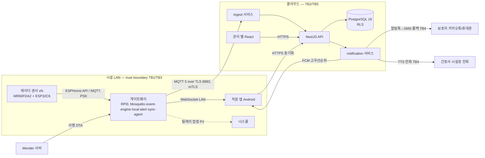
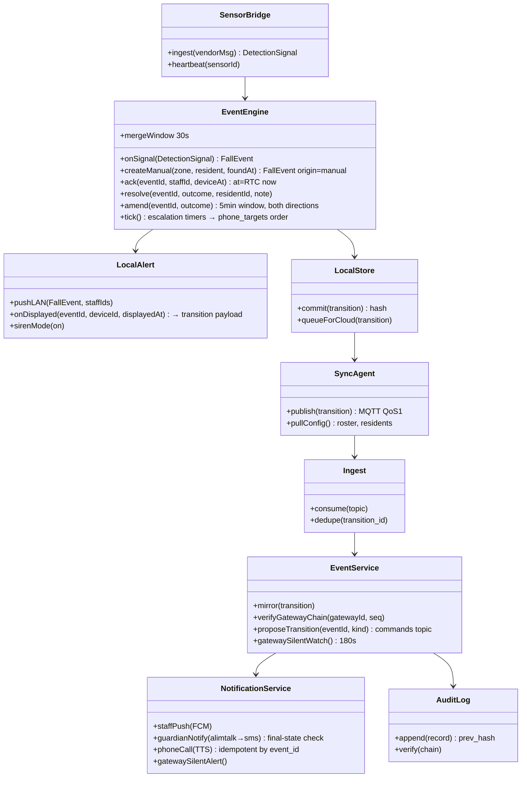
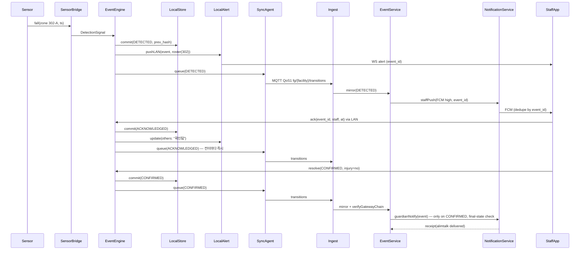
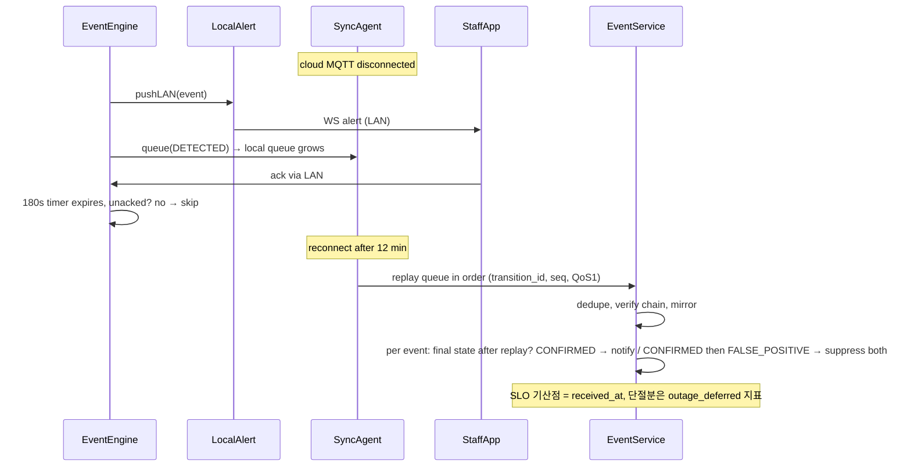
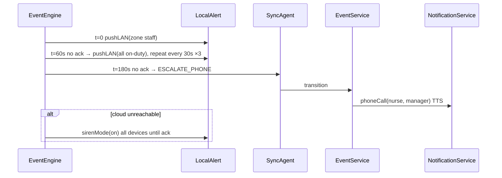
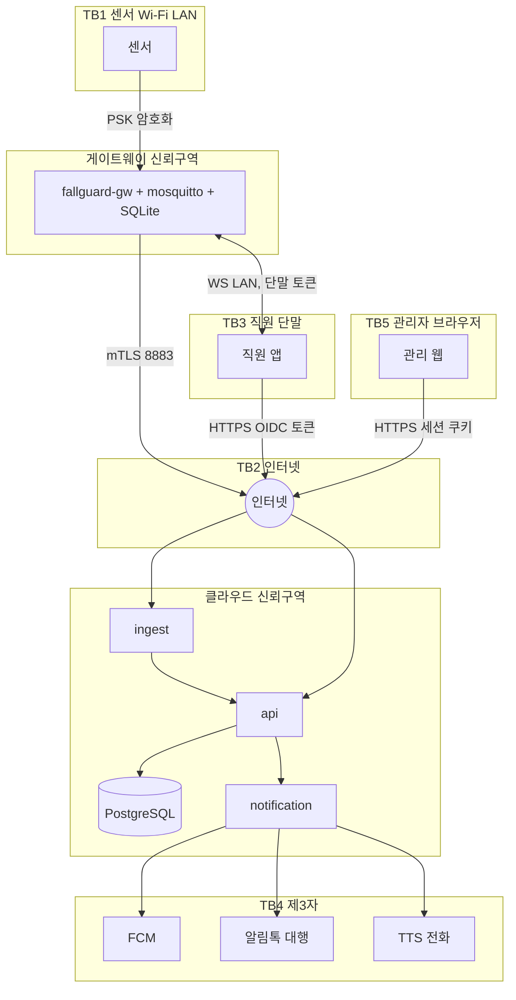

# Seed — 요양시설 낙상 감지·알림 서비스 (가칭 "FallGuard-Care")

- 원문: 요양시설 어르신 낙상을 감지해 보호자와 직원에게 알리는 서비스를 만들고 싶다.
- 서비스 유형: **복합** — IoT·엣지(낙상 감지 센서/카메라 온프레미스 게이트웨이) + AI(낙상 이벤트 판정 모델) + 관제(시설 직원용 실시간 알람 콘솔) + 모바일(보호자·직원 푸시 알림 앱) + 웹 SaaS(다시설 관리·이력 조회)
- 주 도메인 / 인접 도메인: 장기요양(요양시설) 안전 모니터링·낙상 관리 / 헬스케어 개인정보(민감정보·영상), IoT 센서 융합, 실시간 알림 메시징, 의료기기 규제 경계, 시설 운영(간호·요양보호사 근무 체계)
- 감지된 제약 (입력에서 읽히는 것만):
  - 대상 공간: 요양시설(다인실·복도·화장실 등 사생활 민감 구역 포함)
  - 대상자: 어르신(낙상 고위험군, 인지저하 가능 → 착용형 기기 이탈 가능성)
  - 알림 수신자 2계층: **직원(내부, 즉시 대응)** + **보호자(외부, 사후 통보)** — 서로 다른 채널·타이밍·내용 요구
  - 그 외 예산·기한·시설 수·기존 시스템: 없음 (A1~A2에서 채움)
- 로드할 블라인드스팟 프로파일: **P1(IoT·엣지) + P3(관제·알람) + P4(모바일) + P5(AI 판정 모델) + P2 일부(테넌시·개인정보)** + 임시 프로파일 **PX-헬스케어 안전 알림**(오탐/미탐 임계, 의료기기 해당 여부, 민감정보 최소 수집, 야간 대응 체계)

> A0 규칙: 되묻지 않는다. 부족한 정보는 A1 RECON·A2 INTERROGATE가 채운다.


---

# Recon — 요양시설 낙상 감지·알림 서비스 (FallGuard-Care)

조사 시점: 2026-09-03 · 조사 스킬: `ecc:research-ops`(근거 경계 표기) + `ecc:market-research`(경쟁 실기능·다운사이드) + `ecc:search-first`(스택 "사라/만들라" 판단)
표기 규칙: **[사실]** = 출처 있는 사실 / **[추론]** = 사실에서 도출 / **[추천]** = 이 파이프라인의 선택. 전 항목 URL·확인일(2026-09-03) 병기.

## 1. 도메인 업무 흐름 — 요양시설에서 낙상은 실제로 이렇게 처리된다

| # | 단계 | 현행 절차 [사실] | 출처 |
|---|---|---|---|
| 1 | 예방 | 시설은 검증된 도구로 수급자별 낙상위험도를 평가하고, 낙상예방 지침을 수급자·보호자에게 연 1회 이상 안내해야 한다(장기요양기관 평가 항목) | [2025 시설급여 평가매뉴얼 Q&A(carefor 게시)](https://www.carefor.co.kr/ct_att/contents_article/0/202501/45565/XkSmdrjD76.pdf) |
| 2 | 발생·발견 | 낙상은 야간·화장실·침상 주변에서 무목격 상태로 자주 발생. 발견자는 요양보호사(순회) 또는 동실 어르신 | [장기요양기관 안전관리 대응 가이드 2023.5(복지부 요양기준실)](https://www.carefor.co.kr/ct_att/contents_article/0/202305/41028/LXEHC3xulI.pdf) |
| 3 | 1차 대응 | 요양보호사는 대상자를 안정시키고 상황 확인, 통증 심하면 무리하게 움직이지 않음 → 간호(조무)사 등 응급보고체계 상위로 보고 | [DSHS 요양보호사 안전교육(한국어)](https://www.dshs.wa.gov/sites/default/files/publications/documents/22-1963KO.pdf) · [1424재가노인복지센터 응급상황 대처](https://1424care.com/%EC%9D%91%EA%B8%89%EC%83%81%ED%99%A9-%EB%8C%80%EC%B2%98-%EC%9A%94%EC%96%91%EB%B3%B4%ED%98%B8/) |
| 4 | 보호자 통보 | 가장 가까운 가족·보호자에게 사고 사실을 반드시 알린다. 경미하면 기관장 보고로 충분하며 **기관 방침에 따라 기관장이 보호자에게 연락**할 수 있다 | 상동 |
| 5 | 기록 | 상황 종료 후 사무실에서 <상태기록지> 또는 <사고보고서> 작성 — 발생 시각·상황·취한 조치를 사실 위주로 기록 | 상동 · [급여제공 지침 10가지](https://lawinus.co.kr/%EA%B8%89%EC%97%AC%EC%A0%9C%EA%B3%B5-%EC%A7%80%EC%B9%A8-10%EA%B0%80%EC%A7%80/) |
| 6 | 법적 책임 | 법원은 낙상 사고에서 요양원·원장·요양보호사의 공동 배상 책임을 인정한 사례가 있다 → "언제 감지했고 언제 대응했는지"의 **타임스탬프 증거**가 시설의 방어 자료가 된다 | [월간장기요양 판례 기사](https://www.carekim.com/news_view.jsp?ncd=3749) · [요사나모 법률 행동요령](https://m.cafe.daum.net/carelover/JDfO/877) |

**왜 "감지→알림 지연"이 핵심 지표인가 [사실]**: 낙상 후 1시간 이상 바닥에 방치되는 "long lie"는 6개월 내 사망률과 강하게 연관되고(65세 이상 125명 코호트에서 1시간 초과 방치군 절반이 6개월 내 사망), 1년 추적에서 long lie 경험자의 60%가 낙상으로 재입원했다. [BMC Geriatrics 2022 scoping review](https://bmcgeriatr.biomedcentral.com/articles/10.1186/s12877-022-03258-2) · [Physiopedia Long Lie](https://www.physio-pedia.com/Long_Lie) · [Int Emerg Nurs 2022 systematic review](https://www.sciencedirect.com/science/article/abs/pii/S1755599X22000052)
→ **[추론]** 제품의 1차 가치는 "낙상 예측"이 아니라 **바닥 체류 시간(time-on-ground) 단축**이다. SafelyYou는 AI 감지로 바닥 체류를 29.6분, 직원 도착까지 28.3분 단축했다고 보고했다. [SafelyYou 연구 블로그](https://www.safely-you.com/blog/fall-detection/)

## 2. 이해관계자 — 누가 쓰고, 누가 돈을 내는가

| 이해관계자 | 역할·요구 | 근거 |
|---|---|---|
| 요양보호사 (1차 대응자) | 야간 1인이 다수 어르신 담당. 손이 비어 있지 않음 → 알림은 **소리·진동으로 즉시**, 조작은 한 손·한 탭. 오탐이 잦으면 알림을 끈다 | [안전관리 대응 가이드](https://www.carefor.co.kr/ct_att/contents_article/0/202305/41028/LXEHC3xulI.pdf) · [유스연합 기획리포트 "위기의 요양 현장"](https://www.youthassembly.kr/news/909740) |
| 간호(조무)사 | 낙상 후 사정(assessment)·의료 판단·기록 책임. 사고보고서에 시각·상황이 필요 | 상동 |
| 시설장·사무국장 (구매 결정자, 지불자) | 평가 지표 대응, 법적 방어(대응 시각 증빙), 보호자 신뢰(민원 감소), CCTV 의무화와의 연계 | [복지부 CCTV 의무화 보도자료](https://www.mohw.go.kr/board.es?mid=a10503010100&bid=0027&act=view&list_no=376156) |
| 보호자 (외부 수신자) | "확정된 낙상"만, 신뢰할 수 있는 채널로, 조치 내용과 함께 받고 싶음. 오탐 통보는 신뢰 붕괴 | [급여제공 지침](https://lawinus.co.kr/%EA%B8%89%EC%97%AC%EC%A0%9C%EA%B3%B5-%EC%A7%80%EC%B9%A8-10%EA%B0%80%EC%A7%80/) |
| 어르신 (데이터 주체) | 사생활(침실·화장실), 착용형 기기 거부·이탈 가능(인지저하). 카메라 침실 촬영은 **전원 동의**가 법적 요건 | [복지부 보도자료](https://www.mohw.go.kr/board.es?mid=a10503010100&bid=0027&act=view&list_no=376156) · [MBC 보도](https://imnews.imbc.com/news/2023/society/article/6481428_36126.html) |
| 지자체·건보공단 | 평가·지도점검, 지자체 오픈이노베이션 사업으로 시범 도입(평택시 2026) | [평택시 AI 위험징후 포착 시스템(2026-08)](https://www.sidae.com/article/2026080315573615995) |
| 설치·운영 업체 (우리) | 센서 전원·네트워크·OTA·장애 복구 책임. 현장 출동 비용이 수익성 결정 | [Mender Pi 체크리스트](https://mender.io/blog/raspberry-pi-in-production) |

## 3. 규제·표준 — 반드시 준수해야 하는 것

| 항목 | 내용 [사실] | 우리 설계에 미치는 영향 [추론] | 출처 |
|---|---|---|---|
| 장기요양기관 CCTV 의무화 (노인장기요양보험법 시행규칙, 2023-06-22 시행) | 공동거실·침실·현관·치료실·프로그램실·식당·엘리베이터에 1대 이상. **침실은 수급자 또는 보호자 전원 동의 시에만**. 영상 **60일 경과 시 삭제**(열람 요청 시 사유 해소까지 보관). 열람 요청 후 **10일 이내 서면 통지**, **열람대장 3년 보관**. 미설치는 전원 동의서 + 지자체 신고 | 카메라 방식 채택 시 침실은 동의 없으면 불가 → 침실·화장실은 **비영상(레이더) 기본**. 낙상 클립 보관·열람은 이 규칙과 동일 정책으로 통일 | [복지부 보도자료](https://www.mohw.go.kr/board.es?mid=a10503010100&bid=0027&act=view&list_no=376156) · [복지부 영상정보처리기기 설치·운영 가이드라인 2023.5.24](https://www.carefor.co.kr/ct_att/contents_article/0/202306/44113/56VVsReMFl.pdf) · [인하대 박인환 입법평가 논문](https://ils.inha.ac.kr/bbs/ils/3464/109430/download.do) |
| 개인정보보호법 §25 고정형 영상정보처리기기 | 안내판·목적 외 이용 금지·보관기간·안전조치. 개인정보위 통합 안내서 2024-12 개정 | AI 분석 서버·클립 저장소가 "영상정보처리기기 운영자"의 수탁자가 됨 → 위탁 계약·안전성 확보조치 기준 적용 | [개인정보위 고정형 영상정보처리기기 안내서(2024.12)](https://www.privacy.go.kr/front/bbs/bbsView.do?bbsNo=BBSMSTR_000000000049&bbscttNo=20779) · [찾기쉬운 생활법령](https://www.easylaw.go.kr/CSP/CnpClsMain.laf?csmSeq=1257&ccfNo=2&cciNo=3&cnpClsNo=3) |
| 개인정보 안전성 확보조치 기준 (2024-10 안내서) | 접근권한 관리·접근기록 보관·암호화·백업 의무 | 건강정보(낙상 이력)는 **민감정보** → 접근기록 2년 보관, 저장 암호화, 접근권한 최소화 | [개인정보 안전성 확보조치 기준 안내서 2024.10](https://business.cch.com/CybersecurityPrivacy/KoreanGuidetotheStandardsforEnsuringtheSafetyofPersonalInformationOctober2024.pdf) |
| 의료기기 해당 여부 (식약처) | SaMD는 "질병의 진단·치료·예방·관리 목적"이면 의료기기. 식약처는 "소프트웨어 의료기기 해당 여부 자주 묻는 사례"를 공개. 낙상 **감지·알림(안전 관리)** 은 진단·치료 목적이 아니면 비의료기기로 볼 여지가 있으나 **확정 아님** — "낙상 위험 예측·재활 개입"까지 표방하면 경계가 바뀐다 | **[가능성]** 1차 범위를 "안전 알림"으로 한정하고 의학적 판단 문구(진단·치료·위험도 산출)를 제품·마케팅에서 제거. 정식 출시 전 식약처 **해당 여부 질의(민원)** 를 착수 조건으로 둔다 | [식약처 SW 의료기기 해당 여부 FAQ](https://mfds.go.kr/brd/m_99/down.do?brd_id=ntc0021&data_tp=A&file_seq=2&seq=46453) · [디지털의료기기SW 허가·심사 가이드라인(KHIDI 게시)](https://www.khidi.or.kr/board/view?pageNum=3&rowCnt=20&menuId=MENU01502&maxIndex=00489320239998&minIndex=00489105729998&schType=0&schText=&categoryId=&continent=&country=&upDown=0&boardStyle=&no1=2448&linkId=48929657) · 참고(미국): [FDA PJO "fall prevention alarm/sensor" 분류](https://www.accessdata.fda.gov/scripts/cdrh/cfdocs/cfpcd/classification.cfm?id=PJO) |
| 장기요양기관 평가 (2025 시설급여) | 낙상위험도 평가 도구 사용·낙상예방 안내(연 1회) 항목 존재 | 제품 이력(낙상 건수·대응 시간)을 평가 증빙으로 내보내는 리포트가 구매 동기 | [2025 시설급여 평가매뉴얼 Q&A](https://www.carefor.co.kr/ct_att/contents_article/0/202501/45565/XkSmdrjD76.pdf) |
| 알림 채널 규제 | 카카오 알림톡은 인증 대행사(솔라피·NHN Cloud 등)를 통해서만 발송, 템플릿 사전 심사 | 보호자 통보 문구는 템플릿 심사 통과형으로 고정. 긴급 직원 알림은 알림톡이 아닌 앱 푸시+전화 | [Solapi 가격](https://solapi.com/pricing) · [NHN Cloud 카카오 비즈메시지](https://www.nhncloud.com/kr/service/notification/kakaotalk-bizmessage?lang=ko) |
| 모바일 OS 긴급 알림 | iOS Critical Alerts는 Apple 승인 entitlement 필요(건강·안전 용도 한정), 사용자 동의도 별도. Android는 채널 `setBypassDnd(true)` + full-screen intent | 직원 앱은 **Android 우선**(승인 불필요), iOS는 entitlement 신청을 착수 조건으로 | [Apple Critical Alerts 문서](https://developer.apple.com/documentation/bundleresources/entitlements/com.apple.developer.usernotifications.critical-alerts) · [PagerTree 해설](https://pagertree.com/blog/critical-alerts-for-ios-and-iphone) · [Android 구현 글](https://medium.com/@surendar1006/implementing-critical-alerts-on-android-aa49b4d75705) |

## 4. 유사 솔루션 — 실제 기능 범위 (마케팅 문구 아님)

| 솔루션 | 센서 | 실제 기능 [사실] | 강점 / 약점 | 출처 |
|---|---|---|---|---|
| **SafelyYou** (미, 상용) | 벽면 카메라 + 클라우드 AI | 낙상 감지 → 직원 기기·너스콜로 알림, 낙상 클립만 저장(비낙상 영상 60초 내 삭제, 음성 없음), Discover 포털로 원인 분석·케어플랜. 바닥체류 −29.6분 실증 | 강점: 원인분석·재발방지 루프 / 약점: 카메라 → 국내 침실은 전원 동의 필요, 클라우드 영상 전송 | [How It Works](https://www.safely-you.com/safelyyou-safety-ai/) · [AJMC 연구](https://www.ajmc.com/view/safelyyou-new-research-reveals-safelyyous-aienabled-fall-detection-reduces-need-for-emergency-service-care-in-dementia-care-facilities) · [NIA 소개](https://www.nia.nih.gov/news/nia-funded-small-business-spotlight-safelyyou-trains-ai-improve-care-older-adults) |
| **Vayyar Care** (이스라엘, 상용) | 4D 이미징 레이더(천장/벽) | 카메라 없이 낙상(대·소)·재실·이동성·화장실 방문 감지, 습기·조명 무관, 너스콜/플랫폼(K4Connect) 연동 | 강점: 사생활 무해, 화장실 설치 가능 / 약점: 사후 원인 확인용 영상 없음, 단가 높음 | [Vayyar How](https://vayyar.com/care-pages/how/) · [K4Connect 파트너십](https://www.k4connect.com/k4connect-and-vayyar-care-partner-to-bring-next-level-radar-fall-detection-technology-to-the-senior-living-industry/) · [2026 리뷰](https://elderlivinghub.com/reviews/vayyar-care-review/) |
| **Inspiren AUGi** (미, 상용) | 벽면 AI 비전(스틱피겨 처리) | 선명 영상 저장·표시 없음(스틱피겨+배경 블러), HIPAA 준수, 낙상 위험 행동 감지, PointClickCare 연동. 6개월 파일럿 400건 "save" | 강점: 영상 없이 시각적 맥락 제공 / 약점: 미국 EHR 생태계 종속 | [Aegis Living](https://www.aegisliving.com/services/inspirens-augi-smart-fall-management-technology/) · [PointClickCare 마켓](https://marketplace.pointclickcare.com/s/partner-app/aFC5G00000003lVWAQ/inspiren-augi) |
| **Nobi 스마트램프** (벨기에, 상용) | 천장 램프 일체형 광학 센서 | 낙상 감지 + 기상 시 자동 조명(예방), 80개 시설 800대에서 낙상 31%↓·대응 3분56초 | 강점: 예방+감지 결합 / 약점: 조명 교체 공사 | [McKnight's](https://www.mcknightsseniorliving.com/news/next-gen-lamps-combine-smart-lighting-and-passive-monitoring-for-fewer-senior-falls-incidents/) · [Healthcare Brew 2026-04](https://www.healthcare-brew.com/stories/2026/04/22/nobi-smart-lights-detecting-patient-falls) |
| **국내: 스페이스뱅크(부천·의왕시립요양원, 2026-06) · 인지니어스(60GHz 레이더) · 사이렌케어** | mmWave 레이더 / AI 카메라 | 레이더 기반 비접촉 낙상·기상·침대이탈·재실 감지, AIoT 관제 플랫폼. 평택시립요양원 2026-08 시범 호실 운영 | 강점: 국내 레퍼런스·지자체 사업 / 약점: 공개된 정확도 수치 없음 | [전자신문 2026-06-19](https://www.etnews.com/20260619000001) · [인지니어스](http://www.inzinious.com/) · [사이렌케어](https://bighavesolution.com/sirencare/index.html) · [평택시](https://www.sidae.com/article/2026080315573615995) |
| **오픈소스: YOLOv8-Pose 낙상 감지 리포** | 카메라 + 포즈 키포인트 | 17 COCO 키포인트 → 바운딩박스 종횡비/키포인트 각도로 낙상 판정. 데모 수준, 야간·가림·다인실 검증 없음 | 강점: 무료·엣지 실행(Jetson TensorRT 13ms/frame) / 약점: 프로덕션 검증 0, Ultralytics AGPL-3.0 | [16dina/fall-detection](https://github.com/16dina/fall-detection) · [andmydignity/fall_detection_yolov8s](https://github.com/andmydignity/fall_detection_yolov8s) · [arXiv 2603.29777 엣지 행동감지](https://arxiv.org/pdf/2603.29777) |

**정확도 현실 [사실]**: 연구 환경 레이더 민감도 97%/특이도 90~92%, 비전 민감도 71~100%/특이도 73~97%로 폭이 넓다. 실제 아파트 10곳 2년 실증(Skubic)에서 "오경보 없는 견고한 낙상 감지는 여전히 큰 도전"으로 결론. [PMC 레이더 센서](https://pmc.ncbi.nlm.nih.gov/articles/PMC5746778/) · [Sensors 2025 systematic review](https://www.mdpi.com/1424-8220/25/21/6540) · [Skubic 실환경 보고서](https://c2ship.missouri.edu/wp-content/uploads/2024/01/Skubic-Fall-detection-Final.pdf) · [JAMDA 2024 리뷰](https://www.jamda.com/article/S1525-8610(24)00752-7/pdf)
→ **[추론]** 단일 센서로 오탐 0은 불가능. 제품은 **"감지 → 직원 확인(confirm) → 보호자 통보"의 2단계 확정 구조**여야 하고, 오탐률 자체를 핵심 KPI로 관리해야 한다.

## 5. 스택 후보 — `ecc:search-first` 판단 (Adopt / Extend / Build)

| 영역 | 후보 | 판단 | 근거·트레이드오프 | fit |
|---|---|---|---|---|
| 낙상 감지 센서 (침실·화장실) | **60GHz mmWave 레이더 모듈** (Seeed MR60FDA2 $24.90, XIAO ESP32C6 동봉, 낙상·재실·설치높이·민감도 설정, ESPHome 펌웨어) | **Adopt(파일럿)** → 양산 시 산업용 모듈로 교체 검토 | 카메라 없이 침실 동의 문제 회피. 정량 정확도 미공개 → 파일럿 실측 필수 | 높음(규제·사생활 매칭) — [Seeed 제품](https://www.seeedstudio.com/MR60FDA2-60GHz-mmWave-Sensor-Fall-Detection-Module-p-5946.html) · [Hackster 소개](https://www.hackster.io/news/seeed-adds-home-assistant-ready-breathing-fall-detection-sensors-to-its-mmwave-range-c97eeb97b8d9) |
| 낙상 감지 센서 (공용 공간) | 기존 의무 CCTV 스트림 + 엣지 포즈 추론 (YOLO-Pose, TensorRT) | **Extend** — 기존 CCTV 재활용, 모델은 오픈 가중치 + 자체 파인튜닝 | 이미 설치된 CCTV(법정 의무) 활용 → 추가 HW 최소. Ultralytics AGPL-3.0 → 상용 배포 시 Enterprise 라이선스 또는 Apache 모델(RTMPose) 검토 | 중간(라이선스 리스크) — [Hackster YOLOv8-Pose 낙상](https://www.hackster.io/zhangygfw/yolov8-pose-based-fall-detection-for-public-spaces-or-elderl-2346c0) |
| 엣지 게이트웨이 | NVIDIA Jetson Orin Nano(비전 포함 시) / Raspberry Pi 5(레이더만) | Adopt | Jetson: TensorRT 포즈 13~21ms/frame 실측. Pi5: 레이더 이벤트만이면 충분 | 높음 — [arXiv 2603.29777](https://arxiv.org/pdf/2603.29777) |
| 메시지 브로커 | **Eclipse Mosquitto**(EPL/EDL, 단일 노드 오픈소스) vs EMQX 5.9+(BSL 1.1, 단일노드 무료·클러스터 유료, "타사 호스팅/임베디드 제공" 제한) | **Adopt Mosquitto** (시설당 1노드) | 시설 단위 수십 센서 규모에 클러스터 불필요. EMQX BSL 제한은 우리가 시설에 임베드 배포하는 모델과 충돌 가능 | 높음 — [EMQX BSL 공지 2025-05](https://www.emqx.com/en/news/emqx-adopts-business-source-license) · [EMQX 라이선스 FAQ](https://www.emqx.com/en/content/license-faq) |
| 백엔드 | **NestJS(TypeScript)** + **PostgreSQL 16** (TimescaleDB 확장은 보류) | Adopt | 이벤트·알림·감사로그는 관계형으로 충분. 시계열 볼륨(시설당 이벤트 <1만/일)에 Timescale 불필요 → YAGNI | 높음 |
| 직원 긴급 알림 | Android 앱 + FCM 고우선순위 + `setBypassDnd` 채널 + full-screen intent; iOS는 Critical Alerts entitlement 신청 | Adopt(FCM/APNs) | 자체 푸시 인프라 만들지 않음. FCM 미도달 대비 **전화(TTS) 폴백** | 높음 — [Apple 문서](https://developer.apple.com/documentation/bundleresources/entitlements/com.apple.developer.usernotifications.critical-alerts) |
| 보호자 통보 | **카카오 알림톡 (Solapi 또는 NHN Cloud)** → 실패 시 SMS 폴백 | Adopt(대행사) | 건당 약 8원, 템플릿 사전 심사. 직접 카카오 API 불가 | 높음 — [Solapi](https://solapi.com/pricing) · [Omago 단가 해설](https://www.omago.ai/ko/blog/kakaotalk-message-pricing-logic) |
| 전화 폴백 | 국내 음성 API(NHN Cloud/네이버 클라우드 SENS 계열) 또는 Twilio | Adopt | 야간 무응답 에스컬레이션용. 벤더는 A4에서 확정 | 중간 |
| 너스콜 연동 | 시설별 기존 너스콜(건식 접점/릴레이) | Extend(릴레이 출력) | 국내 시설 너스콜은 표준 프로토콜 부재 → 접점 신호가 가장 범용 | 중간 |
| OTA·디바이스 관리 | Mender(오픈소스) 또는 balena | Adopt | A/B 파티션·서명·롤백 기본 제공. 자체 구축 금지 | 높음 — [Mender](https://mender.io/blog/raspberry-pi-in-production) |

**"만들지 말고 사라" 결론 [추천]**: 감지 센서·브로커·푸시·알림톡·OTA는 전부 기존 도구 채택. **우리가 만드는 것은** ①센서 이벤트를 "확정 낙상"으로 승격시키는 **알림 상태기계·에스컬레이션 정책**, ②직원 확인 앱, ③보호자 통보·이력·평가 리포트, ④시설별 온프레미스 게이트웨이 형상 — 이 넷뿐이다.

## 6. 미확인·다운사이드 (market-research 게이트)

- 국내 레이더 솔루션들의 **실환경 민감도·오탐률 미공개** → 파일럿에서 자체 실측 필요 (A6 테스트 설계에 실측 프로토콜 포함).
- 식약처 의료기기 해당 여부는 **미확정** → 착수 조건(질의 민원)으로 register에 기록.
- 시설의 네트워크 품질(Wi-Fi 음영·인터넷 단절)은 **미확인** → 온프레미스 우선 설계 + 오프라인 동작 필수.
- 요양보호사의 **알림 피로(alarm fatigue)** 는 정성 근거만 있고 국내 정량 데이터 없음 → 오탐률 KPI와 "묵음 임계" 설계로 대응.


---

# 블라인드스팟 레지스터 — FallGuard-Care (요양시설 낙상 감지·알림)

스캔: 공통 10축 + STRIDE 6범주 + 프로파일 P1(10)·P2(6)·P3(6)·P4(5)·P5(6) + 임시 프로파일 PX-헬스케어 안전알림(6) = **55항목** (Asked 5 · Clear 6 · Assumed 44)
모드: **오토파일럿(무응답)** — 질문 배치는 제시하되 각 문항의 (추천) 옵션을 자동 채택하고 `Assumed(무응답)`로 마킹.
Impact 판단 보강: `ecc:product-lens` Mode 1(Product Diagnostic) 7문항을 먼저 돌려 "왜 만드는가"를 고정한 뒤 질문을 승격했다.

## 0. Product Diagnostic (ecc:product-lens Mode 1 — 질문 승격의 Impact 기준)

| # | 질문 | 답 (근거: 01-recon) |
|---|---|---|
| 1 | 누구를 위한 것인가 | **야간 근무 요양보호사 1명**(다수 어르신 담당, 손이 비어 있지 않음)과 **시설장**(법적 방어·평가 대응). 보호자는 2차 수신자 |
| 2 | 고통은 무엇인가 (정량) | 무목격 낙상 → 바닥 방치(long lie ≥1h)는 6개월 사망률·재입원(60%)과 직결. 현재는 순회 간격(수십 분~시간)에 의존 |
| 3 | 왜 지금인가 | ①2023-06 CCTV 의무화로 시설에 영상 인프라·동의 절차가 이미 존재 ②$25 60GHz 레이더 모듈 상용화 ③지자체 AI 돌봄 시범사업(평택 2026-08, 부천·의왕 2026-06) |
| 4 | 10점짜리 버전 | 낙상 전 위험 행동(침대 이탈·야간 배회) 예측 + 자동 조명 + 원인 분석 케어플랜 (Nobi+SafelyYou 결합) |
| 5 | MVP (논지를 증명하는 최소) | 침실·화장실 레이더 감지 → 직원 앱 긴급 알림 → 직원 확인(확정/오탐) → 확정 시 보호자 알림톡 → 사고 이력 리포트. **"감지→직원 도착 시간"이 순회 대비 단축됨을 파일럿 1개 시설에서 증명** |
| 6 | 안티골 | 낙상 예측·위험도 산출(의료기기 경계), 상시 영상 스트리밍, 착용형 기기, 너스콜 교체, 요양 EMR 기능 |
| 7 | 작동 여부 판정 지표 | 감지→직원 확인 중앙값 ≤ 3분(Nobi 3분56초 벤치마크 대비), 오탐률(직원이 "오탐" 처리한 비율) ≤ 30%/주 이하로 수렴, 파일럿 기간 알림 미도달 0건(합격선; 운영 SLO는 07의 99.5%) |

Go/No-go: **Go** — 단, 5번 MVP 범위 밖으로 확장하면 의료기기 규제와 카메라 동의 문제가 동시에 켜진다.

## 1. 전수 마킹 표

| 축/항목 | 상태 | 처리 | 근거·출처 |
|---|---|---|---|
| **공통 1. 기능 범위·행동** | Partial | **Asked → Q1, Q5** (센서 방식·규제 포지셔닝) + non-goal은 Diagnostic 6번으로 Clear | seed + recon §4 |
| 공통 2. 도메인·데이터 모델 | Partial | Assumed: 엔티티 = 시설/구역(Zone)/센서/수급자(Resident)/직원/보호자/낙상이벤트(FallEvent)/알림(Notification)/확인기록(Ack). 이벤트 볼륨 시설당 <1만/일. 식별자 UUIDv7, 시각 UTC | recon §5 백엔드 판단 |
| 공통 3. 상호작용·UX 플로우 | Partial | Assumed: 직원 앱 = 알림 수신→한 탭 확인→도착→결과 입력(3화면). 관리 웹 = 이벤트 이력·리포트·설정. 보호자 = 앱 없음(알림톡 수신만) | recon §2 요양보호사 요구; ux-principles L-03·L-10 |
| 공통 4. 비기능 품질 | Partial | Assumed: 감지→직원 단말 알림 p95 ≤ 10초(LAN), 오프라인(인터넷 단절) 시에도 직원 알림 동작, 가용성 SLO 99.5%/월(알림 경로), 민감정보 암호화 | recon §1 long lie 근거; A7에서 SLO 확정 |
| 공통 5. 통합·외부 의존성 | Partial | Assumed: FCM/APNs·알림톡 대행사·음성 API 장애 시 채널 폴백(푸시→전화→SMS). 너스콜 연동은 MVP 제외 | recon §5 |
| 공통 6. 엣지케이스·실패 처리 | Missing | Assumed: 동일 구역 30초 내 중복 감지는 1건으로 병합, 확인 없는 알림은 에스컬레이션, 센서 오프라인은 별도 알람, 다인실은 구역 단위 알림(개인 식별 불가 전제) | P3 알람 폭주 기본값; A3 엣지케이스 표 |
| 공통 7. 제약·트레이드오프 | Missing | **Asked → Q2** (배포 형상). 예산·기한·팀 역량은 미상 → Assumed: 3인 팀(백엔드·모바일·임베디드) 파일럿 1시설 3개월 | 사용자 입력에 제약 없음 |
| 공통 8. 용어·일관성 | Missing | Assumed(용어집 고정): 감지(Detection, 센서 원신호) / 낙상 이벤트(FallEvent, 병합·승격된 후보) / 확인(Ack, 직원이 봤음) / 확정(Confirmed, 실제 낙상) / 오탐(FalsePositive) / 통보(보호자 알림) / 에스컬레이션 | A3·A5에서 동일 용어만 사용 |
| 공통 9. 완료 신호 | Missing | Assumed: 파일럿 1시설에서 SC-001~008 전부 pass 시 완료 (A3 성공기준) | spec-kit SC 원칙 |
| 공통 10. 비용·라이선스 | Partial | Assumed: 시설당 HW ≈ 레이더 25$×방 수 + 게이트웨이 1대, 알림톡 8원/건, Ultralytics AGPL 회피(레이더 우선), Mosquitto EPL/EDL, Mender 오픈소스 | recon §5 |
| **STRIDE-S Spoofing** | Missing | Assumed: 센서·게이트웨이는 기기별 X.509(mTLS), 직원 앱은 OIDC + 기기 바인딩, 보호자 통보는 발신 전용(수신 인증 불필요) | P1 디바이스 신원 기본값 |
| STRIDE-T Tampering | Missing | Assumed: 이벤트·확인 기록은 append-only + 해시체인(법적 증거용), MQTT는 TLS, OTA 서명 검증 | recon §1 법적 책임 |
| STRIDE-R Repudiation | Missing | Assumed: 누가·언제 확인/확정/통보했는지 감사로그 2년 보관(민감정보 접근기록 기준), 알림 발송·도달 영수증 저장 | 개인정보 안전성 확보조치 기준 |
| STRIDE-I Information Disclosure | Missing | Assumed: 영상 미사용(레이더) → 낙상 이벤트는 "구역·시각·결과"만. 보호자 통보에 타 수급자 정보 0. 저장 암호화, 접근권한 역할 기반 | CCTV 규칙·개인정보법 §25 |
| STRIDE-D Denial of Service | Missing | Assumed: 알림 경로는 인터넷 단절과 독립(LAN 내 MQTT→앱 로컬 소켓), 알림 폭주 시 병합·레이트리밋, 게이트웨이 watchdog | P1·P3 기본값 |
| STRIDE-E Elevation of Privilege | Missing | Assumed: 역할 = 요양보호사/간호사/시설관리자/본사운영자, 시설 간 tenant 격리 강제 필터, 설정 변경은 관리자만 | P2 테넌시 기본값 |
| **P1. SD카드 마모** | Missing | Assumed: 게이트웨이 log2ram + noatime + 이벤트는 즉시 서버 전송, 로컬 링버퍼는 tmpfs | Mender/dzombak |
| P1. 전원 차단 | Missing | Assumed: read-only rootfs + 쓰기 구역 tmpfs, 소형 UPS는 P2 | Mender |
| P1. 자가 복구 | Missing | Assumed: HW watchdog(≤15초) + systemd Restart=always, 센서(ESP32)는 브라운아웃 리셋 | Mender |
| P1. OTA 업데이트 | Missing | Assumed: Mender A/B + 서명 + 자동 롤백 + 시설 단위 단계 배포. 센서 펌웨어는 ESPHome OTA(게이트웨이 경유) | AWS IoT Lens |
| P1. 시계 드리프트 | Missing | Assumed: 게이트웨이 NTP(시설 인터넷) + RTC 모듈(단절 대비, 타임스탬프가 법적 증거이므로 필수) | P1 기본값 + recon §1 |
| P1. 디바이스 신원 | Missing | Assumed: 게이트웨이 X.509 개별, 센서는 게이트웨이 로컬 LAN 내 PSK(ESPHome API 암호화) — 센서 단독 인터넷 접속 금지 | IoT Lens IOTSEC |
| P1. 연결 끊김 | Missing | Assumed: 게이트웨이↔클라우드 단절 시 로컬 알림 계속, 이벤트 로컬 큐(상한 10만 건) 후 순서 보장 재전송 | P1 기본값 |
| P1. 영상 스트림 | Clear(해당없음) | MVP는 레이더 전용 → 스트림 없음. 비전 2단계 시 재검토 | Q1 채택 결과 |
| P1. 원격 접근 | Missing | Assumed: 게이트웨이→클라우드 아웃바운드 상시 연결(MQTT over TLS 8883/WSS), 포트포워딩 금지 | P1 기본값 |
| P1. 프로비저닝 | Missing | Assumed: 이미지에 클레임 토큰 → 첫 접속 시 시설 바인딩·인증서 발급, 센서는 게이트웨이 웹UI에서 방 배정 | IoT Lens IOTOPS 3 |
| **P2. 테넌시** | Missing | Assumed: facility_id 행 격리 + 전 쿼리 강제 필터(RLS), 법인 단위 상위 그룹은 P2 | P2 기본값 |
| P2. 인증 | Missing | Assumed: 직원·관리자 = 이메일/전화 + 비밀번호(argon2) + 기기 등록, SSO 미지원 | P2 기본값 |
| P2. 결제·구독 | Clear(해당없음) | MVP 파일럿은 무상/계약. 과금은 non-goal | Diagnostic 5 |
| P2. 백업·DR | Missing | Assumed: PostgreSQL 일 1회 + WAL 15분 아카이브, RPO ≤ 15분·RTO ≤ 1h(클라우드), 복원 리허설 분기 1회, 오프사이트 (03 NFR-005 상수 표와 동일) | P2 기본값 |
| P2. 개인정보 | Missing | Assumed: 수집 = 수급자 이름·방 번호·보호자 연락처·낙상 이력(민감정보). 보존 = 이벤트 3년(열람대장 3년 기준과 정렬), 퇴소 후 파기. 동의서 템플릿 제공 | 복지부 CCTV 규칙·개인정보법 |
| P2. 이메일/알림 | Missing | Assumed: 알림톡 실패→SMS 폴백, 대행사 큐·재시도, 발송 영수증 저장 | recon §5 |
| **P3. 폐쇄망** | Missing | Assumed: 시설 인터넷 존재 전제(알림톡·푸시 필요). 단절 시 LAN 내 직원 알림은 유지 — 완전 폐쇄망은 non-goal | recon §6 미확인 |
| P3. 실시간성 | Missing | Assumed: 감지→직원 단말 표시 p95 ≤ 10초, 알림 경로는 일반 텔레메트리와 별도 토픽·우선 처리 | P3 기본값 |
| P3. 알람 폭주 | Missing | Assumed: 구역당 30초 병합창, 미확인 알림은 재알림(30초 간격 최대 3회) 후 에스컬레이션, 센서 오프라인은 "장비 알람"으로 분리 | P3·SRE |
| P3. 프로토콜 | Missing | Assumed: 센서↔게이트웨이 ESPHome native API 또는 MQTT, 게이트웨이↔클라우드 MQTT 5, 너스콜은 P2 릴레이 접점 | recon §5 |
| P3. 이력 증가 | Missing | Assumed: 원시 감지 30일, 낙상 이벤트·확인·통보 3년, 월별 파티셔닝 | P3 기본값 |
| P3. 무중단 | Missing | Assumed: 게이트웨이 업데이트는 주간·낮 시간대 창, 업데이트 중 센서 로컬 부저(옵션) — 공백 ≤ 2분 허용 | P3 기본값 |
| **P4. 오프라인** | Missing | Assumed: 직원 앱은 LAN 내 게이트웨이 소켓 + FCM 이중 수신, 오프라인 쓰기(확인)는 로컬 큐 후 동기화, **권위 시각 = 게이트웨이 수신 시각(RTC)**, 단말 탭 시각은 보조 필드, 선착 확인자 우선 | P4 기본값, 03 B-3 |
| P4. 스토어 심사 | Missing | Assumed: Android 우선 + 시설 배포는 관리형 Play(사내앱) 또는 APK 사이드로드, iOS는 Critical Alerts 승인 후 2단계 | recon §3 |
| P4. 강제 업데이트 | Missing | Assumed: 최소 지원 버전 API + soft/hard 게이트 | P4 기본값 |
| P4. 미디어 용량 | Clear(해당없음) | 영상·사진 업로드 없음(레이더). 사고 사진 첨부는 P2 | Q1 |
| P4. 기기 분실 | Missing | Assumed: 시설 공용 단말 전제, 토큰 12h 만료 + 서버측 세션 폐기 + 원격 로그아웃 | P4 기본값 |
| **P5. 환각/오판** | Partial | **Asked → Q3** (보호자 통보 확정 정책) — 오탐이 보호자에게 가면 신뢰 붕괴 | recon §4 정확도 현실 |
| P5. 비용 상한 | Clear(해당없음) | LLM 미사용. 레이더 판정은 센서 펌웨어 + 게이트웨이 규칙 | recon §5 |
| P5. 프롬프트 인젝션 | Clear(해당없음) | LLM 미사용 | — |
| P5. 평가셋 | Missing | Assumed: 파일럿 시설에서 실측 세트(연기 낙상 50회 + 일상 동작 200회) 동결, 펌웨어/임계 변경 시 회귀 | recon §6; A6 실측 프로토콜 |
| P5. 모델 교체 | Missing | Assumed: 센서 벤더 교체 가능하도록 "감지 이벤트" 스키마를 벤더 중립으로 고정 | recon §5 양산 시 교체 |
| P5. PII | Clear | 외부 AI API 전송 없음. 알림톡에는 수급자 이름 대신 관계 호칭("어머님") 사용 옵션 | 개인정보 최소화 |
| **PX. 의료기기 경계** | Missing | **Asked → Q5** | recon §3 |
| PX. 오탐/미탐 임계 | Missing | Assumed: 미탐(놓침)이 오탐보다 비싸다 → 민감도 우선 설정, 오탐은 직원 확인 단계로 흡수. 목표 오탐률 ≤ 30%/주 이하, 미탐 = 파일럿 연기 낙상 50회 중 ≤ 2회 | recon §4·§6 |
| PX. 다인실 개인 식별 | Missing | Assumed: 레이더는 개인 식별 불가 → 알림은 "구역(방 번호·침상 구역)" 단위, 직원이 현장에서 대상 지정 | 레이더 특성 |
| PX. 야간 대응 체계 | Missing | **Asked → Q4** (에스컬레이션 타이밍) | recon §2 |
| PX. 사고보고서 정합 | Missing | Assumed: 확정 이벤트에서 <사고보고서> 초안(시각·구역·확인자·조치)을 PDF로 생성, 평가 증빙 리포트 월간 | recon §1 5·§3 평가 |
| PX. 침실·화장실 설치 동의 | Missing | Assumed: 레이더는 영상 아님 → CCTV 침실 전원 동의 규칙 직접 적용 대상 아님. 다만 개인정보 수집 동의(수급자·보호자)는 별도 서식. 법률 검토는 착수 조건 | recon §3 [가능성] |

미마킹 축: **0** (49/49).

## 2. 질문 배치 (최대 5) — 제시 2026-09-03 (오토파일럿: 무응답 → 추천안 자동 채택)

### Q1. 낙상 감지 센서를 무엇으로 시작할까? (틀리면: 하드웨어 재구매·동의 절차 전면 재설계)
| 옵션 | 내용 | 근거·트레이드오프 |
|---|---|---|
| **A (추천)** | **60GHz mmWave 레이더 전용** — 침실·화장실·복도. 카메라 없음 | 침실 CCTV 전원 동의 문제 회피, 화장실 설치 가능(Vayyar 실증), $25 모듈로 파일럿 가능, AGPL 회피. 단점: 사후 확인용 영상 없음, 개인 식별 불가 |
| B | 레이더 + 기존 의무 CCTV(공용공간)에 엣지 포즈 추론 | 추가 HW 최소지만 비전 파이프라인(Jetson·모델 라이선스·영상 위탁 계약)이 MVP를 2배로 키움 |
| C | 카메라 전용(SafelyYou 방식) | 원인 분석 가능하나 침실 전원 동의 필수, 클라우드 영상 전송 → 국내 규제 부담 최대 |
→ 답: **무응답 → A Assumed(무응답)**. 비전은 P2 로드맵.

### Q2. 배포 형상은? (틀리면: 아키텍처 재작업)
| 옵션 | 내용 | 근거·트레이드오프 |
|---|---|---|
| **A (추천)** | **하이브리드** — 시설 게이트웨이(감지 병합·직원 LAN 알림·로컬 큐) + 클라우드(보호자 통보·이력·다시설 관리) | 인터넷 단절에도 직원 알림 유지(안전 경로 독립), 다시설 확장 가능. 단점: 두 런타임 운영 |
| B | 완전 클라우드(센서→인터넷 직결) | 단순하지만 인터넷 단절 = 알림 전면 중단 → 안전 서비스로 부적합 |
| C | 완전 온프레미스(시설별 서버) | 폐쇄망 가능하나 알림톡·푸시 불가, 시설마다 운영 부담 |
→ 답: **무응답 → A Assumed(무응답)**.

### Q3. 보호자 통보는 언제 보낼까? (틀리면: 오탐 통보로 신뢰 붕괴 또는 통보 누락 민원)
| 옵션 | 내용 | 근거·트레이드오프 |
|---|---|---|
| **A (추천)** | **직원이 현장 확인 후 "확정 낙상"으로 표시한 건만** 알림톡 발송. 확인이 15분 이상 없으면 시설관리자에게만 알림 | 현행 절차(기관장 판단 후 보호자 연락)와 동일. 오탐이 보호자에게 가지 않음. 단점: 직원이 확정을 미루면 통보 지연 |
| B | 감지 즉시 보호자 자동 통보 | 빠르지만 오탐률 10~30% 환경에서 보호자 신뢰 붕괴 |
| C | 시설별 설정(즉시/확정 후) | 유연하나 MVP에 설정 분기 추가(YAGNI) |
→ 답: **무응답 → A Assumed(무응답)**.

### Q4. 직원이 알림을 확인하지 않으면 얼마 만에 누구에게 올릴까? (틀리면: 야간 미대응 = long lie)
| 옵션 | 내용 | 근거·트레이드오프 |
|---|---|---|
| **A (추천)** | **담당 구역 직원 → 60초 미확인 → 근무 중 전 직원 → 추가 120초 미확인 → 간호사·시설장 전화(TTS)** | Nobi 실증 대응 3분56초를 상한 기준으로 3분 내 사람 도달. 야간 1인 근무 시 2단계가 즉시 전화로 이어짐 |
| B | 담당자 단일 알림 + 5분 후 관리자 | 단순하나 5분은 야간 1인 근무에서 너무 김 |
| C | 즉시 전원 동시 알림 | 가장 빠르나 낮 시간 알림 피로·오탐 확산 |
→ 답: **무응답 → A Assumed(무응답)**.

### Q5. 제품을 어느 규제 포지션으로 낼까? (틀리면: 의료기기 인허가 경로로 출시 지연 6~12개월 또는 무허가 판매 리스크)
| 옵션 | 내용 | 근거·트레이드오프 |
|---|---|---|
| **A (추천)** | **"낙상 안전 알림 장치"(비의료기기 전제)** — 진단·치료·위험도 산출 문구 금지, 출시 전 식약처 해당 여부 질의 | 식약처 SaMD 정의(질병 진단·치료·예방·관리)와 거리 두기. 위험 예측은 non-goal |
| B | 낙상 위험 예측 포함 → 의료기기 인허가 경로 | 차별화되나 인허가·GMP·임상 근거 필요 |
→ 답: **무응답 → A Assumed(무응답)**.

## 3. 반영 기록

- Q1 답(A) → 01-recon §5 센서 판단 확정, P1 영상 스트림·P4 미디어 축 "해당없음", A4 엣지 = Raspberry Pi 5급(Jetson 불필요) (decision-log #D-004, #D-006)
- Q2 답(A) → A4 컨텍스트 다이어그램 2계층(게이트웨이/클라우드), A7 배포 2런타임 (decision-log #D-007)
- Q3 답(A) → A3 FR-006 보호자 통보 조건, A5 `POST /fall-events/{id}/confirm` 이 통보 트리거 (decision-log #D-008)
- Q4 답(A) → A3 FR-004 에스컬레이션 정책, A6 시나리오 SC-003, A7 알람 표 (decision-log #D-009)
- Q5 답(A) → A3 non-goal·가정, 착수 조건 "식약처 질의 접수" (decision-log #D-010)
- Assumed 44건 → 03-prd §가정 목록에 요약 링크


---

# PRD — FallGuard-Care (요양시설 낙상 감지·알림)

> 근거 (A3 진입 사전조사, 검색 0회 — 01-recon 재사용)
> - **정량** — 실환경 대응 벤치마크 3분56초, 낙상 31%↓ (Nobi 80개 시설 800대, [McKnight's](https://www.mcknightsseniorliving.com/news/next-gen-lamps-combine-smart-lighting-and-passive-monitoring-for-fewer-senior-falls-incidents/), 2026-09-03) · long lie ≥1h → 6개월 내 사망 50%, 재입원 60% ([BMC Geriatrics 2022](https://bmcgeriatr.biomedcentral.com/articles/10.1186/s12877-022-03258-2))
> - **정성** — "야간에는 요양보호사 1명이 수십 명을 돌본다… 위험 징후를 사람이 다 볼 수 없다" ([유스연합 기획리포트](https://www.youthassembly.kr/news/909740)) — 알림은 손이 비어 있지 않은 사람에게 소리로 도달해야 한다
> - **사용자 영향** — 요양보호사는 "알림 → 한 탭 확인 → 도착 → 결과 1탭" 4동작만 한다 (ux-principles L-03 힉·L-02 피츠·T-08 명확한 CTA)

## 배경 (RECON 요약)

- 요양시설 낙상은 야간·화장실·침상 주변에서 무목격으로 발생하고, 현재 발견은 순회 간격에 의존한다. 낙상 후 바닥 방치(long lie)가 예후를 결정한다 ([01-recon §1](01-recon.md)).
- 2023-06 CCTV 의무화로 침실 촬영은 수급자·보호자 전원 동의가 필요하고 영상은 60일 후 삭제·열람대장 3년 보관이 의무다 → 침실·화장실은 비영상 레이더로 간다 ([01-recon §3](01-recon.md)).
- 국내(스페이스뱅크·인지니어스·평택시 시범)와 해외(SafelyYou·Vayyar·AUGi·Nobi) 모두 "감지 → 직원 알림 → 기록"이 핵심이며, 실환경 오탐 0은 없다 → 직원 확인 단계가 필수다 ([01-recon §4](01-recon.md)).
- 만드는 것은 4가지뿐: 알림 상태기계·에스컬레이션, 직원 확인 앱, 보호자 통보·이력·리포트, 시설 게이트웨이 형상 ([01-recon §5](01-recon.md)).

## CAPABILITY (ecc:product-capability 흡수)

**야간 근무 요양보호사**가 담당 구역에서 낙상이 감지되면 10초 내 소리·진동 알림을 받고 한 탭으로 확인한 뒤 현장에서 확정/오탐을 기록하면, **확정 낙상만** 보호자에게 알림톡으로 통보되고 감지·확인·확정·통보의 전 시각이 변조 불가 기록으로 남는다. 결과: 바닥 체류 시간이 순회 간격에서 분 단위로 줄고, 시설은 대응 증빙을 갖는다.

## 제품 목표 (≤3, 직교)

| ID | 목표 | 측정 (SC 링크) |
|---|---|---|
| G1 | **도달 시간** — 감지 후 사람이 현장에 가는 시간을 분 단위로 | SC-001, SC-002, SC-007 |
| G2 | **신뢰** — 보호자는 확정된 사실만, 직원은 견딜 수 있는 오탐률로 | SC-004, SC-005 |
| G3 | **증빙** — 모든 대응이 시각·행위자와 함께 변조 불가로 남는다 | SC-008 |

## 유저 스토리 (P1만으로 MVP 성립)

| ID | 우선순위 | 스토리 | 독립 테스트 |
|---|---|---|---|
| US-1 | P1 | As a 야간 요양보호사, I want 담당 구역 낙상 감지 알림을 소리·진동으로 즉시 받아 한 탭으로 확인하고 싶다, so that 순회를 기다리지 않고 바로 간다 | 감지 주입 → 단말 알림 → 탭 → 상태 ACKNOWLEDGED |
| US-2 | P1 | As a 요양보호사/간호사, I want 현장에서 "실제 낙상/오탐"과 부상 여부를 1~2탭으로 남기고 싶다, so that 사고보고서와 보호자 통보가 내 기록에서 시작된다 | ACKNOWLEDGED → CONFIRMED 또는 FALSE_POSITIVE |
| US-3 | P1 | As a 보호자, I want 확정된 낙상만 알림톡으로 조치 내용과 함께 받고 싶다, so that 오탐 문자에 놀라지 않고 시설을 신뢰한다 | CONFIRMED → 알림톡 발송·도달 영수증 |
| US-4 | P1 | As a 시설장, I want 직원이 3분 내 확인하지 않으면 내 전화가 울리길 원한다, so that 야간 미대응이 long lie로 이어지지 않는다 | 미확인 60초/180초 타이머 → 전화 발신 로그 |
| US-5 | P1 | As a 시설관리자, I want 기간별 이벤트·대응 시간·오탐률을 보고 사고보고서 초안 PDF를 받고 싶다, so that 평가·법적 대응 자료를 손으로 만들지 않는다 (P1인 이유: SC-002·004 측정과 G3 증빙이 이 기능에 의존) | 이력 조회·PDF 생성 |
| US-6 | P3 | As a 본사 운영자, I want 여러 시설의 센서 상태·알림 성공률을 한 화면에서 보고 싶다, so that 현장 출동 전에 장애를 안다 | 다시설 대시보드 |

## 요구사항 풀

### 기능 요구 (FR)

| ID | 요구사항 (EARS) | 우선순위 | 출처 |
|---|---|---|---|
| FR-001 | 센서가 낙상 감지 신호를 보낼 때, 게이트웨이는 **같은 구역 30초 병합창** 안의 신호를 1건의 FallEvent(DETECTED)로 만들어야 한다 | P0 | US-1, P3 알람폭주 |
| FR-002 | FallEvent가 DETECTED가 되면, 시스템은 **담당 구역 근무 중 직원** 단말에 p95 10초 내 소리·진동 알림(DND 우회 채널)을 LAN 소켓과 FCM **두 경로**로 보내야 한다. 직원 앱은 상시 포그라운드 서비스·배터리 최적화 제외·full-screen intent로 **화면 꺼짐·Doze 상태에서도** 수신해야 한다 | P0 | US-1 |
| FR-003 | 직원이 알림을 탭하면, 시스템은 FallEvent를 ACKNOWLEDGED로 바꾸고 확인자·시각을 기록하며 다른 직원 단말의 알림을 "확인됨"으로 갱신해야 한다 | P0 | US-1 |
| FR-004 | DETECTED 후 **60초** 미확인이면 근무 중 전 직원에게 재알림(30초 간격 최대 3회)하고, **180초** 미확인이면 `escalation_policy.phone_targets` 순서대로 TTS 전화를 걸어야 한다. 기본 순서 = ①근무 중 간호(조무)사 전원 → ②시설관리자(역할, 시설장·사무국장 계정) 전원, 각 대상은 `staff.phone_enc` 필수(없으면 설정 저장 시 422). 30초 간격으로 다음 대상, 누군가 ACK하면 중단. 근무 직원이 0명이면 즉시 전화 단계로 간다. 음성 벤더는 Twilio Programmable Voice(한국어 TTS, 발신번호 사전등록) — decision-log #D-027 | P0 | US-4, Q4 |
| FR-005 | ACKNOWLEDGED 상태에서 직원이 결과를 입력하면, 시스템은 CONFIRMED(부상 여부·조치 메모 선택) 또는 FALSE_POSITIVE로 종결해야 한다. **CONFIRMED는 `resident_id` 필수** — 구역에 배정된 수급자가 정확히 1명이면 자동 채움, 2명 이상(다인실)이면 직원이 선택, 미지정 시 422. ACK 후 15분 내 미입력이면 리마인더를 보내고 관리자 화면에 표시한다 | P0 | US-2, PX 다인실 |
| FR-006 | FallEvent가 CONFIRMED가 되면, 시스템은 **해당 `resident_id`의** 통보 동의 보호자 전원에게 **클라우드가 CONFIRMED 전이를 수신한 시각부터 10분 내** 알림톡(실패 시 SMS 폴백)을 보내고 발송·도달 영수증을 저장해야 한다. FALSE_POSITIVE는 통보하지 않는다. 낙상 통보가 실제 발송된 뒤 5분 정정창 안에 FALSE_POSITIVE로 정정되면 **정정 알림톡**을 보낸다(발송 전 정정이면 둘 다 없음). 단절 후 재생된 전이는 **재생 시점의 종국 상태**로만 통보를 결정하며(CONFIRMED 뒤 정정이 함께 도착하면 통보·정정 모두 억제), 단절로 지연된 건은 `outage_deferred`로 별도 집계한다 | P0 | US-3, Q3 |
| FR-007 | 시설 인터넷이 끊겨도 FR-001~005는 LAN에서 계속 동작해야 하며, 이벤트·상태 전이는 로컬 큐(상한 10만 건)에 보관 후 복구 시 순서대로 동기화하고, FR-006 통보는 복구 즉시 발송해야 한다. 단절 15분 초과 시 관리자 화면에 stale 표시를 한다 | P0 | Q2, P1 연결끊김 |
| FR-008 | 모든 FallEvent 상태 전이·알림 발송·통보는 append-only 감사 레코드(행위자·UTC 시각·이전 해시)로 저장되고 **3년** 보관되어야 한다(NFR-005). 게이트웨이는 RTC를 가져 인터넷 없이도 시각 정확도 ±2초를 유지한다 | P0 | G3, STRIDE-R/T |
| FR-009 | 센서 heartbeat가 **5분** 미수신이면 시스템은 낙상 알림과 **분리된 장비 알람**을 시설관리자에게 보내야 한다. 게이트웨이 텔레메트리가 **180초** 미수신이면 근무 중 전 직원 단말(FCM)과 시설관리자에게 **"낙상 감지 중단 — 수동 순회 모드"** 를 알리고 관리 웹을 stale로 전환해야 한다 | P1 | P1 자가복구, P3, 게이트웨이 SPOF |
| FR-010 | 시설관리자는 직원별 담당 구역과 근무 시간표를 설정할 수 있어야 하며, FR-002 라우팅은 현재 시각의 근무표를 따른다 | P1 | US-1, US-4 |
| FR-011 | 시설관리자는 기간별 FallEvent 목록·대응 시간(감지→확인, 감지→확정)·오탐률을 조회하고 월간 리포트(CSV/PDF)를 받을 수 있어야 한다 | P1 | US-5 |
| FR-012 | CONFIRMED 이벤트에서 시스템은 <사고보고서> 초안 PDF(발생 시각·구역·수급자·확인자·조치·통보 시각)를 생성해야 한다 | P1 | US-5, recon §1-5 |
| FR-013 | 시설관리자는 수급자(이름·구역 배정)·보호자(연락처·통보 동의·관계 호칭)·동의 상태를 관리하고, 퇴소 처리 시 보존기간 만료 후 자동 파기되어야 한다 | P1 | P2 개인정보 |
| FR-014 | 모든 데이터는 facility_id로 격리(RLS)되고 역할(요양보호사/간호사/시설관리자/본사운영자)별 권한이 강제되어야 한다 | P1 | STRIDE-E, P2 테넌시 |
| FR-015 | 게이트웨이는 이미지 클레임 토큰으로 첫 접속 시 시설에 바인딩·인증서를 발급받고, Mender로 서명된 A/B OTA를 받아 실패 시 자동 롤백해야 한다 | P1 | P1 OTA·프로비저닝 |
| FR-016 | 직원 앱과 관리 웹은 빈/로딩/에러/stale(실시간 끊김) 4상태를 모든 실시간 화면에 표시해야 한다 | P1 | frontend-design-taste |
| FR-017 | 본사 운영자는 다시설 센서 상태·알림 성공률 대시보드를 볼 수 있어야 한다 | P2 | US-6 |
| FR-018 | 게이트웨이는 DETECTED 시 너스콜 릴레이 접점을 출력할 수 있어야 한다 | P2 | D-011 |
| FR-019 | iOS 직원 앱은 Critical Alerts entitlement 승인 후 동일 알림 경로를 지원해야 한다 | P2 | D-012 |
| FR-020 | 직원은 센서가 감지하지 못한 낙상을 **수동 등록**(구역·수급자·발견 시각)할 수 있어야 하며, 수동 이벤트는 `origin=manual`로 ACKNOWLEDGED 상태에서 시작해 FR-005~006·008·012를 동일하게 따른다 | P1 | GATE #4 (미탐 기록·증거) |
| FR-021 | 직원 단말은 알림을 화면에 표시한 시각(`displayed_at`)을 게이트웨이(LAN) 또는 클라우드(REST)로 보고해야 하며, 이 값이 SC-001·NFR-002의 측정 원천이다 | P0 | GATE #2, SC-001 |

### 불변식 (INV — ecc:product-capability CONSTRAINTS)

| ID | 불변식 | 위반 시 |
|---|---|---|
| INV-01 | **낙상 통보**는 CONFIRMED 전이에서만 발생한다 (DETECTED/ACKNOWLEDGED/FALSE_POSITIVE에서 낙상 통보 0건). **정정 통보**는 낙상 통보가 실제 발송된 이벤트가 5분 정정창 안에 FALSE_POSITIVE로 바뀔 때만 발생한다. 그 외 보호자 발송 경로는 없다 | 결함(P0) |
| INV-02 | FallEvent 상태 전이는 `DETECTED → ACKNOWLEDGED → {CONFIRMED, FALSE_POSITIVE}`, 종결 후 **5분 정정창 안의 양방향 정정** `CONFIRMED ↔ FALSE_POSITIVE`(각 1회), 수동 이벤트는 `ACKNOWLEDGED`에서 시작 — 이것만 허용. 정정창 밖 변경·건너뛰기 금지 | 결함(P0) |
| INV-03 | 감사 레코드는 삭제·수정 불가(append-only), 해시체인 연속 | 결함(P0) |
| INV-04 | 직원 알림 경로(LAN)는 클라우드 가용성에 의존하지 않는다 | 결함(P0) |
| INV-05 | 낙상 이벤트 레코드에 영상·음성·개인 신체 데이터는 없다(구역·시각·상태·행위자만) | 결함(P0, 개인정보) |
| INV-06 | 시설 간 데이터 교차 조회 0건 (facility_id 없는 쿼리 금지) | 결함(P0) |
| INV-07 | 제품 어디에도 "진단·치료·낙상 위험도" 문구·기능이 없다 | 규제 리스크(Q5) |

### 비기능 요구 (NFR)

| ID | 요구 | 측정 |
|---|---|---|
| NFR-001 | 감지→직원 단말 표시 지연 p95 ≤ 10초 (LAN), FCM 경로 p95 ≤ 20초. 24시간 유휴(화면 꺼짐·충전 거치) 단말에서도 동일 | 게이트웨이·앱 타임스탬프 차이 로그, A6 HIL 24h 유휴 시험 |
| NFR-002 | 알림 경로 가용성 월 99.5% (게이트웨이+앱 LAN 경로 기준) | A7 SLO |
| NFR-003 | 민감도: 연기 낙상 50회 중 미탐 ≤ 2회. 오탐률: 주간 FALSE_POSITIVE/전체 ≤ 30% (파일럿 4주차) | A6 실측 프로토콜 |
| NFR-004 | 저장 데이터 암호화(AES-256, 디스크+DB 컬럼 단위 보호자 연락처), 전송 TLS 1.2+, 접근기록 2년 | 개인정보 안전성 확보조치 기준 |
| NFR-005 | 보존(단일 상수 표 — 04/05/07은 이 값을 참조): 원시 감지 신호 게이트웨이 30일(클라우드에는 raw 없음) · FallEvent·전이·통보·감사 로그 **3년**(법정 최소 2년 초과 보존) · 게이트웨이 로컬 전이 90일 롤링 · 멱등성 키 72h · 퇴소 + 3년 후 파기. 복구 목표: RPO ≤ 15분, RTO ≤ 1h(클라우드), 예비 게이트웨이 교체 ≤ 4h. stale 판정: 게이트웨이 무응답 180초, 클라우드 단절 15분(관리 웹) | FR-013, GATE #9 |
| NFR-006 | 직원 앱: 알림→확인 탭 수 1, 주요 터치 타깃 ≥ 48dp, 본문 글자 ≥ 18sp, 신규 직원 무설명 완료율 ≥ 90%(5인) | UX-01·02 (아래) |
| NFR-007 | 게이트웨이 전원 차단 100회 후 부팅 성공 100%, SD 쓰기량 ≤ 100MB/일 | A7 P1 대책 |

## 엣지케이스 (Given/When/Then)

### 흐름 A — 감지→직원 알림
1. **Given** 302호 구역 센서 2대, **When** 20초 간격으로 두 센서가 낙상 신호, **Then** FallEvent 1건(DETECTED), 알림 1회, 감사 레코드에 원신호 2건 링크
2. **Given** 현재 시각에 근무표상 담당 직원 0명, **When** DETECTED, **Then** 60초 대기 없이 즉시 간호사·시설장 전화 + 관리자 화면 "근무표 공백" 경고
3. **Given** 시설 인터넷 단절, **When** DETECTED, **Then** LAN 소켓 알림은 도달, FCM은 큐잉, 이벤트는 로컬 큐, 관리자 웹은 stale 표시
4. **Given** 센서 heartbeat 5분 미수신, **When** 타이머 만료, **Then** 낙상 알림 채널이 아닌 장비 알람으로 관리자에게만, 직원 단말은 조용

### 흐름 B — 확인→결과
1. **Given** 직원 A·B가 같은 알림을 받음, **When** 둘이 1초 차로 탭, **Then** 서버 선착 1명만 확인자, 후착 단말은 "A님이 확인했어요" 표시(에러 아님)
2. **Given** ACKNOWLEDGED 후 15분 결과 미입력, **When** 타이머 만료, **Then** 확인자에게 리마인더 1회 + 관리자 화면 미결 표시, 상태는 유지
3. **Given** 직원 앱이 LAN·인터넷 모두 끊김, **When** 탭, **Then** 로컬 큐 저장·"전송 대기" 표시, 재연결 시 전송. **법적·측정용 `ack_at`은 게이트웨이 수신 시각(RTC)** 이고 단말 탭 시각은 `device_at` 보조 필드로만 보존(단말 시계는 검증되지 않음). 서버가 이미 다른 확인자를 가지면 후착 처리
4. **Given** CONFIRMED로 입력 후 오입력 인지, **When** 5분 내 "오탐으로 정정", **Then** 상태 FALSE_POSITIVE, 보호자에게 정정 알림톡, 감사 레코드 2건 모두 보존

### 흐름 C — 보호자 통보
1. **Given** 수급자에 보호자 연락처 0건, **When** CONFIRMED, **Then** 통보 생략 + 관리자 화면 "통보 불가: 연락처 없음" + 감사 레코드 사유 기록
2. **Given** 알림톡 대행사 5xx, **When** 발송 시도, **Then** 3회 재시도(10초 간격) 후 SMS 폴백, 둘 다 실패면 관리자에게 "수동 연락 필요" 알림
3. **Given** 보호자 3명 등록·1명 통보 동의 철회, **When** CONFIRMED, **Then** 동의자 2명에게만 발송, 철회자는 감사 레코드에 "동의 없음"
4. **Given** 같은 수급자에 1시간 내 2번째 CONFIRMED, **When** 통보, **Then** 각각 발송(억제 없음 — 안전 통보는 병합하지 않는다)

## 성공 기준 (pass/fail)

| ID | 기준 | 측정 방법 |
|---|---|---|
| SC-001 | 감지→직원 단말 표시 p95 ≤ 10초 | 파일럿 30일 전 이벤트의 `detected_at`→앱 `displayed_at` 차이 |
| SC-002 | 감지→확인(ACK) 중앙값 ≤ 3분 | 파일럿 30일 `ack_at − detected_at` 중앙값 |
| SC-003 | 연기 낙상 50회 중 미탐 ≤ 2회 (침실 20·화장실 15·복도 15) | A6 실측 프로토콜, 시나리오 표로 기록 |
| SC-004 | 파일럿 4주차 주간 오탐률 ≤ 30% | FALSE_POSITIVE / (CONFIRMED+FALSE_POSITIVE) |
| SC-005 | 파일럿 30일 표본에서 CONFIRMED 100%가 클라우드 수신 후 10분 내 통보 발송, 미처리 실패 0건 (`outage_deferred` 건은 별도 표기, 재생 후 10분 내). *SC는 파일럿 합격선(소표본 전수), 07의 SLO 99.0%는 운영 월간 목표 — 둘은 다른 지표다* | 통보 영수증 `received_at`→`sent_at` + 관리자 미결 큐 0 |
| SC-006 | 인터넷 단절 30분 시험 중 LAN 알림 성공 100%, 복구 후 이벤트 유실 0 | A6 통합 시나리오 |
| SC-007 | 미확인 180초 시나리오 10회 중 전화 발신 10회 | 음성 API 발신 로그 |
| SC-008 | 무작위 10건 해시체인 검증 통과 100%, 접근기록 조회 응답 | 감사 검증 스크립트 |
| SC-009 | 신규 직원 5인 무설명으로 알림→확인→결과 입력 완료 ≥ 90%(9/10 시도) | 프로토타입 사용성 테스트 |
| SC-010 | 파일럿 전 식약처 "해당 여부 질의" 접수번호 확보, 수급자·보호자 동의 서식 법률 검토 완료 | 문서 존재 |

## UI 방향 (frontend-design-taste dial)

| 화면 | 프로파일 | DENSITY | MOTION | VARIANCE | 근거 |
|---|---|---|---|---|---|
| 직원 앱 (Android) | 제품/앱 UI 변형 — "긴급 단일 결정" | **3** | **2** | 2 | 화면당 결정 1개(L-03), 타깃 ≥ 48dp(L-02), 피드백 ≤ 400ms(L-10) |
| 시설 관리 웹 | 관제/대시보드 | **7** | **2** | 3 | 표·시간 위주, 숫자 `font-mono`, 카드 남발 금지(Cockpit 모드) |

측정 가능 UX 기준 (quality-decomposition):
- **UX-01** (L-03) 알림→확인 탭 수 = 1, 확인→결과 입력 탭 수 ≤ 2 — 화면 플로우에서 결정 지점 카운트
- **UX-02** (L-02) 알림 화면 주 CTA 높이 ≥ 64dp, 화면 하단 1/3에 위치 — 디자인 스펙 검사
- **UX-03** (L-06) 모든 에러 화면에 다음 행동 버튼 1개 이상 (막다른 에러 0) — 화면 목록 점검
- **UX-04** (T-08) CTA 라벨은 행동 그대로: "확인" 대신 **"지금 갈게요"**, 결과는 **"실제 낙상이에요" / "낙상 아니에요"** — 문구 검수
- **UX-05** (T-09~13) 보호자 알림톡 문구 해요체·능동형, 수급자 이름 대신 관계 호칭 옵션 — 템플릿 심사본

## 범위 밖 (non-goals)

- 낙상 **예측**·위험도 점수·재활 개입 (의료기기 경계, Q5)
- 카메라 영상 저장·스트리밍·사후 영상 확인 (Q1; 비전은 2단계)
- 착용형 기기(펜던트·워치)
- 너스콜 교체 (릴레이 접점 출력만 P2)
- 요양 EMR·투약·케어플랜 기능
- 보호자 앱 (알림톡 수신만)
- 과금·구독 (파일럿은 계약)
- 완전 폐쇄망 시설 지원

## 가정 목록 (register Assumed 44건 요약)

| 영역 | 가정 | register |
|---|---|---|
| 팀·기간 | 3인(백엔드·모바일·임베디드), 파일럿 1시설 3개월 | 공통 7 |
| 볼륨 | 시설당 이벤트 <1만/일, 센서 ≤ 60대 | 공통 2 |
| 시설 환경 | 인터넷 존재(단절은 일시적), 시설 공용 Android 단말(충전 거치 운용), 예비 게이트웨이 1대 비치(콜드 스탠바이, MTTR ≤ 4h) | P3 폐쇄망, P4 기기분실, 04 SPOF |
| 센서 | Seeed MR60FDA2급 60GHz 레이더, 개인 식별 불가 → 구역 단위 알림 | Q1, PX 다인실 |
| 에스컬레이션 | 60s/180s, 전화 TTS = Twilio Programmable Voice(한국어 TTS, 발신번호 사전등록; 국내 대안은 파일럿 중 재평가) | Q4, #D-027 |
| 보호자 통보 | 확정 후만, 알림톡→SMS 폴백 | Q3 |
| 규제 | 비의료기기 전제 + 식약처 질의, 레이더는 CCTV 침실 동의 규칙 직접 대상 아님(법률 검토 착수 조건) | Q5, PX 동의 |
| 보안 | 게이트웨이 X.509 mTLS, 센서 LAN PSK, 감사 해시체인, RLS | STRIDE 6축 |
| 엣지 | log2ram·read-only rootfs·HW watchdog·RTC·Mender OTA | P1 전 항목 |
| 데이터 | 원시 30일, 이벤트 3년, 접근기록 2년, 퇴소 후 파기 | P2 개인정보, P3 이력 |
| 용어 | 감지/낙상 이벤트/확인/확정/오탐/통보/에스컬레이션 고정 | 공통 8 |

## 미결정

**0건.** (Q1~Q5 전부 추천안 Assumed(무응답) 채택 — 02-blindspot-register §2)


---

# 아키텍처 — FallGuard-Care (요양시설 낙상 감지·알림)

> 근거 (A4 진입 사전조사, 검색 1회)
> - **정량** — FCM 일반 우선순위 메시지는 Doze 중 배치 지연되고, 고우선순위만 즉시 전달·기기 wake 허용. 데이터 전용 메시지가 Doze에서 큐잉된 사례 보고(quickstart-android #100) ([Firebase 문서](https://firebase.google.com/docs/cloud-messaging/android-message-priority) · [Firebase 블로그 2025-04](https://firebase.blog/posts/2025/04/fcm-on-android/) · [이슈 #100](https://github.com/firebase/quickstart-android/issues/100), 2026-09-03) → 직원 알림은 FCM 단일 경로로 못 맡긴다 = **LAN 소켓 + FCM 이중 경로**
> - **정성** — "License change done on a minor release" — EMQX 5.9 BSL 전환에 대한 사용자 반발 ([emqx discussion #15352](https://github.com/emqx/emqx/discussions/15352)) → 시설 임베드 브로커는 라이선스 변동 위험이 없는 Mosquitto
> - **사용자 영향** — 인터넷이 끊겨도 요양보호사 단말은 같은 소리로 울린다(사용자는 차이를 모른다). 관리자 웹만 "연결 끊김" 배지가 뜬다 (L-06 막다른 에러 0, FR-016)

## Context & Scope

- 시설 1곳 = 침실·화장실·복도에 60GHz 레이더 센서 ≤ 60대(Wi-Fi LAN) + 게이트웨이 1대(Raspberry Pi 5급, 유선 LAN 권장) + 직원 공용 Android 단말 3~10대 + 시설 관리 PC. 시설 인터넷은 존재하나 단절이 일시적으로 발생한다(가정).
- 클라우드 1개(국내 리전)가 다수 시설을 관리한다. 외부 의존: FCM, 카카오 알림톡 대행사(Solapi), 음성 = Twilio Programmable Voice(한국어 TTS, 발신번호 사전등록 — decision-log #D-027), Mender 서버.
- 기존 시스템: 시설 CCTV(연동 안 함, 2단계), 너스콜(연동 안 함, P2 릴레이). EMR 없음.
- 만드는 것은 4가지(01-recon §5): 이벤트 상태기계·에스컬레이션, 직원 앱, 통보·이력·리포트, 게이트웨이 형상.

## Goals / Non-goals

- Goals: G1 도달 시간(감지→표시 p95 10초, 인터넷 무관) · G2 신뢰(확정 후 통보, 오탐 흡수) · G3 증빙(append-only 감사)
- Non-goals: 영상, 예측, 착용형, 너스콜 교체, 폐쇄망, 보호자 앱, 과금 (03-prd)

## 설계

### 시스템 컨텍스트



### 구현 접근 — 난점과 선택

| 난점 | 선택 | 이유 |
|---|---|---|
| 인터넷 단절에도 알림이 울려야 한다 (INV-04) | **상태기계의 진실원은 게이트웨이**. 클라우드는 미러·통보·이력 담당 | 클라우드가 진실원이면 단절 = 알림 불가. 게이트웨이 SQLite(WAL)에 이벤트·전이를 먼저 커밋하고 클라우드로 재생 |
| 직원 단말 도달 보장 | LAN WebSocket(게이트웨이 push) + FCM 고우선순위 **이중 발송**, 앱은 event_id로 중복 제거. **Doze는 LAN 소켓에도 적용되므로** 앱은 상시 포그라운드 서비스(고정 알림) + 배터리 최적화 제외 요청 + full-screen intent + DND 우회 채널 + WS 재연결 예산(끊김 후 5초 내 재시도, 지수 백오프 상한 30초)을 갖는다. 시설 공용 단말은 충전 거치 운용(Doze는 "전원 미연결·정지·화면 꺼짐" 조건에서 진입 — [Android Doze 문서](https://developer.android.com/training/monitoring-device-state/doze-standby)) | FCM은 Doze·네트워크에 따라 지연. LAN은 인터넷 무관이지만 앱 프로세스가 살아 있어야 한다 → 위 4요소를 아키텍처 요구로 못 박고 A6에 24시간 유휴 단말 실측을 둔다 (architect 리뷰 #2 반영). 둘 다 실패 시 60초 후 에스컬레이션이 흡수 |
| LAN 경로 인증이 클라우드에 의존하면 안 된다 | 직원 단말은 클라우드 토큰(12h)과 **별도로 게이트웨이 발급 장기 기기 자격증명**(30일, 게이트웨이 서명, 오프라인 검증, 클라우드 config 동기화로 폐기 목록 전달)을 가진다 | 단절이 12시간을 넘거나 단절 중 교대가 시작돼도 LAN 경로가 살아 있어야 INV-04가 성립 (architect 리뷰 #3 반영) |
| 에스컬레이션 전화는 인터넷 필요 | 타이머는 **게이트웨이만** 가진다. 전화 발신은 클라우드가 `ESCALATED_PHONE` 전이를 받아 수행하고 `event_id+phone`으로 멱등 처리(이중 발신 방지). 단절 시 게이트웨이는 전 직원 단말을 **연속 사이렌 모드**로 전환(로컬 폴백) | 클라우드측 백업 타이머는 두지 않는다 — 게이트웨이가 죽으면 클라우드는 DETECTED 자체를 모르므로 백업 타이머가 의미 없고, 살아 있으면 이중 발신 위험만 만든다. 전화를 게이트웨이에서 직접 걸려면 GSM 모뎀 필요 → P2(LTE 페일오버 라우터)로 이관, 잔여 리스크 명시(위협모델 ④) |
| 게이트웨이 = 단일 장애점(SPOF) | ① 프로세스 장애: HW watchdog 15초 + systemd Restart → MTTR ≤ 60초. ② 하드웨어 장애: 클라우드가 텔레메트리(60초 주기) **3회 연속 미수신(180초)** 시 `gateway-silent` 를 발행해 근무 중 전 직원 단말(FCM)과 시설관리자에게 **"낙상 감지 중단 — 수동 순회 모드"** 를 알리고 관리 웹을 stale로 전환. 파일럿 시설에 **사전 프로비저닝된 예비 게이트웨이 1대**(동일 클레임, 콜드 스탠바이)를 비치해 시설 직원이 케이블 교체만으로 복구, MTTR 목표 ≤ 4시간 | 센서는 게이트웨이하고만 통신하므로 게이트웨이가 죽으면 클라우드가 낙상을 대신 감지할 수 없다. 따라서 대책은 "감지 대체"가 아니라 "**감지 중단을 사람에게 즉시 알리고 빠르게 교체**"다 (architect 리뷰 #1 반영). 핫 스탠바이 이중화는 파일럿 규모에 과잉 → 양산 시 재검토 |
| 오탐을 보호자에게 안 보내기 (INV-01) | 통보 트리거를 `CONFIRMED` 전이 이벤트 하나에만 묶고, notification 모듈은 **발송 직전 종국 상태를 재검증** — 단절 후 재생(replay)에서 같은 이벤트의 `CONFIRMED`와 5분 내 `FALSE_POSITIVE` 정정이 함께 도착하면 통보·정정 통보 모두 억제 | 상태기계 외부에서 통보를 호출하는 경로를 0으로. 재생 배치 안에서 순서대로 통보하면 정정된 오탐이 보호자에게 나간다 (architect 리뷰 #5 반영). FR-006 "10분" SLO의 기산점은 클라우드 `received_at`, 단절 초과분은 별도 지표 |
| 법적 증거 | 감사 레코드 append-only + SHA-256 해시체인, 게이트웨이 RTC. **체인은 writer 단위**: 게이트웨이 체인(`gateway_id` + 단조 `seq`, transitions)과 클라우드 체인(`audit_log.seq`, 관리자 행위·통보 영수증)을 분리하고, 클라우드는 미러 시 게이트웨이 체인의 연속성을 검증해 불일치를 감사 경고로 남긴다 | 전이별 `prev_hash` 저장, 검증 스크립트로 SC-008. 두 writer의 레코드를 한 체인에 섞으면 지연 재생 시 체인이 분기한다 (architect 리뷰 #4 반영) |
| 센서 벤더 교체 가능성 | `sensor-bridge`가 벤더 이벤트를 **정규화된 DetectionSignal**(zone_id·kind·confidence·ts)로 변환 | event-engine은 벤더를 모른다 (P5 모델 교체 가정) |
| SD 마모 vs 전원 차단 시 큐 보존 | rootfs read-only + `/var/lib/fallguard` 소형 쓰기 파티션(SQLite WAL) + 로그는 log2ram. **상한 10만 건은 `outbox`(미전송분)에만** 적용. `transitions`는 append-only이며 클라우드 미러 확인 후 90일 롤링 아카이브(진실원 보관은 클라우드 3년) | 큐를 tmpfs에 두면 정전 시 유실 → INV 위반. append-only 테이블을 상한으로 지우면 INV-03 위반 (architect 리뷰 #4 반영). 쓰기량은 이벤트뿐이라 ≤ 100MB/일 (NFR-007) |
| LAN 밖에서 누른 확인(ACK)이 게이트웨이에 도달해야 한다 | 클라우드 API(E-12/13/14)로 들어온 전이 요청은 `fg/{facility}/commands` 토픽의 `transition-proposal`로 게이트웨이에 전달되고, 게이트웨이가 적용해 `transitions`로 응답한다. 게이트웨이 오프라인이면 클라우드는 202(대기)로 응답하고 앱은 LAN 재시도 | 진실원은 게이트웨이 하나. 클라우드가 직접 상태를 바꾸면 두 진실원이 생긴다 (architect 리뷰 #6 반영) |
| 클라우드 배포체 수 | 파일럿은 **NestJS 모듈러 모놀리스 1개**(ingest·api·notification 모듈, 내부 큐는 PostgreSQL `FOR UPDATE SKIP LOCKED`) + Mosquitto 1개 + PostgreSQL 1개. 다시설 진입 시 notification부터 분리 | 3인·1시설 파일럿에 서비스 3개는 과설계 (architect 리뷰 #8 반영). 모듈 경계는 코드로 유지해 분리 비용을 낮춘다 |

### 컴포넌트 구조



게이트웨이 프로세스: `mosquitto`, `fallguard-gw`(SensorBridge+EventEngine+LocalAlert+LocalStore+SyncAgent 단일 Node.js 프로세스, systemd Restart=always, HW watchdog), `mender-client`, `chrony`(NTP+RTC). 클라우드(파일럿): `fallguard-cloud` NestJS 모듈러 모놀리스 1프로세스(Ingest·EventService·NotificationService·AuditLog·REST/WS 모듈), PostgreSQL 16, Mosquitto(클라우드측, 시설별 mTLS 계정·ACL 자기 토픽만). 직원 앱: Android 포그라운드 서비스 상주(WS 유지·FCM 수신·로컬 큐), 게이트웨이 발급 기기 자격증명(30일) + 클라우드 토큰(12h) 이중 보유.

### 데이터 흐름

#### 시나리오 1 — 정상 경로: 감지 → 확인 → 확정 → 통보



LAN이 아닌 클라우드 API로 ACK가 들어오면: `APP->>API: POST /fall-events/{id}/ack` → `API->>GW: commands transition-proposal` → `GW: EventEngine.ack → transitions(ACKNOWLEDGED)` → `API: 200` (게이트웨이 응답 5초 내 없으면 202 + 앱 LAN 재시도).

#### 시나리오 2 — 인터넷 단절 중 감지



**게이트웨이 무응답(하드웨어 장애) 시**: 클라우드 `gatewaySilentWatch`가 텔레메트리 180초 미수신을 감지 → 근무 중 전 직원 FCM + 시설관리자에게 "낙상 감지 중단 — 수동 순회 모드" → 관리 웹 stale → 예비 게이트웨이 교체 절차(07 런북 R-1) → 복구 시 예비기가 같은 `facility_id`로 클레임되고 클라우드 config 스냅샷(roster·residents·zones·sensors)을 받아 재개. 단절 중 발생한 낙상은 시스템이 알 수 없다(잔여 리스크, 위협모델 ④-1).

#### 시나리오 3 — 미확인 에스컬레이션



### 데이터 저장 (설계 결정 관련만)

- 게이트웨이: SQLite(WAL) — `transitions`(append-only, `gateway_id`+단조 `seq`, prev_hash; 클라우드 미러 확인 후 90일 롤링 아카이브), `outbox`(클라우드 미전송, **상한 10만 건**, 초과 시 가장 오래된 **동기화 완료** 행부터 삭제 — 미전송 행은 삭제하지 않고 관리자 알람), `device_credentials`(직원 단말 장기 자격증명·폐기 목록), `roster_cache`, `resident_cache`.
- 클라우드: PostgreSQL 16 — 전 테이블 `facility_id` + RLS. `fall_events`(현재 상태), `event_transitions`(append-only 미러), `notifications`(영수증), `audit_log`. 스키마는 05.
- 원시 감지 신호는 게이트웨이 30일 롤링, 클라우드에는 병합 결과와 링크(원신호 ID 목록)만.

## 검토한 대안 (ecc:architecture-decision-records 흡수 — 상세는 decision-log #D-013~#D-018)

| 대안 | 장점 | 단점 | 왜 아닌가 |
|---|---|---|---|
| 완전 클라우드(센서→인터넷 직결, 상태기계 클라우드) | 런타임 1개, 운영 단순 | 단절 = 알림 전면 중단 | INV-04 위반. 안전 서비스 부적합 (Q2) |
| 완전 온프레미스(시설 서버, 인터넷은 있음) | 폐쇄망도 가능, 데이터 시설 내 보관 | 시설마다 서버 운영·백업·OTA를 우리가 원격으로 못 함, 다시설 대시보드(US-6/FR-017) 부재, 알림톡·전화 연동은 시설 서버가 직접 인터넷에 나가야 해 보안 경계가 시설 수만큼 늘어남 | 파일럿 1시설에서는 하이브리드와 차이가 작지만 2시설부터 운영 비용이 선형 증가. (architect 리뷰 #7: 이전 서술 "알림톡·FCM·전화 불가"는 폐쇄망에서만 참이라 정정) |
| 클라우드 진실원 + 게이트웨이 store-and-forward 캐시 | 상태기계가 한 곳(클라우드), 게이트웨이는 단순 버퍼 | 단절 중 ACK·타이머·에스컬레이션을 게이트웨이가 "임시로" 처리해야 하므로 결국 두 번째 상태기계가 생기고 재접속 시 충돌 해소 규칙이 필요 | 단절 중 안전 경로가 1급이어야 하므로(INV-04) 게이트웨이를 진실원으로 두는 편이 규칙이 단순. 클라우드는 미러·통보·이력만 (architect 리뷰 #7 추가) |
| 카메라 비전(SafelyYou 방식) | 원인 영상, 개인 식별 | 침실 전원 동의, 영상 위탁, Jetson·AGPL | Q1. 2단계로 이관 |
| EMQX 클러스터 | 멀티노드·관리 UI | BSL 1.1, 임베디드 제공 제한 | #D-003 |
| Kafka/NATS 이벤트 버스 | 대규모 스트림 | 시설당 <1만 이벤트/일에 과잉 | YAGNI. MQTT QoS1 + outbox로 충분 |
| Firebase(Firestore) 백엔드 전체 | 빠른 착수 | RLS·감사 해시체인·국내 리전·민감정보 통제 약함 | 개인정보 안전성 확보조치·G3 불리 |
| 상태기계를 앱에 두기(P2P) | 게이트웨이 불필요 | 단말 다수 간 합의 문제, 타이머 신뢰 불가 | 진실원이 흔들림 |
| 게이트웨이 GSM 모뎀 직접 전화 | 단절 시에도 전화 | HW·통신비·인증 | P2 LTE 페일오버 라우터로 대체(위협모델 ④ 잔여) |

## 위협모델 (ecc:security-review 체크리스트 + STRIDE)

### ① 무엇을 만드는가 — DFD + trust boundary



### ② 무엇이 잘못될 수 있는가 — STRIDE 표 (전 경계 6범주)

| 자산/경계 | S 위장 | T 변조 | R 부인 | I 노출 | D 서비스거부 | E 권한상승 |
|---|---|---|---|---|---|---|
| TB1 센서→게이트웨이 | 가짜 센서가 낙상 신호 주입(오탐 유발) | 신호 변조(낙상 억제=미탐) | 해당없음(센서는 행위자 아님, 신호 원본은 게이트웨이가 기록) | 낙상 여부 자체가 건강정보 — LAN 스니핑 | Wi-Fi 재밍·deauth로 센서 오프라인 | 센서 펌웨어 탈취로 게이트웨이 API 접근 |
| 게이트웨이 (물리·OS) | 도난 게이트웨이로 타 시설 위장 | SQLite 로컬 변조(증거 조작) | 관리자가 로컬 로그 삭제 | SD 카드 탈취 → 큐·캐시 노출 | 전원 차단·SD 마모·프로세스 행 | 로컬 셸 획득 → 인증서 탈취 |
| TB2 게이트웨이↔클라우드 MQTT | 인증서 탈취로 위조 전이 발행 | 중간자 전이 변조 | 해당없음(전이는 서명 해시체인) | 전송 중 이벤트 노출 | 브로커 연결 폭주·큐 고갈 | 타 시설 토픽 구독/발행 |
| TB3 직원 앱 | 도난 단말로 확인/확정 | 확정 결과 변조(오탐→확정) | "내가 확인 안 했다" | 단말에 남는 수급자·구역 정보 | 알림 폭주로 앱 무력화, 배터리 | 요양보호사가 관리자 설정 변경 |
| 클라우드 API/DB | 계정 탈취(관리자) | SQL 인젝션·RLS 우회로 데이터 변조 | 관리자가 설정 변경 부인 | 시설 간 교차 조회, 로그에 연락처 | 공개 엔드포인트 DoS | 역할 파라미터 변조 |
| TB4 제3자(FCM·알림톡·전화) | 대행사 API 키 탈취로 사칭 통보 | 해당없음(대행사 내부, Transfer) | 발송했는데 "안 왔다" | 알림톡 본문의 수급자 정보 | 대행사 장애·스로틀 | 해당없음(대행사는 우리 권한 없음) |
| TB5 관리 웹 | 세션 탈취 | CSRF로 근무표·보호자 변경 | 해당없음(감사로그가 UI 행위 기록) | XSS로 이력 유출 | 해당없음(관리 웹 다운은 알림 경로와 무관, Accept) | 권한 없는 리포트 다운로드 |

### ③ 무엇을 할 것인가

| 위협 | 대응 | 대책 |
|---|---|---|
| TB1 가짜 센서/변조/스니핑 | Mitigate | ESPHome API PSK(센서별 키), 센서 MAC allowlist, 게이트웨이 전용 SSID(VLAN) + WPA3, 센서는 인터넷 라우팅 차단 |
| TB1 Wi-Fi 재밍/deauth | Mitigate + Accept | heartbeat 5분 → 장비 알람(FR-009). 재밍 자체는 물리 보안(Accept, 사유: 시설 내부자 공격 모델 밖) |
| 게이트웨이 도난·SD 탈취 | Mitigate | 파일럿: 쓰기 파티션 LUKS(로컬 키 파일, 네트워크 언락 없음 — 단절 내성이 존재 이유인 장비에 부팅 의존성을 추가하지 않는다, architect 리뷰 #8) + **물리 잠금함** + 도난 시 클라우드에서 인증서·기기 자격증명 즉시 폐기. 양산: TPM 보드로 키 봉인 |
| TB3 오프라인 중 단말 자격증명 만료 | Eliminate | 게이트웨이 발급 기기 자격증명 30일(오프라인 검증), 클라우드 토큰과 분리. 폐기 목록은 config 동기화로 전달 |
| 게이트웨이 로컬 증거 조작 | Mitigate | 해시체인 + 클라우드 미러(양쪽 불일치 시 감사 경고), 게이트웨이 셸은 Mender 원격 터미널만·현장 콘솔 비활성 |
| 전원/SD/프로세스 행 | Mitigate | HW watchdog 15초, systemd Restart, read-only rootfs, log2ram, UPS는 P2 |
| TB2 인증서 탈취·위조 전이 | Mitigate | 게이트웨이별 X.509(1년, 자동 갱신), 클라우드 ACL: `fg/{facility_id}/#` 자기 토픽만, 전이 스키마 검증 + 단조 증가 seq |
| TB2 중간자 | Eliminate | TLS 1.2+ 필수, 인증서 피닝(게이트웨이→클라우드) |
| TB2 큐 고갈 | Mitigate | outbox 상한, 브로커 레이트리밋(시설당 100 msg/s), 동기화 완료분 우선 삭제 |
| TB3 도난 단말 | Mitigate | 시설 공용 단말 + 기기 바인딩, 토큰 12h, 서버 세션 폐기, 앱 잠금(PIN) 후 확정 입력 |
| TB3 확정 결과 변조 | Mitigate | 전이는 서버(게이트웨이) 검증, 앱은 제안만. 5분 정정창 외 변경 불가(INV-02) |
| TB3 부인 | Mitigate | ack/resolve 레코드에 staff_id·device_id·단말 시각·수신 시각, 감사 2년 |
| TB3 알림 폭주 | Mitigate | 병합창 30초, 재알림 최대 3회, 장비 알람 별도 채널 |
| 클라우드 계정 탈취 | Mitigate | argon2 + 관리자 2단계(OTP), 로그인 레이트리밋, 이상 로그인 알림 |
| SQL 인젝션·RLS 우회 | Eliminate | ORM 파라미터화, DB 세션에 `SET app.facility_id` 강제, RLS 정책 전 테이블, 슈퍼유저 경로 금지 |
| 시설 간 교차 조회 | Eliminate | RLS + 통합 테스트(타 시설 ID로 403/404) |
| 로그 내 연락처·이름 | Mitigate | 로그 마스킹 미들웨어, 이벤트 로그는 ID만 |
| 공개 엔드포인트 DoS | Mitigate | WAF/레이트리밋, 알림 경로는 인터넷 무관(INV-04) |
| 역할 파라미터 변조 | Eliminate | 역할은 서버 세션에서만, 요청 본문 role 무시 |
| TB4 대행사 키 탈취 | Mitigate | 키는 비밀관리자(환경변수 주입), 발신 프로필·템플릿 고정, 키 회전 분기 |
| TB4 대행사 장애·스로틀 | Transfer + Mitigate | SLA는 대행사(Transfer), 알림톡→SMS→관리자 수동 3단 폴백(FR-006) |
| TB4 알림톡 본문 노출 | Mitigate | 본문에 수급자 이름 대신 관계 호칭 옵션, 부상 상세 없음("시설에 연락해 주세요") |
| TB5 세션·CSRF·XSS | Mitigate | httpOnly+SameSite=Strict 쿠키, CSRF 토큰, CSP, React 기본 이스케이프, 리포트 다운로드 역할 검사 |
| 시크릿 | Eliminate | 코드·이미지에 시크릿 0, 게이트웨이 시크릿은 프로비저닝 시 발급, `.env` gitignore, CI 시크릿 스캔 |

### ④ 충분한가 — 상위 리스크 3 재검토 + 잔여

1. **인터넷 단절 + 미확인 낙상 / 게이트웨이 하드웨어 장애** — 단절 시 LAN 알림·사이렌 모드까지는 되지만 **전화 에스컬레이션 불가**; 게이트웨이가 죽으면 감지 자체가 멈추고 클라우드는 180초 후 "감지 중단"만 알릴 수 있다. 잔여: 야간 1인 근무자가 단말을 방치하거나, 게이트웨이 교체(MTTR ≤ 4h) 동안 발생한 낙상은 시스템이 모른다. 완화 계획: P2 LTE 페일오버 라우터(월 1만원대), 예비 게이트웨이 비치, 시설 운영 규정에 "단말 상시 휴대·감지 중단 알림 시 30분 순회" 명시. **Accept(파일럿 한정, 사유 기록)**.
2. **미탐(놓친 낙상)** — 센서 정확도는 우리 통제 밖. 잔여: 민감도 96% 목표라도 연 수십 건 중 1~2건 놓칠 수 있다. 완화: 제품 문구에 "보조 수단, 순회 대체 아님" 명시(규제 포지션 Q5와 정합), 미탐 사례를 평가셋에 추가해 임계 재조정. **Accept + 명시**.
3. **게이트웨이 물리 탈취로 민감정보 노출** — LUKS + 도난 시 인증서 폐기로 완화되나 오프라인 부팅용 로컬 키가 남는다. 잔여: 잠금함 + 키 파일 권한. **Accept(파일럿)**, 양산 시 TPM 탑재 보드 검토.

## Cross-cutting: 관측성

게이트웨이는 `transitions` 카운트·outbox 깊이·센서 heartbeat·watchdog 킥을 60초 주기 텔레메트리 토픽으로 발행(알림 토픽과 분리). 클라우드는 시설별 "감지→표시 지연", "알림 성공률", "outbox 깊이"를 골든 시그널로 수집한다. 상세는 07.

## Cross-cutting: 프라이버시

레이더는 영상·음성이 없고 개인 식별을 하지 않는다(구역 단위). 클라우드에 저장되는 개인정보는 수급자 이름·구역, 보호자·직원 연락처(컬럼 암호화), 낙상 이력(민감정보)뿐이다. 보존은 03 NFR-005 상수 표를 따른다: 원시 신호 게이트웨이 30일(클라우드 raw 없음)·이벤트/전이/감사 3년, 퇴소 + 3년 후 파기(FR-013). 알림톡 본문은 최소 정보. 수급자·보호자 동의 서식과 개인정보 처리방침은 착수 조건(SC-010).


---

# API 계약 & 데이터 스키마 — FallGuard-Care (요양시설 낙상 감지·알림)

> 근거 (A5 진입 사전조사, 검색 0회 — 스킬·템플릿 근거 재사용)
> - **정량** — Stripe 멱등성 키는 서버가 24시간 보관 후 동일 응답 재생 ([Stripe idempotent requests](https://docs.stripe.com/api/idempotent_requests), 2026-09-03) → 확인/확정 POST는 오프라인 큐 재전송 시 중복 없이 처리돼야 하므로 키 보관을 **72시간**으로 늘린다(단절 최대 허용치 가정)
> - **정성** — "License change done on a minor release" 류 벤더 의존 불만(04 근거)과 같은 맥락에서, 센서 벤더 메시지 포맷은 계약에 넣지 않고 정규화 스키마(DetectionSignal)만 계약으로 고정
> - **사용자 영향** — 직원 앱은 LAN이든 클라우드든 **같은 요청 형식**으로 확인·확정을 보낸다(게이트웨이 로컬 API = 클라우드 API 부분집합). 사용자는 연결 상태를 의식하지 않는다 (L-07 테슬러)

스킬 적용 기록: `ecc:api-design` — 상태코드 표·커서 페이지네이션·레이트리밋 헤더 채택, **URL 경로 버저닝(`/api/v1`)은 채택하지 않음**(stage-templates·Zalando #115 우선, 미디어타입 버저닝), 에러 봉투도 스킬의 `{error:{code}}` 대신 **RFC 9457**. `ecc:postgres-patterns` — `timestamptz`·`text`·BRIN·부분 인덱스·RLS `(SELECT …)` 래핑 채택, **ID는 bigint 대신 UUIDv7**(게이트웨이가 오프라인에서 생성해야 하므로 시퀀스 불가 — decision-log #D-020).

## 규약 (전 엔드포인트 공통)

- **에러 포맷**: RFC 9457 `application/problem+json` — `type`(URI, 예 `https://fallguard.example/problems/invalid-transition`)·`title`·`status`·`detail`·`instance` + 확장 `errors[]`(필드 오류). 스택트레이스·SQL 노출 금지 (Zalando #176·#177).
- **버저닝**: `Accept: application/vnd.fallguard+json; version=1`. URL에 버전 없음 (Zalando #115). 스펙 파일 semver(`openapi.yaml` 1.0.0). 비호환 변경만 version 증가, 동시 지원 최대 2개, `Sunset` 헤더로 6개월 예고.
- **페이지네이션**: 커서 기반 `?cursor=&limit=`(기본 50, 최대 200), 응답 `meta.next_cursor`·`meta.has_next` (Zalando #160). 정렬 `sort=-detected_at` 형식.
- **멱등성**: 부작용 있는 POST(`ack`·`resolve`·`amend`·`retry`·`claim`)는 `Idempotency-Key`(UUID, 클라이언트 생성) 필수. 서버 보관 **72h**, 같은 키+같은 본문 → 최초 응답 재생(200/201 그대로), 같은 키+다른 본문 → `409 idempotency-key-reuse`.
- **네이밍·권한**: 경로 kebab-case 복수 명사, 필드 `snake_case`, 시각 UTC ISO 8601(`2026-09-03T14:05:07.123Z`). 권한 스코프 `<모듈>:<자원>:<행위>` (Zalando #225 동형). 역할→스코프 매핑은 서버 고정, 요청 본문의 role 무시.
- **인증**: 직원 앱·관리 웹 = OIDC 호환 자체 발급 액세스 토큰(12h) + 리프레시(30d, 기기 바인딩). 게이트웨이 = mTLS 클라이언트 인증서(MQTT·REST 공통). 관리자 2단계(OTP).
- **레이트리밋**: 직원·관리자 토큰당 300/min, 로그인 10/min/IP, 게이트웨이 REST 60/min, MQTT 시설당 100 msg/s. 초과 시 `429` + `Retry-After` + `X-RateLimit-*` 헤더.
- **응답 봉투**: 단일 `{ "data": … }`, 목록 `{ "data": [...], "meta": {...} }`.
- **상태코드**: 200 조회/전이, 201 생성(+`Location`), 204 삭제, 400 형식 오류, 401/403, 404(타 시설 자원도 404 — 존재 누설 방지), 409 상태 충돌, 422 의미 오류, 429, 500(상세 없음), 503(+`Retry-After`).

## 엔드포인트 표 (클라우드 REST)

| ID | 메서드 경로 | 요청(핵심 필드) | 응답 | 주요 에러(RFC 9457 type) | 권한 스코프 |
|---|---|---|---|---|---|
| E-01 | `POST /auth/sessions` | `login_id`, `password`, `device_id`, `otp?` | 201 `{access_token, refresh_token, expires_in, role}` | `invalid-credentials`(401), `otp-required`(401), `rate-limited`(429) | 공개 |
| E-02 | `POST /auth/sessions/refresh` | `refresh_token`, `device_id` | 200 토큰 | `token-revoked`(401) | 공개 |
| E-03 | `DELETE /auth/sessions/current` | — | 204 | — | any |
| E-04 | `PUT /staff-devices/{device_id}` | `fcm_token`, `platform`, `app_version` | 200 | `unsupported-app-version`(426) | `staff:devices:write` |
| E-10 | `GET /fall-events` | `status?`, `zone_id?`, `from?`, `to?`, `outcome?`, `cursor`, `limit`, `sort` | 200 목록(FallEvent 요약) | `invalid-cursor`(400) | `events:fall-events:read` |
| E-11 | `GET /fall-events/{id}` | — | 200 FallEvent(상태·시각·행위자·통보 요약) | `not-found`(404) | `events:fall-events:read` |
| E-12 | `POST /fall-events/{id}/ack` | `acked_at`(단말 시각), `device_id` + `Idempotency-Key` | 200 FallEvent(ACKNOWLEDGED) / 200 `already-acked-by`(첫 확인자 정보, 에러 아님) | `invalid-transition`(409: 이미 종결), `not-found`(404) | `events:fall-events:ack` |
| E-13 | `POST /fall-events/{id}/resolve` | `outcome`(`CONFIRMED`\|`FALSE_POSITIVE`), `injury?`(`none`\|`minor`\|`major`), `note?`(≤500자), `resident_id`(**CONFIRMED면 필수** — 구역 배정 수급자가 1명이면 서버 자동 채움, 2명 이상이면 클라이언트가 선택), `device_at` + `Idempotency-Key` | 200 FallEvent(`resolved_at` = 게이트웨이 RTC 수신 시각) | `invalid-transition`(409: ACK 전), `resident-required`(422: 다인실 미지정), `validation-failed`(422) | `events:fall-events:resolve` |
| E-14 | `POST /fall-events/{id}/amend` | `outcome`(`FALSE_POSITIVE`\|`CONFIRMED` — 양방향, 각 1회), `resident_id`(CONFIRMED로 정정 시 필수), `reason` + `Idempotency-Key` | 200 FallEvent | `amend-window-closed`(409: 5분 초과), `amend-already-used`(409), `invalid-transition`(409) | `events:fall-events:resolve` |
| E-17 | `POST /fall-events/{id}/displayed` | `device_id`, `displayed_at`(단말 시각) | 204 | `not-found` | `events:fall-events:read` |
| E-18 | `POST /fall-events` | `origin`=`manual`, `zone_id`, `resident_id`, `found_at`, `note?` + `Idempotency-Key` | 201 FallEvent(status=ACKNOWLEDGED, acked_by=요청자) + `Location` | `validation-failed`(422), `zone-not-found`(404) | `events:fall-events:create-manual` |
| E-15 | `GET /fall-events/{id}/transitions` | — | 200 Transition[] (seq·상태·행위자·시각·hash) | `not-found` | `events:fall-events:read` |
| E-16 | `GET /fall-events/{id}/incident-report` | `Accept: application/pdf` | 200 PDF | `report-not-available`(409: CONFIRMED 아님) | `reports:incident:read` |
| E-20 | `GET /fall-events/{id}/notifications` | — | 200 Notification[](채널·수신자 마스킹·상태·시각·provider_id) | `not-found` | `notify:receipts:read` |
| E-21 | `POST /notifications/{id}/retry` | `channel?` + `Idempotency-Key` | 202 | `already-delivered`(409) | `notify:receipts:retry` |
| E-30 | `GET /facilities/current` · `PATCH /facilities/current` | `escalation_policy{zone_timeout_s:60 [30~120], all_timeout_s:120 [60~300], repeat_every_s:30 [15~60], repeat_max:3 [1~5], phone_targets:[{role:"nurse", on_duty_only:true},{role:"facility_admin", on_duty_only:false}] [1~4개], phone_step_s:30 [15~60]}`, `merge_window_s:30 [10~60]`, `amend_window_s:300 [60~600]` — 범위 밖·비활성화(0) 불가 | 200 | `validation-failed`(422: 범위 밖), `phone-target-missing-number`(422: 대상 역할 직원 중 `phone_enc` 없는 계정 존재) | `facility:settings:read/write` |
| E-31 | `GET/POST /zones` · `PATCH/DELETE /zones/{id}` | `name`, `kind`(`bedroom`\|`bathroom`\|`corridor`\|`common`), `floor` | 200/201/204 | `zone-has-sensors`(409 on delete) | `facility:zones:*` |
| E-32 | `GET/POST /sensors` · `PATCH /sensors/{id}` | `sensor_id`(MAC), `zone_id`, `install_height_cm`, `sensitivity` | 200/201 | `duplicate-sensor`(409) | `facility:sensors:*` |
| E-33 | `GET/POST /residents` · `PATCH /residents/{id}` · `POST /residents/{id}/discharge` | `name`, `zone_id`, `bed_label?`, `consent_signed_at` | 200/201 | `consent-missing`(422) | `facility:residents:*` |
| E-34 | `GET/POST /residents/{id}/guardians` · `PATCH/DELETE /guardians/{id}` | `phone`(E.164), `relation_label`("어머님"), `notify_consent`(bool), `consent_at` | 200/201/204 | `invalid-phone`(422) | `facility:guardians:*` |
| E-35 | `GET/POST /staff` · `PATCH /staff/{id}` · `PUT /staff/{id}/zone-assignments` | `name`, `role`(`caregiver`\|`nurse`\|`facility_admin`\|`hq_operator`), `login_id`, `phone`(E.164, `nurse`·`facility_admin`은 필수), `zone_ids[]` | 200/201 | `role-not-allowed`(403), `phone-required-for-role`(422) | `facility:staff:*` |
| E-36 | `GET/PUT /shifts` | `[{staff_id, zone_ids[], starts_at, ends_at}]` (주간 표) | 200 | `shift-overlap`(422), `roster-gap-warning`(200+`meta.warnings`) | `facility:shifts:*` |
| E-40 | `GET /reports/monthly` | `month=2026-09`, `Accept: text/csv`\|`application/pdf` | 200 | `not-ready`(409: 당월) | `reports:monthly:read` |
| E-41 | `GET /metrics/summary` | `from`, `to` | 200 `{events, median_ack_s, p95_display_s, false_positive_rate, notify_success_rate}` | — | `reports:metrics:read` |
| E-50 | `POST /gateways/claim` | `claim_token`, `csr`, `hw_id` + `Idempotency-Key` | 201 `{gateway_id, certificate, mqtt_endpoint, facility_id}` | `claim-token-invalid`(401), `claim-token-used`(409) | 공개(클레임 토큰) |
| E-51 | `GET /gateways/current/config` | `If-None-Match` | 200 `{roster, residents, zones, sensors, policy, etag}` / 304 | — | mTLS 게이트웨이 |
| E-52 | `GET /gateways` · `GET /gateways/{id}` | — | 200 `{last_seen_at, outbox_depth, fw_version, sensors_online/total}` | — | `facility:gateways:read` |
| E-60 | `GET /audit-log` | `from`, `to`, `actor?`, `cursor` | 200 AuditRecord[] | — | `audit:log:read` |
| E-61 | `POST /audit-log/verify` | `from`, `to` | 200 `{verified: bool, broken_at?: seq}` | — | `audit:log:verify` |
| E-70 | `GET /health` | — | 200 `{status, db, mqtt, notify_providers}` | 503 | 공개(내부망) |

### 게이트웨이 로컬 API (LAN, 직원 앱 전용 — 클라우드 계약의 부분집합)

| ID | 메서드 경로 (`https://gw.<facility>.local`) | 동일 계약 | 비고 |
|---|---|---|---|
| L-11 | `GET /fall-events/{id}` | = E-11 | 로컬 SQLite 기준 |
| L-12 | `POST /fall-events/{id}/ack` | = E-12 | 게이트웨이가 진실원. 클라우드로 전이 재생 |
| L-13 | `POST /fall-events/{id}/resolve` | = E-13 | 상동 |
| L-14 | `POST /fall-events/{id}/amend` | = E-14 | 상동 |
| L-17 | `POST /fall-events/{id}/displayed` | = E-17 | LAN 경로 우선 |
| L-18 | `POST /fall-events` | = E-18 (수동 등록) | 게이트웨이가 생성·전이 |
| L-90 | `WS /staff` | 서버→앱: `alert`·`update`·`siren`·`gateway-status`·`ping` / **앱→서버: `displayed{event_id, device_id, displayed_at}`·`pong`** | **게이트웨이 발급 기기 자격증명(30일)** 으로 인증 — 클라우드 토큰과 무관, 오프라인 검증. `displayed`는 게이트웨이가 `transitions.payload.displayed[]`(device_id·displayed_at·received_at)로 기록·미러 → SC-001·SLI 원천 |
| L-05 | `POST /device-credentials` | 요청 `{device_id, cloud_access_token}` → 201 `{credential, expires_at}` | 최초 1회·갱신 시 클라우드 토큰으로 신원 확인 후 게이트웨이가 서명 발급. 폐기 목록은 E-51 config로 동기화 |

앱 규칙: LAN 우선 → 실패 시 클라우드(E-1x, 클라우드는 `transition-proposal` 커맨드로 게이트웨이에 위임, 게이트웨이 무응답 5초면 **202**) → 둘 다 실패 시 로컬 큐(같은 `Idempotency-Key`로 재전송). 진실원은 항상 게이트웨이.

### MQTT 토픽 계약 (게이트웨이 ↔ 클라우드)

| 토픽 | 방향 | QoS | 페이로드 |
|---|---|---|---|
| `fg/{facility_id}/transitions` | GW→Cloud | 1 | `Transition` (아래 스키마), `seq` 단조 증가, 클라우드는 `(gateway_id, seq)` 중복 제거 |
| `fg/{facility_id}/telemetry` | GW→Cloud | 0 | `{outbox_depth, sensors_online, watchdog_ok, fw_version, disk_write_mb_24h, ts}` 60초 |
| `fg/{facility_id}/sensors/{sensor_id}/heartbeat` | GW→Cloud | 0 | `{rssi, fw, ts}` 60초 |
| `fg/{facility_id}/commands` | Cloud→GW | 1 | `{type: "config-updated"\|"siren-off"\|"resync"\|"transition-proposal"\|"revoke-device", etag?, proposal?: {event_id, kind: ack\|resolve\|amend, actor_id, device_id, at, payload, idempotency_key}}` — 게이트웨이는 proposal을 적용한 결과를 `transitions`로 응답 |

클라우드는 `(gateway_id, seq)` 로 게이트웨이 해시체인 연속성을 검증하고(`prev_hash` 불일치 → `audit_log` 경고 + 관리자 알림), 텔레메트리 180초 미수신 시 `gateway-silent` 를 발행한다(FR-009).

ACL: 게이트웨이 인증서 CN = `gateway_id`, 발행·구독은 자기 `facility_id` 프리픽스만.

## OpenAPI 스케치 (핵심 2개만)

```yaml
openapi: 3.1.0
info: { title: FallGuard-Care API, version: 1.0.0 }
paths:
  /fall-events/{id}/ack:
    post:
      parameters:
        - { name: id, in: path, required: true, schema: { type: string, format: uuid } }
        - { name: Idempotency-Key, in: header, required: true, schema: { type: string, format: uuid } }
      requestBody:
        content:
          application/json:
            schema:
              type: object
              required: [acked_at, device_id]
              properties:
                acked_at: { type: string, format: date-time }
                device_id: { type: string }
      responses:
        "200":
          content:
            application/vnd.fallguard+json; version=1:
              schema: { $ref: "#/components/schemas/FallEvent" }
        "409":
          content:
            application/problem+json:
              schema: { $ref: "#/components/schemas/Problem" }
  /fall-events/{id}/resolve:
    post:
      requestBody:
        content:
          application/json:
            schema:
              type: object
              required: [outcome, resolved_at]
              properties:
                outcome: { type: string, enum: [CONFIRMED, FALSE_POSITIVE] }
                injury: { type: string, enum: [none, minor, major] }
                note: { type: string, maxLength: 500 }
                resident_id: { type: string, format: uuid }
                resolved_at: { type: string, format: date-time }
      responses:
        "200": { description: FallEvent }
        "409": { description: invalid-transition }
components:
  schemas:
    FallEvent:
      type: object
      required: [id, facility_id, zone_id, status, detected_at]
      properties:
        id: { type: string, format: uuid }
        facility_id: { type: string, format: uuid }
        zone_id: { type: string, format: uuid }
        status: { type: string, enum: [DETECTED, ACKNOWLEDGED, CONFIRMED, FALSE_POSITIVE] }
        detected_at: { type: string, format: date-time }
        acked_at: { type: string, format: date-time, nullable: true }
        acked_by: { type: string, format: uuid, nullable: true }
        resolved_at: { type: string, format: date-time, nullable: true }
        outcome: { type: string, nullable: true }
        injury: { type: string, nullable: true }
        resident_id: { type: string, format: uuid, nullable: true }
        escalation_level: { type: integer, enum: [0, 1, 2] }
        signal_ids: { type: array, items: { type: string, format: uuid } }
    Transition:
      type: object
      required: [transition_id, event_id, seq, from_status, to_status, actor_type, at, prev_hash, hash]
      properties:
        transition_id: { type: string, format: uuid }
        event_id: { type: string, format: uuid }
        seq: { type: integer }
        from_status: { type: string, nullable: true }
        to_status: { type: string, enum: [DETECTED, ACKNOWLEDGED, CONFIRMED, FALSE_POSITIVE, ESCALATED_ALL, ESCALATED_PHONE] }
        actor_type: { type: string, enum: [gateway, staff, system] }
        actor_id: { type: string, nullable: true }
        device_id: { type: string, nullable: true }
        at: { type: string, format: date-time, description: "권위 시각 — 게이트웨이 RTC 기준 수신/발생 시각. ack_at·resolved_at·사고보고서·SC-002는 이 값" }
        received_at: { type: string, format: date-time, description: "클라우드 수신 시각 — FR-006 10분 SLO 기산점" }
        payload: { type: object, description: "device_at(단말 시각, 보조)·displayed[]·reminder 등" }
        prev_hash: { type: string }
        hash: { type: string, description: "sha256(prev_hash + canonical_json(without hash))" }
    Problem:
      type: object
      properties:
        type: { type: string, format: uri }
        title: { type: string }
        status: { type: integer }
        detail: { type: string }
        instance: { type: string }
        errors: { type: array, items: { type: object, properties: { field: {type: string}, message: {type: string} } } }
```

`ESCALATED_ALL`/`ESCALATED_PHONE`은 FallEvent의 `status`가 아니라 **전이 기록·`escalation_level`** 로만 표현한다(INV-02의 상태 집합은 4개 유지).

## ERD

```mermaid
erDiagram
  facilities ||--o{ zones : has
  facilities ||--o{ staff : employs
  facilities ||--o{ residents : houses
  facilities ||--o{ gateways : owns
  facilities ||--o{ fall_events : records
  zones ||--o{ sensors : contains
  zones ||--o{ residents : assigned
  residents ||--o{ guardians : has
  staff ||--o{ staff_devices : registers
  staff ||--o{ shifts : works
  fall_events ||--o{ event_transitions : "append-only"
  fall_events ||--o{ notifications : triggers
  fall_events }o--o| residents : "resolved for"
  fall_events ||--o{ detection_signals : merged_from
  facilities ||--o{ audit_log : writes

  facilities { uuid id PK; text name; jsonb escalation_policy; int merge_window_s; int amend_window_s; timestamptz created_at }
  zones { uuid id PK; uuid facility_id FK; text name; text kind; int floor; timestamptz deleted_at "soft" }
  sensors { uuid id PK; uuid facility_id FK; uuid zone_id FK; text hw_id UK; int install_height_cm; int sensitivity; timestamptz last_heartbeat_at; timestamptz deleted_at "soft" }
  gateways { uuid id PK; uuid facility_id FK; text hw_id UK; text cert_serial; text fw_version; timestamptz last_seen_at; int outbox_depth; timestamptz revoked_at }
  residents { uuid id PK; uuid facility_id FK; uuid zone_id FK; text name "enc"; text bed_label; timestamptz consent_signed_at; timestamptz discharged_at "soft"; timestamptz purge_after }
  guardians { uuid id PK; uuid resident_id FK; text phone_enc "pgcrypto"; text relation_label; bool notify_consent; timestamptz consent_at; timestamptz deleted_at "soft" }
  staff { uuid id PK; uuid facility_id FK; text login_id UK; text password_hash "argon2id"; text role; text name; text phone_enc "pgcrypto, nurse/facility_admin 필수"; uuid[] zone_ids; bool otp_enabled; timestamptz deleted_at "soft" }
  staff_devices { text device_id PK; uuid staff_id FK; text fcm_token; text platform; text app_version; timestamptz last_seen_at }
  shifts { uuid id PK; uuid facility_id FK; uuid staff_id FK; uuid[] zone_ids; timestamptz starts_at; timestamptz ends_at }
  fall_events { uuid id PK "uuidv7"; uuid facility_id FK; uuid zone_id FK; text origin "sensor|manual"; text status; timestamptz detected_at; timestamptz acked_at "GW RTC"; uuid acked_by FK; timestamptz resolved_at "GW RTC"; text outcome; text injury; text note; uuid resident_id FK "CONFIRMED면 NOT NULL (CHECK)"; int escalation_level; int amend_count; uuid gateway_id FK }
  event_transitions { uuid transition_id PK; uuid event_id FK; uuid facility_id; uuid gateway_id FK; bigint seq "per gateway"; text from_status; text to_status; text actor_type; text actor_id; text device_id; timestamptz at; timestamptz received_at; bool outage_deferred; jsonb payload; text prev_hash; text hash }
  device_credentials { text device_id PK; uuid staff_id FK; uuid gateway_id FK; text credential_hash; timestamptz issued_at; timestamptz expires_at; timestamptz revoked_at }
  detection_signals { uuid id PK; uuid facility_id; uuid event_id FK; uuid sensor_id FK; text kind; real confidence; timestamptz at "raw 벤더 페이로드는 게이트웨이 30일 보관, 클라우드 미저장" }
  notifications { uuid id PK; uuid facility_id; uuid event_id FK; text channel "fcm|lan|alimtalk|sms|voice"; text recipient_ref; text status "queued|sent|delivered|failed"; text provider_msg_id; timestamptz queued_at; timestamptz sent_at; timestamptz delivered_at; text failure_reason; int attempt }
  audit_log { bigint seq PK; uuid facility_id; text actor_type; text actor_id; text action; text target_type; uuid target_id; jsonb diff; timestamptz at; text prev_hash; text hash }
  idempotency_keys { text key PK; uuid facility_id; text request_hash; int status_code; jsonb response; timestamptz expires_at }
```

### 스키마 규칙 (ecc:postgres-patterns 적용)

- 전 테이블 `facility_id` + `ENABLE ROW LEVEL SECURITY`, 정책 `USING (facility_id = (SELECT current_setting('app.facility_id')::uuid))`. 본사 운영자 역할은 별도 `BYPASSRLS` 없는 읽기 전용 뷰로만.
- `event_transitions`·`audit_log`·`notifications`: INSERT만 허용(`REVOKE UPDATE, DELETE`), 트리거로 `hash = sha256(prev_hash || canonical_json)` 검증. **해시체인은 writer 단위** — `event_transitions`는 `(gateway_id, seq)` UNIQUE + 게이트웨이별 단조 seq(게이트웨이 체인의 미러), `audit_log`는 클라우드 자체 체인(`seq`). 두 체인을 섞지 않는다. `notifications.status` 갱신은 UPDATE 대신 상태별 행 INSERT(`attempt` 증가)로 표현.
- 인덱스: `fall_events (facility_id, status, detected_at DESC)`, 부분 인덱스 `WHERE status IN ('DETECTED','ACKNOWLEDGED')`(미결 큐), `event_transitions USING brin (at)`, `detection_signals USING brin (at)`, `notifications (event_id)`, `shifts (facility_id, starts_at, ends_at)`, `guardians (resident_id) WHERE deleted_at IS NULL`.
- 파티셔닝: `detection_signals` 월 단위 RANGE(`at`) + 30일 드롭, `event_transitions`·`audit_log` 연 단위 RANGE(3년 보관 후 드롭 아님 — 법적 요청 시까지 아카이브 후 드롭).
- 타입: 시각 `timestamptz`, 문자열 `text`, 플래그 `boolean`, ID `uuid`(v7, 앱/게이트웨이 생성), 전화 `phone_enc`(pgcrypto `pgp_sym_encrypt`, 키는 KMS/환경변수).
- 설정: `statement_timeout 30s`, `idle_in_transaction_session_timeout 30s`, `pg_stat_statements` 활성.

## 데이터 규칙

- 시각: UTC ISO 8601 저장·전송, 표시만 KST. 게이트웨이 `at`(RTC)과 클라우드 `received_at` 둘 다 보존.
- 식별자: UUIDv7(시간 정렬, 오프라인 생성). `hw_id`(MAC/시리얼)는 별도 UK.
- 금액: 해당 없음(과금 non-goal).
- 보존(03 NFR-005 상수 표 참조): `detection_signals` 클라우드 30일(메타만) · `fall_events`/`event_transitions`/`notifications`/`audit_log` **3년** · `idempotency_keys` 72h · 퇴소 수급자·보호자는 `purge_after`(퇴소 + 3년) 경과 시 파기 배치.
- 권위 시각: `event_transitions.at` = 게이트웨이 RTC(법적·측정용). `payload.device_at`은 보조. `received_at` = 클라우드 수신(통보 SLO 기산점).
- 소프트삭제: zones·sensors·residents·guardians·staff만. fall_events·transitions·notifications·audit_log는 삭제 불가.
- 마스킹: 로그·E-20 응답의 전화번호는 `010-****-1234`.

## 커버리지 매핑 (FR ↔ 엔드포인트/이벤트) — P0·P1 매핑 0건 = 결함

| FR-ID | 우선순위 | 담당 엔드포인트 / 이벤트 |
|---|---|---|
| FR-001 병합 | P0 | 게이트웨이 EventEngine 내부 + `fg/*/transitions`(DETECTED, `signal_ids`) · E-30 `merge_window_s` |
| FR-002 직원 알림 이중 경로 | P0 | L-90 WS `alert` + FCM(E-04 등록 토큰) via NotificationService |
| FR-003 확인 | P0 | L-12 / E-12 · L-90 `update` |
| FR-004 에스컬레이션 | P0 | 게이트웨이 타이머 → transitions `ESCALATED_ALL`/`ESCALATED_PHONE` → NotificationService voice(Twilio, `phone_targets` 순서·`staff.phone_enc`) · E-30 `escalation_policy` · E-35 `phone` |
| FR-005 결과 입력·리마인더·resident 필수 | P0 | L-13 / E-13(`resident-required` 422) · 리마인더는 system transition `payload.reminder` + FCM |
| FR-020 수동 등록 | P1 | L-18 / E-18 (`origin=manual`) |
| FR-021 표시 시각 보고 | P0 | L-90 `displayed` · L-17 / E-17 · `transitions.payload.displayed[]` · E-41 `p95_display_s` |
| FR-006 보호자 통보·폴백·정정 | P0 | CONFIRMED 전이 → notifications(alimtalk→sms) · E-14 amend · E-20 · E-21 |
| FR-007 오프라인 지속·동기화 | P0 | L-1x 로컬 API · outbox → `fg/*/transitions` QoS1 재생 · E-52 `outbox_depth` · 관리 웹 stale 배지 |
| FR-008 감사·해시체인·RTC | P0 | `event_transitions`·`audit_log` 스키마 · E-15 · E-60 · E-61 |
| FR-009 장비 알람·감지 중단 | P1 | `fg/*/sensors/*/heartbeat` · `fg/*/telemetry` → 관리자 FCM(channel=device) · 텔레메트리 180초 미수신 → `gateway-silent` → 전 직원 FCM + 관리자 · E-52 · L-90 `gateway-status` |
| FR-002 오프라인 자격증명·클라우드 경유 ACK | P0 | L-05 device-credentials · `commands.transition-proposal` · E-12 202 규칙 |
| FR-010 근무표 | P1 | E-35 zone-assignments · E-36 shifts · E-51 config 스냅샷 |
| FR-011 이력·리포트 | P1 | E-10 · E-41 · E-40 |
| FR-012 사고보고서 PDF | P1 | E-16 |
| FR-013 수급자·보호자·동의·파기 | P1 | E-33 · E-34 · `purge_after` 배치 |
| FR-014 테넌시·권한 | P1 | RLS + 스코프 표 전체 · 404 규칙 |
| FR-015 프로비저닝·OTA | P1 | E-50 claim · E-51 config · Mender(외부 계약, 07) |
| FR-016 4상태 UI | P1 | E-52·E-70 상태 필드 + L-90 `ping`(stale 판정 15분) |
| FR-017 다시설 대시보드 | P2 | (2단계) 본사 뷰 — 미설계, P2이므로 결함 아님 |
| FR-018 너스콜 릴레이 | P2 | (2단계) 게이트웨이 GPIO — 미설계 |
| FR-019 iOS Critical Alerts | P2 | (2단계) E-04 `platform=ios` 확장 |

P0·P1 21건(FR-001~016·020·021) 중 미매핑 **0건**. SC ↔ 엔드포인트: SC-001은 E-17/L-90 `displayed`→E-41, SC-002는 E-41(`at` 기준), SC-005는 E-20/E-41, SC-006은 E-52 outbox, SC-007은 E-20(channel=voice), SC-008은 E-61.


---

# 테스트 설계 — FallGuard-Care (요양시설 낙상 감지·알림)

> 근거 (A6 진입 사전조사, 검색 0회 — 01-recon 재사용)
> - **정량** — 실환경 2년 실증(아파트 10곳, 레이더·웹캠·깊이카메라)에서도 "오경보 없는 견고한 낙상 감지는 여전히 큰 도전" ([Skubic 보고서](https://c2ship.missouri.edu/wp-content/uploads/2024/01/Skubic-Fall-detection-Final.pdf), 2026-09-03) → 감지 정확도는 **실측 프로토콜**(연기 낙상 50회 + 일상 동작 200회)로만 판정하고 단위 테스트로 대체하지 않는다
> - **정성** — 요양 현장은 "야간 1인이 수십 명 담당" ([유스연합](https://www.youthassembly.kr/news/909740)) → 오탐이 잦으면 알림을 끈다는 가정을 테스트 대상으로 승격: 재알림 상한·병합창이 실제로 알림 수를 제한하는지 검증
> - **사용자 영향** — 직원은 테스트 결과를 보지 않는다. 테스트가 지키는 것은 "울려야 할 때 울리고, 조용해야 할 때 조용한" 두 가지뿐 (L-06 막다른 에러 0, FR-016 4상태)

스킬 적용 기록: `ecc:tdd-workflow` — "테스트가 코드보다 먼저·RED 확인 후 구현·AAA 구조·독립 테스트" 채택, **일률 80% 커버리지는 채택하지 않음**(리스크 기반 목표가 우선, skill-routing 충돌 규칙). `ecc:e2e-testing` — POM·자동 대기 로케이터·`waitForResponse`·격리(quarantine)·재현(`--repeat-each=10`)·아티팩트(trace/video) 채택. 직원 앱은 네이티브 Android라 Playwright 대상이 아님 → **Maestro**(모바일 UI 플로우)로 같은 원칙 적용 (decision-log #D-023).

## 원칙

- 수용 기준(SC·FR·INV)은 개발 시작 전에 시나리오로 존재한다. 각 시나리오는 처음 실행 시 **반드시 실패**해야 한다(RED 게이트). 실패 이유가 "미구현"이 아니라 설정 오류면 RED로 인정하지 않는다.
- 피라미드: unit(상태기계·병합·타이머·해시체인) 다수 → integration(게이트웨이↔앱 LAN, 게이트웨이↔클라우드 MQTT, API↔DB RLS) → contract(05 엔드포인트) → E2E 최소(3 여정). 비율 목표 ≈ 65/20/10/5.
- "가능한 한 아래층으로": 상태 전이 규칙은 unit에서만, E2E는 전이 규칙을 다시 검증하지 않고 **사람이 보는 결과**(단말이 울림·알림톡 도달)만 본다.
- 시간은 주입한다(가짜 시계). 60초/180초/15분/5분 타이머는 실시간으로 기다리지 않는다.
- 외부 채널(FCM·알림톡·음성)은 integration 이하에서 목킹, E2E에서만 샌드박스 실계정.

## 수용 기준 → 시나리오 변환표

| SC/FR/INV | Gherkin 시나리오 | 레이어 | 데이터/목킹 |
|---|---|---|---|
| FR-001 / A-1 | **Given** 302호 센서 2대 **When** 20초 간격 낙상 신호 2건 **Then** FallEvent 1건, `signal_ids` 2개, 알림 1회 | unit(EventEngine) | 가짜 시계, DetectionSignal 픽스처 |
| FR-001 경계 | **Given** 같은 구역 **When** 31초 간격 신호 2건 **Then** FallEvent 2건 | unit | 병합창 30s 경계값 |
| FR-001 경계 | **Given** 다른 구역 2곳 **When** 동시 신호 **Then** FallEvent 2건, 각각 담당 직원 라우팅 | unit | roster 픽스처 |
| FR-002 / SC-001 | **Given** 302 담당 직원 2명 근무 **When** DETECTED **Then** WS `alert` 2건 + FCM 2건, 단말 표시 지연 p95 ≤ 10초 (100회 반복) | integration(GW↔앱 에뮬레이터) | FCM 목 서버, 로컬 WS |
| FR-002 중복제거 | **Given** 같은 event_id가 WS·FCM으로 도착 **When** 앱 수신 **Then** 알림 UI 1회, 소리 1회 | unit(앱) | Maestro + 로그 단언 |
| FR-002 / NFR-001 Doze | **Given** 공용 단말 24시간 유휴(화면 꺼짐·충전 거치, 일부는 비충전) **When** DETECTED **Then** 표시 ≤ 10초, 포그라운드 서비스 생존, WS 재연결 로그 상한 30초 | HIL(단말 실기) | 실기 단말 3종 |
| INV-04 오프라인 자격증명 | **Given** 클라우드 단절 13시간, 클라우드 토큰 만료 **When** 앱이 LAN WS 접속·ack **Then** 기기 자격증명으로 인증 성공, ack 반영 / **Given** 폐기 목록에 있는 단말 **Then** 401 | integration(GW) | 가짜 시계 |
| FR-002 클라우드 경유 ACK | **Given** LAN 불가·인터넷 가능 **When** E-12 **Then** `transition-proposal` → 게이트웨이 전이 → 200 / **Given** 게이트웨이 오프라인 **Then** 202, 앱 LAN 재시도 큐 | integration(cloud↔GW) | Mosquitto 테스트 브로커 |
| FR-003 / B-1 / INV-02 | **Given** DETECTED **When** A·B가 1초 차 ack **Then** 상태 ACKNOWLEDGED, acked_by=A, B 응답 200 `already-acked-by=A` | unit + integration | 동시 요청 |
| FR-003 경계 | **Given** 이미 CONFIRMED **When** ack **Then** 409 `invalid-transition` | contract | — |
| FR-004 / SC-007 / A-2 | **Given** 근무 직원 1명, 미확인 **When** t=60s **Then** 전 직원 재알림, 30초마다 ×3 / **When** t=180s **Then** `ESCALATED_PHONE` 전이 + 음성 API 호출 1회(간호사·시설장) | unit(타이머) + integration | 가짜 시계, 음성 목 |
| FR-004 근무 공백 | **Given** 근무 직원 0명 **When** DETECTED **Then** 즉시 `ESCALATED_PHONE`, 관리자 `roster-gap` 경고 | unit | 빈 roster |
| FR-004 상한 | **Given** 미확인 **When** 재알림 4번째 시점 **Then** 재알림 없음(최대 3회) | unit | 알림 피로 가정 검증 |
| FR-005 / B-2 | **Given** ACKNOWLEDGED **When** 15분 무입력 **Then** 리마인더 1회, 상태 유지, 관리 웹 미결 목록 포함 | unit + integration | 가짜 시계 |
| FR-005 / INV-02 | **Given** DETECTED(ACK 전) **When** resolve **Then** 409 | contract | — |
| FR-006 / SC-005 / INV-01 | **Given** 보호자 2명 동의 **When** CONFIRMED **Then** 알림톡 2건 queued→sent, 영수증 저장, 10분 내 | integration(NotificationService) | 알림톡 목(Solapi 샌드박스 계약) |
| INV-01 부정 | **Given** FALSE_POSITIVE로 종결(낙상 통보 발송 이력 없음) **Then** 낙상·정정 통보 0건 / **Given** DETECTED·ACKNOWLEDGED **Then** 통보 0건 / **Given** CONFIRMED 통보 발송 전(큐 대기) 정정 **Then** 낙상·정정 둘 다 0건 | unit | 상태별 파라미터화 |
| FR-005 resident 필수 | **Given** 다인실(수급자 2명) **When** resolve CONFIRMED without resident_id **Then** 422 `resident-required` / **Given** 1인실 **Then** 자동 채움 후 200 / **Given** 지정 **Then** 해당 수급자 보호자에게만 통보 | unit + contract | — |
| FR-004 phone_targets | **Given** 근무 중 간호사 2명·시설관리자 1명 **When** 180초 미확인 **Then** 간호사 2명 동시 발신 → 30초 후 미ACK면 시설관리자 발신 → ACK 시 중단 / **Given** 간호사 `phone_enc` 없음 **Then** E-30 저장 시 422 | unit + contract | 음성 목 |
| FR-020 수동 등록 | **Given** 센서 미감지 낙상 발견 **When** E-18 **Then** FallEvent origin=manual, status=ACKNOWLEDGED, acked_by=요청자 → resolve CONFIRMED → 통보·PDF 동일 | integration | — |
| FR-021 / SC-001 displayed | **Given** 알림 표시 **When** 앱이 `displayed` 전송(LAN 실패 시 E-17) **Then** transitions.payload.displayed[]에 device_id·displayed_at·received_at 기록, E-41 p95_display_s 산출 | integration | — |
| INV-04 단절 + 미확인 | **Given** 클라우드 단절 **When** 180초 미확인 **Then** 전 단말 siren 모드, ESCALATED_PHONE은 outbox에 큐잉, 복구 시 전화 발신(이미 ACK면 발신 안 함) | integration | toxiproxy + 가짜 시계 |
| FR-004 roster 0 + 단절 | **Given** 근무 직원 0명·클라우드 단절 **When** DETECTED **Then** 즉시 siren 모드(등록 단말 전부) + 관리자 큐, 복구 시 전화 | integration | — |
| FR-006 / C-2 | **Given** 알림톡 5xx **When** 발송 **Then** 10초 간격 3회 재시도 → SMS 폴백 → 둘 다 실패 시 관리자 알림 `manual-contact-required` | integration | 실패 주입 목 |
| FR-006 / C-1 | **Given** 보호자 0명 **When** CONFIRMED **Then** 통보 생략, 관리 웹 "통보 불가", 감사 사유 기록 | integration | — |
| FR-006 / C-3 | **Given** 보호자 3명 중 1명 동의 철회 **When** CONFIRMED **Then** 2명만 발송, 철회자 감사 "동의 없음" | unit | — |
| FR-006 / C-4 | **Given** 같은 수급자 1시간 내 2번째 CONFIRMED **Then** 통보 2건(억제 없음) | unit | — |
| FR-006 / B-4 / INV-02 | **Given** CONFIRMED 3분 경과·낙상 통보 발송됨 **When** amend FALSE_POSITIVE **Then** 정정 알림톡 발송, 전이 2건 보존 / **Given** FALSE_POSITIVE 3분 경과 **When** amend CONFIRMED(resident 지정) **Then** 낙상 통보 발송 / **Given** 6분 경과 **Then** 409 `amend-window-closed` / **Given** 이미 1회 정정 **Then** 409 `amend-already-used` | unit + contract | 가짜 시계 |
| FR-007 / SC-006 / A-3 / INV-04 | **Given** 클라우드 MQTT 차단 **When** 30분간 감지 20건·ack 20건 **Then** LAN 알림 20/20, outbox 40건 / **When** 복구 **Then** 순서대로 재생, 클라우드 전이 40건, 유실 0, CONFIRMED 통보는 복구 후 발송 | integration(도커 네트워크 차단) | toxiproxy |
| FR-007 stale | **Given** 단절 15분 경과 **Then** 관리 웹 stale 배지 / 14분 **Then** 배지 없음 | integration + E2E(웹) | 가짜 시계 |
| FR-007 / B-3 | **Given** 앱 LAN·인터넷 모두 끊김 **When** ack 탭 **Then** 로컬 큐 "전송 대기", 재연결 시 같은 Idempotency-Key로 전송, **ack_at = 게이트웨이 RTC 수신 시각**, payload.device_at = 단말 탭 시각(보조) | integration(앱) | Maestro + 네트워크 토글 |
| FR-007 outbox 상한 / INV-03 | **Given** outbox 10만 건 **When** 신규 전이 **Then** 가장 오래된 동기화 완료 행 삭제, 미동기화 행 보존, **`transitions` 테이블 행 수 불변** | unit(LocalStore) | — |
| FR-006 재생 억제 | **Given** 단절 중 CONFIRMED 후 3분 뒤 amend(FALSE_POSITIVE) **When** 복구 재생 **Then** 낙상 알림톡 0건·정정 알림톡 0건, 전이 2건 미러, `outage_deferred=true` / **Given** 단절 중 CONFIRMED만 **Then** 재생 후 10분 내 통보 1건 | integration | toxiproxy |
| FR-009 감지 중단 | **Given** 게이트웨이 텔레메트리 180초 미수신 **Then** 근무 중 전 직원 FCM "낙상 감지 중단" + 관리자 알림 + 관리 웹 stale / **Given** 170초 **Then** 없음 | integration(cloud) | 가짜 시계 |
| FR-008 체인 분리 | **Given** 게이트웨이 전이 재생과 클라우드 관리자 행위가 동시 발생 **When** 각 체인 verify **Then** 둘 다 통과(체인 분기 없음) / **Given** 게이트웨이 seq 건너뜀 **Then** 감사 경고 | integration | — |
| FR-008 / SC-008 / INV-03 | **Given** 전이 10건 **When** verify **Then** 체인 통과 / **When** 중간 1건 payload 변조 **Then** `broken_at`=해당 seq | unit(AuditLog) + contract(E-61) | — |
| FR-008 append-only | **When** `UPDATE event_transitions` 시도 **Then** 권한 오류 | integration(DB) | 앱 롤로 접속 |
| FR-008 RTC | **Given** NTP 차단 24h **Then** 게이트웨이 시각 오차 ≤ 2초 | HIL(하드웨어) | RTC 모듈 실기 |
| FR-009 / A-4 | **Given** 센서 heartbeat 5분 미수신 **Then** 장비 알람(관리자 FCM channel=device), 직원 단말 무음 | unit + integration | 가짜 시계 |
| FR-010 | **Given** 근무표 22:00~06:00 A(301~305) **When** 03:00 DETECTED 302 **Then** A에게만 1차 알림 / **When** 07:00 **Then** 주간 근무자에게 | unit(라우팅) | shifts 픽스처 |
| FR-011 / SC-002 / SC-004 | **Given** 30일 이벤트 픽스처 **When** E-41 **Then** median_ack_s·p95_display_s·false_positive_rate가 손계산과 일치 | integration(API) | 시드 데이터 |
| FR-012 | **Given** CONFIRMED **When** E-16 **Then** PDF에 발생 시각·구역·수급자·확인자·조치·통보 시각 6항목 존재 / **Given** DETECTED **Then** 409 | contract | PDF 텍스트 추출 |
| FR-013 | **Given** 퇴소 처리 **When** purge_after 경과 배치 **Then** 수급자·보호자 파기, fall_events는 resident_id NULL 처리·보존 | integration(배치) | 가짜 시계 |
| FR-014 / INV-06 | **Given** 시설 A 토큰 **When** 시설 B 이벤트 GET **Then** 404 / **When** 요청 본문 role=admin **Then** 무시 | contract | RLS 세션 변수 |
| FR-014 부정 | **Given** 요양보호사 토큰 **When** PATCH facilities **Then** 403 | contract | 스코프 표 파라미터화 |
| FR-015 | **Given** 클레임 토큰 **When** E-50 **Then** 201 인증서, 재사용 시 409 / **Given** 서명 불일치 OTA **Then** 롤백, fw_version 유지 | integration + HIL | Mender 데모 서버 |
| FR-016 | **Given** 관리 웹 이벤트 목록 **When** 0건 / 로딩 / 500 / WS 끊김 **Then** 각각 빈·로딩·에러(다음 행동 버튼)·stale 표시 | E2E(웹, Playwright) | 목 API 4상태 |
| SC-003 / NFR-003 미탐 | 실측 프로토콜(아래) 연기 낙상 50회 **Then** 미탐 ≤ 2 | HIL(현장) | 실기 센서 |
| SC-004 / NFR-003 오탐 | 일상 동작 200회(앉기·눕기·물건 줍기·이불 털기·휠체어 이동) **Then** 오탐 ≤ 10회(5%) 실험실 / 파일럿 4주차 주간 ≤ 30% | HIL + 운영 지표 | — |
| SC-009 / UX-01·04 | 신규 직원 5인 × 2회 무설명 **Then** 완료 ≥ 9/10, 알림→확인 탭 1회 | 사용성 테스트 | 프로토타입 |
| SC-010 | 식약처 질의 접수번호·동의 서식 법률 검토서 존재 | 문서 검사 | — |
| INV-05 | **When** FallEvent·Transition·Notification 스키마 검사 **Then** 영상·음성·신체 필드 0 | contract(스키마) | JSON Schema |
| INV-07 | **When** 앱·웹·알림톡 템플릿 문자열 grep("진단","치료","위험도") **Then** 0건 | 정적 검사(CI) | 문자열 스캔 |
| NFR-006 | 주 CTA 높이 ≥ 64dp, 글자 ≥ 18sp | 정적 검사(레이아웃 린트) | — |
| NFR-007 | 전원 차단 100회 **Then** 부팅 100%, 24h 쓰기 ≤ 100MB | HIL | 전원 릴레이 자동화 |

누락 검사: SC-001~010 → 10/10, P0/P1 FR-001~016·020·021 → 18/18, INV-01~07 → 7/7, PRD 엣지케이스 A1~4·B1~4·C1~4 → 12/12, GATE 추가(단절+미확인 siren, roster 0+단절, resident 필수, phone_targets, displayed). **누락 0.**

## 실측 프로토콜 (SC-003·SC-004 — 단위 테스트로 대체 불가)

- 장소: 파일럿 시설 빈 침실 2·화장실 1·복도 1, 센서 설치 높이 표준(제조사 권장) ± 20cm 변형 포함.
- 연기 낙상 50회: 훈련된 성인 연기자(낙상 매트 위), 유형 = 전방/측방/후방 넘어짐, 침대에서 미끄러짐, 변기 옆 주저앉기, 느린 낙상(벽 잡고 미끄러짐) 각 ≥ 8회. 낙상 후 바닥 정지 ≥ 10초.
- 일상 동작 200회: 앉기/눕기/일어서기, 바닥 물건 줍기, 이불 정리, 휠체어 이동, 직원 2인 동시 이동, 커튼·문 개폐.
- 기록: 회차·유형·감지 여부·감지 지연(초)·오탐 여부를 표로. 결과는 **평가셋으로 동결**(P5 평가셋 가정) — 펌웨어·임계 변경 시 재실행.
- 판정: 미탐 ≤ 2/50, 실험실 오탐 ≤ 10/200. 실패 시 임계 조정 후 전체 재실행(부분 재실행 금지).

## 계약 테스트 (05 엔드포인트 표 기준)

- 스키마: 전 엔드포인트 요청/응답이 `openapi.yaml`과 일치(Prism/Dredd 또는 NestJS DTO 스냅샷).
- 에러: 4xx/5xx 전부 `application/problem+json` + `type`·`title`·`status`, 스택트레이스 문자열 0.
- 멱등성: E-12/13/14/21/50 — 같은 키+같은 본문 2회 → 동일 상태코드·본문, 같은 키+다른 본문 → 409, 73시간 후 같은 키 → 신규 처리.
- 버저닝: `Accept` 없는 요청 → 기본 v1, `version=2` → 406.
- 페이지네이션: `limit=201` → 400, `next_cursor` 왕복 시 중복·누락 0.
- 레이트리밋: 로그인 11회/min → 429 + `Retry-After`.
- 테넌시: 스코프 표 × 역할 4종 × 엔드포인트 전수 매트릭스(허용/403/404).
- MQTT: 타 시설 토픽 발행 → 브로커 거부, `seq` 중복 → 클라우드 무시(멱등), 스키마 위반 페이로드 → DLQ + 알람.

## E2E 후보 (돈·안전·법 — 3개만)

| # | 여정 | 도구 | 판정 |
|---|---|---|---|
| E2E-1 안전 | 실기 센서 낙상 주입 → 직원 단말이 울림 → "지금 갈게요" 탭 → 다른 단말 "확인됨" → "실제 낙상이에요" → 보호자 테스트 번호에 알림톡 도달 → 관리 웹 이력·PDF | HIL + Maestro(앱) + Playwright(웹) + 알림톡 샌드박스 | 전 구간 타임스탬프 로그 + 스크린샷 |
| E2E-2 안전(단절) | 클라우드 링크 차단 → 낙상 주입 → 단말 울림 → 확인·확정 → 링크 복구 → 알림톡 발송 → 이력 정합 | toxiproxy + Maestro | 유실 0, 순서 보존 |
| E2E-3 안전(에스컬레이션) | 낙상 주입 → 단말 무응답 방치 → 60초 전 직원 알림 → 180초 시설장 테스트 전화 수신(음성 API 샌드박스) | 실시간(가짜 시계 불가, 4분 소요) | 통화 로그 + 전이 기록 |

flaky 대책: 자동 대기 로케이터, `waitForResponse`, 임의 `sleep` 금지, 실패 시 trace·video 보관, 10회 반복 안정성 확인 후 CI 편입, 불안정 테스트는 `fixme` 격리 + 이슈 번호.

## 리스크 기반 커버리지 목표

| 영역 | 목표 | 근거 |
|---|---|---|
| EventEngine(상태기계·병합·타이머·라우팅) | 분기 **100%** | INV-01·02·04, P0 경로 전부 |
| AuditLog 해시체인·LocalStore outbox | 분기 **100%** | INV-03, G3 법적 증거 |
| NotificationService(폴백·통보 조건) | 분기 **95%** | INV-01, 위협모델 TB4 |
| API 인가·RLS | 매트릭스 전수 | INV-06, 위협모델 E |
| 관리 웹 UI | 주요 화면 4상태 + 리포트, 라인 60% | P1, 안전 경로 아님 |
| 직원 앱 | 알림 수신·중복제거·오프라인 큐 분기 90%, 나머지 60% | P0 경로 |
| 게이트웨이 OS 형상(rootfs·watchdog·RTC) | HIL 체크리스트 100% 통과 | NFR-007, P1 프로파일 |
| 리포트 PDF·CSV | 스냅샷 1종 | P1, 낮은 리스크 |


---

# 배포·운영 설계 — FallGuard-Care (요양시설 낙상 감지·알림)

> 근거 (A7 진입 사전조사, 검색 0회 — 01/04 근거 재사용)
> - **정량** — Pi HW watchdog 타임아웃 상한 15초(초과 설정 시 무한 재부팅 루프), A/B 파티션 + 서명 검증 + 자동 롤백이 무인 현장 OTA 표준 ([Mender Pi 체크리스트](https://mender.io/blog/raspberry-pi-in-production) · [AWS IoT Lens](https://docs.aws.amazon.com/wellarchitected/latest/iot-lens/), 2026-09-03) · 카카오 알림톡 대행사 단가 약 8원/건 ([Solapi](https://solapi.com/pricing))
> - **정성** — "모든 알람은 조치 가능해야 한다 … 증상 기반으로 울리고 원인은 대시보드로" ([Google SRE Book — Monitoring](https://sre.google/sre-book/monitoring-distributed-systems/)) → 운영 알람은 9개로 제한, 각각 런북 1:1
> - **사용자 영향** — 배포·장애는 요양보호사에게 두 가지로만 보인다: "감지 중단" 알림(수동 순회) 또는 아무것도 아님. 업데이트 창은 낮 시간·순회 직후로 고정 (L-06)

스킬 적용 기록: `ecc:deployment-patterns` — 파이프라인 단계(lint→typecheck→test→build→staging→smoke→prod)·헬스체크 상세 엔드포인트·환경변수 zod 검증·롤백 체크리스트·준비도 체크리스트 채택; 전략은 롤링 대신 **클라우드 블루-그린(단일 인스턴스 스왑)·게이트웨이 A/B(Mender)** 로 특정. `ecc:docker-patterns` — 클라우드 compose(비루트·read_only·cap_drop·healthcheck·env_file) 채택; **게이트웨이는 컨테이너 대신 systemd 네이티브**(watchdog·RTC·GPIO·Mender 루트FS 업데이트와 컨테이너 레이어가 충돌, RPi 자원 절약 — decision-log #D-025).

## 배포

### 런타임·형상

| 대상 | 형상 | 비고 |
|---|---|---|
| 클라우드 (국내 리전 VM 1대, 파일럿) | Docker Compose: `cloud`(NestJS 모놀리스), `postgres:16`, `mosquitto:2`, `caddy`(TLS 종단·HSTS) | 파일럿 = VM 1대 + 관리형 PostgreSQL 대안 검토. 다시설 진입 시 컨테이너 오케스트레이션으로 이관 |
| 게이트웨이 (RPi 5, 시설당 1 + 예비 1) | Raspberry Pi OS Lite 64bit 기반 **Mender A/B 이미지**: rootfs read-only, `/data`(LUKS, SQLite·인증서), log2ram, HW watchdog(`RuntimeWatchdogSec=15`), chrony + RTC(DS3231), `fallguard-gw.service`, `mosquitto.service`, `mender-client` | 이미지에 시크릿 0. 클레임 토큰만 `/data/claim.token`(1회용) |
| 센서 (MR60FDA2 + ESP32C6) | ESPHome 펌웨어, 게이트웨이 전용 SSID, API PSK 센서별 | 펌웨어 OTA는 게이트웨이가 ESPHome OTA로 순차(1대씩, 실패 시 중단) |
| 직원 앱 (Android) | 관리형 Google Play(사내앱) 또는 서명 APK, 최소 지원 버전 API(E-04 426) | 포그라운드 서비스·배터리 최적화 제외 안내 화면 필수 |
| 관리 웹 (React) | `cloud` 컨테이너가 정적 서빙 | 외부 CDN·폰트 의존 0 |

### compose 스케치 (클라우드)

```yaml
services:
  cloud:
    image: ghcr.io/fallguard/cloud:${GIT_SHA}     # :latest 금지
    env_file: [.env.prod]                          # 시크릿은 호스트 시크릿 저장소에서 주입
    read_only: true
    tmpfs: [/tmp]
    security_opt: [no-new-privileges:true]
    cap_drop: [ALL]
    depends_on: { db: { condition: service_healthy }, mqtt: { condition: service_started } }
    healthcheck: { test: ["CMD","wget","-qO-","http://localhost:3000/health"], interval: 30s, timeout: 3s, retries: 3 }
    deploy: { resources: { limits: { cpus: "2.0", memory: 1G } } }
  db:
    image: postgres:16-alpine
    volumes: [pgdata:/var/lib/postgresql/data]
    healthcheck: { test: ["CMD-SHELL","pg_isready -U fallguard"], interval: 5s, retries: 5 }
  mqtt:
    image: eclipse-mosquitto:2
    volumes: [./mosquitto.conf:/mosquitto/config/mosquitto.conf:ro, mqttcerts:/certs:ro]
    ports: ["8883:8883"]                           # mTLS 전용, 1883 비노출
  caddy:
    image: caddy:2
    ports: ["443:443"]
volumes: { pgdata: {}, mqttcerts: {} }
```

### CI/CD 단계

```
PR:      lint → typecheck → unit(EventEngine·AuditLog 100% 분기 게이트) → integration(docker: db+mqtt+toxiproxy) → contract(openapi 스냅샷·Problem JSON·멱등성·RLS 매트릭스) → INV-07 문자열 스캔 → 시크릿 스캔
main:    위 전부 → cloud 이미지 빌드(태그=GIT_SHA) → staging 배포 → smoke(E-70, 가짜 게이트웨이 1대 DETECTED→CONFIRMED→알림톡 샌드박스) → 수동 승인 → prod 블루-그린 스왑 → 사후 smoke
gateway: 이미지 빌드(mender-artifact, 서명) → HIL 랙(RPi 2대 + 센서 2대 + 단말 1대) 24h 소크 → Mender 배포 그룹 "pilot-canary"(예비기) → 관찰 24h → "pilot" 그룹 → 실패 시 자동 롤백(부팅 후 fallguard-gw health 미확인 시 이전 파티션)
app:     unit → Maestro 플로우(알림→확인→결과·오프라인 큐) → 내부 트랙 배포 → 시설 단말 강제 업데이트는 야간 금지(06:00~18:00 창)
```

### 설정·비밀

- 클라우드: 환경변수 외부화 + 부팅 시 zod 스키마 검증(누락 시 기동 실패). 시크릿(DB 비밀번호, FCM 서비스 계정, 알림톡(Solapi)·음성(Twilio Programmable Voice, 발신번호 사전등록) API 키, 인증서 발급 CA 키, 전화번호 암호화 키)은 호스트 시크릿 저장소 → `.env.prod`(gitignore, 0600). 키 회전 분기 1회.
- 게이트웨이: 시크릿은 프로비저닝 시 발급(E-50), `/data`(LUKS)에만 저장. 이미지·리포지토리에 시크릿 0. 폐쇄망 미지원(non-goal)이므로 오프라인 설치 경로 없음 — 단, 예비 게이트웨이 교체는 인터넷 없이도 가능해야 하므로 예비기는 **사전 클레임 완료 + config 스냅샷 캐시** 상태로 비치.
- 앱: 시크릿 없음(토큰만). 서명 키는 CI 보관.

## 관측성

### SLI / SLO (가능한 한 적게, 100% 금지)

| SLI | SLO (월) | 유형 |
|---|---|---|
| 알림 경로 가용성 — DETECTED 발생 시 60초 내 직원 단말 1대 이상 `displayed` 수신 비율 | **99.5%** | 사용자 대면·가용성 |
| 감지→표시 지연 p95 | ≤ 10초 | 지연 |
| 감지 가동률 — 게이트웨이 텔레메트리 수신 분/전체 분 | **99.0%** (예비기 교체 4h 포함 여유) | 가용성 |
| 통보 정확성 — CONFIRMED 중 10분 내(수신 기준) 통보 발송 비율 | 99.0% (운영 월간 목표. 03 SC-005의 "100%"는 파일럿 30일 소표본 합격선으로 다른 지표) | 정확성·지연 |
| 오탐률 — FALSE_POSITIVE/(CONFIRMED+FALSE_POSITIVE) 주간 | ≤ 30% (품질 지표, SLO 아님 — 대시보드) | 정확성 |

### 4 골든 시그널 계측

| 시그널 | 계측 |
|---|---|
| Latency | `detected_at→displayed_at`(성공), `detected_at→ack_at`, `received_at→sent_at`(통보), 실패 요청 지연 별도 히스토그램 |
| Traffic | 시설별 DetectionSignal/시간, FallEvent/일, 통보/일, API RPS, MQTT msg/s |
| Errors | FCM 실패율, 알림톡→SMS 폴백율, 음성 발신 실패, API 5xx, MQTT 스키마 위반(DLQ), 체인 불일치 |
| Saturation | outbox 깊이, 게이트웨이 CPU/메모리/디스크 쓰기 MB/일, DB 연결 수, notification 큐 대기 |

수집: 게이트웨이 텔레메트리(60초, MQTT) → 클라우드 Prometheus 형식 `/metrics`(내부망) → Grafana(파일럿은 클라우드 VM 내). 대시보드 첫 화면은 운영자 질문 순: "지금 감지가 살아 있나(시설별 gateway 상태) → 미결 이벤트 → 오늘 오탐률 → 통보 실패".

### 로깅 전략

| 항목 | 내용 |
|---|---|
| 무엇을 | 전이 이벤트(구조화 JSON: event_id·상태·actor_id·at), 알림 발송·도달, 인증 성공/실패, 설정 변경(diff), 센서 heartbeat 요약(분 단위), 게이트웨이 systemd 저널 경고 이상 |
| 어디에 | 게이트웨이: **log2ram**(RAM 64MB, 1시간 주기 동기화, SD 쓰기 최소) + 중요 이벤트는 즉시 MQTT 텔레메트리로 클라우드 전송. 클라우드: 컨테이너 stdout → 파일(json) → 로테이션 |
| 얼마나 | 게이트웨이 로컬 7일 롤링(용량 상한 200MB), 클라우드 애플리케이션 로그 90일, 감사 로그(`audit_log` 테이블)·접근기록 **3년**(03 NFR-005) |
| 마스킹 | 전화번호 `010-****-1234`, 수급자 이름 → resident_id, 토큰·키 전부 제거(미들웨어). 로그에 낙상 부상 메모 본문 금지 |

## 알림 (모든 알람은 조치 가능, 런북 1:1, 증상 기반)

| 조건 | 심각도 | 수신자 | 런북 |
|---|---|---|---|
| 외부 모니터(클라우드 밖)에서 `/health` 2회 연속 실패 (60초 간격) | **P1** | 운영 온콜 (클라우드 알람 엔진이 죽었을 때를 위한 유일한 외부 페이지) | R-9 클라우드 복구 |
| 게이트웨이 텔레메트리 180초 미수신 (`gateway-silent`) | **P1** | 시설관리자 + 근무 직원(제품 알림) + 운영 온콜 | R-1 게이트웨이 교체 |
| DETECTED 후 60초 내 어느 단말도 `displayed` 없음 (알림 경로 실패) | **P1** | 운영 온콜 + 시설관리자 | R-2 알림 경로 진단 |
| 미확인 이벤트 180초 경과 + 음성 발신 실패 | **P1** | 운영 온콜 (시설장은 제품 경로로 이미 시도) | R-3 수동 전화 연락 |
| CONFIRMED 후 10분 내 통보 미발송 (알림톡·SMS 모두 실패) | P2 | 시설관리자 + 운영 온콜 | R-4 통보 수동 처리 |
| outbox 깊이 > 5만 또는 단절 > 1시간 | P2 | 운영 온콜 | R-5 시설 회선 점검 |
| 센서 heartbeat 5분 미수신 (센서 단위) | P3 | 시설관리자 | R-6 센서 점검 |
| 게이트웨이 해시체인 불일치 | P2 | 운영 온콜 + 보안 담당 | R-7 증거 무결성 조사 |
| 디스크 쓰기 > 100MB/일 또는 `/data` 사용률 > 80% | P3 | 운영 온콜 | R-8 저장 정리 |

원인 지표(CPU·메모리·DB 연결·FCM 실패율)는 알람이 아니라 대시보드.

## 장애·복구

### 시나리오 표

| 장애 | 감지 방법 | 영향 | 복구 절차 (요약, 상세는 런북) | RTO / RPO |
|---|---|---|---|---|
| 게이트웨이 하드웨어 사망 | `gateway-silent` 180초 | 시설 감지 전면 중단 | R-1: 예비기 전원·LAN 연결 → 부팅 후 자동 클레임(사전 완료) → E-51 config 수신 → 센서 재접속 확인(관리 웹 sensors_online) → 사망기 회수·인증서 폐기 | RTO 4h / RPO 0 (클라우드 미러분) + 단절 중 미동기화 outbox는 사망기 `/data`에서 회수 시도 |
| 시설 인터넷 단절 | outbox 증가, 텔레메트리 중단(게이트웨이는 살아 있음 — LAN 알림 정상) | 통보·전화 지연 | R-5: 회선 점검 요청, 복구 시 자동 재생. 1시간 초과 시 시설장에게 "전화 에스컬레이션 불가" 안내 | RTO 회선 의존 / RPO 0 |
| 클라우드 VM 장애 | `/health` 외부 모니터 2회 실패 | 통보·전화·관리 웹 중단, **LAN 알림은 정상** | R-9: 블루 인스턴스로 스왑 또는 스냅샷 복원 → DB 복원(WAL) → 게이트웨이 자동 재접속·재생 | RTO 1h / RPO ≤ 15분(WAL 아카이브) |
| PostgreSQL 손상 | 헬스체크·백업 검증 실패 | 이력·통보 중단 | R-10: 최신 베이스 백업 + WAL 복원 → 게이트웨이 `resync` 커맨드로 미러 재검증 | RTO 2h / RPO ≤ 15분 |
| 알림톡 대행사 장애 | 폴백율 급증, 대행사 상태 페이지 | 보호자 통보 지연 | 자동: SMS 폴백. R-4: 둘 다 실패 시 관리자 수동 연락 목록 출력 | RTO 즉시(폴백) |
| 게이트웨이 OTA 실패 | Mender 배포 상태 failed, health 미확인 | 없음(자동 롤백) | Mender 자동 롤백 → 실패 원인 HIL 재현 → 재배포 | RTO 10분 / RPO 0 |
| 직원 단말 앱 크래시·삭제 | `displayed` 누락 알람 | 해당 단말 알림 불가 | R-2: 다른 단말·에스컬레이션이 흡수, 단말 재설치 | — |

### 백업

| 무엇 | 주기 | 보관처 | 보관 기간 | 복원 리허설 |
|---|---|---|---|---|
| PostgreSQL 베이스 백업 + WAL | 베이스 일 1회, WAL 연속(15분 아카이브) | 오프사이트 오브젝트 스토리지(국내 리전, 암호화) | 베이스 35일, WAL 7일, 월 1회 스냅샷 3년(법적 보존) | **분기 1회** 스테이징에 복원 → E-61 체인 검증 통과 확인 |
| 게이트웨이 `/data` | 실시간 미러(transitions) + 주 1회 `device_credentials`·설정 스냅샷 | 클라우드 | 미러 3년 | 예비기 교체 리허설 반기 1회(현장) |
| 인증서·CA·암호화 키 | 발급 시 | 시크릿 저장소 + 오프라인 봉투 | 키 수명 | 연 1회 키 회전 리허설 |
| 앱·이미지 아티팩트 | 릴리스마다 | 레지스트리 + Mender 서버 | 최근 5버전 | 롤백 리허설 = 배포 파이프라인 자체 |

### 런북 골격 (R-1 예시, 나머지 동일 구조)

```
R-1 게이트웨이 교체
- 메타: 알람 `gateway-silent` (P1), 소유자 운영 온콜, 최근 개정일
- 트리거·영향: 텔레메트리 180초 미수신. 시설 낙상 감지 중단. 직원 단말에 "수동 순회 모드" 표시됨
- 진단: 관리 웹 gateways/{id} last_seen_at 확인 → 시설에 전화: 전원 LED·LAN 링크 확인 → 전원 재투입 1회(watchdog가 못 살린 경우)
  운영자 콘솔: `mender-cli devices list --status accepted` / 클라우드 `GET /gateways/{id}`
- 해결: 시설 직원이 예비기(라벨 "예비-<시설명>")에 전원·LAN 연결 → 3분 내 last_seen_at 갱신 확인 → sensors_online/total 확인
  → 관리 웹에서 사망기 "폐기" 처리(인증서·기기 자격증명 폐기) → 직원 단말 "감지 재개" 자동 표시
- 에스컬레이션: 15분 내 예비기도 미접속 → 시설 회선(R-5) → 현장 출동
- 검증: 테스트 낙상(연기) 1회 → DETECTED→ACK→FALSE_POSITIVE 전이가 관리 웹 이력에 표시
- 롤백: 예비기 문제 시 사망기 재투입 시도, 회수한 `/data`는 봉인해 증거 보관
```

## 준비도 체크리스트 (파일럿 배포 전, ecc:deployment-patterns 이식)

- [ ] A6 전 스위트 GREEN, EventEngine·AuditLog 분기 100%, 실측 프로토콜 SC-003/004 통과
- [ ] 코드·이미지·리포지토리 시크릿 0 (CI 시크릿 스캔), `.env.prod` 0600
- [ ] 로그 PII 마스킹 확인(샘플 100줄 grep 전화번호 0)
- [ ] `/health` 상세가 db·mqtt·notify_providers 상태를 반환
- [ ] 이미지 태그 = GIT_SHA, Mender 아티팩트 서명 검증됨
- [ ] 환경변수 zod 검증 기동 테스트(누락 시 실패)
- [ ] 리소스 제한(cloud 2 CPU/1G), TLS 전 엔드포인트, 1883·5432 비노출
- [ ] 알람 9개 각각 런북 존재·온콜 수신 확인(테스트 발화), 외부 `/health` 모니터가 클라우드 밖에서 동작
- [ ] 백업 복원 리허설 1회 완료 + E-61 검증
- [ ] 예비 게이트웨이 사전 클레임·비치, 시설 직원 교체 교육 30분
- [ ] 롤백: 클라우드 이전 이미지 태그 보존, DB 마이그레이션 후방 호환(파괴적 변경 0), 게이트웨이 A/B 롤백 HIL 확인
- [ ] 식약처 질의 접수·동의 서식 법률 검토(SC-010)
- [ ] 온콜 로테이션·에스컬레이션 경로(운영 온콜 → 개발 리드 → 시설 담당) 문서화


---

# 준비도 리포트 — FallGuard-Care (요양시설 낙상 감지·알림)

검토일: 2026-09-04 · 모드: 오토파일럿(무응답) · 예산 제약: 평가용 스모크 런

## 판정: **CONCERNS**

사유 한 줄: fresh-context 적대적 검토 1회에서 FAIL(CRITICAL 1·HIGH 7·MEDIUM 2)이 나왔고, 타당한 지적 9건을 산출물에 **패치 1회** 반영했으나 예산 제약으로 **재검토를 돌리지 않았다** — 패치의 정합성은 다음 단계(SPEC)에서 낯선 구현자가 재확인해야 한다.

## 검토 절차 (실제 수행 기록)

| 단계 | 계획 | 실제 |
|---|---|---|
| A4 검토자 | `ecc:architect` 서브에이전트 독립 리뷰 | 수행. 8건(CRITICAL 1·HIGH 4·MEDIUM 3) 전부 타당 → 04/03/05/06 반영 (decision-log #D-013~#D-019) |
| GATE 리뷰어 | `ecc:santa-method` — 독립 리뷰어 B·C 동시, 양측 통과 필요 | B·C 모두 세션 한도(429)로 **결과 없이 종료**. 코디네이터 지시로 general-purpose 서브에이전트 **1명 1회**로 대체 → santa "양측 통과" 규칙 **미충족** |
| 재검토 루프 | 최대 2회 | **0회** (예산 제약). 패치 후 fresh 검토 없음 |
| 단계 재생성 | FAIL 시 A3 재실행 | 하지 않음. 해당 산출물을 외과적으로 패치 |

## GATE 발견 → 처리 표 (반영 / 거짓양성 / 잔여)

| # | 심각도 | 지적 요지 | 타당성 | 처리 | 반영 위치 |
|---|---|---|---|---|---|
| 1 | CRITICAL | 전화 에스컬레이션(P0 최후 경로)의 수신자·전화번호·벤더 미정의, "시설장"이 역할 표에 없음, 03 "미결정 0건"이 거짓 | **타당** | 반영: FR-004에 `phone_targets` 규칙(근무 중 간호사→시설관리자, 30초 스텝, ACK 시 중단), `staff.phone_enc` 필수(E-35 422), E-30 `phone_targets[]`, 벤더 Twilio Programmable Voice | 03 FR-004·가정, 04 Context, 05 E-30/E-35/ERD, 07 시크릿, #D-027 |
| 2 | HIGH | `displayed_at` 보고 계약 부재 → SC-001·SLI 측정 불가 | **타당** | 반영: FR-021, L-90 앱→서버 `displayed`, E-17/L-17, `transitions.payload.displayed[]`, E-41 원천 | 03 FR-021, 05, 06, #D-031 |
| 3 | HIGH | INV-01(FALSE_POSITIVE 통보 0) vs FR-006 정정 알림톡 자기모순 | **타당** | 반영: INV-01 재정의(낙상 통보=CONFIRMED만, 정정 통보=선행 발송 시만), 06 INV-01 시나리오 갱신 | 03 INV-01·FR-006, 06, #D-029 |
| 4 | HIGH | 정정 단방향 → 오탐 오종결한 실제 낙상 복구 불가, 수동 이벤트 없음 | **타당** | 반영: INV-02 양방향 정정(5분·각 1회), FR-020 수동 등록(E-18/L-18, `origin=manual`), `amend_count` | 03 INV-02·FR-020, 04 EventEngine, 05 E-14/E-18/ERD, 06, #D-029 |
| 5 | HIGH | SC-005 100% vs SLO 99.0%, 02 "미도달 0건" vs NFR-002 99.5% | **타당(용어)** | 반영: SC=파일럿 소표본 합격선, SLO=운영 월간 목표로 관계 명시(수치는 유지) | 03 SC-005, 07 SLO, 02 §0 |
| 6 | HIGH | 클라우드 VM 장애가 알람 표에 없음(무페이지), "단절+미확인 siren"·"roster 0+단절" 시나리오 없음 | **타당** | 반영: 외부 `/health` 모니터 P1 알람(R-9) 추가, 06에 두 시나리오 추가 | 07 알림 표, 06 |
| 7 | HIGH | ack 시각 권위 상충(02 서버 우선 vs 03 단말 탭 시각) | **타당** | 반영: 권위 시각 = 게이트웨이 RTC(`at`), 단말 시각은 `payload.device_at` 보조 | 02 P4, 03 B-3, 05 Transition·데이터 규칙, 06 B-3, #D-028 |
| 8 | HIGH | CONFIRMED에 `resident_id` 선택 → 다인실 통보 대상 미정의 | **타당** | 반영: CONFIRMED는 resident 필수(1인실 자동·다인실 선택·미지정 422), 통보는 해당 수급자 보호자만, DB CHECK | 03 FR-005·FR-006, 05 E-13/ERD, 06, #D-030 |
| 9 | MEDIUM | 수치·명칭 드리프트(토픽 `fallguard/` vs `fg/`, raw 저장 위치, 감사 2년/3년, RPO 1h/15분, stale 15분/180초) | **타당** | 반영: 03 NFR-005를 단일 상수 표로 만들고 04/05/07이 참조. 토픽 `fg/` 통일, raw는 게이트웨이만, 감사 3년, RPO 15분/RTO 1h, stale 두 종류 정의 | 03 NFR-005·FR-008, 02 P2 백업, 04, 05, 07, #D-031 |
| 10 | MEDIUM | E-30/E-32 시설별 설정이 YAGNI 논리와 상충, US-5(P2)→FR-011/012(P1), register 카운트 49≠55·42≠44 | **부분 타당** | 부분 반영: E-30 범위 고정·비활성화 불가(422), US-5 → P1(측정·증빙 의존 명시), 카운트 55/44로 정정. **미반영**: 설정을 코드 상수로 고정하는 안(시설별 근무 체계 차이 수용 불가), E-32 sensitivity 변경 금지(평가셋 재실행 경고로 대체) | 05 E-30, 03 US-5, 02 헤더, #D-032 |
| — | (절대규칙) | 04 "충전 중엔 Doze 미진입"·06 Maestro/toxiproxy 등 본문 추천에 URL 없음 | **부분 타당** | 04 Doze 근거 URL 추가. Maestro·toxiproxy는 도구 선택이지 도메인 추천이 아니므로 URL 미추가(잔여) | 04 |

거짓양성으로 기각한 지적: **0건** (10건 모두 최소 부분 타당). 리뷰어의 "A3 재실행" 권고는 예산 제약으로 외과적 패치로 대체했다.

## 잔여 리스크 (다음 단계가 알아야 할 것)

1. **패치 미검증** — 위 9건 패치는 fresh-context 재검토를 거치지 않았다. SPEC 단계 첫 작업에서 03↔05↔06의 FR-004/005/006/020/021·INV-01/02 정합성을 다시 읽어야 한다.
2. **santa 양측 통과 미충족** — 안전 도메인인데 독립 리뷰어 1명뿐. 구현 전 사람 1명의 안전 경로 검토(알림이 안 울리는 경로·오탐이 보호자에게 가는 경로) 권장.
3. **음성 벤더 Assumed** — Twilio 한국 발신번호 사전등록·TTS 품질·요금은 실검증 전. 국내 대안(NHN Cloud·네이버 클라우드) 비교는 파일럿 초기 1주 과제.
4. **규제·법률 착수 조건** — 식약처 해당 여부 질의, 레이더 침실 설치의 개인정보 동의 서식 법률 검토(SC-010)는 문서 존재로만 판정. 결과에 따라 Q1/Q5 가정이 뒤집힐 수 있다.
5. **센서 정확도 미검증** — MR60FDA2 실환경 민감도·오탐률은 공개 수치가 없다. A6 실측 프로토콜 실패 시 센서 교체가 아키텍처(DetectionSignal 정규화)로 흡수되도록 설계했으나 일정 리스크는 남는다.
6. **E-32 sensitivity 변경 허용** — 현장에서 임계를 낮추면 평가셋과 괴리. 경고만 있고 강제는 없다.

## 하드 게이트 체크

| 단계 | 게이트 | 상태 |
|---|---|---|
| A0 | 유형·도메인 분류 | PASS |
| A1 | 전 항목 출처 URL | PASS |
| A2 | 전 축 마킹(55/55) | PASS |
| A3 | SC 전부 pass/fail 판정 가능, 미결정 0 | PASS (패치 후; GATE #1이 "미결정 0"의 거짓을 지적 → 해소) |
| A4 | STRIDE 6범주 × 전 경계 | PASS |
| A5 | P0/P1 FR 커버리지 100% (21/21) | PASS (패치 후) |
| A6 | 수용기준→시나리오 누락 0 | PASS (패치 후) |
| A7 | 로그·백업·복구 "어디에·얼마나·어떻게" | PASS |
| GATE | fresh-context 적대적 검토 + 판정 | **CONCERNS** (1명 1회, 재검토 0회) |

## 핵심 결정 5줄

1. 레이더 전용 MVP(카메라 없음) — 침실 CCTV 전원 동의·AGPL 회피, 화장실 설치 가능 (#D-004)
2. 게이트웨이가 상태기계 진실원, 클라우드는 미러·통보·이력 — 인터넷 단절에도 직원 알림 유지 (#D-013)
3. 보호자 통보는 직원 CONFIRMED 후에만, resident 필수, 재생 시 종국 상태 기준 (#D-008·#D-018·#D-030)
4. 에스컬레이션 60s→전 직원, 180s→간호사→시설관리자 전화(Twilio), 게이트웨이 단독 타이머 (#D-009·#D-019·#D-027)
5. 비의료기기 "안전 알림 장치" 포지션 + 식약처 질의 착수 조건, 감사 해시체인 writer 분리·3년 보존 (#D-010·#D-017)

## 질문에서 가정으로 채택된 항목 (Assumed(무응답))

Q1 레이더 전용 · Q2 하이브리드 배포 · Q3 확정 후 통보 · Q4 60s/180s 에스컬레이션 · Q5 비의료기기 포지션 — 전부 추천안 자동 채택 (02 §2).

## 구현 핸드오프 (service-prompt-workflow SPEC 입력)

```
/service-prompt-workflow 로 다음을 실행:
<inputs>autopilot/s8-elder-fall-alert/03-prd.md, 04-architecture.md, 05-api-contract.md,
06-test-design.md, 07-ops-design.md (+ 08-readiness-report.md 잔여 리스크 1~6)</inputs>
<first_task>SPEC.md 작성 — 위 문서를 진실원으로, 낯선 구현자 실행 가능 수준(≥7/10).
첫 검증: 08 잔여 리스크 1(패치 정합성) — FR-004/005/006/020/021·INV-01/02가 03↔05↔06에서 같은 값을 말하는지 표로 확인 후 착수.
구현 순서: EventEngine 상태기계(unit 100%) → LocalStore/AuditLog 해시체인 → LAN WS + 기기 자격증명 → SyncAgent/outbox → 클라우드 ingest/mirror → NotificationService(INV-01 final-state) → 직원 앱(포그라운드 서비스) → 관리 웹 → OTA/HIL</first_task>
UI 있음 → BUILD·REVIEW에서 frontend-design-taste dial 적용: 직원 앱 DENSITY 3·MOTION 2·VARIANCE 2, 관리 웹 DENSITY 7·MOTION 2·VARIANCE 3
```


---

# Decision Log — FallGuard-Care (요양시설 낙상 감지·알림)

형식: `#D-nnn [단계] 결정 — 이유 / 버린 대안(왜)`. ADR 스킬이 요구하는 별도 파일은 이 로그에 흡수한다(skill-routing 충돌 규칙).
실행 모드: 오토파일럿(무응답). 세션 한도(429)로 1회 중단 후 02까지 저장된 산출물을 재개 입력으로 사용(2026-09-03).

## 단계별 스킬 사용 기록

- [A0] 스킬 없음 — 라우팅 표대로 정규화는 모델만으로 수행
- [A1] ecc:research-ops — [사실]/[추론]/[추천] 경계 표기와 확인일(2026-09-03) 병기를 01-recon 전 항목에 강제
- [A1] ecc:market-research — 경쟁 5종을 "실제 기능 범위"로만 기술하고 §6 미확인·다운사이드 절을 추가
- [A1-스택] ecc:search-first — Adopt/Extend/Build 판정 열을 스택 표에 도입, "우리가 만드는 것 4가지"로 범위 축소 (EMQX BSL → Mosquitto 채택 근거 포함)
- [A2] ecc:product-lens — Mode 1 Product Diagnostic 7문항을 register §0에 실행, 질문 승격의 Impact 기준(안티골·MVP)을 고정
- [A3] ecc:product-capability — CAPABILITY/CONSTRAINTS(불변식)/상태 전이 계약을 PRD에 흡수, 요구사항 풀에 INV-nnn 불변식 열 추가
- [A3-UI] frontend-design-taste — 직원 앱 dial(DENSITY 3·MOTION 2·VARIANCE 2), 관리 웹 dial(7·2·3) 지정, 빈/로딩/에러/stale 상태 요구를 FR로 승격
- [A4] ecc:architecture-decision-records — "검토한 대안" 표를 Nygard ADR 형식(장점·단점·왜 아닌가)으로 작성, 별도 docs/adr 대신 이 로그 #D-013~#D-019에 흡수
- [A4] ecc:security-review — 체크리스트(시크릿·입력검증·SQLi·인가·XSS/CSRF·레이트리밋·로그 노출)를 STRIDE ③ 대책 표에 항목별로 매핑, TB5 관리 웹 행과 "시크릿 Eliminate" 행 추가
- [A4-검토자] ecc:architect 서브에이전트 — 독립 리뷰 8건(CRITICAL 1·HIGH 4·MEDIUM 3) 전부 타당 판정 후 반영: 게이트웨이 SPOF degraded 모드·예비기, Doze 대책(포그라운드 서비스), 오프라인 기기 자격증명, 해시체인 writer 분리, 재생 시 종국 상태 통보, transition-proposal 커맨드, 대안 표 정정, 클라우드 모놀리스 축소
- [A5] ecc:api-design — 상태코드 표·커서 페이지네이션·X-RateLimit 헤더·스코프 체크리스트 채택; URL 경로 버저닝은 거부(Zalando #115 미디어타입), 에러 봉투는 RFC 9457로 대체
- [A5] ecc:postgres-patterns — timestamptz/text/BRIN/부분 인덱스/RLS `(SELECT …)` 래핑/statement_timeout 채택; ID는 bigint 대신 UUIDv7(오프라인 생성)
- [A6] ecc:tdd-workflow — RED 게이트·AAA·독립 테스트·가짜 시계 채택; 일률 80% 커버리지 거부 → 리스크 기반(EventEngine·AuditLog 100%, UI 60%)
- [A6] ecc:e2e-testing — POM·자동 대기·waitForResponse·quarantine·repeat-each·trace/video 채택; 네이티브 Android는 Maestro로 동일 원칙 적용
- [A7] ecc:deployment-patterns — 파이프라인 단계·상세 헬스체크·zod 환경검증·롤백/준비도 체크리스트 채택; 전략은 클라우드 블루-그린 + 게이트웨이 Mender A/B로 특정
- [A7] ecc:docker-patterns — 클라우드 compose 하드닝(read_only·cap_drop·no-new-privileges·healthcheck·env_file) 채택; 게이트웨이는 컨테이너 대신 systemd 네이티브
- [GATE] ecc:santa-method — 독립 리뷰어 2명(B·C) 동시 기동·동일 루브릭·양측 통과 규칙을 적용하려 했으나 두 서브에이전트 모두 세션 한도(429)로 결과 없이 종료 → 코디네이터 예산 지시에 따라 fresh-context 서브에이전트 **1명 1회**로 대체(santa 양측 통과 규칙 미충족, 08에 명시)
- [GATE] Agent(general-purpose) 적대적 검토 1회 — 발견 10건(CRITICAL 1·HIGH 7·MEDIUM 2), 판정 FAIL(A3 재실행 권고) → 타당성 필터 후 9건 반영·1건 부분 반영, 재검토 루프 없이 **패치 1회**로 종료, 최종 판정 CONCERNS

## 결정

- #D-001 [A0] 서비스 유형을 "복합(IoT·엣지+AI+관제+모바일+웹 SaaS)"으로 분류, 프로파일 P1·P2·P3·P4·P5 + 임시 PX-헬스케어 안전알림 로드 — 입력에 센서·알림·다수 수신자가 동시에 있음 / 단일 프로파일(웹 SaaS만)은 엣지·알림 함정을 놓침
- #D-002 [A1] 제품 1차 가치를 "낙상 예측"이 아닌 "바닥 체류 시간 단축"으로 정의 — long lie ≥1h가 6개월 사망률·재입원과 직결(BMC Geriatrics 2022), SafelyYou −29.6분 실증 / 예측 중심은 의료기기 경계 진입·근거 부족
- #D-003 [A1] MQTT 브로커 = Eclipse Mosquitto — 시설당 단일 노드로 충분, EPL/EDL / EMQX 5.9+는 BSL 1.1 "타사 임베디드 제공 제한"이 시설 임베드 배포 모델과 충돌 가능
- #D-004 [A1→A2 Q1] 감지 센서 = 60GHz mmWave 레이더 전용(MVP) — 침실 CCTV 전원 동의 회피·화장실 설치 가능·$25 파일럿·AGPL 회피 / 카메라 전용·하이브리드는 동의 절차와 비전 파이프라인이 MVP를 2배로 키움
- #D-005 [A1] 백엔드 = NestJS + PostgreSQL 16, TimescaleDB 보류 — 시설당 이벤트 <1만/일, 관계형으로 충분(YAGNI) / Timescale은 볼륨 근거 없이 도입하면 운영 복잡도만 증가
- #D-006 [A2 Q1] 엣지 게이트웨이 = Raspberry Pi 5급(레이더 전용이므로 GPU 불필요) — Jetson은 비전 2단계에서 재검토
- #D-007 [A2 Q2] 배포 형상 = 하이브리드(시설 게이트웨이 + 클라우드) — 인터넷 단절에도 직원 알림 경로 유지가 안전 서비스의 전제 / 완전 클라우드는 단절=알림 중단, 완전 온프레는 알림톡·푸시 불가
- #D-008 [A2 Q3] 보호자 통보 = 직원 확정 후에만 — 현행 절차(기관장 판단 후 연락)와 동일, 오탐 통보 차단 / 즉시 자동은 오탐률 10~30% 환경에서 신뢰 붕괴
- #D-009 [A2 Q4] 에스컬레이션 = 담당자 60초 → 전 직원 +120초 → 간호사·시설장 전화 — Nobi 3분56초 벤치마크 내 사람 도달 / 5분 단일 단계는 야간 1인 근무에 과다
- #D-010 [A2 Q5] 규제 포지션 = "낙상 안전 알림 장치"(비의료기기 전제), 출시 전 식약처 해당 여부 질의를 착수 조건으로 — 진단·치료·위험도 산출 문구 금지 / 위험 예측 포함은 인허가 경로로 6~12개월 지연
- #D-011 [A2] 너스콜 연동은 MVP 제외(P2 릴레이 접점) — 국내 표준 프로토콜 부재, 시설별 상이 / 포함 시 현장 연동 일정이 파일럿을 지배
- #D-012 [A2] 직원 앱 Android 우선, iOS는 Critical Alerts entitlement 승인 후 — Apple 승인 필요(건강·안전 용도), Android는 setBypassDnd로 즉시 가능
- #D-013 [A4] 상태기계 진실원 = 게이트웨이, 클라우드는 미러·통보·이력 — 단절 중 안전 경로가 1급(INV-04) / "클라우드 진실원 + 게이트웨이 store-and-forward"는 단절 중 두 번째 상태기계가 생겨 충돌 규칙이 필요
- #D-014 [A4] 직원 알림 = LAN WebSocket + FCM 고우선순위 이중 발송 + 앱 상시 포그라운드 서비스·배터리 최적화 제외·full-screen intent — FCM 일반 우선순위는 Doze 중 지연, LAN 소켓도 앱 프로세스 생존이 전제 / FCM 단일 경로는 단절·Doze에 취약
- #D-015 [A4] 게이트웨이 SPOF 대책 = watchdog(MTTR ≤ 60s) + 클라우드 gateway-silent 180초 → "감지 중단" 알림 + 예비 게이트웨이 콜드 스탠바이(MTTR ≤ 4h) — 센서는 게이트웨이와만 통신하므로 클라우드가 감지를 대체할 수 없음 / 핫 스탠바이 이중화는 파일럿 규모에 과잉
- #D-016 [A4] 직원 단말 LAN 인증 = 게이트웨이 발급 장기 기기 자격증명(30일, 오프라인 검증), 클라우드 토큰(12h)과 분리 — 단절 > 12h 또는 단절 중 교대에도 LAN 경로 유지 / 클라우드 토큰만 쓰면 INV-04 위반
- #D-017 [A4] 감사 해시체인은 writer 단위(게이트웨이 `gateway_id`+seq, 클라우드 `audit_log.seq`), 클라우드가 미러 시 게이트웨이 체인 검증 — 두 writer를 한 체인에 섞으면 지연 재생 시 분기 / outbox 상한은 outbox에만, transitions는 append-only 유지
- #D-018 [A4] 재생(replay) 통보는 종국 상태 기준(CONFIRMED→정정이 함께 오면 억제), FR-006 10분 기산점 = 클라우드 received_at, 단절분은 outage_deferred 지표 — 순서대로 통보하면 정정된 오탐이 보호자에게 나감
- #D-019 [A4] 클라우드 = NestJS 모듈러 모놀리스 1개 + Mosquitto + PostgreSQL(파일럿), 클라우드측 백업 에스컬레이션 타이머 제거, 클라우드 경유 ACK는 transition-proposal 커맨드로 게이트웨이에 위임 — 3인·1시설에 서비스 3개는 과설계, 이중 전화 발신 위험 제거 / 마이크로서비스 분리는 다시설 진입 시
- #D-020 [A5] ID = UUIDv7(앱·게이트웨이 생성) — 오프라인에서 ID를 만들어야 하므로 DB 시퀀스 불가 / bigint(postgres-patterns 권장)는 온라인 전제
- #D-021 [A5] 버저닝 = 미디어타입(`Accept: …; version=1`), 에러 = RFC 9457 — stage-templates·Zalando 우선 / api-design의 `/api/v1`·`{error:{code}}`는 채택 안 함
- #D-022 [A5] 멱등성 키 보관 72h(Stripe 24h보다 김) — 단절 최대 허용치 동안 오프라인 큐 재전송이 중복 처리되지 않아야 함
- #D-023 [A6] 직원 앱 E2E = Maestro, 관리 웹 = Playwright, 센서 정확도 = HIL 실측 프로토콜(연기 낙상 50·일상 200) — 네이티브 Android는 Playwright 대상 아님, 감지 정확도는 단위 테스트로 대체 불가
- #D-024 [A6] 커버리지 = 리스크 기반(EventEngine·AuditLog 분기 100%, NotificationService 95%, UI 60%) — INV-01~04가 걸린 코드는 전수, 안전 경로 아닌 화면은 최소 / 일률 80%는 위험도를 반영하지 못함
- #D-025 [A7] 게이트웨이 = systemd 네이티브(컨테이너 아님), 클라우드 = Docker Compose 블루-그린, 게이트웨이 = Mender A/B — HW watchdog·RTC·GPIO·루트FS OTA가 컨테이너 레이어와 충돌, RPi 자원 절약 / 컨테이너는 클라우드에서만 가치
- #D-026 [A7] SLO 4개(알림 경로 99.5%·지연 p95 10s·감지 가동률 99.0%·통보 정확성 99.0%), 알람 9개 각 런북 1:1 — SRE "가능한 한 적게·100% 금지·조치 가능" / 오탐률은 SLO가 아닌 품질 대시보드 지표
- #D-027 [GATE→A3/A4] 전화 에스컬레이션 = `escalation_policy.phone_targets`(기본: 근무 중 간호사 → 시설관리자), `staff.phone_enc` 필수, 음성 벤더 = Twilio Programmable Voice(한국어 TTS, [문서](https://www.twilio.com/docs/voice), 발신번호 사전등록) — P0 최후 경로의 수신자·번호·벤더가 미정의였음(GATE #1) / 국내 음성 API는 파일럿 중 재평가(**Assumed — 벤더 실검증 미완**)
- #D-028 [GATE→A3/A5] 권위 시각 = 게이트웨이 RTC 수신 시각(`transitions.at`), 단말 시각은 `payload.device_at` 보조 — 02(서버 우선)와 03(단말 우선)이 상충했고 단말 시계는 검증 불가(GATE #7)
- #D-029 [GATE→A3/A5] INV-01 재정의(낙상 통보=CONFIRMED만, 정정 통보=선행 발송 시만), INV-02 정정 양방향(5분·각 1회) + 수동 이벤트 등록 FR-020 — 오탐 오종결 시 실제 낙상을 되돌릴 수 없고 미탐을 기록할 수 없었음(GATE #3·#4)
- #D-030 [GATE→A3/A5] CONFIRMED는 `resident_id` 필수(1인실 자동, 다인실 선택, 미지정 422), 통보는 해당 수급자 보호자만 — 다인실에서 통보 대상이 미정의(GATE #8)
- #D-031 [GATE→A3/A5/A7] `displayed` 보고 계약(L-90·E-17, FR-021) 추가, 클라우드 `/health` 외부 모니터 P1 알람 추가, 보존·RPO/RTO·stale·토픽 프리픽스를 03 NFR-005 단일 상수 표로 통일(감사 3년, RPO 15분/RTO 1h, `fg/`) — SLI 원천 부재·무페이지 장애·수치 드리프트(GATE #2·#6·#9)
- #D-032 [GATE] E-30 시설별 설정은 유지하되 범위 고정·비활성화 불가, E-32 sensitivity 변경은 허용(평가셋 재실행 경고), US-5를 P1로 승격 — GATE #10 부분 반영: 설정 자체를 코드 상수로 박는 안은 시설별 근무 체계 차이(야간 1인 vs 다인)를 수용 못 해 기각


---

