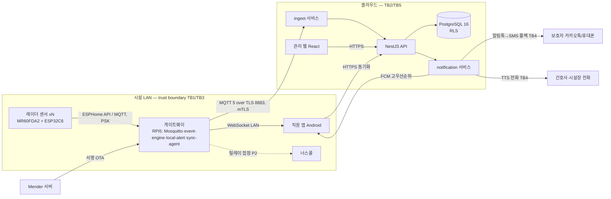
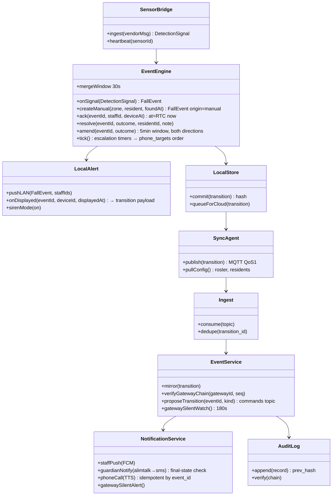
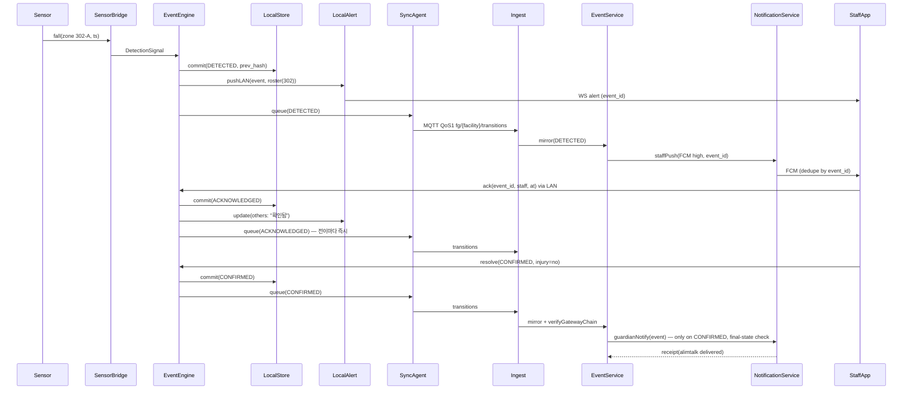
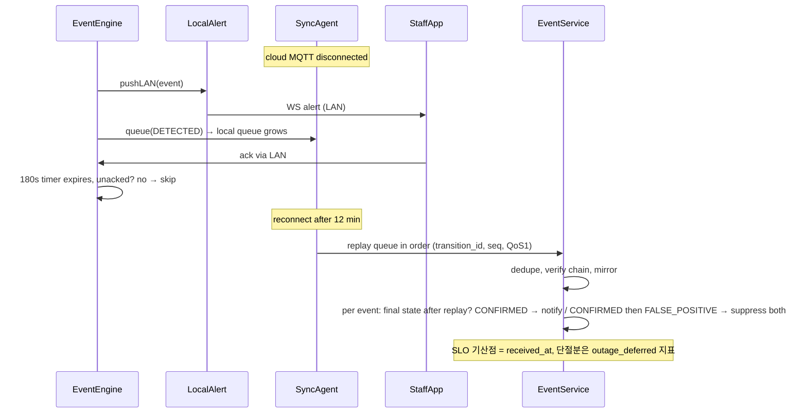
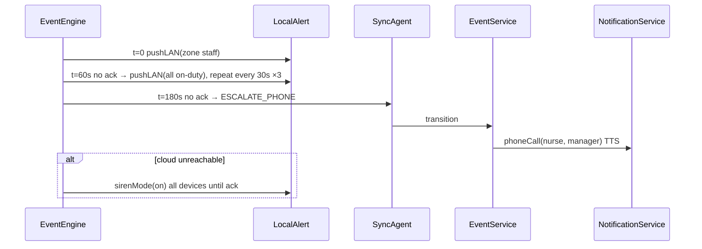
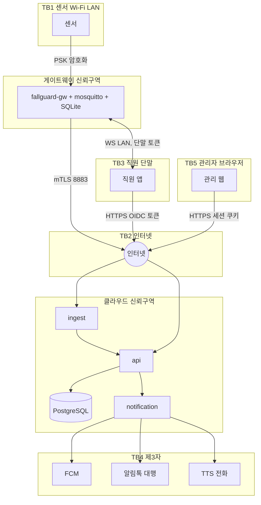

# 아키텍처 — FallGuard-Care (요양시설 낙상 감지·알림)

> 근거 (A4 진입 사전조사, 검색 1회)
> - **정량** — FCM 일반 우선순위 메시지는 Doze 중 배치 지연되고, 고우선순위만 즉시 전달·기기 wake 허용. 데이터 전용 메시지가 Doze에서 큐잉된 사례 보고(quickstart-android #100) ([Firebase 문서](https://firebase.google.com/docs/cloud-messaging/android-message-priority) · [Firebase 블로그 2025-04](https://firebase.blog/posts/2025/04/fcm-on-android/) · [이슈 #100](https://github.com/firebase/quickstart-android/issues/100), 2026-09-03) → 직원 알림은 FCM 단일 경로로 못 맡긴다 = **LAN 소켓 + FCM 이중 경로**
> - **정성** — "License change done on a minor release" — EMQX 5.9 BSL 전환에 대한 사용자 반발 ([emqx discussion #15352](https://github.com/emqx/emqx/discussions/15352)) → 시설 임베드 브로커는 라이선스 변동 위험이 없는 Mosquitto
> - **사용자 영향** — 인터넷이 끊겨도 요양보호사 단말은 같은 소리로 울린다(사용자는 차이를 모른다). 관리자 웹만 "연결 끊김" 배지가 뜬다 (L-06 막다른 에러 0, FR-016)

## Context & Scope

- 시설 1곳 = 침실·화장실·복도에 60GHz 레이더 센서 ≤ 60대(Wi-Fi LAN) + 게이트웨이 1대(Raspberry Pi 5급, 유선 LAN 권장) + 직원 공용 Android 단말 3~10대 + 시설 관리 PC. 시설 인터넷은 존재하나 단절이 일시적으로 발생한다(가정).
- 클라우드 1개(국내 리전)가 다수 시설을 관리한다. 외부 의존: FCM, 카카오 알림톡 대행사(Solapi), 음성 = Twilio Programmable Voice(한국어 TTS, 발신번호 사전등록 — decision-log #D-027), Mender 서버.
- 기존 시스템: 시설 CCTV(연동 안 함, 2단계), 너스콜(연동 안 함, P2 릴레이). EMR 없음.
- 만드는 것은 4가지(01-recon §5): 이벤트 상태기계·에스컬레이션, 직원 앱, 통보·이력·리포트, 게이트웨이 형상.

## Goals / Non-goals

- Goals: G1 도달 시간(감지→표시 p95 10초, 인터넷 무관) · G2 신뢰(확정 후 통보, 오탐 흡수) · G3 증빙(append-only 감사)
- Non-goals: 영상, 예측, 착용형, 너스콜 교체, 폐쇄망, 보호자 앱, 과금 (03-prd)

## 설계

### 시스템 컨텍스트

### 구현 접근 — 난점과 선택

| 난점 | 선택 | 이유 |
|---|---|---|
| 인터넷 단절에도 알림이 울려야 한다 (INV-04) | **상태기계의 진실원은 게이트웨이**. 클라우드는 미러·통보·이력 담당 | 클라우드가 진실원이면 단절 = 알림 불가. 게이트웨이 SQLite(WAL)에 이벤트·전이를 먼저 커밋하고 클라우드로 재생 |
| 직원 단말 도달 보장 | LAN WebSocket(게이트웨이 push) + FCM 고우선순위 **이중 발송**, 앱은 event_id로 중복 제거. **Doze는 LAN 소켓에도 적용되므로** 앱은 상시 포그라운드 서비스(고정 알림) + 배터리 최적화 제외 요청 + full-screen intent + DND 우회 채널 + WS 재연결 예산(끊김 후 5초 내 재시도, 지수 백오프 상한 30초)을 갖는다. 시설 공용 단말은 충전 거치 운용(Doze는 "전원 미연결·정지·화면 꺼짐" 조건에서 진입 — [Android Doze 문서](https://developer.android.com/training/monitoring-device-state/doze-standby)) | FCM은 Doze·네트워크에 따라 지연. LAN은 인터넷 무관이지만 앱 프로세스가 살아 있어야 한다 → 위 4요소를 아키텍처 요구로 못 박고 A6에 24시간 유휴 단말 실측을 둔다 (architect 리뷰 #2 반영). 둘 다 실패 시 60초 후 에스컬레이션이 흡수 |
| LAN 경로 인증이 클라우드에 의존하면 안 된다 | 직원 단말은 클라우드 토큰(12h)과 **별도로 게이트웨이 발급 장기 기기 자격증명**(30일, 게이트웨이 서명, 오프라인 검증, 클라우드 config 동기화로 폐기 목록 전달)을 가진다 | 단절이 12시간을 넘거나 단절 중 교대가 시작돼도 LAN 경로가 살아 있어야 INV-04가 성립 (architect 리뷰 #3 반영) |
| 에스컬레이션 전화는 인터넷 필요 | 타이머는 **게이트웨이만** 가진다. 전화 발신은 클라우드가 `ESCALATED_PHONE` 전이를 받아 수행하고 `event_id+phone`으로 멱등 처리(이중 발신 방지). 단절 시 게이트웨이는 전 직원 단말을 **연속 사이렌 모드**로 전환(로컬 폴백) | 클라우드측 백업 타이머는 두지 않는다 — 게이트웨이가 죽으면 클라우드는 DETECTED 자체를 모르므로 백업 타이머가 의미 없고, 살아 있으면 이중 발신 위험만 만든다. 전화를 게이트웨이에서 직접 걸려면 GSM 모뎀 필요 → P2(LTE 페일오버 라우터)로 이관, 잔여 리스크 명시(위협모델 ④) |
| 게이트웨이 = 단일 장애점(SPOF) | ① 프로세스 장애: HW watchdog 15초 + systemd Restart → MTTR ≤ 60초. ② 하드웨어 장애: 클라우드가 텔레메트리(60초 주기) **3회 연속 미수신(180초)** 시 `gateway-silent` 를 발행해 근무 중 전 직원 단말(FCM)과 시설관리자에게 **"낙상 감지 중단 — 수동 순회 모드"** 를 알리고 관리 웹을 stale로 전환. 파일럿 시설에 **사전 프로비저닝된 예비 게이트웨이 1대**(동일 클레임, 콜드 스탠바이)를 비치해 시설 직원이 케이블 교체만으로 복구, MTTR 목표 ≤ 4시간 | 센서는 게이트웨이하고만 통신하므로 게이트웨이가 죽으면 클라우드가 낙상을 대신 감지할 수 없다. 따라서 대책은 "감지 대체"가 아니라 "**감지 중단을 사람에게 즉시 알리고 빠르게 교체**"다 (architect 리뷰 #1 반영). 핫 스탠바이 이중화는 파일럿 규모에 과잉 → 양산 시 재검토 |
| 오탐을 보호자에게 안 보내기 (INV-01) | 통보 트리거를 `CONFIRMED` 전이 이벤트 하나에만 묶고, notification 모듈은 **발송 직전 종국 상태를 재검증** — 단절 후 재생(replay)에서 같은 이벤트의 `CONFIRMED`와 5분 내 `FALSE_POSITIVE` 정정이 함께 도착하면 통보·정정 통보 모두 억제 | 상태기계 외부에서 통보를 호출하는 경로를 0으로. 재생 배치 안에서 순서대로 통보하면 정정된 오탐이 보호자에게 나간다 (architect 리뷰 #5 반영). FR-006 "10분" SLO의 기산점은 클라우드 `received_at`, 단절 초과분은 별도 지표 |
| 법적 증거 | 감사 레코드 append-only + SHA-256 해시체인, 게이트웨이 RTC. **체인은 writer 단위**: 게이트웨이 체인(`gateway_id` + 단조 `seq`, transitions)과 클라우드 체인(`audit_log.seq`, 관리자 행위·통보 영수증)을 분리하고, 클라우드는 미러 시 게이트웨이 체인의 연속성을 검증해 불일치를 감사 경고로 남긴다 | 전이별 `prev_hash` 저장, 검증 스크립트로 SC-008. 두 writer의 레코드를 한 체인에 섞으면 지연 재생 시 체인이 분기한다 (architect 리뷰 #4 반영) |
| 센서 벤더 교체 가능성 | `sensor-bridge`가 벤더 이벤트를 **정규화된 DetectionSignal**(zone_id·kind·confidence·ts)로 변환 | event-engine은 벤더를 모른다 (P5 모델 교체 가정) |
| SD 마모 vs 전원 차단 시 큐 보존 | rootfs read-only + `/var/lib/fallguard` 소형 쓰기 파티션(SQLite WAL) + 로그는 log2ram. **상한 10만 건은 `outbox`(미전송분)에만** 적용. `transitions`는 append-only이며 클라우드 미러 확인 후 90일 롤링 아카이브(진실원 보관은 클라우드 3년) | 큐를 tmpfs에 두면 정전 시 유실 → INV 위반. append-only 테이블을 상한으로 지우면 INV-03 위반 (architect 리뷰 #4 반영). 쓰기량은 이벤트뿐이라 ≤ 100MB/일 (NFR-007) |
| LAN 밖에서 누른 확인(ACK)이 게이트웨이에 도달해야 한다 | 클라우드 API(E-12/13/14)로 들어온 전이 요청은 `fg/{facility}/commands` 토픽의 `transition-proposal`로 게이트웨이에 전달되고, 게이트웨이가 적용해 `transitions`로 응답한다. 게이트웨이 오프라인이면 클라우드는 202(대기)로 응답하고 앱은 LAN 재시도 | 진실원은 게이트웨이 하나. 클라우드가 직접 상태를 바꾸면 두 진실원이 생긴다 (architect 리뷰 #6 반영) |
| 클라우드 배포체 수 | 파일럿은 **NestJS 모듈러 모놀리스 1개**(ingest·api·notification 모듈, 내부 큐는 PostgreSQL `FOR UPDATE SKIP LOCKED`) + Mosquitto 1개 + PostgreSQL 1개. 다시설 진입 시 notification부터 분리 | 3인·1시설 파일럿에 서비스 3개는 과설계 (architect 리뷰 #8 반영). 모듈 경계는 코드로 유지해 분리 비용을 낮춘다 |

### 컴포넌트 구조

게이트웨이 프로세스: `mosquitto`, `fallguard-gw`(SensorBridge+EventEngine+LocalAlert+LocalStore+SyncAgent 단일 Node.js 프로세스, systemd Restart=always, HW watchdog), `mender-client`, `chrony`(NTP+RTC). 클라우드(파일럿): `fallguard-cloud` NestJS 모듈러 모놀리스 1프로세스(Ingest·EventService·NotificationService·AuditLog·REST/WS 모듈), PostgreSQL 16, Mosquitto(클라우드측, 시설별 mTLS 계정·ACL 자기 토픽만). 직원 앱: Android 포그라운드 서비스 상주(WS 유지·FCM 수신·로컬 큐), 게이트웨이 발급 기기 자격증명(30일) + 클라우드 토큰(12h) 이중 보유.

### 데이터 흐름

#### 시나리오 1 — 정상 경로: 감지 → 확인 → 확정 → 통보

LAN이 아닌 클라우드 API로 ACK가 들어오면: `APP->>API: POST /fall-events/{id}/ack` → `API->>GW: commands transition-proposal` → `GW: EventEngine.ack → transitions(ACKNOWLEDGED)` → `API: 200` (게이트웨이 응답 5초 내 없으면 202 + 앱 LAN 재시도).

#### 시나리오 2 — 인터넷 단절 중 감지

**게이트웨이 무응답(하드웨어 장애) 시**: 클라우드 `gatewaySilentWatch`가 텔레메트리 180초 미수신을 감지 → 근무 중 전 직원 FCM + 시설관리자에게 "낙상 감지 중단 — 수동 순회 모드" → 관리 웹 stale → 예비 게이트웨이 교체 절차(07 런북 R-1) → 복구 시 예비기가 같은 `facility_id`로 클레임되고 클라우드 config 스냅샷(roster·residents·zones·sensors)을 받아 재개. 단절 중 발생한 낙상은 시스템이 알 수 없다(잔여 리스크, 위협모델 ④-1).

#### 시나리오 3 — 미확인 에스컬레이션

### 데이터 저장 (설계 결정 관련만)

- 게이트웨이: SQLite(WAL) — `transitions`(append-only, `gateway_id`+단조 `seq`, prev_hash; 클라우드 미러 확인 후 90일 롤링 아카이브), `outbox`(클라우드 미전송, **상한 10만 건**, 초과 시 가장 오래된 **동기화 완료** 행부터 삭제 — 미전송 행은 삭제하지 않고 관리자 알람), `device_credentials`(직원 단말 장기 자격증명·폐기 목록), `roster_cache`, `resident_cache`.
- 클라우드: PostgreSQL 16 — 전 테이블 `facility_id` + RLS. `fall_events`(현재 상태), `event_transitions`(append-only 미러), `notifications`(영수증), `audit_log`. 스키마는 05.
- 원시 감지 신호는 게이트웨이 30일 롤링, 클라우드에는 병합 결과와 링크(원신호 ID 목록)만.

## 검토한 대안 (ecc:architecture-decision-records 흡수 — 상세는 decision-log #D-013~#D-018)

| 대안 | 장점 | 단점 | 왜 아닌가 |
|---|---|---|---|
| 완전 클라우드(센서→인터넷 직결, 상태기계 클라우드) | 런타임 1개, 운영 단순 | 단절 = 알림 전면 중단 | INV-04 위반. 안전 서비스 부적합 (Q2) |
| 완전 온프레미스(시설 서버, 인터넷은 있음) | 폐쇄망도 가능, 데이터 시설 내 보관 | 시설마다 서버 운영·백업·OTA를 우리가 원격으로 못 함, 다시설 대시보드(US-6/FR-017) 부재, 알림톡·전화 연동은 시설 서버가 직접 인터넷에 나가야 해 보안 경계가 시설 수만큼 늘어남 | 파일럿 1시설에서는 하이브리드와 차이가 작지만 2시설부터 운영 비용이 선형 증가. (architect 리뷰 #7: 이전 서술 "알림톡·FCM·전화 불가"는 폐쇄망에서만 참이라 정정) |
| 클라우드 진실원 + 게이트웨이 store-and-forward 캐시 | 상태기계가 한 곳(클라우드), 게이트웨이는 단순 버퍼 | 단절 중 ACK·타이머·에스컬레이션을 게이트웨이가 "임시로" 처리해야 하므로 결국 두 번째 상태기계가 생기고 재접속 시 충돌 해소 규칙이 필요 | 단절 중 안전 경로가 1급이어야 하므로(INV-04) 게이트웨이를 진실원으로 두는 편이 규칙이 단순. 클라우드는 미러·통보·이력만 (architect 리뷰 #7 추가) |
| 카메라 비전(SafelyYou 방식) | 원인 영상, 개인 식별 | 침실 전원 동의, 영상 위탁, Jetson·AGPL | Q1. 2단계로 이관 |
| EMQX 클러스터 | 멀티노드·관리 UI | BSL 1.1, 임베디드 제공 제한 | #D-003 |
| Kafka/NATS 이벤트 버스 | 대규모 스트림 | 시설당 <1만 이벤트/일에 과잉 | YAGNI. MQTT QoS1 + outbox로 충분 |
| Firebase(Firestore) 백엔드 전체 | 빠른 착수 | RLS·감사 해시체인·국내 리전·민감정보 통제 약함 | 개인정보 안전성 확보조치·G3 불리 |
| 상태기계를 앱에 두기(P2P) | 게이트웨이 불필요 | 단말 다수 간 합의 문제, 타이머 신뢰 불가 | 진실원이 흔들림 |
| 게이트웨이 GSM 모뎀 직접 전화 | 단절 시에도 전화 | HW·통신비·인증 | P2 LTE 페일오버 라우터로 대체(위협모델 ④ 잔여) |

## 위협모델 (ecc:security-review 체크리스트 + STRIDE)

### ① 무엇을 만드는가 — DFD + trust boundary

### ② 무엇이 잘못될 수 있는가 — STRIDE 표 (전 경계 6범주)

| 자산/경계 | S 위장 | T 변조 | R 부인 | I 노출 | D 서비스거부 | E 권한상승 |
|---|---|---|---|---|---|---|
| TB1 센서→게이트웨이 | 가짜 센서가 낙상 신호 주입(오탐 유발) | 신호 변조(낙상 억제=미탐) | 해당없음(센서는 행위자 아님, 신호 원본은 게이트웨이가 기록) | 낙상 여부 자체가 건강정보 — LAN 스니핑 | Wi-Fi 재밍·deauth로 센서 오프라인 | 센서 펌웨어 탈취로 게이트웨이 API 접근 |
| 게이트웨이 (물리·OS) | 도난 게이트웨이로 타 시설 위장 | SQLite 로컬 변조(증거 조작) | 관리자가 로컬 로그 삭제 | SD 카드 탈취 → 큐·캐시 노출 | 전원 차단·SD 마모·프로세스 행 | 로컬 셸 획득 → 인증서 탈취 |
| TB2 게이트웨이↔클라우드 MQTT | 인증서 탈취로 위조 전이 발행 | 중간자 전이 변조 | 해당없음(전이는 서명 해시체인) | 전송 중 이벤트 노출 | 브로커 연결 폭주·큐 고갈 | 타 시설 토픽 구독/발행 |
| TB3 직원 앱 | 도난 단말로 확인/확정 | 확정 결과 변조(오탐→확정) | "내가 확인 안 했다" | 단말에 남는 수급자·구역 정보 | 알림 폭주로 앱 무력화, 배터리 | 요양보호사가 관리자 설정 변경 |
| 클라우드 API/DB | 계정 탈취(관리자) | SQL 인젝션·RLS 우회로 데이터 변조 | 관리자가 설정 변경 부인 | 시설 간 교차 조회, 로그에 연락처 | 공개 엔드포인트 DoS | 역할 파라미터 변조 |
| TB4 제3자(FCM·알림톡·전화) | 대행사 API 키 탈취로 사칭 통보 | 해당없음(대행사 내부, Transfer) | 발송했는데 "안 왔다" | 알림톡 본문의 수급자 정보 | 대행사 장애·스로틀 | 해당없음(대행사는 우리 권한 없음) |
| TB5 관리 웹 | 세션 탈취 | CSRF로 근무표·보호자 변경 | 해당없음(감사로그가 UI 행위 기록) | XSS로 이력 유출 | 해당없음(관리 웹 다운은 알림 경로와 무관, Accept) | 권한 없는 리포트 다운로드 |

### ③ 무엇을 할 것인가

| 위협 | 대응 | 대책 |
|---|---|---|
| TB1 가짜 센서/변조/스니핑 | Mitigate | ESPHome API PSK(센서별 키), 센서 MAC allowlist, 게이트웨이 전용 SSID(VLAN) + WPA3, 센서는 인터넷 라우팅 차단 |
| TB1 Wi-Fi 재밍/deauth | Mitigate + Accept | heartbeat 5분 → 장비 알람(FR-009). 재밍 자체는 물리 보안(Accept, 사유: 시설 내부자 공격 모델 밖) |
| 게이트웨이 도난·SD 탈취 | Mitigate | 파일럿: 쓰기 파티션 LUKS(로컬 키 파일, 네트워크 언락 없음 — 단절 내성이 존재 이유인 장비에 부팅 의존성을 추가하지 않는다, architect 리뷰 #8) + **물리 잠금함** + 도난 시 클라우드에서 인증서·기기 자격증명 즉시 폐기. 양산: TPM 보드로 키 봉인 |
| TB3 오프라인 중 단말 자격증명 만료 | Eliminate | 게이트웨이 발급 기기 자격증명 30일(오프라인 검증), 클라우드 토큰과 분리. 폐기 목록은 config 동기화로 전달 |
| 게이트웨이 로컬 증거 조작 | Mitigate | 해시체인 + 클라우드 미러(양쪽 불일치 시 감사 경고), 게이트웨이 셸은 Mender 원격 터미널만·현장 콘솔 비활성 |
| 전원/SD/프로세스 행 | Mitigate | HW watchdog 15초, systemd Restart, read-only rootfs, log2ram, UPS는 P2 |
| TB2 인증서 탈취·위조 전이 | Mitigate | 게이트웨이별 X.509(1년, 자동 갱신), 클라우드 ACL: `fg/{facility_id}/#` 자기 토픽만, 전이 스키마 검증 + 단조 증가 seq |
| TB2 중간자 | Eliminate | TLS 1.2+ 필수, 인증서 피닝(게이트웨이→클라우드) |
| TB2 큐 고갈 | Mitigate | outbox 상한, 브로커 레이트리밋(시설당 100 msg/s), 동기화 완료분 우선 삭제 |
| TB3 도난 단말 | Mitigate | 시설 공용 단말 + 기기 바인딩, 토큰 12h, 서버 세션 폐기, 앱 잠금(PIN) 후 확정 입력 |
| TB3 확정 결과 변조 | Mitigate | 전이는 서버(게이트웨이) 검증, 앱은 제안만. 5분 정정창 외 변경 불가(INV-02) |
| TB3 부인 | Mitigate | ack/resolve 레코드에 staff_id·device_id·단말 시각·수신 시각, 감사 2년 |
| TB3 알림 폭주 | Mitigate | 병합창 30초, 재알림 최대 3회, 장비 알람 별도 채널 |
| 클라우드 계정 탈취 | Mitigate | argon2 + 관리자 2단계(OTP), 로그인 레이트리밋, 이상 로그인 알림 |
| SQL 인젝션·RLS 우회 | Eliminate | ORM 파라미터화, DB 세션에 `SET app.facility_id` 강제, RLS 정책 전 테이블, 슈퍼유저 경로 금지 |
| 시설 간 교차 조회 | Eliminate | RLS + 통합 테스트(타 시설 ID로 403/404) |
| 로그 내 연락처·이름 | Mitigate | 로그 마스킹 미들웨어, 이벤트 로그는 ID만 |
| 공개 엔드포인트 DoS | Mitigate | WAF/레이트리밋, 알림 경로는 인터넷 무관(INV-04) |
| 역할 파라미터 변조 | Eliminate | 역할은 서버 세션에서만, 요청 본문 role 무시 |
| TB4 대행사 키 탈취 | Mitigate | 키는 비밀관리자(환경변수 주입), 발신 프로필·템플릿 고정, 키 회전 분기 |
| TB4 대행사 장애·스로틀 | Transfer + Mitigate | SLA는 대행사(Transfer), 알림톡→SMS→관리자 수동 3단 폴백(FR-006) |
| TB4 알림톡 본문 노출 | Mitigate | 본문에 수급자 이름 대신 관계 호칭 옵션, 부상 상세 없음("시설에 연락해 주세요") |
| TB5 세션·CSRF·XSS | Mitigate | httpOnly+SameSite=Strict 쿠키, CSRF 토큰, CSP, React 기본 이스케이프, 리포트 다운로드 역할 검사 |
| 시크릿 | Eliminate | 코드·이미지에 시크릿 0, 게이트웨이 시크릿은 프로비저닝 시 발급, `.env` gitignore, CI 시크릿 스캔 |

### ④ 충분한가 — 상위 리스크 3 재검토 + 잔여

1. **인터넷 단절 + 미확인 낙상 / 게이트웨이 하드웨어 장애** — 단절 시 LAN 알림·사이렌 모드까지는 되지만 **전화 에스컬레이션 불가**; 게이트웨이가 죽으면 감지 자체가 멈추고 클라우드는 180초 후 "감지 중단"만 알릴 수 있다. 잔여: 야간 1인 근무자가 단말을 방치하거나, 게이트웨이 교체(MTTR ≤ 4h) 동안 발생한 낙상은 시스템이 모른다. 완화 계획: P2 LTE 페일오버 라우터(월 1만원대), 예비 게이트웨이 비치, 시설 운영 규정에 "단말 상시 휴대·감지 중단 알림 시 30분 순회" 명시. **Accept(파일럿 한정, 사유 기록)**.
2. **미탐(놓친 낙상)** — 센서 정확도는 우리 통제 밖. 잔여: 민감도 96% 목표라도 연 수십 건 중 1~2건 놓칠 수 있다. 완화: 제품 문구에 "보조 수단, 순회 대체 아님" 명시(규제 포지션 Q5와 정합), 미탐 사례를 평가셋에 추가해 임계 재조정. **Accept + 명시**.
3. **게이트웨이 물리 탈취로 민감정보 노출** — LUKS + 도난 시 인증서 폐기로 완화되나 오프라인 부팅용 로컬 키가 남는다. 잔여: 잠금함 + 키 파일 권한. **Accept(파일럿)**, 양산 시 TPM 탑재 보드 검토.

## Cross-cutting: 관측성

게이트웨이는 `transitions` 카운트·outbox 깊이·센서 heartbeat·watchdog 킥을 60초 주기 텔레메트리 토픽으로 발행(알림 토픽과 분리). 클라우드는 시설별 "감지→표시 지연", "알림 성공률", "outbox 깊이"를 골든 시그널로 수집한다. 상세는 07.

## Cross-cutting: 프라이버시

레이더는 영상·음성이 없고 개인 식별을 하지 않는다(구역 단위). 클라우드에 저장되는 개인정보는 수급자 이름·구역, 보호자·직원 연락처(컬럼 암호화), 낙상 이력(민감정보)뿐이다. 보존은 03 NFR-005 상수 표를 따른다: 원시 신호 게이트웨이 30일(클라우드 raw 없음)·이벤트/전이/감사 3년, 퇴소 + 3년 후 파기(FR-013). 알림톡 본문은 최소 정보. 수급자·보호자 동의 서식과 개인정보 처리방침은 착수 조건(SC-010).
