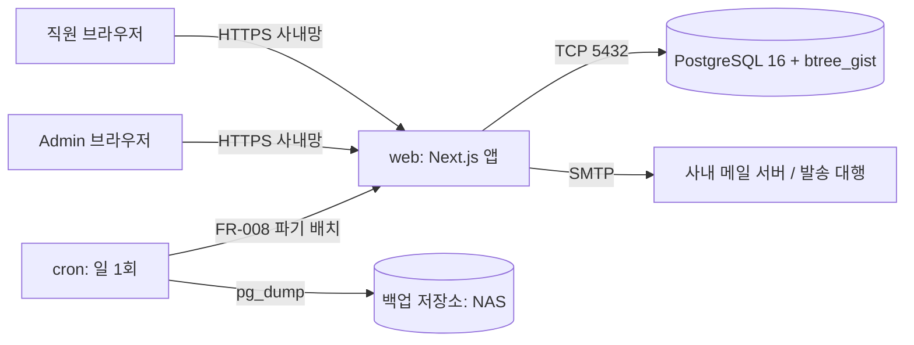
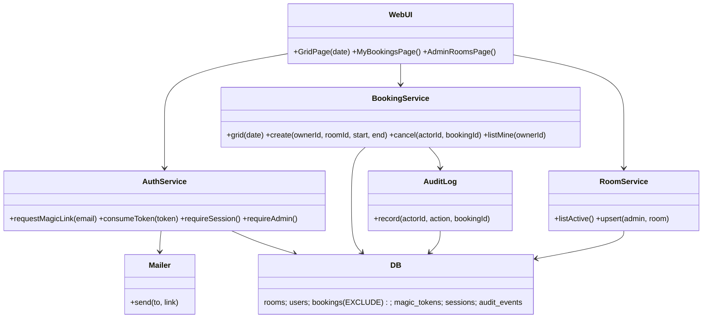
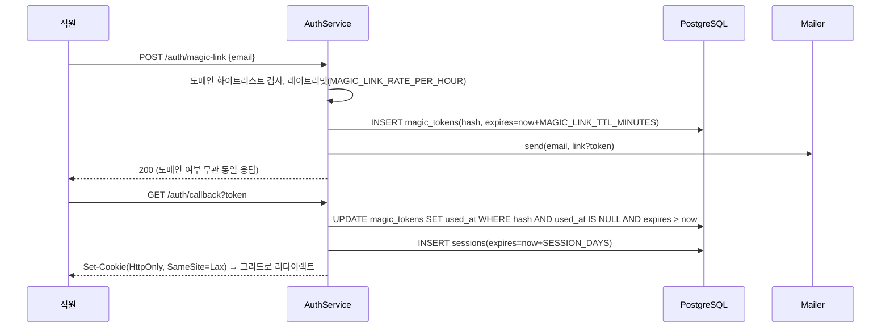
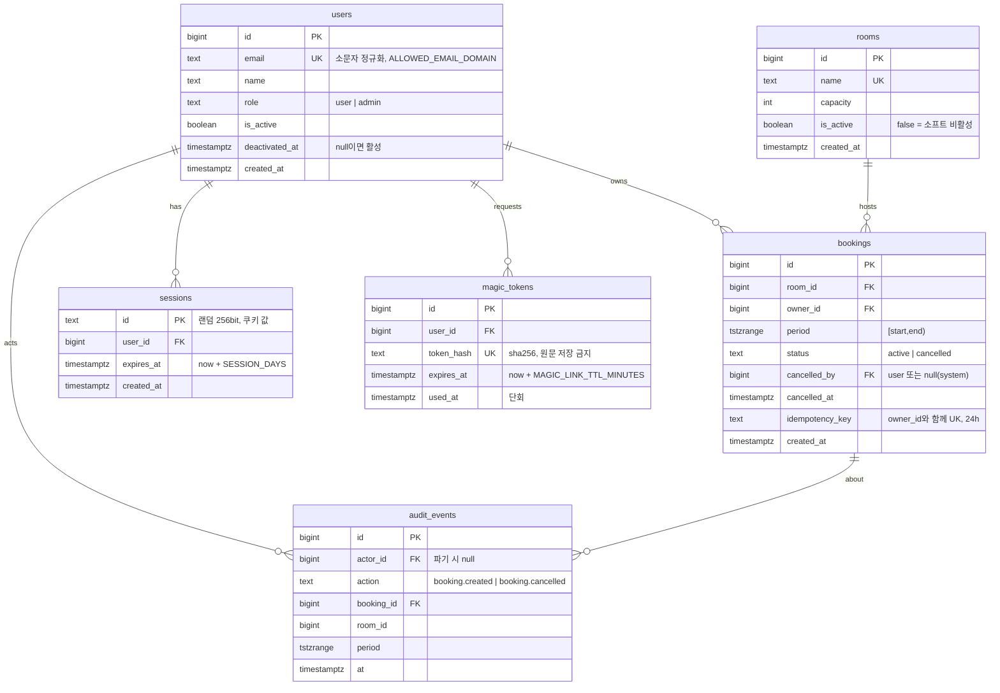

# Seed — 사내 회의실 예약 (meeting-room-booking)
버전: v1.0
- 원문: "사내 회의실 예약을 웹에서 하고 싶다. 지금은 화이트보드에 수기로 적는다."
- 서비스 유형: 웹 (사내 내부 도구, 단일 조직)
- 주 도메인 / 인접 도메인: 공유 자원(회의실) 시간 단위 예약 / 사내 캘린더·근태·출입, 사무 관리
- 감지된 제약: 사내 전용(외부 고객 없음) · 현재 프로세스는 화이트보드 수기(= 실시간 가시성·중복 방지·이력이 없음) · 회의실 수·직원 수 미기재(입력에 없음) · 예산·기한·팀 역량 미기재
- 로드할 블라인드스팟 프로파일: P2 웹 SaaS (단일 테넌트로 축소 적용). 결제·구독 항목은 해당 없음
- 강도: lite (사용자 지정) — 사유: SKILL.md 강도 신호 표 항목 없음 (돈·안전·법·민감정보 없음, 외부 연동 0~1개, 동시 사용자 100명 미만 가정, 하드웨어 없음, 1인 운영 가능한 사내 도구). 사용자가 lite를 명시 지정
- 기존 시스템: 없음 (화이트보드 수기 → 코드·스키마 감사 대상 없음)


# Recon — 사내 회의실 예약
버전: v1.0 · 조사 기준일: 2026-09-07 · 강도 lite (검색 5회 / 상한 5)

증거 경계 표기: **[출처]** = 웹에서 확인한 사실 · **[사용자]** = 입력에서 읽은 것 · **[추론]** = 그로부터 도출 · **[추천]** = 선택 제안

## 도메인 업무 흐름 — 회의실 예약은 실제로 어떻게 돌아가는가
- [출처] 그룹웨어가 있는 조직은 회의실을 "자원"으로 등록해 캘린더에서 예약한다. Microsoft 365는 room mailbox를 만들고 Outlook 회의 생성 시 Room Finder로 방을 고르면 자원 사서함이 자동 수락하며, 충돌 예약은 Exchange 관리센터 설정으로 자동 거절한다. Google Workspace는 건물·자원(회의실)을 등록하고 Calendar의 "회의실"에서 선택한다.
  - https://hybo.app/en/blog/how-to-book-meeting-rooms-with-office-365-or-google-workspace/ · https://www.add-on.com/add-a-room-calendar-in-outlook/ · https://support.google.com/a/answer/9193836?hl=en (확인 2026-09-07)
- [출처] 예약 도구의 반복 문제는 "유령 회의(ghost meeting)": 예약됐지만 아무도 안 오는 방이 주당 30~40%라는 업계 수치가 있고, 표준 대책은 **시작 후 10~15분 체크인 없으면 자동 해제(auto-release)**다.
  - https://www.deskbird.com/blog/ghost-meetings · https://www.yarooms.com/guides/fix-meeting-room-no-shows · https://www.woxday.com/blog/how-to-reduce-meeting-room-no-shows-with-auto-release (확인 2026-09-07)
- [사용자] 현재는 화이트보드 수기. [추론] 화이트보드의 한계 = 자리에서 못 봄, 중복·덮어쓰기 방지 없음, 누가 언제 적었는지 이력 없음, 취소해도 지우지 않으면 방이 잠김. 웹 전환의 핵심 가치는 **원격 가시성 + 중복 차단 + 취소 즉시 반영**이며, 유령 예약은 화이트보드에서도 이미 있던 문제다.

## 이해관계자 — 누가 쓰고, 누가 비용을 내는가
| 이해관계자 | 관심사 | 실패 시 영향 | 근거 |
|---|---|---|---|
| 일반 직원 (예약자) | 빈 방을 빨리 찾고 3클릭 내 예약, 내 예약 취소 | 화이트보드로 회귀 | [추론] 화이트보드 대체 목적 |
| 총무/관리자 (1인) | 회의실 목록·운영시간 관리, 방치 예약 정리 | 유령 예약으로 방 부족 민원 | [출처] deskbird·yarooms 위 링크 |
| IT 운영 (1인 겸임) | 설치·백업·계정 관리 최소화 | 운영 부담으로 서비스 방치 | [추론] 사내 도구·1인 운영 (seed) |
비용 부담: [추론] 사내 도구이므로 총무/IT 예산. 외부 과금·결제 없음 (P2 결제 항목 해당 없음).

## 규제·표준 — 반드시 준수해야 하는 것
- [출처] 개인정보보호법: 목적에 필요한 **최소한의 개인정보만** 수집하고, 최소 수집의 입증책임은 처리자에게 있다. 임직원 정보도 예외가 아니다 (사내 시스템에서 수집하는 직원 정보에 법 적용).
  - https://www.easylaw.go.kr/CSP/CnpClsMainBtr.laf?csmSeq=1257&ccfNo=2&cciNo=1&cnpClsNo=1 · https://www.privacy.go.kr/cmm/fms/FileDown.do?atchFileId=FILE_000000000808883&fileSn=0 (확인 2026-09-07)
- [추론] 이 서비스가 다루는 개인정보는 **이름·사내 이메일(로그인 식별)** 뿐이다. 전화번호·부서 외 항목은 수집하지 않고, 예약 이력 보존 기간을 명시하면 충족한다. 그 외 산업 규제·표준(PCI·의료·금융) 해당 없음 — 결제·민감정보가 없다.

## 유사 솔루션 3개 (lite 상한 3)
| 솔루션 | 유형 | 실제 기능 범위 | 우리 상황과의 fit | 근거 |
|---|---|---|---|---|
| Microsoft 365 room mailbox / Google Calendar 자원 | 상용(기존 그룹웨어 부속) | 캘린더에서 방 선택, 자동 수락, 충돌 자동 거절. 별도 구축 0 | **회사가 이미 M365/Workspace를 쓰면 이게 정답** — 이 패키지 전체가 불필요. 화이트보드를 쓴다는 점에서 미도입 또는 미활용으로 [추론] | https://hybo.app/en/blog/how-to-book-meeting-rooms-with-office-365-or-google-workspace/ |
| MRBS (Meeting Room Booking System) | 오픈소스, GPLv2, PHP + MySQL/PostgreSQL | 다지점 회의실, 주/일 보기, 반복 예약. 캘린더 연동·모바일 UI·알림 없음 | 기능은 충족. PHP 운영 가능하면 Adopt 후보. 모바일·알림 부재, GPLv2 | https://sourceforge.net/projects/mrbs/ · https://www.vizitorapp.com/blog/free-and-open-source-meeting-room-booking-systems-the-2026-edition/ |
| Cal.com (self-hosted) | 오픈소스, 개인 일정 예약 중심 | 외부인 예약 링크, Google/M365 동기화, 모바일 UI | 개인 캘린더 예약이 본체라 "회의실 그리드" 용도엔 과잉·부적합 | https://opencals.com/blog/open-source-booking-system |

search-first 판정: **Build(최소)**. 이유 — (1) Adopt-as-is 후보(M365/Google 자원)는 그룹웨어 보유 여부에 달려 있어 register에서 가정 처리, 착수 조건으로 확인을 요구한다. (2) MRBS는 GPLv2·PHP·모바일 부재로 "Extend"하면 스택을 그대로 물려받는다. (3) 핵심(방 × 시간 그리드 + 중복 차단 + 취소)은 엔드포인트 6개 내외로 작아 커스텀 비용이 낮다. 자세한 대안 비교는 decision-log #2.

## 스택 후보 2개 (lite 상한 2)
| 후보 | 구성 | 근거 | 트레이드오프 |
|---|---|---|---|
| **S1 (추천)** | TypeScript · Next.js(App Router, 서버 액션/Route Handler) · PostgreSQL 16 (`btree_gist` + `EXCLUDE` 제약) · Docker Compose 2 컨테이너 | 중복 예약 차단을 **DB 제약**으로 보장 — `EXCLUDE USING gist (room_id WITH =, period WITH &&)`는 앱 코드·트리거보다 동시성에 안전 (https://www.postgresql.org/docs/current/rangetypes.html · https://dev.to/franckpachot/postgresql-exclude-constraints-for-better-concurrency-than-serializable-pob). 프론트+API 단일 코드베이스로 1인 운영에 맞음 (https://nextjs.org/docs/app/getting-started/deploying) | Node 런타임·빌드 파이프라인 필요. 팀이 TS에 익숙하지 않으면 S2 |
| S2 | Python · FastAPI + Jinja2/HTMX · PostgreSQL 16 (동일 EXCLUDE 제약) | 파이썬 팀이면 학습 비용 최소, 템플릿 렌더링으로 프론트 빌드 불필요 (https://fastapi.tiangolo.com/) | 화면 상호작용(그리드 드래그 등) 확장 시 JS 비중이 다시 커짐 |
공통: SQLite 대신 PostgreSQL을 고른 이유는 범위 타입 + EXCLUDE 제약이 PostgreSQL 고유 기능이기 때문 [출처 위 rangetypes 문서]. 사용자 규모(≤100명 동시)에서 성능 차이는 설계 변수가 아니다 [추론].
fit 판단은 인기가 아니라 seed 제약(1인 운영·사내·소규모) 매칭이다. 팀 언어 역량은 미기재 → register 7축 Assumed(TS).

## 현재 시스템 감사
해당 없음 — 기존 시스템은 화이트보드 (seed).


# 블라인드스팟 레지스터 — 사내 회의실 예약
버전: v1.0 · 스캔: 공통 10축 + STRIDE 6범주 + 프로파일 P2 웹 SaaS(단일 테넌트 축소, 6항목) = 22항목 · 질문 0 (lite — 전부 Assumed, 데이터 손실·법 Impact 항목 없음)

## "왜 만드나" 진단 (product-lens 7문항, 질문 없이 seed·recon으로 답함)
1. 누구를 위해 — 회의실을 같이 쓰는 사내 직원(예약자)과 총무 1인. 2. 고통 — 화이트보드는 자리에서 안 보이고, 덮어쓰기·이중 기재를 못 막고, 취소가 반영되지 않는다 (recon [추론]). 3. 왜 지금 — 사용자가 웹 전환을 요청함 (seed). 4. 10점 버전 — 그룹웨어 캘린더·도어 디스플레이·체크인 자동해제·이용 통계. 5. MVP — 방×시간 그리드 조회 + 중복 없는 예약 + 내 예약 취소. 6. 안티골 — 개인 일정·외부인 예약·결제·다지점·모바일 앱. 7. 작동 증거 — 화이트보드 철거 후 4주 동안 중복 예약 민원 0건, 예약의 100%가 시스템 경유 (03 SC로 측정).
판정: go — 단, 그룹웨어(M365/Google Workspace) 자원 캘린더가 이미 있으면 no-go (착수 조건 #1).

| 축/항목 | 상태 | 처리 | 근거·출처 |
|---|---|---|---|
| 1. 기능 범위·행동 | Assumed | 핵심 유스케이스 3개(그리드 조회·예약·취소) + non-goal 목록 (반복 예약·외부인·다지점·결제·모바일 앱 제외) | seed 원문 + recon MRBS 기능 범위. 반복 예약은 유령 예약의 주요 원인이라 v1에서 제외 (deskbird) |
| 2. 도메인·데이터 모델 | Assumed | 엔티티 3개: 회의실(Room)·사용자(User)·예약(Booking). 예약은 `[start,end)` 반열린 구간, 저장 UTC, 표시 Asia/Seoul. 규모 가정: 회의실 ≤10, 직원 ≤100, 예약 ≤50건/일 | seed에 수치 없음 → 소규모 사내 기본값. 볼륨은 설계 변수가 아님 (recon 스택 절) |
| 3. 상호작용·UX 플로우 | Assumed | 화면 2개: 일 단위 그리드(방×30분 슬롯) + 내 예약 목록. 빈 슬롯 클릭→예약 폼→저장의 3단계. 에러는 슬롯 위 인라인 문구 + 다음 빈 슬롯 제안 | ux-principles-kr L-03(화면당 결정 1개)·L-06(막다른 에러 0)·L-07(계산은 시스템이) |
| 4. 비기능 품질 | Assumed | 성능: 그리드 응답 p95 ≤ 1s(사내망). 신뢰성: 업무시간 가용성 99% (월 ~7h 다운 허용). 관측성: 구조화 로그 + healthcheck. 보안: 매직링크 인증 + 도메인 화이트리스트. 프라이버시: 이름·이메일만 수집 | 03 상수 표·SC로 수치화. 사내 도구라 SLO는 느슨하게 (SRE "100% 금지") |
| 5. 통합·외부 의존성 | Assumed | 외부 연동 1개: 이메일 발송(매직링크). SMTP 장애 시 로그인 불가 → 기존 세션은 유지(세션 30일)로 완화. 그룹웨어 캘린더 연동은 non-goal | recon: 그룹웨어 미도입/미활용 [추론]. SMTP는 사내 메일 서버 또는 무료 티어 대행 |
| 6. 엣지케이스·실패 처리 | Assumed | 동시 예약 경합 → DB EXCLUDE 제약이 후발 요청을 거부(409). 과거 시각 예약 금지, 운영시간 밖 금지, 최대 길이 초과 금지, 시작=종료 금지, 취소는 예약자 본인 또는 관리자만 | PostgreSQL rangetypes 문서 · 03 엣지케이스 표 |
| 7. 제약·트레이드오프 | Assumed | 예산 0(오픈소스, 사내 VM 1대) · 기한 미기재 → 워킹 스켈레톤 우선 · 팀 역량 미기재 → TypeScript 가정(S1) · 사내망 우선, 인터넷 노출 없음 | seed에 없음. 틀리면 S2(FastAPI)로 교체 — 계약·ERD는 그대로 |
| 8. 용어·일관성 | Clear | 용어 고정: 회의실=Room, 예약=Booking, 슬롯=30분 단위, 관리자=Admin(총무), 예약자=Owner. "회의" 대신 "예약"만 쓴다 | 03 용어 절에 고정 |
| 9. 완료 신호 | Assumed | SC 5개(03)로 pass/fail: 중복 예약 0, 3클릭 예약, 취소 즉시 반영, 화이트보드 철거 4주 후 시스템 경유율 100%, 복원 리허설 성공 | spec-kit 측정 가능 SC 원칙 |
| 10. 비용·라이선스 | Clear | 런타임: 사내 VM/컨테이너 1대(추가 비용 0). 라이선스: Next.js MIT · PostgreSQL License · btree_gist(동봉). GPL 의존 없음. MRBS(GPLv2)를 쓰지 않는 이유 중 하나 | recon 유사 솔루션 표 |
| S. Spoofing | Assumed | 매직링크 토큰(단회·15분 만료) + 사내 이메일 도메인 화이트리스트. 세션 쿠키 HttpOnly·SameSite=Lax | OWASP 세션 관례. 비밀번호 저장 회피 |
| T. Tampering | Assumed | 예약 소유자·시각은 서버가 세션에서 결정, 클라 입력 신뢰 안 함. 슬롯 정렬·운영시간·최대 길이 서버 검증 | 04 위협모델 |
| R. Repudiation | Assumed | 예약 생성·취소 이벤트에 actor_id·시각을 감사 로그(테이블 + 앱 로그)로 남김. "내가 안 지웠다" 분쟁을 화이트보드 시절 문제로 식별 | recon [추론] |
| I. Information Disclosure | Assumed | 예약 목록은 로그인 사용자 전원에게 공개(누가 어느 방을 쓰는지는 사내 공개 정보 — 화이트보드와 동일). 이메일은 본인·관리자에게만 표시. 인터넷 미노출 | 개인정보 최소 수집(recon) |
| D. Denial of Service | Assumed | 사내망 한정으로 외부 DoS 경로 없음. 매직링크 발송 레이트리밋(이메일당 5회/시간)으로 SMTP 고갈 방지. 대량 선점(한 사람이 전부 예약)은 상수 `MAX_ACTIVE_BOOKINGS_PER_USER`로 제한 | 04 위협모델 |
| E. Elevation of Privilege | Assumed | 역할 2개(user/admin)를 서버 세션에서 판단. 취소·회의실 관리 엔드포인트는 서버측 권한 검사. admin 지정은 DB seed/환경변수로만 | 05 권한 스코프 |
| P2. 테넌시 | Clear(해당없음) | 단일 조직·단일 테넌트. tenant_id 없음 | seed: 사내 전용 |
| P2. 인증 | Assumed | 매직링크(이메일 도메인 화이트리스트). SSO는 설계만 열어둠(User.email이 식별자이므로 나중에 OIDC 붙여도 스키마 변경 없음) | P2 기본값 변형: 비밀번호 대신 매직링크로 저장 비밀 0 |
| P2. 결제·구독 | Clear(해당없음) | 사내 무료 도구 | seed |
| P2. 백업·DR | Assumed | pg_dump 일 1회 · 보관 30일 · 사내 NAS 또는 오브젝트 스토리지 · 복원 리허설 분기 1회. RPO 24h / RTO 4h (최악의 경우 화이트보드로 하루 회귀 가능) | P2 기본값 |
| P2. 개인정보 | Assumed | 수집: 이름·사내 이메일. 보존: 예약 이력 1년 후 파기, 퇴사자 계정은 비활성 후 90일 파기. 사내 고지문 1줄 | 개인정보보호법 최소 수집 (recon 출처) |
| P2. 이메일/알림 | Assumed | 매직링크 발송만. 발송 실패 시 3회 재시도 후 "메일이 안 왔어요? 다시 보내기" 경로 제공. 예약 확인 메일은 non-goal | P2 기본값 축소 |

## 질문 배치 (최대 5) — 제시 안 함
lite 상한: 질문 0. Impact가 데이터 손실·법에 해당하는 미해결 항목 없음 (백업·개인정보는 현업 기본값으로 충분히 덮임). 전 항목 Assumed 채택.
가장 비싼 가정 2개(틀리면 재작업)는 08 착수 조건으로 넘긴다: ① 그룹웨어 자원 캘린더 부재 ② 팀이 TypeScript 가능.

## 반영 기록
- 축 1·2·6 → 03 요구사항·엣지케이스·상수 표 (decision-log #4)
- 축 5·S·D·P2 인증 → 04 위협모델, 05 auth 엔드포인트 (decision-log #5)
- P2 백업·개인정보 → 07 백업·보존 (decision-log #6)


# PRD — 사내 회의실 예약 (meeting-room-booking)
버전: v1.0 — 개정하면 올리고, 04~07 머리의 `기준 03 v`를 같은 턴에 갱신 (규칙 9) · 강도 lite

## 근거 (진입 사전조사 3줄)
- **정량** — 예약된 회의실의 30~40%가 실제로 비어 있다는 업계 수치; 표준 대책은 시작 후 10~15분 체크인 없으면 자동 해제 (https://www.deskbird.com/blog/ghost-meetings · https://www.yarooms.com/guides/fix-meeting-room-no-shows, 확인 2026-09-07). v1은 이 문제를 상수 `AUTO_RELEASE_MINUTES`로 자리만 잡고 P2로 둔다.
- **정성** — "방이 잡혀 있는데 텅 비어 있다 — 예약자는 취소를 안 했고 아무도 못 쓴다" (yarooms no-show 가이드의 문제 진술). 화이트보드에서는 지우지 않으면 같은 일이 생긴다.
- **사용자 영향** — 직원은 자리에서 오늘의 방×시간 그리드를 보고 빈 칸을 눌러 3클릭 안에 예약한다. 겹치면 시스템이 막고 다음 빈 슬롯을 제안한다 (ux-principles-kr L-03·L-06·L-07).

## 배경 (RECON 요약)
회의실은 화이트보드에 수기로 적어 예약한다. 자리에서 안 보이고, 덮어쓰기·이중 기재를 못 막고, 취소가 반영되지 않는다. 그룹웨어(M365/Google Workspace) 자원 캘린더가 있으면 그것을 쓰는 게 정답이며(01-recon 유사 솔루션), 없다는 가정 아래 최소 웹 도구를 만든다. 중복 차단은 PostgreSQL `EXCLUDE` 제약으로 DB 층에서 보장한다 (01-recon 스택 절).

## 용어
회의실=**Room** · 예약=**Booking** · 슬롯=`SLOT_MINUTES` 단위 시간 칸 · 예약자=**Owner** · 관리자=**Admin**(총무) · 활성 예약=status가 `active`인 Booking. "회의"라는 말은 쓰지 않는다.

## 제품 목표 (≤2, 직교)
- G1. **충돌 없는 예약** — 같은 방·겹치는 시간의 활성 예약이 DB에 공존할 수 없다.
- G2. **자리에서 보이는 현황** — 누구나 로그인 후 오늘·특정 날짜의 방×시간 현황을 1초 안에 본다.

## 유저 스토리 (≤3 · P1만으로 MVP 성립)
| ID | 스토리 | 우선순위 | 독립 검증 |
|---|---|---|---|
| US-1 | As a 직원(Owner), I want 날짜의 방×슬롯 그리드에서 빈 칸을 눌러 예약하기, so that 화이트보드까지 가지 않고 방을 확보한다 | P1 | 그리드에서 예약 생성 → 다른 브라우저의 그리드에 표시 |
| US-2 | As a 직원(Owner), I want 내 예약을 취소하기, so that 안 쓰는 방을 즉시 돌려준다 | P1 | 취소 → 슬롯이 비어 보이고 타인이 예약 가능 |
| US-3 | As a Admin(총무), I want 회의실 목록(이름·수용인원·활성 여부)을 관리하고 방치 예약을 취소하기, so that 현황을 정확히 유지한다 | P2 | 방 비활성 → 그리드에서 사라짐, 기존 활성 예약은 유지 |

## 요구사항 풀
| ID | 요구사항 | 우선순위 | 출처 |
|---|---|---|---|
| FR-001 | 사내 이메일 도메인(`ALLOWED_EMAIL_DOMAIN`)의 주소로 매직링크(단회, `MAGIC_LINK_TTL_MINUTES`)를 받아 로그인하고, 세션은 `SESSION_DAYS` 유지된다. 이메일당 발송 `MAGIC_LINK_RATE_PER_HOUR` 제한 | P0 | 02 S·P2 인증 |
| FR-002 | 로그인 사용자는 날짜를 골라 활성 Room × 슬롯(`OPEN_HOUR`~`CLOSE_HOUR`, `SLOT_MINUTES` 간격) 그리드를 본다. 각 칸은 빈/예약됨(Owner 이름)/내 예약을 구분한다. 응답 `GRID_P95_MS` 이내 | P0 | US-1, G2 |
| FR-003 | Owner는 Room·시작·종료를 지정해 Booking을 만든다. 서버 검증: 슬롯 경계, 시작<종료, 같은 날짜, 운영시간 내, 길이 ≤ `MAX_BOOKING_MINUTES`, 시작 ≥ 현재, 시작 ≤ 오늘+`MAX_ADVANCE_DAYS`, 사용자 활성 예약 수 < `MAX_ACTIVE_BOOKINGS_PER_USER`. 겹침은 DB EXCLUDE 제약이 거부하고 409로 응답 (INV-1) | P0 | US-1, G1, 02 축 6 |
| FR-004 | Owner 본인 또는 Admin은 활성 Booking을 취소한다(소프트: status=`cancelled`, cancelled_by·cancelled_at 기록). 취소 즉시 그 슬롯은 예약 가능 | P0 | US-2, 02 R |
| FR-005 | 사용자는 자신의 예정된 활성 Booking 목록(시작 시각 순)을 보고 거기서 취소한다 | P1 | US-2 |
| FR-006 | Admin은 Room을 생성·수정(이름·수용인원·활성 여부)한다. 비활성 Room은 그리드·신규 예약에서 제외되고 기존 활성 예약은 유지된다 | P1 | US-3 |
| FR-007 | Booking 생성·취소마다 actor_id·시각·행위를 감사 로그(테이블)에 남기고 Admin이 조회한다 | P1 | 02 R |
| FR-008 | `BOOKING_RETENTION_DAYS`가 지난 Booking과 `INACTIVE_USER_PURGE_DAYS` 지난 비활성 사용자를 일 1회 배치로 파기한다 | P1 | 02 P2 개인정보, 01 규제 |
| FR-009 | 시작 후 `AUTO_RELEASE_MINUTES` 안에 Owner가 체크인하지 않으면 Booking을 자동 취소한다 | P2 | 01 유령 회의 |
| FR-010 | Admin은 Room별 주간 이용률(활성 예약 시간 / 운영시간)을 본다 | P2 | US-3 |

## 불변식 (INV — 구현 전 반드시 참이어야 하는 것)
- INV-1 같은 Room의 활성 Booking 구간 `[start, end)`는 서로 겹치지 않는다 — DB `EXCLUDE USING gist (room_id WITH =, period WITH &&) WHERE (status = 'active')`.
- INV-2 Booking의 start·end는 `SLOT_MINUTES` 경계, 같은 캘린더 일(`TZ`), `OPEN_HOUR`~`CLOSE_HOUR` 안, `0 < end−start ≤ MAX_BOOKING_MINUTES`.
- INV-3 Booking.owner_id는 서버 세션에서만 결정된다. 클라이언트가 보낸 owner는 무시한다.
- INV-4 취소는 물리 삭제가 아니다. `cancelled` 상태의 행은 EXCLUDE 대상에서 빠진다.
- INV-5 저장 시각은 UTC `timestamptz`, 표시·검증 경계는 `TZ` 기준.

## 엣지케이스 (Given/When/Then)
| # | Given | When | Then |
|---|---|---|---|
| E1 | A와 B가 같은 Room 10:00~10:30 빈 칸을 동시에 봄 | 둘이 거의 동시에 예약 요청 | 먼저 커밋된 1건만 저장, 나머지는 409 + "이미 예약됐어요. 10:30부터 비어 있어요" (다음 빈 슬롯 제안) |
| E2 | 활성 예약 10:00~11:00 존재 | 10:30~11:30 요청 | 부분 겹침도 409 (반열린 구간 `&&`) |
| E3 | 활성 예약 10:00~11:00 존재 | 11:00~11:30 요청 | 성공 (경계 맞닿음은 겹침 아님) |
| E4 | 현재 14:10 | 14:00~14:30 요청 | 422 "지금보다 뒤 시각을 골라 주세요" (시작 ≥ 현재; 그리드는 진행 중 슬롯을 비활성 표시) |
| E5 | 로그인 사용자 | 19:30~20:30 요청 | 422 운영시간 밖 (`CLOSE_HOUR` 초과) |
| E6 | 사용자가 활성 예약 `MAX_ACTIVE_BOOKINGS_PER_USER`개 보유 | 추가 예약 | 422 "예약을 하나 취소한 뒤 다시 시도해 주세요" |
| E7 | B의 활성 예약 | A(일반 사용자)가 취소 요청 | 403. Admin이면 성공 + 감사 로그에 actor=Admin |
| E8 | 이미 취소된 예약 | 다시 취소 요청 | 200 멱등(상태 변화 없음), 감사 로그 추가 없음 |
| E9 | 외부 도메인 이메일 | 매직링크 요청 | 200 동일 응답(도메인 존재 여부 노출 안 함), 메일은 보내지 않고 로그만 |
| E10 | 매직링크 발급 후 `MAGIC_LINK_TTL_MINUTES` 경과 또는 1회 사용됨 | 링크 클릭 | 로그인 실패 화면 + "새 링크 보내기" 버튼 (막다른 에러 0) |
| E11 | Room이 비활성됨 | 그 Room의 기존 활성 예약 Owner가 내 예약 열람 | 예약은 보이고 "이 방은 더 이상 예약을 받지 않아요" 표시, 취소 가능 |
| E12 | SMTP 장애 | 매직링크 요청 | 3회 재시도 후 503 + "잠시 후 다시 보내기". 기존 세션 사용자는 영향 없음 |

## 성공 기준 (전부 pass/fail · 기술중립)
| ID | 기준 | 판정 방법 |
|---|---|---|
| SC-001 | 같은 Room·겹치는 구간의 활성 Booking이 DB에 2건 이상 존재하는 경우 0건 | 동시 100 요청 부하 테스트 후 `SELECT`로 겹침 검사 = 0행 |
| SC-002 | 로그인 상태에서 빈 슬롯 → 예약 완료까지 클릭 ≤ 3, 그리드 조회 p95 ≤ `GRID_P95_MS` (Room `ROOMS_MAX`개 × 하루 전체 슬롯) | E2E 클릭 카운트 + 부하 테스트 p95 |
| SC-003 | 취소 커밋 이후의 모든 그리드 조회에서 해당 슬롯이 빈 칸으로 보임 (stale 0) | 통합 테스트: 취소 → 즉시 GET → 빈 칸 |
| SC-004 | 도입 후 화이트보드 철거 상태로 4주 운영 시 예약의 100%가 시스템 경유이고 중복·충돌 민원 0건 | Admin 주간 확인 체크리스트 (4주 × 2항목) |
| SC-005 | 최신 백업으로 빈 DB를 복원해 그리드 조회가 성공하기까지 ≤ `RTO_HOURS`, 유실 ≤ `RPO_HOURS` | 분기 복원 리허설 기록 |

## UI 방향 (frontend-design-taste dial)
프로파일 **제품/앱 UI** 변형: VISUAL_DENSITY **6**(그리드는 촘촘히, 폼은 여백) · MOTION_INTENSITY **2** · DESIGN_VARIANCE **3**. 숫자·시각은 `font-mono`, 세리프 금지, 상태색은 tokens 의미쌍(빈=중립, 내 예약=강조 1색, 타인=저채도). 화면당 강조 CTA 1개 (L-09). 문구는 해요체·능동형 (T-09·T-10). 빈/로딩/에러 상태 필수.
측정 기준: UX-01(L-03) 화면당 결정 지점 1개 · UX-02(L-06) 에러 화면의 복구 경로 제시율 100% · UX-03(L-10) 클릭 후 시각 피드백 ≤ 400ms · UX-04(L-07) 사용자가 손으로 계산하는 값 0(종료 시각은 슬롯 드롭다운으로 자동).

## 범위 밖 (non-goals)
반복 예약 · 외부인/방문자 예약 · 그룹웨어 캘린더 연동 · 예약 확인 메일 · 다지점/건물 계층 · 모바일 앱(반응형 웹으로 대체) · 결제 · 장비(프로젝터 등) 예약 · 도어 디스플레이 · 승인 워크플로 · SSO(설계만 열어둠).

## 가정 목록 (02 register Assumed 요약)
그룹웨어 자원 캘린더 부재 · 회의실 ≤`ROOMS_MAX`·직원 ≤`USERS_MAX` · 팀 TypeScript 가능 · 사내망 전용(인터넷 미노출) · SMTP 1개 사용 가능 · 단일 시간대 `TZ` · 관리자 1인 · 예산 0(사내 VM 1대). 전체 표: 02-blindspot-register.md.

## 상수 표 (단일 출처 — 04~07은 이름으로만 참조)
| 이름 | 값 | 단위 | 근거 |
|---|---|---|---|
| SLOT_MINUTES | 30 | 분 | MRBS·M365 기본 해상도 관례 (01) |
| OPEN_HOUR / CLOSE_HOUR | 08:00 / 20:00 | 시각(TZ) | 사내 근무시간 ±2h 가정 (02 축 1) |
| MAX_BOOKING_MINUTES | 240 | 분 | 반나절 상한 — 종일 선점 방지 (02 축 6) |
| MAX_ADVANCE_DAYS | 30 | 일 | 화이트보드는 주 단위였다는 [추론] + 여유 |
| MAX_ACTIVE_BOOKINGS_PER_USER | 10 | 건 | 1인 독점 방지 (02 D) |
| MAGIC_LINK_TTL_MINUTES | 15 | 분 | 단회 토큰 관례 (02 S) |
| MAGIC_LINK_RATE_PER_HOUR | 5 | 건/이메일 | SMTP 고갈 방지 (02 D) |
| SESSION_DAYS | 30 | 일 | SMTP 장애 시 영향 축소 (02 축 5) |
| BOOKING_RETENTION_DAYS | 365 | 일 | 개인정보 최소 보존 (01 규제) |
| INACTIVE_USER_PURGE_DAYS | 90 | 일 | 퇴사자 파기 (02 P2 개인정보) |
| AUTO_RELEASE_MINUTES | 15 | 분 | 업계 10~15분 (01) — FR-009(P2)에서만 사용 |
| GRID_P95_MS | 1000 | ms | 사내망·소규모 (02 축 4) |
| ROOMS_MAX / USERS_MAX | 10 / 100 | 개 / 명 | 규모 가정 (02 축 2) |
| BACKUP_RETENTION_DAYS | 30 | 일 | P2 백업 기본값 |
| RPO_HOURS / RTO_HOURS | 24 / 4 | 시간 | 하루 회귀 허용 (02 P2 백업) |
| LOG_RETENTION_DAYS | 14 | 일 | 컨테이너 로그 로테이션 (07) |
| TZ | Asia/Seoul | — | 단일 시간대 (02 축 2) |
| ALLOWED_EMAIL_DOMAIN | 환경변수 | — | 값은 어떤 산출물에도 쓰지 않음 |

## 화면 스케치 (핵심 화면 1: 일 그리드)
```
+ 회의실 예약 -- 2026-09-08 (월)  < 오늘 >                [내 예약 3]  홍길동 +
|            08:00  08:30  09:00  09:30  10:00  10:30  11:00  ...  19:30      |
| 대회의실    .      .     [김철수-----]   .      .      .            .       |
| 소회의실A   .      .      .      .     [나=====]     .            .       |
| 소회의실B   .      .      .      .      .      .      .            .       |
|  . 빈 칸(누르면 예약)  [---] 다른 사람  [===] 내 예약(누르면 취소)  x 지난 시간 |
+ 상태 ---------------------------------------------------------------------+
| 로딩: 그리드 자리에 스켈레톤 행 3개 (400ms 이내 표시)                          |
| 빈:   활성 회의실이 없을 때 "아직 등록된 회의실이 없어요 - 총무에게 알려요"       |
| 에러: 조회 실패 시 그리드 상단 배너 "현황을 못 불러왔어요 [다시 시도]"           |
| 409:  눌렀던 칸 위 인라인 "이미 예약됐어요. 10:30부터 비어 있어요 [거기로]"      |
+---------------------------------------------------------------------------+
예약 폼(칸 클릭 시 옆 패널): 방·시작 고정 표시, 종료는 슬롯 드롭다운(최대 MAX_BOOKING_MINUTES), 버튼 "이 시간으로 예약하기"
```

## 미결정
0건 — register 전 항목 Assumed 처리 완료, 착수 조건 2개는 08로 이관.


# 아키텍처 — 사내 회의실 예약 (meeting-room-booking)
버전: v1.0 · 기준 03 v1.0 · 강도 lite

## 근거 (진입 사전조사 3줄)
- **정량** — PostgreSQL `EXCLUDE USING gist (room_id WITH =, period WITH &&)`는 겹침 배제를 DB 층에서 보장하며 `btree_gist` 확장이 필요하다 (https://www.postgresql.org/docs/current/rangetypes.html · https://www.jusdb.com/blog/postgresql-range-types-exclusion-constraints, 확인 2026-09-07). 트랜잭션 직렬화·앱 잠금보다 동시성 처리가 단순하다 (https://dev.to/franckpachot/postgresql-exclude-constraints-for-better-concurrency-than-serializable-pob).
- **정성** — "앱 코드나 트리거로 겹침을 막는 방식은 경합 상황에서 새는 경우가 있다"는 실무 경험담이 위 세 출처에 공통으로 등장.
- **사용자 영향** — 동시에 같은 칸을 눌러도 한 명만 성공하고 나머지는 즉시 "이미 예약됐어요 + 다음 빈 슬롯"을 본다 (03 E1, UX-02).

## Context & Scope
사내망의 VM 1대에 웹 앱 + PostgreSQL 컨테이너 2개를 올린다. 사용자는 사내 PC/모바일 브라우저. 외부 의존성은 SMTP 1개(매직링크). 기존 시스템 없음(화이트보드). 규모는 03 상수 `ROOMS_MAX`·`USERS_MAX`.

## Goals / Non-goals
- Goals: INV-1~5를 코드가 아니라 **스키마와 단일 트랜잭션**으로 보장. 1인 운영이 감당할 컴포넌트 수(2개).
- Non-goals: 수평 확장, 멀티 리전, 캘린더 연동, 실시간 푸시(폴링/새로고침으로 충분 — SC-003은 "조회 시점 정확성"만 요구).

## 설계
### 시스템 컨텍스트


### 구현 접근
난점은 하나 — 동시 예약 경합. 해법은 DB EXCLUDE 제약 + 제약 위반(SQLSTATE 23P01)을 409로 변환하는 얇은 계층이다. 그 외는 전부 CRUD. Next.js App Router(서버 컴포넌트가 그리드를 렌더, Route Handler가 JSON API 제공), DB 접근은 SQL 우선 얇은 쿼리 계층 **Drizzle**(drizzle-kit 마이그레이션 + `sql` 템플릿으로 EXCLUDE DDL을 raw SQL로 기술 — https://orm.drizzle.team/docs/overview, 확인 2026-09-07). 팀이 다른 쿼리 빌더를 선호하면 교체해도 05 계약·ERD는 불변이다 (decision-log #15). 폴링 없음: 그리드는 페이지 진입·예약/취소 직후에 다시 조회한다.

### 컴포넌트 구조


### 데이터 흐름
예약 경합 (03 E1):
```mermaid
sequenceDiagram
  participant A as 직원 A
  participant B as 직원 B
  participant BS as BookingService
  participant DB as PostgreSQL
  A->>BS: create(room=1, 10:00-10:30)
  B->>BS: create(room=1, 10:00-10:30)
  BS->>DB: BEGIN; INSERT bookings(status=active, period=[10:00,10:30))
  BS->>DB: BEGIN; INSERT bookings(...)
  DB-->>BS: A: INSERT OK (EXCLUDE 통과) → COMMIT
  DB-->>BS: B: 23P01 exclusion_violation → ROLLBACK
  BS->>DB: A: INSERT audit_events(create)
  BS-->>A: 201 Booking
  BS-->>B: 409 Problem(type=booking-conflict, next_free=10:30)
```
매직링크 로그인 (03 FR-001):


### 데이터 저장 (설계 결정 관련만)
- `bookings.period tstzrange` + `EXCLUDE ... WHERE (status='active')` — INV-1·INV-4. 부분 인덱스 덕에 취소 행은 제약에서 빠진다.
- `users.email` UNIQUE, 소문자 정규화. `role` enum(user/admin). Admin은 seed/환경변수 `ADMIN_EMAILS`로만 지정 (E 위협).
- 시각은 전부 `timestamptz`(INV-5). 슬롯 경계·운영시간 검증은 앱 층(`TZ` 기준)이 하고, DB CHECK는 `lower(period) < upper(period)`만.
- 전체 ERD·컬럼은 05.

## 검토한 대안
| 대안 | 장점 | 단점 | 왜 아닌가 |
|---|---|---|---|
| 앱 층 SELECT-then-INSERT + 트랜잭션 | DB 확장 불필요, 어떤 DB든 가능 | READ COMMITTED에서 경합 시 둘 다 통과 가능, SERIALIZABLE은 재시도 로직 필요 | INV-1을 코드 리뷰에 의존하게 됨 (04 근거 출처) |
| SQLite 단일 파일 | 운영 최소, 백업=파일 복사 | 범위 EXCLUDE 없음 → 위 대안과 동일 문제 | 동시성 보장이 핵심 목표 G1 |
| 실시간 푸시(WebSocket/SSE) | 다른 사람 예약이 즉시 보임 | 연결 관리·재접속 로직, 컴포넌트 +1 | SC-003은 조회 시점 정확성만 요구. 사내 소규모에서 재조회로 충분 (YAGNI) |
| MRBS 도입 | 구축 0 | PHP·GPLv2·모바일 부재 (01) | decision-log #2 |
| 백엔드 분리(FastAPI) + 프론트 별도 | 언어별 최적 | 저장소·배포 2개, 1인 운영 부담 | S2는 팀이 파이썬일 때만 (decision-log #3) |

## 위협모델 (Cross-cutting: 보안)
lite 판정: SKILL.md 신호 표 항목(돈·안전·법·민감정보·외부 노출) 없음 → STRIDE 전수 표 생략, 한 단락으로 기록. 4질문: ① 만드는 것 = 사내망 웹 앱 + DB + SMTP, trust boundary는 브라우저→앱(세션 쿠키)·앱→DB(내부 네트워크)·앱→SMTP 셋. ② 잘못될 수 있는 것은 02 register S/T/R/I/D/E 행에 전부 마킹돼 있다 — 요약하면 매직링크 토큰 탈취·재사용(S), 클라이언트가 보낸 owner/시각 신뢰(T), 취소 부인(R), 타인 이메일 노출(I), 매직링크 발송 남용(D), 일반 사용자의 관리자 기능 접근(E). ③ 대책은 전부 Mitigate — 토큰은 해시 저장·단회·`MAGIC_LINK_TTL_MINUTES` 만료, 세션 쿠키 HttpOnly·SameSite=Lax, 상태 변경은 POST/DELETE만 + Origin 검사, owner_id·actor_id는 세션에서만(INV-3), 모든 입력은 스키마 검증(zod) + 파라미터 쿼리, 감사 로그 테이블(FR-007), 이메일은 본인·Admin에게만 응답, 발송 레이트리밋 `MAGIC_LINK_RATE_PER_HOUR`, Admin 판정은 서버 `requireAdmin()`, 에러 응답에 스택 미노출, 시크릿은 환경변수만. ④ 잔여 리스크: 사내 메일 계정이 탈취되면 그 사람 명의로 예약·취소가 가능하다 — Accept (사내 메일 보안은 이 시스템 범위 밖, 감사 로그로 추적 가능). 인터넷에 노출하기로 결정하는 순간 full 강도 STRIDE 전수 표로 승격한다 (decision-log #9).

## Cross-cutting: 관측성·프라이버시
- 관측성: 구조화 JSON 로그(stdout) — 이벤트 `booking.created/cancelled/conflict`, `auth.link_requested/consumed/failed`, 요청 로그(경로·상태·지연). `/healthz`는 DB `SELECT 1`까지 확인. 지표는 로그에서 파생(요청 수·409 비율·p95). 상세는 07.
- 프라이버시: 저장 개인정보는 이름·이메일뿐. 로그에는 user_id만(이메일·토큰 금지). 보존·파기는 FR-008 + 상수 `BOOKING_RETENTION_DAYS`·`INACTIVE_USER_PURGE_DAYS`.


# API 계약 & 데이터 스키마 — 사내 회의실 예약 (meeting-room-booking)
버전: v1.0 · 기준 03 v1.0 · 강도 lite (OpenAPI 스케치 생략, ERD는 엔티티·관계·핵심 컬럼만)

## 규약 (전 엔드포인트 공통)
- 에러 포맷: RFC 9457 Problem JSON `{type, title, status, detail, instance}` + 확장 필드(`errors[]` 필드 오류, `next_free` 충돌 시). `type`은 `urn:mrb:problem:<slug>`. 스택트레이스·SQL 문구 노출 금지 (Zalando #176·#177).
- 버저닝: URL 버저닝 안 함(Zalando #115). 사내 단일 클라이언트라 v1은 무버전, 깨는 변경이 생기면 `Accept: application/vnd.mrb.v2+json` 미디어타입으로 분기. 계약 파일은 semver.
- 페이지네이션: 목록 중 커질 수 있는 것은 감사 로그뿐 → 커서 기반(`cursor`, `limit`≤100, 응답 `next_cursor`). 내 예약 목록은 상한이 `MAX_ACTIVE_BOOKINGS_PER_USER`라 페이지네이션 없음. 그리드는 하루 단위 고정.
- 멱등성: `POST /api/bookings`는 `Idempotency-Key` 헤더(클라 UUID) 필수. 서버는 (user_id, key)로 24h 보관하고 재시도 시 최초 응답을 재생(Stripe 방식). `DELETE`는 본래 멱등(이미 취소된 예약도 200).
- 시각: 요청·응답 모두 UTC ISO 8601(`2026-09-08T01:00:00Z`). 날짜 파라미터(`date`)만 `TZ` 기준 `YYYY-MM-DD`.
- 네이밍: 경로 kebab-case·복수 명사, JSON 필드 snake_case. 권한 스코프 `mrb:<자원>:<행위>`; 역할 매핑 user=`mrb:booking:read/write`·`mrb:room:read`, admin=user + `mrb:room:manage`·`mrb:audit:read`·`mrb:booking:manage`.
- 인증: 세션 쿠키(`HttpOnly; SameSite=Lax; Secure`). 미인증 401, 권한 부족 403. 상태 변경 요청은 `Origin` 헤더가 자기 오리진이어야 한다(CSRF).
- 레이트리밋: `POST /auth/magic-link` 이메일당 `MAGIC_LINK_RATE_PER_HOUR` → 초과 시 429 + `Retry-After`. 그 외는 사내망이라 미적용.

## 엔드포인트 표
| ID | 메서드 경로 | 요청(핵심 필드) | 응답 | 주요 에러(RFC 9457 type slug) | 권한 스코프 |
|---|---|---|---|---|---|
| EP-01 | `POST /auth/magic-link` | `{email}` | 200 `{}` — 도메인 여부와 무관하게 동일 (03 E9) | 422 `validation`(형식) · 429 `rate-limited` · 503 `mail-unavailable`(03 E12) | 공개 |
| EP-02 | `GET /auth/callback?token=` | 쿼리 `token` | 302 → `/` + `Set-Cookie: session` | 400 `invalid-token`(만료·사용됨 → 로그인 화면 + 다시 보내기, 03 E10) | 공개 |
| EP-03 | `POST /auth/logout` | — | 204, 세션 행 삭제 + 쿠키 만료 | 401 | 로그인 |
| EP-04 | `GET /api/grid?date=YYYY-MM-DD` | `date`(기본 오늘, 범위 오늘−1 ~ 오늘+`MAX_ADVANCE_DAYS`) | 200 `{date, slot_minutes, open, close, rooms:[{id,name,capacity,bookings:[{id,start,end,owner_name,mine}]}]}` — 활성 Room·활성 Booking만 | 401 · 422 `validation`(날짜 범위) | `mrb:booking:read` |
| EP-05 | `POST /api/bookings` (+`Idempotency-Key`) | `{room_id, start, end}` — owner는 세션(INV-3) | 201 `{id, room_id, start, end, status:"active", owner:{id,name}}` + `Location` | 409 `booking-conflict` + `next_free`(INV-1, 03 E1·E2) · 422 `validation` + `errors[]`(INV-2, 03 E4~E6: `slot-boundary`/`past`/`outside-hours`/`too-long`/`too-far`/`quota`) · 404 `room-not-found`(비활성 포함) · 428 `idempotency-key-required` | `mrb:booking:write` |
| EP-06 | `DELETE /api/bookings/{id}` | — | 200 `{id, status:"cancelled", cancelled_at, cancelled_by}` (이미 취소면 동일 200, 감사 로그 추가 없음 — 03 E8) | 403 `not-owner`(03 E7) · 404 `booking-not-found` | `mrb:booking:write` (본인) / `mrb:booking:manage` (Admin) |
| EP-07 | `GET /api/me/bookings` | — | 200 `{items:[{id, room:{id,name,is_active}, start, end}]}` 시작 시각 순, 활성·미래(종료 > 현재)만 (03 E11: `room.is_active=false` 표시) | 401 | `mrb:booking:read` |
| EP-08 | `GET /api/rooms` | `?include_inactive=true`(Admin만 유효) | 200 `{items:[{id,name,capacity,is_active}]}` | 401 | `mrb:room:read` |
| EP-09 | `POST /api/rooms` | `{name, capacity}` | 201 + `Location` | 409 `room-name-taken` · 422 `validation` · 403 | `mrb:room:manage` |
| EP-10 | `PATCH /api/rooms/{id}` | `{name?, capacity?, is_active?}` | 200 Room — 비활성화해도 기존 활성 Booking 유지 (FR-006) | 404 · 409 · 422 · 403 | `mrb:room:manage` |
| EP-11 | `GET /api/audit-events?cursor=&limit=&booking_id=` | 커서 | 200 `{items:[{id, at, actor:{id,name}, action:"booking.created"\|"booking.cancelled", booking_id, room_id, period}], next_cursor}` | 403 | `mrb:audit:read` |
| EP-12 | `GET /healthz` | — | 200 `{db:"ok"}` (DB `SELECT 1` 포함) | 503 | 공개(사내망) |
| JOB-01 | 스케줄 `purge` (일 1회 03:00 `TZ`) | — | `bookings` 중 `upper(period) < now − BOOKING_RETENTION_DAYS` 삭제, `users` 중 `is_active=false AND deactivated_at < now − INACTIVE_USER_PURGE_DAYS` 삭제(연관 감사 로그의 actor는 `NULL`로), 결과 건수 로그 | 실패 시 로그 `job.purge.failed` + 다음 날 재시도 | 시스템 |
| EP-13 (P2) | `POST /api/bookings/{id}/check-in` · JOB-02 `auto-release`(매 분) | — | 스케치만: 체크인 없으면 시작+`AUTO_RELEASE_MINUTES`에 `cancelled_by=system` | — | `mrb:booking:write` |
| EP-14 (P2) | `GET /api/rooms/{id}/utilization?week=` | — | 스케치만: 활성 예약 분 / 운영 분 | — | `mrb:room:manage` |

## ERD


핵심 DDL 스케치 (INV-1·INV-4, 전문은 마이그레이션에서):
```sql
CREATE EXTENSION IF NOT EXISTS btree_gist;
ALTER TABLE bookings
  ADD CONSTRAINT bookings_no_overlap
  EXCLUDE USING gist (room_id WITH =, period WITH &&) WHERE (status = 'active'),
  ADD CONSTRAINT bookings_period_valid CHECK (lower(period) < upper(period));
CREATE INDEX bookings_room_day_active ON bookings (room_id, lower(period)) WHERE status = 'active';   -- EP-04 그리드
CREATE INDEX bookings_owner_active   ON bookings (owner_id) WHERE status = 'active';                   -- EP-07·quota
CREATE UNIQUE INDEX bookings_idem ON bookings (owner_id, idempotency_key) WHERE idempotency_key IS NOT NULL;
CREATE INDEX audit_events_at ON audit_events (at DESC);                                                  -- EP-11 커서
```

## 데이터 규칙
- 식별자: `bigint GENERATED ALWAYS AS IDENTITY`(postgres-patterns 권고). 세션 id만 랜덤 텍스트.
- 시각: 저장 `timestamptz`(UTC), API는 ISO 8601 UTC, 슬롯·운영시간 검증은 앱 층에서 `TZ`로 변환 후 수행(INV-2·INV-5).
- 소프트 삭제: `bookings.status`, `rooms.is_active`, `users.is_active`. 물리 삭제는 JOB-01만.
- 보존: `BOOKING_RETENTION_DAYS`·`INACTIVE_USER_PURGE_DAYS`(03 상수). 세션·매직 토큰은 만료 후 JOB-01이 함께 정리.
- 개인정보: 응답에 이메일은 `GET /api/me/*`와 Admin 화면에만. 그리드·감사 로그는 `name`만.
- 텍스트 길이: `name` ≤ 50, `rooms.name` ≤ 50, `capacity` 1~200 — zod와 DB CHECK 양쪽.

## 커버리지 매핑 (P0·P1 매핑 0건 = 결함)
| FR-ID | 우선순위 | 담당 엔드포인트/이벤트 |
|---|---|---|
| FR-001 | P0 | EP-01, EP-02, EP-03 (+ sessions·magic_tokens) |
| FR-002 | P0 | EP-04 |
| FR-003 | P0 | EP-05 (+ `bookings_no_overlap`, zod 검증, Idempotency-Key) |
| FR-004 | P0 | EP-06 |
| FR-005 | P1 | EP-07 (+ EP-06 취소) |
| FR-006 | P1 | EP-08, EP-09, EP-10 |
| FR-007 | P1 | EP-11 (+ EP-05·EP-06이 `audit_events` 기록) |
| FR-008 | P1 | JOB-01 |
| FR-009 | P2 | EP-13, JOB-02 (스케치) |
| FR-010 | P2 | EP-14 (스케치) |
P0·P1 8건 모두 매핑됨. 역방향: 매핑되지 않은 엔드포인트 없음(EP-12 healthz는 07 운영 요구).


# 테스트 설계 — 사내 회의실 예약 (meeting-room-booking)
버전: v1.0 · 기준 03 v1.0 · 강도 lite (P0 수용기준만 시나리오화 — SC-001~005 전부 + P0 FR-001~004; P1은 계약 테스트로만 덮음)

## 원칙
- AC는 개발 시작 전에 존재한다. 각 시나리오는 처음엔 반드시 실패해야 한다 (RED 확인 후 구현 — tdd-workflow 게이트).
- 피라미드: unit 다수 → integration(DB 포함) → contract(05 엔드포인트 표) → E2E 최소. 비율 목표 ~60/25/10/5 — 이 서비스의 핵심 리스크(INV-1 동시성)는 unit으로 못 잡으므로 integration 비중을 표준(20)보다 올린다.
- "가능한 한 아래층으로" — 검증 규칙(INV-2)은 unit, EXCLUDE 경합은 integration(실 PostgreSQL, testcontainers 또는 compose의 test DB), 화면 흐름만 E2E.
- 커버리지 목표는 리스크 기반(아래 절). `tdd-workflow`의 80% 일률 목표는 채택하지 않는다.
- 테스트 DB: 매 테스트 트랜잭션 롤백 또는 스키마 재생성. 시각은 주입 가능한 `clock`으로 고정(`TZ` 기준 2026-09-08 09:00).

## 수용 기준 → 시나리오 변환표
| SC/FR ID | Gherkin 시나리오 (Given/When/Then) | 레이어 | 데이터/목킹 |
|---|---|---|---|
| SC-001 / FR-003 (INV-1) | Given Room 1이 비어 있음 When 서로 다른 사용자 100명이 같은 `[10:00,10:30)`을 동시에 POST(EP-05) Then 201은 정확히 1건, 나머지 99건은 409 `booking-conflict`, `SELECT` 겹침 검사 0행 | integration (실 PG) | 사용자 100 seed, `Promise.all`로 동시 발사, 목킹 없음 |
| SC-001 / FR-003 (03 E2) | Given 활성 예약 `[10:00,11:00)` When `[10:30,11:30)` POST Then 409 + `next_free=11:00` | integration | 실 PG |
| SC-001 / FR-003 (03 E3) | Given 활성 예약 `[10:00,11:00)` When `[11:00,11:30)` POST Then 201 (경계 맞닿음 허용) | integration | 실 PG |
| SC-001 / FR-004 (INV-4) | Given 활성 예약 `[10:00,10:30)`을 취소함 When 같은 구간을 다른 사용자가 POST Then 201 (취소 행은 EXCLUDE 제외) | integration | 실 PG |
| FR-003 (INV-2, 03 E4) | Given clock=14:10 When `[14:00,14:30)` POST Then 422 `errors[0].code=past` | unit (validator) | clock 주입 |
| FR-003 (INV-2, 03 E5) | When `[19:30,20:30)` POST Then 422 `outside-hours` | unit | — |
| FR-003 (INV-2) | When start가 `SLOT_MINUTES` 경계가 아님(10:05) / start≥end / 길이 > `MAX_BOOKING_MINUTES` / 시작 > 오늘+`MAX_ADVANCE_DAYS` / 날짜가 다름 Then 각각 422 `slot-boundary`/`validation`/`too-long`/`too-far`/`validation` | unit (파라미터화 5건) | — |
| FR-003 (03 E6) | Given 사용자 활성 예약 `MAX_ACTIVE_BOOKINGS_PER_USER`건 When 추가 POST Then 422 `quota` | integration | seed |
| FR-003 (INV-3) | Given 세션 사용자 A When body에 `owner_id=B`를 넣어 POST Then 201이고 owner는 A | integration | — |
| FR-003 (멱등성) | Given 같은 `Idempotency-Key`로 POST 2회 When 두 번째 요청 Then 첫 응답과 동일 201·같은 id, 예약은 1건. 헤더 없으면 428 | integration | — |
| FR-003 (404) | When 비활성 Room에 POST Then 404 `room-not-found` | integration | rooms.is_active=false |
| SC-003 / FR-004 | Given 활성 예약 When Owner가 DELETE(EP-06) 후 즉시 GET grid(EP-04) Then 200 `status=cancelled` 이고 grid에서 그 슬롯 bookings 비어 있음 | integration | — |
| FR-004 (03 E7) | Given B의 예약 When A가 DELETE Then 403 `not-owner`; Admin이 DELETE Then 200 + audit_events actor=Admin | integration | role seed |
| FR-004 (03 E8) | Given 취소된 예약 When 다시 DELETE Then 200 동일 본문, audit_events 건수 불변 | integration | — |
| SC-002 / FR-002 | Given 활성 Room `ROOMS_MAX`개 × 하루 슬롯 전부 예약 When GET grid 200회 Then p95 ≤ `GRID_P95_MS`, 응답 rooms 길이 = `ROOMS_MAX`, 비활성 Room 미포함 | integration (부하) | autocannon 또는 k6, seed 스크립트 |
| SC-002 (클릭 ≤3) | Given 로그인 상태 When 그리드에서 빈 칸 클릭 → 종료 선택 → "이 시간으로 예약하기" Then 3클릭 안에 예약 표시, 클릭 카운터 ≤ 3 | E2E | Playwright, 카운터는 POM에서 누적 |
| FR-002 (권한) | When 미로그인으로 GET grid Then 401. 날짜가 범위 밖 Then 422 | contract | — |
| FR-001 (03 E9) | When 외부 도메인 이메일로 POST magic-link Then 200 동일 본문, Mailer 호출 0회, 로그 `auth.link_rejected` | integration | Mailer 스파이 |
| FR-001 (03 E10) | Given 토큰 발급 후 clock을 `MAGIC_LINK_TTL_MINUTES`+1분 진행 When callback Then 400 `invalid-token`; Given 사용된 토큰 When 재사용 Then 400 | integration | clock 주입 |
| FR-001 (정상) | When 사내 도메인으로 magic-link → 메일의 링크로 callback Then 302, `Set-Cookie` HttpOnly·SameSite=Lax, sessions 행 expires=now+`SESSION_DAYS` | integration | Mailer 스파이에서 링크 추출 |
| FR-001 (레이트리밋) | When 같은 이메일로 `MAGIC_LINK_RATE_PER_HOUR`+1회 POST Then 마지막은 429 + `Retry-After` | integration | clock 고정 |
| FR-001 (03 E12) | Given Mailer가 3회 실패 When magic-link Then 503 `mail-unavailable`, 기존 세션의 GET grid는 200 | integration | Mailer 목 실패 |
| SC-004 | Given 도입 후 화이트보드 철거 When 4주 동안 매주 Admin이 체크리스트(① 시스템 외 예약 발생 여부 ② 중복·충돌 민원 건수) 기록 Then 4주 × 2항목 모두 0/없음 | 운영 검증 (수동) | 07 런북의 주간 체크리스트 |
| SC-005 | Given 전날 pg_dump 파일 When 빈 PostgreSQL 컨테이너에 복원 → 앱 기동 → GET grid Then 200이고 소요 ≤ `RTO_HOURS`, 복원된 최신 예약 시각과 덤프 시각 차 ≤ `RPO_HOURS` | 운영 리허설 (분기) + CI 스모크(복원 스크립트 실행) | 07 백업 절 |

## 계약 테스트 (05 엔드포인트 표 기준)
- 전 EP: 응답 JSON이 05의 필드 집합과 일치(스키마 스냅샷), 에러는 RFC 9457 `type/title/status` 존재, `detail`에 스택·SQL 문구 없음.
- EP-05: `Idempotency-Key` 재생·428. EP-06: 멱등. EP-11: `cursor`로 2페이지 이어 읽기, `limit>100`은 422.
- 권한 매트릭스: user/admin × EP-09·10·11 → 403/200. 미인증 × 전 `/api/*` → 401.
- 상태 변경 요청에 다른 `Origin` → 403.

## E2E 후보 (2개 — 돈·안전·법 없음, 핵심 여정만)
1. **로그인 → 예약**: magic-link 요청 → 테스트용 메일 캡처(Mailpit)에서 링크 → 그리드 → 빈 칸 클릭 → 종료 선택 → 예약 → 칸이 "내 예약"으로 표시 (SC-002 클릭 카운트 포함).
2. **취소**: 내 예약 목록 → 취소 → 그리드 새로고침 시 빈 칸 (SC-003 화면 확인).
POM: `GridPage`(날짜·칸 locator `data-testid="slot-{roomId}-{HHmm}"`) · `MyBookingsPage` · `LoginPage`. flaky 대책: 임의 `waitForTimeout` 금지, `waitForResponse('/api/grid')` 후 단언, CI retries 1, 실패 시 trace/screenshot 보관. 브라우저는 chromium + mobile-chrome(반응형 확인).

## 리스크 기반 커버리지 목표
| 영역 | 목표 | 이유 |
|---|---|---|
| BookingService.create/cancel + validator | 분기 100% | INV-1~4, P0 경로, 04 위협모델 T·E |
| AuthService(토큰·세션·레이트리밋) | 분기 95% | 04 위협모델 S·D |
| Route Handler 계약 | 전 EP 스키마 스냅샷 1개 이상 | 05 커버리지 |
| 화면 컴포넌트 | 빈/로딩/에러 상태 렌더 테스트만 | frontend-design-taste Pre-Flight |
| 그 외(설정·로그 포맷) | 목표 없음 | 리스크 낮음 |


# 배포·운영 설계 — 사내 회의실 예약 (meeting-room-booking)
버전: v1.0 · 기준 03 v1.0 · 강도 lite (배포·로그·백업·복구 각 1~2줄 + 착수 자산)

## 배포
- 런타임·형상: 사내 VM 1대, Docker Compose 2서비스 — `web`(Next.js standalone 이미지, non-root, `read_only` + `/tmp` tmpfs, `restart: always`, 메모리 512M 제한) + `db`(`postgres:16-alpine`, named volume `pgdata`, 포트는 compose 네트워크 안에서만). 개발 compose에는 `mailpit`을 추가해 매직링크를 캡처한다(06 E2E). 단일 VM compose는 오케스트레이션 없는 운영이지만 사내 도구·1인 운영에서는 수용한다(decision-log #13).
- CI/CD 단계: `lint → typecheck → unit → integration(실 PG 서비스 컨테이너) → contract → build image(태그 = git sha) → deploy(VM에서 `docker compose pull && up -d`) → smoke(`GET /healthz` 200 + 그리드 200)`. E2E는 main 머지 시에만. 롤백 = 직전 sha 태그로 `up -d`(마이그레이션은 추가 전용·역호환만 허용).
- 설정·비밀: 전부 환경변수(`.env`는 gitignore, 아래 `.env.example`). 기동 시 zod로 검증해 빠진 값이면 즉시 실패. `ADMIN_EMAILS`로 Admin 지정. 사내망 TLS는 VM 앞 리버스 프록시(사내 표준 nginx/Caddy)가 담당하고 앱은 `Secure` 쿠키만 요구.

## 관측성
- SLI: 사용자 대면 → 가용성(`/healthz` + 그리드 200 비율)·지연(EP-04 p95)·정확성(409 비율 — 경합은 정상이므로 "급증"만 본다).
- SLO (적게): 업무시간(`OPEN_HOUR`~`CLOSE_HOUR`, 평일) 가용성 99% / EP-04 p95 ≤ `GRID_P95_MS`. 100% 금지.
- 골든 시그널: Latency(성공/실패 분리, 경로별) · Traffic(요청/분) · Errors(5xx 비율, 503 `mail-unavailable` 건수) · Saturation(DB 커넥션 사용률, 컨테이너 메모리).
- 로깅 — **무엇을**: 요청 로그(경로·상태·ms·user_id)와 이벤트 `booking.created/cancelled/conflict`, `auth.link_requested/consumed/failed/rejected`, `job.purge.done/failed`. **어디에**: 구조화 JSON을 stdout → Docker json-file 드라이버(VM 로컬). **얼마나**: `max-size 20m × max-file 10`(≈`LOG_RETENTION_DAYS` 분량), 그 이상은 보관하지 않는다. **개인정보**: 이메일·토큰·세션 id는 로그 금지, user_id만.
- 지표 수집: 별도 스택 없이 `docker logs`를 주 1회 스크립트로 집계(요청 수·p95·409 비율·5xx). 대시보드가 필요해지면 그때 Loki/Grafana 추가(YAGNI).

## 알림 (모든 알람은 조치 가능해야 한다)
| 조건 | 심각도 | 수신자 | 연결 런북 |
|---|---|---|---|
| `/healthz` 비200이 5분 지속 (VM cron 1분 폴링) | 높음 | IT 운영 1인 (사내 메신저) | RB-1 서비스 다운 |
| 5xx 비율 > 5% (10분 창) | 중간 | IT 운영 | RB-2 앱 오류 |
| `job.purge.failed` 또는 백업 파일 미생성(데드맨: 매일 04:00 검사) | 중간 | IT 운영 | RB-3 배치·백업 실패 |
| 503 `mail-unavailable` > 3건/10분 | 낮음 | IT 운영 | RB-4 메일 발송 불가 |

## 장애·복구
| 장애 | 감지 | 영향 | 복구 절차 | RTO/RPO |
|---|---|---|---|---|
| RB-1 web 컨테이너 다운/무한 재시작 | healthz 알람 | 예약 전면 불가 | `docker compose ps` → `docker compose logs --tail=200 web` → 설정 오류면 `.env` 수정 후 `up -d`; 이미지 문제면 직전 sha로 `up -d`(롤백) | 30분 / 0 |
| RB-2 DB 다운 또는 디스크 풀 | healthz `db` 실패, 5xx | 예약 전면 불가 | `df -h` → 로그·오래된 이미지 정리(`docker system prune`) → `docker compose restart db` → healthz 확인 | 1h / 0 |
| RB-3 DB 볼륨 손상·VM 유실 | 5xx 지속, 백업 데드맨 | 데이터 손실 위험 | 새 VM에 compose 배포 → 최신 `pg_dump`를 `psql`로 복원 → 앱 기동 → 그리드 조회 확인 → 직원 공지(복원 시점 이후 예약 재입력). 이 절차가 SC-005 리허설 대본 | `RTO_HOURS` / `RPO_HOURS` |
| RB-4 SMTP 장애 | 503 알람 | 신규 로그인 불가(기존 세션 정상) | 메일 서버 담당자에게 전달, 앱은 조치 없음. 장기화 시 Admin이 임시 세션 링크를 DB에서 발급하는 스크립트 실행 | 4h / 0 |
- 백업 — **무엇을**: `pg_dump -Fc` 전체 DB. **주기**: 일 1회 03:30 `TZ`(VM cron, purge 배치 뒤). **보관처**: VM 로컬 `/backup` + 사내 NAS 동기화(rsync), `BACKUP_RETENTION_DAYS` 지나면 삭제. **복원 리허설**: 분기 1회 RB-3 절차를 스테이징 컨테이너에서 실행하고 소요 시간 기록(SC-005).
- 런북 골격(각 RB): 메타(알람 연결) → 트리거·영향 → 진단 명령 → 해결 → 에스컬레이션(IT 운영 → VM 담당 → 메일 담당) → 검증(`/healthz` + 그리드 200) → 롤백.
- SC-004 주간 체크리스트(Admin, 4주): ① 시스템 밖에서 이뤄진 예약이 있었나 ② 중복·충돌 민원이 있었나 — 둘 다 "없음"이면 통과.

## 착수 자산
디렉터리 구조 (최상위 2단계):
```
meeting-room-booking/
├─ app/                 Next.js App Router 페이지·Route Handler (grid, me/bookings, admin/rooms, auth)
├─ src/
│  ├─ services/         BookingService · AuthService · RoomService · AuditLog · Mailer
│  ├─ db/               쿼리 계층, 마이그레이션(raw SQL: btree_gist·EXCLUDE), seed(rooms·admin)
│  ├─ validation/       zod 스키마 + 슬롯·운영시간 검증(INV-2, clock 주입)
│  └─ lib/              config(env zod), logger(JSON), problem(RFC 9457 응답 헬퍼), clock
├─ tests/
│  ├─ unit/  ├─ integration/  ├─ contract/  └─ e2e/ (Playwright POM)
├─ ops/                 docker-compose.yml · docker-compose.prod.yml · Dockerfile · backup.sh · restore.sh · purge cron
└─ docs/                03·05·08 사본(진실원 링크)
```
`.env.example` (키와 설명만 — 값은 어떤 산출물에도 쓰지 않는다):
```
DATABASE_URL=            # postgres 접속 문자열 (compose 내부 호스트명 db)
SESSION_SECRET=          # 세션 쿠키 서명 키, 32바이트 이상 랜덤
ALLOWED_EMAIL_DOMAIN=    # 매직링크 허용 도메인 (03 상수)
ADMIN_EMAILS=            # 쉼표 구분 Admin 이메일 목록
SMTP_URL=                # smtp://host:port (개발은 mailpit)
MAIL_FROM=               # 발신 주소
APP_BASE_URL=            # 매직링크 절대 URL 생성용
TZ=                      # 03 상수 TZ
LOG_LEVEL=               # info | debug
```
첫 작업 3개 (워킹 스켈레톤 — Impact×Uncertainty 큰 것부터):
1. **DB 스키마 + EXCLUDE 경합 테스트 RED→GREEN**: 마이그레이션(btree_gist, bookings, rooms, users) → 06 SC-001 동시 100건 integration 테스트 작성(RED) → BookingService.create + 23P01→409 변환으로 GREEN. 이 하나로 G1이 증명된다.
2. **매직링크 로그인 → 세션 쿠키 → GET /api/grid**: AuthService + Mailer(mailpit) + EP-01/02/04. 06 FR-001 시나리오 4개 RED→GREEN. 이 시점에 브라우저로 그리드가 보인다.
3. **그리드 화면 + 예약 폼 + 취소(EP-05/06/07) E2E 2개 통과**: frontend-design-taste dial(03) 적용, 빈/로딩/에러/409 상태 구현. 통과하면 화이트보드를 뗄 수 있는 MVP.


# 준비도 리포트 — 사내 회의실 예약 (meeting-room-booking)
버전: v1.0 · 기준 03 v1.0 · 강도 lite — GATE는 서브에이전트 없이 메인이 `scripts/check_package.py` + 자기 점검으로 수행 (SKILL.md 강도 표)

## 1. check_package.py 출력 (2026-09-07, 04 Drizzle 확정 후 재실행)
```
# check_package — eval\runs\run-20260907-smoke\s1-meeting-room-booking

## CRITICAL (0)

## HIGH (0)

## INFO (3)
- C2 FR 총 10 (P0 4 · P1 4 · P2 2), 05 참조 10
- C3 SC 총 5, 06 참조 5
- C5 축 행 22, 마킹 22, 질문 0
exit=0
```
1차 실행(04 수정 전)도 CRITICAL 0 · HIGH 0이었다. 수정은 자기 점검 발견 #1에 따른 것.

## 2. 자기 점검 발견 목록 (심각도순, 적대적 모드 — 반영 전 타당성 필터링)
| # | 심각도 | 문서:섹션 | 발견 | 처리 |
|---|---|---|---|---|
| 1 | HIGH | 04:구현 접근 | "Drizzle 또는 Kysely 중 하나 — 구현 시 채택"은 위장된 미결정 (check_package의 어휘 스캔을 비껴감) | 반영: Drizzle로 확정, decision-log #15 |
| 2 | MEDIUM | 07:알림·장애 | 알람 임계(5분·5%·10분 창)와 RB-1/2/4의 RTO(30분·1h·4h)가 03 상수 표에 없는 숫자 | Accept(사유): 운영 임계는 도입 후 실측으로 조정되는 값이라 03 도메인 상수와 분리. 첫 조정 시 03 v1.1 상수로 승격하고 07 버전을 함께 올린다 |
| 3 | MEDIUM | 05:규약 | Idempotency-Key 보관 "24h"가 03 상수가 아님 | Accept(사유): stage-templates가 명시한 Stripe 관례 값(≥24h). 도메인 상수 아님 |
| 4 | LOW | 02 vs 03 | register(02)에 세션 30일·발송 5회/시간·자동해제 15분 등 값이 직접 적혀 있음 | 필터링(거짓 양성): 규칙 9는 04~07의 하류 전파 규칙. 02는 03 상수 표의 상류 입력이며 값이 일치함 |
| 5 | LOW | 03:FR-002 vs 05:EP-04 | 05가 조회 가능 날짜 범위(오늘−1 ~ 오늘+`MAX_ADVANCE_DAYS`)를 03보다 구체화 | 필터링: 계약이 요구사항을 좁히지 않고 정밀화한 것. 03 개정 불필요 |
- 커버리지 공백: 없음 (C2·C3 스크립트 확인 + 05 역방향 매핑 "매핑 없는 EP 없음").
- 모호성: 03의 질적 표현은 전부 상수·UX-NN으로 변환됨(G2 "1초" → `GRID_P95_MS`, "3클릭" → SC-002).
- 불일치: 03 E8(200 멱등) ↔ 05 EP-06(200) ↔ 06 FR-004 E8 시나리오 일치. 04 컴포넌트 이름(BookingService·AuthService·Mailer·AuditLog)이 06·07 디렉터리 구조와 일치. 04 시퀀스의 23P01→409는 05 EP-05·06 SC-001과 일치.
- 절대규칙: 추천 전부 출처 있음(01·03·04 근거 블록). register 22축 전부 마킹, 질문 0(lite 상한).
- 중복·과잉: 실시간 푸시·로그 스택·k8s를 YAGNI로 배제(decision-log #9·#13·#14). 상충 기술 없음.

## 3. 판정
**PASS** — CRITICAL 0 · HIGH 0(발견 #1 반영 완료) · MEDIUM 2건은 사유와 함께 Accept. lite 강도 한계: 서브에이전트 적대 검토 없음, 위협모델 한 단락. 아래 착수 조건이 어긋나면 해당 단계부터 재실행한다.

### 착수 조건 (핸드오프 전 사람이 확인)
1. **그룹웨어 자원 캘린더 부재 확인** — 회사가 M365 또는 Google Workspace를 쓰고 회의실을 자원으로 등록할 수 있으면 **이 패키지를 폐기하고** room mailbox/Calendar 자원을 설정한다 (01 유사 솔루션, decision-log #2). 확인자: IT 운영.
2. **팀이 TypeScript/Next.js 가능** — 아니면 스택 S2(FastAPI + HTMX)로 교체. 03·05·06 산출물은 그대로, 04 컴포넌트 이름과 07 Dockerfile만 바뀐다 (decision-log #3).
3. 사내 SMTP(또는 발송 대행) 계정 1개와 VM 1대(Docker 가능) 확보.

### 핵심 결정 5줄
1. Build(최소) — 그룹웨어 없다는 가정 아래 엔드포인트 12개 + 배치 1개.
2. 중복 차단은 PostgreSQL `EXCLUDE (room_id WITH =, period WITH &&) WHERE status='active'` — 코드가 아니라 스키마가 보장.
3. 인증은 매직링크 + 사내 도메인 화이트리스트, 비밀번호 없음, 세션 `SESSION_DAYS`.
4. MVP = 그리드 조회·예약·취소(P0 4건). 반복 예약·자동 해제·통계는 non-goal/P2.
5. 운영은 VM 1대 compose 2컨테이너, 일 1회 pg_dump, 알람 4개 = 런북 4개.

### 질문 대신 가정으로 채택된 항목 (전부 02 register)
그룹웨어 부재 · 회의실 ≤`ROOMS_MAX`·직원 ≤`USERS_MAX` · TypeScript · 사내망 전용 · SMTP 1개 · 단일 `TZ` · 관리자 1인 · 예산 0 · 운영시간 `OPEN_HOUR`~`CLOSE_HOUR` · 슬롯 `SLOT_MINUTES` · 보존 `BOOKING_RETENTION_DAYS` · 백업 `RPO_HOURS`/`RTO_HOURS`.

## 구현 핸드오프 (service-prompt-workflow SPEC 입력)
/service-prompt-workflow 로 다음을 실행:
<inputs>eval/runs/run-20260907-smoke/s1-meeting-room-booking/03-prd.md (요구사항·불변식·상수 표), 05-api-contract.md (엔드포인트·ERD·DDL 스케치), 08-readiness-report.md (착수 조건·첫 작업 3개)</inputs>
<references>04-architecture.md, 06-test-design.md, 07-ops-design.md — 필요할 때만 읽는다</references>
<first_task>SPEC.md 작성 — 위 문서를 진실원으로, 낯선 구현자 실행 가능 수준(≥7/10). 착수 조건 1·2를 SPEC 머리에 체크박스로 둔다</first_task>
<then>superpowers 설치 시 `superpowers:writing-plans` → 07 "첫 작업 3개"(① EXCLUDE 경합 테스트 RED→GREEN ② 매직링크→세션→GET /api/grid ③ 그리드 화면+예약/취소 E2E 2개)부터. brainstorming은 생략 — 이 프롬프트를 붙여 넣은 것이 설계 승인이다.</then>
UI 있음 → BUILD·REVIEW에서 frontend-design-taste dial = DENSITY 6 / MOTION 2 / VARIANCE 3 (03 UI 방향), 빈/로딩/에러/409 상태 필수.
<model_hints>
opus: FR-003(EXCLUDE 제약·23P01→409·Idempotency-Key), FR-001(매직링크 토큰·세션·레이트리밋), 05 DDL 마이그레이션, INV-1~5 검증 계층
sonnet: FR-002 그리드 페이지, FR-004~007 CRUD·목록·감사 로그, 06 RED 시나리오 작성, 07 compose·Dockerfile·backup.sh
haiku: 해요체 문구 일괄, RFC 9457 type slug·로그 필드명, README·.env.example 주석
</model_hints>  (분류 기준: references/model-routing.md 하단 표)


# Decision Log — 사내 회의실 예약 (meeting-room-booking)
버전: v1.0 · 런 시작 2026-09-07 10:20 (KST) · 강도 lite (사용자 지정)

형식: `#n [단계] 결정 — 이유 — 버린 대안(왜)`. 스킬 사용 기록은 `[단계] 스킬 — 무엇이 달라졌나`.

## 결정
- #1 [A0] 강도 lite 채택 — 사용자 지정 + SKILL.md 신호 표 항목 0 (돈·안전·법·민감정보 없음, 외부 연동 없음, 동시 사용자 <100, 1인 운영 가능). 대안 full: 비용 4배 이상(스모크 실측), 사내 도구에 과잉.
- #2 [A1] Build(최소) 채택 — 대안 (a) M365/Google 자원 캘린더 Adopt: 그룹웨어 보유 여부가 입력에 없어 채택 불가, 대신 **착수 조건 #1**로 확인 강제(있으면 이 패키지 폐기). (b) MRBS Adopt/Extend: 기능 충족하나 GPLv2·PHP·모바일/알림 부재로 운영 스택을 물려받음. (c) Cal.com: 개인 일정 예약 도구라 회의실 그리드에 부적합. 핵심 범위가 작아 커스텀 비용이 낮다고 판단.
- #3 [A1] 스택 S1(Next.js + PostgreSQL) 추천 — 중복 차단을 DB EXCLUDE 제약으로 보장하기 위해 PostgreSQL 고정. 프론트+API 단일 코드베이스가 1인 운영에 맞음. 대안 S2(FastAPI+HTMX): 파이썬 팀이면 대체. 팀 역량 미기재 → Assumed(TS).

## 스킬 사용 기록
- [A0] 없음 (라우팅 표: 정규화는 모델만으로 충분)
- [A1] ecc:research-ops — 증거 경계 표기([출처]/[사용자]/[추론]/[추천])와 확인일을 recon 전체에 강제. 검색 5회로 상한 준수
- [A1] ecc:search-first — Adopt/Extend/Build 판정 절차 적용 → Build(최소) + 착수 조건(그룹웨어 확인). 서브에이전트 미사용(lite)
- #4 [A2] 인증 = 매직링크(사내 이메일 도메인 화이트리스트), 비밀번호 없음 — 저장 비밀 0으로 S/I 위협 축소, SSO는 email 식별자로 열어둠. 대안 (a) 로그인 없음(이름만 입력): 남의 예약 취소·부인 방지 불가 → 화이트보드 문제 재현. (b) 비밀번호: 리셋 흐름·해시 관리 부담이 1인 운영에 과잉.
- #5 [A2] 반복 예약·체크인 자동해제는 v1 non-goal(P2) — 유령 예약 대책은 가치 있으나(recon 30~40%) MVP 성립과 무관. 반복 예약은 유령 예약 원인이라 오히려 제외.
- #6 [A2] 질문 0건 — lite 상한. 가장 비싼 가정 2개(그룹웨어 부재·TS 역량)는 08 착수 조건으로 이관.
- [A2] ecc:product-lens — 7문항 진단을 register 머리에 흡수, go 판정에 "그룹웨어 있으면 no-go" 조건 추가. 질문 형식·1회 배치 규칙은 autopilot 우선(질문 0)
- #7 [A3] 목표 2개(충돌 없는 예약·자리에서 보이는 현황), 스토리 3, FR 10(P0 4·P1 4·P2 2), SC 5 — lite 상한 준수. 보존·파기(FR-008)를 P1로 올린 이유: 개인정보 최소 보존은 법 근거가 있어 MVP 직후 필요. 자동 해제(FR-009)는 P2.
- #8 [A3] UI dial DENSITY 6 / MOTION 2 / VARIANCE 3 — 제품/앱 UI 프로파일에서 그리드 밀도만 +1. 대안 관제 프로파일(8): 폼·목록이 답답해짐.
- #9 [A4] 중복 차단 = PostgreSQL EXCLUDE(btree_gist) + 23P01→409 변환 — 대안 (a) 앱 층 SELECT-then-INSERT: READ COMMITTED 경합 누락, (b) SQLite: 범위 EXCLUDE 없음, (c) 실시간 푸시: SC-003이 요구하지 않음(YAGNI). 위협모델은 lite 한 단락(신호 없음); 인터넷 노출 결정 시 full STRIDE 표로 승격.
- [A3] ecc:product-capability — 불변식 INV-1~5 절 추가(EXCLUDE 조건·소프트 취소·서버측 owner). 미결정 0건 강제
- [A3] frontend-design-taste — dial 3축 수치 고정 + UX-01~04 측정 기준 발급 (ux-principles-kr L-03/06/07/10)
- [A4] ecc:architecture-decision-records — "검토한 대안" 표를 Nygard 형식(장점·단점·왜 아닌가)으로 작성, 별도 docs/adr 없이 이 로그에 흡수(#9)
- [A4] ecc:security-review — 위협모델 ③ 대책에 쿠키 HttpOnly/SameSite·Origin 검사·zod 검증·파라미터 쿼리·스택 미노출·로그 PII 금지 항목 추가. 서브에이전트(ecc:architect) 미사용(lite)
- #10 [A5] 에러 포맷 RFC 9457 · URL 버저닝 안 함 · Idempotency-Key 필수(POST bookings) — ecc:api-design은 URL 경로 버저닝(/api/v1)과 `{error:{code}}` 포맷을 권하지만 stage-templates(Zalando #115·RFC 9457)가 우선. 사내 단일 클라이언트라 무버전 시작.
- #11 [A5] 취소는 DELETE → 200 + 취소된 자원(204 대신) — 03 E8의 "200 멱등"과 맞추고 클라가 cancelled_at을 바로 표시하게 함. 대안 204: 03 개정 필요(버전 전파 비용).
- [A5] ecc:api-design — 상태코드 표(409/422/428/429) · 커서 페이지네이션(감사 로그만) · 권한 스코프 표기 · CSRF Origin 검사. 버저닝·에러 포맷은 충돌 → 템플릿 우선(#10)
- [A5] ecc:postgres-patterns — bigint identity · timestamptz · 부분 인덱스(status='active') · 커버링 없는 최소 인덱스 4개. EXCLUDE DDL은 raw SQL 마이그레이션
- #12 [A6] integration 비중을 표준보다 올림(60/25/10/5) — 핵심 리스크(EXCLUDE 경합)는 실 PostgreSQL에서만 검증 가능. 커버리지는 리스크 기반(BookingService 100%·Auth 95%·나머지 목표 없음); tdd-workflow의 80% 일률은 채택 안 함(skill-routing 충돌 규칙).
- [A6] ecc:tdd-workflow — RED 확인 게이트·clock 주입·독립 테스트 원칙을 원칙 절에 반영. 80% 임계는 미채택
- [A6] ecc:e2e-testing — POM 3개·data-testid 규약·waitForResponse·retries 1·trace 보관을 E2E 절에 반영. 브라우저는 chromium+mobile-chrome 2개로 축소(사내 도구)
- #13 [A7] 단일 VM Docker Compose 운영 — docker-patterns는 "오케스트레이션 없는 compose 프로덕션"을 안티패턴으로 보지만, 사내 도구·1인 운영·RTO 4h에서는 k8s/Swarm이 과잉. `restart: always` + 롤백(직전 sha) + 일 백업으로 수용. 인터넷 노출·팀 확장 시 재검토.
- #14 [A7] 로그 스택 없음(docker json-file + 주간 집계 스크립트) — Loki/Grafana는 대시보드 필요가 생기면 추가(YAGNI). 알람 4개는 전부 런북 1:1.
- [A7] ecc:deployment-patterns — CI 단계 순서·롤백 체크리스트(역호환 마이그레이션)·env zod 검증·준비도 항목을 배포 절에 반영
- [A7] ecc:docker-patterns — non-root·read_only·tmpfs·named volume·db 포트 비노출·mailpit 개발 서비스·json-file 로테이션 반영
- #15 [GATE 자기점검] 04의 "Drizzle 또는 Kysely 중 하나" 표기는 위장된 미결정 → Drizzle로 확정(drizzle-kit 마이그레이션 + raw SQL EXCLUDE). 근거는 공식 문서만(검색 예산 소진, 인기 수치 미인용). 교체해도 05 계약 불변이므로 Impact 낮음 → Assumed.
- [GATE] 서브에이전트 없음(lite) — check_package 2회(수정 전/후 모두 CRITICAL 0·HIGH 0) + 자기 점검 5건(HIGH 1 반영, MEDIUM 2 Accept, LOW 2 거짓 양성 필터링). 판정 PASS

## 비용 기록
강도 lite (사용자 지정) · 검색 5회 (상한 5) · 서브에이전트 0 · 소요 시간 2026-09-07 10:20 → 10:36 (약 15분) · 스킬 호출 11회(A1 2·A2 1·A3 2·A4 2·A5 2·A6 2·A7 2, 단계당 ≤2) · 토큰 미측정(스킬 본문 로드가 컨텍스트의 다수를 차지)


