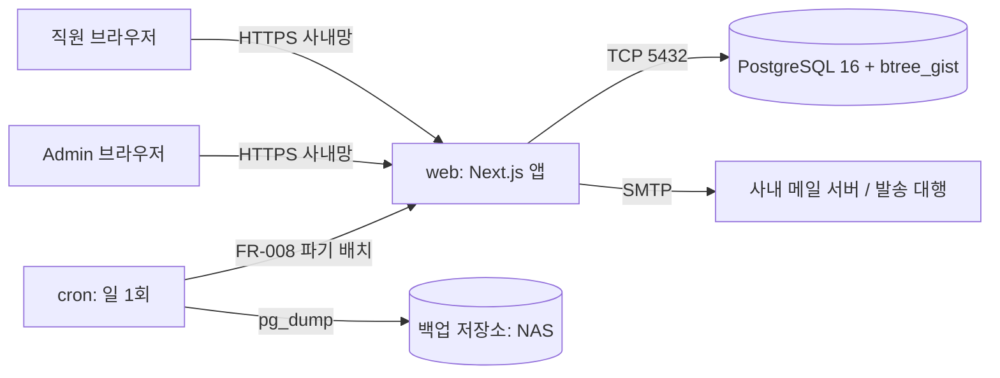
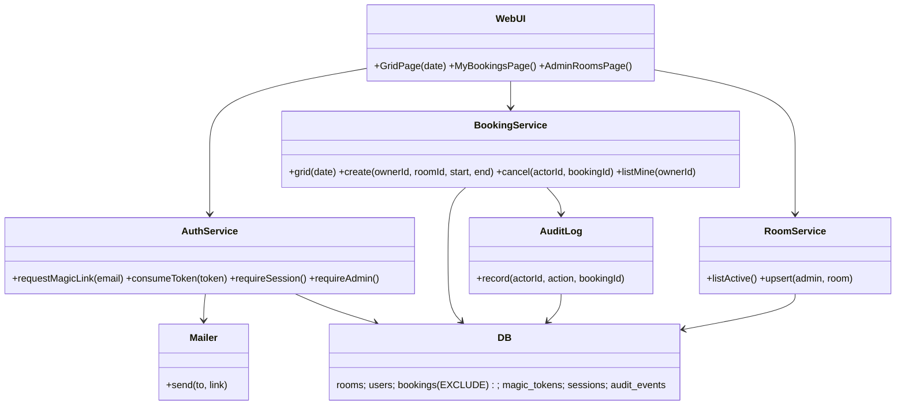
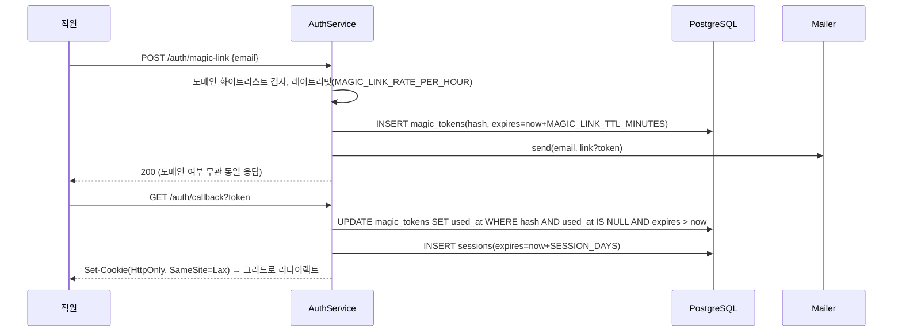

# 아키텍처 — 사내 회의실 예약 (meeting-room-booking)
버전: v1.0 · 기준 03 v1.0 · 강도 lite

## 근거 (진입 사전조사 3줄)
- **정량** — PostgreSQL `EXCLUDE USING gist (room_id WITH =, period WITH &&)`는 겹침 배제를 DB 층에서 보장하며 `btree_gist` 확장이 필요하다 (https://www.postgresql.org/docs/current/rangetypes.html · https://www.jusdb.com/blog/postgresql-range-types-exclusion-constraints, 확인 2026-09-07). 트랜잭션 직렬화·앱 잠금보다 동시성 처리가 단순하다 (https://dev.to/franckpachot/postgresql-exclude-constraints-for-better-concurrency-than-serializable-pob).
- **정성** — "앱 코드나 트리거로 겹침을 막는 방식은 경합 상황에서 새는 경우가 있다"는 실무 경험담이 위 세 출처에 공통으로 등장.
- **사용자 영향** — 동시에 같은 칸을 눌러도 한 명만 성공하고 나머지는 즉시 "이미 예약됐어요 + 다음 빈 슬롯"을 본다 (03 E1, UX-02).

## Context & Scope
사내망의 VM 1대에 웹 앱 + PostgreSQL 컨테이너 2개를 올린다. 사용자는 사내 PC/모바일 브라우저. 외부 의존성은 SMTP 1개(매직링크). 기존 시스템 없음(화이트보드). 규모는 03 상수 `ROOMS_MAX`·`USERS_MAX`.

## Goals / Non-goals
- Goals: INV-1~5를 코드가 아니라 **스키마와 단일 트랜잭션**으로 보장. 1인 운영이 감당할 컴포넌트 수(2개).
- Non-goals: 수평 확장, 멀티 리전, 캘린더 연동, 실시간 푸시(폴링/새로고침으로 충분 — SC-003은 "조회 시점 정확성"만 요구).

## 설계
### 시스템 컨텍스트


### 구현 접근
난점은 하나 — 동시 예약 경합. 해법은 DB EXCLUDE 제약 + 제약 위반(SQLSTATE 23P01)을 409로 변환하는 얇은 계층이다. 그 외는 전부 CRUD. Next.js App Router(서버 컴포넌트가 그리드를 렌더, Route Handler가 JSON API 제공), DB 접근은 SQL 우선 얇은 쿼리 계층 **Drizzle**(drizzle-kit 마이그레이션 + `sql` 템플릿으로 EXCLUDE DDL을 raw SQL로 기술 — https://orm.drizzle.team/docs/overview, 확인 2026-09-07). 팀이 다른 쿼리 빌더를 선호하면 교체해도 05 계약·ERD는 불변이다 (decision-log #15). 폴링 없음: 그리드는 페이지 진입·예약/취소 직후에 다시 조회한다.

### 컴포넌트 구조


### 데이터 흐름
예약 경합 (03 E1):
```mermaid
sequenceDiagram
  participant A as 직원 A
  participant B as 직원 B
  participant BS as BookingService
  participant DB as PostgreSQL
  A->>BS: create(room=1, 10:00-10:30)
  B->>BS: create(room=1, 10:00-10:30)
  BS->>DB: BEGIN; INSERT bookings(status=active, period=[10:00,10:30))
  BS->>DB: BEGIN; INSERT bookings(...)
  DB-->>BS: A: INSERT OK (EXCLUDE 통과) → COMMIT
  DB-->>BS: B: 23P01 exclusion_violation → ROLLBACK
  BS->>DB: A: INSERT audit_events(create)
  BS-->>A: 201 Booking
  BS-->>B: 409 Problem(type=booking-conflict, next_free=10:30)
```
매직링크 로그인 (03 FR-001):


### 데이터 저장 (설계 결정 관련만)
- `bookings.period tstzrange` + `EXCLUDE ... WHERE (status='active')` — INV-1·INV-4. 부분 인덱스 덕에 취소 행은 제약에서 빠진다.
- `users.email` UNIQUE, 소문자 정규화. `role` enum(user/admin). Admin은 seed/환경변수 `ADMIN_EMAILS`로만 지정 (E 위협).
- 시각은 전부 `timestamptz`(INV-5). 슬롯 경계·운영시간 검증은 앱 층(`TZ` 기준)이 하고, DB CHECK는 `lower(period) < upper(period)`만.
- 전체 ERD·컬럼은 05.

## 검토한 대안
| 대안 | 장점 | 단점 | 왜 아닌가 |
|---|---|---|---|
| 앱 층 SELECT-then-INSERT + 트랜잭션 | DB 확장 불필요, 어떤 DB든 가능 | READ COMMITTED에서 경합 시 둘 다 통과 가능, SERIALIZABLE은 재시도 로직 필요 | INV-1을 코드 리뷰에 의존하게 됨 (04 근거 출처) |
| SQLite 단일 파일 | 운영 최소, 백업=파일 복사 | 범위 EXCLUDE 없음 → 위 대안과 동일 문제 | 동시성 보장이 핵심 목표 G1 |
| 실시간 푸시(WebSocket/SSE) | 다른 사람 예약이 즉시 보임 | 연결 관리·재접속 로직, 컴포넌트 +1 | SC-003은 조회 시점 정확성만 요구. 사내 소규모에서 재조회로 충분 (YAGNI) |
| MRBS 도입 | 구축 0 | PHP·GPLv2·모바일 부재 (01) | decision-log #2 |
| 백엔드 분리(FastAPI) + 프론트 별도 | 언어별 최적 | 저장소·배포 2개, 1인 운영 부담 | S2는 팀이 파이썬일 때만 (decision-log #3) |

## 위협모델 (Cross-cutting: 보안)
lite 판정: SKILL.md 신호 표 항목(돈·안전·법·민감정보·외부 노출) 없음 → STRIDE 전수 표 생략, 한 단락으로 기록. 4질문: ① 만드는 것 = 사내망 웹 앱 + DB + SMTP, trust boundary는 브라우저→앱(세션 쿠키)·앱→DB(내부 네트워크)·앱→SMTP 셋. ② 잘못될 수 있는 것은 02 register S/T/R/I/D/E 행에 전부 마킹돼 있다 — 요약하면 매직링크 토큰 탈취·재사용(S), 클라이언트가 보낸 owner/시각 신뢰(T), 취소 부인(R), 타인 이메일 노출(I), 매직링크 발송 남용(D), 일반 사용자의 관리자 기능 접근(E). ③ 대책은 전부 Mitigate — 토큰은 해시 저장·단회·`MAGIC_LINK_TTL_MINUTES` 만료, 세션 쿠키 HttpOnly·SameSite=Lax, 상태 변경은 POST/DELETE만 + Origin 검사, owner_id·actor_id는 세션에서만(INV-3), 모든 입력은 스키마 검증(zod) + 파라미터 쿼리, 감사 로그 테이블(FR-007), 이메일은 본인·Admin에게만 응답, 발송 레이트리밋 `MAGIC_LINK_RATE_PER_HOUR`, Admin 판정은 서버 `requireAdmin()`, 에러 응답에 스택 미노출, 시크릿은 환경변수만. ④ 잔여 리스크: 사내 메일 계정이 탈취되면 그 사람 명의로 예약·취소가 가능하다 — Accept (사내 메일 보안은 이 시스템 범위 밖, 감사 로그로 추적 가능). 인터넷에 노출하기로 결정하는 순간 full 강도 STRIDE 전수 표로 승격한다 (decision-log #9).

## Cross-cutting: 관측성·프라이버시
- 관측성: 구조화 JSON 로그(stdout) — 이벤트 `booking.created/cancelled/conflict`, `auth.link_requested/consumed/failed`, 요청 로그(경로·상태·지연). `/healthz`는 DB `SELECT 1`까지 확인. 지표는 로그에서 파생(요청 수·409 비율·p95). 상세는 07.
- 프라이버시: 저장 개인정보는 이름·이메일뿐. 로그에는 user_id만(이메일·토큰 금지). 보존·파기는 FR-008 + 상수 `BOOKING_RETENTION_DAYS`·`INACTIVE_USER_PURGE_DAYS`.
