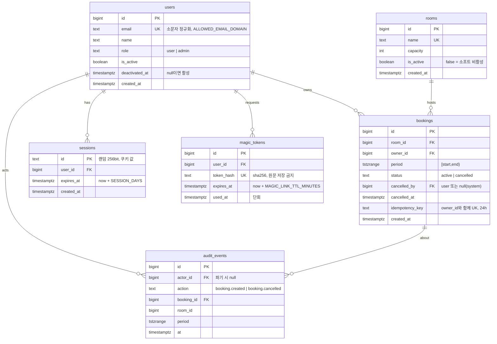

# API 계약 & 데이터 스키마 — 사내 회의실 예약 (meeting-room-booking)
버전: v1.0 · 기준 03 v1.0 · 강도 lite (OpenAPI 스케치 생략, ERD는 엔티티·관계·핵심 컬럼만)

## 규약 (전 엔드포인트 공통)
- 에러 포맷: RFC 9457 Problem JSON `{type, title, status, detail, instance}` + 확장 필드(`errors[]` 필드 오류, `next_free` 충돌 시). `type`은 `urn:mrb:problem:<slug>`. 스택트레이스·SQL 문구 노출 금지 (Zalando #176·#177).
- 버저닝: URL 버저닝 안 함(Zalando #115). 사내 단일 클라이언트라 v1은 무버전, 깨는 변경이 생기면 `Accept: application/vnd.mrb.v2+json` 미디어타입으로 분기. 계약 파일은 semver.
- 페이지네이션: 목록 중 커질 수 있는 것은 감사 로그뿐 → 커서 기반(`cursor`, `limit`≤100, 응답 `next_cursor`). 내 예약 목록은 상한이 `MAX_ACTIVE_BOOKINGS_PER_USER`라 페이지네이션 없음. 그리드는 하루 단위 고정.
- 멱등성: `POST /api/bookings`는 `Idempotency-Key` 헤더(클라 UUID) 필수. 서버는 (user_id, key)로 24h 보관하고 재시도 시 최초 응답을 재생(Stripe 방식). `DELETE`는 본래 멱등(이미 취소된 예약도 200).
- 시각: 요청·응답 모두 UTC ISO 8601(`2026-09-08T01:00:00Z`). 날짜 파라미터(`date`)만 `TZ` 기준 `YYYY-MM-DD`.
- 네이밍: 경로 kebab-case·복수 명사, JSON 필드 snake_case. 권한 스코프 `mrb:<자원>:<행위>`; 역할 매핑 user=`mrb:booking:read/write`·`mrb:room:read`, admin=user + `mrb:room:manage`·`mrb:audit:read`·`mrb:booking:manage`.
- 인증: 세션 쿠키(`HttpOnly; SameSite=Lax; Secure`). 미인증 401, 권한 부족 403. 상태 변경 요청은 `Origin` 헤더가 자기 오리진이어야 한다(CSRF).
- 레이트리밋: `POST /auth/magic-link` 이메일당 `MAGIC_LINK_RATE_PER_HOUR` → 초과 시 429 + `Retry-After`. 그 외는 사내망이라 미적용.

## 엔드포인트 표
| ID | 메서드 경로 | 요청(핵심 필드) | 응답 | 주요 에러(RFC 9457 type slug) | 권한 스코프 |
|---|---|---|---|---|---|
| EP-01 | `POST /auth/magic-link` | `{email}` | 200 `{}` — 도메인 여부와 무관하게 동일 (03 E9) | 422 `validation`(형식) · 429 `rate-limited` · 503 `mail-unavailable`(03 E12) | 공개 |
| EP-02 | `GET /auth/callback?token=` | 쿼리 `token` | 302 → `/` + `Set-Cookie: session` | 400 `invalid-token`(만료·사용됨 → 로그인 화면 + 다시 보내기, 03 E10) | 공개 |
| EP-03 | `POST /auth/logout` | — | 204, 세션 행 삭제 + 쿠키 만료 | 401 | 로그인 |
| EP-04 | `GET /api/grid?date=YYYY-MM-DD` | `date`(기본 오늘, 범위 오늘−1 ~ 오늘+`MAX_ADVANCE_DAYS`) | 200 `{date, slot_minutes, open, close, rooms:[{id,name,capacity,bookings:[{id,start,end,owner_name,mine}]}]}` — 활성 Room·활성 Booking만 | 401 · 422 `validation`(날짜 범위) | `mrb:booking:read` |
| EP-05 | `POST /api/bookings` (+`Idempotency-Key`) | `{room_id, start, end}` — owner는 세션(INV-3) | 201 `{id, room_id, start, end, status:"active", owner:{id,name}}` + `Location` | 409 `booking-conflict` + `next_free`(INV-1, 03 E1·E2) · 422 `validation` + `errors[]`(INV-2, 03 E4~E6: `slot-boundary`/`past`/`outside-hours`/`too-long`/`too-far`/`quota`) · 404 `room-not-found`(비활성 포함) · 428 `idempotency-key-required` | `mrb:booking:write` |
| EP-06 | `DELETE /api/bookings/{id}` | — | 200 `{id, status:"cancelled", cancelled_at, cancelled_by}` (이미 취소면 동일 200, 감사 로그 추가 없음 — 03 E8) | 403 `not-owner`(03 E7) · 404 `booking-not-found` | `mrb:booking:write` (본인) / `mrb:booking:manage` (Admin) |
| EP-07 | `GET /api/me/bookings` | — | 200 `{items:[{id, room:{id,name,is_active}, start, end}]}` 시작 시각 순, 활성·미래(종료 > 현재)만 (03 E11: `room.is_active=false` 표시) | 401 | `mrb:booking:read` |
| EP-08 | `GET /api/rooms` | `?include_inactive=true`(Admin만 유효) | 200 `{items:[{id,name,capacity,is_active}]}` | 401 | `mrb:room:read` |
| EP-09 | `POST /api/rooms` | `{name, capacity}` | 201 + `Location` | 409 `room-name-taken` · 422 `validation` · 403 | `mrb:room:manage` |
| EP-10 | `PATCH /api/rooms/{id}` | `{name?, capacity?, is_active?}` | 200 Room — 비활성화해도 기존 활성 Booking 유지 (FR-006) | 404 · 409 · 422 · 403 | `mrb:room:manage` |
| EP-11 | `GET /api/audit-events?cursor=&limit=&booking_id=` | 커서 | 200 `{items:[{id, at, actor:{id,name}, action:"booking.created"\|"booking.cancelled", booking_id, room_id, period}], next_cursor}` | 403 | `mrb:audit:read` |
| EP-12 | `GET /healthz` | — | 200 `{db:"ok"}` (DB `SELECT 1` 포함) | 503 | 공개(사내망) |
| JOB-01 | 스케줄 `purge` (일 1회 03:00 `TZ`) | — | `bookings` 중 `upper(period) < now − BOOKING_RETENTION_DAYS` 삭제, `users` 중 `is_active=false AND deactivated_at < now − INACTIVE_USER_PURGE_DAYS` 삭제(연관 감사 로그의 actor는 `NULL`로), 결과 건수 로그 | 실패 시 로그 `job.purge.failed` + 다음 날 재시도 | 시스템 |
| EP-13 (P2) | `POST /api/bookings/{id}/check-in` · JOB-02 `auto-release`(매 분) | — | 스케치만: 체크인 없으면 시작+`AUTO_RELEASE_MINUTES`에 `cancelled_by=system` | — | `mrb:booking:write` |
| EP-14 (P2) | `GET /api/rooms/{id}/utilization?week=` | — | 스케치만: 활성 예약 분 / 운영 분 | — | `mrb:room:manage` |

## ERD


핵심 DDL 스케치 (INV-1·INV-4, 전문은 마이그레이션에서):
```sql
CREATE EXTENSION IF NOT EXISTS btree_gist;
ALTER TABLE bookings
  ADD CONSTRAINT bookings_no_overlap
  EXCLUDE USING gist (room_id WITH =, period WITH &&) WHERE (status = 'active'),
  ADD CONSTRAINT bookings_period_valid CHECK (lower(period) < upper(period));
CREATE INDEX bookings_room_day_active ON bookings (room_id, lower(period)) WHERE status = 'active';   -- EP-04 그리드
CREATE INDEX bookings_owner_active   ON bookings (owner_id) WHERE status = 'active';                   -- EP-07·quota
CREATE UNIQUE INDEX bookings_idem ON bookings (owner_id, idempotency_key) WHERE idempotency_key IS NOT NULL;
CREATE INDEX audit_events_at ON audit_events (at DESC);                                                  -- EP-11 커서
```

## 데이터 규칙
- 식별자: `bigint GENERATED ALWAYS AS IDENTITY`(postgres-patterns 권고). 세션 id만 랜덤 텍스트.
- 시각: 저장 `timestamptz`(UTC), API는 ISO 8601 UTC, 슬롯·운영시간 검증은 앱 층에서 `TZ`로 변환 후 수행(INV-2·INV-5).
- 소프트 삭제: `bookings.status`, `rooms.is_active`, `users.is_active`. 물리 삭제는 JOB-01만.
- 보존: `BOOKING_RETENTION_DAYS`·`INACTIVE_USER_PURGE_DAYS`(03 상수). 세션·매직 토큰은 만료 후 JOB-01이 함께 정리.
- 개인정보: 응답에 이메일은 `GET /api/me/*`와 Admin 화면에만. 그리드·감사 로그는 `name`만.
- 텍스트 길이: `name` ≤ 50, `rooms.name` ≤ 50, `capacity` 1~200 — zod와 DB CHECK 양쪽.

## 커버리지 매핑 (P0·P1 매핑 0건 = 결함)
| FR-ID | 우선순위 | 담당 엔드포인트/이벤트 |
|---|---|---|
| FR-001 | P0 | EP-01, EP-02, EP-03 (+ sessions·magic_tokens) |
| FR-002 | P0 | EP-04 |
| FR-003 | P0 | EP-05 (+ `bookings_no_overlap`, zod 검증, Idempotency-Key) |
| FR-004 | P0 | EP-06 |
| FR-005 | P1 | EP-07 (+ EP-06 취소) |
| FR-006 | P1 | EP-08, EP-09, EP-10 |
| FR-007 | P1 | EP-11 (+ EP-05·EP-06이 `audit_events` 기록) |
| FR-008 | P1 | JOB-01 |
| FR-009 | P2 | EP-13, JOB-02 (스케치) |
| FR-010 | P2 | EP-14 (스케치) |
P0·P1 8건 모두 매핑됨. 역방향: 매핑되지 않은 엔드포인트 없음(EP-12 healthz는 07 운영 요구).
