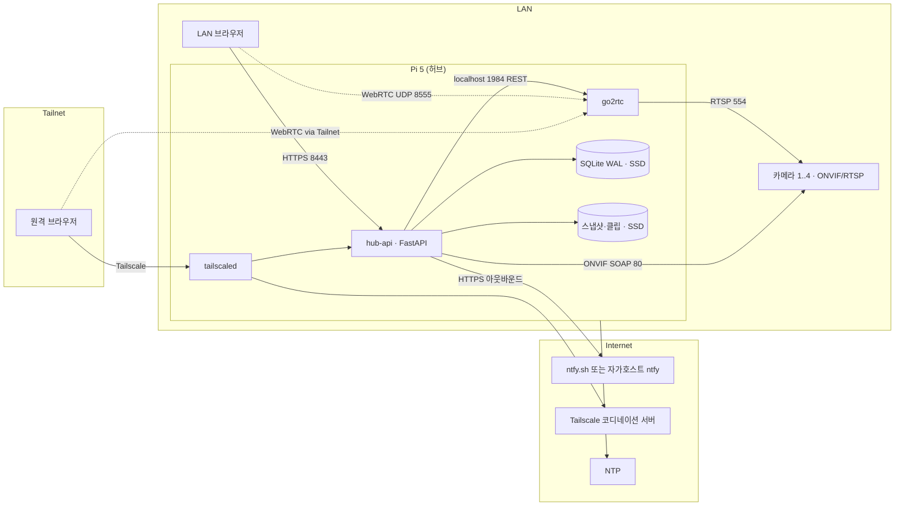
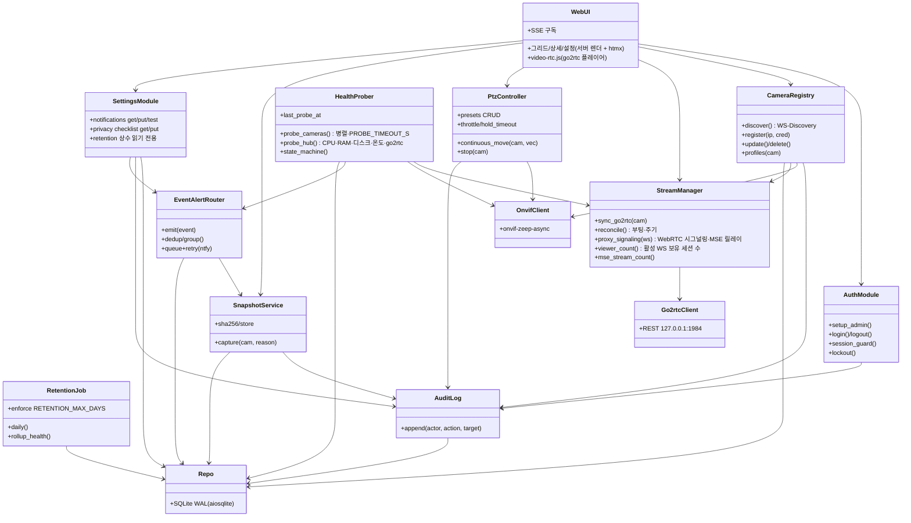
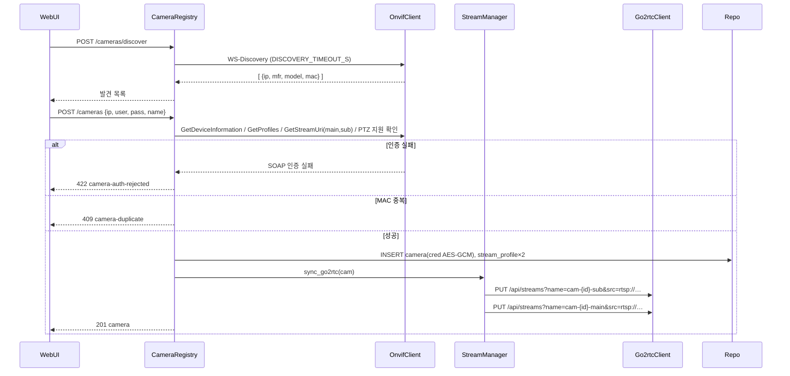
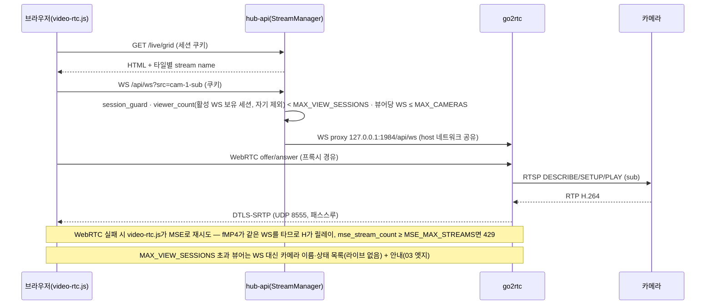
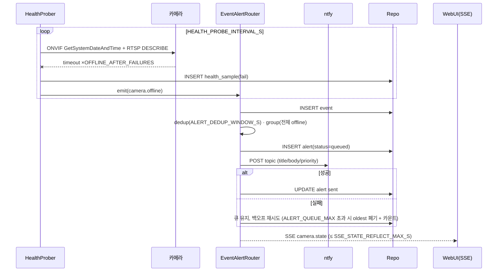
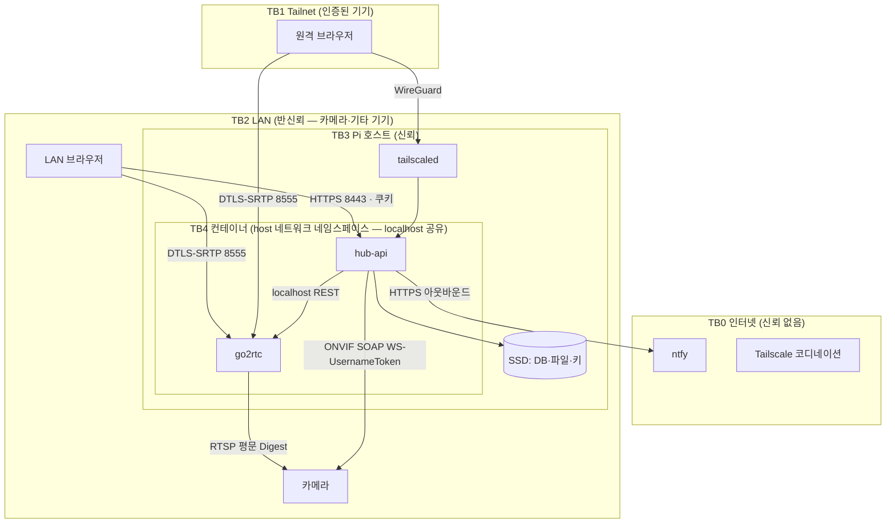

# 아키텍처 — PiCam Hub
버전: v1.3 · 기준 03 v1.3 · 작성 2026-09-07 · v1.3(GATE 반영): 자가복구=내부 감시 exit(1)·healthcheck 관측용, RTSP 프로브 무인증, 상태값 4종, A7-I Accept, 감사 단위, FR-018 프록시 필터, docker data-root SSD, 스테일 문구 정정 · v1.1: 등록 시퀀스 에러 코드를 03 v1.1에 맞춤 · v1.2: A4 독립 검토(fable) 12건 반영 — host 네트워크 통일·go2rtc 8554 비활성·스트림 reconcile·MSE 릴레이 명시·세션=뷰어·healthcheck·A4-S/A5-I 정정·Settings 컴포넌트·YAGNI 제거

## 근거 (단계 진입 사전조사 — 추가 검색 0회, 01 재사용)
- **정량** — go2rtc README: WebRTC H.265는 Chrome 136+/Safari 18+만, HLS는 "live에 최악" (2026-09-07 확인) → 브라우저 전달은 WebRTC→MSE 순, HLS 미채택.
- **정성** — "MediaMTX→go2rtc 직렬 구성에서 프레임 드랍" (go2rtc issue #658, 01) → 게이트웨이는 하나만.
- **사용자 영향** — 타일이 끊겨도 나머지 3타일은 계속 재생(L-06), 상태 배지는 SSE_STATE_REFLECT_MAX_S 내 갱신.

## Context & Scope
Pi 5 1대가 LAN의 ONVIF/RTSP 카메라 ≤ MAX_CAMERAS를 묶어 브라우저(LAN 또는 Tailscale)로 라이브·PTZ·상태·알림을 제공한다. 기존 시스템 없음. 인터넷은 있지만 인바운드 포트는 열지 않는다. 카메라는 대부분 RTSP 평문·Digest 인증만 지원한다(01). 허브는 영상을 트랜스코딩하지 않는다(INV-4).

## Goals / Non-goals
- Goals: 03 G1~G3. 단일 노드에서 P0/P1 전부. 1인 운영자가 `install.sh` 1개로 설치.
- Non-goals: 03 범위 밖 전부(객체 감지·24/7 녹화·다중 사이트·다중 사용자). 카메라 측 설정 변경.

## 설계

### 시스템 컨텍스트

### 구현 접근 (난점 → 선택)
| 난점 | 선택 | 왜 |
|---|---|---|
| 브라우저에서 RTSP를 못 본다 | **go2rtc**가 RTSP를 받아 WebRTC(폴백 MSE)로 전달. 허브는 go2rtc REST(`/api/streams`)로 스트림을 등록·삭제 | 01 fit. 재인코딩 없음 → Pi 5의 H.264 HW 디코더 부재가 무관 |
| go2rtc를 직접 노출하면 인증 우회 | go2rtc는 `go2rtc.yaml`로 **api `127.0.0.1:1984` · rtsp 서버 비활성(`rtsp: listen: ""`, 기본 8554 무인증 재배포 차단) · webrtc `:8555`**만 연다. hub-api·go2rtc **둘 다 `network_mode: host`** — 같은 네트워크 네임스페이스라야 hub-api가 127.0.0.1:1984에 닿는다(브리지+host 혼용은 localhost가 달라 불가). 브라우저 WebRTC **시그널링(WS `/api/ws`)은 hub-api가 세션 검사 후 리버스 프록시**, WebRTC 미디어(DTLS-SRTP)는 go2rtc `:8555`로 직접. **MSE 폴백은 같은 WS로 fMP4가 흐르므로 hub-api가 릴레이** → MSE_MAX_STREAMS 상한 | 시그널링 없이는 미디어 세션이 열리지 않는다. 격리는 compose 네트워크가 아니라 **바인딩 주소**로 |
| PTZ는 카메라마다 SOAP 세부가 다르다 | **onvif-zeep-async**로 PTZ·Media·Device·Events(P2) 호출. 카메라별 `PTZConfiguration` 토큰을 등록 시 캐시 | 01 fit(Healthy, PTZ 지원) |
| 헬스 판정의 오탐 | 프로브 2종(ONVIF `GetSystemDateAndTime`(무인증) + RTSP `DESCRIBE` **자격증명 없이** — 401·200 모두 생존, Digest 해시도 내보내지 않음)을 **병렬로, 각 PROBE_TIMEOUT_S**, HEALTH_PROBE_INTERVAL_S마다. 상태 4종은 03 FR-009 정의(unknown/online/degraded/offline) — RTSP 연속 실패만 offline (최악 감지 55s). 허브 프로브는 go2rtc `/api` 생존 + **스트림 목록 대조(DB↔go2rtc) → 불일치 시 StreamManager.reconcile** — go2rtc는 REST로 넣은 스트림을 영속하지 않아 재시작 시 사라지기 때문 | 03 FR-009 · A4 검토 #3·#6 |
| 알림 폭주·채널 장애 | 이벤트→알림 라우터가 ALERT_DEDUP_WINDOW_S 억제·그룹핑 후 로컬 큐(SQLite 테이블, ALERT_QUEUE_MAX)로 재전송 | 03 FR-010·017 |
| SD 마모 | DB·스냅샷·클립·**docker data-root(이미지·컨테이너·json-file 로그)**는 USB SSD `/data`, 호스트 `/var/log`는 log2ram, rootfs `noatime`. go2rtc는 영속 상태 없음 | 02 P1 · GATE #6 |
| 스냅샷 | 1순위 ONVIF `GetSnapshotUri`를 hub-api가 GET(Digest) → SSD. 폴백 go2rtc `/api/frame.jpeg`(단일 키프레임, INV-4 예외) | 카메라 CPU로 JPEG 생성, Pi 부담 0 |
| 프로세스 모델 | **docker compose 2서비스**(hub-api·go2rtc, 둘 다 host 네트워크; ntfy 자가호스트는 compose `profiles: [selfhost]`로 선택) + 호스트의 tailscaled·log2ram·HW watchdog. 생존은 **hub-api 내부 감시 태스크**(마지막 프로브 경과 > PROBE_STALE_FACTOR×HEALTH_PROBE_INTERVAL_S → 로그 후 `exit(1)`) + `restart: unless-stopped`. docker healthcheck(HEALTHCHECK_INTERVAL_S)는 unhealthy를 **표시만** 하고 재시작하지 않으며(Swarm 아님, GATE #1), systemd WatchdogSec는 컨테이너 프로세스에 전달되지 않는다 | 07 OTA = `compose pull` 롤백 용이 · A4 검토 #1·#7 |

### 컴포넌트 구조

### 데이터 흐름

**① 카메라 등록 (FR-002·003)**

**② 라이브 시청 (FR-005·006)**

**③ 헬스 → offline → 알림 (FR-009·010·011·012·017)**

**④ PTZ (FR-007·008)** — 브라우저가 패드 press 시 `POST /cameras/{id}/ptz/move {pan,tilt,zoom}`를 PTZ_THROTTLE_MS마다 재전송(keepalive), release 시 `POST …/ptz/stop`. hub-api는 마지막 명령만 카메라에 `ContinuousMove(Timeout=PTZ_HOLD_TIMEOUT_MS)`로 전달하고, PTZ_HOLD_TIMEOUT_MS 동안 keepalive가 없으면 서버가 `Stop`을 보낸다. Timeout을 카메라에 함께 보내므로 **허브가 죽어도 카메라가 스스로 멈춘다**. 감사는 **누름(첫 move)·뗌(stop)·프리셋 단위**로 append — keepalive 재전송은 기록하지 않는다(초당 10행 SSD 쓰기 방지, GATE #12).

### 데이터 저장 (설계 결정 관련만 — 전체 스키마는 05)
- SQLite 파일 1개(`/data/hub.db`, WAL, `synchronous=NORMAL`), 쓰기는 hub-api 단일 프로세스. 헬스 샘플은 카메라당 HEALTH_PROBE_INTERVAL_S마다 1행 → MAX_CAMERAS × 86400 / HEALTH_PROBE_INTERVAL_S ≈ 1.4만 행/일(계산값), HEALTH_RAW_RETENTION_DAYS 보존 후 삭제(FR-015; 시간 요약은 P2).
- 파일: `/data/snapshots/{cam_id}/{ts}.jpg`, `/data/clips/{cam_id}/{event_id}.mp4`(P2). DB 행에 경로+SHA-256.
- 자격증명: `camera.cred_enc`(AES-256-GCM, 키는 `/etc/picam/master.key` 0600, 컨테이너에 read-only 마운트). go2rtc 스트림 소스 URL에는 평문이 들어가므로 go2rtc는 API를 localhost에만 열고 스트림은 REST로만 등록한다(메모리 상주, 디스크에 평문 URL 없음). `go2rtc.yaml`은 listen 설정만(자격증명 없음). **go2rtc는 영속 상태가 없으므로 재시작 시 StreamManager.reconcile이 DB에서 전부 재등록**한다.

## 검토한 대안 (ADR 요약 — 상세 근거는 01 fit·decision-log)
| ADR | 결정 | 대안 → 왜 아닌가 | 결과(트레이드오프) |
|---|---|---|---|
| ADR-1 스트림 엔진 | go2rtc 채택 | MediaMTX: ONVIF 소스 없음, 직렬 구성 시 드랍 보고 / 자체 구현(aiortc): 브라우저 호환표를 다시 밟음 | go2rtc 버전 업그레이드에 시그널링 API 호환을 따라가야 함(핀 고정) |
| ADR-2 제어층 | Python 3.12 FastAPI | Node(agsh/onvif): 라이선스·통계 미확인 / Go(use-go/onvif): 유지보수 미확인 | 메모리 ≈ 60~100MB(추론, 07에서 실측) |
| ADR-3 저장 | SQLite WAL on SSD | Postgres: 프로세스·RAM 과잉 / SD 위 SQLite: 마모 | 단일 writer 전제 — 멀티프로세스 전환 시 재검토 |
| ADR-4 원격 | Tailscale | Cloudflare Tunnel: 영상 제3자 경유 / 포트포워딩: 금지 | 뷰어 기기마다 클라이언트 필요 |
| ADR-5 시그널링 보호 | hub-api WS 리버스 프록시 + 세션 쿠키 | go2rtc 직접 노출: 인증 우회 / go2rtc 내장 basic auth: 쿠키 세션과 이중 관리 | WebRTC: 프록시 홉은 시그널링만(미디어 경로 없음). **MSE 폴백: fMP4가 같은 WS를 타므로 hub-api(uvicorn 워커 1)가 릴레이** — MSE_MAX_STREAMS × SUB_STREAM_MAX 비트레이트로 제한, 07 lab(T-048)에서 실측 |
| ADR-6 프로세스 | docker compose(hub-api·go2rtc 모두 host 네트워크) + 호스트 tailscaled | bare systemd 전부: 롤백이 파일 복사 / 전부 컨테이너(tailscale 포함): TUN 권한 복잡 / hub-api만 브리지: localhost 분리로 go2rtc API 접근 불가 | 이미지 크기·arm64 빌드 CI 필요. 네트워크 격리 없음 → 바인딩 주소·cap_drop으로 대체 |
| ADR-7 프론트 | 서버 렌더 + htmx + video-rtc.js | React SPA: 화면 3장에 빌드 체인 과잉 | 화면 5장 넘으면 재검토 |

## 위협모델

### ① 무엇을 만드는가 — DFD + trust boundary

### ② 무엇이 잘못될 수 있는가 — STRIDE (경계·자산별, 해당없음도 근거)
| 자산/경계 | S | T | R | I | D | E |
|---|---|---|---|---|---|---|
| A1 브라우저→hub-api (TB2/TB1→TB4) | 세션 쿠키 탈취·비밀번호 추측 | 요청 변조(CSRF로 PTZ·삭제) | 관리자가 "내가 안 지웠다" | 라이브·스냅샷 URL 무단 열람 | 로그인 폭주·WS 세션 고갈 | 해당없음(권한 1종 — 수직 상승 대상 없음), 단 미인증→인증 우회가 EoP에 해당 |
| A2 WebRTC 미디어 (→go2rtc 8555) | 위조 ICE 후보로 세션 가로채기 | 해당없음(DTLS-SRTP 무결성) | 해당없음(미디어에 행위 없음) | 시그널링 없이 미디어 수신 | UDP 플러딩 | 해당없음 |
| A3 go2rtc 리스너 (api 1984 localhost · rtsp 8554 **비활성** · webrtc 8555) (TB4) | 호스트 프로세스 위장 | 스트림 소스 URL 변조(다른 카메라로 바꿔치기) | 해당없음(hub-api만 호출) | 스트림 목록에 평문 자격증명 URL; **기본 RTSP 서버(8554)는 무인증 재배포 → 비활성 필수** | 해당없음(localhost) | 호스트 셸 획득 시 전권 — 호스트 보안에 종속 |
| A4 hub-api↔카메라 ONVIF/RTSP (TB4→TB2) | 가짜 카메라(ARP 스푸핑)로 허브 자격증명 수집 | LAN 도청자가 RTSP/RTP 변조 | 해당없음 | **RTSP·ONVIF 평문 — LAN 도청 시 영상·자격증명 노출** | 카메라 응답 지연으로 프로브 스레드 고갈 | 카메라 펌웨어 취약점으로 허브 역공격 |
| A5 SSD 데이터(DB·스냅샷·키) (TB3) | 해당없음 | 파일 변조·삭제 | 감사 로그 삭제 | SSD 물리 탈취 시 영상·자격증명 | 디스크 풀 | 컨테이너 탈출 → 키 파일 |
| A6 알림 채널 ntfy (TB4→TB0) | 가짜 ntfy 서버(DNS 스푸핑) | 알림 내용 변조 | 해당없음 | **알림 본문에 카메라 이름·상태가 제3자 서버 경유**(ntfy.sh 사용 시) | 채널 다운으로 알림 유실 | 해당없음 |
| A7 호스트 OS·SD·Docker (TB3) | 해당없음 | SD 이미지 변조(물리) | 해당없음 | **SD 위 `master.key`·`.env`(세션·서명 비밀) 평문** — 물리 탈취 시 노출(네트워크 경로는 INV-5로 없음) | 전원 차단·SD 마모·과열 | 컨테이너 권한 과다(`privileged`) |

### ③ 무엇을 할 것인가
| 위협 | 처리 | 대책 (구현 지점) |
|---|---|---|
| A1-S 세션 탈취·추측 | Mitigate | argon2id, PASSWORD_MIN_LEN, **출발 IP 기준** LOGIN_LOCKOUT_FAILS/MIN + 지수 지연(계정 잠금이면 내부자가 유일한 운영자를 무한 잠글 수 있음 — A4 검토 #11), 쿠키 `HttpOnly; Secure; SameSite=Strict`, SESSION_TTL_H, 자체 서명 TLS(설치 시 생성) + Tailscale 경로는 WireGuard |
| A1-T CSRF | Mitigate | SameSite=Strict + 상태 변경은 커스텀 헤더 `X-Requested-With` 검사(htmx 기본) |
| A1-R 부인 | Mitigate | AuditLog append-only(INV-6) — 로그인·PTZ·설정·삭제 |
| A1-I 무단 열람 | Mitigate | 전 라우트 session_guard, 스냅샷은 서명 URL(만료 SESSION_TTL_H 이하), 디렉터리 리스팅 금지 |
| A1-D 폭주 | Mitigate | 로그인 레이트리밋 LOGIN_RATE_PER_MIN(IP당), 뷰어 MAX_VIEW_SESSIONS · MSE MSE_MAX_STREAMS, uvicorn 워커 1 + 연결 상한 |
| A1-E 인증 우회 | Mitigate | 프록시된 `/api/ws`를 포함한 모든 경로가 동일 guard 뒤. 06 계약 테스트 "쿠키 없이 401" |
| A2-S/I 시그널링 우회 | Mitigate | go2rtc WebRTC는 시그널링 없이 세션을 만들 수 없음. ICE 서버 없음(LAN·Tailnet 직결) → 외부 STUN 미사용 |
| A2-D UDP 플러딩 | Accept | LAN·Tailnet 한정 노출. 인터넷 노출 없음(INV-5). 잔여: LAN 내부자 |
| A3-S/T/I go2rtc API | Mitigate | api `127.0.0.1:1984` 바인딩, hub-api만 호출, 스트림 이름은 hub가 결정 |
| A3-I go2rtc RTSP 재배포 서버(8554) | **Eliminate** | `go2rtc.yaml` `rtsp: listen: ""`로 비활성. 06 계약 테스트 "8554·1984 외부 인터페이스에서 닫힘" |
| A3-E 호스트 셸 | Transfer→호스트 보안 | SSH 키 전용·비밀번호 로그인 금지·자동 보안 업데이트(`unattended-upgrades`) — 07 |
| A4-I **RTSP·ONVIF 평문** | **Accept(사유)** | 카메라 대부분 RTSPS/HTTPS 미지원(01). 완화: 카메라 전용 VLAN 권고(설정 체크리스트), 허브가 카메라 자격증명을 다른 용도로 재사용하지 않음, 카메라 비밀번호는 카메라별 고유 권고. 잔여: LAN 도청자 |
| A4-S 가짜 카메라 | Mitigate(부분)+Accept | 등록·IP 변경 시 `GetDeviceInformation` 시리얼 대조(IP 변경 시 불일치 → 409 camera-identity-mismatch, 변경 거부). 주기 프로브는 `GetSystemDateAndTime`(무인증)과 **자격증명 없는 RTSP DESCRIBE**(401도 생존으로 간주)라 비밀번호도 Digest 해시도 유출 없음(GATE #11). 등록 시 사용자가 고른 IP에 자격증명을 보내는 것은 불가피 → Accept(발견 목록의 제조사·MAC을 사용자가 확인) |
| A4-D 프로브 고갈 | Mitigate | 프로브 타임아웃 PROBE_TIMEOUT_S, 카메라당 세마포어 1, asyncio 태스크 격리 |
| A4-E 카메라→허브 역공격 | Mitigate | 허브는 카메라로부터 인바운드 연결을 받지 않음(P2 PullPoint도 허브가 폴링). zeep XML 파서 외부 엔티티 비활성 |
| A5-T/R 파일·감사 변조 | Mitigate | 감사 테이블 UPDATE/DELETE 거부 트리거, 스냅샷 SHA-256, 일 1회 `integrity_check` |
| A5-I 기기 물리 탈취 | Accept(사유) | 전체 디스크 암호화는 무인 부팅 시 키 보관 문제(TPM 없음)로 non-goal. **Pi를 통째로 가져가면 키(SD)와 데이터(SSD)가 함께 넘어가 자격증명·영상 모두 복호·열람 가능 — 완화가 아니라 수용이다.** 노출 창은 RETENTION_MAX_DAYS 이내 스냅샷·클립. go2rtc는 영속 상태 없음(평문 URL 디스크 잔존 없음). 물리 보안은 FR-019 체크리스트로 사용자에게 고지 |
| A5-D 디스크 풀 | Mitigate | DISK_MIN_FREE_PCT 알림, DISK_STOP_PCT 생성 거부 + oldest-first 삭제(FR-014·엣지) |
| A5-E 컨테이너 탈출 | Mitigate | non-root 사용자, `cap_drop: ALL`, read-only rootfs 컨테이너(+ tmpfs), `privileged` 금지. host 네트워크는 둘 다(권한 상승은 아님) |
| A6-S/T 가짜 ntfy | Mitigate | HTTPS + 인증서 검증, 자가호스트면 Tailnet 내부 주소 |
| A6-I 알림 본문 제3자 경유 | Mitigate | 본문에 영상·스냅샷 첨부 금지(링크만, 링크는 Tailnet 전용), 카메라 이름은 사용자가 정한 별칭. ntfy.sh 대신 자가호스트 권장(설정 화면 기본값은 자가호스트 URL 안내) |
| A6-D 채널 다운 | Mitigate | 로컬 큐 ALERT_QUEUE_MAX + 백오프 재전송(FR-017) |
| A7-T SD 물리 변조 | Accept | 물리 접근 가능한 공격자는 범위 밖(1인 소규모 사업장) |
| A7-D 전원·마모·과열 | Mitigate | HW watchdog HW_WATCHDOG_S, 내부 감시 태스크 `exit(1)`(프로브 태스크가 죽으면 UI만 살아 알림이 무음 중단되는 것을 잡는다) + `restart: unless-stopped`, docker healthcheck는 관측용, log2ram, SSD, 온도 프로브(FR-009) + HUB_TEMP_MAX_C 초과 이벤트 |
| A7-E 권한 과다 | Mitigate | 위 A5-E와 동일 compose 하드닝 |
| A7-I SD 위 비밀 평문 | Accept(사유) | A5-I와 같은 물리 탈취 시나리오. TPM 없는 무인 부팅에서 키를 숨길 곳이 없다. 완화: `.env`·`master.key` 0600·root 소유, 비밀은 install.sh가 생성(재사용 없음), 탈취 인지 시 세션·서명 비밀 회전 절차(07 RB) |

### ④ 충분한가 — 상위 리스크 3 재검토
1. **A4-I RTSP 평문(Accept)** — 가장 큰 잔여 리스크. 소규모 사업장 LAN에 손님 Wi-Fi가 같은 세그먼트면 도청 가능. 대책: 설치 체크리스트에 "카메라·허브 전용 VLAN/별도 SSID" 필수 항목, 07 런북에 포함. 재검토 조건: RTSPS 지원 카메라가 대상 목록에 들어오면 우선 사용.
2. **A1 인증 계층 단일 실패점** — 관리자 1계정·세션 쿠키. 대책: 자체 서명 TLS 강제, 잠금, Tailscale 경로에서는 Tailscale ACL로 2중. 잔여: 관리자 PC 자체 감염.
3. **A5-I 기기 물리 탈취** — Pi 통째 탈취 시 자격증명·영상 전부 열람 가능(수용). 대책: 보관 상한(INV-2)로 노출 창 제한, 카메라 비밀번호는 카메라별 고유 권고(허브 탈취가 다른 시스템으로 번지지 않게), 물리 보안 고지(FR-019). 잔여: 물리 탈취.

잔여 리스크 총괄: LAN 내부자 도청·물리 탈취·관리자 단말 감염 — 전부 "소규모 사업장 1인 운영" 전제에서 Accept, 재검토 조건을 위에 명시.

## Cross-cutting
- **관측성**: hub-api가 구조화 JSON 로그(stdout → docker json-file, log2ram 경유 로테이션) + `GET /api/hub/status`(E-22, JSON)로 카메라 상태·프로브 지연·뷰어 수·알림 큐 길이·CPU/디스크/온도. Prometheus `/metrics`는 소비자 없음(1인 운영) → P2. 상세는 07.
- **프라이버시**: 영상은 Pi 밖으로 나가지 않는다(Tailnet 제외). 알림 본문에 영상 없음. 보관 상한 RETENTION_MAX_DAYS 하드코딩(INV-2). 오디오 없음(FR-018). 로그에 자격증명·RTSP URL 마스킹(INV-3). 운영자 체크리스트(FR-019)가 §25 안내판·운영방침을 상기시킨다.
