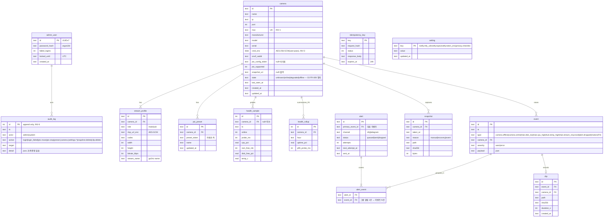

# API 계약 & 데이터 스키마 — PiCam Hub
버전: v1.2 · 기준 03 v1.3 · 작성 2026-09-07 · v1.2(GATE 반영): 403 csrf-header-required, detail 상수 템플릿, 그룹 알림 alert_event, 체크리스트 4항목, RTSP 프로브 무인증, FR-018 프록시 필터, 운영 기본값 상수명, health_rollup P2 · v1.1: A4 검토 반영 — 잠금 IP 기준, 시청 세션=뷰어·MSE 상한, camera-identity-mismatch, PTZ Timeout, healthcheck 응답, reconcile, 감사 무기한, 롤업 P2

## 근거 (단계 진입 사전조사 — 추가 검색 0회)
- **정량** — go2rtc 시그널링은 단일 WS `/api/ws?src=<name>` (README, 2026-09-07) → 허브는 이 경로 하나만 프록시하면 된다.
- **정성** — Frigate 사용자 불만 "오탐 피로"(01) → MVP 알림 유형을 상태 변화(offline/online/disk)로 한정, 모션은 P2로 분리.
- **사용자 영향** — 에러 응답의 `detail`이 그대로 화면 문구(해요체, T-09)가 되도록 서버가 사용자 문장을 내려보낸다(UX-02 복구 CTA 포함).

## 규약 (전 엔드포인트 공통)
- **베이스**: `https://<hub>:8443/api`. HTML 화면은 `/`·`/cameras/{id}`·`/settings`(서버 렌더, 같은 세션).
- **인증**: 세션 쿠키 `picam_session` (HttpOnly·Secure·SameSite=Strict, SESSION_TTL_H). `E-01`·`E-02`·`E-20`·`E-25`(서명 URL) 외 전부 쿠키 필수 → 없으면 `401 session-required`. 상태 변경 요청은 `X-Requested-With: XMLHttpRequest` 헤더 필수 — 없으면 `403 csrf-header-required`(04 A1-T).
- **에러 포맷**: RFC 9457 `application/problem+json` — `type`(`https://picam.local/problems/<slug>`), `title`, `status`, `detail`(사용자 문장·해요체), `instance`, 선택 `errors[]`(필드별). 스택트레이스·내부 예외 문구 금지 (Zalando #176·#177).
- **버저닝**: URL에 버전 없음(Zalando #115). `Accept: application/vnd.picam.v1+json` 생략 시 v1. 스펙 파일 semver(`openapi.yaml` 1.0.0). ecc:api-design은 `/api/v1/`을 권하나 stage-templates 규약이 우선(decision-log).
- **페이지네이션**: 목록은 커서 `?cursor=<opaque>&limit=<1..PAGE_LIMIT_MAX>`(기본 PAGE_LIMIT_DEFAULT), 응답 `meta.next_cursor`(없으면 null). offset 없음 (Zalando #160). 카메라 목록(≤ MAX_CAMERAS)만 예외로 전체 반환.
- **멱등성**: 부작용 있는 POST(`E-06`·`E-14`·`E-23`)는 `Idempotency-Key`(클라 UUID) 필수. 서버는 IDEMPOTENCY_TTL_H 보관(`idempotency_key` 테이블), 같은 키 재시도엔 최초 응답을 그대로 재생, 같은 키·다른 본문은 `422 idempotency-key-reused` (Stripe 방식). PTZ `move/stop`은 본질적으로 멱등(마지막 명령 승리)이라 키 없음.
- **레이트리밋**: 로그인 IP당 LOGIN_RATE_PER_MIN(`429 rate-limited`, `Retry-After`), PTZ move 카메라당 1/PTZ_THROTTLE_MS(초과분은 병합 — 에러 아님), 그 외 세션당 API_RATE_PER_MIN.
- **네이밍**: 경로 kebab-case·복수 명사, JSON 필드 snake_case, 시각 UTC ISO-8601(ms), ID UUIDv7 문자열. 권한 스코프는 `hub:*:*` 단일(관리자 1종) — 스코프 표기는 미래 호환용으로만 남긴다.
- **응답 봉투**: 단건 `{ "data": {...} }`, 목록 `{ "data": [...], "meta": {...} }`.

## 문제 유형 (RFC 9457 `type` slug)
| slug | status | 언제 | detail 예 |
|---|---|---|---|
| validation-failed | 422 | 스키마 위반 (`errors[]` 동봉) | "이름은 1~40자로 적어 주세요" |
| session-required | 401 | 쿠키 없음·만료 | "다시 로그인해 주세요" |
| csrf-header-required | 403 | 상태 변경 요청에 `X-Requested-With` 없음 | "요청을 확인할 수 없어요 — 화면을 새로 고쳐 주세요" |
| auth-invalid | 401 | 비밀번호 불일치 | "비밀번호가 맞지 않아요" |
| auth-locked | 429 | 같은 출발 IP에서 LOGIN_LOCKOUT_FAILS회 실패 (`Retry-After` = LOGIN_LOCKOUT_MIN, IP 단위 — 계정 잠금 아님) | "잠시 후 다시 시도해 주세요 ({LOGIN_LOCKOUT_MIN}분)" |
| setup-already-done | 409 | 관리자 이미 존재 | — |
| camera-not-found | 404 | id 없음 | — |
| camera-duplicate | 409 | 같은 MAC (INV-1) | "이미 등록된 카메라예요 — 기존 항목의 IP를 바꿀까요?" |
| camera-limit-reached | 409 | MAX_CAMERAS 초과 | "카메라는 {MAX_CAMERAS}대까지 등록할 수 있어요" |
| camera-auth-rejected | 422 | 카메라가 ONVIF 자격증명 거부 | "카메라가 자격증명을 거부했어요" |
| camera-unreachable | 504 | ONVIF/RTSP 타임아웃 | "카메라에 연결할 수 없어요 — IP와 전원을 확인해 주세요" |
| camera-identity-mismatch | 409 | IP 변경 시 새 주소의 GetDeviceInformation 시리얼이 저장값과 다름 | "그 주소의 카메라는 등록된 카메라가 아니에요" |
| ptz-unsupported | 409 | `ptz_supported=false` | "이 카메라는 회전을 지원하지 않아요" |
| preset-not-found | 404 | 토큰 없음 | — |
| view-sessions-exceeded | 429 | 활성 스트림을 가진 서로 다른 로그인 세션(뷰어)이 MAX_VIEW_SESSIONS | "동시 시청 {MAX_VIEW_SESSIONS}명까지예요" |
| mse-streams-exceeded | 429 | 허브 릴레이 MSE 스트림이 MSE_MAX_STREAMS | "이 브라우저 모드로는 더 볼 수 없어요 — WebRTC를 지원하는 브라우저를 써 주세요" |
| storage-exhausted | 507 | 디스크 잔여 < DISK_STOP_PCT | "저장 공간이 부족해요 — 오래된 스냅샷을 정리하고 있어요" |
| notify-channel-failed | 502 | ntfy 응답 실패 (테스트 발송) | "알림 서버가 응답하지 않아요" |
| idempotency-key-reused | 422 | 같은 키·다른 본문 | — |
| rate-limited | 429 | 레이트리밋 | — |

## 엔드포인트 표
| ID | 메서드 경로 | 요청(핵심 필드) | 응답 | 주요 에러(type) | 스코프 |
|---|---|---|---|---|---|
| E-01 | POST /api/setup | `{password}` (PASSWORD_MIN_LEN) | 201 + Set-Cookie | validation-failed · setup-already-done | 공개(최초 1회) |
| E-02 | POST /api/auth/login | `{password}` | 204 + Set-Cookie | auth-invalid · auth-locked · rate-limited | 공개 |
| E-03 | POST /api/auth/logout | — | 204 (쿠키 폐기) | session-required | hub |
| E-04 | GET /api/auth/session | — | 200 `{expires_at}` | session-required | hub |
| E-05 | POST /api/cameras/discover | — | 200 `data:[{ip,port,xaddr,manufacturer,model,mac,already_registered}]` (DISCOVERY_TIMEOUT_S 대기) | — | hub |
| E-06 | POST /api/cameras | `Idempotency-Key`; `{ip,port=80,username,password,name}` | 201 `Location` + camera(cred 제외) | validation-failed · camera-duplicate · camera-limit-reached · camera-auth-rejected · camera-unreachable | hub |
| E-07 | GET /api/cameras | — | 200 `data:[camera + state]` (전체) | — | hub |
| E-08 | GET /api/cameras/{id} | — | 200 camera `{id,name,ip,mac,manufacturer,model,ptz_supported,state,last_seen_at,profiles:[{role,codec,width,height,bitrate_kbps,stream_name}]}` | camera-not-found | hub |
| E-09 | PATCH /api/cameras/{id} | `{name?,ip?,username?,password?}` (ip 변경 시 GetDeviceInformation 시리얼 대조) | 200 camera | validation-failed · camera-auth-rejected · camera-unreachable · camera-identity-mismatch | hub |
| E-10 | DELETE /api/cameras/{id} | — | 204 (스트림·프로브·프리셋·스냅샷 정리) | camera-not-found | hub |
| E-11 | POST /api/cameras/{id}/ptz/move | `{pan,tilt,zoom}` 각 -1.0..1.0 | 202 `{applied_at}` (PTZ_THROTTLE_MS 병합; ContinuousMove에 Timeout=PTZ_HOLD_TIMEOUT_MS 동봉 + 허브 hold 타이머 Stop) | ptz-unsupported · camera-unreachable · validation-failed | hub |
| E-12 | POST /api/cameras/{id}/ptz/stop | — | 202 | ptz-unsupported | hub |
| E-13 | GET /api/cameras/{id}/presets | — | 200 `data:[{token,name,updated_at}]` | ptz-unsupported | hub |
| E-14 | POST /api/cameras/{id}/presets | `Idempotency-Key`; `{name}` (현재 위치 저장) | 201 preset | ptz-unsupported · validation-failed | hub |
| E-15 | POST /api/cameras/{id}/presets/{token}/goto | — | 202 | preset-not-found | hub |
| E-16 | PATCH /api/cameras/{id}/presets/{token} | `{name}` | 200 preset | preset-not-found | hub |
| E-17 | DELETE /api/cameras/{id}/presets/{token} | — | 204 (카메라 RemovePreset + 허브 행 삭제) | preset-not-found | hub |
| E-18 | GET /api/ws?src=cam-{id}-{sub\|main} (WebSocket) | 쿠키 | 101 → go2rtc `127.0.0.1:1984/api/ws` 프록시 (WebRTC 시그널링; MSE 폴백은 fMP4를 이 WS로 릴레이). **오디오 차단(FR-018)**: offer SDP의 `m=audio` 제거, MSE 코덱 요청에서 오디오 코덱(mp4a·opus) 제거 — 제거 후 비디오가 없으면 400 validation-failed | session-required · view-sessions-exceeded · mse-streams-exceeded · camera-not-found | hub |
| E-19 | GET /api/events/stream (SSE) | 쿠키, `Last-Event-ID` | `text/event-stream` 이벤트 `camera.state`·`hub.state`·`alert` (≤ SSE_STATE_REFLECT_MAX_S) | session-required | hub |
| E-20 | GET /api/health | — | 200 `{status:"ok",db:"ok",go2rtc:"ok",last_probe_age_s}` / 503 (db 실패·go2rtc 무응답·`last_probe_age_s` > 2×HEALTH_PROBE_INTERVAL_S — docker healthcheck용, 인증 없음, 정보 최소) | — | 공개(localhost·LAN) |
| E-21 | GET /api/cameras/{id}/health?range=24h\|7d\|90d | — | 200 `data:[{ts,online,probe_ms}]`(raw, MVP) 또는 `[{hour,uptime_pct,p95_probe_ms}]`(rollup, P2) | camera-not-found | hub |
| E-22 | GET /api/hub/status | — | 200 `{cpu_pct_5m,ram_free_mb,disk_free_pct,temp_c,viewers,mse_streams,alert_queue_len,last_probe_age_s,version}` | — | hub |
| E-23 | POST /api/cameras/{id}/snapshots | `Idempotency-Key`; `{reason:"manual"}` | 201 `{id,taken_at,sha256,url}` (`url`=E-25 서명 URL) | camera-unreachable · storage-exhausted | hub |
| E-24 | GET /api/cameras/{id}/snapshots?cursor&limit | — | 200 목록 `{id,taken_at,reason,sha256,url}` | camera-not-found | hub |
| E-25 | GET /api/snapshots/{id}/file?exp=&sig= | HMAC 서명·만료 | 200 image/jpeg | 401 session-required(서명 불일치·만료) · 404 | 서명 |
| E-26 | GET /api/events?cursor&limit&camera_id&type | — | 200 목록 `{id,ts,type,camera_id,severity,payload}` | validation-failed | hub |
| E-27 | GET /api/alerts?cursor&limit&status=queued\|sent\|dropped | — | 200 목록 `{id,primary_event_id,event_ids[],channel,status,attempts,sent_at}` + `meta.dropped_total` | — | hub |
| E-28 | GET /api/settings/notifications | — | 200 `{ntfy_url,topic,token_set}` (토큰 값 미노출) | — | hub |
| E-29 | PUT /api/settings/notifications | `{ntfy_url,topic,token?}` | 200 | validation-failed | hub |
| E-30 | POST /api/settings/notifications/test | — | 202 `{delivered_at}` | notify-channel-failed | hub |
| E-31 | GET /api/settings/privacy | — | 200 `{retention:{snapshot_days,clip_days,max_days},audio_enabled:false,checklist:{signage_installed,policy_published,retention_notice_posted,officer_name}}` (체크리스트 4항목 = FR-019) | — | hub |
| E-32 | PUT /api/settings/privacy | `{checklist:{signage_installed,policy_published,retention_notice_posted,officer_name}}` (보관·오디오는 읽기 전용) | 200 | validation-failed | hub |
| E-33 | GET /api/audit?cursor&limit | — | 200 목록 `{id,ts,actor,action,target,detail}` | — | hub |
| E-34 | GET /api/events/{id}/clip (P2) | — | 200 video/mp4 (서명 URL) | 404 | hub |
| E-35 | DELETE /api/events/{id}/clip (P2) | — | 204 + 감사 | 404 | hub |
| E-36 | PUT /api/settings/notifications/telegram (P2) | `{bot_token,chat_id}` | 200 | validation-failed | hub |

### 내부 작업 (HTTP 아님 — 커버리지 매핑에 등장)
| ID | 작업 | 주기·트리거 | 담당 FR |
|---|---|---|---|
| J-01 | HealthProber: 카메라(ONVIF GetSystemDateAndTime + **자격증명 없는** RTSP DESCRIBE(401·200 = 생존), 병렬·PROBE_TIMEOUT_S; 상태 unknown/online/degraded/offline은 03 FR-009 정의)·허브(CPU/RAM/디스크/온도 + go2rtc 생존 + 스트림 목록 대조 → 불일치 시 J-04 reconcile) 프로브 → `health_sample` → 상태 기계 → 이벤트(`hub.stream_resynced` 포함) | HEALTH_PROBE_INTERVAL_S | FR-009 · FR-014 |
| J-02 | EventAlertRouter: 이벤트 → 중복 억제(ALERT_DEDUP_WINDOW_S)·그룹핑 → `alert(queued)` → ntfy POST → sent / 재시도 백오프 / ALERT_QUEUE_MAX 초과 시 oldest dropped + `alert.dropped` 이벤트 | 이벤트 즉시 + 재시도 루프 ALERT_RETRY_INTERVAL_S | FR-010 · FR-017 |
| J-03 | RetentionJob: SNAPSHOT/HEALTH_RAW/EVENT/CLIP 보존 초과 파기(감사 로그는 제외 — INV-6), RETENTION_MAX_DAYS 하드 상한 검사(INV-2), `PRAGMA integrity_check`. 헬스 rollup은 P2 | 매일 RETENTION_JOB_TIME | FR-015 |
| J-04 | StreamSync/reconcile: 카메라 등록·수정·삭제 시 go2rtc `PUT/DELETE /api/streams` (소스 = 카메라 RTSP URL 그대로, 트랜스코딩 옵션 없음 — INV-4; 오디오 제외는 소스가 아니라 E-18 프록시 필터가 담당) + **부팅 시·J-01이 불일치를 볼 때 DB↔`/api/streams` 전체 재동기**(go2rtc는 REST 스트림을 영속하지 않음) | E-06·E-09·E-10 후 + 부팅 + J-01 트리거 | FR-005 · FR-009 |
| J-05 | SnapshotService: 복구 이벤트(`camera.online`) 시 자동 스냅샷 (1순위 GetSnapshotUri, 폴백 go2rtc frame.jpeg) | 이벤트 | FR-011 |
| J-06 | PTZ hold 타이머: 마지막 move 후 PTZ_HOLD_TIMEOUT_MS 내 keepalive 없으면 Stop | 타이머 | FR-007 |

## OpenAPI 스케치 (핵심 3개만 — 전문은 구현 단계)
```yaml
openapi: 3.1.0
info: { title: PiCam Hub API, version: 1.0.0 }
components:
  schemas:
    Problem:
      type: object
      required: [type, title, status]
      properties:
        type: { type: string, format: uri, example: "https://picam.local/problems/camera-duplicate" }
        title: { type: string }
        status: { type: integer }
        detail: { type: string, description: "사용자에게 그대로 보여 주는 해요체 문장" }
        instance: { type: string }
        errors: { type: array, items: { type: object, properties: { field: {type: string}, message: {type: string} } } }
    Camera:
      type: object
      required: [id, name, ip, mac, ptz_supported, state]
      properties:
        id: { type: string, format: uuid }
        name: { type: string, maxLength: 40 }
        ip: { type: string, format: ipv4 }
        mac: { type: string, pattern: "^([0-9A-F]{2}:){5}[0-9A-F]{2}$" }
        manufacturer: { type: string }
        model: { type: string }
        ptz_supported: { type: boolean }
        state: { type: string, enum: [online, degraded, offline, unknown] }
        last_seen_at: { type: string, format: date-time }
        profiles:
          type: array
          items:
            type: object
            properties:
              role: { type: string, enum: [main, sub] }
              codec: { type: string, enum: [H264, H265] }
              width: { type: integer }
              height: { type: integer }
              bitrate_kbps: { type: integer }
              stream_name: { type: string, example: "cam-0193b2e0-sub" }
    CameraCreate:
      type: object
      required: [ip, username, password, name]
      properties:
        ip: { type: string, format: ipv4 }
        port: { type: integer, default: 80 }
        username: { type: string, maxLength: 64 }
        password: { type: string, maxLength: 128, writeOnly: true }
        name: { type: string, minLength: 1, maxLength: 40 }
    PtzMove:
      type: object
      required: [pan, tilt, zoom]
      properties:
        pan: { type: number, minimum: -1, maximum: 1 }
        tilt: { type: number, minimum: -1, maximum: 1 }
        zoom: { type: number, minimum: -1, maximum: 1 }
paths:
  /api/cameras:
    post:
      parameters: [{ name: Idempotency-Key, in: header, required: true, schema: { type: string, format: uuid } }]
      requestBody: { content: { application/json: { schema: { $ref: "#/components/schemas/CameraCreate" } } } }
      responses:
        "201": { headers: { Location: { schema: { type: string } } }, content: { application/json: { schema: { type: object, properties: { data: { $ref: "#/components/schemas/Camera" } } } } } }
        "409": { content: { application/problem+json: { schema: { $ref: "#/components/schemas/Problem" } } } }
        "422": { content: { application/problem+json: { schema: { $ref: "#/components/schemas/Problem" } } } }
        "504": { content: { application/problem+json: { schema: { $ref: "#/components/schemas/Problem" } } } }
  /api/cameras/{id}/ptz/move:
    post:
      requestBody: { content: { application/json: { schema: { $ref: "#/components/schemas/PtzMove" } } } }
      responses:
        "202": { content: { application/json: { schema: { type: object, properties: { applied_at: { type: string, format: date-time } } } } } }
        "409": { description: ptz-unsupported }
  /api/cameras/{id}/snapshots:
    post:
      parameters: [{ name: Idempotency-Key, in: header, required: true, schema: { type: string, format: uuid } }]
      responses:
        "201": { content: { application/json: { schema: { type: object, properties: { data: { type: object, properties: { id: {type: string}, taken_at: {type: string}, sha256: {type: string}, url: {type: string} } } } } } } }
        "507": { description: storage-exhausted }
```

## ERD

소프트삭제 없음 — 카메라 삭제는 하드 삭제 + CASCADE(프로파일·프리셋·헬스·스냅샷 파일), 이벤트·감사는 `camera_id`를 유지하되 이름은 `payload`/`detail`에 스냅샷으로 남긴다.

## 데이터 규칙
- 식별자: UUIDv7 문자열(시간순 정렬 가능). 헬스·감사·롤업만 INTEGER autoincrement(쓰기량 큼).
- 시각: 저장·API 모두 UTC ISO-8601 ms(`2026-09-07T01:41:07.123Z`). 화면에서만 로컬(KST) 변환.
- 비밀: `cred_enc`·`rtsp_url_enc`·`notify.token_enc`는 AES-256-GCM(nonce 12B 앞에 붙임), 키는 `/etc/picam/master.key`. API 응답·로그·감사에 복호값 금지(INV-3).
- 보존(03 상수): snapshot SNAPSHOT_RETENTION_DAYS · clip CLIP_RETENTION_DAYS · health_sample HEALTH_RAW_RETENTION_DAYS · health_rollup HEALTH_ROLLUP_RETENTION_DAYS(P2) · event EVENT_RETENTION_DAYS · audit_log 무기한(INV-6) · idempotency_key IDEMPOTENCY_TTL_H. 어떤 스냅샷·클립도 RETENTION_MAX_DAYS 초과 금지(INV-2, J-03이 매일 검증).
- 인덱스: `health_sample(camera_id, ts)`, `event(ts)`, `event(camera_id, ts)`, `alert(status, next_attempt_at)`, `alert_event(event_id)`, `snapshot(camera_id, taken_at)`, `audit_log(ts)`.
- 제약: `camera.mac UNIQUE`, `stream_profile(camera_id, role) UNIQUE`, `ptz_preset(camera_id, preset_token) UNIQUE`, `audit_log` BEFORE UPDATE/DELETE 트리거 → `RAISE(ABORT)`.
- SQLite: `journal_mode=WAL`, `synchronous=NORMAL`, `busy_timeout=5000`, 쓰기는 hub-api 단일 프로세스.

## 커버리지 매핑 (P0·P1 매핑 0건 = 결함)
| FR-ID | 우선순위 | 담당 엔드포인트/작업 |
|---|---|---|
| FR-001 | P0 | E-01 · E-02 · E-03 · E-04 |
| FR-002 | P0 | E-05 |
| FR-003 | P0 | E-06 · J-04 |
| FR-004 | P0 | E-07 · E-09 · E-10 · J-04 |
| FR-005 | P0 | E-07(stream_name) · E-18 · J-04 |
| FR-006 | P0 | E-08 · E-13 · E-18(main) |
| FR-007 | P0 | E-11 · E-12 · J-06 |
| FR-008 | P0 | E-13 · E-14 · E-15 · E-16 · E-17 |
| FR-009 | P0 | J-01 · E-21 · E-22 |
| FR-010 | P0 | J-02(alert_event 그룹핑) · E-26 · E-27 |
| FR-011 | P0 | E-23 · E-24 · E-25 · J-05 |
| FR-012 | P0 | E-19 |
| FR-013 | P1 | E-28 · E-29 · E-30 |
| FR-014 | P1 | J-01 · E-22 · J-02 |
| FR-015 | P1 | J-03 · E-31(값 표시) |
| FR-016 | P1 | E-33 (기록은 E-02·E-09·E-10·E-11·E-12·E-14~E-17·E-29·E-32·E-35 처리 중 append) |
| FR-017 | P1 | J-02 · E-27 |
| FR-018 | P1 | E-18(프록시 SDP/MSE 오디오 필터) · E-31(`audio_enabled:false`) |
| FR-019 | P1 | E-31 · E-32 |
| FR-020 | P1 | E-08(`ptz_supported`) · E-11~E-14(ptz-unsupported) |
| FR-021 | P2 | E-21(rollup) |
| FR-022 | P2 | J-01 확장(PullPoint 폴링) · E-26 |
| FR-023 | P2 | J-02 확장 · E-34 |
| FR-024 | P2 | E-26 · E-34 · E-35 |
| FR-025 | P2 | E-36 |
| FR-026 | P2 | E-08(`profiles`) |
