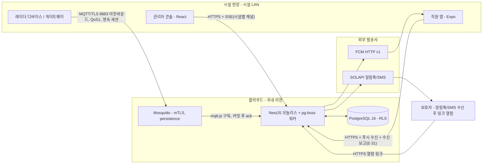
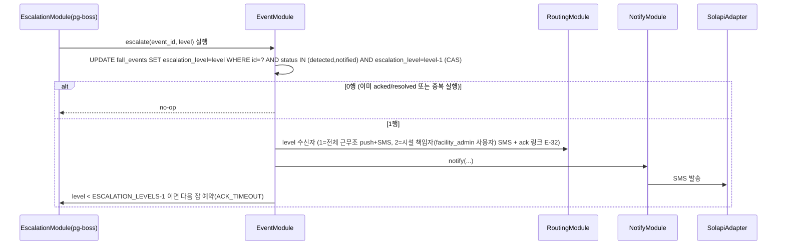
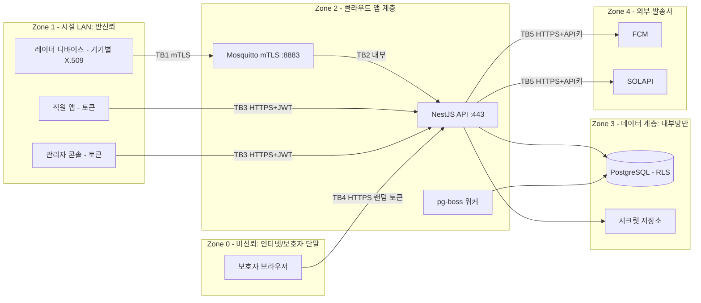

# Seed — 요양시설 낙상 감지·알림 서비스 (가칭: FallGuard)
버전: v1.0
- 원문: 요양시설 어르신 낙상을 감지해 보호자와 직원에게 알리는 서비스를 만들고 싶다.
- 서비스 유형: 복합 — IoT·엣지(낙상 감지 센서/디바이스) + 관제(직원 대응 콘솔·알람 라우팅) + 모바일(직원·보호자 알림 수신 앱) + 웹 SaaS(다시설·다입소자 관리)
- 주 도메인 / 인접 도메인: 노인 장기요양기관(요양시설) 입소자 안전 모니터링 / 헬스케어 IoT(낙상 감지), 긴급 알림 전달(푸시·SMS·알림톡), 개인정보·민감정보(건강·영상·위치)
- 감지된 제약: 입력에서 읽히는 것만 — ① 대상은 요양시설 입소 어르신(고령·거동 불편, 인지저하 가능 → 스스로 호출 불가 전제) ② 수신자 2종(직원=현장 대응, 보호자=사후 통지)이 명시됨 ③ 사건 유형은 "낙상" 하나. 센서 방식·시설 규모·예산·팀 구성·기존 시스템은 입력에 없음 → A1·A2가 채운다
- 로드할 블라인드스팟 프로파일: P1(IoT·엣지 — 감지 디바이스) + P2(웹 SaaS — 다시설 테넌시·개인정보) + P4(모바일 — 알림 앱) + P3 항목 일부(알람 폭주·실시간성) + 임시 프로파일 P7(돌봄 안전 알림 — 프로파일에 없는 도메인 절차)
- 강도: full — 사유: SKILL.md 신호 표 4항목 해당. ① **안전**(낙상 미감지·알림 지연 = 부상 악화·사망 위험, 골든타임) ② **민감정보**(건강상태·영상·실내 위치 = 개인정보보호법 제23조 민감정보 + 어르신 본인 동의 능력 문제) ③ **하드웨어/엣지**(감지 디바이스가 시설 현장에 설치) ④ **외부 연동 2개 이상**(알림 채널 푸시/SMS/알림톡 + 센서 벤더 SDK/API). 팀 규모는 미상이나 안전·법만으로 full 확정
- 기존 시스템: 없음 (입력에 언급 없음 → 그린필드로 가정, A1에 "현재 시스템 감사" 절 없음)
# RECON — 요양시설 낙상 감지·알림 서비스 (FallGuard)
버전: v1.0
조사일: 2026-09-07 · 조사: sonnet 서브에이전트(검색 26회 = WebSearch 25 + WebFetch 1, 132,689 tok, 8.7분) · fit 판정: 메인 세션


## 도메인 업무 흐름 — 이 산업이 실제로 어떻게 돌아가는가 (출처)

| 항목 | 내용 | 태그 | 출처 |
|---|---|---|---|
| 요양보호사 배치기준 | 노인요양시설 요양보호사 인력배치기준이 2025.1.1부터 입소자 2.1명당 1명으로 상향. 기존시설은 2026.12.31까지 유예 | [sourced] | [보건복지부고시 제2025-247호 관련 기사](https://xn--zb0bnwa350v8db07b.com/kwa-5870889-191), [angelsitter.co.kr](https://angelsitter.co.kr/board.view.php?board=bbs3&no=462) |
| 야간 인력 | 주야간보호기관에서 24시간 돌봄 제공 시 야간 요양보호사 1인 배치 필요 (입소시설 전체의 야간 최소 인원수를 명시한 별도 전국단위 수치는 확인 못함) | [sourced](배치 필요성) / [미확인](구체 인원수 산식) | [angelsitter.co.kr](https://angelsitter.co.kr/board.view.php?board=bbs3&no=462) |
| 선임 요양보호사 제도 | 2026.7.1 시행. 60개월 이상 근무·승급교육 이수자 대상, 입소자 25명당 1명 선임 가능, 월 15만원 수당 | [sourced] | [yoyang.ai.kr](https://yoyang.ai.kr/%EA%B8%B0%EA%B3%A0-2026%EB%85%84-%EB%85%B8%EC%9D%B8%EC%9A%94%EC%96%91%EC%8B%9C%EC%84%A4-%EA%B8%89%EC%97%AC-%EA%B8%B0%EC%A4%80-%EB%B0%8F-%EC%A2%85%EC%82%AC%EC%9E%90-%EC%B2%98%EC%9A%B0-%EB%8C%80/) |
| 요양병원 낙상 안전사고 건수 | 2021~2024년 4년간 요양병원 보고 낙상 환자안전사고 5,107건 | [sourced] | [KCI 논문 "국내 요양병원 최근 4년 낙상사고 분석"](https://www.kci.go.kr/kciportal/ci/sereArticleSearch/ciSereArtiView.kci?sereArticleSearchBean.artiId=ART003318357) |
| 치매군 vs 비치매군 위해발생률 | 치매환자 81.6% vs 비치매환자 74.6% (낙상 후 위해 발생 비율) | [sourced] | 상동 |
| 요양병원 환자안전사고 중 낙상 비중 | 전체 보고 1,960건 중 1,542건(79%)이 낙상 | [sourced] | [mediwelfare.com](http://www.mediwelfare.com/news/articleView.html?idxno=3541) |
| 고령자 낙상사고 추이 | 2020년 3,721건 → 2024년 11,866건(3.2배 증가). 최근 기준 시설별 순위: 노인요양시설 523건 > 버스 295건 > 의료시설 187건 | [sourced](건수) / [inference](통계 모집단·정의가 어느 기관 집계인지 기사에 명확히 안 나와 있어 타 통계와 직접 비교 시 주의) | [nongmin.com](https://www.nongmin.com/article/20251020500272) |
| 장기요양기관 평가 — 8대 안전지침 | 모든 수급자(보호자)에게 욕창예방·낙상예방·탈수예방·배변도움·관절구축예방·치매예방·감염예방·노인인권보호 8개 지침 설명 의무 | [sourced] | [케어포 시설급여 평가매뉴얼 PDF](https://www.carefor.co.kr/ct_att/contents_article/0/202412/45437/tQpnCkiztp.pdf) |
| 낙상 위험도 평가 | 수급자의 낙상·욕창 위험도, 인지기능 상태를 정기 평가하고 낙상 방지 실내환경을 조성하는지가 평가지표에 포함 | [sourced] | 상동 |

**미확인**: 낙상 발생 시 보호자 통지 시한(예: "몇 시간 이내 통지" 같은 법정 기준)과 사고 기록 서식(사고보고서 표준 양식)의 전국 공통 규정 존재 여부는 이번 조사에서 확인하지 못함 — 개별 시설 내규로 처리될 가능성 [inference].

## 이해관계자 — 누가 쓰고, 누가 돈을 내는가 (출처)

| 항목 | 내용 | 태그 | 출처 |
|---|---|---|---|
| 노인의료복지시설 수 | 2025년 기준 총 6,211개소(노인요양시설 4,758 + 노인요양공동생활가정 1,453). 2008년(1,332개소) 대비 노인요양시설 257.2%↑ | [sourced](단, AI 요약 도구로 페이지 추출 — 원자료 대조 권장) | [e-나라지표](https://www.index.go.kr/unity/potal/main/EachDtlPageDetail.do?idx_cd=2766) |
| 입소정원 | 노인의료복지시설 입소정원 412,917명(2024년 기준) | [sourced](출처 동일, 대조 권장) | 상동 |
| 전체 노인복지시설 수 | 2024년 말 기준 96,430개소(전체 노인복지시설 유형 합산 — 재가·여가 등 포함 추정) | [sourced](대조 권장) / [inference](세부 유형별 분해는 원문 PDF 확인 필요) | 상동, [보건복지부 "2025 노인복지시설 현황"](https://www.mohw.go.kr/board.es?mid=a10411010100&bid=0019&act=view&list_no=1486600) |
| 스마트 사회서비스 시범사업 | 보건복지부 "2025년도 스마트 사회서비스 시범사업" 공고 존재 확인 | [sourced](존재) / [미확인](예산 규모, 선정 시설/지자체 수, 낙상감지 품목 포함 여부) | [mohw.go.kr 공고](https://www.mohw.go.kr/board.es?mid=a10501010100&bid=0003&tag=&act=view&list_no=1485327) |
| 보건복지부 R&D 예산 | 2025년 9,327억원(전년대비 18.3%↑, 72개 사업) — 전체 R&D 예산이며 요양시설 낙상감지 특정 예산 아님 | [sourced](총액) / [inference](낙상감지 서비스와의 관련성은 불명) | [rehahomecare.com PDF](https://www.rehahomecare.com/homelib/board_file_down.asp?B_CODE=TB_NEWS_KR&R_FILE=20250106154915.pdf) |
| 2026년 장기요양보험료율 | 0.9448% | [sourced] | [mohw.go.kr 보도자료](https://www.mohw.go.kr/board.es?mid=a10503010100&bid=0027&tag=&act=view&list_no=1487817) |

**지불 주체 구조**: 국민건강보험공단(장기요양보험 재정)이 급여비용 대부분을 부담하고 시설/보호자가 본인부담금을 내는 구조이나, 낙상감지 "기기·서비스" 자체가 장기요양 급여수가에 포함되는지(즉 건보 재정으로 커버되는지)는 이번 조사에서 확인하지 못함 — **미확인**. 시설 자체 구매 또는 지자체 복지기술 지원사업 의존 가능성이 높다는 것은 [inference].

## 규제·표준 — 반드시 준수해야 하는 것 (출처; 해당 없음도 확인 근거)

| 구분 | 내용 | 태그 | 출처 |
|---|---|---|---|
| (a) 개인정보보호법 제23조 | 사상·신념, 건강, 성생활 등 민감정보 처리 원칙적 금지, 예외적 허용. 건강정보(낙상 이력·생체신호)는 민감정보 해당 | [sourced] | [law.go.kr 제23조](https://www.law.go.kr/lsLawLinkInfo.do?chrClsCd=010202&lsJoLnkSeq=1000575255) |
| (a) 개인정보보호법 제25조 | 고정형 영상정보처리기기는 공개된 장소에서 원칙 금지, 예외(법령 허용·범죄예방·시설안전관리 등)에만 허용. 촬영 영상을 저장하지 않는 경우 별도 허용 규정 존재 | [sourced] | [law.go.kr 제25조](https://www.law.go.kr/LSW//lsLawLinkInfo.do?lsJoLnkSeq=900079397&lsId=011357&chrClsCd=010202) |
| (a) 인지저하 어르신 동의 | 이번 검색으로는 "14세 미만 아동"에 대한 법정대리인 동의 확인 절차(개인정보포털 안내)만 확인됨. **인지저하 성인(피성년후견인 등)에 대한 개인정보 동의의 법정대리인/후견인 대리 절차를 명시한 정부 가이드라인은 찾지 못함** | [미확인] | [privacy.go.kr](https://www.privacy.go.kr/front/contents/cntntsView.do?contsNo=94) (아동 기준만 확인) |
| (b) 요양시설 CCTV 의무화 | **정정**: 조사항목은 "노인복지법 개정"으로 표현했으나, 실제 근거법은 **노인장기요양보험법 제33조의2 및 그 시행규칙**. 2023.5.8 공포, 2023.6.22 시행(신규시설). 기존시설은 유예기간을 거쳐 2023.12.21까지 설치 | [sourced] | [mohw.go.kr 보도자료](https://mohw.go.kr/board.es?act=view&bid=0027&list_no=376156&mid=a10503010100) |
| (b) CCTV 설치 범위 | 공동거실(복도 포함)·침실·현관·물리(작업)치료실·프로그램실·식당·자체운영 엘리베이터 각 1대 이상. 침실은 수급자·보호자 전원 동의 시에만 설치 | [sourced] | [SBS 뉴스](https://news.sbs.co.kr/news/endPage.do?news_id=N1007182843) |
| (c) 낙상감지 SW의 식약처 의료기기 해당 여부 | 식약처 "의료기기 소프트웨어 허가심사 가이드라인" 문서 존재는 확인. **"낙상감지 알림 서비스"가 구체적으로 의료기기 해당/비해당으로 판정된 사례·공식 유권해석은 확인하지 못함** | [미확인] | [식약처 가이드라인](https://www.mfds.go.kr/brd/m_1060/view.do?seq=15655) |
| (d) EN 50134 (사회적 알람) | 유럽 표준, Part 1(시스템 요구사항)·Part 2(트리거 장치)·Part 5(상호연결·통신)·Part 9(IP 통신 프로토콜) 등 다부작 구성. 국내 낙상알림 서비스에 직접 적용 의무는 아니며 참고용 | [sourced](표준 존재·구성) / [inference](국내 강제성 없음) | [telecare.ie](https://telecare.ie/european-en50134-standards-for-social-alarms/) |
| (d) Apple Watch 낙상감지 FDA | Apple Watch Series 4(2018)가 FDA로부터 심전도·낙상감지 관련 Class II 의료기기로 clearance 받음 | [sourced] | [Forbes](https://www.forbes.com/sites/jeanbaptiste/2018/09/14/apple-watch-4-is-now-an-fda-class-2-medical-device-detects-falls-irregular-heart-rhythm/) |
| (d) CMS 너싱홈 F-tag | F689 "Free of Accident Hazards/Supervision/Devices" — 시설이 사고 위험을 통제하고 낙상 방지를 위한 감독·보조기기를 제공해야 한다는 규정. 주 서베이어가 가장 흔히 인용하는 태그 중 2위 | [sourced] | [AAPACN](https://www.aapacn.org/article/f689-accident-survey-citations-whats-behind-these-immediate-jeopardies/) |
| (e)(f) 정보통신망법 제50조 | 광고성 정보 전송은 원칙적으로 사전 명시적 동의 필요, 예외(거래관계 6개월 내 등) 존재. 카카오 알림톡은 "정보성 메시지"로 분류되어 템플릿 심사에서 광고성 문구가 금지되며 야간 발송도 가능 | [sourced](알림톡 분류 관행) / [미확인](낙상 "안전 알림"이 정보통신망법상 광고성 정보 정의에서 명시적으로 제외된다는 조문·유권해석 원문) | [Omago 블로그](https://www.omago.ai/ko/blog/kakaotalk-marketing-message-law-korea), [카카오 알림톡 템플릿 가이드 PDF](https://static.godo.co.kr/download/echost/alimtalk_template_guide.pdf) |

## 유사 솔루션 — 실제 기능 범위 (출처)

| 업체(국가) | 감지 방식 | 오탐/미탐·정확도 | 알림 경로 | 가격 단서 | 프라이버시 처리 | 출처 |
|---|---|---|---|---|---|---|
| LG유플러스 U+스마트레이더 (국내) | 77GHz mmWave 레이더 천장/벽 설치, 자세변화 감지 | **98% 정확도**로 자세변화·낙상 감지(보도자료 수치) [sourced] | 이상 발생 시 관리자에게 문자메시지(SMS) 즉시 통보 | 미확인(사업 매출목표 "100억원" 언급은 있으나 단가 비공개) | 영상 없이 레이더 신호만 사용 → CCTV 대비 사생활 노출 적음(자체 홍보 문구, 제3자 검증 자료는 미확인) | [뉴시스](https://www.newsis.com/view/NISX20220908_0002008438), [ZDNet Korea](https://zdnet.co.kr/view/?no=20220908104806), [LG 공식](https://www.lg.co.kr/media/release/22641) |
| 스마트레이더시스템 (국내) | 천장형 mmWave 레이더, 비접촉·비영상 | 미확인(정량 수치 비공개) | 미확인 | 미확인 | 영상 미저장(레이더 기반) [sourced: 방식] | [데일리한국](https://daily.hankooki.com/news/articleView.html?idxno=1368934) |
| Vayyar Care (이스라엘/미국) | 4D RF 이미징 레이더(벽/천장 설치), 웨어러블·카메라 불필요 | "타 자동낙상알림 대비 4배 정확" 마케팅 문구, 정량 오탐률 수치는 확인 못함 [미확인] | 앱/모니터링센터 알림(가정용은 Alexa Together 연동) | 가정용 Amazon 리스팅은 구독제(정확 금액 미확인), B2B 요양시설向 가격 비공개 | 카메라 없이 RF 신호만 사용 — 영상 저장 자체가 없음 | [Vayyar 공식](https://vayyar.com/care-pages/how/), [Amazon 리스팅](https://www.amazon.com/Vayyar-Care-Touchless-Detection-Subscription/dp/B09JXV82Z6) |
| SafelyYou (미국) | 벽부착 카메라 + 컴퓨터비전 AI | 치매케어 시설에서 응급실 이송 80% 감소(효과 연구 수치, 오탐률 자체는 별도 확인 못함) | 직원 근무기기 또는 간호콜 시스템으로 알림 | 미확인(엔터프라이즈 B2B 계약, 공개가 없음) | 이벤트 기반 녹화(낙상 감지 시에만 영상 저장, 상시 감시 아님), 오디오·실시간 스트리밍 없음 | [SafelyYou 공식](https://www.safely-you.com/safelyyou-safety-ai/), [AJMC](https://www.ajmc.com/view/safelyyou-new-research-reveals-safelyyous-aienabled-fall-detection-reduces-need-for-emergency-service-care-in-dementia-care-facilities) |
| Nobi (벨기에) | 천장 스마트조명(카메라+스피커+온보드 프로세서) | 미확인(정량 수치 비공개) | 낙상 의심 시 음성으로 안내 확인 후 지정 케어팀에 연락 | 가정용 $2,287.60(기기)+$19/월 또는 $119/월 렌탈. 요양시설向 침실전용 약 $240/월, 침실+화장실 $395/월, 전체(침실+화장실+거실) $525/월 | 온디바이스(엣지) 영상처리로 이미지를 클라우드에 업로드하지 않음(자체 홍보 문구) | [TechHive](https://www.techhive.com/article/579134/the-nobi-smart-lamp-can-detect-when-a-person-falls-in-their-home-and-will-call-for-assistance.html), [Healthcare Brew](https://www.healthcare-brew.com/stories/2026/04/22/nobi-smart-lights-detecting-patient-falls) |
| Apple Watch 낙상감지 (미국) | 손목 가속도계+자이로+심박센서 조합 | 정량 오탐률 비공개, "hard fall" 임계값 알고리즘만 공개 | 60초 무동작 시 자동으로 응급전화(국가별 119 등)+긴급연락처 통보, 그 전엔 사용자 알림으로 취소 가능 | 워치 자체 가격(별도 구독료 없음, Apple Watch 본체 필요) | 기기 자체 처리, 위치정보는 SOS 호출 시에만 전송 | [Apple 공식 지원](https://support.apple.com/en-us/108896), [Forbes](https://www.forbes.com/sites/jeanbaptiste/2018/09/14/apple-watch-4-is-now-an-fda-class-2-medical-device-detects-falls-irregular-heart-rhythm/) |

## 스택 후보 — 후보별 근거·트레이드오프

### (a) 감지 방식 비교
| 방식 | 근거 있는 특징 | 태그 |
|---|---|---|
| mmWave 레이더 | LG U+ 사례에서 자세변화·낙상 98% 정확도 실사례 보도. 어두운 환경에서도 동작, 최대 5명 동시 감지, 영상 미저장 | [sourced](LG U+ 수치) |
| 카메라+AI(엣지 추론, 영상 비저장) | SafelyYou는 이벤트 기반 녹화로 상시감시 아님(응급실 이송 80%↓ 효과 보고), Nobi는 온디바이스 처리로 클라우드 미전송 | [sourced](정성적 방식) / [미확인](정량 오탐률) |
| 웨어러블(가속도계) | Apple Watch가 대표 사례, FDA Class II. 다만 **요양시설 입소자의 착용 거부·분실·충전 문제**는 이번 검색에서 정량 데이터를 찾지 못함 | [sourced](FDA·동작원리) / [미확인](요양시설 맥락 착용순응도 수치) |
| 침대·바닥 압력센서 | 이번 조사 예산 내에서 검색을 수행하지 못함 | [미확인] |

### (b) 서버·알림 파이프라인
| 후보 | 핵심 사실 | 태그 | 출처 |
|---|---|---|---|
| MQTT — EMQX | **v5.9.0부터 오픈소스/엔터프라이즈 기능을 통합해 Business Source License(BSL) 1.1로 전환**(그 이전 v5.8까지는 Apache 2.0). 그린필드 설계 시 라이선스 재검토 필요 | [sourced] | [EMQ 블로그](https://www.emqx.com/en/blog/emqx-vs-mosquitto-2023-mqtt-broker-comparison) |
| MQTT — Mosquitto | EPL/EDL 라이선스로 완전 오픈소스 유지. 경량 싱글스레드 구조로 임베디드/엣지 기기에 강점 | [sourced] | 상동 |
| DB — TimescaleDB | 코어는 Apache 2.0(완전 오픈소스, 경쟁 매니지드 서비스로 재판매 가능). 압축·연속 집계(continuous aggregates)·하이퍼함수 등 고급기능은 Timescale License(TSL)로 별도 제한(경쟁 매니지드 서비스 금지) | [sourced] | [Tiger Data 라이선스 페이지](https://www.tigerdata.com/legal/licenses) |
| DB 회사명 변경 | Timescale Inc가 2025.6.17 "Tiger Data"로 사명 변경(제품명은 TimescaleDB 유지) | [sourced] | [en.wikipedia.org/TimescaleDB](https://en.wikipedia.org/wiki/TimescaleDB) |
| 푸시 — FCM | **Legacy HTTP/XMPP API는 2024.6~7월(연장 마감 7/22) 완전 폐지됨. 반드시 FCM HTTP v1으로 신규 구현해야 함**(레거시 코드 예제 주의) | [sourced] | [Google/Microsoft 발표 정리](https://devblogs.microsoft.com/azure-notification-hubs/support-of-azure-notification-hubs-firebase-cloud-messaging-fcm-legacy-api-will-be-deprecated-on-june-20-2024/) |
| 국내 알림톡/SMS — SOLAPI | 표준단가(공식 가격표 기준): 카카오 알림톡 8원, 친구톡 14원, 친구톡 이미지 22원, SMS(단문) 13원, LMS(장문) 29원, MMS(사진) 60원. 월 기본료 없음, 발송량에 따라 단가 할인 | [sourced] | [solapi.com/pricing](https://solapi.com/pricing) |
| 국내 알림톡/SMS — NHN Cloud Notification | 알림톡·친구톡·SMS·국제SMS·푸시·이메일·RCS 통합 제공 서비스 존재 확인. **구체적 단가는 공식 요금 페이지에서 즉시 확인 못함**(로그인/견적 필요 가능성) | [sourced](서비스 존재) / [미확인](단가) | [nhncloud.com](https://www.nhncloud.com/kr/service/notification/notification-hub) |
| 국내 알림톡/SMS — 네이버클라우드 SENS | SMS/LMS/MMS/국제SMS, 카카오톡 비즈메시지(알림톡·친구톡) 제공 확인. **구체적 단가 미확인** | [sourced](서비스 존재) / [미확인](단가) | [ncloud.com/product/applicationService/sens](https://www.ncloud.com/product/applicationService/sens) |
| 음성 자동발신(SENS voice / Twilio 국내) | 이번 조사 예산 내에서 검색을 수행하지 못함 | [미확인] | — |
| 백엔드 프레임워크(FastAPI/NestJS/Spring Boot) 최신 안정버전 | 이번 조사 예산 내에서 검색을 수행하지 못함 — 별도 확인 필요 | [미확인] | — |

### (c) 엣지 디바이스
| 후보 | 가격·재고 단서 | 태그 | 출처 |
|---|---|---|---|
| Raspberry Pi 5 | 8GB 모델 기준 약 $80(자료별 $60~80 범위) | [sourced] | [모델 비교 블로그 종합](https://thinkrobotics.com/blogs/learn/nvidia-jetson-orin-nano-vs-raspberry-pi-5-the-ultimate-edge-computing-showdown) |
| NVIDIA Jetson Orin Nano | Super Developer Kit 출시가 $249, **2026년 7월 리프라이싱 이후 약 $399로 인상**된 것으로 확인(자료 간 $249~$499 범위 편차 있음 — 재검증 권장) | [sourced](가격 변동 존재) / [inference](정확한 현재 실거래가는 벤더 직접 확인 필요) | [tannatechbiz.com](https://tannatechbiz.com/blog/post/raspberry-pi-5-vs-jetson-orin-nano) |
| 레이더 모듈 벤더 SDK | 국내 벤더로 스마트레이더시스템(LG유플러스 협력, 삼성서울병원 스마트병실 공급 이력)이 확인됨. SDK 공개 여부·개발자 접근성은 미확인 | [sourced](벤더 존재) / [미확인](SDK 공개 여부) | [데일리한국](https://daily.hankooki.com/news/articleView.html?idxno=1368934) |

## 미확인 항목 (조사로 못 찾은 것)
- 낙상감지 소프트웨어/기기가 식약처 의료기기로 분류된 구체적 판정 사례 또는 공식 유권해석
- 인지저하 어르신(피성년후견인 등) 개인정보 처리 동의의 법정대리인 대리 절차를 명시한 정부 가이드라인(아동 기준만 확인됨)
- 정보통신망법상 "안전 알림"이 광고성 정보 정의에서 명시적으로 제외된다는 조문 원문·유권해석
- 낙상 발생 시 보호자 통지 시한, 사고 기록 표준 서식의 전국 공통 법정 기준 존재 여부
- 2025년도 스마트 사회서비스 시범사업의 예산 규모, 선정 시설/지자체 수, 낙상감지 품목 포함 여부
- 낙상감지 기기·서비스가 장기요양 급여수가에 포함되는지(건보 재정 커버 여부)
- Vayyar Care, SafelyYou, Nobi(요양시설向)의 정식 B2B 가격 및 정량 오탐/미탐률
- 침대·바닥 압력센서 방식의 정확도·설치비·거부감 데이터
- 백엔드 프레임워크(FastAPI/NestJS/Spring Boot) 최신 안정 버전·라이선스
- 국내 음성 자동발신 API(네이버클라우드 SENS voice, Twilio 한국 발신 가능 여부)
- NHN Cloud Notification, 네이버클라우드 SENS의 구체적 발송 단가
- NVIDIA Jetson Orin Nano의 2026-09-07 시점 정확한 실거래가·재고(자료 간 편차 큼)
- 레이더 모듈 벤더(스마트레이더시스템 등)의 개발자용 SDK 공개 여부·라이선스

## 출처 목록 (URL · 확인일)
모두 확인일: 2026-09-07

- https://xn--zb0bnwa350v8db07b.com/kwa-5870889-191 — 요양보호사 인력기준 2.1대1 변경
- https://angelsitter.co.kr/board.view.php?board=bbs3&no=462 — 노인요양의료시설 인력배치기준·수가 변경
- https://yoyang.ai.kr/기고-2026년-노인요양시설-급여-기준-및-종사자-처우-대폭 — 2026년 노인요양시설 급여기준·선임요양보호사
- https://www.mohw.go.kr/board.es?mid=a10503010100&bid=0027&tag=&act=view&list_no=1487817 — 2026년 장기요양보험료율
- https://www.kci.go.kr/kciportal/ci/sereArticleSearch/ciSereArtiView.kci?sereArticleSearchBean.artiId=ART003318357 — 국내 요양병원 4년 낙상사고 분석(치매군 비교)
- http://www.mediwelfare.com/news/articleView.html?idxno=3541 — 요양병원 환자안전사고 79% 낙상
- https://www.nongmin.com/article/20251020500272 — 고령자 낙상사고 3.2배 증가 통계
- https://www.carefor.co.kr/ct_att/contents_article/0/202412/45437/tQpnCkiztp.pdf — 시설급여(노인요양시설) 평가 매뉴얼
- https://www.index.go.kr/unity/potal/main/EachDtlPageDetail.do?idx_cd=2766 — e-나라지표 노인의료복지시설 현황
- https://www.mohw.go.kr/board.es?mid=a10411010100&bid=0019&act=view&list_no=1486600 — 2025 노인복지시설 현황
- https://www.mohw.go.kr/board.es?mid=a10501010100&bid=0003&tag=&act=view&list_no=1485327 — 2025년도 스마트 사회서비스 시범사업 공고
- https://www.rehahomecare.com/homelib/board_file_down.asp?B_CODE=TB_NEWS_KR&R_FILE=20250106154915.pdf — 2025 보건복지부 R&D 통합 시행계획
- https://www.law.go.kr/lsLawLinkInfo.do?chrClsCd=010202&lsJoLnkSeq=1000575255 — 개인정보보호법 제23조
- https://www.law.go.kr/LSW//lsLawLinkInfo.do?lsJoLnkSeq=900079397&lsId=011357&chrClsCd=010202 — 개인정보보호법 제25조
- https://www.privacy.go.kr/front/contents/cntntsView.do?contsNo=94 — 법정대리인 동의확인 의무(아동 기준)
- https://mohw.go.kr/board.es?act=view&bid=0027&list_no=376156&mid=a10503010100 — 장기요양기관 CCTV 설치 의무화 보도자료
- https://news.sbs.co.kr/news/endPage.do?news_id=N1007182843 — 노인요양원 CCTV 설치 의무 침실 동의 규정
- https://ils.inha.ac.kr/bbs/ils/3464/109430/download.do — 노인장기요양시설 CCTV 설치 입법 평가와 과제(논문)
- https://www.mfds.go.kr/brd/m_1060/view.do?seq=15655 — 의료기기 소프트웨어 허가심사 가이드라인
- https://telecare.ie/european-en50134-standards-for-social-alarms/ — EN 50134 사회적 알람 표준 개요
- https://support.apple.com/en-us/108896 — Apple Watch 낙상감지 공식 지원문서
- https://www.forbes.com/sites/jeanbaptiste/2018/09/14/apple-watch-4-is-now-an-fda-class-2-medical-device-detects-falls-irregular-heart-rhythm/ — Apple Watch 4 FDA Class II
- https://www.aapacn.org/article/f689-accident-survey-citations-whats-behind-these-immediate-jeopardies/ — CMS F689 낙상 관련 규정
- https://www.omago.ai/ko/blog/kakaotalk-marketing-message-law-korea — 카카오 광고메시지·정보통신망법
- https://static.godo.co.kr/download/echost/alimtalk_template_guide.pdf — 카카오 알림톡 템플릿 검수 가이드
- https://www.newsis.com/view/NISX20220908_0002008438 — LGU+ AI 낙상 감지 실시간 모니터링 플랫폼
- https://zdnet.co.kr/view/?no=20220908104806 — LGU+ 스마트레이더 낙상 사고 탐지 매출 목표
- https://www.lg.co.kr/media/release/22641 — LG유플러스 레이다 센서 낙상감지 실증
- https://daily.hankooki.com/news/articleView.html?idxno=1368934 — 스마트레이더시스템 스마트병실 낙상감지 솔루션
- https://vayyar.com/care-pages/how/ — Vayyar Care 동작 원리
- https://www.amazon.com/Vayyar-Care-Touchless-Detection-Subscription/dp/B09JXV82Z6 — Vayyar Care 가정용 리스팅
- https://www.safely-you.com/safelyyou-safety-ai/ — SafelyYou Safety AI 동작 원리
- https://www.ajmc.com/view/safelyyou-new-research-reveals-safelyyous-aienabled-fall-detection-reduces-need-for-emergency-service-care-in-dementia-care-facilities — SafelyYou 응급이송 80% 감소 연구
- https://www.techhive.com/article/579134/the-nobi-smart-lamp-can-detect-when-a-person-falls-in-their-home-and-will-call-for-assistance.html — Nobi 스마트램프 소개
- https://www.healthcare-brew.com/stories/2026/04/22/nobi-smart-lights-detecting-patient-falls — Nobi 요양시설 가격 구간
- https://www.emqx.com/en/blog/emqx-vs-mosquitto-2023-mqtt-broker-comparison — EMQX vs Mosquitto 비교(라이선스 변경 포함)
- https://www.tigerdata.com/legal/licenses — TimescaleDB(Tiger Data) 라이선스 구조
- https://en.wikipedia.org/wiki/TimescaleDB — TimescaleDB 개요·사명변경
- https://devblogs.microsoft.com/azure-notification-hubs/support-of-azure-notification-hubs-firebase-cloud-messaging-fcm-legacy-api-will-be-deprecated-on-june-20-2024/ — FCM Legacy API 폐지 공지
- https://solapi.com/pricing — SOLAPI 알림톡/SMS 표준단가
- https://www.nhncloud.com/kr/service/notification/notification-hub — NHN Cloud Notification 서비스 개요
- https://www.ncloud.com/product/applicationService/sens — 네이버클라우드 SENS 서비스 개요
- https://thinkrobotics.com/blogs/learn/nvidia-jetson-orin-nano-vs-raspberry-pi-5-the-ultimate-edge-computing-showdown — Raspberry Pi 5 가격
- https://tannatechbiz.com/blog/post/raspberry-pi-5-vs-jetson-orin-nano — Jetson Orin Nano 가격·리프라이싱

## 메인 fit 판정 — 스택 후보 × 사용자 제약 (evidence-map fit_score)

사용자 제약은 입력에 없어 A2에서 Assumed로 채택한 값을 기준으로 매칭한다: **팀 2~3인(TypeScript 중심), 클라우드 SaaS, 첫 파일럿 시설 1곳(침상 ≤100), 초기 예산 소규모, 국내 리전.**
"인기 ≠ 적합" — 점수는 요구 충족·팀 적합·운영 환경·생태계·총비용 5요소.

| 후보 | fit | 어떤 요소 때문에 |
|---|---|---|
| 감지 — **mmWave 레이더(천장형, 영상 없음)** | **높음** | 요구 충족(착용 불필요·비영상·다인실 동시 감지 — LG U+ 98% 보도) + 운영 환경(개인정보보호법 25조·침실 CCTV 전원 동의 부담 회피). 리스크: 국내 벤더 SDK 공개 여부 [미확인] → 디바이스 어댑터 계층으로 벤더 격리 |
| 감지 — 카메라+엣지 AI | 중간 | 정확도 잠재는 높으나 침실 영상 처리 동의(수급자·보호자 전원)·25조 예외 요건·모델 개발 부담이 2~3인 팀에 과함 |
| 감지 — 웨어러블 | 낮음 | 인지저하 입소자 착용 거부·분실·충전 운영 부담 [inference — 정량 미확인]. 자기 호출이 불가능한 대상에게 착용 의존은 미탐 경로 |
| 감지 — 침상 압력센서 | 낮음 | 낙상이 아니라 "이탈"을 감지 — 낙상 판정은 별도 필요. 데이터 [미확인] |
| MQTT — **Mosquitto** | **높음** | 라이선스(EPL/EDL) + 규모(시설당 디바이스 ≤100)에 경량 브로커로 충분 |
| MQTT — EMQX | 낮음 | v5.9.0부터 BSL 1.1 — SaaS 재판매 시 라이선스 검토 비용 |
| 백엔드 — **NestJS(TypeScript, Node LTS)** | **높음** | 팀 적합(웹 콘솔 React·직원 앱 Expo와 단일 언어), MQTT/큐 통합 모듈 존재. 버전은 착수 시 LTS로 고정 (최신 안정 버전 [미확인]) |
| 백엔드 — Spring Boot / FastAPI | 중간 | 요구는 충족하나 팀 언어 분산. 팀이 Java/Python 중심이면 역전 |
| DB — **PostgreSQL 16+ (월 파티셔닝)** | **높음** | 볼륨이 작다: 낙상 이벤트 시설당 일 ≤10건, heartbeat는 행으로 저장하지 않고 `last_seen_at` 갱신만 → TimescaleDB(TSL 기능 제약) 불필요 |
| 푸시 — **FCM HTTP v1** | **높음** | Legacy API 2024.7 폐지 확인 → v1 필수. iOS는 APNs를 FCM 경유 |
| 알림톡/SMS — **SOLAPI(단가 공개: 알림톡 8원·SMS 13원)** | **높음** | 총비용 투명. NHN Cloud·SENS는 단가 [미확인] → 발송 어댑터 인터페이스로 교체 가능하게 |
| 음성 자동발신 | — | [미확인] → MVP 범위 밖, 어댑터 인터페이스만 정의 (A2 P7 알림 채널 이중화) |
| 엣지 게이트웨이 — RPi 5 | 조건부 | 레이더 완제품이 MQTT/HTTP로 이벤트를 직접 발행하면 불필요. 모듈(SDK) 방식이면 RPi 5(약 $80) 게이트웨이 1대/생활실군. Jetson은 영상 AI가 없으므로 불필요 |
| 직원 앱 — **Expo(React Native)** | **높음** | 팀 단일 언어, 푸시(FCM/APNs) 표준 지원, 내부 테스트 트랙으로 파일럿 배포 |
| 보호자 채널 — **앱 없음(알림톡/SMS + 서명 링크 열람 페이지)** | **높음** | 보호자 앱 설치·심사 부담 제거, 알림톡 정보성 메시지로 야간 발송 가능 |

**정정 반영**: 요양시설 CCTV 의무화 근거법은 노인복지법이 아니라 **노인장기요양보험법 제33조의2**(2023.6.22 시행)다. 이후 산출물은 이 명칭을 쓴다.
# 블라인드스팟 레지스터 — 요양시설 낙상 감지·알림 서비스 (FallGuard)
버전: v1.0
스캔: 공통 10축 + STRIDE 6범주 + 프로파일 P1(10) + P2(6) + P4(5) + P3 일부(2) + 임시 P7(10) = **49항목**
제시 일시: 2026-09-07 · 모드: **오토파일럿** — 질문 배치는 생성하되 사용자에게 제시하지 않고 추천안을 자동 채택, `Assumed(무응답)` 마킹

## 사전 진단 (ecc:product-lens 7문항 — Impact 판단 보강)
1. **누구를 위한 것인가** — 야간에 혼자 또는 둘이서 입소자 수십 명을 담당하는 요양보호사·간호(조무)사. 주간 배치기준 2.1:1(2025.1 시행)은 총원 기준이고 야간은 그보다 적다(01: 야간 인원 산식 미확인).
2. **고통의 크기** — 요양병원 환자안전사고의 79%가 낙상, 노인요양시설 고령자 낙상 523건(시설별 1위), 치매군 낙상 후 위해율 81.6% (01 출처). 지금은 정기 순회 + 호출벨(인지저하 입소자는 못 누름) + CCTV 사후 확인 — "발견까지의 공백"이 문제다.
3. **왜 지금인가** — CCTV 의무화(노인장기요양보험법 33조의2, 2023.6) 이후 시설 네트워크·설치 관행이 생겼고, 배치기준 상향(2.1:1)으로 인력비 압박이 커졌으며, 국내 mmWave 레이더 상용 사례(LG U+ 98%)가 존재한다.
4. **10-star** — 낙상 예측·예방, 활력징후, 배회, 자동 119 신고, 간호기록 연동.
5. **MVP** — 감지 이벤트 수신 → 직원 알림 → 확인(ack)·대응 기록 → 낙상 확정 시 보호자 통지 → 미응답 에스컬레이션. 시설 1곳, 침상 ≤100.
6. **안티골** — 낙상 예측, 영상 저장·열람, 의료 진단·치료 표방, 119 자동 신고, 기존 청구 프로그램 연동.
7. **성공 지표** — 감지→직원 단말 알림 지연 p95, 직원 ack까지 시간, 오탐률(직원 판정), 미탐(시설 사고 기록 대비) — 03 SC로 승격.

## 레지스터

| 축/항목 | 상태 | 처리 | 근거·출처 |
|---|---|---|---|
| 1. 기능 범위·행동 | Partial | Assumed: MVP = 감지 이벤트 수신→직원 알림→ack·대응 기록→낙상 확정 시 보호자 통지→미응답 에스컬레이션. Non-goal: 낙상 예측, 활력징후, 배회, 영상 열람, 119 자동 신고, 청구 프로그램 연동 | seed + 사전 진단 #5·#6 |
| 2. 도메인·데이터 모델 | Partial | Assumed: 시설(tenant)→생활실→침상→입소자; 디바이스(침상 또는 생활실 매핑); 낙상 이벤트 수명주기 `detected→notified→acked→resolved(confirmed_fall / false_alarm)→family_notified`; 알림 시도 기록; 보호자 연락처; 직원·근무조. 볼륨: 시설당 침상 ≤100, heartbeat는 행 저장 없이 `last_seen_at` 갱신, 낙상 이벤트 시설당 일 ≤10건 | 01 입소정원 412,917 / 6,211개소 ≈ 66명/시설(계산) |
| 3. 상호작용·UX 플로우 | Partial | Assumed: 직원 = 모바일 앱(푸시 수신·ack·대응 기록); 시설 관리자 = 웹 콘솔(입소자·디바이스·근무조·이력); 보호자 = 앱 없음, 알림톡/SMS + 서명 링크 열람 페이지. 에러 시 사용자가 보는 것: 알림 채널 실패는 다음 채널로 자동 폴백, 콘솔에 채널 상태 배너 | 01 fit 판정; ux-principles L-06(막다른 에러 0) |
| 4. 비기능 품질 | Missing | Assumed: 감지→직원 단말 알림 지연 `ALERT_LATENCY_P95`, 이벤트 수신 API 월 가용성 `API_AVAILABILITY`, 디바이스 오프라인 판정 `HEARTBEAT_TIMEOUT`, 관측성 = 알림 파이프라인 단계별 타임스탬프 로그, 보안 = TLS + 디바이스 X.509, 프라이버시 = 최소 수집·영상 없음. 값은 전부 03 상수 표에만 | Google SRE 알림 원칙; 개인정보보호법 23조(01) |
| 5. 통합·외부 의존성 | Partial | Assumed: 디바이스↔서버 MQTT over TLS(Mosquitto); 푸시 FCM HTTP v1; 알림톡/SMS SOLAPI(어댑터로 교체 가능); 음성 전화 어댑터 인터페이스만(P1); 기존 시설 시스템 연동 non-goal. 발송사 장애·스로틀 시: 큐 재시도 `NOTIFY_RETRY_MAX` + 다음 채널 폴백 + 콘솔 배너 | 01 FCM Legacy 폐지·SOLAPI 단가 |
| 6. 엣지케이스·실패 처리 | Missing | Assumed: 오탐(직원 false_alarm 판정 → 보호자 미통지), 중복 감지(같은 입소자 `DEDUP_WINDOW` 내 병합), 직원 미응답(`ACK_TIMEOUT` 경과 시 에스컬레이션), 디바이스 오프라인(`HEARTBEAT_TIMEOUT` 후 관리자 알림 1건), 알림 채널 전부 실패(콘솔 상시 사이렌 + 관리자 SMS), 동시 다발 낙상(독립 이벤트, 병합 안 함) | P3 알람 폭주 기본값(SRE) |
| 7. 제약·트레이드오프 | Missing | **Asked → Q1(감지 방식)·Q3(과금 주체)·Q5(배포 형태)**. 팀·예산·기한은 Assumed: 2~3인 TypeScript 팀, 첫 시설 파일럿 3개월, 클라우드 소규모 | Impact: HW 재구매·아키텍처 재작업 / Uncertainty: 사용자 환경·사업 방향 |
| 8. 용어·일관성 | Partial | Assumed: 용어집을 03에 고정 — 낙상 이벤트(fall_event), 감지(detected), 알림(notification), 확인(ack), 대응 기록(resolution), 오탐(false_alarm), 낙상 확정(confirmed_fall), 에스컬레이션(escalation), 보호자 통지(family_notice), 심박(heartbeat) | SKILL 규칙 9 |
| 9. 완료 신호 | Partial | Assumed: 03 SC 전부 pass + 06 시나리오 전부 green + 파일럿 시설 1곳 30일 운영 | spec-kit 측정 가능 SC |
| 10. 비용·라이선스 | Partial | Assumed: Mosquitto(EPL/EDL) 채택·EMQX(BSL 1.1) 회피; TimescaleDB 미채택(PostgreSQL 파티셔닝); 알림 변동비 = 알림톡 8원·SMS 13원 × 건수(시설당 월 수천 원 수준, 무시 가능); 클라우드 VM 소규모 | 01 라이선스·단가 표 |
| S. Spoofing | Partial | Assumed: 디바이스별 X.509 + 직원 앱 단기 액세스 토큰 `ACCESS_TOKEN_TTL` + 보호자 열람 링크 서명 토큰 `FAMILY_LINK_TTL`. A4에서 경계별 전수 | P1 디바이스 신원(IoT Lens) |
| T. Tampering | Partial | Assumed: TLS 전송, 이벤트 테이블 append-only + 서버 수신 시각 부여, 대응 기록 수정은 이력 보존 | A4 |
| R. Repudiation | Partial | Assumed: ack·대응 기록에 행위자·서버 시각, 알림 발송 시도/결과 로그를 `EVIDENCE_RETENTION` 보존 — 사고 조사 증거 | P7 사고 증거 보존 |
| I. Information Disclosure | Partial | Assumed: 보호자 메시지 본문은 이름 일부 마스킹 + 상세는 서명 링크 뒤, 영상 데이터 자체 없음(Q1), 테넌트 강제 필터 | 개인정보보호법 23조 |
| D. Denial of Service | Partial | Assumed: 디바이스 인증 후 토픽별 레이트리밋, 이벤트 dedup, 발송 큐로 외부 API 폭주 격리 | A4 |
| E. Elevation of Privilege | Partial | Assumed: 역할 `facility_admin / staff / family_viewer(링크)` + `facility_id` 행 격리, 권한 스코프 `fall:event:*` | P2 테넌시 |
| P1. SD카드 마모 | Missing | Assumed: 게이트웨이(있을 때) log2ram + noatime + 이벤트 즉시 전송, 로컬 버퍼 상한 `EDGE_BUFFER_MAX` | mender.io Pi 체크리스트 |
| P1. 전원 차단 | Missing | Assumed: read-only rootfs + tmpfs, 전원 복구 시 자동 부팅·재접속 | mender.io |
| P1. 자가 복구 | Missing | Assumed: HW watchdog(≤15초) + systemd 재시작 | mender.io |
| P1. OTA 업데이트 | Missing | Assumed: 파일럿(1시설)은 수동 업데이트, 설계는 A/B 파티션·서명 검증으로 열어둠 | AWS IoT Lens |
| P1. 시계 드리프트 | Missing | Assumed: 시설 인터넷 NTP; 서버가 `received_at`을 별도 부여해 디바이스 시각 오염을 격리 | mender.io |
| P1. 디바이스 신원 | Missing | Assumed: 디바이스별 X.509, 자기 토픽만 publish 권한 | IoT Lens IOTSEC 1·2 |
| P1. 연결 끊김 | Missing | Assumed: 로컬 링버퍼 + 재접속 시 순서 보장 전송; 서버는 `HEARTBEAT_TIMEOUT`으로 오프라인 판정·관리자 알림. 로컬 부저 폴백은 하드웨어 유무 [미확인]이라 MVP 제외 | P1 기본값 |
| P1. 영상 스트림 | Clear(해당없음) | — Q1 추천안 레이더 = 영상 없음 | 01 fit 판정 |
| P1. 원격 접근 | Missing | Assumed: 디바이스→서버 아웃바운드 MQTT 상시 연결, 포트포워딩 없음 | P1 기본값 |
| P1. 프로비저닝 | Missing | Assumed: 콘솔에서 디바이스 등록(클레임 코드) → 첫 접속 시 고유 인증서 발급 → 침상/생활실 매핑 | IoT Lens IOTOPS 3 |
| P2. 테넌시 | Missing | Assumed: `facility_id` 행 격리 + 전 쿼리 강제 필터(Q3 B2B 구독 전제) | P2 기본값 |
| P2. 인증 | Missing | Assumed: 직원·관리자 이메일+비밀번호(argon2) + 단기 토큰·리프레시; 보호자는 계정 없음(서명 링크) | P2 기본값 |
| P2. 결제·구독 | Missing | Assumed: MVP는 계약서·세금계산서 수동 청구, PG 미연동 | P2 기본값 |
| P2. 백업·DR | Missing | Assumed: DB 일 1회 스냅샷 + WAL, 오프사이트, 복원 리허설 분기 1회, `RPO`·`RTO`는 03 상수 | P2 기본값 |
| P2. 개인정보 | Missing | Assumed: 수집 최소(입소자 이름·생활실·침상·보호자 이름·연락처·낙상 이벤트); 보존 `EVIDENCE_RETENTION`; 퇴소 시 소프트삭제→기한 후 파기. 동의는 입소계약 시 서면(본인 또는 보호자) — 인지저하 성인 대리 동의 지침 [미확인]이라 시설 표준 입소계약 동의 절차에 편승하고 출시 전 법률 검토 1회를 착수 조건에 넣음 | 01 규제 표 |
| P2. 이메일/알림 | Missing | Assumed: 발송 큐 + 재시도 + 채널 폴백 + 실패 감지(축 5와 동일 메커니즘) | P2 기본값 |
| P4. 오프라인 | Missing | Assumed: 직원 앱은 온라인 전제(오프라인이면 푸시 자체가 못 옴 → 콘솔 사이렌·SMS 폴백이 담당), 이벤트 목록 읽기 캐시만 | P4 기본값 |
| P4. 스토어 심사 | Missing | Assumed: 파일럿은 Android 내부 테스트 트랙·TestFlight, 정식 출시 심사 버퍼 2주 | P4 기본값 |
| P4. 강제 업데이트 | Missing | Assumed: 최소 지원 버전 API + soft 게이트 | P4 기본값 |
| P4. 미디어 용량 | Clear(해당없음) | — 사진·영상 업로드 없음 | seed non-goal |
| P4. 기기 분실 | Missing | Assumed: `ACCESS_TOKEN_TTL` 짧게 + 서버측 세션 폐기 + 공용 근무 단말 교대 시 로그아웃 | P4 기본값 |
| P3. 실시간성 | Missing | Assumed: "실시간"의 측정 기준 = `ALERT_LATENCY_P95`(03 상수) | P3 기본값 |
| P3. 알람 폭주 | Missing | Assumed: 같은 입소자 `DEDUP_WINDOW` 병합, 디바이스 flapping은 관리자 알림 1건으로 집계 | SRE "모든 알람은 조치 가능" |
| P7. 오탐률·알람 피로 | Missing | Assumed: 오탐률 목표는 03 SC; 직원 false_alarm 판정을 디바이스별로 집계해 콘솔에 표시(감도 조정 근거) | 01 LG U+ 98% (역: 최대 2% 오류) |
| P7. 미탐 책임·면책 | Missing | Assumed: 서비스 문구 "순회를 대체하지 않는 보조 수단", 계약서 면책 조항, 의료기기 표방 금지(Q4) | 01 의료기기 [미확인] |
| P7. 에스컬레이션 체인 | Missing | Assumed: 담당 근무조 → 전체 근무조 → 시설 책임자 SMS, 단계 간격 `ACK_TIMEOUT` | 사전 진단 #1 야간 인력 |
| P7. 보호자 통지 시점·내용 | Missing | **Asked → Q2** | Impact: 오탐 통지 = 신뢰·민원 / Uncertainty: 시설 정책 |
| P7. 동의·법정대리인 | Missing | Assumed: 입소계약 시 서면 동의 + 디바이스 설치 고지; 침실 설치는 CCTV 규정(수급자·보호자 전원 동의) 준용 | 01 CCTV 침실 동의 규정 |
| P7. 야간 최소 인력 | Missing | Assumed: 야간 1~2인 전제 → 에스컬레이션 마지막 단계는 시설 책임자 SMS(전화는 P1) | 01 야간 산식 [미확인] |
| P7. 의료기기 경계 | Missing | **Asked → Q4** | Impact: 인증 비용·출시 기간 / Uncertainty: 사업 방향 |
| P7. 사고 증거 보존 | Missing | Assumed: 이벤트·알림·ack·대응 기록 `EVIDENCE_RETENTION` 보존, 수정 이력 보존 | R 범주 연계 |
| P7. 알림 채널 이중화 | Missing | Assumed: 푸시 → 콘솔 사이렌 → 알림톡/SMS → (P1) 음성 전화 순 폴백 | 01 음성 API [미확인] |
| P7. 설치 위치 | Missing | Assumed: 침상 상부 천장 1대/침상 또는 다인실 1대(동시 5명 감지 — LG U+ 보도), 화장실은 P1 | 01 유사 솔루션 표 |

## 질문 배치 (최대 5) — 2026-09-07 생성, 오토파일럿으로 미제시
목록: Q1 감지 방식 · Q2 보호자 통지 시점 · Q3 과금 주체 · Q4 의료기기 경계 · Q5 배포 형태 (5문항, 전부 무응답 → 추천안 Assumed)

### Q1. 낙상 감지 방식은 무엇으로 하나? (하드웨어 재구매·프라이버시 법 리스크)
| 옵션 | 내용 | 근거·트레이드오프 |
|---|---|---|
| A (추천) | mmWave 레이더 천장형(비영상) | 착용 불필요·영상 없음 → 개인정보보호법 25조·침실 동의 부담 최소, 국내 상용 사례 98%(01). 단점: 벤더 SDK 접근성 미확인 |
| B | 카메라 + 엣지 AI(영상 비저장) | 정확도 잠재 높음(SafelyYou 사례). 단점: 침실 영상 전원 동의·25조 예외 요건·모델 개발 부담 |
| C | 웨어러블(가속도) | Apple Watch FDA 사례. 단점: 인지저하 입소자 착용 거부·충전·분실 |
| D | 침상 압력센서 | 저가. 단점: "이탈"만 감지, 낙상 판정 별도 |
→ 답: **무응답 → A Assumed(무응답)**

### Q2. 보호자에게 언제·무엇을 통지하나? (오탐 통지 = 신뢰 손상, 통지 누락 = 민원·분쟁)
| 옵션 | 내용 | 근거·트레이드오프 |
|---|---|---|
| A (추천) | 직원이 ack 후 대응 기록에서 **낙상 확정(confirmed_fall)** 했을 때만 통지. 오탐이면 미통지. 미확인 상태는 시설 내부 에스컬레이션으로만 처리 | 오탐(최대 2%)을 보호자에게 노출하지 않음. 통지 지연은 `ACK_TIMEOUT` 체인 안에서 상한 |
| B | 감지 즉시 통지 | 지연 0. 단점: 오탐 통지·야간 불안 유발·시설 신뢰 손상 |
| C | 확정 통지 + 일일 요약 | A + 운영 부담. P1 후보 |
→ 답: **무응답 → A Assumed(무응답)**

### Q3. 누가 돈을 내나? (테넌시·결제 설계 재작업)
| 옵션 | 내용 | 근거·트레이드오프 |
|---|---|---|
| A (추천) | 시설 B2B 구독(침상당 월정액), 보호자 무료 | Nobi 시설향 월정액 모델(01), 급여수가 포함 여부 미확인이라 시설 자체 구매 전제 |
| B | 보호자 유료 옵션 병행 | 매출원 추가. 단점: 보호자별 결제·동의 흐름 복잡, PG 필요 |
| C | 정부 시범사업 납품 중심 | 스마트 사회서비스 시범사업 존재(01). 단점: 예산·품목 미확인, 일정 종속 |
→ 답: **무응답 → A Assumed(무응답)**

### Q4. 의료기기 경계를 어디에 두나? (인증 비용·출시 기간·법)
| 옵션 | 내용 | 근거·트레이드오프 |
|---|---|---|
| A (추천) | 비의료기기 포지셔닝 — "안전 보조 알림", 진단·치료·예방 효능 표방 금지. 출시 전 법률 검토 1회를 착수 조건에 포함 | 식약처 판정 사례 미확인(01). 문구 제약만으로 리스크 축소 |
| B | 의료기기 소프트웨어 인증 추진 | 병원 시장 확장 가능. 단점: 허가심사 비용·기간, 임상 근거 |
→ 답: **무응답 → A Assumed(무응답)**

### Q5. 배포 형태는? (아키텍처 재작업)
| 옵션 | 내용 | 근거·트레이드오프 |
|---|---|---|
| A (추천) | 클라우드 멀티테넌트 SaaS(국내 리전), 디바이스→클라우드 아웃바운드 | 유사 솔루션 전부 클라우드형(01), 2~3인 팀 운영 가능. 잔여 리스크: 시설 인터넷 두절 시 알림 불가 → 시설 LTE 백업 회선 권고 + `HEARTBEAT_TIMEOUT` 오프라인 알림 |
| B | 시설 온프레미스 서버 | 인터넷 무관. 단점: 시설별 설치·업데이트 출동, 2~3인 팀에 과함 |
| C | 하이브리드(현장 게이트웨이 로컬 경보 + 클라우드 라우팅) | 안전성 최고. 단점: 두 경로 개발·검증 — P1 후보로 04 대안에 기록 |
→ 답: **무응답 → A Assumed(무응답)**

## 반영 기록
- Q1 → 01 fit 판정(레이더 높음), P1 영상 스트림 Clear(해당없음), 04 컴포넌트(디바이스 어댑터), 03 FR 디바이스 (decision-log #4)
- Q2 → 03 FR 보호자 통지 조건, 이벤트 상태 기계, 06 시나리오 (decision-log #5)
- Q3 → P2 테넌시·결제 Assumed, 03 non-goal(PG) (decision-log #6)
- Q4 → 03 UI 문구 제약·non-goal, 08 착수 조건(법률 검토) (decision-log #7)
- Q5 → 04 배포 토폴로지·검토한 대안 C, 07 배포 (decision-log #8)
- 마킹 집계: Clear 2 · Assumed 42 · Asked 5 (Q1~Q5 전부 Assumed(무응답)로 귀결) = 49
# PRD — 요양시설 낙상 감지·알림 서비스 (FallGuard)
버전: v1.2
개정 v1.2 (2026-09-07): GATE 1차 적대적 검토(FAIL) 반영 — FR-009·010·012·022 수정, FR-028(시설 전체 오프라인)·FR-029(에스컬레이션 연락처 ack 링크) 신설, EC-A2·A5·B3·C4 정정·추가, SC-007 정정, 상수 표에 운영 임계 19개 승격, 용어 '관리자 알림'·'열람 토큰'·'ack 링크'·'시설 책임자' 정의, 가정 A-8·A-9. 04~07은 `기준 03 v1.2`.
개정 v1.1 (2026-09-07): A4 독립 검토(ecc:architect) 반영 — FR-003·004·006·008·009·012·018 수정, FR-026·027 신설, SC-008·009 수정, 상수 OFFLINE_SCAN_INTERVAL·FLAP_SUPPRESS_WINDOW·RESOLUTION_REMINDER_DELAY 추가, 가정 A-7 추가. 04~07은 `기준 03 v1.1`.

> 근거 (A3 진입 사전조사, 검색 2회, 2026-09-07)
> - **정량** — 65세 이상 125명 대상 연구: 낙상 후 바닥에 1시간 이상 방치(long lie)된 사람의 절반이 직접 부상이 없어도 6개월 내 사망. 요양시설 거주 노인은 전체의 5% 미만이나 낙상 사망의 20%를 차지 — [Vayyar long-lie 해설](https://vayyar.com/blog/elderly-care/long-lie-after-fall), [long lie 체계적 고찰(ScienceDirect)](https://www.sciencedirect.com/science/article/abs/pii/S1755599X22000052), [AHRQ Fall Response](https://www.ahrq.gov/patient-safety/settings/long-term-care/resource/injuries/fallspx/man2.html) — "발견까지의 시간"이 결과를 가른다.
> - **정성** — 공공 요양시설 요양보호사 인터뷰: 입소자 대비 인력 부족으로 노동강도가 높고 야간 휴게 시간 보장이 안 되며, 입소자 간 다툼·낙상·호흡 불안정 같은 응급이 야간에 발생한다 — [프레시안 2026-08-06](https://www.pressian.com/pages/articles/2026080610473276792). 야간 근무자에게 "순회 사이의 눈"이 필요하다는 요구.
> - **사용자 영향** — 직원은 순회 사이 공백에 푸시 1건 + 탭 2번으로 대응을 시작한다(L-03 화면당 결정 1개, L-10 400ms 피드백). 보호자는 직원이 확정한 낙상만 통지받아 오탐 불안이 없다(T-07 예상 밖 노출 금지).

## 배경 (RECON 요약)
- 국내 노인의료복지시설 6,211개소·입소정원 412,917명(2024), 시설당 평균 66명. 요양병원 환자안전사고의 79%가 낙상, 치매군 낙상 후 위해율 81.6% (01-recon 출처).
- 요양보호사 배치기준 2.1:1(2025.1 시행, 기존시설 2026.12까지 유예)은 총원 기준이라 야간은 1~2인이 수십 명을 담당한다. 인지저하 입소자는 호출벨을 누르지 못한다.
- 2023.6 노인장기요양보험법 33조의2로 CCTV가 의무화됐지만 CCTV는 **사후 확인** 도구다. 국내(LG U+ 98% 보도)·해외(Vayyar·Nobi·SafelyYou)에서 비영상 레이더/엣지 AI 기반 **실시간 감지·알림**이 상용화됐다.
- A2 결정: 감지 = mmWave 레이더(비영상), 보호자 통지 = 직원 확정 시에만, 시설 B2B 구독, 비의료기기 포지셔닝, 클라우드 SaaS. 전부 `Assumed(무응답)` — 02-blindspot-register.

## 제품 목표 — 3개, 서로 직교
| ID | 목표 | 측정 |
|---|---|---|
| G1 | **발견 공백 제거** — 낙상 감지 시점부터 담당 직원 단말에 도달하기까지의 시간을 상한 안에 둔다 | SC-001·SC-002·SC-003 |
| G2 | **신뢰할 수 있는 알림** — 오탐은 상한 이하, 미탐은 하한 이상 recall, 알림 미전달 0 | SC-004·SC-005·SC-008 |
| G3 | **통지·기록의 자동화** — 낙상 확정 시 보호자 통지와 사고 증거 기록이 사람 손 없이 완료된다 | SC-006·SC-011 |

## 유저 스토리 — P1만으로 MVP 성립
| ID | 우선순위 | 스토리 | 독립 테스트 |
|---|---|---|---|
| US-1 | P1 | As a **야간 요양보호사**, I want 낙상이 감지되면 내 근무 단말에 즉시 푸시가 오고 한 번의 탭으로 "확인"할 수 있기를, so that 순회 사이에 쓰러진 어르신에게 바로 갈 수 있다 | 합성 이벤트 → 푸시 도착 → ack → 이벤트 상태 `acked` |
| US-2 | P1 | As a **요양보호사**, I want 현장 확인 후 "낙상 확정" 또는 "오탐"을 한 화면에서 기록하기를, so that 보호자 통지와 사고 기록이 자동으로 처리된다 | resolution 저장 → `confirmed_fall`이면 family_notice 생성, `false_alarm`이면 미생성 |
| US-3 | P1 | As a **시설 관리자**, I want 디바이스를 침상/생활실에 매핑하고 근무조를 설정하기를, so that 알림이 지금 근무 중인 담당자에게 간다 | 매핑·근무조 저장 → 이벤트가 그 근무조에만 라우팅 |
| US-4 | P2 | As a **보호자**, I want 낙상이 확정되면 알림톡을 받고 링크로 시간·대응 내용을 보기를, so that 시설에 전화하지 않아도 상황을 안다 | family_notice 발송 → 열람 링크 열람 200, 만료 후 410 |
| US-5 | P2 | As a **시설장**, I want 담당자가 응답하지 않으면 단계적으로 나에게까지 알림이 오기를, so that 야간 공백을 관리할 수 있다 | ack 없이 `ACK_TIMEOUT` 경과 → 다음 단계 수신자에게 발송 |
| US-6 | P3 | As a **시설 관리자**, I want 디바이스별 오탐 집계를 보기를, so that 감도 조정을 벤더에 요청할 근거를 갖는다 | 오탐 판정 N건 → 집계 화면에 디바이스별 비율 |

## 요구사항 풀
EARS 패턴("~할 때, 시스템은 ~해야 한다"). 상한·기간·임계는 **상수 표의 이름**으로만 쓴다.

| ID | 요구사항 | 우선순위 | 출처 |
|---|---|---|---|
| FR-001 | 관리자가 콘솔에서 디바이스를 등록할 때, 시스템은 1회용 클레임 코드를 발급하고 디바이스의 첫 접속에서 디바이스별 X.509 인증서를 발급해야 한다 | P0 | US-3 / P1 프로비저닝 |
| FR-002 | 관리자가 디바이스를 침상 또는 생활실에 매핑할 때, 시스템은 매핑 이력을 보존하고 이후 이벤트에 해당 입소자(들)를 연결해야 한다 | P0 | US-3 |
| FR-003 | 디바이스가 MQTT(QoS 1, 영속 세션)로 낙상 감지를 발행할 때, 시스템은 원시 감지를 `(device_id, device_event_id)` 기준으로 멱등 보존하고 DB 커밋 후에만 브로커에 ack하며, 서버 `received_at`을 부여해 `detected` 이벤트를 만들어야 한다. 같은 키에 다른 `detected_at`이 오면 새 감지로 취급하고 관리자에게 경고해야 한다 | P0 | US-1 / P1 시계 드리프트 / A4 검토 H2·H3 |
| FR-004 | 같은 **디바이스**의 감지가 활성 이벤트(`detected/notified/acked`)가 있는 동안 또는 `DEDUP_WINDOW` 안에 다시 수신될 때, 시스템은 새 이벤트를 만들지 않고 기존 이벤트에 재감지 횟수를 누적해야 한다. 지연 수신 묶음(`received_at − detected_at > DEDUP_WINDOW`인 감지 다수)은 이벤트 1개로 병합하고 "지연 N건"으로 표기해야 한다 | P0 | 축 6 중복 / A4 검토 M7·M8 |
| FR-005 | 이벤트가 `detected`가 될 때, 시스템은 해당 생활실의 **현재 근무 중인** 담당 근무조 전원에게 푸시를 보내고 상태를 `notified`로 바꿔야 한다 | P0 | US-1 |
| FR-006 | 푸시 발송이 실패하거나 `CHANNEL_FALLBACK_DELAY` 안에 직원 앱의 **수신 보고**(FR-026)가 없을 때, 시스템은 채널당 `NOTIFY_RETRY_MAX`까지 재시도한 뒤 SMS로 폴백해야 한다 (발송사 수락 ≠ 단말 도달) | P0 | 축 5·P7 채널 이중화 / A4 검토 H4 |
| FR-007 | 직원이 알림에서 "확인"을 누를 때, 시스템은 행위자·서버 시각을 기록하고 상태를 `acked`로 바꾸며 같은 이벤트의 다른 수신자에게 "OO님이 확인했어요"를 보내야 한다 | P0 | US-1 |
| FR-008 | 이벤트가 `ACK_TIMEOUT` 동안 `acked`가 되지 않을 때(`detected`에 머문 경우 포함), 시스템은 다음 단계 수신자에게 발송해야 한다 — `escalation_level` 0=담당 근무조(초기) → 1=전체 근무조 → 2=시설 책임자 SMS, 총 `ESCALATION_LEVELS` 단계. 첫 에스컬레이션 예약은 이벤트 저장과 **같은 트랜잭션**에서 이뤄져야 한다 | P0 | US-5 / P7 에스컬레이션 / A4 검토 H1 |
| FR-009 | 직원이 대응 기록을 저장할 때, 시스템은 `confirmed_fall` 또는 `false_alarm` 판정·메모·입소자(`resident_id` — 이벤트에 입소자가 없는 생활실 매핑 디바이스면 `confirmed_fall`에 필수, EC-C4)를 받아 상태를 `resolved`로 바꿔야 한다. 판정 수정은 이전 값을 이력으로 보존하되, `family_notified` 이후에는 판정 변경을 거부(409)하고 관리자 메모 추가만 허용해야 한다 | P0 | US-2 / A4 검토 L13 |
| FR-010 | 판정이 `confirmed_fall`이고 이벤트에 입소자가 연결돼 있을 때, 시스템은 입소자의 통지 대상 보호자에게 알림톡(실패 시 SMS)으로 마스킹된 본문 + 열람 링크를 `FAMILY_NOTICE_LATENCY_MAX` 안에 보내고 상태를 `family_notified`로 바꿔야 한다. `false_alarm`이면 보내지 않아야 하고, 입소자가 없으면 통지를 보류하고 콘솔에 "입소자 지정 필요" 배너를 띄워야 한다 | P0 | US-4 / Q2 / GATE C1 |
| FR-011 | 보호자가 열람 링크를 열 때, 시스템은 `FAMILY_LINK_TTL` 안에서 이벤트 시각·대응 내용·담당자 역할(이름 아님)을 보여주고, 만료 후에는 만료 안내만 보여야 한다 | P1 | US-4 |
| FR-012 | 디바이스 heartbeat가 `HEARTBEAT_TIMEOUT` 동안 없을 때, 시스템은 `OFFLINE_SCAN_INTERVAL` 주기 스캔으로 디바이스를 `offline`으로 표시하고 관리자에게 알림 1건을 보내야 하며, 복귀 시 자동으로 `online`으로 되돌려야 한다. 같은 디바이스의 offline 알림은 `FLAP_SUPPRESS_WINDOW` 안에 1건만 보내야 하며, 시설 전체 오프라인(FR-028) 중에는 디바이스별 알림을 억제해야 한다. 관리자 알림 채널은 용어집 "관리자 알림" 정의를 따른다 | P0 | P1 연결 끊김 / SC-008 / A4 검토 불일치 6 / GATE H5 |
| FR-013 | 관리자·직원이 콘솔 활성 이벤트 보드를 열 때, 시스템은 `detected/notified/acked` 이벤트를 실시간(서버 푸시)으로 표시하고 미확인 이벤트가 있으면 반복 경고음을 울려야 한다 | P0 | 축 3 / P7 채널 이중화 |
| FR-014 | 관리자가 입소자를 등록·수정할 때, 시스템은 이름·생활실·침상·보호자(이름·연락처·통지 여부)·동의 기록(일자·동의자)을 저장해야 한다 | P0 | US-3 / P2 개인정보 |
| FR-015 | 관리자가 직원과 근무조를 관리할 때, 시스템은 직원 역할·담당 생활실·근무 시간대를 저장하고 "지금 근무 중" 판정에 사용해야 한다 | P0 | US-3 |
| FR-016 | 관리자가 이벤트 이력을 조회할 때, 시스템은 감지→알림→확인→판정→통지의 타임라인을 단계별 시각과 함께 보여줘야 한다 | P1 | P7 증거 |
| FR-017 | 관리자가 오탐 집계를 열 때, 시스템은 기간·디바이스별 `false_alarm / 전체` 비율을 보여줘야 한다 | P1 | US-6 |
| FR-018 | 인증 토큰이 필요한 모든 API 요청에서, 시스템은 역할(`facility_admin` / `staff`)과 `facility_id`를 검증하고 다른 시설의 자원 접근을 거부해야 한다. 워커·SSE·집계 쿼리도 DB 행 수준 보안(RLS)으로 같은 격리를 받아야 한다. 보호자 링크(`family_viewer`)는 토큰이 이벤트에 바인딩돼 시설이 유도된다 | P0 | P2 테넌시 / E / A4 검토 M9 |
| FR-019 | 이벤트·알림 시도·ack·판정 기록이 생성될 때, 시스템은 append-only 감사 로그에 기록하고 `EVIDENCE_RETENTION` 동안 수정·삭제를 DB 제약으로 막아야 한다 | P0 | R / P7 증거 보존 |
| FR-020 | 입소자가 퇴소 처리될 때, 시스템은 입소자·보호자 정보를 소프트삭제하고 `EVIDENCE_RETENTION` 경과 후 개인정보를 파기(익명화)해야 한다 | P1 | P2 개인정보 |
| FR-021 | 직원 앱이 시작될 때, 시스템은 최소 지원 버전을 확인해 미만이면 업데이트 안내를 보여야 한다 | P2 | P4 강제 업데이트 |
| FR-022 | 알림 발송사(푸시·알림톡·SMS)의 5분 실패율이 `CHANNEL_DEGRADED_FAIL_RATE` 이상이면 `degraded`, 연속 실패가 `CHANNEL_DOWN_STREAK`에 이르면 `down`으로 전이하고, 시스템은 콘솔 상단에 채널 상태 배너를 띄우며 상태 전이 시 관리자 알림 1건을 보내야 한다 | P1 | 축 5 / L-06 / GATE M12 |
| FR-023 | 사용자 대면 문구는 어디서나 "안전 보조 알림"으로 표현하고 진단·치료·예방 효능을 표방하지 않아야 한다 (비의료기기 포지셔닝) | P1 | Q4 |
| FR-024 | 게이트웨이를 쓰는 배치에서, 시스템은 A/B 파티션·서명 검증 OTA를 수용할 수 있는 버전·채널 필드를 디바이스에 갖춰야 한다 (구현은 P2) | P2 | P1 OTA |
| FR-025 | 에스컬레이션 마지막 단계에 음성 전화 채널을 추가할 수 있도록, 시스템은 알림 채널을 어댑터 인터페이스로 분리해야 한다 (전화 구현은 P2) | P2 | P7 채널 이중화 |
| FR-026 | 직원 앱이 푸시를 수신할 때, 시스템은 앱의 수신 보고를 받아 해당 알림의 `push_ack_at`을 기록해야 한다 (FR-006 폴백 판단의 근거) | P0 | A4 검토 H4 |
| FR-027 | `acked` 이벤트가 `RESOLUTION_REMINDER_DELAY` 동안 대응 기록이 없을 때, 시스템은 관리자에게 알림 1건을 보내고 콘솔 보드에 "판정 대기"를 강조해야 한다 | P1 | EC-B2 / A4 검토 불일치 5 |
| FR-028 | 시설의 등록 디바이스가 1대 이상인데 `online`이 0인 상태가 `FACILITY_OFFLINE_DELAY` 동안 지속될 때, 시스템은 시설을 `offline`으로 표시하고 관리자 알림 1건(집계)과 운영자 알람(AL-04)을 보내야 하며, 그동안 디바이스별 offline 알림은 억제해야 한다. 디바이스가 1대라도 복귀하면 시설을 `online`으로 되돌리고 알림 1건을 보내야 한다 | P0 | 04 R1 / GATE H6 |
| FR-029 | 에스컬레이션 마지막 단계 수신자(시설 책임자)는 `facility_admin` 사용자여야 하며, 시스템은 그 SMS에 `ACK_LINK_TTL` 동안 유효한 1회용 ack 링크를 포함해 콘솔 로그인 없이 확인(ack)할 수 있게 해야 한다 | P0 | US-5 / GATE H7 |

## 엣지케이스 — Given / When / Then
**흐름 A: 감지 → 직원 알림**
- EC-A1 Given 같은 디바이스가 활성 이벤트(`acked` 전) 중에 다시 감지함 / When 수신 / Then 새 이벤트 없음, 재감지 횟수 +1, 추가 푸시 없음, 원시 감지는 보존 (FR-003·FR-004)
- EC-A2 Given 해당 생활실에 "지금 근무 중" 근무조가 없음(미배정) / When 이벤트 발생 / Then 시설 전체 `staff`에게 즉시 발송 + 관리자 알림 "근무조 미배정", `escalation_level`을 1로 시작하고 **같은 트랜잭션**에서 level 2 잡을 예약해 시설 책임자까지 도달을 보장 (FR-005·FR-008)
- EC-A3 Given 디바이스가 오프라인 중 감지 N건을 로컬 버퍼에 쌓음 / When 재접속 후 지연 전송 / Then 원시 감지 N건 전부 보존, `received_at - detected_at > DEDUP_WINDOW`인 묶음은 이벤트 1개로 병합, 알림 본문에 "N분 전 감지 · 지연 N건" 표기, `DEVICE_RATE_LIMIT`는 지연 플러시에 적용하지 않음 (FR-003·FR-004)
- EC-A4 Given 서로 다른 입소자 3명이 30초 안에 낙상 / When 동시 발생 / Then 3개 독립 이벤트·3개 푸시, 병합 없음 (FR-004)
- EC-A5 Given 등록됐지만 침상·생활실에 미매핑인 디바이스 / When M-01 수신 / Then 원시 감지 저장 + 관리자 알림 "미매핑 디바이스에서 감지" 1건, 이벤트·직원 알림은 만들지 않음, 브로커 ack 완료(poison 방지) (FR-002·FR-003)

**흐름 B: 확인 → 대응 기록**
- EC-B1 Given 직원 2명이 동시에 "확인" / When 두 요청이 같은 초에 도착 / Then 첫 요청만 `acked` 기록, 두 번째는 200 + 이미 확인됨 표시(멱등), 오류 아님 (FR-007)
- EC-B2 Given 직원이 ack 후 앱이 종료됨 / When 대응 기록이 `RESOLUTION_REMINDER_DELAY` 동안 없음 / Then 에스컬레이션은 재개하지 않지만(이미 acked) 콘솔 보드에 "판정 대기" 강조, 관리자에게 알림 1건 (FR-027)
- EC-B3 Given `false_alarm` 판정 후 같은 디바이스 재감지 / When `DEDUP_WINDOW` 밖 / Then 새 이벤트로 정상 알림 (오탐 판정이 감지를 억제하지 않음) (FR-004·FR-009)

**흐름 C: 낙상 확정 → 보호자 통지**
- EC-C1 Given 입소자에게 통지 대상 보호자가 없음 / When `confirmed_fall` / Then 통지 건너뛰고 상태는 `resolved` 유지, 관리자에게 "보호자 연락처 없음" 표시 (FR-010)
- EC-C2 Given 알림톡 발송 실패(수신 거부·번호 오류) / When 재시도 `NOTIFY_RETRY_MAX` 소진 / Then SMS 폴백, 그것도 실패하면 콘솔에 "보호자 통지 실패 — 전화 필요" 배너 (FR-006·FR-010·FR-022)
- EC-C3 Given 보호자 링크가 `FAMILY_LINK_TTL` 경과 / When 열람 / Then 이벤트 내용 없이 "링크가 만료됐어요. 시설에 문의해 주세요" (FR-011)
- EC-C4 Given 생활실 매핑 디바이스 이벤트(입소자 없음) / When 직원이 `resident_id` 없이 `confirmed_fall` / Then 422 `resident-required`; 지정하면 이벤트에 입소자를 연결한 뒤 통지 (FR-009·FR-010)

**흐름 D: 디바이스·채널 장애**
- EC-D1 Given 디바이스 heartbeat 중단 / When `HEARTBEAT_TIMEOUT` 경과 / Then `offline` + 관리자 알림 1건, 이후 flapping해도 복귀 전까지 추가 알림 없음 (FR-012)
- EC-D2 Given FCM 전체 장애 / When 이벤트 발생 / Then `CHANNEL_FALLBACK_DELAY` 후 SMS 폴백 + 콘솔 사이렌 지속 (FR-006·FR-013)

## 성공 기준 — 전부 pass/fail
| ID | 기준 | 측정 방법 |
|---|---|---|
| SC-001 | 감지 수신(`received_at`)→담당 직원 단말 푸시 도착 지연 p95 ≤ `ALERT_LATENCY_P95` | 파일럿 `PILOT_DURATION` 전체 이벤트의 파이프라인 타임스탬프(서버 수신·FCM 응답·앱 수신 보고) |
| SC-002 | `acked` 없는 이벤트가 `ACK_TIMEOUT`마다 다음 단계로 넘어가 `ESCALATION_LEVELS` 안에 시설 책임자까지 100% 도달 | 합성 이벤트 20건, 시각 주입 테스트 |
| SC-003 | 푸시 실패를 주입했을 때 `CHANNEL_FALLBACK_DELAY` 안에 SMS 폴백 발송 100% | 통합 테스트(FCM 어댑터 실패 목킹) |
| SC-004 | 직원 판정 기준 오탐률(`false_alarm / resolved`) ≤ `FALSE_ALARM_RATE_MAX` | 파일럿 `PILOT_DURATION` 집계(FR-017) |
| SC-005 | 시설 사고 기록에 적힌 낙상 대비 시스템 감지 recall ≥ `DETECTION_RECALL_MIN` | 파일럿 종료 시 시설 사고보고서와 이벤트 대사 |
| SC-006 | `confirmed_fall` → 보호자 통지 발송 완료 지연 ≤ `FAMILY_NOTICE_LATENCY_MAX` 100%, `false_alarm` 통지 0건 | 파일럿 전체 이벤트 로그 + 통합 테스트 |
| SC-007 | 다른 `facility_id` 단건 자원 접근 시도 100% 404(RLS 비가시), 목록 응답에 타 시설 행 0건, 워커·SSE 경로도 동일 | 자동 권한 테스트(역할 3종 × 자원 전부 + 워커 컨텍스트) |
| SC-008 | heartbeat 중단 후 `HEARTBEAT_TIMEOUT` + `OFFLINE_SCAN_INTERVAL` 안에 관리자 알림 100%, flapping 시 `FLAP_SUPPRESS_WINDOW` 안 추가 알림 0 | 통합 테스트(시각 주입) |
| SC-009 | 이벤트 수신 경로(카나리 디바이스 MQTT 발행 → `fall_detections` 행 생성 왕복) 월 성공률 ≥ `API_AVAILABILITY`, HTTP API 헬스체크도 같은 기준 | 카나리 합성 발행 1분 주기 + 외부 HTTP 헬스체크, 파일럿 월 집계 |
| SC-010 | 푸시 수신→ack까지 사용자 탭 수 ≤ 2, 모든 탭의 시각 피드백 ≤ 400ms (UX-01·UX-03) | 화면 플로우 결정 지점 카운트 + 앱 성능 트레이스 |
| SC-011 | 감사 로그 행의 UPDATE/DELETE 시도가 DB 제약으로 100% 거부 | DB 통합 테스트(권한·트리거) |
| SC-012 | 백업에서 `RTO` 안에 복원 성공, 복원본에서 최근 `RPO` 이전 이벤트 조회 가능 | 분기 복원 리허설(`BACKUP_RESTORE_DRILL`) |

## UI 방향
- **직원 앱(Expo)** — frontend-design-taste 프로파일 "제품/앱 UI" 변형: **DENSITY 4 · MOTION 2 · VARIANCE 2**. 야간 사용이 기본이라 다크 테마 기본, 큰 터치 타깃, 화면당 결정 1개.
- **관리자 콘솔(React)** — 프로파일 "관제/대시보드": **DENSITY 8 · MOTION 2 · VARIANCE 3**. Cockpit 모드(카드 남발 금지, 숫자 `font-mono`, 빈/로딩/에러/stale 상태 필수).
- 문구: 해요체(T-09)·능동형(T-10)·명확한 CTA(T-08 — "확인" 대신 "확인했어요, 갈게요"). FR-023 비의료기기 문구 제약.
- 측정 기준(quality-decomposition):
  | ID | 기준 | target | measure_method | 근거 |
  |---|---|---|---|---|
  | UX-01 | 푸시 수신→ack 결정 지점 수 | ≤ 2 | 플로우 다이어그램 카운트 | L-03 |
  | UX-02 | ack 버튼 터치 타깃 | 높이 ≥ 64px, 화면 하단 고정 | 레이아웃 검사 | L-02 |
  | UX-03 | 탭 시각 피드백 | ≤ 400ms, 초과 시 스켈레톤 | 앱 트레이스 | L-10 |
  | UX-04 | 막다른 에러 | 0 — 채널 실패·링크 만료·오프라인 모두 다음 행동 제시 | 에러 화면 목록 검사 | L-06 |
  | UX-05 | 콘솔 활성 보드 강조 | 화면당 강조색 1곳(미확인 이벤트) | 화면 검사 | L-09 |

## 범위 밖 (non-goals)
합리적으로 목표일 수 있었지만 **명시적으로 제외**:
- 낙상 예측·위험도 점수, 배회·활력징후 감지 (10-star)
- 영상 저장·열람·스트리밍 (Q1 레이더 채택으로 영상 자체 없음)
- 119 자동 신고, 음성 전화 자동 발신 구현 (FR-025 인터페이스만)
- 보호자 앱·계정, 보호자 유료 결제, PG 연동 (Q3)
- 의료기기 인증, 진단·치료 표방 (Q4)
- 기존 장기요양 청구·간호기록 프로그램 연동
- 시설 온프레미스·하이브리드 배포 (Q5, 04 대안에 기록)
- 하드웨어(레이더 디바이스) 자체 개발 — 벤더 완제품/모듈 + 어댑터

## 가정 목록
02-blindspot-register의 `Assumed` 42건 + `Assumed(무응답)` 5건(Q1~Q5) 전부. 이 PRD가 특히 기대는 것:
- A-1 감지 디바이스는 벤더 완제품 또는 모듈이며 낙상 이벤트를 MQTT(또는 게이트웨이 경유)로 발행한다 (Q1)
- A-2 보호자 통지는 직원의 `confirmed_fall` 판정 후에만 (Q2)
- A-3 팀 2~3인 TypeScript, 파일럿 시설 1곳 침상 ≤ `MAX_BEDS_PER_FACILITY` (축 7)
- A-4 시설 인터넷은 상시 연결이며 LTE 백업 회선을 권고한다 (Q5)
- A-5 동의는 시설 입소계약 서면 절차에 편승, 출시 전 법률 검토 1회 (P2 개인정보·Q4)
- A-6 야간 근무자 1~2인, 에스컬레이션 마지막 단계는 시설 책임자 SMS (P7)
- A-7 디바이스(또는 게이트웨이)는 `device_event_id`를 재부팅 후에도 유일한 값(UUID v4 또는 `boot_id:seq`)으로 발행한다 — 벤더 페이로드 계약(05 M-01), 착수 첫 작업에서 검증 (A4 검토 H3)
- A-8 파일럿 VM 2 vCPU/4GB는 부하 추정(디바이스 ≤`MAX_BEDS_PER_FACILITY`, heartbeat ≤100/분, 이벤트 ≤`MAX_EVENTS_PER_DAY`)에서 나온 가정 — 실측 후 조정 (GATE C2)
- A-9 런타임 Node.js 메이저 버전은 웹 확인 불가(세션 한도)로 Assumed — 착수 시 nodejs.org Active LTS로 고정, Dockerfile 태그는 그때 확정 (01 미확인 항목)

## 상수 표 (단일 출처)
04~07은 이 이름으로만 참조하고 값을 다시 쓰지 않는다.

| 이름 | 값 | 단위 | 근거 |
|---|---|---|---|
| ALERT_LATENCY_P95 | 10 | 초 | long-lie 1시간이 결과를 가르므로 감지→단말은 초 단위여야 함(근거 블록); LG U+ "즉시 통보". 파이프라인 2홉(MQTT→서버→FCM) 여유 |
| ACK_TIMEOUT | 3 | 분 | 야간 1~2인이 생활실까지 이동·확인하는 시간 가정(A-6). AHRQ "즉시 평가" 원칙의 운영 상한 |
| RESOLUTION_REMINDER_DELAY | 6 | 분 | ack 후 판정 없음 리마인더 = ACK_TIMEOUT×2 (EC-B2, FR-027) |
| ESCALATION_LEVELS | 3 | 단계 | `escalation_level` 0=담당 근무조(초기) → 1=전체 근무조 → 2=시설 책임자 SMS (P7). 지연 잡은 level 1·2 두 번 |
| DEDUP_WINDOW | 120 | 초 | 레이더 재감지·자세 변화 반복을 1건으로 (P3 알람 폭주) |
| HEARTBEAT_INTERVAL | 60 | 초 | 디바이스 심박 주기, 행 저장 없이 `last_seen_at` 갱신 |
| HEARTBEAT_TIMEOUT | 180 | 초 | 심박 3회 연속 누락 = 오프라인 |
| OFFLINE_SCAN_INTERVAL | 60 | 초 | J-02 오프라인·스테일 스캔 주기 — SC-008 상한의 두 번째 항 |
| FLAP_SUPPRESS_WINDOW | 30 | 분 | 같은 디바이스 offline 알림 억제 창 (알람 피로) |
| NOTIFY_RETRY_MAX | 3 | 회 | 채널당 재시도(지수 백오프 2·4·8초) |
| CHANNEL_FALLBACK_DELAY | 30 | 초 | 푸시 전달 확인 대기 후 SMS 폴백 |
| FAMILY_NOTICE_LATENCY_MAX | 5 | 분 | 확정 판정 후 알림톡+SMS 폴백 재시도를 다 합쳐도 넘지 않을 상한 |
| FAMILY_LINK_TTL | 72 | 시간 | 보호자 열람 링크 토큰 수명 |
| ACCESS_TOKEN_TTL | 15 | 분 | 직원 앱 액세스 토큰 (P4 기기 분실) |
| REFRESH_TOKEN_TTL | 30 | 일 | 서버측 폐기 가능 |
| EVIDENCE_RETENTION | 3 | 년 | 불법행위 손해배상 청구권 단기 시효(민법 제766조 — 안 날로부터 3년) 동안 증거 보존. 법률 검토(A-5)에서 재확인 |
| API_AVAILABILITY | 99.9 | %/월 | 이벤트 수신 경로(MQTT→DB 카나리) + HTTP API — 월 43분 다운 허용. 100% 금지(SRE). 파일럿은 단일 인스턴스(04 R4) |
| NOTIFY_FAIL_RATE_MAX | 1 | %/주 | 폴백 후 최종 실패율 SLO (07) — 알림 미전달 0 목표(G2)의 측정 가능 형태 |
| INGEST_TO_NOTIFY_MAX | 5 | 초 | 서버 구간(수신→FCM 수락) 예산 = ALERT_LATENCY_P95의 절반, 나머지는 FCM·단말 (TS-001) |
| FACILITY_OFFLINE_DELAY | 5 | 분 | 시설 전체 오프라인 판정 지속 시간 — 회선 순단과 구분 (FR-028) |
| ACK_LINK_TTL | 30 | 분 | 에스컬레이션 SMS ack 링크 수명 (FR-029) |
| CHANNEL_DEGRADED_FAIL_RATE | 20 | %/5분 | 채널 `degraded` 전이·운영자 AL-05 (FR-022) |
| CHANNEL_DOWN_STREAK | 5 | 회 | 연속 실패 시 `down` 전이 (FR-022) |
| LOGIN_RATE_LIMIT | 10 | 회/분/IP | 무차별 대입 완화 (TM-11) |
| API_RATE_LIMIT | 300 | 회/분/사용자 | 콘솔 폴링 폴백(5초) 포함 상한 |
| FAMILY_LINK_RATE_LIMIT | 30 | 회/분/IP | 열람 페이지 스크래핑 완화 (TM-15) |
| IDEMPOTENCY_KEY_TTL | 24 | 시간 | Stripe 관행 (05 규약) |
| SSE_HEARTBEAT | 15 | 초 | 프록시 유휴 타임아웃(통상 60초) 아래 (E-14) |
| CANARY_INTERVAL | 60 | 초 | SC-009 카나리 발행 주기 |
| CANARY_ROUNDTRIP_MAX | 10 | 초 | 카나리 MQTT→DB 왕복 상한 (스모크·AL-01 판정) |
| CANARY_FAIL_STREAK | 3 | 회 | 연속 실패 시 AL-01 |
| WORKER_DEADMAN | 5 | 분 | 잡 처리 0 지속 시 AL-02 (E-30 503) |
| STALE_ALARM_DELAY | 6 | 분 | 에스컬레이션 진행 없음 AL-03 = ACK_TIMEOUT×2 |
| DISK_ALARM_PCT | 80 | % | AL-06 |
| CERT_EXPIRY_WARN_DAYS | 14 | 일 | AL-08 |
| HTTP_5XX_ALARM_PCT | 5 | %/5분 | AL-09 |
| FALSE_ALARM_RATE_MAX | 5 | % | LG U+ 98% 보도 역산 2%에 현장 마진 |
| DETECTION_RECALL_MIN | 90 | % | 파일럿 대사 기준. 미탐 0은 SLO로 부적절(SRE) |
| MAX_BEDS_PER_FACILITY | 100 | 침상 | 파일럿 설계 볼륨 |
| MAX_EVENTS_PER_DAY | 10 | 건/시설 | 낙상 이벤트 설계 볼륨(02 축 2) |
| DEVICE_RATE_LIMIT | 10 | 메시지/분/디바이스 | 고장 디바이스 폭주 격리 (D) |
| EDGE_BUFFER_MAX | 1000 | 이벤트 | 게이트웨이 로컬 링버퍼 상한 (P1 연결 끊김) |
| RPO | 24 | 시간 | 일 1회 스냅샷 + WAL (P2 백업) |
| RTO | 4 | 시간 | 파일럿 규모 복원 |
| BACKUP_RESTORE_DRILL | 90 | 일 | 분기 1회 복원 리허설 |
| PILOT_DURATION | 30 | 일 | 파일럿 운영·SC 집계 기간 |

## 화면 스케치 — 직원 앱 "알림 상세" (핵심 화면 1장)
```
┌──────────────────────────────────────────┐
│ ● 연결됨            22:41   [내 근무조 ▾] │  ← stale이면 "● 연결 끊김 · 콘솔 확인" 회색 표시
├──────────────────────────────────────────┤
│  낙상 감지                     22:40:12  │  ← 강조색 1곳 (UX-05)
│  3층 302호 · 창가 침상                    │
│  김○○ 어르신                              │
│  감지 2회 (재감지 1회)                    │  ← DEDUP 누적 표기
│                                          │
│  아직 아무도 확인하지 않았어요             │  ← acked면 "박○○님이 22:41 확인했어요"
│  2분 40초 후 근무조 전체에게 알려요        │  ← ACK_TIMEOUT 카운트다운
│                                          │
├──────────────────────────────────────────┤
│ ┌──────────────────────────────────────┐ │
│ │        확인했어요, 갈게요             │ │  ← ack 버튼, 높이 ≥ 64px 하단 고정 (UX-02)
│ └──────────────────────────────────────┘ │
└──────────────────────────────────────────┘

상태 변형
- 로딩: 헤더 유지 + 본문 스켈레톤 3줄, 버튼 비활성 (400ms 넘으면 표시 — UX-03)
- 빈:   "지금은 확인할 알림이 없어요" + 마지막 동기화 시각 + [이력 보기]
- 에러: "알림을 불러오지 못했어요" + [다시 시도] + "콘솔에서도 확인할 수 있어요" (UX-04, 막다른 에러 0)
- stale: 헤더 점이 회색, 본문 상단에 "마지막 수신 22:38 — 연결을 확인 중이에요"
- ack 이후: 버튼이 [낙상 확정] [오탐이었어요] 두 개로 바뀜 (다음 화면 = 대응 기록, 결정 1개)
```

## 용어집
| 용어 | 코드 | 정의 |
|---|---|---|
| 낙상 이벤트 | fall_event | 디바이스가 낙상으로 판단해 발행한 1건(중복 병합 후) |
| 감지 | detected | 서버가 이벤트를 수신·저장한 상태 |
| 알림 | notification | 특정 수신자·채널에 대한 발송 시도 1건 |
| 확인 | acked | 직원이 알림을 인지하고 출동을 알린 상태 |
| 대응 기록 | resolution | 현장 판정(`confirmed_fall` / `false_alarm`) + 메모 |
| 낙상 확정 | confirmed_fall | 직원이 현장에서 낙상으로 판정 |
| 오탐 | false_alarm | 직원이 낙상 아님으로 판정 |
| 에스컬레이션 | escalation | `ACK_TIMEOUT` 경과 시 다음 단계 수신자로 확대 |
| 보호자 통지 | family_notice | `confirmed_fall` 후 보호자에게 보내는 알림톡/SMS |
| 심박 | heartbeat | 디바이스 생존 신호 (`HEARTBEAT_INTERVAL`) |
| 근무 중 | on_duty | 근무조의 근무 시간대에 현재 시각이 포함됨 |
| 관리자 알림 | admin_notice | 이벤트가 없는 알림(디바이스·시설 오프라인, 채널 상태, 근무조 미배정, 미매핑 감지, 판정 리마인더). 채널 = `facility_admin` 사용자 전원 SMS + 콘솔 배너 |
| 시설 책임자 | escalation_contact | 에스컬레이션 마지막 단계 수신자. `facility_admin` 사용자 1명을 지정 (FR-029) |
| 열람 토큰 | view_token | 보호자 열람 링크의 256-bit 랜덤 토큰, 해시만 저장, 이벤트·보호자에 바인딩 |
| ack 링크 | ack_link | 에스컬레이션 SMS의 1회용 확인 링크 (`ACK_LINK_TTL`) |

## 미결정
0건 — Q1~Q5는 추천안을 `Assumed(무응답)`로 채택했고, 미확인 사실(01)은 가정 A-1~A-6과 착수 조건(법률 검토)으로 흡수했다.
# 아키텍처 — 요양시설 낙상 감지·알림 서비스 (FallGuard)
버전: v1.2 · 기준 03 v1.2
개정 v1.2 (2026-09-07): GATE 1차 반영 — 라우팅을 수신 트랜잭션 안으로(H4), RLS 부트스트랩 함수(H3), 이벤트 없는 관리자 알림·채널(H5), 시설 전체 오프라인(H6), 시설 책임자 = facility_admin 사용자 + ack 링크(H7), 미매핑 디바이스 처리(M16), 토큰 용어 통일(M9), 감사 로그 보존 정책 통일(L18). 말미 "GATE 1차 반영" 절.
개정 v1.1 (2026-09-07): A4 독립 검토(ecc:architect, fable) 판정 FAIL → 13건 전부 타당성 필터 통과·반영. 구현 접근(수신 보장·같은 트랜잭션 예약·CAS·전달 확인·dedup 키·RLS), 데이터 저장(`fall_detections`), D8 역전, TM-05·10·13·16 수정, R4 추가. 말미 "A4 독립 검토 반영" 절.

> 근거 (A4 진입 사전조사, 검색 2회, 2026-09-07)
> - **정량** — Mosquitto는 `require_certificate true` + `use_identity_as_username true` + `allow_anonymous false`로 인증서 CN을 username으로 쓰고, ACL `pattern` 줄의 `%u`가 CN으로 치환돼 **디바이스별 토픽 제한**이 설정만으로 된다 — [mosquitto.conf(5)](https://mosquitto.org/man/mosquitto-conf-5.html), [Weirdloop 인증서 ACL](https://calvernaz.github.io/posts/mqtt_tls_acls/). 별도 인증 서버 컴포넌트가 0개.
> - **정성** — NestJS MQTT 트랜스포트 이슈 "There is no matching event handler defined in the remote service"(nestjs/nest #2236): 토픽 패턴과 `@EventPattern` 불일치가 흔한 실패이고, 트랜스포트가 수신 즉시 자동 ack해 커밋 전 크래시 시 소실된다(A4 검토 H2) — [NestJS MQTT 문서](https://docs.nestjs.com/microservices/mqtt), [이슈 #2236](https://github.com/nestjs/nest/issues/2236). → 수신은 mqtt.js 직접 구독 + 수동 ack.
> - **사용자 영향** — 디바이스 1대의 인증서가 탈취돼도 다른 침상의 가짜 낙상을 만들 수 없어 직원이 헛출동하지 않는다(T-07 예상 밖 노출 금지). 알림 경로는 브로커→서버→FCM 2홉이라 `ALERT_LATENCY_P95` 안에 든다(L-10).

## Context & Scope
- 그린필드. 시설 현장에 벤더 레이더 디바이스(또는 모듈 + RPi 게이트웨이)가 설치되고, 시설 인터넷을 통해 **아웃바운드 MQTT over TLS**로 클라우드(국내 리전)에 연결된다 (Q5).
- 클라우드에는 모듈형 모놀리스 1개(NestJS) + PostgreSQL + Mosquitto가 있고, 직원 앱(Expo)·관리자 콘솔(React)·보호자 열람 페이지(서버 렌더 정적)가 API에 붙는다. **파일럿은 각 1인스턴스**(R4).
- 외부 의존: FCM HTTP v1(푸시), SOLAPI(알림톡·SMS). 둘 다 어댑터 뒤에 둔다 (FR-025).
- 볼륨(03 상수): 시설당 `MAX_BEDS_PER_FACILITY` 디바이스, 낙상 이벤트 `MAX_EVENTS_PER_DAY`, heartbeat는 `HEARTBEAT_INTERVAL`마다 `last_seen_at` 갱신만. 파일럿은 시설 1곳.

## Goals / Non-goals
- Goals: G1 발견 공백 제거(`ALERT_LATENCY_P95`) · G2 신뢰 알림(폴백·dedup·오프라인 감지) · G3 통지·증거 자동화(append-only 감사).
- Non-goals(03 참조): 영상·예측·119·보호자 앱·온프레미스·의료기기. **하이브리드 게이트웨이 로컬 경보는 P1**(검토한 대안 D1).

## 설계

### 시스템 컨텍스트 다이어그램


### 구현 접근 — 난점과 선택
| 난점 | 선택 | 왜 |
|---|---|---|
| **수신 보장** (브로커→DB 사이 소실) | 디바이스 QoS 1 + `clean_session=false` + `client_id=device_id`, 브로커 `persistence true`, 서버는 NestJS 트랜스포트 대신 **mqtt.js 직접 구독 + `manualAck`** — `fall_detections` INSERT 커밋 후 ack. 재전달은 `UNIQUE(device_id, device_event_id)`가 흡수 | 트랜스포트 자동 ack는 커밋 전 크래시에 소실(H2). "중복 없음"과 "최소 1회"를 둘 다 DB로 보증 |
| **원시 감지 vs 이벤트** | 모든 M-01은 `fall_detections` 1행(증거·멱등). `fall_events`는 병합 단위: 디바이스당 활성 이벤트 1개(부분 유니크). 재감지는 `redetect_count`+1, 지연 플러시 묶음(`delayed`)은 이벤트 1개 + "지연 N건" | 병합된 감지의 상태가 정의되지 않았던 문제(M7)를 "원시는 항상 저장, 병합은 이벤트"로 해소. dedup 키를 입소자가 아닌 **디바이스**로(M8 — 생활실 디바이스는 입소자 판별 불가) |
| **에스컬레이션 타이머**의 내구성·경합 | 이벤트 INSERT와 **같은 트랜잭션**에서 pg-boss `send(escalate, {event_id, level:1}, {startAfter: ACK_TIMEOUT, singletonKey})` — `job_id`를 `fall_events.escalation_job_id`에 저장. 실행 시 `UPDATE … WHERE status IN ('detected','notified') AND escalation_level = level-1`(CAS + 행 잠금) — 0행이면 no-op. ack는 잡 취소에 의존하지 않는다(취소는 best-effort). J-02가 `detected`에 `ACK_TIMEOUT` 이상 머문 스테일 이벤트를 훑는 안전망 | FCM 호출 뒤 예약하면 insert~예약 사이 크래시에 감시자 0(H1); pg-boss `cancel`은 active 잡에 무효(M6) → 상태 CAS로 해결 |
| 알림 **전달 보장** (발송사 수락 ≠ 단말 도달) | at-least-once: `notifications` 행 먼저 → 어댑터 호출 → 결과 갱신. 푸시 수락 시 J-07 `push-delivery-check`를 `CHANNEL_FALLBACK_DELAY` 후 예약, 앱의 **수신 보고 E-31**로 `push_ack_at`이 없으면 SMS 폴백 | Doze·와이파이 단절로 FCM 수락 후 미도달(H4). 발송 여부가 DB에 남아 R(부인 방지)·SC-003을 같은 메커니즘으로 |
| "지금 근무 중" **라우팅** | `shifts`(직원·생활실·요일·시간대)를 이벤트 시각으로 조회. **라우팅은 수신 트랜잭션 안에서** 끝낸다: 0명이면 EC-A2 — 시설 전체 staff 발송 + 관리자 알림 + `escalation_level`=1로 INSERT하고 J-01을 level 2로 예약 | 근무표 연동 없이 시설이 직접 유지하는 최소 모델. 라우팅이 커밋 뒤에 있으면 J-01 CAS(`escalation_level=0` 조건)가 no-op이 돼 책임자에게 영원히 못 간다(GATE H4) |
| **테넌트 격리** | PostgreSQL **RLS를 MVP부터**: 모든 테넌트 테이블 `ENABLE/FORCE ROW LEVEL SECURITY` + `USING (facility_id = current_setting('app.facility_id'))`. HTTP는 토큰, 워커는 잡 페이로드, SSE는 시설별 채널에서 컨텍스트를 `SET LOCAL`. 리포지토리 필터는 2차 방어 | 리포지토리 필터만으로는 MQTT ingest·워커·SSE·집계 raw SQL에 컨텍스트가 없어 설계상 테넌트 무관 경로가 남는다(M9). `app_rw` 롤이 이미 있어 RLS 도입 비용이 작다 (D8 역전). **컨텍스트 이전 조회**(로그인 email→시설, 디바이스 CN→시설, 클레임 코드, 열람·ack 토큰)는 `BYPASSRLS` 롤이 소유한 `SECURITY DEFINER` 함수 4개로만 — 05 DDL (GATE H3) |
| **디바이스 벤더 격리** | `DeviceAdapter` 인터페이스(벤더 페이로드 → 정규 `FallDetected`/`Heartbeat`). MVP는 정규 JSON 1종 + 벤더 어댑터 1개 자리. `device_event_id` 유일성(A-7)은 계약 테스트로 착수 첫 작업에서 검증 | SDK 공개 여부 미확인(01, R2) → 페이로드 계약을 우리가 정의하고 게이트웨이가 변환 |
| 콘솔 **실시간** | SSE(시설별 채널, 서버→콘솔 단방향) + 폴링 폴백. 사이렌은 클라이언트가 `detected/notified` 존재 시 반복 재생 | 양방향 불필요 → WebSocket보다 단순(D4) |
| 시각 오염 | 디바이스 `detected_at`과 서버 `received_at`을 둘 다 저장, 모든 SLA·정렬은 `received_at` 기준 | P1 시계 드리프트 |
| 디바이스 폭주 | 앱 단 `DEVICE_RATE_LIMIT`를 **DB 카운터**(분 단위 upsert)로 — 인스턴스 수와 무관. `delayed=true` 플러시는 제외 | 브로커 `max_inflight`는 인플라이트 창이지 레이트리밋이 아님(L11). 인메모리 카운터는 복제본별로 갈라짐 |
| 규모(100시설) | 파일럿은 API 1인스턴스. 수평 확장 시 MQTT 5 공유 구독 `$share/ingest/fallguard/+/fall`(Mosquitto 2.x 설정)로 복제본 간 1회 소비 | 설정 변경만으로 가능하도록 토픽·소비 로직을 미리 공유 구독 호환으로 |

### 컴포넌트 구조
```mermaid
flowchart TB
  subgraph NEST[NestJS 모놀리스 - 모듈]
    ING[IngestModule\nmqtt.js 구독·수동 ack·fall_detections 저장·병합]
    EVT[EventModule\n상태 기계 detected→notified→acked→resolved→family_notified\nresolutions 이력]
    RTG[RoutingModule\n근무조 조회·수신자 결정]
    NTF[NotifyModule\n채널 어댑터·재시도·폴백·J-06 채널 상태]
    ESC[EscalationModule\npg-boss J-01 CAS·J-02 스테일/오프라인 스캔·J-07·J-08]
    DVC[DeviceModule\n프로비저닝·heartbeat·offline·flap 억제]
    FAMM[FamilyModule\n랜덤 토큰 발급(해시 저장)·열람 페이지]
    AUTH[AuthModule\n역할·facility 컨텍스트(SET LOCAL)·토큰]
    AUD[AuditModule\nappend-only 기록]
    CAPI[ConsoleApiModule\nREST + SSE(시설별)]
  end
  ADP_FCM[FcmAdapter]
  ADP_SOL[SolapiAdapter]
  ADP_VOICE[VoiceAdapter - P2 자리]
  ING --> EVT --> RTG --> NTF
  EVT --> ESC --> NTF
  NTF --> ADP_FCM
  NTF --> ADP_SOL
  NTF -.-> ADP_VOICE
  EVT --> FAMM --> NTF
  DVC --> NTF
  EVT --> AUD
  NTF --> AUD
  CAPI --> EVT
  CAPI --> DVC
  AUTH --> CAPI
  AUTH --> ESC
```

### 데이터 흐름

**시나리오 1 — 감지 → 직원 알림 → 확인 (FR-003·004·005·006·007·026)**
```mermaid
sequenceDiagram
  participant DEV as 레이더 디바이스
  participant MQ as Mosquitto
  participant ING as IngestModule
  participant EVT as EventModule
  participant ESC as EscalationModule
  participant RTG as RoutingModule
  participant NTF as NotifyModule
  participant FCM as FcmAdapter
  participant APP as 직원 앱
  DEV->>MQ: publish QoS1 fallguard/{device_id}/fall {device_event_id, detected_at, delayed}
  MQ->>ING: deliver (영속 세션)
  ING->>ING: BEGIN; SET LOCAL app.facility_id
  ING->>ING: device_lookup(CN) — 부트스트랩 함수; 카나리면 detections만 저장 후 ack·종료; 미매핑이면 관리자 알림 + ack·종료 (EC-A5)
  ING->>ING: INSERT fall_detections (UNIQUE → 중복이면 ack 후 종료)
  ING->>EVT: 디바이스 활성 이벤트 있나? (부분 유니크)
  alt 활성 이벤트 있음
    EVT->>EVT: redetect_count+1, detection.event_id 연결 (추가 알림 없음)
  else 없음
    EVT->>RTG: 수신자 결정(생활실·현재 시각·shifts) — 같은 tx
    RTG-->>EVT: staff[] (0명이면 시설 전체 + 관리자 알림, L0=1; 있으면 L0=0)
    EVT->>EVT: INSERT fall_events(detected, escalation_level=L0, next_escalation_at=now+ACK_TIMEOUT)
    EVT->>ESC: 같은 tx에서 J-01 escalate(level=L0+1, startAfter=ACK_TIMEOUT) 예약 → escalation_job_id
  end
  ING->>ING: COMMIT
  ING->>MQ: ack (커밋 후)
  EVT->>NTF: notify(event, staff[], channel=push)
  NTF->>NTF: notifications 행 생성(pending)
  NTF->>FCM: send()
  FCM-->>NTF: 수락(message_id) / 실패
  NTF->>ESC: 수락 시 J-07 push-delivery-check(startAfter=CHANNEL_FALLBACK_DELAY)
  NTF->>EVT: 상태 notified, notified_at
  APP->>NTF: POST /me/push-receipts (E-31) → push_ack_at
  APP->>EVT: POST ack (멱등, 행 잠금)
  EVT->>EVT: acked + J-08 resolution-reminder 예약 + 다른 수신자에게 "확인했어요"
```

**시나리오 2 — 미응답 에스컬레이션 (FR-008)**


**시나리오 3 — 대응 기록 → 보호자 통지 (FR-009·010·011)**
```mermaid
sequenceDiagram
  participant APP as 직원 앱
  participant EVT as EventModule
  participant FAM as FamilyModule
  participant NTF as NotifyModule
  participant SOL as SolapiAdapter
  participant GUA as 보호자
  APP->>EVT: POST resolution {verdict: confirmed_fall|false_alarm, note}
  EVT->>EVT: family_notified 이후면 409 event-closed; 아니면 resolved (이전 판정 is_current=false)
  alt confirmed_fall
    EVT->>FAM: 통지 대상 보호자 조회
    FAM->>FAM: 256-bit 랜덤 토큰 발급, family_links에 해시·expires_at(FAMILY_LINK_TTL) 저장
    FAM->>NTF: notify(guardians, 알림톡 → SMS 폴백, 마스킹 본문 + 링크)
    NTF->>SOL: 알림톡 발송
    SOL-->>NTF: 결과
    NTF->>EVT: family_notified (FAMILY_NOTICE_LATENCY_MAX 안)
    GUA->>FAM: GET /family/{token}
    FAM-->>GUA: 시각·대응 내용·담당자 역할 (만료 410, 해시 불일치 404)
  else false_alarm
    EVT->>EVT: 통지 없음, 오탐 집계 +1
  end
```

### 데이터 저장 (설계 결정에 관련된 부분만 — 전체 스키마는 05)
- `fall_detections`: 원시 감지 1행/메시지, `UNIQUE(device_id, device_event_id)` — 멱등 수신·증거. 같은 키·다른 `detected_at`은 파생 키로 저장 + 관리자 경고(H3).
- `fall_events`: 병합 단위. 디바이스당 활성 이벤트 1개(부분 유니크 `fall_events_one_active_per_device`). `escalation_job_id`, `escalation_level` 0..2. 월 파티셔닝은 P1, MVP는 `(facility_id, status, received_at)` 인덱스.
- `notifications`: 발송 시도 1건 = 1행 + `push_ack_at`(E-31) + `kind`. `event_id`는 nullable — 이벤트 없는 관리자 알림(오프라인·채널·미배정·미매핑·리마인더)도 같은 원장에 남긴다(GATE H5). 상태 전이의 증거이자 재시도·폴백의 원장.
- `ack_links`: 에스컬레이션 SMS의 1회용 ack 토큰(해시·`ACK_LINK_TTL`·`used_at`), 이벤트·사용자에 바인딩 (FR-029).
- `resolutions`: 판정 이력(`is_current` 부분 유니크). `family_notified` 이후 변경 금지는 EventModule 규칙 + 06 TS-034.
- `audit_log`: append-only. `app_rw`에 INSERT·SELECT만, UPDATE/DELETE는 REVOKE + 트리거(SC-011). 이벤트·알림·감사 기록은 `EVIDENCE_RETENTION` 경과 후 파기 대상이나 구현은 P2(파일럿 기간 내 미도달) — 05 데이터 규칙과 동일 정책.
- `devices.last_seen_at`: heartbeat는 행 없이 갱신. J-02가 `OFFLINE_SCAN_INTERVAL`마다 `HEARTBEAT_TIMEOUT` 초과·스테일 이벤트를 스캔, offline 알림은 `FLAP_SUPPRESS_WINDOW`로 억제.
- RLS: 테넌트 테이블 전부 `FORCE ROW LEVEL SECURITY`, 롤에 `BYPASSRLS` 없음. 시설 횡단 잡은 시설 목록을 읽고 시설별 트랜잭션으로 반복.
- 개인정보 컬럼(입소자 이름·보호자 연락처)은 `residents`·`guardians`에만. 이벤트·알림·감사에는 ID만.
- 백업: 일 1회 스냅샷 + WAL(`RPO`), 복원 `RTO`, 리허설 `BACKUP_RESTORE_DRILL` — 절차는 07. 게이트웨이 배치의 로컬 버퍼는 `EDGE_BUFFER_MAX`.

## 검토한 대안
| ID | 대안 | 트레이드오프 | 왜 최종안이 아닌가 |
|---|---|---|---|
| D1 | 하이브리드 — 현장 게이트웨이가 인터넷 두절 시 로컬 경보(부저·LAN 푸시) (Q5-C) | 안전성 최고. 두 경로의 개발·검증·OTA 부담 | 2~3인 팀·파일럿 1시설 범위 밖. **P1 1순위 후보**. 잔여 리스크 R1로 명시 |
| D2 | Redis + BullMQ 지연 잡 | 성숙·고성능. 데이터스토어 +1, 운영 대상 +1 | 이벤트 볼륨이 작아(`MAX_EVENTS_PER_DAY`) pg-boss로 충분하고, 잡 예약을 이벤트 INSERT와 같은 DB 트랜잭션에 넣을 수 있는 것이 안전 경로에 결정적(H1) |
| D3 | EMQX 브로커 | 대시보드·규칙 엔진 내장 | v5.9+ BSL 1.1 라이선스(01) — SaaS 재판매 검토 비용. Mosquitto ACL 패턴·persistence·공유 구독이 요구를 충족 |
| D4 | WebSocket 콘솔 실시간 | 양방향 | 콘솔은 수신만 필요. SSE + 폴링 폴백이 단순하고 프록시 친화적 |
| D5 | 마이크로서비스(ingest/notify 분리) | 독립 배포·확장 | 파일럿 규모에서 배포 대상만 늘림. 모듈 경계는 유지해 분리 여지를 남김 |
| D6 | TimescaleDB 하이퍼테이블 | 시계열 압축·집계 | heartbeat를 행으로 저장하지 않으므로 시계열 볼륨 자체가 없음. TSL 기능 제약 회피 |
| D7 | 보호자 앱 | 푸시·양방향 | 설치·심사·P4 항목 증가. 알림톡+열람 링크로 충분(Q2 확정 통지만) |
| D8 | 리포지토리 `facility_id` 필터만으로 시작, RLS는 P1 (v1.0 최종안) | 구현 단순 | MQTT ingest·워커·SSE·집계 raw SQL에 요청 컨텍스트가 없어 설계상 누출 경로(M9). **v1.1에서 RLS MVP 적용으로 역전** |
| D9 | NestJS MQTT 트랜스포트(`@EventPattern`) 그대로 사용 | 코드 적음 | 수신 즉시 자동 ack → 커밋 전 크래시에 소실(H2). mqtt.js 직접 구독 + 수동 ack로 대체 |
| D10 | dedup 키 = 입소자 (v1.0) | 의미상 자연스러움 | 생활실 단위 디바이스는 입소자 판별 불가, 지연 플러시와 충돌(M8). 디바이스 키로 대체 |

## 위협모델 (Cross-cutting: 보안)

### ① 무엇을 만드는가 — DFD + trust boundary


### ② 무엇이 잘못될 수 있는가 — STRIDE 전수 (경계 6 × 범주 6)
| 자산/경계 | S | T | R | I | D | E |
|---|---|---|---|---|---|---|
| **TB1** 디바이스→Mosquitto | TM-01 복제·탈취 인증서로 가짜 낙상 발행 | TM-02 전송 중 페이로드 변조 | TM-03 디바이스 측 "발행한 적 없다" | TM-04 토픽 도청으로 재실 패턴 노출 | TM-05 고장 디바이스가 초당 수백 건 발행 | TM-06 다른 디바이스 토픽에 발행 |
| **TB3** 직원 앱·콘솔→API | TM-07 공용 근무 단말의 훔친 토큰 | TM-08 다른 이벤트 ID로 ack/판정 변조 | TM-09 "내가 확인·판정하지 않았다" | TM-10 다른 시설 데이터 조회 | TM-11 로그인 무차별 대입 | TM-12 `role` 파라미터로 admin 승격 |
| **TB4** 보호자 링크 | TM-13 토큰 추측·열거 | 해당없음 — 읽기 전용, 상태 변경 엔드포인트 없음 | 해당없음 — 보호자 행위가 없음(열람 로그만 기록) | TM-14 링크 전달·스크린샷 유출 | TM-15 링크 페이지 스크래핑 | TM-16 토큰 하나로 다른 이벤트 열람 |
| **TB5** API→FCM/SOLAPI | TM-17 발송사 콜백(웹훅) 위장 | 해당없음 — TLS + 인증서 검증, 요청 본문은 우리 생성 | TM-18 "발송했다/안 했다" 분쟁 | TM-19 API 키 유출 | TM-20 발송사 장애·스로틀 | 해당없음 — 발송사 권한은 우리 계정 범위 |
| **Z3** DB·감사 로그 | 해당없음 — 외부 노출 없음, 앱 전용 롤만 접속 | TM-21 감사 로그 수정·삭제 | TM-22 운영자 DB 직접 조작 | TM-23 백업 파일 유출 | TM-24 디스크 풀 | TM-25 앱 롤이 슈퍼유저 |
| **Z2** 알림 파이프라인(큐·타이머) | 해당없음 — 내부 프로세스, 외부 입력 없음 | TM-26 잡 중복 실행으로 이중 발송 | 해당없음 — 발송 시도가 audit_log에 기록됨 | TM-27 로그에 연락처 원문 | TM-28 워커 다운으로 에스컬레이션 정지 | 해당없음 — 워커는 권한 경계를 넘지 않음 |

### ③ 무엇을 할 것인가
| ID | 대응 | 대책 |
|---|---|---|
| TM-01 | Mitigate | 기기별 X.509(CN=device_id), `require_certificate` + `use_identity_as_username`, CRL/폐기 목록, 콘솔에서 디바이스 폐기 시 인증서 revoke |
| TM-02 | Mitigate | TLS 1.2+ 필수, 평문 1883 포트 미개방, 서버 `received_at` 기준 처리 |
| TM-03 | Accept | 브로커 접속 로그 + `fall_detections` 원시 보존으로 충분. 디바이스는 우리 관리 자산 |
| TM-04 | Mitigate | TLS; 페이로드에 이름 없음(device_id·event_id만) |
| TM-05 | Mitigate | 앱 단 `DEVICE_RATE_LIMIT`를 DB 카운터로(인스턴스 무관, `delayed` 제외) + 디바이스당 활성 이벤트 1개 + 관리자 알림. 브로커 `max_inflight`는 인플라이트 창이지 리밋이 아님 |
| TM-06 | Eliminate | ACL `pattern write fallguard/%u/#` — 자기 토픽만 |
| TM-07 | Mitigate | `ACCESS_TOKEN_TTL` 짧게, 리프레시 서버 폐기, 교대 시 로그아웃 정책(P4) |
| TM-08 | Mitigate | ack·판정은 서버가 `facility_id`·역할·이벤트 소속 검증, 멱등 처리, 행 잠금 |
| TM-09 | Mitigate | audit_log에 행위자·서버 시각·클라이언트 IP·앱 버전 |
| TM-10 | Mitigate | **RLS(FORCE) + `SET LOCAL app.facility_id`** — HTTP·워커·SSE 전 경로. 리포지토리 필터는 2차. SC-007은 HTTP 매트릭스 + 워커 컨텍스트 테스트(06 TS-057) |
| TM-11 | Mitigate | 로그인 레이트리밋(IP·계정), argon2, 실패 로그 |
| TM-12 | Eliminate | 역할은 DB에서만 읽고 JWT는 서명·서버 발급, 요청 본문 `role` 무시 |
| TM-13 | Mitigate | **256-bit CSPRNG 토큰, DB에는 SHA-256 해시만**, `FAMILY_LINK_TTL` 만료, 폐기 가능(행 삭제), 실패 시 404 동일 응답 |
| TM-14 | Mitigate | 최소 정보(입소자 이름 아님 — "OOO 어르신" 마스킹, 담당자 역할만), 만료, 열람 로그. 잔여: 보호자 본인의 전달은 수용 |
| TM-15 | Mitigate | IP 레이트리밋, 캐시 금지 헤더 |
| TM-16 | Eliminate | 토큰 행이 `(event_id, guardian_id)`에 바인딩 — 다른 이벤트에 재사용 불가 (HMAC 파생이 아닌 저장 바인딩) |
| TM-17 | Mitigate | 콜백은 서명 검증 또는 미사용(폴링 조회로 대체). 아웃바운드 TLS 인증서 검증 |
| TM-18 | Mitigate | 발송사 `message_id`·응답 본문을 `notifications`에 저장 + `push_ack_at`(단말 도달) |
| TM-19 | Mitigate | 시크릿은 환경변수/시크릿 저장소만, 저장소 커밋 금지(07 `.env.example`), 분기 키 회전 |
| TM-20 | Mitigate | 큐 재시도 `NOTIFY_RETRY_MAX` + 채널 폴백 + J-07 전달 확인 + FR-022 배너. 잔여: 전 채널 동시 장애 → 콘솔 사이렌만(R3) |
| TM-21 | Eliminate | 앱 롤 `REVOKE UPDATE, DELETE ON audit_log` + BEFORE 트리거 RAISE (SC-011) |
| TM-22 | Accept(부분) | 파일럿은 운영자 1~2인. DB 접속 로그 보존, P1에 pgaudit |
| TM-23 | Mitigate | 백업 암호화(저장 시), 오프사이트 접근 최소 권한 |
| TM-24 | Mitigate | 볼륨 작음 + 디스크 사용률 알람(07) |
| TM-25 | Mitigate | 롤 분리: `app_rw`(DML), `migrator`(DDL), `retention`(파기). 셋 다 `BYPASSRLS` 없음 |
| TM-26 | Mitigate | J-01 CAS(`status`·`escalation_level` 조건) + pg-boss singleton key + `notifications` 유니크(event_id, recipient, channel, attempt) |
| TM-27 | Mitigate | 로그 필드 마스킹(연락처 뒤 4자리만), 이벤트 본문에 개인정보 없음(구조적) |
| TM-28 | Mitigate | 워커 헬스체크 + 데드맨 알람(07): 5분간 잡 처리 0이면 알림. 재기동 시 pg-boss가 DB의 예약 잡을 그대로 이어 실행(잡은 DB에 있음) |

### ④ 충분한가 — 상위 리스크 재검토
| 리스크 | 잔여 | 판단 |
|---|---|---|
| **R1 시설 인터넷 두절** — 감지는 되나 클라우드가 못 받는다 | 두절 자체는 FR-028(시설 전체 오프라인, `FACILITY_OFFLINE_DELAY`)이 집계 알림 1건(관리자 SMS — 발송사는 클라우드 측)과 AL-04로 알리고 디바이스별 알림은 억제한다. 그 사이 낙상은 미탐. 복구 후 영속 세션·로컬 버퍼가 지연 플러시(`delayed`) | Accept(파일럿) + 완화: 시설 LTE 백업 회선 권고(A-4), P1 D1 하이브리드. 08 착수 조건에 명시 |
| **R2 디바이스 벤더 페이로드·SDK 불확실** (01 미확인) | 어댑터로 격리했지만 벤더 이벤트 의미(예: "자세 변화"와 "낙상" 구분)와 `device_event_id` 유일성(A-7)이 다르면 오탐률 목표 실패·소리 없는 드롭 | Mitigate: 착수 첫 작업에 벤더 페이로드 계약 테스트(07 첫 작업 1), 같은 키·다른 시각은 새 감지 + 경고 |
| **R3 알림 발송사 동시 장애** | 푸시·알림톡·SMS가 모두 죽으면 콘솔 사이렌만 남는다 | Accept(파일럿): 콘솔이 시설 사무실에 상시 켜져 있음을 운영 조건으로. P2 음성 전화 채널(FR-025) |
| **R4 자체 운영 SPOF** — Mosquitto 1대·API/워커 1프로세스·PostgreSQL 1대 | 어느 하나가 죽으면 그 시간 동안 수신·알림·에스컬레이션이 멈춘다. 브로커 persistence·pg-boss DB 잡·디바이스 영속 세션 덕에 **복구 후 소실은 없지만 지연은 있다**. SC-009 카나리(MQTT→DB 왕복)가 이를 잰다 | Accept(파일럿): 컨테이너 재시작 정책 + 07 알람(데드맨·헬스체크) + `RTO`. 다시설 확장 시 브로커 이중화·API 복제(공유 구독)·PG 관리형 HA로 — 설정·인프라 변경, 코드 변경 없음 |

## Cross-cutting: 관측성 · 프라이버시
- **관측성** — 파이프라인 각 단계(`received_at`, `notified_at`, `push_ack_at`, `acked_at`, `resolved_at`, `family_notified_at`)를 행에 타임스탬프로 남겨 SC-001·SC-003·SC-006이 로그 파싱 없이 SQL로 계산된다. `push_ack_at`은 E-31이 쓴다. 골든 시그널·알람은 07.
- **프라이버시** — 민감정보(건강)는 "낙상 이벤트 사실" 자체다. 이벤트·알림·로그에는 ID만, 이름·연락처는 `residents`·`guardians`에만. 보호자 메시지는 마스킹 + 링크. 영상 데이터는 존재하지 않는다(Q1). 보존 `EVIDENCE_RETENTION`, 퇴소 후 파기(FR-020). 동의 기록은 `residents.consent_*`(FR-014).

## A4 독립 검토 반영 (ecc:architect, fable, 2026-09-07, 판정 FAIL → v1.1)
타당성 필터: 13건 중 거짓 양성 0건. 전부 반영, 규모 항목(M10)은 파일럿 코드 변경 없이 "공유 구독 호환"으로만.

| # | 심각도 | 지적 | 처리 |
|---|---|---|---|
| H1 | HIGH | 에스컬레이션 잡을 FCM 뒤에 예약 → 크래시 시 `detected` 영구 정지 | 같은 트랜잭션 예약 + CAS 가드 `detected/notified` + J-02 스테일 스캔. FR-008 개정 |
| H2 | HIGH | NestJS 트랜스포트 자동 ack → 커밋 전 크래시 소실 | mqtt.js 수동 ack, QoS1, 영속 세션, 브로커 persistence. FR-003 개정, D9 |
| H3 | HIGH | `device_event_id` 유일성 도메인 정의 누락 | 05 M-01 계약(UUID v4 또는 boot_id:seq), 충돌·다른 시각은 새 감지 + 경고, 가정 A-7 |
| H4 | HIGH | FCM 수락 ≠ 단말 도달, 전달 확인 잡 없음 | E-31 수신 보고 + J-07 전달 확인 폴백. FR-006 개정, FR-026 신설 |
| M5 | MEDIUM | 자체 SPOF 미기재, SC-009가 HTTP만 측정 | R4 추가, SC-009를 MQTT→DB 카나리 왕복으로 개정 |
| M6 | MEDIUM | pg-boss `cancel`은 active 잡에 무효 | ack는 취소에 의존하지 않고 CAS·행 잠금으로 no-op, `escalation_job_id` 저장 |
| M7 | MEDIUM | 병합된 행의 상태 정의 누락 | `fall_detections`(원시, 항상 저장) / `fall_events`(병합) 분리 |
| M8 | MEDIUM | dedup 키 입소자·지연 플러시 충돌 | dedup 키 = 디바이스, 지연 묶음 1이벤트 + "지연 N건", 레이트리밋 제외. FR-004 개정, D10 |
| M9 | MEDIUM | 리포지토리 필터만으로는 워커·SSE·raw SQL 누출 | RLS MVP 적용(FORCE), 컨텍스트 SET LOCAL, SSE 시설별 채널. D8 역전, FR-018 개정 |
| M10 | MEDIUM | 100시설: API 복제 시 MQTT 중복 소비·인메모리 리밋 분산 | 공유 구독 호환 토픽, DB 카운터 리밋. 파일럿은 1인스턴스 |
| L11 | LOW | `max_inflight`는 리밋 아님 | TM-05 대책 수정 |
| L12 | LOW | 토큰 공식 3종 불일치, HMAC은 폐기 불가 | 랜덤 토큰 + 해시 저장 + 행 바인딩으로 통일. TM-13·16 수정 |
| L13 | LOW | `family_notified` 후 정정 전이 정의 누락 | 판정 변경 거부(409 `event-closed`), 관리자 메모만. FR-009 개정 |
| 불일치 1~10 | — | FR-006/SC-009/레벨 번호/EC-A2/EC-B2/FR-012 flap/FR-009 저장소/FR-022 소유/미사용 상수/FR-018 TB4 | 전부 03 v1.1·04 v1.1·05 v1.1에 반영 (FR-027·상수 3개 신설, 컴포넌트 표에 소유 모듈 명시, 데이터 저장 절에 백업·EDGE_BUFFER_MAX) |

## GATE 1차 반영 (fresh-context 검토관, fable, 2026-09-07, 판정 FAIL → v1.2)
타당성 필터: CRITICAL 2·HIGH 5·MEDIUM 9·LOW 3 전부 타당(거짓 양성 0). 예산상 재검토 없음 — 반영 후 메인 자기 점검 + `check_package.py`만. 상세는 08.

| # | 지적 | 04에서의 처리 |
|---|---|---|
| C1 | 생활실 디바이스 이벤트는 입소자가 없어 보호자 통지 불가 | E-13 `resident_id`, FR-010 보류 배너 (03·05) |
| C2 | 03 상수 표 밖 임계·버전 | 03 상수 19개 승격, node 버전 Assumed A-9 |
| H3 | FORCE RLS가 부트스트랩 조회를 막음 | `SECURITY DEFINER` 함수 4개(BYPASSRLS 소유), 403→404 |
| H4 | 미배정 시 level 2 영구 미도달 | 라우팅을 수신 tx 안으로, J-01 level=L0+1 |
| H5 | 이벤트 없는 관리자 알림 저장 불가·채널 정의 누락 | `notifications.event_id` nullable + `kind`, 관리자 알림 = SMS + 배너 |
| H6 | 시설 전체 오프라인 FR 없음 | FR-028, J-02 시설 단위 |
| H7 | 시설 책임자가 ack 불가 | FR-029, `escalation_contact_user_id`, E-32 ack 링크 |
| M8~M16, L17~19 | 값 재기입·용어·next_escalation_at·목록 404·채널 임계·착수 자산·관측성 과잉·카나리 규칙·미매핑 poison·AL-03 조건·보존 정책·서버 예산 | 03·05·06·07 v1.2/v1.1에 반영 |
# API 계약 & 데이터 스키마 — 요양시설 낙상 감지·알림 서비스 (FallGuard)
버전: v1.2 · 기준 03 v1.2
개정 v1.2: GATE 1차 반영 — 타 시설 404, 레이트리밋·멱등 TTL 상수 참조, E-10/11/14 `next_escalation_at`, E-13 `resident_id`, E-25 `escalation_contact_user_id`, E-30 카나리·데드맨, E-32 ack 링크, J-01 level 규칙, J-02 시설 오프라인, J-06 임계, J-09 운영 알람, 카나리 규칙, `notifications.kind`·nullable `event_id`, `ack_links`, RLS 부트스트랩 함수, 보존 정책 통일.
개정 v1.1: A4 검토 반영 — M-01 수신 보장·ID 계약, E-31·J-07·J-08 추가, `fall_detections` 원시 테이블, dedup 키 device, RLS MVP 적용, E-13 종결 규칙.

> 근거 (A5 진입 사전조사, 검색 1회, 2026-09-07)
> - **정량** — `Idempotency-Key` 헤더 IETF 초안은 -07(2025-10-15, Standards Track 의도)까지 나왔고 RFC는 아니지만 Stripe가 대중화한 사실상 표준이다 — [draft-ietf-httpapi-idempotency-key-header-07](https://datatracker.ietf.org/doc/html/draft-ietf-httpapi-idempotency-key-header-07). 이 계약은 헤더 이름·의미를 그대로 쓴다.
> - **정성** — NestJS MQTT 이슈 #2236(04 근거)처럼 토픽·핸들러 불일치가 흔하므로 MQTT 토픽도 HTTP 엔드포인트와 같은 표에 계약으로 고정한다.
> - **사용자 영향** — 직원의 "확인" 탭이 네트워크 재시도로 두 번 전송돼도 한 번만 기록되고 오류 화면이 없다(L-06 막다른 에러 0, EC-B1).

## 규약 (전 엔드포인트 공통)
- **에러 포맷**: RFC 9457 Problem JSON — `type`(`https://fallguard.example/problems/<slug>`) · `title` · `status` · `detail` · `instance`. 스택트레이스·SQL·내부 ID 노출 금지 (Zalando #176·#177). 검증 오류는 `errors[]{field, code}` 확장 필드.
- **버저닝**: 미디어타입 — 요청 `Accept: application/vnd.fallguard+json; version=1`, 생략 시 최신. URL 버저닝 회피 (Zalando #115; ecc:api-design의 `/api/v1` 권고는 채택하지 않음 — decision-log #20). 스펙 파일은 semver.
- **페이지네이션**: 커서 기반 — `?cursor=<opaque>&limit=50`(최대 200), 응답 `meta.next_cursor`. offset 금지 (Zalando #160).
- **멱등성**: 부작용 있는 POST(`ack`, `resolution`, `devices`, `residents` 등)는 `Idempotency-Key`(클라 생성 UUID) 필수. 서버는 `(facility_id, key)`로 `IDEMPOTENCY_KEY_TTL` 보관, 재시도 시 최초 응답을 그대로 재생(Stripe 방식). 같은 키·다른 본문은 422 `idempotency-key-reuse`.
- **네이밍·권한**: 경로 kebab-case 복수형, 필드 snake_case, 시각 UTC ISO 8601(`timestamptz`). 권한 스코프 `fall:<자원>:<행위>` (Zalando #225 동형). 역할→스코프: `facility_admin` = 전부, `staff` = `fall:event:read|ack|resolve`, `fall:me:push-token`, `family_viewer` = 열람 토큰으로 `fall:family:view`만.
- **테넌시**: 모든 경로는 토큰의 `facility_id`로 암묵 필터. 경로에 `facility_id`를 두지 않는다. 타 시설 자원은 RLS로 보이지 않으므로 단건은 404 `not-found`, 목록은 타 시설 행 0건 (v1.1의 403 통일은 폐기 — decision-log #21 superseded, GATE H3). 403 `forbidden`은 역할·스코프 부족에만.
- **레이트리밋**: 로그인 `LOGIN_RATE_LIMIT`, 인증 API `API_RATE_LIMIT`, 보호자 링크·ack 링크 `FAMILY_LINK_RATE_LIMIT`. 초과 시 429 + `Retry-After`.
- **인증**: `Authorization: Bearer <access>`(`ACCESS_TOKEN_TTL`), 리프레시는 httpOnly 쿠키(콘솔) 또는 보안 저장소(앱), 서버측 세션 행으로 폐기 가능(`REFRESH_TOKEN_TTL`).

## 엔드포인트 표

### HTTP (REST + SSE)
| ID | 메서드 경로 | 요청(핵심 필드) | 응답 | 주요 에러(RFC 9457 type) | 권한 스코프 |
|---|---|---|---|---|---|
| E-01 | `POST /auth/login` | `email`, `password` | 200 `{access_token, expires_in}` + 리프레시 쿠키 | `invalid-credentials`(401), `rate-limited`(429) | 공개 |
| E-02 | `POST /auth/refresh` | 리프레시 쿠키/본문 | 200 새 access | `session-revoked`(401) | 공개(쿠키) |
| E-03 | `POST /auth/logout` | — | 204, 세션 행 폐기 | — | 인증 |
| E-04 | `GET /app/min-version` | `?platform=ios|android` | 200 `{min_version, latest}` | — | 공개 |
| E-05 | `POST /devices` | `label`, `vendor`, `model` · Idempotency-Key | 201 `{device_id, claim_code, claim_expires_at}` | `validation-error`(422) | `fall:device:manage` |
| E-06 | `POST /devices/claim` | `claim_code`, `csr`(PEM) | 201 `{device_id, certificate, ca_chain, mqtt_host}` | `claim-invalid`(400, 만료·재사용 동일 응답) | 공개(1회용 코드) |
| E-07 | `PUT /devices/{id}/placement` | `bed_id` 또는 `room_id`(둘 중 하나) | 200 placement(이력 신규 행) | `placement-conflict`(409 둘 다/둘 다 없음), `not-found`(404) | `fall:device:manage` |
| E-08 | `GET /devices` | `?status=online|offline|revoked&cursor&limit` | 200 `data[] {id, label, status, last_seen_at, placement}` | — | `fall:device:read` |
| E-09 | `DELETE /devices/{id}` | — | 204 (인증서 revoke, status=revoked) | `not-found` | `fall:device:manage` |
| E-10 | `GET /fall-events` | `?status&from&to&resident_id&cursor&limit` | 200 `data[] {id, status, resident, room, bed, received_at, detected_at, redetect_count, escalation_level, next_escalation_at, acked_by_role, acked_at}` | — | `fall:event:read` |
| E-11 | `GET /fall-events/{id}` | — | 200 이벤트 + `next_escalation_at` + `timeline[] {step, at, actor_role}` + 현재 판정 + `family_notice_blocked`(입소자 미확정) | `not-found`(404, 타 시설 포함) | `fall:event:read` |
| E-12 | `POST /fall-events/{id}/ack` | Idempotency-Key | 200 `{status: acked, acked_at, acked_by}` — 이미 acked면 200 + `already_acked: true` | `event-closed`(409 resolved 이후), `not-found` | `fall:event:ack` |
| E-13 | `POST /fall-events/{id}/resolution` | `verdict: confirmed_fall|false_alarm`, `note`(≤500자, 생략 가능), `resident_id`(이벤트에 입소자가 없으면 `confirmed_fall`에 필수 — 생활실 매핑) · Idempotency-Key | 201 resolution(이력 행) + 이벤트 `status: resolved`(+ `resident_id` 연결) | `not-acked`(409 ack 전), `event-closed`(409 `family_notified` 이후 판정 변경), `resident-required`(422), `validation-error` | `fall:event:resolve` |
| E-14 | `GET /fall-events/stream` | SSE, `Last-Event-ID` | `text/event-stream`(시설별 채널) — `event: fall_event`, `data: {id, status, escalation_level, next_escalation_at, needs_resolution, family_notice_blocked, ...}`; `event: facility_state`(채널·시설 오프라인 배너); `SSE_HEARTBEAT` 코멘트 | — | `fall:event:read` |
| E-15 | `GET /fall-events/{id}/notifications` | — | 200 `data[] {recipient_role, channel, attempt, sent_at, result, provider_message_id}` | `not-found` | `fall:event:read` |
| E-16 | `GET /family/{token}` | `Accept: text/html` 또는 JSON | 200 `{event_time, room, response_summary, responder_role, facility_phone}` — 이름 없음 | `link-expired`(410), `link-invalid`(404) | `fall:family:view`(열람 토큰) |
| E-17 | `GET /residents` · `POST /residents` | `name`, `room_id`, `bed_id`, `consent {signed_at, signer}` · Idempotency-Key | 200 목록 / 201 | `validation-error`, `bed-occupied`(409) | `fall:resident:manage` |
| E-18 | `GET /residents/{id}` · `PATCH /residents/{id}` | 부분 갱신 | 200 | `not-found` | `fall:resident:manage` |
| E-19 | `POST /residents/{id}/discharge` | `discharged_at` · Idempotency-Key | 200 (소프트삭제, 파기 예약 `EVIDENCE_RETENTION`) | `already-discharged`(409) | `fall:resident:manage` |
| E-20 | `POST /residents/{id}/guardians` | `name`, `phone`(E.164), `notify: bool`, `relation` | 201 | `validation-error` | `fall:resident:manage` |
| E-21 | `PATCH /residents/{id}/guardians/{gid}` · `DELETE …` | `notify`, `phone` | 200 / 204 | `not-found` | `fall:resident:manage` |
| E-22 | `GET /rooms` · `POST /rooms` · `POST /rooms/{id}/beds` | `name`, `floor` / `label` | 200 / 201 | `validation-error`, `duplicate-name`(409) | `fall:resident:manage` |
| E-23 | `GET /staff` · `POST /staff` · `PATCH /staff/{id}` | `name`, `email`, `role`, `phone` | 200 / 201 | `duplicate-email`(409) | `fall:staff:manage` |
| E-24 | `GET /shifts` · `PUT /shifts` | `[{staff_id, room_ids[], weekdays[], start, end}]` 전체 치환 | 200 | `validation-error`(시간대 겹침은 허용, 빈 배열 경고 필드) | `fall:staff:manage` |
| E-25 | `GET /facility` · `PATCH /facility` | `escalation_contact_user_id`(`facility_admin` 사용자, 전화 필수 — FR-029), `name`, `phone` | 200 | `validation-error`, `contact-not-admin`(422) | `fall:facility:manage` |
| E-26 | `GET /stats/false-alarms` | `?from&to&group_by=device|room` | 200 `data[] {key, resolved, false_alarm, rate}` | — | `fall:stats:read` |
| E-27 | `GET /channels/status` | — | 200 `data[] {channel: push|alimtalk|sms, state: ok|degraded|down, since, last_error_code}` | — | `fall:event:read` |
| E-28 | `GET /audit-log` | `?from&to&entity&cursor` | 200 `data[] {at, actor_role, actor_id, action, entity, entity_id, ip}` | — | `fall:audit:read` |
| E-29 | `PUT /me/push-token` | `platform`, `token` | 204 | `validation-error` | `fall:me:push-token` |
| E-30 | `GET /healthz` | — | 200 `{db, broker, worker_last_run_at, canary_last_ok_at}` / 503 — `worker_last_run_at`이 `WORKER_DEADMAN` 초과이거나 카나리 `CANARY_FAIL_STREAK` 연속 실패면 503 (외부 업타임 모니터가 AL-01·02를 감지) | — | 공개 |
| E-31 | `POST /me/push-receipts` | `[{notification_id, received_at}]` — 앱이 푸시 수신 즉시 전송, 오프라인이면 큐잉 후 일괄 | 204 — `notifications.push_ack_at` 기록 | `validation-error` | `fall:me:push-token` |
| E-32 | `GET /ack-links/{token}` · `POST /ack-links/{token}` | 에스컬레이션 SMS의 1회용 ack 토큰 | GET: 버튼 1개 페이지(이벤트 요약, 이름 없음) / POST: E-12와 동일 처리, `acked_by` = 토큰의 사용자, 토큰 `used_at` 기록 | `link-expired`(410), `link-invalid`(404, 재사용 포함) | 공개(토큰, `ACK_LINK_TTL`, `FAMILY_LINK_RATE_LIMIT`) |

### MQTT (디바이스 → 브로커, mTLS, CN = device_id)
| ID | 토픽 (QoS) | 페이로드 | 규칙 |
|---|---|---|---|
| M-01 | `fallguard/{device_id}/fall` (QoS 1) | `{device_event_id: uuid-v4 또는 "{boot_id}:{seq}", detected_at: ISO8601, confidence: 0..1, delayed: bool, vendor: {…원문}}` | `device_event_id`는 재부팅 후에도 유일(A-7). `(device_id, device_event_id)` 멱등 — 같은 키·다른 `detected_at`은 새 감지 + 관리자 경고. 클라이언트 `clean_session=false`, `client_id=device_id`; 브로커 `persistence true`; 서버는 NestJS 트랜스포트 대신 mqtt.js 직접 구독 + `manualAck`로 **DB 커밋 후 ack**(최소 1회). ACL `pattern write fallguard/%u/#`. `DEVICE_RATE_LIMIT`(DB 카운터, `delayed=true` 제외) 초과 시 드롭 + 관리자 알림. **카나리**: `devices.is_canary=true`면 `fall_detections`만 저장하고 이벤트·알림을 만들지 않으며 E-26 집계에서 제외, E-30 `canary_last_ok_at` 갱신 (SC-009). **미매핑**(현재 placement 없음): detections 저장 + 관리자 알림 `unmapped_device` 1건 + ack, 이벤트 없음 (EC-A5) |
| M-02 | `fallguard/{device_id}/heartbeat` (QoS 0) | `{at, fw_version, rssi}` | `HEARTBEAT_INTERVAL`마다. `devices.last_seen_at` 갱신만, 행 저장 없음 |
| M-03 | `fallguard/{device_id}/cmd` (QoS 1, 서버→디바이스) | `{cmd: ping|rotate_cert, nonce}` | P2 자리(OTA FR-024). MVP는 `ping`만 |

### 내부 잡 (pg-boss — 엔드포인트 아님, 커버리지 매핑용)
| ID | 잡 | 트리거 | 규칙 |
|---|---|---|---|
| J-01 | `escalate(event_id, level)` | 이벤트 INSERT·라우팅과 **같은 트랜잭션**에서 level = 초기 `escalation_level`+1(근무조 미배정이면 2)을 `ACK_TIMEOUT` 지연 예약(pg-boss `send` on tx), `next_escalation_at` 기록 | singleton `event_id:level`, `job_id`를 `fall_events.escalation_job_id`에 저장. 실행 시 `UPDATE fall_events SET escalation_level=$level WHERE id=$id AND status IN ('detected','notified') AND escalation_level=$level-1`(CAS, 행 잠금) — 0행이면 no-op. level < `ESCALATION_LEVELS`−1 이면 다음 예약 |
| J-02 | `offline-scan` | 매 `OFFLINE_SCAN_INTERVAL` | `last_seen_at < now() - HEARTBEAT_TIMEOUT` → offline + 관리자 알림(전이 시, `FLAP_SUPPRESS_WINDOW` 안 1건). 아울러 `detected/notified`로 `escalation_level` 진행 없이 `ACK_TIMEOUT` 이상 머문 스테일 이벤트(예약 잡 없음)를 찾아 J-01(level+1)을 즉시 실행(안전망). **시설 단위**: 등록 디바이스 ≥1이고 online 0이 `FACILITY_OFFLINE_DELAY` 지속 → 시설 `offline` + 관리자 알림 1건(`facility_offline`) + AL-04, 디바이스별 알림 억제; 1대 복귀 시 `online` + 알림 1건 (FR-028) |
| J-03 | `notify-send(notification_id)` | notifications 행 생성 시 | 채널 어댑터 호출, 실패 시 지수 백오프 재시도 `NOTIFY_RETRY_MAX`, 소진 시 폴백 행 생성 (`CHANNEL_FALLBACK_DELAY`) |
| J-04 | `family-notice(event_id)` | resolution `confirmed_fall` | 통지 대상 guardians → 링크 토큰 → J-03. `FAMILY_NOTICE_LATENCY_MAX` 초과 시 채널 배너 |
| J-05 | `retention-purge` | 매일 03:00 KST | `discharged_at + EVIDENCE_RETENTION` 경과 residents·guardians 개인정보 익명화 (`retention` 롤) |
| J-06 | `channel-health` | 매 60초 | 5분 실패율 ≥ `CHANNEL_DEGRADED_FAIL_RATE` → `degraded`, 연속 실패 ≥ `CHANNEL_DOWN_STREAK` → `down`, 회복 시 `ok`; 전이 시 관리자 알림 1건(`channel_state`) + SSE `facility_state` 배너 (FR-022) |
| J-07 | `push-delivery-check(notification_id)` | push 발송 수락 시 `CHANNEL_FALLBACK_DELAY` 지연 예약 | `push_ack_at IS NULL`이면 SMS 폴백 행 생성 → J-03 (FR-006·FR-026) |
| J-08 | `resolution-reminder(event_id)` | ack 시 `RESOLUTION_REMINDER_DELAY` 지연 예약 | 아직 `acked`면 관리자 알림 1건(`resolution_reminder`) + SSE `needs_resolution` 플래그 (FR-027) |
| J-09 | `ops-alarm` | 매 60초 | AL-01·03~09 조건을 DB·`df`에서 평가해 운영자 채널(SMS·메신저 웹훅)로 상태 전이 시 1건 발송. AL-02(워커 데드맨)는 워커가 자신을 감시할 수 없으므로 외부 업타임 모니터가 E-30 503으로 감지 |

## OpenAPI 스케치 (핵심 3개만)
```yaml
openapi: 3.1.0
info: { title: FallGuard API, version: 1.0.0 }
paths:
  /fall-events/{id}/ack:
    post:
      parameters:
        - { name: Idempotency-Key, in: header, required: true, schema: { type: string, format: uuid } }
      responses:
        "200":
          content: { application/json: { schema: { $ref: "#/components/schemas/AckResult" } } }
        "409": { $ref: "#/components/responses/Problem" }
  /fall-events/{id}/resolution:
    post:
      requestBody:
        content:
          application/json:
            schema:
              type: object
              required: [verdict]
              properties:
                verdict: { type: string, enum: [confirmed_fall, false_alarm] }
                note: { type: string, maxLength: 500 }
      responses:
        "201": { description: resolution created }
        "409": { $ref: "#/components/responses/Problem" }
  /family/{token}:
    get:
      security: []
      responses:
        "200":
          content:
            application/json:
              schema:
                type: object
                properties:
                  event_time: { type: string, format: date-time }
                  room: { type: string }
                  response_summary: { type: string }
                  responder_role: { type: string, enum: [staff, facility_admin] }
                  facility_phone: { type: string }
        "410": { $ref: "#/components/responses/Problem" }
components:
  schemas:
    AckResult:
      type: object
      properties:
        status: { type: string, enum: [acked] }
        acked_at: { type: string, format: date-time }
        already_acked: { type: boolean }
    Problem:
      type: object
      properties:
        type: { type: string, format: uri }
        title: { type: string }
        status: { type: integer }
        detail: { type: string }
        instance: { type: string }
        errors: { type: array, items: { type: object, properties: { field: { type: string }, code: { type: string } } } }
  responses:
    Problem:
      content: { application/problem+json: { schema: { $ref: "#/components/schemas/Problem" } } }
```

## ERD
```mermaid
erDiagram
  facilities ||--o{ users : has
  facilities ||--o{ rooms : has
  rooms ||--o{ beds : has
  facilities ||--o{ residents : has
  residents ||--o{ guardians : has
  beds ||--o| residents : occupies
  facilities ||--o{ devices : owns
  devices ||--o{ device_placements : history
  users ||--o{ shifts : works
  users ||--o{ refresh_sessions : has
  users ||--o{ push_tokens : has
  residents ||--o{ fall_events : subject
  devices ||--o{ fall_detections : emits
  fall_events ||--o{ fall_detections : merges
  devices ||--o{ fall_events : source
  fall_events ||--o{ notifications : sends
  fall_events ||--o{ resolutions : judged
  fall_events ||--o{ family_links : issues
  fall_events ||--o{ ack_links : issues
  users ||--o{ ack_links : receives
  facilities ||--o{ audit_log : records
  facilities ||--o{ idempotency_keys : stores

  facilities { uuid id PK; text name; text phone; uuid escalation_contact_user_id FK; text status "online|offline"; timestamptz offline_since; timestamptz created_at }
  users { uuid id PK; uuid facility_id FK; text email UK; text password_hash; text role "facility_admin|staff"; text name; text phone; timestamptz deleted_at "soft" }
  rooms { uuid id PK; uuid facility_id FK; text name; int floor }
  beds { uuid id PK; uuid room_id FK; text label }
  residents { uuid id PK; uuid facility_id FK; text name; uuid bed_id FK; timestamptz consent_signed_at; text consent_signer; timestamptz discharged_at "soft"; timestamptz purged_at }
  guardians { uuid id PK; uuid resident_id FK; text name; text phone; text relation; bool notify; timestamptz deleted_at "soft" }
  devices { uuid id PK; uuid facility_id FK; text label; text vendor; text status "claiming|online|offline|revoked"; text cert_serial; timestamptz last_seen_at; text fw_version; bool is_canary }
  device_placements { uuid id PK; uuid device_id FK; uuid bed_id FK "nullable"; uuid room_id FK "nullable"; timestamptz from_at; timestamptz to_at "nullable=current" }
  shifts { uuid id PK; uuid facility_id FK; uuid user_id FK; uuid room_id FK; smallint weekday; time start_t; time end_t }
  fall_detections { uuid id PK; uuid facility_id FK; uuid device_id FK; text device_event_id; uuid event_id FK; timestamptz detected_at; timestamptz received_at; bool delayed; jsonb vendor_payload "개인정보 없음" }
  fall_events { uuid id PK; uuid facility_id FK; uuid device_id FK; uuid resident_id FK "nullable"; uuid room_id FK; text status; timestamptz detected_at "첫 감지"; timestamptz received_at; int redetect_count; bool delayed; timestamptz notified_at; timestamptz acked_at; uuid acked_by FK; timestamptz resolved_at; timestamptz family_notified_at; smallint escalation_level; text escalation_job_id; timestamptz next_escalation_at }
  ack_links { uuid id PK; uuid event_id FK; uuid user_id FK; text token_hash; timestamptz expires_at; timestamptz used_at }
  notifications { uuid id PK; uuid facility_id FK; uuid event_id FK "nullable"; text kind; text recipient_kind "user|guardian|escalation_contact"; uuid recipient_id; text channel "push|alimtalk|sms"; smallint attempt; text state "pending|sent|delivered|failed"; text provider_message_id; text error_code; timestamptz created_at; timestamptz sent_at; timestamptz push_ack_at }
  resolutions { uuid id PK; uuid event_id FK; text verdict "confirmed_fall|false_alarm"; text note; uuid created_by FK; timestamptz created_at; bool is_current }
  family_links { uuid id PK; uuid event_id FK; uuid guardian_id FK; text token_hash; timestamptz expires_at; int view_count; timestamptz last_viewed_at }
  audit_log { bigint id PK; uuid facility_id; timestamptz at; text actor_kind; uuid actor_id; text action; text entity; uuid entity_id; jsonb payload "개인정보 없음"; inet ip }
  idempotency_keys { uuid facility_id; text key; text request_hash; int status; jsonb response; timestamptz created_at }
  refresh_sessions { uuid id PK; uuid user_id FK; text token_hash; timestamptz expires_at; timestamptz revoked_at }
  push_tokens { uuid user_id FK; text platform; text token; timestamptz updated_at }
```

### DDL 스케치 (제약이 설계인 테이블만)
```sql
-- 원시 감지: 멱등 수신·증거 보존 (모든 M-01 메시지 1행, 절대 병합·삭제 안 함)
CREATE TABLE fall_detections (
  id uuid PRIMARY KEY DEFAULT gen_random_uuid(),
  facility_id uuid NOT NULL REFERENCES facilities(id),
  device_id uuid NOT NULL REFERENCES devices(id),
  device_event_id text NOT NULL,
  event_id uuid NOT NULL,                       -- 병합된 fall_events
  detected_at timestamptz NOT NULL,
  received_at timestamptz NOT NULL DEFAULT now(),
  delayed bool NOT NULL DEFAULT false,          -- received_at - detected_at > DEDUP_WINDOW
  vendor_payload jsonb NOT NULL DEFAULT '{}',   -- 개인정보 없음
  UNIQUE (device_id, device_event_id)           -- 같은 키·다른 detected_at은 앱이 새 키로 저장 + 경고
);
-- 이벤트: 병합 단위 + 상태 열거. 첫 에스컬레이션 잡은 INSERT와 같은 트랜잭션에서 예약 (J-01)
CREATE TABLE fall_events (
  id uuid PRIMARY KEY DEFAULT gen_random_uuid(),
  facility_id uuid NOT NULL REFERENCES facilities(id),
  device_id uuid NOT NULL REFERENCES devices(id),
  resident_id uuid REFERENCES residents(id),
  room_id uuid NOT NULL REFERENCES rooms(id),
  status text NOT NULL CHECK (status IN ('detected','notified','acked','resolved','family_notified')),
  detected_at timestamptz NOT NULL,             -- 첫 감지
  received_at timestamptz NOT NULL DEFAULT now(),
  redetect_count int NOT NULL DEFAULT 0,
  delayed bool NOT NULL DEFAULT false,
  escalation_level smallint NOT NULL DEFAULT 0 CHECK (escalation_level BETWEEN 0 AND 2),
  escalation_job_id text,
  next_escalation_at timestamptz,               -- 콘솔·앱 카운트다운의 단일 출처 (GATE M10)
  notified_at timestamptz, acked_at timestamptz, acked_by uuid REFERENCES users(id),
  resolved_at timestamptz, family_notified_at timestamptz
);
ALTER TABLE fall_detections ADD FOREIGN KEY (event_id) REFERENCES fall_events(id);
CREATE INDEX ON fall_events (facility_id, status, received_at DESC);
-- 활성(미해결) 이벤트는 디바이스당 1개: dedup 병합의 DB 보증 (경합 시 두 번째 INSERT가 실패 → 재감지 +1 경로로)
CREATE UNIQUE INDEX fall_events_one_active_per_device
  ON fall_events (device_id) WHERE status IN ('detected','notified','acked');

-- 알림 시도: 이중 발송 방지 (TM-26)
CREATE TABLE notifications (
  id uuid PRIMARY KEY DEFAULT gen_random_uuid(),
  facility_id uuid NOT NULL,
  event_id uuid REFERENCES fall_events(id),        -- NULL = 이벤트 없는 관리자 알림 (GATE H5)
  kind text NOT NULL CHECK (kind IN ('fall_alert','escalation','ack_echo','family_notice','device_offline','facility_offline','facility_online','channel_state','shift_unassigned','resolution_reminder','unmapped_device')),
  recipient_kind text NOT NULL, recipient_id uuid NOT NULL,
  channel text NOT NULL CHECK (channel IN ('push','alimtalk','sms')),
  attempt smallint NOT NULL,
  state text NOT NULL CHECK (state IN ('pending','sent','delivered','failed')),
  provider_message_id text, error_code text,
  created_at timestamptz NOT NULL DEFAULT now(), sent_at timestamptz, push_ack_at timestamptz,
  UNIQUE (event_id, recipient_kind, recipient_id, channel, attempt)
);

-- 판정 이력: 현재 판정은 이벤트당 1행
CREATE TABLE resolutions (
  id uuid PRIMARY KEY DEFAULT gen_random_uuid(),
  event_id uuid NOT NULL REFERENCES fall_events(id),
  verdict text NOT NULL CHECK (verdict IN ('confirmed_fall','false_alarm')),
  note text CHECK (char_length(note) <= 500),
  created_by uuid NOT NULL REFERENCES users(id),
  created_at timestamptz NOT NULL DEFAULT now(),
  is_current bool NOT NULL DEFAULT true
);
CREATE UNIQUE INDEX resolutions_one_current ON resolutions (event_id) WHERE is_current;

-- 감사 로그: append-only를 권한 + 트리거로 (TM-21, SC-011)
CREATE TABLE audit_log (
  id bigint GENERATED ALWAYS AS IDENTITY PRIMARY KEY,
  facility_id uuid NOT NULL, at timestamptz NOT NULL DEFAULT now(),
  actor_kind text NOT NULL, actor_id uuid, action text NOT NULL,
  entity text NOT NULL, entity_id uuid, payload jsonb NOT NULL DEFAULT '{}', ip inet
);
CREATE INDEX ON audit_log (facility_id, at DESC);
REVOKE UPDATE, DELETE, TRUNCATE ON audit_log FROM app_rw;
CREATE FUNCTION audit_log_immutable() RETURNS trigger LANGUAGE plpgsql AS $$
BEGIN RAISE EXCEPTION 'audit_log is append-only'; END $$;
CREATE TRIGGER audit_log_no_change BEFORE UPDATE OR DELETE ON audit_log
  FOR EACH ROW EXECUTE FUNCTION audit_log_immutable();

-- 디바이스 배치 이력: 현재 배치는 디바이스당 1행
CREATE UNIQUE INDEX device_placements_current ON device_placements (device_id) WHERE to_at IS NULL;
-- 침상 점유: 활성 입소자는 침상당 1명
CREATE UNIQUE INDEX residents_one_per_bed ON residents (bed_id) WHERE discharged_at IS NULL AND bed_id IS NOT NULL;

-- 테넌시: RLS를 MVP부터 (A4 검토 M9). API 요청·워커 잡·SSE 허브는 트랜잭션마다 SET LOCAL app.facility_id
-- 대상: fall_detections, fall_events, notifications, resolutions, family_links, residents, guardians, devices, device_placements, shifts, users, audit_log
ALTER TABLE fall_events ENABLE ROW LEVEL SECURITY;
ALTER TABLE fall_events FORCE ROW LEVEL SECURITY;   -- 테이블 소유자도 정책 적용
CREATE POLICY tenant_isolation ON fall_events
  USING (facility_id = current_setting('app.facility_id', true)::uuid);
-- 시설 횡단 잡(J-02·J-05·J-06·J-09)은 시설 목록을 먼저 읽고 시설별 트랜잭션으로 반복한다 (컨텍스트 없는 세션은 0행)

-- 컨텍스트 이전 조회(부트스트랩)는 BYPASSRLS 롤이 소유한 SECURITY DEFINER 함수 4개로만 (GATE H3)
CREATE ROLE bootstrap NOLOGIN BYPASSRLS;
CREATE FUNCTION auth_lookup_user(p_email text)
  RETURNS TABLE(id uuid, facility_id uuid, password_hash text, role text)
  SECURITY DEFINER SET search_path = public LANGUAGE sql AS $$
  SELECT id, facility_id, password_hash, role FROM users WHERE email = p_email AND deleted_at IS NULL $$;
ALTER FUNCTION auth_lookup_user(text) OWNER TO bootstrap;
GRANT EXECUTE ON FUNCTION auth_lookup_user(text) TO app_rw;
-- 같은 형식으로: device_lookup(p_device_id uuid) → facility_id·status·is_canary·현재 placement
--               claim_lookup(p_code text)     → device_id·facility_id·expires_at (1회용)
--               token_lookup(p_kind text, p_hash text) → event_id·facility_id·expires_at·used_at (family_links·ack_links)
-- 함수는 단일 행·최소 컬럼만 반환하고, 호출 직후 앱이 SET LOCAL app.facility_id로 컨텍스트를 세운다
```

## 데이터 규칙
- 시각: 전부 `timestamptz`, API는 UTC ISO 8601. SLA·정렬 기준은 `received_at`(서버). `detected_at`은 디바이스 참고값.
- 식별자: 외부 노출 ID는 `uuid`(열거 방지). `audit_log`만 `bigint identity`(순서·용량). 볼륨이 작아(`MAX_EVENTS_PER_DAY`) UUID 인덱스 국소성은 무시.
- 개인정보 위치: `residents.name`·`guardians.phone`만. `fall_events`·`notifications`·`audit_log.payload`에는 ID만 (04 프라이버시).
- 소프트삭제: `users.deleted_at`, `residents.discharged_at`, `guardians.deleted_at`. 파기: J-05가 `EVIDENCE_RETENTION` 경과 시 이름·전화를 `'[purged]'`로 익명화, `purged_at` 기록. 이벤트·알림·감사 기록(개인정보 없음)도 `EVIDENCE_RETENTION` 경과 후 파기 대상이나 구현은 P2(파일럿 기간 내 미도달) — 04 데이터 저장과 동일 정책.
- 보존: `audit_log`·`fall_events`·`notifications` = `EVIDENCE_RETENTION`. `idempotency_keys` 24시간. `family_links` = `FAMILY_LINK_TTL` + 30일(열람 로그 보존).
- 전화번호: E.164 저장, 응답 마스킹(`010-****-1234`). 로그에는 뒤 4자리만 (TM-27).
- DB 롤: `app_rw`(DML, audit_log는 INSERT/SELECT만), `migrator`(DDL), `retention`(J-05 전용 UPDATE on residents/guardians). 세 롤 모두 RLS 적용(`FORCE`), `BYPASSRLS` 없음.
- 테넌트 컨텍스트: HTTP는 토큰의 `facility_id`, 워커는 잡 페이로드의 `facility_id`, SSE 허브는 연결 시 시설별 채널 구독. 컨텍스트 없이 실행된 쿼리는 RLS로 0행.

## 커버리지 매핑 — P0·P1 요구사항 → 담당 엔드포인트/이벤트
| FR-ID | 우선순위 | 담당 |
|---|---|---|
| FR-001 | P0 | E-05, E-06 |
| FR-002 | P0 | E-07 (`device_placements` 이력) |
| FR-003 | P0 | M-01 → IngestModule (`fall_detections` UNIQUE, 수동 ack — DB 커밋 후, `received_at`) |
| FR-004 | P0 | M-01 처리 + `fall_events_one_active_per_device` 부분 유니크 + `redetect_count`·`delayed` |
| FR-005 | P0 | RoutingModule(E-24 shifts) → J-03(push, E-29 토큰) |
| FR-006 | P0 | J-03 재시도·폴백 + J-07 전달 확인 폴백, E-15 조회 |
| FR-007 | P0 | E-12 |
| FR-008 | P0 | J-01 (+ J-02 스테일 안전망) |
| FR-009 | P0 | E-13 (`resolutions` 이력, `event-closed`, `resident_id` 연결) |
| FR-010 | P0 | J-04 → J-03(alimtalk→sms), E-15; 입소자 미확정 시 보류 + E-11/E-14 `family_notice_blocked` 배너 |
| FR-011 | P1 | E-16 |
| FR-012 | P0 | M-02 + J-02 + E-08 |
| FR-013 | P0 | E-14 (SSE) + E-10 |
| FR-014 | P0 | E-17, E-18, E-20, E-21, E-22 |
| FR-015 | P0 | E-23, E-24, E-25 |
| FR-016 | P1 | E-11 (`timeline`), E-15 |
| FR-017 | P1 | E-26 |
| FR-018 | P0 | 전 엔드포인트 공통 규약(테넌시·스코프), E-01~E-03, RLS 정책 + 부트스트랩 함수 4개(DDL) |
| FR-019 | P0 | `audit_log` DDL(권한·트리거), E-28 |
| FR-020 | P1 | E-19 + J-05 |
| FR-021 | P2 | E-04 |
| FR-022 | P1 | J-06 + E-27 |
| FR-023 | P1 | 엔드포인트 없음 — 정적 문구 자산(앱·콘솔·알림톡 템플릿). 06 문구 검사 시나리오로 검증 |
| FR-024 | P2 | M-03 자리, `devices.fw_version` |
| FR-025 | P2 | NotifyModule 채널 어댑터 인터페이스(`push|alimtalk|sms|voice`), J-03 |
| FR-026 | P0 | E-31 + `notifications.push_ack_at` + J-07 |
| FR-027 | P1 | J-08 + E-14 `needs_resolution` |
| FR-028 | P0 | J-02 시설 단위 + `facilities.status` + E-14 `facility_state` + E-30 |
| FR-029 | P0 | E-25 `escalation_contact_user_id` + E-32 + `ack_links` |

매핑 0건 P0/P1 요구사항: 없음 (`check_package.py` C2로 검증).
# 테스트 설계 — 요양시설 낙상 감지·알림 서비스 (FallGuard)
버전: v1.2 · 기준 03 v1.2
개정 v1.2: GATE 1차 반영 — TS-001·002·009·014·016·029·048 수정, TS-059~065 추가(시설 오프라인·ack 링크·입소자 지정·미매핑·카나리·부트스트랩·next_escalation_at).
개정 v1.1: A4 검토 반영 — TS-003·004·005·007·016·017·026·028·034·038 수정, TS-052~058 추가(수신 보장·ID 충돌·수신 보고·리마인더·스테일·RLS·지연 플러시).

> 근거 (A6 진입 사전조사, 검색 1회, 2026-09-07)
> - **정량** — pg-boss 지연 잡은 JS `Date`를 가짜 시계로 바꿔도 DB 시각을 쓰기 때문에 스푸핑이 통하지 않는다는 보고(pg-boss 이슈 #210); singleton key가 `created`+`retry` 상태로 공존하면 batch_size>1에서 UniqueKeyViolation(이슈 #535) — [pg-boss #210](https://github.com/timgit/pg-boss/issues/210), [pg-boss #535](https://github.com/timgit/pg-boss/issues/535). → 타이머 로직은 **앱 계층 `Clock` 포트**로 분리해 단위 테스트하고, pg-boss는 통합 테스트에서 `ACK_TIMEOUT`을 초 단위로 축소한 설정으로만 검증한다.
> - **정성** — pg-boss 운영 후기 "footguns we hit": 워커 재시작 시 잡 유실이 아니라 **중복 실행**이 실제 문제 — [AGLedger](https://agledger.ai/blog/pg-boss-production-lessons/). 이중 발송 시나리오(TS-026)를 P0로 둔다.
> - **사용자 영향** — 직원이 보는 카운트다운("2분 40초 후 근무조 전체에게 알려요")이 실제 에스컬레이션 시각과 일치해야 신뢰가 생긴다(L-07 테슬러 — 계산은 시스템이). SC-002가 이를 보증한다.

## 원칙
- AC는 개발 시작 전에 존재한다. 각 시나리오는 처음엔 반드시 실패해야 한다 (RED 게이트 — ecc:tdd-workflow Step 3).
- 피라미드: unit 다수 → integration → contract(05 엔드포인트) → E2E 최소 (~70/20/10). "가능한 한 아래층으로" (Fowler).
- 커버리지는 **리스크 기반** (ecc:tdd-workflow의 일률 80%는 채택하지 않음 — skill-routing 충돌 우선순위): 안전 경로(감지→알림→에스컬레이션)와 위협모델 상위(TM-01·06·10·21·26)는 분기 100%, 관리 CRUD는 통합 테스트 1개씩.
- 시각 의존 로직은 `Clock` 포트 주입(단위) + 축소 상수(통합). 실제 시간 대기(`sleep`) 금지 — flaky 원인(ecc:e2e-testing).
- 외부 어댑터(FCM·SOLAPI)는 계약 테스트용 페이크 서버 + 실패 주입 스위치. 실제 발송은 파일럿 스모크에서만.

## 수용 기준 → 시나리오 변환표
레이어: U=unit · I=integration(DB·pg-boss·Mosquitto 컨테이너) · C=contract · E=E2E(Playwright/Expo Detox)

| ID | SC/FR | Gherkin 시나리오 (Given/When/Then) | 레이어 | 데이터/목킹 |
|---|---|---|---|---|
| TS-001 | SC-001 · FR-003 · FR-005 | Given 디바이스 D1이 침상 B1(입소자 R1, 근무 중 직원 S1)에 매핑됨 / When M-01 이벤트 발행 / Then `received_at` 부여, 상태 `notified`, S1에게 push notifications 행 1건, `notified_at - received_at` ≤ `INGEST_TO_NOTIFY_MAX` | I | Mosquitto 컨테이너, FCM 페이크(200) |
| TS-002 | SC-001 | Given 파일럿 `PILOT_DURATION` 로그 / When SQL로 `push_ack_at - received_at` p95 계산 / Then ≤ `ALERT_LATENCY_P95` | 운영 검증(07 대시보드 쿼리) | 실데이터 |
| TS-003 | SC-002 · FR-008 | Given `notified` 이벤트, ack 없음 / When Clock을 `ACK_TIMEOUT` 전진 ×1, ×2, ×3 / Then `escalation_level` 0→1(전체 근무조 push+SMS)→2(시설 책임자 SMS), 3번째 전진에 추가 발송 없음 | U (EscalationModule + Clock 포트) | Clock 페이크, NotifyModule 스파이 |
| TS-004 | SC-002 · FR-008 | Given `notified` 이벤트, pg-boss 실제 워커, `ACK_TIMEOUT`=2초 설정 / When 2.5초 후 / Then level 1 notifications 행 생성, singleton `event:1` 잡 1건만 존재, `escalation_job_id` 저장됨 | I | pg-boss + Postgres 컨테이너, 축소 상수 |
| TS-005 | SC-002 · FR-007 | Given `notified` + level 1 잡 예약 / When ack / Then 잡 실행 시 CAS(`status IN (detected, notified)`) 0행으로 no-op, 발송 0; ack와 escalate가 같은 순간 커밋돼도 행 잠금으로 책임자 SMS 0건 | U+I | Clock 페이크, 동시성 |
| TS-006 | SC-003 · FR-006 | Given FCM 페이크가 500 반환 / When 이벤트 발생 / Then push attempt 1..`NOTIFY_RETRY_MAX` 모두 `failed`, `CHANNEL_FALLBACK_DELAY` 안에 SMS notifications 행 `sent` | I | FCM 실패 주입, SOLAPI 페이크 |
| TS-007 | SC-003 · FR-006 · FR-026 | Given FCM 200이지만 E-31 수신 보고 없음(`push_ack_at IS NULL`) / When J-07 실행(`CHANNEL_FALLBACK_DELAY`) / Then SMS 폴백 행 생성; 수신 보고가 있으면 0건 | U+I | Clock 페이크 |
| TS-008 | SC-004 · FR-017 | Given 이벤트 20건 중 resolutions `false_alarm` 1건 / When E-26 `group_by=device` / Then rate 0.05, 상한 `FALSE_ALARM_RATE_MAX`와 비교 필드 | I | 시드 데이터 |
| TS-009 | SC-004 | Given 파일럿 `PILOT_DURATION` / When E-26 전체 / Then rate ≤ `FALSE_ALARM_RATE_MAX` | 운영 검증 | 실데이터 |
| TS-010 | SC-005 | Given 시설 사고보고서 낙상 목록 N건 / When 이벤트 테이블과 시각±10분·입소자로 대사 / Then 매칭 ≥ `DETECTION_RECALL_MIN` | 운영 검증(스크립트) | 시설 제공 기록 |
| TS-011 | SC-006 · FR-009 · FR-010 | Given `acked` 이벤트, 보호자 G1(notify=true) / When resolution `confirmed_fall` / Then family_links 1건, alimtalk notifications `sent`, `family_notified_at - resolved_at` ≤ `FAMILY_NOTICE_LATENCY_MAX`, 본문에 이름 원문 없음 | I | SOLAPI 페이크 |
| TS-012 | SC-006 · FR-010 | Given `acked` 이벤트 / When resolution `false_alarm` / Then notifications(guardian) 0건, family_links 0건, 상태 `resolved` | I | — |
| TS-013 | SC-006 · FR-010 · EC-C2 | Given SOLAPI alimtalk 실패 주입 / When `confirmed_fall` / Then 재시도 후 SMS 폴백 `sent`; SMS도 실패면 E-27 `sms: down` + 관리자 알림 | I | SOLAPI 실패 주입 |
| TS-014 | SC-007 · FR-018 | Given 시설 A의 admin 토큰 / When 시설 B의 단건 자원(E-11·E-12·E-13·E-18·E-21) 호출 / Then 전부 404 `not-found`(RLS 비가시); 목록(E-08·E-10·E-17·E-23·E-28)은 200이되 시설 B 행 0건 | I (역할 3 × 자원 전부 매트릭스 생성) | 두 시설 시드 |
| TS-015 | SC-007 · FR-018 · TM-12 | Given staff 토큰 / When 본문에 `role: facility_admin` 넣어 E-23 호출 / Then 403, DB role 불변 | I | — |
| TS-016 | SC-008 · FR-012 | Given 디바이스 `online`, `last_seen_at` = now / When Clock을 `HEARTBEAT_TIMEOUT`+`OFFLINE_SCAN_INTERVAL` 전진 후 J-02 실행 / Then `offline`, 관리자 notifications 1건(`event_id` NULL, `kind=device_offline`, 채널 SMS + 배너); J-02 3회 더 실행해도 추가 0건; heartbeat 수신 시 `online` + 추가 알림 0 | U+I | Clock 페이크 |
| TS-017 | SC-009 | Given 카나리 디바이스 합성 M-01 발행 1분 주기 + 외부 HTTP 헬스체크 / When 파일럿 월 / Then `fall_detections` 왕복 성공률·E-30 200 비율 모두 ≥ `API_AVAILABILITY` | 운영 검증 | 07 카나리·업타임 모니터 |
| TS-018 | SC-010 · UX-01 | Given 푸시 수신 / When 탭 → 알림 상세 → "확인했어요, 갈게요" / Then 결정 지점 2, E-12 호출 1회 | E (Expo Detox) | 페이크 API |
| TS-019 | SC-010 · UX-03 | Given 알림 상세 화면 / When ack 탭 / Then 400ms 안에 버튼 상태 변경(낙관적 UI), 응답 지연 2초 주입 시 스켈레톤 표시 | E | 지연 주입 |
| TS-020 | SC-011 · FR-019 | Given `app_rw` 롤 접속 / When `UPDATE audit_log …`, `DELETE FROM audit_log …` / Then 권한 오류; `migrator` 롤로 시도해도 트리거 예외 | I (DB) | 롤 2종 |
| TS-021 | SC-012 | Given 전날 스냅샷 + WAL / When 복원 리허설 스크립트 / Then `RTO` 안에 기동, 복원 시점 `RPO` 이전 이벤트 조회 OK | 운영 리허설(07) | 스테이징 |
| TS-022 | FR-001 | Given E-05로 claim_code 발급 / When E-06 `claim_code`+CSR / Then 201 인증서(CN=device_id), 같은 코드 재사용·만료는 400 `claim-invalid` 동일 응답 | I+C | 테스트 CA |
| TS-023 | FR-001 · TM-06 | Given 디바이스 D1 인증서 / When `fallguard/D2/fall`에 publish / Then 브로커 ACL 거부, 서버 수신 0 | I (Mosquitto) | ACL 파일 |
| TS-024 | FR-002 | Given D1이 B1에 매핑 / When B2로 재매핑 / Then `device_placements` 이전 행 `to_at` 설정, 새 행 `to_at NULL`, 부분 유니크 위반 없음; 둘 다 지정하면 409 `placement-conflict` | I | — |
| TS-025 | FR-003 · EC-A3 | Given 같은 `(device_id, device_event_id)` M-01 2회 / When 수신 / Then 이벤트 1건, 두 번째는 무시 로그; `detected_at`이 `received_at`보다 `DEDUP_WINDOW` 이상 과거면 알림 본문에 지연 표기 | U+I | — |
| TS-026 | FR-004 · TM-26 · EC-A1 | Given D1 활성 이벤트 / When D1 재감지 (동시 2요청 포함) / Then fall_events 1건, fall_detections 3건, `redetect_count` 2, 추가 push 0, `fall_events_one_active_per_device`가 경합을 막음 | I (동시성 — Promise.all 2건) | — |
| TS-027 | FR-004 · EC-A4 | Given R1·R2·R3 / When 30초 안 3건 / Then 이벤트 3건, push 3건 | I | — |
| TS-028 | FR-004 · EC-B3 | Given D1 `false_alarm`으로 resolved / When `DEDUP_WINDOW` 밖 재감지 / Then 새 이벤트 `notified` | I | Clock |
| TS-029 | FR-005 · FR-015 · EC-A2 | Given 생활실 302호에 근무 중 shifts 0명 / When 이벤트 / Then 시설 전체 staff push + 관리자 알림 `shift_unassigned`, `escalation_level` 1로 INSERT, 같은 tx의 J-01이 level 2로 예약돼 `ACK_TIMEOUT` 후 시설 책임자 SMS(+ack 링크) 도달 | U+I (RoutingModule + EscalationModule) | shifts 시드 |
| TS-030 | FR-005 · FR-015 | Given S1 근무 월~금 22:00–07:00, S2 07:00–22:00 / When 화요일 02:00 이벤트 / Then 수신자 S1만; 자정 넘김 시간대 계산 정확 | U | Clock |
| TS-031 | FR-007 · EC-B1 | Given `notified` / When S1·S2가 같은 초에 E-12 / Then 첫 요청 `acked_by=S1`, 두 번째 200 `already_acked: true`, DB acked_by 불변 | I (동시성) | Idempotency-Key 각각 |
| TS-032 | FR-007 | Given 같은 Idempotency-Key로 E-12 2회 / When 두 번째 / Then 최초 응답 재생(본문·상태 동일) | C | — |
| TS-033 | FR-007 · FR-013 | Given S1 ack / When SSE 구독 중인 콘솔 / Then `fall_event` 이벤트에 `status: acked, acked_by_role`, 다른 수신자 앱에 "확인했어요" push | I | SSE 클라이언트 |
| TS-034 | FR-009 | Given resolved(`false_alarm`) / When 같은 직원이 `confirmed_fall`로 수정 / Then resolutions 2행, 이전 `is_current=false`, family-notice 잡 생성; `family_notified` 이후 판정 변경은 409 `event-closed`, 관리자 메모 추가는 201 | I | — |
| TS-035 | FR-009 | Given `notified`(ack 전) / When E-13 / Then 409 `not-acked` | C | — |
| TS-036 | FR-010 · EC-C1 | Given 보호자 없음 또는 전원 `notify=false` / When `confirmed_fall` / Then 통지 0, 이벤트 `resolved` 유지, 콘솔 "보호자 연락처 없음" 플래그 | I | — |
| TS-037 | FR-011 · EC-C3 · TM-16 | Given family_link 토큰 / When E-16 유효 / Then 200, 응답에 `name` 필드 없음, `view_count`+1; 만료 후 410; 토큰 1바이트 변조 404; 다른 이벤트 ID로 재사용 불가 | I+C | Clock |
| TS-038 | FR-012 · EC-D1 | Given offline 디바이스 / When heartbeat 간헐 복귀(flapping 5회) / Then `FLAP_SUPPRESS_WINDOW` 안 offline 알림 1건, 복귀 알림 0 | U | Clock |
| TS-039 | FR-013 · EC-D2 | Given 콘솔 SSE 연결 / When `detected` 이벤트 존재 / Then 클라이언트 사이렌 상태 true, ack 후 false; SSE 끊김 시 15초 안 재연결 + `Last-Event-ID` 재전송 | E (Playwright) | 페이크 SSE |
| TS-040 | FR-014 | Given 입소자 등록 본문 / When `consent.signed_at` 없음 / Then 422 `validation-error` errors[field=consent.signed_at]; 정상이면 201 + 침상 점유 유니크 | C+I | — |
| TS-041 | FR-014 | Given B1에 R1 활성 / When R2를 B1에 등록 / Then 409 `bed-occupied` | I | — |
| TS-042 | FR-015 | Given E-24 PUT 본문 빈 배열 / When 저장 / Then 200 + 경고 필드 `warning: no_shifts`; 관리자 콘솔 배너 | C | — |
| TS-043 | FR-016 | Given 이벤트가 family_notified까지 진행 / When E-11 / Then `timeline` 6단계 시각 오름차순, 각 `actor_role` 존재 | I | 시드 |
| TS-044 | FR-018 | Given 만료된 access 토큰 / When E-10 / Then 401 `unauthenticated`; E-02로 갱신 성공; E-03 후 E-02는 401 `session-revoked` | I | Clock |
| TS-045 | FR-018 · TM-11 | Given E-01 실패 11회/분/IP / When 12회째 / Then 429 + `Retry-After` | I | 레이트리밋 저장소 |
| TS-046 | FR-019 | Given ack·resolution·notification 각 1건 / When 처리 완료 / Then audit_log 3행, `payload`에 이름·전화 없음(정규식 검사) | I | — |
| TS-047 | FR-020 | Given `discharged_at` + `EVIDENCE_RETENTION` 경과 / When J-05 / Then `residents.name`·`guardians.phone` = `[purged]`, `purged_at` 설정, fall_events 행 수 불변 | I | Clock |
| TS-048 | FR-022 | Given SOLAPI 5분 실패율 ≥ `CHANNEL_DEGRADED_FAIL_RATE` / When J-06 / Then `degraded` + 배너; 연속 실패 `CHANNEL_DOWN_STREAK` 도달 → `down`, 관리자 알림 1건(전이 시, `kind=channel_state`), E-27 `since`; 회복 시 `ok` 알림 1건 | U+I | 실패 주입 |
| TS-049 | FR-023 | Given 앱·콘솔·알림톡 템플릿 문자열 자산 / When 금지어 검사("진단", "치료", "예방 효과", "의료기기") / Then 0건, "안전 보조" 표기 존재 | U (스냅샷·정규식) | 문구 자산 파일 |
| TS-050 | TM-01 | Given 폐기(E-09)된 디바이스 인증서 / When MQTT 접속 / Then TLS 핸드셰이크 거부(CRL) | I (Mosquitto) | 테스트 CA + CRL |
| TS-051 | TM-05 | Given D1이 분당 `DEVICE_RATE_LIMIT`+5건 publish / When 수신 / Then 초과분 드롭 로그, 관리자 알림 1건, 정상 디바이스 D2 지연 없음 | I | — |
| TS-052 | FR-003 | Given 서버가 M-01 수신 후 DB 커밋 전에 강제 종료(`SIGKILL`) / When 재기동 / Then 브로커 영속 세션이 재전달, fall_detections 1건(소실 0·중복 0) | I (Mosquitto persistence, manualAck) | 프로세스 킬 |
| TS-053 | FR-003 | Given D1이 `device_event_id` X·detected_at T1 발행 후 재부팅해 X·T2 발행 / When 수신 / Then 감지 2건(두 번째는 서버가 파생 키로 저장), 관리자 경고 1건 | I | — |
| TS-054 | FR-026 | Given push 발송 수락 / When 앱이 E-31로 수신 보고 / Then `push_ack_at` 기록, J-07 실행 시 폴백 0; 앱 오프라인 큐잉 후 일괄 보고도 동일 | I | 페이크 앱 |
| TS-055 | FR-027 | Given `acked` / When `RESOLUTION_REMINDER_DELAY` 경과, resolution 없음 / Then 관리자 알림 1건 + SSE `needs_resolution`; resolution 있으면 0 | U+I | Clock |
| TS-056 | FR-008 | Given 이벤트 INSERT 직후 크래시로 `detected`에 머묾(FCM 미호출) / When 같은 트랜잭션에 예약된 J-01 또는 J-02 스테일 스캔 / Then level 1 에스컬레이션 실행, 이벤트가 `detected`에 `ACK_TIMEOUT`+`OFFLINE_SCAN_INTERVAL` 넘게 머물지 않음 | I | 프로세스 킬 |
| TS-057 | FR-018 | Given 워커가 시설 A 컨텍스트(`SET LOCAL app.facility_id`)로 J-02 실행 / When 시설 B 디바이스도 오프라인 / Then A 디바이스만 갱신; 컨텍스트 미설정 세션의 SELECT는 0행(FORCE RLS); `migrator` 롤도 동일 | I (DB) | 두 시설 시드 |
| TS-058 | FR-004 | Given D1 버퍼 200건 지연 플러시(`delayed=true`) / When 수신 / Then fall_detections 200건, fall_events 1건 `delayed`, push 1건 본문 "지연 200건", `DEVICE_RATE_LIMIT` 드롭 0 | I | 시뮬레이터 |
| TS-059 | FR-028 · FR-012 | Given 시설 A 디바이스 5대 online / When 전부 heartbeat 중단 후 `HEARTBEAT_TIMEOUT`+`FACILITY_OFFLINE_DELAY` 경과, J-02 / Then 시설 `offline`, 관리자 알림 1건(`facility_offline`), 디바이스별 offline 알림 0건, AL-04 발화; 1대 복귀 시 시설 `online` 알림 1건 | U+I | Clock |
| TS-060 | FR-029 · FR-008 | Given level 2 SMS의 ack 링크 / When `ACK_LINK_TTL` 안에 E-32 POST / Then 이벤트 `acked`, `acked_by` = escalation_contact 사용자, 사이렌 종료, J-08 예약; 만료 후 410, 재사용 404; E-25에 `staff` 사용자 지정 시 422 `contact-not-admin` | I+C | Clock |
| TS-061 | FR-009 · FR-010 · EC-C4 | Given 생활실 매핑 디바이스 이벤트(`resident_id` NULL) / When `resident_id` 없이 `confirmed_fall` / Then 422 `resident-required`, E-11 `family_notice_blocked=true`; `resident_id` 지정 시 이벤트에 연결 + family_notice 생성 | I+C | 다인실 시드 |
| TS-062 | FR-002 · FR-003 · EC-A5 | Given 등록됐으나 미매핑 디바이스 / When M-01 / Then fall_detections 1건, fall_events 0건, 관리자 알림 1건(`unmapped_device`), 브로커 ack 완료(재전달 0) | I | — |
| TS-063 | SC-009 · FR-003 | Given `devices.is_canary=true` / When M-01 / Then fall_detections 저장, fall_events·notifications 0건, E-26 집계 제외, E-30 `canary_last_ok_at` 갱신; 카나리 `CANARY_FAIL_STREAK` 연속 실패 주입 시 E-30 503 | I | 카나리 시드 |
| TS-064 | FR-018 · SC-007 | Given 컨텍스트 없는 `app_rw` 세션 / When `auth_lookup_user(email)`·`device_lookup(id)`·`token_lookup(kind, hash)` 호출 / Then 단일 행 반환; 같은 세션의 직접 `SELECT * FROM users`는 0행(FORCE RLS) | I (DB) | — |
| TS-065 | FR-008 · FR-013 | Given `notified` 이벤트 / When E-11·E-14 / Then `next_escalation_at` = `notified_at` + `ACK_TIMEOUT`(±1초), 앱 카운트다운이 이 값으로 렌더, ack 후 NULL | I+E | Clock |

**누락 검사**: SC-001~SC-012 전부 ≥1 시나리오(SC-001: TS-001·002 / 002: 003·004·005 / 003: 006·007 / 004: 008·009 / 005: 010 / 006: 011·012·013 / 007: 014·015 / 008: 016 / 009: 017 / 010: 018·019 / 011: 020 / 012: 021). P0·P1 FR-001~FR-020·022·023·026~029 전부 ≥1 시나리오. `check_package.py` C3로 검증.

## 계약 테스트 (05 엔드포인트 표 기준)
- **스키마**: E-01~E-30 응답을 OpenAPI 스키마로 검증(성공·에러 둘 다). 에러는 `application/problem+json` + `type` URI가 05 슬러그 목록에 있는지.
- **에러 포맷**: 모든 4xx/5xx에 `type/title/status/instance` 존재, `stack`·`sql` 문자열 부재 (정규식).
- **멱등성 재시도**: E-05·E-12·E-13·E-17·E-19 — 같은 키 재전송 = 동일 응답, 같은 키 다른 본문 = 422 `idempotency-key-reuse`, 키 없음 = 400.
- **페이지네이션**: E-08·E-10·E-28 — `limit=201` → 422, `next_cursor` 순회 시 중복·누락 0(시드 250건).
- **MQTT 계약**: M-01 페이로드 스키마(JSON Schema) — 벤더 어댑터 출력이 정규 스키마를 만족하는지. **착수 첫 작업 1**(07)에서 벤더 샘플 페이로드로 먼저 RED.
- **버저닝**: `Accept: …; version=2` → 406 `unsupported-version`.

## E2E 후보 — 안전이 걸린 여정만 3개
| ID | 여정 | 도구 | 검증 |
|---|---|---|---|
| E2E-1 | 감지→직원 앱 푸시→ack→대응 기록→보호자 링크 열람 (US-1·2·4 전 구간) | 스테이징: 디바이스 시뮬레이터(MQTT publish) + Expo Detox + Playwright(E-16 페이지) | 상태 5단계 전이, 링크 페이지 이름 없음, 총 소요 |
| E2E-2 | 미응답 에스컬레이션 3단계 (US-5) | 스테이징 축소 상수(`ACK_TIMEOUT`=20초) | 시설 책임자 SMS 페이크 수신 → ack 링크(E-32)로 확인 → 사이렌 종료, 콘솔 카운트다운이 `next_escalation_at`과 일치 |
| E2E-3 | 관리자 콘솔: 디바이스 등록→매핑→근무조 설정→활성 보드 사이렌→ack 반영 (US-3 + FR-013) | Playwright POM(`DevicesPage`, `ShiftsPage`, `BoardPage`), `data-testid` 셀렉터, `waitForResponse`(임의 timeout 금지) | SSE 반영, 빈/로딩/에러/stale 4상태 스크린샷 |

flaky 전략(ecc:e2e-testing): `retries: CI ? 2 : 0`, `trace: on-first-retry`, 실패 시 스크린샷·비디오 보존, `--repeat-each=10`으로 신규 E2E 안정성 확인 후 머지.

## 리스크 기반 커버리지 목표
| 영역 | 목표 | 왜 |
|---|---|---|
| IngestModule·EventModule 상태 기계·RoutingModule·EscalationModule | 분기 100%, 동시성 시나리오(TS-026·031) 필수 | 안전 경로(G1) — 틀리면 미알림 |
| NotifyModule 재시도·폴백 | 분기 100% + 실패 주입 매트릭스(채널 3 × 실패 유형 3) | SC-003·006, R3 |
| 테넌시·권한(AuthModule, 리포지토리 필터) | 역할 3 × 엔드포인트 30 매트릭스 자동 생성 100% | TM-10·12, SC-007 |
| audit_log 불변·개인정보 부재 | DB 통합 100% | TM-21·27, SC-011 |
| 디바이스 mTLS·ACL | Mosquitto 통합 100% | TM-01·06 |
| 관리 CRUD(E-17~E-25) | 통합 1개 + 계약 스키마 | 저위험 |
| 화면(콘솔·앱) | E2E 3개 + 컴포넌트 단위(4상태 렌더) | UX-01~05 |
| 전체 라인 커버리지 | 보고만, 게이트 아님 | 리스크 기반 원칙 |
# 배포·운영 설계 — 요양시설 낙상 감지·알림 서비스 (FallGuard)
버전: v1.1 · 기준 03 v1.2
개정 v1.1: GATE 1차 반영 — 임계를 03 상수 이름으로, VM·Node 버전을 가정(A-8·A-9)으로 표기, 관측성 스택 축소(외부 업타임 모니터 + J-09 + SQL 뷰), 카나리 규칙, AL-03 조건, 런북 착수 시점, 착수 자산 4건 정정.

> 근거 (A7 진입 사전조사, 검색 1회, 2026-09-07)
> - **정량** — Mosquitto `persistence true`는 연결·구독·큐 메시지를 `mosquitto.db`에 쓰고 재시작 시 복원하며, 디스크 반영은 종료 시 + `autosave_interval`(초) 주기다. 공유 구독(`$share/<group>/<topic>`)의 구독/해제 불일치 버그는 2.0.19에서 수정 — [Mosquitto persistence 문서(DeepWiki)](https://deepwiki.com/eclipse-mosquitto/mosquitto/2.7-persistence-system), [mosquitto 이슈 #2030](https://github.com/eclipse/mosquitto/issues/2030), [DataCamp Mosquitto Docker](https://www.datacamp.com/tutorial/mosquitto-docker). → `autosave_interval`을 짧게(30초) 두고 `/mosquitto/data`를 볼륨으로, 버전은 2.0.19 이상 고정.
> - **정성** — ecc:deployment-patterns 프로덕션 준비도 체크리스트 "Runbook for common failure scenarios", "On-call rotation and escalation path defined" — 2~3인 팀은 당번이 곧 팀이므로 알람:런북 1:1과 "조치 가능한 알람만"이 생존 조건.
> - **사용자 영향** — 운영 알람은 시설 직원에게 보이지 않는다. 직원이 보는 것은 콘솔 배너(채널 상태·디바이스 오프라인)뿐이며, 배너는 항상 다음 행동을 제시한다(L-06). 운영자 알람(카나리·데드맨)이 먼저 울려 직원이 "알림이 안 와요"라고 전화하기 전에 복구한다.

## 배포

### 런타임·형상 (파일럿)
- **클라우드 VM 1대**(국내 리전, 2 vCPU/4GB — 가정 A-8, 실측 후 조정, 리눅스) + **Docker Compose**. 서비스: `edge`(Caddy — TLS 자동 발급·HTTP→API 리버스 프록시), `api`(NestJS HTTP + SSE), `worker`(같은 이미지, pg-boss 워커·mqtt.js 구독 프로세스 — API와 분리해 재시작 격리), `mosquitto`(8883 mTLS), `postgres`(16, 볼륨). 관리형 PostgreSQL이 있으면 `postgres` 컨테이너를 빼고 `DATABASE_URL`만 바꾼다(권고 — 백업·HA 위임).
- 모두 `restart: unless-stopped`, 이미지 태그 고정(`node:22-alpine`, `eclipse-mosquitto:2.0.19`, `postgres:16-alpine`), 비루트, `no-new-privileges`, `read_only` + `tmpfs`.
- 디바이스 게이트웨이(모듈 방식일 때만): RPi 5 read-only rootfs + `log2ram` + HW watchdog(≤15초) + 이벤트 즉시 전송, 로컬 링버퍼 `EDGE_BUFFER_MAX`. OTA는 P2(FR-024) — 파일럿은 수동 갱신.

```yaml
# infra/compose/docker-compose.yml (스케치)
services:
  edge:
    image: caddy:2-alpine
    ports: ["80:80", "443:443"]
    volumes: [./Caddyfile:/etc/caddy/Caddyfile:ro, caddy_data:/data]
    networks: [front]
  api:
    image: ghcr.io/ORG/fallguard-api:${IMAGE_TAG}
    env_file: [.env]
    environment: [ROLE=api]
    healthcheck: { test: ["CMD","wget","-qO-","http://localhost:3000/healthz"], interval: 30s, timeout: 3s, retries: 3 }
    depends_on: { postgres: { condition: service_healthy } }
    security_opt: [no-new-privileges:true]
    read_only: true
    tmpfs: [/tmp]
    networks: [front, back]
  worker:
    image: ghcr.io/ORG/fallguard-api:${IMAGE_TAG}
    env_file: [.env]
    environment: [ROLE=worker]        # pg-boss 워커 + mqtt.js 구독(수동 ack)
    depends_on: [postgres, mosquitto]
    networks: [back]
  mosquitto:
    image: eclipse-mosquitto:2.0.19
    ports: ["8883:8883"]              # 1883은 열지 않는다 (TM-02)
    volumes:
      - ./mosquitto/mosquitto.conf:/mosquitto/config/mosquitto.conf:ro
      - ./mosquitto/acl:/mosquitto/config/acl:ro
      - mq_certs:/mosquitto/certs:ro
      - mq_data:/mosquitto/data       # persistence true, autosave_interval 30
    networks: [front, back]
  postgres:
    image: postgres:16-alpine
    volumes: [pgdata:/var/lib/postgresql/data, ./db/init:/docker-entrypoint-initdb.d:ro]
    healthcheck: { test: ["CMD-SHELL","pg_isready -U $$POSTGRES_USER"], interval: 5s, retries: 5 }
    networks: [back]                  # 외부 포트 없음
volumes: { pgdata: {}, mq_data: {}, mq_certs: {}, caddy_data: {} }
networks: { front: {}, back: {} }
```

```dockerfile
# apps/api/Dockerfile (멀티스테이지 스케치)
# node:22 태그는 가정 A-9 — 착수 시 nodejs.org Active LTS 메이저로 갱신해 고정
FROM node:22-alpine AS deps
WORKDIR /app
COPY package.json package-lock.json ./
RUN npm ci
FROM node:22-alpine AS build
WORKDIR /app
COPY --from=deps /app/node_modules ./node_modules
COPY . .
RUN npm run build && npm prune --omit=dev
FROM node:22-alpine AS runner
WORKDIR /app
RUN addgroup -g 1001 -S app && adduser -S app -u 1001
USER app
COPY --from=build --chown=app:app /app/dist ./dist
COPY --from=build --chown=app:app /app/node_modules ./node_modules
ENV NODE_ENV=production
HEALTHCHECK --interval=30s --timeout=3s CMD wget -qO- http://localhost:3000/healthz || exit 1
CMD ["node","dist/main.js"]           # ROLE 환경변수로 api/worker 분기
```

### CI/CD 단계
```
PR:    lint → typecheck → unit → integration(testcontainers: postgres·mosquitto·pg-boss) → contract(OpenAPI·M-01 스키마)
main:  위 전부 → build image(태그=git sha) → migrate(staging, expand-only) → deploy staging → smoke(카나리 M-01 발행→fall_detections 왕복 + /healthz)
       → 수동 승인 → migrate(prod) → deploy prod(compose pull && up -d, 서비스별 순차) → smoke → 태그 `prod-current` 이동
```
- **마이그레이션**: expand/contract — 컬럼 삭제·리네임은 2회 배포로 분리. 롤백 = 이전 이미지 태그로 `up -d`(DB 스키마는 하위 호환 유지). 실행 전 `pg_dump` 스냅샷.
- **모바일 앱**: Expo EAS 내부 배포 트랙(파일럿) → 스토어는 2주 버퍼(P4). 최소 버전은 E-04.
- **스모크 = SC-009 카나리와 같은 스크립트** (`scripts/canary-publish.ts`): 카나리 디바이스(`devices.is_canary`)로 M-01 발행 → `CANARY_ROUNDTRIP_MAX` 안 `fall_detections` 행 확인. 카나리는 이벤트·알림을 만들지 않고 집계에서 제외된다(05 M-01 규칙). 운영 중에는 J-09가 `CANARY_INTERVAL`마다 같은 스크립트를 돌리고 E-30 `canary_last_ok_at`을 갱신한다.

### 설정·비밀
- 전부 환경변수, 시작 시 zod 스키마로 검증(누락이면 기동 실패). 03 상수는 `packages/contracts/constants.ts`에 **이름 그대로** 두고 환경변수로 덮어쓰지 않는다(테스트 축소 값만 `TEST_*`).
- 비밀 저장: 클라우드 시크릿 매니저 → 배포 시 `.env` 생성(파일 권한 600, git 제외). 분기 1회 회전(TM-19). 디바이스 CA 개인키는 오프라인 보관, 발급 서버에는 중간 CA만.
- 폐쇄망 해당 없음(클라우드 SaaS, Q5).

## 관측성

### SLI / SLO — 가능한 한 적게
| SLI | SLO | 측정 |
|---|---|---|
| 수신 경로 가용성(카나리 MQTT→DB 왕복 성공률) + HTTP `/healthz` 200 비율 | ≥ `API_AVAILABILITY` (월) | `CANARY_INTERVAL` 카나리·외부 업타임 모니터 — SC-009. 파일럿 SC 집계 기간은 `PILOT_DURATION` |
| 알림 지연 `push_ack_at − received_at` p95 | ≤ `ALERT_LATENCY_P95` (주 단위 창) | SQL 집계(04 관측성 타임스탬프) — SC-001 |
| 알림 실패율(채널별 `failed / 전체`, 폴백 후 최종 실패) | ≤ `NOTIFY_FAIL_RATE_MAX` | `notifications` 집계 |
100% 금지. SLO 위반은 알람이 아니라 **주간 리뷰 항목**; 알람은 아래 증상 기반.

### 4 골든 시그널 계측
| 시그널 | 지표 | 어디서 |
|---|---|---|
| Latency | `/fall-events/*` p50/p95(성공·실패 분리), 파이프라인 단계별 지연(received→notified→push_ack→acked) | HTTP 미들웨어 히스토그램 + DB 타임스탬프 |
| Traffic | M-01 수신/분, heartbeat/분, 알림 발송/분, SSE 연결 수 | 카운터 |
| Errors | 5xx 비율, 채널별 발송 실패, MQTT ack 실패, J-01 CAS no-op 비율(중복 실행 지표) | 카운터 + `notifications.error_code` |
| Saturation | pg-boss 대기 잡 수·최고령 잡 나이, DB 커넥션 사용률, 디스크(`pgdata`·`mq_data`), 브로커 큐 길이 | pg-boss 테이블 쿼리, `pg_stat_activity`, J-09의 `df` 스크립트 |

수집(파일럿): **외부 업타임 모니터**(E-30 `/healthz` 1분 — 워커 데드맨·카나리 연속 실패 시 503) + **워커 J-09 `ops-alarm`**(AL 조건을 DB·`df`에서 평가) + **운영자용 SQL 뷰** `ops_*` 6개(미확인 이벤트·지연 p95·오프라인·채널 상태·큐 나이·디스크). Prometheus·Grafana·Loki는 다시설 단계 — 파일럿 VM에 동거시켜 R4 SPOF를 키우지 않는다(GATE M14). 운영자 SQL 뷰가 답할 질문 4개: ① 지금 미확인 이벤트가 있나(시설별 `detected/notified` 수·최고령) ② 오늘 알림 지연 p95는 ③ 오프라인 디바이스·시설은 ④ 채널 상태(E-27)와 최근 1시간 실패율.

### 로깅 전략
- **무엇을**: 구조화 JSON(pino) — `event_id·device_id·facility_id·notification_id·job·stage·latency_ms·error_code`. 이벤트 목록: 감지 수신/병합/드롭, 라우팅 결과(수신자 수), 발송 시도/결과, ack/판정, 에스컬레이션 실행/no-op, 오프라인 전이, 채널 상태 전이, 인증 실패, RLS 컨텍스트 누락(버그 신호).
- **개인정보 마스킹**: 이름·전화는 로그에 원문 금지 — 구조상 ID만 흐르고(04), 어댑터 경계에서 전화번호는 뒤 4자리만(TM-27). 감사 기록은 `audit_log`(DB)가 담당, 로그는 증거가 아니다.
- **어디에**: 컨테이너 stdout → Docker `json-file` 드라이버(`max-size 50m, max-file 10`), 파일럿은 VM 로컬(`docker compose logs`)만. 다시설 시 중앙 Loki. 게이트웨이(있을 때)는 `log2ram` + 중요 이벤트만 MQTT로 서버 전송(SD 마모 대책).
- **얼마나**: Docker 로컬 파일 500MB 로테이션(파일럿 부하 기준 약 30일분 추정), 다시설 시 중앙 90일. `audit_log`·`notifications`·`fall_detections`는 DB에서 `EVIDENCE_RETENTION`.

## 알림 (운영자 알람) — 전부 조치 가능, 알람:런북 = 1:1
| ID | 조건 (증상 기반) | 심각도 | 수신자 | 런북 |
|---|---|---|---|---|
| AL-01 | 카나리 왕복 `CANARY_FAIL_STREAK` 연속 실패(`CANARY_ROUNDTRIP_MAX` 초과 포함) | critical | 당번 운영자(전화+메신저) | RB-01 수신 경로 장애 |
| AL-02 | 워커 데드맨: `WORKER_DEADMAN` 동안 잡 처리 0 → E-30 503 (외부 업타임 모니터가 평가 — 워커는 자신을 감시할 수 없다) | critical | 당번 운영자 | RB-02 워커 정지 |
| AL-03 | `detected/notified` 이벤트가 `STALE_ALARM_DELAY` 넘게 `escalation_level` 진행 없음이고 `escalation_level < ESCALATION_LEVELS − 1`(최대 단계 도달분 제외) | critical | 당번 운영자 | RB-03 에스컬레이션 정지 |
| AL-04 | 시설 `offline` 전이(FR-028, `FACILITY_OFFLINE_DELAY`) | critical | 당번 운영자 + 해당 시설 관리자(관리자 알림 SMS, FR-028) | RB-04 시설 인터넷 두절 |
| AL-05 | 채널 5분 실패율 ≥ `CHANNEL_DEGRADED_FAIL_RATE` 또는 J-06 `down` 전이 | high | 당번 운영자 | RB-05 발송사 장애 |
| AL-06 | 디스크 사용률 > `DISK_ALARM_PCT` (`pgdata`·`mq_data`) | medium | 당번 운영자(메신저) | RB-06 디스크 |
| AL-07 | 야간 백업 실패 또는 24시간 내 성공 백업 없음 | high | 당번 운영자 | RB-07 백업 |
| AL-08 | 디바이스 인증서·중간 CA 만료 `CERT_EXPIRY_WARN_DAYS` 전 | medium | 당번 운영자 | RB-08 인증서 갱신 |
| AL-09 | HTTP 5xx 비율 > `HTTP_5XX_ALARM_PCT` | high | 당번 운영자 | RB-09 API 오류 |
원인 지표(커넥션 수·큐 길이·CPU)는 SQL 뷰로만 보고 알람을 울리지 않는다. 평가 주체: AL-02는 외부 업타임 모니터, 나머지는 J-09. 운영자 채널은 `.env` `OPS_ALARM_*`.

## 장애·복구

### 시나리오 표
| 장애 | 감지 | 영향 | 복구 절차 | RTO / RPO |
|---|---|---|---|---|
| Mosquitto 다운 | AL-01 카나리, `docker compose ps` | 새 감지 수신 불가. 디바이스는 QoS1·영속 세션으로 로컬/브로커 큐에 보관 → 복구 후 지연 플러시(`delayed`) | `docker compose restart mosquitto` → 30초 카나리 재확인 → `mq_data` 손상 시 볼륨 백업에서 복원 후 재시작. 디바이스 재접속은 자동 | 10분 / 0 (디바이스 버퍼 `EDGE_BUFFER_MAX` 한도 내) |
| PostgreSQL 다운·손상 | AL-01·AL-09, `pg_isready` | 수신·알림·콘솔 전부 정지. 워커는 재시도 대기 | `docker compose restart postgres` → 기동 실패 시 RB-07 절차로 최신 스냅샷 + WAL 복원 → `worker` 재시작 → 카나리 확인 | `RTO` / `RPO` |
| 워커 정지(pg-boss·MQTT 구독) | AL-02 데드맨, AL-03 스테일 | 에스컬레이션·오프라인 스캔·폴백 정지, 감지는 브로커에 큐잉 | `docker compose restart worker` → 재기동 시 pg-boss가 DB의 예약 잡을 이어 실행, 브로커가 미ack 메시지 재전달 → AL-03 해소 확인 | 5분 / 0 |
| FCM 장애 | AL-05 push, E-27 배너 | 푸시 미도달 → J-07이 `CHANNEL_FALLBACK_DELAY` 후 SMS 폴백(자동) | 조치 없음(자동 폴백). FCM 상태 페이지 확인, 30분 이상이면 시설에 공지(콘솔 배너 문구 갱신) | 자동 / — |
| SOLAPI 장애 | AL-05 alimtalk/sms | SMS 폴백·보호자 통지 실패 → 콘솔 사이렌이 마지막 수단(R3) | 어댑터 환경변수로 대체 발송사(P1) 전환 또는 시설에 전화 안내. 실패 알림은 `notifications`에 남아 복구 후 수동 재발송 `scripts/resend-failed.ts --since` | 30분 / 0 |
| 시설 인터넷 두절 | AL-04 | 해당 시설 감지·알림 전부 정지(R1). 클라우드 측은 정상 | 시설 관리자에게 SMS(자동) + 전화로 LTE 백업 회선 전환 안내. 복구 후 지연 플러시 이벤트가 "지연 N건"으로 1건 알림 | 시설 회선 복구 시간 / 0 |
| VM 손실 | 업타임 모니터·AL-01 | 전체 정지 | 새 VM에 compose + 시크릿 배치 → 오브젝트 스토리지에서 `pgdata` 스냅샷·WAL·`mq_data`·인증서 볼륨 복원 → DNS 전환 → 카나리 → 디바이스 재접속(호스트명 동일) | `RTO` / `RPO` |

### 백업
- **무엇을**: PostgreSQL 전체(`pg_dump` 일 1회 + WAL 아카이브 연속), `mq_data`(mosquitto.db, 일 1회), 디바이스 CA·발급 인증서 볼륨(변경 시), `.env`는 시크릿 매니저가 원본.
- **주기·보관처**: 매일 03:30 KST(J-05 파기 잡 뒤) → 국내 리전 오브젝트 스토리지, 저장 시 암호화(TM-23), 일간 35일 + 월간 12개월 보관. 접근은 백업 롤 1개.
- **복원 리허설**: `BACKUP_RESTORE_DRILL`마다 스테이징에 최신 스냅샷+WAL 복원 → `scripts/restore-verify.ts`(최근 `RPO` 이전 이벤트 조회, `audit_log` 행 수 대조) → 소요 시간을 `RTO`와 비교해 기록 (SC-012, TS-021).

### 런북 골격 (예: RB-02 워커 정지)
```
RB-02 워커 정지
- 메타: AL-02 연결 · 심각도 critical · 소유 당번 운영자
- 트리거·영향: 5분간 잡 처리 0 → 에스컬레이션·폴백·오프라인 스캔 정지. 감지는 브로커에 큐잉(소실 없음)
- 진단:
    docker compose ps worker; docker compose logs --tail=200 worker
    psql -c "select state, count(*), min(created_on) from pgboss.job group by 1"
    psql -c "select id, status, received_at from fall_events where status in ('detected','notified') order by received_at limit 20"
- 해결: docker compose restart worker → 60초 후 pgboss.job active 증가·AL-03 해소 확인
- 에스컬레이션: 10분 내 미복구 → 2번째 운영자 호출, 시설 관리자에게 "콘솔 보드로 확인 중" 공지
- 검증: 카나리 왕복 성공, 스테일 이벤트 0
- 롤백: 직전 배포가 원인이면 IMAGE_TAG=prod-previous docker compose up -d worker
```
RB-01·03~09는 **첫 작업 3 완료 전**에 같은 골격으로 `docs/runbooks/RB-0n.md`에 작성한다(J-09 알람 규칙과 같은 PR — 알람:런북 1:1은 그 시점에 성립). 설계 단계 산출은 이 골격 1개.

## 착수 자산

### 디렉터리 구조 (최상위 2단계)
```
fallguard/
├─ apps/
│  ├─ api/           NestJS 모놀리스 (ROLE=api|worker 분기), 모듈 = 04 컴포넌트 이름 그대로
│  ├─ console/       React 관리자 콘솔 (dial 8/2/3)
│  ├─ staff-app/     Expo 직원 앱 (dial 4/2/2), E-31 수신 보고 포함
│  └─ family-page/   보호자 열람 페이지 (서버 렌더, api 안 정적 라우트로 시작해도 됨)
├─ packages/
│  ├─ contracts/     OpenAPI(05)·M-01 JSON Schema·RFC 9457 슬러그 목록·03 상수 표(constants.ts)
│  └─ device-sim/    디바이스 시뮬레이터 (M-01/M-02 발행, delayed 플러시, 카나리 겸용)
├─ db/
│  ├─ migrations/    expand/contract 마이그레이션 (05 DDL이 0001)
│  └─ init/          롤 생성(app_rw·migrator·retention), RLS 정책
├─ infra/
│  ├─ compose/       docker-compose.yml·Caddyfile·mosquitto.conf·acl
│  └─ ops/           외부 업타임 모니터 설정(E-30), 운영자 SQL 뷰(ops_*) 정의, J-09 알람 임계는 packages/contracts/constants.ts 참조
├─ scripts/          canary-publish.ts · restore-verify.ts · resend-failed.ts · issue-device-cert.ts
├─ docs/
│  ├─ autopilot/     이 패키지(00~08)
│  └─ runbooks/      RB-01~09
└─ .github/workflows/ ci.yml (PR) · deploy.yml (main)
```

### `.env.example` (키 이름과 설명만 — 값은 어떤 산출물에도 쓰지 않는다)
```
NODE_ENV=                 # production|staging|development
ROLE=                     # api|worker
PORT=                     # HTTP 포트
DATABASE_URL=             # postgres://app_rw@host/db — RLS 적용 롤
DATABASE_URL_MIGRATOR=    # DDL 전용 롤 (CI에서만)
DATABASE_URL_RETENTION=   # J-05 파기 전용 롤
MQTT_URL=                 # mqtts://mosquitto:8883
MQTT_CLIENT_CERT_PATH=    # 서버 구독 클라이언트 인증서 경로 (볼륨)
MQTT_CLIENT_KEY_PATH=
MQTT_CA_PATH=
DEVICE_CA_INTERMEDIATE_PATH=   # 디바이스 인증서 발급용 중간 CA (E-06)
DEVICE_CA_INTERMEDIATE_KEY_PATH=
JWT_SIGNING_KEY=          # 32바이트 이상, 시크릿 매니저에서 주입
FAMILY_TOKEN_PEPPER=      # 보호자 링크 토큰 해시 페퍼
FCM_SERVICE_ACCOUNT_JSON_PATH=   # FCM HTTP v1 서비스 계정
SOLAPI_API_KEY=
SOLAPI_API_SECRET=
SOLAPI_SENDER_NUMBER=     # 발신번호(사전 등록)
ALIMTALK_TEMPLATE_FALL_CONFIRMED=   # 심사 완료 템플릿 코드
PUBLIC_BASE_URL=          # 보호자 링크 도메인
LOG_LEVEL=                # info|debug
METRICS_ENABLED=          # true|false
CANARY_FACILITY_ID=       # 카나리 테스트 시설
CANARY_DEVICE_ID=
OPS_ALARM_SMS_TO=         # 당번 운영자 번호 (J-09)
OPS_ALARM_WEBHOOK_URL=    # 메신저 웹훅 (J-09)
UPTIME_MONITOR_TOKEN=     # 외부 업타임 모니터 API 토큰
```

### 첫 작업 3개 — 워킹 스켈레톤 (Impact × Uncertainty 순)
1. **벤더 페이로드 계약 + 수신 보장 스파이크** — `packages/device-sim`으로 M-01(정상·중복·재부팅 후 같은 키·지연 플러시 200건)을 발행 → `worker`가 mqtt.js 수동 ack로 `fall_detections`·`fall_events`(디바이스당 활성 1개)까지 저장. 디바이스 인증서는 `scripts/issue-device-cert.ts`로 오프라인 발급(E-05/E-06·AuthModule은 작업 2). RED 먼저: TS-023·025·026·052·053·058·062·063. **벤더 실제 샘플 페이로드 1건을 얻어 어댑터를 맞추는 것이 이 작업의 완료 조건**(R2·A-7). 산출: `db/migrations/0001`, `IngestModule`, ACL·mTLS 설정.
2. **감지→푸시→ack 얇은 관통 + 같은 트랜잭션 에스컬레이션** — `EventModule`·`RoutingModule`(shifts 최소)·`NotifyModule`(FcmAdapter 페이크)·`EscalationModule`(J-01 CAS, J-02 스테일, J-07). 직원 앱은 푸시 수신→E-31 수신 보고→E-12 ack만 있는 1화면. AuthModule 최소(E-01·부트스트랩 함수, 시드 사용자 admin 1·staff 1) + E-05/E-06 클레임 + E-32 ack 링크 포함. RED: TS-001·003·004·005·006·007·022·029·031·054·056·060·064·065. 산출: 앱 `알림 상세` 화면(03 스케치, 4상태, `next_escalation_at` 카운트다운).
3. **콘솔 활성 보드(SSE)·사이렌 + 대응 기록→보호자 통지** — E-14 SSE(시설별 채널), 보드 4상태(빈/로딩/에러/stale), E-13 resolution → J-04 → SolapiAdapter 페이크 → E-16 보호자 페이지(410 포함). 생활실 매핑 이벤트의 `resident_id` 지정(EC-C4)과 FR-028 시설 오프라인 배너 포함. RED: TS-011·012·033·034·037·039·040·059·061. 산출: RLS 정책이 HTTP·워커·SSE 세 경로에 걸린 상태(TS-014·057), 런북 RB-01~09 골격, J-09 알람 규칙.

이 3개가 끝나면 US-1·2·3·4가 스테이징에서 E2E-1로 관통된다. 나머지 FR(관리 CRUD·통계·감사 조회·파기)은 그 뒤 sonnet 등급 작업.
# 준비도 리포트 — 요양시설 낙상 감지·알림 서비스 (FallGuard)
버전: v1.0 · 기준 03 v1.2
작성: 2026-09-07 · 강도 full · 오토파일럿(질문 0, 추천안 5개 `Assumed(무응답)`)

## 판정: **CONCERNS**
GATE 1차 적대적 검토(fresh-context 서브에이전트, fable)는 **FAIL**(CRITICAL 2·HIGH 5·MEDIUM 9·LOW 3)이었다. 전 지적을 타당성 필터(거짓 양성 0)로 통과시켜 03 v1.2·04 v1.2·05 v1.2·06 v1.2·07 v1.1로 **패치 1회** 반영했고 `check_package.py`는 CRITICAL 0·HIGH 0이다. 그러나 평가 런 예산 규칙에 따라 **독립 재검토를 하지 않았으므로** 패치의 정합성은 메인 자기 점검으로만 확인됐다 — 이것이 CONCERNS의 유일한 사유다. 핸드오프 시 아래 "착수 조건"의 첫 항목(패치 범위 재검토)을 SPEC 단계에서 먼저 수행하면 PASS로 전환할 수 있다.

## 절차 이탈 (평가 런 예산 — 명시)
| 항목 | SKILL.md 규정 | 이 런 | 사유 |
|---|---|---|---|
| GATE 검토 인원 | 돈·안전·법 도메인이면 `ecc:santa-method` 독립 리뷰어 2명 | fresh-context 서브에이전트 **1명 1회** (fable) | 운영 제약(평가 런 예산) |
| 재실행·재검토 | FAIL 시 해당 단계 재실행 후 재검토 1회 | 패치 1회, **재검토 없음** → CONCERNS 마감 | 운영 제약 |
| A2 질문 | 최대 5문항 1회 제시 | 배치 생성 후 미제시, 추천안 자동 채택 `Assumed(무응답)` | 오토파일럿 모드 |
| A1 검색 예산 | 서브에이전트 10~15회 | 26회 | 5영역 출처 확보 위해 서브에이전트가 확장 (decision-log A1 결과) |
| 세션 중단 | — | 세션 한도(429)로 1회 중단, 실행 절차 5로 재개(GATE 결과 수신 후, 08 작성 전). 재개 후 웹 검색 불가 → Node 버전은 가정 A-9 | decision-log 재개 기록 |

## check_package.py 출력
**GATE 전 (v1.1)**
```
## CRITICAL (0)
## HIGH (0)
## INFO (3)
- C2 FR 총 27 (P0 17 · P1 7 · P2 3), 05 참조 27
- C3 SC 총 12, 06 참조 12
- C5 축 행 49, 마킹 49, 질문 5
```
**패치 후 (v1.2)**
```
## CRITICAL (0)
## HIGH (0)
## INFO (3)
- C2 FR 총 29 (P0 19 · P1 7 · P2 3), 05 참조 29
- C3 SC 총 12, 06 참조 12
- C5 축 행 49, 마킹 49, 질문 5
```
스크립트는 ID 존재만 센다. 의미적 매핑은 GATE 검토관(1차)과 아래 자기 점검이 본다.

## GATE 1차 검토 — 발견과 처리
검토관 입력: 00~07 + decision-log + check_package 출력. 판정 FAIL. 타당성 필터: 19건 전부 타당(거짓 양성 0). 처리 위치는 문서 버전 v1.2/v1.1.

| # | 심각도 | 지적(요약) | 처리 |
|---|---|---|---|
| C1 | CRITICAL | 생활실(다인실) 매핑 디바이스 이벤트는 `resident_id`가 없어 보호자 통지가 구조적으로 불가 | E-13 `resident_id`(생활실 이벤트의 `confirmed_fall`에 필수), FR-009·FR-010 개정, EC-C4, TS-061, `family_notice_blocked` 배너 |
| C2 | CRITICAL | 07 알람 임계·SLO·05 레이트리밋·멱등 TTL·SSE 주기·VM 사양·Node 버전이 03 상수 표 밖(출처 없음) | 03 상수 19개 승격(근거 열), 05·07은 이름 참조, VM = 가정 A-8, Node = 가정 A-9 |
| H3 | HIGH | FORCE RLS가 로그인·디바이스 CN·클레임·토큰 조회를 0행으로 만듦; 403 규약은 RLS 아래서 불가 | BYPASSRLS 롤 소유 `SECURITY DEFINER` 함수 4개(05 DDL), 타 시설 단건 404·목록 0행(SC-007·TS-014·TS-064), #21 superseded |
| H4 | HIGH | 근무조 미배정 이벤트는 J-01 CAS 조건 불일치로 level 2 영구 미도달 | 라우팅을 수신 트랜잭션 안으로, J-01 level = 초기+1, `next_escalation_at`(04 시나리오 1·05 J-01·TS-029) |
| H5 | HIGH | 이벤트 없는 관리자 알림(오프라인·채널)을 저장할 행이 없고 채널 미정의 | `notifications.event_id` nullable + `kind` 11종, 용어집 "관리자 알림 = facility_admin 전원 SMS + 콘솔 배너" |
| H6 | HIGH | "시설 전체 오프라인" 감지가 FR·잡·테스트에 없음(디바이스 수만큼 SMS 폭주) | FR-028, J-02 시설 단위, `facilities.status`, TS-059, AL-04 근거 정정 |
| H7 | HIGH | 시설 책임자는 `users` 행이 아니라 ack 불가 → 사이렌 지속·AL-03 오발 | FR-029, `escalation_contact_user_id`(facility_admin), E-32 1회용 ack 링크, `ack_links`, TS-060 |
| M8 | MEDIUM | 06·07에 값 재기입("30일치", "10초") | `PILOT_DURATION`·`CANARY_ROUNDTRIP_MAX`로 치환 |
| M9 | MEDIUM | decision-log #23↔#29 상충, EC-B3 입소자 키 잔존, HMAC 폐기 후 "서명 토큰" 잔존 | #23 superseded, EC-B3 디바이스 키, 03~07 "열람 토큰/링크"로 통일 |
| M10 | MEDIUM | 카운트다운의 `next_escalation_at`이 계약에 없음(클라 계산, L-07 위반) | E-10·E-11·E-14·DDL에 추가, TS-065 |
| M11 | MEDIUM | 목록 엔드포인트는 403이 나올 수 없어 TS-014가 형식적 | 단건 404 / 목록 0행으로 분리 |
| M12 | MEDIUM | J-06 `degraded/down` 임계·FR-022 "연속 실패" 횟수 미정의 | `CHANNEL_DEGRADED_FAIL_RATE`·`CHANNEL_DOWN_STREAK`, FR-022·J-06·TS-048 개정 |
| M13 | MEDIUM | 착수 자산 4건: `retention` DSN 없음, 런북 9개 중 1개, 상수 위치 불일치, 첫 작업 1이 인증 필요 TS 포함 | `.env.example` 키 추가, 런북 착수 시점 명시, `packages/contracts/constants.ts`로 통일, 인증서 오프라인 발급 + AuthModule을 작업 2로 |
| M14 | MEDIUM | 4GB VM에 Prometheus·Grafana·Loki·Vector 동거(컨테이너 9개) — 파일럿 과잉·R4 확대 | 외부 업타임 모니터 + J-09 `ops-alarm` + SQL 뷰로 축소, 모니터링 스택은 다시설 단계 |
| M15 | MEDIUM | 카나리 "자동 false_alarm"은 E-13 409·`created_by NOT NULL`과 충돌, 통계 제외 플래그 없음 | `devices.is_canary` — detections만 저장, 이벤트·알림·집계 제외, E-30 `canary_last_ok_at` |
| M16 | MEDIUM | 미매핑 디바이스 M-01이 `room_id NOT NULL`로 INSERT 실패 → ack 안 됨 → poison 재전달 | EC-A5: detections 저장 + 관리자 알림 `unmapped_device` + ack, 이벤트 없음, TS-062 |
| L17 | LOW | AL-03이 최대 단계 도달 이벤트도 오발 | 조건에 `escalation_level < ESCALATION_LEVELS − 1` |
| L18 | LOW | audit_log 보존이 04 "파기" / 05 "남긴다"로 상충 | "EVIDENCE_RETENTION 후 파기 대상, 구현 P2"로 통일 |
| L19 | LOW | TS-001 "ALERT_LATENCY_P95의 1/2"는 근거 없는 분할 | `INGEST_TO_NOTIFY_MAX` 상수화(근거: 서버 구간 예산) |

검토관이 "잘 된 점"으로 든 것: A4 검토 13건의 ID 단위 전파, 원시/병합 분리 + 같은 tx 잡 예약 + CAS 골격, 시크릿 0·register 49/49·질문 5·운영 검증 SC의 정직한 분리.

## 패치 후 메인 자기 점검 (<check> 항목별 — 재검토 대체, 한계 명시)
- **커버리지 공백**: FR-028→J-02 시설 단위·E-14 `facility_state`, FR-029→E-25·E-32·`ack_links`, FR-026→E-31·J-07, FR-027→J-08 — 각 엔드포인트/잡이 해당 FR의 동사를 실제로 수행한다. SC-007→TS-014(단건 404·목록 0행)·TS-064(부트스트랩)·TS-057(워커 RLS)로 HTTP 밖 경로까지. SC-009→TS-017·TS-063.
- **모호성**: 03~07에 `미정·TBD·추후·(선택)` 0건(스크립트 C4). 04~07이 쓰는 대문자 상수는 전부 03 상수 표(47개, RPO·RTO 포함)에 존재 — 스크립트 외 정규식 대조로 확인. `PILOT_DURATION`은 07 SLI 절에서 참조.
- **불일치**: 상태값(`detected/notified/acked/resolved/family_notified`), 역할(`facility_admin/staff/family_viewer`), 잡 ID(J-01~J-09), 엔드포인트(E-01~E-32), 토큰 용어(열람 토큰/ack 링크)를 03~07에서 통일. 04 시나리오 1의 라우팅 순서와 05 J-01 규칙, 06 TS-029가 같은 순서(라우팅→INSERT→예약→COMMIT).
- **절대규칙**: 시크릿 값 0(`.env.example`은 키만), register 49/49, 질문 5. 출처 없는 값은 가정 A-8·A-9로 명시(웹 확인 불가 사유 포함).
- **안전 경로**: 소리 없이 멈추는 경로로 지적된 4곳(H1·H2·H4·M16) 전부 DB 제약·같은 tx·수동 ack·EC-A5로 닫힘. 남은 Accept: R1(시설 인터넷 두절)·R3(전 채널 동시 장애)·R4(단일 인스턴스) — 아래 잔여 리스크.
- **중복·과잉**: 모니터링 스택 축소(M14), 하이브리드·RLS 대안은 D1·D8에 기록. 중복 결정은 decision-log에서 superseded 표기(#21·#23).
- **실행가능성**: 07 착수 자산 — 디렉터리 2단계, `.env.example` 21키, 첫 작업 3개가 RED 시나리오 ID를 갖고 US-1~4를 관통. 벤더 샘플 페이로드 1건 확보가 첫 작업 1의 완료 조건.
- **한계**: 위 점검은 패치 작성자 본인이 수행했다. 특히 05 DDL의 `SECURITY DEFINER` 함수 시그니처와 RLS 상호작용, 04 시나리오 1의 트랜잭션 경계(라우팅 조회가 `shifts`를 잠그지 않음)는 구현 시 첫 통합 테스트(TS-029·TS-064)에서 실측이 필요하다.

## 잔여 리스크 (Accept, 파일럿) 및 착수 조건
| 조건 | 왜 먼저인가 |
|---|---|
| **1. 패치 범위 재검토** — SPEC 작성 전에 03 v1.2 개정 항목(FR-009·010·012·022·028·029, 상수 19개)과 05 v1.2(부트스트랩 함수·`notifications.kind`·E-32)를 리뷰어 1명이 독립 검토 | 이 런에서 재검토를 생략한 유일한 CONCERNS 사유 |
| 2. 벤더 레이더 실제 샘플 페이로드 1건 + `device_event_id` 유일성 확인 (A-7, R2) | 첫 작업 1의 완료 조건. 틀리면 dedup·멱등 설계가 소리 없이 드롭 |
| 3. 출시 전 법률 검토 1회 — 비의료기기 문구(FR-023), 인지저하 입소자 대리 동의 절차(A-5), `EVIDENCE_RETENTION` 3년 근거 | Q4·P2 개인정보의 미확인 항목 |
| 4. 시설 LTE 백업 회선 권고를 계약·운영 조건에 포함 (R1), 콘솔 상시 가동 조건 (R3) | Accept한 리스크의 완화가 시설 측 행동에 달림 |
| 5. Node.js Active LTS 메이저 확인 후 Dockerfile 태그 고정 (A-9) | 재개 후 웹 확인 불가로 가정 처리 |

## 핵심 결정 5줄
1. 감지 = mmWave 레이더(비영상) 벤더 디바이스 + 어댑터, 클라우드 SaaS, 시설 B2B 구독 — 전부 A2 추천안 자동 채택.
2. 안전 경로는 DB로 보증: 원시 `fall_detections`(멱등·증거) / 병합 `fall_events`(디바이스당 활성 1) / 같은 트랜잭션 J-01 예약 + CAS / mqtt.js 수동 ack.
3. 알림 전달 = 발송 원장 `notifications` + 앱 수신 보고(E-31) + `CHANNEL_FALLBACK_DELAY` 후 SMS 폴백 + 3단계 에스컬레이션(마지막은 facility_admin + ack 링크).
4. 보호자 통지는 직원 `confirmed_fall`(입소자 확정) 시에만, 알림톡→SMS 폴백 + 열람 링크(앱 없음).
5. 테넌시 = RLS(FORCE) MVP 적용 + 부트스트랩 함수 4개; 관측성은 파일럿에서 외부 업타임 + J-09 + SQL 뷰로 최소화.

## 질문 → 가정 채택 목록 (오토파일럿)
| Q | 채택(추천안) | 답이 바뀌면 재작업 범위 |
|---|---|---|
| Q1 감지 방식 | mmWave 레이더 천장형(비영상) | 04 컴포넌트·05 M-01·개인정보(영상 발생 시 25조) |
| Q2 보호자 통지 시점 | 직원 낙상 확정 시에만, 오탐 미통지 | FR-010·J-04·06 시나리오 |
| Q3 과금 주체 | 시설 B2B 침상당 월정액, 보호자 무료, 수동 청구 | P2 결제·테넌시(변경 작음) |
| Q4 의료기기 경계 | 비의료기기 포지셔닝 + 법률 검토 1회 | FR-023 문구·출시 절차 |
| Q5 배포 형태 | 클라우드 멀티테넌트 SaaS, 디바이스 아웃바운드 | 04 전체(온프레미스/하이브리드 D1) |

## 구현 핸드오프 (service-prompt-workflow SPEC 입력)
/service-prompt-workflow 로 다음을 실행:
<inputs>autopilot/s8-elder-fall-alert/03-prd.md (요구사항 FR-001~029·상수 표 47개·용어집), 05-api-contract.md (E-01~E-32·M-01~03·J-01~J-09·DDL·커버리지), 08-readiness-report.md (착수 조건 5개·첫 작업 3개)</inputs>
<references>04-architecture.md (구현 접근·시나리오 1~3·STRIDE TM-01~28·R1~R4), 06-test-design.md (TS-001~065), 07-ops-design.md (compose·CI/CD·알람 AL-01~09·착수 자산) — 필요할 때만 읽는다</references>
<first_task>SPEC.md 작성 — 위 문서를 진실원으로, 낯선 구현자 실행 가능 수준(≥7/10). 착수 조건 1(패치 범위 재검토)을 SPEC 리뷰에 포함한다</first_task>
<then>superpowers 설치 시 `superpowers:writing-plans` → 07 "첫 작업 3개"(워킹 스켈레톤: ① 벤더 페이로드 계약 + 수신 보장 ② 감지→푸시→ack + 같은 tx 에스컬레이션 + ack 링크 ③ 콘솔 SSE 보드 + 대응 기록→보호자 통지)부터. brainstorming은 생략 — 이 프롬프트를 붙여 넣은 것이 설계 승인이다.</then>
UI 포함 — BUILD·REVIEW에서 frontend-design-taste dial: 직원 앱 DENSITY 4 · MOTION 2 · VARIANCE 2 (다크 기본, ack 버튼 ≥64px 하단 고정), 관리자 콘솔 DENSITY 8 · MOTION 2 · VARIANCE 3 (Cockpit 모드). 문구 해요체(T-09)·FR-023 비의료기기 문구 검사(TS-049).
<model_hints>
opus: FR-003·004(수동 ack·fall_detections/fall_events·부분 유니크·경합 TS-026·052), FR-008(같은 tx J-01·CAS·next_escalation_at), FR-006·026(J-07 전달 확인 폴백), FR-018(RLS FORCE·SECURITY DEFINER 부트스트랩 4개·TS-057·064), FR-019(감사 로그 권한·트리거), FR-029(E-32 ack 링크 토큰), 05 DDL 0001 마이그레이션, 04 R4 복구 절차
sonnet: FR-001·002(디바이스 등록·클레임·매핑), FR-005·015(shifts 라우팅), FR-007·009·013·014·016·017·020·022·027·028 CRUD·SSE·집계, 06 RED 시나리오 작성(TS-001~065), 07 compose·Dockerfile·CI, 직원 앱 화면(4상태)·콘솔 보드, device-sim
haiku: 03 용어집 문구(해요체) 일괄, 로그 필드명·에러 슬러그 목록, README·runbook 골격 RB-01~09 복제, .env.example 정리
</model_hints>
# Decision Log — 요양시설 낙상 감지·알림 서비스 (s8-elder-fall-alert)
버전: v1.0
런: run-20260907-smoke / 조건 B (service-autopilot 스킬 사용) / 오토파일럿 모드(질문 금지, 추천안 자동 채택)
시작: 2026-09-07

## 결정 (번호 순)

| # | 단계 | 결정 | 대안·왜 버렸나 | 근거 |
|---|---|---|---|---|
| 1 | A0 | 강도 **full** 판정 | lite — 안전·민감정보·엣지·외부연동 4신호 중 하나라도 있으면 full이므로 불가 | SKILL.md 강도 신호 표 |
| 2 | A0 | 프로파일 P1+P2+P4 합집합 + P3 일부(알람 폭주·실시간성) + 임시 P7(돌봄 안전 알림) | 단일 프로파일 — 감지 디바이스·다시설 SaaS·알림 앱이 모두 있어 합집합 필요 | blindspot-checklists "복합 서비스는 합집합" |
| 3 | A0 | 그린필드 가정 (기존 시스템 감사 절 생략) | — 입력에 기존 시스템 언급 없음 | stage-templates A0 |

## 스킬·서브에이전트 사용 기록

(단계별로 아래에 추가. 형식: `[단계] 스킬명 (모델) — 무엇이 달라졌나`)
- `[A1] ecc:research-ops (메인 세션 fable) — 사실/추론/추천 구분 라벨링·확인일 강제를 조사 지시서에 반영`
- `[A1] ecc:market-research (메인 세션 fable) — 유사 솔루션 비교를 "마케팅 문구 아닌 실제 기능·가격 단서·역증거" 기준으로 지시`
- `[A1] general-purpose 조사 서브에이전트 (sonnet, 검색 12~18회 예산) — 01-recon 초안 작성. ecc:search-first는 단계당 2개 상한으로 미호출(스택 후보의 "사지 말고 만들지 말라" 판단은 evidence-map fit_score로 메인이 수행)`
- `[A1 결과] sonnet 조사 서브에이전트 — 검색 26회(예산 12~18 초과, 5영역 출처 확보 위해 확장), 132,689 tok, 521초. 메인이 fit 판정 절 추가·CCTV 근거법 정정 반영 후 01 저장`
- `[A2] ecc:product-lens (메인 세션 fable) — 7문항 진단을 register 상단에 두고 Q1~Q5 Impact 판단의 근거로 사용 (질문 형식·1회 배치는 이 스킬 규칙 우선)`

| # | 단계 | 결정 | 대안·왜 버렸나 | 근거 |
|---|---|---|---|---|
| 4 | A2 Q1 | 감지 방식 = mmWave 레이더 천장형(비영상) — Assumed(무응답) | 카메라 AI(침실 영상 동의·25조), 웨어러블(착용 거부), 압력센서(이탈만) | 01 LG U+ 98%, 개인정보보호법 25조 |
| 5 | A2 Q2 | 보호자 통지 = 직원 낙상 확정 시에만, 오탐 미통지 — Assumed(무응답) | 감지 즉시 통지(오탐 노출), 일일 요약(P1) | P7 알람 피로 |
| 6 | A2 Q3 | 시설 B2B 침상당 월정액, 보호자 무료, MVP 수동 청구 — Assumed(무응답) | 보호자 유료(PG 복잡), 정부 납품(예산 미확인) | 01 Nobi 시설 월정액 |
| 7 | A2 Q4 | 비의료기기 포지셔닝 + 출시 전 법률 검토 1회 — Assumed(무응답) | 의료기기 인증(비용·기간) | 01 식약처 판정 미확인 |
| 8 | A2 Q5 | 클라우드 멀티테넌트 SaaS, 디바이스 아웃바운드 — Assumed(무응답) | 온프레미스(출동), 하이브리드(P1 후보) | 01 유사 솔루션 전부 클라우드 |
| 9 | A1 fit | 스택 = Mosquitto · NestJS · PostgreSQL 16+ · FCM v1 · SOLAPI · Expo · React 콘솔 | EMQX(BSL), TimescaleDB(볼륨 불필요), Spring/FastAPI(팀 언어) | 01 fit 표 |
| 10 | A2 | 질문 5개 전부 자동 채택(오토파일럿). 사용자 답이 오면 Q1·Q5는 04 재작업 범위 | — | 운영 제약(질문 금지) |
- `[A3] ecc:product-capability (메인 세션 fable) — 요구사항을 EARS 문장으로, 상태 전이(detected→notified→acked→resolved→family_notified)와 불변식(멱등 수신·append-only 감사)을 FR로 승격`
- `[A3] frontend-design-taste (메인 세션 fable) — 직원 앱 dial 4/2/2, 콘솔 8/2/3 고정, 화면 스케치에 빈/로딩/에러/stale 4상태 강제`
- `[A3 사전조사] WebSearch 2회 — long-lie 사망률(정량), 요양보호사 야간 인터뷰(정성)`

| # | 단계 | 결정 | 대안·왜 버렸나 | 근거 |
|---|---|---|---|---|
| 11 | A3 | 상수 25개를 03 상수 표에 단일화(ALERT_LATENCY_P95=10s, ACK_TIMEOUT=3m, ESCALATION_LEVELS=3, DEDUP_WINDOW=120s, EVIDENCE_RETENTION=3y 등) | 문서마다 값 반복(S4 미전파 사고) | SKILL 규칙 9 |
| 12 | A3 | 보호자 채널 = 알림톡→SMS 폴백 + 서명 링크, 앱 없음 | 보호자 앱(설치·심사 부담, P4 프로파일 항목 증가) | 01 fit |
| 13 | A3 | 미탐 목표를 0이 아닌 DETECTION_RECALL_MIN=90%로 | 0건(SLO 100% 금지 원칙 위반, 측정 불가) | Google SRE |
| 14 | A3 | 근무조 미배정 시 시설 전체 staff 발송 + 관리자 경고 (EC-A2) | 발송 보류(안전 위험) | 안전 우선 |
- `[A4] ecc:architecture-decision-records (메인 세션 fable) — "검토한 대안" D1~D8을 Nygard 형식(대안·트레이드오프·왜 아닌가)으로 기록, 별도 docs/adr 대신 이 로그에 흡수`
- `[A4] ecc:security-review (메인 세션 fable) — 시크릿·입력 검증·인가·레이트리밋·로그 마스킹 체크리스트를 STRIDE 대책 TM-07~TM-27에 반영`
- `[A4 사전조사] WebSearch 2회 — Mosquitto 인증서 CN ACL 패턴, NestJS MQTT EventPattern 함정`

| # | 단계 | 결정 | 대안·왜 버렸나 | 근거 |
|---|---|---|---|---|
| 15 | A4 | 모듈형 모놀리스(NestJS) + PostgreSQL 단일 저장소 + pg-boss 지연 잡 | 마이크로서비스(D5), Redis/BullMQ(D2) — 파일럿 규모에 운영 대상만 증가 | 04 검토한 대안 |
| 16 | A4 | 디바이스 인증 = 기기별 X.509 + Mosquitto CN ACL 패턴 (TM-01·06 Eliminate) | 공유 비밀번호(1대 탈취 = 전체 위장) | mosquitto.conf(5) |
| 17 | A4 | 콘솔 실시간 = SSE + 폴링 폴백 | WebSocket(양방향 불필요) | D4 |
| 18 | A4 | 감사 로그 append-only를 DB 권한+트리거로 강제 (TM-21 Eliminate) | 앱 코드 규약만(우회 가능) | SC-011 |
| 19 | A4 | 인터넷 두절 리스크 R1은 파일럿에서 Accept + LTE 권고, 하이브리드 D1은 P1 | MVP부터 하이브리드(두 경로 개발) | Q5 |
- `[A5] ecc:api-design (메인 세션 fable) — 상태코드 매트릭스(201+Location, 409 상태 충돌, 429+Retry-After)·레이트리밋 계층 채택. URL 버저닝 권고는 stage-templates(Zalando #115)와 충돌해 미채택`
- `[A5] ecc:postgres-patterns (메인 세션 fable) — 부분 유니크 인덱스(활성 이벤트 1/입소자, 현재 판정 1/이벤트, 침상 점유 1), 복합 인덱스 순서(등호→범위), timestamptz·text 타입 규칙 반영`
- `[A5 사전조사] WebSearch 1회 — Idempotency-Key IETF 초안 -07 상태`
- `[A4 검토] ecc:architect 서브에이전트 (fable, fresh) — 03·04 독립 검토 실행 중, 결과는 A5 완료 후 반영`

| # | 단계 | 결정 | 대안·왜 버렸나 | 근거 |
|---|---|---|---|---|
| 20 | A5 | 버저닝 = 미디어타입 파라미터(`Accept: …; version=1`), URL `/v1` 회피 | ecc:api-design의 URL 버저닝 — 템플릿(Zalando #115) 우선 규칙 | skill-routing 규칙 2 |
| 21 | A5 | 타 시설 자원 접근은 404가 아닌 403 통일 | 404(열거 방지) — 시설 내부 사용자라 오류 명확성 우선 | 규약 |
| 22 | A5 | 외부 ID uuid, audit_log만 bigint identity | 전부 bigint(열거 노출) / 전부 uuid(감사 로그 순서·용량) | postgres-patterns 타입 표 + 볼륨 |
| 23 | A5 | DEDUP_WINDOW 병합을 앱 로직 + 부분 유니크 인덱스(활성 이벤트 1/입소자)로 이중 보증 | 앱 로직만(경합 시 중복 이벤트) | TM-26 동형 |
| 24 | A5 | 보호자 링크 토큰은 해시만 저장(`token_hash`), 원문은 메시지에만 | 원문 저장(DB 유출 시 링크 재사용) | TM-13 |
- `[A6] ecc:tdd-workflow (메인 세션 fable) — RED 게이트·AAA·독립 테스트 원칙 채택. 일률 80% 커버리지는 리스크 기반 표로 대체(충돌 우선순위)`
- `[A6] ecc:e2e-testing (메인 세션 fable) — POM·data-testid·waitForResponse·retries/trace 설정을 E2E-3와 flaky 전략에 반영`
- `[A6 사전조사] WebSearch 1회 — pg-boss 지연 잡 테스트 함정(가짜 시계 무효, singleton 중복)`

| # | 단계 | 결정 | 대안·왜 버렸나 | 근거 |
|---|---|---|---|---|
| 25 | A6 | 시각 의존 로직은 앱 계층 Clock 포트 주입(단위) + 축소 상수(통합), sleep 금지 | pg-boss에 가짜 시계 — DB 시각을 써서 무효(이슈 #210) | 06 근거 |
| 26 | A6 | 파일럿 실데이터로만 판정 가능한 SC(001·004·005·009·012)는 "운영 검증" 레이어로 분리하고 07 대시보드 쿼리·리허설에 연결 | 자동 테스트로 위장 | 측정 가능성 |
| 27 | A6 | 동시성 시나리오(TS-026 dedup 경합, TS-031 동시 ack)를 P0 통합 테스트로 | 단위 테스트만(DB 제약 미검증) | TM-26, EC-B1 |
- `[A4 검토 결과] ecc:architect (fable, fresh, 03+04만 입력) — 판정 FAIL, HIGH 4·MEDIUM 6·LOW 3 + 불일치 10. 50,734 tok, 264초. 타당성 필터: 거짓 양성 0건 → 03 v1.1·04 v1.1·05 v1.1·06 v1.1로 전파 (규칙 9). A4 재실행 1회로 계산(실행 절차 4), 재검토 없음`

| # | 단계 | 결정 | 대안·왜 버렸나 | 근거 |
|---|---|---|---|---|
| 28 | A4 v1.1 | MQTT 수신 = mqtt.js 직접 구독 + 수동 ack(DB 커밋 후), QoS1·영속 세션·브로커 persistence | NestJS `@EventPattern` 트랜스포트(자동 ack → 커밋 전 크래시 소실) | A4 검토 H2, D9 |
| 29 | A4 v1.1 | 원시 감지 `fall_detections`(항상 저장) / 병합 `fall_events`(디바이스당 활성 1개) 분리, dedup 키 = 디바이스 | 입소자 키(생활실 디바이스 판별 불가), 병합 시 행 없음(상태 미정의) | H3·M7·M8, D10 |
| 30 | A4 v1.1 | 첫 에스컬레이션 잡을 이벤트 INSERT와 같은 트랜잭션에 예약, 실행은 CAS(`status`·`escalation_level`), ack는 잡 취소에 의존 안 함, J-02 스테일 안전망 | FCM 후 예약 + cancel 의존 (크래시 시 감시자 0, active 잡 취소 불가) | H1·M6 |
| 31 | A4 v1.1 | 푸시 전달 확인 = 앱 수신 보고 E-31 + J-07(`CHANNEL_FALLBACK_DELAY`) → SMS 폴백. FR-026 신설 | 발송사 message_id를 전달로 간주 | H4 |
| 32 | A4 v1.1 | RLS(FORCE)를 MVP부터, 컨텍스트 SET LOCAL, SSE 시설별 채널 — D8 역전 | 리포지토리 필터만(워커·SSE·raw SQL 누출 경로) | M9 |
| 33 | A4 v1.1 | R4 자체 SPOF를 파일럿 Accept로 명시, SC-009를 MQTT→DB 카나리 왕복으로 개정 | HTTP 헬스체크만(안전 경로를 재지 않음) | M5 |
| 34 | A4 v1.1 | 보호자 링크 토큰 = CSPRNG 256-bit, 해시 저장, 행 바인딩(폐기 가능); HMAC 파생 폐기 | HMAC(event‖guardian‖exp) — 폐기 불가·공식 불일치 | L12 |
| 35 | A4 v1.1 | `family_notified` 이후 판정 변경 거부(409), 정정 통지 기능은 non-goal | 정정 통지 발송(FR 추가·문구·법적 검토 확대) | L13, 단순함 우선 |
- `[A7] ecc:deployment-patterns (메인 세션 fable) — 파이프라인 단계(lint→typecheck→unit→integration→build→staging→smoke→prod), 헬스체크 3종, 롤백 체크리스트, 프로덕션 준비도 체크리스트를 07에 반영`
- `[A7] ecc:docker-patterns (메인 세션 fable) — compose 스케치(볼륨·네트워크 분리·no-new-privileges·read_only·env_file), 멀티스테이지 Dockerfile, .dockerignore 반영. ecc:dashboard-builder는 단계당 2개 상한으로 미호출(운영자 질문 4개는 SRE 골든 시그널로 대체)`
- `[A7 사전조사] WebSearch 1회 — Mosquitto persistence/autosave_interval·공유 구독 2.0.19 수정·docker 볼륨`

| # | 단계 | 결정 | 대안·왜 버렸나 | 근거 |
|---|---|---|---|---|
| 36 | A7 | 파일럿 = VM 1대 + Docker Compose(edge/api/worker/mosquitto/postgres), api·worker를 같은 이미지·다른 ROLE로 분리 | k8s(2~3인 팀 과함), 단일 프로세스(워커 재시작이 API를 끊음) | ecc:deployment-patterns, R4 |
| 37 | A7 | 스모크 = SC-009 카나리 스크립트 재사용(M-01 발행→fall_detections 왕복), 관리형 PostgreSQL 권고 | HTTP 헬스체크만(안전 경로 미측정) | A4 검토 M5 |
| 38 | A7 | 알람 9개 전부 증상 기반 + 런북 1:1, SLO 위반은 주간 리뷰 | 원인 지표 알람(알람 피로) | Google SRE |
| 39 | A7 | 백업 = pg_dump 일 1회 + WAL 연속 + mq_data + 인증서 볼륨, 국내 오브젝트 스토리지 암호화, 리허설 BACKUP_RESTORE_DRILL | DB만 백업(브로커 큐·인증서 소실 시 디바이스 재발급 출동) | P1·P2 프로파일 |
| 40 | A7 | 첫 작업 1 = 벤더 페이로드 계약 스파이크(완료 조건: 실제 샘플 1건) | UI부터(불확실성 최대 항목을 뒤로 미룸) | Impact×Uncertainty, R2 |

## 재개 기록
- 2026-09-07 23:28 — 세션 한도(429)로 중단 후 재개. 00~07·decision-log 존재 확인, GATE 1차 검토 결과는 중단 직전에 이미 수신(아래 기록). 실행 절차 5에 따라 없는 첫 파일(08)부터: 패치 1회 → check_package → 08 → s8-b.md. 웹 검색은 재개 후 사용 불가(한도) — Node 버전은 가정 A-9로 처리.

- `[GATE] general-purpose 적대적 검토관 (fable, fresh context, 00~07 + decision-log + check_package 출력 입력) — 판정 FAIL: CRITICAL 2·HIGH 5·MEDIUM 9·LOW 3. 171,369 tok, 443초, 도구 12회. 타당성 필터: 거짓 양성 0건. 예산 규칙(평가 런)에 따라 패치 1회, 재검토 없음 → 08은 CONCERNS로 마감`

| # | 단계 | 결정 | 대안·왜 버렸나 | 근거 |
|---|---|---|---|---|
| 41 | GATE 패치 | 생활실 매핑 이벤트는 E-13 `resident_id`로 직원이 입소자를 지정, 미지정 시 통지 보류 + 배너 (FR-009·010, EC-C4) | 다인실 디바이스 금지(설치 비용↑), 전 입소자 통지(오통지) | GATE C1 |
| 42 | GATE 패치 | 05·07의 운영 임계 19개를 03 상수 표로 승격, VM·Node 버전은 가정 A-8·A-9 | 07에 값 상주(규칙 9 위반) | GATE C2 |
| 43 | GATE 패치 | RLS 부트스트랩 = BYPASSRLS 롤 소유 SECURITY DEFINER 함수 4개(단일 행), 타 시설 단건 404·목록 0행 — #21(403 통일) superseded | 부트스트랩 테이블만 RLS 제외(users 전체 노출) | GATE H3 |
| 44 | GATE 패치 | 라우팅을 수신 트랜잭션 안으로, J-01 level = 초기 level+1, `next_escalation_at` 저장 | 커밋 후 라우팅(미배정 시 level 2 영구 미도달) | GATE H4·M10 |
| 45 | GATE 패치 | `notifications.event_id` nullable + `kind` 11종, 관리자 알림 = facility_admin 전원 SMS + 콘솔 배너(용어집) | 관리자 알림 별도 테이블(원장 분산) | GATE H5 |
| 46 | GATE 패치 | FR-028 시설 전체 오프라인(집계 1건, 디바이스별 억제) 신설 | 디바이스별 알림만(SMS 폭주) | GATE H6 |
| 47 | GATE 패치 | FR-029 시설 책임자 = facility_admin 사용자 + 1회용 ack 링크 E-32 (`ACK_LINK_TTL`) | 책임자는 SMS만(ack 불가 → 사이렌 지속·AL-03 오발) | GATE H7 |
| 48 | GATE 패치 | 파일럿 관측성 = 외부 업타임 모니터 + J-09 `ops-alarm` + SQL 뷰; Prometheus/Grafana/Loki는 다시설 단계 | 4GB VM에 모니터링 스택 동거(R4 SPOF 확대) | GATE M14 |
| 49 | GATE 패치 | 카나리 = `devices.is_canary` — detections만 저장, 이벤트·알림·집계 제외 | 시스템 사용자로 자동 false_alarm(E-13 409·created_by 문제) | GATE M15 |
| 50 | GATE 패치 | 미매핑 디바이스 감지 = detections 저장 + 관리자 알림 + ack, 이벤트 없음 (EC-A5) | room_id NOT NULL INSERT 실패 → poison 재전달 | GATE M16 |
| 51 | GATE 패치 | 용어 통일: "서명 토큰/링크" → "열람 토큰/링크"(03~07), #23(입소자 키 부분 유니크)은 #29로 superseded | — | GATE M9 |
| 52 | GATE 패치 | 이벤트·알림·감사 기록 보존 = EVIDENCE_RETENTION 후 파기 대상, 구현 P2 (04·05 통일) | 04 파기 / 05 영구 보존 상충 | GATE L18 |
| 53 | GATE | 재검토 없음(예산) → 08 판정은 CONCERNS: 패치의 독립 검증 부재가 사유. 상수 총계는 #11의 25개 → v1.2 47개(RPO·RTO 포함) | 재검토 1회(예산 초과) | 운영 제약 |

## 비용 기록
- 강도: **full** (안전·민감정보·엣지·외부연동 4신호)
- 검색: 서브에이전트 26회(A1) + 메인 7회 완료(A3 2·A4 2·A5 1·A6 1·A7 1) + 1회 실패(Node LTS, 세션 한도) = 34회
- 서브에이전트 3: A1 조사(sonnet) 132,689 tok · A4 독립 검토(ecc:architect, fable) 50,734 tok · GATE(fresh, fable) 171,369 tok = 354,792 tok
- 메인 세션(fable): 약 410,000 tok (세션 카운터 15,000,000 → 14,593,848 기준, 스킬 본문 13회 로드 포함). 합계 약 765,000 tok — full 상한 80만 이내
- 스킬 호출 13회(A1 2·A2 1·A3 2·A4 2·A5 2·A6 2·A7 2), 단계당 ≤2 준수
- 소요 시간: 00-seed 생성부터 비용 기록까지 약 303분(세션 중단 대기 포함), 서브에이전트 합계 20.5분
- 산출물: 00~08 + decision-log, 총 198KB(08 제외 시점)
