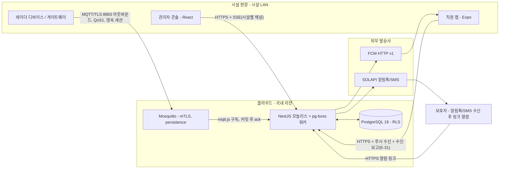
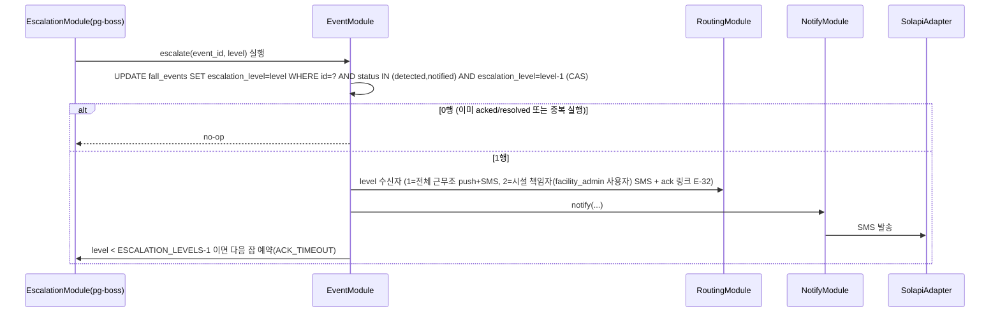
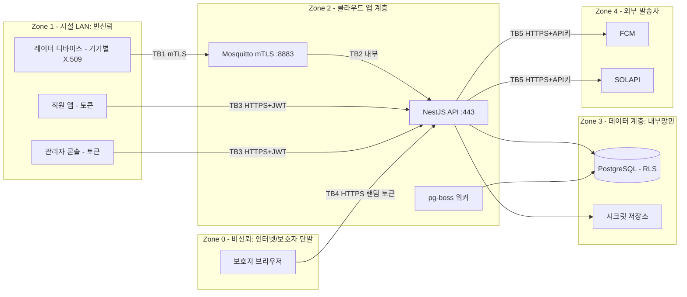

# 아키텍처 — 요양시설 낙상 감지·알림 서비스 (FallGuard)
버전: v1.2 · 기준 03 v1.2
개정 v1.2 (2026-09-07): GATE 1차 반영 — 라우팅을 수신 트랜잭션 안으로(H4), RLS 부트스트랩 함수(H3), 이벤트 없는 관리자 알림·채널(H5), 시설 전체 오프라인(H6), 시설 책임자 = facility_admin 사용자 + ack 링크(H7), 미매핑 디바이스 처리(M16), 토큰 용어 통일(M9), 감사 로그 보존 정책 통일(L18). 말미 "GATE 1차 반영" 절.
개정 v1.1 (2026-09-07): A4 독립 검토(ecc:architect, fable) 판정 FAIL → 13건 전부 타당성 필터 통과·반영. 구현 접근(수신 보장·같은 트랜잭션 예약·CAS·전달 확인·dedup 키·RLS), 데이터 저장(`fall_detections`), D8 역전, TM-05·10·13·16 수정, R4 추가. 말미 "A4 독립 검토 반영" 절.

> 근거 (A4 진입 사전조사, 검색 2회, 2026-09-07)
> - **정량** — Mosquitto는 `require_certificate true` + `use_identity_as_username true` + `allow_anonymous false`로 인증서 CN을 username으로 쓰고, ACL `pattern` 줄의 `%u`가 CN으로 치환돼 **디바이스별 토픽 제한**이 설정만으로 된다 — [mosquitto.conf(5)](https://mosquitto.org/man/mosquitto-conf-5.html), [Weirdloop 인증서 ACL](https://calvernaz.github.io/posts/mqtt_tls_acls/). 별도 인증 서버 컴포넌트가 0개.
> - **정성** — NestJS MQTT 트랜스포트 이슈 "There is no matching event handler defined in the remote service"(nestjs/nest #2236): 토픽 패턴과 `@EventPattern` 불일치가 흔한 실패이고, 트랜스포트가 수신 즉시 자동 ack해 커밋 전 크래시 시 소실된다(A4 검토 H2) — [NestJS MQTT 문서](https://docs.nestjs.com/microservices/mqtt), [이슈 #2236](https://github.com/nestjs/nest/issues/2236). → 수신은 mqtt.js 직접 구독 + 수동 ack.
> - **사용자 영향** — 디바이스 1대의 인증서가 탈취돼도 다른 침상의 가짜 낙상을 만들 수 없어 직원이 헛출동하지 않는다(T-07 예상 밖 노출 금지). 알림 경로는 브로커→서버→FCM 2홉이라 `ALERT_LATENCY_P95` 안에 든다(L-10).

## Context & Scope
- 그린필드. 시설 현장에 벤더 레이더 디바이스(또는 모듈 + RPi 게이트웨이)가 설치되고, 시설 인터넷을 통해 **아웃바운드 MQTT over TLS**로 클라우드(국내 리전)에 연결된다 (Q5).
- 클라우드에는 모듈형 모놀리스 1개(NestJS) + PostgreSQL + Mosquitto가 있고, 직원 앱(Expo)·관리자 콘솔(React)·보호자 열람 페이지(서버 렌더 정적)가 API에 붙는다. **파일럿은 각 1인스턴스**(R4).
- 외부 의존: FCM HTTP v1(푸시), SOLAPI(알림톡·SMS). 둘 다 어댑터 뒤에 둔다 (FR-025).
- 볼륨(03 상수): 시설당 `MAX_BEDS_PER_FACILITY` 디바이스, 낙상 이벤트 `MAX_EVENTS_PER_DAY`, heartbeat는 `HEARTBEAT_INTERVAL`마다 `last_seen_at` 갱신만. 파일럿은 시설 1곳.

## Goals / Non-goals
- Goals: G1 발견 공백 제거(`ALERT_LATENCY_P95`) · G2 신뢰 알림(폴백·dedup·오프라인 감지) · G3 통지·증거 자동화(append-only 감사).
- Non-goals(03 참조): 영상·예측·119·보호자 앱·온프레미스·의료기기. **하이브리드 게이트웨이 로컬 경보는 P1**(검토한 대안 D1).

## 설계

### 시스템 컨텍스트 다이어그램


### 구현 접근 — 난점과 선택
| 난점 | 선택 | 왜 |
|---|---|---|
| **수신 보장** (브로커→DB 사이 소실) | 디바이스 QoS 1 + `clean_session=false` + `client_id=device_id`, 브로커 `persistence true`, 서버는 NestJS 트랜스포트 대신 **mqtt.js 직접 구독 + `manualAck`** — `fall_detections` INSERT 커밋 후 ack. 재전달은 `UNIQUE(device_id, device_event_id)`가 흡수 | 트랜스포트 자동 ack는 커밋 전 크래시에 소실(H2). "중복 없음"과 "최소 1회"를 둘 다 DB로 보증 |
| **원시 감지 vs 이벤트** | 모든 M-01은 `fall_detections` 1행(증거·멱등). `fall_events`는 병합 단위: 디바이스당 활성 이벤트 1개(부분 유니크). 재감지는 `redetect_count`+1, 지연 플러시 묶음(`delayed`)은 이벤트 1개 + "지연 N건" | 병합된 감지의 상태가 정의되지 않았던 문제(M7)를 "원시는 항상 저장, 병합은 이벤트"로 해소. dedup 키를 입소자가 아닌 **디바이스**로(M8 — 생활실 디바이스는 입소자 판별 불가) |
| **에스컬레이션 타이머**의 내구성·경합 | 이벤트 INSERT와 **같은 트랜잭션**에서 pg-boss `send(escalate, {event_id, level:1}, {startAfter: ACK_TIMEOUT, singletonKey})` — `job_id`를 `fall_events.escalation_job_id`에 저장. 실행 시 `UPDATE … WHERE status IN ('detected','notified') AND escalation_level = level-1`(CAS + 행 잠금) — 0행이면 no-op. ack는 잡 취소에 의존하지 않는다(취소는 best-effort). J-02가 `detected`에 `ACK_TIMEOUT` 이상 머문 스테일 이벤트를 훑는 안전망 | FCM 호출 뒤 예약하면 insert~예약 사이 크래시에 감시자 0(H1); pg-boss `cancel`은 active 잡에 무효(M6) → 상태 CAS로 해결 |
| 알림 **전달 보장** (발송사 수락 ≠ 단말 도달) | at-least-once: `notifications` 행 먼저 → 어댑터 호출 → 결과 갱신. 푸시 수락 시 J-07 `push-delivery-check`를 `CHANNEL_FALLBACK_DELAY` 후 예약, 앱의 **수신 보고 E-31**로 `push_ack_at`이 없으면 SMS 폴백 | Doze·와이파이 단절로 FCM 수락 후 미도달(H4). 발송 여부가 DB에 남아 R(부인 방지)·SC-003을 같은 메커니즘으로 |
| "지금 근무 중" **라우팅** | `shifts`(직원·생활실·요일·시간대)를 이벤트 시각으로 조회. **라우팅은 수신 트랜잭션 안에서** 끝낸다: 0명이면 EC-A2 — 시설 전체 staff 발송 + 관리자 알림 + `escalation_level`=1로 INSERT하고 J-01을 level 2로 예약 | 근무표 연동 없이 시설이 직접 유지하는 최소 모델. 라우팅이 커밋 뒤에 있으면 J-01 CAS(`escalation_level=0` 조건)가 no-op이 돼 책임자에게 영원히 못 간다(GATE H4) |
| **테넌트 격리** | PostgreSQL **RLS를 MVP부터**: 모든 테넌트 테이블 `ENABLE/FORCE ROW LEVEL SECURITY` + `USING (facility_id = current_setting('app.facility_id'))`. HTTP는 토큰, 워커는 잡 페이로드, SSE는 시설별 채널에서 컨텍스트를 `SET LOCAL`. 리포지토리 필터는 2차 방어 | 리포지토리 필터만으로는 MQTT ingest·워커·SSE·집계 raw SQL에 컨텍스트가 없어 설계상 테넌트 무관 경로가 남는다(M9). `app_rw` 롤이 이미 있어 RLS 도입 비용이 작다 (D8 역전). **컨텍스트 이전 조회**(로그인 email→시설, 디바이스 CN→시설, 클레임 코드, 열람·ack 토큰)는 `BYPASSRLS` 롤이 소유한 `SECURITY DEFINER` 함수 4개로만 — 05 DDL (GATE H3) |
| **디바이스 벤더 격리** | `DeviceAdapter` 인터페이스(벤더 페이로드 → 정규 `FallDetected`/`Heartbeat`). MVP는 정규 JSON 1종 + 벤더 어댑터 1개 자리. `device_event_id` 유일성(A-7)은 계약 테스트로 착수 첫 작업에서 검증 | SDK 공개 여부 미확인(01, R2) → 페이로드 계약을 우리가 정의하고 게이트웨이가 변환 |
| 콘솔 **실시간** | SSE(시설별 채널, 서버→콘솔 단방향) + 폴링 폴백. 사이렌은 클라이언트가 `detected/notified` 존재 시 반복 재생 | 양방향 불필요 → WebSocket보다 단순(D4) |
| 시각 오염 | 디바이스 `detected_at`과 서버 `received_at`을 둘 다 저장, 모든 SLA·정렬은 `received_at` 기준 | P1 시계 드리프트 |
| 디바이스 폭주 | 앱 단 `DEVICE_RATE_LIMIT`를 **DB 카운터**(분 단위 upsert)로 — 인스턴스 수와 무관. `delayed=true` 플러시는 제외 | 브로커 `max_inflight`는 인플라이트 창이지 레이트리밋이 아님(L11). 인메모리 카운터는 복제본별로 갈라짐 |
| 규모(100시설) | 파일럿은 API 1인스턴스. 수평 확장 시 MQTT 5 공유 구독 `$share/ingest/fallguard/+/fall`(Mosquitto 2.x 설정)로 복제본 간 1회 소비 | 설정 변경만으로 가능하도록 토픽·소비 로직을 미리 공유 구독 호환으로 |

### 컴포넌트 구조
```mermaid
flowchart TB
  subgraph NEST[NestJS 모놀리스 - 모듈]
    ING[IngestModule\nmqtt.js 구독·수동 ack·fall_detections 저장·병합]
    EVT[EventModule\n상태 기계 detected→notified→acked→resolved→family_notified\nresolutions 이력]
    RTG[RoutingModule\n근무조 조회·수신자 결정]
    NTF[NotifyModule\n채널 어댑터·재시도·폴백·J-06 채널 상태]
    ESC[EscalationModule\npg-boss J-01 CAS·J-02 스테일/오프라인 스캔·J-07·J-08]
    DVC[DeviceModule\n프로비저닝·heartbeat·offline·flap 억제]
    FAMM[FamilyModule\n랜덤 토큰 발급(해시 저장)·열람 페이지]
    AUTH[AuthModule\n역할·facility 컨텍스트(SET LOCAL)·토큰]
    AUD[AuditModule\nappend-only 기록]
    CAPI[ConsoleApiModule\nREST + SSE(시설별)]
  end
  ADP_FCM[FcmAdapter]
  ADP_SOL[SolapiAdapter]
  ADP_VOICE[VoiceAdapter - P2 자리]
  ING --> EVT --> RTG --> NTF
  EVT --> ESC --> NTF
  NTF --> ADP_FCM
  NTF --> ADP_SOL
  NTF -.-> ADP_VOICE
  EVT --> FAMM --> NTF
  DVC --> NTF
  EVT --> AUD
  NTF --> AUD
  CAPI --> EVT
  CAPI --> DVC
  AUTH --> CAPI
  AUTH --> ESC
```

### 데이터 흐름

**시나리오 1 — 감지 → 직원 알림 → 확인 (FR-003·004·005·006·007·026)**
```mermaid
sequenceDiagram
  participant DEV as 레이더 디바이스
  participant MQ as Mosquitto
  participant ING as IngestModule
  participant EVT as EventModule
  participant ESC as EscalationModule
  participant RTG as RoutingModule
  participant NTF as NotifyModule
  participant FCM as FcmAdapter
  participant APP as 직원 앱
  DEV->>MQ: publish QoS1 fallguard/{device_id}/fall {device_event_id, detected_at, delayed}
  MQ->>ING: deliver (영속 세션)
  ING->>ING: BEGIN; SET LOCAL app.facility_id
  ING->>ING: device_lookup(CN) — 부트스트랩 함수; 카나리면 detections만 저장 후 ack·종료; 미매핑이면 관리자 알림 + ack·종료 (EC-A5)
  ING->>ING: INSERT fall_detections (UNIQUE → 중복이면 ack 후 종료)
  ING->>EVT: 디바이스 활성 이벤트 있나? (부분 유니크)
  alt 활성 이벤트 있음
    EVT->>EVT: redetect_count+1, detection.event_id 연결 (추가 알림 없음)
  else 없음
    EVT->>RTG: 수신자 결정(생활실·현재 시각·shifts) — 같은 tx
    RTG-->>EVT: staff[] (0명이면 시설 전체 + 관리자 알림, L0=1; 있으면 L0=0)
    EVT->>EVT: INSERT fall_events(detected, escalation_level=L0, next_escalation_at=now+ACK_TIMEOUT)
    EVT->>ESC: 같은 tx에서 J-01 escalate(level=L0+1, startAfter=ACK_TIMEOUT) 예약 → escalation_job_id
  end
  ING->>ING: COMMIT
  ING->>MQ: ack (커밋 후)
  EVT->>NTF: notify(event, staff[], channel=push)
  NTF->>NTF: notifications 행 생성(pending)
  NTF->>FCM: send()
  FCM-->>NTF: 수락(message_id) / 실패
  NTF->>ESC: 수락 시 J-07 push-delivery-check(startAfter=CHANNEL_FALLBACK_DELAY)
  NTF->>EVT: 상태 notified, notified_at
  APP->>NTF: POST /me/push-receipts (E-31) → push_ack_at
  APP->>EVT: POST ack (멱등, 행 잠금)
  EVT->>EVT: acked + J-08 resolution-reminder 예약 + 다른 수신자에게 "확인했어요"
```

**시나리오 2 — 미응답 에스컬레이션 (FR-008)**


**시나리오 3 — 대응 기록 → 보호자 통지 (FR-009·010·011)**
```mermaid
sequenceDiagram
  participant APP as 직원 앱
  participant EVT as EventModule
  participant FAM as FamilyModule
  participant NTF as NotifyModule
  participant SOL as SolapiAdapter
  participant GUA as 보호자
  APP->>EVT: POST resolution {verdict: confirmed_fall|false_alarm, note}
  EVT->>EVT: family_notified 이후면 409 event-closed; 아니면 resolved (이전 판정 is_current=false)
  alt confirmed_fall
    EVT->>FAM: 통지 대상 보호자 조회
    FAM->>FAM: 256-bit 랜덤 토큰 발급, family_links에 해시·expires_at(FAMILY_LINK_TTL) 저장
    FAM->>NTF: notify(guardians, 알림톡 → SMS 폴백, 마스킹 본문 + 링크)
    NTF->>SOL: 알림톡 발송
    SOL-->>NTF: 결과
    NTF->>EVT: family_notified (FAMILY_NOTICE_LATENCY_MAX 안)
    GUA->>FAM: GET /family/{token}
    FAM-->>GUA: 시각·대응 내용·담당자 역할 (만료 410, 해시 불일치 404)
  else false_alarm
    EVT->>EVT: 통지 없음, 오탐 집계 +1
  end
```

### 데이터 저장 (설계 결정에 관련된 부분만 — 전체 스키마는 05)
- `fall_detections`: 원시 감지 1행/메시지, `UNIQUE(device_id, device_event_id)` — 멱등 수신·증거. 같은 키·다른 `detected_at`은 파생 키로 저장 + 관리자 경고(H3).
- `fall_events`: 병합 단위. 디바이스당 활성 이벤트 1개(부분 유니크 `fall_events_one_active_per_device`). `escalation_job_id`, `escalation_level` 0..2. 월 파티셔닝은 P1, MVP는 `(facility_id, status, received_at)` 인덱스.
- `notifications`: 발송 시도 1건 = 1행 + `push_ack_at`(E-31) + `kind`. `event_id`는 nullable — 이벤트 없는 관리자 알림(오프라인·채널·미배정·미매핑·리마인더)도 같은 원장에 남긴다(GATE H5). 상태 전이의 증거이자 재시도·폴백의 원장.
- `ack_links`: 에스컬레이션 SMS의 1회용 ack 토큰(해시·`ACK_LINK_TTL`·`used_at`), 이벤트·사용자에 바인딩 (FR-029).
- `resolutions`: 판정 이력(`is_current` 부분 유니크). `family_notified` 이후 변경 금지는 EventModule 규칙 + 06 TS-034.
- `audit_log`: append-only. `app_rw`에 INSERT·SELECT만, UPDATE/DELETE는 REVOKE + 트리거(SC-011). 이벤트·알림·감사 기록은 `EVIDENCE_RETENTION` 경과 후 파기 대상이나 구현은 P2(파일럿 기간 내 미도달) — 05 데이터 규칙과 동일 정책.
- `devices.last_seen_at`: heartbeat는 행 없이 갱신. J-02가 `OFFLINE_SCAN_INTERVAL`마다 `HEARTBEAT_TIMEOUT` 초과·스테일 이벤트를 스캔, offline 알림은 `FLAP_SUPPRESS_WINDOW`로 억제.
- RLS: 테넌트 테이블 전부 `FORCE ROW LEVEL SECURITY`, 롤에 `BYPASSRLS` 없음. 시설 횡단 잡은 시설 목록을 읽고 시설별 트랜잭션으로 반복.
- 개인정보 컬럼(입소자 이름·보호자 연락처)은 `residents`·`guardians`에만. 이벤트·알림·감사에는 ID만.
- 백업: 일 1회 스냅샷 + WAL(`RPO`), 복원 `RTO`, 리허설 `BACKUP_RESTORE_DRILL` — 절차는 07. 게이트웨이 배치의 로컬 버퍼는 `EDGE_BUFFER_MAX`.

## 검토한 대안
| ID | 대안 | 트레이드오프 | 왜 최종안이 아닌가 |
|---|---|---|---|
| D1 | 하이브리드 — 현장 게이트웨이가 인터넷 두절 시 로컬 경보(부저·LAN 푸시) (Q5-C) | 안전성 최고. 두 경로의 개발·검증·OTA 부담 | 2~3인 팀·파일럿 1시설 범위 밖. **P1 1순위 후보**. 잔여 리스크 R1로 명시 |
| D2 | Redis + BullMQ 지연 잡 | 성숙·고성능. 데이터스토어 +1, 운영 대상 +1 | 이벤트 볼륨이 작아(`MAX_EVENTS_PER_DAY`) pg-boss로 충분하고, 잡 예약을 이벤트 INSERT와 같은 DB 트랜잭션에 넣을 수 있는 것이 안전 경로에 결정적(H1) |
| D3 | EMQX 브로커 | 대시보드·규칙 엔진 내장 | v5.9+ BSL 1.1 라이선스(01) — SaaS 재판매 검토 비용. Mosquitto ACL 패턴·persistence·공유 구독이 요구를 충족 |
| D4 | WebSocket 콘솔 실시간 | 양방향 | 콘솔은 수신만 필요. SSE + 폴링 폴백이 단순하고 프록시 친화적 |
| D5 | 마이크로서비스(ingest/notify 분리) | 독립 배포·확장 | 파일럿 규모에서 배포 대상만 늘림. 모듈 경계는 유지해 분리 여지를 남김 |
| D6 | TimescaleDB 하이퍼테이블 | 시계열 압축·집계 | heartbeat를 행으로 저장하지 않으므로 시계열 볼륨 자체가 없음. TSL 기능 제약 회피 |
| D7 | 보호자 앱 | 푸시·양방향 | 설치·심사·P4 항목 증가. 알림톡+열람 링크로 충분(Q2 확정 통지만) |
| D8 | 리포지토리 `facility_id` 필터만으로 시작, RLS는 P1 (v1.0 최종안) | 구현 단순 | MQTT ingest·워커·SSE·집계 raw SQL에 요청 컨텍스트가 없어 설계상 누출 경로(M9). **v1.1에서 RLS MVP 적용으로 역전** |
| D9 | NestJS MQTT 트랜스포트(`@EventPattern`) 그대로 사용 | 코드 적음 | 수신 즉시 자동 ack → 커밋 전 크래시에 소실(H2). mqtt.js 직접 구독 + 수동 ack로 대체 |
| D10 | dedup 키 = 입소자 (v1.0) | 의미상 자연스러움 | 생활실 단위 디바이스는 입소자 판별 불가, 지연 플러시와 충돌(M8). 디바이스 키로 대체 |

## 위협모델 (Cross-cutting: 보안)

### ① 무엇을 만드는가 — DFD + trust boundary


### ② 무엇이 잘못될 수 있는가 — STRIDE 전수 (경계 6 × 범주 6)
| 자산/경계 | S | T | R | I | D | E |
|---|---|---|---|---|---|---|
| **TB1** 디바이스→Mosquitto | TM-01 복제·탈취 인증서로 가짜 낙상 발행 | TM-02 전송 중 페이로드 변조 | TM-03 디바이스 측 "발행한 적 없다" | TM-04 토픽 도청으로 재실 패턴 노출 | TM-05 고장 디바이스가 초당 수백 건 발행 | TM-06 다른 디바이스 토픽에 발행 |
| **TB3** 직원 앱·콘솔→API | TM-07 공용 근무 단말의 훔친 토큰 | TM-08 다른 이벤트 ID로 ack/판정 변조 | TM-09 "내가 확인·판정하지 않았다" | TM-10 다른 시설 데이터 조회 | TM-11 로그인 무차별 대입 | TM-12 `role` 파라미터로 admin 승격 |
| **TB4** 보호자 링크 | TM-13 토큰 추측·열거 | 해당없음 — 읽기 전용, 상태 변경 엔드포인트 없음 | 해당없음 — 보호자 행위가 없음(열람 로그만 기록) | TM-14 링크 전달·스크린샷 유출 | TM-15 링크 페이지 스크래핑 | TM-16 토큰 하나로 다른 이벤트 열람 |
| **TB5** API→FCM/SOLAPI | TM-17 발송사 콜백(웹훅) 위장 | 해당없음 — TLS + 인증서 검증, 요청 본문은 우리 생성 | TM-18 "발송했다/안 했다" 분쟁 | TM-19 API 키 유출 | TM-20 발송사 장애·스로틀 | 해당없음 — 발송사 권한은 우리 계정 범위 |
| **Z3** DB·감사 로그 | 해당없음 — 외부 노출 없음, 앱 전용 롤만 접속 | TM-21 감사 로그 수정·삭제 | TM-22 운영자 DB 직접 조작 | TM-23 백업 파일 유출 | TM-24 디스크 풀 | TM-25 앱 롤이 슈퍼유저 |
| **Z2** 알림 파이프라인(큐·타이머) | 해당없음 — 내부 프로세스, 외부 입력 없음 | TM-26 잡 중복 실행으로 이중 발송 | 해당없음 — 발송 시도가 audit_log에 기록됨 | TM-27 로그에 연락처 원문 | TM-28 워커 다운으로 에스컬레이션 정지 | 해당없음 — 워커는 권한 경계를 넘지 않음 |

### ③ 무엇을 할 것인가
| ID | 대응 | 대책 |
|---|---|---|
| TM-01 | Mitigate | 기기별 X.509(CN=device_id), `require_certificate` + `use_identity_as_username`, CRL/폐기 목록, 콘솔에서 디바이스 폐기 시 인증서 revoke |
| TM-02 | Mitigate | TLS 1.2+ 필수, 평문 1883 포트 미개방, 서버 `received_at` 기준 처리 |
| TM-03 | Accept | 브로커 접속 로그 + `fall_detections` 원시 보존으로 충분. 디바이스는 우리 관리 자산 |
| TM-04 | Mitigate | TLS; 페이로드에 이름 없음(device_id·event_id만) |
| TM-05 | Mitigate | 앱 단 `DEVICE_RATE_LIMIT`를 DB 카운터로(인스턴스 무관, `delayed` 제외) + 디바이스당 활성 이벤트 1개 + 관리자 알림. 브로커 `max_inflight`는 인플라이트 창이지 리밋이 아님 |
| TM-06 | Eliminate | ACL `pattern write fallguard/%u/#` — 자기 토픽만 |
| TM-07 | Mitigate | `ACCESS_TOKEN_TTL` 짧게, 리프레시 서버 폐기, 교대 시 로그아웃 정책(P4) |
| TM-08 | Mitigate | ack·판정은 서버가 `facility_id`·역할·이벤트 소속 검증, 멱등 처리, 행 잠금 |
| TM-09 | Mitigate | audit_log에 행위자·서버 시각·클라이언트 IP·앱 버전 |
| TM-10 | Mitigate | **RLS(FORCE) + `SET LOCAL app.facility_id`** — HTTP·워커·SSE 전 경로. 리포지토리 필터는 2차. SC-007은 HTTP 매트릭스 + 워커 컨텍스트 테스트(06 TS-057) |
| TM-11 | Mitigate | 로그인 레이트리밋(IP·계정), argon2, 실패 로그 |
| TM-12 | Eliminate | 역할은 DB에서만 읽고 JWT는 서명·서버 발급, 요청 본문 `role` 무시 |
| TM-13 | Mitigate | **256-bit CSPRNG 토큰, DB에는 SHA-256 해시만**, `FAMILY_LINK_TTL` 만료, 폐기 가능(행 삭제), 실패 시 404 동일 응답 |
| TM-14 | Mitigate | 최소 정보(입소자 이름 아님 — "OOO 어르신" 마스킹, 담당자 역할만), 만료, 열람 로그. 잔여: 보호자 본인의 전달은 수용 |
| TM-15 | Mitigate | IP 레이트리밋, 캐시 금지 헤더 |
| TM-16 | Eliminate | 토큰 행이 `(event_id, guardian_id)`에 바인딩 — 다른 이벤트에 재사용 불가 (HMAC 파생이 아닌 저장 바인딩) |
| TM-17 | Mitigate | 콜백은 서명 검증 또는 미사용(폴링 조회로 대체). 아웃바운드 TLS 인증서 검증 |
| TM-18 | Mitigate | 발송사 `message_id`·응답 본문을 `notifications`에 저장 + `push_ack_at`(단말 도달) |
| TM-19 | Mitigate | 시크릿은 환경변수/시크릿 저장소만, 저장소 커밋 금지(07 `.env.example`), 분기 키 회전 |
| TM-20 | Mitigate | 큐 재시도 `NOTIFY_RETRY_MAX` + 채널 폴백 + J-07 전달 확인 + FR-022 배너. 잔여: 전 채널 동시 장애 → 콘솔 사이렌만(R3) |
| TM-21 | Eliminate | 앱 롤 `REVOKE UPDATE, DELETE ON audit_log` + BEFORE 트리거 RAISE (SC-011) |
| TM-22 | Accept(부분) | 파일럿은 운영자 1~2인. DB 접속 로그 보존, P1에 pgaudit |
| TM-23 | Mitigate | 백업 암호화(저장 시), 오프사이트 접근 최소 권한 |
| TM-24 | Mitigate | 볼륨 작음 + 디스크 사용률 알람(07) |
| TM-25 | Mitigate | 롤 분리: `app_rw`(DML), `migrator`(DDL), `retention`(파기). 셋 다 `BYPASSRLS` 없음 |
| TM-26 | Mitigate | J-01 CAS(`status`·`escalation_level` 조건) + pg-boss singleton key + `notifications` 유니크(event_id, recipient, channel, attempt) |
| TM-27 | Mitigate | 로그 필드 마스킹(연락처 뒤 4자리만), 이벤트 본문에 개인정보 없음(구조적) |
| TM-28 | Mitigate | 워커 헬스체크 + 데드맨 알람(07): 5분간 잡 처리 0이면 알림. 재기동 시 pg-boss가 DB의 예약 잡을 그대로 이어 실행(잡은 DB에 있음) |

### ④ 충분한가 — 상위 리스크 재검토
| 리스크 | 잔여 | 판단 |
|---|---|---|
| **R1 시설 인터넷 두절** — 감지는 되나 클라우드가 못 받는다 | 두절 자체는 FR-028(시설 전체 오프라인, `FACILITY_OFFLINE_DELAY`)이 집계 알림 1건(관리자 SMS — 발송사는 클라우드 측)과 AL-04로 알리고 디바이스별 알림은 억제한다. 그 사이 낙상은 미탐. 복구 후 영속 세션·로컬 버퍼가 지연 플러시(`delayed`) | Accept(파일럿) + 완화: 시설 LTE 백업 회선 권고(A-4), P1 D1 하이브리드. 08 착수 조건에 명시 |
| **R2 디바이스 벤더 페이로드·SDK 불확실** (01 미확인) | 어댑터로 격리했지만 벤더 이벤트 의미(예: "자세 변화"와 "낙상" 구분)와 `device_event_id` 유일성(A-7)이 다르면 오탐률 목표 실패·소리 없는 드롭 | Mitigate: 착수 첫 작업에 벤더 페이로드 계약 테스트(07 첫 작업 1), 같은 키·다른 시각은 새 감지 + 경고 |
| **R3 알림 발송사 동시 장애** | 푸시·알림톡·SMS가 모두 죽으면 콘솔 사이렌만 남는다 | Accept(파일럿): 콘솔이 시설 사무실에 상시 켜져 있음을 운영 조건으로. P2 음성 전화 채널(FR-025) |
| **R4 자체 운영 SPOF** — Mosquitto 1대·API/워커 1프로세스·PostgreSQL 1대 | 어느 하나가 죽으면 그 시간 동안 수신·알림·에스컬레이션이 멈춘다. 브로커 persistence·pg-boss DB 잡·디바이스 영속 세션 덕에 **복구 후 소실은 없지만 지연은 있다**. SC-009 카나리(MQTT→DB 왕복)가 이를 잰다 | Accept(파일럿): 컨테이너 재시작 정책 + 07 알람(데드맨·헬스체크) + `RTO`. 다시설 확장 시 브로커 이중화·API 복제(공유 구독)·PG 관리형 HA로 — 설정·인프라 변경, 코드 변경 없음 |

## Cross-cutting: 관측성 · 프라이버시
- **관측성** — 파이프라인 각 단계(`received_at`, `notified_at`, `push_ack_at`, `acked_at`, `resolved_at`, `family_notified_at`)를 행에 타임스탬프로 남겨 SC-001·SC-003·SC-006이 로그 파싱 없이 SQL로 계산된다. `push_ack_at`은 E-31이 쓴다. 골든 시그널·알람은 07.
- **프라이버시** — 민감정보(건강)는 "낙상 이벤트 사실" 자체다. 이벤트·알림·로그에는 ID만, 이름·연락처는 `residents`·`guardians`에만. 보호자 메시지는 마스킹 + 링크. 영상 데이터는 존재하지 않는다(Q1). 보존 `EVIDENCE_RETENTION`, 퇴소 후 파기(FR-020). 동의 기록은 `residents.consent_*`(FR-014).

## A4 독립 검토 반영 (ecc:architect, fable, 2026-09-07, 판정 FAIL → v1.1)
타당성 필터: 13건 중 거짓 양성 0건. 전부 반영, 규모 항목(M10)은 파일럿 코드 변경 없이 "공유 구독 호환"으로만.

| # | 심각도 | 지적 | 처리 |
|---|---|---|---|
| H1 | HIGH | 에스컬레이션 잡을 FCM 뒤에 예약 → 크래시 시 `detected` 영구 정지 | 같은 트랜잭션 예약 + CAS 가드 `detected/notified` + J-02 스테일 스캔. FR-008 개정 |
| H2 | HIGH | NestJS 트랜스포트 자동 ack → 커밋 전 크래시 소실 | mqtt.js 수동 ack, QoS1, 영속 세션, 브로커 persistence. FR-003 개정, D9 |
| H3 | HIGH | `device_event_id` 유일성 도메인 정의 누락 | 05 M-01 계약(UUID v4 또는 boot_id:seq), 충돌·다른 시각은 새 감지 + 경고, 가정 A-7 |
| H4 | HIGH | FCM 수락 ≠ 단말 도달, 전달 확인 잡 없음 | E-31 수신 보고 + J-07 전달 확인 폴백. FR-006 개정, FR-026 신설 |
| M5 | MEDIUM | 자체 SPOF 미기재, SC-009가 HTTP만 측정 | R4 추가, SC-009를 MQTT→DB 카나리 왕복으로 개정 |
| M6 | MEDIUM | pg-boss `cancel`은 active 잡에 무효 | ack는 취소에 의존하지 않고 CAS·행 잠금으로 no-op, `escalation_job_id` 저장 |
| M7 | MEDIUM | 병합된 행의 상태 정의 누락 | `fall_detections`(원시, 항상 저장) / `fall_events`(병합) 분리 |
| M8 | MEDIUM | dedup 키 입소자·지연 플러시 충돌 | dedup 키 = 디바이스, 지연 묶음 1이벤트 + "지연 N건", 레이트리밋 제외. FR-004 개정, D10 |
| M9 | MEDIUM | 리포지토리 필터만으로는 워커·SSE·raw SQL 누출 | RLS MVP 적용(FORCE), 컨텍스트 SET LOCAL, SSE 시설별 채널. D8 역전, FR-018 개정 |
| M10 | MEDIUM | 100시설: API 복제 시 MQTT 중복 소비·인메모리 리밋 분산 | 공유 구독 호환 토픽, DB 카운터 리밋. 파일럿은 1인스턴스 |
| L11 | LOW | `max_inflight`는 리밋 아님 | TM-05 대책 수정 |
| L12 | LOW | 토큰 공식 3종 불일치, HMAC은 폐기 불가 | 랜덤 토큰 + 해시 저장 + 행 바인딩으로 통일. TM-13·16 수정 |
| L13 | LOW | `family_notified` 후 정정 전이 정의 누락 | 판정 변경 거부(409 `event-closed`), 관리자 메모만. FR-009 개정 |
| 불일치 1~10 | — | FR-006/SC-009/레벨 번호/EC-A2/EC-B2/FR-012 flap/FR-009 저장소/FR-022 소유/미사용 상수/FR-018 TB4 | 전부 03 v1.1·04 v1.1·05 v1.1에 반영 (FR-027·상수 3개 신설, 컴포넌트 표에 소유 모듈 명시, 데이터 저장 절에 백업·EDGE_BUFFER_MAX) |

## GATE 1차 반영 (fresh-context 검토관, fable, 2026-09-07, 판정 FAIL → v1.2)
타당성 필터: CRITICAL 2·HIGH 5·MEDIUM 9·LOW 3 전부 타당(거짓 양성 0). 예산상 재검토 없음 — 반영 후 메인 자기 점검 + `check_package.py`만. 상세는 08.

| # | 지적 | 04에서의 처리 |
|---|---|---|
| C1 | 생활실 디바이스 이벤트는 입소자가 없어 보호자 통지 불가 | E-13 `resident_id`, FR-010 보류 배너 (03·05) |
| C2 | 03 상수 표 밖 임계·버전 | 03 상수 19개 승격, node 버전 Assumed A-9 |
| H3 | FORCE RLS가 부트스트랩 조회를 막음 | `SECURITY DEFINER` 함수 4개(BYPASSRLS 소유), 403→404 |
| H4 | 미배정 시 level 2 영구 미도달 | 라우팅을 수신 tx 안으로, J-01 level=L0+1 |
| H5 | 이벤트 없는 관리자 알림 저장 불가·채널 정의 누락 | `notifications.event_id` nullable + `kind`, 관리자 알림 = SMS + 배너 |
| H6 | 시설 전체 오프라인 FR 없음 | FR-028, J-02 시설 단위 |
| H7 | 시설 책임자가 ack 불가 | FR-029, `escalation_contact_user_id`, E-32 ack 링크 |
| M8~M16, L17~19 | 값 재기입·용어·next_escalation_at·목록 404·채널 임계·착수 자산·관측성 과잉·카나리 규칙·미매핑 poison·AL-03 조건·보존 정책·서버 예산 | 03·05·06·07 v1.2/v1.1에 반영 |
