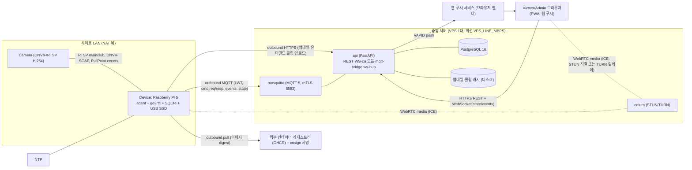
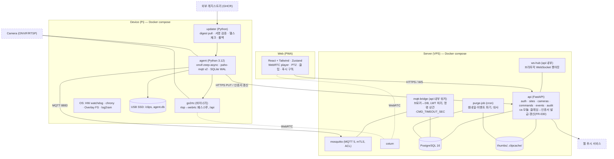
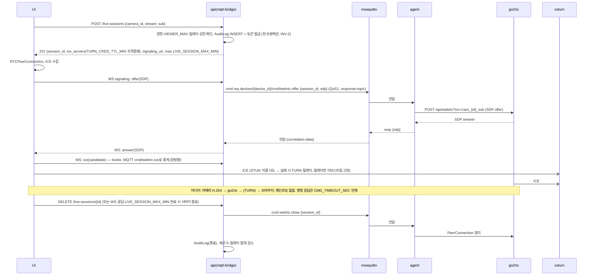
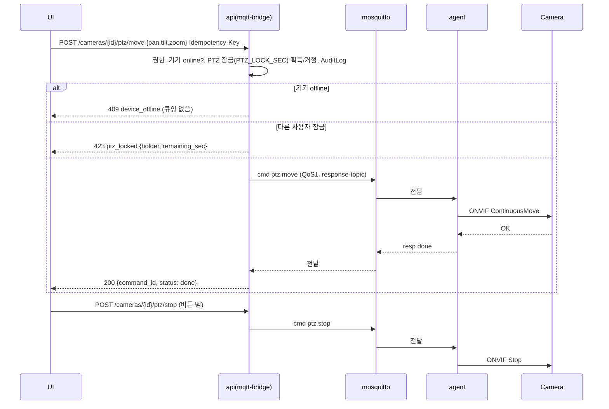
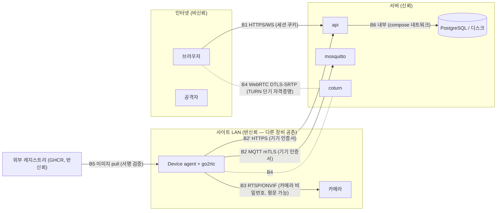
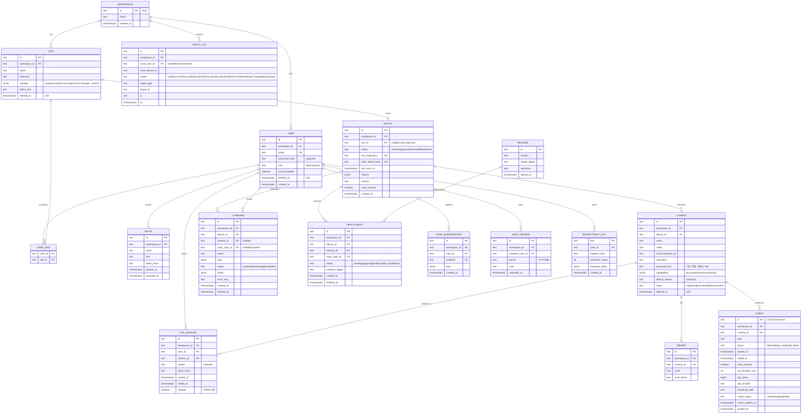

<!-- ===== 00-seed.md ===== -->
# Seed — PiCam Watch (라즈베리파이 엣지 기반 IP 카메라 제어·실시간 모니터링)

- 원문: 라즈베리파이로 IP 카메라를 제어하고 실시간 모니터링하는 서비스를 만들고 싶다.
- 서비스 유형: 복합 — IoT·엣지(라즈베리파이 게이트웨이) + 관제(실시간 영상·알람) + 웹(원격 대시보드)
- 주 도메인 / 인접 도메인: 영상 감시(CCTV/IP 카메라, ONVIF·RTSP) / 엣지 디바이스 운영(fleet), 웹 관제 대시보드, 개인정보(영상정보) 규제
- 감지된 제약:
  - 하드웨어가 **라즈베리파이**로 못 박힘 → CPU·업링크 대역·SD카드·RTC 없음이 설계 변수
  - "IP 카메라"는 이미 있는 장비를 전제 → 카메라 제조사 무관 표준 프로토콜(ONVIF/RTSP) 연동이 필수
  - "실시간" → 지연 상한을 측정 가능한 숫자로 정의해야 함
  - "제어" → 무엇을 제어하는지(PTZ·프리셋·설정·전원)가 원문에 없음
- 로드할 블라인드스팟 프로파일: **P1 IoT·엣지** (전부) + **P3 관제** (실시간성·알람 폭주·이력 증가·무중단) + STRIDE 6범주
- 강도: **full** — 사유: 사용자가 `full`을 지정했고, 신호 표에서도 "하드웨어/엣지" · "민감정보(영상 = 개인정보)" · "외부 시스템 연동 2개 이상(카메라 ONVIF/RTSP + 푸시 알림)"이 동시에 걸린다. 플랫폼(Pi)·범위(제어+모니터링)·핵심 루프(카메라 스트림 → Pi 중계 → 원격 시청, 제어 명령 역방향)가 모두 확정돼 있어 spike는 불필요.
- 해석한 것 (사용자가 말하지 않았는데 내가 정한 것 — 틀리면 비싼 순, 전부 Assumed):
  1. **Pi의 역할 = 엣지 게이트웨이.** 카메라와 같은 LAN에 놓여 카메라 스트림을 받아 중계·녹화하고 제어 명령을 프록시한다. Pi 자체가 카메라(Pi Camera Module)인 구성이 아니다. — 틀리면 아키텍처 전체 재작업
  2. **원격 시청 경로 = 중앙 서버(클라우드/온프렘) 경유.** Pi는 NAT/방화벽 뒤에 있고 포트포워딩은 금지 전제 → Pi→서버 아웃바운드 상시 연결. LAN 전용(서버 없음) 구성이 아니다. — 틀리면 서버 컴포넌트 전체가 불필요/필요
  3. **"제어" = ONVIF 표준 제어** (PTZ 이동·프리셋·스냅샷·기본 설정 조회). 카메라 전원 릴레이·GPIO 제어는 범위 밖. — 틀리면 하드웨어 추가 구매
  4. **규모 = 소규모 사이트.** 사이트 ≤10곳, 사이트당 카메라 ≤4대, 동시 시청자 ≤5명 (Pi 업링크·CPU 한계에서 역산). — 틀리면 Pi 대신 x86 NVR로 플랫폼 교체
  5. **시청 클라이언트 = 웹 브라우저**(PC + 모바일 반응형). 네이티브 앱 없음. — 되돌리기 비용 중
  6. **녹화 = 이벤트 클립(모션/수동) + 짧은 순환 버퍼.** 24/7 연속 장기 녹화(NVR급)는 non-goal. — 되돌리기 비용 중(저장 설계 변경)
  7. **사용자 = 소규모 시설 운영자**(매장·사무실·창고·농장) 1~수 명, 관리자/시청자 2역할. 다중 테넌트 SaaS 판매가 아니라 자가 운영. — 되돌리기 비용 중(테넌시 추가)
  8. **시장 = 한국.** 개인정보보호법의 영상정보처리기기 규정(안내판·보존기간)을 적용. — 되돌리기 비용 저
- 기존 시스템: 없음 (신규)

<!-- ===== 01-recon.md ===== -->
# RECON — PiCam Watch
초안: sonnet 서브에이전트 · 조사일 2026-09-08 · 검색 36회 (WebSearch 24 + WebFetch 12)

## 도메인 업무 흐름 — 이 산업이 실제로 어떻게 돌아가는가 (출처)

**ONVIF 프로파일 체계 (확정).** ONVIF는 카메라/NVR/VMS 상호운용을 위한 컨포먼스 프로파일을 운영한다.
- Profile S — 기본 스트리밍(레거시). ONVIF가 2025-10-09 Profile S 지원 종료를 발표했고, 2027-03-31 이후로는 신제품/신펌웨어의 Profile S 신규 컨포먼스 제출이 불가하다. 사유는 "인증 메커니즘이 현재 사이버보안 권고와 맞지 않음". (출처: [ONVIF to End Support for Profile S](https://www.onvif.org/?post_type=pressrelease&p=8621), 2026-09-08 확인)
- Profile T — 2026년 기준 스트리밍 baseline. H.265 + H.264, 이미징 설정, 모션/탬퍼링 이벤트, 메타데이터 스트리밍, 양방향 오디오 포함. 2018년 도입. (출처: [ONVIF Profiles](https://www.onvif.org/profiles/), forasoft.com 교차확인, 2026-09-08)
- Profile G — 엣지(카메라/레코더 자체) 저장 및 시간/이벤트/모션 기준 검색·조회를 표준화. (출처: [ONVIF Profiles](https://www.onvif.org/profiles/), 2026-09-08)
- Profile M — 메타데이터·분석. Profile A/C/D는 출입통제 계열(본 서비스와 무관).
→ 본 서비스는 스트리밍+PTZ가 핵심이므로 **Profile T가 2026년 시점의 표준 타깃**, Profile S는 레거시 카메라 호환용으로만 취급해야 함.

**ONVIF PTZ 서비스 (확정).** PTZ 제어(Pan/Tilt/Zoom, Stop, 좌표계, 프리셋)는 공식 ONVIF PTZ Service Specification으로 표준화돼 있다. 최신은 v26.06, 좌표는 space URI로 표현되는 여러 좌표계를 지원. (출처: [ONVIF PTZ Service Spec v26.06 PDF](https://www.onvif.org/specs/srv/ptz/ONVIF-PTZ-Service-Spec.pdf), 2026-09-08) → "제어 = ONVIF PTZ 표준 채택"은 표준화된 접근이며 벤더 종속 프로토콜을 만들 필요가 없다는 근거.

**RTSP 메인/서브 스트림 관행 (가능성 — 벤더 문서 교차확인).** 업계 관행은 메인스트림(고해상도, 저장/증거용)과 서브스트림(저해상도·저비트레이트, 모바일/그리드뷰용)을 동시에 송출하는 것. Hikvision 공식 FAQ 문서와 다수 벤더 블로그가 일치. (출처: [Hikvision 공식 Bit Rate FAQ PDF](https://www.hikvision.com/content/dam/hikvision/ca/faq-document/H.2645-&-H.2645-Recommended-Bit-Rate-at-General-Resolutions.pdf), [getscw.com](https://www.getscw.com/knowledge-base/nvr-bitrate), 2026-09-08)

**소규모 시설 CCTV 운영 흐름 (가능성 — 산업 블로그 교차확인, 1차 표준 문서 아님).** 설치(자가설치 DIY 또는 통신사 결합상품/설치업체, 렌탈 vs 구매) → 라이브 확인 → 이벤트 알림 → 클립 확인 → 보관(권고 30일+) → 파기. 3년 미만 운영 예정 매장은 렌탈, 3년 이상은 구매가 합리적이라는 시장 통념. (출처: [매장 CCTV 설치 비용 가이드](https://mejindan.ai/blog/cctv-install-cost-guide/), [keeper.ceo](https://keeper.ceo/blog/cctv-installation-cost), [보안뉴스 소호 CCTV 서비스 비교](https://m.boannews.com/html/detail.html?idx=67718), 2026-09-08) — 단일 블로그가 아니라 3개 독립 소스 교차확인.

## 이해관계자 — 누가 쓰고, 누가 돈을 내는가 (출처)

- **시설 운영자(관리자, 비용 지불자)** — 매장·사무실·창고·농장의 소상공인 1~수 명. seed 파일 가정 7과 일치.
- **시청자** — 관리자 본인 또는 위임 직원(별도 확인 소스 없음, seed 가정 유지).
- **설치자** — 자가설치(DIY 패키지, 예: Hikvision 자가설치 스토어) 또는 통신사 결합상품/전문 설치업체. 자가설치는 비용 절감이나 "어렵고 복잡, A/S 애매, 야간 촬영 실패 등 오설치 리스크"가 지적됨. (출처: [CCTV 자가설치 하지 마세요](https://xn--hz2b19j9ogo9h.com/55/?bmode=view&idx=167084034), [Hikvision 자가설치 패키지](https://hikvisionmall.co.kr/category/%EC%9E%90%EA%B0%80%EC%84%A4%EC%B9%98-%ED%8C%A8%ED%82%A4%EC%A7%80/43/), 2026-09-08)
- **구매 형태(시장 규모 맥락)** — "영상보안 시장의 35%가 소상공인 시장"이며 통신업체가 인터넷·전화와 결합한 CCTV 패키지를 판매. (출처: [보안뉴스](https://m.boannews.com/html/detail.html?idx=67718), 2026-09-08, 단일 소스 — 교차확인 소스 못 찾음, **가능성**으로 표기)

## 규제·표준 — 반드시 준수해야 하는 것 (출처; 해당 없음도 확인 근거)

**개인정보보호법 제25조 (고정형 영상정보처리기기의 설치·운영 제한, 2025-10-02 시행분 기준) — 확정.**
- 설치 허용 목적 한정(범죄예방, 시설안전관리, 교통단속·정보수집 등 법령상 사유).
- 금지 장소: 화장실·탈의실 등 사생활 침해 우려 높은 장소(교정·요양시설 등 예외 있음).
- 안내판 의무: 설치 목적 및 장소, 촬영 범위 및 시간, 관리책임자 연락처 게시(군사시설 등 예외).
- 목적 외 조작·다른 곳 비추기·녹음기능 사용 금지.
- 안전조치 의무 및 운영·관리방침 수립 의무.
(출처: [law.go.kr 제25조](https://www.law.go.kr/LSW//lsLawLinkInfo.do?lsJoLnkSeq=900079397&lsId=011357&chrClsCd=010202&print=print), [easylaw.go.kr 해설](https://www.easylaw.go.kr/CSP/CnpClsMain.laf?csmSeq=1257&ccfNo=2&cciNo=3&cnpClsNo=3), 2026-09-08)

**보존기간 30일 권고 — 가능성(원문 조문 직접 인출 실패, 검색 스니펫 기반).** 표준 개인정보 보호지침 제41조제2항에 따라 보유 목적 달성을 위한 최소 기간 산정이 곤란한 경우 영상정보 수집 후 30일 이내로 보관기간을 정할 수 있으며, 30일 초과 시 운영·관리 방침에 반영해야 한다는 설명이 검색 결과에서 반복 확인됨. law.go.kr 행정규칙 페이지(admRulSeq=2100000234592)는 존재를 확인했으나 WebFetch로는 JS 렌더링 때문에 조문 원문 텍스트를 직접 인출하지 못했다 — **미확인: 제41조 정확한 원문, 재확인 필요**. 개인정보보호위원회는 2024-12 "고정형 영상정보처리기기 설치·운영 안내서"를 발간해 제25조 준수사항을 상세 설명한다(발간일 확인됨). (출처: [privacy.go.kr 안내서 게시글](https://www.privacy.go.kr/front/bbs/bbsView.do?bbsNo=BBSMSTR_000000000049&bbscttNo=20779) — 발간일 2024-12-31 확인, [easylaw.go.kr](https://www.easylaw.go.kr/CSP/CnpClsMain.laf?csmSeq=1257&ccfNo=2&cciNo=3&cnpClsNo=3), [catchsecu.com](https://www.catchsecu.com/archives/16550), 2026-09-08)

**개인정보의 안전성 확보조치 기준 — 접속기록 — 가능성(원문 미인출, 요약 소스 기반).** 개인정보처리시스템 접속기록은 원칙 1년 이상 보관, 5만 명 이상 정보주체 처리 또는 고유식별정보·민감정보 처리시스템은 2년 이상 보관. 접속기록은 월 1회 이상 점검 의무. CCTV 영상정보는 보관기간 만료 시 지체없이(=만료일로부터 5일 이내) 파기. law.go.kr 원문(admRulSeq=2100000229672)은 존재 확인했으나 조문 텍스트 직접 인출 실패 — **미확인: 정확한 조번호, 재확인 필요**. 본 서비스는 소규모 시설(정보주체 5만명 미만 추정)이라 1년 기준이 적용될 가능성이 높으나 **확정 아님**. (출처: [itwiki.kr](https://itwiki.kr/w/%EA%B0%9C%EC%9D%B8%EC%A0%95%EB%B3%B4%EC%B2%98%EB%A6%AC%EC%8B%9C%EC%8A%A4%ED%85%9C_%EC%A0%91%EC%86%8D%EA%B8%B0%EB%A1%9D), [catchsecu.com](https://www.catchsecu.com/archives/16550), 2026-09-08)

**GDPR — 해당 없음(확정, 사유 명시).** 한국 내 소규모 시설 대상 서비스로 EU 거주자에게 재화·서비스를 제공하거나 EU 내 행동을 모니터링하지 않는 한 GDPR 제3조(역외적용) 요건(설립 기준 또는 타겟팅 기준)을 충족하지 않는다. 단순히 웹에서 접근 가능하다는 사실만으로는 역외적용이 발동하지 않는다. (출처: [GDPR Article 3 해설](https://gdpr.eu/companies-outside-of-europe/), [gdpr-text.com](https://gdpr-text.com/read/article-3/), 2026-09-08)

## 유사 솔루션 3~5개 — 오픈소스+상용, 실제 기능 범위 (출처)

모든 스타 수·라이선스·커밋 수는 2026-09-08 GitHub 저장소 페이지 직접 열람(WebFetch) 기준.

| 솔루션 | 유형 | 스타 | 라이선스 | 활동 지표 | Pi 지원 | PTZ | 원격 접근 방식 |
|---|---|---|---|---|---|---|---|
| [Frigate](https://github.com/blakeblackshear/frigate) | OSS, AI 객체탐지 NVR | 35.7k | MIT (코드/설정/문서; "Frigate" 브랜드는 상표) | dev 브랜치 6,098 커밋 (최근 커밋 날짜는 fetch로 미확인) | 미확인(공식 docs.frigate.video 재확인 필요) | 미확인(이번 조사에서 확인 안 됨) | RTSP 재스트리밍 + WebRTC/MSE 저지연 라이브뷰 + MQTT 이벤트 통합, Home Assistant 연동 |
| [go2rtc](https://github.com/AlexxIT/go2rtc) | OSS, 스트림 중계 서버 | 14.1k | MIT | master 2,171 커밋 (최근 날짜 미확인) | 확정 — ARM 64/32bit, ARMv6 바이너리 명시 배포 | 해당 없음(미디어 릴레이 전용, 카메라 제어 기능 없음) | 자체 WebRTC(제로딜레이) + HLS 출력 |
| [MediaMTX](https://github.com/bluenviron/mediamtx) | OSS, 미디어 서버/프록시 | 20.1k | MIT | master 3,435 커밋 (최근 날짜 미확인) | 확정 — "Raspberry Pi Cameras" 발행 지원 명시 | 해당 없음(미디어 서버, 카메라 제어 기능 없음) | SRT/WebRTC/RTSP/RTMP/LL-HLS/MPEG-TS/RTP |
| [Scrypted](https://github.com/koush/scrypted) | OSS, 홈 비디오 통합 플랫폼 | 5.9k | 저장소별 상이(LICENSE.md, 단일 라이선스명 미확인) | main 8,550 커밋 (최근 날짜 미확인) | 미확인 | 지원 — ONVIF 플러그인으로 PTZ 권장 | HomeKit/Google Home/Alexa 저지연 스트리밍 |
| [ZoneMinder](https://github.com/ZoneMinder/zoneminder) | OSS, 전통 NVR/VMS | 5.9k | GPL-2.0 | master 29,259 커밋 (최근 날짜 미확인) | 미확인 | 저장소 구조에 onvif 폴더 존재(시사됨) — 세부 미확인 | 웹 인터페이스(원격접근 메커니즘 세부 미확인) |
| [MotionEye](https://github.com/motioneye-project/motioneye) | OSS, motion 데몬 웹 프론트엔드 | 4.7k | GPL-3.0 | dev 브랜치 2,741 커밋; 검색 스니펫상 "2026년 6월 릴리스로 HTTP basic auth 제거 등 보안 개선" 언급(WebFetch로 날짜 직접 재확인은 못함) | 역사적으로 Pi 대상(motionEyeOS) — 이번 조사에서 공식 재확인 안 됨 | 미확인 | 웹 인터페이스 |
| UniFi Protect (상용) | 상용, 클로즈드 | — | 상용 | — | 해당없음(전용 콘솔 하드웨어 필요) | ONVIF 지원(서드파티 카메라 호스팅, PTZ 제어 가능) | 클라우드 릴레이(Ubiquiti SSO 계정 경유, 포트포워딩/VPN 불필요) |

Frigate/Scrypted/ZoneMinder/MotionEye의 최근 커밋 정확한 날짜, 정확한 Pi/PTZ 지원 세부는 이번 조사 예산 안에서 공식 문서까지 파고들지 못했다 — **미확인 항목으로 남김, 후속 조사 시 각 공식 docs 사이트 재확인 필요**. UniFi Protect 정보는 서드파티 리뷰 사이트(ifeeltech.com, dongknows.com) 기반이라 공식 ui.com 문서 대비 교차확인이 약함(**가능성**).

## 스택 후보 — 후보별 근거·트레이드오프

**a. 스트림 중계: go2rtc vs MediaMTX**
- go2rtc(MIT, 14.1k★): Pi ARM 바이너리 공식 배포, H.264 "zero-delay" 패스스루(재인코딩 없이 중계) 명시, WebRTC+HLS 동시 출력. Frigate 생태계에서 재스트리밍 엔진으로 채택된 사례가 이슈 트래커에서 확인됨.
- MediaMTX(MIT, 20.1k★ — go2rtc보다 스타 많음): "Raspberry Pi Cameras" 발행 지원 명시, SRT/LL-HLS 등 더 넓은 프로토콜 폭. Frigate+MediaMTX+go2rtc를 함께 쓰는 조합 사례도 커뮤니티에서 확인(MediaMTX가 카메라 쪽 안정화, go2rtc가 브라우저 쪽 WebRTC 담당).
- 트레이드오프: 두 도구 모두 활발(둘 다 MIT, 최근까지 커밋 수천 건). go2rtc는 Pi 패스스루 문서화가 더 명확, MediaMTX는 생태계/프로토콜 폭이 더 넓음. 직접구현(자체 FFmpeg+WebRTC 시그널링)은 두 OSS가 이미 검증돼 있어 근거상 우선순위가 낮음.

**b. Pi 하드웨어: Pi 4 vs Pi 5**
- **확정 — Pi 5(BCM2712)는 하드웨어 H.264/H.265 인코더가 없다.** "no hardware H264 or H265 encoder on Pi5", "레거시 하드웨어 비디오 코덱 블록이 BCM2712에는 없고 라즈베리파이 자체 개발 H.265 디코더 블록만 남음" — 인코딩은 ARM CPU 소프트웨어(libx264)로 수행. (출처: [Raspberry Pi 공식 포럼 스레드](https://forums.raspberrypi.com/viewtopic.php?t=391283), [Hacker News 교차토론](https://news.ycombinator.com/item?id=38068801), 2026-09-08) → Pi에서 재인코딩(트랜스코딩)은 CPU 부담이 크므로, ONVIF 카메라의 H.264 스트림을 **재인코딩 없이 패스스루 중계**하는 아키텍처(go2rtc/MediaMTX)가 사실상 필수.
- Pi 4는 레거시 V4L2 하드웨어 코덱 블록을 가졌다는 것이 위 검색 결과에서 간접 확인되나(Pi5에는 "레거시 블록이 없다"는 표현으로 대비됨), Pi4 자체의 공식 V4L2 인코더 스펙은 이번 조사에서 별도 1차 소스로 재확인하지 못함(**가능성**).
- **확정 — Pi 5는 전용 RTC 배터리 커넥터('BAT')를 갖는다.** ML2020 충전식 리튬 배터리로 전원 차단 시에도 RTC 유지, 전원 인가 시 재충전. (출처: [raspberrypi.com 공식 제품 페이지](https://www.raspberrypi.com/products/rtc-battery/), 2026-09-08) — Pi 4에는 이 온보드 RTC 커넥터가 없다는 것이 Pi5 신규 기능으로 소개되는 방식에서 간접 확인됨(Pi4 자체의 "RTC 없음"에 대한 별도 공식 문구는 이번 조사에서 직접 인용하지 못함, **가능성**).

**c. ONVIF 클라이언트 라이브러리**
- python-onvif-zeep(FalkTannhaeuser, zeep 브랜치) — 커뮤니티에서 가장 널리 참조되는 저장소지만 이번 조사에서 최근 커밋일을 직접 확인하지 못함(**미확인**).
- python-onvif-zeep-async(openvideolibs) — 50★, MIT, 406 커밋, Python 3.10+ async/await 재작성판. FalkTannhaeuser 저장소의 공식 후계자로 자처하지는 않지만 더 최신 아키텍처(zeep[async]). (출처: WebFetch github.com/openvideolibs/python-onvif-zeep-async, 2026-09-08)
- node-onvif(futomi 계열, 포크 다수 존재) — 존재는 확인되나 유지보수 활성도는 이번 조사에서 미확인.
- 세 후보 모두 벤더 공식 SDK가 아닌 커뮤니티 유지보수 라이브러리이며, 정확한 최근 커밋일자는 **미확인 — GitHub API로 재확인 필요**.

**d. 제어·상태 채널: MQTT vs WebSocket**
- MQTT: pub/sub, QoS, 재연결 강함, TCP 네이티브, 대역폭 최소화 — IoT 표준. 브로커 대부분이 MQTT-over-WebSocket 리스너도 함께 제공해 브라우저 대시보드가 같은 브로커·같은 토픽에 WebSocket으로 붙는 혼합 구성이 일반적.
- WebSocket: 지속 연결 필요(Pi는 상시전원이라 배터리 이슈 무관), 443 포트 사용 시 방화벽/프록시 통과에 유리.
- Pi→서버 아웃바운드 상시연결(포트포워딩 금지 전제)에는 둘 다 적합. 표준 패턴은 "디바이스는 MQTT(mosquitto/EMQX 등 브로커), 브라우저는 같은 브로커에 MQTT-over-WebSocket"인 혼합 구성. (출처: [hivemq.com](https://www.hivemq.com/blog/understanding-the-differences-between-mqtt-and-websockets-for-iot/), [websocket.org](https://websocket.org/comparisons/mqtt/), [svix.com](https://www.svix.com/resources/faq/mqtt-vs-websocket/), 2026-09-08, 3개 독립 소스 교차확인)

**e. WebRTC 원격 시청의 NAT 통과: TURN(coturn)**
- coturn: 13,998~14.1k★(소스 간 근소한 차이), BSD-3-Clause, 위키 기준 "2주 전 업데이트"(정확 커밋일 미확인). (출처: [github.com/coturn/coturn](https://github.com/coturn/coturn), 2026-09-08)
- Pi는 NAT 뒤, 시청자도 다양한 네트워크(대칭형 NAT 포함)에 있을 수 있어 STUN만으로 연결 실패 시 TURN 릴레이가 필요할 가능성이 높다 — 이는 WebRTC 아키텍처 일반론이며, 이번 조사에서 본 서비스 규모(사이트≤10, 시청자≤5)에 대한 별도 벤치마크나 릴레이 대역폭 비용 수치는 확보하지 못함(**미확인**).

**f. 서버 백엔드 언어/프레임워크 + DB**
- 이번 조사 예산 안에서 Go/FastAPI/Node 3자 비교에 대한 전용 검색을 수행하지 못했다 — **미확인, 후속 조사 필요**.
- SQLite(Pi 로컬) + PostgreSQL(서버) 조합은 통상적 패턴이나, 이번 조사에서 별도 벤치마크·공식 문서 소스로 확인하지 않았다 — **미확인**.

**g. OTA/fleet: Mender vs RAUC vs balenaOS vs systemd+서명 tarball**
- RAUC: 보안 중심, 가장 가벼운 풋프린트(바이너리 약 512KB — SWUpdate 1.3MB, Mender 6.9MB 대비 작음). (출처: [32blog.com Yocto OTA 비교](https://32blog.com/en/yocto/yocto-ota-update-comparison), [proteanos.com 2026 비교](https://proteanos.com/doc/ota-updates-rauc-swupdate-mender-2026/), [rugix.org](https://rugix.org/blog/2026-02-28-ota-update-engines-compared/), 2026-09-08, 3개 소스 교차확인)
- Mender: 오픈소스 코어는 Apache-2.0이지만 델타 업데이트 등 일부 기능은 Enterprise/Professional 전용 — 완전 무료 티어가 아니다.
- balenaOS/balena: 빌드/배포/프로비저닝/제어/폐기까지 아우르는 풀사이클 컨테이너 기반 플릿 관리로 평가되나, 무료 티어의 정확한 조건은 이번 조사에서 확인하지 못함(**미확인**, balena.io 공식 요금 페이지 재확인 필요).
- systemd+서명 tarball(단순 자체구현): 비교 자료에 별도 언급 없음 — 가장 가볍지만 자체 구현 부담. 세 OSS 도구 모두 임베디드 리눅스(Yocto) 생태계에서 검증됐으나 Raspberry Pi OS(Debian 기반) 공식 지원 여부는 도구별 별도 확인이 필요(**가능성**).

**h. 엣지 OS 안정화: overlayfs, log2ram**
- overlayfs — **가능성(공식 문서 원문 미열람, 다수 커뮤니티 소스 일치)**: Raspberry Pi OS는 raspi-config/데스크톱 Control Centre에서 "Overlay File System" 옵션을 제공한다고 다수 소스가 서술 — 루트를 읽기전용 하위 레이어 + RAM 기반 쓰기 가능 상위 레이어로 구성, 부팅파티션 보호 여부 별도 선택. 공식 documentation.raspberrypi.com 원문 페이지는 이번 조사에서 직접 열람하지 못함 — 재확인 필요.
- log2ram(azlux/log2ram) — 저장소 존재 확인(확정). systemd용 ramlog 유사 도구로 로그를 RAM에 저장 후 주기적으로 디스크에 동기화, SD카드 쓰기 마모 감소. Raspberry Pi OS 공식 내장 기능이 아닌 서드파티 도구. (출처: [github.com/azlux/log2ram](https://github.com/azlux/log2ram), [pimylifeup.com](https://pimylifeup.com/raspberry-pi-log2ram/), 2026-09-08)

## 참조 제품 규칙 상세 — 해당 없음

사유: 본 서비스는 의료기기(SaMD)·금융 라이선스 상품처럼 정부·업계 "참조 제품 규칙"이 지정된 규제 산업 유형이 아니라 일반 소상공인 대상 CCTV 보조 도구이며, seed 파일(00-seed.md)에도 참조 제품이 지정돼 있지 않다. 규제·표준 절의 개인정보보호법은 일반 데이터보호 규범이지 참조 제품 규칙이 아니다.

## 데이터 공급 실측 — 설계 상수의 근거 숫자

- **1080p H.264 메인스트림 비트레이트**: 약 2~5 Mbps(30fps 기준, 고모션·증거용 화질은 5Mbps 권장). (출처: [getscw.com](https://www.getscw.com/knowledge-base/nvr-bitrate), [montavue.com](https://montavue.com/blogs/news/understanding-bitrate-frame-rate-and-resolution-in-security-cameras), [Hikvision 공식 FAQ PDF](https://www.hikvision.com/content/dam/hikvision/ca/faq-document/H.2645-&-H.2645-Recommended-Bit-Rate-at-General-Resolutions.pdf), 2026-09-08 — 공식(Hikvision) + 독립 2개 교차확인)
- **서브스트림(CIF/D1) 비트레이트**: 약 512 kbps 권장. (출처: [unifore.net](https://www.unifore.net/ip-video-surveillance/simple-guide-of-ip-camera-bitrate-setting.html), 2026-09-08 — 벤더 블로그 단일 소스, **가능성**)
- **한국 가정 평균 업로드 속도**: 2025년 기준 약 211 Mbps(3개 통신사 모두 210Mbps 이상). (출처: 검색 스니펫 기반, 1차 통계기관(NIA 등) 원문 미열람 — **가능성**, 2026-09-08 시점 최신 공식 통계 미확인). 참고: 이는 회선 계약 속도이며 Pi가 실제로 카메라 스트림 업로드에 쓸 수 있는 가용 대역과는 다를 수 있음.
- **WebRTC glass-to-glass 지연**: 약 200~500ms(최적 조건 <200ms). **LL-HLS**: 2~5초. **전통 HLS**: 15~30초. (출처: [forasoft.com](https://www.forasoft.com/blog/article/webrtc-video-steaming-app-vs-hls), [mux.com](https://www.mux.com/articles/low-latency-live-streaming-developers-guide-ll-hls-webrtc-cmaf), [videosdk.live](https://www.videosdk.live/blog/hls-vs-webrtc), 2026-09-08 — 3개 소스 교차확인, 벤더/기술블로그성이라 1차 표준기구 벤치마크는 아님, **가능성**)
- **microSD 고내구 카드**: SanDisk High Endurance 20,000시간 등급, Transcend High Endurance 240,000시간(Full HD 연속 녹화 기준), Samsung Pro Endurance는 일반 카드 대비 최대 25배 수명 주장. 정량 TBW 스펙 원문은 제조사 스펙시트로 직접 확인하지 못함. (출처: [tomshardware.com](https://www.tomshardware.com/best-picks/raspberry-pi-microsd-cards), [Raspberry Pi 포럼](https://forums.raspberrypi.com/viewtopic.php?t=317568), 2026-09-08 — **가능성**, 제조사 공식 스펙 재확인 필요)
- **Pi 4/5 SD카드 쓰기 내구 공식 벤치마크**: 라즈베리파이 재단 공식 수치는 이번 조사에서 찾지 못함 — **미확인**.

## 정량 근거 모음 (후속 단계용)

| 항목 | 값 | 출처 URL | 확인일 |
|---|---|---|---|
| ONVIF Profile S 신규 컨포먼스 종료 | 2027-03-31 이후 불가 (발표 2025-10-09) | https://www.onvif.org/?post_type=pressrelease&p=8621 | 2026-09-08 |
| ONVIF Profile T 특징 | H.265+H.264, 이미징, 모션/탬퍼 이벤트, 메타데이터, 양방향 오디오 | https://www.onvif.org/profiles/ | 2026-09-08 |
| ONVIF PTZ Service Spec 최신 버전 | v26.06 | https://www.onvif.org/specs/srv/ptz/ONVIF-PTZ-Service-Spec.pdf | 2026-09-08 |
| 영상정보 보관기간 기본 권고 | 수집 후 30일 이내(표준 개인정보 보호지침 제41조제2항, 원문 미인출) | https://www.privacy.go.kr/front/bbs/bbsView.do?bbsNo=BBSMSTR_000000000049&bbscttNo=20779 | 2026-09-08 |
| 접속기록 보관기간 | 원칙 1년, 5만명↑ 또는 고유식별정보/민감정보 처리시 2년 | https://itwiki.kr/w/개인정보처리시스템_접속기록 | 2026-09-08 |
| 영상 파기 시한 | 보관기간 만료 후 5일 이내("지체없이") | https://www.catchsecu.com/archives/16550 | 2026-09-08 |
| Frigate GitHub 스타 | 35.7k | https://github.com/blakeblackshear/frigate | 2026-09-08 |
| go2rtc GitHub 스타 | 14.1k | https://github.com/AlexxIT/go2rtc | 2026-09-08 |
| MediaMTX GitHub 스타 | 20.1k | https://github.com/bluenviron/mediamtx | 2026-09-08 |
| Scrypted GitHub 스타 | 5.9k | https://github.com/koush/scrypted | 2026-09-08 |
| ZoneMinder GitHub 스타 | 5.9k | https://github.com/ZoneMinder/zoneminder | 2026-09-08 |
| MotionEye GitHub 스타 | 4.7k | https://github.com/motioneye-project/motioneye | 2026-09-08 |
| coturn GitHub 스타 | 약 14.0k(13,998~14.1k) | https://github.com/coturn/coturn | 2026-09-08 |
| python-onvif-zeep-async GitHub 스타 | 50 | https://github.com/openvideolibs/python-onvif-zeep-async | 2026-09-08 |
| Pi 5(BCM2712) H.264/H.265 하드웨어 인코더 | 없음(소프트웨어 libx264로 인코딩) | https://forums.raspberrypi.com/viewtopic.php?t=391283 | 2026-09-08 |
| Pi 5 RTC 배터리 커넥터 | 있음('BAT' 커넥터, ML2020 충전식 리튬) | https://www.raspberrypi.com/products/rtc-battery/ | 2026-09-08 |
| RAUC 바이너리 크기 | 약 512KB (SWUpdate 1.3MB, Mender 6.9MB 대비 최소) | https://32blog.com/en/yocto/yocto-ota-update-comparison | 2026-09-08 |
| Mender 무료 티어 제약 | 델타 업데이트 등 Enterprise/Professional 전용 | https://proteanos.com/doc/ota-updates-rauc-swupdate-mender-2026/ | 2026-09-08 |
| 1080p H.264 메인스트림 비트레이트 | 약 2~5 Mbps | https://www.hikvision.com/content/dam/hikvision/ca/faq-document/H.2645-&-H.2645-Recommended-Bit-Rate-at-General-Resolutions.pdf | 2026-09-08 |
| 서브스트림(CIF/D1) 비트레이트 | 약 512 kbps | https://www.unifore.net/ip-video-surveillance/simple-guide-of-ip-camera-bitrate-setting.html | 2026-09-08 |
| 한국 가정 평균 업로드 속도(2025) | 약 211 Mbps | (검색 스니펫, 1차 통계 미확인) | 2026-09-08 |
| WebRTC glass-to-glass 지연 | 약 200~500ms | https://www.mux.com/articles/low-latency-live-streaming-developers-guide-ll-hls-webrtc-cmaf | 2026-09-08 |
| LL-HLS glass-to-glass 지연 | 약 2~5초 | https://www.videosdk.live/blog/hls-vs-webrtc | 2026-09-08 |
| 전통 HLS glass-to-glass 지연 | 약 15~30초 | https://www.forasoft.com/blog/article/webrtc-video-steaming-app-vs-hls | 2026-09-08 |
| SanDisk High Endurance 등급 | 20,000시간(연속 녹화 기준) | https://www.tomshardware.com/best-picks/raspberry-pi-microsd-cards | 2026-09-08 |
| Transcend High Endurance 등급 | 240,000시간(Full HD 연속 녹화 기준) | https://www.tomshardware.com/best-picks/raspberry-pi-microsd-cards | 2026-09-08 |

**미확인으로 남은 핵심 항목 (후속 조사 필요):**
1. 표준 개인정보 보호지침 제41조·안전성 확보조치 기준의 정확한 조문 원문(law.go.kr JS 렌더링으로 이번 조사에서 직접 인출 실패)
2. Frigate/Scrypted/ZoneMinder/MotionEye의 정확한 최근 커밋 날짜, 공식 Pi 지원 여부, PTZ 지원 세부
3. python-onvif-zeep(FalkTannhaeuser) 및 node-onvif의 최근 커밋일·유지보수 활성도
4. 서버 백엔드 프레임워크(Go/FastAPI/Node) 3자 비교 — 이번 조사에서 전용 검색 미수행
5. balenaOS 무료 티어 정확한 조건
6. TURN 릴레이 대역폭 비용 정량 수치
7. Raspberry Pi OS overlayfs 공식 documentation 원문(현재는 커뮤니티 소스 기반)
8. microSD TBW 제조사 공식 스펙시트 수치
9. 한국 가정 평균 업로드 속도의 1차 통계기관(NIA 등) 공식 수치

## 스택 후보 fit 판정 (메인 · 세션 모델 · 2026-09-08)

전제(사용자 제약 = 00-seed 해석): 팀 1~2명 · 사이트 ≤10 · 카메라 ≤4/사이트 · 동시 시청 ≤5 · 자가 운영 · 소상공인 예산(서버 VPS 1대).
메인 추가 확인 5회(WebFetch): HA ONVIF 통합 문서·core manifest, FastAPI 저장소, raspberrypi.com 설정 문서, raspi-config 소스.
fit은 `evidence-map.md` 5요소(요구충족·팀·운영환경·생태계·총비용) 중 **결정 요소**를 한 줄로 밝힌다. 인기 지표는 근거의 하나일 뿐이다.

| 영역 | 선택 | fit | 결정 요소 | 기각 대안 (fit · 이유) |
|---|---|---|---|---|
| 스트림 중계 | **go2rtc** (Pi 상주) | 높음 | 요구충족 — H.264 무재인코딩 패스스루 + WebRTC/MSE/HLS 동시 출력이 Pi 5 HW 인코더 부재 제약을 정면으로 피한다. 운영환경 — ARM 단일 바이너리. 생태계 — MIT·14.1k★·Frigate가 채택 | MediaMTX(중간 — SRT/RTMP 등 프로토콜 폭은 넓으나 본 서비스에 불필요, 브라우저 WebRTC 문서화는 go2rtc가 명확) · 직접 구현(낮음 — 검증된 OSS 대비 재작업 위험) |
| 엣지 HW | **Raspberry Pi 5 (4GB)** 기준 사양 | 높음 | 운영환경 — 온보드 RTC 배터리 커넥터가 P1 "시계 드리프트" 항목을 HW로 해소. 요구충족 — 패스스루 설계라 HW 인코더가 필요 없어 Pi 5의 부재가 결격이 아니다. CPU 여유 = ONVIF 이벤트 구독 + 스냅샷 + 중계 | Pi 4(중간 — HW 인코더는 있으나 RTC 모듈 추가 구매·별도 검증 필요 → MVP 지원 대상 제외, non-goal) |
| 엣지 에이전트 언어·ONVIF | **Python 3.12 + onvif-zeep-async** (openvideolibs) | 높음 | 생태계 — Home Assistant ONVIF 통합의 공식 requirements가 `onvif-zeep-async==4.2.1` (HA core `components/onvif/manifest.json`, 2026-09-08 확인). 스타 50이지만 대형 프로젝트가 의존·유지하며 PTZ 액션도 그 위에서 동작. 팀 — 서버와 언어 통일 | python-onvif-zeep FalkTannhaeuser(낮음 — 활성도 미확인·동기 API) · node-onvif(낮음 — 활성도 미확인) · Go 자체 구현(낮음 — 성숙한 ONVIF 클라이언트 부재) |
| 제어·상태 채널 | **MQTT** (mosquitto, TLS 8883, Pi→서버 아웃바운드) | 높음 | 요구충족 — LWT로 기기 오프라인 감지, QoS1 명령 전달, retained 상태가 프로토콜 내장 → 하트비트·ACK·프레즌스 자체 구현 불필요. 운영환경 — NAT 뒤 아웃바운드 상시 연결(P1 원격 접근 기본값) | WebSocket 단독(중간 — 프레즌스·재전송을 직접 구현) · 포트포워딩(기각 — P1 위반) |
| 원격 시청 NAT 통과 | **WebRTC**(go2rtc) + **coturn** TURN 폴백, 시그널링은 서버 경유 | 높음 | 요구충족 — WebRTC 200~500ms가 "실시간" 상수를 만족하는 유일한 후보(LL-HLS 2~5초). 생태계 — coturn BSD-3·약 14k★ | LL-HLS(중간 — 폴백·녹화 재생 용도 P2) |
| 서버 백엔드 | **Python 3.12 + FastAPI** | 높음 | 팀 — 엣지 에이전트와 같은 언어, ONVIF 모델·이벤트 스키마(pydantic)를 공유. 생태계 — MIT·102.2k★(2026-09-08 확인). 요구충족 — WebSocket·비동기 내장 | Go(중간 — 단일 바이너리 장점 < 언어 2개 운영 부담) · Node(중간 — 동일) |
| 서버 DB | **PostgreSQL 16** | 높음 | 요구충족 — 접속기록 1년 보관·다중 사이트 동시 쓰기·pg_dump/PITR 성숙 | SQLite 서버(중간 — 규모상 가능하나 온라인 백업·동시 쓰기 운영 부담) |
| 엣지 로컬 저장 | **SQLite(WAL)** 이벤트 인덱스·명령 큐 + 클립은 **USB SSD** 파일 | 높음 | 운영환경 — 무서버·전원 차단 내성(WAL). SD 마모 — DB·클립을 SD가 아닌 USB SSD에 둔다 | SD 카드 저장(기각 — P1 SD 마모) |
| 엣지 OS 안정화 | **Raspberry Pi OS Lite 64-bit** + raspi-config **Overlay File System**(공식 메뉴 "P3 Overlay File System — Enable/disable read-only file system", raspi-config 소스 2026-09-08 확인) + log2ram + HW watchdog | 높음 | 운영환경 — 공식 도구로 read-only rootfs 구성 → 커스텀 이미지 빌드 불필요 | Yocto/Buildroot(낮음 — 팀 1~2명에 과잉) |
| OTA | **앱 계층 A/B**: 컨테이너 이미지 digest 고정 + 헬스체크 실패 시 이전 digest 자동 롤백 + 이미지 서명 검증. OS는 unattended-upgrades security만 | 중간 | 총비용 — 사이트 ≤10·유인 현장 전제에서 OS A/B 파티션 도구 도입 비용 > 기대 이득. **OS 계층 벽돌은 잔여 리스크**(A4 Accept 사유 기재, Q5) | RAUC(중간 — 가장 가볍지만 Pi OS 부트로더(tryboot) 통합 검증 필요) · Mender(낮음 — 델타 등 유료) · balena(미확인 — 무료 티어 미확인) |
| 알림 | **웹 푸시(VAPID)** + 이메일 | 중간 | 총비용 — 네이티브 앱 없이 브라우저 푸시로 충분, 외부 SaaS 의존 최소 | 카카오 알림톡/SMS(P2 — 발신 사업자 인증·건당 비용) |
| 웹 프론트엔드·TLS 종단 | **React + Tailwind + Zustand (PWA)** + **Caddy** | 높음 | 팀 — 1~2인 팀이 이미 쓰는 프론트 스택(dial·토큰 규약 보유)이라 학습 비용 0. 요구충족 — PWA로 네이티브 앱 없이 웹 푸시(FR-017)·홈 화면 설치. 운영환경 — Caddy 자동 TLS로 인증서 갱신 무인화 | Vue/Svelte(중간 — 기능 동등하나 팀 스택 밖) · Nginx(중간 — TLS 갱신 자동화를 별도로 얹어야 함) · 네이티브 앱(낮음 — 2개 스토어 배포 비용, seed 범위 밖) |

**fit에서 파생된 하드 제약 (03 가정 목록으로 전파)**
- 카메라는 **H.264 스트림을 최소 1개** 제공해야 한다. HA ONVIF 문서: "the ONVIF integration looks for H.264 (AVC) video streams" — H.265 전용 카메라는 브라우저 WebRTC 재생도 제한된다 (2026-09-08 확인).
- Pi에서 **재인코딩 금지** — 모든 경로가 패스스루. 해상도 변환은 카메라의 서브스트림으로 해결한다.
- 서버 1대(VPS) + coturn 1대. 고가용성은 non-goal.

<!-- ===== 02-blindspot-register.md ===== -->
# 블라인드스팟 레지스터 — PiCam Watch
스캔: 공통 11축 + STRIDE 6범주 + 프로파일 P1(10항목) + P3(4항목 적용) = 31항목 · 2026-09-08
스킬: `ecc:product-lens` Mode 1(제품 진단 7문) — 아래 "제품 진단" 절에 흡수. 질문 형식·1회 배치 규칙은 service-autopilot이 우선.
평가 런 규칙: 사용자 질문 불가 → 배치는 표로만 제시, 전 문항 추천안을 `Assumed(무응답)`로 채택.

## 제품 진단 (product-lens Mode 1)
| # | 질문 | 답 (근거: 01-recon) |
|---|---|---|
| 1 | 누구를 위한 것인가 | 매장·사무실·창고·농장의 소상공인 운영자 1~수 명. 카메라는 이미 있고, 통신사 결합상품이나 제조사 앱에 묶여 있다 |
| 2 | 고통은 무엇인가 | 제조사별 앱이 따로 놀고(멀티벤더), 원격 확인은 포트포워딩·클라우드 유료 구독에 의존. 보존기간·안내판 등 법 준수를 스스로 챙겨야 한다 |
| 3 | 왜 지금인가 | Pi 5(RTC·CPU) + go2rtc 패스스루로 재인코딩 없이 브라우저 WebRTC가 가능해졌고, ONVIF Profile S 종료(2027-03)로 Profile T 전환기 |
| 4 | 10점짜리 버전 | 멀티사이트 AI 객체탐지·클라우드 보관·알림톡·앱 — 전부 non-goal |
| 5 | MVP | 카메라 등록 → 브라우저 라이브(≤1초) → PTZ 제어 → 이벤트 클립 → 푸시 알림 → 기기 상태. P1 스토리만으로 성립 |
| 6 | 안티골 | 24/7 연속녹화, AI 분석, 다중 테넌트 판매, 네이티브 앱, Pi 4 지원, 고가용성 서버 |
| 7 | 작동 판정 | 03 SC 표(pass/fail) — 라이브 지연·PTZ 지연·오프라인 감지·보존 만료 파기 |

## 레지스터
| 축/항목 | 상태 | 처리 | 근거·출처 |
|---|---|---|---|
| 1. 기능 범위·행동 | Partial → Asked | **Asked → Q3** (녹화 범위·저장). 나머지 유스케이스·non-goal은 Assumed: 라이브·PTZ·프리셋·스냅샷·이벤트 클립·푸시·기기 상태 / non-goal = 진단 6번 | 00-seed 해석 3·6, 01-recon 유사 솔루션 기능 범위 |
| 2. 도메인·데이터 모델 | Missing → Assumed | Assumed: 엔티티 Workspace·User·Site·Device·Camera·Preset·Event·Clip·Command·AuditLog. 식별자 ULID, 시각 UTC ISO8601, 볼륨 = 상수 표(EVENTS_PER_CAM_DAY_MAX) | 01-recon 유사 솔루션(Frigate 이벤트/클립 모델) · Zalando 가이드 |
| 3. 상호작용·UX 플로우 | Missing → Asked | **Asked → Q1** (사용 맥락이 레이아웃·스트림 기본값을 결정). 권한별 화면: Admin(설정·사용자·감사로그)/Viewer(라이브·클립). 에러 시 복구 경로 제시 100%(L-06) | ux-principles-kr B표 |
| 4. 비기능 품질 | Missing → Assumed | Assumed: 실시간 = LIVE_LATENCY_P95(WebRTC 근거), PTZ_CMD_LATENCY_P95, DEVICE_OFFLINE_DETECT_SEC, ALERT_DELIVERY_P95 — 값은 03 상수 표에만. 관측성·보안은 A7·A4 | 01-recon 정량 근거(WebRTC 200~500ms) |
| 5. 통합·외부 의존성 | Partial → Asked | **Asked → Q4** (기존 카메라의 ONVIF/PTZ/H.264 현황). 그 외 Assumed: NTP(chrony), 웹 푸시(VAPID), coturn. 외부 장애 시: 카메라 끊김 → 지수 백오프 재접속(CAM_RECONNECT_BACKOFF), 서버 끊김 → 로컬 큐 | 01-recon fit 표, P1 연결 끊김 |
| 6. 엣지케이스·실패 처리 | Missing → Assumed | Assumed: 동시 PTZ 명령은 카메라당 잠금(PTZ_LOCK_SEC) + 마지막 승리, 명령 중복은 Idempotency-Key, 시청자 상한 초과는 429 거절, 클립 디스크 만료 순환(오래된 것부터), 빈 사이트/카메라 0대 상태 화면 | 03 엣지케이스 표로 전파 |
| 7. 제약·트레이드오프 | Partial → Assumed | Assumed: 팀 1~2명, 서버 VPS 1대 + coturn, 기한 미상 → P1만 MVP, Pi 5 4GB 고정, 폐쇄망 아님(인터넷 필수) | 00-seed 해석 4·7 |
| 8. 용어·일관성 | Missing → Assumed | Assumed: 용어집을 03에 둔다 — Site(사이트)·Device(Pi 게이트웨이)·Camera·Stream(main/sub)·Preset·Event·Clip·Command·Admin/Viewer. "기기"=Device, "카메라"=Camera로 고정 | — |
| 9. 완료 신호 | Missing → Assumed | Assumed: 03 SC 표 전부 pass/fail, 06이 시나리오로 변환 | stage-templates A3 |
| 10. 비용·라이선스 | Partial → Assumed | Assumed: 채택 스택 전부 MIT/BSD/EPL(go2rtc MIT·coturn BSD-3·mosquitto EPL/EDL·FastAPI MIT·PostgreSQL). GPL 계열(ZoneMinder·MotionEye) 미채택. 런타임 비용 = VPS 1대 + TURN 대역(**미확인** → SC 목표로 쓰지 않음) | 01-recon 유사 솔루션·스택 표 |
| 11. 사용 맥락 | Missing → Asked | **Asked → Q1** | 질문 프로토콜 3 (환경 질문 전에 맥락 먼저) |
| S. Spoofing | Missing → Assumed | Assumed: 기기 = 기기별 X.509 mTLS(내부 CA), 사용자 = 비밀번호 argon2id + 세션 쿠키(HttpOnly), 스트림 = 단기 서명 토큰. A4 경계별 전수 검토 | P1 디바이스 신원(IoT Lens IOTSEC 1·2) |
| T. Tampering | Missing → Assumed | Assumed: 전 구간 TLS, 컨테이너 이미지 서명 검증, 클립 파일 SHA-256 기록 | P1 OTA 서명 검증 |
| R. Repudiation | Missing → Assumed | Assumed: AuditLog(누가·언제·어느 카메라를 봤나/움직였나/클립 조회·삭제) 보관 AUDIT_RETENTION_DAYS | 01-recon 접속기록 1년(가능성) |
| I. Information Disclosure | Missing → Assumed | Assumed: RBAC(Admin/Viewer), 스트림 토큰 STREAM_TOKEN_TTL_SEC, 클립 URL 서명, 로그에 영상·스냅샷 미기록, 오류 응답에 스택 미노출 | 개인정보보호법 제25조 안전조치 |
| D. Denial of Service | Missing → Assumed | Assumed: 사이트당 동시 시청 VIEWER_MAX, API 레이트리밋, Pi 컨테이너 CPU/메모리 상한, TURN 사용자별 쿼터 | P1 영상 스트림(기기 과부하) |
| E. Elevation of Privilege | Missing → Assumed | Assumed: 권한 스코프 `<모듈>:<자원>:<행위>`, 기기 MQTT ACL은 자기 토픽만, 관리자 승격은 Admin만 | A5 규약 |
| P1. SD카드 마모 | Missing → Assumed | Assumed: Overlay FS(read-only rootfs) + log2ram + 이벤트 DB·클립은 USB SSD + 고내구 microSD | 01-recon h·데이터 공급 실측, dzombak |
| P1. 전원 차단 | Missing → Assumed | Assumed: read-only rootfs + USB SSD ext4 저널링 + SQLite WAL. UPS 없음(Accept — 유인 현장) | Mender Pi 체크리스트 |
| P1. 자가 복구 | Missing → Assumed | Assumed: HW watchdog 활성(WATCHDOG_TIMEOUT_SEC ≤15) + systemd Restart=always + 컨테이너 헬스체크 → 실패 시 재시작 | blindspot P1(Pi watchdog 15초 상한) |
| P1. OTA 업데이트 | Partial → Asked | **Asked → Q5** (현장 인력에 따라 OS A/B 필요 여부가 갈림). 추천 = 앱 계층 A/B | 01-recon fit OTA 행 |
| P1. 시계 드리프트 | Missing → Assumed | Assumed: Pi 5 온보드 RTC 배터리 + chrony NTP. 부팅 시 NTP 동기 전 TLS 시도 금지(chrony-wait) | raspberrypi.com RTC 배터리(확정) |
| P1. 디바이스 신원 | Missing → Assumed | Assumed: 기기별 X.509(내부 CA 발급, 1년 만료·자동 갱신) + MQTT ACL 자기 토픽만 | IoT Lens IOTSEC |
| P1. 연결 끊김 | Missing → Assumed | Assumed: 이벤트·상태를 로컬 SQLite 큐(OFFLINE_QUEUE_MAX)에 쌓고 재접속 시 순서 전송, 상한 초과 시 오래된 것부터 폐기. 라이브는 버퍼 없음(끊김 = 재접속) | P1 기본값 |
| P1. 영상 스트림 | Partial → Assumed | Assumed: WebRTC(go2rtc) 서브스트림 기본·메인스트림 선택, 사이트당 VIEWER_MAX, 업링크는 프로비저닝 시 실측 저장(UPLINK_MIN_MBPS 미만이면 경고) | 01-recon 비트레이트·지연 근거 |
| P1. 원격 접근 | Partial → Asked | **Asked → Q2** (A0 최상위 해석 — 서버 경유 vs LAN vs VPN) | 00-seed 해석 2 |
| P1. 프로비저닝 | Missing → Assumed | Assumed: 이미지에 1회용 클레임 토큰 → 첫 접속 시 기기 인증서 발급 → Admin이 사이트에 승인. 카메라는 ONVIF WS-Discovery 자동 탐색 + 자격증명 입력 | IoT Lens IOTOPS 3 |
| P3. 실시간성 | Missing → Assumed | Assumed: "실시간" = LIVE_LATENCY_P95 + 기기 상태 반영 STATE_REFRESH_SEC. 알람 경로 우선 처리 | 01-recon WebRTC 지연 |
| P3. 알람 폭주 | Missing → Assumed | Assumed: 카메라별 이벤트 쿨다운 EVENT_COOLDOWN_SEC + 알림 그룹핑 + 일일 알림 상한 ALERT_DAILY_MAX 초과 시 요약 1건 | SRE "조치 가능한 알람만" |
| P3. 이력 증가 | Missing → Assumed | Assumed: 클립·썸네일·이벤트 메타 = CLIP_RETENTION_DAYS 후 파기(법 준수), AuditLog = AUDIT_RETENTION_DAYS. 연간량 = 상수 표에서 계산 | 표준지침 30일(가능성) |
| P3. 무중단 | Missing → Assumed | Assumed: 서버 재시작 중 Pi는 로컬 녹화·큐잉 계속(엣지 자율), MQTT 자동 재접속. 서버 단일 인스턴스(HA non-goal, Accept) | P1 연결 끊김 |
| P3. 폐쇄망 | Clear(해당없음) | — 인터넷 필수 전제(축 7) | 00-seed |
| P3. 프로토콜 | Clear(해당없음) | — ONVIF/RTSP 표준으로 확정, 축 5·Q4가 덮음 | 01-recon ONVIF |

Asked 5 · Assumed 24 · Clear 2 = 31.

## 질문 배치 (최대 5) — 2026-09-08 (평가 런: AskUserQuestion 미사용, 표로만 제시)

### Q1. 주로 누가, 어떤 기기로, 한 번에 얼마나 보나요? (축 11 · 축 3)
| 옵션 | 내용 | 근거·트레이드오프 |
|---|---|---|
| A (추천) | 운영자가 **스마트폰**으로 하루 몇 번 1~3분 확인 + 이벤트 푸시로 호출됨 | 소상공인 시장(영상보안의 35%, 통신사 결합상품)의 사용 패턴. 서브스트림 기본·1카메라 전체화면 우선·그리드는 썸네일. 되돌릴 때 비용: 낮음(레이아웃 dial·기본 스트림만 변경) |
| B | **PC 관제석**에서 상시 4분할 시청 | 메인스트림 4동시 → Pi 업링크·CPU 상한과 VIEWER_MAX를 상향, 장시간 세션. 되돌릴 때 비용: 중(상수·대역 재산정) |
| C | 둘 다 동등 | 두 레이아웃 + 상수 상향. 되돌릴 때 비용: 중 |
→ 답: 무응답 → **A Assumed(무응답)**

### Q2. 어디서 보나요 — 배포 형태 (A0 최상위 해석 · P1 원격 접근)
| 옵션 | 내용 | 근거·트레이드오프 |
|---|---|---|
| A (추천) | **중앙 서버(VPS 1대) 경유** — Pi는 아웃바운드 연결만, 어디서든 브라우저 | 포트포워딩 없이 원격 시청·제어. 서버 운영·TURN 대역 비용 발생. 되돌릴 때 비용: 높음(서버 컴포넌트·인증 제거) |
| B | **LAN 전용** — 서버 없이 Pi 웹 UI, 외부에서는 못 봄 | 가장 단순·비용 0. 원격 요구가 생기면 A 전부 추가. 되돌릴 때 비용: 높음 |
| C | **Pi에 VPN**(Tailscale류) — 서버 없이 원격 | 시청자마다 VPN 앱 설치·계정 필요, 푸시 알림 서버는 결국 필요. 되돌릴 때 비용: 중 |
→ 답: 무응답 → **A Assumed(무응답)**

### Q3. 녹화는 무엇을 어디에 얼마나 남기나요? (축 1 · P1 SD 마모 · 규제)
| 옵션 | 내용 | 근거·트레이드오프 |
|---|---|---|
| A (추천) | **이벤트 클립**(모션·수동, 전후 CLIP_PRE_SEC/CLIP_POST_SEC) → Pi **USB SSD**에 CLIP_RETENTION_DAYS 순환, 서버에는 썸네일·메타만 | 표준 개인정보 보호지침 30일 권고(가능성)와 정합, SD 마모 회피, 업링크 절약. Pi 오프라인이면 클립 열람 불가(라이브도 불가라 동일 조건). 되돌릴 때 비용: 중 |
| B | **24/7 연속 녹화** Pi USB SSD | 4카메라×5Mbps×30일 ≈ 6.5TB → 대용량 SSD, NVR 영역. 되돌릴 때 비용: 높음 |
| C | 클립을 **서버 오브젝트 스토리지**로 업로드 | Pi 오프라인에도 열람 가능. 서버 저장 비용·업링크 사용·개인정보 서버 집중. 되돌릴 때 비용: 중 |
→ 답: 무응답 → **A Assumed(무응답)**

### Q4. 지금 갖고 있는 카메라는 어떤 종류인가요? (축 5 · 해석 3 "제어")
| 옵션 | 내용 | 근거·트레이드오프 |
|---|---|---|
| A (추천) | **ONVIF(Profile S 또는 T) + RTSP H.264** 카메라, PTZ는 일부만 | 서비스가 ONVIF capability로 PTZ 유무를 자동 노출, H.264 스트림 1개 필수(H.265 전용이면 카메라 설정 안내). HA ONVIF 통합과 같은 요구사항. 되돌릴 때 비용: 낮음 |
| B | **ONVIF 미지원**(제조사 전용 앱만) | 제조사별 어댑터 → 범위 폭발. 현실적 답은 카메라 교체 권고. 되돌릴 때 비용: 높음 |
| C | 아직 **미구매** — 권장 모델을 지정해 달라 | Profile T + PTZ 지원 모델 목록을 제공. 되돌릴 때 비용: 낮음 |
→ 답: 무응답 → **A Assumed(무응답)**

### Q5. 현장에 사람이 있나요 — 복구·업데이트 깊이 (P1 OTA · 자가 복구 · 전원)
| 옵션 | 내용 | 근거·트레이드오프 |
|---|---|---|
| A (추천) | **유인 현장**(영업 중 사람 있음) | 원격 복구 실패 시 "전원 재투입·SD 교체" 안내 가능 → 앱 계층 A/B(컨테이너 digest 롤백) + OS 보안 업데이트만, OS A/B 파티션·UPS는 non-goal. 되돌릴 때 비용: 중(RAUC 도입 = 이미지 파이프라인 신설) |
| B | **무인 원격지**(농장·창고, 출동 2시간 이상) | OS 계층 A/B(RAUC + tryboot) + 이중 SD + UPS 필수. 되돌릴 때 비용: 높음 |
→ 답: 무응답 → **A Assumed(무응답)**

## 반영 기록
- Q1 A → 03 UI 방향(모바일 우선, 1카메라 전체화면, 그리드=썸네일) · 상수 VIEWER_MAX·기본 스트림 sub (decision-log DL-006)
- Q2 A → 04 시스템 컨텍스트(서버 경유·MQTT·TURN) · 00-seed 해석 2 확정 (DL-007)
- Q3 A → 03 FR 녹화·상수 CLIP_RETENTION_DAYS/CLIP_PRE_SEC/CLIP_POST_SEC · 07 백업 범위 (DL-008)
- Q4 A → 03 FR 카메라 온보딩(ONVIF 탐색·capability) · 가정 "H.264 스트림 1개 필수" (DL-009)
- Q5 A → 07 OTA(앱 계층 A/B) · 04 위협모델 Accept(OS 벽돌·정전) (DL-010)

<!-- ===== 03-prd.md ===== -->
# PRD — PiCam Watch
버전: v1.2
개정: R1 반영 완료 (REVISIONS.md — A4 독립 검토 16건) · R2 반영 완료 (운영 상수 17개, A7)
스킬: `ecc:product-capability`(역량 진술·불변식·상태 전이 흡수) · `frontend-design-taste`(UI dial) · 참조 `ux-principles-kr.md`

**근거 (진입 사전조사, 검색 3회)**
- 정량 — WebRTC glass-to-glass 200~500ms, LL-HLS 2~5초, HLS 15~30초 (mux.com / videosdk.live / forasoft.com, 2026-09-08). "실시간"의 유일한 1초 이내 후보는 WebRTC.
- 정성 — 사용자 불만: "live view pauses and then 'catches up'", "the security camera lags 10–20 seconds behind" real time; 벤더 지원 문서는 원격 시청에 "switch each camera from 'Clear/Main' to 'Fluent/Sub' stream"을 권한다 (whizz-experts.com 지원 문서, 2025-12-10, 확인 2026-09-08). → 서브스트림 기본값(Q1)과 지연 상수의 근거.
- 사용자 영향 — 운영자는 폰에서 카메라를 누르면 1초 안에 움직이는 화면을 본다. 지연·정지 상태를 화면이 숨기지 않는다(stale 표시). 원칙 L-10(0.4초 피드백)·L-06(막다른 에러 0)·T-08(CTA는 다음 행동 그대로).

## 배경 (RECON 요약)
소상공인 시설의 IP 카메라는 제조사 앱·통신사 결합상품·포트포워딩에 묶여 있고, 원격 시청은 클라우드 릴레이 지연이 크다. 2026년 시점 ONVIF는 Profile T가 표준(Profile S는 2027-03 종료), PTZ는 ONVIF PTZ Service로 표준화돼 벤더 종속 없이 제어할 수 있다. Raspberry Pi 5는 HW H.264 인코더가 없어 **재인코딩 없는 패스스루**(go2rtc)가 설계 축이며, 온보드 RTC로 시계 문제를 HW로 푼다. 국내 개인정보보호법 제25조(안내판·안전조치)와 보존기간 30일 권고(가능성, 원문 재확인 필요)·접속기록 1년 보관(가능성)이 기본 요구사항이다. 상세와 출처: `01-recon.md`.

## 역량 진술 (product-capability CAPABILITY)
소규모 시설 운영자가, 이미 설치된 ONVIF IP 카메라를 라즈베리파이 게이트웨이 1대에 연결하면, 어디서든 스마트폰 브라우저로 **1초 이내 라이브를 보고 PTZ를 움직이고**, 움직임 이벤트 클립을 푸시로 받아 확인하며, **보존기간 파기·접근 기록·안내판 정보가 기본값으로 처리**되어 법 준수를 따로 챙기지 않아도 되는 상태가 된다.

## 제품 목표 — 3개, 직교
| ID | 목표 | 측정 (SC) |
|---|---|---|
| G1 | **원격 실시간 확인·제어** — 브라우저에서 LIVE_LATENCY_P95 안에 보고 PTZ_CMD_LATENCY_P95 안에 움직인다 | SC-001·002·003·011·014 |
| G2 | **무인 운영 신뢰성** — Pi가 사람 손 없이 돌고, 끊기면 알리고, 스스로 복구하고, 업데이트에 실패해도 되돌아온다 | SC-004·008·009·010·013 |
| G3 | **법 준수 내장** — 보존기간 자동 파기·접근 기록·안내판 정보가 기본값 | SC-006·007·012 |

## 유저 스토리 — P1만으로 MVP 성립
| ID | 우선순위 | 스토리 | 독립 테스트 |
|---|---|---|---|
| US-1 | P1 | As a 운영자, I want 폰 브라우저에서 카메라를 눌러 1초 안에 라이브를 보고 싶다, so that 외출 중에도 매장 상황을 확인한다 | SC-001·002 |
| US-2 | P1 | As a 운영자, I want 화면에서 PTZ 카메라를 움직이고 프리셋으로 이동하고 싶다, so that 보고 싶은 곳을 본다 | SC-003 |
| US-3 | P1 | As a 운영자, I want 움직임이 감지되면 푸시를 받고 클립을 바로 보고 싶다, so that 계속 지켜보지 않아도 된다 | SC-005·006 |
| US-4 | P1 | As a 운영자, I want Pi나 카메라가 끊기면 알고 싶다, so that 녹화 공백을 인지하고 조치한다 | SC-004 |
| US-5 | P2 | As a 운영자, I want 직원에게 시청 권한만 주고 누가 언제 봤는지 기록을 보고 싶다, so that 책임을 추적한다 | SC-007 |

## 요구사항 풀
| ID | 요구사항 (EARS) | 우선순위 | 출처 |
|---|---|---|---|
| FR-001 | 기기가 처음 켜질 때, 시스템은 이미지의 1회용 클레임 토큰으로 기기 인증서(X.509)를 발급하고 Admin 승인 전까지 `claimed` 상태로 둔다 | P0 | P1 프로비저닝, DL-004 |
| FR-002 | Admin이 카메라 탐색을 요청할 때, 기기는 WS-Discovery로 LAN의 ONVIF 카메라를 나열하고, 자격증명 입력 후 capability(PTZ·프리셋·이벤트·스트림 프로파일)를 저장한다. H.264 스트림이 없으면 등록을 거부하고 카메라 설정 안내를 표시한다 | P0 | US-1, Q4, INV-6 |
| FR-003 | Viewer가 카메라를 선택할 때, 시스템은 WebRTC로 서브스트림을 재생하고 메인스트림 전환을 제공한다 (LIVE_LATENCY_P95, LIVE_FIRST_FRAME_P95). 세션은 LIVE_SESSION_MAX_MIN에 자동 종료되고 "다시 보기" CTA를 보인다 | P0 | US-1, Q1 |
| FR-004 | 라이브·클립 재생을 시작할 때, 시스템은 STREAM_TOKEN_TTL_SEC 유효 서명 토큰을 발급하고 토큰 없는 요청은 거부한다 | P0 | STRIDE I |
| FR-005 | 사이트의 동시 시청 세션이 VIEWER_MAX에 도달했을 때, 시스템은 추가 요청을 429로 거절하고 "다른 시청자가 보는 중"을 안내한다 | P1 | STRIDE D |
| FR-006 | P2P ICE 연결이 실패할 때, 시스템은 TURN 릴레이로 폴백한다. 릴레이 경로에서는 서브스트림으로 고정하고(메인 요청은 강등 + "릴레이 연결" 배지), 릴레이 합계가 TURN_RELAY_MAX_MBPS에 도달하면 새 릴레이 세션을 `viewer-limit`로 거절한다 | P1 | P1 영상 스트림, R1 |
| FR-007 | Viewer가 PTZ 방향 버튼을 누르고 있을 때, 시스템은 ONVIF ContinuousMove를 보내고 떼면 Stop을 보낸다 (PTZ_CMD_LATENCY_P95). 다른 사용자가 PTZ_LOCK_SEC 안에 조작 중이면 잠금 안내를 표시한다 | P0 | US-2, INV-5 |
| FR-008 | Admin이 프리셋을 저장·이동·삭제할 때, 시스템은 ONVIF 프리셋 서비스에 반영하고 목록을 갱신한다 | P1 | US-2 |
| FR-009 | Viewer가 스냅샷을 요청할 때, 시스템은 카메라 스냅샷(JPEG)을 저장하고 다운로드를 제공한다 | P1 | US-2 |
| FR-010 | 클라이언트가 제어 명령을 보낼 때, 시스템은 Idempotency-Key로 중복을 제거하고, 기기가 오프라인이면 큐잉하지 않고 즉시 실패로 응답한다 | P0 | 축 6 |
| FR-011 | 카메라가 ONVIF 모션 이벤트를 보낼 때, 기기는 이벤트를 생성하되 같은 카메라의 EVENT_COOLDOWN_SEC 안 중복은 하나로 합친다 | P0 | US-3 |
| FR-012 | 이벤트가 생성될 때, 기기는 CLIP_PRE_SEC 전부터 CLIP_POST_SEC 후까지 클립을 USB SSD에 저장하고 썸네일·메타를 서버에 올린다 | P0 | US-3, Q3 |
| FR-013 | Viewer가 클립 목록을 열 때, 시스템은 커서 페이지네이션으로 나열하고 선택한 클립을 기기에서 스트리밍 재생·다운로드한다 | P0 | US-3 |
| FR-014 | 클립·썸네일·이벤트가 CLIP_RETENTION_DAYS를 넘길 때, 시스템은 PURGE_MAX_DELAY_HOURS 안에 파기하고 파기 기록을 남긴다 | P0 | G3, INV-1 |
| FR-015 | 클립 디스크 여유가 CLIP_DISK_RESERVE_PCT 미만일 때, 기기는 가장 오래된 클립부터 삭제하고 "보존기간 미달 삭제" 경고를 보낸다 | P1 | P1 SD 마모 |
| FR-016 | Viewer가 수동 녹화를 시작할 때, 시스템은 MANUAL_REC_MAX_MIN까지 녹화하고 클립으로 저장한다 | P1 | US-3 |
| FR-017 | 이벤트·기기 오프라인·디스크 경고가 발생할 때, 시스템은 구독한 브라우저에 웹 푸시(VAPID)를 보낸다 (ALERT_DELIVERY_P95) | P0 | US-3·4 |
| FR-018 | 사이트의 하루 알림이 ALERT_DAILY_MAX를 넘을 때, 시스템은 개별 알림 대신 요약 1건으로 묶는다 | P1 | P3 알람 폭주 |
| FR-019 | 사용자가 이메일 알림을 켰을 때, 시스템은 푸시와 같은 조건으로 이메일을 보낸다 | P2 | 축 5 |
| FR-020 | 기기의 MQTT 연결이 끊길 때, 서버는 LWT로 DEVICE_OFFLINE_DETECT_SEC 안에 `offline`으로 바꾸고 알림한다. 기기는 STATE_REFRESH_SEC마다 CPU·온도·디스크·업링크를 보고한다 | P0 | US-4 |
| FR-021 | 카메라 RTSP/ONVIF 연결이 끊길 때, 기기는 CAM_RECONNECT_BACKOFF로 재접속하고 끊김·복구 이벤트를 만든다 | P0 | US-4 |
| FR-022 | 서버 연결이 없을 때, 기기는 이벤트·상태를 로컬 큐(OFFLINE_QUEUE_MAX)에 쌓고 재접속 후 순서대로 보낸다. 상한 초과 시 가장 오래된 것부터 버린다 | P0 | P1 연결 끊김 |
| FR-023 | Admin이 버전을 지정해 배포할 때, 기기는 서명 검증된 컨테이너 이미지를 받아 교체하고 헬스체크 실패 시 이전 digest로 자동 롤백한다 | P1 | P1 OTA, Q5 |
| FR-024 | Admin이 원격 재시작을 요청할 때, 기기는 에이전트 또는 OS를 재시작하고 결과를 보고한다 | P1 | P1 자가 복구 |
| FR-025 | 사용자가 로그인할 때, 시스템은 이메일+비밀번호(argon2id)를 검증하고 세션 쿠키(HttpOnly, SESSION_TTL_HOURS)를 발급한다. 역할은 Admin/Viewer, 권한은 스코프 `<모듈>:<자원>:<행위>` | P0 | STRIDE S·E |
| FR-026 | 로그인·라이브 시청 시작/종료·PTZ·스냅샷·클립 조회/다운로드/삭제·설정 변경이 일어날 때, 시스템은 감사 로그를 남기고 AUDIT_RETENTION_DAYS 보관하며 Admin이 조회한다 | P0 | G3, INV-2 |
| FR-027 | Admin이 사이트를 설정할 때, 시스템은 안내판 정보(설치 목적·장소·촬영 범위·시간·관리책임자 연락처)와 운영·관리 방침 텍스트를 저장하고 인쇄용으로 출력한다 | P1 | 개인정보보호법 제25조 |
| FR-028 | Admin이 Viewer를 초대할 때, 시스템은 초대 링크를 보내고 사이트 단위 시청 권한만 부여한다 | P2 | US-5 |
| FR-029 | AUDIT_REVIEW_INTERVAL_DAYS가 지날 때, 시스템은 Admin에게 감사 로그 점검 리마인더를 보내고 점검 완료를 기록한다 | P1 | 안전성 확보조치(가능성) |
| FR-030 | 기기 인증서 만료 DEVICE_CERT_RENEW_BEFORE_DAYS 전이 될 때, 기기는 현재 인증서로 갱신을 요청하고 서버 ca 모듈은 DEVICE_CERT_VALID_DAYS 유효 인증서를 재발급한다. 갱신 실패는 Admin 알림이다 | P1 | P1 디바이스 신원, R1 |

## 불변식 (product-capability CONSTRAINTS)
| ID | 불변식 | 강제 위치 |
|---|---|---|
| INV-1 | 클립·썸네일·이벤트 메타는 생성 후 CLIP_RETENTION_DAYS + PURGE_MAX_DELAY_HOURS를 넘겨 존재하지 않는다. 파기 작업 실패는 알림이다 | 기기 파기 잡 + 서버 대사 |
| INV-2 | 라이브 시청·클립 접근은 감사 로그 INSERT와 같은 트랜잭션에서만 토큰이 발급된다 (로그 실패 = 접근 거부) | 서버 토큰 발급 |
| INV-3 | 기기는 자기 `devices/{device_id}/#` 토픽 밖으로 발행·구독하지 않는다 (사이트 매핑은 서버가 안다 — mosquitto 정적 ACL `pattern readwrite devices/%u/#`) | MQTT ACL |
| INV-4 | Pi는 영상을 재인코딩하지 않는다 — 모든 경로가 패스스루 | go2rtc 설정·코드 리뷰 |
| INV-5 | 카메라당 동시 PTZ 조작자는 1명 (PTZ_LOCK_SEC 잠금) | 서버 잠금 |
| INV-6 | 등록된 카메라는 H.264 스트림 프로파일을 최소 1개 갖는다 | FR-002 등록 검증 |
| INV-7 | 모든 테이블은 `workspace_id`를 갖는다 (MVP는 단일 workspace) — 테넌시 후속 확장 hedge | 05 DDL |

## 상태·전이
- **Device**: `claimed` →(Admin 승인) `approved` → `online` ⇄(LWT) `offline` →(Admin) `retired`
- **Camera**: `discovered` →(자격증명·capability 검증) `registered` → `connected` ⇄(RTSP 끊김) `disconnected` →(Admin) `removed`
- **Event**: `detected` →(클립 저장) `clip_ready` →(보존 만료) `purged`; 클립 저장 실패 시 `clip_failed`(썸네일만)
- **Command**: `accepted` → `executing` → `done` | `failed`(기기 오프라인·ONVIF 오류·잠금)

## 엣지케이스 (Given/When/Then)
**라이브**
1. Given 카메라가 H.265 메인·H.264 서브만 제공 / When Viewer가 메인 전환 / Then "이 카메라의 고화질은 브라우저에서 재생할 수 없어요" 안내 + 서브 유지 (L-06)
2. Given P2P ICE 실패 / When TURN 폴백 / Then LIVE_FIRST_FRAME_P95 안에 재생, 화면에 "릴레이 연결" 배지
3. Given 라이브 중 프레임이 STALE_AFTER_SEC 동안 멈춤 / When 감지 / Then 마지막 프레임 위에 stale 배지 + 자동 재연결, 실패 시 "카메라 연결이 끊겼어요 — 다시 시도" 버튼
4. Given VIEWER_MAX 도달 / When 새 Viewer 요청 / Then 429 + 현재 시청자 수 표시, 기존 세션 영향 없음

**PTZ**
5. Given Viewer A가 조작 중 / When Viewer B가 PTZ_LOCK_SEC 안에 조작 / Then B에게 "A가 조작 중 (N초)" 표시, 명령 거절
6. Given 카메라가 PTZ capability 없음 / When 라이브 화면 / Then PTZ 컨트롤 비노출 (빈 컨트롤 표시 금지)
7. Given 기기 오프라인 / When PTZ 명령 / Then 즉시 `failed`(device_offline), 큐잉 없음
8. Given 같은 Idempotency-Key로 재요청 / When 처리 / Then 최초 응답 재생, 카메라에 명령 중복 전송 없음

**이벤트·클립**
9. Given 30초 안에 모션 5회 / When 이벤트 생성 / Then 이벤트 1건, 클립은 마지막 모션 + CLIP_POST_SEC까지 연장
10. Given USB SSD 미장착 또는 마운트 실패 / When 이벤트 / Then 클립 `clip_failed`, 썸네일만 저장, Admin에게 디스크 경고 1회(반복 억제)
11. Given 보존 만료 클립이 재생 중 / When 파기 잡 실행 / Then 파기는 진행, 재생 세션은 EOF로 종료
12. Given 기기 시계가 NTP 동기 전 / When 이벤트 발생 / Then 이벤트에 `clock_synced=false`, 서버 수신 시각으로 보정 표시

**기기·서버**
13. Given 서버 1시간 다운 / When 복구 / Then 기기 큐의 이벤트가 순서대로 도착, 중복 없음(이벤트 ULID 기준)
14. Given 새 이미지가 헬스체크 실패 / When 롤백 / Then 이전 digest로 복귀 ≤ OTA_ROLLBACK_MAX_MIN, 배포 상태 `rolled_back` + 알림
15. Given 사이트에 카메라 0대 / When 라이브 탭 / Then 빈 상태 화면 "카메라를 찾아 등록하기" CTA (T-08)
16. Given 클레임 토큰 재사용 / When 두 번째 기기가 접속 / Then 거부 + Admin 알림 (STRIDE S)

**라이브 (R1 추가)**
17. Given ICE가 TURN 릴레이로 붙음 / When Viewer가 메인스트림 요청 / Then 서브스트림으로 강등 + "릴레이 연결 — 기본 화질" 배지, 오류 아님
18. Given 라이브 세션이 LIVE_SESSION_MAX_MIN 도달 / When 만료 / Then 스트림 종료 + "다시 보기" CTA, 감사 로그 종료 기록; 릴레이 합계가 TURN_RELAY_MAX_MBPS면 새 릴레이 세션은 429 `viewer-limit`(직결 세션은 허용)

## 성공 기준
| ID | 기준 (pass/fail) | 측정 방법 |
|---|---|---|
| SC-001 | 라이브 glass-to-glass 지연 p95 ≤ LIVE_LATENCY_P95 | 카메라 앞 밀리초 시계를 촬영, 화면 캡처와 대조 30회 (Wi-Fi·LTE 각 15회) |
| SC-002 | 카메라 선택 → 첫 프레임 p95 ≤ LIVE_FIRST_FRAME_P95 | 브라우저 performance.now 로그 30회 (TURN 폴백 포함 10회) |
| SC-003 | PTZ 버튼 → 카메라 움직임 시작 p95 ≤ PTZ_CMD_LATENCY_P95 | 화면 녹화로 버튼 시각↔영상 변화 30회 |
| SC-004 | Pi 전원 차단 후 DEVICE_OFFLINE_DETECT_SEC 안에 `offline` + 푸시 도착 10/10회 | 전원 차단 테스트 10회 |
| SC-005 | 모션 발생 → 푸시 도착 p95 ≤ ALERT_DELIVERY_P95 | 사람이 카메라 앞 이동 30회, 푸시 수신 시각 기록 |
| SC-006 | 만료 클립·썸네일·이벤트가 PURGE_MAX_DELAY_HOURS 안에 삭제되고 파기 로그 존재 100% | 시계 앞당김 테스트, 파일·DB 대조 |
| SC-007 | 라이브·PTZ·스냅샷·클립 행위 100%가 감사 로그에 존재 | E2E 스크립트 50행위 → 로그 대조 |
| SC-008 | 에이전트 프로세스 kill 후 60초 안에 라이브 복귀; 커널 hang 시뮬 후 WATCHDOG_TIMEOUT_SEC + 부팅 시간 안에 복귀 | kill -9 10회, `echo c > /proc/sysrq-trigger` 3회 |
| SC-009 | 네트워크 차단 1시간 동안 이벤트 100건 → 복구 후 100건 순서대로 도착, 유실 0 | 방화벽 차단 테스트 3회 |
| SC-010 | 고의 결함 이미지 배포 → 이전 digest 복귀 ≤ OTA_ROLLBACK_MAX_MIN, 라이브 복귀 | 결함 이미지 배포 3회 |
| SC-011 | VIEWER_MAX+1번째 요청 429, 기존 세션 프레임 드롭 0 | 동시 접속 스크립트 |
| SC-012 | 토큰 없는 스트림·클립 URL 401/403 100%; 기기 A 인증서로 기기 B 토픽 발행 거부 100% | 보안 테스트 스위트 |
| SC-013 | 24시간 운영 중 SD 카드 쓰기 ≤ SD_WRITE_MAX_MB_DAY | `/proc/diskstats` 섹터 차분 |
| SC-014 | 카메라 선택 → 라이브까지 사용자 결정 지점 ≤ 2, 모든 액션 시각 피드백 ≤ UI_FEEDBACK_MS | 플로우 다이어그램 카운트, 브라우저 성능 로그 |
| SC-015 | 릴레이 세션은 전부 서브스트림; 릴레이 합계가 TURN_RELAY_MAX_MBPS에 도달하면 새 릴레이 세션 429, 기존 세션 프레임 드롭 0 | coturn 릴레이 지표 + 릴레이 강제(STUN 차단) 동시 접속 스크립트 |

## UI 방향
- **dial (frontend-design-taste)**: 제품/앱 UI 프로파일을 모바일 우선으로 — VISUAL_DENSITY 5 · MOTION_INTENSITY 3 · DESIGN_VARIANCE 3. 라이브 화면만 DENSITY 7(영상이 화면을 차지, 컨트롤은 오버레이).
- 모바일 우선(Q1): 1카메라 전체화면이 기본, 사이트 그리드는 썸네일(STATE_REFRESH_SEC 갱신). PC는 같은 컴포넌트를 2열 그리드로.
- 상태 4종 필수: 빈(카메라 0) / 로딩(ICE 연결 중, 스켈레톤) / 에러(복구 버튼 100%, L-06) / stale(프레임 정지 배지).
- 문구: 해요체·능동형·CTA는 다음 행동 그대로 (T-08·T-09·T-10). 숫자는 `font-mono`.
- 측정 기준: UX-01 결정 지점 ≤ 2 (L-03), UX-02 피드백 ≤ UI_FEEDBACK_MS (L-10), UX-03 PTZ 타깃 ≥ 44pt (L-02 · 터치).

## 화면 스케치 — 라이브 (모바일)
```
┌──────────────────────────────┐
│ ‹ 매장 앞      ● 온라인  ⋯   │  ← 헤더: 뒤로, 카메라명, 기기 상태
│                              │
│                              │
│        [ 영상 16:9 ]         │  ← 로딩: 스켈레톤 + "연결하는 중…"
│                              │     stale: 우상단 "3초 전 화면" 배지
│    ⟲ 릴레이 연결   HD ▢      │     에러: "카메라 연결이 끊겼어요" + [다시 연결]
│                              │
├──────────────────────────────┤
│   ▲        [프리셋 ▾]  📷   │  ← PTZ 없는 카메라: 이 줄 비노출
│ ◀  ●  ▶     (스냅샷)        │
│   ▼      ● 녹화  ⏺          │
├──────────────────────────────┤
│ 최근 이벤트                   │
│ ▣ 14:02 움직임  ▣ 13:47 …    │  ← 빈 상태: "아직 감지된 움직임이 없어요"
└──────────────────────────────┘
```

## 범위 밖 (non-goals)
24/7 연속 녹화 · AI 객체 탐지(사람/차량 분류) · 다중 테넌트 판매·과금 · 네이티브 앱 · Raspberry Pi 4 지원 · 서버 고가용성 · 카카오 알림톡/SMS · 카메라 전원(릴레이) 제어 · Pi Camera Module(CSI) 입력 · 폐쇄망 운영 · 양방향 오디오.

## 가정 목록 (register Assumed 요약 — `02-blindspot-register.md`)
- 사용 맥락: 스마트폰 단시간 확인 + 푸시 (Q1) · 배포: 중앙 서버 경유 (Q2) · 녹화: 이벤트 클립, Pi USB SSD (Q3) · 카메라: ONVIF S/T + H.264 (Q4) · 현장: 유인, OS A/B 없음 (Q5)
- 규모: SITES_MAX·CAMERAS_PER_SITE_MAX·VIEWER_MAX (해석 4) · 팀 1~2명, 언어 Python 1개 · 인터넷 필수
- 법: 보존 30일 권고와 접속기록 1년은 **가능성**(원문 재확인 필요) — 값을 상수로 두어 확인 후 한 곳만 바꾼다
- 엣지: Pi 5 4GB · Overlay FS · log2ram · HW watchdog · 기기별 X.509(DEVICE_CERT_VALID_DAYS, 자동 갱신) · 클립은 USB SSD
- 서버: VPS 1대 회선 VPS_LINE_MBPS 가정, 릴레이는 서브스트림 고정 + TURN_RELAY_MAX_MBPS 상한 (R1) · 컨테이너 레지스트리는 외부(GHCR) + cosign

## 용어집
| 용어 | 정의 |
|---|---|
| Site(사이트) | 카메라들이 있는 물리 장소 1곳. Device 1대가 속한다 |
| Device(기기) | 라즈베리파이 게이트웨이. "Pi"와 동의어 |
| Camera(카메라) | ONVIF IP 카메라 1대. Device의 LAN에 있다 |
| Stream | 카메라의 RTSP 프로파일. `main`(고화질) / `sub`(저화질) |
| Preset | ONVIF PTZ 프리셋 위치 |
| Event | 모션·수동·끊김 등 카메라/기기에서 생긴 사건 |
| Clip | Event에 붙는 영상 파일 (Device의 USB SSD) |
| Command | 서버→Device 제어 요청 (PTZ·스냅샷·재시작·배포) |
| Admin / Viewer | 설정·사용자·감사 로그 권한 / 라이브·클립·PTZ 권한 |
| Workspace | 계정 단위(테넌트). MVP는 1개 |

## 상수 표 (단일 출처 — 04~07은 이름으로만 참조)
| 이름 | 값 | 단위 | 근거 |
|---|---|---|---|
| LIVE_LATENCY_P95 | 1.0 | 초 | 출처 URL https://www.mux.com/articles/low-latency-live-streaming-developers-guide-ll-hls-webrtc-cmaf (WebRTC 200~500ms) + 설계 결정 DL-011 (2배 여유) |
| LIVE_FIRST_FRAME_P95 | 3.0 | 초 | 설계 결정 DL-011 (ICE 수집 + TURN 폴백 포함) |
| STALE_AFTER_SEC | 3 | 초 | 설계 결정 DL-011 |
| PTZ_CMD_LATENCY_P95 | 1.0 | 초 | 설계 결정 DL-011 |
| PTZ_LOCK_SEC | 5 | 초 | 설계 결정 DL-011 |
| MQTT_KEEPALIVE_SEC | 20 | 초 | 설계 결정 DL-011 |
| DEVICE_OFFLINE_DETECT_SEC | 60 | 초 | 출처 URL https://docs.oasis-open.org/mqtt/mqtt/v3.1.1/os/mqtt-v3.1.1-os.html (keep alive × 1.5 규칙) + DL-011 여유 |
| STATE_REFRESH_SEC | 5 | 초 | 설계 결정 DL-011 |
| ALERT_DELIVERY_P95 | 30 | 초 | 설계 결정 DL-011 |
| EVENT_COOLDOWN_SEC | 30 | 초 | 설계 결정 DL-011 |
| ALERT_DAILY_MAX | 50 | 건/사이트/일 | 설계 결정 DL-011 |
| CLIP_PRE_SEC | 5 | 초 | 설계 결정 DL-011 |
| CLIP_POST_SEC | 15 | 초 | 설계 결정 DL-011 |
| MANUAL_REC_MAX_MIN | 5 | 분 | 설계 결정 DL-011 |
| CLIP_RETENTION_DAYS | 30 | 일 | 출처 URL https://www.privacy.go.kr/front/bbs/bbsView.do?bbsNo=BBSMSTR_000000000049&bbscttNo=20779 (표준 개인정보 보호지침 30일 권고 — 원문 재확인 필요, 가능성) |
| PURGE_MAX_DELAY_HOURS | 24 | 시간 | 설계 결정 DL-011 (법의 "지체없이(5일)"보다 엄격) |
| CLIP_DISK_RESERVE_PCT | 10 | % | 설계 결정 DL-011 |
| CLIP_STORAGE_MIN_GB | 256 | GB | 설계 결정 DL-011 (4카메라 × 50이벤트/일 × 20초 × 5Mbps × 30일 ≈ 75GB의 3배) |
| AUDIT_RETENTION_DAYS | 365 | 일 | 출처 URL https://itwiki.kr/w/개인정보처리시스템_접속기록 (안전성 확보조치 기준 1년 — 원문 재확인 필요, 가능성) |
| AUDIT_REVIEW_INTERVAL_DAYS | 30 | 일 | 출처 URL https://itwiki.kr/w/개인정보처리시스템_접속기록 (월 1회 점검 — 가능성) |
| VIEWER_MAX | 5 | 세션/사이트 | 설계 결정 DL-006 (Q1) |
| CAMERAS_PER_SITE_MAX | 4 | 대 | 설계 결정 DL-003 (해석 4) |
| SITES_MAX | 10 | 곳 | 설계 결정 DL-003 (해석 4) |
| MAIN_STREAM_BITRATE_MBPS | 5 | Mbps | 출처 URL https://www.hikvision.com/content/dam/hikvision/ca/faq-document/H.2645-&-H.2645-Recommended-Bit-Rate-at-General-Resolutions.pdf (1080p 2~5Mbps 상한) |
| SUB_STREAM_BITRATE_KBPS | 512 | kbps | 출처 URL https://www.unifore.net/ip-video-surveillance/simple-guide-of-ip-camera-bitrate-setting.html (단일 벤더 블로그, 가능성) |
| UPLINK_MIN_MBPS | 30 | Mbps | 설계 결정 DL-011 (VIEWER_MAX × MAIN_STREAM_BITRATE_MBPS = 25 + 여유) |
| OFFLINE_QUEUE_MAX | 10000 | 건 | 설계 결정 DL-011 |
| EVENTS_PER_CAM_DAY_MAX | 500 | 건 | 설계 결정 DL-011 (볼륨 상한 가정) |
| STREAM_TOKEN_TTL_SEC | 300 | 초 | 설계 결정 DL-011 |
| SESSION_TTL_HOURS | 24 | 시간 | 설계 결정 DL-011 |
| PASSWORD_MIN_LEN | 12 | 자 | 설계 결정 DL-011 |
| WATCHDOG_TIMEOUT_SEC | 15 | 초 | 출처 URL https://mender.io/blog/raspberry-pi-in-production (Pi HW watchdog 상한 15초) |
| CAM_RECONNECT_BACKOFF | 1→60 | 초 (지수, 무한) | 설계 결정 DL-011 |
| OTA_ROLLBACK_MAX_MIN | 5 | 분 | 설계 결정 DL-011 |
| SD_WRITE_MAX_MB_DAY | 50 | MB/일 | 설계 결정 DL-011 (log2ram 기본 동기화 시 로그만 남는 수준) |
| UI_FEEDBACK_MS | 400 | ms | 출처 ux-principles-kr L-10 (도허티 임계) |
| VPS_LINE_MBPS | 1000 | Mbps | 설계 결정 DL-016 (VPS 플랜 1Gbps 포트 가정 — 계약 시 확인, 미달이면 이 값만 수정) |
| TURN_RELAY_MAX_MBPS | 100 | Mbps | 설계 결정 DL-016 (VPS_LINE_MBPS의 10%; 릴레이는 수신+송신이라 회선 점유 2배) |
| LIVE_SESSION_MAX_MIN | 60 | 분 | 설계 결정 DL-016 (Q1 단시간 확인 맥락, 세션 자동 종료) |
| TURN_CRED_TTL_MIN | 90 | 분 | 설계 결정 DL-016 (LIVE_SESSION_MAX_MIN + 여유 — coturn use-auth-secret 만료 후 refresh 실패 방지) |
| DEVICE_TURN_CRED_TTL_HOURS | 24 | 시간 | 설계 결정 DL-016 (Pi go2rtc 설정 파일 회전 주기) |
| CMD_TIMEOUT_SEC | 10 | 초 | 설계 결정 DL-016 (기기 명령 응답 대기 — DEVICE_OFFLINE_DETECT_SEC보다 짧게) |
| CLIP_CACHE_TTL_MIN | 30 | 분 | 설계 결정 DL-016 (온디맨드 클립 서버 캐시, 활성 토큰 있으면 연장; MANUAL_REC_MAX_MIN보다 김) |
| DEVICE_CERT_VALID_DAYS | 365 | 일 | 설계 결정 DL-016 |
| DEVICE_CERT_RENEW_BEFORE_DAYS | 30 | 일 | 설계 결정 DL-016 |
| RINGBUF_SEGMENT_SEC | 2 | 초 | 설계 결정 DL-016 |
| RINGBUF_TMPFS_MB | 256 | MB | 설계 결정 DL-016 (CAMERAS_PER_SITE_MAX × MAIN_STREAM_BITRATE_MBPS × (CLIP_PRE_SEC + 2×RINGBUF_SEGMENT_SEC) ≈ 23MB의 약 10배 여유) |
| MQTT_MSG_MAX_KB | 64 | KB | 설계 결정 DL-016 (SDP 수 KB + 여유) |
| OTA_RETRY_MAX | 1 | 회 | 설계 결정 DL-016 (같은 digest 재시도 상한, 롤백 루프 방지) |
| THUMB_MAX_KB | 200 | KB | 설계 결정 DL-016 (썸네일 상한; 최악 디스크 = EVENTS_PER_CAM_DAY_MAX × CAMERAS_PER_SITE_MAX × SITES_MAX × CLIP_RETENTION_DAYS × THUMB_MAX_KB) |
| SLO_WINDOW_DAYS | 30 | 일 | 설계 결정 DL-018 (R2) |
| SLO_LIVE_SUCCESS_PCT | 99 | % | 설계 결정 DL-018 (E27 201 → LIVE_FIRST_FRAME_P95 안 첫 프레임 도달 비율) |
| SLO_DEVICE_ONLINE_PCT | 99.5 | % | 설계 결정 DL-018 (사이트별, 인터넷 장애 포함) |
| SLO_PUSH_SUCCESS_PCT | 99 | % | 설계 결정 DL-018 |
| ALARM_WARN_PCT | 80 | % | 설계 결정 DL-018 (상한 대비 경고 임계 — TURN·디스크·큐 공통) |
| HEALTHCHECK_INTERVAL_SEC | 30 | 초 | 설계 결정 DL-018 |
| HEALTHCHECK_FAIL_MAX | 3 | 회 | 설계 결정 DL-018 |
| PI_LOG_RAM_MB | 128 | MB | 출처 URL https://github.com/azlux/log2ram (기본 SIZE 128M) |
| JOURNAL_MAX_MB | 20 | MB | 출처 URL https://github.com/azlux/log2ram (README 권고 SystemMaxUse=20M) |
| LOG_RETENTION_DAYS | 14 | 일 | 설계 결정 DL-018 (서버 앱 로그; 감사 로그는 AUDIT_RETENTION_DAYS) |
| BACKUP_INTERVAL_HOURS | 24 | 시간 | 설계 결정 DL-018 |
| BACKUP_RETENTION_DAYS | 30 | 일 | 설계 결정 DL-018 (썸네일 백업은 CLIP_RETENTION_DAYS 파기 대상) |
| RESTORE_DRILL_INTERVAL_DAYS | 90 | 일 | 출처 blindspot-checklists P2 백업·DR (복원 리허설 분기 1회) |
| RTO_SERVER_MIN | 120 | 분 | 설계 결정 DL-018 (팀 1~2명, 새 VPS 재설치 + 복원) |
| RPO_SERVER_HOURS | 24 | 시간 | 설계 결정 DL-018 (= BACKUP_INTERVAL_HOURS; 이벤트는 기기 outbox 재전송으로 0에 근접) |
| RTO_DEVICE_MIN | 60 | 분 | 설계 결정 DL-018 (유인 현장 SD 재굽기 + 재클레임) |
| ALERT_OPS_DEDUP_MIN | 30 | 분 | 설계 결정 DL-018 (운영 알람 중복 억제) |
| TURN_RELAY_COST | — | 원/GB | 미확인 (01-recon 미확인 6) — SC에 쓰지 않는다 |
| KR_UPLOAD_AVG_MBPS | 211 | Mbps | 미확인 (검색 스니펫, 1차 통계 미열람) — SC에 쓰지 않는다 |

## 미결정
0건.

<!-- ===== 04-architecture.md ===== -->
# 아키텍처 — PiCam Watch
버전: v1.2 · 기준 03 v1.2
개정: R1 반영 완료 (REVISIONS.md — 독립 검토 CONCERNS 16건 전부 채택) · R2(운영 상수 추가)는 이 문서에 영향 없음 · R3 GATE 반영(시퀀스 1 토픽 프리픽스를 05 규약으로 정정)
스킬: `ecc:architecture-decision-records`(검토한 대안을 ADR 형식으로, 별도 파일 대신 이 문서·decision-log에 흡수) · `ecc:security-review`(체크리스트를 위협모델 ③에 적용)

**근거 (진입 사전조사, 검색 1회)**
- 정량 — go2rtc README: "for stable external WebRTC access, you need to open the 8555 port on your router for both TCP and UDP", UDP 홀펀칭은 "sometimes" 동작. ONVIF 입력(`onvif://`)·ONVIF 서버 출력·"on-the-fly transcoding only if necessary" 명시 (github.com/AlexxIT/go2rtc README, 2026-09-08).
- 정성 — 같은 README가 포트 개방을 기본 안내로 둔다는 것은 NAT 뒤 기기의 원격 WebRTC가 이 스택의 검증되지 않은 경로라는 뜻이다. → 서버 경유 시그널링 + TURN 릴레이 조합은 **워킹 스켈레톤 첫 작업에서 실증**한다(잔여 리스크 R-1).
- 사용자 영향 — 운영자는 공유기 설정을 만지지 않는다. 기기를 꽂고 승인만 하면 어디서든 본다 (L-07 테슬러: 복잡성은 시스템이 흡수).

## Context & Scope
이미 설치된 ONVIF IP 카메라(H.264 스트림 1개 이상, INV-6)가 있는 소규모 사이트 ≤ SITES_MAX. 각 사이트에 Raspberry Pi 5(4GB) 1대가 카메라와 같은 LAN에 있고 NAT/방화벽 뒤에서 **아웃바운드만** 연다. 중앙 서버는 VPS 1대(FastAPI + PostgreSQL 16 + mosquitto + coturn). 시청자는 스마트폰·PC 브라우저. 기존 시스템 없음(신규). 인터넷 필수, 폐쇄망 아님.

## Goals / Non-goals
- Goals: G1 원격 실시간 확인·제어 (LIVE_LATENCY_P95, PTZ_CMD_LATENCY_P95) · G2 무인 운영 신뢰성 · G3 법 준수 내장. 세부는 03.
- Non-goals: 03 "범위 밖" 그대로. 추가로 이 문서 범위 밖 — 서버 다중화, 멀티리전, Pi 외 게이트웨이 HW.

## 설계

### 시스템 컨텍스트 다이어그램


### 구현 접근 — 난점과 선택
| 난점 | 선택 | 왜 |
|---|---|---|
| Pi 5에 HW 인코더 없음 | **무재인코딩 패스스루** (INV-4): 카메라 H.264 → go2rtc → WebRTC. 해상도는 카메라 sub/main 프로파일로 | 재인코딩은 CPU 포화 → 지연·프레임 드롭 |
| Pi가 NAT 뒤, 포트포워딩 금지 | **시그널링은 MQTT 5 요청/응답으로 서버 경유**(trickle ICE는 WS↔MQTT `ice` 메시지로 중계), 미디어는 ICE(STUN 직결 시도 → coturn 릴레이 폴백). Pi 측 go2rtc `ice_servers`는 설정 파일 항목이라 세션별 주입이 어렵다 → **기기 단위 TURN 자격증명**(DEVICE_TURN_CRED_TTL_HOURS 회전, agent가 설정 재생성·go2rtc reload). 브라우저는 세션별 TURN_CRED_TTL_MIN 자격증명. 릴레이 경로는 서브스트림 고정 + 전역 TURN_RELAY_MAX_MBPS 상한 (FR-006) | 서버는 제어면만 지나가고 미디어는 P2P/릴레이로 서버 대역을 아낀다. 릴레이 최악 = SITES_MAX × VIEWER_MAX × SUB_STREAM_BITRATE_KBPS × 2(수신+송신) ≈ VPS_LINE_MBPS의 5% — 메인 허용 시 250Mbps × 2로 회선 포화(검토 #2). go2rtc의 TURN 클라이언트 동작은 **가능성**(pion 기반) → 스켈레톤 첫 작업에서 실증 |
| 명령 왕복의 실패 모드 | 명령 응답 대기 CMD_TIMEOUT_SEC → `command-timeout`. `webrtc.offer`는 session_id로 멱등(QoS1 중복 전달 시 같은 answer 재생). 세션 종료(DELETE·WS 끊김·LIVE_SESSION_MAX_MIN)마다 `webrtc.close`로 go2rtc PeerConnection 정리 | ICE 타임아웃에 의존하면 Pi 자원이 샌다(검토 #6) |
| "실시간"의 정의 | 03 상수 LIVE_LATENCY_P95·LIVE_FIRST_FRAME_P95, stale 배지 STALE_AFTER_SEC | 측정 가능 |
| 클립이 Pi에 있음 | **온디맨드 업로드**: 재생 요청 → 서버가 Pi에 `clip.upload` 명령 → Pi가 서명된 PUT URL로 업로드 → 서버가 Range 지원 서명 URL로 브라우저에 스트리밍. 이벤트당 업로드는 **singleflight**(EVENT.cache_status uploading/ready), 임시파일 → 원자적 rename 후에만 서빙, 클라는 `202 clip-uploading`을 WS `event.clip_cached`/폴링으로 대기. 캐시는 CLIP_CACHE_TTL_MIN 뒤 삭제(활성 서명 토큰이 있으면 연장) | 리버스 HTTP 터널보다 단순, 개인정보가 서버에 상주하지 않음. 첫 재생까지 업로드 지연 ≈ 클립 크기 ÷ 업링크 (검토 #5) |
| 제어 채널 1개로 끝내기 | MQTT 5 한 채널: LWT(프레즌스), retained state, QoS1 명령, `response-topic`+`correlation-data`로 요청/응답 | WebSocket 추가 시 프레즌스·재전송 재구현 |
| 오프라인 자율 | Pi 에이전트는 서버 없이도 이벤트 감지·클립 저장·큐잉 (FR-022) | 서버 다운이 녹화 공백이 되지 않게 |
| 감사 로그 fail-closed | 토큰 발급과 AuditLog INSERT를 한 트랜잭션 (INV-2) | 법적 책임추적성 |

### 컴포넌트 구조


컴포넌트 책임 (한 줄씩)
- **agent**: 카메라 탐색·capability·RTSP URL을 go2rtc에 등록, ONVIF PullPoint 이벤트 구독 → Event 생성·클립 저장(ffmpeg copy, 재인코딩 없음)·썸네일 업로드, 명령 실행(PTZ/프리셋/스냅샷/녹화/재시작/클립 업로드/webrtc.close), 상태 보고, 로컬 큐, 파기 잡(클립). **카메라 연결 감시(FR-021)**: go2rtc `/api/streams` 상태 폴링 + PullPoint 구독 갱신 실패를 같은 경로로 감지 → Camera `connected ⇄ disconnected` 전이는 agent가 소유, CAM_RECONNECT_BACKOFF로 ONVIF 세션 재수립(go2rtc의 RTSP 재접속과 별개), `camera_disconnected`/`camera_reconnected` 이벤트 발행. **TURN 자격증명 회전**: DEVICE_TURN_CRED_TTL_HOURS마다 go2rtc 설정 재생성·reload. **인증서 갱신(FR-030)**: 만료 DEVICE_CERT_RENEW_BEFORE_DAYS 전 현재 인증서로 갱신 요청.
- **go2rtc**: RTSP 수신·WebRTC 송출. agent가 `/api/webrtc`로 SDP를 중계한다. 외부 노출 없음(localhost).
- **updater**: agent·go2rtc 컨테이너 이미지의 digest 교체와 롤백. agent와 분리해 agent가 죽어도 복구 가능.
- **api**: REST·WebSocket·토큰 발급·감사 로그·푸시. **ca 모듈**(api 내부): 클레임 토큰 검증 → CSR 서명(DEVICE_CERT_VALID_DAYS), 갱신 재발급, 만료 임박 미갱신 기기 알림, 인증서 지문 ↔ device_id 매핑(mosquitto는 CN=device_id로 ACL). **mqtt-bridge**: 브로커 구독, LWT→offline, 명령 응답 상관·CMD_TIMEOUT_SEC. **purge-job**: 서버 측 파기(행 DELETE + 파일 삭제, 일 1회)와 Pi 파기 대사(INV-1).
- **UI**: 03 UI 방향. 상태 4종.

### 데이터 흐름

#### 시나리오 1 — 라이브 시작 (US-1, FR-003·004·006)


#### 시나리오 2 — PTZ 조작 (US-2, FR-007·010)


#### 시나리오 3 — 모션 이벤트 → 클립 → 푸시 (US-3, FR-011·012·017)
```mermaid
sequenceDiagram
  participant CAM as Camera
  participant AG as agent
  participant SSD as USB SSD
  participant BRK as mosquitto
  participant API as api(mqtt-bridge)
  participant PUSH as 웹 푸시 서비스
  participant UI as UI
  CAM->>AG: PullPoint: MotionAlarm true
  AG->>AG: EVENT_COOLDOWN_SEC 병합, Event(ULID) 생성
  AG->>SSD: ffmpeg -c copy (링버퍼에서 CLIP_PRE_SEC 전부터) → clip.mp4 기록 시작
  AG->>BRK: event.created {event_id, camera_id, ts, clock_synced} (QoS1; 오프라인이면 로컬 큐)
  BRK->>API: 전달 → Event INSERT (ULID 멱등)
  API->>PUSH: VAPID push (ALERT_DAILY_MAX 초과면 요약)
  PUSH-->>UI: 알림
  AG->>SSD: CLIP_POST_SEC 후 기록 종료, SHA-256
  AG->>API: PUT /devices/{d}/events/{e}/thumbnail (HTTPS, 기기 인증서)
  AG->>BRK: event.clip_ready {event_id, duration, sha256, bytes}
  BRK->>API: 전달 → Event 상태 clip_ready
  UI->>API: POST /events/{e}/clip-access → cache_status none이면 cmd clip.upload(singleflight) → 202 clip-uploading
  AG->>API: PUT clipcache 임시파일 → 원자적 rename → cache_status ready (WS event.clip_cached)
  UI->>API: 재요청 → 200 서명 URL(Range), 캐시는 CLIP_CACHE_TTL_MIN
```

### 데이터 저장 (설계 결정에 관련된 부분만 — 전체 스키마는 05)
- **서버 PostgreSQL**: Workspace·User·Site·Device·Camera·Preset·Event(메타)·Command·AuditLog·PushSubscription·Deployment. 전 테이블 `workspace_id` (INV-7). **Event 파기는 purge-job의 행 DELETE + 썸네일 파일 삭제(일 1회, `purged_at`)로 INV-1(CLIP_RETENTION_DAYS + PURGE_MAX_DELAY_HOURS)을 지킨다** — 월 파티션은 저장 지역성용이며 DROP은 전 행 파기 후 정리에만 쓴다. AuditLog는 월 파티션 DROP으로 AUDIT_RETENTION_DAYS 보관(초과 보존은 법 위반이 아님).
- **서버 디스크**: `thumbs/{event_id}.jpg` (≤ THUMB_MAX_KB, CLIP_RETENTION_DAYS; 최악 용량 = EVENTS_PER_CAM_DAY_MAX × CAMERAS_PER_SITE_MAX × SITES_MAX × CLIP_RETENTION_DAYS × THUMB_MAX_KB — 디스크 사용률 알람은 07), `clipcache/{event_id}.mp4` (CLIP_CACHE_TTL_MIN 후 삭제, 활성 토큰 시 연장).
- **Pi SQLite(WAL, USB SSD)**: cameras(캐시), events(로컬 원본), outbox(큐, OFFLINE_QUEUE_MAX), commands(멱등 캐시). 클립 파일 `/clips/{camera_id}/{event_id}.mp4`.
- **Pi 링버퍼**: go2rtc 스트림에서 ffmpeg가 세그먼트(RINGBUF_SEGMENT_SEC)를 tmpfs(`size=RINGBUF_TMPFS_MB`, 초과 시 오래된 세그먼트 삭제)에 CLIP_PRE_SEC + 여유만큼 유지 — SD/SSD 쓰기 없이 프리롤 확보, RAM 상한 명시로 OOM 차단.

## 검토한 대안 (ADR 요약 — 상세 근거는 01-recon fit 표·decision-log)
| ADR | 결정 | 대안 | 왜 이쪽인가 | 결과(트레이드오프) |
|---|---|---|---|---|
| ADR-1 | go2rtc 패스스루 | MediaMTX / 직접 pion 구현 | Pi ARM 바이너리·WebRTC/MSE/HLS 동시 출력·ONVIF 입력, Frigate 채택 | go2rtc 설정 파일에 종속. 카메라 제어는 못 하므로 agent가 ONVIF를 별도로 다룸 |
| ADR-2 | MQTT 5 단일 제어 채널 (시그널링 포함) | MQTT + 별도 WebSocket 시그널링 터널 | 컴포넌트 1개 절약, LWT·QoS·요청/응답 내장 | SDP(수 KB)가 브로커를 지남 — 브로커 메시지 상한 MQTT_MSG_MAX_KB. 응답 대기 CMD_TIMEOUT_SEC, 세션 정리는 `webrtc.close`로 명시 |
| ADR-3 | 클립 온디맨드 업로드 + 서버 캐시 | 상시 업로드 / 리버스 HTTP 터널 / go2rtc 파일 스트림 | 개인정보 서버 비상주, 업링크 절약, 구현 단순 | 첫 재생까지 업로드 지연 ≈ (CLIP_PRE_SEC + CLIP_POST_SEC) × MAIN_STREAM_BITRATE_MBPS ÷ UPLINK_MIN_MBPS (수동 녹화는 MANUAL_REC_MAX_MIN 비례) → 202 폴링 필요. Pi 오프라인이면 클립 열람 불가(Q3에서 수용) |
| ADR-4 | 앱 계층 A/B OTA (컨테이너 digest, 외부 레지스트리 GHCR + cosign) | RAUC OS A/B / Mender / balena / 자체 레지스트리 | 유인 현장(Q5)·SITES_MAX 규모에서 비용 대비 충분, 레지스트리 운영 부담 0 | OS 계층 벽돌은 잔여 리스크 R-3 (Accept). 외부 레지스트리 장애 시 배포 불가(운영에는 무영향) |
| ADR-5 | coturn 자체 호스팅 (VPS 동거), 릴레이는 서브스트림 고정 + TURN_RELAY_MAX_MBPS 상한 | 관리형 TURN(Twilio 등) / 릴레이 무제한 | 규모 작고 비용 예측 가능, 자격증명 발급 통제. 최악 릴레이(전 세션 sub) = VPS_LINE_MBPS의 약 5% | 릴레이 경로는 고화질 불가(엣지케이스 17). 상한 도달 시 새 릴레이 세션 거절(SC-015). TURN_RELAY_COST 미확인 |
| ADR-6 | 웹 푸시(VAPID) PWA | 네이티브 앱 / SMS·알림톡 | 앱 없이 알림, 비용 0 | iOS는 홈 화면 추가한 PWA만 푸시 수신 — 온보딩에서 안내 |
| ADR-7 | 서버 단일 인스턴스 | HA 이중화 | 규모·팀에 맞음 | 서버 다운 중 라이브·알림 불가(엣지는 자율 녹화 계속). 07 복구 RTO로 관리 |

## 위협모델 (Cross-cutting: 보안)

### ① 무엇을 만드는가 — DFD + trust boundary


### ② 무엇이 잘못될 수 있는가 — STRIDE (경계별 전수)
| 자산/경계 | S | T | R | I | D | E |
|---|---|---|---|---|---|---|
| **B1 브라우저→api** | 자격증명 스터핑·세션 탈취 | 요청 변조(CSRF), 파라미터 변조 | 사용자가 "안 봤다" 부인 | 다른 workspace/사이트 데이터 열람, 오류에 스택 노출 | 로그인·라이브 세션 요청 폭주 | Viewer가 Admin API 호출, 스코프 우회 |
| **B2 Device→mosquitto/api** | 위조 기기(인증서 복제·클레임 토큰 재사용) | 이벤트·상태 메시지 변조, 재전송 | 기기가 보낸 이벤트 부인 — 해당없음(기기는 행위 주체가 아니라 센서, 사람 부인 대상 아님) | 다른 사이트 토픽 구독으로 이벤트 엿보기 | 기기 1대가 메시지 폭주로 브로커 포화 | 기기가 서버 명령 토픽에 발행(권한 상승) |
| **B3 Device↔카메라(LAN)** | LAN의 다른 장비가 카메라로 위장(ARP 스푸핑) | RTSP 평문 스트림 변조 | 해당없음(LAN 내부, 행위자 없음 — 감사는 B1에서) | 카메라 비밀번호가 Pi 디스크·로그에 평문 | LAN 장비가 카메라에 RTSP 세션 폭주 | 카메라 관리자 계정 탈취 → 펌웨어 조작 |
| **B4 WebRTC 미디어(TURN)** | TURN 자격증명 도용으로 릴레이 사용 | DTLS-SRTP가 막음 — 해당없음(표준 암호화) | 해당없음(미디어 채널, 행위는 B1 세션에 기록) | SDP 유출로 미디어 가로채기, TURN 서버에 평문 노출 없음(SRTP) | TURN 대역 고갈(자격증명 남용) | 해당없음(TURN에 권한 개념 없음 — D로 다룸) |
| **B5 레지스트리→Device (OTA)** | 가짜 레지스트리/이미지 | 이미지 변조 | 누가 무엇을 배포했나 부인 | 이미지에 비밀 포함 | 롤백 루프·배포 폭주 | 악성 이미지가 호스트 권한 획득(컨테이너 탈출) |
| **B6 서버 내부(api↔DB/디스크/coturn)** | 해당없음(compose 내부망, 외부 노출 없음) | DB 직접 변조(호스트 침해 시) | Admin의 설정 변경·삭제 부인 | DB 덤프·백업 유출, 썸네일 디스크 노출 | 디스크 포화(클립 캐시·썸네일) | 컨테이너 탈출 → 호스트 |

### ③ 무엇을 할 것인가 — 위협별 대응 (security-review 체크리스트 반영)
| 경계 | 위협 | 대응 | 방식 |
|---|---|---|---|
| B1 | 자격증명 스터핑 | argon2id, PASSWORD_MIN_LEN, 로그인 레이트리밋(IP·계정), 실패 지연 | Mitigate |
| B1 | 세션 탈취/CSRF | 세션 쿠키 HttpOnly·Secure·SameSite=Strict, 상태 변경은 SameSite + Origin 검사, WS는 세션 재검증 | Mitigate |
| B1 | 부인 | AuditLog fail-closed (INV-2), AUDIT_RETENTION_DAYS | Mitigate |
| B1 | 수평 권한 우회 | 모든 쿼리 `workspace_id` 필터 강제(리포지토리 계층), 스코프 `<모듈>:<자원>:<행위>` 검사, 오류는 RFC 9457에 스택 미포함 | Mitigate |
| B1 | DoS | 엔드포인트 레이트리밋, VIEWER_MAX, 라이브 세션 생성 분당 상한 | Mitigate |
| B1 | Viewer→Admin | 역할·스코프 서버측 검사, UI 숨김은 보안 아님 | Mitigate |
| B2 | 위조 기기 | 기기별 X.509(api ca 모듈, DEVICE_CERT_VALID_DAYS, DEVICE_CERT_RENEW_BEFORE_DAYS 전 갱신 — FR-030), 클레임 토큰 1회용·만료, 인증서 CN=device_id와 토픽 ACL 일치, 재사용 감지 알림(엣지케이스 16) | Mitigate |
| B2 | 메시지 변조·재전송 | mTLS, 이벤트 ULID 멱등, `webrtc.offer`는 session_id 멱등, 상태는 retained 최신값만 | Mitigate |
| B2 | 타 사이트 엿보기·권한 상승 | mosquitto 정적 ACL `pattern readwrite devices/%u/#`(%u = 인증서 CN = device_id)만 pub/sub, 서버 명령 토픽은 서버 계정만 pub (INV-3). 승인 시 ACL 갱신 불필요 | Eliminate |
| B2 | 브로커 포화 | 기기별 메시지 크기 MQTT_MSG_MAX_KB·분당 발행 상한, 초과 시 연결 끊고 알림 | Mitigate |
| B3 | 카메라 위장·스트림 변조 | 카메라 IP 고정(DHCP 예약 권고)·ONVIF 디바이스 ID 고정, 변조는 **Accept**(LAN 물리 보안은 운영자 책임 — 안내서에 명시) | Accept(사유: 소규모 사이트 LAN 격리는 범위 밖) |
| B3 | 카메라 비밀번호 노출 | Pi 디스크에 암호화 저장(기기 인증서 키로 파생), 로그 마스킹, 서버로 전송하지 않음 | Mitigate |
| B3 | RTSP 세션 폭주 | go2rtc가 카메라당 RTSP 1세션만 열고 시청자에게 팬아웃 | Eliminate |
| B3 | 카메라 관리자 탈취 | 등록 시 기본 비밀번호 감지·변경 권고, 카메라 펌웨어는 범위 밖 | Transfer(카메라 벤더·운영자) |
| B4 | TURN 자격증명 도용·대역 고갈 | coturn `use-auth-secret`: 브라우저 = 세션당 TURN_CRED_TTL_MIN, Pi = 기기당 DEVICE_TURN_CRED_TTL_HOURS 회전. 릴레이는 서브스트림 고정, 합계 TURN_RELAY_MAX_MBPS 초과 시 새 릴레이 세션 거절 + 알람 (FR-006, SC-015) | Mitigate |
| B4 | SDP 유출 | 시그널링은 인증된 WS·MQTT 경로만, DTLS 지문 SDP 포함(표준) | Mitigate |
| B5 | 가짜/변조 이미지 | digest 고정 + cosign 서명 검증(공개키는 기기 이미지에 내장), 외부 레지스트리(GHCR) TLS, 비밀은 이미지에 넣지 않음(런타임 env·파일) | Mitigate |
| B5 | 배포 부인 | Deployment 테이블(누가·언제·digest) + AuditLog | Mitigate |
| B5 | 롤백 루프 | 같은 digest 재시도 OTA_RETRY_MAX, 실패 시 `rolled_back` 고정·알림 | Mitigate |
| B5 | 배포 폭주(DoS) | 기기당 진행 중 배포 1건, 같은 release 재배포는 Idempotency-Key로 흡수, 배포 명령은 Admin 스코프 + 레이트리밋 | Mitigate |
| B5 | 컨테이너 탈출 | 컨테이너 non-root, `--cap-drop ALL`, USB 장치·/clips만 마운트, host network 미사용(go2rtc는 필요한 포트만) | Mitigate |
| B6 | DB·백업 유출 | 백업 암호화(age)·오프사이트, 디스크 권한 600, 썸네일 URL 서명 | Mitigate |
| B6 | 디스크 포화 | clipcache CLIP_CACHE_TTL_MIN, 썸네일 파기, 디스크 사용률 알람 | Mitigate |
| B6 | Admin 설정 변경·삭제 부인 (R) | 설정 변경·이벤트 삭제·사용자 초대·배포는 AuditLog `settings.change`/`event.delete`/`deploy` 행(actor·target·이전값 요약), AUDIT_RETENTION_DAYS | Mitigate |
| B6 | 서버 컨테이너 탈출 (E) | api·purge-job·mosquitto·coturn 컨테이너 non-root, `--cap-drop ALL`, read-only rootfs + 필요한 볼륨만, Docker 소켓 미마운트 | Mitigate |
| B6 | 호스트 침해 | VPS SSH 키·방화벽(443/8883/3478·49152-65535 UDP만), 자동 보안 업데이트, `npm/pip audit` CI | Mitigate |

security-review 체크리스트 적용: 비밀은 env·파일 마운트(하드코딩 0, `.env.example`은 07) · 입력은 pydantic 스키마 · 쿼리는 파라미터화(SQLAlchemy Core) · 파일 업로드(썸네일·클립)는 크기·MIME·확장자 화이트리스트 + 기기 인증서 소유 이벤트만 · 로그에 비밀번호·토큰·영상 미기록 · 의존성 `pip-audit` CI.

### ④ 충분한가 — 상위 리스크 3개 재검토 + 잔여 리스크
| # | 리스크 | 재검토 | 잔여 |
|---|---|---|---|
| R-1 | **NAT 뒤 Pi의 WebRTC가 TURN으로 안정 동작하는가** (go2rtc README는 포트 개방을 안내) — 실증 항목: ① go2rtc `ice_servers`에 TURN 자격증명(기기 단위) 설정 시 릴레이 경로 성립, ② DEVICE_TURN_CRED_TTL_HOURS 회전 시 진행 중 세션 유지 여부, ③ 브라우저 TURN_CRED_TTL_MIN 안에 LIVE_SESSION_MAX_MIN 세션이 끊기지 않는지, ④ trickle ICE 중계 시 LIVE_FIRST_FRAME_P95 | 실증 전까지 설계는 가능성. 실패 시 대안: agent가 pion으로 직접 WebRTC 송출(go2rtc RTSP 재배포를 소스로) 또는 LL-HLS 폴백(SC-001 미달) | 워킹 스켈레톤 첫 작업 = 이 실증. 미달 시 03 상수 개정(R#) |
| R-2 | **법 상수 미확정** (CLIP_RETENTION_DAYS·AUDIT_RETENTION_DAYS·AUDIT_REVIEW_INTERVAL_DAYS — 조문 원문 미인출) | 값은 상수 표 한 곳, 코드 상수 아님(설정) | 착수 전 law.go.kr 원문 확인 1회 — 핸드오프 선행 조건 |
| R-3 | **OS 계층 벽돌** (앱 A/B만) | 유인 현장 전제(Q5), OS 업데이트는 security만·재부팅 없음, SD 이미지 복원 절차를 07 런북에 | Accept. 무인 현장이 생기면 ADR-4 재검토 |
| R-4 | LAN 물리 보안(B3 Accept) | 카메라 비밀번호 암호화·로그 마스킹으로 노출면 축소 | Accept, 안내서 명시 |

## Cross-cutting: 관측성
Pi는 SD 쓰기 없이(log2ram) 구조화 로그(JSON)를 tmpfs에 두고 MQTT `state`(STATE_REFRESH_SEC)와 `log.error`(오류만) 토픽으로 서버에 올린다. 서버는 api·mqtt-bridge·coturn·mosquitto 로그를 journald → 로컬 파일(로테이션)로 두고, 4 골든 시그널 — Latency(라이브 첫 프레임·명령 왕복), Traffic(활성 세션·릴레이 세션), Errors(명령 실패율·command-timeout), Saturation(TURN 릴레이 대역 대비 TURN_RELAY_MAX_MBPS·디스크·Pi CPU) — 을 Prometheus 지표로 낸다. 알람·SLO·런북은 07.

## Cross-cutting: 프라이버시
영상·썸네일은 개인정보다. 서버에 상주하는 것은 썸네일(CLIP_RETENTION_DAYS)과 온디맨드 클립 캐시(STREAM_TOKEN_TTL_SEC)뿐이며, 모든 접근은 AuditLog에 남는다(INV-2). 로그·오류·푸시 본문에 영상·썸네일·카메라 비밀번호를 넣지 않는다(푸시는 "움직임 감지 — 매장 앞"까지만). 안내판 정보·운영 방침(FR-027)은 사이트 설정의 일부다. 파기는 Pi(클립)와 서버(썸네일·이벤트)가 각각 수행하고 purge-job이 대사한다(INV-1).

<!-- ===== 05-api-contract.md ===== -->
# API 계약 & 데이터 스키마 — PiCam Watch
버전: v1.1 · 기준 03 v1.2
개정: R1 반영 완료 (REVISIONS.md — 토픽 프리픽스·D04 인증서 갱신·클립 캐시·FR-030) · R2(운영 상수 추가)는 이 문서에 영향 없음 — 기준 버전만 갱신
스킬: `ecc:api-design`(자원 명명·상태코드·페이지네이션·레이트리밋 헤더) · `ecc:postgres-patterns`(인덱스·타입·파티션). 충돌 시 템플릿 규약 우선: URL 버저닝 대신 미디어타입, 자체 에러 봉투 대신 RFC 9457, offset 대신 커서.

**근거 (진입 사전조사, 검색 1회)**
- 정량 — `Idempotency-Key` 헤더는 IETF draft-ietf-httpapi-idempotency-key-header-07 (2025-10-15, 상태 expired). RFC가 아니므로 "사실상 표준"(Stripe 구현)으로 채택하고 의미는 이 문서가 정의한다 (datatracker.ietf.org, 2026-09-08).
- 정성 — 초안의 목적 문장: "can be used to make non-idempotent HTTP methods such as POST or PATCH fault-tolerant" — PTZ·재시작·배포처럼 두 번 실행되면 안 되는 명령이 이 서비스의 POST 대부분이다.
- 사용자 영향 — 재시도로 카메라가 두 번 움직이거나 기기가 두 번 재시작하지 않는다. 오류는 사람이 읽는 문장(해요체)과 다음 행동을 담는다 (T-08·L-06).

## 규약 (전 엔드포인트 공통)
- **베이스**: `https://{host}/api`. **버저닝**: `Accept: application/vnd.picam.v1+json` (기본 v1, 생략 시 v1). 스펙 파일 semver.
- **에러**: RFC 9457 `application/problem+json` — `type`(`https://picam.dev/problems/{slug}`)·`title`·`status`·`detail`(해요체)·`instance`·확장 `errors[]`(필드 검증). 스택트레이스 미노출. slug 목록은 아래 표.
- **페이지네이션**: 커서 — `?cursor=&limit=`(기본 20, 최대 100) → `meta.next_cursor`(불투명, ULID 기반).
- **멱등성**: 부작용 있는 POST(명령·세션 생성·배포)는 `Idempotency-Key`(클라 생성 ULID) 필수. 서버는 SESSION_TTL_HOURS 동안 보관하고 같은 키 재시도에 최초 응답을 그대로 재생. 같은 키·다른 본문은 `422 idempotency-key-mismatch`.
- **인증**: 브라우저 = 세션 쿠키 `picam_session`(HttpOnly·Secure·SameSite=Strict). 기기 = mTLS 클라이언트 인증서(CN=device_id), `/api/device/*` 전용. 서명 URL(클립·썸네일) = 세션 없이 토큰만.
- **권한 스코프**: `<모듈>:<자원>:<행위>` — Admin = 전부, Viewer = `live:session:create` `ptz:camera:move` `ptz:preset:goto` `clips:event:read` `clips:clip:read` `snapshot:camera:create` `record:camera:create` `push:subscription:write`. 사이트 범위는 `user_sites`로 제한(INV-7 workspace 필터 + 사이트 필터).
- **네이밍**: 경로 kebab-case 복수, JSON snake_case, 시각 UTC ISO 8601(`2026-09-08T05:31:30Z`), 식별자 ULID(26자).
- **레이트리밋**: `RateLimit-Limit/Remaining/Reset` 헤더, 초과 시 `429` + `Retry-After`. 로그인·라이브 세션 생성·PTZ는 별도 상한(07 설정).
- **응답 봉투**: `{ "data": … , "meta": … }`. 삭제·정지는 `204`.

### Problem slug 표
| slug | status | 언제 |
|---|---|---|
| `validation-failed` | 422 | 스키마 검증 실패 (`errors[]`) |
| `invalid-credentials` | 401 | 로그인 실패 |
| `unauthenticated` | 401 | 세션·인증서 없음 |
| `forbidden` | 403 | 스코프·사이트 범위 밖 |
| `not-found` | 404 | 자원 없음 또는 다른 workspace |
| `device-offline` | 409 | 기기 offline — 명령 큐잉 안 함 (FR-010) |
| `ptz-locked` | 423 | 다른 사용자가 PTZ_LOCK_SEC 안 조작 중 (`holder`, `remaining_sec`) |
| `ptz-unsupported` | 422 | 카메라 capability에 PTZ 없음 |
| `stream-unsupported` | 422 | 요청 스트림이 브라우저 재생 불가(H.265) — 엣지케이스 1 |
| `no-h264-stream` | 422 | 카메라 등록 거부 (INV-6) |
| `camera-auth-failed` | 422 | ONVIF 자격증명 오류 |
| `viewer-limit` | 429 | 사이트 VIEWER_MAX 도달 (`current_viewers`) 또는 릴레이 합계 TURN_RELAY_MAX_MBPS 도달 (`reason: relay-cap`, 직결 가능하면 재시도 안내) |
| `rate-limited` | 429 | 레이트리밋 |
| `claim-token-used` | 409 | 클레임 토큰 재사용 (엣지케이스 16) |
| `clip-purged` | 410 | 보존 만료로 파기됨 |
| `clip-uploading` | 202 | 온디맨드 업로드 진행 중 (`Retry-After`) |
| `idempotency-key-mismatch` | 422 | 같은 키·다른 본문 |
| `command-timeout` | 504 | 기기가 CMD_TIMEOUT_SEC 안에 응답하지 않음 |
| `internal` | 500 | 그 외. detail 고정 문구 |

## 엔드포인트 표
| ID | 메서드 경로 | 요청(핵심 필드) | 응답 | 주요 에러(slug) | 권한 스코프 |
|---|---|---|---|---|---|
| **인증·사용자** | | | | | |
| E01 | POST /auth/login | email, password | 200 {user, role, scopes} + Set-Cookie | invalid-credentials, rate-limited | 공개 |
| E02 | POST /auth/logout | — | 204 | unauthenticated | 세션 |
| E03 | GET /auth/me | — | 200 {user, workspace, role, scopes, sites[]} | unauthenticated | 세션 |
| E04 | POST /invites | email, role=viewer, site_ids[] | 201 {invite} | validation-failed, forbidden | admin:user:invite |
| E05 | POST /invites/{token}/accept | password (≥PASSWORD_MIN_LEN) | 201 {user} | not-found, validation-failed | 공개(토큰) |
| **사이트** | | | | | |
| E06 | GET /sites | cursor, limit | 200 {data[], meta} | — | 세션(사이트 범위) |
| E07 | POST /sites | name, timezone | 201 {site} | validation-failed | admin:site:write |
| E08 | GET /sites/{id} | — | 200 {site, signage, policy_text, devices[], cameras[]} | not-found | 세션 |
| E09 | PATCH /sites/{id} | name, signage{purpose, location, coverage, hours, manager_contact}, policy_text | 200 {site} | validation-failed | admin:site:write |
| E10 | GET /sites/{id}/signage.pdf | — | 200 application/pdf (안내판 인쇄) | not-found | admin:site:read |
| **기기** | | | | | |
| E11 | POST /device/claim | claim_token, csr (PEM) | 201 {device_id, cert_pem, ca_pem, mqtt{host,port}, topics} | claim-token-used, validation-failed | 공개(클레임 토큰) |
| E12 | GET /devices | site_id, cursor | 200 {data[]} | — | 세션 |
| E13 | GET /devices/{id} | — | 200 {device: status(claimed/approved/online/offline/retired), last_seen_at, metrics{cpu,temp_c,disk_free_pct,uplink_mbps}, version, clock_synced} | not-found | 세션 |
| E14 | POST /devices/{id}/approve | site_id | 200 {device} | not-found, validation-failed | admin:device:write |
| E15 | POST /devices/{id}/retire | — | 200 {device} | not-found | admin:device:write |
| E16 | POST /devices/{id}/restart | target=agent\|os · Idempotency-Key | 202 {command_id} | device-offline | admin:device:write |
| E17 | POST /devices/{id}/deployments | release_id · Idempotency-Key | 202 {deployment} | device-offline, not-found | admin:device:deploy |
| E18 | GET /devices/{id}/deployments | cursor | 200 {data[]: status(pending/applying/healthy/rolled_back/failed), image_digest, actor} | — | admin:device:read |
| E19 | GET /releases | — | 200 {data[]: version, image_digest, signed_at} | — | admin:device:read |
| **카메라** | | | | | |
| E20 | POST /devices/{id}/camera-discoveries | Idempotency-Key | 202 {command_id} | device-offline | admin:camera:write |
| E21 | GET /commands/{id} | — | 200 {command: status(accepted/executing/done/failed), result, error} | not-found | 세션(발행자·Admin) |
| E22 | POST /devices/{id}/cameras | xaddr, username, password, name | 201 {camera(capabilities)} | no-h264-stream, camera-auth-failed, device-offline | admin:camera:write |
| E23 | GET /cameras | site_id, cursor | 200 {data[]} | — | 세션 |
| E24 | GET /cameras/{id} | — | 200 {camera: status(registered/connected/disconnected), capabilities{ptz, presets, events, streams[{profile, codec, width, height}]}, default_stream} | not-found | 세션 |
| E25 | PATCH /cameras/{id} | name, default_stream | 200 {camera} | validation-failed | admin:camera:write |
| E26 | DELETE /cameras/{id} | — | 204 (soft delete) | not-found | admin:camera:write |
| **라이브** | | | | | |
| E27 | POST /live-sessions | camera_id, stream=sub\|main · Idempotency-Key | 201 {session_id, token, ice_servers[{urls, username, credential}](TURN_CRED_TTL_MIN), signaling_url, token_expires_at(STREAM_TOKEN_TTL_SEC), max_duration_min(LIVE_SESSION_MAX_MIN)}. 릴레이로 붙으면 서버가 `stream_effective: sub`를 WS로 통지(엣지 17) | viewer-limit(VIEWER_MAX 또는 relay-cap), device-offline, stream-unsupported | live:session:create |
| E28 | DELETE /live-sessions/{id} | — | 204 | not-found | 세션(소유자) |
| E29 | WS /live-sessions/{id}/signaling?token= | offer/ice 메시지 | answer/ice/error 메시지 (아래 WS 계약) | unauthenticated | 토큰 |
| **PTZ** | | | | | |
| E30 | POST /cameras/{id}/ptz/move | pan, tilt, zoom ∈ [-1,1] · Idempotency-Key | 200 {command_id, status} | device-offline, ptz-locked, ptz-unsupported | ptz:camera:move |
| E31 | POST /cameras/{id}/ptz/stop | — | 200 {command_id} | device-offline | ptz:camera:move |
| E32 | GET /cameras/{id}/presets | — | 200 {data[]: preset_id, name, onvif_token} | — | 세션 |
| E33 | POST /cameras/{id}/presets | name · Idempotency-Key | 201 {preset} (현재 위치 저장) | device-offline, ptz-unsupported | admin:preset:write |
| E34 | POST /cameras/{id}/presets/{pid}/goto | Idempotency-Key | 200 {command_id} | device-offline, ptz-locked | ptz:preset:goto |
| E35 | DELETE /cameras/{id}/presets/{pid} | — | 204 | not-found | admin:preset:write |
| **스냅샷·녹화** | | | | | |
| E36 | POST /cameras/{id}/snapshots | Idempotency-Key | 202 {command_id} → 완료 시 result{snapshot_id, url} | device-offline | snapshot:camera:create |
| E37 | POST /cameras/{id}/recordings | duration_sec (≤ MANUAL_REC_MAX_MIN×60) · Idempotency-Key | 202 {command_id, event_id} | device-offline, validation-failed | record:camera:create |
| E38 | POST /cameras/{id}/recordings/stop | — | 202 {command_id} | device-offline | record:camera:create |
| **이벤트·클립** | | | | | |
| E39 | GET /events | site_id, camera_id, type, from, to, cursor, limit | 200 {data[]: id, type(motion/manual/snapshot/camera_disconnected/camera_reconnected/disk_low/clip_failed), camera_id, started_at, ended_at, status(detected/clip_ready/clip_failed), thumbnail_url, clock_synced} | validation-failed | clips:event:read |
| E40 | GET /events/{id} | — | 200 {event, clip{duration_sec, bytes, sha256}} | not-found, clip-purged | clips:event:read |
| E41 | GET /events/{id}/thumbnail | — | 200 image/jpeg | not-found | clips:event:read |
| E42 | POST /events/{id}/clip-access | Idempotency-Key | 200 {clip_url(서명, Range 지원), expires_at(CLIP_CACHE_TTL_MIN, 활성 토큰 시 연장)} · 202 clip-uploading(Retry-After; 이벤트당 업로드 1회 singleflight — EVENT.cache_status) | device-offline, clip-purged | clips:clip:read |
| E43 | GET /clips/{token} | Range | 206/200 video/mp4 | not-found(만료) | 토큰 |
| E44 | DELETE /events/{id} | — | 204 (즉시 파기, 감사) | not-found | admin:event:delete |
| **알림** | | | | | |
| E45 | POST /push-subscriptions | endpoint, keys{p256dh, auth} | 201 {subscription} | validation-failed | push:subscription:write |
| E46 | DELETE /push-subscriptions/{id} | — | 204 | not-found | push:subscription:write |
| E47 | GET /notification-settings | — | 200 {email_enabled} | — | 세션 |
| E48 | PATCH /notification-settings | email_enabled | 200 | validation-failed | 세션 |
| **감사** | | | | | |
| E49 | GET /audit-logs | actor_id, action, from, to, cursor | 200 {data[]: id, actor, action, target, ip, at} | forbidden | admin:audit:read |
| E50 | POST /audit-reviews | period(YYYY-MM), note | 201 {review} | validation-failed | admin:audit:read |
| **기기 측 HTTPS (mTLS)** | | | | | |
| D01 | PUT /device/events/{event_id}/thumbnail | image/jpeg (≤ THUMB_MAX_KB, MIME·확장자 화이트리스트) | 204 | forbidden(타 기기 이벤트), validation-failed | 기기 인증서 |
| D02 | PUT /device/clip-uploads/{upload_id} | video/mp4 (upload_id는 cmd clip.upload 페이로드; 서버는 임시파일에 받고 완료 시 원자적 rename → cache_status ready) | 204 | not-found(만료), validation-failed | 기기 인증서 |
| D04 | POST /device/certificate | csr (PEM) — 현재 인증서로 mTLS, 만료 DEVICE_CERT_RENEW_BEFORE_DAYS 전 | 200 {cert_pem, expires_at(DEVICE_CERT_VALID_DAYS)} | unauthenticated(만료·폐기 인증서), validation-failed | 기기 인증서 |
| D03 | GET /device/config | — | 200 {constants(EVENT_COOLDOWN_SEC, CLIP_PRE_SEC, CLIP_POST_SEC, CLIP_RETENTION_DAYS, PURGE_MAX_DELAY_HOURS, CLIP_DISK_RESERVE_PCT, OFFLINE_QUEUE_MAX, STATE_REFRESH_SEC, MQTT_KEEPALIVE_SEC), mqtt} | unauthenticated | 기기 인증서 |

## WS 계약 (브라우저)
- **상태 채널** `WS /ws` (세션 쿠키): 서버→클라 `device.state` `camera.state` `event.created` `event.clip_ready` `command.updated` `deployment.updated` — 페이로드는 해당 REST 표현과 동일 필드. 클라→서버 `ping`만.
- **시그널링** E29: 클라→서버 `{type:"offer", sdp}` `{type:"ice", candidate}`(trickle); 서버→클라 `{type:"answer", sdp}` `{type:"ice", candidate}` `{type:"stream_effective", stream}` `{type:"error", problem}`. 서버는 offer를 MQTT `cmd/webrtc.offer`(session_id 멱등)로, ice를 `cmd/webrtc.ice`로 중계하고 answer·기기 측 ice를 되돌린다. WS 끊김·LIVE_SESSION_MAX_MIN 만료 = 세션 종료(E28과 동일 처리 + `cmd/webrtc.close` + AuditLog 종료). 상태 채널에 `event.clip_cached`(E42 202 → 200 전환 통지) 추가.

## MQTT 토픽 계약 (기기 ↔ 서버, MQTT 5, 메시지 ≤ MQTT_MSG_MAX_KB)
프리픽스 `devices/{device_id}/` — mosquitto 정적 ACL `pattern readwrite devices/%u/#`(%u = 인증서 CN = device_id): 기기는 pub `state` `events` `resp/#` `log/#`, sub `cmd/#`. 서버 계정: pub `cmd/#`, sub 전부 (INV-3). 사이트 매핑은 서버 DB(DEVICE.site_id)가 안다.
| 토픽 | 방향 | QoS/retain | 페이로드 |
|---|---|---|---|
| `state` | 기기→ | QoS1, retained, STATE_REFRESH_SEC | {online:true, cpu, temp_c, disk_free_pct, uplink_mbps, version, clock_synced, cameras[{camera_id, status}]} · LWT = {online:false} |
| `events` | 기기→ | QoS1 | {event_id(ULID), type, camera_id, started_at, ended_at, clock_synced, clip{duration_sec, bytes, sha256}} — type: motion, manual, snapshot, camera_disconnected, camera_reconnected, disk_low, clip_failed, clip_ready, purged |
| `cmd/{name}` | →기기 | QoS1, response-topic=`resp/{correlation}`, 응답 대기 CMD_TIMEOUT_SEC | {command_id, args} — name: webrtc.offer{session_id, sdp, stream}(session_id 멱등) · webrtc.ice{session_id, candidate} · webrtc.close{session_id} · ptz.move{pan,tilt,zoom} · ptz.stop · preset.list/set/goto/delete · snapshot · record.start{duration_sec}/record.stop · clip.upload{event_id, upload_url} · camera.discover · camera.add{xaddr, username, password} · camera.remove · restart{target} · deploy{image_digest, signature} · turn.credentials{username, credential, expires_at}(DEVICE_TURN_CRED_TTL_HOURS 회전, retained 아님) · purge.report |
| `resp/{correlation}` | 기기→ | QoS1 | {command_id, status: done\|failed, result, error{slug, detail}} |
| `log/error` | 기기→ | QoS0 | {at, component, message} (비밀·영상 없음) |

## OpenAPI 스케치 (핵심 3개 — 전문은 구현 단계)
```yaml
openapi: 3.1.0
info: {title: PiCam Watch API, version: 1.0.0}
paths:
  /live-sessions:
    post:
      operationId: createLiveSession
      parameters: [{name: Idempotency-Key, in: header, required: true, schema: {type: string, pattern: '^[0-9A-HJKMNP-TV-Z]{26}$'}}]
      requestBody:
        content: {application/json: {schema: {type: object, required: [camera_id, stream], properties: {camera_id: {type: string}, stream: {enum: [sub, main]}}}}}
      responses:
        '201': {content: {application/vnd.picam.v1+json: {schema: {$ref: '#/components/schemas/LiveSession'}}}}
        '429': {$ref: '#/components/responses/ViewerLimit'}
        '409': {$ref: '#/components/responses/DeviceOffline'}
        '422': {$ref: '#/components/responses/Problem'}
  /cameras/{id}/ptz/move:
    post:
      operationId: ptzMove
      parameters: [{name: id, in: path, required: true, schema: {type: string}}, {name: Idempotency-Key, in: header, required: true, schema: {type: string}}]
      requestBody:
        content: {application/json: {schema: {type: object, required: [pan, tilt, zoom], properties: {pan: {type: number, minimum: -1, maximum: 1}, tilt: {type: number, minimum: -1, maximum: 1}, zoom: {type: number, minimum: -1, maximum: 1}}}}}
      responses:
        '200': {content: {application/vnd.picam.v1+json: {schema: {$ref: '#/components/schemas/CommandAck'}}}}
        '423': {$ref: '#/components/responses/PtzLocked'}
        '409': {$ref: '#/components/responses/DeviceOffline'}
  /events:
    get:
      operationId: listEvents
      parameters:
        - {name: site_id, in: query, schema: {type: string}}
        - {name: camera_id, in: query, schema: {type: string}}
        - {name: type, in: query, schema: {type: string}}
        - {name: from, in: query, schema: {type: string, format: date-time}}
        - {name: to, in: query, schema: {type: string, format: date-time}}
        - {name: cursor, in: query, schema: {type: string}}
        - {name: limit, in: query, schema: {type: integer, minimum: 1, maximum: 100, default: 20}}
      responses:
        '200': {content: {application/vnd.picam.v1+json: {schema: {type: object, properties: {data: {type: array, items: {$ref: '#/components/schemas/Event'}}, meta: {type: object, properties: {next_cursor: {type: [string, 'null']}}}}}}}}
components:
  schemas:
    LiveSession: {type: object, properties: {session_id: {type: string}, token: {type: string}, ice_servers: {type: array, items: {type: object, properties: {urls: {type: array, items: {type: string}}, username: {type: string}, credential: {type: string}}}}, signaling_url: {type: string}, expires_at: {type: string, format: date-time}}}
    CommandAck: {type: object, properties: {command_id: {type: string}, status: {enum: [accepted, executing, done, failed]}}}
    Event: {type: object, properties: {id: {type: string}, type: {type: string}, camera_id: {type: string}, started_at: {type: string, format: date-time}, ended_at: {type: [string, 'null'], format: date-time}, status: {enum: [detected, clip_ready, clip_failed]}, thumbnail_url: {type: [string, 'null']}, clock_synced: {type: boolean}}}
    Problem: {type: object, properties: {type: {type: string, format: uri}, title: {type: string}, status: {type: integer}, detail: {type: string}, instance: {type: string}, errors: {type: array, items: {type: object, properties: {field: {type: string}, message: {type: string}}}}}}
  responses:
    Problem: {content: {application/problem+json: {schema: {$ref: '#/components/schemas/Problem'}}}}
    ViewerLimit: {content: {application/problem+json: {schema: {$ref: '#/components/schemas/Problem'}}}}
    DeviceOffline: {content: {application/problem+json: {schema: {$ref: '#/components/schemas/Problem'}}}}
    PtzLocked: {content: {application/problem+json: {schema: {$ref: '#/components/schemas/Problem'}}}}
```

## ERD


## DDL 스케치 (핵심 제약·인덱스 — postgres-patterns)
```sql
-- 모든 표에 workspace_id (INV-7). ULID는 text(26): 시간순이라 B-tree 지역성 유지 (random UUID 회피 권고에 부합)
CREATE TABLE event (
  id            text PRIMARY KEY CHECK (length(id) = 26),
  workspace_id  text NOT NULL REFERENCES workspace(id),
  camera_id     text NOT NULL REFERENCES camera(id),
  type          text NOT NULL CHECK (type IN ('motion','manual','snapshot','camera_disconnected','camera_reconnected','disk_low','clip_failed')),
  status        text NOT NULL DEFAULT 'detected' CHECK (status IN ('detected','clip_ready','clip_failed')),
  started_at    timestamptz NOT NULL,
  ended_at      timestamptz,
  clock_synced  boolean NOT NULL DEFAULT true,
  clip_duration_sec int, clip_bytes bigint, clip_sha256 text, thumbnail_path text,
  cache_status  text NOT NULL DEFAULT 'none' CHECK (cache_status IN ('none','uploading','ready')),
  cache_expires_at timestamptz,
  purged_at     timestamptz
) PARTITION BY RANGE (started_at);              -- 월 파티션은 지역성용. 보존 만료 파기 = purge-job 행 DELETE + 파일 삭제(일 1회, INV-1). DROP은 전 행 파기 후 정리만
CREATE INDEX event_cam_started ON event (workspace_id, camera_id, started_at DESC);   -- 목록·커서
CREATE INDEX event_purge ON event (started_at) WHERE purged_at IS NULL;               -- 파기 잡
CREATE INDEX event_cache ON event (cache_expires_at) WHERE cache_status = 'ready';    -- 캐시 정리 잡

CREATE TABLE live_session (
  id text PRIMARY KEY, workspace_id text NOT NULL, user_id text NOT NULL REFERENCES "user"(id),
  camera_id text NOT NULL REFERENCES camera(id), stream text NOT NULL CHECK (stream IN ('sub','main')),
  token_hash text NOT NULL, started_at timestamptz NOT NULL DEFAULT now(), ended_at timestamptz, relayed boolean
);
CREATE INDEX live_active ON live_session (camera_id) WHERE ended_at IS NULL;          -- VIEWER_MAX 카운트

CREATE TABLE audit_log (
  id text PRIMARY KEY, workspace_id text NOT NULL, actor_user_id text, actor_device_id text,
  action text NOT NULL, target_type text NOT NULL, target_id text NOT NULL, ip inet, at timestamptz NOT NULL DEFAULT now()
) PARTITION BY RANGE (at);                       -- AUDIT_RETENTION_DAYS 후 파티션 DROP
CREATE INDEX audit_actor_at ON audit_log (workspace_id, actor_user_id, at DESC);

CREATE TABLE device (
  id text PRIMARY KEY, workspace_id text NOT NULL, site_id text REFERENCES site(id),
  status text NOT NULL CHECK (status IN ('claimed','approved','online','offline','retired')),
  cert_fingerprint text UNIQUE, claim_token_hash text UNIQUE, last_seen_at timestamptz, metrics jsonb, version text, clock_synced boolean,
  CONSTRAINT device_site_when_approved CHECK (status = 'claimed' OR site_id IS NOT NULL)
);
CREATE UNIQUE INDEX device_one_per_site ON device (site_id) WHERE status <> 'retired';  -- 사이트당 기기 1대

-- PTZ 잠금: 별도 표 없이 advisory lock — pg_try_advisory_xact_lock(hashtext(camera_id)) + redis 없음. 잠금 보유자·만료는 camera.ptz_lock(jsonb: holder, until)로 기록, PTZ_LOCK_SEC.
-- 명령: command(status) 인덱스 (device_id, status) WHERE status IN ('accepted','executing') — 타임아웃 스캔.
-- 멱등키: idempotency_key(created_at) 인덱스, SESSION_TTL_HOURS 지난 행 삭제 잡.
```

## 데이터 규칙
- **시각**: `timestamptz`, API는 UTC ISO 8601. 기기 이벤트는 기기 시각 + `clock_synced`; false면 UI가 "기기 시계 미동기" 표시하고 서버 수신 시각을 병기.
- **식별자**: ULID text(26). 이벤트 ID는 **기기가 생성**(오프라인 큐 재전송 시 멱등, 엣지케이스 13).
- **비밀**: 카메라 비밀번호는 서버에 저장하지 않는다 — `camera.password_enc`는 기기 SQLite에만(기기 인증서 키 파생 암호화). E22 요청 본문은 MQTT `camera.add`로 기기에 전달 후 서버 메모리에서 폐기.
- **보존**: EVENT·썸네일 CLIP_RETENTION_DAYS → 파기(`purged_at`, 파일 삭제, 행 DELETE) · COMMAND·LIVE_SESSION·AUDIT_LOG AUDIT_RETENTION_DAYS(파티션 DROP) · IDEMPOTENCY_KEY SESSION_TTL_HOURS · 클립 캐시 CLIP_CACHE_TTL_MIN(활성 서명 토큰 시 연장). 소프트삭제: USER·SITE·CAMERA(`deleted_at`). 하드 파기: EVENT 클립·썸네일(법).
- **파일**: 썸네일 ≤ THUMB_MAX_KB JPEG, 클립 MP4(H.264 copy, faststart). 업로드는 MIME·확장자·크기 화이트리스트, 기기 인증서가 소유한 이벤트만.
- **기기 인증서**: DEVICE_CERT_VALID_DAYS 유효, D04로 갱신, 갱신 시 `cert_fingerprint` 교체 + 구 인증서 폐기 목록(CRL) 반영.
- **금액**: 없음.

## 규칙 상수 파일
03 상수 표를 `config/constants.yaml`로 옮기고 값마다 `source:`(출처 URL | 설계 결정 DL-# | 미확인) 필드를 붙인다. 기기는 D03으로 자기 몫만 받는다. 코드에 숫자 리터럴 금지(리뷰 항목).

## 커버리지 매핑 (P0·P1 매핑 0건 = 결함)
| FR-ID | 담당 엔드포인트/이벤트/토픽 |
|---|---|
| FR-001 | E11, E14, `state`(LWT), DEVICE.status |
| FR-002 | E20, E21, E22, `cmd/camera.discover`, `cmd/camera.add`, INV-6 검증(`no-h264-stream`) |
| FR-003 | E27, E29, `cmd/webrtc.offer` |
| FR-004 | E27(token, expires_at), E43(서명 URL), LIVE_SESSION.token_hash |
| FR-005 | E27 `viewer-limit`, `live_active` 인덱스 |
| FR-006 | E27 ice_servers(TURN_CRED_TTL_MIN 자격증명)·viewer-limit(relay-cap), WS `stream_effective`, LIVE_SESSION.relayed, `cmd/turn.credentials` |
| FR-007 | E30, E31, `cmd/ptz.move`, `cmd/ptz.stop`, `ptz-locked` |
| FR-008 | E32~E35, `cmd/preset.*` |
| FR-009 | E36, `cmd/snapshot`, EVENT.type=snapshot |
| FR-010 | 규약 Idempotency-Key, IDEMPOTENCY_KEY 표, `device-offline` 409 |
| FR-011 | `events`(type=motion), EVENT_COOLDOWN_SEC(D03 config) |
| FR-012 | `events`(clip_ready), D01 썸네일, CLIP_PRE/POST(D03) |
| FR-013 | E39, E40, E42, E43, D02, `cmd/clip.upload` |
| FR-014 | EVENT.purged_at, `events`(purged), `cmd/purge.report`, 파티션 DROP, AUDIT_LOG action=purge |
| FR-015 | `events`(disk_low), CLIP_DISK_RESERVE_PCT(D03) |
| FR-016 | E37, E38, `cmd/record.start/stop`, EVENT.type=manual |
| FR-017 | E45, E46, PUSH_SUBSCRIPTION, `events` → 푸시 워커 |
| FR-018 | 푸시 워커 ALERT_DAILY_MAX 요약(서버 내부, 엔드포인트 없음 — 07 설정) |
| FR-019 | E47, E48, USER.email_enabled |
| FR-020 | `state`(retained, LWT), E13, WS `device.state` |
| FR-021 | `events`(camera_disconnected/reconnected), CAMERA.status, WS `camera.state` |
| FR-022 | `events` QoS1 + 기기 outbox(SQLite), EVENT.id 기기 생성 멱등 |
| FR-023 | E17, E18, E19, `cmd/deploy`, DEPLOYMENT, RELEASE |
| FR-024 | E16, `cmd/restart` |
| FR-025 | E01~E03, USER, USER_SITE, 스코프 표 |
| FR-026 | AUDIT_LOG, E49, INV-2(E27·E42 트랜잭션) |
| FR-027 | E09(signage, policy_text), E10 |
| FR-028 | E04, E05, INVITE |
| FR-029 | E50, AUDIT_REVIEW, 리마인더 푸시(서버 스케줄) |
| FR-030 | D04, DEVICE.cert_fingerprint, 만료 임박 미갱신 알림(서버 스케줄 → 푸시) |

<!-- ===== 06-test-design.md ===== -->
# 테스트 설계 — PiCam Watch
버전: v1.0 · 기준 03 v1.2
개정: R2(운영 상수 추가)는 이 문서에 영향 없음 — 기준 버전만 갱신
스킬: `ecc:tdd-workflow`(RED→GREEN→리팩터, 피라미드) · `ecc:e2e-testing`(POM, 격리, flaky 격리). 충돌: tdd-workflow의 "80% 일률"은 채택하지 않고 **리스크 기반** 목표(말미)를 쓴다.

**근거 (진입 사전조사, 검색 1회)**
- 정량 — Playwright: "By default failing tests are not retried" (`retries` 설정), "'flaky' — tests that failed on the first run, but passed when retried" (playwright.dev/docs/test-retries, 2026-09-08). → 이 스위트는 CI에서 `retries: 1`만 허용하고 flaky로 분류된 테스트는 격리(`test.fixme` + 이슈)한다. 재시도로 통과한 테스트는 통과로 세지 않는다.
- 정성 — WebRTC·MQTT 같은 비동기 경로는 "arbitrary timeout"이 flaky의 주범(e2e-testing 스킬) → 모든 대기는 이벤트·응답 조건(`waitForResponse`, WS 메시지, MQTT resp)으로만.
- 사용자 영향 — SC-001·003(지연)은 목킹으로 증명할 수 없다. **실기(Pi 5 + 실제 ONVIF 카메라 1대 + NAT 뒤)** 계층을 별도 두고, 착수 자산(07)에 그 장비 목록을 포함한다. 운영자가 보는 "1초"는 실기에서만 참이다.

## 레이어 정의
| 레이어 | 대상 | 러너 | 목킹 |
|---|---|---|---|
| 단위 | 순수 로직: 쿨다운 병합, 큐 상한, 잠금, 커서, 상수 로딩, Problem 직렬화 | pytest / vitest | 없음 |
| 통합 | api ↔ PostgreSQL ↔ mosquitto ↔ 가짜 agent · agent ↔ 가짜 ONVIF 카메라 ↔ go2rtc | pytest + docker compose(test 프로파일) | **ONVIF 시뮬레이터**(Python SOAP 스텁: GetCapabilities·PullPoint·PTZ) + **MediaMTX가 테스트 MP4를 RTSP로 송출**(H.264/H.265 프로파일 전환 가능) · 웹 푸시는 VAPID 수신 스텁 |
| 계약 | A5 엔드포인트 표·Problem slug·WS·MQTT 스키마 | schemathesis(OpenAPI) + pytest | 통합 환경 재사용 |
| E2E | 브라우저 여정 (Chromium·Mobile Chrome, Playwright POM) | Playwright | 실 서버 + 가짜 agent(WebRTC는 Pi 없이 go2rtc 컨테이너가 테스트 스트림 송출) |
| 실기 | 지연·복구·SD 쓰기·전원 차단 | 스크립트 + 사람 | Pi 5 + 카메라 1대 + 시험용 NAT 공유기 + LTE 폰 |

## 수용 기준 → 시나리오 변환표
전부 **실패하는 테스트로 먼저 쓴다**(RED). 정상 경로 + 경계값 + 실패 경로(03 엣지케이스 표) 포함.

### 성공 기준 (SC — 03 v1.1, 15건 전부)
| SC/FR ID | Gherkin 시나리오 (Given/When/Then) | 레이어 | 데이터/목킹 |
|---|---|---|---|
| SC-001 | Given Pi 5 + 카메라(sub 프로파일) + NAT 뒤, 카메라 앞 밀리초 시계 / When Wi-Fi 15회·LTE 15회 라이브 시청 중 화면 캡처 / Then 화면 시계와 실제 시계 차의 p95 ≤ LIVE_LATENCY_P95 | 실기 | 밀리초 LED 시계, 캡처 스크립트 |
| SC-002 | Given 같은 환경 / When 카메라 선택 후 `performance.now` 첫 프레임(`loadeddata`)까지 30회(STUN 차단으로 TURN 폴백 10회 포함) / Then p95 ≤ LIVE_FIRST_FRAME_P95 | 실기 + E2E 계측 | 브라우저 성능 로그 |
| SC-003 | Given PTZ 카메라 / When 화면 녹화 중 방향 버튼 30회 / Then 버튼 시각↔영상 변화 시작 p95 ≤ PTZ_CMD_LATENCY_P95 | 실기 | 화면 녹화 프레임 분석 |
| SC-004 | Given 기기 online / When 전원 차단 10회 / Then 각 회 DEVICE_OFFLINE_DETECT_SEC 안에 E13 status=offline + 푸시 수신 (10/10) | 실기 + 통합(LWT는 가짜 agent 강제 종료로 재현) | 푸시 수신 스텁 타임스탬프 |
| SC-005 | Given 카메라 앞 사람 이동 30회 / When 모션 이벤트 / Then 푸시 도착 p95 ≤ ALERT_DELIVERY_P95 | 실기 + 통합(ONVIF 시뮬레이터가 MotionAlarm 발화) | 발화 시각 vs 푸시 시각 |
| SC-006 | Given 이벤트 3건의 started_at을 CLIP_RETENTION_DAYS + 1일 과거로 조작 / When purge-job 1회 + Pi 파기 잡 1회 / Then PURGE_MAX_DELAY_HOURS 안에 행 DELETE·썸네일·클립 파일 삭제, AUDIT_LOG action=purge 3행, `purge.report` 대사 일치 100% | 통합 | 시계 조작(freezegun), 파일 시스템 검사 |
| SC-007 | Given Viewer 세션 / When 라이브 시작·종료, PTZ 10회, 스냅샷, 클립 조회·다운로드 = 50행위 스크립트 / Then AUDIT_LOG에 50행 존재, action·target 일치 100% | 통합 | 행위 로그 vs DB 대조 |
| SC-008 | Given agent 실행 중 / When `kill -9` 10회 / Then 60초 안에 라이브 복귀(첫 프레임). Given 커널 hang(`echo c > /proc/sysrq-trigger`) 3회 / Then WATCHDOG_TIMEOUT_SEC + 부팅 시간 안에 state online | 실기 | HW watchdog 활성 이미지 |
| SC-009 | Given 기기 online / When 방화벽으로 서버 차단 1시간 동안 시뮬레이터가 이벤트 100건 발화 / Then 차단 해제 후 100건이 ULID 순서로 EVENT에 존재, 중복 0, 유실 0 (3회) | 통합(가짜 agent + 실 outbox 코드) + 실기 1회 | iptables 스크립트 |
| SC-010 | Given 헬스체크가 실패하는 결함 이미지 release / When E17 배포 3회 / Then 각 회 OTA_ROLLBACK_MAX_MIN 안에 이전 digest로 복귀, DEPLOYMENT.status=rolled_back, 라이브 복귀, 재시도는 OTA_RETRY_MAX 이하 | 실기 + 통합(updater 단위: digest 교체·롤백 상태기계) | 결함 이미지 태그 |
| SC-011 | Given 사이트에 VIEWER_MAX 세션 활성 / When 1개 추가 요청 / Then 429 `viewer-limit`, 기존 세션 프레임 드롭 0(WebRTC stats `framesDropped` 차분) | 통합 + E2E | 동시 접속 스크립트 |
| SC-012 | Given 유효 세션 없음 / When 스트림 시그널링 URL·클립 URL·썸네일 URL 접근 / Then 401/403 100%. Given 기기 A 인증서 / When `devices/B/state` 발행 / Then 브로커 거부(ACL) 100% | 통합 | 인증서 2세트 |
| SC-013 | Given Pi 24시간 운영(이벤트 EVENTS_PER_CAM_DAY_MAX의 10% 발화) / When `/proc/diskstats` SD 섹터 차분 / Then 쓰기 ≤ SD_WRITE_MAX_MB_DAY | 실기 | 24h 스크립트 |
| SC-014 | Given 로그인 상태 / When 카메라 선택 → 라이브 / Then 결정 지점 ≤ 2(플로우 카운트, 화면 전환 이벤트 로그), 모든 클릭 후 시각 피드백 ≤ UI_FEEDBACK_MS(Performance API mark) | E2E | Playwright 트레이스 |
| SC-015 | Given STUN 차단으로 릴레이 강제 / When 릴레이 합계가 TURN_RELAY_MAX_MBPS에 도달한 뒤 새 릴레이 세션 요청 / Then 429 `viewer-limit` reason=relay-cap, 기존 세션 프레임 드롭 0, 모든 릴레이 세션 stream_effective=sub | 통합(coturn 컨테이너 + 대역 카운터 목킹) + 실기 1회 | 대역 스텁, WebRTC stats |

### P0·P1 요구사항 (FR — P2인 FR-019·028 제외 28건 전부)
| SC/FR ID | Gherkin 시나리오 (Given/When/Then) | 레이어 | 데이터/목킹 |
|---|---|---|---|
| FR-001 | Given 이미지의 클레임 토큰 / When E11 claim + CSR / Then 201 cert_pem, DEVICE.status=claimed; Given 같은 토큰 재사용 / Then 409 `claim-token-used` + Admin 알림(엣지 16); Given Admin E14 승인 / Then approved, 이후 MQTT 접속 시 online | 통합 | 내부 CA 테스트 키 |
| FR-002 | Given ONVIF 시뮬레이터 2대(H.264+H.265 / H.265만) / When E20 탐색 → E22 등록 / Then 1대 201(capabilities에 streams·ptz 저장), 1대 422 `no-h264-stream` + 안내 문구; Given 잘못된 자격증명 / Then 422 `camera-auth-failed` | 통합 | ONVIF 시뮬레이터 프로파일 전환 |
| FR-003 | Given 카메라 connected / When E27 stream=sub → E29 offer / Then answer 수신, 미디어 재생(E2E: `<video>` readyState≥2); Given LIVE_SESSION_MAX_MIN 경과(시계 조작) / Then 세션 종료 + "다시 보기" CTA(엣지 18) | 통합 + E2E | go2rtc 컨테이너 테스트 스트림 |
| FR-004 | Given E27 토큰 / When STREAM_TOKEN_TTL_SEC 경과 후 시그널링 / Then 401; Given 토큰 없음 / Then 401 (SC-012 공유) | 통합 | 시계 조작 |
| FR-005 | SC-011과 동일 + 응답 본문 `current_viewers` = VIEWER_MAX | 통합 | — |
| FR-006 | Given STUN 차단 / When 라이브 / Then ICE 후보 relay, LIVE_SESSION.relayed=true, "릴레이 연결" 배지; Given 릴레이 중 main 요청 / Then stream_effective=sub 통지 + 배지(엣지 17); 상한은 SC-015 | 통합 + E2E | coturn 컨테이너, iptables |
| FR-007 | Given PTZ 카메라 / When E30 move → E31 stop / Then 시뮬레이터가 ContinuousMove·Stop 수신 순서대로; Given Viewer A 조작 중 / When B가 PTZ_LOCK_SEC 안 E30 / Then 423 `ptz-locked` holder=A(엣지 5); Given PTZ 없는 카메라 / Then 422 `ptz-unsupported`, E2E: 컨트롤 비노출(엣지 6) | 통합 + E2E | 시뮬레이터 호출 기록 |
| FR-008 | Given PTZ 카메라 / When E33 저장 → E32 목록 → E34 goto → E35 삭제 / Then 시뮬레이터 프리셋 상태 일치, 삭제 후 목록에서 제거 | 통합 | — |
| FR-009 | When E36 / Then 202 → E21 done, result.url로 JPEG 다운로드 200, EVENT.type=snapshot, AUDIT_LOG snapshot | 통합 | 시뮬레이터 스냅샷 JPEG |
| FR-010 | Given 같은 Idempotency-Key로 E30 2회 / Then 응답 동일, 시뮬레이터 ContinuousMove 1회(엣지 8); Given 같은 키·다른 본문 / Then 422; Given 기기 offline / When E30 / Then 409 `device-offline`, COMMAND 행 없음(큐잉 안 함, 엣지 7) | 통합 | 가짜 agent 끊기 |
| FR-011 | Given 30초 안 MotionAlarm 5회 / Then EVENT 1건, ended_at = 마지막 모션 + CLIP_POST_SEC(엣지 9); Given EVENT_COOLDOWN_SEC 넘어 2회 / Then 2건 | 단위(병합 로직) + 통합 | 시뮬레이터 발화 스크립트 |
| FR-012 | Given 링버퍼에 CLIP_PRE_SEC 이상 세그먼트 / When 이벤트 / Then 클립 길이 = CLIP_PRE_SEC + CLIP_POST_SEC ± RINGBUF_SEGMENT_SEC, `ffprobe` 코덱 copy(재인코딩 없음, INV-4), D01 썸네일 ≤ THUMB_MAX_KB, `events` clip_ready에 sha256; Given USB SSD 미마운트 / Then clip_failed + 디스크 경고 1회(엣지 10) | 통합(agent + go2rtc + MediaMTX) | 마운트 해제 스크립트 |
| FR-013 | When E39 커서 2페이지 / Then 중복·누락 0; When E42 첫 요청 / Then 202 clip-uploading, 동시 요청 5개 → `clip.upload` 명령 1회(singleflight); 업로드 완료 후 E42 → 200, E43 Range 206; Given 재생 중 파기(엣지 11) / Then 재생 세션 EOF, 새 요청 410 `clip-purged` | 통합 + 계약 | 가짜 agent 업로드 지연 주입 |
| FR-014 | SC-006과 동일 + INV-1: 어떤 시각에도 `started_at < now - CLIP_RETENTION_DAYS - PURGE_MAX_DELAY_HOURS`인 미파기 행 0 (속성 테스트, 시계 전진 100회) | 단위(속성) + 통합 | hypothesis |
| FR-015 | Given 클립 디스크 여유 < CLIP_DISK_RESERVE_PCT / When 새 이벤트 / Then 가장 오래된 클립부터 삭제, `disk_low` 이벤트 + 경고 푸시 1회, 반복 억제 | 통합(agent, tmpfs 작은 디스크) | 작은 루프 디바이스 |
| FR-016 | When E37 duration=MANUAL_REC_MAX_MIN×60 / Then 202, EVENT.type=manual, 길이 상한 준수; duration 초과 → 422; E38로 조기 종료 | 통합 | — |
| FR-017 | Given 푸시 구독(E45) / When 이벤트·offline·disk_low / Then VAPID 수신 스텁에 각 1건, 본문에 영상·썸네일·비밀번호 없음(프라이버시) | 통합 | 푸시 스텁 |
| FR-018 | Given 하루 알림 ALERT_DAILY_MAX건 발송됨 / When 추가 이벤트 / Then 개별 푸시 대신 요약 1건, 다음 날 리셋 | 단위(카운터) + 통합 | 시계 조작 |
| FR-020 | Given 가짜 agent 연결 / When 강제 종료 / Then LWT로 DEVICE_OFFLINE_DETECT_SEC 안에 offline, WS `device.state`; When STATE_REFRESH_SEC마다 state 발행 / Then E13 metrics 갱신 | 통합 | mosquitto 컨테이너 |
| FR-021 | Given 카메라 connected / When MediaMTX 중단 / Then CAM_RECONNECT_BACKOFF 간격(1→2→4…, 상한) 재접속 시도 로그, `camera_disconnected` 이벤트 1건, WS `camera.state`; When 복구 / Then `camera_reconnected` | 통합(agent) | MediaMTX 정지/재개 |
| FR-022 | SC-009 + 경계: OFFLINE_QUEUE_MAX + 1건 적재 시 가장 오래된 1건 폐기, 나머지 순서 유지 | 단위(outbox) + 통합 | — |
| FR-023 | SC-010 + 정상 경로: 서명 유효 이미지 → healthy, previous_digest 기록; 서명 불일치 → failed, 교체 없음 | 통합(updater) | cosign 테스트 키 |
| FR-024 | When E16 target=agent / Then `cmd/restart` 수신 → agent 재시작 → state online 재발행; target=os는 실기 | 통합 + 실기 | — |
| FR-025 | When E01 올바른/틀린 비밀번호 / Then 200 Set-Cookie(HttpOnly·Secure·SameSite=Strict) / 401; Viewer가 E09·E49 호출 / Then 403; 비밀번호 < PASSWORD_MIN_LEN / Then 422 | 계약 + 통합 | — |
| FR-026 | SC-007 + INV-2: AUDIT_LOG INSERT 실패 주입 시 E27 토큰 미발급(500, LIVE_SESSION 행 없음) | 통합(장애 주입) | DB 트리거로 실패 유도 |
| FR-027 | When E09 signage 저장 → E10 / Then PDF에 목적·장소·범위·시간·연락처 5항목 텍스트 존재 | 통합 | PDF 텍스트 추출 |
| FR-029 | Given 마지막 AUDIT_REVIEW + AUDIT_REVIEW_INTERVAL_DAYS 경과 / When 스케줄 실행 / Then Admin 리마인더 푸시 1건; E50 기록 후 재발송 없음 | 통합 | 시계 조작 |
| FR-030 | Given 인증서 만료 DEVICE_CERT_RENEW_BEFORE_DAYS 전 / When D04 / Then 200 새 cert(DEVICE_CERT_VALID_DAYS), cert_fingerprint 교체, 구 인증서로 MQTT 접속 거부; Given 만료 인증서 / When D04 / Then 401 + Admin 알림 | 통합 | CA 테스트 키, 시계 조작 |

## 계약 테스트 (A5 엔드포인트 표 기준)
- **스키마**: OpenAPI 스케치를 schemathesis로 퍼징 — E01~E50·D01~D04 전부 응답이 스키마·`application/vnd.picam.v1+json`에 맞는지, 오류는 `application/problem+json` + slug 표의 type URI만.
- **에러 포맷**: 모든 4xx/5xx에 `type·title·status·detail·instance` 존재, `detail`에 스택·SQL·경로 없음(정규식), 500은 고정 문구.
- **멱등성**: E16·E17·E20·E27·E30·E33·E34·E36·E37·E42 — 같은 키 재시도 = 바이트 동일 응답, 키 없음 = 422, SESSION_TTL_HOURS 경과 후 같은 키 = 새 요청.
- **페이지네이션**: E06·E12·E18·E23·E39·E49 — `limit` 경계(0·1·100·101), 커서 변조 → 422.
- **레이트리밋**: E01·E27·E30에 `RateLimit-*` 헤더, 초과 시 429 + `Retry-After`.
- **WS**: 시그널링 메시지 타입 5종·상태 채널 7종의 JSON 스키마, 미인증 연결 즉시 종료.
- **MQTT**: `state`·`events`·`cmd/*`·`resp/*` 페이로드 JSON 스키마, MQTT_MSG_MAX_KB 초과 발행 → 브로커 연결 종료, ACL `devices/%u/#` 밖 발행·구독 거부.

## E2E 후보 (돈·안전·법이 걸린 여정만)
1. **프로비저닝→승인→라이브** (G1·G2, 안전): 클레임 → Admin 승인 → 카메라 탐색·등록 → 라이브 첫 프레임 → PTZ → 종료. 감사 로그 5행 확인.
2. **이벤트→푸시→클립→파기** (G3, 법): 모션 → 푸시 → 클립 재생(202→200) → 시계 전진 → 파기 확인 → 410.
3. **권한·프라이버시** (법): Viewer 로그인 → 관리 API 403 → 서명 없는 클립 URL 403 → 로그아웃 후 라이브 401.
프로젝트: `chromium` + `mobile-chrome`(Q1). `retries: 1`(CI), flaky는 `test.fixme` + 이슈로 격리, `--repeat-each=10`으로 승격 전 검증.

## 리스크 기반 커버리지 목표
| 영역 | 목표 | 왜 |
|---|---|---|
| P0 경로(FR-001~004·007·010~014·017·020~022·025·026) 분기 | ≥ 90% | MVP 성립 조건 |
| 위협모델 상위 리스크 R-1(TURN 릴레이)·R-2(법 상수 파기·감사) 코드 | 100% 시나리오 + 실기 1회 | 틀리면 서비스 불가/법 위반 |
| INV-1~7 | 속성 테스트(hypothesis) 각 1개 이상 | 불변식은 예시가 아니라 속성으로 증명 |
| P1 경로 | ≥ 70% | — |
| UI 컴포넌트·P2 | 최소(스모크) | 리스크 낮음 |
| 실기 계층 | SC-001·002·003·004·008·013 + SC-009·010·015 각 1회 = 릴리스 게이트 | 목킹으로 증명 불가 |
| flaky 허용 | 0 (격리 후 수정 전 병합 금지) | 비동기 경로가 핵심 |

<!-- ===== 07-ops-design.md ===== -->
# 배포·운영 설계 — PiCam Watch
버전: v1.0 · 기준 03 v1.2
스킬: `ecc:deployment-patterns`(CI/CD 단계·헬스체크·롤백·준비도 체크리스트) · `ecc:docker-patterns`(compose 보안 옵션·비밀·볼륨). 충돌: docker-patterns "compose를 프로덕션에 쓰지 말라"는 규모(SITES_MAX·VPS 1대·팀 1~2명) 근거로 채택하지 않는다(ADR-7).

**근거 (진입 사전조사, 검색 1회)**
- 정량 — log2ram 기본값: RAM 로그 폴더 `128M`, 디스크 동기화는 `log2ram-daily.timer`(일 1회), 설치 전 journald `SystemMaxUse=20M` 권고 (github.com/azlux/log2ram README, 2026-09-08). → PI_LOG_RAM_MB·JOURNAL_MAX_MB의 출처.
- 정성 — 같은 README: "/var/log이 RAM보다 크면 log2ram이 시작에 실패할 수 있다" — 로그 상한을 정하지 않으면 마모 대책 자체가 죽는다. 상한을 이미지에 굽는다.
- 사용자 영향 — 운영자는 SD 카드 교체 출동을 하지 않는다(P1 SD 마모, SC-013). 문제가 생기면 화면의 기기 상태와 푸시로 먼저 알고, 런북의 첫 단계는 "원격 재시작" 버튼이다(L-06 막다른 에러 0).

## 배포

### 런타임·형상
| 계층 | 형상 | 구성 |
|---|---|---|
| **엣지 (Pi 5)** | Raspberry Pi OS Lite 64-bit 골든 이미지 + Docker compose | 컨테이너 3개: `agent`(Python 3.12), `go2rtc`(공식 바이너리 이미지), `updater`(Python). OS 계층: Overlay FS(raspi-config P3, 부팅 파티션 쓰기 보호), log2ram(PI_LOG_RAM_MB), journald SystemMaxUse=JOURNAL_MAX_MB, HW watchdog(WATCHDOG_TIMEOUT_SEC), chrony + chrony-wait, unattended-upgrades(security만, 자동 재부팅 없음). 쓰기 구역: USB SSD `/mnt/data`(clips, agent.db, certs), tmpfs 링버퍼(RINGBUF_TMPFS_MB) |
| **서버 (VPS 1대)** | Docker compose | `caddy`(TLS 자동, 443 → api), `api`(FastAPI + mqtt-bridge + ws-hub + ca), `purge-job`(cron 컨테이너), `mosquitto`(8883 mTLS), `coturn`(3478 + UDP 릴레이 범위), `postgres:16`. 볼륨: pgdata, thumbs, clipcache, secrets(read-only) |
| **웹** | 정적 번들 | caddy가 서빙, PWA(service worker + 웹 푸시) |

### 엣지 골든 이미지 (A/B는 앱 계층 — ADR-4)
- 빌드: CI에서 `pi-gen` 스테이지로 굽는다 — 공식 Lite 이미지 + Docker + log2ram + 설정(overlay·watchdog·chrony·journald) + updater 서비스 + cosign 공개키. 산출물 `picam-os-<ver>.img.xz` + SHA-256 게시.
- 첫 부팅(`firstrun`): USB SSD 포맷·마운트 → 클레임 토큰(이미지 굽기 시 Raspberry Pi Imager 커스터마이즈로 주입) → E11 claim → 인증서 저장 → compose pull(digest 고정) → Overlay FS 활성 후 재부팅.
- 앱 업데이트: Admin이 E17 → `cmd/deploy` → updater가 GHCR에서 digest pull → cosign 검증 → `docker compose up -d` → 헬스체크(HEALTHCHECK_INTERVAL_SEC × HEALTHCHECK_FAIL_MAX) 실패 시 previous_digest로 복귀(OTA_ROLLBACK_MAX_MIN 안), 재시도 OTA_RETRY_MAX.
- OS 업데이트: security만 자동. 커널 등 대형 변경은 새 골든 이미지 + 현장 SD 교체(유인 현장, Q5) — 런북 RB-4.

### compose 스케치 (서버, 보안 옵션 포함)
```yaml
services:
  caddy:    { image: caddy:2, ports: ["443:443","80:80"], volumes: [./Caddyfile:/etc/caddy/Caddyfile:ro, caddy_data:/data, ./web/dist:/srv:ro] }
  api:
    image: ghcr.io/<org>/picam-api@sha256:<digest>
    env_file: [/etc/picam/api.env]
    volumes: [thumbs:/data/thumbs, clipcache:/data/clipcache, /etc/picam/secrets:/run/secrets:ro]
    read_only: true
    tmpfs: [/tmp]
    security_opt: [no-new-privileges:true]
    cap_drop: [ALL]
    healthcheck: { test: ["CMD","python","-c","import urllib.request;urllib.request.urlopen('http://localhost:8000/health')"], interval: 30s, timeout: 3s, retries: 3 }
    depends_on: { postgres: { condition: service_healthy }, mosquitto: { condition: service_started } }
  purge-job: { image: ghcr.io/<org>/picam-api@sha256:<digest>, command: ["python","-m","picam.jobs.purge","--daily"], env_file: [/etc/picam/api.env], volumes: [thumbs:/data/thumbs, clipcache:/data/clipcache] }
  mosquitto: { image: eclipse-mosquitto:2, ports: ["8883:8883"], volumes: [./mosquitto.conf:/mosquitto/config/mosquitto.conf:ro, /etc/picam/secrets/mqtt:/mosquitto/certs:ro] }
  coturn:    { image: coturn/coturn:4, network_mode: host, volumes: [./turnserver.conf:/etc/coturn/turnserver.conf:ro], env_file: [/etc/picam/turn.env] }
  postgres:  { image: postgres:16-alpine, volumes: [pgdata:/var/lib/postgresql/data], env_file: [/etc/picam/db.env], healthcheck: { test: ["CMD-SHELL","pg_isready -U picam"], interval: 5s, retries: 5 } }
volumes: { pgdata: {}, thumbs: {}, clipcache: {}, caddy_data: {} }
```
엣지 compose는 `agent`(devices: USB SSD 마운트만, `cap_drop: ALL`, read_only + tmpfs), `go2rtc`(1984/8555는 localhost 바인딩), `updater`(Docker 소켓 접근이 필요한 유일한 컨테이너 — 그래서 agent와 분리). Dockerfile은 python:3.12-slim 멀티스테이지 + non-root(deployment-patterns 패턴).

### CI/CD 단계
`lint(ruff·eslint) → typecheck(mypy·tsc) → unit → integration(compose test 프로파일: ONVIF 시뮬레이터·MediaMTX·mosquitto·coturn·postgres) → contract(schemathesis) → build(멀티아치 arm64/amd64, digest 고정) → cosign sign → push GHCR → deploy staging(VPS staging compose pull+up) → smoke(E01·E27 가짜 agent·E39) → deploy prod(compose pull+up, 헬스체크 실패 시 이전 digest로 `compose up`) → 릴리스 등록(E19 RELEASE 행)`
기기 배포는 CI가 아니라 Admin의 E17이 트리거한다(단계적: 사이트 1곳 → 나머지). 실기 계층(06)은 릴리스 게이트로 수동 실행.

### 설정·비밀
- 전부 환경변수(pydantic-settings로 시작 시 검증, 누락 시 기동 실패). 값은 어떤 산출물에도 쓰지 않는다.
- 서버 비밀: `/etc/picam/secrets/`(600, root) — DB 비밀번호, VAPID 키쌍, TURN 공유 비밀, 세션 서명 키, **내부 CA 키**(가장 민감 — 오프라인 백업 1부). 백업은 age 암호화.
- 기기 비밀: USB SSD `/mnt/data/certs/`(600) — 기기 인증서·키, 카메라 비밀번호(기기 키 파생 암호화). SD 카드에는 비밀 없음.
- 폐쇄망 아님 — 오프라인 설치 경로 없음.

## 관측성

### SLI·SLO-lite (사용자 대면 = 가용성·지연 / 엣지 파이프라인 = E2E 지연 / 공통 = 정확성)
| SLI | SLO (창 SLO_WINDOW_DAYS) | 측정 |
|---|---|---|
| 라이브 성공률 = E27 201 후 LIVE_FIRST_FRAME_P95 안에 첫 프레임 도달한 세션 비율 | ≥ SLO_LIVE_SUCCESS_PCT | 브라우저가 WS로 `first_frame_ms` 보고 → api 지표 |
| 라이브 첫 프레임 지연 p95 | ≤ LIVE_FIRST_FRAME_P95 | 같은 보고 |
| 기기 온라인 비율 (사이트별) | ≥ SLO_DEVICE_ONLINE_PCT | DEVICE.status 전이 로그 |
| 이벤트→푸시 지연 p95 | ≤ ALERT_DELIVERY_P95 | EVENT.started_at vs 푸시 발송 시각 |
| 푸시 발송 성공률 | ≥ SLO_PUSH_SUCCESS_PCT | VAPID 응답 코드 |
| 파기 정확성 = 기한 초과 미파기 행 | 0 (INV-1) | purge-job 대사 |

### 4 골든 시그널 계측 (Prometheus, api `/metrics` 내부망만)
- **Latency**: `live_first_frame_ms`(히스토그램, 성공/실패 라벨), `command_roundtrip_ms{name}`, `push_delivery_ms`
- **Traffic**: `live_sessions_active{site,relayed}`, `events_total{type}`, `commands_total{name}`
- **Errors**: `commands_failed_total{slug}`(command-timeout 별도), `push_failed_total`, `purge_mismatch_total`, `cert_renew_failed_total`
- **Saturation**: `turn_relay_mbps`(coturn 지표 → 대비 TURN_RELAY_MAX_MBPS), `disk_used_pct{volume}`, `device_cpu_pct{device}`, `device_disk_free_pct{device}`, `offline_queue_len{device}`(대비 OFFLINE_QUEUE_MAX), `mqtt_connected_devices`

### 로깅
- **무엇**(구조화 JSON, 이벤트 목록): api 요청(경로·상태·지연·actor_id — 본문 없음), 명령 발행/응답/타임아웃, MQTT 연결/LWT, 세션 시작/종료, 파기 실행·대사 결과, 배포 상태 전이, 인증서 발급/갱신, 푸시 발송 결과, agent: 카메라 연결 전이·이벤트 생성·클립 저장 결과·큐 길이·업데이트 단계.
- **어디**: 서버 = 컨테이너 stdout → journald → `/var/log/picam/*.jsonl` 로테이션. 엣지 = stdout → journald(SystemMaxUse=JOURNAL_MAX_MB) → log2ram(PI_LOG_RAM_MB, 일 1회 SSD 동기화 — **SD 쓰기 0**) + 오류만 MQTT `log/error`로 서버 전송.
- **얼마나**: 서버 앱 로그 LOG_RETENTION_DAYS, 감사 로그는 DB(AUDIT_RETENTION_DAYS). 엣지 로그는 PI_LOG_RAM_MB 상한 순환.
- **마스킹**: 비밀번호·토큰·TURN 자격증명·카메라 비밀번호·SDP 본문·영상/썸네일 바이트는 기록하지 않는다. 이메일은 해시 앞 8자. IP는 감사 로그에만.

## 알림 (조치 가능한 알람만, 알람:런북 = 1:1, 증상 기반)
| 조건 | 심각도 | 수신자 | 연결 런북 |
|---|---|---|---|
| 사이트 기기 offline > DEVICE_OFFLINE_DETECT_SEC (사용자 알림과 별개로 운영자에게도) | P2 | 운영자 푸시 | RB-1 기기 오프라인 |
| `/health` 실패 HEALTHCHECK_FAIL_MAX회 연속 또는 라이브 성공률(1시간 창) < SLO_LIVE_SUCCESS_PCT | P1 | 운영자 푸시+이메일 | RB-2 서버 장애 |
| `turn_relay_mbps` > TURN_RELAY_MAX_MBPS × ALARM_WARN_PCT/100 | P2 | 운영자 | RB-3 릴레이 포화 |
| `disk_used_pct` > ALARM_WARN_PCT (서버 볼륨 또는 기기 SSD) | P2 | 운영자 | RB-5 디스크 |
| purge-job 실패 또는 `purge_mismatch_total` > 0 | P1 (법) | 운영자 이메일 | RB-6 파기 실패 |
| 백업 실패 또는 BACKUP_INTERVAL_HOURS × 2 동안 백업 없음 | P1 | 운영자 이메일 | RB-7 백업 |
| 인증서 만료 DEVICE_CERT_RENEW_BEFORE_DAYS 안인데 미갱신 | P2 | 운영자 | RB-8 인증서 |
| 배포 `rolled_back`/`failed` | P2 | Admin 푸시 | RB-9 배포 롤백 |
같은 알람은 ALERT_OPS_DEDUP_MIN 동안 중복 억제. 원인 지표(CPU·큐 길이·명령 실패율)는 대시보드로만.

## 장애·복구

### 시나리오 표
| 장애 | 감지 | 영향 | 복구 절차 (복붙 수준) | RTO/RPO |
|---|---|---|---|---|
| **서버 VPS 다운** | `/health` 실패, 모든 기기 offline 동시 | 라이브·알림 불가. 엣지는 녹화·큐잉 계속(FR-022) | ① 공급자 콘솔 재부팅 ② `docker compose ps` → 미기동 서비스 `docker compose up -d` ③ 복구 불가 시 새 VPS: 이미지 pull → `/etc/picam` 복원(age) → `pg_restore` 최신 백업 → thumbs rsync 복원 → DNS 전환 | RTO_SERVER_MIN / RPO_SERVER_HOURS |
| **PostgreSQL 손상** | api 500 급증, healthcheck 실패 | 전체 | `docker compose stop api purge-job` → `pg_restore --clean` 최신 백업 → 이벤트는 기기 outbox 재전송으로 RPO 이후분 회복(ULID 멱등) → `up -d` | RTO_SERVER_MIN / RPO_SERVER_HOURS (이벤트는 0에 근접) |
| **Pi 부팅 불능·SD 손상** | 기기 offline 지속, 원격 재시작 무응답 | 해당 사이트 전체 | 현장(유인): ① 전원 재투입 ② 실패 시 새 SD에 골든 이미지 굽기(Imager, 클레임 토큰 재발급 E11용) ③ 기존 USB SSD 그대로 연결(클립·인증서·카메라 설정 보존) ④ 부팅 → 자동 재클레임 → Admin 승인(E14) | RTO_DEVICE_MIN / 클립 RPO 0(SSD 보존) |
| **카메라 교체·IP 변경** | `camera_disconnected` 지속 | 카메라 1대 | E20 재탐색 → E22 재등록(같은 ONVIF hardware_id면 갱신) → 프리셋 재저장 | 즉시 / — |
| **coturn 장애** | STUN 차단 환경 세션 실패율 급증, `turn_relay_mbps` 0 | 릴레이 필요한 시청자만 | `docker compose restart coturn` → 자격증명 공유 비밀 확인 → 방화벽 UDP 범위 확인 | RTO_SERVER_MIN / — |
| **GHCR 장애** | E17 배포 pending 지속 | 배포만 불가, 운영 무영향 | 대기. 긴급 시 `docker save` 이미지를 scp → `docker load` (updater 수동 경로) | — |

### 백업
| 무엇 | 주기 | 보관처 | 보존 | 복원 리허설 |
|---|---|---|---|---|
| PostgreSQL `pg_dump -Fc` | BACKUP_INTERVAL_HOURS | 오프사이트 오브젝트 스토리지, age 암호화 | BACKUP_RETENTION_DAYS | RESTORE_DRILL_INTERVAL_DAYS마다 staging에 복원 → E39 조회 스모크 |
| `/etc/picam` (비밀·CA 키·설정) | 변경 시 + BACKUP_INTERVAL_HOURS | 같은 곳 + CA 키는 오프라인 1부 | 최근 BACKUP_RETENTION_DAYS | 같은 리허설에서 복원 |
| thumbs | BACKUP_INTERVAL_HOURS rsync | 같은 곳 | CLIP_RETENTION_DAYS(법 초과 보존 금지 — 백업도 파기 잡 대상) | — |
| 클립(Pi USB SSD) | **백업 없음** — 설계(Q3): 30일 순환·개인정보 최소 보관. SSD 보존이 복구 수단 | — | — | — |
| 기기 SQLite | 백업 없음 — 재클레임으로 재구성 | — | — | — |

### 런북 골격 (전 런북 공통 구조) + RB-1 예시
`메타(알람 연결·심각도) → 트리거·영향 → 진단(명령) → 해결 → 에스컬레이션 → 검증 → 롤백`
**RB-1 기기 오프라인** — 메타: 알람 "기기 offline > DEVICE_OFFLINE_DETECT_SEC", P2. 트리거: LWT. 영향: 사이트 라이브·알림 불가, 녹화는 계속.
진단: ① Admin 화면 E13 `last_seen_at`·마지막 metrics(uplink_mbps, temp_c) ② 같은 사이트 다른 기기 없음 → 사이트 인터넷 의심 ③ `mosquitto_sub -t 'devices/<id>/state'` 최근 retained 값.
해결: ① 사이트 인터넷 확인 요청(전화) ② 복귀 후 자동 재접속·큐 전송 확인(`offline_queue_len` → 0) ③ 30분 넘게 인터넷 정상인데 offline → 현장 전원 재투입 안내 → 그래도 안 되면 RB-4(SD 재굽기).
에스컬레이션: 팀 1~2명 — 없음(운영자 본인). 검증: E13 online + 라이브 첫 프레임. 롤백: 해당 없음.

## 착수 자산

### 디렉터리 구조 (최상위 2단계)
```
picam/
├─ server/            FastAPI api·mqtt-bridge·ws-hub·ca·purge-job (Python 3.12, uv)
│  ├─ picam/          패키지: api/ · bridge/ · ca/ · jobs/ · models/ · config(constants.yaml 로더)
│  ├─ migrations/     alembic (05 DDL)
│  └─ tests/          unit/ · integration/ · contract/ (06)
├─ agent/             Pi 에이전트 (Python 3.12): onvif/ · relay/(go2rtc 제어) · clips/ · outbox/ · updater/
│  └─ tests/          unit/ · integration/(ONVIF 시뮬레이터 + MediaMTX)
├─ web/               React + Tailwind + Zustand PWA: live/ · clips/ · devices/ · admin/ · push/
│  └─ e2e/            Playwright POM (06)
├─ deploy/            compose(server·device·test 프로파일) · Caddyfile · mosquitto.conf · turnserver.conf
├─ image/             pi-gen 스테이지 · firstrun · overlay/watchdog/log2ram 설정
├─ config/            constants.yaml (03 상수 표, source 필드) · problems.yaml (05 slug 표)
├─ tools/             onvif-simulator/ · latency-clock/ · hw-tests/(06 실기 스크립트)
└─ docs/              autopilot 산출물 링크 · 런북 RB-1~9 · 안내판 템플릿
```

### `.env.example` (키 이름과 설명만 — 값 없음)
```
# server/api
DATABASE_URL=            # postgres 접속 문자열 (db.env와 동일 계정)
SESSION_SIGNING_KEY=     # 세션 쿠키 서명 키 (32바이트 이상)
VAPID_PUBLIC_KEY=        # 웹 푸시 공개키
VAPID_PRIVATE_KEY=       # 웹 푸시 개인키
VAPID_SUBJECT=           # mailto: 연락처
MQTT_URL=                # mqtts://mosquitto:8883
MQTT_SERVER_CERT=        # 서버 계정 클라이언트 인증서 경로
MQTT_SERVER_KEY=
CA_CERT_PATH=            # 내부 CA 인증서
CA_KEY_PATH=             # 내부 CA 키 (600)
TURN_SHARED_SECRET=      # coturn use-auth-secret와 동일
TURN_URLS=               # turn:host:3478?transport=udp, ...
THUMBS_DIR=              # /data/thumbs
CLIPCACHE_DIR=           # /data/clipcache
PUBLIC_BASE_URL=         # https://...
CONSTANTS_PATH=          # config/constants.yaml
LOG_LEVEL=
# agent (Pi)
PICAM_API_URL=
PICAM_MQTT_URL=
DEVICE_CERT_PATH=        # /mnt/data/certs/device.crt
DEVICE_KEY_PATH=
DATA_DIR=                # /mnt/data
RINGBUF_DIR=             # /run/picam/ringbuf (tmpfs)
GO2RTC_API_URL=          # http://127.0.0.1:1984
COSIGN_PUBKEY_PATH=
```

### 첫 작업 3개 = 워킹 스켈레톤 (Impact×Uncertainty 큰 것부터)
1. **R-1 실증: NAT 뒤 Pi → 브라우저 첫 프레임** — Pi 5 + go2rtc(테스트 RTSP 소스) + coturn + mosquitto + 최소 api(E27·E29·`cmd/webrtc.offer/ice/close`) + 최소 UI(`<video>` 1개). 성공 = STUN 차단 LTE 폰에서 첫 프레임 ≤ LIVE_FIRST_FRAME_P95, 기기 TURN 자격증명 회전 중 세션 유지. 실패 시 04 R-1 대안으로 분기하고 03 개정(R#).
2. **이벤트 파이프라인 얇게 끝까지** — ONVIF 시뮬레이터 MotionAlarm → agent(쿨다운·클립 copy·썸네일) → MQTT `events` → api(EVENT INSERT, 푸시) → E39 목록 → E42/E43 재생. 성공 = SC-005 통합 버전 + FR-012 클립 길이 검증 + outbox 재전송(SC-009 통합).
3. **프로비저닝 + 감사 fail-closed** — E11 클레임 → ca 발급 → E14 승인 → mosquitto ACL `%u` 접속 → E27 발급이 AuditLog INSERT와 한 트랜잭션(INV-2 장애 주입 테스트) → E49 조회. 성공 = FR-001·FR-025·FR-026 통합 시나리오 GREEN.
실기 장비(06 실기 계층): Pi 5 4GB + 고내구 microSD + USB SSD, ONVIF PTZ 카메라 1대(H.264 sub 프로파일), 시험용 NAT 공유기, LTE 스마트폰, 밀리초 LED 시계.

<!-- ===== 08-readiness-report.md ===== -->
# 준비도 리포트 — PiCam Watch
버전: v1.0 · 기준 03 v1.2 (04 v1.2 · 05 v1.1 · 06 v1.0 · 07 v1.0)
검토: 독립 검토관(fable, fresh context) 1회 · 2026-09-09 06:25 · 입력 = 00~07 + decision-log + REVISIONS + 검증 스크립트 출력(CRITICAL 0 · HIGH 0)
강도: full · 재검토 없음(예산 규칙) · 돈·안전·법 도메인이지만 검토관 1명(이탈, 예산)

## 판정: CONCERNS

검토관 사유: 커버리지(FR·SC 매핑)와 개정 전파는 대부분 정합하고, 단계 재실행이 필요한 결함은 없다. 그러나 04 시퀀스의 구 토픽·경로 잔존,
읽기전용 rootfs와 OTA의 충돌, 릴레이 강등 메커니즘 공백을 "미결정 0건"으로 덮은 것, 측정 불가 SC-008, 저장 상수 모순은 이 문서만 들고
구현을 시작하면 첫 스켈레톤에서 되돌아오게 만든다. CRITICAL #1은 규칙 위반이지만 01 fit 행 추가로 닫히므로 FAIL 사유가 아니다.

## 검토 결과 요약

| 심각도 | 건수 | 이 턴에 반영 | 핸드오프 선행 조건으로 이관 |
|---|---|---|---|
| CRITICAL | 1 | 1 — #1 웹 프론트엔드·Caddy fit 근거 (01 행 추가, DL-019) | 0 |
| HIGH | 6 | 1 — #2 04 토픽 프리픽스 정정 (04 v1.2, R3) | 5 — #3~#7 |
| MEDIUM | 15 | 0 | 15 |
| LOW | 8 | 0 | 8 |

타당성 필터링: 30건 전부 타당(거짓 양성 0). #28(TURN_RELAY_MAX_MBPS 여유)은 가드 상수의 의도된 여유라 정보로 분류하고 유지.

## 핸드오프 선행 조건 (SPEC 작성 전에 닫는다)

1. 04 시퀀스·프라이버시 절·05 FR-014 매핑의 R1 잔재 정리: D01 경로, slug 표기(`device-offline`·`ptz-locked`), 클립 캐시 TTL(CLIP_CACHE_TTL_MIN), `events` type의 `clip_ready/purged` 제거, "파티션 DROP" 문구 제거, DL-013 문구 정정. (#8·#9·#16)
2. 릴레이 판정·강등·relay-cap 메커니즘을 04·05에 확정 — 예: 릴레이 세션은 sub로만 시작, main 승격은 직결 확인 후 신규 세션; WS 클라→서버 `ice_state`·`first_frame` 메시지 추가. go2rtc ICE 바인딩(#19)과 함께 04 R-1 실증 항목에 편입. 03 미결정 절 갱신. (#4·#10·#19)
3. 07 엣지 형상: Docker data-root와 log2ram 동기화 대상을 USB SSD로 명시(읽기전용 rootfs와 OTA 충돌 해소). `.env.example`에 SMTP·클레임 토큰·TURN realm 키 추가. 릴리스 등록 엔드포인트(또는 CI 경로)를 05에 추가. RB(Pi 부팅 불능) 절차를 인증서 재사용/재클레임 중 하나로 확정. (#3·#11·#12·#14)
4. 03 정정: SC-008 부팅 상한 상수화, "60초"·엣지 9 "30초"·역량 진술 "1초"를 상수 이름 참조로, 프레임 드롭 허용치 상수화, CLIP_STORAGE_MIN_GB↔EVENTS_PER_CAM_DAY_MAX 정합(둘 중 하나 조정 + 07 VPS 디스크 상수), INV-1을 백업 보존과 정합(미러 vs 스냅샷 명시). (#5·#6·#7·#15·#20)
5. 잔여 MEDIUM·LOW(#13 D03 상수 목록, #17 FR-018 실체, #18 이벤트 capability 없는 카메라, #21 "운영자" 용어, #22 YAGNI 4건, #23~#30)는 SPEC 작성 중 같이 닫고 03·04·05 버전을 올린다. R-2 법 상수 원문 1회 확인.

## 검토관 발견 목록 (원문, 심각도순)

**CRITICAL (규칙 위반)**

1. **웹 프론트엔드 스택(React + Tailwind + Zustand)·caddy에 근거가 없다** — 04:97, 07:16,133. 01 fit 표(01:160-172)는 11행 중 웹 UI 행이 없고, DL-004도 프론트엔드를 열거하지 않는다. 검색·fit 요소·기각 대안 없이 04 구조도에 처음 등장한다. 규칙상 "근거 없는 추천". 파급은 작다(상수·SC에 영향 없음) — fit 행 1개 + DL 추가로 닫힌다. → **이 턴에 반영(R3)**

**HIGH**

2. **R1 #15 전파 누락 — 04 시퀀스가 구 토픽 프리픽스를 쓴다** — 04:134 `sites/{s}/devices/{d}/cmd/webrtc.offer` vs 05:119 `devices/{device_id}/cmd/{name}` 및 03 INV-3. 다이어그램↔계약 불일치이자 R1 반영 미완. → **이 턴에 반영(R3, 04 v1.2)**
3. **읽기전용 rootfs(Overlay FS)와 앱 계층 OTA가 충돌한다** — 07:15,21-22. firstrun은 "compose pull → Overlay FS 활성 → 재부팅"인데, 이후 `cmd/deploy`의 digest pull은 `/var/lib/docker`(rootfs = RAM 상위 레이어)에 쓰인다 → 재부팅 시 롤백/배포 상태 소실, RAM 소모. 쓰기 구역 목록에 Docker data-root가 없다. FR-023·SC-010·ADR-4가 운영에서 성립하지 않는다. log2ram 동기화 대상 경로도 SSD로 bind되지 않으면 RAM에 떨어진다.
4. **릴레이 강등(FR-006·엣지 17)의 메커니즘이 미설계인데 03은 "미결정 0건"** — 03:41,110,257 · 04:55,129-143 · 05:79,115. 스트림은 offer 시점(`src=cam_{id}_sub|main`)에 고정되고 ICE 결과는 그 뒤에 결정된다. main→sub 강등은 재협상이 필요하지만 시퀀스에 없고, 서버가 "릴레이로 붙었다"를 아는 경로도 없다(WS 클라→서버는 `ping`만). relay-cap 429도 E27 시점엔 릴레이 필요 여부를 모른다. FR-003의 "메인스트림 전환"도 세션 중 전환 엔드포인트가 없다.
5. **SC-008이 측정 불가** — 03:123 · 06:33. "WATCHDOG_TIMEOUT_SEC + 부팅 시간"에서 부팅 시간이 상수가 아니라 pass/fail 상한이 없다. 같은 행의 "60초 안에 라이브 복귀"는 상수 표 밖 숫자.
6. **상수 표 밖 숫자 직접 기입(규칙 9)** — 03:98 엣지 9 "30초 안에 모션 5회"(= EVENT_COOLDOWN_SEC), 03:15,27 "1초"(= LIVE_LATENCY_P95), 03:123 "60초"; 04:55 "250Mbps × 2"·"약 5%"(R1 #10 부분 반영); 06:55 "30초"; 07:37 healthcheck `interval: 30s, retries: 3`(= HEALTHCHECK_*), 07:85 "1시간 창", 07:112 "30일 순환"(= CLIP_RETENTION_DAYS), 07:119 "30분".
7. **CLIP_STORAGE_MIN_GB와 EVENTS_PER_CAM_DAY_MAX가 서로 모순** — 03:203,213. 저장은 50이벤트/일로 산정(≈75GB×3=256GB)했는데 선언된 상한은 500이벤트/일 → 4캠×500×12.5MB×30일 ≈ 750GB. 상한 근처에서 FR-015 "보존기간 미달 삭제"가 상시 발동해 G3(보존 보장)이 깨진다. 썸네일 최악치(≈120GB, 04:209)도 07에 VPS 디스크 상수·볼륨 크기가 없다.

**MEDIUM**

8. R1 #5 전파 부분 누락 — 04:308 프라이버시 절이 클립 캐시 수명을 STREAM_TOKEN_TTL_SEC로 쓴다(ADR-3·05 E42는 CLIP_CACHE_TTL_MIN). 03:39 FR-004도 "클립 재생 = STREAM_TOKEN_TTL_SEC 토큰"이라 서명 URL TTL과 캐시 TTL이 문서마다 뒤섞인다. DL-013 "새 상수 없음"도 정정되지 않았다.
9. 다이어그램↔계약 경로 불일치 — 04:199 `PUT /devices/{d}/events/{e}/thumbnail` vs 05:109 D01 `PUT /device/events/{event_id}/thumbnail`. 04 시퀀스 2의 `device_offline`·`ptz_locked`도 05 slug(`device-offline`·`ptz-locked`)와 표기가 다르다.
10. 07 SLO 측정이 05에 없는 메시지에 의존 — 07:62 "브라우저가 WS로 first_frame_ms 보고" vs 05:115 클라→서버 `ping`만. 계약 추가 없이는 SLO_LIVE_SUCCESS_PCT 산출 불가.
11. 릴리스 등록 경로 부재 — 07:48 "릴리스 등록(E19 RELEASE 행)"인데 E19는 GET(05:69). CI가 RELEASE를 쓰는 엔드포인트·인증 수단이 없다.
12. 이메일 발송 인프라 부재 — 07:85,88,89 P1 알람이 이메일을 쓰고 FR-019가 이메일 알림을 요구하지만 compose·`.env.example`에 SMTP 관련 항목이 없다. `.env.example`에는 firstrun 클레임 토큰 키, TURN realm/external-ip도 없다.
13. D03 기기 설정 상수 목록 불완전 — 05:112 "기기는 D03으로 자기 몫만"인데 CAM_RECONNECT_BACKOFF·MANUAL_REC_MAX_MIN·RINGBUF_SEGMENT_SEC·DEVICE_CERT_RENEW_BEFORE_DAYS·DEVICE_TURN_CRED_TTL_HOURS가 빠져 있다.
14. 런북 RB(Pi 부팅 불능) 자가모순 — 07:101 "기존 USB SSD 그대로 연결(인증서 보존)"인데 "자동 재클레임 → Admin 승인". 재클레임은 새 device_id를 만들고 `device_one_per_site`(05:262)에 걸린다. 인증서 재사용인지 재클레임(+구 기기 retire)인지 결정 필요.
15. INV-1이 백업에서 깨진다 — 07:109-111. pg_dump(EVENT 메타 포함)를 BACKUP_RETENTION_DAYS 보관하면 이벤트 메타가 최대 CLIP_RETENTION_DAYS + BACKUP_RETENTION_DAYS 존재. thumbs "백업도 파기 잡 대상"은 스냅샷 백업에선 실행 불가 — 미러(rsync --delete)인지 명시해야 한다.
16. 파기 보고 경로 이중화 — 05:123 `events` type에 `clip_ready`·`purged`(상태이지 유형이 아님, DDL CHECK 05:229와 불일치) + 05:124 `cmd/purge.report` — FR-014 매핑(05:297)이 둘 다 지목하고 "파티션 DROP"(R1 #1로 폐기)도 남아 있다.
17. FR-018 매핑 실체 없음 — 05:301 "07 설정"이라 했으나 07에 ALERT_DAILY_MAX 언급 0건.
18. 이벤트 capability 없는 카메라 미처리 — FR-002가 capability.events를 저장하지만 events=false(또는 MotionAlarm 토픽 없음)일 때 US-3(P1)이 성립하지 않는다. 엣지케이스·등록 경고 없음(03:37,84-107).
19. go2rtc ICE 포트 loopback 바인딩 vs STUN 직결 — 07:45 "8555는 localhost 바인딩"이면 srflx 후보 수집이 막혀 전 세션이 릴레이가 된다(가능성). 04 R-1 실증 항목(04:299)에 포함되어 있지 않다.
20. "프레임 드롭 0" 기준의 flaky 위험 — 03:126,130 · 06:36,40. WebRTC `framesDropped`는 정상 상태에서도 0이 아니어서 06의 flaky 0 정책(06:98)과 충돌한다. 허용치 상수가 필요하다.
21. 용어 드리프트 "운영자" — 03은 시설 운영자(사용자 페르소나, 03:27), 07은 알람 수신 운영 담당(07:84-91,120). 같은 단어가 두 역할.
22. YAGNI — INV-7 전 테이블 `workspace_id`(03:76)는 seed 7 non-goal(다중 테넌트)에 대한 hedge; Event 월 파티션(05:238)은 R1 이후 "지역성용"만 남아 일 1회 행 DELETE와 중복; CAMERA.password_enc(05:209) 서버 컬럼은 항상 null; E44·E26(05:77,99)은 FR 없는 엔드포인트.

**LOW**

23. 02 집계 불일치 — 02:2,54 "31항목 / Asked 5 · Assumed 24"인데 표는 33행, Asked 마킹 행은 6(1·3·5·11·OTA·원격접근).
24. 06 절 제목 "SC — 03 v1.1"(06:23) vs 머리 "기준 03 v1.2".
25. 03 목표 표(03:20-22)에 SC-005·SC-015가 어느 목표에도 매핑되지 않음.
26. 권한 문구 불일치 — FR-028 "시청 권한만"(03:63) vs Viewer 스코프에 ptz/record/snapshot(05:17); FR-008 "Admin이 프리셋 이동"(03:43) vs E34 goto는 Viewer 스코프.
27. E11 `/device/claim`이 공개인데 규약(05:16)은 `/api/device/*` = mTLS 전용 — 예외를 명시해야 프록시 설정에서 막히지 않는다.
28. TURN_RELAY_MAX_MBPS 100 > 설계 최대 릴레이 51.2Mbps(SITES_MAX×VIEWER_MAX×sub×2) — 설계 한도 내에서는 SC-015 경로가 도달 불가(가드로는 유효). → 정보로 분류, 유지
29. 07 알람 표에 큐 길이 알람이 없다 — 03 ALARM_WARN_PCT 근거는 "TURN·디스크·큐 공통"(03:240). caddy(TLS 종단)가 04 구조도에 없다.
30. DL-014 "대응 25건"(decision-log:54)은 R1 #9 행 추가 후 26행.

**문제없음 확인 (검토관 근거)**

- FR→엔드포인트: FR-001~030 전부 05 매핑 존재, P0 16건은 구체 엔드포인트/토픽/DDL 지목. FR-018만 실체 없음(#17).
- SC→시나리오: SC-001~015 전부 06에 Given/When/Then·레이어·데이터 지정, 실기 계층 분리·릴리스 게이트 명시. P0/P1 FR 28건 = 03 P0 16 + P1 12와 일치.
- 미확인 상수 격리: TURN_RELAY_COST·KR_UPLOAD_AVG_MBPS는 03 상수 표·04 ADR-5 결과열·DL-011에만 등장, SC/FR/06/07 미사용.
- register 마킹: 33행 전부 상태·처리·근거 기재, Asked→Q1~Q5→DL-006~010 반영 기록 존재.
- R1 전파 14/16 확인(부분: #10 04:55 숫자, #15 04:134 → R3에서 정정). R2 전파: 운영 상수 17개 03에 존재, 07이 전부 이름으로 참조. 버전 줄이 REVISIONS 기재와 일치.
- 상수 파생 검산: RINGBUF_TMPFS_MB ≈23MB ✓, 릴레이 최악 ≈5% ✓, TURN_CRED_TTL_MIN 90 > LIVE_SESSION_MAX_MIN 60 ✓, CMD_TIMEOUT_SEC 10 < DEVICE_OFFLINE_DETECT_SEC 60 ✓, CLIP_CACHE_TTL_MIN 30 > MANUAL_REC_MAX_MIN 5 ✓, DEVICE_OFFLINE_DETECT_SEC 60 ≥ keepalive 20×1.5 ✓.
- 위협모델: 6경계×STRIDE 36셀 기입, 해당없음 사유 있음, 대응표 Accept 1건에 사유.
- 06 계약 테스트 ↔ 05: 멱등 10개·페이지네이션 6개·레이트리밋 3개·WS 5+7종이 05 표와 1:1.
- 07 착수 자산: 디렉터리 2단계·`.env.example` 키 이름만(값 없음)·첫 작업 3개가 04 R-1→G3 파이프라인→INV-2 순이고 성공 조건이 SC/FR ID로 측정 가능, 실기 장비 목록 존재.
- 시크릿: 어느 산출물에도 자격증명 값 없음.


## 구현 핸드오프 (service-prompt-workflow SPEC 입력)

/service-prompt-workflow 로 다음을 실행:
<inputs>s4-rpi-ip-camera/03-prd.md (요구사항·상수 표 v1.2), 05-api-contract.md (계약 v1.1), 08-readiness-report.md (선행 조건 5개 · 첫 작업 3개)</inputs>
<references>04-architecture.md, 06-test-design.md, 07-ops-design.md — 필요할 때만 읽는다</references>
<preconditions>위 선행 조건 1~5를 SPEC 작성 전에 닫는다 (03·04·05 개정 → R4, 버전 전파, 검증 스크립트 재실행)</preconditions>
<first_task>SPEC.md 작성 — 위 문서를 진실원으로, 낯선 구현자 실행 가능 수준(≥7/10)</first_task>
<then>superpowers 설치 시 `superpowers:writing-plans` → 07 착수 자산의 첫 작업 3개(① R-1 실증: NAT 뒤 Pi → 브라우저 첫 프레임 ② 이벤트 파이프라인 얇게 끝까지 ③ 프로비저닝 + 감사 fail-closed)부터. brainstorming은 생략 — 이 프롬프트를 붙여 넣은 것이 설계 승인이다.</then>
UI 있음: BUILD·REVIEW에서 frontend-design-taste 적용 — dial) · 참조 `ux-principles-kr.md`
<model_hints>
opus: 판단 집약 — INV-1~7 불변식(파기·감사 fail-closed·토픽 격리·패스스루), TURN 자격증명 2계층과 릴레이 강등(FR-005·006), 기기 인증서 발급·갱신(FR-001·030), 온디맨드 클립 singleflight·캐시(FR-013·016), OTA A/B 롤백(FR-023)
sonnet: 패턴 반복 — 엔드포인트 CRUD(E11~E49), 화면(live/clips/devices/admin), RED 테스트 작성(06 시나리오·계약 테스트), compose·Caddyfile·mosquitto.conf·turnserver.conf, alembic 마이그레이션(05 DDL)
haiku: 기계적 — constants.yaml 로더, problems.yaml slug 표, .env.example, 문구·리네임·포맷
</model_hints>

<!-- ===== decision-log.md ===== -->
# Decision Log — PiCam Watch

런 시작: 2026-09-08 14:31 (평가 런 run-20260908-trim, 스킬 1.4.1, 세션 모델 Fable 5.1)
평가 런 환경 규칙: 사용자 질문 불가 → A2 배치는 표로만 작성하고 전 문항 `Assumed(무응답)` 채택. GATE 1회, 재검토 없음.

## DL-001 [A0] 강도 = full
- 결정: full. 사용자 지정(`full`) + 신호 표(하드웨어/엣지 · 민감정보(영상) · 외부 연동 2개 이상).
- 대안: lite — 기각(사용자 지정이 우선). spike — 기각(플랫폼·범위·핵심 루프 모두 확정).

## DL-002 [A0] 서비스 유형 = 복합(IoT·엣지 + 관제 + 웹), 프로파일 P1 전부 + P3 일부
- 근거: 00-seed 감지된 제약. P3는 실시간성·알람 폭주·이력 증가·무중단 4항목만 적용(폐쇄망·프로토콜은 P1/외부연동 축이 덮음).

## DL-003 [A0] 해석 8건을 Assumed로 고정 (00-seed "해석한 것")
- 최상위 리스크: ①Pi=엣지 게이트웨이 ②서버 경유 원격 시청. A2 질문 1칸을 여기에 예약한다(질문 프로토콜 3).

## 스킬·모델 사용 기록
- [A0] 스킬 없음 (라우팅 표: 정규화는 모델만으로 충분). 메인, 세션 모델.

## DL-004 [A1] 스택 fit 판정 (01-recon "스택 후보 fit 판정" 표)
- 결정: go2rtc(중계) · Pi 5 4GB · Python+onvif-zeep-async(엣지) · MQTT mosquitto(제어) · WebRTC+coturn(시청) · FastAPI+PostgreSQL 16(서버) · SQLite WAL+USB SSD(엣지 저장) · Pi OS Lite+Overlay FS+log2ram(OS) · 앱 계층 A/B OTA · 웹 푸시.
- 결정 요소: Pi 5 HW 인코더 부재 → 무재인코딩 패스스루가 축. 팀 1~2명 → 언어 1개(Python).
- 기각: MediaMTX(프로토콜 폭 불필요), Pi 4(RTC 없음), Go/Node(언어 2개), RAUC/Mender/balena(규모 대비 과잉·유료·미확인), SD 저장(마모).

## DL-005 [A1] 하드 제약 파생: 카메라 H.264 스트림 1개 필수, Pi 재인코딩 금지, 서버 단일 인스턴스
- 근거: HA ONVIF 문서(H.264 탐색), Pi 5 공식 포럼(HW 인코더 없음).

## DL-006~010 [A2] 질문 5건 전부 추천안 Assumed(무응답) — 평가 런 규칙
- DL-006 Q1 사용 맥락 = 스마트폰 단시간 확인 + 푸시 → 서브스트림 기본, 모바일 우선 UI
- DL-007 Q2 배포 = 중앙 서버 경유(Pi 아웃바운드 MQTT + WebRTC/TURN)
- DL-008 Q3 녹화 = 이벤트 클립, Pi USB SSD, CLIP_RETENTION_DAYS 순환, 서버는 썸네일·메타만
- DL-009 Q4 카메라 = ONVIF S/T + RTSP H.264, PTZ는 capability 자동 노출
- DL-010 Q5 현장 = 유인 → 앱 계층 A/B OTA, OS A/B·UPS non-goal(잔여 리스크 Accept)

## 스킬·모델 사용 기록 (계속)
- [A1] ecc:research-ops + ecc:search-first (sonnet 서브에이전트, general-purpose) — 검색 36회(WebSearch 24 + WebFetch 12), 131k 토큰, 7.4분. 미확인 9건을 명시해 돌려줌. 메인이 WebFetch 5회로 ONVIF 라이브러리 유지보수 근거(HA manifest)·FastAPI·raspi-config Overlay FS를 보강하고 fit 표 작성.
- [A2] ecc:product-lens (메인, 세션 모델) — Mode 1 진단 7문을 register 상단에 흡수. 질문 Impact 판단에 "고통·안티골" 답을 사용.

## DL-011 [A3] 상수 표 확정 (03-prd "상수 표") — 설계 결정 상수 일괄
- LIVE_LATENCY_P95 1.0s(WebRTC 200~500ms의 2배 여유) · LIVE_FIRST_FRAME_P95 3.0s · PTZ_CMD_LATENCY_P95 1.0s · DEVICE_OFFLINE_DETECT_SEC 60(keepalive 20×1.5+여유) · ALERT_DELIVERY_P95 30s · CLIP_PRE/POST 5/15s · PURGE_MAX_DELAY_HOURS 24(법 5일보다 엄격) · VIEWER_MAX 5 · UPLINK_MIN_MBPS 30 · SD_WRITE_MAX_MB_DAY 50 · OTA_ROLLBACK_MAX_MIN 5 등.
- 근거 유형을 넷으로 분리: 출처 URL / 실측 / 설계 결정 DL-# / 미확인. 미확인 2건(TURN_RELAY_COST, KR_UPLOAD_AVG_MBPS)은 SC에 쓰지 않음.
- 법 관련 상수(CLIP_RETENTION_DAYS 30, AUDIT_RETENTION_DAYS 365, AUDIT_REVIEW_INTERVAL_DAYS 30)는 출처 URL을 붙였으나 조문 원문 미인출 → "가능성" 표기. 확인 후 상수 표 한 곳만 수정.

## DL-012 [A3] 목표 3·스토리 5(P1 4개)·FR 29(P0 16·P1 11·P2 2)·SC 14·INV 7
- INV-2(감사 로그와 토큰 발급 같은 트랜잭션, fail-closed)와 INV-7(workspace_id 전 테이블)은 product-capability의 "숨은 제약을 드러내라" 규칙에서 나옴.
- FR-010: 오프라인 기기에 PTZ 명령 큐잉 금지 — 지연 실행되는 PTZ는 사용자 의도와 어긋나 위험. 즉시 실패.

## 스킬·모델 사용 기록 (계속)
- [A3] ecc:product-capability (메인) — 역량 진술·불변식 INV-1~7·상태 전이 4종을 PRD에 흡수. frontend-design-taste (메인) — dial DENSITY 5/MOTION 3/VARIANCE 3(라이브 화면 7), 상태 4종 강제. 사전조사 검색 3회(WebSearch 1 + WebFetch 2, 1회 403).

## DL-013 [A4] ADR-1~7 (04-architecture "검토한 대안" 표 — ADR 형식 흡수, docs/adr 별도 파일 없음)
- ADR-2 MQTT 5 단일 채널(시그널링 포함) — 브로커 메시지 상한 64KB. ADR-3 클립 온디맨드 업로드 + 서버 캐시(STREAM_TOKEN_TTL_SEC 재사용, 새 상수 없음). ADR-5 coturn 자체 호스팅. ADR-6 웹 푸시 PWA(iOS는 홈 화면 추가 필요). ADR-7 서버 단일 인스턴스.
- 잔여 리스크 R-1(go2rtc NAT 뒤 TURN 동작 — README는 8555 포트 개방 안내) → 워킹 스켈레톤 첫 작업. R-2 법 상수 원문 확인 → 핸드오프 선행 조건. R-3 OS 벽돌·R-4 LAN 물리 보안 Accept.

## DL-014 [A4] 위협모델 — 경계 6개(B1~B6) × STRIDE 6, 대응 25건 (Mitigate 21 · Eliminate 2 · Transfer 1 · Accept 1)

## 스킬·모델 사용 기록 (계속)
- [A4] ecc:architecture-decision-records (메인) — ADR 표 형식(결정·대안·왜·결과). ecc:security-review (메인) — 체크리스트를 ③ 대응 표와 말미 적용 문장에 반영. 사전조사 WebFetch 1회(go2rtc README).
- [A4 검토] fresh-reviewer (fable, fresh) — 04 독립 검토 1회 (결과는 DL-015에 기록).

## 재개 — 2026-09-09 01:52 (2026-09-08 15:00경 세션 한도 429로 중단. 00~05·NEXT·decision-log 존재, 다시 만들지 않음. A4 검토관 회신은 코디네이터가 `_a4-review.md`로 보존)

## DL-015 [A4 검토 반영] fresh-reviewer(fable) 16건 — 타당성 필터링 결과 전부 채택, 거짓 양성 0 → REVISIONS.md R1
- HIGH 4: #1 Event 월 파티션 DROP이 INV-1 위반 → 행 DELETE 일 1회. #2 TURN 대역 미대조 → VPS_LINE_MBPS·TURN_RELAY_MAX_MBPS + 릴레이 sub 고정(FR-006·SC-015·엣지 17·18). #3 FR-021 미커버 → agent 카메라 연결 감시 책임. #4 CA·인증서 갱신 부재 → ca 모듈 + FR-030 + D04.
- MEDIUM 7: 클립 singleflight/원자적 rename/CLIP_CACHE_TTL_MIN(#5) · CMD_TIMEOUT_SEC·webrtc.close·session_id 멱등·trickle(#6) · TURN 자격증명 2계층 + LIVE_SESSION_MAX_MIN(#7) · RINGBUF_TMPFS_MB(#8) · STRIDE ③ B6-R/B6-E/B5-D 추가(#9) · 04 숫자 제거(#10) · 참가자 이름 일치(#11).
- LOW 5: THUMB_MAX_KB(#12) · 골든 시그널 문구(#13) · clock_synced 통일(#14) · MQTT 토픽 `devices/{device_id}/` + ACL %u(#15) · 레지스트리 외부화 GHCR(#16).
- 판정 CONCERNS → 보강 완료. 재검토 없음(예산). 검토 결과 원문: `_a4-review.md`.

## DL-016 [R1] 상수 14개 추가 (03 v1.1 상수 표): VPS_LINE_MBPS 1000 · TURN_RELAY_MAX_MBPS 100 · LIVE_SESSION_MAX_MIN 60 · TURN_CRED_TTL_MIN 90 · DEVICE_TURN_CRED_TTL_HOURS 24 · CMD_TIMEOUT_SEC 10 · CLIP_CACHE_TTL_MIN 30 · DEVICE_CERT_VALID_DAYS 365 · DEVICE_CERT_RENEW_BEFORE_DAYS 30 · RINGBUF_SEGMENT_SEC 2 · RINGBUF_TMPFS_MB 256 · MQTT_MSG_MAX_KB 64 · OTA_RETRY_MAX 1 · THUMB_MAX_KB 200. 전부 설계 결정.
- 버전 전파: 03 v1.0→v1.1, 04 v1.1(기준 03 v1.1), 05 v1.1(기준 03 v1.1). 같은 턴에 반영, 적용 대기 배지 없음.

## 스킬·모델 사용 기록 (계속)
- [A5] ecc:api-design + ecc:postgres-patterns (메인) — 레이트리밋 헤더·Problem slug 표·커서·인덱스/파티션/타입 관례. 충돌 처리: URL 버저닝→미디어타입, 자체 에러 봉투→RFC 9457, offset→커서, bigint ID 권고→ULID text(시간순, 기기 생성 멱등 필요). 사전조사 WebFetch 1회(IETF Idempotency-Key draft-07).

## DL-017 [A6] 레이어 5종(단위·통합·계약·E2E·실기) — SC 15건 + P0/P1 FR 28건 전부 시나리오, INV는 속성 테스트, flaky 0 정책(Playwright retries 1, 재시도 통과는 통과 아님)
- 실기 계층을 명시: SC-001·002·003·004·008·013은 목킹으로 증명 불가 → 릴리스 게이트. 장비 목록은 07 착수 자산.
- 충돌 처리: tdd-workflow 80% 일률 → 리스크 기반(P0 ≥90 · R-1/R-2 100% · P1 ≥70 · UI/P2 스모크).

## DL-018 [A7] 운영 상수 17개 (R2, 03 v1.2) + 배포·관측·알림·복구 설계
- 엣지 A/B는 앱 계층(ADR-4) — updater가 Docker 소켓을 쓰는 유일한 컨테이너라 agent와 분리. 골든 이미지는 pi-gen, 클레임 토큰은 Imager 커스터마이즈로 주입.
- docker-patterns "compose 프로덕션 금지"는 규모 근거로 미채택(ADR-7). 알람 8종 ↔ 런북 RB-1~9 1:1. 클립·기기 SQLite는 백업 없음(설계: Q3 30일 순환, SSD 보존이 복구 수단).

## 스킬·모델 사용 기록 (계속)
- [A6] ecc:tdd-workflow + ecc:e2e-testing (메인) — RED 우선·POM·flaky 격리 관례. 사전조사 WebFetch 1회(Playwright retries).
- [A7] ecc:deployment-patterns + ecc:docker-patterns (메인) — CI/CD 단계·헬스체크·compose 보안 옵션·.env 검증. 사전조사 WebFetch 1회(log2ram README).

## DL-019 [GATE] 독립 검토관(fable, fresh context) 1회 — 판정 CONCERNS (CRITICAL 1 · HIGH 6 · MEDIUM 15 · LOW 8, 거짓 양성 0)
- 이 턴 반영: #1 웹 프론트엔드·Caddy fit 행(01) — 결정 요소는 팀 스택·PWA 푸시·자동 TLS. #2 04 시퀀스 토픽 프리픽스를 05 규약으로 정정 → 04 v1.2 (R3).
- 이관: HIGH #3~#7(rootfs↔OTA 충돌, 릴레이 강등 메커니즘, SC-008 측정 불가, 상수 직접 기입, 저장 상수 모순)과 MEDIUM·LOW 전부를 08 핸드오프 선행 조건 5개로. 재검토 없음(예산 규칙).
- [재개] 2026-09-09 06:25 — 생성 에이전트가 06:00 한도(429)로 종료(07까지 저장). check_package(CRITICAL 0 · HIGH 0)·GATE·08은 메인 세션이 수행.

## 비용 기록
- 강도 full · 서브에이전트: A1 조사(sonnet, 기록은 위 스킬 사용 기록), A4 독립 검토관(fable), GATE 검토관(fable) — 검토관 토큰 GATE 검토관 15.7만 · A4 검토관 6.4만
- 소요: 2026-09-08 14:31 시작 → 2026-09-09 06:25 마감. 한도 중단 2회(09-08 15:00, 09-09 06:00), 재개 2회, 재개 시 컨텍스트 압축 1회(대화 58만 토큰 > 20만 한도).
- 검색 횟수·메인 토큰: 미상 — 에이전트가 보고 전에 종료. 다음 런은 단계마다 decision-log에 누적 기록하도록.
