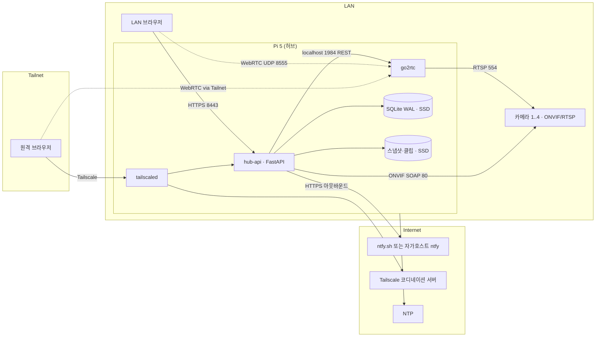
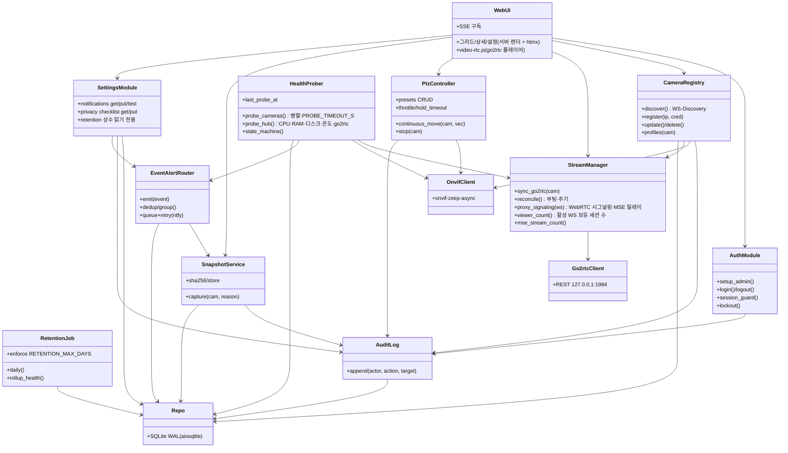
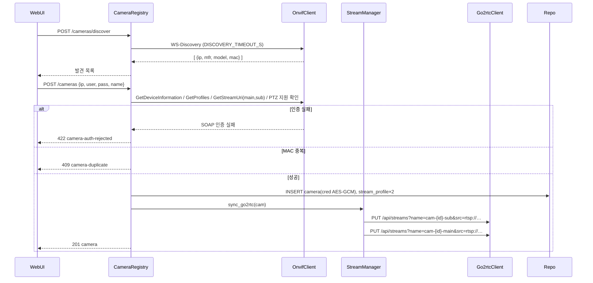
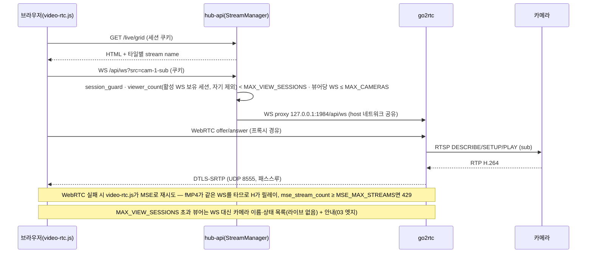
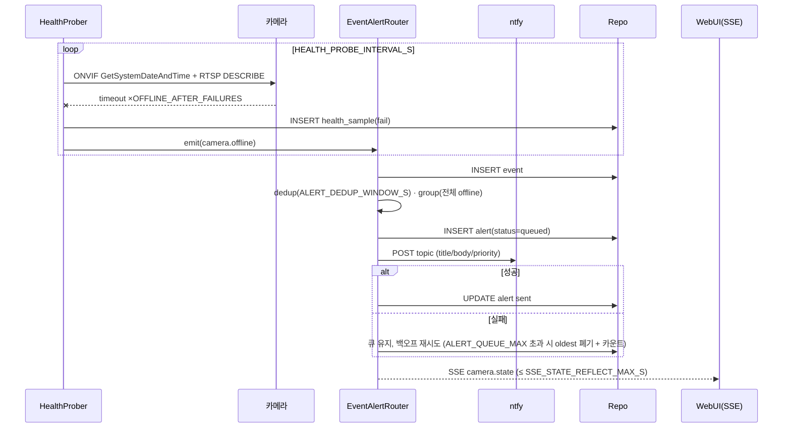
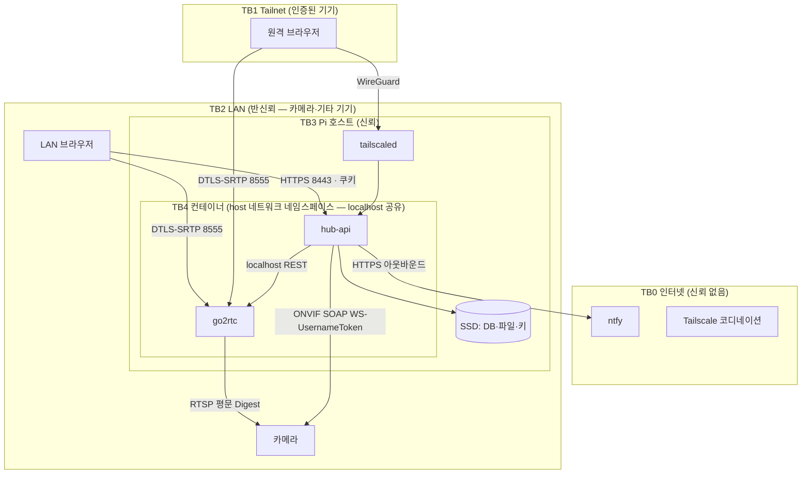
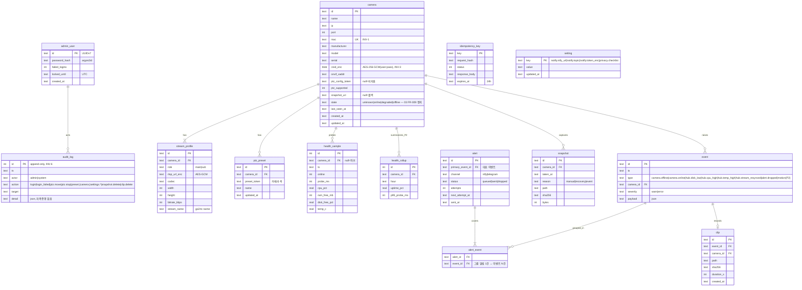

# Seed — PiCam Hub (라즈베리파이 IP 카메라 제어·실시간 모니터링 허브)
버전: v1.0

- 원문: 라즈베리파이로 IP 카메라를 제어하고 실시간 모니터링하는 서비스를 만들고 싶다
- 서비스 유형: 복합 — **IoT·엣지**(주: 라즈베리파이가 카메라 허브) + **관제**(인접: 실시간 모니터링 UI)
- 주 도메인 / 인접 도메인: 영상 감시(IP 카메라·CCTV) 엣지 허브 / 소규모 관제 대시보드, 홈·소규모 사업장 보안, 영상 개인정보
- 감지된 제약 (입력에서 읽히는 것만):
  - 하드웨어: 라즈베리파이 — ARM, CPU/RAM 제한, SD카드 저장, RTC 없음, 하드웨어 디코더 제한
  - 카메라: "IP 카메라" — 네트워크 카메라. 프로토콜 미지정 (업계 표준은 ONVIF + RTSP → 단계에서 확인)
  - "제어": 범위 미지정 (PTZ·프리셋·녹화 시작/정지·설정 변경 후보 → 단계·단계에서 좁힘)
  - "실시간": 측정 기준 미지정 (glass-to-glass 지연 상한 → 단계 상수 표로 고정)
- 로드할 블라인드스팟 프로파일: **P1 IoT·엣지 (전 항목)** + **P3 관제 (실시간성·알람 폭주·이력 증가 3항목)**

- 기존 시스템: 없음 (신규)
- 산출물 경로: `eval/runs/run-20260907-smoke/s4-rpi-ip-camera/` (오토파일럿 모드 — 질문 배치는 만들되 추천안 자동 채택, `Assumed(무응답)` 마킹)

# RECON — PiCam Hub (라즈베리파이 IP 카메라 허브)
버전: v1.0
검색 횟수: 26회 (WebSearch 20회 + WebFetch 6회, 목표 15회 초과 — 사유: GitHub 통계·국내법 조문·IETF RFC 번호 교차확인, 실무자 커뮤니티 인용 출처 확보에 추가 소요)

## 도메인 업무 흐름 (출처)

**표준 흐름**: 카메라 발견 → 스트림 등록 → 실시간 뷰 → PTZ 제어 → 이벤트(모션) → 녹화·보존 → 원격 접근 → 알림

| 단계 | 표준 프로토콜 | 비고 |
|---|---|---|
| 카메라 발견 | ONVIF WS-Discovery | ONVIF Profile S/T 공통 |
| 스트림 등록 | RTSP (main/sub 프로파일) | RFC 2326(1998, RTSP 1.0), RFC 7826(2016, RTSP 2.0, 1.0을 obsolete) |
| 코덱 | H.264 / H.265(HEVC) | — |
| 실시간 뷰(브라우저 전달) | WebRTC / HLS / MSE | WebRTC 개요는 RFC 8825(2021-01, IETF Standards Track, 저자 Harald Alvestrand/Google) |
| PTZ 제어 | ONVIF PTZ 서비스 | 아래 참조 |
| 이벤트(모션) | ONVIF Analytics/Events | — |

**사실**: ONVIF Profile S는 스트리밍 설정·재생 제어·PTZ 명령 전송을 다루지만 PTZ는 조건부(선택) 기능이다. Profile T는 기기 쪽 필수 기능에 OSD·메타데이터 스트리밍을, **클라이언트 쪽 필수 기능에 PTZ 제어를 명시**해 PTZ가 사실상 필수가 된다. Profile T는 그 외 HTTPS 스트리밍, PTZ 설정, 모션 영역 설정, 디지털 입출력, 양방향 오디오도 포함한다.
출처: https://www.onvif.org/profiles/profile-t/ , https://www.onvif.org/profiles/profile-s/ , https://www.onvif.org/wp-content/uploads/2018/09/ONVIF_Profile_T_Specification_v1-0.pdf (확인일 2026-09-07)

**사실**: ONVIF는 Profile S 신규 적합성 인증 접수를 2027-03-31부로 종료하며 Profile T를 후속으로 권고한다.
출처: https://www.onvif.org/?post_type=pressrelease&p=8621 (확인일 2026-09-07)

**사실**: RTSP는 RFC 2326(1998)로 표준화됐고, RTSP 2.0은 RFC 7826(2016)이 정의하며 RFC 2326을 obsolete 시킨다.
출처: https://datatracker.ietf.org/doc/html/rfc7826 , https://datatracker.ietf.org/doc/rfc2326/ (확인일 2026-09-07)

**사실**: WebRTC의 "Overview: Real-Time Protocols for Browser-Based Applications"는 RFC 8825(2021-01 발행, IETF Standards Track)이며, 자체 프로토콜을 정의하지 않고 WebRTC 준수를 위해 따라야 할 다른 스펙들을 지정하는 applicability statement다.
출처: https://datatracker.ietf.org/doc/html/rfc8825 (확인일 2026-09-07)

## 이해관계자 (출처)

**추론**: 시드가 "홈/소규모 사업장 자가 운영"으로 추정한 것과 일치 — 사용자=운영자=구매자가 동일인인 셀프호스팅 구조가 Frigate/go2rtc류 오픈소스 커뮤니티의 기본 전제다. 설치업자·관리자 역할은 시드에서 확인되지 않음(미확인).

**실무자 반복 불만 3건 (Frigate 커뮤니티 기준)**:
1. **오탐(false positive) 대응 피로** — Frigate+ 모델을 적용해도 오탐이 다수 발생한다는 반복 보고.
   출처: https://github.com/blakeblackshear/frigate/discussions/11296 , https://github.com/blakeblackshear/frigate/discussions/20391 (확인일 2026-09-07)
2. **SD카드/스토리지 마모 우려** — 사용자들이 tmpfs(메모리 임시 볼륨)를 마운트해 "SSD/SD카드 마모 감소"를 명시적으로 언급하며 설정에 반영. 라즈베리파이 환경에서 SD카드 수명이 실제 운영 이슈로 다뤄진다.
   출처: https://github.com/blakeblackshear/frigate/discussions/13920 (확인일 2026-09-07)
3. **대시보드 카메라 지연(lag)** — Home Assistant 커뮤니티에서 대시보드에 카메라 스트림을 붙였을 때 지연이 누적되는 문제가 별도 스레드로 제기됨.
   출처: https://community.home-assistant.io/t/camera-lag-on-dashboard/925009 (확인일 2026-09-07)

**미확인**: r/homeassistant, r/frigate_nvr 서브레딧 개별 게시물은 WebSearch의 site: 연산자 미지원으로 직접 인용하지 못함(위 GitHub Discussions/HA 커뮤니티로 대체).

## 규제·표준 (출처; 해당 없음도 근거)

**사실 — 개인정보보호법 제25조(고정형 영상정보처리기기의 설치·운영 제한)**: 공개된 장소에는 원칙적으로 고정형 영상정보처리기기를 설치·운영할 수 없고, 법령 근거·범죄예방/수사·시설안전관리·화재예방·교통단속·교통정보수집 등 예외 사유가 있을 때만 허용된다.
출처: https://www.law.go.kr/LSW//lsLawLinkInfo.do?lsJoLnkSeq=900079397&lsId=011357&chrClsCd=010202 , https://casenote.kr/법령/개인정보_보호법/제25조 (확인일 2026-09-07)

**사실 — 제25조의2(이동형 영상정보처리기기의 운영 제한)**: 업무 목적으로 이동형 영상정보처리기기를 운영하는 자는 공개된 장소에서 개인정보에 해당하는 촬영을 원칙적으로 금지하되 예외 사유가 있으며, **촬영 시 촬영 사실을 빛·소리·안내판 등으로 정보주체가 쉽게 인식하도록 표시·고지해야 한다.**
출처: https://casenote.kr/법령/개인정보_보호법/제25조2 , https://www.law.go.kr (국가법령정보센터, 조문 검색) (확인일 2026-09-07)

**사실 — 표준 개인정보 보호지침(개인정보보호위원회고시)**: 영상정보처리기기 관리책임자는 운영·관리 방침에 명시한 **보관기간(최대 30일)**이 만료되면 지체없이 파기해야 한다. 해당 지침은 2024-01-04부터 시행 중(고시 제2024-1호).
출처: https://www.law.go.kr/admRulLsInfoP.do?admRulSeq=2100000234592 , https://www.privacy.go.kr/front/contents/cntntsView.do?contsNo=121 (확인일 2026-09-07)

**추론(법 조문 직접 확인 필요)**: 위 제25조/제25조의2는 "업무 목적" 및 "공개된 장소" 설치·운영을 전제로 한다. 가정 내부(사적 공간)를 향하지 않는 자가용 카메라의 순수 개인적 사용은 통상 개인정보보호법의 적용 예외(사적 이용) 논의 대상으로 알려져 있으나, **본 조사에서 조문의 "사적 이용 예외" 명시 문구를 직접 확인하지 못했다 — 미확인.** PiCam Hub가 매장·사무실 등 "공개된 장소"를 촬영하는 소상공인 용도로 쓰일 경우 제25조/25조의2가 적용될 가능성이 높다(추론).

**사실 — 해외 참고**: GDPR 및 영국 ICO는 CCTV를 개인정보 처리로 간주해 안내 표지·목적 제한·보관기간 최소화 원칙을 요구한다(1줄 요약, 상세 미조사).

**미확인**: 제25조/제25조의2의 구체적 항·호 번호별 전문(全文), 과태료 조항, 안내판 필수 기재사항 목록은 이번 조사에서 원문 전체를 발췌하지 않았다 — 국가법령정보센터 원문 재확인 필요.

## 유사 솔루션 (오픈소스+상용)

| 이름 | 기능 범위 | Pi 지원 | 브라우저 전달 | 라이선스 | 스타/최근 릴리스/최근 커밋 | 출처 |
|---|---|---|---|---|---|---|
| **Frigate NVR** | 실시간 뷰, 객체 감지(로컬 AI), 이벤트 클립, 녹화, HA 연동, 원격 접근(Frigate+ 옵션) | 공식 문서상 "Pi 4 이상 권장", 64비트 OS 필수(Pi 3 이하 미지원) | go2rtc 내장으로 WebRTC/MSE 지원 | MIT | ~35.6K stars, 최신 릴리스 2026-08-28(v0.17.2), 커밋 활발(수일 내) | https://github.com/blakeblackshear/frigate (검색 종합), https://docs.frigate.video/ (확인일 2026-09-07) |
| **go2rtc** | RTSP/RTMP/HTTP-FLV/WebRTC/MSE/HLS/MP4/MJPEG/HomeKit 변환 게이트웨이 (PTZ·녹화·감지 자체 기능 없음, 스트림 전달 전담) | Pi에서 저CPU/저RAM으로 동작한다고 자체 소개 | WebRTC(~0.5s 지연 주장)/MSE/HLS | MIT | 14,129 stars, 최근 push 2026-09-06, open issues 904 | https://api.github.com/repos/AlexxIT/go2rtc (WebFetch, 확인일 2026-09-07) |
| **MediaMTX** | RTSP/RTMP/HLS(LL-HLS)/WebRTC/SRT/Media-over-QUIC 서버·프록시, 녹화·재생 지원 (PTZ·객체감지 없음) | 커뮤니티 포럼에 Pi 설치 사례 다수(공식 "Pi 지원" 문구 자체는 미확인) | WebRTC/LL-HLS/RTSP 등 다중 | MIT | 20,048 stars, 최근 push 2026-09-05, open issues 190 | https://api.github.com/repos/bluenviron/mediamtx (WebFetch, 확인일 2026-09-07) |
| **ZoneMinder** | 실시간 뷰, 모션 감지, 녹화, IP/USB/아날로그 카메라 지원, 이벤트 관리 (PTZ는 카메라별 컨트롤 프로토콜 경유) | 커뮤니티에서 "아직 활발히 개발 중인가"라는 질문이 나올 정도로 개발 속도 논쟁 있음(포럼) | 공식 웹 UI(자체 스트리밍, WebRTC 네이티브 여부 미확인) | GPL-2.0 | 5,931 stars, 최근 push 2026-09-06, open issues 126 | https://api.github.com/repos/ZoneMinder/zoneminder (WebFetch, 확인일 2026-09-07) |
| Shinobi (참고) | 실시간 뷰, 녹화, 모션 감지, 커뮤니티/Pro 이원화 | Pi 지원 커뮤니티 언급 있음 | 미확인 | 오픈소스 커뮤니티 에디션 + 유료 Pro (정확 SPDX 라이선스 미확인) | 정확 통계 미확인(GitHub repo 경로 조회 실패, 404) | https://www.saashub.com/compare-motioneye-vs-shinobi (단일 출처, 확인일 2026-09-07) |
| motionEye (참고) | 모션 감지 기반 녹화·뷰어, motionEyeOS로 Pi 전용 배포판 제공 | motionEyeOS가 Pi 등 SBC 전용 경량 배포판으로 별도 존재 | 미확인 | 오픈소스(정확 라이선스 미확인) | 정확 통계 미확인 | https://community.home-assistant.io/t/my-opinion-zoneminder-vs-motioneye-vs-shinobi/316831 (단일 출처, 확인일 2026-09-07) |

**상용/클라우드**

| 이름 | 가격 | 기능 범위 | 클라우드 의존 | 출처 |
|---|---|---|---|---|
| Ubiquiti UniFi Protect | 전용 NVR(UNVR 등) 하드웨어 구매형, Synology 대비 동급 구성에서 약 $500~$900 더 비싸다는 비교 기사 존재(공식 가격표 직접 대조는 미확인) | 4K 지원, AI 감지, 구독료 없음(로컬 저장 기준) | 로컬 우선, 클라우드는 옵션 | https://ifeeltech.com/blog/unifi-protect-vs-synology-surveillance-station-flagship-comparison (독립 비교 블로그, 확인일 2026-09-07) |
| Synology Surveillance Station | 카메라 1대 추가 라이선스(CLP1) 약 $54.99~$74.19(리테일러별 상이), 자사 카메라(BC500/TC500)는 라이선스 포함, DVA1622는 8대분 포함 | ONVIF 카메라 호환, AI 감지, 구독료 없음 | 로컬 NAS 우선 | https://www.synology.com/en-us/compatibility/camera , https://www.ebay.com/p/1024604656 (확인일 2026-09-07) |

## 스택 후보 — 후보별 근거·트레이드오프

| 영역 | 후보 | 근거 / 트레이드오프 |
|---|---|---|
| 스트림 게이트웨이 | **go2rtc** | RTSP→WebRTC/MSE 변환 전담, MIT, Pi에서 저CPU 동작 자체 소개. **사실(단일 출처, 재확인 필요)**: "Pi 4에서 스트림 10개 정도는 무리 없이 처리"라는 커뮤니티 코멘트 존재. 하드웨어 디코딩 없이도 RTSP 패스스루(재인코딩 없이 컨테이너만 바꿔 전달)는 가능하나, 브라우저에서 H.265를 WebRTC로 바로 재생 못 하는 경우가 있어 트랜스코딩이 필요할 수 있음(일반 지식, 이번 조사에서 go2rtc 공식 문서로 개별 확인은 못함 — 미확인). ONVIF 지원 범위는 검색 결과에서 확인 못함 — 미확인. 출처: https://api.github.com/repos/AlexxIT/go2rtc , https://github.com/AlexxIT/go2rtc/issues/658 (확인일 2026-09-07) |
| 스트림 게이트웨이 | **MediaMTX** | 더 많은 프로토콜(SRT, Media-over-QUIC, LL-HLS 포함) 지원, MIT. 포럼 사례로 Pi 설치가 이뤄지나 "카메라→MediaMTX→go2rtc" 구성에서 프레임 드랍을 겪었다는 사용자 보고가 있어 파이프라인 단순화(둘 중 하나만 사용)가 유리하다는 커뮤니티 의견 존재. 출처: https://github.com/fuatakgun/eufy_security/discussions/878 , https://github.com/AlexxIT/go2rtc/issues/658 (확인일 2026-09-07) |
| ONVIF 클라이언트 (Python) | onvif-zeep-async | Snyk/Libraries.io 기준 "Healthy" 유지보수(최근 3개월 내 신규 배포), Device/Media/PTZ/Events/Analytics/Recording 서비스 지원. 출처: https://libraries.io/pypi/onvif-zeep-async , https://snyk.io/advisor/python/onvif-zeep-async (확인일 2026-09-07) |
| ONVIF 클라이언트 (Node) | agsh/onvif | TypeScript 우선, WS-Discovery·Media/Media2·PTZ(연속/절대 이동, 프리셋)·Profile S/T 코어 지원, 레거시 0.x API 호환 레이어 포함. 라이선스·스타 수는 이번 조사에서 미확인. 출처: https://github.com/agsh/onvif (확인일 2026-09-07) |
| ONVIF 클라이언트 (Go) | use-go/onvif | 이번 검색에서 결과가 뚜렷이 노출되지 않아 유지보수 상태·라이선스 미확인 — 재조사 필요. |
| 백엔드 언어 | Python FastAPI vs Node(Fastify/NestJS) vs Go | **추론(일반 아키텍처 지식, 이번 세션 벤치마크 검색은 안 함)**: Go는 단일 정적 바이너리로 ARM64 크로스컴파일·배포가 가장 단순하고 런타임 메모리 오버헤드가 작아 Pi에 유리. Node는 이벤트 루프 기반이라 WebSocket 알림/실시간 UI 푸시에 강점. Python/FastAPI는 onvif-zeep-async 등 ONVIF 라이브러리 생태계가 가장 풍부하지만 인터프리터 메모리 오버헤드가 상대적으로 큼. 세 후보 모두 사실상 Pi 4/5(RAM 2~8GB)에서 구동 가능 — 세부 벤치마크는 미확인. |
| 로컬 DB | SQLite(WAL) | WAL은 순차 append + 적은 fsync로 플래시 저장장치의 소거 블록 특성과 궁합이 좋다는 설명 확인. 다만 **카드 내구성(TBW) 등급은 순차 워크로드 기준이라 소규모 랜덤 동기 쓰기(DB 워크로드)의 실제 마모를 그대로 반영하지 않는다**는 지적 존재 — 상한선으로만 해석 권고. 소비자용 SD카드는 TBW 등급이 아예 없는 경우가 많고, 감시·블랙박스·산업용 등급 카드만 TBW를 명시. 출처: https://blog.pecar.me/sqlite-wal/ , https://spin.atomicobject.com/sqlite-raspberry-pi/ , https://forums.raspberrypi.com/viewtopic.php?t=257514 (확인일 2026-09-07). **미확인**: mender.io·dzombak 원문은 이번 검색에서 직접 노출되지 않음(대체 출처로 갈음).|
| 원격 접근 | Tailscale | **사실**: 무료(Personal) 플랜은 "최대 6 사용자", 기기 수는 사실상 무제한(비상업적 개인 용도 한정), WireGuard 기반 메시 네트워크로 포트포워딩 불필요. 출처: https://tailscale.com/pricing (WebFetch, 확인일 2026-09-07) |
| 원격 접근 | Cloudflare Tunnel | **사실**: 사용량 제한 없이 완전 무료로 제공된다고 소개됨(freemium 구조, 유료 부가기능 있음). 다만 Cloudflare가 트래픽 경로에 개입하는 구조라 영상처럼 민감한 데이터에는 트레이드오프가 있다는 독립 의견 존재. 출처: https://toolradar.com/tools/tailscale/pricing , https://hometechops.com/guides/home-remote-access-tailscale-vs-cloudflare-tunnel (확인일 2026-09-07, 독립 블로그 — 교차확인 약함) |
| 원격 접근 | WireGuard(직접) | Tailscale과 달리 인바운드 경로(포트포워딩/DDNS)를 직접 구성해야 함 — NAT 뒤 기기에는 상대적으로 진입장벽 높음(추론 겸 커뮤니티 비교 기사 인용). |
| 알림 | Telegram Bot / ntfy / Home Assistant 연동 | **미확인(가격 페이지 직접 재확인 안 함)**: Telegram Bot API·ntfy는 업계에 널리 알려진 무료·자가호스트 가능 채널이나, 이번 세션에서 공식 가격/약관 페이지를 별도로 열람하지 않았다 — 다음 라운드에서 ntfy.sh, core.telegram.org/bots 확인 필요. |
| 라즈베리파이 HW | Pi 5 | **사실**: BCM2712는 HEVC(H.265) 4K60 하드웨어 디코더는 유지하지만 **Pi 4에 있던 H.264 하드웨어 디코더/인코더는 Pi 5에서 빠졌다**(H.264는 소프트웨어 처리). 이는 라즈베리파이 공식 포럼(엔지니어 답변 스레드 다수, 공식 datasheet 페이지 직접 열람은 이번 세션에서 실패 — 404)에서 반복 확인됨. H.265 인코딩(HW)도 없음. 출처: https://forums.raspberrypi.com/viewtopic.php?t=387547 , https://forums.raspberrypi.com/viewtopic.php?t=391283 , https://forums.raspberrypi.com/viewtopic.php?t=357870 (확인일 2026-09-07, 공식 사이트 아닌 라즈베리파이 공식 포럼 — 반공식으로 취급) |
| 라즈베리파이 HW | Pi 4 | **사실**: 공식 5.1V/3A(15W) USB-C 전원 권장, 다운스트림 USB 소비가 500mA 미만이면 2.5A 전원도 가능. 출처: https://www.raspberrypi.com/products/raspberry-pi-4-model-b/specifications/ (확인일 2026-09-07) |
| SD카드 등급 | 단계/단계 | **사실(부분)**: 단계 등급은 최소 1,500 random read IOPS / 500 random write IOPS를 보장. 단계의 정확한 IOPS 수치는 이번 검색 스니펫에서 잘려 확인 못함 — **미확인**(SD Association 공식 표 재확인 필요). |

## 수치 근거 (단계 상수 표에 쓸 것)

| 항목 | 값 | 출처 | 확인일 |
|---|---|---|---|
| 실시간 뷰 glass-to-glass 지연 — WebRTC | 약 200~500ms | https://www.forasoft.com/learn/video-streaming/articles-streaming/latency-glass-to-glass-explained , https://transitiverobotics.com/blog/webrtc-latency-breakdown/ | 2026-09-07 |
| 실시간 뷰 glass-to-glass 지연 — 표준 HLS | 약 15~30초(세그먼트 버퍼링) | https://www.mux.com/articles/low-latency-live-streaming-developers-guide-ll-hls-webrtc-cmaf | 2026-09-07 |
| 실시간 뷰 glass-to-glass 지연 — LL-HLS | 약 2~5초 | https://www.mux.com/articles/low-latency-live-streaming-developers-guide-ll-hls-webrtc-cmaf , https://www.wink.co/documentation/Ultra-Low-Latency-HLS-Experiments-2025 | 2026-09-07 |
| 카메라 sub-stream 권장 | 480p/720p, 저비트레이트(그리드 뷰용) | https://bokysee.com/ip-security-camera-main-stream-vs-sub-stream-settings/ | 2026-09-07 |
| RTSP 1080p H.264 카메라 1대 대역폭 | 약 2~4Mbps (일부 소스는 30fps 기준 3.5~6Mbps), 감시용 권장 인코더 비트레이트 3Mbps(최소 1.5Mbps) | https://reolink.com/blog/ip-camera-bandwidth-calculation/ , https://cctvhelpdesk.net/cctv-encode-settings/ | 2026-09-07 |
| 24시간 연속 녹화 1대당 저장 용량 | 공식(추정) = 비트레이트(Mbps) × 10.8 → 1080p H.264 4~6Mbps 시 약 43~65GB/일 | https://pvrblog.com/cameras/tech/storage-calculator/ , https://www.digitaltrends.com/home/how-much-space-does-security-camera-video-footage-require/ | 2026-09-07 |
| Pi 4 + Frigate(Coral TPU) 동시 카메라 수 | 커뮤니티 실측 1건: 12대 카메라, detect ~VGA 5fps 시 load 2~4로 원활, **단 5대 풀해상도(4K15fps) 녹화·클립 생성 시 load 20+ 급등·드랍 발생** (단일 사례, 검출 해상도·AI 가속기 유무에 크게 좌우) | https://github.com/blakeblackshear/frigate/discussions (검색 종합, 개별 discussion 링크 재확인 필요 — 단일 출처) | 2026-09-07 |
| Pi 4 + go2rtc 동시 스트림 수 | 커뮤니티 코멘트: "스트림 10개 정도는 무리 없이 처리"(재인코딩 없는 패스스루 전제로 추정, 조건 명시 안 됨) | https://github.com/AlexxIT/go2rtc/issues/658 (단일 출처, 재확인 필요) | 2026-09-07 |
| SD카드 단계 성능 등급 | 최소 1,500 random read IOPS / 500 random write IOPS | https://raspberry.tips/en/raspberrypi-einsteiger/best-sd-card-for-raspberry-pi | 2026-09-07 |
| Pi 4 권장 전원 | 5.1V/3A(15W) USB-C 공식 전원, 경부하 시 2.5A 가능 | https://www.raspberrypi.com/products/raspberry-pi-4-model-b/specifications/ | 2026-09-07 |
| 영상정보 보관기간(국내 CCTV 관행) | 최대 30일(운영·관리 방침에 명시 후 만료 시 지체없이 파기) | https://www.law.go.kr/admRulLsInfoP.do?admRulSeq=2100000234592 | 2026-09-07 |
| Tailscale 무료 플랜 | 최대 6사용자, 기기 수 사실상 무제한(비상업 개인용) | https://tailscale.com/pricing | 2026-09-07 |
| Frigate GitHub 통계 | ~35.6K stars, 최신 릴리스 v0.17.2(2026-08-28), MIT | https://docs.frigate.video/ (검색 종합) | 2026-09-07 |

## 미확인 항목 (못 찾은 것 목록)

- 개인정보보호법 제25조/제25조의2의 "가정 내 사적 이용 예외"를 명시한 정확 조문 문구·항번호 (원문 전체 발췌 안 함)
- ONVIF Profile S/T 각각에서 PTZ 서비스의 정확한 WSDL 서비스명·필수/선택 항목 표(스펙 PDF 전체를 읽지 않음, 요약만 확인)
- go2rtc의 ONVIF 지원 범위(공식 문서 직접 확인 못함)
- go2rtc/MediaMTX가 Pi에서 하드웨어 디코딩 없이 순수 패스스루로 몇 대까지 처리 가능한지의 정확한 벤치마크(커뮤니티 코멘트 1건만 확보, 조건 불명)
- use-go/onvif(Go ONVIF 클라이언트)의 유지보수 상태·라이선스·PTZ 지원 여부
- Shinobi, motionEye의 정확한 GitHub 스타 수·최근 커밋일·SPDX 라이선스명(저장소 경로 조회 실패/미시도)
- SD카드 단계 등급의 정확 IOPS 수치(SD Association 공식 표 미확인, 단계=1500read/500write만 확인)
- ntfy, Telegram Bot API의 공식 가격·약관 페이지 직접 확인(업계 통념상 무료·자가호스트 가능하나 이번 세션에서 재검증 안 함)
- mender.io, dzombak의 SD카드 마모 관련 원문(검색에 직접 노출 안 됨, 대체 출처로 갈음)
- UniFi Protect 공식 가격표(비교 블로그의 간접 인용만 확보, ui.com 공식 페이지 직접 열람 안 함)
- Reolink 앱 / Wyze / Ring 개별 가격·기능(과제에서 "2개"로 UniFi Protect+Synology를 충족시켜 조사 생략)
- r/homeassistant, r/frigate_nvr 서브레딧 개별 게시물 원문(WebSearch가 site: 연산자를 지원하지 않아 GitHub Discussions/HA 커뮤니티 포럼으로 대체)

---

## 메인 추가 검증 (2026-09-07, WebFetch 4회)

| 항목 | 결과 | 출처 |
|---|---|---|
| go2rtc ONVIF 지원 | **사실**: 입력 소스로 `onvif` 프로토콜 지원("A popular ONVIF protocol for receiving media in RTSP format"), 출력으로 ONVIF 서버 모드("Output stream using ONVIF protocol") 있음. WebRTC H.265는 Chrome 136+ / Safari 18+에서 지원. HLS는 "live streaming에 최악, iPhone 때문에 존재"라고 자체 명시. 하드웨어 가속 트랜스코딩 지원 문구 있음. MIT | https://github.com/AlexxIT/go2rtc (README, 확인 2026-09-07) |
| Pi 5 코덱 | **사실(공식)**: 제품 페이지 사양에 "4Kp60 HEVC decoder"만 기재, H.264 하드웨어 디코더/인코더 기재 없음 → 포럼 발견(H.264 HW 제거)과 일치. RAM 1/2/4/8/16GB, 16GB $305 | https://www.raspberrypi.com/products/raspberry-pi-5/ (확인 2026-09-07) |
| Pi 5 전원 | **사실(공식)**: USB-C 5V/5A(25W) 또는 5V/3A(15W, 주변기기 600mA 제한) | https://www.raspberrypi.com/documentation/computers/raspberry-pi-5.html (확인 2026-09-07) |
| ntfy | **사실(부분)**: 공식 문서에 Self-hosting(Installation/Configuration) 절 존재, 공개 서버 + ntfy Pro 프리미엄 구조. 라이선스·공개 서버 레이트리밋은 이 페이지에서 미확인 → 단계에서 Assumed(자가호스트 전제) | https://docs.ntfy.sh/ (확인 2026-09-07) |

## fit 판정 (메인 — 사용자 제약 매칭, `evidence-map.md` fit_score 5요소)

전제 제약(단계·단계 가정): 자가 운영 1인, Pi 1대(ARM64, RAM 4GB급), 카메라 ≤4대(ONVIF Profile S/T, H.264 sub-stream), 브라우저 뷰어, 인터넷 가능(NAT 뒤), 예산 = Pi + USB SSD 수준.

| 영역 | 선택 | fit | 왜 (요소) | 버린 대안(왜) |
|---|---|---|---|---|
| **전체 접근 (search-first)** | **Extend** — go2rtc를 스트림 엔진으로 채택하고, 제어·모니터링·알림 얇은 계층만 자체 구현 | 높음 | 요구사항: 스트리밍은 해결된 문제(Adopt), "제어+상태 모니터링+알림"만 도메인 고유. 총비용: 스트리밍 자체 구현 시 WebRTC/MSE 호환 지옥(go2rtc README의 브라우저 호환표가 그 증거) | Frigate 통째 Adopt — 객체 감지 NVR로 범위가 과잉(Pi에서 Coral 없이 감지 부담, 시드는 "제어·모니터링"). 단 **객체 감지가 진짜 목적이면 Frigate가 정답** — 03 non-goal에 명시. ZoneMinder — GPL-2.0·모놀리식·WebRTC 미확인 |
| 스트림 게이트웨이 | **go2rtc** | 높음 | 요구: RTSP→WebRTC(≈0.5s)·MSE·ONVIF 소스, Pi 저CPU 자체 소개. 생태계: MIT, push 2026-09-06, Frigate가 내장 채택(검증된 운영 사례). 운영: 단일 바이너리 | MediaMTX — 프로토콜은 더 많으나(SRT·MoQ 불필요) ONVIF 소스 없음, 둘을 직렬로 두면 프레임 드랍 보고 → 하나만 |
| 제어 백엔드 | **Python 3.12 + FastAPI + onvif-zeep-async** | 높음 | 요구: ONVIF PTZ·Events·Discovery 라이브러리가 가장 성숙(Healthy, 최근 3개월 배포; Home Assistant ONVIF 통합이 같은 계열 사용). 팀: 1인 자가 운영자에게 가장 흔한 언어(추론). 운영: Pi 4GB에서 FastAPI 프로세스 ≈ 60~100MB(추론, 미측정 → 07 Saturation 지표로 실측) | Node agsh/onvif — 라이브러리 품질 양호하나 라이선스·유지보수 통계 미확인. Go use-go/onvif — 유지보수 상태 미확인(재조사 실패), 정적 바이너리 장점보다 ONVIF 리스크가 큼 |
| 로컬 DB | **SQLite (WAL)** — 파일은 USB SSD | 높음 | 요구: 단일 노드, 카메라 ≤4·이벤트 수천 건/일 — RDBMS 불필요. 운영: WAL의 순차 append가 플래시에 유리. **SD 마모 대책으로 DB·클립은 USB SSD, 로그는 tmpfs/log2ram** | Postgres — 프로세스·메모리 과잉(YAGNI). SD카드 위 SQLite — TBW 없는 소비자 카드에 랜덤 쓰기 → 수명 리스크 |
| 원격 접근 | **Tailscale** | 높음 | 요구: NAT 뒤 Pi에 포트포워딩 없이 접근, WireGuard 기반 E2E. 비용: 무료 6사용자(개인). 운영: 설치 1명령 | Cloudflare Tunnel — 무료지만 영상 트래픽이 제3자 경유(민감정보). 직접 WireGuard — 인바운드 포트/DDNS 필요. 포트포워딩 — 금지(P1 기본값) |
| 알림 | **ntfy (자가호스트 또는 ntfy.sh)** 1순위, Telegram Bot P2 | 중간 | 요구: 푸시 1개면 충분, 자가호스트로 데이터 로컬 유지. 라이선스·레이트리밋 미확인 → Assumed(단계) | Home Assistant 연동 — HA 미보유 사용자 배제(추론). 이메일 — 실시간성 부족 |
| 하드웨어 | **Pi 5 4GB + USB SSD + 공식 27W 전원**; Pi 4 4GB 허용(성능 하향) | 높음 | Pi 5: HEVC HW 디코더만 있고 H.264 HW 없음 → **트랜스코딩 안 하는 설계**(패스스루)를 전제로 하면 무관. 전원: 5V/5A 공식(USB SSD 주변기기 600mA 제한 회피). 비용: Pi 5 4GB ≈ $60(추론, 미확인) + SSD | Pi Zero 2 W — RAM 512MB로 go2rtc+FastAPI+브라우저 세션 동시 부담 위험(추론). x86 미니PC — 시드가 라즈베리파이를 명시 |
| 브라우저 전달 | **WebRTC 우선, MSE 폴백, HLS 미채택** | 높음 | 요구: "실시간" = glass-to-glass ≤1s 목표 (WebRTC 200~500ms 근거). HLS 15~30s는 목표 미달 | LL-HLS 2~5s — 목표 미달, iPhone은 MSE(iOS 17.1+)로 대체 |
| 프론트엔드 | **서버 렌더 HTML + htmx + go2rtc 내장 WebRTC 플레이어(video-rtc.js)** | 중간 | 요구: 화면 2~3장(그리드·카메라 상세·설정). 팀: 1인, 빌드 파이프라인 없이 Pi에서 서빙. UI 밀도는 단계 dial | React/Vite SPA — 화면 수 대비 빌드·번들 부담 과잉(YAGNI). 단 화면이 5장 이상으로 커지면 재검토 |

**search-first 결론**: Adopt(go2rtc·Tailscale·ntfy·SQLite) + Build(ONVIF 제어 서비스·카메라 레지스트리·헬스 모니터·알림 라우터·UI). 자체 코드는 "카메라 등록→제어→상태→알림" 도메인 로직에 한정한다.

# 블라인드스팟 레지스터 — PiCam Hub
버전: v1.0
모드: 오토파일럿 — 질문 배치는 작성하되 사용자에게 제시하지 않고 추천안을 `Assumed(무응답)`로 채택 (단계 프로토콜 4항).

## 제품 렌즈 ((참고자료) — 만들기 전 "왜")
- 문제: 소규모 사용자가 IP 카메라 여러 대를 한 화면에서 보고 조작하려면 벤더 앱(카메라마다 다름)이나 NAS·NVR(수십만 원)이 필요하다. 벤더 앱은 클라우드 경유·구독 유도, NVR은 비용. → "Pi 1대로 벤더 무관 통합 뷰 + 제어 + 상태 알림"이 채울 틈 (01-recon 유사 솔루션·상용 표).
- 대안이 이미 있는가: 객체 감지가 목적이면 **Frigate**가 정답(만들지 않는다). PiCam Hub의 차별 가치는 "가벼운 제어·상태 모니터링"이고 감지는 non-goal — 이 경계를 03에 명시.
- 성공의 정의: 카메라 4대를 브라우저 한 화면에서 1초 내 지연으로 보고, PTZ가 0.5초 내 반응하며, 카메라가 죽으면 1분 내 푸시 알림이 온다 (03 SC로 계량).

## 레지스터

| 축/항목 | 상태 | 처리 | 근거·출처 |
|---|---|---|---|
| 1. 기능 범위·행동 | Partial → **Assumed** | MVP = 카메라 발견·등록 / 실시간 그리드 뷰 / PTZ·프리셋 제어 / 온·오프라인 헬스 + 알림 / 스냅샷. P2 = 모션 이벤트 클립 녹화·보존. non-goal = AI 객체 감지, 24/7 연속 녹화, 다중 Pi 클러스터, 클라우드 계정 | 시드 "제어·실시간 모니터링" + 01 fit(Extend 접근). 24/7 녹화는 43~65GB/일/대(01 수치 표)로 SD·소형 SSD 부적합 |
| 2. 도메인·데이터 모델 | Partial → **Assumed** | 엔티티: Camera / StreamProfile / PtzPreset / HealthSample / Event / Alert / Snapshot / Clip(P2) / AdminUser(단일). 식별자 UUIDv7, 시각 UTC ISO-8601, 카메라 자격증명은 암호화 저장. 볼륨: 카메라 ≤4, 헬스 샘플 25초 간격 → ≈14k행/일 → 원본 7일 보존(시간 요약은 P2) | 01 fit(SQLite WAL) · P3 이력 증가 항목 |
| 3. 상호작용·UX 플로우 | Partial → **Assumed** | 화면 3장: ① 그리드(라이브 2×2) ② 카메라 상세(단일 뷰 + PTZ 패드 + 프리셋) ③ 설정(카메라 등록·알림 채널·보관). 권한 1종(관리자). 에러는 타일 위 상태 배지 + 재시도 CTA (L-06 막다른 에러 0) | ux-principles-kr L-03·L-06·L-10, 03 화면 스케치 |
| 4. 비기능 품질 | Missing → **Assumed** | 03 상수 표로 고정: 라이브 지연 p95 ≤ 1,000ms(WebRTC 200~500ms 근거), PTZ 명령 p95 ≤ 500ms, 오프라인 감지 ≤ 60s, 알림 도달 ≤ 60s, 동시 시청 세션 ≤ 3, CPU 5분 평균 ≤ 70%, 가용성 목표 월 99%(≈7.2h 다운 허용 — 1인 운영 현실) | 01 수치 표(forasoft·mux) · Google SRE "100% 금지" |
| 5. 통합·외부 의존성 | Partial → **Assumed** | 외부: IP 카메라(ONVIF Profile S/T + RTSP), go2rtc(로컬 프로세스), ntfy(자가호스트 또는 ntfy.sh), Tailscale(원격), NTP. 카메라 장애 시: 타일 오프라인 상태 + 지수 백오프 재연결(상한 60s). ntfy 장애: 알림 큐 로컬 보관 후 재전송(상한 100건). Tailscale 장애: LAN 직접 접근은 유지 | P1 연결 끊김 기본값 · 01 fit |
| 6. 엣지케이스·실패 처리 | Missing → **Assumed** | 03 엣지케이스 표에 Given/When/Then: 카메라 자격증명 오류, RTSP URL 변경, 동일 카메라 중복 등록(MAC 유니크), PTZ 미지원 카메라, 동시 PTZ 명령 충돌(마지막 명령 승리 + 스로틀), 디스크 잔여 하한, 시계 드리프트, 브라우저 H.265 미지원 | 단계 템플릿 |
| 7. 제약·트레이드오프 | Partial → **Assumed** | 1인 자가 운영, 예산 = Pi 5 4GB + USB SSD + 전원, 인터넷 가능(NAT 뒤), 폐쇄망 아님, 기한 미지정(계획 가정: MVP 4~6주 — 근거 없는 계획 수치) | 시드에 팀·예산 언급 없음 |
| 8. 용어·일관성 | Clear | 용어집(03): 카메라=ONVIF 장치 1대, 스트림 프로파일=RTSP main/sub, 프리셋=PTZ 저장 위치, 이벤트=카메라/허브가 만든 사실, 알림=이벤트가 채널로 전달된 것, 클립=이벤트 전후 영상 파일 | — |
| 9. 완료 신호 | Missing → **Assumed** | SC-001~SC-010 전부 pass/fail 계량(03). 인수 = 06 시나리오 전부 GREEN + 07 스모크 통과 | 단계·단계 게이트 |
| 10. 비용·라이선스 | Partial → **Assumed** | 런타임 비용 0원(전부 자가호스트; ntfy.sh 사용 시도 무료). 라이선스: go2rtc MIT(확인), FastAPI MIT, SQLite PD, Tailscale 클라이언트 BSD-3; onvif-zeep-async MIT·ntfy Apache-2.0/GPL-2.0 이중은 **추정**(01 미확인) → 03 '검증 대기 가정' 1. GPL(ZoneMinder) 미채택 | 01 유사 솔루션·스택 표 |
| S. Spoofing | Missing → **Assumed** | 카메라→허브: 카메라별 ONVIF 자격증명(허브가 카메라를 인증). 브라우저→허브: 관리자 로그인(argon2id) + 세션 쿠키(HttpOnly·SameSite=Strict), Tailscale 밖 접근 없음. LAN 내부 기기 위장은 Accept + MAC/IP 대조 | STRIDE · P1 디바이스 신원 |
| T. Tampering | Missing → **Assumed** | 스냅샷·클립 파일 SHA-256 기록, 설정 변경 감사 로그, SQLite WAL + 일 1회 `PRAGMA integrity_check`. RTSP 평문(카메라 대부분 TLS 미지원) → LAN 내부 Accept + 사유 | 04 위협모델 |
| R. Repudiation | Missing → **Assumed** | 감사 이벤트: 로그인, PTZ 명령, 설정 변경, 클립 삭제 — 누가·언제·무엇을 append-only 테이블 | 04 |
| I. Information Disclosure | Missing → **Assumed** | 영상은 Tailscale(WireGuard) 밖으로 나가지 않음, 카메라 자격증명 AES-GCM 암호화(키 파일 0600), 로그에 자격증명·RTSP URL 마스킹, 스냅샷 URL 서명·만료 | 04 · 개인정보보호법 §25 |
| D. Denial of Service | Missing → **Assumed** | 동시 시청 세션 상한, PTZ 명령 스로틀, 디스크 잔여 하한 시 클립 생성 중단·오래된 클립 선삭제, 카메라 재연결 백오프(폭주 방지), HW watchdog | P1 자가 복구 · P3 알람 폭주 |
| E. Elevation of Privilege | Clear(해당없음 — 권한 1종이라 수직 상승 경로 없음) → 보완 **Assumed** | go2rtc 관리 API(1984 포트)는 localhost 바인딩 + 허브 경유만 허용해 우회 제어 차단 | 04 |
| P1. SD카드 마모 | Missing → **Assumed** | rootfs SD(읽기 위주) + `noatime` + swap off + log2ram(`/var/log` RAM 상주, 1h 동기화) / DB·스냅샷·클립·**docker data-root(이미지·컨테이너·json-file 로그)**는 USB SSD `/data` | Frigate 커뮤니티 tmpfs 사례(01) · blindspot 기본값 |
| P1. 전원 차단 | Missing → **Assumed** | 공식 27W 전원. overlayfs read-only rootfs는 MVP 미채택(1인 운영의 업데이트 편의) → ext4 저널 + 부팅 fsck + SQLite WAL로 버팀. UPS는 non-goal | blindspot 기본값 부분 채택, 사유 명시 |
| P1. 자가 복구 | Missing → **Assumed** | hub-api 내부 감시 태스크: 마지막 프로브 경과 > PROBE_STALE_FACTOR×HEALTH_PROBE_INTERVAL_S면 `exit(1)` → docker `restart: unless-stopped`가 되살림(docker healthcheck는 표시만, 재시작 안 함 — 최종 검토 #1) + HW watchdog `RuntimeWatchdogSec=15` (Pi 상한 15s 준수). systemd WatchdogSec는 컨테이너 프로세스에 전달되지 않아 미채택 | blindspot 기본값(15s 상한 경고) |
| P1. OTA 업데이트 | Missing → **Assumed** | MVP: `docker compose pull` + 헬스체크 실패 시 이전 이미지 태그로 롤백 절차(07). A/B 파티션·서명 검증은 기기 1대·1인 운영이라 non-goal(비용>편익) | AWS IoT Lens 표준 대비 축소, 사유 명시 |
| P1. 시계 드리프트 | Missing → **Assumed** | 인터넷 가능 → `systemd-timesyncd` NTP. 부팅 직후 NTP 동기 전에는 TLS 의존 작업(ntfy.sh·Tailscale) 재시도. RTC 모듈 non-goal | blindspot 기본값(인터넷 가능 = NTP) |
| P1. 디바이스 신원 | Missing → **Assumed** | 허브 1대·클라우드 없음 → 기기별 X.509 fleet 신원은 해당 없음. 카메라 신원 = ONVIF 자격증명 + MAC | blindspot 기본값 축소(단일 기기) |
| P1. 연결 끊김 | Missing → **Assumed** | 카메라 끊김: 재연결 백오프 1→60s, 오프라인 이벤트 1회(중복 억제 5분). 알림 채널 끊김: 로컬 큐 100건 순서 보장 재전송, 초과 시 오래된 것 폐기 + 폐기 카운트 기록 | blindspot 기본값 |
| P1. 영상 스트림 | Partial → **Assumed** | 라이브 = go2rtc WebRTC(패스스루, 허브 트랜스코딩 없음) / 폴백 MSE. 그리드는 카메라 sub-stream(≤720p, ≤1.5Mbps), 상세는 main-stream. 동시 시청 세션 ≤3. Pi 업링크 실측은 착수 첫 작업 | 01 수치 표 · go2rtc README |
| P1. 원격 접근 | Missing → **Assumed(무응답)** | Q4 추천안: Tailscale (포트포워딩 금지) | 질문 배치 |
| P1. 프로비저닝 | Missing → **Assumed** | 기기 1대: 설치 스크립트 1개(`install.sh`: docker·compose·log2ram·watchdog·tailscale) + 첫 접속 시 관리자 비밀번호 설정 화면. 카메라는 WS-Discovery로 자동 발견 후 자격증명만 입력 | blindspot 기본값 축소(단일 기기) |
| P3. 실시간성 | Missing → **Assumed** | "실시간" = glass-to-glass p95 ≤ 1,000ms(WebRTC), 상태 변경 → 화면 반영 ≤ 3s(SSE 푸시), 알림 경로는 라이브와 분리된 우선 큐 | 01 수치 표 · P3 기본값 |
| P3. 알람 폭주 | Missing → **Assumed** | 동일 카메라·동일 유형 알림 5분 중복 억제, 네트워크 전체 단절 시 "카메라 N대 오프라인" 1건으로 그룹핑, 심각도 2단계(경고/장애) | P3 기본값 · SRE |
| P3. 이력 증가 | Missing → **Assumed** | HealthSample 원본 7일(시간 요약은 P2). Event 90일. 감사 로그 무기한(INV-6). 스냅샷 30일(법 상한과 동일). 클립(P2) 기본 7일·최대 30일. 일 1회 정리 작업 | 표준 개인정보 보호지침 30일(01) |
| D1. 영상 개인정보(법) — 도메인 고유 | Missing → **Assumed(무응답)** | Q1 추천안: 소규모 사업장(공개 장소) 기준 내장 — 보관 상한 30일, 오디오 녹음 기본 off, 설정 화면에 안내판 의무·운영방침 체크리스트. 가정 사용자에게도 해가 없음 | 질문 배치 · 01 규제 |
| D2. 기준 기기(HW) — 도메인 고유 | Missing → **Assumed(무응답)** | Q2 추천안: Pi 5 4GB + USB SSD + 27W 전원. Pi 4 4GB 지원(성능 하향) | 질문 배치 · 01 fit |
| D3. 녹화 범위 — 도메인 고유 | Missing → **Assumed(무응답)** | Q3 추천안: MVP 라이브+스냅샷(P1), 이벤트 클립 P2, 24/7 녹화 non-goal | 질문 배치 |
| D4. 카메라 대수·코덱 — 도메인 고유 | Missing → **Assumed(무응답)** | Q5 추천안: 카메라 ≤4, H.264 sub-stream 라이브, H.265는 상세 뷰에서만(브라우저 지원 시) | 질문 배치 · Pi 5 H.264 HW 없음 |

집계: 33항목 전부 마킹 — Clear 1 · Assumed 27 · Asked 5(오토파일럿 무응답 → 전부 추천안 Assumed 채택).

## 질문 배치 (최대 5) — 작성 2026-09-07 10:41, 오토파일럿이라 미제시

**Q1. 카메라가 비추는 곳은 어디인가? (개인정보보호법 §25 적용 여부 — Impact: 법 / Uncertainty: 사용자 환경)**

| 옵션 | 내용 | 근거·트레이드오프 |
|---|---|---|
| A (추천) | 소규모 사업장(매장·사무실 등 공개 장소) 기준으로 설계 — 보관 30일 상한·오디오 off·안내판 체크리스트를 기본 내장 | 더 엄격한 쪽을 기본값으로 두면 가정 사용자에게도 손해가 없고, 사업장 사용자는 법을 지킨 상태로 시작한다 (01 규제 절, 표준 개인정보 보호지침 30일) |
| B | 가정 내부(사적 공간) 전용 — 보관 상한 없음, 오디오 허용 | 설계 단순. 단 매장에 쓰는 순간 §25·§25조의2 위반 위험 |
| C | 둘 다 지원 — 설치 시 "장소 유형" 선택으로 정책 전환 | 유연하지만 정책 분기 코드·테스트 2배. MVP 범위 초과 |

→ 답: 무응답 → 추천안 A를 `Assumed(무응답)` 채택

**Q2. 기준 하드웨어는? (Impact: 하드웨어 재구매·성능 설계 / Uncertainty: 보유 기기·예산)**

| 옵션 | 내용 | 근거·트레이드오프 |
|---|---|---|
| A (추천) | Raspberry Pi 5 4GB + USB SSD(≥256GB) + 공식 27W 전원 | H.264 HW 디코더가 없지만 패스스루 설계라 무관, CPU 여유가 크다. SSD로 SD 마모 회피 (01 fit·수치 표) |
| B | Raspberry Pi 4 4GB + USB SSD | 보유 기기 활용. H.264 HW 디코더 있으나 CPU가 낮아 카메라 상한을 3대로 낮출 수 있음 |
| C | Raspberry Pi Zero 2 W + SD만 | 최저가. RAM 512MB로 go2rtc+앱+세션 동시 부담 위험, SD 마모 대책 불가 |

→ 답: 무응답 → 추천안 A를 `Assumed(무응답)` 채택 (B는 지원 대상으로 유지, C는 비지원)

**Q3. MVP에서 녹화는 어디까지? (Impact: 저장 설계·SD 마모·법 / Uncertainty: 사용 목적)**

| 옵션 | 내용 | 근거·트레이드오프 |
|---|---|---|
| A (추천) | 라이브 + 수동/이벤트 스냅샷(P1), 모션 이벤트 클립(P2) — 24/7 연속 녹화는 non-goal | 시드가 "제어·실시간 모니터링"; 연속 녹화는 43~65GB/일/대로 소형 SSD·SD에 부적합 (01 수치 표) |
| B | 24/7 연속 녹화 포함 | 증거 보전 완전. 1TB SSD·보존 정책·디스크 관리가 MVP에 들어옴 → 범위 2배 |
| C | 녹화·스냅샷 전부 제외(라이브만) | 가장 단순. 알림에 "무슨 일인지" 첨부할 수 없어 알림 가치 반감 |

→ 답: 무응답 → 추천안 A를 `Assumed(무응답)` 채택

**Q4. 집 밖에서 어떻게 접속하나? (Impact: 보안 아키텍처 / Uncertainty: 네트워크 운영 의지)**

| 옵션 | 내용 | 근거·트레이드오프 |
|---|---|---|
| A (추천) | Tailscale (WireGuard 메시, 포트포워딩 없음, 무료 6사용자) | 영상이 제3자 서버를 거치지 않고 E2E. 뷰어 기기마다 클라이언트 설치 필요 (01 fit) |
| B | Cloudflare Tunnel | 클라이언트 설치 불필요(브라우저만). 영상 트래픽이 Cloudflare 경유 → 민감정보 트레이드오프 |
| C | LAN 전용 (원격 non-goal) | 가장 안전·단순. "모니터링" 가치의 절반(외출 중 확인) 상실 |

→ 답: 무응답 → 추천안 A를 `Assumed(무응답)` 채택

**Q5. 카메라 몇 대, 어떤 코덱을 기준으로 잡나? (Impact: Pi 성능·대역폭 설계 / Uncertainty: 보유 카메라)**

| 옵션 | 내용 | 근거·트레이드오프 |
|---|---|---|
| A (추천) | ≤4대, 라이브는 H.264 sub-stream(≤720p·≤1.5Mbps), 상세 뷰만 main-stream | 그리드 4타일 = 6Mbps 이하로 Pi·뷰어 대역 안전. go2rtc 커뮤니티 "Pi 4에서 10개 무리 없음"(단일 출처)의 절반 이하로 보수적 (01) |
| B | ≤8대 | 그리드 3×3, 대역 12Mbps+, 동시 세션 상한을 2로 낮춰야 함 |
| C | ≤16대 | 사실상 NVR급. Pi 단일 노드 한계 — 이 경우 Frigate/상용 NVR 재검토가 맞다 |

→ 답: 무응답 → 추천안 A를 `Assumed(무응답)` 채택

## 반영 기록
- 무응답 5건 → 전부 추천안 채택 (decision-log #5~#9). 03 상수 표에 RETENTION_MAX_DAYS=30 · MAX_CAMERAS=4 · 원격 접근=Tailscale · HW 기준 Pi 5 4GB · 녹화 범위(P1 스냅샷/P2 클립)로 고정.
- 사용자가 나중에 답을 바꾸면: 1번-B → 보관 상한 해제 + 오디오 토글 / 2번-B → MAX_CAMERAS=3 / 3번-B → 07 저장 설계 재작성 / 4번-B → 04 위협모델 I·S 재검토 / 5번-B → 세션 상한·그리드 재설계. 각각 03 개정 → 하류 전파.

# PRD — PiCam Hub (라즈베리파이 IP 카메라 제어·실시간 모니터링 허브)
버전: v1.3

## 근거 (단계 진입 사전조사 — 추가 검색 0회, 01-recon 재사용)
- **정량** — WebRTC glass-to-glass 200~500ms, HLS 15~30s (forasoft·mux, 2026-09-07 확인, 01 수치 표) → "실시간"을 p95 1,000ms로 계량.
- **정성** — "대시보드에 카메라를 붙였더니 지연이 누적된다" (Home Assistant 커뮤니티 camera-lag-on-dashboard, 01 이해관계자) → 그리드는 sub-stream + WebRTC로 고정.
- **사용자 영향** — 타일 클릭·PTZ 버튼의 시각 피드백 ≤400ms(L-10 도허티), 카메라가 끊겨도 막다른 화면 없음(L-06 피크엔드).

## 배경 (RECON 요약)
- 소규모 사용자는 카메라 벤더 앱(카메라마다 다름, 클라우드 경유)이나 NAS·NVR(수십만 원)로 여러 대를 본다. ONVIF(Profile S/T)와 RTSP가 사실상 표준이라 벤더 무관 허브가 가능하다 (01 도메인 흐름).
- 스트리밍 변환은 해결된 문제다: go2rtc(MIT, RTSP→WebRTC/MSE, ONVIF 소스 지원)가 Pi에서 저부하로 돈다. 객체 감지 NVR은 Frigate가 이미 있다 (01 유사 솔루션).
- 한국 개인정보보호법 §25·§25조의2와 표준 개인정보 보호지침(보관 최대 30일)이 공개 장소 촬영에 적용된다 (01 규제).
- 결정(02): **Extend** — go2rtc를 스트림 엔진으로 채택하고 "등록→라이브→제어→상태→알림"의 얇은 층만 만든다. 하드웨어 기준 Pi 5 4GB + USB SSD, 카메라 ≤ MAX_CAMERAS, 원격 접근 Tailscale.

## 제품 목표 (3개, 직교)
- **G1 본다** — 벤더가 달라도 카메라 ≤4대를 브라우저 한 화면에서 LIVE_LATENCY_P95_MS 이내 지연으로 본다.
- **G2 움직인다** — PTZ 카메라를 같은 화면에서 PTZ_CMD_P95_MS 이내 반응으로 조작하고 프리셋으로 되돌린다.
- **G3 안다** — 카메라·허브가 죽거나 되살아나면 감지(이벤트 기록) 후 ALERT_DELIVERY_MAX_S 이내에 푸시로 알고, 무슨 일인지 스냅샷으로 확인한다.

## 유저 스토리 (P1만으로 MVP 성립)
| ID | 우선순위 | 스토리 | 독립 테스트 |
|---|---|---|---|
| US-1 | P1 | As a 운영자, I want LAN에서 자동 발견된 카메라를 자격증명만 넣어 등록하고 싶다, so that RTSP URL을 손으로 찾지 않는다 | 카메라 1대 전원 → 발견 목록 노출 → 등록 → 그리드에 타일 생김 |
| US-2 | P1 | As a 운영자, I want 등록한 카메라 전부를 한 화면 그리드로 실시간으로 보고 싶다, so that 앱을 오가지 않는다 | 4대 등록 → 2×2 그리드 전부 재생, 지연 측정 |
| US-3 | P1 | As a 운영자, I want 카메라를 상하좌우·줌으로 움직이고 자주 보는 위치를 프리셋으로 저장하고 싶다, so that 원하는 곳을 즉시 본다 | PTZ 패드 → 카메라 회전, 프리셋 저장 → 이동 복귀 |
| US-4 | P1 | As a 운영자, I want 카메라가 끊기거나 허브 디스크가 차면 휴대폰 푸시로 알고 싶다, so that 몰래 죽어 있는 카메라가 없다 | 카메라 전원 차단 → OFFLINE_DETECT_MAX_S + ALERT_DELIVERY_MAX_S 내 푸시 수신, 복구 → 복구 푸시 |
| US-5 | P2 | As a 운영자, I want 카메라 모션 이벤트 전후 영상을 클립으로 남기고 싶다, so that 알림을 받았을 때 무슨 일인지 본다 | 모션 발생 → 이벤트 목록 → 클립 재생 |

## 용어집
| 용어 | 정의 |
|---|---|
| 카메라 | ONVIF 장치 1대 (MAC로 유일) |
| 스트림 프로파일 | 카메라의 RTSP main(고화질)/sub(저화질) 출력 |
| 프리셋 | 카메라에 저장된 PTZ 위치(카메라 측 토큰 + 허브 측 이름) |
| 헬스 샘플 | HEALTH_PROBE_INTERVAL_S마다 카메라·허브를 프로브한 결과 1행 |
| 이벤트 | 허브가 기록한 사실(카메라 offline/online, 디스크 하한, 모션(P2)) |
| 알림 | 이벤트가 알림 채널(ntfy)로 전달된 기록 |
| 스냅샷 | 특정 시각의 JPEG 1장 |
| 시청 세션 | 활성 스트림(WS)을 하나 이상 가진 로그인 세션 = 뷰어 1명. WS 수가 아니다 |
| 클립(P2) | 이벤트 전후 CLIP_PRE_S~CLIP_POST_S 구간의 MP4 파일 |

## 요구사항 풀
| ID | 요구사항 (EARS) | 우선순위 | 출처 |
|---|---|---|---|
| FR-001 | 첫 접속 시 시스템은 관리자 비밀번호(PASSWORD_MIN_LEN 이상) 설정을 요구하고, 이후 로그인·세션(SESSION_TTL_H)·로그아웃을 제공해야 한다. 같은 출발 IP에서 LOGIN_LOCKOUT_FAILS회 실패하면 그 IP를 LOGIN_LOCKOUT_MIN분 잠그고(계정 잠금 아님 — 내부자의 자기 DoS 방지) 실패마다 응답을 지수 지연한다 | P0 | 02 S · 위협모델 |
| FR-002 | 운영자가 "카메라 찾기"를 누르면 시스템은 WS-Discovery로 DISCOVERY_TIMEOUT_S 내 응답한 장치의 IP·제조사·모델·MAC을 목록으로 보여야 한다 | P0 | US-1 |
| FR-003 | 운영자가 발견 목록(또는 IP 직접 입력)에서 자격증명을 넣어 등록하면 시스템은 ONVIF로 인증·프로파일을 조회해 main/sub RTSP URL·PTZ 지원 여부를 저장하고, 같은 MAC의 중복 등록을 거부해야 한다 | P0 | US-1 · INV-1 |
| FR-004 | 운영자는 카메라 이름·자격증명을 수정하고 카메라를 삭제할 수 있어야 하며, 삭제 시 스트림·헬스 프로브·프리셋이 함께 정리돼야 한다 | P0 | US-1 |
| FR-005 | 시스템은 등록 카메라 전부를 2×2 그리드에 sub-stream·WebRTC(폴백 MSE)로 재생해야 하며, 동시 시청 세션(뷰어)은 MAX_VIEW_SESSIONS까지, 뷰어당 스트림은 MAX_CAMERAS까지다. MSE 폴백 스트림은 허브를 경유하므로 허브 전체 MSE_MAX_STREAMS까지만 허용한다 | P0 | US-2 · G1 |
| FR-006 | 운영자가 타일을 열면 시스템은 그 카메라의 main-stream 단일 뷰와 PTZ 패드·프리셋 목록을 한 화면에 보여야 한다 | P0 | US-2 · US-3 |
| FR-007 | 운영자가 PTZ 패드를 누르고 있는 동안 시스템은 ONVIF ContinuousMove를 보내고 떼면 Stop을 보내야 하며, 명령은 PTZ_THROTTLE_MS로 스로틀하고 마지막 명령이 이긴다 | P0 | US-3 · G2 |
| FR-008 | 운영자는 프리셋을 조회·이동·저장·이름 변경·삭제할 수 있어야 하며, 프리셋은 카메라에 저장되고 이름은 허브에 저장된다 | P0 | US-3 |
| FR-009 | 시스템은 HEALTH_PROBE_INTERVAL_S마다 각 카메라에 프로브 2종을 병렬(각 PROBE_TIMEOUT_S)로 보내고 — ONVIF GetSystemDateAndTime(무인증), RTSP DESCRIBE(**자격증명 없이**, 401·200 모두 생존) — 허브(CPU·RAM·디스크·온도·go2rtc 생존·스트림 목록 대조→불일치 시 재등록)를 프로브해 헬스 샘플을 기록하고 상태를 판정해야 한다: **unknown**=등록 후 첫 프로브 전 · **online**=두 프로브 성공 · **degraded**=RTSP 성공이나 ONVIF가 OFFLINE_AFTER_FAILURES회 연속 실패(라이브 가능, PTZ·스냅샷 불가) · **offline**=RTSP가 OFFLINE_AFTER_FAILURES회 연속 실패(라이브 불가) | P0 | US-4 · G3 |
| FR-010 | 카메라 상태가 바뀌면 시스템은 이벤트를 기록하고 알림 채널로 보내야 하며, 같은 카메라·같은 유형은 ALERT_DEDUP_WINDOW_S 안에 1건만, 전체 카메라 동시 offline은 1건으로 묶어야 한다 | P0 | US-4 · P3 알람 폭주 |
| FR-011 | 운영자가 스냅샷 버튼을 누르거나 offline→online 복구 이벤트가 나면 시스템은 JPEG를 SSD에 저장하고 SHA-256을 기록해야 한다 | P0 | US-4 · G3 |
| FR-012 | 카메라·허브 상태가 바뀌면 시스템은 SSE로 열린 화면에 SSE_STATE_REFLECT_MAX_S 내 반영해야 한다 (배지·타일 상태) | P0 | US-2 · P3 실시간성 |
| FR-013 | 운영자는 알림 채널(ntfy 서버 URL·토픽·토큰)을 설정하고 "테스트 발송"으로 확인할 수 있어야 한다 | P1 | US-4 |
| FR-014 | 허브 디스크 잔여가 DISK_MIN_FREE_PCT 미만이거나 CPU 5분 평균이 CPU_5M_MAX_PCT를 넘거나 SoC 온도가 HUB_TEMP_MAX_C를 넘으면 시스템은 이벤트·알림을 내야 한다 | P1 | US-4 · P1 SD |
| FR-015 | 시스템은 하루 1회 보존 정리를 실행해 SNAPSHOT_RETENTION_DAYS·HEALTH_RAW_RETENTION_DAYS·EVENT_RETENTION_DAYS를 넘은 데이터를 파기해야 한다(감사 로그는 파기하지 않는다 — INV-6; 헬스 시간 요약은 P2 FR-021과 함께). 어떤 영상·스냅샷도 RETENTION_MAX_DAYS를 넘겨 보관할 수 없다 | P1 | 01 규제 · INV-2 |
| FR-016 | 시스템은 로그인(성공·실패)·PTZ 명령(누름·뗌·프리셋 단위 — keepalive 재전송은 제외)·설정 변경·삭제를 append-only 감사 로그(누가·언제·무엇)에 기록해야 한다 | P1 | 02 R |
| FR-017 | 알림 채널이 실패하면 시스템은 알림을 로컬 큐(ALERT_QUEUE_MAX)에 보관했다가 순서대로 재전송하고, 넘치면 오래된 것을 폐기하며 폐기 수를 기록해야 한다 | P1 | P1 연결 끊김 |
| FR-018 | 시스템은 라이브·클립에 오디오 트랙을 포함하지 않아야 한다 (기본 off, MVP에서 켜는 수단 없음). 강제 지점: E-18 프록시가 WebRTC offer SDP의 `m=audio`와 MSE 코덱 요청의 오디오 코덱을 제거·거부하고, 플레이어는 `media=video`로 요청한다 — go2rtc 소스 옵션에 의존하지 않는다 | P1 | 01 규제(녹음 금지) · Q1 |
| FR-019 | 설정 화면은 개인정보 운영 체크리스트(안내판 설치·운영방침·보관 기간 표시·관리책임자)를 보여야 하며, 보관 기간 값은 상수 표의 값을 읽어 표시한다 | P1 | 01 규제 |
| FR-020 | PTZ를 지원하지 않는 카메라에는 시스템이 PTZ 패드·프리셋 UI를 숨기고 "이 카메라는 회전을 지원하지 않아요"를 보여야 한다 | P1 | US-3 · 엣지 |
| FR-021 | 운영자는 카메라별 최근 24h 가용률과 헬스 이력 차트를 볼 수 있어야 한다 (헬스 원본 → 시간 요약 롤업, HEALTH_ROLLUP_RETENTION_DAYS) | P2 | US-4 |
| FR-022 | 시스템은 ONVIF Events(PullPoint)로 모션 이벤트를 구독해 이벤트를 기록해야 한다 | P2 | US-5 |
| FR-023 | 모션 이벤트가 나면 시스템은 CLIP_PRE_S 전부터 CLIP_POST_S 후까지 main-stream을 재인코딩 없이 MP4로 저장하고 CLIP_RETENTION_DAYS 후 파기해야 한다 | P2 | US-5 · INV-2 |
| FR-024 | 운영자는 이벤트 목록을 시간순으로 보고 클립을 재생·삭제할 수 있어야 한다 | P2 | US-5 |
| FR-025 | 운영자는 두 번째 알림 채널로 Telegram Bot을 추가할 수 있어야 한다 | P2 | 01 fit |
| FR-026 | 운영자는 카메라 상세에서 현재 프로파일(해상도·코덱·비트레이트)을 읽기 전용으로 볼 수 있어야 한다 | P2 | Q5 |

### 불변식·제약 ((참고자료) — 구현 전에 참이어야 하는 것)
| ID | 불변식 | 강제 지점 |
|---|---|---|
| INV-1 | 카메라 MAC은 허브 안에서 유일하다 | DB UNIQUE + 등록 API 409 |
| INV-2 | 어떤 스냅샷·클립도 생성 후 RETENTION_MAX_DAYS를 넘겨 존재하지 않는다 | 정리 작업 + 설정 UI는 상한 초과 값을 받지 않음 |
| INV-3 | 카메라 자격증명은 저장·로그·API 응답 어디에도 평문으로 나타나지 않는다 | AES-GCM 저장, 응답 DTO에서 제외, 로그 마스킹 |
| INV-4 | 허브는 라이브·클립 영상을 트랜스코딩하지 않는다 (패스스루). 유일한 예외: 카메라가 스냅샷 URI를 주지 않을 때 단일 키프레임 JPEG 추출(카메라당 ≤1회/초) | go2rtc 설정에 ffmpeg 트랜스코드 소스 금지, 스냅샷 폴백만 허용 |
| INV-5 | 허브 HTTP 포트는 LAN·Tailscale 인터페이스에만 바인딩된다; go2rtc API는 localhost에만 | compose 네트워크·바인딩 |
| INV-6 | 감사 로그는 갱신·삭제되지 않는다 | 트리거로 UPDATE/DELETE 거부 |

## 엣지케이스 (Given/When/Then)
**등록**
- Given 발견 목록에 카메라 A, When 잘못된 비밀번호로 등록, Then 422 `camera-auth-rejected`("카메라가 자격증명을 거부했어요")와 재입력 CTA, 저장 없음.
- Given 카메라 A(MAC X) 등록됨, When 같은 MAC를 다른 IP로 다시 등록, Then 409 + "이미 등록된 카메라예요 — 기존 항목의 IP를 바꿀까요?" CTA.
- Given 카메라가 WS-Discovery에 응답하지 않음, When IP 직접 입력으로 등록, Then ONVIF 인증만으로 등록 진행.
**라이브**
- Given 그리드 재생 중, When 카메라 B RTSP가 끊김, Then B 타일만 마지막 프레임 정지 + "연결 끊김 · 다시 시도 중(12초)" stale 배지, 나머지 타일 유지, 재연결 백오프 1→RECONNECT_BACKOFF_MAX_S.
- Given 서로 다른 로그인 세션(뷰어) MAX_VIEW_SESSIONS개가 스트림을 열고 있음, When 다음 뷰어가 그리드 접속, Then 그리드 대신 카메라 이름·상태 목록(라이브 없음) + "동시 시청 {MAX_VIEW_SESSIONS}명까지예요" 안내, 상태 배지는 정상 반영.
- Given 브라우저가 WebRTC H.265 미지원, When H.265 카메라 상세 뷰, Then MSE 폴백 시도, 실패 시 "이 브라우저는 이 카메라 화질을 재생할 수 없어요 — Chrome 136+ 또는 Safari 18+" 안내.
**PTZ**
- Given PTZ 패드 누름 중, When 브라우저 탭이 닫히거나 네트워크 끊김, Then 허브가 서버측 타임아웃(PTZ_HOLD_TIMEOUT_MS)으로 Stop을 보낸다; 허브 자체가 죽어도 카메라가 멈추도록 ContinuousMove의 Timeout을 PTZ_HOLD_TIMEOUT_MS로 함께 보낸다.
- Given 두 탭에서 동시에 다른 방향 명령, When 두 명령이 PTZ_THROTTLE_MS 안에 도착, Then 마지막 명령만 카메라에 전달되고 감사 로그에는 두 누름이 모두 남는다(keepalive는 제외).
- Given PTZ 미지원 카메라, When 상세 뷰 진입, Then FR-020 문구, API는 409 `ptz-unsupported`.
**헬스·알림**
- Given 카메라 4대 모두 offline 전환(스위치 다운), When 판정 시각이 같은 프로브 주기, Then 알림 1건 "카메라 4대가 연결이 끊겼어요" + 이벤트는 4건.
- Given 알림 채널 다운, When 이벤트 120건 발생, Then 큐 100건 보관·20건 폐기·폐기 카운트 이벤트 1건, 채널 복구 시 순서대로 재전송.
- Given 디스크 잔여 8%, When 스냅샷 생성 요청, Then 가장 오래된 스냅샷을 먼저 지우고 생성, 잔여 5% 미만이면 생성 거부 + 알림.
- Given NTP 미동기 부팅 직후, When ntfy.sh TLS 실패, Then 큐 보관 후 시각 동기 뒤 재전송.

## 성공 기준 (전부 pass/fail, 기술 중립)
| ID | 기준 | 측정 방법 |
|---|---|---|
| SC-001 | 카메라 4대 그리드에서 glass-to-glass 지연 p95 ≤ LIVE_LATENCY_P95_MS | 카메라 앞 ms 타이머를 촬영, 화면 캡처와 비교 20회 |
| SC-002 | PTZ 패드 누름 → 영상에서 움직임 시작 p95 ≤ PTZ_CMD_P95_MS | 화면 녹화 프레임 분석 20회 |
| SC-003 | 카메라 전원 차단 후 타일 offline 표시 ≤ OFFLINE_DETECT_MAX_S; 이벤트 기록 시각(event.ts) 기산 푸시 수신 ≤ ALERT_DELIVERY_MAX_S (전원 차단 기준 합계 ≤ OFFLINE_DETECT_MAX_S + ALERT_DELIVERY_MAX_S) | 스톱워치 10회 전부 통과 (lab T-062) + 시뮬레이터 T-024·T-027 |
| SC-004 | 카메라 전원 복구 후 타일 재생 재개 ≤ OFFLINE_DETECT_MAX_S + RECONNECT_BACKOFF_MAX_S | 스톱워치 10회 |
| SC-005 | 4대 30분 연속 시청(세션 3) 중 Pi CPU 5분 평균 ≤ CPU_5M_MAX_PCT, 가용 RAM ≥ RAM_MIN_FREE_MB | `vmstat`·`/proc/meminfo` 로그 |
| SC-006 | 24h 정상 운영 중 SD(rootfs) 쓰기 ≤ SD_WRITE_MAX_MB_DAY | `iostat -d` 누적 kB_wrtn |
| SC-007 | 전원 급차단 10회 후 매번 부팅·서비스 자동 복귀·`PRAGMA integrity_check`=ok | 10/10 |
| SC-008 | 무설명 신규 사용자 5인이 카메라 1대 등록을 결정 지점 ≤ UX_MAX_DECISIONS, ≤ 3분에 완료 | 사용성 테스트 5인 4/5 이상 |
| SC-009 | 정리 작업 후 SNAPSHOT_RETENTION_DAYS 초과 스냅샷 0건, 라이브·클립 오디오 트랙 0 | DB 쿼리 + `ffprobe` |
| SC-010 | Tailscale 밖 인터넷에서 허브 열린 포트 0, 로그인 LOGIN_LOCKOUT_FAILS회 실패 후 잠금, 로그·DB에 평문 자격증명 0건 | 외부 `nmap`, 로그인 시도, `grep` |

## UI 방향 (frontend-design-taste)
- 프로파일 **관제/대시보드**: VISUAL_DENSITY 8 · MOTION_INTENSITY 2 · DESIGN_VARIANCE 3. Cockpit 모드 — 카드 박스 없이 1px 선·`divide-y`, 숫자 `font-mono`, 세리프 금지, 순수 #000 금지, 테마 토큰(CSS 변수)만.
- 폰트는 Pi에서 로컬 서빙(외부 CDN 0): 시스템 산세리프 스택 + 로컬 번들 모노(JetBrains Mono).
- 상태 4종 필수: 빈(카메라 0대 → "카메라 찾기" CTA) / 로딩(스켈레톤 타일) / 에러(원인 + CTA) / stale(재연결 카운트다운).
- 측정 가능 UX 기준: UX-01(L-10) 모든 액션 시각 피드백 ≤ UX_FEEDBACK_MAX_MS · UX-02(L-06) 복구 CTA 없는 에러 0 · UX-03(L-03) 화면당 주 결정 1개 · UX-04(T-08) 버튼 라벨은 일어날 행동("프리셋 저장") · UX-05(T-09) 해요체.

## 화면 스케치 — ① 라이브 그리드 (핵심 화면)
```
┌ PiCam Hub ───────────────────────────── 허브 CPU 41% · 디스크 63% · ● 알림 연결됨 ┐
│ [카메라 찾기]                                                     [설정]           │
├──────────────────────────────┬──────────────────────────────────────────────────┤
│ 입구  ● online  1.2 Mbps     │ 매장 안쪽  ◐ 연결 끊김 · 다시 시도 중 (12초)    │
│ ┌──────────────────────────┐ │ ┌──────────────────────────────────────────────┐ │
│ │      [WebRTC video]      │ │ │  마지막 프레임 정지 10:41:07          [stale] │ │
│ │                          │ │ │                                              │ │
│ └──────────────────────────┘ │ └──────────────────────────────────────────────┘ │
│ [스냅샷] [크게 보기 →]       │ [지금 다시 연결]                                 │
├──────────────────────────────┼──────────────────────────────────────────────────┤
│ 창고  ● online  0.9 Mbps     │ (빈 슬롯)                                        │
│ ┌──────────────────────────┐ │                                                  │
│ │      [WebRTC video]      │ │      카메라를 추가할 수 있어요                   │
│ │                          │ │      [카메라 찾기]                               │
│ └──────────────────────────┘ │                                                  │
│ [스냅샷] [크게 보기 →]       │                                                  │
└──────────────────────────────┴──────────────────────────────────────────────────┘
빈 상태: 카메라 0대 → 그리드 대신 "아직 카메라가 없어요 · [카메라 찾기]" 1개 CTA
로딩: 타일 자리 스켈레톤 + "연결 중…" / 에러: 원인 문장 + CTA 1개 / stale: 마지막 프레임 정지 + 카운트다운
```
② 카메라 상세 = main-stream 1개 + 우측 PTZ 패드(상하좌우·줌 ±, 누르는 동안 이동) + 프리셋 목록(이동·저장·이름·삭제) + 프로파일 정보(P2).
③ 설정 = 카메라 목록(수정·삭제) / 알림 채널(ntfy URL·토픽·토큰·테스트 발송) / 개인정보 체크리스트(FR-019) / 허브 상태.

## 범위 밖 (non-goals)
- AI 객체 감지(사람·차량) — 목적이면 Frigate 채택이 정답 (02 제품 렌즈)
- 24/7 연속 녹화, 클라우드 저장, 다중 Pi·다중 사이트, 다중 사용자·역할, 모바일 네이티브 앱
- 카메라 펌웨어·해상도·비트레이트 설정 변경(읽기만 P2), 오디오(양방향 포함), 카메라 TLS(RTSPS)
- A/B 파티션 OTA, read-only rootfs, UPS, RTC 모듈 (02 P1 축소 채택 항목)

## 가정 목록 (02 register Assumed 26 + 무응답 채택 5 요약)
장소=소규모 사업장 기준 내장 · HW=Pi 5 4GB+SSD · 녹화=P1 스냅샷/P2 클립 · 원격=Tailscale · 카메라 ≤4 H.264 sub-stream · 1인 운영 · 인터넷 가능(NTP) · 알림=ntfy · 브라우저=Chrome/Safari 최신. 상세는 `(문서)`.

**검증 대기 가정** (값은 결정됨 — 미결정이 아니라 착수 첫 작업의 검증 항목; 실패 시 03 개정 → 하류 전파):
1. onvif-zeep-async 라이선스 = MIT 추정, ntfy = Apache-2.0/GPL-2.0 이중 추정 → `pip show`·저장소 LICENSE로 확인 (02 축 10)
2. 오디오 제외는 E-18 프록시 필터로 강제(go2rtc 소스 옵션 미의존) → T-042 ffprobe로 실효 확인
3. MAX_VIEW_SESSIONS=3 · MSE_MAX_STREAMS=4 → lab T-048로 검증(Pi 업링크·CPU)
4. hub-api↔go2rtc host 네트워크 localhost 공유 → T-056

## 상수 표 (단일 출처 — 04~07은 이름으로만 참조)
| 이름 | 값 | 단위 | 근거 |
|---|---|---|---|
| MAX_CAMERAS | 4 | 대 | Q5 · go2rtc 커뮤니티 실측(10, 단일 출처)의 절반 이하 |
| MAX_VIEW_SESSIONS | 3 | 뷰어(로그인 세션) | 4타일×3뷰어 = 최대 12 스트림·18Mbps 이하 Pi 업링크 여유 (01 대역 수치). WS 상한은 파생값 MAX_VIEW_SESSIONS×MAX_CAMERAS |
| MSE_MAX_STREAMS | 4 | 스트림 | MSE 폴백은 hub-api가 fMP4를 릴레이(04 ADR-5) — 뷰어 1명 그리드 분량만, 초과는 WebRTC 필요 안내. 07 lab에서 실측 후 조정 |
| LIVE_LATENCY_P95_MS | 1000 | ms | WebRTC 200~500ms 실측 문헌(01) + 그리드 4타일 여유 |
| PTZ_CMD_P95_MS | 500 | ms | UX L-10 400ms + ONVIF 왕복 여유 |
| PTZ_THROTTLE_MS | 100 | ms | 초당 10명령 — ONVIF ContinuousMove 갱신에 충분(추론) |
| PTZ_HOLD_TIMEOUT_MS | 2000 | ms | 클라이언트 keepalive 끊김 시 서버측 Stop |
| HEALTH_PROBE_INTERVAL_S | 25 | s | INTERVAL×FAILURES + PROBE_TIMEOUT_S = 55 ≤ OFFLINE_DETECT_MAX_S (단계 검토 #6) |
| PROBE_TIMEOUT_S | 5 | s | ONVIF·RTSP 프로브 각각, 병렬 실행 |
| OFFLINE_AFTER_FAILURES | 2 | 회 | 일시 패킷 손실 오탐 방지 |
| OFFLINE_DETECT_MAX_S | 60 | s | 목표 상한. 최악 = HEALTH_PROBE_INTERVAL_S × OFFLINE_AFTER_FAILURES + PROBE_TIMEOUT_S = 55 |
| RECONNECT_BACKOFF_MAX_S | 60 | s | P1 연결 끊김 기본값 |
| ALERT_DELIVERY_MAX_S | 60 | s | 02 비기능 |
| ALERT_DEDUP_WINDOW_S | 300 | s | P3 알람 폭주 기본값 |
| ALERT_QUEUE_MAX | 100 | 건 | P1 연결 끊김 기본값 |
| SSE_STATE_REFLECT_MAX_S | 3 | s | P3 실시간성 기본값 |
| RETENTION_MAX_DAYS | 30 | 일 | 표준 개인정보 보호지침 (01 규제) — 하드 상한 |
| SNAPSHOT_RETENTION_DAYS | 30 | 일 | = RETENTION_MAX_DAYS |
| CLIP_RETENTION_DAYS | 7 | 일 | P2 · SSD 256GB 여유 |
| HEALTH_RAW_RETENTION_DAYS | 7 | 일 | P3 이력 증가 |
| HEALTH_ROLLUP_RETENTION_DAYS | 90 | 일 | P2 FR-021 전용 (MVP 미사용) |
| EVENT_RETENTION_DAYS | 90 | 일 | 영상 없는 메타데이터 |
| (감사 로그 보존) | 무기한 | — | INV-6 삭제 금지와 모순되는 보존 상한을 두지 않는다 (단계 검토 #8). 영상 없는 행위 기록 |
| DISK_MIN_FREE_PCT | 10 | % | 02 D · 엣지케이스 |
| DISK_STOP_PCT | 5 | % | 생성 거부 하한 |
| CLIP_PRE_S / CLIP_POST_S | 5 / 15 | s | P2 클립 구간 |
| SUB_STREAM_MAX | 720p · 1.5 Mbps | — | 01 sub-stream 권장. **권장값(강제 아님)** — 카메라 설정 변경은 non-goal. 등록 시 sub 프로파일이 이를 넘으면 등록 화면에 경고 문구, E-08 profiles로 확인 |
| CPU_5M_MAX_PCT | 70 | % | 02 비기능 |
| HUB_TEMP_MAX_C | 80 | °C | Pi 5 스로틀링 시작 온도 근방(추론) — 초과 시 hub.temp_high 이벤트 |
| RAM_MIN_FREE_MB | 1024 | MB | Pi 5 4GB 중 여유 |
| SD_WRITE_MAX_MB_DAY | 50 | MB/일 | log2ram 1h 동기화 × 소량 |
| HW_WATCHDOG_S | 15 | s | Pi watchdog 상한 (blindspot P1) |
| HEALTHCHECK_INTERVAL_S | 30 | s | docker healthcheck 주기(**관측용** — docker는 unhealthy를 표시만 하고 재시작하지 않는다, 최종 검토 #1). 자가 복구는 hub-api **내부 감시 태스크**가 마지막 프로브 경과 > PROBE_STALE_FACTOR×HEALTH_PROBE_INTERVAL_S면 로그 후 `exit(1)` → `restart: unless-stopped`가 되살린다 |
| PROBE_STALE_FACTOR | 2 | 배 | 프로브 정체 판정 = HEALTH_PROBE_INTERVAL_S × PROBE_STALE_FACTOR |
| SESSION_TTL_H | 24 | h | 1인 운영 편의 vs 위험 |
| PASSWORD_MIN_LEN | 12 | 자 | 위협모델 S |
| LOGIN_LOCKOUT_FAILS / LOGIN_LOCKOUT_MIN | 5 / 15 | 회 / 분 | 위협모델 S — 출발 IP 기준 |
| LOGIN_RATE_PER_MIN | 10 | 회/분/IP | 위협모델 단계-D |
| DISCOVERY_TIMEOUT_S | 5 | s | WS-Discovery 관행(추론) |
| UX_FEEDBACK_MAX_MS | 400 | ms | L-10 도허티 |
| UX_MAX_DECISIONS | 3 | 개 | quality-decomposition UX-01 |
| AVAILABILITY_SLO_MONTHLY_PCT | 99 | % | 1인 운영 현실 · SRE 100% 금지 |
| MVP_TARGET_WEEKS | 4~6 | 주 | 계획 가정(근거 없음, 02 축 7) |

### 운영 기본값 (근거 약함 — 운영 관행, 착수 후 조정 가능. 05·07은 이 이름으로만 참조)
| 이름 | 값 | 단위 | 근거 |
|---|---|---|---|
| PAGE_LIMIT_DEFAULT / PAGE_LIMIT_MAX | 50 / 200 | 건 | API 관행(근거 없음) |
| IDEMPOTENCY_TTL_H | 24 | h | Stripe 관행(01 stage-templates) |
| API_RATE_PER_MIN | 120 | 회/분/세션 | 관행(근거 없음) |
| ALERT_RETRY_INTERVAL_S | 30 | s | 첫 발송 즉시, 실패 시 재시도 주기 |
| RETENTION_JOB_TIME | 03:30 | 로컬 시각 | 야간 저부하(근거 없음) |
| HUB_API_MEM_LIMIT_MB | 512 | MB | Pi 5 4GB 중 hub-api 상한(추론, 07 lab 실측 후 조정) |
| HEALTHCHECK_RETRIES / HEALTHCHECK_START_S | 3 / 20 | 회 / s | docker 관행 |
| LOG_FILE_MB / LOG_FILE_COUNT | 10 / 5 | MB / 개 | json-file 롤링(SSD) |
| BACKUP_TIME / BACKUP_LOCAL_GENERATIONS | 04:00 / 7 | 로컬 시각 / 세대 | 관행(근거 없음) |
| BACKUP_OFFSITE_INTERVAL / RESTORE_DRILL_INTERVAL | 주 1회 / 분기 1회 | — | blindspot P2 백업·DR 기본값 |
| RPO_H / RTO_H | 24 / 1 | h | 1인 운영 현실(근거 없음) |
| DEADMAN_TIME | 09:00 | 로컬 시각 | 운영자 근무 시작(가정) |
| SLO_LIVE_PCT / SLO_ALERT_PCT / SLO_PROBE_PCT | 97 / 95 / 95 | % | SRE "100% 금지", 초기 목표(근거 없음, 운영 1개월 후 재설정) |

## 미결정 — 0건
- 0건 (register 33항목 전부 마킹, 무응답 5건은 추천안 채택. 값이 정해졌으나 실측·확인이 남은 것은 위 '검증 대기 가정' 4건으로 관리 — 결정은 끝났고 검증만 남았다)

# 아키텍처 — PiCam Hub
버전: v1.3

## 근거 (단계 진입 사전조사 — 추가 검색 0회, 01 재사용)
- **정량** — go2rtc README: WebRTC H.265는 Chrome 136+/Safari 18+만, HLS는 "live에 최악" (2026-09-07 확인) → 브라우저 전달은 WebRTC→MSE 순, HLS 미채택.
- **정성** — "MediaMTX→go2rtc 직렬 구성에서 프레임 드랍" (go2rtc issue #658, 01) → 게이트웨이는 하나만.
- **사용자 영향** — 타일이 끊겨도 나머지 3타일은 계속 재생(L-06), 상태 배지는 SSE_STATE_REFLECT_MAX_S 내 갱신.

## Context & Scope
Pi 5 1대가 LAN의 ONVIF/RTSP 카메라 ≤ MAX_CAMERAS를 묶어 브라우저(LAN 또는 Tailscale)로 라이브·PTZ·상태·알림을 제공한다. 기존 시스템 없음. 인터넷은 있지만 인바운드 포트는 열지 않는다. 카메라는 대부분 RTSP 평문·Digest 인증만 지원한다(01). 허브는 영상을 트랜스코딩하지 않는다(INV-4).

## Goals / Non-goals
- Goals: 03 G1~G3. 단일 노드에서 P0/P1 전부. 1인 운영자가 `install.sh` 1개로 설치.
- Non-goals: 03 범위 밖 전부(객체 감지·24/7 녹화·다중 사이트·다중 사용자). 카메라 측 설정 변경.

## 설계

### 시스템 컨텍스트


### 구현 접근 (난점 → 선택)
| 난점 | 선택 | 왜 |
|---|---|---|
| 브라우저에서 RTSP를 못 본다 | **go2rtc**가 RTSP를 받아 WebRTC(폴백 MSE)로 전달. 허브는 go2rtc REST(`/api/streams`)로 스트림을 등록·삭제 | 01 fit. 재인코딩 없음 → Pi 5의 H.264 HW 디코더 부재가 무관 |
| go2rtc를 직접 노출하면 인증 우회 | go2rtc는 `go2rtc.yaml`로 **api `127.0.0.1:1984` · rtsp 서버 비활성(`rtsp: listen: ""`, 기본 8554 무인증 재배포 차단) · webrtc `:8555`**만 연다. hub-api·go2rtc **둘 다 `network_mode: host`** — 같은 네트워크 네임스페이스라야 hub-api가 127.0.0.1:1984에 닿는다(브리지+host 혼용은 localhost가 달라 불가). 브라우저 WebRTC **시그널링(WS `/api/ws`)은 hub-api가 세션 검사 후 리버스 프록시**, WebRTC 미디어(DTLS-SRTP)는 go2rtc `:8555`로 직접. **MSE 폴백은 같은 WS로 fMP4가 흐르므로 hub-api가 릴레이** → MSE_MAX_STREAMS 상한 | 시그널링 없이는 미디어 세션이 열리지 않는다. 격리는 compose 네트워크가 아니라 **바인딩 주소**로 |
| PTZ는 카메라마다 SOAP 세부가 다르다 | **onvif-zeep-async**로 PTZ·Media·Device·Events(P2) 호출. 카메라별 `PTZConfiguration` 토큰을 등록 시 캐시 | 01 fit(Healthy, PTZ 지원) |
| 헬스 판정의 오탐 | 프로브 2종(ONVIF `GetSystemDateAndTime`(무인증) + RTSP `DESCRIBE` **자격증명 없이** — 401·200 모두 생존, Digest 해시도 내보내지 않음)을 **병렬로, 각 PROBE_TIMEOUT_S**, HEALTH_PROBE_INTERVAL_S마다. 상태 4종은 03 FR-009 정의(unknown/online/degraded/offline) — RTSP 연속 실패만 offline (최악 감지 55s). 허브 프로브는 go2rtc `/api` 생존 + **스트림 목록 대조(DB↔go2rtc) → 불일치 시 StreamManager.reconcile** — go2rtc는 REST로 넣은 스트림을 영속하지 않아 재시작 시 사라지기 때문 | 03 FR-009 · 단계 검토 #3·#6 |
| 알림 폭주·채널 장애 | 이벤트→알림 라우터가 ALERT_DEDUP_WINDOW_S 억제·그룹핑 후 로컬 큐(SQLite 테이블, ALERT_QUEUE_MAX)로 재전송 | 03 FR-010·017 |
| SD 마모 | DB·스냅샷·클립·**docker data-root(이미지·컨테이너·json-file 로그)**는 USB SSD `/data`, 호스트 `/var/log`는 log2ram, rootfs `noatime`. go2rtc는 영속 상태 없음 | 02 P1 · 최종 검토 #6 |
| 스냅샷 | 1순위 ONVIF `GetSnapshotUri`를 hub-api가 GET(Digest) → SSD. 폴백 go2rtc `/api/frame.jpeg`(단일 키프레임, INV-4 예외) | 카메라 CPU로 JPEG 생성, Pi 부담 0 |
| 프로세스 모델 | **docker compose 2서비스**(hub-api·go2rtc, 둘 다 host 네트워크; ntfy 자가호스트는 compose `profiles: [selfhost]`로 선택) + 호스트의 tailscaled·log2ram·HW watchdog. 생존은 **hub-api 내부 감시 태스크**(마지막 프로브 경과 > PROBE_STALE_FACTOR×HEALTH_PROBE_INTERVAL_S → 로그 후 `exit(1)`) + `restart: unless-stopped`. docker healthcheck(HEALTHCHECK_INTERVAL_S)는 unhealthy를 **표시만** 하고 재시작하지 않으며(Swarm 아님, 최종 검토 #1), systemd WatchdogSec는 컨테이너 프로세스에 전달되지 않는다 | 07 OTA = `compose pull` 롤백 용이 · 단계 검토 #1·#7 |

### 컴포넌트 구조


### 데이터 흐름

**① 카메라 등록 (FR-002·003)**


**② 라이브 시청 (FR-005·006)**


**③ 헬스 → offline → 알림 (FR-009·010·011·012·017)**


**④ PTZ (FR-007·008)** — 브라우저가 패드 press 시 `POST /cameras/{id}/ptz/move {pan,tilt,zoom}`를 PTZ_THROTTLE_MS마다 재전송(keepalive), release 시 `POST …/ptz/stop`. hub-api는 마지막 명령만 카메라에 `ContinuousMove(Timeout=PTZ_HOLD_TIMEOUT_MS)`로 전달하고, PTZ_HOLD_TIMEOUT_MS 동안 keepalive가 없으면 서버가 `Stop`을 보낸다. Timeout을 카메라에 함께 보내므로 **허브가 죽어도 카메라가 스스로 멈춘다**. 감사는 **누름(첫 move)·뗌(stop)·프리셋 단위**로 append — keepalive 재전송은 기록하지 않는다(초당 10행 SSD 쓰기 방지, 최종 검토 #12).

### 데이터 저장 (설계 결정 관련만 — 전체 스키마는 05)
- SQLite 파일 1개(`/data/hub.db`, WAL, `synchronous=NORMAL`), 쓰기는 hub-api 단일 프로세스. 헬스 샘플은 카메라당 HEALTH_PROBE_INTERVAL_S마다 1행 → MAX_CAMERAS × 86400 / HEALTH_PROBE_INTERVAL_S ≈ 1.4만 행/일(계산값), HEALTH_RAW_RETENTION_DAYS 보존 후 삭제(FR-015; 시간 요약은 P2).
- 파일: `/data/snapshots/{cam_id}/{ts}.jpg`, `/data/clips/{cam_id}/{event_id}.mp4`(P2). DB 행에 경로+SHA-256.
- 자격증명: `camera.cred_enc`(AES-256-GCM, 키는 `/etc/picam/master.key` 0600, 컨테이너에 read-only 마운트). go2rtc 스트림 소스 URL에는 평문이 들어가므로 go2rtc는 API를 localhost에만 열고 스트림은 REST로만 등록한다(메모리 상주, 디스크에 평문 URL 없음). `go2rtc.yaml`은 listen 설정만(자격증명 없음). **go2rtc는 영속 상태가 없으므로 재시작 시 StreamManager.reconcile이 DB에서 전부 재등록**한다.

## 검토한 대안 (ADR 요약 — 상세 근거는 01 fit·decision-log)
| ADR | 결정 | 대안 → 왜 아닌가 | 결과(트레이드오프) |
|---|---|---|---|
| ADR-1 스트림 엔진 | go2rtc 채택 | MediaMTX: ONVIF 소스 없음, 직렬 구성 시 드랍 보고 / 자체 구현(aiortc): 브라우저 호환표를 다시 밟음 | go2rtc 버전 업그레이드에 시그널링 API 호환을 따라가야 함(핀 고정) |
| ADR-2 제어층 | Python 3.12 FastAPI | Node(agsh/onvif): 라이선스·통계 미확인 / Go(use-go/onvif): 유지보수 미확인 | 메모리 ≈ 60~100MB(추론, 07에서 실측) |
| ADR-3 저장 | SQLite WAL on SSD | Postgres: 프로세스·RAM 과잉 / SD 위 SQLite: 마모 | 단일 writer 전제 — 멀티프로세스 전환 시 재검토 |
| ADR-4 원격 | Tailscale | Cloudflare Tunnel: 영상 제3자 경유 / 포트포워딩: 금지 | 뷰어 기기마다 클라이언트 필요 |
| ADR-5 시그널링 보호 | hub-api WS 리버스 프록시 + 세션 쿠키 | go2rtc 직접 노출: 인증 우회 / go2rtc 내장 basic auth: 쿠키 세션과 이중 관리 | WebRTC: 프록시 홉은 시그널링만(미디어 경로 없음). **MSE 폴백: fMP4가 같은 WS를 타므로 hub-api(uvicorn 워커 1)가 릴레이** — MSE_MAX_STREAMS × SUB_STREAM_MAX 비트레이트로 제한, 07 lab(T-048)에서 실측 |
| ADR-6 프로세스 | docker compose(hub-api·go2rtc 모두 host 네트워크) + 호스트 tailscaled | bare systemd 전부: 롤백이 파일 복사 / 전부 컨테이너(tailscale 포함): TUN 권한 복잡 / hub-api만 브리지: localhost 분리로 go2rtc API 접근 불가 | 이미지 크기·arm64 빌드 CI 필요. 네트워크 격리 없음 → 바인딩 주소·cap_drop으로 대체 |
| ADR-7 프론트 | 서버 렌더 + htmx + video-rtc.js | React SPA: 화면 3장에 빌드 체인 과잉 | 화면 5장 넘으면 재검토 |

## 위협모델

### ① 무엇을 만드는가 — DFD + trust boundary


### ② 무엇이 잘못될 수 있는가 — STRIDE (경계·자산별, 해당없음도 근거)
| 자산/경계 | S | T | R | I | D | E |
|---|---|---|---|---|---|---|
| 단계 브라우저→hub-api (TB2/TB1→TB4) | 세션 쿠키 탈취·비밀번호 추측 | 요청 변조(CSRF로 PTZ·삭제) | 관리자가 "내가 안 지웠다" | 라이브·스냅샷 URL 무단 열람 | 로그인 폭주·WS 세션 고갈 | 해당없음(권한 1종 — 수직 상승 대상 없음), 단 미인증→인증 우회가 EoP에 해당 |
| 단계 WebRTC 미디어 (→go2rtc 8555) | 위조 ICE 후보로 세션 가로채기 | 해당없음(DTLS-SRTP 무결성) | 해당없음(미디어에 행위 없음) | 시그널링 없이 미디어 수신 | UDP 플러딩 | 해당없음 |
| 단계 go2rtc 리스너 (api 1984 localhost · rtsp 8554 **비활성** · webrtc 8555) (TB4) | 호스트 프로세스 위장 | 스트림 소스 URL 변조(다른 카메라로 바꿔치기) | 해당없음(hub-api만 호출) | 스트림 목록에 평문 자격증명 URL; **기본 RTSP 서버(8554)는 무인증 재배포 → 비활성 필수** | 해당없음(localhost) | 호스트 셸 획득 시 전권 — 호스트 보안에 종속 |
| 단계 hub-api↔카메라 ONVIF/RTSP (TB4→TB2) | 가짜 카메라(ARP 스푸핑)로 허브 자격증명 수집 | LAN 도청자가 RTSP/RTP 변조 | 해당없음 | **RTSP·ONVIF 평문 — LAN 도청 시 영상·자격증명 노출** | 카메라 응답 지연으로 프로브 스레드 고갈 | 카메라 펌웨어 취약점으로 허브 역공격 |
| 단계 SSD 데이터(DB·스냅샷·키) (TB3) | 해당없음 | 파일 변조·삭제 | 감사 로그 삭제 | SSD 물리 탈취 시 영상·자격증명 | 디스크 풀 | 컨테이너 탈출 → 키 파일 |
| 단계 알림 채널 ntfy (TB4→TB0) | 가짜 ntfy 서버(DNS 스푸핑) | 알림 내용 변조 | 해당없음 | **알림 본문에 카메라 이름·상태가 제3자 서버 경유**(ntfy.sh 사용 시) | 채널 다운으로 알림 유실 | 해당없음 |
| 단계 호스트 OS·SD·Docker (TB3) | 해당없음 | SD 이미지 변조(물리) | 해당없음 | **SD 위 `master.key`·`.env`(세션·서명 비밀) 평문** — 물리 탈취 시 노출(네트워크 경로는 INV-5로 없음) | 전원 차단·SD 마모·과열 | 컨테이너 권한 과다(`privileged`) |

### ③ 무엇을 할 것인가
| 위협 | 처리 | 대책 (구현 지점) |
|---|---|---|
| 단계-S 세션 탈취·추측 | Mitigate | argon2id, PASSWORD_MIN_LEN, **출발 IP 기준** LOGIN_LOCKOUT_FAILS/MIN + 지수 지연(계정 잠금이면 내부자가 유일한 운영자를 무한 잠글 수 있음 — 단계 검토 #11), 쿠키 `HttpOnly; Secure; SameSite=Strict`, SESSION_TTL_H, 자체 서명 TLS(설치 시 생성) + Tailscale 경로는 WireGuard |
| 단계-T CSRF | Mitigate | SameSite=Strict + 상태 변경은 커스텀 헤더 `X-Requested-With` 검사(htmx 기본) |
| 단계-R 부인 | Mitigate | AuditLog append-only(INV-6) — 로그인·PTZ·설정·삭제 |
| 단계-I 무단 열람 | Mitigate | 전 라우트 session_guard, 스냅샷은 서명 URL(만료 SESSION_TTL_H 이하), 디렉터리 리스팅 금지 |
| 단계-D 폭주 | Mitigate | 로그인 레이트리밋 LOGIN_RATE_PER_MIN(IP당), 뷰어 MAX_VIEW_SESSIONS · MSE MSE_MAX_STREAMS, uvicorn 워커 1 + 연결 상한 |
| 단계-E 인증 우회 | Mitigate | 프록시된 `/api/ws`를 포함한 모든 경로가 동일 guard 뒤. 06 계약 테스트 "쿠키 없이 401" |
| 단계-S/I 시그널링 우회 | Mitigate | go2rtc WebRTC는 시그널링 없이 세션을 만들 수 없음. ICE 서버 없음(LAN·Tailnet 직결) → 외부 STUN 미사용 |
| 단계-D UDP 플러딩 | Accept | LAN·Tailnet 한정 노출. 인터넷 노출 없음(INV-5). 잔여: LAN 내부자 |
| 단계-S/T/I go2rtc API | Mitigate | api `127.0.0.1:1984` 바인딩, hub-api만 호출, 스트림 이름은 hub가 결정 |
| 단계-I go2rtc RTSP 재배포 서버(8554) | **Eliminate** | `go2rtc.yaml` `rtsp: listen: ""`로 비활성. 06 계약 테스트 "8554·1984 외부 인터페이스에서 닫힘" |
| 단계-E 호스트 셸 | Transfer→호스트 보안 | SSH 키 전용·비밀번호 로그인 금지·자동 보안 업데이트(`unattended-upgrades`) — 07 |
| 단계-I **RTSP·ONVIF 평문** | **Accept(사유)** | 카메라 대부분 RTSPS/HTTPS 미지원(01). 완화: 카메라 전용 VLAN 권고(설정 체크리스트), 허브가 카메라 자격증명을 다른 용도로 재사용하지 않음, 카메라 비밀번호는 카메라별 고유 권고. 잔여: LAN 도청자 |
| 단계-S 가짜 카메라 | Mitigate(부분)+Accept | 등록·IP 변경 시 `GetDeviceInformation` 시리얼 대조(IP 변경 시 불일치 → 409 camera-identity-mismatch, 변경 거부). 주기 프로브는 `GetSystemDateAndTime`(무인증)과 **자격증명 없는 RTSP DESCRIBE**(401도 생존으로 간주)라 비밀번호도 Digest 해시도 유출 없음(최종 검토 #11). 등록 시 사용자가 고른 IP에 자격증명을 보내는 것은 불가피 → Accept(발견 목록의 제조사·MAC을 사용자가 확인) |
| 단계-D 프로브 고갈 | Mitigate | 프로브 타임아웃 PROBE_TIMEOUT_S, 카메라당 세마포어 1, asyncio 태스크 격리 |
| 단계-E 카메라→허브 역공격 | Mitigate | 허브는 카메라로부터 인바운드 연결을 받지 않음(P2 PullPoint도 허브가 폴링). zeep XML 파서 외부 엔티티 비활성 |
| 단계-T/R 파일·감사 변조 | Mitigate | 감사 테이블 UPDATE/DELETE 거부 트리거, 스냅샷 SHA-256, 일 1회 `integrity_check` |
| 단계-I 기기 물리 탈취 | Accept(사유) | 전체 디스크 암호화는 무인 부팅 시 키 보관 문제(TPM 없음)로 non-goal. **Pi를 통째로 가져가면 키(SD)와 데이터(SSD)가 함께 넘어가 자격증명·영상 모두 복호·열람 가능 — 완화가 아니라 수용이다.** 노출 창은 RETENTION_MAX_DAYS 이내 스냅샷·클립. go2rtc는 영속 상태 없음(평문 URL 디스크 잔존 없음). 물리 보안은 FR-019 체크리스트로 사용자에게 고지 |
| 단계-D 디스크 풀 | Mitigate | DISK_MIN_FREE_PCT 알림, DISK_STOP_PCT 생성 거부 + oldest-first 삭제(FR-014·엣지) |
| 단계-E 컨테이너 탈출 | Mitigate | non-root 사용자, `cap_drop: ALL`, read-only rootfs 컨테이너(+ tmpfs), `privileged` 금지. host 네트워크는 둘 다(권한 상승은 아님) |
| 단계-S/T 가짜 ntfy | Mitigate | HTTPS + 인증서 검증, 자가호스트면 Tailnet 내부 주소 |
| 단계-I 알림 본문 제3자 경유 | Mitigate | 본문에 영상·스냅샷 첨부 금지(링크만, 링크는 Tailnet 전용), 카메라 이름은 사용자가 정한 별칭. ntfy.sh 대신 자가호스트 권장(설정 화면 기본값은 자가호스트 URL 안내) |
| 단계-D 채널 다운 | Mitigate | 로컬 큐 ALERT_QUEUE_MAX + 백오프 재전송(FR-017) |
| 단계-T SD 물리 변조 | Accept | 물리 접근 가능한 공격자는 범위 밖(1인 소규모 사업장) |
| 단계-D 전원·마모·과열 | Mitigate | HW watchdog HW_WATCHDOG_S, 내부 감시 태스크 `exit(1)`(프로브 태스크가 죽으면 UI만 살아 알림이 무음 중단되는 것을 잡는다) + `restart: unless-stopped`, docker healthcheck는 관측용, log2ram, SSD, 온도 프로브(FR-009) + HUB_TEMP_MAX_C 초과 이벤트 |
| 단계-E 권한 과다 | Mitigate | 위 단계-E와 동일 compose 하드닝 |
| 단계-I SD 위 비밀 평문 | Accept(사유) | 단계-I와 같은 물리 탈취 시나리오. TPM 없는 무인 부팅에서 키를 숨길 곳이 없다. 완화: `.env`·`master.key` 0600·root 소유, 비밀은 install.sh가 생성(재사용 없음), 탈취 인지 시 세션·서명 비밀 회전 절차(07 RB) |

### ④ 충분한가 — 상위 리스크 3 재검토
1. **단계-I RTSP 평문(Accept)** — 가장 큰 잔여 리스크. 소규모 사업장 LAN에 손님 Wi-Fi가 같은 세그먼트면 도청 가능. 대책: 설치 체크리스트에 "카메라·허브 전용 VLAN/별도 SSID" 필수 항목, 07 런북에 포함. 재검토 조건: RTSPS 지원 카메라가 대상 목록에 들어오면 우선 사용.
2. **단계 인증 계층 단일 실패점** — 관리자 1계정·세션 쿠키. 대책: 자체 서명 TLS 강제, 잠금, Tailscale 경로에서는 Tailscale ACL로 2중. 잔여: 관리자 PC 자체 감염.
3. **단계-I 기기 물리 탈취** — Pi 통째 탈취 시 자격증명·영상 전부 열람 가능(수용). 대책: 보관 상한(INV-2)로 노출 창 제한, 카메라 비밀번호는 카메라별 고유 권고(허브 탈취가 다른 시스템으로 번지지 않게), 물리 보안 고지(FR-019). 잔여: 물리 탈취.

잔여 리스크 총괄: LAN 내부자 도청·물리 탈취·관리자 단말 감염 — 전부 "소규모 사업장 1인 운영" 전제에서 Accept, 재검토 조건을 위에 명시.

## Cross-cutting
- **관측성**: hub-api가 구조화 JSON 로그(stdout → docker json-file, log2ram 경유 로테이션) + `GET /api/hub/status`(E-22, JSON)로 카메라 상태·프로브 지연·뷰어 수·알림 큐 길이·CPU/디스크/온도. Prometheus `/metrics`는 소비자 없음(1인 운영) → P2. 상세는 07.
- **프라이버시**: 영상은 Pi 밖으로 나가지 않는다(Tailnet 제외). 알림 본문에 영상 없음. 보관 상한 RETENTION_MAX_DAYS 하드코딩(INV-2). 오디오 없음(FR-018). 로그에 자격증명·RTSP URL 마스킹(INV-3). 운영자 체크리스트(FR-019)가 §25 안내판·운영방침을 상기시킨다.

# API 계약 & 데이터 스키마 — PiCam Hub
버전: v1.2

## 근거 (단계 진입 사전조사 — 추가 검색 0회)
- **정량** — go2rtc 시그널링은 단일 WS `/api/ws?src=<name>` (README, 2026-09-07) → 허브는 이 경로 하나만 프록시하면 된다.
- **정성** — Frigate 사용자 불만 "오탐 피로"(01) → MVP 알림 유형을 상태 변화(offline/online/disk)로 한정, 모션은 P2로 분리.
- **사용자 영향** — 에러 응답의 `detail`이 그대로 화면 문구(해요체, T-09)가 되도록 서버가 사용자 문장을 내려보낸다(UX-02 복구 CTA 포함).

## 규약 (전 엔드포인트 공통)
- **베이스**: `https://<hub>:8443/api`. HTML 화면은 `/`·`/cameras/{id}`·`/settings`(서버 렌더, 같은 세션).
- **인증**: 세션 쿠키 `picam_session` (HttpOnly·Secure·SameSite=Strict, SESSION_TTL_H). `E-01`·`E-02`·`E-20`·`E-25`(서명 URL) 외 전부 쿠키 필수 → 없으면 `401 session-required`. 상태 변경 요청은 `X-Requested-With: XMLHttpRequest` 헤더 필수 — 없으면 `403 csrf-header-required`(04 단계-T).
- **에러 포맷**: RFC 9457 `application/problem+json` — `type`(`https://picam.local/problems/<slug>`), `title`, `status`, `detail`(사용자 문장·해요체), `instance`, 선택 `errors[]`(필드별). 스택트레이스·내부 예외 문구 금지 (Zalando #176·#177).
- **버저닝**: URL에 버전 없음(Zalando #115). `Accept: application/vnd.picam.v1+json` 생략 시 v1. 스펙 파일 semver(`openapi.yaml` 1.0.0). (참고자료)은 `/api/v1/`을 권하나 stage-templates 규약이 우선(decision-log).
- **페이지네이션**: 목록은 커서 `?cursor=<opaque>&limit=<1..PAGE_LIMIT_MAX>`(기본 PAGE_LIMIT_DEFAULT), 응답 `meta.next_cursor`(없으면 null). offset 없음 (Zalando #160). 카메라 목록(≤ MAX_CAMERAS)만 예외로 전체 반환.
- **멱등성**: 부작용 있는 POST(`E-06`·`E-14`·`E-23`)는 `Idempotency-Key`(클라 UUID) 필수. 서버는 IDEMPOTENCY_TTL_H 보관(`idempotency_key` 테이블), 같은 키 재시도엔 최초 응답을 그대로 재생, 같은 키·다른 본문은 `422 idempotency-key-reused` (Stripe 방식). PTZ `move/stop`은 본질적으로 멱등(마지막 명령 승리)이라 키 없음.
- **레이트리밋**: 로그인 IP당 LOGIN_RATE_PER_MIN(`429 rate-limited`, `Retry-After`), PTZ move 카메라당 1/PTZ_THROTTLE_MS(초과분은 병합 — 에러 아님), 그 외 세션당 API_RATE_PER_MIN.
- **네이밍**: 경로 kebab-case·복수 명사, JSON 필드 snake_case, 시각 UTC ISO-8601(ms), ID UUIDv7 문자열. 권한 스코프는 `hub:*:*` 단일(관리자 1종) — 스코프 표기는 미래 호환용으로만 남긴다.
- **응답 봉투**: 단건 `{ "data": {...} }`, 목록 `{ "data": [...], "meta": {...} }`.

## 문제 유형 (RFC 9457 `type` slug)
| slug | status | 언제 | detail 예 |
|---|---|---|---|
| validation-failed | 422 | 스키마 위반 (`errors[]` 동봉) | "이름은 1~40자로 적어 주세요" |
| session-required | 401 | 쿠키 없음·만료 | "다시 로그인해 주세요" |
| csrf-header-required | 403 | 상태 변경 요청에 `X-Requested-With` 없음 | "요청을 확인할 수 없어요 — 화면을 새로 고쳐 주세요" |
| auth-invalid | 401 | 비밀번호 불일치 | "비밀번호가 맞지 않아요" |
| auth-locked | 429 | 같은 출발 IP에서 LOGIN_LOCKOUT_FAILS회 실패 (`Retry-After` = LOGIN_LOCKOUT_MIN, IP 단위 — 계정 잠금 아님) | "잠시 후 다시 시도해 주세요 ({LOGIN_LOCKOUT_MIN}분)" |
| setup-already-done | 409 | 관리자 이미 존재 | — |
| camera-not-found | 404 | id 없음 | — |
| camera-duplicate | 409 | 같은 MAC (INV-1) | "이미 등록된 카메라예요 — 기존 항목의 IP를 바꿀까요?" |
| camera-limit-reached | 409 | MAX_CAMERAS 초과 | "카메라는 {MAX_CAMERAS}대까지 등록할 수 있어요" |
| camera-auth-rejected | 422 | 카메라가 ONVIF 자격증명 거부 | "카메라가 자격증명을 거부했어요" |
| camera-unreachable | 504 | ONVIF/RTSP 타임아웃 | "카메라에 연결할 수 없어요 — IP와 전원을 확인해 주세요" |
| camera-identity-mismatch | 409 | IP 변경 시 새 주소의 GetDeviceInformation 시리얼이 저장값과 다름 | "그 주소의 카메라는 등록된 카메라가 아니에요" |
| ptz-unsupported | 409 | `ptz_supported=false` | "이 카메라는 회전을 지원하지 않아요" |
| preset-not-found | 404 | 토큰 없음 | — |
| view-sessions-exceeded | 429 | 활성 스트림을 가진 서로 다른 로그인 세션(뷰어)이 MAX_VIEW_SESSIONS | "동시 시청 {MAX_VIEW_SESSIONS}명까지예요" |
| mse-streams-exceeded | 429 | 허브 릴레이 MSE 스트림이 MSE_MAX_STREAMS | "이 브라우저 모드로는 더 볼 수 없어요 — WebRTC를 지원하는 브라우저를 써 주세요" |
| storage-exhausted | 507 | 디스크 잔여 < DISK_STOP_PCT | "저장 공간이 부족해요 — 오래된 스냅샷을 정리하고 있어요" |
| notify-channel-failed | 502 | ntfy 응답 실패 (테스트 발송) | "알림 서버가 응답하지 않아요" |
| idempotency-key-reused | 422 | 같은 키·다른 본문 | — |
| rate-limited | 429 | 레이트리밋 | — |

## 엔드포인트 표
| ID | 메서드 경로 | 요청(핵심 필드) | 응답 | 주요 에러(type) | 스코프 |
|---|---|---|---|---|---|
| E-01 | POST /api/setup | `{password}` (PASSWORD_MIN_LEN) | 201 + Set-Cookie | validation-failed · setup-already-done | 공개(최초 1회) |
| E-02 | POST /api/auth/login | `{password}` | 204 + Set-Cookie | auth-invalid · auth-locked · rate-limited | 공개 |
| E-03 | POST /api/auth/logout | — | 204 (쿠키 폐기) | session-required | hub |
| E-04 | GET /api/auth/session | — | 200 `{expires_at}` | session-required | hub |
| E-05 | POST /api/cameras/discover | — | 200 `data:[{ip,port,xaddr,manufacturer,model,mac,already_registered}]` (DISCOVERY_TIMEOUT_S 대기) | — | hub |
| E-06 | POST /api/cameras | `Idempotency-Key`; `{ip,port=80,username,password,name}` | 201 `Location` + camera(cred 제외) | validation-failed · camera-duplicate · camera-limit-reached · camera-auth-rejected · camera-unreachable | hub |
| E-07 | GET /api/cameras | — | 200 `data:[camera + state]` (전체) | — | hub |
| E-08 | GET /api/cameras/{id} | — | 200 camera `{id,name,ip,mac,manufacturer,model,ptz_supported,state,last_seen_at,profiles:[{role,codec,width,height,bitrate_kbps,stream_name}]}` | camera-not-found | hub |
| E-09 | PATCH /api/cameras/{id} | `{name?,ip?,username?,password?}` (ip 변경 시 GetDeviceInformation 시리얼 대조) | 200 camera | validation-failed · camera-auth-rejected · camera-unreachable · camera-identity-mismatch | hub |
| E-10 | DELETE /api/cameras/{id} | — | 204 (스트림·프로브·프리셋·스냅샷 정리) | camera-not-found | hub |
| E-11 | POST /api/cameras/{id}/ptz/move | `{pan,tilt,zoom}` 각 -1.0..1.0 | 202 `{applied_at}` (PTZ_THROTTLE_MS 병합; ContinuousMove에 Timeout=PTZ_HOLD_TIMEOUT_MS 동봉 + 허브 hold 타이머 Stop) | ptz-unsupported · camera-unreachable · validation-failed | hub |
| E-12 | POST /api/cameras/{id}/ptz/stop | — | 202 | ptz-unsupported | hub |
| E-13 | GET /api/cameras/{id}/presets | — | 200 `data:[{token,name,updated_at}]` | ptz-unsupported | hub |
| E-14 | POST /api/cameras/{id}/presets | `Idempotency-Key`; `{name}` (현재 위치 저장) | 201 preset | ptz-unsupported · validation-failed | hub |
| E-15 | POST /api/cameras/{id}/presets/{token}/goto | — | 202 | preset-not-found | hub |
| E-16 | PATCH /api/cameras/{id}/presets/{token} | `{name}` | 200 preset | preset-not-found | hub |
| E-17 | DELETE /api/cameras/{id}/presets/{token} | — | 204 (카메라 RemovePreset + 허브 행 삭제) | preset-not-found | hub |
| E-18 | GET /api/ws?src=cam-{id}-{sub\|main} (WebSocket) | 쿠키 | 101 → go2rtc `127.0.0.1:1984/api/ws` 프록시 (WebRTC 시그널링; MSE 폴백은 fMP4를 이 WS로 릴레이). **오디오 차단(FR-018)**: offer SDP의 `m=audio` 제거, MSE 코덱 요청에서 오디오 코덱(mp4a·opus) 제거 — 제거 후 비디오가 없으면 400 validation-failed | session-required · view-sessions-exceeded · mse-streams-exceeded · camera-not-found | hub |
| E-19 | GET /api/events/stream (SSE) | 쿠키, `Last-Event-ID` | `text/event-stream` 이벤트 `camera.state`·`hub.state`·`alert` (≤ SSE_STATE_REFLECT_MAX_S) | session-required | hub |
| E-20 | GET /api/health | — | 200 `{status:"ok",db:"ok",go2rtc:"ok",last_probe_age_s}` / 503 (db 실패·go2rtc 무응답·`last_probe_age_s` > 2×HEALTH_PROBE_INTERVAL_S — docker healthcheck용, 인증 없음, 정보 최소) | — | 공개(localhost·LAN) |
| E-21 | GET /api/cameras/{id}/health?range=24h\|7d\|90d | — | 200 `data:[{ts,online,probe_ms}]`(raw, MVP) 또는 `[{hour,uptime_pct,p95_probe_ms}]`(rollup, P2) | camera-not-found | hub |
| E-22 | GET /api/hub/status | — | 200 `{cpu_pct_5m,ram_free_mb,disk_free_pct,temp_c,viewers,mse_streams,alert_queue_len,last_probe_age_s,version}` | — | hub |
| E-23 | POST /api/cameras/{id}/snapshots | `Idempotency-Key`; `{reason:"manual"}` | 201 `{id,taken_at,sha256,url}` (`url`=E-25 서명 URL) | camera-unreachable · storage-exhausted | hub |
| E-24 | GET /api/cameras/{id}/snapshots?cursor&limit | — | 200 목록 `{id,taken_at,reason,sha256,url}` | camera-not-found | hub |
| E-25 | GET /api/snapshots/{id}/file?exp=&sig= | HMAC 서명·만료 | 200 image/jpeg | 401 session-required(서명 불일치·만료) · 404 | 서명 |
| E-26 | GET /api/events?cursor&limit&camera_id&type | — | 200 목록 `{id,ts,type,camera_id,severity,payload}` | validation-failed | hub |
| E-27 | GET /api/alerts?cursor&limit&status=queued\|sent\|dropped | — | 200 목록 `{id,primary_event_id,event_ids[],channel,status,attempts,sent_at}` + `meta.dropped_total` | — | hub |
| E-28 | GET /api/settings/notifications | — | 200 `{ntfy_url,topic,token_set}` (토큰 값 미노출) | — | hub |
| E-29 | PUT /api/settings/notifications | `{ntfy_url,topic,token?}` | 200 | validation-failed | hub |
| E-30 | POST /api/settings/notifications/test | — | 202 `{delivered_at}` | notify-channel-failed | hub |
| E-31 | GET /api/settings/privacy | — | 200 `{retention:{snapshot_days,clip_days,max_days},audio_enabled:false,checklist:{signage_installed,policy_published,retention_notice_posted,officer_name}}` (체크리스트 4항목 = FR-019) | — | hub |
| E-32 | PUT /api/settings/privacy | `{checklist:{signage_installed,policy_published,retention_notice_posted,officer_name}}` (보관·오디오는 읽기 전용) | 200 | validation-failed | hub |
| E-33 | GET /api/audit?cursor&limit | — | 200 목록 `{id,ts,actor,action,target,detail}` | — | hub |
| E-34 | GET /api/events/{id}/clip (P2) | — | 200 video/mp4 (서명 URL) | 404 | hub |
| E-35 | DELETE /api/events/{id}/clip (P2) | — | 204 + 감사 | 404 | hub |
| E-36 | PUT /api/settings/notifications/telegram (P2) | `{bot_token,chat_id}` | 200 | validation-failed | hub |

### 내부 작업 (HTTP 아님 — 커버리지 매핑에 등장)
| ID | 작업 | 주기·트리거 | 담당 FR |
|---|---|---|---|
| J-01 | HealthProber: 카메라(ONVIF GetSystemDateAndTime + **자격증명 없는** RTSP DESCRIBE(401·200 = 생존), 병렬·PROBE_TIMEOUT_S; 상태 unknown/online/degraded/offline은 03 FR-009 정의)·허브(CPU/RAM/디스크/온도 + go2rtc 생존 + 스트림 목록 대조 → 불일치 시 J-04 reconcile) 프로브 → `health_sample` → 상태 기계 → 이벤트(`hub.stream_resynced` 포함) | HEALTH_PROBE_INTERVAL_S | FR-009 · FR-014 |
| J-02 | EventAlertRouter: 이벤트 → 중복 억제(ALERT_DEDUP_WINDOW_S)·그룹핑 → `alert(queued)` → ntfy POST → sent / 재시도 백오프 / ALERT_QUEUE_MAX 초과 시 oldest dropped + `alert.dropped` 이벤트 | 이벤트 즉시 + 재시도 루프 ALERT_RETRY_INTERVAL_S | FR-010 · FR-017 |
| J-03 | RetentionJob: SNAPSHOT/HEALTH_RAW/EVENT/CLIP 보존 초과 파기(감사 로그는 제외 — INV-6), RETENTION_MAX_DAYS 하드 상한 검사(INV-2), `PRAGMA integrity_check`. 헬스 rollup은 P2 | 매일 RETENTION_JOB_TIME | FR-015 |
| J-04 | StreamSync/reconcile: 카메라 등록·수정·삭제 시 go2rtc `PUT/DELETE /api/streams` (소스 = 카메라 RTSP URL 그대로, 트랜스코딩 옵션 없음 — INV-4; 오디오 제외는 소스가 아니라 E-18 프록시 필터가 담당) + **부팅 시·J-01이 불일치를 볼 때 DB↔`/api/streams` 전체 재동기**(go2rtc는 REST 스트림을 영속하지 않음) | E-06·E-09·E-10 후 + 부팅 + J-01 트리거 | FR-005 · FR-009 |
| J-05 | SnapshotService: 복구 이벤트(`camera.online`) 시 자동 스냅샷 (1순위 GetSnapshotUri, 폴백 go2rtc frame.jpeg) | 이벤트 | FR-011 |
| J-06 | PTZ hold 타이머: 마지막 move 후 PTZ_HOLD_TIMEOUT_MS 내 keepalive 없으면 Stop | 타이머 | FR-007 |

## OpenAPI 스케치 (핵심 3개만 — 전문은 구현 단계)
```yaml
openapi: 3.1.0
info: { title: PiCam Hub API, version: 1.0.0 }
components:
  schemas:
    Problem:
      type: object
      required: [type, title, status]
      properties:
        type: { type: string, format: uri, example: "https://picam.local/problems/camera-duplicate" }
        title: { type: string }
        status: { type: integer }
        detail: { type: string, description: "사용자에게 그대로 보여 주는 해요체 문장" }
        instance: { type: string }
        errors: { type: array, items: { type: object, properties: { field: {type: string}, message: {type: string} } } }
    Camera:
      type: object
      required: [id, name, ip, mac, ptz_supported, state]
      properties:
        id: { type: string, format: uuid }
        name: { type: string, maxLength: 40 }
        ip: { type: string, format: ipv4 }
        mac: { type: string, pattern: "^([0-9A-F]{2}:){5}[0-9A-F]{2}$" }
        manufacturer: { type: string }
        model: { type: string }
        ptz_supported: { type: boolean }
        state: { type: string, enum: [online, degraded, offline, unknown] }
        last_seen_at: { type: string, format: date-time }
        profiles:
          type: array
          items:
            type: object
            properties:
              role: { type: string, enum: [main, sub] }
              codec: { type: string, enum: [H264, H265] }
              width: { type: integer }
              height: { type: integer }
              bitrate_kbps: { type: integer }
              stream_name: { type: string, example: "cam-0193b2e0-sub" }
    CameraCreate:
      type: object
      required: [ip, username, password, name]
      properties:
        ip: { type: string, format: ipv4 }
        port: { type: integer, default: 80 }
        username: { type: string, maxLength: 64 }
        password: { type: string, maxLength: 128, writeOnly: true }
        name: { type: string, minLength: 1, maxLength: 40 }
    PtzMove:
      type: object
      required: [pan, tilt, zoom]
      properties:
        pan: { type: number, minimum: -1, maximum: 1 }
        tilt: { type: number, minimum: -1, maximum: 1 }
        zoom: { type: number, minimum: -1, maximum: 1 }
paths:
  /api/cameras:
    post:
      parameters: [{ name: Idempotency-Key, in: header, required: true, schema: { type: string, format: uuid } }]
      requestBody: { content: { application/json: { schema: { $ref: "#/components/schemas/CameraCreate" } } } }
      responses:
        "201": { headers: { Location: { schema: { type: string } } }, content: { application/json: { schema: { type: object, properties: { data: { $ref: "#/components/schemas/Camera" } } } } } }
        "409": { content: { application/problem+json: { schema: { $ref: "#/components/schemas/Problem" } } } }
        "422": { content: { application/problem+json: { schema: { $ref: "#/components/schemas/Problem" } } } }
        "504": { content: { application/problem+json: { schema: { $ref: "#/components/schemas/Problem" } } } }
  /api/cameras/{id}/ptz/move:
    post:
      requestBody: { content: { application/json: { schema: { $ref: "#/components/schemas/PtzMove" } } } }
      responses:
        "202": { content: { application/json: { schema: { type: object, properties: { applied_at: { type: string, format: date-time } } } } } }
        "409": { description: ptz-unsupported }
  /api/cameras/{id}/snapshots:
    post:
      parameters: [{ name: Idempotency-Key, in: header, required: true, schema: { type: string, format: uuid } }]
      responses:
        "201": { content: { application/json: { schema: { type: object, properties: { data: { type: object, properties: { id: {type: string}, taken_at: {type: string}, sha256: {type: string}, url: {type: string} } } } } } } }
        "507": { description: storage-exhausted }
```

## ERD

소프트삭제 없음 — 카메라 삭제는 하드 삭제 + CASCADE(프로파일·프리셋·헬스·스냅샷 파일), 이벤트·감사는 `camera_id`를 유지하되 이름은 `payload`/`detail`에 스냅샷으로 남긴다.

## 데이터 규칙
- 식별자: UUIDv7 문자열(시간순 정렬 가능). 헬스·감사·롤업만 INTEGER autoincrement(쓰기량 큼).
- 시각: 저장·API 모두 UTC ISO-8601 ms(`2026-09-07T01:41:07.123Z`). 화면에서만 로컬(KST) 변환.
- 비밀: `cred_enc`·`rtsp_url_enc`·`notify.token_enc`는 AES-256-GCM(nonce 12B 앞에 붙임), 키는 `/etc/picam/master.key`. API 응답·로그·감사에 복호값 금지(INV-3).
- 보존(03 상수): snapshot SNAPSHOT_RETENTION_DAYS · clip CLIP_RETENTION_DAYS · health_sample HEALTH_RAW_RETENTION_DAYS · health_rollup HEALTH_ROLLUP_RETENTION_DAYS(P2) · event EVENT_RETENTION_DAYS · audit_log 무기한(INV-6) · idempotency_key IDEMPOTENCY_TTL_H. 어떤 스냅샷·클립도 RETENTION_MAX_DAYS 초과 금지(INV-2, J-03이 매일 검증).
- 인덱스: `health_sample(camera_id, ts)`, `event(ts)`, `event(camera_id, ts)`, `alert(status, next_attempt_at)`, `alert_event(event_id)`, `snapshot(camera_id, taken_at)`, `audit_log(ts)`.
- 제약: `camera.mac UNIQUE`, `stream_profile(camera_id, role) UNIQUE`, `ptz_preset(camera_id, preset_token) UNIQUE`, `audit_log` BEFORE UPDATE/DELETE 트리거 → `RAISE(ABORT)`.
- SQLite: `journal_mode=WAL`, `synchronous=NORMAL`, `busy_timeout=5000`, 쓰기는 hub-api 단일 프로세스.

## 커버리지 매핑 (P0·P1 매핑 0건 = 결함)
| FR-ID | 우선순위 | 담당 엔드포인트/작업 |
|---|---|---|
| FR-001 | P0 | E-01 · E-02 · E-03 · E-04 |
| FR-002 | P0 | E-05 |
| FR-003 | P0 | E-06 · J-04 |
| FR-004 | P0 | E-07 · E-09 · E-10 · J-04 |
| FR-005 | P0 | E-07(stream_name) · E-18 · J-04 |
| FR-006 | P0 | E-08 · E-13 · E-18(main) |
| FR-007 | P0 | E-11 · E-12 · J-06 |
| FR-008 | P0 | E-13 · E-14 · E-15 · E-16 · E-17 |
| FR-009 | P0 | J-01 · E-21 · E-22 |
| FR-010 | P0 | J-02(alert_event 그룹핑) · E-26 · E-27 |
| FR-011 | P0 | E-23 · E-24 · E-25 · J-05 |
| FR-012 | P0 | E-19 |
| FR-013 | P1 | E-28 · E-29 · E-30 |
| FR-014 | P1 | J-01 · E-22 · J-02 |
| FR-015 | P1 | J-03 · E-31(값 표시) |
| FR-016 | P1 | E-33 (기록은 E-02·E-09·E-10·E-11·E-12·E-14~E-17·E-29·E-32·E-35 처리 중 append) |
| FR-017 | P1 | J-02 · E-27 |
| FR-018 | P1 | E-18(프록시 SDP/MSE 오디오 필터) · E-31(`audio_enabled:false`) |
| FR-019 | P1 | E-31 · E-32 |
| FR-020 | P1 | E-08(`ptz_supported`) · E-11~E-14(ptz-unsupported) |
| FR-021 | P2 | E-21(rollup) |
| FR-022 | P2 | J-01 확장(PullPoint 폴링) · E-26 |
| FR-023 | P2 | J-02 확장 · E-34 |
| FR-024 | P2 | E-26 · E-34 · E-35 |
| FR-025 | P2 | E-36 |
| FR-026 | P2 | E-08(`profiles`) |

# 테스트 설계 — PiCam Hub
버전: v1.2

## 근거 (단계 진입 사전조사 — 추가 검색 0회)
- **정량** — 03 SC 10개 중 실기기 없이 못 재는 것 5개(SC-001·002·005·006·007) → "lab" 레이어를 별도로 두고 CI는 시뮬레이터로 나머지를 돈다.
- **정성** — Frigate 커뮤니티 "Pi 4에서 5대 풀해상도 시 load 20+ 급등"(01) → 부하 시나리오(SC-005)는 카메라 4대·세션 3으로 상한 조건에서 잰다.
- **사용자 영향** — 06의 실패 경로 시나리오가 03 엣지케이스 문구(해요체·CTA)를 그대로 단언해 UX-02(막다른 에러 0)를 코드로 고정.

## 원칙
- AC는 개발 시작 전에 존재한다. 각 시나리오는 처음엔 반드시 실패해야 한다(RED 게이트, (참고자료)). RED 확인 후에만 구현.
- 피라미드: unit 다수 → integration(SQLite 임시 파일 + go2rtc 실바이너리 + 카메라 시뮬레이터) → contract(05 OpenAPI 대상) → E2E(Playwright, compose 스택) 최소 → **lab**(실 Pi + 실 카메라, 수동 체크리스트). 목표 비율 ≈ 65/20/10/5(+lab).
- "가능한 한 아래층으로" — 아래층에서 검증한 것을 위층에서 반복하지 않는다(Fowler).
- 커버리지는 **리스크 기반**((참고자료)의 80% 일률 대신): P0 경로·INV 불변식·위협모델 상위 3(단계-I·단계·단계-I) 관련 코드 ≥ 90% 분기, 그 외 ≥ 60% 라인.
- flaky 정책((참고자료)): 타임아웃 대기 금지 → SSE/응답 대기, `--repeat-each=10` 통과 후 머지, 격리 시 `test.fixme(이슈 번호)`.

## 테스트 인프라 (시뮬레이터)
| 구성 | 역할 | 비고 |
|---|---|---|
| `sim-camera` 컨테이너 | ONVIF SOAP 스텁(FastAPI): WS-Discovery 응답, GetDeviceInformation/GetProfiles/GetStreamUri/GetSnapshotUri/PTZ ContinuousMove·Stop·Presets, 자격증명 검증, 시리얼·MAC 설정 가능, `ptz_supported` 토글, 지연·타임아웃 주입 | 실카메라 대체. 명령 수신 로그를 테스트가 읽음 |
| `sim-rtsp` | ffmpeg `testsrc` → MediaMTX RTSP 퍼블리시(H.264 720p 1.5Mbps, 오디오 없음/있음 선택) | RTSP DESCRIBE·PLAY 대상. 테스트 중 kill/restart로 끊김 재현 |
| `sim-ntfy` | ntfy 공식 이미지 또는 HTTP 스텁(수신 기록·실패 주입) | 알림 도달·재전송 검증 |
| go2rtc | 실바이너리(버전 핀) | 시그널링 프록시·스트림 등록 검증 |
| 시계 | `freezegun`(단위) / 컨테이너 `faketime`(보존 작업) | 보존·잠금·만료 |

## 수용 기준 → 시나리오 변환표
| ID | SC/FR | Gherkin (Given/When/Then) | 레이어 | 데이터/목킹 |
|---|---|---|---|---|
| T-001 | FR-001 · SC-010 | Given 관리자 없음, When `POST /api/setup` 비밀번호 PASSWORD_MIN_LEN-1자, Then 422 validation-failed; PASSWORD_MIN_LEN자면 201 + 쿠키 `HttpOnly; Secure; SameSite=Strict` | integration | 임시 DB |
| T-002 | FR-001 · SC-010 | Given 관리자 있음, When 같은 IP에서 잘못된 비밀번호 LOGIN_LOCKOUT_FAILS회, Then 다음 시도는 429 auth-locked + `Retry-After`=LOGIN_LOCKOUT_MIN×60, 감사 `login_failed` LOGIN_LOCKOUT_FAILS행; **다른 IP에서는 정상 로그인 가능**(자기 DoS 방지), 실패 응답 지연이 회차마다 증가 | integration | freezegun · X-Forwarded 없이 소켓 IP |
| T-003 | FR-001 | Given 세션 발급 SESSION_TTL_H 전, When 시각을 TTL+1분 뒤로, Then `GET /api/auth/session` 401 session-required | unit | freezegun |
| T-004 | FR-001 · 단계-T | Given 유효 세션, When `X-Requested-With` 없이 `DELETE /api/cameras/{id}`, Then 403 csrf-header-required | integration | — |
| T-005 | FR-002 | Given sim-camera 2대 응답, When `POST /api/cameras/discover`, Then 200 목록 2건(ip·mac·model), 소요 ≤ DISCOVERY_TIMEOUT_S+1s | integration | sim-camera ×2 |
| T-006 | FR-002 | Given 1대는 이미 등록, When discover, Then 그 항목 `already_registered=true` | integration | — |
| T-007 | FR-003 · INV-1 | Given 미등록, When 올바른 자격증명으로 `POST /api/cameras`, Then 201 + Location, `profiles` main·sub 2건, `ptz_supported=true`, go2rtc `/api/streams`에 `cam-{id}-sub`·`-main` 존재 | integration | sim-camera·go2rtc |
| T-008 | FR-003 | Given 카메라 A 등록, When 같은 MAC 다른 IP로 등록, Then 409 camera-duplicate, detail="이미 등록된 카메라예요 — 기존 항목의 IP를 바꿀까요?" | integration | — |
| T-009 | FR-003 | Given sim-camera가 자격증명 거부, When 등록, Then 422 camera-auth-rejected, DB 행 0 | integration | sim-camera(auth fail) |
| T-010 | FR-003 | Given MAX_CAMERAS대 등록, When MAX_CAMERAS+1번째 등록, Then 409 camera-limit-reached | integration | — |
| T-011 | FR-003 · INV-3 | Given 등록 완료, When DB `camera.cred_enc`·로그 파일·`GET /api/cameras/{id}` 본문 검사, Then 평문 비밀번호 0회 출현 | integration | grep |
| T-012 | FR-003 · 멱등 | Given 같은 Idempotency-Key로 2회 등록, Then 2번째는 최초 201 본문 재생·DB 행 1; 같은 키 다른 본문은 422 idempotency-key-reused | integration | — |
| T-013 | FR-003 | Given WS-Discovery 무응답 카메라, When IP 직접 입력 등록, Then 201 (ONVIF 인증만으로) | integration | sim-camera(discovery off) |
| T-014 | FR-004 | Given 등록 카메라, When `PATCH name`, Then 200·감사 `camera.update`; When `DELETE`, Then 204, go2rtc 스트림 2건 삭제, 프리셋·헬스·스냅샷 파일 0 | integration | go2rtc |
| T-015 | FR-005 · FR-018 · INV-4 | Given 브라우저 offer SDP에 `m=audio` 포함(또는 MSE 코덱 요청에 mp4a 포함), When E-18 프록시 통과, Then go2rtc로 전달된 SDP·코덱에 오디오 없음; 비디오까지 없으면 400 validation-failed. go2rtc 소스 등록 문자열에 트랜스코딩 옵션 없음 | unit | 프록시 필터·go2rtc 클라 목 |
| T-016 | FR-005 · 단계-E | Given 쿠키 없음, When `GET /api/ws?src=cam-x-sub` 업그레이드, Then 401 (프록시 전 차단) | integration | — |
| T-017 | FR-005 | Given 서로 다른 로그인 세션(뷰어) MAX_VIEW_SESSIONS개가 각각 WS를 열고 있음, When 다음 뷰어의 WS, Then 429 view-sessions-exceeded, 화면은 카메라 이름·상태 목록 + "동시 시청 {MAX_VIEW_SESSIONS}명까지예요"; **한 뷰어가 WS MAX_CAMERAS개(그리드)를 열어도 거부되지 않음** | integration + E2E | go2rtc |
| T-018 | FR-005 · FR-006 | Given 카메라 1대 등록(sim-rtsp), When 그리드 진입, Then 타일 `<video>`가 5초 내 `readyState≥2`, 상세 진입 시 main 스트림 이름 사용 | E2E | Playwright chromium |
| T-019 | FR-006 · FR-020 | Given `ptz_supported=false` 카메라, When 상세 진입, Then PTZ 패드 없음 + "이 카메라는 회전을 지원하지 않아요"; `POST ptz/move` 409 ptz-unsupported | integration + E2E | sim-camera(ptz off) |
| T-020 | FR-007 · SC-002 | Given 패드 press, When 150ms 동안 move 3회(50ms 간격), Then sim-camera 수신 ContinuousMove ≤ 2회(PTZ_THROTTLE_MS 병합), 마지막 벡터 값 | integration | sim-camera 로그 |
| T-021 | FR-007 | Given move 후 keepalive 없음, When PTZ_HOLD_TIMEOUT_MS+100ms 경과, Then sim-camera가 Stop 수신; 수신한 ContinuousMove에 `Timeout`=PTZ_HOLD_TIMEOUT_MS(ISO 8601 duration) 포함 | integration | freezegun 불가 → 실시간 2.1s |
| T-022 | FR-007 · FR-016 | Given 두 세션 동시 move(반대 방향), Then 카메라 수신은 마지막 1건, 감사 `ptz.move` 2행(누름 단위) — keepalive 재전송 N회는 감사 0행 | integration | — |
| T-023 | FR-008 | Given PTZ 카메라, When 프리셋 저장·목록·이름 변경·goto·삭제, Then 각각 201/200/200/202/204, sim-camera SetPreset·GotoPreset·RemovePreset 수신, 허브 `ptz_preset` 행 정합 | integration | — |
| T-024 | FR-009 · SC-003 | Given online 카메라, When sim-rtsp·sim-camera 정지, Then 프로브 2회 실패 후 `state=offline`, 경과 ≤ HEALTH_PROBE_INTERVAL_S×OFFLINE_AFTER_FAILURES+PROBE_TIMEOUT_S(≤ OFFLINE_DETECT_MAX_S), `health_sample` 실패 2행 | integration | HEALTH_PROBE_INTERVAL_S 3s·PROBE_TIMEOUT_S 1s로 축소 |
| T-025 | FR-009 | Given 카메라 응답 지연 5s+, When 프로브, Then 타임아웃 후 다른 카메라 프로브가 지연되지 않음(동시 실행) | unit | asyncio 목 |
| T-026 | FR-004 · 단계-S | Given 등록 시리얼 S1, When `PATCH ip`로 시리얼 S2인 sim-camera를 가리킴, Then 409 camera-identity-mismatch, ip 미변경; 주기 프로브 요청에 자격증명 헤더 없음 — ONVIF 무인증, RTSP DESCRIBE에 `Authorization` 없음·401 응답도 생존 판정 | integration | sim-camera ×2 |
| T-027 | FR-010 · SC-003 | Given offline 전환, Then `event(camera.offline)` 1행, `alert(sent)` 1행, sim-ntfy 수신 시각 − `event.ts` ≤ ALERT_DELIVERY_MAX_S | integration | sim-ntfy |
| T-028 | FR-010 | Given 같은 카메라 offline→online→offline이 ALERT_DEDUP_WINDOW_S 안, Then offline 알림 1건만, 이벤트는 3행 | unit | freezegun |
| T-029 | FR-010 | Given 4대 동시 offline(같은 프로브 주기), Then 알림 1건 "카메라 4대가 연결이 끊겼어요", 이벤트 4행 | integration | sim ×4 |
| T-030 | FR-011 · SC-009 | Given 스냅샷 요청, Then 201 `sha256`이 파일 해시와 일치, 경로 `/data/snapshots/{cam}/`, `reason=manual`; offline→online 복구 시 `reason=recovery` 자동 1건 | integration | sim-camera snapshot URI |
| T-031 | FR-011 | Given `snapshot_uri=null` 카메라, When 스냅샷, Then go2rtc `frame.jpeg` 폴백 1회 호출, 성공 | integration | go2rtc |
| T-032 | FR-011 · 단계-I | Given 서명 URL, When `exp` 지난 뒤·`sig` 변조 요청, Then 401; 정상이면 200 image/jpeg | integration | — |
| T-033 | FR-012 · SC-003 | Given SSE 구독, When 카메라 offline, Then `camera.state` 이벤트 수신 ≤ SSE_STATE_REFLECT_MAX_S, `Last-Event-ID` 재접속 시 누락 없음 | integration | — |
| T-034 | FR-013 | Given ntfy 설정 저장, When 테스트 발송, Then 202·sim-ntfy 수신; sim-ntfy 다운이면 502 notify-channel-failed, detail="알림 서버가 응답하지 않아요" | integration | sim-ntfy |
| T-035 | FR-013 · INV-3 | Given 토큰 저장, When `GET /api/settings/notifications`, Then `token_set=true`·토큰 값 없음 | unit | — |
| T-036 | FR-014 | Given 디스크 잔여 DISK_MIN_FREE_PCT-1(목), Then `hub.disk_low` 이벤트·알림; CPU 5분 CPU_5M_MAX_PCT+1이면 `hub.cpu_high`; 온도 HUB_TEMP_MAX_C+1이면 `hub.temp_high` | unit | psutil 목 |
| T-037 | FR-014 · 엣지 | Given 잔여 DISK_MIN_FREE_PCT 미만, When 스냅샷, Then oldest 1건 삭제 후 생성; 잔여 DISK_STOP_PCT 미만이면 507 storage-exhausted | integration | 디스크 목 |
| T-038 | FR-015 · SC-009 · INV-2 | Given 스냅샷 SNAPSHOT_RETENTION_DAYS+1일 전 1건·−1일 전 1건, When RetentionJob, Then +1일 건 파일·행 삭제, −1일 건 유지; health raw HEALTH_RAW_RETENTION_DAYS+1일 전 행 삭제; 감사 로그는 어떤 나이여도 유지(INV-6) | integration | faketime |
| T-039 | FR-015 · INV-2 | Given 설정으로 보관 31일 시도, Then `PUT /api/settings/privacy` 본문에 보관 필드 없음(읽기 전용) → 무시·상수 유지 | unit | — |
| T-040 | FR-016 · INV-6 | Given 감사 행, When `UPDATE`/`DELETE` 시도, Then SQLite 트리거 ABORT | unit | 임시 DB |
| T-041 | FR-017 | Given sim-ntfy 다운, When 이벤트 ALERT_QUEUE_MAX+20건, Then `alert` queued ALERT_QUEUE_MAX·dropped 20, `alert.dropped` 이벤트 1건(count=20); 복구 후 ALERT_QUEUE_MAX건 순서대로 sent | integration | sim-ntfy 실패 주입 |
| T-042 | FR-018 · SC-009 | Given sim-rtsp에 오디오 트랙 포함, When 등록 후 go2rtc 스트림 정보 조회, Then 오디오 트랙 0 | integration | go2rtc `/api/streams` |
| T-043 | FR-019 | Given 설정 화면, Then 체크리스트 4항목·보관 `snapshot_days`=SNAPSHOT_RETENTION_DAYS·`max_days`=RETENTION_MAX_DAYS·`audio_enabled=false` 표시, 저장 후 재조회 일치 | integration + E2E | — |
| T-045 | SC-001 | Given 실 Pi 5 + 카메라 4대(H.264 sub 720p), When ms 타이머 촬영 20회, Then glass-to-glass p95 ≤ LIVE_LATENCY_P95_MS | lab | 수동 체크리스트 |
| T-046 | SC-002 | Given 실 PTZ 카메라, When 패드 press 20회 화면 녹화, Then 움직임 시작 p95 ≤ PTZ_CMD_P95_MS | lab | — |
| T-047 | SC-004 | Given 카메라 전원 복구, Then 타일 재생 재개 ≤ OFFLINE_DETECT_MAX_S + RECONNECT_BACKOFF_MAX_S (10회) | integration(sim 재시작) + lab | — |
| T-048 | SC-005 | Given 4대·뷰어 3·30분(WebRTC), Then CPU 5분 평균 ≤ CPU_5M_MAX_PCT, 가용 RAM ≥ RAM_MIN_FREE_MB (`vmstat` 로그); 변형: 뷰어 1명 MSE 강제(스트림 4개 릴레이)에서도 동일 기준 | lab | — |
| T-049 | SC-006 | Given 24h 운영, Then rootfs 쓰기 ≤ SD_WRITE_MAX_MB_DAY (`iostat` 누적) | lab | — |
| T-050 | SC-007 | Given 전원 급차단 10회, Then 매번 부팅·`GET /api/health` 200·`integrity_check`=ok | lab | — |
| T-051 | SC-008 | Given 무설명 사용자 5인, Then 등록 결정 지점 ≤ UX_MAX_DECISIONS·≤3분 4/5 이상 | lab(사용성) | 화면 플로우 카운트 |
| T-052 | SC-010 | Given Tailscale 밖 인터넷, When `nmap`, Then 열린 포트 0; 로그·DB grep 평문 자격증명 0 | lab + integration(T-011) | — |
| T-053 | 엣지 · FR-005 | Given 브라우저 H.265 WebRTC 미지원(UA 목) + sim-rtsp H.265 변형(libx265 testsrc), When H.265 상세, Then MSE 폴백 시도 후 실패 시 안내 문구(Chrome 136+ / Safari 18+) | E2E | Playwright firefox · sim-rtsp(h265) |
| T-054 | 엣지 · FR-017 | Given NTP 미동기(시계 2020년) + sim-ntfy 자체 서명 TLS, When ntfy TLS 검증 실패, Then 큐 보관, 시각 동기 후 재전송 | integration | faketime · sim-ntfy(tls) |
| T-055 | 단계-E | Given sim-camera가 XXE 페이로드 SOAP 응답, Then zeep 파서가 외부 엔티티를 해석하지 않음(파일 읽기 0) | unit | 악성 XML 픽스처 |
| T-056 | INV-5 · 단계-I · SC-010 | Given compose 기동, When 호스트 외부 인터페이스(LAN IP)에서 8554·1984 접속, Then 거부; 8443·8555만 열림; 127.0.0.1:1984는 응답 | integration + lab | `ss -ltn`·nmap |
| T-057 | FR-009 · FR-005 | Given 카메라 2대 등록, When go2rtc 컨테이너 재시작, Then HEALTH_PROBE_INTERVAL_S 내 `/api/streams`에 스트림 4개 재등록, `hub.stream_resynced` 이벤트 1건, 그리드 타일 재생 재개 | integration | go2rtc |
| T-058 | FR-009 · 단계-D | Given HealthProber 태스크를 강제 예외로 중단, When PROBE_STALE_FACTOR×HEALTH_PROBE_INTERVAL_S 경과, Then 내부 감시 태스크가 `exit(1)`로 프로세스 종료(종료 직전 `/api/health` 503) → docker restart 정책이 재기동 → 재기동 후 프로브 재개·`/api/health` 200 | integration | 태스크 kill 훅 · compose restart 관찰 |
| T-059 | FR-005 · MSE_MAX_STREAMS | Given MSE 폴백 강제(WebRTC 비활성 UA), When MSE_MAX_STREAMS+1번째 MSE 스트림 WS, Then 429 mse-streams-exceeded + 안내 문구; MSE_MAX_STREAMS개까지는 fMP4 수신 | integration + E2E | Playwright firefox |
| T-060 | FR-009 | Given online 카메라, When sim-camera(ONVIF)만 정지·sim-rtsp 유지, Then OFFLINE_AFTER_FAILURES회 후 `state=degraded`, 타일은 재생 유지 + PTZ·스냅샷 버튼 비활성 안내 | integration | sim-camera 정지 |
| T-061 | FR-009 | Given 등록 직후 첫 프로브 전, Then `state=unknown`, 첫 프로브 성공 시 online, 이벤트 0건(unknown→online은 알림 아님) | unit | — |
| T-062 | SC-003 | Given 실 카메라 전원 차단(스톱워치), Then 타일 offline ≤ OFFLINE_DETECT_MAX_S, 푸시 수신 ≤ OFFLINE_DETECT_MAX_S + ALERT_DELIVERY_MAX_S, 10회 전부 | lab | — |

누락 검사: SC-001~010 전부 T-045~052·T-062·T-024·027·030·033·038·042·056에 매핑, FR-001~020 전부 ≥1행(FR-020은 T-019), INV-1~6 각각 T-008·038·011·015·056·040, 상태값 4종 T-024·060·061. P2 FR-021~026은 P2 착수 시 추가.

## 계약 테스트 (05 엔드포인트 표 기준)
- **스키마**: `schemathesis run openapi.yaml --checks all` — 전 엔드포인트 응답이 05 스키마·상태코드와 일치, 에러는 `application/problem+json` + `type` slug가 05 문제 유형 표 안에 있음.
- **에러 포맷**: 500 경로(DB 파일 잠금 주입)에서 본문에 스택트레이스·예외 클래스명 0 (Zalando #176).
- **멱등성 재시도**: E-06·E-14·E-23 — 같은 키 3회 → 부작용 1회·응답 동일(본문·상태·Location).
- **인증 경계**: 표의 "hub" 스코프 전 엔드포인트 쿠키 없이 401, `E-20`은 200, `E-25`는 서명 검증.
- **리스너 경계**: 외부 인터페이스에서 go2rtc 8554(비활성)·1984(localhost) 닫힘, 8443·8555만 열림 (T-056).
- **페이지네이션**: E-24·E-26·E-27·E-33 `limit=201` → 422, 커서 순회로 전량 도달·중복 0.

## E2E 후보 (Playwright, compose 스택 + 시뮬레이터 — 핵심 여정 3)
1. **첫 설치 → 등록 → 라이브**: setup → login → 카메라 찾기 → 등록 → 그리드 타일 재생(T-018) → 스냅샷 → 서명 URL 이미지 로드. 상태 4종(빈/로딩/에러/stale) 스크린샷 아티팩트.
2. **PTZ**: 상세 진입 → 패드 press/release → 프리셋 저장·이동 → 감사 목록에 행 (T-019·T-023 UI 경로).
3. **끊김 → 알림 → 복구**: sim-rtsp 정지 → 타일 stale 배지 + 카운트다운 → SSE 반영 → sim-ntfy 수신 → sim 재시작 → 타일 복귀 + 복구 스냅샷 (T-024·027·033·047).
설정: `retries: 2`(CI), `trace: on-first-retry`, `video: retain-on-failure`, chromium 필수·firefox는 T-053만.

## 리스크 기반 커버리지 목표
| 영역 | 목표 | 왜 |
|---|---|---|
| AuthModule·세션·잠금·CSRF·서명 URL | 분기 ≥ 95% | 위협모델 단계(단일 실패점) |
| 자격증명 암복호·로그 마스킹(INV-3) | 분기 100% + T-011 grep | 단계-I·단계-I 잔여 리스크의 유일한 완화 |
| HealthProber 상태 기계·EventAlertRouter dedup/큐 | 분기 ≥ 90% | P0 G3, 알람 폭주·유실 |
| RetentionJob(INV-2) | 분기 100% | 법(30일) |
| PTZ 스로틀·hold 타이머 | 분기 ≥ 90% | 카메라가 멈추지 않는 물리 리스크 |
| 화면 템플릿·htmx 배선 | E2E 3여정 + 라인 ≥ 60% | 낮은 리스크, 위층에서 확인 |
| go2rtc 클라이언트 | 통합 T-007·014·015·042 | 외부 바이너리 계약 |

# 배포·운영 설계 — PiCam Hub
버전: v1.1

## 근거 (단계 진입 사전조사 — 추가 검색 0회)
- **정량** — Pi 5 공식 전원 5V/5A(25W), 주변기기 600mA 제한은 15W 전원일 때 (raspberrypi.com 문서, 2026-09-07) → USB SSD를 달려면 27W 정품 전원이 설치 체크리스트 필수.
- **정성** — Frigate 사용자들이 SD 마모를 피하려 tmpfs를 직접 마운트한다(01 이해관계자 #2) → 로그·캐시는 기본 설치 스크립트가 RAM에 두고, 사용자가 손대지 않게 한다.
- **사용자 영향** — 업데이트·롤백은 명령 1개(`picam update` / `picam rollback`), 실패해도 이전 이미지로 자동 복귀(L-06: 운영자에게 막다른 상태 없음).

## 배포

### 런타임·형상
- 호스트: Raspberry Pi 5 4GB, Raspberry Pi OS Lite 64-bit(Bookworm), rootfs SD(단계 이상 — 01: 단계 IOPS 미확인) + USB SSD(`/data`, ext4, `noatime`). Pi 4 4GB는 같은 이미지로 동작(성능 하향, MAX_CAMERAS 재검토는 lab 결과로).
- 컨테이너: docker compose 2서비스, **둘 다 `network_mode: host`**(04 ADR-6). 호스트 데몬: `tailscaled`, `log2ram`, `systemd-timesyncd`, HW watchdog(`RuntimeWatchdogSec=`HW_WATCHDOG_S), `unattended-upgrades`.
- 엣지 A/B 파티션·서명 검증은 non-goal(02 P1 축소) — 대신 **이미지 태그 2세대 보관 + 헬스체크 실패 시 자동 롤백**.

```yaml
# compose.yaml (스케치 — 값은 .env)
services:
  hub-api:
    image: ghcr.io/<org>/picam-hub:${PICAM_TAG}      # arm64, 태그 핀
    network_mode: host                                # 8443 · go2rtc 127.0.0.1:1984 공유
    user: "1001:1001"
    read_only: true
    tmpfs: [ /tmp ]
    cap_drop: [ ALL ]
    security_opt: [ no-new-privileges:true ]
    env_file: .env
    volumes:
      - /data:/data                                   # SSD: hub.db · snapshots · clips · backup
      - /etc/picam/master.key:/run/secrets/master.key:ro
      - /etc/picam/tls:/run/tls:ro                    # 자체 서명 인증서 (install.sh 생성)
    healthcheck:                                      # 관측용 — docker는 unhealthy를 표시만 함. 재시작은 내부 감시 exit(1) + restart 정책
      test: ["CMD", "python", "-c", "import urllib.request,ssl,sys; c=ssl._create_unverified_context(); sys.exit(0 if urllib.request.urlopen('https://127.0.0.1:8443/api/health', timeout=3, context=c).status==200 else 1)"]
      interval: 30s                                   # = HEALTHCHECK_INTERVAL_S (03)
      timeout: 5s
      retries: 3                                      # = HEALTHCHECK_RETRIES
      start_period: 20s                               # = HEALTHCHECK_START_S
    restart: unless-stopped
    depends_on: [ go2rtc ]
    deploy: { resources: { limits: { memory: 512M } } }   # = HUB_API_MEM_LIMIT_MB
  go2rtc:
    image: alexxit/go2rtc:${GO2RTC_TAG}               # 버전 핀 (시그널링 API 호환)
    network_mode: host
    read_only: true
    tmpfs: [ /tmp ]
    cap_drop: [ ALL ]
    volumes:
      - ./go2rtc.yaml:/config/go2rtc.yaml:ro          # listen 설정만: api 127.0.0.1:1984 · rtsp 비활성 · webrtc :8555
    restart: unless-stopped
  ntfy:                                               # 자가호스트 선택
    profiles: [ selfhost ]
    image: binwiederhier/ntfy:${NTFY_TAG}
    command: serve
    network_mode: host                                # 127.0.0.1:2586 또는 Tailnet IP
    volumes: [ /data/ntfy:/var/cache/ntfy ]
    restart: unless-stopped
```
hub-api는 8443(TLS) 하나만 리슨한다(INV-5). healthcheck는 같은 포트를 인증서 검증 없이 친다(자체 서명). 자체 서명 TLS는 `install.sh`가 생성하고 Tailscale 경로는 WireGuard가 추가로 감싼다. compose의 숫자(interval·retries·memory)는 03 상수 표 값을 `deploy/render.sh`가 템플릿에서 치환해 생성한다 — 손으로 두 곳을 고치지 않는다.

```dockerfile
# Dockerfile (스케치)
FROM python:3.12-slim AS builder
WORKDIR /app
RUN pip install --no-cache-dir uv
COPY pyproject.toml uv.lock ./
RUN uv sync --frozen --no-dev
FROM python:3.12-slim
RUN useradd -r -u 1001 picam
WORKDIR /app
COPY --from=builder /app/.venv /app/.venv
COPY src/ ./src/
COPY static/ ./static/                                # video-rtc.js · htmx · 로컬 폰트 (CDN 0)
ENV PATH=/app/.venv/bin:$PATH PYTHONUNBUFFERED=1
USER picam
CMD ["uvicorn", "picam.main:app", "--host", "0.0.0.0", "--port", "8443", "--workers", "1", "--ssl-keyfile", "/run/tls/key.pem", "--ssl-certfile", "/run/tls/cert.pem"]
```

### 설치·프로비저닝 (`install.sh`, 기기 1대)
1. SSD 마운트(`/data`, `noatime`) · **docker `data-root: /data/docker`**(이미지·컨테이너·json-file 로그가 SD를 쓰지 않게, 최종 검토 #6) · swap off · `log2ram`(`/var/log`) · `RuntimeWatchdogSec` · `unattended-upgrades` · `tailscale up`
2. `/etc/picam/master.key` 생성(32B, 0600) · TLS 자체 서명 · `.env` 생성(`.env.example` 복사)
3. `docker compose pull && docker compose up -d` → `curl -k https://localhost:8443/api/health`
4. 브라우저에서 첫 접속 → 관리자 비밀번호 설정(E-01) → 카메라 찾기(E-05)
설치 체크리스트(운영자에게 표시): 27W 정품 전원 · 카메라·허브 전용 VLAN/SSID(04 단계-I) · 안내판(FR-019).

### CI/CD 단계 (GitHub Actions, `main` 머지 시)
| 단계 | 내용 | 실패 시 |
|---|---|---|
| lint | `ruff` · `mypy --strict` | 중단 |
| test | 06 unit + integration(sim-camera·sim-rtsp·sim-ntfy·go2rtc 컨테이너) — RED→GREEN 게이트 | 중단 |
| contract | `schemathesis run openapi.yaml` + 리스너 경계(T-056 컨테이너 버전) | 중단 |
| build | `docker buildx --platform linux/arm64` → `ghcr.io/<org>/picam-hub:<sha>` + `:vX.Y.Z` | 중단 |
| e2e | Playwright 3여정(06) — compose 스택 + sim, arm64 이미지를 QEMU 또는 self-hosted Pi 러너에서 | 중단(태그 미승격) |
| release | `:stable` 태그 승격 (수동 승인) | — |
| deploy | **Pi가 pull 한다**(인바운드 없음): 운영자가 `picam update` 실행 → `compose pull` → `up -d` → 헬스체크 3회 통과 대기 → 실패 시 이전 태그로 `compose up -d` 자동 복귀 | 롤백 |
| smoke | `GET /api/health` 200 · `GET /api/cameras` 200 · 카메라 1대 WS 101 | 롤백 |

### 설정·비밀
- 전부 환경변수(`.env`, 0600, git 제외). 검증은 기동 시 pydantic-settings로 fail-fast.
- 비밀 위치: `master.key`(SD, `/etc/picam`), ntfy 토큰·카메라 자격증명은 DB 안 AES-GCM(05). `.env`에는 키 이름만(아래 `.env.example`), 값은 어떤 산출물에도 쓰지 않는다.
- 폐쇄망 아님(02) → 오프라인 설치 경로 없음.

## 관측성

### SLI / SLO (가능한 한 적게, 100% 금지)
| SLI | 정의 | SLO |
|---|---|---|
| 허브 가용성 | 5분 창에서 `GET /api/health` 200 비율 (외부 uptime 체크: 운영자 PC 크론 또는 Tailnet 내 다른 기기) | 월 AVAILABILITY_SLO_MONTHLY_PCT |
| 라이브 성공률 | E-18 WS 101 후 go2rtc가 해당 스트림 소비자를 등록하고 첫 RTP를 받기까지 ≤ 10s인 비율(서버측 측정 — 브라우저 첫 프레임은 lab SC-001에서만) | 월 SLO_LIVE_PCT |
| 알림 적시성 | `event.ts` → `alert.sent_at` ≤ ALERT_DELIVERY_MAX_S 비율 (SC-003 기산점과 동일) | 월 SLO_ALERT_PCT |
| 프로브 성공률 | 카메라 state=online인 창에서 프로브 성공 비율 — 회선·카메라 품질 지표(허브 자기 타임스탬프 비교가 아님) | 월 SLO_PROBE_PCT |

### 4 골든 시그널 계측
| 시그널 | 무엇을 | 어디서 |
|---|---|---|
| Latency | E-11 PTZ 처리 시간(성공/실패 분리), 프로브 `probe_ms`, WS 오픈→소비자 등록 | 구조화 로그 필드 + E-22 `last_probe_age_s` |
| Traffic | 활성 뷰어·WS 수·MSE 릴레이 스트림 수, 알림 발송 수/시간 | E-22 `viewers`·`mse_streams` |
| Errors | 5xx 수, `camera-unreachable` 수, `alert.dropped` 수, healthcheck 실패 | 로그 `level=error` 카운트 + 이벤트 테이블 |
| Saturation | CPU 5분 평균(CPU_5M_MAX_PCT), 가용 RAM(RAM_MIN_FREE_MB), 디스크 잔여(DISK_MIN_FREE_PCT), SoC 온도(HUB_TEMP_MAX_C), Pi 업링크 사용률(스트림 수×비트레이트) | J-01 허브 프로브 → `health_sample(camera_id=null)` → E-22 |
대시보드는 설정 화면의 "허브 상태" 패널 1장(E-22 값 + 카메라별 24h 가용률)으로 대신한다 — 1인 운영자에게 Grafana는 YAGNI(04 검토 #12). Prometheus는 P2.

### 로깅 전략
- **무엇을**: 요청 로그(경로·상태·ms·세션 ID 해시), 도메인 이벤트(카메라 상태 전이·알림 발송/실패/폐기·reconcile·보존 작업 결과·healthcheck 503 사유), 감사(DB 테이블, 로그 아님), 예외(스택은 로그에만, 응답에는 금지).
- **어디에**: stdout JSON → docker `json-file`(`max-size`=LOG_FILE_MB, `max-file`=LOG_FILE_COUNT) — docker data-root가 SSD `/data/docker`라 컨테이너 로그는 SD를 쓰지 않는다(최종 검토 #6). 호스트 `/var/log`(journald·tailscale)는 log2ram(RAM, 1h 동기화) → SD 쓰기 ≤ SD_WRITE_MAX_MB_DAY. go2rtc 로그는 `warn` 이상만.
- **얼마나**: 컨테이너 로그 LOG_FILE_COUNT×LOG_FILE_MB 롤링(≈수일), 이벤트 테이블 EVENT_RETENTION_DAYS, 감사 무기한(INV-6).
- **마스킹**: 자격증명·RTSP URL·ntfy 토큰·세션 쿠키 값은 로거 필터가 `***`로 치환(INV-3, T-011). 영상·스냅샷 바이트는 로그 금지. 카메라 이름(사용자 별칭)은 허용.

## 알림 ("모든 알람은 조치 가능해야 한다" — 알람:런북 = 1:1, 증상 기반)
| 조건 | 심각도 | 수신자 | 런북 |
|---|---|---|---|
| 카메라 1대 offline (OFFLINE_AFTER_FAILURES 연속 실패) | 경고 | 운영자 ntfy | RB-01 |
| 전체 카메라 동시 offline (그룹핑 1건) | 장애 | 운영자 ntfy | RB-02 |
| 디스크 잔여 < DISK_MIN_FREE_PCT | 경고 / < DISK_STOP_PCT 장애 | 운영자 ntfy | RB-03 |
| CPU 5분 > CPU_5M_MAX_PCT 또는 온도 > HUB_TEMP_MAX_C | 경고 | 운영자 ntfy | RB-04 |
| **데드맨**: 허브 하트비트(매일 DEADMAN_TIME "허브 정상 · 카메라 N/MAX_CAMERAS online") 미수신 | 장애 | 운영자(사람이 인지) | RB-05 |
| 알림 큐 폐기 발생(`alert.dropped`) — 채널 복구 후 1건 | 경고 | 운영자 ntfy | RB-06 |
원인 지표(프로브 ms, reconcile 횟수, WS 수)는 알람이 아니라 허브 상태 패널로만 본다. 알림 본문에 영상·스냅샷 첨부 없음, 링크는 Tailnet 주소(04 단계-I).

## 장애·복구

### 시나리오 표
| 장애 | 감지 | 영향 | 복구 절차 (복붙 수준) | RTO / RPO |
|---|---|---|---|---|
| SD 카드 손상·부팅 불능 | 데드맨(RB-05) + 현장 확인 | 전부 중단 | 새 SD에 OS 플래시 → `install.sh --restore /data/backup/latest`(DB·키·.env·go2rtc.yaml 복원; 키는 SSD 백업본 사용) → `picam update` | RTO_H / RPO_H |
| go2rtc 크래시·스트림 소실 | J-01 go2rtc 생존·목록 대조 → `hub.stream_resynced`; healthcheck | 라이브 중단 수초~HEALTH_PROBE_INTERVAL_S | 자동: `restart: unless-stopped` + reconcile. 수동: `docker compose restart go2rtc` | 1분 / 0 |
| hub-api 프로브 태스크 사망(무음 알림 중단) | 내부 감시 태스크(프로브 경과 > PROBE_STALE_FACTOR×HEALTH_PROBE_INTERVAL_S) → `exit(1)` → restart; healthcheck는 unhealthy 표시 | 최대 PROBE_STALE_FACTOR×HEALTH_PROBE_INTERVAL_S 알림 공백 | 자동 재시작. 반복 시 `docker compose logs hub-api --tail 200` → 이슈 | 2분 / 0 |
| SSD 가득 참 | RB-03 | 스냅샷 생성 거부 | 자동 oldest-first 삭제. 수동: `picam prune --days 7` → 잔여 확인 | 10분 / 0 |
| 카메라 비밀번호 변경·IP 변경 | 카메라 offline 지속 + `camera-auth-rejected` 로그 | 그 카메라만 | 설정 → 카메라 수정(E-09)로 자격증명·IP 갱신 (IP 변경은 시리얼 대조) | 5분 / 0 |
| Tailscale 다운 | 원격 접속 불가(LAN은 정상) | 원격만 | `tailscale status` → `sudo tailscale up` → 키 만료면 재인증 | 10분 / 0 |
| 업데이트 실패(헬스체크 3회 실패) | `picam update`가 감지 | 없음(자동 롤백) | 자동 `PICAM_TAG=<이전>` 재기동. 수동 `picam rollback` | 3분 / 0 |
| 전원 급차단 | 데드맨·현장 | 재부팅까지 | 자동 부팅·fsck·WAL 복구·reconcile. `PRAGMA integrity_check`가 ok 아니면 백업 복원 | 5분 / 최대 1일(DB) · 0(스냅샷 파일) |

### 백업
- **무엇을**: `/data/hub.db`(SQLite `.backup` API로 일관 스냅샷), `/etc/picam/master.key`, `/etc/picam/tls`, `.env`, `go2rtc.yaml`, compose 파일. 스냅샷·클립은 보존 기간이 짧아(≤ RETENTION_MAX_DAYS) 백업 대상에서 제외 — 법적 보관 상한을 백업이 넘기지 않도록(INV-2).
- **주기·보관처**: 매일 BACKUP_TIME `/data/backup/YYYY-MM-DD.tar.gz`(SSD, BACKUP_LOCAL_GENERATIONS세대) + BACKUP_OFFSITE_INTERVAL 운영자 PC로 Tailnet `rsync`(오프사이트). 키 파일이 SSD 백업에 들어가므로 백업 tar는 운영자 PC에서만 열람.
- **복원 리허설**: RESTORE_DRILL_INTERVAL — 예비 SD에 `install.sh --restore`로 복원 후 카메라 MAX_CAMERAS대 그리드 재생·PTZ 확인(체크리스트 07 부록). 리허설 결과는 감사 로그에 `restore.drill`로 기록.
- RPO_H(DB) / RTO_H(전체 재설치 포함). 비밀 회전 절차(단계-I 탈취 인지 시): `install.sh --rotate-secrets`로 세션·서명 비밀 재생성 → 전 세션 무효화, 카메라 비밀번호는 카메라에서 변경 후 E-09로 갱신.

### 런북 골격 (예: RB-01 카메라 offline)
```
메타: 알람 "카메라 {name} 연결이 끊겼어요" ↔ RB-01 · 심각도 경고
트리거·영향: OFFLINE_AFTER_FAILURES회 연속 프로브 실패. 해당 카메라 타일 stale, 나머지 정상
진단:
  1. 설정 → 카메라 상세: last_seen_at, 최근 24h 가용률
  2. ssh pi; ping <카메라 IP>; curl -s -m 5 http://<카메라 IP>/onvif/device_service -o /dev/null -w '%{http_code}'
  3. docker compose logs hub-api --since 10m | grep <camera_id>   (camera-unreachable / camera-auth-rejected 구분)
해결:
  - ping 불가 → 카메라 전원·PoE·케이블 → 복구 시 자동 online + 복구 스냅샷
  - ping 가능·auth-rejected → 카메라 비밀번호 변경됨 → E-09로 갱신
  - ping 가능·unreachable → 카메라 재부팅(웹 UI) → 그래도 실패면 카메라 RTSP 설정(sub 프로파일) 확인
에스컬레이션: 같은 카메라 주 3회 이상 → 케이블·스위치 포트 교체 검토(하드웨어)
검증: 타일 재생 재개, 이벤트 camera.online, 알림 "다시 연결됐어요" 수신
롤백: 해당 없음(설정 변경 시 이전 값은 감사 로그에서 확인)
```
RB-02~06도 같은 골격. RB-05(데드맨)만 "허브 자체가 죽었다"는 전제라 진단 1단계가 "Tailscale ping → 현장 LED·전원"이다.

## 착수 자산

### 디렉터리 구조 (최상위 2단계)
```
picam-hub/
├─ src/picam/            # FastAPI 앱 — main.py(라우터 조립) · auth/ · cameras/ · ptz/ · streams/(go2rtc 클라·프록시·reconcile) · health/ · alerts/ · snapshots/ · settings/ · audit/ · retention/ · db/(스키마·마이그레이션)
├─ static/               # video-rtc.js · htmx.min.js · 로컬 폰트 · CSS 토큰 (외부 CDN 0)
├─ templates/            # 그리드 · 카메라 상세 · 설정 (서버 렌더)
├─ tests/                # unit/ · integration/ · contract/ · e2e/ · lab/(체크리스트 md)
├─ sim/                  # sim-camera(ONVIF 스텁) · sim-rtsp(ffmpeg+MediaMTX) · sim-ntfy compose
├─ deploy/               # compose.yaml · go2rtc.yaml · Dockerfile · install.sh · picam(update/rollback/prune CLI) · systemd/(watchdog·log2ram 설정)
├─ docs/                 # 이 패키지 03·05 사본(08은 최종 검토 후 추가) + 런북 RB-01~06 + 복원 리허설 체크리스트
├─ openapi.yaml          # 05 계약 전문(구현 중 완성)
├─ pyproject.toml · uv.lock · .env.example · .github/workflows/ci.yml
```

### `.env.example` (키 이름과 설명만 — 값 없음)
```
PICAM_TAG=            # 배포할 hub-api 이미지 태그 (예: stable)
GO2RTC_TAG=           # go2rtc 이미지 태그 핀 (시그널링 API 호환 검증된 버전)
NTFY_TAG=             # selfhost 프로파일 사용 시 ntfy 이미지 태그
PICAM_BIND_ADDR=      # hub-api TLS 바인딩 주소 (기본 0.0.0.0 — host 네트워크, 인바운드 공인 없음)
PICAM_HTTPS_PORT=     # 기본 8443
PICAM_DATA_DIR=       # SSD 마운트 경로 (기본 /data)
PICAM_MASTER_KEY_FILE=# 자격증명 암호화 키 경로 (컨테이너 안 /run/secrets/master.key)
PICAM_TLS_DIR=        # 자체 서명 인증서 디렉터리
PICAM_SESSION_SECRET= # 세션 쿠키 서명 키 (install.sh가 생성)
PICAM_SNAPSHOT_SIGN_SECRET= # 스냅샷 서명 URL HMAC 키
PICAM_GO2RTC_API=     # 기본 http://127.0.0.1:1984
PICAM_LOG_LEVEL=      # info | debug
PICAM_TZ=             # 화면 표시 시간대 (기본 Asia/Seoul; 저장은 UTC)
PICAM_ENV=            # production | test — constants.py는 test일 때만 tests/constants_override.py를 읽는다(HEALTH_PROBE_INTERVAL_S·PROBE_TIMEOUT_S 축소용, 03 상수 표는 그대로)
```
상수(03 상수 표)는 환경변수가 아니라 코드 상수 모듈 `picam/constants.py`에 03과 같은 이름으로 둔다 — 운영자가 바꾸는 값이 아니다(RETENTION_MAX_DAYS 등 법 상한 포함).

### 첫 작업 3개 (워킹 스켈레톤 — Impact×Uncertainty 큰 것부터)
1. **등록→스트림→그리드 관통** — compose(hub-api+go2rtc host 네트워크) 기동, E-20 health(8443), E-01/E-02 setup·login, E-05/E-06 등록(sim-camera), J-04 go2rtc 스트림 등록, E-18 WS 프록시 + **오디오 필터(SDP/MSE)**, 그리드 1타일 WebRTC 재생(T-007·T-015·T-016·T-018·T-042 GREEN). 여기서 **검증 대기 가정(03) 4개를 함께 해소**: onvif-zeep-async·ntfy 라이선스(`pip show`·LICENSE), 오디오 필터 실효(T-042 ffprobe), hub-api↔go2rtc localhost 공유(T-056), 그리고 내부 감시 exit(1)+restart(T-058).
2. **헬스→offline→알림→복구** — J-01 병렬 프로브(PROBE_TIMEOUT_S), 상태 기계, J-02 dedup·큐, E-19 SSE, E-23 복구 스냅샷, healthcheck `last_probe_age_s`, reconcile(T-024·027·033·041·057·058 GREEN).
3. **PTZ + lab 실측** — E-11/E-12 스로틀·hold 타이머·ContinuousMove Timeout, E-13~17 프리셋(T-020~023 GREEN); 실 Pi 5 + 카메라 1대로 SC-001 지연·업링크 대역·MSE 릴레이 CPU를 먼저 재서(T-045·T-048) MAX_VIEW_SESSIONS·MSE_MAX_STREAMS·HUB_API_MEM_LIMIT_MB를 **검증**한다 — 미달이면 03 상수 표 개정 → 하류 전파.

# 준비도 리포트 — PiCam Hub
버전: v1.0

## 판정: **CONCERNS**
- 최종 검토 1차(fresh-context 서브에이전트, `fable`): **FAIL** — 15건(CRITICAL 2 · HIGH 11 · MEDIUM 2).
- 타당성 필터 후 **15건 전부 타당**(거짓 양성 0, "확인 필요" 표기 2건은 설계 변경으로 무관화). 패치 1회 적용(03 v1.3·04 v1.3·05 v1.2·06 v1.2·07 v1.1·02 3줄).
- **평가 런 예산 이탈(명시)**: SKILL.md는 FAIL 시 해당 단계 재실행 후 재검토 1회를 허용하나, 이 런은 코디네이터 지시로 **재검토 없이 패치 1회로 마감**한다. 따라서 재검토를 거친 PASS를 주장하지 않고 CONCERNS로 마감하며, 잔여 지적은 아래 "핸드오프 선행 조건"으로 넘긴다. 돈·안전·법 도메인 santa 2인 검토도 미적용(00·decision-log #4: 주 도메인이 돈·안전·법이 아님 + 예산).

## (검증 스크립트) (패치 후 재실행 2026-09-07 13:44)
```
## CRITICAL (0)
## HIGH (0)
## INFO (3)
- C2 FR 총 26 (P0 12 · P1 8 · P2 6), 05 참조 26
- C3 SC 총 10, 06 참조 10
- C5 축 행 33, 마킹 33, 질문 5
```
(패치 전 13:40 실행도 CRITICAL 0 · HIGH 0 — 스크립트는 형식 매핑만 세므로 최종 검토 검토관이 실질 공백을 찾았다.)

## 
| # | 심각도 | 지적 (문서:섹션) | 타당성 | 처리 |
|---|---|---|---|---|
| 1 | CRITICAL | 04·02·03·06·07 — docker healthcheck는 unhealthy 표시만, 재시작 안 함 → 자가복구 경로 무효 | 타당 | hub-api **내부 감시 태스크**가 프로브 정체(PROBE_STALE_FACTOR×HEALTH_PROBE_INTERVAL_S) 시 `exit(1)` → `restart: unless-stopped`. healthcheck는 관측용으로 강등. 02·03·04·06(T-058)·07 전파 |
| 2 | CRITICAL | 06·05·07·04 — 03 상수가 값으로 재기술(단일 출처 위반) | 타당 | 06 T-001/002/010/021/036/037/038/041/043/059를 상수명·파생식(`±1`)으로, 05 detail은 `{상수}` 템플릿, 04 산식화, 07 compose는 `# = 상수명` 주석 + `render.sh` 치환 명시 |
| 3 | HIGH | 07 — healthcheck가 8080을 치지만 CMD는 8443만 | 타당 | 8443 TLS 단일 리슨, healthcheck는 인증서 검증 없이 8443 |
| 4 | HIGH | 05·06 — 오디오 제외 옵션 3표기, "착수 시 확정"은 TBD 우회 | 타당 | go2rtc 소스 옵션에 **의존하지 않는** 설계로 변경: E-18 프록시가 SDP `m=audio`·MSE 오디오 코덱 제거 + 플레이어 `media=video`. 03 FR-018·05 E-18/J-04·06 T-015 통일 |
| 5 | HIGH | 03 미결정 "0건"이나 실측·라이선스 미결 | 타당 | 03에 **검증 대기 가정 4건** 절 신설(값은 결정됨, 착수 첫 작업에서 검증). 02 축 10 Clear→Assumed |
| 6 | HIGH | 07 — docker json-file 로그가 SD로 감 | 타당 | docker `data-root: /data/docker`(SSD). 02·04·07 전파 |
| 7 | HIGH | 03·05 — degraded·unknown 미정의 | 타당 | 03 FR-009에 4상태 정의(RTSP 실패=offline, ONVIF만 실패=degraded, 첫 프로브 전=unknown). 06 T-060·061 추가 |
| 8 | HIGH | 03·05 — 그룹 알림 1건↔이벤트 4건이 스키마로 불가 | 타당 | ERD `alert_event` 조인 + `alert.primary_event_id`, E-27 `event_ids[]` |
| 9 | HIGH | 03·07·06 — ALERT_DELIVERY_MAX_S 기산점 3종·SC-003 lab 행 없음 | 타당 | 기산점 = `event.ts`로 통일, 전원차단 기준은 합계(OFFLINE_DETECT_MAX_S + ALERT_DELIVERY_MAX_S). US-4·G3·SC-003·07 SLI 갱신, lab T-062 추가 |
| 10 | HIGH | 06 T-004 403 slug 부재 · FR-019 항목 수 불일치 | 타당 | `csrf-header-required` 403 추가, 체크리스트 4항목(E-31/E-32/T-043) |
| 11 | HIGH | 04 단계-I "해당없음" 자기모순 · 단계-S RTSP Digest 해시 유출 | 타당 | 단계-I를 Accept(사유)로 + 비밀 회전 절차(07). RTSP 프로브를 **무인증 DESCRIBE**(401도 생존)로 바꿔 해시 유출 자체를 제거 |
| 12 | HIGH | 03·04·06 — PTZ keepalive 감사 600행/분 | 타당 | 감사는 누름·뗌·프리셋 단위, keepalive 제외 |
| 13 | HIGH | 05·07 — 03 밖 신규 숫자 근거 없음 | 타당 | 03 상수 표에 **운영 기본값** 하위 표 신설(근거 "관행·근거 없음" 명시), 05·07은 이름으로 참조 |
| 14 | MEDIUM | 스테일 텍스트 4곳 | 타당 | 04 단계-E·SD 마모 행, decision-log #16 주석, 07 docs/ 정정 |
| 15 | MEDIUM | T-044 빈 행·T-053/054 시뮬레이터 부재·07 SLI 결함·stale 타일 스냅샷 의존·PICAM_ENV 메커니즘·offline-images·SUB_STREAM_MAX 강제 불가·ERD P2 잔존 | 타당(부분) | T-044 삭제, sim-rtsp H.265 변형·sim-ntfy TLS 명시, SLI 재정의(프로브 성공률), stale=플레이어 마지막 프레임, 초과 뷰어=상태 목록, constants_override 메커니즘, offline-images 삭제, SUB_STREAM_MAX 권장값 표기. ERD의 clip·telegram·health_rollup은 P2 표기 유지(삭제하면 P2 착수 시 재설계) |

## 잔여 리스크 (재검토 미실시 — 핸드오프에서 확인)
1. 패치가 새 드리프트를 만들지 않았는지 사람이 재확인하지 않았다 — (검증 스크립트)는 통과했으나 실질 정합(특히 03 FR-009 4상태 ↔ 04 상태 기계 ↔ 06 T-024/060/061)은 SPEC 작성자가 대조한다.
2. 03 "운영 기본값" 14개는 근거가 약하다(관행). 운영 1개월 후 재설정 전제.
3. 검증 대기 가정 4건(03) — 첫 작업 1·3에서 해소. 실패 시 03 개정 → 하류 전파.
4. 위협모델 Accept 3건(RTSP 평문·기기 물리 탈취·SD 비밀 평문)은 "소규모 사업장 1인 운영" 전제에서만 타당. 전제가 바뀌면 04 재검토 조건 발동.

## 핵심 결정 5줄
1. **Extend**: go2rtc 채택 + 등록→라이브→제어→상태→알림 얇은 층만 자체 구현. 객체 감지는 Frigate 영역(non-goal).
2. Pi 5 4GB + USB SSD, 카메라 ≤ MAX_CAMERAS(4), H.264 sub-stream 라이브, 허브 트랜스코딩 없음(INV-4).
3. hub-api·go2rtc 둘 다 host 네트워크, go2rtc는 localhost API + WebRTC 8555만, 시그널링은 hub-api 프록시(오디오 필터 포함), 원격은 Tailscale.
4. 소규모 사업장(공개 장소) 법 기준 내장: 보관 상한 RETENTION_MAX_DAYS(30) 하드코딩, 오디오 없음, 운영 체크리스트.
5. 자가 복구 = 내부 감시 exit(1) + restart + HW watchdog; 알림은 ntfy + 로컬 큐 + 데드맨 하트비트.

## 질문 → 가정 채택 목록 (오토파일럿, 전부 무응답)
Q1 장소=소규모 사업장 기준 · Q2 HW=Pi 5 4GB+SSD · Q3 녹화=P1 스냅샷/P2 클립 · Q4 원격=Tailscale · Q5 카메라 ≤4·H.264 sub. 사용자가 답을 바꾸면 02 "반영 기록"의 전파 경로대로 03 개정.

## 구현 핸드오프 ((문서) SPEC 입력)
/(문서) 로 다음을 실행:
<inputs>eval/runs/run-20260907-smoke/s4-rpi-ip-camera/(문서) (요구사항·불변식·상수 표·검증 대기 가정), (문서) (엔드포인트·문제 유형·ERD·커버리지), (문서) (이 문서 — 선행 조건·첫 작업 3개)</inputs>
<references>(문서), (문서), (문서) — 필요할 때만 읽는다 (07 "착수 자산" 절은 첫 작업 시 읽는다)</references>
<preconditions>
1. 08 "잔여 리스크" 1을 SPEC 작성 중 대조 (FR-009 4상태 ↔ 04 상태 기계 ↔ 06 T-024/060/061)
2. 첫 작업 1에서 03 "검증 대기 가정" 4건 해소 — 실패 시 03 개정 후 05·06·07 갱신 
3. 실기기 lab(T-045·048·062)은 첫 작업 3에서 — MAX_VIEW_SESSIONS·MSE_MAX_STREAMS·HUB_API_MEM_LIMIT_MB 검증
</preconditions>
<first_task>SPEC.md 작성 — 위 문서를 진실원으로, 낯선 구현자 실행 가능 수준(≥7/10). 상수는 `picam/constants.py`에 03과 같은 이름으로</first_task>
<then>superpowers 설치 시 `superpowers:writing-plans` → 07 "첫 작업 3개"(워킹 스켈레톤: ①등록→스트림→그리드 ②헬스→알림→복구 ③PTZ+lab)부터. brainstorming은 생략 — 이 프롬프트를 붙여 넣은 것이 설계 승인이다.</then>
UI 포함 — BUILD·REVIEW에서 frontend-design-taste dial=관제/대시보드(DENSITY 8 · MOTION 2 · VARIANCE 3), 상태 4종(빈/로딩/에러/stale) 필수, 폰트·JS 로컬 서빙(CDN 0)
<model_hints>
opus: FR-001(세션·IP 잠금·CSRF), FR-005/E-18(WS 프록시 + SDP/MSE 오디오 필터 + 뷰어/MSE 상한), FR-007(PTZ 스로틀·hold·Timeout), FR-009/J-01(병렬 프로브·4상태 기계·내부 감시 exit(1)·reconcile), FR-010/J-02(dedup·그룹핑 alert_event·큐), INV-3(AES-GCM·로그 마스킹), INV-6(감사 트리거), 05 DDL
sonnet: FR-002~004·008 CRUD, FR-011 스냅샷, FR-013·019 설정 화면, FR-012 SSE, FR-015 RetentionJob, 06 RED 시나리오·시뮬레이터(sim-camera/sim-rtsp/sim-ntfy), 07 compose·Dockerfile·install.sh·render.sh, 그리드/상세/설정 템플릿
haiku: 해요체 문구 일괄, 문제 유형 detail 템플릿, 로그 필드명, README, `.env.example` 주석
</model_hints>  (분류 기준: references/model-routing.md 하단 표)

# Decision Log — PiCam Hub
버전: v1.0

형식: `#n [단계] 결정 — 이유 / 버린 대안(왜)`. 참고자료·서브에이전트 사용 기록은 `[단계] 참고자료 (모델) — 무엇이 달라졌나`.

## 결정

- #1 [단계] 강도 **full** — 신호 표 3항목 해당(하드웨어/엣지 · 민감정보(영상) · 외부 연동 2개 이상: 카메라 ONVIF/RTSP + 알림 채널). 버린 대안: lite(1인 프로토타입 문구 없음, 엣지 신호만으로도 full 확정).
- #2 [단계] 서비스 유형 복합(IoT·엣지 주 + 관제 인접) → 프로파일 P1 전항목 + P3 3항목(실시간성·알람 폭주·이력 증가). 버린 대안: P1 단독(실시간 모니터링 UI가 관제 성격이라 알람 폭주·실시간성 정의가 필요).
- #3 [단계] 가칭 "PiCam Hub" — 라즈베리파이가 카메라들의 허브라는 위치를 이름에 고정. 산출물 slug `s4-rpi-ip-camera`(런 지정).
- #4 [단계] 최종 검토 검토관 인원 — 1명(fresh, 세션 등급 fable). 영상 개인정보는 "민감정보" 신호이나 서비스의 주 도메인이 돈·안전·법이 아니므로 santa 2인 조건 미해당으로 판정. 버린 대안: santa 2인(개인정보보호법 §25 준수는 단계·단계에서 항목으로 처리하면 충분, 비용 +20만 토큰).

## 참고자료·서브에이전트 사용 기록

- [단계] 참고자료 없음 (라우팅 표: 정규화는 모델만으로).
- [단계] `(참고자료)` (메인 로드) — 사실/추론/추천 라벨 분리·확인일 표기 규칙을 조사원 프롬프트에 강제.
- [단계] `(참고자료)` (메인 로드) — "만들지 말고 사라": go2rtc·MediaMTX·Frigate·ONVIF 라이브러리를 Adopt/Extend/Build 매트릭스로 평가하도록 조사 항목 구성.
- [단계] general-purpose (**sonnet** 서브에이전트, 검색 ≤15회) — (문서) 초안 작성. 메인이 fit 판정 덧붙임.
- #5 [단계] Q1 장소 = 소규모 사업장(공개 장소) 기준 내장 — Assumed(무응답). 엄격한 쪽을 기본값으로 두면 가정 사용자에게 손해 없음. 버린 대안: 가정 전용(사업장 전환 시 §25 위반), 장소 선택형(정책 분기 2배).
- #6 [단계] Q2 HW = Pi 5 4GB + USB SSD + 27W — Assumed(무응답). H.264 HW 디코더 부재는 패스스루 설계로 무관. 버린 대안: Pi 4(지원은 유지, 기준 아님), Zero 2 W(RAM 512MB 비지원).
- #7 [단계] Q3 녹화 = P1 스냅샷 / P2 이벤트 클립 / 24·7 non-goal — Assumed(무응답). 43~65GB/일/대. 버린 대안: 연속 녹화(범위 2배), 라이브만(알림 가치 반감).
- #8 [단계] Q4 원격 = Tailscale — Assumed(무응답). 영상 E2E·포트포워딩 없음. 버린 대안: Cloudflare Tunnel(영상 제3자 경유), LAN 전용(원격 가치 상실).
- #9 [단계] Q5 카메라 ≤4·H.264 sub-stream 라이브 — Assumed(무응답). 6Mbps 이하·단일 출처 실측의 절반 이하. 버린 대안: 8대(세션 상한 하향), 16대(NVR급 — Frigate/상용 재검토).
- #10 [단계] 전체 접근 = Extend(go2rtc 채택 + 제어·모니터링 얇은 층 자체 구현). Frigate 통째 채택은 "객체 감지가 목적"일 때만 — 03 non-goal에 경계 명시.
- #11 [단계] read-only rootfs·A/B 파티션·X.509 fleet 신원은 P1 기본값에서 축소 채택(단일 기기·1인 운영·비용>편익) — 사유를 register에 명시. 재검토 조건: 기기 2대 이상 또는 무인 원격지 설치.
- [단계] 메인 추가 검증 WebFetch 4회 — go2rtc ONVIF 소스·서버 지원 확정, Pi 5 공식 사양(HEVC 디코더만·전원 5V/5A) 확정, ntfy 자가호스트 확인(라이선스 미확인 → Assumed).
- [단계] `(참고자료)` (메인 로드) — register 상단 "제품 렌즈" 3줄(문제·기존 대안·성공 정의) 추가, Q3(녹화 범위)의 Impact 판단에 "알림 가치" 관점 반영.
- #12 [단계] 목표 3개 = 본다/움직인다/안다 (G1~G3 직교). 요구사항 26개(P0 12·P1 8·P2 6), 상수 표 38개를 03에만 둠. 버린 대안: 목표에 "녹화한다" 추가 — Q3에서 P2로 밀렸고 G3(안다)의 수단이라 직교 아님.
- #13 [단계] 불변식 INV-1~6 명시(MAC 유일·보관 상한·자격증명 평문 금지·트랜스코딩 금지·바인딩·감사 불변) — product-capability의 "senior memory에만 있는 제약"을 표로 끌어냄.
- #14 [단계] UI dial = 관제/대시보드(8·2·3), 폰트 로컬 서빙(CDN 0). 버린 대안: 제품/앱 UI(5·4·4) — 그리드 타일 4개+상태 배지가 밀도 8 성격.
- [단계] `(참고자료)` (메인 로드) — 요구사항 풀에 "불변식·제약" 표(INV-1~6) 추가, FR을 EARS 문형으로 통일.
- [단계] `frontend-design-taste` (메인 로드) — UI 방향 절에 dial·Cockpit 하드룰·상태 4종(빈/로딩/에러/stale) 강제, 화면 스케치에 stale 타일 표기.
- #15 [단계] ADR-5 시그널링 보호 = hub-api가 go2rtc WS 시그널링을 세션 검사 후 리버스 프록시, 미디어(DTLS-SRTP)는 go2rtc :8555 직결. 버린 대안: go2rtc 직접 노출(인증 우회), go2rtc basic auth(세션 이중 관리).
- #16 [단계] ADR-6 프로세스 = docker compose 3서비스 + 호스트 tailscaled/log2ram/watchdog. *(#19-12에서 2서비스 + ntfy compose profile로 변경, 둘 다 host 네트워크)* 버린 대안: bare systemd(롤백 = 파일 복사), 전부 컨테이너(TUN 권한).
- #17 [단계] 위협 단계-I RTSP·ONVIF 평문 = Accept(카메라 대부분 TLS 미지원) + 전용 VLAN 권고 체크리스트. 단계-I SSD 평문 영상 = Accept(TPM 없음, 무인 부팅 키 보관 문제) + 자격증명만 암호화·키는 SD 분리. 재검토 조건 명시.
- #18 [단계] INV-4 문구 정밀화(03 v1.0 내 수정, 하류 없음): 스냅샷 폴백의 단일 키프레임 JPEG 추출만 예외로 허용 — 1순위는 카메라 GetSnapshotUri(Pi 부담 0).
- [단계] `(참고자료)` (메인 로드) — "검토한 대안" 절을 ADR-1~7 표(결정·대안·왜 아닌가·결과)로 구조화, 별도 docs/adr 대신 이 표+decision-log에 흡수.
- [단계] `(참고자료)` (메인 로드) — 쿠키 HttpOnly/Secure/SameSite=Strict, CSRF 커스텀 헤더, 로그인 레이트리밋, 로그 마스킹, 컨테이너 cap_drop/non-root를 ③ 대책 표에 반영.
- [단계] `(참고자료)` (**fable** 서브에이전트, 입력 03+04만, 응답 40줄 제한) — 독립 검토. 결과는 아래 #19에 기록.
- #20 [단계] 03 v1.0→**v1.1**: 카메라 자격증명 거부 401→422 `camera-auth-rejected`, PTZ 미지원 405→409 `ptz-unsupported` (허브 세션 401·HTTP 메서드 405와 의미 충돌 제거). 04 헤더·등록 시퀀스 같은 턴에 v1.1로 전파. 05는 v1.1 기준으로 작성.
- #21 [단계] 버저닝 = 미디어타입(`application/vnd.picam.v1+json`), URL 버전 없음 — (참고자료)은 `/api/v1/` 권장이나 stage-templates(Zalando #115)가 우선. 충돌 기록.
- #22 [단계] 멱등성 키는 E-06·E-14·E-23(생성 3개)만. PTZ move/stop은 "마지막 명령 승리"라 키 없음. 버린 대안: 전 POST 키 강제(PTZ 초당 10건에 키 저장은 SSD 쓰기 낭비).
- #23 [단계] 카메라 목록만 페이지네이션 예외(≤ MAX_CAMERAS). 나머지 목록은 커서. 소프트삭제 없음(카메라 하드 삭제 + CASCADE, 감사는 이름 스냅샷).
- #24 [단계] `(참고자료)` 미호출 — 저장소가 SQLite(ADR-3)라 부적합. 인덱스·제약은 05 데이터 규칙에 직접 기술.
- [단계] `(참고자료)` (메인 로드) — 상태코드 표(201+Location, 204, 409/422/429/507)·문제 유형 slug 표·레이트리밋 티어·커서 페이지네이션 채택. URL 버저닝 권고는 불채택(#21).
- #25 [단계] 레이어에 **lab**(실 Pi + 실 카메라 수동 체크리스트) 추가 — SC-001·002·005·006·007·008은 시뮬레이터로 못 잰다. 버린 대안: 실기기 SC를 "구현 후 확인"으로 미룸(수용기준 누락 게이트 위반).
- #26 [단계] 카메라 시뮬레이터 3종(sim-camera ONVIF 스텁·sim-rtsp ffmpeg testsrc+MediaMTX·sim-ntfy)을 테스트 인프라로 명시 — 실카메라 없이 CI 가능. MediaMTX는 여기서만(테스트 퍼블리셔) 쓰고 런타임에는 안 쓴다(ADR-1과 충돌 없음).
- #27 [단계] 커버리지 = 리스크 기반(인증·암복호·보존 100%/95%, 화면 60%) — (참고자료)의 80% 일률 대신(참고자료 사용 기록 충돌 규칙).
- [단계] `(참고자료)` (메인 로드) — RED 게이트 문구·"테스트 격리·의미 셀렉터" 원칙 채택, 80% 일률 목표는 불채택.
- [단계] `(참고자료)` (메인 로드) — flaky 정책(타임아웃 대기 금지·repeat-each·fixme 격리), retries/trace/video 설정, 3여정 아티팩트 스크린샷 채택.
- #19 [단계 검토 결과] `(참고자료)`(fable) 판정 **FAIL** — 12건(HIGH 5·MEDIUM 6·LOW 1). 타당성 필터: 12건 전부 타당(거짓 양성 0). 반영: (1) hub-api·go2rtc 둘 다 host 네트워크, 격리는 바인딩 주소 (2) go2rtc rtsp 8554 비활성 Eliminate + T-056 (3) StreamManager.reconcile + J-01 go2rtc 대조 + T-057 (4) MSE 폴백은 허브 릴레이 명시 + MSE_MAX_STREAMS + T-059 (5) 시청 세션=뷰어(로그인 세션) 정의, WS 상한 파생 (6) PROBE_TIMEOUT_S·HUB_TEMP_MAX_C·LOGIN_RATE_PER_MIN 상수화, HEALTH_PROBE_INTERVAL_S 30→25(최악 55s ≤ 60) (7) systemd WatchdogSec 폐기 → docker healthcheck(HEALTHCHECK_INTERVAL_S) + ContinuousMove Timeout (8) AUDIT_RETENTION_DAYS 삭제(INV-6와 모순) (9) SettingsModule·AuditLog 간선·FR-018 강제 지점 (10) 단계-S 프로브 기반 시리얼 검사 폐기 → 등록·IP 변경 시 대조 + 409 camera-identity-mismatch (11) 잠금을 IP 기준+지수 지연, 단계-I Accept 사유 솔직화 (12) YAGNI: /metrics·헬스 롤업(P2)·ntfy 컨테이너(profiles). 결과 03 v1.2 · 04 v1.2 · 05 v1.1 · 06 v1.1 · 02 3줄  전파). 재검토 없음(예산).
- [재개] 2026-09-07 13:25 — 세션 한도(429) 중단 후 재개. 00~06+decision-log 존재 확인. 단계 검토 전파(위 #19)가 04/05/06에 미완이라 먼저 완료 후 단계 진행.
- #28 [단계] 배포 = Pi가 pull(`picam update`) + 헬스체크 3회 실패 시 이전 태그 자동 복귀. 버린 대안: CI가 Pi로 push(인바운드 필요), watchtower 자동 갱신(무인 업데이트가 라이브를 끊음).
- #29 [단계] 관측 = E-22 JSON + 구조화 로그 + 설정 화면 "허브 상태" 패널 1장. Grafana/Prometheus는 P2(1인 운영 YAGNI). 데드맨 하트비트(매일 09:00 ntfy)로 "허브 자체 사망"을 사람이 인지.
- #30 [단계] 백업 = DB·키·TLS·.env·go2rtc.yaml만(스냅샷·클립 제외 — 보관 상한을 백업이 넘기지 않게, INV-2). 일 1회 SSD + 주 1회 Tailnet rsync 오프사이트, 분기 복원 리허설. RPO 24h / RTO 1h.
- [단계] `(참고자료)` (메인 로드) — 파이프라인 단계표(lint→test→contract→build→e2e→release→deploy→smoke), 헬스체크 start_period·retries, 롤백 체크리스트, 준비도 체크리스트 항목을 배포 절에 흡수.
- [단계] `(참고자료)` (메인 로드) — compose 하드닝(read_only·tmpfs·cap_drop·no-new-privileges·non-root·태그 핀), 볼륨 전략(SSD 바인드·키 ro), json-file 로그 로테이션 채택. 브리지 네트워크 격리 패턴은 host 네트워크 결정(ADR-6)으로 불채택.
- #31 [최종 검토] fresh-context general-purpose(**fable**) 1차 판정 **FAIL** — 15건(CRITICAL 2·HIGH 11·MEDIUM 2). 타당성 필터: 15/15 타당, 거짓 양성 0. 패치 1회: 03 v1.3 · 04 v1.3 · 05 v1.2 · 06 v1.2 · 07 v1.1 · 02 3줄 · decision-log #16 주석. (검증 스크립트) 재실행 CRITICAL 0/HIGH 0. **재검토 없음(코디네이터 예산 지시)** → 판정 CONCERNS로 마감, 잔여 4건을 08 핸드오프 선행 조건으로 이관. 핵심 설계 변경 3: 자가복구=내부 감시 exit(1)(docker healthcheck는 재시작 안 함), 오디오 제외=프록시 SDP/MSE 필터(go2rtc 소스 옵션 미의존), RTSP 프로브 무인증(Digest 해시 유출 제거).
- [최종 검토] general-purpose (fable, fresh, 입력 00~07+(검증 스크립트) 출력, 응답 60줄 제한) — 위 #31. santa 2인 미적용(#4 + 예산).
- [최종 검토] 참고자료 호출 없음 — 검토는 서브에이전트, 08 작성은 메인.

## 비용 기록
강도 **full** · 검색 횟수 **31회**(단계 sonnet 조사원 WebSearch 20 + WebFetch 6, 메인 WebFetch 5: go2rtc README·ntfy·Pi 5 문서·Pi 5 제품·go2rtc raw README) · 서브에이전트 **3명**(단계 sonnet ≈115.8k tok / 단계 검토 (참고자료) fable ≈50.0k / 최종 검토 general-purpose fable ≈167.2k = 서브 합계 ≈333k; 메인 세션 토큰 미계측) · 소요 시간 **10:20 → 13:50 KST (약 3.5h, 세션 한도 429 중단·재개 13:25 포함)** · 산출물 10파일 + 통합본 s4-b.md.

