<role>
당신은 소프트웨어 설계 문서 심사관이다. 두 문서 중 어느 쪽이 "구현 착수에 더 적합한
기획·설계 문서"인지 판정한다. 당신은 두 문서의 작성 과정을 모르며, 알려고 하지 않는다.
</role>

<seed>
라즈베리파이로 IP 카메라를 제어하고 실시간 모니터링하는 서비스를 만들고 싶다.
</seed>

<doc1>

# Seed — PiCam Watch (라즈베리파이 엣지 기반 IP 카메라 제어·실시간 모니터링)

- 원문: 라즈베리파이로 IP 카메라를 제어하고 실시간 모니터링하는 서비스를 만들고 싶다.
- 서비스 유형: 복합 — IoT·엣지(라즈베리파이 게이트웨이) + 관제(실시간 영상·알람) + 웹(원격 대시보드)
- 주 도메인 / 인접 도메인: 영상 감시(CCTV/IP 카메라, ONVIF·RTSP) / 엣지 디바이스 운영(fleet), 웹 관제 대시보드, 개인정보(영상정보) 규제
- 감지된 제약:
  - 하드웨어가 **라즈베리파이**로 못 박힘 → CPU·업링크 대역·SD카드·RTC 없음이 설계 변수
  - "IP 카메라"는 이미 있는 장비를 전제 → 카메라 제조사 무관 표준 프로토콜(ONVIF/RTSP) 연동이 필수
  - "실시간" → 지연 상한을 측정 가능한 숫자로 정의해야 함
  - "제어" → 무엇을 제어하는지(PTZ·프리셋·설정·전원)가 원문에 없음
- 로드할 블라인드스팟 프로파일: **P1 IoT·엣지** (전부) + **P3 관제** (실시간성·알람 폭주·이력 증가·무중단) + STRIDE 6범주

- 해석한 것 (사용자가 말하지 않았는데 내가 정한 것 — 틀리면 비싼 순, 전부 Assumed):
  1. **Pi의 역할 = 엣지 게이트웨이.** 카메라와 같은 LAN에 놓여 카메라 스트림을 받아 중계·녹화하고 제어 명령을 프록시한다. Pi 자체가 카메라(Pi Camera Module)인 구성이 아니다. — 틀리면 아키텍처 전체 재작업
  2. **원격 시청 경로 = 중앙 서버(클라우드/온프렘) 경유.** Pi는 NAT/방화벽 뒤에 있고 포트포워딩은 금지 전제 → Pi→서버 아웃바운드 상시 연결. LAN 전용(서버 없음) 구성이 아니다. — 틀리면 서버 컴포넌트 전체가 불필요/필요
  3. **"제어" = ONVIF 표준 제어** (PTZ 이동·프리셋·스냅샷·기본 설정 조회). 카메라 전원 릴레이·GPIO 제어는 범위 밖. — 틀리면 하드웨어 추가 구매
  4. **규모 = 소규모 사이트.** 사이트 ≤10곳, 사이트당 카메라 ≤4대, 동시 시청자 ≤5명 (Pi 업링크·CPU 한계에서 역산). — 틀리면 Pi 대신 x86 NVR로 플랫폼 교체
  5. **시청 클라이언트 = 웹 브라우저**(PC + 모바일 반응형). 네이티브 앱 없음. — 되돌리기 비용 중
  6. **녹화 = 이벤트 클립(모션/수동) + 짧은 순환 버퍼.** 24/7 연속 장기 녹화(NVR급)는 non-goal. — 되돌리기 비용 중(저장 설계 변경)
  7. **사용자 = 소규모 시설 운영자**(매장·사무실·창고·농장) 1~수 명, 관리자/시청자 2역할. 다중 테넌트 SaaS 판매가 아니라 자가 운영. — 되돌리기 비용 중(테넌시 추가)
  8. **시장 = 한국.** 개인정보보호법의 영상정보처리기기 규정(안내판·보존기간)을 적용. — 되돌리기 비용 저
- 기존 시스템: 없음 (신규)


# RECON — PiCam Watch
초안: sonnet 서브에이전트 · 조사일 2026-09-08 · 검색 36회 (WebSearch 24 + WebFetch 12)

## 도메인 업무 흐름 — 이 산업이 실제로 어떻게 돌아가는가 (출처)

**ONVIF 프로파일 체계 (확정).** ONVIF는 카메라/NVR/VMS 상호운용을 위한 컨포먼스 프로파일을 운영한다.
- Profile S — 기본 스트리밍(레거시). ONVIF가 2025-10-09 Profile S 지원 종료를 발표했고, 2027-03-31 이후로는 신제품/신펌웨어의 Profile S 신규 컨포먼스 제출이 불가하다. 사유는 "인증 메커니즘이 현재 사이버보안 권고와 맞지 않음". (출처: [ONVIF to End Support for Profile S](https://www.onvif.org/?post_type=pressrelease&p=8621), 2026-09-08 확인)
- Profile T — 2026년 기준 스트리밍 baseline. H.265 + H.264, 이미징 설정, 모션/탬퍼링 이벤트, 메타데이터 스트리밍, 양방향 오디오 포함. 2018년 도입. (출처: [ONVIF Profiles](https://www.onvif.org/profiles/), forasoft.com 교차확인, 2026-09-08)
- Profile G — 엣지(카메라/레코더 자체) 저장 및 시간/이벤트/모션 기준 검색·조회를 표준화. (출처: [ONVIF Profiles](https://www.onvif.org/profiles/), 2026-09-08)
- Profile M — 메타데이터·분석. Profile A/C/D는 출입통제 계열(본 서비스와 무관).
→ 본 서비스는 스트리밍+PTZ가 핵심이므로 **Profile T가 2026년 시점의 표준 타깃**, Profile S는 레거시 카메라 호환용으로만 취급해야 함.

**ONVIF PTZ 서비스 (확정).** PTZ 제어(Pan/Tilt/Zoom, Stop, 좌표계, 프리셋)는 공식 ONVIF PTZ Service Specification으로 표준화돼 있다. 최신은 v26.06, 좌표는 space URI로 표현되는 여러 좌표계를 지원. (출처: [ONVIF PTZ Service Spec v26.06 PDF](https://www.onvif.org/specs/srv/ptz/ONVIF-PTZ-Service-Spec.pdf), 2026-09-08) → "제어 = ONVIF PTZ 표준 채택"은 표준화된 접근이며 벤더 종속 프로토콜을 만들 필요가 없다는 근거.

**RTSP 메인/서브 스트림 관행 (가능성 — 벤더 문서 교차확인).** 업계 관행은 메인스트림(고해상도, 저장/증거용)과 서브스트림(저해상도·저비트레이트, 모바일/그리드뷰용)을 동시에 송출하는 것. Hikvision 공식 FAQ 문서와 다수 벤더 블로그가 일치. (출처: [Hikvision 공식 Bit Rate FAQ PDF](https://www.hikvision.com/content/dam/hikvision/ca/faq-document/H.2645-&-H.2645-Recommended-Bit-Rate-at-General-Resolutions.pdf), [getscw.com](https://www.getscw.com/knowledge-base/nvr-bitrate), 2026-09-08)

**소규모 시설 CCTV 운영 흐름 (가능성 — 산업 블로그 교차확인, 1차 표준 문서 아님).** 설치(자가설치 DIY 또는 통신사 결합상품/설치업체, 렌탈 vs 구매) → 라이브 확인 → 이벤트 알림 → 클립 확인 → 보관(권고 30일+) → 파기. 3년 미만 운영 예정 매장은 렌탈, 3년 이상은 구매가 합리적이라는 시장 통념. (출처: [매장 CCTV 설치 비용 가이드](https://mejindan.ai/blog/cctv-install-cost-guide/), [keeper.ceo](https://keeper.ceo/blog/cctv-installation-cost), [보안뉴스 소호 CCTV 서비스 비교](https://m.boannews.com/html/detail.html?idx=67718), 2026-09-08) — 단일 블로그가 아니라 3개 독립 소스 교차확인.

## 이해관계자 — 누가 쓰고, 누가 돈을 내는가 (출처)

- **시설 운영자(관리자, 비용 지불자)** — 매장·사무실·창고·농장의 소상공인 1~수 명. seed 파일 가정 7과 일치.
- **시청자** — 관리자 본인 또는 위임 직원(별도 확인 소스 없음, seed 가정 유지).
- **설치자** — 자가설치(DIY 패키지, 예: Hikvision 자가설치 스토어) 또는 통신사 결합상품/전문 설치업체. 자가설치는 비용 절감이나 "어렵고 복잡, A/S 애매, 야간 촬영 실패 등 오설치 리스크"가 지적됨. (출처: [CCTV 자가설치 하지 마세요](https://xn--hz2b19j9ogo9h.com/55/?bmode=view&idx=167084034), [Hikvision 자가설치 패키지](https://hikvisionmall.co.kr/category/%EC%9E%90%EA%B0%80%EC%84%단계%EC%B9%98-%ED%8C%A8%ED%82%단계%EC%단계%80/43/), 2026-09-08)
- **구매 형태(시장 규모 맥락)** — "영상보안 시장의 35%가 소상공인 시장"이며 통신업체가 인터넷·전화와 결합한 CCTV 패키지를 판매. (출처: [보안뉴스](https://m.boannews.com/html/detail.html?idx=67718), 2026-09-08, 단일 소스 — 교차확인 소스 못 찾음, **가능성**으로 표기)

## 규제·표준 — 반드시 준수해야 하는 것 (출처; 해당 없음도 확인 근거)

**개인정보보호법 제25조 (고정형 영상정보처리기기의 설치·운영 제한, 2025-10-02 시행분 기준) — 확정.**
- 설치 허용 목적 한정(범죄예방, 시설안전관리, 교통단속·정보수집 등 법령상 사유).
- 금지 장소: 화장실·탈의실 등 사생활 침해 우려 높은 장소(교정·요양시설 등 예외 있음).
- 안내판 의무: 설치 목적 및 장소, 촬영 범위 및 시간, 관리책임자 연락처 게시(군사시설 등 예외).
- 목적 외 조작·다른 곳 비추기·녹음기능 사용 금지.
- 안전조치 의무 및 운영·관리방침 수립 의무.
(출처: [law.go.kr 제25조](https://www.law.go.kr/LSW//lsLawLinkInfo.do?lsJoLnkSeq=900079397&lsId=011357&chrClsCd=010202&print=print), [easylaw.go.kr 해설](https://www.easylaw.go.kr/CSP/CnpClsMain.laf?csmSeq=1257&ccfNo=2&cciNo=3&cnpClsNo=3), 2026-09-08)

**보존기간 30일 권고 — 가능성(원문 조문 직접 인출 실패, 검색 스니펫 기반).** 표준 개인정보 보호지침 제41조제2항에 따라 보유 목적 달성을 위한 최소 기간 산정이 곤란한 경우 영상정보 수집 후 30일 이내로 보관기간을 정할 수 있으며, 30일 초과 시 운영·관리 방침에 반영해야 한다는 설명이 검색 결과에서 반복 확인됨. law.go.kr 행정규칙 페이지(admRulSeq=2100000234592)는 존재를 확인했으나 WebFetch로는 JS 렌더링 때문에 조문 원문 텍스트를 직접 인출하지 못했다 — **미확인: 제41조 정확한 원문, 재확인 필요**. 개인정보보호위원회는 2024-12 "고정형 영상정보처리기기 설치·운영 안내서"를 발간해 제25조 준수사항을 상세 설명한다(발간일 확인됨). (출처: [privacy.go.kr 안내서 게시글](https://www.privacy.go.kr/front/bbs/bbsView.do?bbsNo=BBSMSTR_000000000049&bbscttNo=20779) — 발간일 2024-12-31 확인, [easylaw.go.kr](https://www.easylaw.go.kr/CSP/CnpClsMain.laf?csmSeq=1257&ccfNo=2&cciNo=3&cnpClsNo=3), [catchsecu.com](https://www.catchsecu.com/archives/16550), 2026-09-08)

**개인정보의 안전성 확보조치 기준 — 접속기록 — 가능성(원문 미인출, 요약 소스 기반).** 개인정보처리시스템 접속기록은 원칙 1년 이상 보관, 5만 명 이상 정보주체 처리 또는 고유식별정보·민감정보 처리시스템은 2년 이상 보관. 접속기록은 월 1회 이상 점검 의무. CCTV 영상정보는 보관기간 만료 시 지체없이(=만료일로부터 5일 이내) 파기. law.go.kr 원문(admRulSeq=2100000229672)은 존재 확인했으나 조문 텍스트 직접 인출 실패 — **미확인: 정확한 조번호, 재확인 필요**. 본 서비스는 소규모 시설(정보주체 5만명 미만 추정)이라 1년 기준이 적용될 가능성이 높으나 **확정 아님**. (출처: [itwiki.kr](https://itwiki.kr/w/%EA%B0%9C%EC%9D%B8%EC%단계%95%EB%B3%B4%EC%B2%98%EB%단계%AC%EC%8B%9C%EC%8A%단계%ED%85%9C_%EC%단계%91%EC%86%8D%EA%B8%B0%EB%단계%9D), [catchsecu.com](https://www.catchsecu.com/archives/16550), 2026-09-08)

**GDPR — 해당 없음(확정, 사유 명시).** 한국 내 소규모 시설 대상 서비스로 EU 거주자에게 재화·서비스를 제공하거나 EU 내 행동을 모니터링하지 않는 한 GDPR 제3조(역외적용) 요건(설립 기준 또는 타겟팅 기준)을 충족하지 않는다. 단순히 웹에서 접근 가능하다는 사실만으로는 역외적용이 발동하지 않는다. (출처: [GDPR Article 3 해설](https://gdpr.eu/companies-outside-of-europe/), [gdpr-text.com](https://gdpr-text.com/read/article-3/), 2026-09-08)

## 유사 솔루션 3~5개 — 오픈소스+상용, 실제 기능 범위 (출처)

모든 스타 수·라이선스·커밋 수는 2026-09-08 GitHub 저장소 페이지 직접 열람(WebFetch) 기준.

| 솔루션 | 유형 | 스타 | 라이선스 | 활동 지표 | Pi 지원 | PTZ | 원격 접근 방식 |
|---|---|---|---|---|---|---|---|
| [Frigate](https://github.com/blakeblackshear/frigate) | OSS, AI 객체탐지 NVR | 35.7k | MIT (코드/설정/문서; "Frigate" 브랜드는 상표) | dev 브랜치 6,098 커밋 (최근 커밋 날짜는 fetch로 미확인) | 미확인(공식 docs.frigate.video 재확인 필요) | 미확인(이번 조사에서 확인 안 됨) | RTSP 재스트리밍 + WebRTC/MSE 저지연 라이브뷰 + MQTT 이벤트 통합, Home Assistant 연동 |
| [go2rtc](https://github.com/AlexxIT/go2rtc) | OSS, 스트림 중계 서버 | 14.1k | MIT | master 2,171 커밋 (최근 날짜 미확인) | 확정 — ARM 64/32bit, ARMv6 바이너리 명시 배포 | 해당 없음(미디어 릴레이 전용, 카메라 제어 기능 없음) | 자체 WebRTC(제로딜레이) + HLS 출력 |
| [MediaMTX](https://github.com/bluenviron/mediamtx) | OSS, 미디어 서버/프록시 | 20.1k | MIT | master 3,435 커밋 (최근 날짜 미확인) | 확정 — "Raspberry Pi Cameras" 발행 지원 명시 | 해당 없음(미디어 서버, 카메라 제어 기능 없음) | SRT/WebRTC/RTSP/RTMP/LL-HLS/MPEG-TS/RTP |
| [Scrypted](https://github.com/koush/scrypted) | OSS, 홈 비디오 통합 플랫폼 | 5.9k | 저장소별 상이(LICENSE.md, 단일 라이선스명 미확인) | main 8,550 커밋 (최근 날짜 미확인) | 미확인 | 지원 — ONVIF 플러그인으로 PTZ 권장 | HomeKit/Google Home/Alexa 저지연 스트리밍 |
| [ZoneMinder](https://github.com/ZoneMinder/zoneminder) | OSS, 전통 NVR/VMS | 5.9k | GPL-2.0 | master 29,259 커밋 (최근 날짜 미확인) | 미확인 | 저장소 구조에 onvif 폴더 존재(시사됨) — 세부 미확인 | 웹 인터페이스(원격접근 메커니즘 세부 미확인) |
| [MotionEye](https://github.com/motioneye-project/motioneye) | OSS, motion 데몬 웹 프론트엔드 | 4.7k | GPL-3.0 | dev 브랜치 2,741 커밋; 검색 스니펫상 "2026년 6월 릴리스로 HTTP basic auth 제거 등 보안 개선" 언급(WebFetch로 날짜 직접 재확인은 못함) | 역사적으로 Pi 대상(motionEyeOS) — 이번 조사에서 공식 재확인 안 됨 | 미확인 | 웹 인터페이스 |
| UniFi Protect (상용) | 상용, 클로즈드 | — | 상용 | — | 해당없음(전용 콘솔 하드웨어 필요) | ONVIF 지원(서드파티 카메라 호스팅, PTZ 제어 가능) | 클라우드 릴레이(Ubiquiti SSO 계정 경유, 포트포워딩/VPN 불필요) |

Frigate/Scrypted/ZoneMinder/MotionEye의 최근 커밋 정확한 날짜, 정확한 Pi/PTZ 지원 세부는 이번 조사 예산 안에서 공식 문서까지 파고들지 못했다 — **미확인 항목으로 남김, 후속 조사 시 각 공식 docs 사이트 재확인 필요**. UniFi Protect 정보는 서드파티 리뷰 사이트(ifeeltech.com, dongknows.com) 기반이라 공식 ui.com 문서 대비 교차확인이 약함(**가능성**).

## 스택 후보 — 후보별 근거·트레이드오프

**a. 스트림 중계: go2rtc vs MediaMTX**
- go2rtc(MIT, 14.1k★): Pi ARM 바이너리 공식 배포, H.264 "zero-delay" 패스스루(재인코딩 없이 중계) 명시, WebRTC+HLS 동시 출력. Frigate 생태계에서 재스트리밍 엔진으로 채택된 사례가 이슈 트래커에서 확인됨.
- MediaMTX(MIT, 20.1k★ — go2rtc보다 스타 많음): "Raspberry Pi Cameras" 발행 지원 명시, SRT/LL-HLS 등 더 넓은 프로토콜 폭. Frigate+MediaMTX+go2rtc를 함께 쓰는 조합 사례도 커뮤니티에서 확인(MediaMTX가 카메라 쪽 안정화, go2rtc가 브라우저 쪽 WebRTC 담당).
- 트레이드오프: 두 도구 모두 활발(둘 다 MIT, 최근까지 커밋 수천 건). go2rtc는 Pi 패스스루 문서화가 더 명확, MediaMTX는 생태계/프로토콜 폭이 더 넓음. 직접구현(자체 FFmpeg+WebRTC 시그널링)은 두 OSS가 이미 검증돼 있어 근거상 우선순위가 낮음.

**b. Pi 하드웨어: Pi 4 vs Pi 5**
- **확정 — Pi 5(BCM2712)는 하드웨어 H.264/H.265 인코더가 없다.** "no hardware H264 or H265 encoder on Pi5", "레거시 하드웨어 비디오 코덱 블록이 BCM2712에는 없고 라즈베리파이 자체 개발 H.265 디코더 블록만 남음" — 인코딩은 ARM CPU 소프트웨어(libx264)로 수행. (출처: [Raspberry Pi 공식 포럼 스레드](https://forums.raspberrypi.com/viewtopic.php?t=391283), [Hacker News 교차토론](https://news.ycombinator.com/item?id=38068801), 2026-09-08) → Pi에서 재인코딩(트랜스코딩)은 CPU 부담이 크므로, ONVIF 카메라의 H.264 스트림을 **재인코딩 없이 패스스루 중계**하는 아키텍처(go2rtc/MediaMTX)가 사실상 필수.
- Pi 4는 레거시 V4L2 하드웨어 코덱 블록을 가졌다는 것이 위 검색 결과에서 간접 확인되나(Pi5에는 "레거시 블록이 없다"는 표현으로 대비됨), Pi4 자체의 공식 V4L2 인코더 스펙은 이번 조사에서 별도 1차 소스로 재확인하지 못함(**가능성**).
- **확정 — Pi 5는 전용 RTC 배터리 커넥터('BAT')를 갖는다.** ML2020 충전식 리튬 배터리로 전원 차단 시에도 RTC 유지, 전원 인가 시 재충전. (출처: [raspberrypi.com 공식 제품 페이지](https://www.raspberrypi.com/products/rtc-battery/), 2026-09-08) — Pi 4에는 이 온보드 RTC 커넥터가 없다는 것이 Pi5 신규 기능으로 소개되는 방식에서 간접 확인됨(Pi4 자체의 "RTC 없음"에 대한 별도 공식 문구는 이번 조사에서 직접 인용하지 못함, **가능성**).

**c. ONVIF 클라이언트 라이브러리**
- python-onvif-zeep(FalkTannhaeuser, zeep 브랜치) — 커뮤니티에서 가장 널리 참조되는 저장소지만 이번 조사에서 최근 커밋일을 직접 확인하지 못함(**미확인**).
- python-onvif-zeep-async(openvideolibs) — 50★, MIT, 406 커밋, Python 3.10+ async/await 재작성판. FalkTannhaeuser 저장소의 공식 후계자로 자처하지는 않지만 더 최신 아키텍처(zeep[async]). (출처: WebFetch github.com/openvideolibs/python-onvif-zeep-async, 2026-09-08)
- node-onvif(futomi 계열, 포크 다수 존재) — 존재는 확인되나 유지보수 활성도는 이번 조사에서 미확인.
- 세 후보 모두 벤더 공식 SDK가 아닌 커뮤니티 유지보수 라이브러리이며, 정확한 최근 커밋일자는 **미확인 — GitHub API로 재확인 필요**.

**d. 제어·상태 채널: MQTT vs WebSocket**
- MQTT: pub/sub, QoS, 재연결 강함, TCP 네이티브, 대역폭 최소화 — IoT 표준. 브로커 대부분이 MQTT-over-WebSocket 리스너도 함께 제공해 브라우저 대시보드가 같은 브로커·같은 토픽에 WebSocket으로 붙는 혼합 구성이 일반적.
- WebSocket: 지속 연결 필요(Pi는 상시전원이라 배터리 이슈 무관), 443 포트 사용 시 방화벽/프록시 통과에 유리.
- Pi→서버 아웃바운드 상시연결(포트포워딩 금지 전제)에는 둘 다 적합. 표준 패턴은 "디바이스는 MQTT(mosquitto/EMQX 등 브로커), 브라우저는 같은 브로커에 MQTT-over-WebSocket"인 혼합 구성. (출처: [hivemq.com](https://www.hivemq.com/blog/understanding-the-differences-between-mqtt-and-websockets-for-iot/), [websocket.org](https://websocket.org/comparisons/mqtt/), [svix.com](https://www.svix.com/resources/faq/mqtt-vs-websocket/), 2026-09-08, 3개 독립 소스 교차확인)

**e. WebRTC 원격 시청의 NAT 통과: TURN(coturn)**
- coturn: 13,998~14.1k★(소스 간 근소한 차이), BSD-3-Clause, 위키 기준 "2주 전 업데이트"(정확 커밋일 미확인). (출처: [github.com/coturn/coturn](https://github.com/coturn/coturn), 2026-09-08)
- Pi는 NAT 뒤, 시청자도 다양한 네트워크(대칭형 NAT 포함)에 있을 수 있어 STUN만으로 연결 실패 시 TURN 릴레이가 필요할 가능성이 높다 — 이는 WebRTC 아키텍처 일반론이며, 이번 조사에서 본 서비스 규모(사이트≤10, 시청자≤5)에 대한 별도 벤치마크나 릴레이 대역폭 비용 수치는 확보하지 못함(**미확인**).

**f. 서버 백엔드 언어/프레임워크 + DB**
- 이번 조사 예산 안에서 Go/FastAPI/Node 3자 비교에 대한 전용 검색을 수행하지 못했다 — **미확인, 후속 조사 필요**.
- SQLite(Pi 로컬) + PostgreSQL(서버) 조합은 통상적 패턴이나, 이번 조사에서 별도 벤치마크·공식 문서 소스로 확인하지 않았다 — **미확인**.

**g. OTA/fleet: Mender vs RAUC vs balenaOS vs systemd+서명 tarball**
- RAUC: 보안 중심, 가장 가벼운 풋프린트(바이너리 약 512KB — SWUpdate 1.3MB, Mender 6.9MB 대비 작음). (출처: [32blog.com Yocto OTA 비교](https://32blog.com/en/yocto/yocto-ota-update-comparison), [proteanos.com 2026 비교](https://proteanos.com/doc/ota-updates-rauc-swupdate-mender-2026/), [rugix.org](https://rugix.org/blog/2026-02-28-ota-update-engines-compared/), 2026-09-08, 3개 소스 교차확인)
- Mender: 오픈소스 코어는 Apache-2.0이지만 델타 업데이트 등 일부 기능은 Enterprise/Professional 전용 — 완전 무료 티어가 아니다.
- balenaOS/balena: 빌드/배포/프로비저닝/제어/폐기까지 아우르는 풀사이클 컨테이너 기반 플릿 관리로 평가되나, 무료 티어의 정확한 조건은 이번 조사에서 확인하지 못함(**미확인**, balena.io 공식 요금 페이지 재확인 필요).
- systemd+서명 tarball(단순 자체구현): 비교 자료에 별도 언급 없음 — 가장 가볍지만 자체 구현 부담. 세 OSS 도구 모두 임베디드 리눅스(Yocto) 생태계에서 검증됐으나 Raspberry Pi OS(Debian 기반) 공식 지원 여부는 도구별 별도 확인이 필요(**가능성**).

**h. 엣지 OS 안정화: overlayfs, log2ram**
- overlayfs — **가능성(공식 문서 원문 미열람, 다수 커뮤니티 소스 일치)**: Raspberry Pi OS는 raspi-config/데스크톱 Control Centre에서 "Overlay File System" 옵션을 제공한다고 다수 소스가 서술 — 루트를 읽기전용 하위 레이어 + RAM 기반 쓰기 가능 상위 레이어로 구성, 부팅파티션 보호 여부 별도 선택. 공식 documentation.raspberrypi.com 원문 페이지는 이번 조사에서 직접 열람하지 못함 — 재확인 필요.
- log2ram(azlux/log2ram) — 저장소 존재 확인(확정). systemd용 ramlog 유사 도구로 로그를 RAM에 저장 후 주기적으로 디스크에 동기화, SD카드 쓰기 마모 감소. Raspberry Pi OS 공식 내장 기능이 아닌 서드파티 도구. (출처: [github.com/azlux/log2ram](https://github.com/azlux/log2ram), [pimylifeup.com](https://pimylifeup.com/raspberry-pi-log2ram/), 2026-09-08)

## 참조 제품 규칙 상세 — 해당 없음

사유: 본 서비스는 의료기기(SaMD)·금융 라이선스 상품처럼 정부·업계 "참조 제품 규칙"이 지정된 규제 산업 유형이 아니라 일반 소상공인 대상 CCTV 보조 도구이며, seed 파일((문서))에도 참조 제품이 지정돼 있지 않다. 규제·표준 절의 개인정보보호법은 일반 데이터보호 규범이지 참조 제품 규칙이 아니다.

## 데이터 공급 실측 — 설계 상수의 근거 숫자

- **1080p H.264 메인스트림 비트레이트**: 약 2~5 Mbps(30fps 기준, 고모션·증거용 화질은 5Mbps 권장). (출처: [getscw.com](https://www.getscw.com/knowledge-base/nvr-bitrate), [montavue.com](https://montavue.com/blogs/news/understanding-bitrate-frame-rate-and-resolution-in-security-cameras), [Hikvision 공식 FAQ PDF](https://www.hikvision.com/content/dam/hikvision/ca/faq-document/H.2645-&-H.2645-Recommended-Bit-Rate-at-General-Resolutions.pdf), 2026-09-08 — 공식(Hikvision) + 독립 2개 교차확인)
- **서브스트림(CIF/D1) 비트레이트**: 약 512 kbps 권장. (출처: [unifore.net](https://www.unifore.net/ip-video-surveillance/simple-guide-of-ip-camera-bitrate-setting.html), 2026-09-08 — 벤더 블로그 단일 소스, **가능성**)
- **한국 가정 평균 업로드 속도**: 2025년 기준 약 211 Mbps(3개 통신사 모두 210Mbps 이상). (출처: 검색 스니펫 기반, 1차 통계기관(NIA 등) 원문 미열람 — **가능성**, 2026-09-08 시점 최신 공식 통계 미확인). 참고: 이는 회선 계약 속도이며 Pi가 실제로 카메라 스트림 업로드에 쓸 수 있는 가용 대역과는 다를 수 있음.
- **WebRTC glass-to-glass 지연**: 약 200~500ms(최적 조건 <200ms). **LL-HLS**: 2~5초. **전통 HLS**: 15~30초. (출처: [forasoft.com](https://www.forasoft.com/blog/article/webrtc-video-steaming-app-vs-hls), [mux.com](https://www.mux.com/articles/low-latency-live-streaming-developers-guide-ll-hls-webrtc-cmaf), [videosdk.live](https://www.videosdk.live/blog/hls-vs-webrtc), 2026-09-08 — 3개 소스 교차확인, 벤더/기술블로그성이라 1차 표준기구 벤치마크는 아님, **가능성**)
- **microSD 고내구 카드**: SanDisk High Endurance 20,000시간 등급, Transcend High Endurance 240,000시간(Full HD 연속 녹화 기준), Samsung Pro Endurance는 일반 카드 대비 최대 25배 수명 주장. 정량 TBW 스펙 원문은 제조사 스펙시트로 직접 확인하지 못함. (출처: [tomshardware.com](https://www.tomshardware.com/best-picks/raspberry-pi-microsd-cards), [Raspberry Pi 포럼](https://forums.raspberrypi.com/viewtopic.php?t=317568), 2026-09-08 — **가능성**, 제조사 공식 스펙 재확인 필요)
- **Pi 4/5 SD카드 쓰기 내구 공식 벤치마크**: 라즈베리파이 재단 공식 수치는 이번 조사에서 찾지 못함 — **미확인**.

## 정량 근거 모음 (후속 단계용)

| 항목 | 값 | 출처 URL | 확인일 |
|---|---|---|---|
| ONVIF Profile S 신규 컨포먼스 종료 | 2027-03-31 이후 불가 (발표 2025-10-09) | https://www.onvif.org/?post_type=pressrelease&p=8621 | 2026-09-08 |
| ONVIF Profile T 특징 | H.265+H.264, 이미징, 모션/탬퍼 이벤트, 메타데이터, 양방향 오디오 | https://www.onvif.org/profiles/ | 2026-09-08 |
| ONVIF PTZ Service Spec 최신 버전 | v26.06 | https://www.onvif.org/specs/srv/ptz/ONVIF-PTZ-Service-Spec.pdf | 2026-09-08 |
| 영상정보 보관기간 기본 권고 | 수집 후 30일 이내(표준 개인정보 보호지침 제41조제2항, 원문 미인출) | https://www.privacy.go.kr/front/bbs/bbsView.do?bbsNo=BBSMSTR_000000000049&bbscttNo=20779 | 2026-09-08 |
| 접속기록 보관기간 | 원칙 1년, 5만명↑ 또는 고유식별정보/민감정보 처리시 2년 | https://itwiki.kr/w/개인정보처리시스템_접속기록 | 2026-09-08 |
| 영상 파기 시한 | 보관기간 만료 후 5일 이내("지체없이") | https://www.catchsecu.com/archives/16550 | 2026-09-08 |
| Frigate GitHub 스타 | 35.7k | https://github.com/blakeblackshear/frigate | 2026-09-08 |
| go2rtc GitHub 스타 | 14.1k | https://github.com/AlexxIT/go2rtc | 2026-09-08 |
| MediaMTX GitHub 스타 | 20.1k | https://github.com/bluenviron/mediamtx | 2026-09-08 |
| Scrypted GitHub 스타 | 5.9k | https://github.com/koush/scrypted | 2026-09-08 |
| ZoneMinder GitHub 스타 | 5.9k | https://github.com/ZoneMinder/zoneminder | 2026-09-08 |
| MotionEye GitHub 스타 | 4.7k | https://github.com/motioneye-project/motioneye | 2026-09-08 |
| coturn GitHub 스타 | 약 14.0k(13,998~14.1k) | https://github.com/coturn/coturn | 2026-09-08 |
| python-onvif-zeep-async GitHub 스타 | 50 | https://github.com/openvideolibs/python-onvif-zeep-async | 2026-09-08 |
| Pi 5(BCM2712) H.264/H.265 하드웨어 인코더 | 없음(소프트웨어 libx264로 인코딩) | https://forums.raspberrypi.com/viewtopic.php?t=391283 | 2026-09-08 |
| Pi 5 RTC 배터리 커넥터 | 있음('BAT' 커넥터, ML2020 충전식 리튬) | https://www.raspberrypi.com/products/rtc-battery/ | 2026-09-08 |
| RAUC 바이너리 크기 | 약 512KB (SWUpdate 1.3MB, Mender 6.9MB 대비 최소) | https://32blog.com/en/yocto/yocto-ota-update-comparison | 2026-09-08 |
| Mender 무료 티어 제약 | 델타 업데이트 등 Enterprise/Professional 전용 | https://proteanos.com/doc/ota-updates-rauc-swupdate-mender-2026/ | 2026-09-08 |
| 1080p H.264 메인스트림 비트레이트 | 약 2~5 Mbps | https://www.hikvision.com/content/dam/hikvision/ca/faq-document/H.2645-&-H.2645-Recommended-Bit-Rate-at-General-Resolutions.pdf | 2026-09-08 |
| 서브스트림(CIF/D1) 비트레이트 | 약 512 kbps | https://www.unifore.net/ip-video-surveillance/simple-guide-of-ip-camera-bitrate-setting.html | 2026-09-08 |
| 한국 가정 평균 업로드 속도(2025) | 약 211 Mbps | (검색 스니펫, 1차 통계 미확인) | 2026-09-08 |
| WebRTC glass-to-glass 지연 | 약 200~500ms | https://www.mux.com/articles/low-latency-live-streaming-developers-guide-ll-hls-webrtc-cmaf | 2026-09-08 |
| LL-HLS glass-to-glass 지연 | 약 2~5초 | https://www.videosdk.live/blog/hls-vs-webrtc | 2026-09-08 |
| 전통 HLS glass-to-glass 지연 | 약 15~30초 | https://www.forasoft.com/blog/article/webrtc-video-steaming-app-vs-hls | 2026-09-08 |
| SanDisk High Endurance 등급 | 20,000시간(연속 녹화 기준) | https://www.tomshardware.com/best-picks/raspberry-pi-microsd-cards | 2026-09-08 |
| Transcend High Endurance 등급 | 240,000시간(Full HD 연속 녹화 기준) | https://www.tomshardware.com/best-picks/raspberry-pi-microsd-cards | 2026-09-08 |

**미확인으로 남은 핵심 항목 (후속 조사 필요):**
1. 표준 개인정보 보호지침 제41조·안전성 확보조치 기준의 정확한 조문 원문(law.go.kr JS 렌더링으로 이번 조사에서 직접 인출 실패)
2. Frigate/Scrypted/ZoneMinder/MotionEye의 정확한 최근 커밋 날짜, 공식 Pi 지원 여부, PTZ 지원 세부
3. python-onvif-zeep(FalkTannhaeuser) 및 node-onvif의 최근 커밋일·유지보수 활성도
4. 서버 백엔드 프레임워크(Go/FastAPI/Node) 3자 비교 — 이번 조사에서 전용 검색 미수행
5. balenaOS 무료 티어 정확한 조건
6. TURN 릴레이 대역폭 비용 정량 수치
7. Raspberry Pi OS overlayfs 공식 documentation 원문(현재는 커뮤니티 소스 기반)
8. microSD TBW 제조사 공식 스펙시트 수치
9. 한국 가정 평균 업로드 속도의 1차 통계기관(NIA 등) 공식 수치

## 스택 후보 fit 판정 (메인 · 세션 모델 · 2026-09-08)

전제(사용자 제약 = 00-seed 해석): 팀 1~2명 · 사이트 ≤10 · 카메라 ≤4/사이트 · 동시 시청 ≤5 · 자가 운영 · 소상공인 예산(서버 VPS 1대).
메인 추가 확인 5회(WebFetch): HA ONVIF 통합 문서·core manifest, FastAPI 저장소, raspberrypi.com 설정 문서, raspi-config 소스.
fit은 `evidence-map.md` 5요소(요구충족·팀·운영환경·생태계·총비용) 중 **결정 요소**를 한 줄로 밝힌다. 인기 지표는 근거의 하나일 뿐이다.

| 영역 | 선택 | fit | 결정 요소 | 기각 대안 (fit · 이유) |
|---|---|---|---|---|
| 스트림 중계 | **go2rtc** (Pi 상주) | 높음 | 요구충족 — H.264 무재인코딩 패스스루 + WebRTC/MSE/HLS 동시 출력이 Pi 5 HW 인코더 부재 제약을 정면으로 피한다. 운영환경 — ARM 단일 바이너리. 생태계 — MIT·14.1k★·Frigate가 채택 | MediaMTX(중간 — SRT/RTMP 등 프로토콜 폭은 넓으나 본 서비스에 불필요, 브라우저 WebRTC 문서화는 go2rtc가 명확) · 직접 구현(낮음 — 검증된 OSS 대비 재작업 위험) |
| 엣지 HW | **Raspberry Pi 5 (4GB)** 기준 사양 | 높음 | 운영환경 — 온보드 RTC 배터리 커넥터가 P1 "시계 드리프트" 항목을 HW로 해소. 요구충족 — 패스스루 설계라 HW 인코더가 필요 없어 Pi 5의 부재가 결격이 아니다. CPU 여유 = ONVIF 이벤트 구독 + 스냅샷 + 중계 | Pi 4(중간 — HW 인코더는 있으나 RTC 모듈 추가 구매·별도 검증 필요 → MVP 지원 대상 제외, non-goal) |
| 엣지 에이전트 언어·ONVIF | **Python 3.12 + onvif-zeep-async** (openvideolibs) | 높음 | 생태계 — Home Assistant ONVIF 통합의 공식 requirements가 `onvif-zeep-async==4.2.1` (HA core `components/onvif/manifest.json`, 2026-09-08 확인). 스타 50이지만 대형 프로젝트가 의존·유지하며 PTZ 액션도 그 위에서 동작. 팀 — 서버와 언어 통일 | python-onvif-zeep FalkTannhaeuser(낮음 — 활성도 미확인·동기 API) · node-onvif(낮음 — 활성도 미확인) · Go 자체 구현(낮음 — 성숙한 ONVIF 클라이언트 부재) |
| 제어·상태 채널 | **MQTT** (mosquitto, TLS 8883, Pi→서버 아웃바운드) | 높음 | 요구충족 — LWT로 기기 오프라인 감지, QoS1 명령 전달, retained 상태가 프로토콜 내장 → 하트비트·ACK·프레즌스 자체 구현 불필요. 운영환경 — NAT 뒤 아웃바운드 상시 연결(P1 원격 접근 기본값) | WebSocket 단독(중간 — 프레즌스·재전송을 직접 구현) · 포트포워딩(기각 — P1 위반) |
| 원격 시청 NAT 통과 | **WebRTC**(go2rtc) + **coturn** TURN 폴백, 시그널링은 서버 경유 | 높음 | 요구충족 — WebRTC 200~500ms가 "실시간" 상수를 만족하는 유일한 후보(LL-HLS 2~5초). 생태계 — coturn BSD-3·약 14k★ | LL-HLS(중간 — 폴백·녹화 재생 용도 P2) |
| 서버 백엔드 | **Python 3.12 + FastAPI** | 높음 | 팀 — 엣지 에이전트와 같은 언어, ONVIF 모델·이벤트 스키마(pydantic)를 공유. 생태계 — MIT·102.2k★(2026-09-08 확인). 요구충족 — WebSocket·비동기 내장 | Go(중간 — 단일 바이너리 장점 < 언어 2개 운영 부담) · Node(중간 — 동일) |
| 서버 DB | **PostgreSQL 16** | 높음 | 요구충족 — 접속기록 1년 보관·다중 사이트 동시 쓰기·pg_dump/PITR 성숙 | SQLite 서버(중간 — 규모상 가능하나 온라인 백업·동시 쓰기 운영 부담) |
| 엣지 로컬 저장 | **SQLite(WAL)** 이벤트 인덱스·명령 큐 + 클립은 **USB SSD** 파일 | 높음 | 운영환경 — 무서버·전원 차단 내성(WAL). SD 마모 — DB·클립을 SD가 아닌 USB SSD에 둔다 | SD 카드 저장(기각 — P1 SD 마모) |
| 엣지 OS 안정화 | **Raspberry Pi OS Lite 64-bit** + raspi-config **Overlay File System**(공식 메뉴 "P3 Overlay File System — Enable/disable read-only file system", raspi-config 소스 2026-09-08 확인) + log2ram + HW watchdog | 높음 | 운영환경 — 공식 도구로 read-only rootfs 구성 → 커스텀 이미지 빌드 불필요 | Yocto/Buildroot(낮음 — 팀 1~2명에 과잉) |
| OTA | **앱 계층 A/B**: 컨테이너 이미지 digest 고정 + 헬스체크 실패 시 이전 digest 자동 롤백 + 이미지 서명 검증. OS는 unattended-upgrades security만 | 중간 | 총비용 — 사이트 ≤10·유인 현장 전제에서 OS A/B 파티션 도구 도입 비용 > 기대 이득. **OS 계층 벽돌은 잔여 리스크**(단계 Accept 사유 기재, Q5) | RAUC(중간 — 가장 가볍지만 Pi OS 부트로더(tryboot) 통합 검증 필요) · Mender(낮음 — 델타 등 유료) · balena(미확인 — 무료 티어 미확인) |
| 알림 | **웹 푸시(VAPID)** + 이메일 | 중간 | 총비용 — 네이티브 앱 없이 브라우저 푸시로 충분, 외부 SaaS 의존 최소 | 카카오 알림톡/SMS(P2 — 발신 사업자 인증·건당 비용) |
| 웹 프론트엔드·TLS 종단 | **React + Tailwind + Zustand (PWA)** + **Caddy** | 높음 | 팀 — 1~2인 팀이 이미 쓰는 프론트 스택(dial·토큰 규약 보유)이라 학습 비용 0. 요구충족 — PWA로 네이티브 앱 없이 웹 푸시(FR-017)·홈 화면 설치. 운영환경 — Caddy 자동 TLS로 인증서 갱신 무인화 | Vue/Svelte(중간 — 기능 동등하나 팀 스택 밖) · Nginx(중간 — TLS 갱신 자동화를 별도로 얹어야 함) · 네이티브 앱(낮음 — 2개 스토어 배포 비용, seed 범위 밖) |

**fit에서 파생된 하드 제약 (03 가정 목록으로 전파)**
- 카메라는 **H.264 스트림을 최소 1개** 제공해야 한다. HA ONVIF 문서: "the ONVIF integration looks for H.264 (AVC) video streams" — H.265 전용 카메라는 브라우저 WebRTC 재생도 제한된다 (2026-09-08 확인).
- Pi에서 **재인코딩 금지** — 모든 경로가 패스스루. 해상도 변환은 카메라의 서브스트림으로 해결한다.
- 서버 1대(VPS) + coturn 1대. 고가용성은 non-goal.


# 블라인드스팟 레지스터 — PiCam Watch
스캔: 공통 11축 + STRIDE 6범주 + 프로파일 P1(10항목) + P3(4항목 적용) = 31항목 · 2026-09-08
참고자료: `(참고자료)` Mode 1(제품 진단 7문) — 아래 "제품 진단" 절에 흡수. 질문 형식·1회 배치 규칙은 service-autopilot이 우선.
평가 런 규칙: 사용자 질문 불가 → 배치는 표로만 제시, 전 문항 추천안을 `Assumed(무응답)`로 채택.

## 제품 진단 (product-lens Mode 1)
| # | 질문 | 답 (근거: 01-recon) |
|---|---|---|
| 1 | 누구를 위한 것인가 | 매장·사무실·창고·농장의 소상공인 운영자 1~수 명. 카메라는 이미 있고, 통신사 결합상품이나 제조사 앱에 묶여 있다 |
| 2 | 고통은 무엇인가 | 제조사별 앱이 따로 놀고(멀티벤더), 원격 확인은 포트포워딩·클라우드 유료 구독에 의존. 보존기간·안내판 등 법 준수를 스스로 챙겨야 한다 |
| 3 | 왜 지금인가 | Pi 5(RTC·CPU) + go2rtc 패스스루로 재인코딩 없이 브라우저 WebRTC가 가능해졌고, ONVIF Profile S 종료(2027-03)로 Profile T 전환기 |
| 4 | 10점짜리 버전 | 멀티사이트 AI 객체탐지·클라우드 보관·알림톡·앱 — 전부 non-goal |
| 5 | MVP | 카메라 등록 → 브라우저 라이브(≤1초) → PTZ 제어 → 이벤트 클립 → 푸시 알림 → 기기 상태. P1 스토리만으로 성립 |
| 6 | 안티골 | 24/7 연속녹화, AI 분석, 다중 테넌트 판매, 네이티브 앱, Pi 4 지원, 고가용성 서버 |
| 7 | 작동 판정 | 03 SC 표(pass/fail) — 라이브 지연·PTZ 지연·오프라인 감지·보존 만료 파기 |

## 레지스터
| 축/항목 | 상태 | 처리 | 근거·출처 |
|---|---|---|---|
| 1. 기능 범위·행동 | Partial → Asked | **Asked → Q3** (녹화 범위·저장). 나머지 유스케이스·non-goal은 Assumed: 라이브·PTZ·프리셋·스냅샷·이벤트 클립·푸시·기기 상태 / non-goal = 진단 6번 | 00-seed 해석 3·6, 01-recon 유사 솔루션 기능 범위 |
| 2. 도메인·데이터 모델 | Missing → Assumed | Assumed: 엔티티 Workspace·User·Site·Device·Camera·Preset·Event·Clip·Command·AuditLog. 식별자 ULID, 시각 UTC ISO8601, 볼륨 = 상수 표(EVENTS_PER_CAM_DAY_MAX) | 01-recon 유사 솔루션(Frigate 이벤트/클립 모델) · Zalando 가이드 |
| 3. 상호작용·UX 플로우 | Missing → Asked | **Asked → Q1** (사용 맥락이 레이아웃·스트림 기본값을 결정). 권한별 화면: Admin(설정·사용자·감사로그)/Viewer(라이브·클립). 에러 시 복구 경로 제시 100%(L-06) | ux-principles-kr B표 |
| 4. 비기능 품질 | Missing → Assumed | Assumed: 실시간 = LIVE_LATENCY_P95(WebRTC 근거), PTZ_CMD_LATENCY_P95, DEVICE_OFFLINE_DETECT_SEC, ALERT_DELIVERY_P95 — 값은 03 상수 표에만. 관측성·보안은 단계·단계 | 01-recon 정량 근거(WebRTC 200~500ms) |
| 5. 통합·외부 의존성 | Partial → Asked | **Asked → Q4** (기존 카메라의 ONVIF/PTZ/H.264 현황). 그 외 Assumed: NTP(chrony), 웹 푸시(VAPID), coturn. 외부 장애 시: 카메라 끊김 → 지수 백오프 재접속(CAM_RECONNECT_BACKOFF), 서버 끊김 → 로컬 큐 | 01-recon fit 표, P1 연결 끊김 |
| 6. 엣지케이스·실패 처리 | Missing → Assumed | Assumed: 동시 PTZ 명령은 카메라당 잠금(PTZ_LOCK_SEC) + 마지막 승리, 명령 중복은 Idempotency-Key, 시청자 상한 초과는 429 거절, 클립 디스크 만료 순환(오래된 것부터), 빈 사이트/카메라 0대 상태 화면 | 03 엣지케이스 표로 전파 |
| 7. 제약·트레이드오프 | Partial → Assumed | Assumed: 팀 1~2명, 서버 VPS 1대 + coturn, 기한 미상 → P1만 MVP, Pi 5 4GB 고정, 폐쇄망 아님(인터넷 필수) | 00-seed 해석 4·7 |
| 8. 용어·일관성 | Missing → Assumed | Assumed: 용어집을 03에 둔다 — Site(사이트)·Device(Pi 게이트웨이)·Camera·Stream(main/sub)·Preset·Event·Clip·Command·Admin/Viewer. "기기"=Device, "카메라"=Camera로 고정 | — |
| 9. 완료 신호 | Missing → Assumed | Assumed: 03 SC 표 전부 pass/fail, 06이 시나리오로 변환 | stage-templates 단계 |
| 10. 비용·라이선스 | Partial → Assumed | Assumed: 채택 스택 전부 MIT/BSD/EPL(go2rtc MIT·coturn BSD-3·mosquitto EPL/EDL·FastAPI MIT·PostgreSQL). GPL 계열(ZoneMinder·MotionEye) 미채택. 런타임 비용 = VPS 1대 + TURN 대역(**미확인** → SC 목표로 쓰지 않음) | 01-recon 유사 솔루션·스택 표 |
| 11. 사용 맥락 | Missing → Asked | **Asked → Q1** | 질문 프로토콜 3 (환경 질문 전에 맥락 먼저) |
| S. Spoofing | Missing → Assumed | Assumed: 기기 = 기기별 X.509 mTLS(내부 CA), 사용자 = 비밀번호 argon2id + 세션 쿠키(HttpOnly), 스트림 = 단기 서명 토큰. 단계 경계별 전수 검토 | P1 디바이스 신원(IoT Lens IOTSEC 1·2) |
| T. Tampering | Missing → Assumed | Assumed: 전 구간 TLS, 컨테이너 이미지 서명 검증, 클립 파일 SHA-256 기록 | P1 OTA 서명 검증 |
| R. Repudiation | Missing → Assumed | Assumed: AuditLog(누가·언제·어느 카메라를 봤나/움직였나/클립 조회·삭제) 보관 AUDIT_RETENTION_DAYS | 01-recon 접속기록 1년(가능성) |
| I. Information Disclosure | Missing → Assumed | Assumed: RBAC(Admin/Viewer), 스트림 토큰 STREAM_TOKEN_TTL_SEC, 클립 URL 서명, 로그에 영상·스냅샷 미기록, 오류 응답에 스택 미노출 | 개인정보보호법 제25조 안전조치 |
| D. Denial of Service | Missing → Assumed | Assumed: 사이트당 동시 시청 VIEWER_MAX, API 레이트리밋, Pi 컨테이너 CPU/메모리 상한, TURN 사용자별 쿼터 | P1 영상 스트림(기기 과부하) |
| E. Elevation of Privilege | Missing → Assumed | Assumed: 권한 스코프 `<모듈>:<자원>:<행위>`, 기기 MQTT ACL은 자기 토픽만, 관리자 승격은 Admin만 | 단계 규약 |
| P1. SD카드 마모 | Missing → Assumed | Assumed: Overlay FS(read-only rootfs) + log2ram + 이벤트 DB·클립은 USB SSD + 고내구 microSD | 01-recon h·데이터 공급 실측, dzombak |
| P1. 전원 차단 | Missing → Assumed | Assumed: read-only rootfs + USB SSD ext4 저널링 + SQLite WAL. UPS 없음(Accept — 유인 현장) | Mender Pi 체크리스트 |
| P1. 자가 복구 | Missing → Assumed | Assumed: HW watchdog 활성(WATCHDOG_TIMEOUT_SEC ≤15) + systemd Restart=always + 컨테이너 헬스체크 → 실패 시 재시작 | blindspot P1(Pi watchdog 15초 상한) |
| P1. OTA 업데이트 | Partial → Asked | **Asked → Q5** (현장 인력에 따라 OS A/B 필요 여부가 갈림). 추천 = 앱 계층 A/B | 01-recon fit OTA 행 |
| P1. 시계 드리프트 | Missing → Assumed | Assumed: Pi 5 온보드 RTC 배터리 + chrony NTP. 부팅 시 NTP 동기 전 TLS 시도 금지(chrony-wait) | raspberrypi.com RTC 배터리(확정) |
| P1. 디바이스 신원 | Missing → Assumed | Assumed: 기기별 X.509(내부 CA 발급, 1년 만료·자동 갱신) + MQTT ACL 자기 토픽만 | IoT Lens IOTSEC |
| P1. 연결 끊김 | Missing → Assumed | Assumed: 이벤트·상태를 로컬 SQLite 큐(OFFLINE_QUEUE_MAX)에 쌓고 재접속 시 순서 전송, 상한 초과 시 오래된 것부터 폐기. 라이브는 버퍼 없음(끊김 = 재접속) | P1 기본값 |
| P1. 영상 스트림 | Partial → Assumed | Assumed: WebRTC(go2rtc) 서브스트림 기본·메인스트림 선택, 사이트당 VIEWER_MAX, 업링크는 프로비저닝 시 실측 저장(UPLINK_MIN_MBPS 미만이면 경고) | 01-recon 비트레이트·지연 근거 |
| P1. 원격 접근 | Partial → Asked | **Asked → Q2** (단계 최상위 해석 — 서버 경유 vs LAN vs VPN) | 00-seed 해석 2 |
| P1. 프로비저닝 | Missing → Assumed | Assumed: 이미지에 1회용 클레임 토큰 → 첫 접속 시 기기 인증서 발급 → Admin이 사이트에 승인. 카메라는 ONVIF WS-Discovery 자동 탐색 + 자격증명 입력 | IoT Lens IOTOPS 3 |
| P3. 실시간성 | Missing → Assumed | Assumed: "실시간" = LIVE_LATENCY_P95 + 기기 상태 반영 STATE_REFRESH_SEC. 알람 경로 우선 처리 | 01-recon WebRTC 지연 |
| P3. 알람 폭주 | Missing → Assumed | Assumed: 카메라별 이벤트 쿨다운 EVENT_COOLDOWN_SEC + 알림 그룹핑 + 일일 알림 상한 ALERT_DAILY_MAX 초과 시 요약 1건 | SRE "조치 가능한 알람만" |
| P3. 이력 증가 | Missing → Assumed | Assumed: 클립·썸네일·이벤트 메타 = CLIP_RETENTION_DAYS 후 파기(법 준수), AuditLog = AUDIT_RETENTION_DAYS. 연간량 = 상수 표에서 계산 | 표준지침 30일(가능성) |
| P3. 무중단 | Missing → Assumed | Assumed: 서버 재시작 중 Pi는 로컬 녹화·큐잉 계속(엣지 자율), MQTT 자동 재접속. 서버 단일 인스턴스(HA non-goal, Accept) | P1 연결 끊김 |
| P3. 폐쇄망 | Clear(해당없음) | — 인터넷 필수 전제(축 7) | 00-seed |
| P3. 프로토콜 | Clear(해당없음) | — ONVIF/RTSP 표준으로 확정, 축 5·Q4가 덮음 | 01-recon ONVIF |

Asked 5 · Assumed 24 · Clear 2 = 31.

## 질문 배치 (최대 5) — 2026-09-08 (평가 런: AskUserQuestion 미사용, 표로만 제시)

### Q1. 주로 누가, 어떤 기기로, 한 번에 얼마나 보나요? (축 11 · 축 3)
| 옵션 | 내용 | 근거·트레이드오프 |
|---|---|---|
| A (추천) | 운영자가 **스마트폰**으로 하루 몇 번 1~3분 확인 + 이벤트 푸시로 호출됨 | 소상공인 시장(영상보안의 35%, 통신사 결합상품)의 사용 패턴. 서브스트림 기본·1카메라 전체화면 우선·그리드는 썸네일. 되돌릴 때 비용: 낮음(레이아웃 dial·기본 스트림만 변경) |
| B | **PC 관제석**에서 상시 4분할 시청 | 메인스트림 4동시 → Pi 업링크·CPU 상한과 VIEWER_MAX를 상향, 장시간 세션. 되돌릴 때 비용: 중(상수·대역 재산정) |
| C | 둘 다 동등 | 두 레이아웃 + 상수 상향. 되돌릴 때 비용: 중 |
→ 답: 무응답 → **A Assumed(무응답)**

### Q2. 어디서 보나요 — 배포 형태 (단계 최상위 해석 · P1 원격 접근)
| 옵션 | 내용 | 근거·트레이드오프 |
|---|---|---|
| A (추천) | **중앙 서버(VPS 1대) 경유** — Pi는 아웃바운드 연결만, 어디서든 브라우저 | 포트포워딩 없이 원격 시청·제어. 서버 운영·TURN 대역 비용 발생. 되돌릴 때 비용: 높음(서버 컴포넌트·인증 제거) |
| B | **LAN 전용** — 서버 없이 Pi 웹 UI, 외부에서는 못 봄 | 가장 단순·비용 0. 원격 요구가 생기면 A 전부 추가. 되돌릴 때 비용: 높음 |
| C | **Pi에 VPN**(Tailscale류) — 서버 없이 원격 | 시청자마다 VPN 앱 설치·계정 필요, 푸시 알림 서버는 결국 필요. 되돌릴 때 비용: 중 |
→ 답: 무응답 → **A Assumed(무응답)**

### Q3. 녹화는 무엇을 어디에 얼마나 남기나요? (축 1 · P1 SD 마모 · 규제)
| 옵션 | 내용 | 근거·트레이드오프 |
|---|---|---|
| A (추천) | **이벤트 클립**(모션·수동, 전후 CLIP_PRE_SEC/CLIP_POST_SEC) → Pi **USB SSD**에 CLIP_RETENTION_DAYS 순환, 서버에는 썸네일·메타만 | 표준 개인정보 보호지침 30일 권고(가능성)와 정합, SD 마모 회피, 업링크 절약. Pi 오프라인이면 클립 열람 불가(라이브도 불가라 동일 조건). 되돌릴 때 비용: 중 |
| B | **24/7 연속 녹화** Pi USB SSD | 4카메라×5Mbps×30일 ≈ 6.5TB → 대용량 SSD, NVR 영역. 되돌릴 때 비용: 높음 |
| C | 클립을 **서버 오브젝트 스토리지**로 업로드 | Pi 오프라인에도 열람 가능. 서버 저장 비용·업링크 사용·개인정보 서버 집중. 되돌릴 때 비용: 중 |
→ 답: 무응답 → **A Assumed(무응답)**

### Q4. 지금 갖고 있는 카메라는 어떤 종류인가요? (축 5 · 해석 3 "제어")
| 옵션 | 내용 | 근거·트레이드오프 |
|---|---|---|
| A (추천) | **ONVIF(Profile S 또는 T) + RTSP H.264** 카메라, PTZ는 일부만 | 서비스가 ONVIF capability로 PTZ 유무를 자동 노출, H.264 스트림 1개 필수(H.265 전용이면 카메라 설정 안내). HA ONVIF 통합과 같은 요구사항. 되돌릴 때 비용: 낮음 |
| B | **ONVIF 미지원**(제조사 전용 앱만) | 제조사별 어댑터 → 범위 폭발. 현실적 답은 카메라 교체 권고. 되돌릴 때 비용: 높음 |
| C | 아직 **미구매** — 권장 모델을 지정해 달라 | Profile T + PTZ 지원 모델 목록을 제공. 되돌릴 때 비용: 낮음 |
→ 답: 무응답 → **A Assumed(무응답)**

### Q5. 현장에 사람이 있나요 — 복구·업데이트 깊이 (P1 OTA · 자가 복구 · 전원)
| 옵션 | 내용 | 근거·트레이드오프 |
|---|---|---|
| A (추천) | **유인 현장**(영업 중 사람 있음) | 원격 복구 실패 시 "전원 재투입·SD 교체" 안내 가능 → 앱 계층 A/B(컨테이너 digest 롤백) + OS 보안 업데이트만, OS A/B 파티션·UPS는 non-goal. 되돌릴 때 비용: 중(RAUC 도입 = 이미지 파이프라인 신설) |
| B | **무인 원격지**(농장·창고, 출동 2시간 이상) | OS 계층 A/B(RAUC + tryboot) + 이중 SD + UPS 필수. 되돌릴 때 비용: 높음 |
→ 답: 무응답 → **A Assumed(무응답)**

## 반영 기록
- Q1 A → 03 UI 방향(모바일 우선, 1카메라 전체화면, 그리드=썸네일) · 상수 VIEWER_MAX·기본 스트림 sub (decision-log DL-006)
- Q2 A → 04 시스템 컨텍스트(서버 경유·MQTT·TURN) · 00-seed 해석 2 확정 (DL-007)
- Q3 A → 03 FR 녹화·상수 CLIP_RETENTION_DAYS/CLIP_PRE_SEC/CLIP_POST_SEC · 07 백업 범위 (DL-008)
- Q4 A → 03 FR 카메라 온보딩(ONVIF 탐색·capability) · 가정 "H.264 스트림 1개 필수" (DL-009)
- Q5 A → 07 OTA(앱 계층 A/B) · 04 위협모델 Accept(OS 벽돌·정전) (DL-010)


# PRD — PiCam Watch
버전: v1.2
개정: R1 반영 완료 (REVISIONS.md — 단계 독립 검토 16건) · R2 반영 완료 (운영 상수 17개, 단계)
참고자료: `(참고자료)`(역량 진술·불변식·상태 전이 흡수) · `frontend-design-taste`(UI dial) · 참조 `ux-principles-kr.md`

**근거 (진입 사전조사, 검색 3회)**
- 정량 — WebRTC glass-to-glass 200~500ms, LL-HLS 2~5초, HLS 15~30초 (mux.com / videosdk.live / forasoft.com, 2026-09-08). "실시간"의 유일한 1초 이내 후보는 WebRTC.
- 정성 — 사용자 불만: "live view pauses and then 'catches up'", "the security camera lags 10–20 seconds behind" real time; 벤더 지원 문서는 원격 시청에 "switch each camera from 'Clear/Main' to 'Fluent/Sub' stream"을 권한다 (whizz-experts.com 지원 문서, 2025-12-10, 확인 2026-09-08). → 서브스트림 기본값(Q1)과 지연 상수의 근거.
- 사용자 영향 — 운영자는 폰에서 카메라를 누르면 1초 안에 움직이는 화면을 본다. 지연·정지 상태를 화면이 숨기지 않는다(stale 표시). 원칙 L-10(0.4초 피드백)·L-06(막다른 에러 0)·T-08(CTA는 다음 행동 그대로).

## 배경 (RECON 요약)
소상공인 시설의 IP 카메라는 제조사 앱·통신사 결합상품·포트포워딩에 묶여 있고, 원격 시청은 클라우드 릴레이 지연이 크다. 2026년 시점 ONVIF는 Profile T가 표준(Profile S는 2027-03 종료), PTZ는 ONVIF PTZ Service로 표준화돼 벤더 종속 없이 제어할 수 있다. Raspberry Pi 5는 HW H.264 인코더가 없어 **재인코딩 없는 패스스루**(go2rtc)가 설계 축이며, 온보드 RTC로 시계 문제를 HW로 푼다. 국내 개인정보보호법 제25조(안내판·안전조치)와 보존기간 30일 권고(가능성, 원문 재확인 필요)·접속기록 1년 보관(가능성)이 기본 요구사항이다. 상세와 출처: `(문서)`.

## 역량 진술 (product-capability CAPABILITY)
소규모 시설 운영자가, 이미 설치된 ONVIF IP 카메라를 라즈베리파이 게이트웨이 1대에 연결하면, 어디서든 스마트폰 브라우저로 **1초 이내 라이브를 보고 PTZ를 움직이고**, 움직임 이벤트 클립을 푸시로 받아 확인하며, **보존기간 파기·접근 기록·안내판 정보가 기본값으로 처리**되어 법 준수를 따로 챙기지 않아도 되는 상태가 된다.

## 제품 목표 — 3개, 직교
| ID | 목표 | 측정 (SC) |
|---|---|---|
| G1 | **원격 실시간 확인·제어** — 브라우저에서 LIVE_LATENCY_P95 안에 보고 PTZ_CMD_LATENCY_P95 안에 움직인다 | SC-001·002·003·011·014 |
| G2 | **무인 운영 신뢰성** — Pi가 사람 손 없이 돌고, 끊기면 알리고, 스스로 복구하고, 업데이트에 실패해도 되돌아온다 | SC-004·008·009·010·013 |
| G3 | **법 준수 내장** — 보존기간 자동 파기·접근 기록·안내판 정보가 기본값 | SC-006·007·012 |

## 유저 스토리 — P1만으로 MVP 성립
| ID | 우선순위 | 스토리 | 독립 테스트 |
|---|---|---|---|
| US-1 | P1 | As a 운영자, I want 폰 브라우저에서 카메라를 눌러 1초 안에 라이브를 보고 싶다, so that 외출 중에도 매장 상황을 확인한다 | SC-001·002 |
| US-2 | P1 | As a 운영자, I want 화면에서 PTZ 카메라를 움직이고 프리셋으로 이동하고 싶다, so that 보고 싶은 곳을 본다 | SC-003 |
| US-3 | P1 | As a 운영자, I want 움직임이 감지되면 푸시를 받고 클립을 바로 보고 싶다, so that 계속 지켜보지 않아도 된다 | SC-005·006 |
| US-4 | P1 | As a 운영자, I want Pi나 카메라가 끊기면 알고 싶다, so that 녹화 공백을 인지하고 조치한다 | SC-004 |
| US-5 | P2 | As a 운영자, I want 직원에게 시청 권한만 주고 누가 언제 봤는지 기록을 보고 싶다, so that 책임을 추적한다 | SC-007 |

## 요구사항 풀
| ID | 요구사항 (EARS) | 우선순위 | 출처 |
|---|---|---|---|
| FR-001 | 기기가 처음 켜질 때, 시스템은 이미지의 1회용 클레임 토큰으로 기기 인증서(X.509)를 발급하고 Admin 승인 전까지 `claimed` 상태로 둔다 | P0 | P1 프로비저닝, DL-004 |
| FR-002 | Admin이 카메라 탐색을 요청할 때, 기기는 WS-Discovery로 LAN의 ONVIF 카메라를 나열하고, 자격증명 입력 후 capability(PTZ·프리셋·이벤트·스트림 프로파일)를 저장한다. H.264 스트림이 없으면 등록을 거부하고 카메라 설정 안내를 표시한다 | P0 | US-1, Q4, INV-6 |
| FR-003 | Viewer가 카메라를 선택할 때, 시스템은 WebRTC로 서브스트림을 재생하고 메인스트림 전환을 제공한다 (LIVE_LATENCY_P95, LIVE_FIRST_FRAME_P95). 세션은 LIVE_SESSION_MAX_MIN에 자동 종료되고 "다시 보기" CTA를 보인다 | P0 | US-1, Q1 |
| FR-004 | 라이브·클립 재생을 시작할 때, 시스템은 STREAM_TOKEN_TTL_SEC 유효 서명 토큰을 발급하고 토큰 없는 요청은 거부한다 | P0 | STRIDE I |
| FR-005 | 사이트의 동시 시청 세션이 VIEWER_MAX에 도달했을 때, 시스템은 추가 요청을 429로 거절하고 "다른 시청자가 보는 중"을 안내한다 | P1 | STRIDE D |
| FR-006 | P2P ICE 연결이 실패할 때, 시스템은 TURN 릴레이로 폴백한다. 릴레이 경로에서는 서브스트림으로 고정하고(메인 요청은 강등 + "릴레이 연결" 배지), 릴레이 합계가 TURN_RELAY_MAX_MBPS에 도달하면 새 릴레이 세션을 `viewer-limit`로 거절한다 | P1 | P1 영상 스트림, R1 |
| FR-007 | Viewer가 PTZ 방향 버튼을 누르고 있을 때, 시스템은 ONVIF ContinuousMove를 보내고 떼면 Stop을 보낸다 (PTZ_CMD_LATENCY_P95). 다른 사용자가 PTZ_LOCK_SEC 안에 조작 중이면 잠금 안내를 표시한다 | P0 | US-2, INV-5 |
| FR-008 | Admin이 프리셋을 저장·이동·삭제할 때, 시스템은 ONVIF 프리셋 서비스에 반영하고 목록을 갱신한다 | P1 | US-2 |
| FR-009 | Viewer가 스냅샷을 요청할 때, 시스템은 카메라 스냅샷(JPEG)을 저장하고 다운로드를 제공한다 | P1 | US-2 |
| FR-010 | 클라이언트가 제어 명령을 보낼 때, 시스템은 Idempotency-Key로 중복을 제거하고, 기기가 오프라인이면 큐잉하지 않고 즉시 실패로 응답한다 | P0 | 축 6 |
| FR-011 | 카메라가 ONVIF 모션 이벤트를 보낼 때, 기기는 이벤트를 생성하되 같은 카메라의 EVENT_COOLDOWN_SEC 안 중복은 하나로 합친다 | P0 | US-3 |
| FR-012 | 이벤트가 생성될 때, 기기는 CLIP_PRE_SEC 전부터 CLIP_POST_SEC 후까지 클립을 USB SSD에 저장하고 썸네일·메타를 서버에 올린다 | P0 | US-3, Q3 |
| FR-013 | Viewer가 클립 목록을 열 때, 시스템은 커서 페이지네이션으로 나열하고 선택한 클립을 기기에서 스트리밍 재생·다운로드한다 | P0 | US-3 |
| FR-014 | 클립·썸네일·이벤트가 CLIP_RETENTION_DAYS를 넘길 때, 시스템은 PURGE_MAX_DELAY_HOURS 안에 파기하고 파기 기록을 남긴다 | P0 | G3, INV-1 |
| FR-015 | 클립 디스크 여유가 CLIP_DISK_RESERVE_PCT 미만일 때, 기기는 가장 오래된 클립부터 삭제하고 "보존기간 미달 삭제" 경고를 보낸다 | P1 | P1 SD 마모 |
| FR-016 | Viewer가 수동 녹화를 시작할 때, 시스템은 MANUAL_REC_MAX_MIN까지 녹화하고 클립으로 저장한다 | P1 | US-3 |
| FR-017 | 이벤트·기기 오프라인·디스크 경고가 발생할 때, 시스템은 구독한 브라우저에 웹 푸시(VAPID)를 보낸다 (ALERT_DELIVERY_P95) | P0 | US-3·4 |
| FR-018 | 사이트의 하루 알림이 ALERT_DAILY_MAX를 넘을 때, 시스템은 개별 알림 대신 요약 1건으로 묶는다 | P1 | P3 알람 폭주 |
| FR-019 | 사용자가 이메일 알림을 켰을 때, 시스템은 푸시와 같은 조건으로 이메일을 보낸다 | P2 | 축 5 |
| FR-020 | 기기의 MQTT 연결이 끊길 때, 서버는 LWT로 DEVICE_OFFLINE_DETECT_SEC 안에 `offline`으로 바꾸고 알림한다. 기기는 STATE_REFRESH_SEC마다 CPU·온도·디스크·업링크를 보고한다 | P0 | US-4 |
| FR-021 | 카메라 RTSP/ONVIF 연결이 끊길 때, 기기는 CAM_RECONNECT_BACKOFF로 재접속하고 끊김·복구 이벤트를 만든다 | P0 | US-4 |
| FR-022 | 서버 연결이 없을 때, 기기는 이벤트·상태를 로컬 큐(OFFLINE_QUEUE_MAX)에 쌓고 재접속 후 순서대로 보낸다. 상한 초과 시 가장 오래된 것부터 버린다 | P0 | P1 연결 끊김 |
| FR-023 | Admin이 버전을 지정해 배포할 때, 기기는 서명 검증된 컨테이너 이미지를 받아 교체하고 헬스체크 실패 시 이전 digest로 자동 롤백한다 | P1 | P1 OTA, Q5 |
| FR-024 | Admin이 원격 재시작을 요청할 때, 기기는 에이전트 또는 OS를 재시작하고 결과를 보고한다 | P1 | P1 자가 복구 |
| FR-025 | 사용자가 로그인할 때, 시스템은 이메일+비밀번호(argon2id)를 검증하고 세션 쿠키(HttpOnly, SESSION_TTL_HOURS)를 발급한다. 역할은 Admin/Viewer, 권한은 스코프 `<모듈>:<자원>:<행위>` | P0 | STRIDE S·E |
| FR-026 | 로그인·라이브 시청 시작/종료·PTZ·스냅샷·클립 조회/다운로드/삭제·설정 변경이 일어날 때, 시스템은 감사 로그를 남기고 AUDIT_RETENTION_DAYS 보관하며 Admin이 조회한다 | P0 | G3, INV-2 |
| FR-027 | Admin이 사이트를 설정할 때, 시스템은 안내판 정보(설치 목적·장소·촬영 범위·시간·관리책임자 연락처)와 운영·관리 방침 텍스트를 저장하고 인쇄용으로 출력한다 | P1 | 개인정보보호법 제25조 |
| FR-028 | Admin이 Viewer를 초대할 때, 시스템은 초대 링크를 보내고 사이트 단위 시청 권한만 부여한다 | P2 | US-5 |
| FR-029 | AUDIT_REVIEW_INTERVAL_DAYS가 지날 때, 시스템은 Admin에게 감사 로그 점검 리마인더를 보내고 점검 완료를 기록한다 | P1 | 안전성 확보조치(가능성) |
| FR-030 | 기기 인증서 만료 DEVICE_CERT_RENEW_BEFORE_DAYS 전이 될 때, 기기는 현재 인증서로 갱신을 요청하고 서버 ca 모듈은 DEVICE_CERT_VALID_DAYS 유효 인증서를 재발급한다. 갱신 실패는 Admin 알림이다 | P1 | P1 디바이스 신원, R1 |

## 불변식 (product-capability CONSTRAINTS)
| ID | 불변식 | 강제 위치 |
|---|---|---|
| INV-1 | 클립·썸네일·이벤트 메타는 생성 후 CLIP_RETENTION_DAYS + PURGE_MAX_DELAY_HOURS를 넘겨 존재하지 않는다. 파기 작업 실패는 알림이다 | 기기 파기 잡 + 서버 대사 |
| INV-2 | 라이브 시청·클립 접근은 감사 로그 INSERT와 같은 트랜잭션에서만 토큰이 발급된다 (로그 실패 = 접근 거부) | 서버 토큰 발급 |
| INV-3 | 기기는 자기 `devices/{device_id}/#` 토픽 밖으로 발행·구독하지 않는다 (사이트 매핑은 서버가 안다 — mosquitto 정적 ACL `pattern readwrite devices/%u/#`) | MQTT ACL |
| INV-4 | Pi는 영상을 재인코딩하지 않는다 — 모든 경로가 패스스루 | go2rtc 설정·코드 리뷰 |
| INV-5 | 카메라당 동시 PTZ 조작자는 1명 (PTZ_LOCK_SEC 잠금) | 서버 잠금 |
| INV-6 | 등록된 카메라는 H.264 스트림 프로파일을 최소 1개 갖는다 | FR-002 등록 검증 |
| INV-7 | 모든 테이블은 `workspace_id`를 갖는다 (MVP는 단일 workspace) — 테넌시 후속 확장 hedge | 05 DDL |

## 상태·전이
- **Device**: `claimed` →(Admin 승인) `approved` → `online` ⇄(LWT) `offline` →(Admin) `retired`
- **Camera**: `discovered` →(자격증명·capability 검증) `registered` → `connected` ⇄(RTSP 끊김) `disconnected` →(Admin) `removed`
- **Event**: `detected` →(클립 저장) `clip_ready` →(보존 만료) `purged`; 클립 저장 실패 시 `clip_failed`(썸네일만)
- **Command**: `accepted` → `executing` → `done` | `failed`(기기 오프라인·ONVIF 오류·잠금)

## 엣지케이스 (Given/When/Then)
**라이브**
1. Given 카메라가 H.265 메인·H.264 서브만 제공 / When Viewer가 메인 전환 / Then "이 카메라의 고화질은 브라우저에서 재생할 수 없어요" 안내 + 서브 유지 (L-06)
2. Given P2P ICE 실패 / When TURN 폴백 / Then LIVE_FIRST_FRAME_P95 안에 재생, 화면에 "릴레이 연결" 배지
3. Given 라이브 중 프레임이 STALE_AFTER_SEC 동안 멈춤 / When 감지 / Then 마지막 프레임 위에 stale 배지 + 자동 재연결, 실패 시 "카메라 연결이 끊겼어요 — 다시 시도" 버튼
4. Given VIEWER_MAX 도달 / When 새 Viewer 요청 / Then 429 + 현재 시청자 수 표시, 기존 세션 영향 없음

**PTZ**
5. Given Viewer A가 조작 중 / When Viewer B가 PTZ_LOCK_SEC 안에 조작 / Then B에게 "A가 조작 중 (N초)" 표시, 명령 거절
6. Given 카메라가 PTZ capability 없음 / When 라이브 화면 / Then PTZ 컨트롤 비노출 (빈 컨트롤 표시 금지)
7. Given 기기 오프라인 / When PTZ 명령 / Then 즉시 `failed`(device_offline), 큐잉 없음
8. Given 같은 Idempotency-Key로 재요청 / When 처리 / Then 최초 응답 재생, 카메라에 명령 중복 전송 없음

**이벤트·클립**
9. Given 30초 안에 모션 5회 / When 이벤트 생성 / Then 이벤트 1건, 클립은 마지막 모션 + CLIP_POST_SEC까지 연장
10. Given USB SSD 미장착 또는 마운트 실패 / When 이벤트 / Then 클립 `clip_failed`, 썸네일만 저장, Admin에게 디스크 경고 1회(반복 억제)
11. Given 보존 만료 클립이 재생 중 / When 파기 잡 실행 / Then 파기는 진행, 재생 세션은 EOF로 종료
12. Given 기기 시계가 NTP 동기 전 / When 이벤트 발생 / Then 이벤트에 `clock_synced=false`, 서버 수신 시각으로 보정 표시

**기기·서버**
13. Given 서버 1시간 다운 / When 복구 / Then 기기 큐의 이벤트가 순서대로 도착, 중복 없음(이벤트 ULID 기준)
14. Given 새 이미지가 헬스체크 실패 / When 롤백 / Then 이전 digest로 복귀 ≤ OTA_ROLLBACK_MAX_MIN, 배포 상태 `rolled_back` + 알림
15. Given 사이트에 카메라 0대 / When 라이브 탭 / Then 빈 상태 화면 "카메라를 찾아 등록하기" CTA (T-08)
16. Given 클레임 토큰 재사용 / When 두 번째 기기가 접속 / Then 거부 + Admin 알림 (STRIDE S)

**라이브 (R1 추가)**
17. Given ICE가 TURN 릴레이로 붙음 / When Viewer가 메인스트림 요청 / Then 서브스트림으로 강등 + "릴레이 연결 — 기본 화질" 배지, 오류 아님
18. Given 라이브 세션이 LIVE_SESSION_MAX_MIN 도달 / When 만료 / Then 스트림 종료 + "다시 보기" CTA, 감사 로그 종료 기록; 릴레이 합계가 TURN_RELAY_MAX_MBPS면 새 릴레이 세션은 429 `viewer-limit`(직결 세션은 허용)

## 성공 기준
| ID | 기준 (pass/fail) | 측정 방법 |
|---|---|---|
| SC-001 | 라이브 glass-to-glass 지연 p95 ≤ LIVE_LATENCY_P95 | 카메라 앞 밀리초 시계를 촬영, 화면 캡처와 대조 30회 (Wi-Fi·LTE 각 15회) |
| SC-002 | 카메라 선택 → 첫 프레임 p95 ≤ LIVE_FIRST_FRAME_P95 | 브라우저 performance.now 로그 30회 (TURN 폴백 포함 10회) |
| SC-003 | PTZ 버튼 → 카메라 움직임 시작 p95 ≤ PTZ_CMD_LATENCY_P95 | 화면 녹화로 버튼 시각↔영상 변화 30회 |
| SC-004 | Pi 전원 차단 후 DEVICE_OFFLINE_DETECT_SEC 안에 `offline` + 푸시 도착 10/10회 | 전원 차단 테스트 10회 |
| SC-005 | 모션 발생 → 푸시 도착 p95 ≤ ALERT_DELIVERY_P95 | 사람이 카메라 앞 이동 30회, 푸시 수신 시각 기록 |
| SC-006 | 만료 클립·썸네일·이벤트가 PURGE_MAX_DELAY_HOURS 안에 삭제되고 파기 로그 존재 100% | 시계 앞당김 테스트, 파일·DB 대조 |
| SC-007 | 라이브·PTZ·스냅샷·클립 행위 100%가 감사 로그에 존재 | E2E 스크립트 50행위 → 로그 대조 |
| SC-008 | 에이전트 프로세스 kill 후 60초 안에 라이브 복귀; 커널 hang 시뮬 후 WATCHDOG_TIMEOUT_SEC + 부팅 시간 안에 복귀 | kill -9 10회, `echo c > /proc/sysrq-trigger` 3회 |
| SC-009 | 네트워크 차단 1시간 동안 이벤트 100건 → 복구 후 100건 순서대로 도착, 유실 0 | 방화벽 차단 테스트 3회 |
| SC-010 | 고의 결함 이미지 배포 → 이전 digest 복귀 ≤ OTA_ROLLBACK_MAX_MIN, 라이브 복귀 | 결함 이미지 배포 3회 |
| SC-011 | VIEWER_MAX+1번째 요청 429, 기존 세션 프레임 드롭 0 | 동시 접속 스크립트 |
| SC-012 | 토큰 없는 스트림·클립 URL 401/403 100%; 기기 A 인증서로 기기 B 토픽 발행 거부 100% | 보안 테스트 스위트 |
| SC-013 | 24시간 운영 중 SD 카드 쓰기 ≤ SD_WRITE_MAX_MB_DAY | `/proc/diskstats` 섹터 차분 |
| SC-014 | 카메라 선택 → 라이브까지 사용자 결정 지점 ≤ 2, 모든 액션 시각 피드백 ≤ UI_FEEDBACK_MS | 플로우 다이어그램 카운트, 브라우저 성능 로그 |
| SC-015 | 릴레이 세션은 전부 서브스트림; 릴레이 합계가 TURN_RELAY_MAX_MBPS에 도달하면 새 릴레이 세션 429, 기존 세션 프레임 드롭 0 | coturn 릴레이 지표 + 릴레이 강제(STUN 차단) 동시 접속 스크립트 |

## UI 방향
- **dial (frontend-design-taste)**: 제품/앱 UI 프로파일을 모바일 우선으로 — VISUAL_DENSITY 5 · MOTION_INTENSITY 3 · DESIGN_VARIANCE 3. 라이브 화면만 DENSITY 7(영상이 화면을 차지, 컨트롤은 오버레이).
- 모바일 우선(Q1): 1카메라 전체화면이 기본, 사이트 그리드는 썸네일(STATE_REFRESH_SEC 갱신). PC는 같은 컴포넌트를 2열 그리드로.
- 상태 4종 필수: 빈(카메라 0) / 로딩(ICE 연결 중, 스켈레톤) / 에러(복구 버튼 100%, L-06) / stale(프레임 정지 배지).
- 문구: 해요체·능동형·CTA는 다음 행동 그대로 (T-08·T-09·T-10). 숫자는 `font-mono`.
- 측정 기준: UX-01 결정 지점 ≤ 2 (L-03), UX-02 피드백 ≤ UI_FEEDBACK_MS (L-10), UX-03 PTZ 타깃 ≥ 44pt (L-02 · 터치).

## 화면 스케치 — 라이브 (모바일)
```
┌──────────────────────────────┐
│ ‹ 매장 앞      ● 온라인  ⋯   │  ← 헤더: 뒤로, 카메라명, 기기 상태
│                              │
│                              │
│        [ 영상 16:9 ]         │  ← 로딩: 스켈레톤 + "연결하는 중…"
│                              │     stale: 우상단 "3초 전 화면" 배지
│    ⟲ 릴레이 연결   HD ▢      │     에러: "카메라 연결이 끊겼어요" + [다시 연결]
│                              │
├──────────────────────────────┤
│   ▲        [프리셋 ▾]  📷   │  ← PTZ 없는 카메라: 이 줄 비노출
│ ◀  ●  ▶     (스냅샷)        │
│   ▼      ● 녹화  ⏺          │
├──────────────────────────────┤
│ 최근 이벤트                   │
│ ▣ 14:02 움직임  ▣ 13:47 …    │  ← 빈 상태: "아직 감지된 움직임이 없어요"
└──────────────────────────────┘
```

## 범위 밖 (non-goals)
24/7 연속 녹화 · AI 객체 탐지(사람/차량 분류) · 다중 테넌트 판매·과금 · 네이티브 앱 · Raspberry Pi 4 지원 · 서버 고가용성 · 카카오 알림톡/SMS · 카메라 전원(릴레이) 제어 · Pi Camera Module(CSI) 입력 · 폐쇄망 운영 · 양방향 오디오.

## 가정 목록 (register Assumed 요약 — `(문서)`)
- 사용 맥락: 스마트폰 단시간 확인 + 푸시 (Q1) · 배포: 중앙 서버 경유 (Q2) · 녹화: 이벤트 클립, Pi USB SSD (Q3) · 카메라: ONVIF S/T + H.264 (Q4) · 현장: 유인, OS A/B 없음 (Q5)
- 규모: SITES_MAX·CAMERAS_PER_SITE_MAX·VIEWER_MAX (해석 4) · 팀 1~2명, 언어 Python 1개 · 인터넷 필수
- 법: 보존 30일 권고와 접속기록 1년은 **가능성**(원문 재확인 필요) — 값을 상수로 두어 확인 후 한 곳만 바꾼다
- 엣지: Pi 5 4GB · Overlay FS · log2ram · HW watchdog · 기기별 X.509(DEVICE_CERT_VALID_DAYS, 자동 갱신) · 클립은 USB SSD
- 서버: VPS 1대 회선 VPS_LINE_MBPS 가정, 릴레이는 서브스트림 고정 + TURN_RELAY_MAX_MBPS 상한 (R1) · 컨테이너 레지스트리는 외부(GHCR) + cosign

## 용어집
| 용어 | 정의 |
|---|---|
| Site(사이트) | 카메라들이 있는 물리 장소 1곳. Device 1대가 속한다 |
| Device(기기) | 라즈베리파이 게이트웨이. "Pi"와 동의어 |
| Camera(카메라) | ONVIF IP 카메라 1대. Device의 LAN에 있다 |
| Stream | 카메라의 RTSP 프로파일. `main`(고화질) / `sub`(저화질) |
| Preset | ONVIF PTZ 프리셋 위치 |
| Event | 모션·수동·끊김 등 카메라/기기에서 생긴 사건 |
| Clip | Event에 붙는 영상 파일 (Device의 USB SSD) |
| Command | 서버→Device 제어 요청 (PTZ·스냅샷·재시작·배포) |
| Admin / Viewer | 설정·사용자·감사 로그 권한 / 라이브·클립·PTZ 권한 |
| Workspace | 계정 단위(테넌트). MVP는 1개 |

## 상수 표 (단일 출처 — 04~07은 이름으로만 참조)
| 이름 | 값 | 단위 | 근거 |
|---|---|---|---|
| LIVE_LATENCY_P95 | 1.0 | 초 | 출처 URL https://www.mux.com/articles/low-latency-live-streaming-developers-guide-ll-hls-webrtc-cmaf (WebRTC 200~500ms) + 설계 결정 DL-011 (2배 여유) |
| LIVE_FIRST_FRAME_P95 | 3.0 | 초 | 설계 결정 DL-011 (ICE 수집 + TURN 폴백 포함) |
| STALE_AFTER_SEC | 3 | 초 | 설계 결정 DL-011 |
| PTZ_CMD_LATENCY_P95 | 1.0 | 초 | 설계 결정 DL-011 |
| PTZ_LOCK_SEC | 5 | 초 | 설계 결정 DL-011 |
| MQTT_KEEPALIVE_SEC | 20 | 초 | 설계 결정 DL-011 |
| DEVICE_OFFLINE_DETECT_SEC | 60 | 초 | 출처 URL https://docs.oasis-open.org/mqtt/mqtt/v3.1.1/os/mqtt-v3.1.1-os.html (keep alive × 1.5 규칙) + DL-011 여유 |
| STATE_REFRESH_SEC | 5 | 초 | 설계 결정 DL-011 |
| ALERT_DELIVERY_P95 | 30 | 초 | 설계 결정 DL-011 |
| EVENT_COOLDOWN_SEC | 30 | 초 | 설계 결정 DL-011 |
| ALERT_DAILY_MAX | 50 | 건/사이트/일 | 설계 결정 DL-011 |
| CLIP_PRE_SEC | 5 | 초 | 설계 결정 DL-011 |
| CLIP_POST_SEC | 15 | 초 | 설계 결정 DL-011 |
| MANUAL_REC_MAX_MIN | 5 | 분 | 설계 결정 DL-011 |
| CLIP_RETENTION_DAYS | 30 | 일 | 출처 URL https://www.privacy.go.kr/front/bbs/bbsView.do?bbsNo=BBSMSTR_000000000049&bbscttNo=20779 (표준 개인정보 보호지침 30일 권고 — 원문 재확인 필요, 가능성) |
| PURGE_MAX_DELAY_HOURS | 24 | 시간 | 설계 결정 DL-011 (법의 "지체없이(5일)"보다 엄격) |
| CLIP_DISK_RESERVE_PCT | 10 | % | 설계 결정 DL-011 |
| CLIP_STORAGE_MIN_GB | 256 | GB | 설계 결정 DL-011 (4카메라 × 50이벤트/일 × 20초 × 5Mbps × 30일 ≈ 75GB의 3배) |
| AUDIT_RETENTION_DAYS | 365 | 일 | 출처 URL https://itwiki.kr/w/개인정보처리시스템_접속기록 (안전성 확보조치 기준 1년 — 원문 재확인 필요, 가능성) |
| AUDIT_REVIEW_INTERVAL_DAYS | 30 | 일 | 출처 URL https://itwiki.kr/w/개인정보처리시스템_접속기록 (월 1회 점검 — 가능성) |
| VIEWER_MAX | 5 | 세션/사이트 | 설계 결정 DL-006 (Q1) |
| CAMERAS_PER_SITE_MAX | 4 | 대 | 설계 결정 DL-003 (해석 4) |
| SITES_MAX | 10 | 곳 | 설계 결정 DL-003 (해석 4) |
| MAIN_STREAM_BITRATE_MBPS | 5 | Mbps | 출처 URL https://www.hikvision.com/content/dam/hikvision/ca/faq-document/H.2645-&-H.2645-Recommended-Bit-Rate-at-General-Resolutions.pdf (1080p 2~5Mbps 상한) |
| SUB_STREAM_BITRATE_KBPS | 512 | kbps | 출처 URL https://www.unifore.net/ip-video-surveillance/simple-guide-of-ip-camera-bitrate-setting.html (단일 벤더 블로그, 가능성) |
| UPLINK_MIN_MBPS | 30 | Mbps | 설계 결정 DL-011 (VIEWER_MAX × MAIN_STREAM_BITRATE_MBPS = 25 + 여유) |
| OFFLINE_QUEUE_MAX | 10000 | 건 | 설계 결정 DL-011 |
| EVENTS_PER_CAM_DAY_MAX | 500 | 건 | 설계 결정 DL-011 (볼륨 상한 가정) |
| STREAM_TOKEN_TTL_SEC | 300 | 초 | 설계 결정 DL-011 |
| SESSION_TTL_HOURS | 24 | 시간 | 설계 결정 DL-011 |
| PASSWORD_MIN_LEN | 12 | 자 | 설계 결정 DL-011 |
| WATCHDOG_TIMEOUT_SEC | 15 | 초 | 출처 URL https://mender.io/blog/raspberry-pi-in-production (Pi HW watchdog 상한 15초) |
| CAM_RECONNECT_BACKOFF | 1→60 | 초 (지수, 무한) | 설계 결정 DL-011 |
| OTA_ROLLBACK_MAX_MIN | 5 | 분 | 설계 결정 DL-011 |
| SD_WRITE_MAX_MB_DAY | 50 | MB/일 | 설계 결정 DL-011 (log2ram 기본 동기화 시 로그만 남는 수준) |
| UI_FEEDBACK_MS | 400 | ms | 출처 ux-principles-kr L-10 (도허티 임계) |
| VPS_LINE_MBPS | 1000 | Mbps | 설계 결정 DL-016 (VPS 플랜 1Gbps 포트 가정 — 계약 시 확인, 미달이면 이 값만 수정) |
| TURN_RELAY_MAX_MBPS | 100 | Mbps | 설계 결정 DL-016 (VPS_LINE_MBPS의 10%; 릴레이는 수신+송신이라 회선 점유 2배) |
| LIVE_SESSION_MAX_MIN | 60 | 분 | 설계 결정 DL-016 (Q1 단시간 확인 맥락, 세션 자동 종료) |
| TURN_CRED_TTL_MIN | 90 | 분 | 설계 결정 DL-016 (LIVE_SESSION_MAX_MIN + 여유 — coturn use-auth-secret 만료 후 refresh 실패 방지) |
| DEVICE_TURN_CRED_TTL_HOURS | 24 | 시간 | 설계 결정 DL-016 (Pi go2rtc 설정 파일 회전 주기) |
| CMD_TIMEOUT_SEC | 10 | 초 | 설계 결정 DL-016 (기기 명령 응답 대기 — DEVICE_OFFLINE_DETECT_SEC보다 짧게) |
| CLIP_CACHE_TTL_MIN | 30 | 분 | 설계 결정 DL-016 (온디맨드 클립 서버 캐시, 활성 토큰 있으면 연장; MANUAL_REC_MAX_MIN보다 김) |
| DEVICE_CERT_VALID_DAYS | 365 | 일 | 설계 결정 DL-016 |
| DEVICE_CERT_RENEW_BEFORE_DAYS | 30 | 일 | 설계 결정 DL-016 |
| RINGBUF_SEGMENT_SEC | 2 | 초 | 설계 결정 DL-016 |
| RINGBUF_TMPFS_MB | 256 | MB | 설계 결정 DL-016 (CAMERAS_PER_SITE_MAX × MAIN_STREAM_BITRATE_MBPS × (CLIP_PRE_SEC + 2×RINGBUF_SEGMENT_SEC) ≈ 23MB의 약 10배 여유) |
| MQTT_MSG_MAX_KB | 64 | KB | 설계 결정 DL-016 (SDP 수 KB + 여유) |
| OTA_RETRY_MAX | 1 | 회 | 설계 결정 DL-016 (같은 digest 재시도 상한, 롤백 루프 방지) |
| THUMB_MAX_KB | 200 | KB | 설계 결정 DL-016 (썸네일 상한; 최악 디스크 = EVENTS_PER_CAM_DAY_MAX × CAMERAS_PER_SITE_MAX × SITES_MAX × CLIP_RETENTION_DAYS × THUMB_MAX_KB) |
| SLO_WINDOW_DAYS | 30 | 일 | 설계 결정 DL-018 (R2) |
| SLO_LIVE_SUCCESS_PCT | 99 | % | 설계 결정 DL-018 (E27 201 → LIVE_FIRST_FRAME_P95 안 첫 프레임 도달 비율) |
| SLO_DEVICE_ONLINE_PCT | 99.5 | % | 설계 결정 DL-018 (사이트별, 인터넷 장애 포함) |
| SLO_PUSH_SUCCESS_PCT | 99 | % | 설계 결정 DL-018 |
| ALARM_WARN_PCT | 80 | % | 설계 결정 DL-018 (상한 대비 경고 임계 — TURN·디스크·큐 공통) |
| HEALTHCHECK_INTERVAL_SEC | 30 | 초 | 설계 결정 DL-018 |
| HEALTHCHECK_FAIL_MAX | 3 | 회 | 설계 결정 DL-018 |
| PI_LOG_RAM_MB | 128 | MB | 출처 URL https://github.com/azlux/log2ram (기본 SIZE 128M) |
| JOURNAL_MAX_MB | 20 | MB | 출처 URL https://github.com/azlux/log2ram (README 권고 SystemMaxUse=20M) |
| LOG_RETENTION_DAYS | 14 | 일 | 설계 결정 DL-018 (서버 앱 로그; 감사 로그는 AUDIT_RETENTION_DAYS) |
| BACKUP_INTERVAL_HOURS | 24 | 시간 | 설계 결정 DL-018 |
| BACKUP_RETENTION_DAYS | 30 | 일 | 설계 결정 DL-018 (썸네일 백업은 CLIP_RETENTION_DAYS 파기 대상) |
| RESTORE_DRILL_INTERVAL_DAYS | 90 | 일 | 출처 blindspot-checklists P2 백업·DR (복원 리허설 분기 1회) |
| RTO_SERVER_MIN | 120 | 분 | 설계 결정 DL-018 (팀 1~2명, 새 VPS 재설치 + 복원) |
| RPO_SERVER_HOURS | 24 | 시간 | 설계 결정 DL-018 (= BACKUP_INTERVAL_HOURS; 이벤트는 기기 outbox 재전송으로 0에 근접) |
| RTO_DEVICE_MIN | 60 | 분 | 설계 결정 DL-018 (유인 현장 SD 재굽기 + 재클레임) |
| ALERT_OPS_DEDUP_MIN | 30 | 분 | 설계 결정 DL-018 (운영 알람 중복 억제) |
| TURN_RELAY_COST | — | 원/GB | 미확인 (01-recon 미확인 6) — SC에 쓰지 않는다 |
| KR_UPLOAD_AVG_MBPS | 211 | Mbps | 미확인 (검색 스니펫, 1차 통계 미열람) — SC에 쓰지 않는다 |

## 미결정
0건.


# 아키텍처 — PiCam Watch
버전: v1.2
개정: R1 반영 완료 (REVISIONS.md — 독립 검토 CONCERNS 16건 전부 채택) · R2(운영 상수 추가)는 이 문서에 영향 없음 · R3 최종 검토 반영(시퀀스 1 토픽 프리픽스를 05 규약으로 정정)
참고자료: `(참고자료)`(검토한 대안을 ADR 형식으로, 별도 파일 대신 이 문서·decision-log에 흡수) · `(참고자료)`(체크리스트를 위협모델 ③에 적용)

**근거 (진입 사전조사, 검색 1회)**
- 정량 — go2rtc README: "for stable external WebRTC access, you need to open the 8555 port on your router for both TCP and UDP", UDP 홀펀칭은 "sometimes" 동작. ONVIF 입력(`onvif://`)·ONVIF 서버 출력·"on-the-fly transcoding only if necessary" 명시 (github.com/AlexxIT/go2rtc README, 2026-09-08).
- 정성 — 같은 README가 포트 개방을 기본 안내로 둔다는 것은 NAT 뒤 기기의 원격 WebRTC가 이 스택의 검증되지 않은 경로라는 뜻이다. → 서버 경유 시그널링 + TURN 릴레이 조합은 **워킹 스켈레톤 첫 작업에서 실증**한다(잔여 리스크 R-1).
- 사용자 영향 — 운영자는 공유기 설정을 만지지 않는다. 기기를 꽂고 승인만 하면 어디서든 본다 (L-07 테슬러: 복잡성은 시스템이 흡수).

## Context & Scope
이미 설치된 ONVIF IP 카메라(H.264 스트림 1개 이상, INV-6)가 있는 소규모 사이트 ≤ SITES_MAX. 각 사이트에 Raspberry Pi 5(4GB) 1대가 카메라와 같은 LAN에 있고 NAT/방화벽 뒤에서 **아웃바운드만** 연다. 중앙 서버는 VPS 1대(FastAPI + PostgreSQL 16 + mosquitto + coturn). 시청자는 스마트폰·PC 브라우저. 기존 시스템 없음(신규). 인터넷 필수, 폐쇄망 아님.

## Goals / Non-goals
- Goals: G1 원격 실시간 확인·제어 (LIVE_LATENCY_P95, PTZ_CMD_LATENCY_P95) · G2 무인 운영 신뢰성 · G3 법 준수 내장. 세부는 03.
- Non-goals: 03 "범위 밖" 그대로. 추가로 이 문서 범위 밖 — 서버 다중화, 멀티리전, Pi 외 게이트웨이 HW.

## 설계

### 시스템 컨텍스트 다이어그램
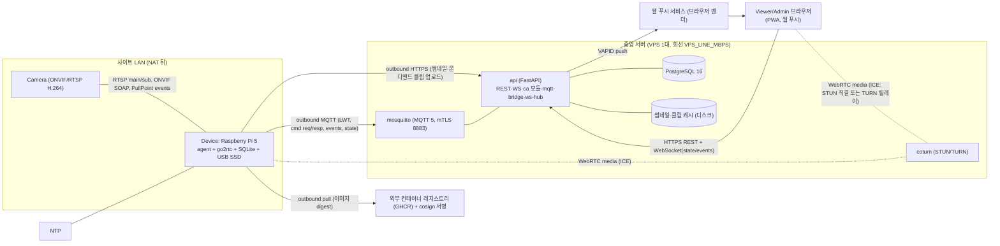

### 구현 접근 — 난점과 선택
| 난점 | 선택 | 왜 |
|---|---|---|
| Pi 5에 HW 인코더 없음 | **무재인코딩 패스스루** (INV-4): 카메라 H.264 → go2rtc → WebRTC. 해상도는 카메라 sub/main 프로파일로 | 재인코딩은 CPU 포화 → 지연·프레임 드롭 |
| Pi가 NAT 뒤, 포트포워딩 금지 | **시그널링은 MQTT 5 요청/응답으로 서버 경유**(trickle ICE는 WS↔MQTT `ice` 메시지로 중계), 미디어는 ICE(STUN 직결 시도 → coturn 릴레이 폴백). Pi 측 go2rtc `ice_servers`는 설정 파일 항목이라 세션별 주입이 어렵다 → **기기 단위 TURN 자격증명**(DEVICE_TURN_CRED_TTL_HOURS 회전, agent가 설정 재생성·go2rtc reload). 브라우저는 세션별 TURN_CRED_TTL_MIN 자격증명. 릴레이 경로는 서브스트림 고정 + 전역 TURN_RELAY_MAX_MBPS 상한 (FR-006) | 서버는 제어면만 지나가고 미디어는 P2P/릴레이로 서버 대역을 아낀다. 릴레이 최악 = SITES_MAX × VIEWER_MAX × SUB_STREAM_BITRATE_KBPS × 2(수신+송신) ≈ VPS_LINE_MBPS의 5% — 메인 허용 시 250Mbps × 2로 회선 포화(검토 #2). go2rtc의 TURN 클라이언트 동작은 **가능성**(pion 기반) → 스켈레톤 첫 작업에서 실증 |
| 명령 왕복의 실패 모드 | 명령 응답 대기 CMD_TIMEOUT_SEC → `command-timeout`. `webrtc.offer`는 session_id로 멱등(QoS1 중복 전달 시 같은 answer 재생). 세션 종료(DELETE·WS 끊김·LIVE_SESSION_MAX_MIN)마다 `webrtc.close`로 go2rtc PeerConnection 정리 | ICE 타임아웃에 의존하면 Pi 자원이 샌다(검토 #6) |
| "실시간"의 정의 | 03 상수 LIVE_LATENCY_P95·LIVE_FIRST_FRAME_P95, stale 배지 STALE_AFTER_SEC | 측정 가능 |
| 클립이 Pi에 있음 | **온디맨드 업로드**: 재생 요청 → 서버가 Pi에 `clip.upload` 명령 → Pi가 서명된 PUT URL로 업로드 → 서버가 Range 지원 서명 URL로 브라우저에 스트리밍. 이벤트당 업로드는 **singleflight**(EVENT.cache_status uploading/ready), 임시파일 → 원자적 rename 후에만 서빙, 클라는 `202 clip-uploading`을 WS `event.clip_cached`/폴링으로 대기. 캐시는 CLIP_CACHE_TTL_MIN 뒤 삭제(활성 서명 토큰이 있으면 연장) | 리버스 HTTP 터널보다 단순, 개인정보가 서버에 상주하지 않음. 첫 재생까지 업로드 지연 ≈ 클립 크기 ÷ 업링크 (검토 #5) |
| 제어 채널 1개로 끝내기 | MQTT 5 한 채널: LWT(프레즌스), retained state, QoS1 명령, `response-topic`+`correlation-data`로 요청/응답 | WebSocket 추가 시 프레즌스·재전송 재구현 |
| 오프라인 자율 | Pi 에이전트는 서버 없이도 이벤트 감지·클립 저장·큐잉 (FR-022) | 서버 다운이 녹화 공백이 되지 않게 |
| 감사 로그 fail-closed | 토큰 발급과 AuditLog INSERT를 한 트랜잭션 (INV-2) | 법적 책임추적성 |

### 컴포넌트 구조
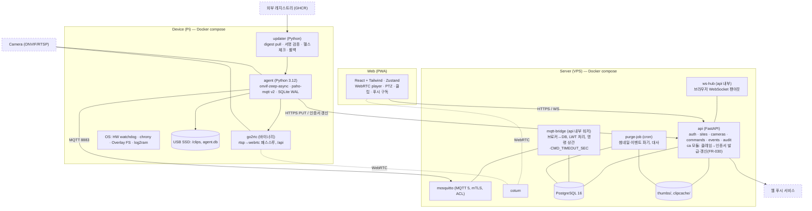

컴포넌트 책임 (한 줄씩)
- **agent**: 카메라 탐색·capability·RTSP URL을 go2rtc에 등록, ONVIF PullPoint 이벤트 구독 → Event 생성·클립 저장(ffmpeg copy, 재인코딩 없음)·썸네일 업로드, 명령 실행(PTZ/프리셋/스냅샷/녹화/재시작/클립 업로드/webrtc.close), 상태 보고, 로컬 큐, 파기 잡(클립). **카메라 연결 감시(FR-021)**: go2rtc `/api/streams` 상태 폴링 + PullPoint 구독 갱신 실패를 같은 경로로 감지 → Camera `connected ⇄ disconnected` 전이는 agent가 소유, CAM_RECONNECT_BACKOFF로 ONVIF 세션 재수립(go2rtc의 RTSP 재접속과 별개), `camera_disconnected`/`camera_reconnected` 이벤트 발행. **TURN 자격증명 회전**: DEVICE_TURN_CRED_TTL_HOURS마다 go2rtc 설정 재생성·reload. **인증서 갱신(FR-030)**: 만료 DEVICE_CERT_RENEW_BEFORE_DAYS 전 현재 인증서로 갱신 요청.
- **go2rtc**: RTSP 수신·WebRTC 송출. agent가 `/api/webrtc`로 SDP를 중계한다. 외부 노출 없음(localhost).
- **updater**: agent·go2rtc 컨테이너 이미지의 digest 교체와 롤백. agent와 분리해 agent가 죽어도 복구 가능.
- **api**: REST·WebSocket·토큰 발급·감사 로그·푸시. **ca 모듈**(api 내부): 클레임 토큰 검증 → CSR 서명(DEVICE_CERT_VALID_DAYS), 갱신 재발급, 만료 임박 미갱신 기기 알림, 인증서 지문 ↔ device_id 매핑(mosquitto는 CN=device_id로 ACL). **mqtt-bridge**: 브로커 구독, LWT→offline, 명령 응답 상관·CMD_TIMEOUT_SEC. **purge-job**: 서버 측 파기(행 DELETE + 파일 삭제, 일 1회)와 Pi 파기 대사(INV-1).
- **UI**: 03 UI 방향. 상태 4종.

### 데이터 흐름

#### 시나리오 1 — 라이브 시작 (US-1, FR-003·004·006)
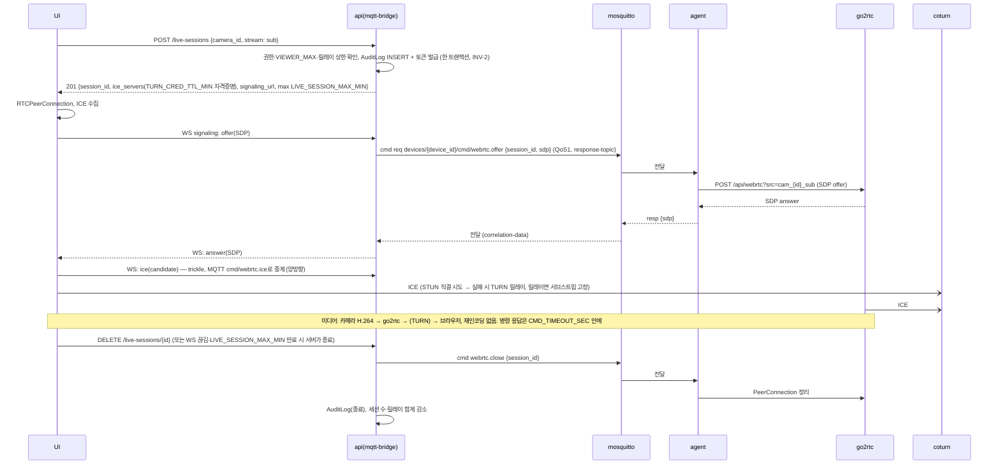

#### 시나리오 2 — PTZ 조작 (US-2, FR-007·010)
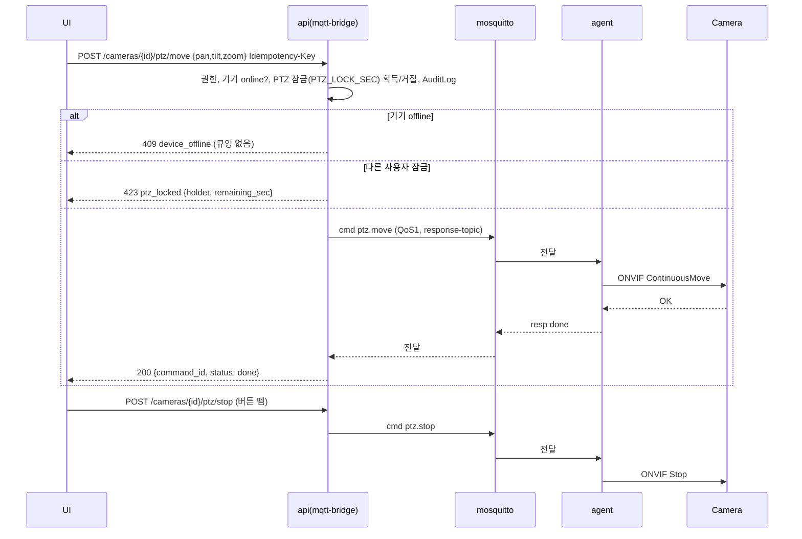

#### 시나리오 3 — 모션 이벤트 → 클립 → 푸시 (US-3, FR-011·012·017)
```mermaid
sequenceDiagram
  participant CAM as Camera
  participant AG as agent
  participant SSD as USB SSD
  participant BRK as mosquitto
  participant API as api(mqtt-bridge)
  participant PUSH as 웹 푸시 서비스
  participant UI as UI
  CAM->>AG: PullPoint: MotionAlarm true
  AG->>AG: EVENT_COOLDOWN_SEC 병합, Event(ULID) 생성
  AG->>SSD: ffmpeg -c copy (링버퍼에서 CLIP_PRE_SEC 전부터) → clip.mp4 기록 시작
  AG->>BRK: event.created {event_id, camera_id, ts, clock_synced} (QoS1; 오프라인이면 로컬 큐)
  BRK->>API: 전달 → Event INSERT (ULID 멱등)
  API->>PUSH: VAPID push (ALERT_DAILY_MAX 초과면 요약)
  PUSH-->>UI: 알림
  AG->>SSD: CLIP_POST_SEC 후 기록 종료, SHA-256
  AG->>API: PUT /devices/{d}/events/{e}/thumbnail (HTTPS, 기기 인증서)
  AG->>BRK: event.clip_ready {event_id, duration, sha256, bytes}
  BRK->>API: 전달 → Event 상태 clip_ready
  UI->>API: POST /events/{e}/clip-access → cache_status none이면 cmd clip.upload(singleflight) → 202 clip-uploading
  AG->>API: PUT clipcache 임시파일 → 원자적 rename → cache_status ready (WS event.clip_cached)
  UI->>API: 재요청 → 200 서명 URL(Range), 캐시는 CLIP_CACHE_TTL_MIN
```

### 데이터 저장 (설계 결정에 관련된 부분만 — 전체 스키마는 05)
- **서버 PostgreSQL**: Workspace·User·Site·Device·Camera·Preset·Event(메타)·Command·AuditLog·PushSubscription·Deployment. 전 테이블 `workspace_id` (INV-7). **Event 파기는 purge-job의 행 DELETE + 썸네일 파일 삭제(일 1회, `purged_at`)로 INV-1(CLIP_RETENTION_DAYS + PURGE_MAX_DELAY_HOURS)을 지킨다** — 월 파티션은 저장 지역성용이며 DROP은 전 행 파기 후 정리에만 쓴다. AuditLog는 월 파티션 DROP으로 AUDIT_RETENTION_DAYS 보관(초과 보존은 법 위반이 아님).
- **서버 디스크**: `thumbs/{event_id}.jpg` (≤ THUMB_MAX_KB, CLIP_RETENTION_DAYS; 최악 용량 = EVENTS_PER_CAM_DAY_MAX × CAMERAS_PER_SITE_MAX × SITES_MAX × CLIP_RETENTION_DAYS × THUMB_MAX_KB — 디스크 사용률 알람은 07), `clipcache/{event_id}.mp4` (CLIP_CACHE_TTL_MIN 후 삭제, 활성 토큰 시 연장).
- **Pi SQLite(WAL, USB SSD)**: cameras(캐시), events(로컬 원본), outbox(큐, OFFLINE_QUEUE_MAX), commands(멱등 캐시). 클립 파일 `/clips/{camera_id}/{event_id}.mp4`.
- **Pi 링버퍼**: go2rtc 스트림에서 ffmpeg가 세그먼트(RINGBUF_SEGMENT_SEC)를 tmpfs(`size=RINGBUF_TMPFS_MB`, 초과 시 오래된 세그먼트 삭제)에 CLIP_PRE_SEC + 여유만큼 유지 — SD/SSD 쓰기 없이 프리롤 확보, RAM 상한 명시로 OOM 차단.

## 검토한 대안 (ADR 요약 — 상세 근거는 01-recon fit 표·decision-log)
| ADR | 결정 | 대안 | 왜 이쪽인가 | 결과(트레이드오프) |
|---|---|---|---|---|
| ADR-1 | go2rtc 패스스루 | MediaMTX / 직접 pion 구현 | Pi ARM 바이너리·WebRTC/MSE/HLS 동시 출력·ONVIF 입력, Frigate 채택 | go2rtc 설정 파일에 종속. 카메라 제어는 못 하므로 agent가 ONVIF를 별도로 다룸 |
| ADR-2 | MQTT 5 단일 제어 채널 (시그널링 포함) | MQTT + 별도 WebSocket 시그널링 터널 | 컴포넌트 1개 절약, LWT·QoS·요청/응답 내장 | SDP(수 KB)가 브로커를 지남 — 브로커 메시지 상한 MQTT_MSG_MAX_KB. 응답 대기 CMD_TIMEOUT_SEC, 세션 정리는 `webrtc.close`로 명시 |
| ADR-3 | 클립 온디맨드 업로드 + 서버 캐시 | 상시 업로드 / 리버스 HTTP 터널 / go2rtc 파일 스트림 | 개인정보 서버 비상주, 업링크 절약, 구현 단순 | 첫 재생까지 업로드 지연 ≈ (CLIP_PRE_SEC + CLIP_POST_SEC) × MAIN_STREAM_BITRATE_MBPS ÷ UPLINK_MIN_MBPS (수동 녹화는 MANUAL_REC_MAX_MIN 비례) → 202 폴링 필요. Pi 오프라인이면 클립 열람 불가(Q3에서 수용) |
| ADR-4 | 앱 계층 A/B OTA (컨테이너 digest, 외부 레지스트리 GHCR + cosign) | RAUC OS A/B / Mender / balena / 자체 레지스트리 | 유인 현장(Q5)·SITES_MAX 규모에서 비용 대비 충분, 레지스트리 운영 부담 0 | OS 계층 벽돌은 잔여 리스크 R-3 (Accept). 외부 레지스트리 장애 시 배포 불가(운영에는 무영향) |
| ADR-5 | coturn 자체 호스팅 (VPS 동거), 릴레이는 서브스트림 고정 + TURN_RELAY_MAX_MBPS 상한 | 관리형 TURN(Twilio 등) / 릴레이 무제한 | 규모 작고 비용 예측 가능, 자격증명 발급 통제. 최악 릴레이(전 세션 sub) = VPS_LINE_MBPS의 약 5% | 릴레이 경로는 고화질 불가(엣지케이스 17). 상한 도달 시 새 릴레이 세션 거절(SC-015). TURN_RELAY_COST 미확인 |
| ADR-6 | 웹 푸시(VAPID) PWA | 네이티브 앱 / SMS·알림톡 | 앱 없이 알림, 비용 0 | iOS는 홈 화면 추가한 PWA만 푸시 수신 — 온보딩에서 안내 |
| ADR-7 | 서버 단일 인스턴스 | HA 이중화 | 규모·팀에 맞음 | 서버 다운 중 라이브·알림 불가(엣지는 자율 녹화 계속). 07 복구 RTO로 관리 |

## 위협모델 (Cross-cutting: 보안)

### ① 무엇을 만드는가 — DFD + trust boundary
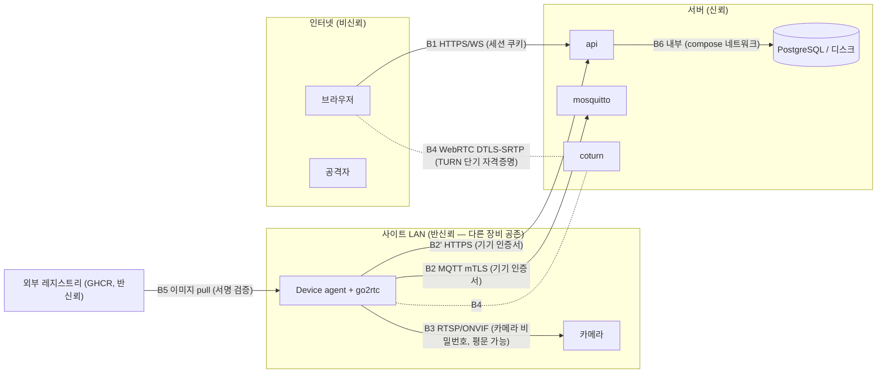

### ② 무엇이 잘못될 수 있는가 — STRIDE (경계별 전수)
| 자산/경계 | S | T | R | I | D | E |
|---|---|---|---|---|---|---|
| **B1 브라우저→api** | 자격증명 스터핑·세션 탈취 | 요청 변조(CSRF), 파라미터 변조 | 사용자가 "안 봤다" 부인 | 다른 workspace/사이트 데이터 열람, 오류에 스택 노출 | 로그인·라이브 세션 요청 폭주 | Viewer가 Admin API 호출, 스코프 우회 |
| **B2 Device→mosquitto/api** | 위조 기기(인증서 복제·클레임 토큰 재사용) | 이벤트·상태 메시지 변조, 재전송 | 기기가 보낸 이벤트 부인 — 해당없음(기기는 행위 주체가 아니라 센서, 사람 부인 대상 아님) | 다른 사이트 토픽 구독으로 이벤트 엿보기 | 기기 1대가 메시지 폭주로 브로커 포화 | 기기가 서버 명령 토픽에 발행(권한 상승) |
| **B3 Device↔카메라(LAN)** | LAN의 다른 장비가 카메라로 위장(ARP 스푸핑) | RTSP 평문 스트림 변조 | 해당없음(LAN 내부, 행위자 없음 — 감사는 B1에서) | 카메라 비밀번호가 Pi 디스크·로그에 평문 | LAN 장비가 카메라에 RTSP 세션 폭주 | 카메라 관리자 계정 탈취 → 펌웨어 조작 |
| **B4 WebRTC 미디어(TURN)** | TURN 자격증명 도용으로 릴레이 사용 | DTLS-SRTP가 막음 — 해당없음(표준 암호화) | 해당없음(미디어 채널, 행위는 B1 세션에 기록) | SDP 유출로 미디어 가로채기, TURN 서버에 평문 노출 없음(SRTP) | TURN 대역 고갈(자격증명 남용) | 해당없음(TURN에 권한 개념 없음 — D로 다룸) |
| **B5 레지스트리→Device (OTA)** | 가짜 레지스트리/이미지 | 이미지 변조 | 누가 무엇을 배포했나 부인 | 이미지에 비밀 포함 | 롤백 루프·배포 폭주 | 악성 이미지가 호스트 권한 획득(컨테이너 탈출) |
| **B6 서버 내부(api↔DB/디스크/coturn)** | 해당없음(compose 내부망, 외부 노출 없음) | DB 직접 변조(호스트 침해 시) | Admin의 설정 변경·삭제 부인 | DB 덤프·백업 유출, 썸네일 디스크 노출 | 디스크 포화(클립 캐시·썸네일) | 컨테이너 탈출 → 호스트 |

### ③ 무엇을 할 것인가 — 위협별 대응 (security-review 체크리스트 반영)
| 경계 | 위협 | 대응 | 방식 |
|---|---|---|---|
| B1 | 자격증명 스터핑 | argon2id, PASSWORD_MIN_LEN, 로그인 레이트리밋(IP·계정), 실패 지연 | Mitigate |
| B1 | 세션 탈취/CSRF | 세션 쿠키 HttpOnly·Secure·SameSite=Strict, 상태 변경은 SameSite + Origin 검사, WS는 세션 재검증 | Mitigate |
| B1 | 부인 | AuditLog fail-closed (INV-2), AUDIT_RETENTION_DAYS | Mitigate |
| B1 | 수평 권한 우회 | 모든 쿼리 `workspace_id` 필터 강제(리포지토리 계층), 스코프 `<모듈>:<자원>:<행위>` 검사, 오류는 RFC 9457에 스택 미포함 | Mitigate |
| B1 | DoS | 엔드포인트 레이트리밋, VIEWER_MAX, 라이브 세션 생성 분당 상한 | Mitigate |
| B1 | Viewer→Admin | 역할·스코프 서버측 검사, UI 숨김은 보안 아님 | Mitigate |
| B2 | 위조 기기 | 기기별 X.509(api ca 모듈, DEVICE_CERT_VALID_DAYS, DEVICE_CERT_RENEW_BEFORE_DAYS 전 갱신 — FR-030), 클레임 토큰 1회용·만료, 인증서 CN=device_id와 토픽 ACL 일치, 재사용 감지 알림(엣지케이스 16) | Mitigate |
| B2 | 메시지 변조·재전송 | mTLS, 이벤트 ULID 멱등, `webrtc.offer`는 session_id 멱등, 상태는 retained 최신값만 | Mitigate |
| B2 | 타 사이트 엿보기·권한 상승 | mosquitto 정적 ACL `pattern readwrite devices/%u/#`(%u = 인증서 CN = device_id)만 pub/sub, 서버 명령 토픽은 서버 계정만 pub (INV-3). 승인 시 ACL 갱신 불필요 | Eliminate |
| B2 | 브로커 포화 | 기기별 메시지 크기 MQTT_MSG_MAX_KB·분당 발행 상한, 초과 시 연결 끊고 알림 | Mitigate |
| B3 | 카메라 위장·스트림 변조 | 카메라 IP 고정(DHCP 예약 권고)·ONVIF 디바이스 ID 고정, 변조는 **Accept**(LAN 물리 보안은 운영자 책임 — 안내서에 명시) | Accept(사유: 소규모 사이트 LAN 격리는 범위 밖) |
| B3 | 카메라 비밀번호 노출 | Pi 디스크에 암호화 저장(기기 인증서 키로 파생), 로그 마스킹, 서버로 전송하지 않음 | Mitigate |
| B3 | RTSP 세션 폭주 | go2rtc가 카메라당 RTSP 1세션만 열고 시청자에게 팬아웃 | Eliminate |
| B3 | 카메라 관리자 탈취 | 등록 시 기본 비밀번호 감지·변경 권고, 카메라 펌웨어는 범위 밖 | Transfer(카메라 벤더·운영자) |
| B4 | TURN 자격증명 도용·대역 고갈 | coturn `use-auth-secret`: 브라우저 = 세션당 TURN_CRED_TTL_MIN, Pi = 기기당 DEVICE_TURN_CRED_TTL_HOURS 회전. 릴레이는 서브스트림 고정, 합계 TURN_RELAY_MAX_MBPS 초과 시 새 릴레이 세션 거절 + 알람 (FR-006, SC-015) | Mitigate |
| B4 | SDP 유출 | 시그널링은 인증된 WS·MQTT 경로만, DTLS 지문 SDP 포함(표준) | Mitigate |
| B5 | 가짜/변조 이미지 | digest 고정 + cosign 서명 검증(공개키는 기기 이미지에 내장), 외부 레지스트리(GHCR) TLS, 비밀은 이미지에 넣지 않음(런타임 env·파일) | Mitigate |
| B5 | 배포 부인 | Deployment 테이블(누가·언제·digest) + AuditLog | Mitigate |
| B5 | 롤백 루프 | 같은 digest 재시도 OTA_RETRY_MAX, 실패 시 `rolled_back` 고정·알림 | Mitigate |
| B5 | 배포 폭주(DoS) | 기기당 진행 중 배포 1건, 같은 release 재배포는 Idempotency-Key로 흡수, 배포 명령은 Admin 스코프 + 레이트리밋 | Mitigate |
| B5 | 컨테이너 탈출 | 컨테이너 non-root, `--cap-drop ALL`, USB 장치·/clips만 마운트, host network 미사용(go2rtc는 필요한 포트만) | Mitigate |
| B6 | DB·백업 유출 | 백업 암호화(age)·오프사이트, 디스크 권한 600, 썸네일 URL 서명 | Mitigate |
| B6 | 디스크 포화 | clipcache CLIP_CACHE_TTL_MIN, 썸네일 파기, 디스크 사용률 알람 | Mitigate |
| B6 | Admin 설정 변경·삭제 부인 (R) | 설정 변경·이벤트 삭제·사용자 초대·배포는 AuditLog `settings.change`/`event.delete`/`deploy` 행(actor·target·이전값 요약), AUDIT_RETENTION_DAYS | Mitigate |
| B6 | 서버 컨테이너 탈출 (E) | api·purge-job·mosquitto·coturn 컨테이너 non-root, `--cap-drop ALL`, read-only rootfs + 필요한 볼륨만, Docker 소켓 미마운트 | Mitigate |
| B6 | 호스트 침해 | VPS SSH 키·방화벽(443/8883/3478·49152-65535 UDP만), 자동 보안 업데이트, `npm/pip audit` CI | Mitigate |

security-review 체크리스트 적용: 비밀은 env·파일 마운트(하드코딩 0, `.env.example`은 07) · 입력은 pydantic 스키마 · 쿼리는 파라미터화(SQLAlchemy Core) · 파일 업로드(썸네일·클립)는 크기·MIME·확장자 화이트리스트 + 기기 인증서 소유 이벤트만 · 로그에 비밀번호·토큰·영상 미기록 · 의존성 `pip-audit` CI.

### ④ 충분한가 — 상위 리스크 3개 재검토 + 잔여 리스크
| # | 리스크 | 재검토 | 잔여 |
|---|---|---|---|
| R-1 | **NAT 뒤 Pi의 WebRTC가 TURN으로 안정 동작하는가** (go2rtc README는 포트 개방을 안내) — 실증 항목: ① go2rtc `ice_servers`에 TURN 자격증명(기기 단위) 설정 시 릴레이 경로 성립, ② DEVICE_TURN_CRED_TTL_HOURS 회전 시 진행 중 세션 유지 여부, ③ 브라우저 TURN_CRED_TTL_MIN 안에 LIVE_SESSION_MAX_MIN 세션이 끊기지 않는지, ④ trickle ICE 중계 시 LIVE_FIRST_FRAME_P95 | 실증 전까지 설계는 가능성. 실패 시 대안: agent가 pion으로 직접 WebRTC 송출(go2rtc RTSP 재배포를 소스로) 또는 LL-HLS 폴백(SC-001 미달) | 워킹 스켈레톤 첫 작업 = 이 실증. 미달 시 03 상수 개정(R#) |
| R-2 | **법 상수 미확정** (CLIP_RETENTION_DAYS·AUDIT_RETENTION_DAYS·AUDIT_REVIEW_INTERVAL_DAYS — 조문 원문 미인출) | 값은 상수 표 한 곳, 코드 상수 아님(설정) | 착수 전 law.go.kr 원문 확인 1회 — 핸드오프 선행 조건 |
| R-3 | **OS 계층 벽돌** (앱 A/B만) | 유인 현장 전제(Q5), OS 업데이트는 security만·재부팅 없음, SD 이미지 복원 절차를 07 런북에 | Accept. 무인 현장이 생기면 ADR-4 재검토 |
| R-4 | LAN 물리 보안(B3 Accept) | 카메라 비밀번호 암호화·로그 마스킹으로 노출면 축소 | Accept, 안내서 명시 |

## Cross-cutting: 관측성
Pi는 SD 쓰기 없이(log2ram) 구조화 로그(JSON)를 tmpfs에 두고 MQTT `state`(STATE_REFRESH_SEC)와 `log.error`(오류만) 토픽으로 서버에 올린다. 서버는 api·mqtt-bridge·coturn·mosquitto 로그를 journald → 로컬 파일(로테이션)로 두고, 4 골든 시그널 — Latency(라이브 첫 프레임·명령 왕복), Traffic(활성 세션·릴레이 세션), Errors(명령 실패율·command-timeout), Saturation(TURN 릴레이 대역 대비 TURN_RELAY_MAX_MBPS·디스크·Pi CPU) — 을 Prometheus 지표로 낸다. 알람·SLO·런북은 07.

## Cross-cutting: 프라이버시
영상·썸네일은 개인정보다. 서버에 상주하는 것은 썸네일(CLIP_RETENTION_DAYS)과 온디맨드 클립 캐시(STREAM_TOKEN_TTL_SEC)뿐이며, 모든 접근은 AuditLog에 남는다(INV-2). 로그·오류·푸시 본문에 영상·썸네일·카메라 비밀번호를 넣지 않는다(푸시는 "움직임 감지 — 매장 앞"까지만). 안내판 정보·운영 방침(FR-027)은 사이트 설정의 일부다. 파기는 Pi(클립)와 서버(썸네일·이벤트)가 각각 수행하고 purge-job이 대사한다(INV-1).


# API 계약 & 데이터 스키마 — PiCam Watch
버전: v1.1
개정: R1 반영 완료 (REVISIONS.md — 토픽 프리픽스·D04 인증서 갱신·클립 캐시·FR-030) · R2(운영 상수 추가)는 이 문서에 영향 없음 — 기준 버전만 갱신
참고자료: `(참고자료)`(자원 명명·상태코드·페이지네이션·레이트리밋 헤더) · `(참고자료)`(인덱스·타입·파티션). 충돌 시 템플릿 규약 우선: URL 버저닝 대신 미디어타입, 자체 에러 봉투 대신 RFC 9457, offset 대신 커서.

**근거 (진입 사전조사, 검색 1회)**
- 정량 — `Idempotency-Key` 헤더는 IETF draft-ietf-httpapi-idempotency-key-header-07 (2025-10-15, 상태 expired). RFC가 아니므로 "사실상 표준"(Stripe 구현)으로 채택하고 의미는 이 문서가 정의한다 (datatracker.ietf.org, 2026-09-08).
- 정성 — 초안의 목적 문장: "can be used to make non-idempotent HTTP methods such as POST or PATCH fault-tolerant" — PTZ·재시작·배포처럼 두 번 실행되면 안 되는 명령이 이 서비스의 POST 대부분이다.
- 사용자 영향 — 재시도로 카메라가 두 번 움직이거나 기기가 두 번 재시작하지 않는다. 오류는 사람이 읽는 문장(해요체)과 다음 행동을 담는다 (T-08·L-06).

## 규약 (전 엔드포인트 공통)
- **베이스**: `https://{host}/api`. **버저닝**: `Accept: application/vnd.picam.v1+json` (기본 v1, 생략 시 v1). 스펙 파일 semver.
- **에러**: RFC 9457 `application/problem+json` — `type`(`https://picam.dev/problems/{slug}`)·`title`·`status`·`detail`(해요체)·`instance`·확장 `errors[]`(필드 검증). 스택트레이스 미노출. slug 목록은 아래 표.
- **페이지네이션**: 커서 — `?cursor=&limit=`(기본 20, 최대 100) → `meta.next_cursor`(불투명, ULID 기반).
- **멱등성**: 부작용 있는 POST(명령·세션 생성·배포)는 `Idempotency-Key`(클라 생성 ULID) 필수. 서버는 SESSION_TTL_HOURS 동안 보관하고 같은 키 재시도에 최초 응답을 그대로 재생. 같은 키·다른 본문은 `422 idempotency-key-mismatch`.
- **인증**: 브라우저 = 세션 쿠키 `picam_session`(HttpOnly·Secure·SameSite=Strict). 기기 = mTLS 클라이언트 인증서(CN=device_id), `/api/device/*` 전용. 서명 URL(클립·썸네일) = 세션 없이 토큰만.
- **권한 스코프**: `<모듈>:<자원>:<행위>` — Admin = 전부, Viewer = `live:session:create` `ptz:camera:move` `ptz:preset:goto` `clips:event:read` `clips:clip:read` `snapshot:camera:create` `record:camera:create` `push:subscription:write`. 사이트 범위는 `user_sites`로 제한(INV-7 workspace 필터 + 사이트 필터).
- **네이밍**: 경로 kebab-case 복수, JSON snake_case, 시각 UTC ISO 8601(`2026-09-08T05:31:30Z`), 식별자 ULID(26자).
- **레이트리밋**: `RateLimit-Limit/Remaining/Reset` 헤더, 초과 시 `429` + `Retry-After`. 로그인·라이브 세션 생성·PTZ는 별도 상한(07 설정).
- **응답 봉투**: `{ "data": … , "meta": … }`. 삭제·정지는 `204`.

### Problem slug 표
| slug | status | 언제 |
|---|---|---|
| `validation-failed` | 422 | 스키마 검증 실패 (`errors[]`) |
| `invalid-credentials` | 401 | 로그인 실패 |
| `unauthenticated` | 401 | 세션·인증서 없음 |
| `forbidden` | 403 | 스코프·사이트 범위 밖 |
| `not-found` | 404 | 자원 없음 또는 다른 workspace |
| `device-offline` | 409 | 기기 offline — 명령 큐잉 안 함 (FR-010) |
| `ptz-locked` | 423 | 다른 사용자가 PTZ_LOCK_SEC 안 조작 중 (`holder`, `remaining_sec`) |
| `ptz-unsupported` | 422 | 카메라 capability에 PTZ 없음 |
| `stream-unsupported` | 422 | 요청 스트림이 브라우저 재생 불가(H.265) — 엣지케이스 1 |
| `no-h264-stream` | 422 | 카메라 등록 거부 (INV-6) |
| `camera-auth-failed` | 422 | ONVIF 자격증명 오류 |
| `viewer-limit` | 429 | 사이트 VIEWER_MAX 도달 (`current_viewers`) 또는 릴레이 합계 TURN_RELAY_MAX_MBPS 도달 (`reason: relay-cap`, 직결 가능하면 재시도 안내) |
| `rate-limited` | 429 | 레이트리밋 |
| `claim-token-used` | 409 | 클레임 토큰 재사용 (엣지케이스 16) |
| `clip-purged` | 410 | 보존 만료로 파기됨 |
| `clip-uploading` | 202 | 온디맨드 업로드 진행 중 (`Retry-After`) |
| `idempotency-key-mismatch` | 422 | 같은 키·다른 본문 |
| `command-timeout` | 504 | 기기가 CMD_TIMEOUT_SEC 안에 응답하지 않음 |
| `internal` | 500 | 그 외. detail 고정 문구 |

## 엔드포인트 표
| ID | 메서드 경로 | 요청(핵심 필드) | 응답 | 주요 에러(slug) | 권한 스코프 |
|---|---|---|---|---|---|
| **인증·사용자** | | | | | |
| E01 | POST /auth/login | email, password | 200 {user, role, scopes} + Set-Cookie | invalid-credentials, rate-limited | 공개 |
| E02 | POST /auth/logout | — | 204 | unauthenticated | 세션 |
| E03 | GET /auth/me | — | 200 {user, workspace, role, scopes, sites[]} | unauthenticated | 세션 |
| E04 | POST /invites | email, role=viewer, site_ids[] | 201 {invite} | validation-failed, forbidden | admin:user:invite |
| E05 | POST /invites/{token}/accept | password (≥PASSWORD_MIN_LEN) | 201 {user} | not-found, validation-failed | 공개(토큰) |
| **사이트** | | | | | |
| E06 | GET /sites | cursor, limit | 200 {data[], meta} | — | 세션(사이트 범위) |
| E07 | POST /sites | name, timezone | 201 {site} | validation-failed | admin:site:write |
| E08 | GET /sites/{id} | — | 200 {site, signage, policy_text, devices[], cameras[]} | not-found | 세션 |
| E09 | PATCH /sites/{id} | name, signage{purpose, location, coverage, hours, manager_contact}, policy_text | 200 {site} | validation-failed | admin:site:write |
| E10 | GET /sites/{id}/signage.pdf | — | 200 application/pdf (안내판 인쇄) | not-found | admin:site:read |
| **기기** | | | | | |
| E11 | POST /device/claim | claim_token, csr (PEM) | 201 {device_id, cert_pem, ca_pem, mqtt{host,port}, topics} | claim-token-used, validation-failed | 공개(클레임 토큰) |
| E12 | GET /devices | site_id, cursor | 200 {data[]} | — | 세션 |
| E13 | GET /devices/{id} | — | 200 {device: status(claimed/approved/online/offline/retired), last_seen_at, metrics{cpu,temp_c,disk_free_pct,uplink_mbps}, version, clock_synced} | not-found | 세션 |
| E14 | POST /devices/{id}/approve | site_id | 200 {device} | not-found, validation-failed | admin:device:write |
| E15 | POST /devices/{id}/retire | — | 200 {device} | not-found | admin:device:write |
| E16 | POST /devices/{id}/restart | target=agent\|os · Idempotency-Key | 202 {command_id} | device-offline | admin:device:write |
| E17 | POST /devices/{id}/deployments | release_id · Idempotency-Key | 202 {deployment} | device-offline, not-found | admin:device:deploy |
| E18 | GET /devices/{id}/deployments | cursor | 200 {data[]: status(pending/applying/healthy/rolled_back/failed), image_digest, actor} | — | admin:device:read |
| E19 | GET /releases | — | 200 {data[]: version, image_digest, signed_at} | — | admin:device:read |
| **카메라** | | | | | |
| E20 | POST /devices/{id}/camera-discoveries | Idempotency-Key | 202 {command_id} | device-offline | admin:camera:write |
| E21 | GET /commands/{id} | — | 200 {command: status(accepted/executing/done/failed), result, error} | not-found | 세션(발행자·Admin) |
| E22 | POST /devices/{id}/cameras | xaddr, username, password, name | 201 {camera(capabilities)} | no-h264-stream, camera-auth-failed, device-offline | admin:camera:write |
| E23 | GET /cameras | site_id, cursor | 200 {data[]} | — | 세션 |
| E24 | GET /cameras/{id} | — | 200 {camera: status(registered/connected/disconnected), capabilities{ptz, presets, events, streams[{profile, codec, width, height}]}, default_stream} | not-found | 세션 |
| E25 | PATCH /cameras/{id} | name, default_stream | 200 {camera} | validation-failed | admin:camera:write |
| E26 | DELETE /cameras/{id} | — | 204 (soft delete) | not-found | admin:camera:write |
| **라이브** | | | | | |
| E27 | POST /live-sessions | camera_id, stream=sub\|main · Idempotency-Key | 201 {session_id, token, ice_servers[{urls, username, credential}](TURN_CRED_TTL_MIN), signaling_url, token_expires_at(STREAM_TOKEN_TTL_SEC), max_duration_min(LIVE_SESSION_MAX_MIN)}. 릴레이로 붙으면 서버가 `stream_effective: sub`를 WS로 통지(엣지 17) | viewer-limit(VIEWER_MAX 또는 relay-cap), device-offline, stream-unsupported | live:session:create |
| E28 | DELETE /live-sessions/{id} | — | 204 | not-found | 세션(소유자) |
| E29 | WS /live-sessions/{id}/signaling?token= | offer/ice 메시지 | answer/ice/error 메시지 (아래 WS 계약) | unauthenticated | 토큰 |
| **PTZ** | | | | | |
| E30 | POST /cameras/{id}/ptz/move | pan, tilt, zoom ∈ [-1,1] · Idempotency-Key | 200 {command_id, status} | device-offline, ptz-locked, ptz-unsupported | ptz:camera:move |
| E31 | POST /cameras/{id}/ptz/stop | — | 200 {command_id} | device-offline | ptz:camera:move |
| E32 | GET /cameras/{id}/presets | — | 200 {data[]: preset_id, name, onvif_token} | — | 세션 |
| E33 | POST /cameras/{id}/presets | name · Idempotency-Key | 201 {preset} (현재 위치 저장) | device-offline, ptz-unsupported | admin:preset:write |
| E34 | POST /cameras/{id}/presets/{pid}/goto | Idempotency-Key | 200 {command_id} | device-offline, ptz-locked | ptz:preset:goto |
| E35 | DELETE /cameras/{id}/presets/{pid} | — | 204 | not-found | admin:preset:write |
| **스냅샷·녹화** | | | | | |
| E36 | POST /cameras/{id}/snapshots | Idempotency-Key | 202 {command_id} → 완료 시 result{snapshot_id, url} | device-offline | snapshot:camera:create |
| E37 | POST /cameras/{id}/recordings | duration_sec (≤ MANUAL_REC_MAX_MIN×60) · Idempotency-Key | 202 {command_id, event_id} | device-offline, validation-failed | record:camera:create |
| E38 | POST /cameras/{id}/recordings/stop | — | 202 {command_id} | device-offline | record:camera:create |
| **이벤트·클립** | | | | | |
| E39 | GET /events | site_id, camera_id, type, from, to, cursor, limit | 200 {data[]: id, type(motion/manual/snapshot/camera_disconnected/camera_reconnected/disk_low/clip_failed), camera_id, started_at, ended_at, status(detected/clip_ready/clip_failed), thumbnail_url, clock_synced} | validation-failed | clips:event:read |
| E40 | GET /events/{id} | — | 200 {event, clip{duration_sec, bytes, sha256}} | not-found, clip-purged | clips:event:read |
| E41 | GET /events/{id}/thumbnail | — | 200 image/jpeg | not-found | clips:event:read |
| E42 | POST /events/{id}/clip-access | Idempotency-Key | 200 {clip_url(서명, Range 지원), expires_at(CLIP_CACHE_TTL_MIN, 활성 토큰 시 연장)} · 202 clip-uploading(Retry-After; 이벤트당 업로드 1회 singleflight — EVENT.cache_status) | device-offline, clip-purged | clips:clip:read |
| E43 | GET /clips/{token} | Range | 206/200 video/mp4 | not-found(만료) | 토큰 |
| E44 | DELETE /events/{id} | — | 204 (즉시 파기, 감사) | not-found | admin:event:delete |
| **알림** | | | | | |
| E45 | POST /push-subscriptions | endpoint, keys{p256dh, auth} | 201 {subscription} | validation-failed | push:subscription:write |
| E46 | DELETE /push-subscriptions/{id} | — | 204 | not-found | push:subscription:write |
| E47 | GET /notification-settings | — | 200 {email_enabled} | — | 세션 |
| E48 | PATCH /notification-settings | email_enabled | 200 | validation-failed | 세션 |
| **감사** | | | | | |
| E49 | GET /audit-logs | actor_id, action, from, to, cursor | 200 {data[]: id, actor, action, target, ip, at} | forbidden | admin:audit:read |
| E50 | POST /audit-reviews | period(YYYY-MM), note | 201 {review} | validation-failed | admin:audit:read |
| **기기 측 HTTPS (mTLS)** | | | | | |
| D01 | PUT /device/events/{event_id}/thumbnail | image/jpeg (≤ THUMB_MAX_KB, MIME·확장자 화이트리스트) | 204 | forbidden(타 기기 이벤트), validation-failed | 기기 인증서 |
| D02 | PUT /device/clip-uploads/{upload_id} | video/mp4 (upload_id는 cmd clip.upload 페이로드; 서버는 임시파일에 받고 완료 시 원자적 rename → cache_status ready) | 204 | not-found(만료), validation-failed | 기기 인증서 |
| D04 | POST /device/certificate | csr (PEM) — 현재 인증서로 mTLS, 만료 DEVICE_CERT_RENEW_BEFORE_DAYS 전 | 200 {cert_pem, expires_at(DEVICE_CERT_VALID_DAYS)} | unauthenticated(만료·폐기 인증서), validation-failed | 기기 인증서 |
| D03 | GET /device/config | — | 200 {constants(EVENT_COOLDOWN_SEC, CLIP_PRE_SEC, CLIP_POST_SEC, CLIP_RETENTION_DAYS, PURGE_MAX_DELAY_HOURS, CLIP_DISK_RESERVE_PCT, OFFLINE_QUEUE_MAX, STATE_REFRESH_SEC, MQTT_KEEPALIVE_SEC), mqtt} | unauthenticated | 기기 인증서 |

## WS 계약 (브라우저)
- **상태 채널** `WS /ws` (세션 쿠키): 서버→클라 `device.state` `camera.state` `event.created` `event.clip_ready` `command.updated` `deployment.updated` — 페이로드는 해당 REST 표현과 동일 필드. 클라→서버 `ping`만.
- **시그널링** E29: 클라→서버 `{type:"offer", sdp}` `{type:"ice", candidate}`(trickle); 서버→클라 `{type:"answer", sdp}` `{type:"ice", candidate}` `{type:"stream_effective", stream}` `{type:"error", problem}`. 서버는 offer를 MQTT `cmd/webrtc.offer`(session_id 멱등)로, ice를 `cmd/webrtc.ice`로 중계하고 answer·기기 측 ice를 되돌린다. WS 끊김·LIVE_SESSION_MAX_MIN 만료 = 세션 종료(E28과 동일 처리 + `cmd/webrtc.close` + AuditLog 종료). 상태 채널에 `event.clip_cached`(E42 202 → 200 전환 통지) 추가.

## MQTT 토픽 계약 (기기 ↔ 서버, MQTT 5, 메시지 ≤ MQTT_MSG_MAX_KB)
프리픽스 `devices/{device_id}/` — mosquitto 정적 ACL `pattern readwrite devices/%u/#`(%u = 인증서 CN = device_id): 기기는 pub `state` `events` `resp/#` `log/#`, sub `cmd/#`. 서버 계정: pub `cmd/#`, sub 전부 (INV-3). 사이트 매핑은 서버 DB(DEVICE.site_id)가 안다.
| 토픽 | 방향 | QoS/retain | 페이로드 |
|---|---|---|---|
| `state` | 기기→ | QoS1, retained, STATE_REFRESH_SEC | {online:true, cpu, temp_c, disk_free_pct, uplink_mbps, version, clock_synced, cameras[{camera_id, status}]} · LWT = {online:false} |
| `events` | 기기→ | QoS1 | {event_id(ULID), type, camera_id, started_at, ended_at, clock_synced, clip{duration_sec, bytes, sha256}} — type: motion, manual, snapshot, camera_disconnected, camera_reconnected, disk_low, clip_failed, clip_ready, purged |
| `cmd/{name}` | →기기 | QoS1, response-topic=`resp/{correlation}`, 응답 대기 CMD_TIMEOUT_SEC | {command_id, args} — name: webrtc.offer{session_id, sdp, stream}(session_id 멱등) · webrtc.ice{session_id, candidate} · webrtc.close{session_id} · ptz.move{pan,tilt,zoom} · ptz.stop · preset.list/set/goto/delete · snapshot · record.start{duration_sec}/record.stop · clip.upload{event_id, upload_url} · camera.discover · camera.add{xaddr, username, password} · camera.remove · restart{target} · deploy{image_digest, signature} · turn.credentials{username, credential, expires_at}(DEVICE_TURN_CRED_TTL_HOURS 회전, retained 아님) · purge.report |
| `resp/{correlation}` | 기기→ | QoS1 | {command_id, status: done\|failed, result, error{slug, detail}} |
| `log/error` | 기기→ | QoS0 | {at, component, message} (비밀·영상 없음) |

## OpenAPI 스케치 (핵심 3개 — 전문은 구현 단계)
```yaml
openapi: 3.1.0
info: {title: PiCam Watch API, version: 1.0.0}
paths:
  /live-sessions:
    post:
      operationId: createLiveSession
      parameters: [{name: Idempotency-Key, in: header, required: true, schema: {type: string, pattern: '^[0-9A-HJKMNP-TV-Z]{26}$'}}]
      requestBody:
        content: {application/json: {schema: {type: object, required: [camera_id, stream], properties: {camera_id: {type: string}, stream: {enum: [sub, main]}}}}}
      responses:
        '201': {content: {application/vnd.picam.v1+json: {schema: {$ref: '#/components/schemas/LiveSession'}}}}
        '429': {$ref: '#/components/responses/ViewerLimit'}
        '409': {$ref: '#/components/responses/DeviceOffline'}
        '422': {$ref: '#/components/responses/Problem'}
  /cameras/{id}/ptz/move:
    post:
      operationId: ptzMove
      parameters: [{name: id, in: path, required: true, schema: {type: string}}, {name: Idempotency-Key, in: header, required: true, schema: {type: string}}]
      requestBody:
        content: {application/json: {schema: {type: object, required: [pan, tilt, zoom], properties: {pan: {type: number, minimum: -1, maximum: 1}, tilt: {type: number, minimum: -1, maximum: 1}, zoom: {type: number, minimum: -1, maximum: 1}}}}}
      responses:
        '200': {content: {application/vnd.picam.v1+json: {schema: {$ref: '#/components/schemas/CommandAck'}}}}
        '423': {$ref: '#/components/responses/PtzLocked'}
        '409': {$ref: '#/components/responses/DeviceOffline'}
  /events:
    get:
      operationId: listEvents
      parameters:
        - {name: site_id, in: query, schema: {type: string}}
        - {name: camera_id, in: query, schema: {type: string}}
        - {name: type, in: query, schema: {type: string}}
        - {name: from, in: query, schema: {type: string, format: date-time}}
        - {name: to, in: query, schema: {type: string, format: date-time}}
        - {name: cursor, in: query, schema: {type: string}}
        - {name: limit, in: query, schema: {type: integer, minimum: 1, maximum: 100, default: 20}}
      responses:
        '200': {content: {application/vnd.picam.v1+json: {schema: {type: object, properties: {data: {type: array, items: {$ref: '#/components/schemas/Event'}}, meta: {type: object, properties: {next_cursor: {type: [string, 'null']}}}}}}}}
components:
  schemas:
    LiveSession: {type: object, properties: {session_id: {type: string}, token: {type: string}, ice_servers: {type: array, items: {type: object, properties: {urls: {type: array, items: {type: string}}, username: {type: string}, credential: {type: string}}}}, signaling_url: {type: string}, expires_at: {type: string, format: date-time}}}
    CommandAck: {type: object, properties: {command_id: {type: string}, status: {enum: [accepted, executing, done, failed]}}}
    Event: {type: object, properties: {id: {type: string}, type: {type: string}, camera_id: {type: string}, started_at: {type: string, format: date-time}, ended_at: {type: [string, 'null'], format: date-time}, status: {enum: [detected, clip_ready, clip_failed]}, thumbnail_url: {type: [string, 'null']}, clock_synced: {type: boolean}}}
    Problem: {type: object, properties: {type: {type: string, format: uri}, title: {type: string}, status: {type: integer}, detail: {type: string}, instance: {type: string}, errors: {type: array, items: {type: object, properties: {field: {type: string}, message: {type: string}}}}}}
  responses:
    Problem: {content: {application/problem+json: {schema: {$ref: '#/components/schemas/Problem'}}}}
    ViewerLimit: {content: {application/problem+json: {schema: {$ref: '#/components/schemas/Problem'}}}}
    DeviceOffline: {content: {application/problem+json: {schema: {$ref: '#/components/schemas/Problem'}}}}
    PtzLocked: {content: {application/problem+json: {schema: {$ref: '#/components/schemas/Problem'}}}}
```

## ERD
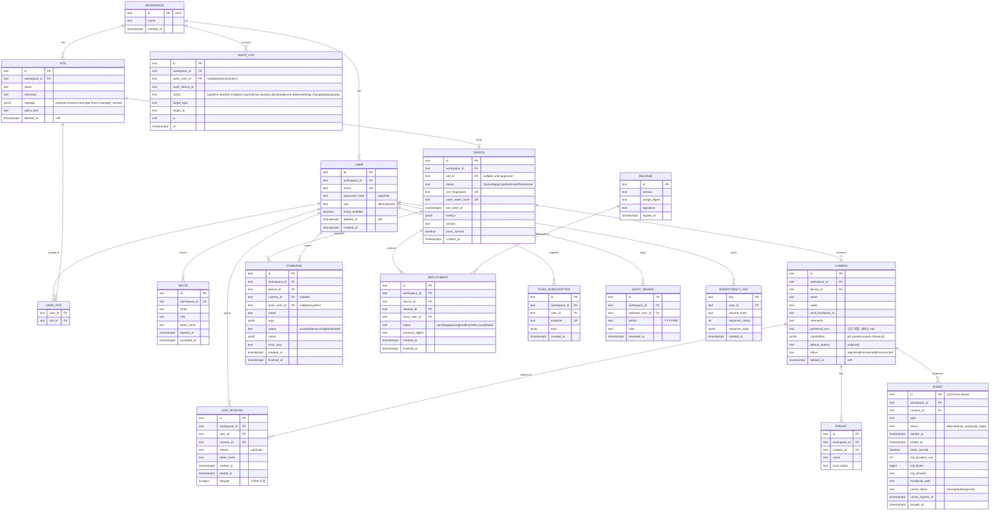

## DDL 스케치 (핵심 제약·인덱스 — postgres-patterns)
```sql
-- 모든 표에 workspace_id (INV-7). ULID는 text(26): 시간순이라 B-tree 지역성 유지 (random UUID 회피 권고에 부합)
CREATE TABLE event (
  id            text PRIMARY KEY CHECK (length(id) = 26),
  workspace_id  text NOT NULL REFERENCES workspace(id),
  camera_id     text NOT NULL REFERENCES camera(id),
  type          text NOT NULL CHECK (type IN ('motion','manual','snapshot','camera_disconnected','camera_reconnected','disk_low','clip_failed')),
  status        text NOT NULL DEFAULT 'detected' CHECK (status IN ('detected','clip_ready','clip_failed')),
  started_at    timestamptz NOT NULL,
  ended_at      timestamptz,
  clock_synced  boolean NOT NULL DEFAULT true,
  clip_duration_sec int, clip_bytes bigint, clip_sha256 text, thumbnail_path text,
  cache_status  text NOT NULL DEFAULT 'none' CHECK (cache_status IN ('none','uploading','ready')),
  cache_expires_at timestamptz,
  purged_at     timestamptz
) PARTITION BY RANGE (started_at);              -- 월 파티션은 지역성용. 보존 만료 파기 = purge-job 행 DELETE + 파일 삭제(일 1회, INV-1). DROP은 전 행 파기 후 정리만
CREATE INDEX event_cam_started ON event (workspace_id, camera_id, started_at DESC);   -- 목록·커서
CREATE INDEX event_purge ON event (started_at) WHERE purged_at IS NULL;               -- 파기 잡
CREATE INDEX event_cache ON event (cache_expires_at) WHERE cache_status = 'ready';    -- 캐시 정리 잡

CREATE TABLE live_session (
  id text PRIMARY KEY, workspace_id text NOT NULL, user_id text NOT NULL REFERENCES "user"(id),
  camera_id text NOT NULL REFERENCES camera(id), stream text NOT NULL CHECK (stream IN ('sub','main')),
  token_hash text NOT NULL, started_at timestamptz NOT NULL DEFAULT now(), ended_at timestamptz, relayed boolean
);
CREATE INDEX live_active ON live_session (camera_id) WHERE ended_at IS NULL;          -- VIEWER_MAX 카운트

CREATE TABLE audit_log (
  id text PRIMARY KEY, workspace_id text NOT NULL, actor_user_id text, actor_device_id text,
  action text NOT NULL, target_type text NOT NULL, target_id text NOT NULL, ip inet, at timestamptz NOT NULL DEFAULT now()
) PARTITION BY RANGE (at);                       -- AUDIT_RETENTION_DAYS 후 파티션 DROP
CREATE INDEX audit_actor_at ON audit_log (workspace_id, actor_user_id, at DESC);

CREATE TABLE device (
  id text PRIMARY KEY, workspace_id text NOT NULL, site_id text REFERENCES site(id),
  status text NOT NULL CHECK (status IN ('claimed','approved','online','offline','retired')),
  cert_fingerprint text UNIQUE, claim_token_hash text UNIQUE, last_seen_at timestamptz, metrics jsonb, version text, clock_synced boolean,
  CONSTRAINT device_site_when_approved CHECK (status = 'claimed' OR site_id IS NOT NULL)
);
CREATE UNIQUE INDEX device_one_per_site ON device (site_id) WHERE status <> 'retired';  -- 사이트당 기기 1대

-- PTZ 잠금: 별도 표 없이 advisory lock — pg_try_advisory_xact_lock(hashtext(camera_id)) + redis 없음. 잠금 보유자·만료는 camera.ptz_lock(jsonb: holder, until)로 기록, PTZ_LOCK_SEC.
-- 명령: command(status) 인덱스 (device_id, status) WHERE status IN ('accepted','executing') — 타임아웃 스캔.
-- 멱등키: idempotency_key(created_at) 인덱스, SESSION_TTL_HOURS 지난 행 삭제 잡.
```

## 데이터 규칙
- **시각**: `timestamptz`, API는 UTC ISO 8601. 기기 이벤트는 기기 시각 + `clock_synced`; false면 UI가 "기기 시계 미동기" 표시하고 서버 수신 시각을 병기.
- **식별자**: ULID text(26). 이벤트 ID는 **기기가 생성**(오프라인 큐 재전송 시 멱등, 엣지케이스 13).
- **비밀**: 카메라 비밀번호는 서버에 저장하지 않는다 — `camera.password_enc`는 기기 SQLite에만(기기 인증서 키 파생 암호화). E22 요청 본문은 MQTT `camera.add`로 기기에 전달 후 서버 메모리에서 폐기.
- **보존**: EVENT·썸네일 CLIP_RETENTION_DAYS → 파기(`purged_at`, 파일 삭제, 행 DELETE) · COMMAND·LIVE_SESSION·AUDIT_LOG AUDIT_RETENTION_DAYS(파티션 DROP) · IDEMPOTENCY_KEY SESSION_TTL_HOURS · 클립 캐시 CLIP_CACHE_TTL_MIN(활성 서명 토큰 시 연장). 소프트삭제: USER·SITE·CAMERA(`deleted_at`). 하드 파기: EVENT 클립·썸네일(법).
- **파일**: 썸네일 ≤ THUMB_MAX_KB JPEG, 클립 MP4(H.264 copy, faststart). 업로드는 MIME·확장자·크기 화이트리스트, 기기 인증서가 소유한 이벤트만.
- **기기 인증서**: DEVICE_CERT_VALID_DAYS 유효, D04로 갱신, 갱신 시 `cert_fingerprint` 교체 + 구 인증서 폐기 목록(CRL) 반영.
- **금액**: 없음.

## 규칙 상수 파일
03 상수 표를 `config/constants.yaml`로 옮기고 값마다 `source:`(출처 URL | 설계 결정 DL-# | 미확인) 필드를 붙인다. 기기는 D03으로 자기 몫만 받는다. 코드에 숫자 리터럴 금지(리뷰 항목).

## 커버리지 매핑 (P0·P1 매핑 0건 = 결함)
| FR-ID | 담당 엔드포인트/이벤트/토픽 |
|---|---|
| FR-001 | E11, E14, `state`(LWT), DEVICE.status |
| FR-002 | E20, E21, E22, `cmd/camera.discover`, `cmd/camera.add`, INV-6 검증(`no-h264-stream`) |
| FR-003 | E27, E29, `cmd/webrtc.offer` |
| FR-004 | E27(token, expires_at), E43(서명 URL), LIVE_SESSION.token_hash |
| FR-005 | E27 `viewer-limit`, `live_active` 인덱스 |
| FR-006 | E27 ice_servers(TURN_CRED_TTL_MIN 자격증명)·viewer-limit(relay-cap), WS `stream_effective`, LIVE_SESSION.relayed, `cmd/turn.credentials` |
| FR-007 | E30, E31, `cmd/ptz.move`, `cmd/ptz.stop`, `ptz-locked` |
| FR-008 | E32~E35, `cmd/preset.*` |
| FR-009 | E36, `cmd/snapshot`, EVENT.type=snapshot |
| FR-010 | 규약 Idempotency-Key, IDEMPOTENCY_KEY 표, `device-offline` 409 |
| FR-011 | `events`(type=motion), EVENT_COOLDOWN_SEC(D03 config) |
| FR-012 | `events`(clip_ready), D01 썸네일, CLIP_PRE/POST(D03) |
| FR-013 | E39, E40, E42, E43, D02, `cmd/clip.upload` |
| FR-014 | EVENT.purged_at, `events`(purged), `cmd/purge.report`, 파티션 DROP, AUDIT_LOG action=purge |
| FR-015 | `events`(disk_low), CLIP_DISK_RESERVE_PCT(D03) |
| FR-016 | E37, E38, `cmd/record.start/stop`, EVENT.type=manual |
| FR-017 | E45, E46, PUSH_SUBSCRIPTION, `events` → 푸시 워커 |
| FR-018 | 푸시 워커 ALERT_DAILY_MAX 요약(서버 내부, 엔드포인트 없음 — 07 설정) |
| FR-019 | E47, E48, USER.email_enabled |
| FR-020 | `state`(retained, LWT), E13, WS `device.state` |
| FR-021 | `events`(camera_disconnected/reconnected), CAMERA.status, WS `camera.state` |
| FR-022 | `events` QoS1 + 기기 outbox(SQLite), EVENT.id 기기 생성 멱등 |
| FR-023 | E17, E18, E19, `cmd/deploy`, DEPLOYMENT, RELEASE |
| FR-024 | E16, `cmd/restart` |
| FR-025 | E01~E03, USER, USER_SITE, 스코프 표 |
| FR-026 | AUDIT_LOG, E49, INV-2(E27·E42 트랜잭션) |
| FR-027 | E09(signage, policy_text), E10 |
| FR-028 | E04, E05, INVITE |
| FR-029 | E50, AUDIT_REVIEW, 리마인더 푸시(서버 스케줄) |
| FR-030 | D04, DEVICE.cert_fingerprint, 만료 임박 미갱신 알림(서버 스케줄 → 푸시) |


# 테스트 설계 — PiCam Watch
버전: v1.0
개정: R2(운영 상수 추가)는 이 문서에 영향 없음 — 기준 버전만 갱신
참고자료: `(참고자료)`(RED→GREEN→리팩터, 피라미드) · `(참고자료)`(POM, 격리, flaky 격리). 충돌: tdd-workflow의 "80% 일률"은 채택하지 않고 **리스크 기반** 목표(말미)를 쓴다.

**근거 (진입 사전조사, 검색 1회)**
- 정량 — Playwright: "By default failing tests are not retried" (`retries` 설정), "'flaky' — tests that failed on the first run, but passed when retried" (playwright.dev/docs/test-retries, 2026-09-08). → 이 스위트는 CI에서 `retries: 1`만 허용하고 flaky로 분류된 테스트는 격리(`test.fixme` + 이슈)한다. 재시도로 통과한 테스트는 통과로 세지 않는다.
- 정성 — WebRTC·MQTT 같은 비동기 경로는 "arbitrary timeout"이 flaky의 주범(e2e-testing 참고자료) → 모든 대기는 이벤트·응답 조건(`waitForResponse`, WS 메시지, MQTT resp)으로만.
- 사용자 영향 — SC-001·003(지연)은 목킹으로 증명할 수 없다. **실기(Pi 5 + 실제 ONVIF 카메라 1대 + NAT 뒤)** 계층을 별도 두고, 착수 자산(07)에 그 장비 목록을 포함한다. 운영자가 보는 "1초"는 실기에서만 참이다.

## 레이어 정의
| 레이어 | 대상 | 러너 | 목킹 |
|---|---|---|---|
| 단위 | 순수 로직: 쿨다운 병합, 큐 상한, 잠금, 커서, 상수 로딩, Problem 직렬화 | pytest / vitest | 없음 |
| 통합 | api ↔ PostgreSQL ↔ mosquitto ↔ 가짜 agent · agent ↔ 가짜 ONVIF 카메라 ↔ go2rtc | pytest + docker compose(test 프로파일) | **ONVIF 시뮬레이터**(Python SOAP 스텁: GetCapabilities·PullPoint·PTZ) + **MediaMTX가 테스트 MP4를 RTSP로 송출**(H.264/H.265 프로파일 전환 가능) · 웹 푸시는 VAPID 수신 스텁 |
| 계약 | 단계 엔드포인트 표·Problem slug·WS·MQTT 스키마 | schemathesis(OpenAPI) + pytest | 통합 환경 재사용 |
| E2E | 브라우저 여정 (Chromium·Mobile Chrome, Playwright POM) | Playwright | 실 서버 + 가짜 agent(WebRTC는 Pi 없이 go2rtc 컨테이너가 테스트 스트림 송출) |
| 실기 | 지연·복구·SD 쓰기·전원 차단 | 스크립트 + 사람 | Pi 5 + 카메라 1대 + 시험용 NAT 공유기 + LTE 폰 |

## 수용 기준 → 시나리오 변환표
전부 **실패하는 테스트로 먼저 쓴다**(RED). 정상 경로 + 경계값 + 실패 경로(03 엣지케이스 표) 포함.

### 성공 기준 (SC — 03 v1.1, 15건 전부)
| SC/FR ID | Gherkin 시나리오 (Given/When/Then) | 레이어 | 데이터/목킹 |
|---|---|---|---|
| SC-001 | Given Pi 5 + 카메라(sub 프로파일) + NAT 뒤, 카메라 앞 밀리초 시계 / When Wi-Fi 15회·LTE 15회 라이브 시청 중 화면 캡처 / Then 화면 시계와 실제 시계 차의 p95 ≤ LIVE_LATENCY_P95 | 실기 | 밀리초 LED 시계, 캡처 스크립트 |
| SC-002 | Given 같은 환경 / When 카메라 선택 후 `performance.now` 첫 프레임(`loadeddata`)까지 30회(STUN 차단으로 TURN 폴백 10회 포함) / Then p95 ≤ LIVE_FIRST_FRAME_P95 | 실기 + E2E 계측 | 브라우저 성능 로그 |
| SC-003 | Given PTZ 카메라 / When 화면 녹화 중 방향 버튼 30회 / Then 버튼 시각↔영상 변화 시작 p95 ≤ PTZ_CMD_LATENCY_P95 | 실기 | 화면 녹화 프레임 분석 |
| SC-004 | Given 기기 online / When 전원 차단 10회 / Then 각 회 DEVICE_OFFLINE_DETECT_SEC 안에 E13 status=offline + 푸시 수신 (10/10) | 실기 + 통합(LWT는 가짜 agent 강제 종료로 재현) | 푸시 수신 스텁 타임스탬프 |
| SC-005 | Given 카메라 앞 사람 이동 30회 / When 모션 이벤트 / Then 푸시 도착 p95 ≤ ALERT_DELIVERY_P95 | 실기 + 통합(ONVIF 시뮬레이터가 MotionAlarm 발화) | 발화 시각 vs 푸시 시각 |
| SC-006 | Given 이벤트 3건의 started_at을 CLIP_RETENTION_DAYS + 1일 과거로 조작 / When purge-job 1회 + Pi 파기 잡 1회 / Then PURGE_MAX_DELAY_HOURS 안에 행 DELETE·썸네일·클립 파일 삭제, AUDIT_LOG action=purge 3행, `purge.report` 대사 일치 100% | 통합 | 시계 조작(freezegun), 파일 시스템 검사 |
| SC-007 | Given Viewer 세션 / When 라이브 시작·종료, PTZ 10회, 스냅샷, 클립 조회·다운로드 = 50행위 스크립트 / Then AUDIT_LOG에 50행 존재, action·target 일치 100% | 통합 | 행위 로그 vs DB 대조 |
| SC-008 | Given agent 실행 중 / When `kill -9` 10회 / Then 60초 안에 라이브 복귀(첫 프레임). Given 커널 hang(`echo c > /proc/sysrq-trigger`) 3회 / Then WATCHDOG_TIMEOUT_SEC + 부팅 시간 안에 state online | 실기 | HW watchdog 활성 이미지 |
| SC-009 | Given 기기 online / When 방화벽으로 서버 차단 1시간 동안 시뮬레이터가 이벤트 100건 발화 / Then 차단 해제 후 100건이 ULID 순서로 EVENT에 존재, 중복 0, 유실 0 (3회) | 통합(가짜 agent + 실 outbox 코드) + 실기 1회 | iptables 스크립트 |
| SC-010 | Given 헬스체크가 실패하는 결함 이미지 release / When E17 배포 3회 / Then 각 회 OTA_ROLLBACK_MAX_MIN 안에 이전 digest로 복귀, DEPLOYMENT.status=rolled_back, 라이브 복귀, 재시도는 OTA_RETRY_MAX 이하 | 실기 + 통합(updater 단위: digest 교체·롤백 상태기계) | 결함 이미지 태그 |
| SC-011 | Given 사이트에 VIEWER_MAX 세션 활성 / When 1개 추가 요청 / Then 429 `viewer-limit`, 기존 세션 프레임 드롭 0(WebRTC stats `framesDropped` 차분) | 통합 + E2E | 동시 접속 스크립트 |
| SC-012 | Given 유효 세션 없음 / When 스트림 시그널링 URL·클립 URL·썸네일 URL 접근 / Then 401/403 100%. Given 기기 A 인증서 / When `devices/B/state` 발행 / Then 브로커 거부(ACL) 100% | 통합 | 인증서 2세트 |
| SC-013 | Given Pi 24시간 운영(이벤트 EVENTS_PER_CAM_DAY_MAX의 10% 발화) / When `/proc/diskstats` SD 섹터 차분 / Then 쓰기 ≤ SD_WRITE_MAX_MB_DAY | 실기 | 24h 스크립트 |
| SC-014 | Given 로그인 상태 / When 카메라 선택 → 라이브 / Then 결정 지점 ≤ 2(플로우 카운트, 화면 전환 이벤트 로그), 모든 클릭 후 시각 피드백 ≤ UI_FEEDBACK_MS(Performance API mark) | E2E | Playwright 트레이스 |
| SC-015 | Given STUN 차단으로 릴레이 강제 / When 릴레이 합계가 TURN_RELAY_MAX_MBPS에 도달한 뒤 새 릴레이 세션 요청 / Then 429 `viewer-limit` reason=relay-cap, 기존 세션 프레임 드롭 0, 모든 릴레이 세션 stream_effective=sub | 통합(coturn 컨테이너 + 대역 카운터 목킹) + 실기 1회 | 대역 스텁, WebRTC stats |

### P0·P1 요구사항 (FR — P2인 FR-019·028 제외 28건 전부)
| SC/FR ID | Gherkin 시나리오 (Given/When/Then) | 레이어 | 데이터/목킹 |
|---|---|---|---|
| FR-001 | Given 이미지의 클레임 토큰 / When E11 claim + CSR / Then 201 cert_pem, DEVICE.status=claimed; Given 같은 토큰 재사용 / Then 409 `claim-token-used` + Admin 알림(엣지 16); Given Admin E14 승인 / Then approved, 이후 MQTT 접속 시 online | 통합 | 내부 CA 테스트 키 |
| FR-002 | Given ONVIF 시뮬레이터 2대(H.264+H.265 / H.265만) / When E20 탐색 → E22 등록 / Then 1대 201(capabilities에 streams·ptz 저장), 1대 422 `no-h264-stream` + 안내 문구; Given 잘못된 자격증명 / Then 422 `camera-auth-failed` | 통합 | ONVIF 시뮬레이터 프로파일 전환 |
| FR-003 | Given 카메라 connected / When E27 stream=sub → E29 offer / Then answer 수신, 미디어 재생(E2E: `<video>` readyState≥2); Given LIVE_SESSION_MAX_MIN 경과(시계 조작) / Then 세션 종료 + "다시 보기" CTA(엣지 18) | 통합 + E2E | go2rtc 컨테이너 테스트 스트림 |
| FR-004 | Given E27 토큰 / When STREAM_TOKEN_TTL_SEC 경과 후 시그널링 / Then 401; Given 토큰 없음 / Then 401 (SC-012 공유) | 통합 | 시계 조작 |
| FR-005 | SC-011과 동일 + 응답 본문 `current_viewers` = VIEWER_MAX | 통합 | — |
| FR-006 | Given STUN 차단 / When 라이브 / Then ICE 후보 relay, LIVE_SESSION.relayed=true, "릴레이 연결" 배지; Given 릴레이 중 main 요청 / Then stream_effective=sub 통지 + 배지(엣지 17); 상한은 SC-015 | 통합 + E2E | coturn 컨테이너, iptables |
| FR-007 | Given PTZ 카메라 / When E30 move → E31 stop / Then 시뮬레이터가 ContinuousMove·Stop 수신 순서대로; Given Viewer A 조작 중 / When B가 PTZ_LOCK_SEC 안 E30 / Then 423 `ptz-locked` holder=A(엣지 5); Given PTZ 없는 카메라 / Then 422 `ptz-unsupported`, E2E: 컨트롤 비노출(엣지 6) | 통합 + E2E | 시뮬레이터 호출 기록 |
| FR-008 | Given PTZ 카메라 / When E33 저장 → E32 목록 → E34 goto → E35 삭제 / Then 시뮬레이터 프리셋 상태 일치, 삭제 후 목록에서 제거 | 통합 | — |
| FR-009 | When E36 / Then 202 → E21 done, result.url로 JPEG 다운로드 200, EVENT.type=snapshot, AUDIT_LOG snapshot | 통합 | 시뮬레이터 스냅샷 JPEG |
| FR-010 | Given 같은 Idempotency-Key로 E30 2회 / Then 응답 동일, 시뮬레이터 ContinuousMove 1회(엣지 8); Given 같은 키·다른 본문 / Then 422; Given 기기 offline / When E30 / Then 409 `device-offline`, COMMAND 행 없음(큐잉 안 함, 엣지 7) | 통합 | 가짜 agent 끊기 |
| FR-011 | Given 30초 안 MotionAlarm 5회 / Then EVENT 1건, ended_at = 마지막 모션 + CLIP_POST_SEC(엣지 9); Given EVENT_COOLDOWN_SEC 넘어 2회 / Then 2건 | 단위(병합 로직) + 통합 | 시뮬레이터 발화 스크립트 |
| FR-012 | Given 링버퍼에 CLIP_PRE_SEC 이상 세그먼트 / When 이벤트 / Then 클립 길이 = CLIP_PRE_SEC + CLIP_POST_SEC ± RINGBUF_SEGMENT_SEC, `ffprobe` 코덱 copy(재인코딩 없음, INV-4), D01 썸네일 ≤ THUMB_MAX_KB, `events` clip_ready에 sha256; Given USB SSD 미마운트 / Then clip_failed + 디스크 경고 1회(엣지 10) | 통합(agent + go2rtc + MediaMTX) | 마운트 해제 스크립트 |
| FR-013 | When E39 커서 2페이지 / Then 중복·누락 0; When E42 첫 요청 / Then 202 clip-uploading, 동시 요청 5개 → `clip.upload` 명령 1회(singleflight); 업로드 완료 후 E42 → 200, E43 Range 206; Given 재생 중 파기(엣지 11) / Then 재생 세션 EOF, 새 요청 410 `clip-purged` | 통합 + 계약 | 가짜 agent 업로드 지연 주입 |
| FR-014 | SC-006과 동일 + INV-1: 어떤 시각에도 `started_at < now - CLIP_RETENTION_DAYS - PURGE_MAX_DELAY_HOURS`인 미파기 행 0 (속성 테스트, 시계 전진 100회) | 단위(속성) + 통합 | hypothesis |
| FR-015 | Given 클립 디스크 여유 < CLIP_DISK_RESERVE_PCT / When 새 이벤트 / Then 가장 오래된 클립부터 삭제, `disk_low` 이벤트 + 경고 푸시 1회, 반복 억제 | 통합(agent, tmpfs 작은 디스크) | 작은 루프 디바이스 |
| FR-016 | When E37 duration=MANUAL_REC_MAX_MIN×60 / Then 202, EVENT.type=manual, 길이 상한 준수; duration 초과 → 422; E38로 조기 종료 | 통합 | — |
| FR-017 | Given 푸시 구독(E45) / When 이벤트·offline·disk_low / Then VAPID 수신 스텁에 각 1건, 본문에 영상·썸네일·비밀번호 없음(프라이버시) | 통합 | 푸시 스텁 |
| FR-018 | Given 하루 알림 ALERT_DAILY_MAX건 발송됨 / When 추가 이벤트 / Then 개별 푸시 대신 요약 1건, 다음 날 리셋 | 단위(카운터) + 통합 | 시계 조작 |
| FR-020 | Given 가짜 agent 연결 / When 강제 종료 / Then LWT로 DEVICE_OFFLINE_DETECT_SEC 안에 offline, WS `device.state`; When STATE_REFRESH_SEC마다 state 발행 / Then E13 metrics 갱신 | 통합 | mosquitto 컨테이너 |
| FR-021 | Given 카메라 connected / When MediaMTX 중단 / Then CAM_RECONNECT_BACKOFF 간격(1→2→4…, 상한) 재접속 시도 로그, `camera_disconnected` 이벤트 1건, WS `camera.state`; When 복구 / Then `camera_reconnected` | 통합(agent) | MediaMTX 정지/재개 |
| FR-022 | SC-009 + 경계: OFFLINE_QUEUE_MAX + 1건 적재 시 가장 오래된 1건 폐기, 나머지 순서 유지 | 단위(outbox) + 통합 | — |
| FR-023 | SC-010 + 정상 경로: 서명 유효 이미지 → healthy, previous_digest 기록; 서명 불일치 → failed, 교체 없음 | 통합(updater) | cosign 테스트 키 |
| FR-024 | When E16 target=agent / Then `cmd/restart` 수신 → agent 재시작 → state online 재발행; target=os는 실기 | 통합 + 실기 | — |
| FR-025 | When E01 올바른/틀린 비밀번호 / Then 200 Set-Cookie(HttpOnly·Secure·SameSite=Strict) / 401; Viewer가 E09·E49 호출 / Then 403; 비밀번호 < PASSWORD_MIN_LEN / Then 422 | 계약 + 통합 | — |
| FR-026 | SC-007 + INV-2: AUDIT_LOG INSERT 실패 주입 시 E27 토큰 미발급(500, LIVE_SESSION 행 없음) | 통합(장애 주입) | DB 트리거로 실패 유도 |
| FR-027 | When E09 signage 저장 → E10 / Then PDF에 목적·장소·범위·시간·연락처 5항목 텍스트 존재 | 통합 | PDF 텍스트 추출 |
| FR-029 | Given 마지막 AUDIT_REVIEW + AUDIT_REVIEW_INTERVAL_DAYS 경과 / When 스케줄 실행 / Then Admin 리마인더 푸시 1건; E50 기록 후 재발송 없음 | 통합 | 시계 조작 |
| FR-030 | Given 인증서 만료 DEVICE_CERT_RENEW_BEFORE_DAYS 전 / When D04 / Then 200 새 cert(DEVICE_CERT_VALID_DAYS), cert_fingerprint 교체, 구 인증서로 MQTT 접속 거부; Given 만료 인증서 / When D04 / Then 401 + Admin 알림 | 통합 | CA 테스트 키, 시계 조작 |

## 계약 테스트 (단계 엔드포인트 표 기준)
- **스키마**: OpenAPI 스케치를 schemathesis로 퍼징 — E01~E50·D01~D04 전부 응답이 스키마·`application/vnd.picam.v1+json`에 맞는지, 오류는 `application/problem+json` + slug 표의 type URI만.
- **에러 포맷**: 모든 4xx/5xx에 `type·title·status·detail·instance` 존재, `detail`에 스택·SQL·경로 없음(정규식), 500은 고정 문구.
- **멱등성**: E16·E17·E20·E27·E30·E33·E34·E36·E37·E42 — 같은 키 재시도 = 바이트 동일 응답, 키 없음 = 422, SESSION_TTL_HOURS 경과 후 같은 키 = 새 요청.
- **페이지네이션**: E06·E12·E18·E23·E39·E49 — `limit` 경계(0·1·100·101), 커서 변조 → 422.
- **레이트리밋**: E01·E27·E30에 `RateLimit-*` 헤더, 초과 시 429 + `Retry-After`.
- **WS**: 시그널링 메시지 타입 5종·상태 채널 7종의 JSON 스키마, 미인증 연결 즉시 종료.
- **MQTT**: `state`·`events`·`cmd/*`·`resp/*` 페이로드 JSON 스키마, MQTT_MSG_MAX_KB 초과 발행 → 브로커 연결 종료, ACL `devices/%u/#` 밖 발행·구독 거부.

## E2E 후보 (돈·안전·법이 걸린 여정만)
1. **프로비저닝→승인→라이브** (G1·G2, 안전): 클레임 → Admin 승인 → 카메라 탐색·등록 → 라이브 첫 프레임 → PTZ → 종료. 감사 로그 5행 확인.
2. **이벤트→푸시→클립→파기** (G3, 법): 모션 → 푸시 → 클립 재생(202→200) → 시계 전진 → 파기 확인 → 410.
3. **권한·프라이버시** (법): Viewer 로그인 → 관리 API 403 → 서명 없는 클립 URL 403 → 로그아웃 후 라이브 401.
프로젝트: `chromium` + `mobile-chrome`(Q1). `retries: 1`(CI), flaky는 `test.fixme` + 이슈로 격리, `--repeat-each=10`으로 승격 전 검증.

## 리스크 기반 커버리지 목표
| 영역 | 목표 | 왜 |
|---|---|---|
| P0 경로(FR-001~004·007·010~014·017·020~022·025·026) 분기 | ≥ 90% | MVP 성립 조건 |
| 위협모델 상위 리스크 R-1(TURN 릴레이)·R-2(법 상수 파기·감사) 코드 | 100% 시나리오 + 실기 1회 | 틀리면 서비스 불가/법 위반 |
| INV-1~7 | 속성 테스트(hypothesis) 각 1개 이상 | 불변식은 예시가 아니라 속성으로 증명 |
| P1 경로 | ≥ 70% | — |
| UI 컴포넌트·P2 | 최소(스모크) | 리스크 낮음 |
| 실기 계층 | SC-001·002·003·004·008·013 + SC-009·010·015 각 1회 = 릴리스 게이트 | 목킹으로 증명 불가 |
| flaky 허용 | 0 (격리 후 수정 전 병합 금지) | 비동기 경로가 핵심 |


# 배포·운영 설계 — PiCam Watch
버전: v1.0
참고자료: `(참고자료)`(CI/CD 단계·헬스체크·롤백·준비도 체크리스트) · `(참고자료)`(compose 보안 옵션·비밀·볼륨). 충돌: docker-patterns "compose를 프로덕션에 쓰지 말라"는 규모(SITES_MAX·VPS 1대·팀 1~2명) 근거로 채택하지 않는다(ADR-7).

**근거 (진입 사전조사, 검색 1회)**
- 정량 — log2ram 기본값: RAM 로그 폴더 `128M`, 디스크 동기화는 `log2ram-daily.timer`(일 1회), 설치 전 journald `SystemMaxUse=20M` 권고 (github.com/azlux/log2ram README, 2026-09-08). → PI_LOG_RAM_MB·JOURNAL_MAX_MB의 출처.
- 정성 — 같은 README: "/var/log이 RAM보다 크면 log2ram이 시작에 실패할 수 있다" — 로그 상한을 정하지 않으면 마모 대책 자체가 죽는다. 상한을 이미지에 굽는다.
- 사용자 영향 — 운영자는 SD 카드 교체 출동을 하지 않는다(P1 SD 마모, SC-013). 문제가 생기면 화면의 기기 상태와 푸시로 먼저 알고, 런북의 첫 단계는 "원격 재시작" 버튼이다(L-06 막다른 에러 0).

## 배포

### 런타임·형상
| 계층 | 형상 | 구성 |
|---|---|---|
| **엣지 (Pi 5)** | Raspberry Pi OS Lite 64-bit 골든 이미지 + Docker compose | 컨테이너 3개: `agent`(Python 3.12), `go2rtc`(공식 바이너리 이미지), `updater`(Python). OS 계층: Overlay FS(raspi-config P3, 부팅 파티션 쓰기 보호), log2ram(PI_LOG_RAM_MB), journald SystemMaxUse=JOURNAL_MAX_MB, HW watchdog(WATCHDOG_TIMEOUT_SEC), chrony + chrony-wait, unattended-upgrades(security만, 자동 재부팅 없음). 쓰기 구역: USB SSD `/mnt/data`(clips, agent.db, certs), tmpfs 링버퍼(RINGBUF_TMPFS_MB) |
| **서버 (VPS 1대)** | Docker compose | `caddy`(TLS 자동, 443 → api), `api`(FastAPI + mqtt-bridge + ws-hub + ca), `purge-job`(cron 컨테이너), `mosquitto`(8883 mTLS), `coturn`(3478 + UDP 릴레이 범위), `postgres:16`. 볼륨: pgdata, thumbs, clipcache, secrets(read-only) |
| **웹** | 정적 번들 | caddy가 서빙, PWA(service worker + 웹 푸시) |

### 엣지 골든 이미지 (A/B는 앱 계층 — ADR-4)
- 빌드: CI에서 `pi-gen` 스테이지로 굽는다 — 공식 Lite 이미지 + Docker + log2ram + 설정(overlay·watchdog·chrony·journald) + updater 서비스 + cosign 공개키. 산출물 `picam-os-<ver>.img.xz` + SHA-256 게시.
- 첫 부팅(`firstrun`): USB SSD 포맷·마운트 → 클레임 토큰(이미지 굽기 시 Raspberry Pi Imager 커스터마이즈로 주입) → E11 claim → 인증서 저장 → compose pull(digest 고정) → Overlay FS 활성 후 재부팅.
- 앱 업데이트: Admin이 E17 → `cmd/deploy` → updater가 GHCR에서 digest pull → cosign 검증 → `docker compose up -d` → 헬스체크(HEALTHCHECK_INTERVAL_SEC × HEALTHCHECK_FAIL_MAX) 실패 시 previous_digest로 복귀(OTA_ROLLBACK_MAX_MIN 안), 재시도 OTA_RETRY_MAX.
- OS 업데이트: security만 자동. 커널 등 대형 변경은 새 골든 이미지 + 현장 SD 교체(유인 현장, Q5) — 런북 RB-4.

### compose 스케치 (서버, 보안 옵션 포함)
```yaml
services:
  caddy:    { image: caddy:2, ports: ["443:443","80:80"], volumes: [./Caddyfile:/etc/caddy/Caddyfile:ro, caddy_data:/data, ./web/dist:/srv:ro] }
  api:
    image: ghcr.io/<org>/picam-api@sha256:<digest>
    env_file: [/etc/picam/api.env]
    volumes: [thumbs:/data/thumbs, clipcache:/data/clipcache, /etc/picam/secrets:/run/secrets:ro]
    read_only: true
    tmpfs: [/tmp]
    security_opt: [no-new-privileges:true]
    cap_drop: [ALL]
    healthcheck: { test: ["CMD","python","-c","import urllib.request;urllib.request.urlopen('http://localhost:8000/health')"], interval: 30s, timeout: 3s, retries: 3 }
    depends_on: { postgres: { condition: service_healthy }, mosquitto: { condition: service_started } }
  purge-job: { image: ghcr.io/<org>/picam-api@sha256:<digest>, command: ["python","-m","picam.jobs.purge","--daily"], env_file: [/etc/picam/api.env], volumes: [thumbs:/data/thumbs, clipcache:/data/clipcache] }
  mosquitto: { image: eclipse-mosquitto:2, ports: ["8883:8883"], volumes: [./mosquitto.conf:/mosquitto/config/mosquitto.conf:ro, /etc/picam/secrets/mqtt:/mosquitto/certs:ro] }
  coturn:    { image: coturn/coturn:4, network_mode: host, volumes: [./turnserver.conf:/etc/coturn/turnserver.conf:ro], env_file: [/etc/picam/turn.env] }
  postgres:  { image: postgres:16-alpine, volumes: [pgdata:/var/lib/postgresql/data], env_file: [/etc/picam/db.env], healthcheck: { test: ["CMD-SHELL","pg_isready -U picam"], interval: 5s, retries: 5 } }
volumes: { pgdata: {}, thumbs: {}, clipcache: {}, caddy_data: {} }
```
엣지 compose는 `agent`(devices: USB SSD 마운트만, `cap_drop: ALL`, read_only + tmpfs), `go2rtc`(1984/8555는 localhost 바인딩), `updater`(Docker 소켓 접근이 필요한 유일한 컨테이너 — 그래서 agent와 분리). Dockerfile은 python:3.12-slim 멀티스테이지 + non-root(deployment-patterns 패턴).

### CI/CD 단계
`lint(ruff·eslint) → typecheck(mypy·tsc) → unit → integration(compose test 프로파일: ONVIF 시뮬레이터·MediaMTX·mosquitto·coturn·postgres) → contract(schemathesis) → build(멀티아치 arm64/amd64, digest 고정) → cosign sign → push GHCR → deploy staging(VPS staging compose pull+up) → smoke(E01·E27 가짜 agent·E39) → deploy prod(compose pull+up, 헬스체크 실패 시 이전 digest로 `compose up`) → 릴리스 등록(E19 RELEASE 행)`
기기 배포는 CI가 아니라 Admin의 E17이 트리거한다(단계적: 사이트 1곳 → 나머지). 실기 계층(06)은 릴리스 게이트로 수동 실행.

### 설정·비밀
- 전부 환경변수(pydantic-settings로 시작 시 검증, 누락 시 기동 실패). 값은 어떤 산출물에도 쓰지 않는다.
- 서버 비밀: `/etc/picam/secrets/`(600, root) — DB 비밀번호, VAPID 키쌍, TURN 공유 비밀, 세션 서명 키, **내부 CA 키**(가장 민감 — 오프라인 백업 1부). 백업은 age 암호화.
- 기기 비밀: USB SSD `/mnt/data/certs/`(600) — 기기 인증서·키, 카메라 비밀번호(기기 키 파생 암호화). SD 카드에는 비밀 없음.
- 폐쇄망 아님 — 오프라인 설치 경로 없음.

## 관측성

### SLI·SLO-lite (사용자 대면 = 가용성·지연 / 엣지 파이프라인 = E2E 지연 / 공통 = 정확성)
| SLI | SLO (창 SLO_WINDOW_DAYS) | 측정 |
|---|---|---|
| 라이브 성공률 = E27 201 후 LIVE_FIRST_FRAME_P95 안에 첫 프레임 도달한 세션 비율 | ≥ SLO_LIVE_SUCCESS_PCT | 브라우저가 WS로 `first_frame_ms` 보고 → api 지표 |
| 라이브 첫 프레임 지연 p95 | ≤ LIVE_FIRST_FRAME_P95 | 같은 보고 |
| 기기 온라인 비율 (사이트별) | ≥ SLO_DEVICE_ONLINE_PCT | DEVICE.status 전이 로그 |
| 이벤트→푸시 지연 p95 | ≤ ALERT_DELIVERY_P95 | EVENT.started_at vs 푸시 발송 시각 |
| 푸시 발송 성공률 | ≥ SLO_PUSH_SUCCESS_PCT | VAPID 응답 코드 |
| 파기 정확성 = 기한 초과 미파기 행 | 0 (INV-1) | purge-job 대사 |

### 4 골든 시그널 계측 (Prometheus, api `/metrics` 내부망만)
- **Latency**: `live_first_frame_ms`(히스토그램, 성공/실패 라벨), `command_roundtrip_ms{name}`, `push_delivery_ms`
- **Traffic**: `live_sessions_active{site,relayed}`, `events_total{type}`, `commands_total{name}`
- **Errors**: `commands_failed_total{slug}`(command-timeout 별도), `push_failed_total`, `purge_mismatch_total`, `cert_renew_failed_total`
- **Saturation**: `turn_relay_mbps`(coturn 지표 → 대비 TURN_RELAY_MAX_MBPS), `disk_used_pct{volume}`, `device_cpu_pct{device}`, `device_disk_free_pct{device}`, `offline_queue_len{device}`(대비 OFFLINE_QUEUE_MAX), `mqtt_connected_devices`

### 로깅
- **무엇**(구조화 JSON, 이벤트 목록): api 요청(경로·상태·지연·actor_id — 본문 없음), 명령 발행/응답/타임아웃, MQTT 연결/LWT, 세션 시작/종료, 파기 실행·대사 결과, 배포 상태 전이, 인증서 발급/갱신, 푸시 발송 결과, agent: 카메라 연결 전이·이벤트 생성·클립 저장 결과·큐 길이·업데이트 단계.
- **어디**: 서버 = 컨테이너 stdout → journald → `/var/log/picam/*.jsonl` 로테이션. 엣지 = stdout → journald(SystemMaxUse=JOURNAL_MAX_MB) → log2ram(PI_LOG_RAM_MB, 일 1회 SSD 동기화 — **SD 쓰기 0**) + 오류만 MQTT `log/error`로 서버 전송.
- **얼마나**: 서버 앱 로그 LOG_RETENTION_DAYS, 감사 로그는 DB(AUDIT_RETENTION_DAYS). 엣지 로그는 PI_LOG_RAM_MB 상한 순환.
- **마스킹**: 비밀번호·토큰·TURN 자격증명·카메라 비밀번호·SDP 본문·영상/썸네일 바이트는 기록하지 않는다. 이메일은 해시 앞 8자. IP는 감사 로그에만.

## 알림 (조치 가능한 알람만, 알람:런북 = 1:1, 증상 기반)
| 조건 | 심각도 | 수신자 | 연결 런북 |
|---|---|---|---|
| 사이트 기기 offline > DEVICE_OFFLINE_DETECT_SEC (사용자 알림과 별개로 운영자에게도) | P2 | 운영자 푸시 | RB-1 기기 오프라인 |
| `/health` 실패 HEALTHCHECK_FAIL_MAX회 연속 또는 라이브 성공률(1시간 창) < SLO_LIVE_SUCCESS_PCT | P1 | 운영자 푸시+이메일 | RB-2 서버 장애 |
| `turn_relay_mbps` > TURN_RELAY_MAX_MBPS × ALARM_WARN_PCT/100 | P2 | 운영자 | RB-3 릴레이 포화 |
| `disk_used_pct` > ALARM_WARN_PCT (서버 볼륨 또는 기기 SSD) | P2 | 운영자 | RB-5 디스크 |
| purge-job 실패 또는 `purge_mismatch_total` > 0 | P1 (법) | 운영자 이메일 | RB-6 파기 실패 |
| 백업 실패 또는 BACKUP_INTERVAL_HOURS × 2 동안 백업 없음 | P1 | 운영자 이메일 | RB-7 백업 |
| 인증서 만료 DEVICE_CERT_RENEW_BEFORE_DAYS 안인데 미갱신 | P2 | 운영자 | RB-8 인증서 |
| 배포 `rolled_back`/`failed` | P2 | Admin 푸시 | RB-9 배포 롤백 |
같은 알람은 ALERT_OPS_DEDUP_MIN 동안 중복 억제. 원인 지표(CPU·큐 길이·명령 실패율)는 대시보드로만.

## 장애·복구

### 시나리오 표
| 장애 | 감지 | 영향 | 복구 절차 (복붙 수준) | RTO/RPO |
|---|---|---|---|---|
| **서버 VPS 다운** | `/health` 실패, 모든 기기 offline 동시 | 라이브·알림 불가. 엣지는 녹화·큐잉 계속(FR-022) | ① 공급자 콘솔 재부팅 ② `docker compose ps` → 미기동 서비스 `docker compose up -d` ③ 복구 불가 시 새 VPS: 이미지 pull → `/etc/picam` 복원(age) → `pg_restore` 최신 백업 → thumbs rsync 복원 → DNS 전환 | RTO_SERVER_MIN / RPO_SERVER_HOURS |
| **PostgreSQL 손상** | api 500 급증, healthcheck 실패 | 전체 | `docker compose stop api purge-job` → `pg_restore --clean` 최신 백업 → 이벤트는 기기 outbox 재전송으로 RPO 이후분 회복(ULID 멱등) → `up -d` | RTO_SERVER_MIN / RPO_SERVER_HOURS (이벤트는 0에 근접) |
| **Pi 부팅 불능·SD 손상** | 기기 offline 지속, 원격 재시작 무응답 | 해당 사이트 전체 | 현장(유인): ① 전원 재투입 ② 실패 시 새 SD에 골든 이미지 굽기(Imager, 클레임 토큰 재발급 E11용) ③ 기존 USB SSD 그대로 연결(클립·인증서·카메라 설정 보존) ④ 부팅 → 자동 재클레임 → Admin 승인(E14) | RTO_DEVICE_MIN / 클립 RPO 0(SSD 보존) |
| **카메라 교체·IP 변경** | `camera_disconnected` 지속 | 카메라 1대 | E20 재탐색 → E22 재등록(같은 ONVIF hardware_id면 갱신) → 프리셋 재저장 | 즉시 / — |
| **coturn 장애** | STUN 차단 환경 세션 실패율 급증, `turn_relay_mbps` 0 | 릴레이 필요한 시청자만 | `docker compose restart coturn` → 자격증명 공유 비밀 확인 → 방화벽 UDP 범위 확인 | RTO_SERVER_MIN / — |
| **GHCR 장애** | E17 배포 pending 지속 | 배포만 불가, 운영 무영향 | 대기. 긴급 시 `docker save` 이미지를 scp → `docker load` (updater 수동 경로) | — |

### 백업
| 무엇 | 주기 | 보관처 | 보존 | 복원 리허설 |
|---|---|---|---|---|
| PostgreSQL `pg_dump -Fc` | BACKUP_INTERVAL_HOURS | 오프사이트 오브젝트 스토리지, age 암호화 | BACKUP_RETENTION_DAYS | RESTORE_DRILL_INTERVAL_DAYS마다 staging에 복원 → E39 조회 스모크 |
| `/etc/picam` (비밀·CA 키·설정) | 변경 시 + BACKUP_INTERVAL_HOURS | 같은 곳 + CA 키는 오프라인 1부 | 최근 BACKUP_RETENTION_DAYS | 같은 리허설에서 복원 |
| thumbs | BACKUP_INTERVAL_HOURS rsync | 같은 곳 | CLIP_RETENTION_DAYS(법 초과 보존 금지 — 백업도 파기 잡 대상) | — |
| 클립(Pi USB SSD) | **백업 없음** — 설계(Q3): 30일 순환·개인정보 최소 보관. SSD 보존이 복구 수단 | — | — | — |
| 기기 SQLite | 백업 없음 — 재클레임으로 재구성 | — | — | — |

### 런북 골격 (전 런북 공통 구조) + RB-1 예시
`메타(알람 연결·심각도) → 트리거·영향 → 진단(명령) → 해결 → 에스컬레이션 → 검증 → 롤백`
**RB-1 기기 오프라인** — 메타: 알람 "기기 offline > DEVICE_OFFLINE_DETECT_SEC", P2. 트리거: LWT. 영향: 사이트 라이브·알림 불가, 녹화는 계속.
진단: ① Admin 화면 E13 `last_seen_at`·마지막 metrics(uplink_mbps, temp_c) ② 같은 사이트 다른 기기 없음 → 사이트 인터넷 의심 ③ `mosquitto_sub -t 'devices/<id>/state'` 최근 retained 값.
해결: ① 사이트 인터넷 확인 요청(전화) ② 복귀 후 자동 재접속·큐 전송 확인(`offline_queue_len` → 0) ③ 30분 넘게 인터넷 정상인데 offline → 현장 전원 재투입 안내 → 그래도 안 되면 RB-4(SD 재굽기).
에스컬레이션: 팀 1~2명 — 없음(운영자 본인). 검증: E13 online + 라이브 첫 프레임. 롤백: 해당 없음.

## 착수 자산

### 디렉터리 구조 (최상위 2단계)
```
picam/
├─ server/            FastAPI api·mqtt-bridge·ws-hub·ca·purge-job (Python 3.12, uv)
│  ├─ picam/          패키지: api/ · bridge/ · ca/ · jobs/ · models/ · config(constants.yaml 로더)
│  ├─ migrations/     alembic (05 DDL)
│  └─ tests/          unit/ · integration/ · contract/ (06)
├─ agent/             Pi 에이전트 (Python 3.12): onvif/ · relay/(go2rtc 제어) · clips/ · outbox/ · updater/
│  └─ tests/          unit/ · integration/(ONVIF 시뮬레이터 + MediaMTX)
├─ web/               React + Tailwind + Zustand PWA: live/ · clips/ · devices/ · admin/ · push/
│  └─ e2e/            Playwright POM (06)
├─ deploy/            compose(server·device·test 프로파일) · Caddyfile · mosquitto.conf · turnserver.conf
├─ image/             pi-gen 스테이지 · firstrun · overlay/watchdog/log2ram 설정
├─ config/            constants.yaml (03 상수 표, source 필드) · problems.yaml (05 slug 표)
├─ tools/             onvif-simulator/ · latency-clock/ · hw-tests/(06 실기 스크립트)
└─ docs/              autopilot 산출물 링크 · 런북 RB-1~9 · 안내판 템플릿
```

### `.env.example` (키 이름과 설명만 — 값 없음)
```
# server/api
DATABASE_URL=            # postgres 접속 문자열 (db.env와 동일 계정)
SESSION_SIGNING_KEY=     # 세션 쿠키 서명 키 (32바이트 이상)
VAPID_PUBLIC_KEY=        # 웹 푸시 공개키
VAPID_PRIVATE_KEY=       # 웹 푸시 개인키
VAPID_SUBJECT=           # mailto: 연락처
MQTT_URL=                # mqtts://mosquitto:8883
MQTT_SERVER_CERT=        # 서버 계정 클라이언트 인증서 경로
MQTT_SERVER_KEY=
CA_CERT_PATH=            # 내부 CA 인증서
CA_KEY_PATH=             # 내부 CA 키 (600)
TURN_SHARED_SECRET=      # coturn use-auth-secret와 동일
TURN_URLS=               # turn:host:3478?transport=udp, ...
THUMBS_DIR=              # /data/thumbs
CLIPCACHE_DIR=           # /data/clipcache
PUBLIC_BASE_URL=         # https://...
CONSTANTS_PATH=          # config/constants.yaml
LOG_LEVEL=
# agent (Pi)
PICAM_API_URL=
PICAM_MQTT_URL=
DEVICE_CERT_PATH=        # /mnt/data/certs/device.crt
DEVICE_KEY_PATH=
DATA_DIR=                # /mnt/data
RINGBUF_DIR=             # /run/picam/ringbuf (tmpfs)
GO2RTC_API_URL=          # http://127.0.0.1:1984
COSIGN_PUBKEY_PATH=
```

### 첫 작업 3개 = 워킹 스켈레톤 (Impact×Uncertainty 큰 것부터)
1. **R-1 실증: NAT 뒤 Pi → 브라우저 첫 프레임** — Pi 5 + go2rtc(테스트 RTSP 소스) + coturn + mosquitto + 최소 api(E27·E29·`cmd/webrtc.offer/ice/close`) + 최소 UI(`<video>` 1개). 성공 = STUN 차단 LTE 폰에서 첫 프레임 ≤ LIVE_FIRST_FRAME_P95, 기기 TURN 자격증명 회전 중 세션 유지. 실패 시 04 R-1 대안으로 분기하고 03 개정(R#).
2. **이벤트 파이프라인 얇게 끝까지** — ONVIF 시뮬레이터 MotionAlarm → agent(쿨다운·클립 copy·썸네일) → MQTT `events` → api(EVENT INSERT, 푸시) → E39 목록 → E42/E43 재생. 성공 = SC-005 통합 버전 + FR-012 클립 길이 검증 + outbox 재전송(SC-009 통합).
3. **프로비저닝 + 감사 fail-closed** — E11 클레임 → ca 발급 → E14 승인 → mosquitto ACL `%u` 접속 → E27 발급이 AuditLog INSERT와 한 트랜잭션(INV-2 장애 주입 테스트) → E49 조회. 성공 = FR-001·FR-025·FR-026 통합 시나리오 GREEN.
실기 장비(06 실기 계층): Pi 5 4GB + 고내구 microSD + USB SSD, ONVIF PTZ 카메라 1대(H.264 sub 프로파일), 시험용 NAT 공유기, LTE 스마트폰, 밀리초 LED 시계.


# 준비도 리포트 — PiCam Watch
버전: v1.0
검토: 독립 검토관(fable, fresh context) 1회 · 2026-09-09 06:25 · 입력 = 00~07 + decision-log + REVISIONS + 검증 스크립트 출력(CRITICAL 0 · HIGH 0)


## 판정: CONCERNS

검토관 사유: 커버리지(FR·SC 매핑)와 개정 전파는 대부분 정합하고, 단계 재실행이 필요한 결함은 없다. 그러나 04 시퀀스의 구 토픽·경로 잔존,
읽기전용 rootfs와 OTA의 충돌, 릴레이 강등 메커니즘 공백을 "미결정 0건"으로 덮은 것, 측정 불가 SC-008, 저장 상수 모순은 이 문서만 들고
구현을 시작하면 첫 스켈레톤에서 되돌아오게 만든다. CRITICAL #1은 규칙 위반이지만 01 fit 행 추가로 닫히므로 FAIL 사유가 아니다.

## 검토 결과 요약

| 심각도 | 건수 | 이 턴에 반영 | 핸드오프 선행 조건으로 이관 |
|---|---|---|---|
| CRITICAL | 1 | 1 — #1 웹 프론트엔드·Caddy fit 근거 (01 행 추가, DL-019) | 0 |
| HIGH | 6 | 1 — #2 04 토픽 프리픽스 정정 (04 v1.2, R3) | 5 — #3~#7 |
| MEDIUM | 15 | 0 | 15 |
| LOW | 8 | 0 | 8 |

타당성 필터링: 30건 전부 타당(거짓 양성 0). #28(TURN_RELAY_MAX_MBPS 여유)은 가드 상수의 의도된 여유라 정보로 분류하고 유지.

## 핸드오프 선행 조건 (SPEC 작성 전에 닫는다)

1. 04 시퀀스·프라이버시 절·05 FR-014 매핑의 R1 잔재 정리: D01 경로, slug 표기(`device-offline`·`ptz-locked`), 클립 캐시 TTL(CLIP_CACHE_TTL_MIN), `events` type의 `clip_ready/purged` 제거, "파티션 DROP" 문구 제거, DL-013 문구 정정. (#8·#9·#16)
2. 릴레이 판정·강등·relay-cap 메커니즘을 04·05에 확정 — 예: 릴레이 세션은 sub로만 시작, main 승격은 직결 확인 후 신규 세션; WS 클라→서버 `ice_state`·`first_frame` 메시지 추가. go2rtc ICE 바인딩(#19)과 함께 04 R-1 실증 항목에 편입. 03 미결정 절 갱신. (#4·#10·#19)
3. 07 엣지 형상: Docker data-root와 log2ram 동기화 대상을 USB SSD로 명시(읽기전용 rootfs와 OTA 충돌 해소). `.env.example`에 SMTP·클레임 토큰·TURN realm 키 추가. 릴리스 등록 엔드포인트(또는 CI 경로)를 05에 추가. RB(Pi 부팅 불능) 절차를 인증서 재사용/재클레임 중 하나로 확정. (#3·#11·#12·#14)
4. 03 정정: SC-008 부팅 상한 상수화, "60초"·엣지 9 "30초"·역량 진술 "1초"를 상수 이름 참조로, 프레임 드롭 허용치 상수화, CLIP_STORAGE_MIN_GB↔EVENTS_PER_CAM_DAY_MAX 정합(둘 중 하나 조정 + 07 VPS 디스크 상수), INV-1을 백업 보존과 정합(미러 vs 스냅샷 명시). (#5·#6·#7·#15·#20)
5. 잔여 MEDIUM·LOW(#13 D03 상수 목록, #17 FR-018 실체, #18 이벤트 capability 없는 카메라, #21 "운영자" 용어, #22 YAGNI 4건, #23~#30)는 SPEC 작성 중 같이 닫고 03·04·05 버전을 올린다. R-2 법 상수 원문 1회 확인.

## 검토관 발견 목록 (원문, 심각도순)

**CRITICAL (규칙 위반)**

1. **웹 프론트엔드 스택(React + Tailwind + Zustand)·caddy에 근거가 없다** — 04:97, 07:16,133. 01 fit 표(01:160-172)는 11행 중 웹 UI 행이 없고, DL-004도 프론트엔드를 열거하지 않는다. 검색·fit 요소·기각 대안 없이 04 구조도에 처음 등장한다. 규칙상 "근거 없는 추천". 파급은 작다(상수·SC에 영향 없음) — fit 행 1개 + DL 추가로 닫힌다. → **이 턴에 반영(R3)**

**HIGH**

2. **R1 #15 전파 누락 — 04 시퀀스가 구 토픽 프리픽스를 쓴다** — 04:134 `sites/{s}/devices/{d}/cmd/webrtc.offer` vs 05:119 `devices/{device_id}/cmd/{name}` 및 03 INV-3. 다이어그램↔계약 불일치이자 R1 반영 미완. → **이 턴에 반영(R3, 04 v1.2)**
3. **읽기전용 rootfs(Overlay FS)와 앱 계층 OTA가 충돌한다** — 07:15,21-22. firstrun은 "compose pull → Overlay FS 활성 → 재부팅"인데, 이후 `cmd/deploy`의 digest pull은 `/var/lib/docker`(rootfs = RAM 상위 레이어)에 쓰인다 → 재부팅 시 롤백/배포 상태 소실, RAM 소모. 쓰기 구역 목록에 Docker data-root가 없다. FR-023·SC-010·ADR-4가 운영에서 성립하지 않는다. log2ram 동기화 대상 경로도 SSD로 bind되지 않으면 RAM에 떨어진다.
4. **릴레이 강등(FR-006·엣지 17)의 메커니즘이 미설계인데 03은 "미결정 0건"** — 03:41,110,257 · 04:55,129-143 · 05:79,115. 스트림은 offer 시점(`src=cam_{id}_sub|main`)에 고정되고 ICE 결과는 그 뒤에 결정된다. main→sub 강등은 재협상이 필요하지만 시퀀스에 없고, 서버가 "릴레이로 붙었다"를 아는 경로도 없다(WS 클라→서버는 `ping`만). relay-cap 429도 E27 시점엔 릴레이 필요 여부를 모른다. FR-003의 "메인스트림 전환"도 세션 중 전환 엔드포인트가 없다.
5. **SC-008이 측정 불가** — 03:123 · 06:33. "WATCHDOG_TIMEOUT_SEC + 부팅 시간"에서 부팅 시간이 상수가 아니라 pass/fail 상한이 없다. 같은 행의 "60초 안에 라이브 복귀"는 상수 표 밖 숫자.
6. **상수 표 밖 숫자 직접 기입** — 03:98 엣지 9 "30초 안에 모션 5회"(= EVENT_COOLDOWN_SEC), 03:15,27 "1초"(= LIVE_LATENCY_P95), 03:123 "60초"; 04:55 "250Mbps × 2"·"약 5%"(R1 #10 부분 반영); 06:55 "30초"; 07:37 healthcheck `interval: 30s, retries: 3`(= HEALTHCHECK_*), 07:85 "1시간 창", 07:112 "30일 순환"(= CLIP_RETENTION_DAYS), 07:119 "30분".
7. **CLIP_STORAGE_MIN_GB와 EVENTS_PER_CAM_DAY_MAX가 서로 모순** — 03:203,213. 저장은 50이벤트/일로 산정(≈75GB×3=256GB)했는데 선언된 상한은 500이벤트/일 → 4캠×500×12.5MB×30일 ≈ 750GB. 상한 근처에서 FR-015 "보존기간 미달 삭제"가 상시 발동해 G3(보존 보장)이 깨진다. 썸네일 최악치(≈120GB, 04:209)도 07에 VPS 디스크 상수·볼륨 크기가 없다.

**MEDIUM**

8. R1 #5 전파 부분 누락 — 04:308 프라이버시 절이 클립 캐시 수명을 STREAM_TOKEN_TTL_SEC로 쓴다(ADR-3·05 E42는 CLIP_CACHE_TTL_MIN). 03:39 FR-004도 "클립 재생 = STREAM_TOKEN_TTL_SEC 토큰"이라 서명 URL TTL과 캐시 TTL이 문서마다 뒤섞인다. DL-013 "새 상수 없음"도 정정되지 않았다.
9. 다이어그램↔계약 경로 불일치 — 04:199 `PUT /devices/{d}/events/{e}/thumbnail` vs 05:109 D01 `PUT /device/events/{event_id}/thumbnail`. 04 시퀀스 2의 `device_offline`·`ptz_locked`도 05 slug(`device-offline`·`ptz-locked`)와 표기가 다르다.
10. 07 SLO 측정이 05에 없는 메시지에 의존 — 07:62 "브라우저가 WS로 first_frame_ms 보고" vs 05:115 클라→서버 `ping`만. 계약 추가 없이는 SLO_LIVE_SUCCESS_PCT 산출 불가.
11. 릴리스 등록 경로 부재 — 07:48 "릴리스 등록(E19 RELEASE 행)"인데 E19는 GET(05:69). CI가 RELEASE를 쓰는 엔드포인트·인증 수단이 없다.
12. 이메일 발송 인프라 부재 — 07:85,88,89 P1 알람이 이메일을 쓰고 FR-019가 이메일 알림을 요구하지만 compose·`.env.example`에 SMTP 관련 항목이 없다. `.env.example`에는 firstrun 클레임 토큰 키, TURN realm/external-ip도 없다.
13. D03 기기 설정 상수 목록 불완전 — 05:112 "기기는 D03으로 자기 몫만"인데 CAM_RECONNECT_BACKOFF·MANUAL_REC_MAX_MIN·RINGBUF_SEGMENT_SEC·DEVICE_CERT_RENEW_BEFORE_DAYS·DEVICE_TURN_CRED_TTL_HOURS가 빠져 있다.
14. 런북 RB(Pi 부팅 불능) 자가모순 — 07:101 "기존 USB SSD 그대로 연결(인증서 보존)"인데 "자동 재클레임 → Admin 승인". 재클레임은 새 device_id를 만들고 `device_one_per_site`(05:262)에 걸린다. 인증서 재사용인지 재클레임(+구 기기 retire)인지 결정 필요.
15. INV-1이 백업에서 깨진다 — 07:109-111. pg_dump(EVENT 메타 포함)를 BACKUP_RETENTION_DAYS 보관하면 이벤트 메타가 최대 CLIP_RETENTION_DAYS + BACKUP_RETENTION_DAYS 존재. thumbs "백업도 파기 잡 대상"은 스냅샷 백업에선 실행 불가 — 미러(rsync --delete)인지 명시해야 한다.
16. 파기 보고 경로 이중화 — 05:123 `events` type에 `clip_ready`·`purged`(상태이지 유형이 아님, DDL CHECK 05:229와 불일치) + 05:124 `cmd/purge.report` — FR-014 매핑(05:297)이 둘 다 지목하고 "파티션 DROP"(R1 #1로 폐기)도 남아 있다.
17. FR-018 매핑 실체 없음 — 05:301 "07 설정"이라 했으나 07에 ALERT_DAILY_MAX 언급 0건.
18. 이벤트 capability 없는 카메라 미처리 — FR-002가 capability.events를 저장하지만 events=false(또는 MotionAlarm 토픽 없음)일 때 US-3(P1)이 성립하지 않는다. 엣지케이스·등록 경고 없음(03:37,84-107).
19. go2rtc ICE 포트 loopback 바인딩 vs STUN 직결 — 07:45 "8555는 localhost 바인딩"이면 srflx 후보 수집이 막혀 전 세션이 릴레이가 된다(가능성). 04 R-1 실증 항목(04:299)에 포함되어 있지 않다.
20. "프레임 드롭 0" 기준의 flaky 위험 — 03:126,130 · 06:36,40. WebRTC `framesDropped`는 정상 상태에서도 0이 아니어서 06의 flaky 0 정책(06:98)과 충돌한다. 허용치 상수가 필요하다.
21. 용어 드리프트 "운영자" — 03은 시설 운영자(사용자 페르소나, 03:27), 07은 알람 수신 운영 담당(07:84-91,120). 같은 단어가 두 역할.
22. YAGNI — INV-7 전 테이블 `workspace_id`(03:76)는 seed 7 non-goal(다중 테넌트)에 대한 hedge; Event 월 파티션(05:238)은 R1 이후 "지역성용"만 남아 일 1회 행 DELETE와 중복; CAMERA.password_enc(05:209) 서버 컬럼은 항상 null; E44·E26(05:77,99)은 FR 없는 엔드포인트.

**LOW**

23. 02 집계 불일치 — 02:2,54 "31항목 / Asked 5 · Assumed 24"인데 표는 33행, Asked 마킹 행은 6(1·3·5·11·OTA·원격접근).
24. 06 절 제목 "SC — 03 v1.1"(06:23) vs 머리 "".
25. 03 목표 표(03:20-22)에 SC-005·SC-015가 어느 목표에도 매핑되지 않음.
26. 권한 문구 불일치 — FR-028 "시청 권한만"(03:63) vs Viewer 스코프에 ptz/record/snapshot(05:17); FR-008 "Admin이 프리셋 이동"(03:43) vs E34 goto는 Viewer 스코프.
27. E11 `/device/claim`이 공개인데 규약(05:16)은 `/api/device/*` = mTLS 전용 — 예외를 명시해야 프록시 설정에서 막히지 않는다.
28. TURN_RELAY_MAX_MBPS 100 > 설계 최대 릴레이 51.2Mbps(SITES_MAX×VIEWER_MAX×sub×2) — 설계 한도 내에서는 SC-015 경로가 도달 불가(가드로는 유효). → 정보로 분류, 유지
29. 07 알람 표에 큐 길이 알람이 없다 — 03 ALARM_WARN_PCT 근거는 "TURN·디스크·큐 공통"(03:240). caddy(TLS 종단)가 04 구조도에 없다.
30. DL-014 "대응 25건"(decision-log:54)은 R1 #9 행 추가 후 26행.

**문제없음 확인 (검토관 근거)**

- FR→엔드포인트: FR-001~030 전부 05 매핑 존재, P0 16건은 구체 엔드포인트/토픽/DDL 지목. FR-018만 실체 없음(#17).
- SC→시나리오: SC-001~015 전부 06에 Given/When/Then·레이어·데이터 지정, 실기 계층 분리·릴리스 게이트 명시. P0/P1 FR 28건 = 03 P0 16 + P1 12와 일치.
- 미확인 상수 격리: TURN_RELAY_COST·KR_UPLOAD_AVG_MBPS는 03 상수 표·04 ADR-5 결과열·DL-011에만 등장, SC/FR/06/07 미사용.
- register 마킹: 33행 전부 상태·처리·근거 기재, Asked→Q1~Q5→DL-006~010 반영 기록 존재.
- R1 전파 14/16 확인(부분: #10 04:55 숫자, #15 04:134 → R3에서 정정). R2 전파: 운영 상수 17개 03에 존재, 07이 전부 이름으로 참조. 버전 줄이 REVISIONS 기재와 일치.
- 상수 파생 검산: RINGBUF_TMPFS_MB ≈23MB ✓, 릴레이 최악 ≈5% ✓, TURN_CRED_TTL_MIN 90 > LIVE_SESSION_MAX_MIN 60 ✓, CMD_TIMEOUT_SEC 10 < DEVICE_OFFLINE_DETECT_SEC 60 ✓, CLIP_CACHE_TTL_MIN 30 > MANUAL_REC_MAX_MIN 5 ✓, DEVICE_OFFLINE_DETECT_SEC 60 ≥ keepalive 20×1.5 ✓.
- 위협모델: 6경계×STRIDE 36셀 기입, 해당없음 사유 있음, 대응표 Accept 1건에 사유.
- 06 계약 테스트 ↔ 05: 멱등 10개·페이지네이션 6개·레이트리밋 3개·WS 5+7종이 05 표와 1:1.
- 07 착수 자산: 디렉터리 2단계·`.env.example` 키 이름만(값 없음)·첫 작업 3개가 04 R-1→G3 파이프라인→INV-2 순이고 성공 조건이 SC/FR ID로 측정 가능, 실기 장비 목록 존재.
- 시크릿: 어느 산출물에도 자격증명 값 없음.


## 구현 핸드오프 ((문서) SPEC 입력)

/(문서) 로 다음을 실행:
<inputs>s4-rpi-ip-camera/(문서) (요구사항·상수 표 v1.2), (문서) (계약 v1.1), (문서) (선행 조건 5개 · 첫 작업 3개)</inputs>
<references>(문서), (문서), (문서) — 필요할 때만 읽는다</references>
<preconditions>위 선행 조건 1~5를 SPEC 작성 전에 닫는다 (03·04·05 개정 → R4, 버전 전파, 검증 스크립트 재실행)</preconditions>
<first_task>SPEC.md 작성 — 위 문서를 진실원으로, 낯선 구현자 실행 가능 수준(≥7/10)</first_task>
<then>superpowers 설치 시 `superpowers:writing-plans` → 07 착수 자산의 첫 작업 3개(① R-1 실증: NAT 뒤 Pi → 브라우저 첫 프레임 ② 이벤트 파이프라인 얇게 끝까지 ③ 프로비저닝 + 감사 fail-closed)부터. brainstorming은 생략 — 이 프롬프트를 붙여 넣은 것이 설계 승인이다.</then>
UI 있음: BUILD·REVIEW에서 frontend-design-taste 적용 — dial) · 참조 `ux-principles-kr.md`
<model_hints>
opus: 판단 집약 — INV-1~7 불변식(파기·감사 fail-closed·토픽 격리·패스스루), TURN 자격증명 2계층과 릴레이 강등(FR-005·006), 기기 인증서 발급·갱신(FR-001·030), 온디맨드 클립 singleflight·캐시(FR-013·016), OTA A/B 롤백(FR-023)
sonnet: 패턴 반복 — 엔드포인트 CRUD(E11~E49), 화면(live/clips/devices/admin), RED 테스트 작성(06 시나리오·계약 테스트), compose·Caddyfile·mosquitto.conf·turnserver.conf, alembic 마이그레이션(05 DDL)
haiku: 기계적 — constants.yaml 로더, problems.yaml slug 표, .env.example, 문구·리네임·포맷
</model_hints>


# Decision Log — PiCam Watch

런 시작: 2026-09-08 14:31 (평가 런 run-20260908-trim, 참고자료 1.4.1, 세션 모델 Fable 5.1)
평가 런 환경 규칙: 사용자 질문 불가 → 단계 배치는 표로만 작성하고 전 문항 `Assumed(무응답)` 채택. 최종 검토 1회, 재검토 없음.

## DL-001 [단계] 강도 = full
- 결정: full. 사용자 지정(`full`) + 신호 표(하드웨어/엣지 · 민감정보(영상) · 외부 연동 2개 이상).
- 대안: lite — 기각(사용자 지정이 우선). spike — 기각(플랫폼·범위·핵심 루프 모두 확정).

## DL-002 [단계] 서비스 유형 = 복합(IoT·엣지 + 관제 + 웹), 프로파일 P1 전부 + P3 일부
- 근거: 00-seed 감지된 제약. P3는 실시간성·알람 폭주·이력 증가·무중단 4항목만 적용(폐쇄망·프로토콜은 P1/외부연동 축이 덮음).

## DL-003 [단계] 해석 8건을 Assumed로 고정 (00-seed "해석한 것")
- 최상위 리스크: ①Pi=엣지 게이트웨이 ②서버 경유 원격 시청. 단계 질문 1칸을 여기에 예약한다(질문 프로토콜 3).

## 참고자료·모델 사용 기록
- [단계] 참고자료 없음 (라우팅 표: 정규화는 모델만으로 충분). 메인, 세션 모델.

## DL-004 [단계] 스택 fit 판정 (01-recon "스택 후보 fit 판정" 표)
- 결정: go2rtc(중계) · Pi 5 4GB · Python+onvif-zeep-async(엣지) · MQTT mosquitto(제어) · WebRTC+coturn(시청) · FastAPI+PostgreSQL 16(서버) · SQLite WAL+USB SSD(엣지 저장) · Pi OS Lite+Overlay FS+log2ram(OS) · 앱 계층 A/B OTA · 웹 푸시.
- 결정 요소: Pi 5 HW 인코더 부재 → 무재인코딩 패스스루가 축. 팀 1~2명 → 언어 1개(Python).
- 기각: MediaMTX(프로토콜 폭 불필요), Pi 4(RTC 없음), Go/Node(언어 2개), RAUC/Mender/balena(규모 대비 과잉·유료·미확인), SD 저장(마모).

## DL-005 [단계] 하드 제약 파생: 카메라 H.264 스트림 1개 필수, Pi 재인코딩 금지, 서버 단일 인스턴스
- 근거: HA ONVIF 문서(H.264 탐색), Pi 5 공식 포럼(HW 인코더 없음).

## DL-006~010 [단계] 질문 5건 전부 추천안 Assumed(무응답) — 평가 런 규칙
- DL-006 Q1 사용 맥락 = 스마트폰 단시간 확인 + 푸시 → 서브스트림 기본, 모바일 우선 UI
- DL-007 Q2 배포 = 중앙 서버 경유(Pi 아웃바운드 MQTT + WebRTC/TURN)
- DL-008 Q3 녹화 = 이벤트 클립, Pi USB SSD, CLIP_RETENTION_DAYS 순환, 서버는 썸네일·메타만
- DL-009 Q4 카메라 = ONVIF S/T + RTSP H.264, PTZ는 capability 자동 노출
- DL-010 Q5 현장 = 유인 → 앱 계층 A/B OTA, OS A/B·UPS non-goal(잔여 리스크 Accept)

## 참고자료·모델 사용 기록 (계속)
- [단계] (참고자료) + (참고자료) (sonnet 서브에이전트, general-purpose) — 검색 36회(WebSearch 24 + WebFetch 12), 131k 토큰, 7.4분. 미확인 9건을 명시해 돌려줌. 메인이 WebFetch 5회로 ONVIF 라이브러리 유지보수 근거(HA manifest)·FastAPI·raspi-config Overlay FS를 보강하고 fit 표 작성.
- [단계] (참고자료) (메인, 세션 모델) — Mode 1 진단 7문을 register 상단에 흡수. 질문 Impact 판단에 "고통·안티골" 답을 사용.

## DL-011 [단계] 상수 표 확정 (03-prd "상수 표") — 설계 결정 상수 일괄
- LIVE_LATENCY_P95 1.0s(WebRTC 200~500ms의 2배 여유) · LIVE_FIRST_FRAME_P95 3.0s · PTZ_CMD_LATENCY_P95 1.0s · DEVICE_OFFLINE_DETECT_SEC 60(keepalive 20×1.5+여유) · ALERT_DELIVERY_P95 30s · CLIP_PRE/POST 5/15s · PURGE_MAX_DELAY_HOURS 24(법 5일보다 엄격) · VIEWER_MAX 5 · UPLINK_MIN_MBPS 30 · SD_WRITE_MAX_MB_DAY 50 · OTA_ROLLBACK_MAX_MIN 5 등.
- 근거 유형을 넷으로 분리: 출처 URL / 실측 / 설계 결정 DL-# / 미확인. 미확인 2건(TURN_RELAY_COST, KR_UPLOAD_AVG_MBPS)은 SC에 쓰지 않음.
- 법 관련 상수(CLIP_RETENTION_DAYS 30, AUDIT_RETENTION_DAYS 365, AUDIT_REVIEW_INTERVAL_DAYS 30)는 출처 URL을 붙였으나 조문 원문 미인출 → "가능성" 표기. 확인 후 상수 표 한 곳만 수정.

## DL-012 [단계] 목표 3·스토리 5(P1 4개)·FR 29(P0 16·P1 11·P2 2)·SC 14·INV 7
- INV-2(감사 로그와 토큰 발급 같은 트랜잭션, fail-closed)와 INV-7(workspace_id 전 테이블)은 product-capability의 "숨은 제약을 드러내라" 규칙에서 나옴.
- FR-010: 오프라인 기기에 PTZ 명령 큐잉 금지 — 지연 실행되는 PTZ는 사용자 의도와 어긋나 위험. 즉시 실패.

## 참고자료·모델 사용 기록 (계속)
- [단계] (참고자료) (메인) — 역량 진술·불변식 INV-1~7·상태 전이 4종을 PRD에 흡수. frontend-design-taste (메인) — dial DENSITY 5/MOTION 3/VARIANCE 3(라이브 화면 7), 상태 4종 강제. 사전조사 검색 3회(WebSearch 1 + WebFetch 2, 1회 403).

## DL-013 [단계] ADR-1~7 (04-architecture "검토한 대안" 표 — ADR 형식 흡수, docs/adr 별도 파일 없음)
- ADR-2 MQTT 5 단일 채널(시그널링 포함) — 브로커 메시지 상한 64KB. ADR-3 클립 온디맨드 업로드 + 서버 캐시(STREAM_TOKEN_TTL_SEC 재사용, 새 상수 없음). ADR-5 coturn 자체 호스팅. ADR-6 웹 푸시 PWA(iOS는 홈 화면 추가 필요). ADR-7 서버 단일 인스턴스.
- 잔여 리스크 R-1(go2rtc NAT 뒤 TURN 동작 — README는 8555 포트 개방 안내) → 워킹 스켈레톤 첫 작업. R-2 법 상수 원문 확인 → 핸드오프 선행 조건. R-3 OS 벽돌·R-4 LAN 물리 보안 Accept.

## DL-014 [단계] 위협모델 — 경계 6개(B1~B6) × STRIDE 6, 대응 25건 (Mitigate 21 · Eliminate 2 · Transfer 1 · Accept 1)

## 참고자료·모델 사용 기록 (계속)
- [단계] (참고자료) (메인) — ADR 표 형식(결정·대안·왜·결과). (참고자료) (메인) — 체크리스트를 ③ 대응 표와 말미 적용 문장에 반영. 사전조사 WebFetch 1회(go2rtc README).
- [단계 검토] 독립 검토관 (fable, fresh) — 04 독립 검토 1회 (결과는 DL-015에 기록).

## 재개 — 2026-09-09 01:52 (2026-09-08 15:00경 세션 한도 429로 중단. 00~05·NEXT·decision-log 존재, 다시 만들지 않음. 단계 검토관 회신은 코디네이터가 `_a4-review.md`로 보존)

## DL-015 [단계 검토 반영] 독립 검토관(fable) 16건 — 타당성 필터링 결과 전부 채택, 거짓 양성 0 → REVISIONS.md R1
- HIGH 4: #1 Event 월 파티션 DROP이 INV-1 위반 → 행 DELETE 일 1회. #2 TURN 대역 미대조 → VPS_LINE_MBPS·TURN_RELAY_MAX_MBPS + 릴레이 sub 고정(FR-006·SC-015·엣지 17·18). #3 FR-021 미커버 → agent 카메라 연결 감시 책임. #4 CA·인증서 갱신 부재 → ca 모듈 + FR-030 + D04.
- MEDIUM 7: 클립 singleflight/원자적 rename/CLIP_CACHE_TTL_MIN(#5) · CMD_TIMEOUT_SEC·webrtc.close·session_id 멱등·trickle(#6) · TURN 자격증명 2계층 + LIVE_SESSION_MAX_MIN(#7) · RINGBUF_TMPFS_MB(#8) · STRIDE ③ B6-R/B6-E/B5-D 추가(#9) · 04 숫자 제거(#10) · 참가자 이름 일치(#11).
- LOW 5: THUMB_MAX_KB(#12) · 골든 시그널 문구(#13) · clock_synced 통일(#14) · MQTT 토픽 `devices/{device_id}/` + ACL %u(#15) · 레지스트리 외부화 GHCR(#16).
- 판정 CONCERNS → 보강 완료. 재검토 없음(예산). 검토 결과 원문: `_a4-review.md`.

## DL-016 [R1] 상수 14개 추가 (03 v1.1 상수 표): VPS_LINE_MBPS 1000 · TURN_RELAY_MAX_MBPS 100 · LIVE_SESSION_MAX_MIN 60 · TURN_CRED_TTL_MIN 90 · DEVICE_TURN_CRED_TTL_HOURS 24 · CMD_TIMEOUT_SEC 10 · CLIP_CACHE_TTL_MIN 30 · DEVICE_CERT_VALID_DAYS 365 · DEVICE_CERT_RENEW_BEFORE_DAYS 30 · RINGBUF_SEGMENT_SEC 2 · RINGBUF_TMPFS_MB 256 · MQTT_MSG_MAX_KB 64 · OTA_RETRY_MAX 1 · THUMB_MAX_KB 200. 전부 설계 결정.
- 버전 전파: 03 v1.0→v1.1, 04 v1.1(), 05 v1.1(). 같은 턴에 반영, 적용 대기 배지 없음.

## 참고자료·모델 사용 기록 (계속)
- [단계] (참고자료) + (참고자료) (메인) — 레이트리밋 헤더·Problem slug 표·커서·인덱스/파티션/타입 관례. 충돌 처리: URL 버저닝→미디어타입, 자체 에러 봉투→RFC 9457, offset→커서, bigint ID 권고→ULID text(시간순, 기기 생성 멱등 필요). 사전조사 WebFetch 1회(IETF Idempotency-Key draft-07).

## DL-017 [단계] 레이어 5종(단위·통합·계약·E2E·실기) — SC 15건 + P0/P1 FR 28건 전부 시나리오, INV는 속성 테스트, flaky 0 정책(Playwright retries 1, 재시도 통과는 통과 아님)
- 실기 계층을 명시: SC-001·002·003·004·008·013은 목킹으로 증명 불가 → 릴리스 게이트. 장비 목록은 07 착수 자산.
- 충돌 처리: tdd-workflow 80% 일률 → 리스크 기반(P0 ≥90 · R-1/R-2 100% · P1 ≥70 · UI/P2 스모크).

## DL-018 [단계] 운영 상수 17개 (R2, 03 v1.2) + 배포·관측·알림·복구 설계
- 엣지 A/B는 앱 계층(ADR-4) — updater가 Docker 소켓을 쓰는 유일한 컨테이너라 agent와 분리. 골든 이미지는 pi-gen, 클레임 토큰은 Imager 커스터마이즈로 주입.
- docker-patterns "compose 프로덕션 금지"는 규모 근거로 미채택(ADR-7). 알람 8종 ↔ 런북 RB-1~9 1:1. 클립·기기 SQLite는 백업 없음(설계: Q3 30일 순환, SSD 보존이 복구 수단).

## 참고자료·모델 사용 기록 (계속)
- [단계] (참고자료) + (참고자료) (메인) — RED 우선·POM·flaky 격리 관례. 사전조사 WebFetch 1회(Playwright retries).
- [단계] (참고자료) + (참고자료) (메인) — CI/CD 단계·헬스체크·compose 보안 옵션·.env 검증. 사전조사 WebFetch 1회(log2ram README).

## DL-019 [최종 검토] 독립 검토관(fable, fresh context) 1회 — 판정 CONCERNS (CRITICAL 1 · HIGH 6 · MEDIUM 15 · LOW 8, 거짓 양성 0)
- 이 턴 반영: #1 웹 프론트엔드·Caddy fit 행(01) — 결정 요소는 팀 스택·PWA 푸시·자동 TLS. #2 04 시퀀스 토픽 프리픽스를 05 규약으로 정정 → 04 v1.2 (R3).
- 이관: HIGH #3~#7(rootfs↔OTA 충돌, 릴레이 강등 메커니즘, SC-008 측정 불가, 상수 직접 기입, 저장 상수 모순)과 MEDIUM·LOW 전부를 08 핸드오프 선행 조건 5개로. 재검토 없음(예산 규칙).
- [재개] 2026-09-09 06:25 — 생성 에이전트가 06:00 한도(429)로 종료(07까지 저장). (검증 스크립트)(CRITICAL 0 · HIGH 0)·최종 검토·08은 메인 세션이 수행.

## 비용 기록
- 강도 full · 서브에이전트: 단계 조사(sonnet, 기록은 위 참고자료 사용 기록), 단계 독립 검토관(fable), 최종 검토 검토관(fable) — 검토관 토큰 최종 검토 검토관 15.7만 · 단계 검토관 6.4만
- 소요: 2026-09-08 14:31 시작 → 2026-09-09 06:25 마감. 한도 중단 2회(09-08 15:00, 09-09 06:00), 재개 2회, 재개 시 컨텍스트 압축 1회(대화 58만 토큰 > 20만 한도).
- 검색 횟수·메인 토큰: 미상 — 에이전트가 보고 전에 종료. 다음 런은 단계마다 decision-log에 누적 기록하도록.

</doc1>

<doc2>
# Seed — PiCam Hub (라즈베리파이 IP 카메라 제어·실시간 모니터링 허브)
버전: v1.0

- 원문: 라즈베리파이로 IP 카메라를 제어하고 실시간 모니터링하는 서비스를 만들고 싶다
- 서비스 유형: 복합 — **IoT·엣지**(주: 라즈베리파이가 카메라 허브) + **관제**(인접: 실시간 모니터링 UI)
- 주 도메인 / 인접 도메인: 영상 감시(IP 카메라·CCTV) 엣지 허브 / 소규모 관제 대시보드, 홈·소규모 사업장 보안, 영상 개인정보
- 감지된 제약 (입력에서 읽히는 것만):
  - 하드웨어: 라즈베리파이 — ARM, CPU/RAM 제한, SD카드 저장, RTC 없음, 하드웨어 디코더 제한
  - 카메라: "IP 카메라" — 네트워크 카메라. 프로토콜 미지정 (업계 표준은 ONVIF + RTSP → 단계에서 확인)
  - "제어": 범위 미지정 (PTZ·프리셋·녹화 시작/정지·설정 변경 후보 → 단계·단계에서 좁힘)
  - "실시간": 측정 기준 미지정 (glass-to-glass 지연 상한 → 단계 상수 표로 고정)
- 로드할 블라인드스팟 프로파일: **P1 IoT·엣지 (전 항목)** + **P3 관제 (실시간성·알람 폭주·이력 증가 3항목)**

- 기존 시스템: 없음 (신규)
- 산출물 경로: `eval/runs/run-20260907-smoke/s4-rpi-ip-camera/` (오토파일럿 모드 — 질문 배치는 만들되 추천안 자동 채택, `Assumed(무응답)` 마킹)

# RECON — PiCam Hub (라즈베리파이 IP 카메라 허브)
버전: v1.0
검색 횟수: 26회 (WebSearch 20회 + WebFetch 6회, 목표 15회 초과 — 사유: GitHub 통계·국내법 조문·IETF RFC 번호 교차확인, 실무자 커뮤니티 인용 출처 확보에 추가 소요)

## 도메인 업무 흐름 (출처)

**표준 흐름**: 카메라 발견 → 스트림 등록 → 실시간 뷰 → PTZ 제어 → 이벤트(모션) → 녹화·보존 → 원격 접근 → 알림

| 단계 | 표준 프로토콜 | 비고 |
|---|---|---|
| 카메라 발견 | ONVIF WS-Discovery | ONVIF Profile S/T 공통 |
| 스트림 등록 | RTSP (main/sub 프로파일) | RFC 2326(1998, RTSP 1.0), RFC 7826(2016, RTSP 2.0, 1.0을 obsolete) |
| 코덱 | H.264 / H.265(HEVC) | — |
| 실시간 뷰(브라우저 전달) | WebRTC / HLS / MSE | WebRTC 개요는 RFC 8825(2021-01, IETF Standards Track, 저자 Harald Alvestrand/Google) |
| PTZ 제어 | ONVIF PTZ 서비스 | 아래 참조 |
| 이벤트(모션) | ONVIF Analytics/Events | — |

**사실**: ONVIF Profile S는 스트리밍 설정·재생 제어·PTZ 명령 전송을 다루지만 PTZ는 조건부(선택) 기능이다. Profile T는 기기 쪽 필수 기능에 OSD·메타데이터 스트리밍을, **클라이언트 쪽 필수 기능에 PTZ 제어를 명시**해 PTZ가 사실상 필수가 된다. Profile T는 그 외 HTTPS 스트리밍, PTZ 설정, 모션 영역 설정, 디지털 입출력, 양방향 오디오도 포함한다.
출처: https://www.onvif.org/profiles/profile-t/ , https://www.onvif.org/profiles/profile-s/ , https://www.onvif.org/wp-content/uploads/2018/09/ONVIF_Profile_T_Specification_v1-0.pdf (확인일 2026-09-07)

**사실**: ONVIF는 Profile S 신규 적합성 인증 접수를 2027-03-31부로 종료하며 Profile T를 후속으로 권고한다.
출처: https://www.onvif.org/?post_type=pressrelease&p=8621 (확인일 2026-09-07)

**사실**: RTSP는 RFC 2326(1998)로 표준화됐고, RTSP 2.0은 RFC 7826(2016)이 정의하며 RFC 2326을 obsolete 시킨다.
출처: https://datatracker.ietf.org/doc/html/rfc7826 , https://datatracker.ietf.org/doc/rfc2326/ (확인일 2026-09-07)

**사실**: WebRTC의 "Overview: Real-Time Protocols for Browser-Based Applications"는 RFC 8825(2021-01 발행, IETF Standards Track)이며, 자체 프로토콜을 정의하지 않고 WebRTC 준수를 위해 따라야 할 다른 스펙들을 지정하는 applicability statement다.
출처: https://datatracker.ietf.org/doc/html/rfc8825 (확인일 2026-09-07)

## 이해관계자 (출처)

**추론**: 시드가 "홈/소규모 사업장 자가 운영"으로 추정한 것과 일치 — 사용자=운영자=구매자가 동일인인 셀프호스팅 구조가 Frigate/go2rtc류 오픈소스 커뮤니티의 기본 전제다. 설치업자·관리자 역할은 시드에서 확인되지 않음(미확인).

**실무자 반복 불만 3건 (Frigate 커뮤니티 기준)**:
1. **오탐(false positive) 대응 피로** — Frigate+ 모델을 적용해도 오탐이 다수 발생한다는 반복 보고.
   출처: https://github.com/blakeblackshear/frigate/discussions/11296 , https://github.com/blakeblackshear/frigate/discussions/20391 (확인일 2026-09-07)
2. **SD카드/스토리지 마모 우려** — 사용자들이 tmpfs(메모리 임시 볼륨)를 마운트해 "SSD/SD카드 마모 감소"를 명시적으로 언급하며 설정에 반영. 라즈베리파이 환경에서 SD카드 수명이 실제 운영 이슈로 다뤄진다.
   출처: https://github.com/blakeblackshear/frigate/discussions/13920 (확인일 2026-09-07)
3. **대시보드 카메라 지연(lag)** — Home Assistant 커뮤니티에서 대시보드에 카메라 스트림을 붙였을 때 지연이 누적되는 문제가 별도 스레드로 제기됨.
   출처: https://community.home-assistant.io/t/camera-lag-on-dashboard/925009 (확인일 2026-09-07)

**미확인**: r/homeassistant, r/frigate_nvr 서브레딧 개별 게시물은 WebSearch의 site: 연산자 미지원으로 직접 인용하지 못함(위 GitHub Discussions/HA 커뮤니티로 대체).

## 규제·표준 (출처; 해당 없음도 근거)

**사실 — 개인정보보호법 제25조(고정형 영상정보처리기기의 설치·운영 제한)**: 공개된 장소에는 원칙적으로 고정형 영상정보처리기기를 설치·운영할 수 없고, 법령 근거·범죄예방/수사·시설안전관리·화재예방·교통단속·교통정보수집 등 예외 사유가 있을 때만 허용된다.
출처: https://www.law.go.kr/LSW//lsLawLinkInfo.do?lsJoLnkSeq=900079397&lsId=011357&chrClsCd=010202 , https://casenote.kr/법령/개인정보_보호법/제25조 (확인일 2026-09-07)

**사실 — 제25조의2(이동형 영상정보처리기기의 운영 제한)**: 업무 목적으로 이동형 영상정보처리기기를 운영하는 자는 공개된 장소에서 개인정보에 해당하는 촬영을 원칙적으로 금지하되 예외 사유가 있으며, **촬영 시 촬영 사실을 빛·소리·안내판 등으로 정보주체가 쉽게 인식하도록 표시·고지해야 한다.**
출처: https://casenote.kr/법령/개인정보_보호법/제25조2 , https://www.law.go.kr (국가법령정보센터, 조문 검색) (확인일 2026-09-07)

**사실 — 표준 개인정보 보호지침(개인정보보호위원회고시)**: 영상정보처리기기 관리책임자는 운영·관리 방침에 명시한 **보관기간(최대 30일)**이 만료되면 지체없이 파기해야 한다. 해당 지침은 2024-01-04부터 시행 중(고시 제2024-1호).
출처: https://www.law.go.kr/admRulLsInfoP.do?admRulSeq=2100000234592 , https://www.privacy.go.kr/front/contents/cntntsView.do?contsNo=121 (확인일 2026-09-07)

**추론(법 조문 직접 확인 필요)**: 위 제25조/제25조의2는 "업무 목적" 및 "공개된 장소" 설치·운영을 전제로 한다. 가정 내부(사적 공간)를 향하지 않는 자가용 카메라의 순수 개인적 사용은 통상 개인정보보호법의 적용 예외(사적 이용) 논의 대상으로 알려져 있으나, **본 조사에서 조문의 "사적 이용 예외" 명시 문구를 직접 확인하지 못했다 — 미확인.** PiCam Hub가 매장·사무실 등 "공개된 장소"를 촬영하는 소상공인 용도로 쓰일 경우 제25조/25조의2가 적용될 가능성이 높다(추론).

**사실 — 해외 참고**: GDPR 및 영국 ICO는 CCTV를 개인정보 처리로 간주해 안내 표지·목적 제한·보관기간 최소화 원칙을 요구한다(1줄 요약, 상세 미조사).

**미확인**: 제25조/제25조의2의 구체적 항·호 번호별 전문(全文), 과태료 조항, 안내판 필수 기재사항 목록은 이번 조사에서 원문 전체를 발췌하지 않았다 — 국가법령정보센터 원문 재확인 필요.

## 유사 솔루션 (오픈소스+상용)

| 이름 | 기능 범위 | Pi 지원 | 브라우저 전달 | 라이선스 | 스타/최근 릴리스/최근 커밋 | 출처 |
|---|---|---|---|---|---|---|
| **Frigate NVR** | 실시간 뷰, 객체 감지(로컬 AI), 이벤트 클립, 녹화, HA 연동, 원격 접근(Frigate+ 옵션) | 공식 문서상 "Pi 4 이상 권장", 64비트 OS 필수(Pi 3 이하 미지원) | go2rtc 내장으로 WebRTC/MSE 지원 | MIT | ~35.6K stars, 최신 릴리스 2026-08-28(v0.17.2), 커밋 활발(수일 내) | https://github.com/blakeblackshear/frigate (검색 종합), https://docs.frigate.video/ (확인일 2026-09-07) |
| **go2rtc** | RTSP/RTMP/HTTP-FLV/WebRTC/MSE/HLS/MP4/MJPEG/HomeKit 변환 게이트웨이 (PTZ·녹화·감지 자체 기능 없음, 스트림 전달 전담) | Pi에서 저CPU/저RAM으로 동작한다고 자체 소개 | WebRTC(~0.5s 지연 주장)/MSE/HLS | MIT | 14,129 stars, 최근 push 2026-09-06, open issues 904 | https://api.github.com/repos/AlexxIT/go2rtc (WebFetch, 확인일 2026-09-07) |
| **MediaMTX** | RTSP/RTMP/HLS(LL-HLS)/WebRTC/SRT/Media-over-QUIC 서버·프록시, 녹화·재생 지원 (PTZ·객체감지 없음) | 커뮤니티 포럼에 Pi 설치 사례 다수(공식 "Pi 지원" 문구 자체는 미확인) | WebRTC/LL-HLS/RTSP 등 다중 | MIT | 20,048 stars, 최근 push 2026-09-05, open issues 190 | https://api.github.com/repos/bluenviron/mediamtx (WebFetch, 확인일 2026-09-07) |
| **ZoneMinder** | 실시간 뷰, 모션 감지, 녹화, IP/USB/아날로그 카메라 지원, 이벤트 관리 (PTZ는 카메라별 컨트롤 프로토콜 경유) | 커뮤니티에서 "아직 활발히 개발 중인가"라는 질문이 나올 정도로 개발 속도 논쟁 있음(포럼) | 공식 웹 UI(자체 스트리밍, WebRTC 네이티브 여부 미확인) | GPL-2.0 | 5,931 stars, 최근 push 2026-09-06, open issues 126 | https://api.github.com/repos/ZoneMinder/zoneminder (WebFetch, 확인일 2026-09-07) |
| Shinobi (참고) | 실시간 뷰, 녹화, 모션 감지, 커뮤니티/Pro 이원화 | Pi 지원 커뮤니티 언급 있음 | 미확인 | 오픈소스 커뮤니티 에디션 + 유료 Pro (정확 SPDX 라이선스 미확인) | 정확 통계 미확인(GitHub repo 경로 조회 실패, 404) | https://www.saashub.com/compare-motioneye-vs-shinobi (단일 출처, 확인일 2026-09-07) |
| motionEye (참고) | 모션 감지 기반 녹화·뷰어, motionEyeOS로 Pi 전용 배포판 제공 | motionEyeOS가 Pi 등 SBC 전용 경량 배포판으로 별도 존재 | 미확인 | 오픈소스(정확 라이선스 미확인) | 정확 통계 미확인 | https://community.home-assistant.io/t/my-opinion-zoneminder-vs-motioneye-vs-shinobi/316831 (단일 출처, 확인일 2026-09-07) |

**상용/클라우드**

| 이름 | 가격 | 기능 범위 | 클라우드 의존 | 출처 |
|---|---|---|---|---|
| Ubiquiti UniFi Protect | 전용 NVR(UNVR 등) 하드웨어 구매형, Synology 대비 동급 구성에서 약 $500~$900 더 비싸다는 비교 기사 존재(공식 가격표 직접 대조는 미확인) | 4K 지원, AI 감지, 구독료 없음(로컬 저장 기준) | 로컬 우선, 클라우드는 옵션 | https://ifeeltech.com/blog/unifi-protect-vs-synology-surveillance-station-flagship-comparison (독립 비교 블로그, 확인일 2026-09-07) |
| Synology Surveillance Station | 카메라 1대 추가 라이선스(CLP1) 약 $54.99~$74.19(리테일러별 상이), 자사 카메라(BC500/TC500)는 라이선스 포함, DVA1622는 8대분 포함 | ONVIF 카메라 호환, AI 감지, 구독료 없음 | 로컬 NAS 우선 | https://www.synology.com/en-us/compatibility/camera , https://www.ebay.com/p/1024604656 (확인일 2026-09-07) |

## 스택 후보 — 후보별 근거·트레이드오프

| 영역 | 후보 | 근거 / 트레이드오프 |
|---|---|---|
| 스트림 게이트웨이 | **go2rtc** | RTSP→WebRTC/MSE 변환 전담, MIT, Pi에서 저CPU 동작 자체 소개. **사실(단일 출처, 재확인 필요)**: "Pi 4에서 스트림 10개 정도는 무리 없이 처리"라는 커뮤니티 코멘트 존재. 하드웨어 디코딩 없이도 RTSP 패스스루(재인코딩 없이 컨테이너만 바꿔 전달)는 가능하나, 브라우저에서 H.265를 WebRTC로 바로 재생 못 하는 경우가 있어 트랜스코딩이 필요할 수 있음(일반 지식, 이번 조사에서 go2rtc 공식 문서로 개별 확인은 못함 — 미확인). ONVIF 지원 범위는 검색 결과에서 확인 못함 — 미확인. 출처: https://api.github.com/repos/AlexxIT/go2rtc , https://github.com/AlexxIT/go2rtc/issues/658 (확인일 2026-09-07) |
| 스트림 게이트웨이 | **MediaMTX** | 더 많은 프로토콜(SRT, Media-over-QUIC, LL-HLS 포함) 지원, MIT. 포럼 사례로 Pi 설치가 이뤄지나 "카메라→MediaMTX→go2rtc" 구성에서 프레임 드랍을 겪었다는 사용자 보고가 있어 파이프라인 단순화(둘 중 하나만 사용)가 유리하다는 커뮤니티 의견 존재. 출처: https://github.com/fuatakgun/eufy_security/discussions/878 , https://github.com/AlexxIT/go2rtc/issues/658 (확인일 2026-09-07) |
| ONVIF 클라이언트 (Python) | onvif-zeep-async | Snyk/Libraries.io 기준 "Healthy" 유지보수(최근 3개월 내 신규 배포), Device/Media/PTZ/Events/Analytics/Recording 서비스 지원. 출처: https://libraries.io/pypi/onvif-zeep-async , https://snyk.io/advisor/python/onvif-zeep-async (확인일 2026-09-07) |
| ONVIF 클라이언트 (Node) | agsh/onvif | TypeScript 우선, WS-Discovery·Media/Media2·PTZ(연속/절대 이동, 프리셋)·Profile S/T 코어 지원, 레거시 0.x API 호환 레이어 포함. 라이선스·스타 수는 이번 조사에서 미확인. 출처: https://github.com/agsh/onvif (확인일 2026-09-07) |
| ONVIF 클라이언트 (Go) | use-go/onvif | 이번 검색에서 결과가 뚜렷이 노출되지 않아 유지보수 상태·라이선스 미확인 — 재조사 필요. |
| 백엔드 언어 | Python FastAPI vs Node(Fastify/NestJS) vs Go | **추론(일반 아키텍처 지식, 이번 세션 벤치마크 검색은 안 함)**: Go는 단일 정적 바이너리로 ARM64 크로스컴파일·배포가 가장 단순하고 런타임 메모리 오버헤드가 작아 Pi에 유리. Node는 이벤트 루프 기반이라 WebSocket 알림/실시간 UI 푸시에 강점. Python/FastAPI는 onvif-zeep-async 등 ONVIF 라이브러리 생태계가 가장 풍부하지만 인터프리터 메모리 오버헤드가 상대적으로 큼. 세 후보 모두 사실상 Pi 4/5(RAM 2~8GB)에서 구동 가능 — 세부 벤치마크는 미확인. |
| 로컬 DB | SQLite(WAL) | WAL은 순차 append + 적은 fsync로 플래시 저장장치의 소거 블록 특성과 궁합이 좋다는 설명 확인. 다만 **카드 내구성(TBW) 등급은 순차 워크로드 기준이라 소규모 랜덤 동기 쓰기(DB 워크로드)의 실제 마모를 그대로 반영하지 않는다**는 지적 존재 — 상한선으로만 해석 권고. 소비자용 SD카드는 TBW 등급이 아예 없는 경우가 많고, 감시·블랙박스·산업용 등급 카드만 TBW를 명시. 출처: https://blog.pecar.me/sqlite-wal/ , https://spin.atomicobject.com/sqlite-raspberry-pi/ , https://forums.raspberrypi.com/viewtopic.php?t=257514 (확인일 2026-09-07). **미확인**: mender.io·dzombak 원문은 이번 검색에서 직접 노출되지 않음(대체 출처로 갈음).|
| 원격 접근 | Tailscale | **사실**: 무료(Personal) 플랜은 "최대 6 사용자", 기기 수는 사실상 무제한(비상업적 개인 용도 한정), WireGuard 기반 메시 네트워크로 포트포워딩 불필요. 출처: https://tailscale.com/pricing (WebFetch, 확인일 2026-09-07) |
| 원격 접근 | Cloudflare Tunnel | **사실**: 사용량 제한 없이 완전 무료로 제공된다고 소개됨(freemium 구조, 유료 부가기능 있음). 다만 Cloudflare가 트래픽 경로에 개입하는 구조라 영상처럼 민감한 데이터에는 트레이드오프가 있다는 독립 의견 존재. 출처: https://toolradar.com/tools/tailscale/pricing , https://hometechops.com/guides/home-remote-access-tailscale-vs-cloudflare-tunnel (확인일 2026-09-07, 독립 블로그 — 교차확인 약함) |
| 원격 접근 | WireGuard(직접) | Tailscale과 달리 인바운드 경로(포트포워딩/DDNS)를 직접 구성해야 함 — NAT 뒤 기기에는 상대적으로 진입장벽 높음(추론 겸 커뮤니티 비교 기사 인용). |
| 알림 | Telegram Bot / ntfy / Home Assistant 연동 | **미확인(가격 페이지 직접 재확인 안 함)**: Telegram Bot API·ntfy는 업계에 널리 알려진 무료·자가호스트 가능 채널이나, 이번 세션에서 공식 가격/약관 페이지를 별도로 열람하지 않았다 — 다음 라운드에서 ntfy.sh, core.telegram.org/bots 확인 필요. |
| 라즈베리파이 HW | Pi 5 | **사실**: BCM2712는 HEVC(H.265) 4K60 하드웨어 디코더는 유지하지만 **Pi 4에 있던 H.264 하드웨어 디코더/인코더는 Pi 5에서 빠졌다**(H.264는 소프트웨어 처리). 이는 라즈베리파이 공식 포럼(엔지니어 답변 스레드 다수, 공식 datasheet 페이지 직접 열람은 이번 세션에서 실패 — 404)에서 반복 확인됨. H.265 인코딩(HW)도 없음. 출처: https://forums.raspberrypi.com/viewtopic.php?t=387547 , https://forums.raspberrypi.com/viewtopic.php?t=391283 , https://forums.raspberrypi.com/viewtopic.php?t=357870 (확인일 2026-09-07, 공식 사이트 아닌 라즈베리파이 공식 포럼 — 반공식으로 취급) |
| 라즈베리파이 HW | Pi 4 | **사실**: 공식 5.1V/3A(15W) USB-C 전원 권장, 다운스트림 USB 소비가 500mA 미만이면 2.5A 전원도 가능. 출처: https://www.raspberrypi.com/products/raspberry-pi-4-model-b/specifications/ (확인일 2026-09-07) |
| SD카드 등급 | 단계/단계 | **사실(부분)**: 단계 등급은 최소 1,500 random read IOPS / 500 random write IOPS를 보장. 단계의 정확한 IOPS 수치는 이번 검색 스니펫에서 잘려 확인 못함 — **미확인**(SD Association 공식 표 재확인 필요). |

## 수치 근거 (단계 상수 표에 쓸 것)

| 항목 | 값 | 출처 | 확인일 |
|---|---|---|---|
| 실시간 뷰 glass-to-glass 지연 — WebRTC | 약 200~500ms | https://www.forasoft.com/learn/video-streaming/articles-streaming/latency-glass-to-glass-explained , https://transitiverobotics.com/blog/webrtc-latency-breakdown/ | 2026-09-07 |
| 실시간 뷰 glass-to-glass 지연 — 표준 HLS | 약 15~30초(세그먼트 버퍼링) | https://www.mux.com/articles/low-latency-live-streaming-developers-guide-ll-hls-webrtc-cmaf | 2026-09-07 |
| 실시간 뷰 glass-to-glass 지연 — LL-HLS | 약 2~5초 | https://www.mux.com/articles/low-latency-live-streaming-developers-guide-ll-hls-webrtc-cmaf , https://www.wink.co/documentation/Ultra-Low-Latency-HLS-Experiments-2025 | 2026-09-07 |
| 카메라 sub-stream 권장 | 480p/720p, 저비트레이트(그리드 뷰용) | https://bokysee.com/ip-security-camera-main-stream-vs-sub-stream-settings/ | 2026-09-07 |
| RTSP 1080p H.264 카메라 1대 대역폭 | 약 2~4Mbps (일부 소스는 30fps 기준 3.5~6Mbps), 감시용 권장 인코더 비트레이트 3Mbps(최소 1.5Mbps) | https://reolink.com/blog/ip-camera-bandwidth-calculation/ , https://cctvhelpdesk.net/cctv-encode-settings/ | 2026-09-07 |
| 24시간 연속 녹화 1대당 저장 용량 | 공식(추정) = 비트레이트(Mbps) × 10.8 → 1080p H.264 4~6Mbps 시 약 43~65GB/일 | https://pvrblog.com/cameras/tech/storage-calculator/ , https://www.digitaltrends.com/home/how-much-space-does-security-camera-video-footage-require/ | 2026-09-07 |
| Pi 4 + Frigate(Coral TPU) 동시 카메라 수 | 커뮤니티 실측 1건: 12대 카메라, detect ~VGA 5fps 시 load 2~4로 원활, **단 5대 풀해상도(4K15fps) 녹화·클립 생성 시 load 20+ 급등·드랍 발생** (단일 사례, 검출 해상도·AI 가속기 유무에 크게 좌우) | https://github.com/blakeblackshear/frigate/discussions (검색 종합, 개별 discussion 링크 재확인 필요 — 단일 출처) | 2026-09-07 |
| Pi 4 + go2rtc 동시 스트림 수 | 커뮤니티 코멘트: "스트림 10개 정도는 무리 없이 처리"(재인코딩 없는 패스스루 전제로 추정, 조건 명시 안 됨) | https://github.com/AlexxIT/go2rtc/issues/658 (단일 출처, 재확인 필요) | 2026-09-07 |
| SD카드 단계 성능 등급 | 최소 1,500 random read IOPS / 500 random write IOPS | https://raspberry.tips/en/raspberrypi-einsteiger/best-sd-card-for-raspberry-pi | 2026-09-07 |
| Pi 4 권장 전원 | 5.1V/3A(15W) USB-C 공식 전원, 경부하 시 2.5A 가능 | https://www.raspberrypi.com/products/raspberry-pi-4-model-b/specifications/ | 2026-09-07 |
| 영상정보 보관기간(국내 CCTV 관행) | 최대 30일(운영·관리 방침에 명시 후 만료 시 지체없이 파기) | https://www.law.go.kr/admRulLsInfoP.do?admRulSeq=2100000234592 | 2026-09-07 |
| Tailscale 무료 플랜 | 최대 6사용자, 기기 수 사실상 무제한(비상업 개인용) | https://tailscale.com/pricing | 2026-09-07 |
| Frigate GitHub 통계 | ~35.6K stars, 최신 릴리스 v0.17.2(2026-08-28), MIT | https://docs.frigate.video/ (검색 종합) | 2026-09-07 |

## 미확인 항목 (못 찾은 것 목록)

- 개인정보보호법 제25조/제25조의2의 "가정 내 사적 이용 예외"를 명시한 정확 조문 문구·항번호 (원문 전체 발췌 안 함)
- ONVIF Profile S/T 각각에서 PTZ 서비스의 정확한 WSDL 서비스명·필수/선택 항목 표(스펙 PDF 전체를 읽지 않음, 요약만 확인)
- go2rtc의 ONVIF 지원 범위(공식 문서 직접 확인 못함)
- go2rtc/MediaMTX가 Pi에서 하드웨어 디코딩 없이 순수 패스스루로 몇 대까지 처리 가능한지의 정확한 벤치마크(커뮤니티 코멘트 1건만 확보, 조건 불명)
- use-go/onvif(Go ONVIF 클라이언트)의 유지보수 상태·라이선스·PTZ 지원 여부
- Shinobi, motionEye의 정확한 GitHub 스타 수·최근 커밋일·SPDX 라이선스명(저장소 경로 조회 실패/미시도)
- SD카드 단계 등급의 정확 IOPS 수치(SD Association 공식 표 미확인, 단계=1500read/500write만 확인)
- ntfy, Telegram Bot API의 공식 가격·약관 페이지 직접 확인(업계 통념상 무료·자가호스트 가능하나 이번 세션에서 재검증 안 함)
- mender.io, dzombak의 SD카드 마모 관련 원문(검색에 직접 노출 안 됨, 대체 출처로 갈음)
- UniFi Protect 공식 가격표(비교 블로그의 간접 인용만 확보, ui.com 공식 페이지 직접 열람 안 함)
- Reolink 앱 / Wyze / Ring 개별 가격·기능(과제에서 "2개"로 UniFi Protect+Synology를 충족시켜 조사 생략)
- r/homeassistant, r/frigate_nvr 서브레딧 개별 게시물 원문(WebSearch가 site: 연산자를 지원하지 않아 GitHub Discussions/HA 커뮤니티 포럼으로 대체)

---

## 메인 추가 검증 (2026-09-07, WebFetch 4회)

| 항목 | 결과 | 출처 |
|---|---|---|
| go2rtc ONVIF 지원 | **사실**: 입력 소스로 `onvif` 프로토콜 지원("A popular ONVIF protocol for receiving media in RTSP format"), 출력으로 ONVIF 서버 모드("Output stream using ONVIF protocol") 있음. WebRTC H.265는 Chrome 136+ / Safari 18+에서 지원. HLS는 "live streaming에 최악, iPhone 때문에 존재"라고 자체 명시. 하드웨어 가속 트랜스코딩 지원 문구 있음. MIT | https://github.com/AlexxIT/go2rtc (README, 확인 2026-09-07) |
| Pi 5 코덱 | **사실(공식)**: 제품 페이지 사양에 "4Kp60 HEVC decoder"만 기재, H.264 하드웨어 디코더/인코더 기재 없음 → 포럼 발견(H.264 HW 제거)과 일치. RAM 1/2/4/8/16GB, 16GB $305 | https://www.raspberrypi.com/products/raspberry-pi-5/ (확인 2026-09-07) |
| Pi 5 전원 | **사실(공식)**: USB-C 5V/5A(25W) 또는 5V/3A(15W, 주변기기 600mA 제한) | https://www.raspberrypi.com/documentation/computers/raspberry-pi-5.html (확인 2026-09-07) |
| ntfy | **사실(부분)**: 공식 문서에 Self-hosting(Installation/Configuration) 절 존재, 공개 서버 + ntfy Pro 프리미엄 구조. 라이선스·공개 서버 레이트리밋은 이 페이지에서 미확인 → 단계에서 Assumed(자가호스트 전제) | https://docs.ntfy.sh/ (확인 2026-09-07) |

## fit 판정 (메인 — 사용자 제약 매칭, `evidence-map.md` fit_score 5요소)

전제 제약(단계·단계 가정): 자가 운영 1인, Pi 1대(ARM64, RAM 4GB급), 카메라 ≤4대(ONVIF Profile S/T, H.264 sub-stream), 브라우저 뷰어, 인터넷 가능(NAT 뒤), 예산 = Pi + USB SSD 수준.

| 영역 | 선택 | fit | 왜 (요소) | 버린 대안(왜) |
|---|---|---|---|---|
| **전체 접근 (search-first)** | **Extend** — go2rtc를 스트림 엔진으로 채택하고, 제어·모니터링·알림 얇은 계층만 자체 구현 | 높음 | 요구사항: 스트리밍은 해결된 문제(Adopt), "제어+상태 모니터링+알림"만 도메인 고유. 총비용: 스트리밍 자체 구현 시 WebRTC/MSE 호환 지옥(go2rtc README의 브라우저 호환표가 그 증거) | Frigate 통째 Adopt — 객체 감지 NVR로 범위가 과잉(Pi에서 Coral 없이 감지 부담, 시드는 "제어·모니터링"). 단 **객체 감지가 진짜 목적이면 Frigate가 정답** — 03 non-goal에 명시. ZoneMinder — GPL-2.0·모놀리식·WebRTC 미확인 |
| 스트림 게이트웨이 | **go2rtc** | 높음 | 요구: RTSP→WebRTC(≈0.5s)·MSE·ONVIF 소스, Pi 저CPU 자체 소개. 생태계: MIT, push 2026-09-06, Frigate가 내장 채택(검증된 운영 사례). 운영: 단일 바이너리 | MediaMTX — 프로토콜은 더 많으나(SRT·MoQ 불필요) ONVIF 소스 없음, 둘을 직렬로 두면 프레임 드랍 보고 → 하나만 |
| 제어 백엔드 | **Python 3.12 + FastAPI + onvif-zeep-async** | 높음 | 요구: ONVIF PTZ·Events·Discovery 라이브러리가 가장 성숙(Healthy, 최근 3개월 배포; Home Assistant ONVIF 통합이 같은 계열 사용). 팀: 1인 자가 운영자에게 가장 흔한 언어(추론). 운영: Pi 4GB에서 FastAPI 프로세스 ≈ 60~100MB(추론, 미측정 → 07 Saturation 지표로 실측) | Node agsh/onvif — 라이브러리 품질 양호하나 라이선스·유지보수 통계 미확인. Go use-go/onvif — 유지보수 상태 미확인(재조사 실패), 정적 바이너리 장점보다 ONVIF 리스크가 큼 |
| 로컬 DB | **SQLite (WAL)** — 파일은 USB SSD | 높음 | 요구: 단일 노드, 카메라 ≤4·이벤트 수천 건/일 — RDBMS 불필요. 운영: WAL의 순차 append가 플래시에 유리. **SD 마모 대책으로 DB·클립은 USB SSD, 로그는 tmpfs/log2ram** | Postgres — 프로세스·메모리 과잉(YAGNI). SD카드 위 SQLite — TBW 없는 소비자 카드에 랜덤 쓰기 → 수명 리스크 |
| 원격 접근 | **Tailscale** | 높음 | 요구: NAT 뒤 Pi에 포트포워딩 없이 접근, WireGuard 기반 E2E. 비용: 무료 6사용자(개인). 운영: 설치 1명령 | Cloudflare Tunnel — 무료지만 영상 트래픽이 제3자 경유(민감정보). 직접 WireGuard — 인바운드 포트/DDNS 필요. 포트포워딩 — 금지(P1 기본값) |
| 알림 | **ntfy (자가호스트 또는 ntfy.sh)** 1순위, Telegram Bot P2 | 중간 | 요구: 푸시 1개면 충분, 자가호스트로 데이터 로컬 유지. 라이선스·레이트리밋 미확인 → Assumed(단계) | Home Assistant 연동 — HA 미보유 사용자 배제(추론). 이메일 — 실시간성 부족 |
| 하드웨어 | **Pi 5 4GB + USB SSD + 공식 27W 전원**; Pi 4 4GB 허용(성능 하향) | 높음 | Pi 5: HEVC HW 디코더만 있고 H.264 HW 없음 → **트랜스코딩 안 하는 설계**(패스스루)를 전제로 하면 무관. 전원: 5V/5A 공식(USB SSD 주변기기 600mA 제한 회피). 비용: Pi 5 4GB ≈ $60(추론, 미확인) + SSD | Pi Zero 2 W — RAM 512MB로 go2rtc+FastAPI+브라우저 세션 동시 부담 위험(추론). x86 미니PC — 시드가 라즈베리파이를 명시 |
| 브라우저 전달 | **WebRTC 우선, MSE 폴백, HLS 미채택** | 높음 | 요구: "실시간" = glass-to-glass ≤1s 목표 (WebRTC 200~500ms 근거). HLS 15~30s는 목표 미달 | LL-HLS 2~5s — 목표 미달, iPhone은 MSE(iOS 17.1+)로 대체 |
| 프론트엔드 | **서버 렌더 HTML + htmx + go2rtc 내장 WebRTC 플레이어(video-rtc.js)** | 중간 | 요구: 화면 2~3장(그리드·카메라 상세·설정). 팀: 1인, 빌드 파이프라인 없이 Pi에서 서빙. UI 밀도는 단계 dial | React/Vite SPA — 화면 수 대비 빌드·번들 부담 과잉(YAGNI). 단 화면이 5장 이상으로 커지면 재검토 |

**search-first 결론**: Adopt(go2rtc·Tailscale·ntfy·SQLite) + Build(ONVIF 제어 서비스·카메라 레지스트리·헬스 모니터·알림 라우터·UI). 자체 코드는 "카메라 등록→제어→상태→알림" 도메인 로직에 한정한다.

# 블라인드스팟 레지스터 — PiCam Hub
버전: v1.0
모드: 오토파일럿 — 질문 배치는 작성하되 사용자에게 제시하지 않고 추천안을 `Assumed(무응답)`로 채택 (단계 프로토콜 4항).

## 제품 렌즈 ((참고자료) — 만들기 전 "왜")
- 문제: 소규모 사용자가 IP 카메라 여러 대를 한 화면에서 보고 조작하려면 벤더 앱(카메라마다 다름)이나 NAS·NVR(수십만 원)이 필요하다. 벤더 앱은 클라우드 경유·구독 유도, NVR은 비용. → "Pi 1대로 벤더 무관 통합 뷰 + 제어 + 상태 알림"이 채울 틈 (01-recon 유사 솔루션·상용 표).
- 대안이 이미 있는가: 객체 감지가 목적이면 **Frigate**가 정답(만들지 않는다). PiCam Hub의 차별 가치는 "가벼운 제어·상태 모니터링"이고 감지는 non-goal — 이 경계를 03에 명시.
- 성공의 정의: 카메라 4대를 브라우저 한 화면에서 1초 내 지연으로 보고, PTZ가 0.5초 내 반응하며, 카메라가 죽으면 1분 내 푸시 알림이 온다 (03 SC로 계량).

## 레지스터

| 축/항목 | 상태 | 처리 | 근거·출처 |
|---|---|---|---|
| 1. 기능 범위·행동 | Partial → **Assumed** | MVP = 카메라 발견·등록 / 실시간 그리드 뷰 / PTZ·프리셋 제어 / 온·오프라인 헬스 + 알림 / 스냅샷. P2 = 모션 이벤트 클립 녹화·보존. non-goal = AI 객체 감지, 24/7 연속 녹화, 다중 Pi 클러스터, 클라우드 계정 | 시드 "제어·실시간 모니터링" + 01 fit(Extend 접근). 24/7 녹화는 43~65GB/일/대(01 수치 표)로 SD·소형 SSD 부적합 |
| 2. 도메인·데이터 모델 | Partial → **Assumed** | 엔티티: Camera / StreamProfile / PtzPreset / HealthSample / Event / Alert / Snapshot / Clip(P2) / AdminUser(단일). 식별자 UUIDv7, 시각 UTC ISO-8601, 카메라 자격증명은 암호화 저장. 볼륨: 카메라 ≤4, 헬스 샘플 25초 간격 → ≈14k행/일 → 원본 7일 보존(시간 요약은 P2) | 01 fit(SQLite WAL) · P3 이력 증가 항목 |
| 3. 상호작용·UX 플로우 | Partial → **Assumed** | 화면 3장: ① 그리드(라이브 2×2) ② 카메라 상세(단일 뷰 + PTZ 패드 + 프리셋) ③ 설정(카메라 등록·알림 채널·보관). 권한 1종(관리자). 에러는 타일 위 상태 배지 + 재시도 CTA (L-06 막다른 에러 0) | ux-principles-kr L-03·L-06·L-10, 03 화면 스케치 |
| 4. 비기능 품질 | Missing → **Assumed** | 03 상수 표로 고정: 라이브 지연 p95 ≤ 1,000ms(WebRTC 200~500ms 근거), PTZ 명령 p95 ≤ 500ms, 오프라인 감지 ≤ 60s, 알림 도달 ≤ 60s, 동시 시청 세션 ≤ 3, CPU 5분 평균 ≤ 70%, 가용성 목표 월 99%(≈7.2h 다운 허용 — 1인 운영 현실) | 01 수치 표(forasoft·mux) · Google SRE "100% 금지" |
| 5. 통합·외부 의존성 | Partial → **Assumed** | 외부: IP 카메라(ONVIF Profile S/T + RTSP), go2rtc(로컬 프로세스), ntfy(자가호스트 또는 ntfy.sh), Tailscale(원격), NTP. 카메라 장애 시: 타일 오프라인 상태 + 지수 백오프 재연결(상한 60s). ntfy 장애: 알림 큐 로컬 보관 후 재전송(상한 100건). Tailscale 장애: LAN 직접 접근은 유지 | P1 연결 끊김 기본값 · 01 fit |
| 6. 엣지케이스·실패 처리 | Missing → **Assumed** | 03 엣지케이스 표에 Given/When/Then: 카메라 자격증명 오류, RTSP URL 변경, 동일 카메라 중복 등록(MAC 유니크), PTZ 미지원 카메라, 동시 PTZ 명령 충돌(마지막 명령 승리 + 스로틀), 디스크 잔여 하한, 시계 드리프트, 브라우저 H.265 미지원 | 단계 템플릿 |
| 7. 제약·트레이드오프 | Partial → **Assumed** | 1인 자가 운영, 예산 = Pi 5 4GB + USB SSD + 전원, 인터넷 가능(NAT 뒤), 폐쇄망 아님, 기한 미지정(계획 가정: MVP 4~6주 — 근거 없는 계획 수치) | 시드에 팀·예산 언급 없음 |
| 8. 용어·일관성 | Clear | 용어집(03): 카메라=ONVIF 장치 1대, 스트림 프로파일=RTSP main/sub, 프리셋=PTZ 저장 위치, 이벤트=카메라/허브가 만든 사실, 알림=이벤트가 채널로 전달된 것, 클립=이벤트 전후 영상 파일 | — |
| 9. 완료 신호 | Missing → **Assumed** | SC-001~SC-010 전부 pass/fail 계량(03). 인수 = 06 시나리오 전부 GREEN + 07 스모크 통과 | 단계·단계 게이트 |
| 10. 비용·라이선스 | Partial → **Assumed** | 런타임 비용 0원(전부 자가호스트; ntfy.sh 사용 시도 무료). 라이선스: go2rtc MIT(확인), FastAPI MIT, SQLite PD, Tailscale 클라이언트 BSD-3; onvif-zeep-async MIT·ntfy Apache-2.0/GPL-2.0 이중은 **추정**(01 미확인) → 03 '검증 대기 가정' 1. GPL(ZoneMinder) 미채택 | 01 유사 솔루션·스택 표 |
| S. Spoofing | Missing → **Assumed** | 카메라→허브: 카메라별 ONVIF 자격증명(허브가 카메라를 인증). 브라우저→허브: 관리자 로그인(argon2id) + 세션 쿠키(HttpOnly·SameSite=Strict), Tailscale 밖 접근 없음. LAN 내부 기기 위장은 Accept + MAC/IP 대조 | STRIDE · P1 디바이스 신원 |
| T. Tampering | Missing → **Assumed** | 스냅샷·클립 파일 SHA-256 기록, 설정 변경 감사 로그, SQLite WAL + 일 1회 `PRAGMA integrity_check`. RTSP 평문(카메라 대부분 TLS 미지원) → LAN 내부 Accept + 사유 | 04 위협모델 |
| R. Repudiation | Missing → **Assumed** | 감사 이벤트: 로그인, PTZ 명령, 설정 변경, 클립 삭제 — 누가·언제·무엇을 append-only 테이블 | 04 |
| I. Information Disclosure | Missing → **Assumed** | 영상은 Tailscale(WireGuard) 밖으로 나가지 않음, 카메라 자격증명 AES-GCM 암호화(키 파일 0600), 로그에 자격증명·RTSP URL 마스킹, 스냅샷 URL 서명·만료 | 04 · 개인정보보호법 §25 |
| D. Denial of Service | Missing → **Assumed** | 동시 시청 세션 상한, PTZ 명령 스로틀, 디스크 잔여 하한 시 클립 생성 중단·오래된 클립 선삭제, 카메라 재연결 백오프(폭주 방지), HW watchdog | P1 자가 복구 · P3 알람 폭주 |
| E. Elevation of Privilege | Clear(해당없음 — 권한 1종이라 수직 상승 경로 없음) → 보완 **Assumed** | go2rtc 관리 API(1984 포트)는 localhost 바인딩 + 허브 경유만 허용해 우회 제어 차단 | 04 |
| P1. SD카드 마모 | Missing → **Assumed** | rootfs SD(읽기 위주) + `noatime` + swap off + log2ram(`/var/log` RAM 상주, 1h 동기화) / DB·스냅샷·클립·**docker data-root(이미지·컨테이너·json-file 로그)**는 USB SSD `/data` | Frigate 커뮤니티 tmpfs 사례(01) · blindspot 기본값 |
| P1. 전원 차단 | Missing → **Assumed** | 공식 27W 전원. overlayfs read-only rootfs는 MVP 미채택(1인 운영의 업데이트 편의) → ext4 저널 + 부팅 fsck + SQLite WAL로 버팀. UPS는 non-goal | blindspot 기본값 부분 채택, 사유 명시 |
| P1. 자가 복구 | Missing → **Assumed** | hub-api 내부 감시 태스크: 마지막 프로브 경과 > PROBE_STALE_FACTOR×HEALTH_PROBE_INTERVAL_S면 `exit(1)` → docker `restart: unless-stopped`가 되살림(docker healthcheck는 표시만, 재시작 안 함 — 최종 검토 #1) + HW watchdog `RuntimeWatchdogSec=15` (Pi 상한 15s 준수). systemd WatchdogSec는 컨테이너 프로세스에 전달되지 않아 미채택 | blindspot 기본값(15s 상한 경고) |
| P1. OTA 업데이트 | Missing → **Assumed** | MVP: `docker compose pull` + 헬스체크 실패 시 이전 이미지 태그로 롤백 절차(07). A/B 파티션·서명 검증은 기기 1대·1인 운영이라 non-goal(비용>편익) | AWS IoT Lens 표준 대비 축소, 사유 명시 |
| P1. 시계 드리프트 | Missing → **Assumed** | 인터넷 가능 → `systemd-timesyncd` NTP. 부팅 직후 NTP 동기 전에는 TLS 의존 작업(ntfy.sh·Tailscale) 재시도. RTC 모듈 non-goal | blindspot 기본값(인터넷 가능 = NTP) |
| P1. 디바이스 신원 | Missing → **Assumed** | 허브 1대·클라우드 없음 → 기기별 X.509 fleet 신원은 해당 없음. 카메라 신원 = ONVIF 자격증명 + MAC | blindspot 기본값 축소(단일 기기) |
| P1. 연결 끊김 | Missing → **Assumed** | 카메라 끊김: 재연결 백오프 1→60s, 오프라인 이벤트 1회(중복 억제 5분). 알림 채널 끊김: 로컬 큐 100건 순서 보장 재전송, 초과 시 오래된 것 폐기 + 폐기 카운트 기록 | blindspot 기본값 |
| P1. 영상 스트림 | Partial → **Assumed** | 라이브 = go2rtc WebRTC(패스스루, 허브 트랜스코딩 없음) / 폴백 MSE. 그리드는 카메라 sub-stream(≤720p, ≤1.5Mbps), 상세는 main-stream. 동시 시청 세션 ≤3. Pi 업링크 실측은 착수 첫 작업 | 01 수치 표 · go2rtc README |
| P1. 원격 접근 | Missing → **Assumed(무응답)** | Q4 추천안: Tailscale (포트포워딩 금지) | 질문 배치 |
| P1. 프로비저닝 | Missing → **Assumed** | 기기 1대: 설치 스크립트 1개(`install.sh`: docker·compose·log2ram·watchdog·tailscale) + 첫 접속 시 관리자 비밀번호 설정 화면. 카메라는 WS-Discovery로 자동 발견 후 자격증명만 입력 | blindspot 기본값 축소(단일 기기) |
| P3. 실시간성 | Missing → **Assumed** | "실시간" = glass-to-glass p95 ≤ 1,000ms(WebRTC), 상태 변경 → 화면 반영 ≤ 3s(SSE 푸시), 알림 경로는 라이브와 분리된 우선 큐 | 01 수치 표 · P3 기본값 |
| P3. 알람 폭주 | Missing → **Assumed** | 동일 카메라·동일 유형 알림 5분 중복 억제, 네트워크 전체 단절 시 "카메라 N대 오프라인" 1건으로 그룹핑, 심각도 2단계(경고/장애) | P3 기본값 · SRE |
| P3. 이력 증가 | Missing → **Assumed** | HealthSample 원본 7일(시간 요약은 P2). Event 90일. 감사 로그 무기한(INV-6). 스냅샷 30일(법 상한과 동일). 클립(P2) 기본 7일·최대 30일. 일 1회 정리 작업 | 표준 개인정보 보호지침 30일(01) |
| D1. 영상 개인정보(법) — 도메인 고유 | Missing → **Assumed(무응답)** | Q1 추천안: 소규모 사업장(공개 장소) 기준 내장 — 보관 상한 30일, 오디오 녹음 기본 off, 설정 화면에 안내판 의무·운영방침 체크리스트. 가정 사용자에게도 해가 없음 | 질문 배치 · 01 규제 |
| D2. 기준 기기(HW) — 도메인 고유 | Missing → **Assumed(무응답)** | Q2 추천안: Pi 5 4GB + USB SSD + 27W 전원. Pi 4 4GB 지원(성능 하향) | 질문 배치 · 01 fit |
| D3. 녹화 범위 — 도메인 고유 | Missing → **Assumed(무응답)** | Q3 추천안: MVP 라이브+스냅샷(P1), 이벤트 클립 P2, 24/7 녹화 non-goal | 질문 배치 |
| D4. 카메라 대수·코덱 — 도메인 고유 | Missing → **Assumed(무응답)** | Q5 추천안: 카메라 ≤4, H.264 sub-stream 라이브, H.265는 상세 뷰에서만(브라우저 지원 시) | 질문 배치 · Pi 5 H.264 HW 없음 |

집계: 33항목 전부 마킹 — Clear 1 · Assumed 27 · Asked 5(오토파일럿 무응답 → 전부 추천안 Assumed 채택).

## 질문 배치 (최대 5) — 작성 2026-09-07 10:41, 오토파일럿이라 미제시

**Q1. 카메라가 비추는 곳은 어디인가? (개인정보보호법 §25 적용 여부 — Impact: 법 / Uncertainty: 사용자 환경)**

| 옵션 | 내용 | 근거·트레이드오프 |
|---|---|---|
| A (추천) | 소규모 사업장(매장·사무실 등 공개 장소) 기준으로 설계 — 보관 30일 상한·오디오 off·안내판 체크리스트를 기본 내장 | 더 엄격한 쪽을 기본값으로 두면 가정 사용자에게도 손해가 없고, 사업장 사용자는 법을 지킨 상태로 시작한다 (01 규제 절, 표준 개인정보 보호지침 30일) |
| B | 가정 내부(사적 공간) 전용 — 보관 상한 없음, 오디오 허용 | 설계 단순. 단 매장에 쓰는 순간 §25·§25조의2 위반 위험 |
| C | 둘 다 지원 — 설치 시 "장소 유형" 선택으로 정책 전환 | 유연하지만 정책 분기 코드·테스트 2배. MVP 범위 초과 |

→ 답: 무응답 → 추천안 A를 `Assumed(무응답)` 채택

**Q2. 기준 하드웨어는? (Impact: 하드웨어 재구매·성능 설계 / Uncertainty: 보유 기기·예산)**

| 옵션 | 내용 | 근거·트레이드오프 |
|---|---|---|
| A (추천) | Raspberry Pi 5 4GB + USB SSD(≥256GB) + 공식 27W 전원 | H.264 HW 디코더가 없지만 패스스루 설계라 무관, CPU 여유가 크다. SSD로 SD 마모 회피 (01 fit·수치 표) |
| B | Raspberry Pi 4 4GB + USB SSD | 보유 기기 활용. H.264 HW 디코더 있으나 CPU가 낮아 카메라 상한을 3대로 낮출 수 있음 |
| C | Raspberry Pi Zero 2 W + SD만 | 최저가. RAM 512MB로 go2rtc+앱+세션 동시 부담 위험, SD 마모 대책 불가 |

→ 답: 무응답 → 추천안 A를 `Assumed(무응답)` 채택 (B는 지원 대상으로 유지, C는 비지원)

**Q3. MVP에서 녹화는 어디까지? (Impact: 저장 설계·SD 마모·법 / Uncertainty: 사용 목적)**

| 옵션 | 내용 | 근거·트레이드오프 |
|---|---|---|
| A (추천) | 라이브 + 수동/이벤트 스냅샷(P1), 모션 이벤트 클립(P2) — 24/7 연속 녹화는 non-goal | 시드가 "제어·실시간 모니터링"; 연속 녹화는 43~65GB/일/대로 소형 SSD·SD에 부적합 (01 수치 표) |
| B | 24/7 연속 녹화 포함 | 증거 보전 완전. 1TB SSD·보존 정책·디스크 관리가 MVP에 들어옴 → 범위 2배 |
| C | 녹화·스냅샷 전부 제외(라이브만) | 가장 단순. 알림에 "무슨 일인지" 첨부할 수 없어 알림 가치 반감 |

→ 답: 무응답 → 추천안 A를 `Assumed(무응답)` 채택

**Q4. 집 밖에서 어떻게 접속하나? (Impact: 보안 아키텍처 / Uncertainty: 네트워크 운영 의지)**

| 옵션 | 내용 | 근거·트레이드오프 |
|---|---|---|
| A (추천) | Tailscale (WireGuard 메시, 포트포워딩 없음, 무료 6사용자) | 영상이 제3자 서버를 거치지 않고 E2E. 뷰어 기기마다 클라이언트 설치 필요 (01 fit) |
| B | Cloudflare Tunnel | 클라이언트 설치 불필요(브라우저만). 영상 트래픽이 Cloudflare 경유 → 민감정보 트레이드오프 |
| C | LAN 전용 (원격 non-goal) | 가장 안전·단순. "모니터링" 가치의 절반(외출 중 확인) 상실 |

→ 답: 무응답 → 추천안 A를 `Assumed(무응답)` 채택

**Q5. 카메라 몇 대, 어떤 코덱을 기준으로 잡나? (Impact: Pi 성능·대역폭 설계 / Uncertainty: 보유 카메라)**

| 옵션 | 내용 | 근거·트레이드오프 |
|---|---|---|
| A (추천) | ≤4대, 라이브는 H.264 sub-stream(≤720p·≤1.5Mbps), 상세 뷰만 main-stream | 그리드 4타일 = 6Mbps 이하로 Pi·뷰어 대역 안전. go2rtc 커뮤니티 "Pi 4에서 10개 무리 없음"(단일 출처)의 절반 이하로 보수적 (01) |
| B | ≤8대 | 그리드 3×3, 대역 12Mbps+, 동시 세션 상한을 2로 낮춰야 함 |
| C | ≤16대 | 사실상 NVR급. Pi 단일 노드 한계 — 이 경우 Frigate/상용 NVR 재검토가 맞다 |

→ 답: 무응답 → 추천안 A를 `Assumed(무응답)` 채택

## 반영 기록
- 무응답 5건 → 전부 추천안 채택 (decision-log #5~#9). 03 상수 표에 RETENTION_MAX_DAYS=30 · MAX_CAMERAS=4 · 원격 접근=Tailscale · HW 기준 Pi 5 4GB · 녹화 범위(P1 스냅샷/P2 클립)로 고정.
- 사용자가 나중에 답을 바꾸면: 1번-B → 보관 상한 해제 + 오디오 토글 / 2번-B → MAX_CAMERAS=3 / 3번-B → 07 저장 설계 재작성 / 4번-B → 04 위협모델 I·S 재검토 / 5번-B → 세션 상한·그리드 재설계. 각각 03 개정 → 하류 전파.

# PRD — PiCam Hub (라즈베리파이 IP 카메라 제어·실시간 모니터링 허브)
버전: v1.3

## 근거 (단계 진입 사전조사 — 추가 검색 0회, 01-recon 재사용)
- **정량** — WebRTC glass-to-glass 200~500ms, HLS 15~30s (forasoft·mux, 2026-09-07 확인, 01 수치 표) → "실시간"을 p95 1,000ms로 계량.
- **정성** — "대시보드에 카메라를 붙였더니 지연이 누적된다" (Home Assistant 커뮤니티 camera-lag-on-dashboard, 01 이해관계자) → 그리드는 sub-stream + WebRTC로 고정.
- **사용자 영향** — 타일 클릭·PTZ 버튼의 시각 피드백 ≤400ms(L-10 도허티), 카메라가 끊겨도 막다른 화면 없음(L-06 피크엔드).

## 배경 (RECON 요약)
- 소규모 사용자는 카메라 벤더 앱(카메라마다 다름, 클라우드 경유)이나 NAS·NVR(수십만 원)로 여러 대를 본다. ONVIF(Profile S/T)와 RTSP가 사실상 표준이라 벤더 무관 허브가 가능하다 (01 도메인 흐름).
- 스트리밍 변환은 해결된 문제다: go2rtc(MIT, RTSP→WebRTC/MSE, ONVIF 소스 지원)가 Pi에서 저부하로 돈다. 객체 감지 NVR은 Frigate가 이미 있다 (01 유사 솔루션).
- 한국 개인정보보호법 §25·§25조의2와 표준 개인정보 보호지침(보관 최대 30일)이 공개 장소 촬영에 적용된다 (01 규제).
- 결정(02): **Extend** — go2rtc를 스트림 엔진으로 채택하고 "등록→라이브→제어→상태→알림"의 얇은 층만 만든다. 하드웨어 기준 Pi 5 4GB + USB SSD, 카메라 ≤ MAX_CAMERAS, 원격 접근 Tailscale.

## 제품 목표 (3개, 직교)
- **G1 본다** — 벤더가 달라도 카메라 ≤4대를 브라우저 한 화면에서 LIVE_LATENCY_P95_MS 이내 지연으로 본다.
- **G2 움직인다** — PTZ 카메라를 같은 화면에서 PTZ_CMD_P95_MS 이내 반응으로 조작하고 프리셋으로 되돌린다.
- **G3 안다** — 카메라·허브가 죽거나 되살아나면 감지(이벤트 기록) 후 ALERT_DELIVERY_MAX_S 이내에 푸시로 알고, 무슨 일인지 스냅샷으로 확인한다.

## 유저 스토리 (P1만으로 MVP 성립)
| ID | 우선순위 | 스토리 | 독립 테스트 |
|---|---|---|---|
| US-1 | P1 | As a 운영자, I want LAN에서 자동 발견된 카메라를 자격증명만 넣어 등록하고 싶다, so that RTSP URL을 손으로 찾지 않는다 | 카메라 1대 전원 → 발견 목록 노출 → 등록 → 그리드에 타일 생김 |
| US-2 | P1 | As a 운영자, I want 등록한 카메라 전부를 한 화면 그리드로 실시간으로 보고 싶다, so that 앱을 오가지 않는다 | 4대 등록 → 2×2 그리드 전부 재생, 지연 측정 |
| US-3 | P1 | As a 운영자, I want 카메라를 상하좌우·줌으로 움직이고 자주 보는 위치를 프리셋으로 저장하고 싶다, so that 원하는 곳을 즉시 본다 | PTZ 패드 → 카메라 회전, 프리셋 저장 → 이동 복귀 |
| US-4 | P1 | As a 운영자, I want 카메라가 끊기거나 허브 디스크가 차면 휴대폰 푸시로 알고 싶다, so that 몰래 죽어 있는 카메라가 없다 | 카메라 전원 차단 → OFFLINE_DETECT_MAX_S + ALERT_DELIVERY_MAX_S 내 푸시 수신, 복구 → 복구 푸시 |
| US-5 | P2 | As a 운영자, I want 카메라 모션 이벤트 전후 영상을 클립으로 남기고 싶다, so that 알림을 받았을 때 무슨 일인지 본다 | 모션 발생 → 이벤트 목록 → 클립 재생 |

## 용어집
| 용어 | 정의 |
|---|---|
| 카메라 | ONVIF 장치 1대 (MAC로 유일) |
| 스트림 프로파일 | 카메라의 RTSP main(고화질)/sub(저화질) 출력 |
| 프리셋 | 카메라에 저장된 PTZ 위치(카메라 측 토큰 + 허브 측 이름) |
| 헬스 샘플 | HEALTH_PROBE_INTERVAL_S마다 카메라·허브를 프로브한 결과 1행 |
| 이벤트 | 허브가 기록한 사실(카메라 offline/online, 디스크 하한, 모션(P2)) |
| 알림 | 이벤트가 알림 채널(ntfy)로 전달된 기록 |
| 스냅샷 | 특정 시각의 JPEG 1장 |
| 시청 세션 | 활성 스트림(WS)을 하나 이상 가진 로그인 세션 = 뷰어 1명. WS 수가 아니다 |
| 클립(P2) | 이벤트 전후 CLIP_PRE_S~CLIP_POST_S 구간의 MP4 파일 |

## 요구사항 풀
| ID | 요구사항 (EARS) | 우선순위 | 출처 |
|---|---|---|---|
| FR-001 | 첫 접속 시 시스템은 관리자 비밀번호(PASSWORD_MIN_LEN 이상) 설정을 요구하고, 이후 로그인·세션(SESSION_TTL_H)·로그아웃을 제공해야 한다. 같은 출발 IP에서 LOGIN_LOCKOUT_FAILS회 실패하면 그 IP를 LOGIN_LOCKOUT_MIN분 잠그고(계정 잠금 아님 — 내부자의 자기 DoS 방지) 실패마다 응답을 지수 지연한다 | P0 | 02 S · 위협모델 |
| FR-002 | 운영자가 "카메라 찾기"를 누르면 시스템은 WS-Discovery로 DISCOVERY_TIMEOUT_S 내 응답한 장치의 IP·제조사·모델·MAC을 목록으로 보여야 한다 | P0 | US-1 |
| FR-003 | 운영자가 발견 목록(또는 IP 직접 입력)에서 자격증명을 넣어 등록하면 시스템은 ONVIF로 인증·프로파일을 조회해 main/sub RTSP URL·PTZ 지원 여부를 저장하고, 같은 MAC의 중복 등록을 거부해야 한다 | P0 | US-1 · INV-1 |
| FR-004 | 운영자는 카메라 이름·자격증명을 수정하고 카메라를 삭제할 수 있어야 하며, 삭제 시 스트림·헬스 프로브·프리셋이 함께 정리돼야 한다 | P0 | US-1 |
| FR-005 | 시스템은 등록 카메라 전부를 2×2 그리드에 sub-stream·WebRTC(폴백 MSE)로 재생해야 하며, 동시 시청 세션(뷰어)은 MAX_VIEW_SESSIONS까지, 뷰어당 스트림은 MAX_CAMERAS까지다. MSE 폴백 스트림은 허브를 경유하므로 허브 전체 MSE_MAX_STREAMS까지만 허용한다 | P0 | US-2 · G1 |
| FR-006 | 운영자가 타일을 열면 시스템은 그 카메라의 main-stream 단일 뷰와 PTZ 패드·프리셋 목록을 한 화면에 보여야 한다 | P0 | US-2 · US-3 |
| FR-007 | 운영자가 PTZ 패드를 누르고 있는 동안 시스템은 ONVIF ContinuousMove를 보내고 떼면 Stop을 보내야 하며, 명령은 PTZ_THROTTLE_MS로 스로틀하고 마지막 명령이 이긴다 | P0 | US-3 · G2 |
| FR-008 | 운영자는 프리셋을 조회·이동·저장·이름 변경·삭제할 수 있어야 하며, 프리셋은 카메라에 저장되고 이름은 허브에 저장된다 | P0 | US-3 |
| FR-009 | 시스템은 HEALTH_PROBE_INTERVAL_S마다 각 카메라에 프로브 2종을 병렬(각 PROBE_TIMEOUT_S)로 보내고 — ONVIF GetSystemDateAndTime(무인증), RTSP DESCRIBE(**자격증명 없이**, 401·200 모두 생존) — 허브(CPU·RAM·디스크·온도·go2rtc 생존·스트림 목록 대조→불일치 시 재등록)를 프로브해 헬스 샘플을 기록하고 상태를 판정해야 한다: **unknown**=등록 후 첫 프로브 전 · **online**=두 프로브 성공 · **degraded**=RTSP 성공이나 ONVIF가 OFFLINE_AFTER_FAILURES회 연속 실패(라이브 가능, PTZ·스냅샷 불가) · **offline**=RTSP가 OFFLINE_AFTER_FAILURES회 연속 실패(라이브 불가) | P0 | US-4 · G3 |
| FR-010 | 카메라 상태가 바뀌면 시스템은 이벤트를 기록하고 알림 채널로 보내야 하며, 같은 카메라·같은 유형은 ALERT_DEDUP_WINDOW_S 안에 1건만, 전체 카메라 동시 offline은 1건으로 묶어야 한다 | P0 | US-4 · P3 알람 폭주 |
| FR-011 | 운영자가 스냅샷 버튼을 누르거나 offline→online 복구 이벤트가 나면 시스템은 JPEG를 SSD에 저장하고 SHA-256을 기록해야 한다 | P0 | US-4 · G3 |
| FR-012 | 카메라·허브 상태가 바뀌면 시스템은 SSE로 열린 화면에 SSE_STATE_REFLECT_MAX_S 내 반영해야 한다 (배지·타일 상태) | P0 | US-2 · P3 실시간성 |
| FR-013 | 운영자는 알림 채널(ntfy 서버 URL·토픽·토큰)을 설정하고 "테스트 발송"으로 확인할 수 있어야 한다 | P1 | US-4 |
| FR-014 | 허브 디스크 잔여가 DISK_MIN_FREE_PCT 미만이거나 CPU 5분 평균이 CPU_5M_MAX_PCT를 넘거나 SoC 온도가 HUB_TEMP_MAX_C를 넘으면 시스템은 이벤트·알림을 내야 한다 | P1 | US-4 · P1 SD |
| FR-015 | 시스템은 하루 1회 보존 정리를 실행해 SNAPSHOT_RETENTION_DAYS·HEALTH_RAW_RETENTION_DAYS·EVENT_RETENTION_DAYS를 넘은 데이터를 파기해야 한다(감사 로그는 파기하지 않는다 — INV-6; 헬스 시간 요약은 P2 FR-021과 함께). 어떤 영상·스냅샷도 RETENTION_MAX_DAYS를 넘겨 보관할 수 없다 | P1 | 01 규제 · INV-2 |
| FR-016 | 시스템은 로그인(성공·실패)·PTZ 명령(누름·뗌·프리셋 단위 — keepalive 재전송은 제외)·설정 변경·삭제를 append-only 감사 로그(누가·언제·무엇)에 기록해야 한다 | P1 | 02 R |
| FR-017 | 알림 채널이 실패하면 시스템은 알림을 로컬 큐(ALERT_QUEUE_MAX)에 보관했다가 순서대로 재전송하고, 넘치면 오래된 것을 폐기하며 폐기 수를 기록해야 한다 | P1 | P1 연결 끊김 |
| FR-018 | 시스템은 라이브·클립에 오디오 트랙을 포함하지 않아야 한다 (기본 off, MVP에서 켜는 수단 없음). 강제 지점: E-18 프록시가 WebRTC offer SDP의 `m=audio`와 MSE 코덱 요청의 오디오 코덱을 제거·거부하고, 플레이어는 `media=video`로 요청한다 — go2rtc 소스 옵션에 의존하지 않는다 | P1 | 01 규제(녹음 금지) · Q1 |
| FR-019 | 설정 화면은 개인정보 운영 체크리스트(안내판 설치·운영방침·보관 기간 표시·관리책임자)를 보여야 하며, 보관 기간 값은 상수 표의 값을 읽어 표시한다 | P1 | 01 규제 |
| FR-020 | PTZ를 지원하지 않는 카메라에는 시스템이 PTZ 패드·프리셋 UI를 숨기고 "이 카메라는 회전을 지원하지 않아요"를 보여야 한다 | P1 | US-3 · 엣지 |
| FR-021 | 운영자는 카메라별 최근 24h 가용률과 헬스 이력 차트를 볼 수 있어야 한다 (헬스 원본 → 시간 요약 롤업, HEALTH_ROLLUP_RETENTION_DAYS) | P2 | US-4 |
| FR-022 | 시스템은 ONVIF Events(PullPoint)로 모션 이벤트를 구독해 이벤트를 기록해야 한다 | P2 | US-5 |
| FR-023 | 모션 이벤트가 나면 시스템은 CLIP_PRE_S 전부터 CLIP_POST_S 후까지 main-stream을 재인코딩 없이 MP4로 저장하고 CLIP_RETENTION_DAYS 후 파기해야 한다 | P2 | US-5 · INV-2 |
| FR-024 | 운영자는 이벤트 목록을 시간순으로 보고 클립을 재생·삭제할 수 있어야 한다 | P2 | US-5 |
| FR-025 | 운영자는 두 번째 알림 채널로 Telegram Bot을 추가할 수 있어야 한다 | P2 | 01 fit |
| FR-026 | 운영자는 카메라 상세에서 현재 프로파일(해상도·코덱·비트레이트)을 읽기 전용으로 볼 수 있어야 한다 | P2 | Q5 |

### 불변식·제약 ((참고자료) — 구현 전에 참이어야 하는 것)
| ID | 불변식 | 강제 지점 |
|---|---|---|
| INV-1 | 카메라 MAC은 허브 안에서 유일하다 | DB UNIQUE + 등록 API 409 |
| INV-2 | 어떤 스냅샷·클립도 생성 후 RETENTION_MAX_DAYS를 넘겨 존재하지 않는다 | 정리 작업 + 설정 UI는 상한 초과 값을 받지 않음 |
| INV-3 | 카메라 자격증명은 저장·로그·API 응답 어디에도 평문으로 나타나지 않는다 | AES-GCM 저장, 응답 DTO에서 제외, 로그 마스킹 |
| INV-4 | 허브는 라이브·클립 영상을 트랜스코딩하지 않는다 (패스스루). 유일한 예외: 카메라가 스냅샷 URI를 주지 않을 때 단일 키프레임 JPEG 추출(카메라당 ≤1회/초) | go2rtc 설정에 ffmpeg 트랜스코드 소스 금지, 스냅샷 폴백만 허용 |
| INV-5 | 허브 HTTP 포트는 LAN·Tailscale 인터페이스에만 바인딩된다; go2rtc API는 localhost에만 | compose 네트워크·바인딩 |
| INV-6 | 감사 로그는 갱신·삭제되지 않는다 | 트리거로 UPDATE/DELETE 거부 |

## 엣지케이스 (Given/When/Then)
**등록**
- Given 발견 목록에 카메라 A, When 잘못된 비밀번호로 등록, Then 422 `camera-auth-rejected`("카메라가 자격증명을 거부했어요")와 재입력 CTA, 저장 없음.
- Given 카메라 A(MAC X) 등록됨, When 같은 MAC를 다른 IP로 다시 등록, Then 409 + "이미 등록된 카메라예요 — 기존 항목의 IP를 바꿀까요?" CTA.
- Given 카메라가 WS-Discovery에 응답하지 않음, When IP 직접 입력으로 등록, Then ONVIF 인증만으로 등록 진행.
**라이브**
- Given 그리드 재생 중, When 카메라 B RTSP가 끊김, Then B 타일만 마지막 프레임 정지 + "연결 끊김 · 다시 시도 중(12초)" stale 배지, 나머지 타일 유지, 재연결 백오프 1→RECONNECT_BACKOFF_MAX_S.
- Given 서로 다른 로그인 세션(뷰어) MAX_VIEW_SESSIONS개가 스트림을 열고 있음, When 다음 뷰어가 그리드 접속, Then 그리드 대신 카메라 이름·상태 목록(라이브 없음) + "동시 시청 {MAX_VIEW_SESSIONS}명까지예요" 안내, 상태 배지는 정상 반영.
- Given 브라우저가 WebRTC H.265 미지원, When H.265 카메라 상세 뷰, Then MSE 폴백 시도, 실패 시 "이 브라우저는 이 카메라 화질을 재생할 수 없어요 — Chrome 136+ 또는 Safari 18+" 안내.
**PTZ**
- Given PTZ 패드 누름 중, When 브라우저 탭이 닫히거나 네트워크 끊김, Then 허브가 서버측 타임아웃(PTZ_HOLD_TIMEOUT_MS)으로 Stop을 보낸다; 허브 자체가 죽어도 카메라가 멈추도록 ContinuousMove의 Timeout을 PTZ_HOLD_TIMEOUT_MS로 함께 보낸다.
- Given 두 탭에서 동시에 다른 방향 명령, When 두 명령이 PTZ_THROTTLE_MS 안에 도착, Then 마지막 명령만 카메라에 전달되고 감사 로그에는 두 누름이 모두 남는다(keepalive는 제외).
- Given PTZ 미지원 카메라, When 상세 뷰 진입, Then FR-020 문구, API는 409 `ptz-unsupported`.
**헬스·알림**
- Given 카메라 4대 모두 offline 전환(스위치 다운), When 판정 시각이 같은 프로브 주기, Then 알림 1건 "카메라 4대가 연결이 끊겼어요" + 이벤트는 4건.
- Given 알림 채널 다운, When 이벤트 120건 발생, Then 큐 100건 보관·20건 폐기·폐기 카운트 이벤트 1건, 채널 복구 시 순서대로 재전송.
- Given 디스크 잔여 8%, When 스냅샷 생성 요청, Then 가장 오래된 스냅샷을 먼저 지우고 생성, 잔여 5% 미만이면 생성 거부 + 알림.
- Given NTP 미동기 부팅 직후, When ntfy.sh TLS 실패, Then 큐 보관 후 시각 동기 뒤 재전송.

## 성공 기준 (전부 pass/fail, 기술 중립)
| ID | 기준 | 측정 방법 |
|---|---|---|
| SC-001 | 카메라 4대 그리드에서 glass-to-glass 지연 p95 ≤ LIVE_LATENCY_P95_MS | 카메라 앞 ms 타이머를 촬영, 화면 캡처와 비교 20회 |
| SC-002 | PTZ 패드 누름 → 영상에서 움직임 시작 p95 ≤ PTZ_CMD_P95_MS | 화면 녹화 프레임 분석 20회 |
| SC-003 | 카메라 전원 차단 후 타일 offline 표시 ≤ OFFLINE_DETECT_MAX_S; 이벤트 기록 시각(event.ts) 기산 푸시 수신 ≤ ALERT_DELIVERY_MAX_S (전원 차단 기준 합계 ≤ OFFLINE_DETECT_MAX_S + ALERT_DELIVERY_MAX_S) | 스톱워치 10회 전부 통과 (lab T-062) + 시뮬레이터 T-024·T-027 |
| SC-004 | 카메라 전원 복구 후 타일 재생 재개 ≤ OFFLINE_DETECT_MAX_S + RECONNECT_BACKOFF_MAX_S | 스톱워치 10회 |
| SC-005 | 4대 30분 연속 시청(세션 3) 중 Pi CPU 5분 평균 ≤ CPU_5M_MAX_PCT, 가용 RAM ≥ RAM_MIN_FREE_MB | `vmstat`·`/proc/meminfo` 로그 |
| SC-006 | 24h 정상 운영 중 SD(rootfs) 쓰기 ≤ SD_WRITE_MAX_MB_DAY | `iostat -d` 누적 kB_wrtn |
| SC-007 | 전원 급차단 10회 후 매번 부팅·서비스 자동 복귀·`PRAGMA integrity_check`=ok | 10/10 |
| SC-008 | 무설명 신규 사용자 5인이 카메라 1대 등록을 결정 지점 ≤ UX_MAX_DECISIONS, ≤ 3분에 완료 | 사용성 테스트 5인 4/5 이상 |
| SC-009 | 정리 작업 후 SNAPSHOT_RETENTION_DAYS 초과 스냅샷 0건, 라이브·클립 오디오 트랙 0 | DB 쿼리 + `ffprobe` |
| SC-010 | Tailscale 밖 인터넷에서 허브 열린 포트 0, 로그인 LOGIN_LOCKOUT_FAILS회 실패 후 잠금, 로그·DB에 평문 자격증명 0건 | 외부 `nmap`, 로그인 시도, `grep` |

## UI 방향 (frontend-design-taste)
- 프로파일 **관제/대시보드**: VISUAL_DENSITY 8 · MOTION_INTENSITY 2 · DESIGN_VARIANCE 3. Cockpit 모드 — 카드 박스 없이 1px 선·`divide-y`, 숫자 `font-mono`, 세리프 금지, 순수 #000 금지, 테마 토큰(CSS 변수)만.
- 폰트는 Pi에서 로컬 서빙(외부 CDN 0): 시스템 산세리프 스택 + 로컬 번들 모노(JetBrains Mono).
- 상태 4종 필수: 빈(카메라 0대 → "카메라 찾기" CTA) / 로딩(스켈레톤 타일) / 에러(원인 + CTA) / stale(재연결 카운트다운).
- 측정 가능 UX 기준: UX-01(L-10) 모든 액션 시각 피드백 ≤ UX_FEEDBACK_MAX_MS · UX-02(L-06) 복구 CTA 없는 에러 0 · UX-03(L-03) 화면당 주 결정 1개 · UX-04(T-08) 버튼 라벨은 일어날 행동("프리셋 저장") · UX-05(T-09) 해요체.

## 화면 스케치 — ① 라이브 그리드 (핵심 화면)
```
┌ PiCam Hub ───────────────────────────── 허브 CPU 41% · 디스크 63% · ● 알림 연결됨 ┐
│ [카메라 찾기]                                                     [설정]           │
├──────────────────────────────┬──────────────────────────────────────────────────┤
│ 입구  ● online  1.2 Mbps     │ 매장 안쪽  ◐ 연결 끊김 · 다시 시도 중 (12초)    │
│ ┌──────────────────────────┐ │ ┌──────────────────────────────────────────────┐ │
│ │      [WebRTC video]      │ │ │  마지막 프레임 정지 10:41:07          [stale] │ │
│ │                          │ │ │                                              │ │
│ └──────────────────────────┘ │ └──────────────────────────────────────────────┘ │
│ [스냅샷] [크게 보기 →]       │ [지금 다시 연결]                                 │
├──────────────────────────────┼──────────────────────────────────────────────────┤
│ 창고  ● online  0.9 Mbps     │ (빈 슬롯)                                        │
│ ┌──────────────────────────┐ │                                                  │
│ │      [WebRTC video]      │ │      카메라를 추가할 수 있어요                   │
│ │                          │ │      [카메라 찾기]                               │
│ └──────────────────────────┘ │                                                  │
│ [스냅샷] [크게 보기 →]       │                                                  │
└──────────────────────────────┴──────────────────────────────────────────────────┘
빈 상태: 카메라 0대 → 그리드 대신 "아직 카메라가 없어요 · [카메라 찾기]" 1개 CTA
로딩: 타일 자리 스켈레톤 + "연결 중…" / 에러: 원인 문장 + CTA 1개 / stale: 마지막 프레임 정지 + 카운트다운
```
② 카메라 상세 = main-stream 1개 + 우측 PTZ 패드(상하좌우·줌 ±, 누르는 동안 이동) + 프리셋 목록(이동·저장·이름·삭제) + 프로파일 정보(P2).
③ 설정 = 카메라 목록(수정·삭제) / 알림 채널(ntfy URL·토픽·토큰·테스트 발송) / 개인정보 체크리스트(FR-019) / 허브 상태.

## 범위 밖 (non-goals)
- AI 객체 감지(사람·차량) — 목적이면 Frigate 채택이 정답 (02 제품 렌즈)
- 24/7 연속 녹화, 클라우드 저장, 다중 Pi·다중 사이트, 다중 사용자·역할, 모바일 네이티브 앱
- 카메라 펌웨어·해상도·비트레이트 설정 변경(읽기만 P2), 오디오(양방향 포함), 카메라 TLS(RTSPS)
- A/B 파티션 OTA, read-only rootfs, UPS, RTC 모듈 (02 P1 축소 채택 항목)

## 가정 목록 (02 register Assumed 26 + 무응답 채택 5 요약)
장소=소규모 사업장 기준 내장 · HW=Pi 5 4GB+SSD · 녹화=P1 스냅샷/P2 클립 · 원격=Tailscale · 카메라 ≤4 H.264 sub-stream · 1인 운영 · 인터넷 가능(NTP) · 알림=ntfy · 브라우저=Chrome/Safari 최신. 상세는 `(문서)`.

**검증 대기 가정** (값은 결정됨 — 미결정이 아니라 착수 첫 작업의 검증 항목; 실패 시 03 개정 → 하류 전파):
1. onvif-zeep-async 라이선스 = MIT 추정, ntfy = Apache-2.0/GPL-2.0 이중 추정 → `pip show`·저장소 LICENSE로 확인 (02 축 10)
2. 오디오 제외는 E-18 프록시 필터로 강제(go2rtc 소스 옵션 미의존) → T-042 ffprobe로 실효 확인
3. MAX_VIEW_SESSIONS=3 · MSE_MAX_STREAMS=4 → lab T-048로 검증(Pi 업링크·CPU)
4. hub-api↔go2rtc host 네트워크 localhost 공유 → T-056

## 상수 표 (단일 출처 — 04~07은 이름으로만 참조)
| 이름 | 값 | 단위 | 근거 |
|---|---|---|---|
| MAX_CAMERAS | 4 | 대 | Q5 · go2rtc 커뮤니티 실측(10, 단일 출처)의 절반 이하 |
| MAX_VIEW_SESSIONS | 3 | 뷰어(로그인 세션) | 4타일×3뷰어 = 최대 12 스트림·18Mbps 이하 Pi 업링크 여유 (01 대역 수치). WS 상한은 파생값 MAX_VIEW_SESSIONS×MAX_CAMERAS |
| MSE_MAX_STREAMS | 4 | 스트림 | MSE 폴백은 hub-api가 fMP4를 릴레이(04 ADR-5) — 뷰어 1명 그리드 분량만, 초과는 WebRTC 필요 안내. 07 lab에서 실측 후 조정 |
| LIVE_LATENCY_P95_MS | 1000 | ms | WebRTC 200~500ms 실측 문헌(01) + 그리드 4타일 여유 |
| PTZ_CMD_P95_MS | 500 | ms | UX L-10 400ms + ONVIF 왕복 여유 |
| PTZ_THROTTLE_MS | 100 | ms | 초당 10명령 — ONVIF ContinuousMove 갱신에 충분(추론) |
| PTZ_HOLD_TIMEOUT_MS | 2000 | ms | 클라이언트 keepalive 끊김 시 서버측 Stop |
| HEALTH_PROBE_INTERVAL_S | 25 | s | INTERVAL×FAILURES + PROBE_TIMEOUT_S = 55 ≤ OFFLINE_DETECT_MAX_S (단계 검토 #6) |
| PROBE_TIMEOUT_S | 5 | s | ONVIF·RTSP 프로브 각각, 병렬 실행 |
| OFFLINE_AFTER_FAILURES | 2 | 회 | 일시 패킷 손실 오탐 방지 |
| OFFLINE_DETECT_MAX_S | 60 | s | 목표 상한. 최악 = HEALTH_PROBE_INTERVAL_S × OFFLINE_AFTER_FAILURES + PROBE_TIMEOUT_S = 55 |
| RECONNECT_BACKOFF_MAX_S | 60 | s | P1 연결 끊김 기본값 |
| ALERT_DELIVERY_MAX_S | 60 | s | 02 비기능 |
| ALERT_DEDUP_WINDOW_S | 300 | s | P3 알람 폭주 기본값 |
| ALERT_QUEUE_MAX | 100 | 건 | P1 연결 끊김 기본값 |
| SSE_STATE_REFLECT_MAX_S | 3 | s | P3 실시간성 기본값 |
| RETENTION_MAX_DAYS | 30 | 일 | 표준 개인정보 보호지침 (01 규제) — 하드 상한 |
| SNAPSHOT_RETENTION_DAYS | 30 | 일 | = RETENTION_MAX_DAYS |
| CLIP_RETENTION_DAYS | 7 | 일 | P2 · SSD 256GB 여유 |
| HEALTH_RAW_RETENTION_DAYS | 7 | 일 | P3 이력 증가 |
| HEALTH_ROLLUP_RETENTION_DAYS | 90 | 일 | P2 FR-021 전용 (MVP 미사용) |
| EVENT_RETENTION_DAYS | 90 | 일 | 영상 없는 메타데이터 |
| (감사 로그 보존) | 무기한 | — | INV-6 삭제 금지와 모순되는 보존 상한을 두지 않는다 (단계 검토 #8). 영상 없는 행위 기록 |
| DISK_MIN_FREE_PCT | 10 | % | 02 D · 엣지케이스 |
| DISK_STOP_PCT | 5 | % | 생성 거부 하한 |
| CLIP_PRE_S / CLIP_POST_S | 5 / 15 | s | P2 클립 구간 |
| SUB_STREAM_MAX | 720p · 1.5 Mbps | — | 01 sub-stream 권장. **권장값(강제 아님)** — 카메라 설정 변경은 non-goal. 등록 시 sub 프로파일이 이를 넘으면 등록 화면에 경고 문구, E-08 profiles로 확인 |
| CPU_5M_MAX_PCT | 70 | % | 02 비기능 |
| HUB_TEMP_MAX_C | 80 | °C | Pi 5 스로틀링 시작 온도 근방(추론) — 초과 시 hub.temp_high 이벤트 |
| RAM_MIN_FREE_MB | 1024 | MB | Pi 5 4GB 중 여유 |
| SD_WRITE_MAX_MB_DAY | 50 | MB/일 | log2ram 1h 동기화 × 소량 |
| HW_WATCHDOG_S | 15 | s | Pi watchdog 상한 (blindspot P1) |
| HEALTHCHECK_INTERVAL_S | 30 | s | docker healthcheck 주기(**관측용** — docker는 unhealthy를 표시만 하고 재시작하지 않는다, 최종 검토 #1). 자가 복구는 hub-api **내부 감시 태스크**가 마지막 프로브 경과 > PROBE_STALE_FACTOR×HEALTH_PROBE_INTERVAL_S면 로그 후 `exit(1)` → `restart: unless-stopped`가 되살린다 |
| PROBE_STALE_FACTOR | 2 | 배 | 프로브 정체 판정 = HEALTH_PROBE_INTERVAL_S × PROBE_STALE_FACTOR |
| SESSION_TTL_H | 24 | h | 1인 운영 편의 vs 위험 |
| PASSWORD_MIN_LEN | 12 | 자 | 위협모델 S |
| LOGIN_LOCKOUT_FAILS / LOGIN_LOCKOUT_MIN | 5 / 15 | 회 / 분 | 위협모델 S — 출발 IP 기준 |
| LOGIN_RATE_PER_MIN | 10 | 회/분/IP | 위협모델 단계-D |
| DISCOVERY_TIMEOUT_S | 5 | s | WS-Discovery 관행(추론) |
| UX_FEEDBACK_MAX_MS | 400 | ms | L-10 도허티 |
| UX_MAX_DECISIONS | 3 | 개 | quality-decomposition UX-01 |
| AVAILABILITY_SLO_MONTHLY_PCT | 99 | % | 1인 운영 현실 · SRE 100% 금지 |
| MVP_TARGET_WEEKS | 4~6 | 주 | 계획 가정(근거 없음, 02 축 7) |

### 운영 기본값 (근거 약함 — 운영 관행, 착수 후 조정 가능. 05·07은 이 이름으로만 참조)
| 이름 | 값 | 단위 | 근거 |
|---|---|---|---|
| PAGE_LIMIT_DEFAULT / PAGE_LIMIT_MAX | 50 / 200 | 건 | API 관행(근거 없음) |
| IDEMPOTENCY_TTL_H | 24 | h | Stripe 관행(01 stage-templates) |
| API_RATE_PER_MIN | 120 | 회/분/세션 | 관행(근거 없음) |
| ALERT_RETRY_INTERVAL_S | 30 | s | 첫 발송 즉시, 실패 시 재시도 주기 |
| RETENTION_JOB_TIME | 03:30 | 로컬 시각 | 야간 저부하(근거 없음) |
| HUB_API_MEM_LIMIT_MB | 512 | MB | Pi 5 4GB 중 hub-api 상한(추론, 07 lab 실측 후 조정) |
| HEALTHCHECK_RETRIES / HEALTHCHECK_START_S | 3 / 20 | 회 / s | docker 관행 |
| LOG_FILE_MB / LOG_FILE_COUNT | 10 / 5 | MB / 개 | json-file 롤링(SSD) |
| BACKUP_TIME / BACKUP_LOCAL_GENERATIONS | 04:00 / 7 | 로컬 시각 / 세대 | 관행(근거 없음) |
| BACKUP_OFFSITE_INTERVAL / RESTORE_DRILL_INTERVAL | 주 1회 / 분기 1회 | — | blindspot P2 백업·DR 기본값 |
| RPO_H / RTO_H | 24 / 1 | h | 1인 운영 현실(근거 없음) |
| DEADMAN_TIME | 09:00 | 로컬 시각 | 운영자 근무 시작(가정) |
| SLO_LIVE_PCT / SLO_ALERT_PCT / SLO_PROBE_PCT | 97 / 95 / 95 | % | SRE "100% 금지", 초기 목표(근거 없음, 운영 1개월 후 재설정) |

## 미결정 — 0건
- 0건 (register 33항목 전부 마킹, 무응답 5건은 추천안 채택. 값이 정해졌으나 실측·확인이 남은 것은 위 '검증 대기 가정' 4건으로 관리 — 결정은 끝났고 검증만 남았다)

# 아키텍처 — PiCam Hub
버전: v1.3

## 근거 (단계 진입 사전조사 — 추가 검색 0회, 01 재사용)
- **정량** — go2rtc README: WebRTC H.265는 Chrome 136+/Safari 18+만, HLS는 "live에 최악" (2026-09-07 확인) → 브라우저 전달은 WebRTC→MSE 순, HLS 미채택.
- **정성** — "MediaMTX→go2rtc 직렬 구성에서 프레임 드랍" (go2rtc issue #658, 01) → 게이트웨이는 하나만.
- **사용자 영향** — 타일이 끊겨도 나머지 3타일은 계속 재생(L-06), 상태 배지는 SSE_STATE_REFLECT_MAX_S 내 갱신.

## Context & Scope
Pi 5 1대가 LAN의 ONVIF/RTSP 카메라 ≤ MAX_CAMERAS를 묶어 브라우저(LAN 또는 Tailscale)로 라이브·PTZ·상태·알림을 제공한다. 기존 시스템 없음. 인터넷은 있지만 인바운드 포트는 열지 않는다. 카메라는 대부분 RTSP 평문·Digest 인증만 지원한다(01). 허브는 영상을 트랜스코딩하지 않는다(INV-4).

## Goals / Non-goals
- Goals: 03 G1~G3. 단일 노드에서 P0/P1 전부. 1인 운영자가 `install.sh` 1개로 설치.
- Non-goals: 03 범위 밖 전부(객체 감지·24/7 녹화·다중 사이트·다중 사용자). 카메라 측 설정 변경.

## 설계

### 시스템 컨텍스트
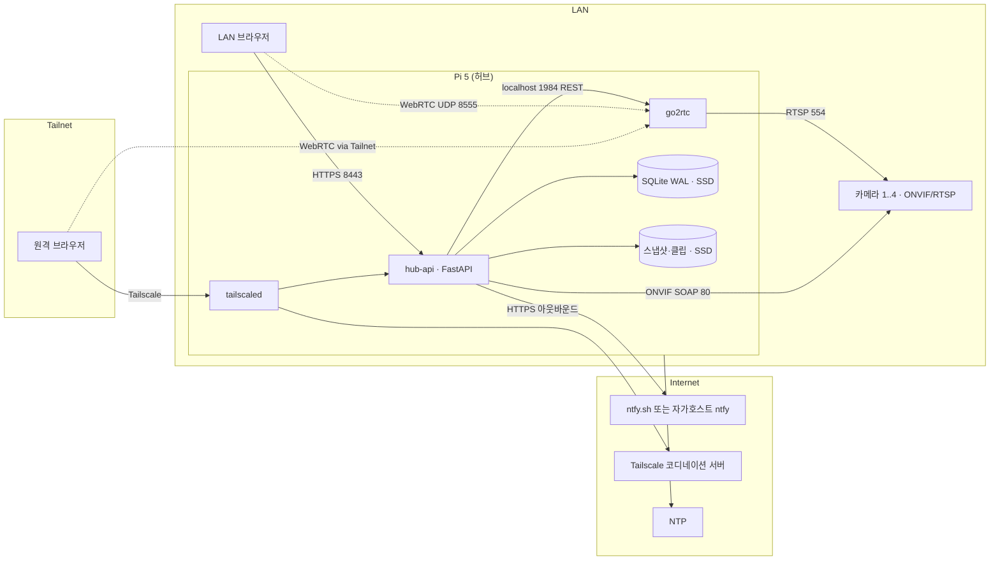

### 구현 접근 (난점 → 선택)
| 난점 | 선택 | 왜 |
|---|---|---|
| 브라우저에서 RTSP를 못 본다 | **go2rtc**가 RTSP를 받아 WebRTC(폴백 MSE)로 전달. 허브는 go2rtc REST(`/api/streams`)로 스트림을 등록·삭제 | 01 fit. 재인코딩 없음 → Pi 5의 H.264 HW 디코더 부재가 무관 |
| go2rtc를 직접 노출하면 인증 우회 | go2rtc는 `go2rtc.yaml`로 **api `127.0.0.1:1984` · rtsp 서버 비활성(`rtsp: listen: ""`, 기본 8554 무인증 재배포 차단) · webrtc `:8555`**만 연다. hub-api·go2rtc **둘 다 `network_mode: host`** — 같은 네트워크 네임스페이스라야 hub-api가 127.0.0.1:1984에 닿는다(브리지+host 혼용은 localhost가 달라 불가). 브라우저 WebRTC **시그널링(WS `/api/ws`)은 hub-api가 세션 검사 후 리버스 프록시**, WebRTC 미디어(DTLS-SRTP)는 go2rtc `:8555`로 직접. **MSE 폴백은 같은 WS로 fMP4가 흐르므로 hub-api가 릴레이** → MSE_MAX_STREAMS 상한 | 시그널링 없이는 미디어 세션이 열리지 않는다. 격리는 compose 네트워크가 아니라 **바인딩 주소**로 |
| PTZ는 카메라마다 SOAP 세부가 다르다 | **onvif-zeep-async**로 PTZ·Media·Device·Events(P2) 호출. 카메라별 `PTZConfiguration` 토큰을 등록 시 캐시 | 01 fit(Healthy, PTZ 지원) |
| 헬스 판정의 오탐 | 프로브 2종(ONVIF `GetSystemDateAndTime`(무인증) + RTSP `DESCRIBE` **자격증명 없이** — 401·200 모두 생존, Digest 해시도 내보내지 않음)을 **병렬로, 각 PROBE_TIMEOUT_S**, HEALTH_PROBE_INTERVAL_S마다. 상태 4종은 03 FR-009 정의(unknown/online/degraded/offline) — RTSP 연속 실패만 offline (최악 감지 55s). 허브 프로브는 go2rtc `/api` 생존 + **스트림 목록 대조(DB↔go2rtc) → 불일치 시 StreamManager.reconcile** — go2rtc는 REST로 넣은 스트림을 영속하지 않아 재시작 시 사라지기 때문 | 03 FR-009 · 단계 검토 #3·#6 |
| 알림 폭주·채널 장애 | 이벤트→알림 라우터가 ALERT_DEDUP_WINDOW_S 억제·그룹핑 후 로컬 큐(SQLite 테이블, ALERT_QUEUE_MAX)로 재전송 | 03 FR-010·017 |
| SD 마모 | DB·스냅샷·클립·**docker data-root(이미지·컨테이너·json-file 로그)**는 USB SSD `/data`, 호스트 `/var/log`는 log2ram, rootfs `noatime`. go2rtc는 영속 상태 없음 | 02 P1 · 최종 검토 #6 |
| 스냅샷 | 1순위 ONVIF `GetSnapshotUri`를 hub-api가 GET(Digest) → SSD. 폴백 go2rtc `/api/frame.jpeg`(단일 키프레임, INV-4 예외) | 카메라 CPU로 JPEG 생성, Pi 부담 0 |
| 프로세스 모델 | **docker compose 2서비스**(hub-api·go2rtc, 둘 다 host 네트워크; ntfy 자가호스트는 compose `profiles: [selfhost]`로 선택) + 호스트의 tailscaled·log2ram·HW watchdog. 생존은 **hub-api 내부 감시 태스크**(마지막 프로브 경과 > PROBE_STALE_FACTOR×HEALTH_PROBE_INTERVAL_S → 로그 후 `exit(1)`) + `restart: unless-stopped`. docker healthcheck(HEALTHCHECK_INTERVAL_S)는 unhealthy를 **표시만** 하고 재시작하지 않으며(Swarm 아님, 최종 검토 #1), systemd WatchdogSec는 컨테이너 프로세스에 전달되지 않는다 | 07 OTA = `compose pull` 롤백 용이 · 단계 검토 #1·#7 |

### 컴포넌트 구조
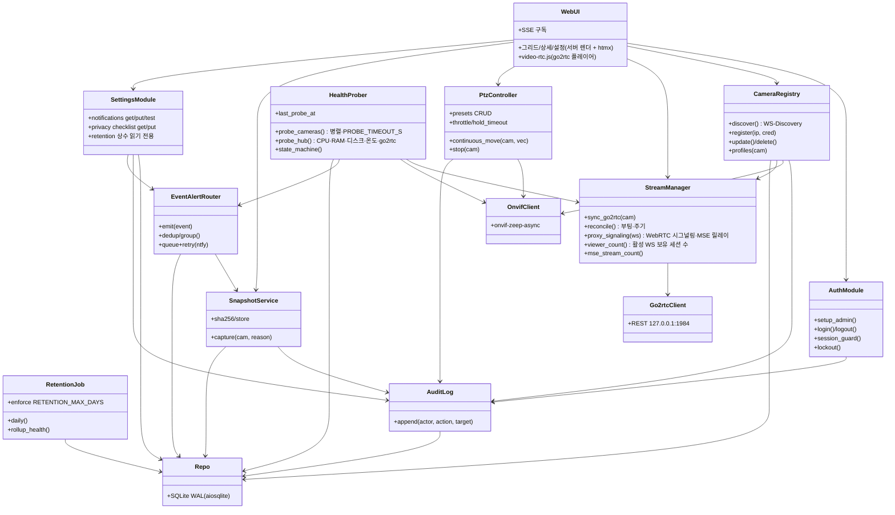

### 데이터 흐름

**① 카메라 등록 (FR-002·003)**
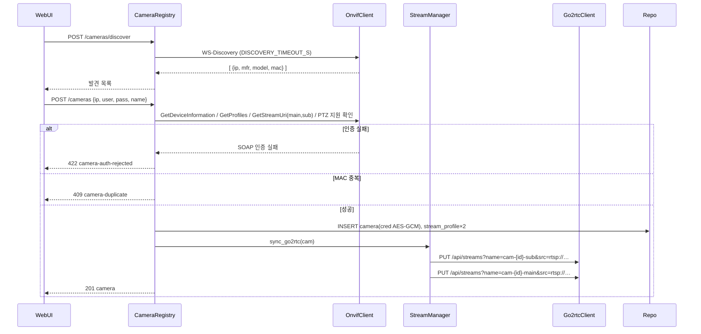

**② 라이브 시청 (FR-005·006)**
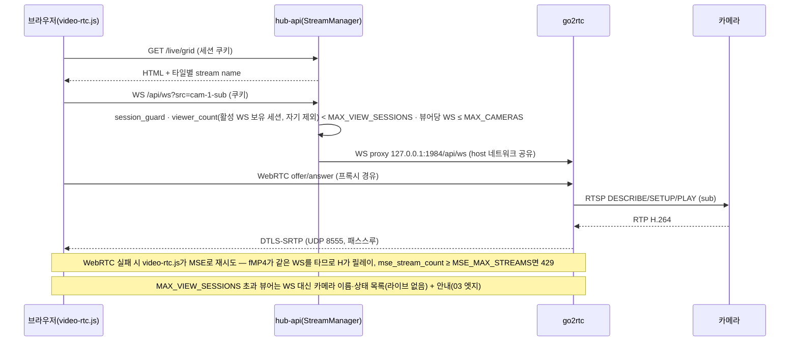

**③ 헬스 → offline → 알림 (FR-009·010·011·012·017)**
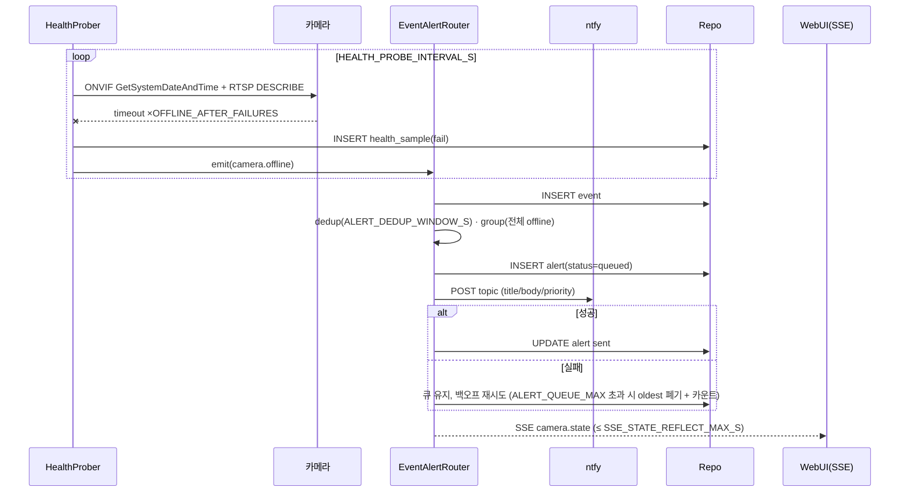

**④ PTZ (FR-007·008)** — 브라우저가 패드 press 시 `POST /cameras/{id}/ptz/move {pan,tilt,zoom}`를 PTZ_THROTTLE_MS마다 재전송(keepalive), release 시 `POST …/ptz/stop`. hub-api는 마지막 명령만 카메라에 `ContinuousMove(Timeout=PTZ_HOLD_TIMEOUT_MS)`로 전달하고, PTZ_HOLD_TIMEOUT_MS 동안 keepalive가 없으면 서버가 `Stop`을 보낸다. Timeout을 카메라에 함께 보내므로 **허브가 죽어도 카메라가 스스로 멈춘다**. 감사는 **누름(첫 move)·뗌(stop)·프리셋 단위**로 append — keepalive 재전송은 기록하지 않는다(초당 10행 SSD 쓰기 방지, 최종 검토 #12).

### 데이터 저장 (설계 결정 관련만 — 전체 스키마는 05)
- SQLite 파일 1개(`/data/hub.db`, WAL, `synchronous=NORMAL`), 쓰기는 hub-api 단일 프로세스. 헬스 샘플은 카메라당 HEALTH_PROBE_INTERVAL_S마다 1행 → MAX_CAMERAS × 86400 / HEALTH_PROBE_INTERVAL_S ≈ 1.4만 행/일(계산값), HEALTH_RAW_RETENTION_DAYS 보존 후 삭제(FR-015; 시간 요약은 P2).
- 파일: `/data/snapshots/{cam_id}/{ts}.jpg`, `/data/clips/{cam_id}/{event_id}.mp4`(P2). DB 행에 경로+SHA-256.
- 자격증명: `camera.cred_enc`(AES-256-GCM, 키는 `/etc/picam/master.key` 0600, 컨테이너에 read-only 마운트). go2rtc 스트림 소스 URL에는 평문이 들어가므로 go2rtc는 API를 localhost에만 열고 스트림은 REST로만 등록한다(메모리 상주, 디스크에 평문 URL 없음). `go2rtc.yaml`은 listen 설정만(자격증명 없음). **go2rtc는 영속 상태가 없으므로 재시작 시 StreamManager.reconcile이 DB에서 전부 재등록**한다.

## 검토한 대안 (ADR 요약 — 상세 근거는 01 fit·decision-log)
| ADR | 결정 | 대안 → 왜 아닌가 | 결과(트레이드오프) |
|---|---|---|---|
| ADR-1 스트림 엔진 | go2rtc 채택 | MediaMTX: ONVIF 소스 없음, 직렬 구성 시 드랍 보고 / 자체 구현(aiortc): 브라우저 호환표를 다시 밟음 | go2rtc 버전 업그레이드에 시그널링 API 호환을 따라가야 함(핀 고정) |
| ADR-2 제어층 | Python 3.12 FastAPI | Node(agsh/onvif): 라이선스·통계 미확인 / Go(use-go/onvif): 유지보수 미확인 | 메모리 ≈ 60~100MB(추론, 07에서 실측) |
| ADR-3 저장 | SQLite WAL on SSD | Postgres: 프로세스·RAM 과잉 / SD 위 SQLite: 마모 | 단일 writer 전제 — 멀티프로세스 전환 시 재검토 |
| ADR-4 원격 | Tailscale | Cloudflare Tunnel: 영상 제3자 경유 / 포트포워딩: 금지 | 뷰어 기기마다 클라이언트 필요 |
| ADR-5 시그널링 보호 | hub-api WS 리버스 프록시 + 세션 쿠키 | go2rtc 직접 노출: 인증 우회 / go2rtc 내장 basic auth: 쿠키 세션과 이중 관리 | WebRTC: 프록시 홉은 시그널링만(미디어 경로 없음). **MSE 폴백: fMP4가 같은 WS를 타므로 hub-api(uvicorn 워커 1)가 릴레이** — MSE_MAX_STREAMS × SUB_STREAM_MAX 비트레이트로 제한, 07 lab(T-048)에서 실측 |
| ADR-6 프로세스 | docker compose(hub-api·go2rtc 모두 host 네트워크) + 호스트 tailscaled | bare systemd 전부: 롤백이 파일 복사 / 전부 컨테이너(tailscale 포함): TUN 권한 복잡 / hub-api만 브리지: localhost 분리로 go2rtc API 접근 불가 | 이미지 크기·arm64 빌드 CI 필요. 네트워크 격리 없음 → 바인딩 주소·cap_drop으로 대체 |
| ADR-7 프론트 | 서버 렌더 + htmx + video-rtc.js | React SPA: 화면 3장에 빌드 체인 과잉 | 화면 5장 넘으면 재검토 |

## 위협모델

### ① 무엇을 만드는가 — DFD + trust boundary
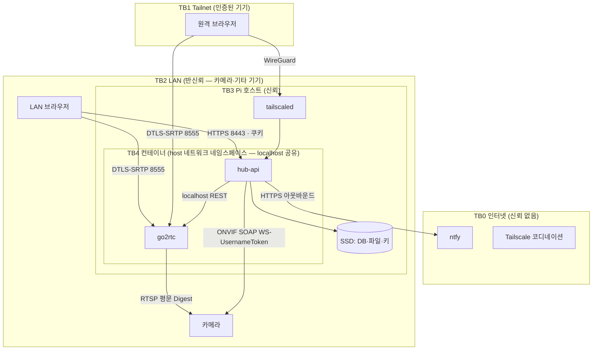

### ② 무엇이 잘못될 수 있는가 — STRIDE (경계·자산별, 해당없음도 근거)
| 자산/경계 | S | T | R | I | D | E |
|---|---|---|---|---|---|---|
| 단계 브라우저→hub-api (TB2/TB1→TB4) | 세션 쿠키 탈취·비밀번호 추측 | 요청 변조(CSRF로 PTZ·삭제) | 관리자가 "내가 안 지웠다" | 라이브·스냅샷 URL 무단 열람 | 로그인 폭주·WS 세션 고갈 | 해당없음(권한 1종 — 수직 상승 대상 없음), 단 미인증→인증 우회가 EoP에 해당 |
| 단계 WebRTC 미디어 (→go2rtc 8555) | 위조 ICE 후보로 세션 가로채기 | 해당없음(DTLS-SRTP 무결성) | 해당없음(미디어에 행위 없음) | 시그널링 없이 미디어 수신 | UDP 플러딩 | 해당없음 |
| 단계 go2rtc 리스너 (api 1984 localhost · rtsp 8554 **비활성** · webrtc 8555) (TB4) | 호스트 프로세스 위장 | 스트림 소스 URL 변조(다른 카메라로 바꿔치기) | 해당없음(hub-api만 호출) | 스트림 목록에 평문 자격증명 URL; **기본 RTSP 서버(8554)는 무인증 재배포 → 비활성 필수** | 해당없음(localhost) | 호스트 셸 획득 시 전권 — 호스트 보안에 종속 |
| 단계 hub-api↔카메라 ONVIF/RTSP (TB4→TB2) | 가짜 카메라(ARP 스푸핑)로 허브 자격증명 수집 | LAN 도청자가 RTSP/RTP 변조 | 해당없음 | **RTSP·ONVIF 평문 — LAN 도청 시 영상·자격증명 노출** | 카메라 응답 지연으로 프로브 스레드 고갈 | 카메라 펌웨어 취약점으로 허브 역공격 |
| 단계 SSD 데이터(DB·스냅샷·키) (TB3) | 해당없음 | 파일 변조·삭제 | 감사 로그 삭제 | SSD 물리 탈취 시 영상·자격증명 | 디스크 풀 | 컨테이너 탈출 → 키 파일 |
| 단계 알림 채널 ntfy (TB4→TB0) | 가짜 ntfy 서버(DNS 스푸핑) | 알림 내용 변조 | 해당없음 | **알림 본문에 카메라 이름·상태가 제3자 서버 경유**(ntfy.sh 사용 시) | 채널 다운으로 알림 유실 | 해당없음 |
| 단계 호스트 OS·SD·Docker (TB3) | 해당없음 | SD 이미지 변조(물리) | 해당없음 | **SD 위 `master.key`·`.env`(세션·서명 비밀) 평문** — 물리 탈취 시 노출(네트워크 경로는 INV-5로 없음) | 전원 차단·SD 마모·과열 | 컨테이너 권한 과다(`privileged`) |

### ③ 무엇을 할 것인가
| 위협 | 처리 | 대책 (구현 지점) |
|---|---|---|
| 단계-S 세션 탈취·추측 | Mitigate | argon2id, PASSWORD_MIN_LEN, **출발 IP 기준** LOGIN_LOCKOUT_FAILS/MIN + 지수 지연(계정 잠금이면 내부자가 유일한 운영자를 무한 잠글 수 있음 — 단계 검토 #11), 쿠키 `HttpOnly; Secure; SameSite=Strict`, SESSION_TTL_H, 자체 서명 TLS(설치 시 생성) + Tailscale 경로는 WireGuard |
| 단계-T CSRF | Mitigate | SameSite=Strict + 상태 변경은 커스텀 헤더 `X-Requested-With` 검사(htmx 기본) |
| 단계-R 부인 | Mitigate | AuditLog append-only(INV-6) — 로그인·PTZ·설정·삭제 |
| 단계-I 무단 열람 | Mitigate | 전 라우트 session_guard, 스냅샷은 서명 URL(만료 SESSION_TTL_H 이하), 디렉터리 리스팅 금지 |
| 단계-D 폭주 | Mitigate | 로그인 레이트리밋 LOGIN_RATE_PER_MIN(IP당), 뷰어 MAX_VIEW_SESSIONS · MSE MSE_MAX_STREAMS, uvicorn 워커 1 + 연결 상한 |
| 단계-E 인증 우회 | Mitigate | 프록시된 `/api/ws`를 포함한 모든 경로가 동일 guard 뒤. 06 계약 테스트 "쿠키 없이 401" |
| 단계-S/I 시그널링 우회 | Mitigate | go2rtc WebRTC는 시그널링 없이 세션을 만들 수 없음. ICE 서버 없음(LAN·Tailnet 직결) → 외부 STUN 미사용 |
| 단계-D UDP 플러딩 | Accept | LAN·Tailnet 한정 노출. 인터넷 노출 없음(INV-5). 잔여: LAN 내부자 |
| 단계-S/T/I go2rtc API | Mitigate | api `127.0.0.1:1984` 바인딩, hub-api만 호출, 스트림 이름은 hub가 결정 |
| 단계-I go2rtc RTSP 재배포 서버(8554) | **Eliminate** | `go2rtc.yaml` `rtsp: listen: ""`로 비활성. 06 계약 테스트 "8554·1984 외부 인터페이스에서 닫힘" |
| 단계-E 호스트 셸 | Transfer→호스트 보안 | SSH 키 전용·비밀번호 로그인 금지·자동 보안 업데이트(`unattended-upgrades`) — 07 |
| 단계-I **RTSP·ONVIF 평문** | **Accept(사유)** | 카메라 대부분 RTSPS/HTTPS 미지원(01). 완화: 카메라 전용 VLAN 권고(설정 체크리스트), 허브가 카메라 자격증명을 다른 용도로 재사용하지 않음, 카메라 비밀번호는 카메라별 고유 권고. 잔여: LAN 도청자 |
| 단계-S 가짜 카메라 | Mitigate(부분)+Accept | 등록·IP 변경 시 `GetDeviceInformation` 시리얼 대조(IP 변경 시 불일치 → 409 camera-identity-mismatch, 변경 거부). 주기 프로브는 `GetSystemDateAndTime`(무인증)과 **자격증명 없는 RTSP DESCRIBE**(401도 생존으로 간주)라 비밀번호도 Digest 해시도 유출 없음(최종 검토 #11). 등록 시 사용자가 고른 IP에 자격증명을 보내는 것은 불가피 → Accept(발견 목록의 제조사·MAC을 사용자가 확인) |
| 단계-D 프로브 고갈 | Mitigate | 프로브 타임아웃 PROBE_TIMEOUT_S, 카메라당 세마포어 1, asyncio 태스크 격리 |
| 단계-E 카메라→허브 역공격 | Mitigate | 허브는 카메라로부터 인바운드 연결을 받지 않음(P2 PullPoint도 허브가 폴링). zeep XML 파서 외부 엔티티 비활성 |
| 단계-T/R 파일·감사 변조 | Mitigate | 감사 테이블 UPDATE/DELETE 거부 트리거, 스냅샷 SHA-256, 일 1회 `integrity_check` |
| 단계-I 기기 물리 탈취 | Accept(사유) | 전체 디스크 암호화는 무인 부팅 시 키 보관 문제(TPM 없음)로 non-goal. **Pi를 통째로 가져가면 키(SD)와 데이터(SSD)가 함께 넘어가 자격증명·영상 모두 복호·열람 가능 — 완화가 아니라 수용이다.** 노출 창은 RETENTION_MAX_DAYS 이내 스냅샷·클립. go2rtc는 영속 상태 없음(평문 URL 디스크 잔존 없음). 물리 보안은 FR-019 체크리스트로 사용자에게 고지 |
| 단계-D 디스크 풀 | Mitigate | DISK_MIN_FREE_PCT 알림, DISK_STOP_PCT 생성 거부 + oldest-first 삭제(FR-014·엣지) |
| 단계-E 컨테이너 탈출 | Mitigate | non-root 사용자, `cap_drop: ALL`, read-only rootfs 컨테이너(+ tmpfs), `privileged` 금지. host 네트워크는 둘 다(권한 상승은 아님) |
| 단계-S/T 가짜 ntfy | Mitigate | HTTPS + 인증서 검증, 자가호스트면 Tailnet 내부 주소 |
| 단계-I 알림 본문 제3자 경유 | Mitigate | 본문에 영상·스냅샷 첨부 금지(링크만, 링크는 Tailnet 전용), 카메라 이름은 사용자가 정한 별칭. ntfy.sh 대신 자가호스트 권장(설정 화면 기본값은 자가호스트 URL 안내) |
| 단계-D 채널 다운 | Mitigate | 로컬 큐 ALERT_QUEUE_MAX + 백오프 재전송(FR-017) |
| 단계-T SD 물리 변조 | Accept | 물리 접근 가능한 공격자는 범위 밖(1인 소규모 사업장) |
| 단계-D 전원·마모·과열 | Mitigate | HW watchdog HW_WATCHDOG_S, 내부 감시 태스크 `exit(1)`(프로브 태스크가 죽으면 UI만 살아 알림이 무음 중단되는 것을 잡는다) + `restart: unless-stopped`, docker healthcheck는 관측용, log2ram, SSD, 온도 프로브(FR-009) + HUB_TEMP_MAX_C 초과 이벤트 |
| 단계-E 권한 과다 | Mitigate | 위 단계-E와 동일 compose 하드닝 |
| 단계-I SD 위 비밀 평문 | Accept(사유) | 단계-I와 같은 물리 탈취 시나리오. TPM 없는 무인 부팅에서 키를 숨길 곳이 없다. 완화: `.env`·`master.key` 0600·root 소유, 비밀은 install.sh가 생성(재사용 없음), 탈취 인지 시 세션·서명 비밀 회전 절차(07 RB) |

### ④ 충분한가 — 상위 리스크 3 재검토
1. **단계-I RTSP 평문(Accept)** — 가장 큰 잔여 리스크. 소규모 사업장 LAN에 손님 Wi-Fi가 같은 세그먼트면 도청 가능. 대책: 설치 체크리스트에 "카메라·허브 전용 VLAN/별도 SSID" 필수 항목, 07 런북에 포함. 재검토 조건: RTSPS 지원 카메라가 대상 목록에 들어오면 우선 사용.
2. **단계 인증 계층 단일 실패점** — 관리자 1계정·세션 쿠키. 대책: 자체 서명 TLS 강제, 잠금, Tailscale 경로에서는 Tailscale ACL로 2중. 잔여: 관리자 PC 자체 감염.
3. **단계-I 기기 물리 탈취** — Pi 통째 탈취 시 자격증명·영상 전부 열람 가능(수용). 대책: 보관 상한(INV-2)로 노출 창 제한, 카메라 비밀번호는 카메라별 고유 권고(허브 탈취가 다른 시스템으로 번지지 않게), 물리 보안 고지(FR-019). 잔여: 물리 탈취.

잔여 리스크 총괄: LAN 내부자 도청·물리 탈취·관리자 단말 감염 — 전부 "소규모 사업장 1인 운영" 전제에서 Accept, 재검토 조건을 위에 명시.

## Cross-cutting
- **관측성**: hub-api가 구조화 JSON 로그(stdout → docker json-file, log2ram 경유 로테이션) + `GET /api/hub/status`(E-22, JSON)로 카메라 상태·프로브 지연·뷰어 수·알림 큐 길이·CPU/디스크/온도. Prometheus `/metrics`는 소비자 없음(1인 운영) → P2. 상세는 07.
- **프라이버시**: 영상은 Pi 밖으로 나가지 않는다(Tailnet 제외). 알림 본문에 영상 없음. 보관 상한 RETENTION_MAX_DAYS 하드코딩(INV-2). 오디오 없음(FR-018). 로그에 자격증명·RTSP URL 마스킹(INV-3). 운영자 체크리스트(FR-019)가 §25 안내판·운영방침을 상기시킨다.

# API 계약 & 데이터 스키마 — PiCam Hub
버전: v1.2

## 근거 (단계 진입 사전조사 — 추가 검색 0회)
- **정량** — go2rtc 시그널링은 단일 WS `/api/ws?src=<name>` (README, 2026-09-07) → 허브는 이 경로 하나만 프록시하면 된다.
- **정성** — Frigate 사용자 불만 "오탐 피로"(01) → MVP 알림 유형을 상태 변화(offline/online/disk)로 한정, 모션은 P2로 분리.
- **사용자 영향** — 에러 응답의 `detail`이 그대로 화면 문구(해요체, T-09)가 되도록 서버가 사용자 문장을 내려보낸다(UX-02 복구 CTA 포함).

## 규약 (전 엔드포인트 공통)
- **베이스**: `https://<hub>:8443/api`. HTML 화면은 `/`·`/cameras/{id}`·`/settings`(서버 렌더, 같은 세션).
- **인증**: 세션 쿠키 `picam_session` (HttpOnly·Secure·SameSite=Strict, SESSION_TTL_H). `E-01`·`E-02`·`E-20`·`E-25`(서명 URL) 외 전부 쿠키 필수 → 없으면 `401 session-required`. 상태 변경 요청은 `X-Requested-With: XMLHttpRequest` 헤더 필수 — 없으면 `403 csrf-header-required`(04 단계-T).
- **에러 포맷**: RFC 9457 `application/problem+json` — `type`(`https://picam.local/problems/<slug>`), `title`, `status`, `detail`(사용자 문장·해요체), `instance`, 선택 `errors[]`(필드별). 스택트레이스·내부 예외 문구 금지 (Zalando #176·#177).
- **버저닝**: URL에 버전 없음(Zalando #115). `Accept: application/vnd.picam.v1+json` 생략 시 v1. 스펙 파일 semver(`openapi.yaml` 1.0.0). (참고자료)은 `/api/v1/`을 권하나 stage-templates 규약이 우선(decision-log).
- **페이지네이션**: 목록은 커서 `?cursor=<opaque>&limit=<1..PAGE_LIMIT_MAX>`(기본 PAGE_LIMIT_DEFAULT), 응답 `meta.next_cursor`(없으면 null). offset 없음 (Zalando #160). 카메라 목록(≤ MAX_CAMERAS)만 예외로 전체 반환.
- **멱등성**: 부작용 있는 POST(`E-06`·`E-14`·`E-23`)는 `Idempotency-Key`(클라 UUID) 필수. 서버는 IDEMPOTENCY_TTL_H 보관(`idempotency_key` 테이블), 같은 키 재시도엔 최초 응답을 그대로 재생, 같은 키·다른 본문은 `422 idempotency-key-reused` (Stripe 방식). PTZ `move/stop`은 본질적으로 멱등(마지막 명령 승리)이라 키 없음.
- **레이트리밋**: 로그인 IP당 LOGIN_RATE_PER_MIN(`429 rate-limited`, `Retry-After`), PTZ move 카메라당 1/PTZ_THROTTLE_MS(초과분은 병합 — 에러 아님), 그 외 세션당 API_RATE_PER_MIN.
- **네이밍**: 경로 kebab-case·복수 명사, JSON 필드 snake_case, 시각 UTC ISO-8601(ms), ID UUIDv7 문자열. 권한 스코프는 `hub:*:*` 단일(관리자 1종) — 스코프 표기는 미래 호환용으로만 남긴다.
- **응답 봉투**: 단건 `{ "data": {...} }`, 목록 `{ "data": [...], "meta": {...} }`.

## 문제 유형 (RFC 9457 `type` slug)
| slug | status | 언제 | detail 예 |
|---|---|---|---|
| validation-failed | 422 | 스키마 위반 (`errors[]` 동봉) | "이름은 1~40자로 적어 주세요" |
| session-required | 401 | 쿠키 없음·만료 | "다시 로그인해 주세요" |
| csrf-header-required | 403 | 상태 변경 요청에 `X-Requested-With` 없음 | "요청을 확인할 수 없어요 — 화면을 새로 고쳐 주세요" |
| auth-invalid | 401 | 비밀번호 불일치 | "비밀번호가 맞지 않아요" |
| auth-locked | 429 | 같은 출발 IP에서 LOGIN_LOCKOUT_FAILS회 실패 (`Retry-After` = LOGIN_LOCKOUT_MIN, IP 단위 — 계정 잠금 아님) | "잠시 후 다시 시도해 주세요 ({LOGIN_LOCKOUT_MIN}분)" |
| setup-already-done | 409 | 관리자 이미 존재 | — |
| camera-not-found | 404 | id 없음 | — |
| camera-duplicate | 409 | 같은 MAC (INV-1) | "이미 등록된 카메라예요 — 기존 항목의 IP를 바꿀까요?" |
| camera-limit-reached | 409 | MAX_CAMERAS 초과 | "카메라는 {MAX_CAMERAS}대까지 등록할 수 있어요" |
| camera-auth-rejected | 422 | 카메라가 ONVIF 자격증명 거부 | "카메라가 자격증명을 거부했어요" |
| camera-unreachable | 504 | ONVIF/RTSP 타임아웃 | "카메라에 연결할 수 없어요 — IP와 전원을 확인해 주세요" |
| camera-identity-mismatch | 409 | IP 변경 시 새 주소의 GetDeviceInformation 시리얼이 저장값과 다름 | "그 주소의 카메라는 등록된 카메라가 아니에요" |
| ptz-unsupported | 409 | `ptz_supported=false` | "이 카메라는 회전을 지원하지 않아요" |
| preset-not-found | 404 | 토큰 없음 | — |
| view-sessions-exceeded | 429 | 활성 스트림을 가진 서로 다른 로그인 세션(뷰어)이 MAX_VIEW_SESSIONS | "동시 시청 {MAX_VIEW_SESSIONS}명까지예요" |
| mse-streams-exceeded | 429 | 허브 릴레이 MSE 스트림이 MSE_MAX_STREAMS | "이 브라우저 모드로는 더 볼 수 없어요 — WebRTC를 지원하는 브라우저를 써 주세요" |
| storage-exhausted | 507 | 디스크 잔여 < DISK_STOP_PCT | "저장 공간이 부족해요 — 오래된 스냅샷을 정리하고 있어요" |
| notify-channel-failed | 502 | ntfy 응답 실패 (테스트 발송) | "알림 서버가 응답하지 않아요" |
| idempotency-key-reused | 422 | 같은 키·다른 본문 | — |
| rate-limited | 429 | 레이트리밋 | — |

## 엔드포인트 표
| ID | 메서드 경로 | 요청(핵심 필드) | 응답 | 주요 에러(type) | 스코프 |
|---|---|---|---|---|---|
| E-01 | POST /api/setup | `{password}` (PASSWORD_MIN_LEN) | 201 + Set-Cookie | validation-failed · setup-already-done | 공개(최초 1회) |
| E-02 | POST /api/auth/login | `{password}` | 204 + Set-Cookie | auth-invalid · auth-locked · rate-limited | 공개 |
| E-03 | POST /api/auth/logout | — | 204 (쿠키 폐기) | session-required | hub |
| E-04 | GET /api/auth/session | — | 200 `{expires_at}` | session-required | hub |
| E-05 | POST /api/cameras/discover | — | 200 `data:[{ip,port,xaddr,manufacturer,model,mac,already_registered}]` (DISCOVERY_TIMEOUT_S 대기) | — | hub |
| E-06 | POST /api/cameras | `Idempotency-Key`; `{ip,port=80,username,password,name}` | 201 `Location` + camera(cred 제외) | validation-failed · camera-duplicate · camera-limit-reached · camera-auth-rejected · camera-unreachable | hub |
| E-07 | GET /api/cameras | — | 200 `data:[camera + state]` (전체) | — | hub |
| E-08 | GET /api/cameras/{id} | — | 200 camera `{id,name,ip,mac,manufacturer,model,ptz_supported,state,last_seen_at,profiles:[{role,codec,width,height,bitrate_kbps,stream_name}]}` | camera-not-found | hub |
| E-09 | PATCH /api/cameras/{id} | `{name?,ip?,username?,password?}` (ip 변경 시 GetDeviceInformation 시리얼 대조) | 200 camera | validation-failed · camera-auth-rejected · camera-unreachable · camera-identity-mismatch | hub |
| E-10 | DELETE /api/cameras/{id} | — | 204 (스트림·프로브·프리셋·스냅샷 정리) | camera-not-found | hub |
| E-11 | POST /api/cameras/{id}/ptz/move | `{pan,tilt,zoom}` 각 -1.0..1.0 | 202 `{applied_at}` (PTZ_THROTTLE_MS 병합; ContinuousMove에 Timeout=PTZ_HOLD_TIMEOUT_MS 동봉 + 허브 hold 타이머 Stop) | ptz-unsupported · camera-unreachable · validation-failed | hub |
| E-12 | POST /api/cameras/{id}/ptz/stop | — | 202 | ptz-unsupported | hub |
| E-13 | GET /api/cameras/{id}/presets | — | 200 `data:[{token,name,updated_at}]` | ptz-unsupported | hub |
| E-14 | POST /api/cameras/{id}/presets | `Idempotency-Key`; `{name}` (현재 위치 저장) | 201 preset | ptz-unsupported · validation-failed | hub |
| E-15 | POST /api/cameras/{id}/presets/{token}/goto | — | 202 | preset-not-found | hub |
| E-16 | PATCH /api/cameras/{id}/presets/{token} | `{name}` | 200 preset | preset-not-found | hub |
| E-17 | DELETE /api/cameras/{id}/presets/{token} | — | 204 (카메라 RemovePreset + 허브 행 삭제) | preset-not-found | hub |
| E-18 | GET /api/ws?src=cam-{id}-{sub\|main} (WebSocket) | 쿠키 | 101 → go2rtc `127.0.0.1:1984/api/ws` 프록시 (WebRTC 시그널링; MSE 폴백은 fMP4를 이 WS로 릴레이). **오디오 차단(FR-018)**: offer SDP의 `m=audio` 제거, MSE 코덱 요청에서 오디오 코덱(mp4a·opus) 제거 — 제거 후 비디오가 없으면 400 validation-failed | session-required · view-sessions-exceeded · mse-streams-exceeded · camera-not-found | hub |
| E-19 | GET /api/events/stream (SSE) | 쿠키, `Last-Event-ID` | `text/event-stream` 이벤트 `camera.state`·`hub.state`·`alert` (≤ SSE_STATE_REFLECT_MAX_S) | session-required | hub |
| E-20 | GET /api/health | — | 200 `{status:"ok",db:"ok",go2rtc:"ok",last_probe_age_s}` / 503 (db 실패·go2rtc 무응답·`last_probe_age_s` > 2×HEALTH_PROBE_INTERVAL_S — docker healthcheck용, 인증 없음, 정보 최소) | — | 공개(localhost·LAN) |
| E-21 | GET /api/cameras/{id}/health?range=24h\|7d\|90d | — | 200 `data:[{ts,online,probe_ms}]`(raw, MVP) 또는 `[{hour,uptime_pct,p95_probe_ms}]`(rollup, P2) | camera-not-found | hub |
| E-22 | GET /api/hub/status | — | 200 `{cpu_pct_5m,ram_free_mb,disk_free_pct,temp_c,viewers,mse_streams,alert_queue_len,last_probe_age_s,version}` | — | hub |
| E-23 | POST /api/cameras/{id}/snapshots | `Idempotency-Key`; `{reason:"manual"}` | 201 `{id,taken_at,sha256,url}` (`url`=E-25 서명 URL) | camera-unreachable · storage-exhausted | hub |
| E-24 | GET /api/cameras/{id}/snapshots?cursor&limit | — | 200 목록 `{id,taken_at,reason,sha256,url}` | camera-not-found | hub |
| E-25 | GET /api/snapshots/{id}/file?exp=&sig= | HMAC 서명·만료 | 200 image/jpeg | 401 session-required(서명 불일치·만료) · 404 | 서명 |
| E-26 | GET /api/events?cursor&limit&camera_id&type | — | 200 목록 `{id,ts,type,camera_id,severity,payload}` | validation-failed | hub |
| E-27 | GET /api/alerts?cursor&limit&status=queued\|sent\|dropped | — | 200 목록 `{id,primary_event_id,event_ids[],channel,status,attempts,sent_at}` + `meta.dropped_total` | — | hub |
| E-28 | GET /api/settings/notifications | — | 200 `{ntfy_url,topic,token_set}` (토큰 값 미노출) | — | hub |
| E-29 | PUT /api/settings/notifications | `{ntfy_url,topic,token?}` | 200 | validation-failed | hub |
| E-30 | POST /api/settings/notifications/test | — | 202 `{delivered_at}` | notify-channel-failed | hub |
| E-31 | GET /api/settings/privacy | — | 200 `{retention:{snapshot_days,clip_days,max_days},audio_enabled:false,checklist:{signage_installed,policy_published,retention_notice_posted,officer_name}}` (체크리스트 4항목 = FR-019) | — | hub |
| E-32 | PUT /api/settings/privacy | `{checklist:{signage_installed,policy_published,retention_notice_posted,officer_name}}` (보관·오디오는 읽기 전용) | 200 | validation-failed | hub |
| E-33 | GET /api/audit?cursor&limit | — | 200 목록 `{id,ts,actor,action,target,detail}` | — | hub |
| E-34 | GET /api/events/{id}/clip (P2) | — | 200 video/mp4 (서명 URL) | 404 | hub |
| E-35 | DELETE /api/events/{id}/clip (P2) | — | 204 + 감사 | 404 | hub |
| E-36 | PUT /api/settings/notifications/telegram (P2) | `{bot_token,chat_id}` | 200 | validation-failed | hub |

### 내부 작업 (HTTP 아님 — 커버리지 매핑에 등장)
| ID | 작업 | 주기·트리거 | 담당 FR |
|---|---|---|---|
| J-01 | HealthProber: 카메라(ONVIF GetSystemDateAndTime + **자격증명 없는** RTSP DESCRIBE(401·200 = 생존), 병렬·PROBE_TIMEOUT_S; 상태 unknown/online/degraded/offline은 03 FR-009 정의)·허브(CPU/RAM/디스크/온도 + go2rtc 생존 + 스트림 목록 대조 → 불일치 시 J-04 reconcile) 프로브 → `health_sample` → 상태 기계 → 이벤트(`hub.stream_resynced` 포함) | HEALTH_PROBE_INTERVAL_S | FR-009 · FR-014 |
| J-02 | EventAlertRouter: 이벤트 → 중복 억제(ALERT_DEDUP_WINDOW_S)·그룹핑 → `alert(queued)` → ntfy POST → sent / 재시도 백오프 / ALERT_QUEUE_MAX 초과 시 oldest dropped + `alert.dropped` 이벤트 | 이벤트 즉시 + 재시도 루프 ALERT_RETRY_INTERVAL_S | FR-010 · FR-017 |
| J-03 | RetentionJob: SNAPSHOT/HEALTH_RAW/EVENT/CLIP 보존 초과 파기(감사 로그는 제외 — INV-6), RETENTION_MAX_DAYS 하드 상한 검사(INV-2), `PRAGMA integrity_check`. 헬스 rollup은 P2 | 매일 RETENTION_JOB_TIME | FR-015 |
| J-04 | StreamSync/reconcile: 카메라 등록·수정·삭제 시 go2rtc `PUT/DELETE /api/streams` (소스 = 카메라 RTSP URL 그대로, 트랜스코딩 옵션 없음 — INV-4; 오디오 제외는 소스가 아니라 E-18 프록시 필터가 담당) + **부팅 시·J-01이 불일치를 볼 때 DB↔`/api/streams` 전체 재동기**(go2rtc는 REST 스트림을 영속하지 않음) | E-06·E-09·E-10 후 + 부팅 + J-01 트리거 | FR-005 · FR-009 |
| J-05 | SnapshotService: 복구 이벤트(`camera.online`) 시 자동 스냅샷 (1순위 GetSnapshotUri, 폴백 go2rtc frame.jpeg) | 이벤트 | FR-011 |
| J-06 | PTZ hold 타이머: 마지막 move 후 PTZ_HOLD_TIMEOUT_MS 내 keepalive 없으면 Stop | 타이머 | FR-007 |

## OpenAPI 스케치 (핵심 3개만 — 전문은 구현 단계)
```yaml
openapi: 3.1.0
info: { title: PiCam Hub API, version: 1.0.0 }
components:
  schemas:
    Problem:
      type: object
      required: [type, title, status]
      properties:
        type: { type: string, format: uri, example: "https://picam.local/problems/camera-duplicate" }
        title: { type: string }
        status: { type: integer }
        detail: { type: string, description: "사용자에게 그대로 보여 주는 해요체 문장" }
        instance: { type: string }
        errors: { type: array, items: { type: object, properties: { field: {type: string}, message: {type: string} } } }
    Camera:
      type: object
      required: [id, name, ip, mac, ptz_supported, state]
      properties:
        id: { type: string, format: uuid }
        name: { type: string, maxLength: 40 }
        ip: { type: string, format: ipv4 }
        mac: { type: string, pattern: "^([0-9A-F]{2}:){5}[0-9A-F]{2}$" }
        manufacturer: { type: string }
        model: { type: string }
        ptz_supported: { type: boolean }
        state: { type: string, enum: [online, degraded, offline, unknown] }
        last_seen_at: { type: string, format: date-time }
        profiles:
          type: array
          items:
            type: object
            properties:
              role: { type: string, enum: [main, sub] }
              codec: { type: string, enum: [H264, H265] }
              width: { type: integer }
              height: { type: integer }
              bitrate_kbps: { type: integer }
              stream_name: { type: string, example: "cam-0193b2e0-sub" }
    CameraCreate:
      type: object
      required: [ip, username, password, name]
      properties:
        ip: { type: string, format: ipv4 }
        port: { type: integer, default: 80 }
        username: { type: string, maxLength: 64 }
        password: { type: string, maxLength: 128, writeOnly: true }
        name: { type: string, minLength: 1, maxLength: 40 }
    PtzMove:
      type: object
      required: [pan, tilt, zoom]
      properties:
        pan: { type: number, minimum: -1, maximum: 1 }
        tilt: { type: number, minimum: -1, maximum: 1 }
        zoom: { type: number, minimum: -1, maximum: 1 }
paths:
  /api/cameras:
    post:
      parameters: [{ name: Idempotency-Key, in: header, required: true, schema: { type: string, format: uuid } }]
      requestBody: { content: { application/json: { schema: { $ref: "#/components/schemas/CameraCreate" } } } }
      responses:
        "201": { headers: { Location: { schema: { type: string } } }, content: { application/json: { schema: { type: object, properties: { data: { $ref: "#/components/schemas/Camera" } } } } } }
        "409": { content: { application/problem+json: { schema: { $ref: "#/components/schemas/Problem" } } } }
        "422": { content: { application/problem+json: { schema: { $ref: "#/components/schemas/Problem" } } } }
        "504": { content: { application/problem+json: { schema: { $ref: "#/components/schemas/Problem" } } } }
  /api/cameras/{id}/ptz/move:
    post:
      requestBody: { content: { application/json: { schema: { $ref: "#/components/schemas/PtzMove" } } } }
      responses:
        "202": { content: { application/json: { schema: { type: object, properties: { applied_at: { type: string, format: date-time } } } } } }
        "409": { description: ptz-unsupported }
  /api/cameras/{id}/snapshots:
    post:
      parameters: [{ name: Idempotency-Key, in: header, required: true, schema: { type: string, format: uuid } }]
      responses:
        "201": { content: { application/json: { schema: { type: object, properties: { data: { type: object, properties: { id: {type: string}, taken_at: {type: string}, sha256: {type: string}, url: {type: string} } } } } } } }
        "507": { description: storage-exhausted }
```

## ERD
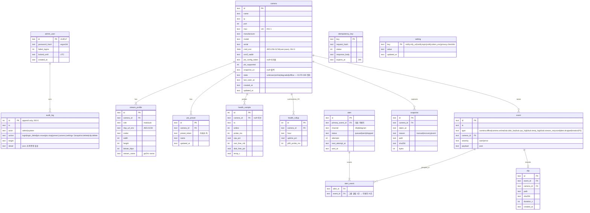
소프트삭제 없음 — 카메라 삭제는 하드 삭제 + CASCADE(프로파일·프리셋·헬스·스냅샷 파일), 이벤트·감사는 `camera_id`를 유지하되 이름은 `payload`/`detail`에 스냅샷으로 남긴다.

## 데이터 규칙
- 식별자: UUIDv7 문자열(시간순 정렬 가능). 헬스·감사·롤업만 INTEGER autoincrement(쓰기량 큼).
- 시각: 저장·API 모두 UTC ISO-8601 ms(`2026-09-07T01:41:07.123Z`). 화면에서만 로컬(KST) 변환.
- 비밀: `cred_enc`·`rtsp_url_enc`·`notify.token_enc`는 AES-256-GCM(nonce 12B 앞에 붙임), 키는 `/etc/picam/master.key`. API 응답·로그·감사에 복호값 금지(INV-3).
- 보존(03 상수): snapshot SNAPSHOT_RETENTION_DAYS · clip CLIP_RETENTION_DAYS · health_sample HEALTH_RAW_RETENTION_DAYS · health_rollup HEALTH_ROLLUP_RETENTION_DAYS(P2) · event EVENT_RETENTION_DAYS · audit_log 무기한(INV-6) · idempotency_key IDEMPOTENCY_TTL_H. 어떤 스냅샷·클립도 RETENTION_MAX_DAYS 초과 금지(INV-2, J-03이 매일 검증).
- 인덱스: `health_sample(camera_id, ts)`, `event(ts)`, `event(camera_id, ts)`, `alert(status, next_attempt_at)`, `alert_event(event_id)`, `snapshot(camera_id, taken_at)`, `audit_log(ts)`.
- 제약: `camera.mac UNIQUE`, `stream_profile(camera_id, role) UNIQUE`, `ptz_preset(camera_id, preset_token) UNIQUE`, `audit_log` BEFORE UPDATE/DELETE 트리거 → `RAISE(ABORT)`.
- SQLite: `journal_mode=WAL`, `synchronous=NORMAL`, `busy_timeout=5000`, 쓰기는 hub-api 단일 프로세스.

## 커버리지 매핑 (P0·P1 매핑 0건 = 결함)
| FR-ID | 우선순위 | 담당 엔드포인트/작업 |
|---|---|---|
| FR-001 | P0 | E-01 · E-02 · E-03 · E-04 |
| FR-002 | P0 | E-05 |
| FR-003 | P0 | E-06 · J-04 |
| FR-004 | P0 | E-07 · E-09 · E-10 · J-04 |
| FR-005 | P0 | E-07(stream_name) · E-18 · J-04 |
| FR-006 | P0 | E-08 · E-13 · E-18(main) |
| FR-007 | P0 | E-11 · E-12 · J-06 |
| FR-008 | P0 | E-13 · E-14 · E-15 · E-16 · E-17 |
| FR-009 | P0 | J-01 · E-21 · E-22 |
| FR-010 | P0 | J-02(alert_event 그룹핑) · E-26 · E-27 |
| FR-011 | P0 | E-23 · E-24 · E-25 · J-05 |
| FR-012 | P0 | E-19 |
| FR-013 | P1 | E-28 · E-29 · E-30 |
| FR-014 | P1 | J-01 · E-22 · J-02 |
| FR-015 | P1 | J-03 · E-31(값 표시) |
| FR-016 | P1 | E-33 (기록은 E-02·E-09·E-10·E-11·E-12·E-14~E-17·E-29·E-32·E-35 처리 중 append) |
| FR-017 | P1 | J-02 · E-27 |
| FR-018 | P1 | E-18(프록시 SDP/MSE 오디오 필터) · E-31(`audio_enabled:false`) |
| FR-019 | P1 | E-31 · E-32 |
| FR-020 | P1 | E-08(`ptz_supported`) · E-11~E-14(ptz-unsupported) |
| FR-021 | P2 | E-21(rollup) |
| FR-022 | P2 | J-01 확장(PullPoint 폴링) · E-26 |
| FR-023 | P2 | J-02 확장 · E-34 |
| FR-024 | P2 | E-26 · E-34 · E-35 |
| FR-025 | P2 | E-36 |
| FR-026 | P2 | E-08(`profiles`) |

# 테스트 설계 — PiCam Hub
버전: v1.2

## 근거 (단계 진입 사전조사 — 추가 검색 0회)
- **정량** — 03 SC 10개 중 실기기 없이 못 재는 것 5개(SC-001·002·005·006·007) → "lab" 레이어를 별도로 두고 CI는 시뮬레이터로 나머지를 돈다.
- **정성** — Frigate 커뮤니티 "Pi 4에서 5대 풀해상도 시 load 20+ 급등"(01) → 부하 시나리오(SC-005)는 카메라 4대·세션 3으로 상한 조건에서 잰다.
- **사용자 영향** — 06의 실패 경로 시나리오가 03 엣지케이스 문구(해요체·CTA)를 그대로 단언해 UX-02(막다른 에러 0)를 코드로 고정.

## 원칙
- AC는 개발 시작 전에 존재한다. 각 시나리오는 처음엔 반드시 실패해야 한다(RED 게이트, (참고자료)). RED 확인 후에만 구현.
- 피라미드: unit 다수 → integration(SQLite 임시 파일 + go2rtc 실바이너리 + 카메라 시뮬레이터) → contract(05 OpenAPI 대상) → E2E(Playwright, compose 스택) 최소 → **lab**(실 Pi + 실 카메라, 수동 체크리스트). 목표 비율 ≈ 65/20/10/5(+lab).
- "가능한 한 아래층으로" — 아래층에서 검증한 것을 위층에서 반복하지 않는다(Fowler).
- 커버리지는 **리스크 기반**((참고자료)의 80% 일률 대신): P0 경로·INV 불변식·위협모델 상위 3(단계-I·단계·단계-I) 관련 코드 ≥ 90% 분기, 그 외 ≥ 60% 라인.
- flaky 정책((참고자료)): 타임아웃 대기 금지 → SSE/응답 대기, `--repeat-each=10` 통과 후 머지, 격리 시 `test.fixme(이슈 번호)`.

## 테스트 인프라 (시뮬레이터)
| 구성 | 역할 | 비고 |
|---|---|---|
| `sim-camera` 컨테이너 | ONVIF SOAP 스텁(FastAPI): WS-Discovery 응답, GetDeviceInformation/GetProfiles/GetStreamUri/GetSnapshotUri/PTZ ContinuousMove·Stop·Presets, 자격증명 검증, 시리얼·MAC 설정 가능, `ptz_supported` 토글, 지연·타임아웃 주입 | 실카메라 대체. 명령 수신 로그를 테스트가 읽음 |
| `sim-rtsp` | ffmpeg `testsrc` → MediaMTX RTSP 퍼블리시(H.264 720p 1.5Mbps, 오디오 없음/있음 선택) | RTSP DESCRIBE·PLAY 대상. 테스트 중 kill/restart로 끊김 재현 |
| `sim-ntfy` | ntfy 공식 이미지 또는 HTTP 스텁(수신 기록·실패 주입) | 알림 도달·재전송 검증 |
| go2rtc | 실바이너리(버전 핀) | 시그널링 프록시·스트림 등록 검증 |
| 시계 | `freezegun`(단위) / 컨테이너 `faketime`(보존 작업) | 보존·잠금·만료 |

## 수용 기준 → 시나리오 변환표
| ID | SC/FR | Gherkin (Given/When/Then) | 레이어 | 데이터/목킹 |
|---|---|---|---|---|
| T-001 | FR-001 · SC-010 | Given 관리자 없음, When `POST /api/setup` 비밀번호 PASSWORD_MIN_LEN-1자, Then 422 validation-failed; PASSWORD_MIN_LEN자면 201 + 쿠키 `HttpOnly; Secure; SameSite=Strict` | integration | 임시 DB |
| T-002 | FR-001 · SC-010 | Given 관리자 있음, When 같은 IP에서 잘못된 비밀번호 LOGIN_LOCKOUT_FAILS회, Then 다음 시도는 429 auth-locked + `Retry-After`=LOGIN_LOCKOUT_MIN×60, 감사 `login_failed` LOGIN_LOCKOUT_FAILS행; **다른 IP에서는 정상 로그인 가능**(자기 DoS 방지), 실패 응답 지연이 회차마다 증가 | integration | freezegun · X-Forwarded 없이 소켓 IP |
| T-003 | FR-001 | Given 세션 발급 SESSION_TTL_H 전, When 시각을 TTL+1분 뒤로, Then `GET /api/auth/session` 401 session-required | unit | freezegun |
| T-004 | FR-001 · 단계-T | Given 유효 세션, When `X-Requested-With` 없이 `DELETE /api/cameras/{id}`, Then 403 csrf-header-required | integration | — |
| T-005 | FR-002 | Given sim-camera 2대 응답, When `POST /api/cameras/discover`, Then 200 목록 2건(ip·mac·model), 소요 ≤ DISCOVERY_TIMEOUT_S+1s | integration | sim-camera ×2 |
| T-006 | FR-002 | Given 1대는 이미 등록, When discover, Then 그 항목 `already_registered=true` | integration | — |
| T-007 | FR-003 · INV-1 | Given 미등록, When 올바른 자격증명으로 `POST /api/cameras`, Then 201 + Location, `profiles` main·sub 2건, `ptz_supported=true`, go2rtc `/api/streams`에 `cam-{id}-sub`·`-main` 존재 | integration | sim-camera·go2rtc |
| T-008 | FR-003 | Given 카메라 A 등록, When 같은 MAC 다른 IP로 등록, Then 409 camera-duplicate, detail="이미 등록된 카메라예요 — 기존 항목의 IP를 바꿀까요?" | integration | — |
| T-009 | FR-003 | Given sim-camera가 자격증명 거부, When 등록, Then 422 camera-auth-rejected, DB 행 0 | integration | sim-camera(auth fail) |
| T-010 | FR-003 | Given MAX_CAMERAS대 등록, When MAX_CAMERAS+1번째 등록, Then 409 camera-limit-reached | integration | — |
| T-011 | FR-003 · INV-3 | Given 등록 완료, When DB `camera.cred_enc`·로그 파일·`GET /api/cameras/{id}` 본문 검사, Then 평문 비밀번호 0회 출현 | integration | grep |
| T-012 | FR-003 · 멱등 | Given 같은 Idempotency-Key로 2회 등록, Then 2번째는 최초 201 본문 재생·DB 행 1; 같은 키 다른 본문은 422 idempotency-key-reused | integration | — |
| T-013 | FR-003 | Given WS-Discovery 무응답 카메라, When IP 직접 입력 등록, Then 201 (ONVIF 인증만으로) | integration | sim-camera(discovery off) |
| T-014 | FR-004 | Given 등록 카메라, When `PATCH name`, Then 200·감사 `camera.update`; When `DELETE`, Then 204, go2rtc 스트림 2건 삭제, 프리셋·헬스·스냅샷 파일 0 | integration | go2rtc |
| T-015 | FR-005 · FR-018 · INV-4 | Given 브라우저 offer SDP에 `m=audio` 포함(또는 MSE 코덱 요청에 mp4a 포함), When E-18 프록시 통과, Then go2rtc로 전달된 SDP·코덱에 오디오 없음; 비디오까지 없으면 400 validation-failed. go2rtc 소스 등록 문자열에 트랜스코딩 옵션 없음 | unit | 프록시 필터·go2rtc 클라 목 |
| T-016 | FR-005 · 단계-E | Given 쿠키 없음, When `GET /api/ws?src=cam-x-sub` 업그레이드, Then 401 (프록시 전 차단) | integration | — |
| T-017 | FR-005 | Given 서로 다른 로그인 세션(뷰어) MAX_VIEW_SESSIONS개가 각각 WS를 열고 있음, When 다음 뷰어의 WS, Then 429 view-sessions-exceeded, 화면은 카메라 이름·상태 목록 + "동시 시청 {MAX_VIEW_SESSIONS}명까지예요"; **한 뷰어가 WS MAX_CAMERAS개(그리드)를 열어도 거부되지 않음** | integration + E2E | go2rtc |
| T-018 | FR-005 · FR-006 | Given 카메라 1대 등록(sim-rtsp), When 그리드 진입, Then 타일 `<video>`가 5초 내 `readyState≥2`, 상세 진입 시 main 스트림 이름 사용 | E2E | Playwright chromium |
| T-019 | FR-006 · FR-020 | Given `ptz_supported=false` 카메라, When 상세 진입, Then PTZ 패드 없음 + "이 카메라는 회전을 지원하지 않아요"; `POST ptz/move` 409 ptz-unsupported | integration + E2E | sim-camera(ptz off) |
| T-020 | FR-007 · SC-002 | Given 패드 press, When 150ms 동안 move 3회(50ms 간격), Then sim-camera 수신 ContinuousMove ≤ 2회(PTZ_THROTTLE_MS 병합), 마지막 벡터 값 | integration | sim-camera 로그 |
| T-021 | FR-007 | Given move 후 keepalive 없음, When PTZ_HOLD_TIMEOUT_MS+100ms 경과, Then sim-camera가 Stop 수신; 수신한 ContinuousMove에 `Timeout`=PTZ_HOLD_TIMEOUT_MS(ISO 8601 duration) 포함 | integration | freezegun 불가 → 실시간 2.1s |
| T-022 | FR-007 · FR-016 | Given 두 세션 동시 move(반대 방향), Then 카메라 수신은 마지막 1건, 감사 `ptz.move` 2행(누름 단위) — keepalive 재전송 N회는 감사 0행 | integration | — |
| T-023 | FR-008 | Given PTZ 카메라, When 프리셋 저장·목록·이름 변경·goto·삭제, Then 각각 201/200/200/202/204, sim-camera SetPreset·GotoPreset·RemovePreset 수신, 허브 `ptz_preset` 행 정합 | integration | — |
| T-024 | FR-009 · SC-003 | Given online 카메라, When sim-rtsp·sim-camera 정지, Then 프로브 2회 실패 후 `state=offline`, 경과 ≤ HEALTH_PROBE_INTERVAL_S×OFFLINE_AFTER_FAILURES+PROBE_TIMEOUT_S(≤ OFFLINE_DETECT_MAX_S), `health_sample` 실패 2행 | integration | HEALTH_PROBE_INTERVAL_S 3s·PROBE_TIMEOUT_S 1s로 축소 |
| T-025 | FR-009 | Given 카메라 응답 지연 5s+, When 프로브, Then 타임아웃 후 다른 카메라 프로브가 지연되지 않음(동시 실행) | unit | asyncio 목 |
| T-026 | FR-004 · 단계-S | Given 등록 시리얼 S1, When `PATCH ip`로 시리얼 S2인 sim-camera를 가리킴, Then 409 camera-identity-mismatch, ip 미변경; 주기 프로브 요청에 자격증명 헤더 없음 — ONVIF 무인증, RTSP DESCRIBE에 `Authorization` 없음·401 응답도 생존 판정 | integration | sim-camera ×2 |
| T-027 | FR-010 · SC-003 | Given offline 전환, Then `event(camera.offline)` 1행, `alert(sent)` 1행, sim-ntfy 수신 시각 − `event.ts` ≤ ALERT_DELIVERY_MAX_S | integration | sim-ntfy |
| T-028 | FR-010 | Given 같은 카메라 offline→online→offline이 ALERT_DEDUP_WINDOW_S 안, Then offline 알림 1건만, 이벤트는 3행 | unit | freezegun |
| T-029 | FR-010 | Given 4대 동시 offline(같은 프로브 주기), Then 알림 1건 "카메라 4대가 연결이 끊겼어요", 이벤트 4행 | integration | sim ×4 |
| T-030 | FR-011 · SC-009 | Given 스냅샷 요청, Then 201 `sha256`이 파일 해시와 일치, 경로 `/data/snapshots/{cam}/`, `reason=manual`; offline→online 복구 시 `reason=recovery` 자동 1건 | integration | sim-camera snapshot URI |
| T-031 | FR-011 | Given `snapshot_uri=null` 카메라, When 스냅샷, Then go2rtc `frame.jpeg` 폴백 1회 호출, 성공 | integration | go2rtc |
| T-032 | FR-011 · 단계-I | Given 서명 URL, When `exp` 지난 뒤·`sig` 변조 요청, Then 401; 정상이면 200 image/jpeg | integration | — |
| T-033 | FR-012 · SC-003 | Given SSE 구독, When 카메라 offline, Then `camera.state` 이벤트 수신 ≤ SSE_STATE_REFLECT_MAX_S, `Last-Event-ID` 재접속 시 누락 없음 | integration | — |
| T-034 | FR-013 | Given ntfy 설정 저장, When 테스트 발송, Then 202·sim-ntfy 수신; sim-ntfy 다운이면 502 notify-channel-failed, detail="알림 서버가 응답하지 않아요" | integration | sim-ntfy |
| T-035 | FR-013 · INV-3 | Given 토큰 저장, When `GET /api/settings/notifications`, Then `token_set=true`·토큰 값 없음 | unit | — |
| T-036 | FR-014 | Given 디스크 잔여 DISK_MIN_FREE_PCT-1(목), Then `hub.disk_low` 이벤트·알림; CPU 5분 CPU_5M_MAX_PCT+1이면 `hub.cpu_high`; 온도 HUB_TEMP_MAX_C+1이면 `hub.temp_high` | unit | psutil 목 |
| T-037 | FR-014 · 엣지 | Given 잔여 DISK_MIN_FREE_PCT 미만, When 스냅샷, Then oldest 1건 삭제 후 생성; 잔여 DISK_STOP_PCT 미만이면 507 storage-exhausted | integration | 디스크 목 |
| T-038 | FR-015 · SC-009 · INV-2 | Given 스냅샷 SNAPSHOT_RETENTION_DAYS+1일 전 1건·−1일 전 1건, When RetentionJob, Then +1일 건 파일·행 삭제, −1일 건 유지; health raw HEALTH_RAW_RETENTION_DAYS+1일 전 행 삭제; 감사 로그는 어떤 나이여도 유지(INV-6) | integration | faketime |
| T-039 | FR-015 · INV-2 | Given 설정으로 보관 31일 시도, Then `PUT /api/settings/privacy` 본문에 보관 필드 없음(읽기 전용) → 무시·상수 유지 | unit | — |
| T-040 | FR-016 · INV-6 | Given 감사 행, When `UPDATE`/`DELETE` 시도, Then SQLite 트리거 ABORT | unit | 임시 DB |
| T-041 | FR-017 | Given sim-ntfy 다운, When 이벤트 ALERT_QUEUE_MAX+20건, Then `alert` queued ALERT_QUEUE_MAX·dropped 20, `alert.dropped` 이벤트 1건(count=20); 복구 후 ALERT_QUEUE_MAX건 순서대로 sent | integration | sim-ntfy 실패 주입 |
| T-042 | FR-018 · SC-009 | Given sim-rtsp에 오디오 트랙 포함, When 등록 후 go2rtc 스트림 정보 조회, Then 오디오 트랙 0 | integration | go2rtc `/api/streams` |
| T-043 | FR-019 | Given 설정 화면, Then 체크리스트 4항목·보관 `snapshot_days`=SNAPSHOT_RETENTION_DAYS·`max_days`=RETENTION_MAX_DAYS·`audio_enabled=false` 표시, 저장 후 재조회 일치 | integration + E2E | — |
| T-045 | SC-001 | Given 실 Pi 5 + 카메라 4대(H.264 sub 720p), When ms 타이머 촬영 20회, Then glass-to-glass p95 ≤ LIVE_LATENCY_P95_MS | lab | 수동 체크리스트 |
| T-046 | SC-002 | Given 실 PTZ 카메라, When 패드 press 20회 화면 녹화, Then 움직임 시작 p95 ≤ PTZ_CMD_P95_MS | lab | — |
| T-047 | SC-004 | Given 카메라 전원 복구, Then 타일 재생 재개 ≤ OFFLINE_DETECT_MAX_S + RECONNECT_BACKOFF_MAX_S (10회) | integration(sim 재시작) + lab | — |
| T-048 | SC-005 | Given 4대·뷰어 3·30분(WebRTC), Then CPU 5분 평균 ≤ CPU_5M_MAX_PCT, 가용 RAM ≥ RAM_MIN_FREE_MB (`vmstat` 로그); 변형: 뷰어 1명 MSE 강제(스트림 4개 릴레이)에서도 동일 기준 | lab | — |
| T-049 | SC-006 | Given 24h 운영, Then rootfs 쓰기 ≤ SD_WRITE_MAX_MB_DAY (`iostat` 누적) | lab | — |
| T-050 | SC-007 | Given 전원 급차단 10회, Then 매번 부팅·`GET /api/health` 200·`integrity_check`=ok | lab | — |
| T-051 | SC-008 | Given 무설명 사용자 5인, Then 등록 결정 지점 ≤ UX_MAX_DECISIONS·≤3분 4/5 이상 | lab(사용성) | 화면 플로우 카운트 |
| T-052 | SC-010 | Given Tailscale 밖 인터넷, When `nmap`, Then 열린 포트 0; 로그·DB grep 평문 자격증명 0 | lab + integration(T-011) | — |
| T-053 | 엣지 · FR-005 | Given 브라우저 H.265 WebRTC 미지원(UA 목) + sim-rtsp H.265 변형(libx265 testsrc), When H.265 상세, Then MSE 폴백 시도 후 실패 시 안내 문구(Chrome 136+ / Safari 18+) | E2E | Playwright firefox · sim-rtsp(h265) |
| T-054 | 엣지 · FR-017 | Given NTP 미동기(시계 2020년) + sim-ntfy 자체 서명 TLS, When ntfy TLS 검증 실패, Then 큐 보관, 시각 동기 후 재전송 | integration | faketime · sim-ntfy(tls) |
| T-055 | 단계-E | Given sim-camera가 XXE 페이로드 SOAP 응답, Then zeep 파서가 외부 엔티티를 해석하지 않음(파일 읽기 0) | unit | 악성 XML 픽스처 |
| T-056 | INV-5 · 단계-I · SC-010 | Given compose 기동, When 호스트 외부 인터페이스(LAN IP)에서 8554·1984 접속, Then 거부; 8443·8555만 열림; 127.0.0.1:1984는 응답 | integration + lab | `ss -ltn`·nmap |
| T-057 | FR-009 · FR-005 | Given 카메라 2대 등록, When go2rtc 컨테이너 재시작, Then HEALTH_PROBE_INTERVAL_S 내 `/api/streams`에 스트림 4개 재등록, `hub.stream_resynced` 이벤트 1건, 그리드 타일 재생 재개 | integration | go2rtc |
| T-058 | FR-009 · 단계-D | Given HealthProber 태스크를 강제 예외로 중단, When PROBE_STALE_FACTOR×HEALTH_PROBE_INTERVAL_S 경과, Then 내부 감시 태스크가 `exit(1)`로 프로세스 종료(종료 직전 `/api/health` 503) → docker restart 정책이 재기동 → 재기동 후 프로브 재개·`/api/health` 200 | integration | 태스크 kill 훅 · compose restart 관찰 |
| T-059 | FR-005 · MSE_MAX_STREAMS | Given MSE 폴백 강제(WebRTC 비활성 UA), When MSE_MAX_STREAMS+1번째 MSE 스트림 WS, Then 429 mse-streams-exceeded + 안내 문구; MSE_MAX_STREAMS개까지는 fMP4 수신 | integration + E2E | Playwright firefox |
| T-060 | FR-009 | Given online 카메라, When sim-camera(ONVIF)만 정지·sim-rtsp 유지, Then OFFLINE_AFTER_FAILURES회 후 `state=degraded`, 타일은 재생 유지 + PTZ·스냅샷 버튼 비활성 안내 | integration | sim-camera 정지 |
| T-061 | FR-009 | Given 등록 직후 첫 프로브 전, Then `state=unknown`, 첫 프로브 성공 시 online, 이벤트 0건(unknown→online은 알림 아님) | unit | — |
| T-062 | SC-003 | Given 실 카메라 전원 차단(스톱워치), Then 타일 offline ≤ OFFLINE_DETECT_MAX_S, 푸시 수신 ≤ OFFLINE_DETECT_MAX_S + ALERT_DELIVERY_MAX_S, 10회 전부 | lab | — |

누락 검사: SC-001~010 전부 T-045~052·T-062·T-024·027·030·033·038·042·056에 매핑, FR-001~020 전부 ≥1행(FR-020은 T-019), INV-1~6 각각 T-008·038·011·015·056·040, 상태값 4종 T-024·060·061. P2 FR-021~026은 P2 착수 시 추가.

## 계약 테스트 (05 엔드포인트 표 기준)
- **스키마**: `schemathesis run openapi.yaml --checks all` — 전 엔드포인트 응답이 05 스키마·상태코드와 일치, 에러는 `application/problem+json` + `type` slug가 05 문제 유형 표 안에 있음.
- **에러 포맷**: 500 경로(DB 파일 잠금 주입)에서 본문에 스택트레이스·예외 클래스명 0 (Zalando #176).
- **멱등성 재시도**: E-06·E-14·E-23 — 같은 키 3회 → 부작용 1회·응답 동일(본문·상태·Location).
- **인증 경계**: 표의 "hub" 스코프 전 엔드포인트 쿠키 없이 401, `E-20`은 200, `E-25`는 서명 검증.
- **리스너 경계**: 외부 인터페이스에서 go2rtc 8554(비활성)·1984(localhost) 닫힘, 8443·8555만 열림 (T-056).
- **페이지네이션**: E-24·E-26·E-27·E-33 `limit=201` → 422, 커서 순회로 전량 도달·중복 0.

## E2E 후보 (Playwright, compose 스택 + 시뮬레이터 — 핵심 여정 3)
1. **첫 설치 → 등록 → 라이브**: setup → login → 카메라 찾기 → 등록 → 그리드 타일 재생(T-018) → 스냅샷 → 서명 URL 이미지 로드. 상태 4종(빈/로딩/에러/stale) 스크린샷 아티팩트.
2. **PTZ**: 상세 진입 → 패드 press/release → 프리셋 저장·이동 → 감사 목록에 행 (T-019·T-023 UI 경로).
3. **끊김 → 알림 → 복구**: sim-rtsp 정지 → 타일 stale 배지 + 카운트다운 → SSE 반영 → sim-ntfy 수신 → sim 재시작 → 타일 복귀 + 복구 스냅샷 (T-024·027·033·047).
설정: `retries: 2`(CI), `trace: on-first-retry`, `video: retain-on-failure`, chromium 필수·firefox는 T-053만.

## 리스크 기반 커버리지 목표
| 영역 | 목표 | 왜 |
|---|---|---|
| AuthModule·세션·잠금·CSRF·서명 URL | 분기 ≥ 95% | 위협모델 단계(단일 실패점) |
| 자격증명 암복호·로그 마스킹(INV-3) | 분기 100% + T-011 grep | 단계-I·단계-I 잔여 리스크의 유일한 완화 |
| HealthProber 상태 기계·EventAlertRouter dedup/큐 | 분기 ≥ 90% | P0 G3, 알람 폭주·유실 |
| RetentionJob(INV-2) | 분기 100% | 법(30일) |
| PTZ 스로틀·hold 타이머 | 분기 ≥ 90% | 카메라가 멈추지 않는 물리 리스크 |
| 화면 템플릿·htmx 배선 | E2E 3여정 + 라인 ≥ 60% | 낮은 리스크, 위층에서 확인 |
| go2rtc 클라이언트 | 통합 T-007·014·015·042 | 외부 바이너리 계약 |

# 배포·운영 설계 — PiCam Hub
버전: v1.1

## 근거 (단계 진입 사전조사 — 추가 검색 0회)
- **정량** — Pi 5 공식 전원 5V/5A(25W), 주변기기 600mA 제한은 15W 전원일 때 (raspberrypi.com 문서, 2026-09-07) → USB SSD를 달려면 27W 정품 전원이 설치 체크리스트 필수.
- **정성** — Frigate 사용자들이 SD 마모를 피하려 tmpfs를 직접 마운트한다(01 이해관계자 #2) → 로그·캐시는 기본 설치 스크립트가 RAM에 두고, 사용자가 손대지 않게 한다.
- **사용자 영향** — 업데이트·롤백은 명령 1개(`picam update` / `picam rollback`), 실패해도 이전 이미지로 자동 복귀(L-06: 운영자에게 막다른 상태 없음).

## 배포

### 런타임·형상
- 호스트: Raspberry Pi 5 4GB, Raspberry Pi OS Lite 64-bit(Bookworm), rootfs SD(단계 이상 — 01: 단계 IOPS 미확인) + USB SSD(`/data`, ext4, `noatime`). Pi 4 4GB는 같은 이미지로 동작(성능 하향, MAX_CAMERAS 재검토는 lab 결과로).
- 컨테이너: docker compose 2서비스, **둘 다 `network_mode: host`**(04 ADR-6). 호스트 데몬: `tailscaled`, `log2ram`, `systemd-timesyncd`, HW watchdog(`RuntimeWatchdogSec=`HW_WATCHDOG_S), `unattended-upgrades`.
- 엣지 A/B 파티션·서명 검증은 non-goal(02 P1 축소) — 대신 **이미지 태그 2세대 보관 + 헬스체크 실패 시 자동 롤백**.

```yaml
# compose.yaml (스케치 — 값은 .env)
services:
  hub-api:
    image: ghcr.io/<org>/picam-hub:${PICAM_TAG}      # arm64, 태그 핀
    network_mode: host                                # 8443 · go2rtc 127.0.0.1:1984 공유
    user: "1001:1001"
    read_only: true
    tmpfs: [ /tmp ]
    cap_drop: [ ALL ]
    security_opt: [ no-new-privileges:true ]
    env_file: .env
    volumes:
      - /data:/data                                   # SSD: hub.db · snapshots · clips · backup
      - /etc/picam/master.key:/run/secrets/master.key:ro
      - /etc/picam/tls:/run/tls:ro                    # 자체 서명 인증서 (install.sh 생성)
    healthcheck:                                      # 관측용 — docker는 unhealthy를 표시만 함. 재시작은 내부 감시 exit(1) + restart 정책
      test: ["CMD", "python", "-c", "import urllib.request,ssl,sys; c=ssl._create_unverified_context(); sys.exit(0 if urllib.request.urlopen('https://127.0.0.1:8443/api/health', timeout=3, context=c).status==200 else 1)"]
      interval: 30s                                   # = HEALTHCHECK_INTERVAL_S (03)
      timeout: 5s
      retries: 3                                      # = HEALTHCHECK_RETRIES
      start_period: 20s                               # = HEALTHCHECK_START_S
    restart: unless-stopped
    depends_on: [ go2rtc ]
    deploy: { resources: { limits: { memory: 512M } } }   # = HUB_API_MEM_LIMIT_MB
  go2rtc:
    image: alexxit/go2rtc:${GO2RTC_TAG}               # 버전 핀 (시그널링 API 호환)
    network_mode: host
    read_only: true
    tmpfs: [ /tmp ]
    cap_drop: [ ALL ]
    volumes:
      - ./go2rtc.yaml:/config/go2rtc.yaml:ro          # listen 설정만: api 127.0.0.1:1984 · rtsp 비활성 · webrtc :8555
    restart: unless-stopped
  ntfy:                                               # 자가호스트 선택
    profiles: [ selfhost ]
    image: binwiederhier/ntfy:${NTFY_TAG}
    command: serve
    network_mode: host                                # 127.0.0.1:2586 또는 Tailnet IP
    volumes: [ /data/ntfy:/var/cache/ntfy ]
    restart: unless-stopped
```
hub-api는 8443(TLS) 하나만 리슨한다(INV-5). healthcheck는 같은 포트를 인증서 검증 없이 친다(자체 서명). 자체 서명 TLS는 `install.sh`가 생성하고 Tailscale 경로는 WireGuard가 추가로 감싼다. compose의 숫자(interval·retries·memory)는 03 상수 표 값을 `deploy/render.sh`가 템플릿에서 치환해 생성한다 — 손으로 두 곳을 고치지 않는다.

```dockerfile
# Dockerfile (스케치)
FROM python:3.12-slim AS builder
WORKDIR /app
RUN pip install --no-cache-dir uv
COPY pyproject.toml uv.lock ./
RUN uv sync --frozen --no-dev
FROM python:3.12-slim
RUN useradd -r -u 1001 picam
WORKDIR /app
COPY --from=builder /app/.venv /app/.venv
COPY src/ ./src/
COPY static/ ./static/                                # video-rtc.js · htmx · 로컬 폰트 (CDN 0)
ENV PATH=/app/.venv/bin:$PATH PYTHONUNBUFFERED=1
USER picam
CMD ["uvicorn", "picam.main:app", "--host", "0.0.0.0", "--port", "8443", "--workers", "1", "--ssl-keyfile", "/run/tls/key.pem", "--ssl-certfile", "/run/tls/cert.pem"]
```

### 설치·프로비저닝 (`install.sh`, 기기 1대)
1. SSD 마운트(`/data`, `noatime`) · **docker `data-root: /data/docker`**(이미지·컨테이너·json-file 로그가 SD를 쓰지 않게, 최종 검토 #6) · swap off · `log2ram`(`/var/log`) · `RuntimeWatchdogSec` · `unattended-upgrades` · `tailscale up`
2. `/etc/picam/master.key` 생성(32B, 0600) · TLS 자체 서명 · `.env` 생성(`.env.example` 복사)
3. `docker compose pull && docker compose up -d` → `curl -k https://localhost:8443/api/health`
4. 브라우저에서 첫 접속 → 관리자 비밀번호 설정(E-01) → 카메라 찾기(E-05)
설치 체크리스트(운영자에게 표시): 27W 정품 전원 · 카메라·허브 전용 VLAN/SSID(04 단계-I) · 안내판(FR-019).

### CI/CD 단계 (GitHub Actions, `main` 머지 시)
| 단계 | 내용 | 실패 시 |
|---|---|---|
| lint | `ruff` · `mypy --strict` | 중단 |
| test | 06 unit + integration(sim-camera·sim-rtsp·sim-ntfy·go2rtc 컨테이너) — RED→GREEN 게이트 | 중단 |
| contract | `schemathesis run openapi.yaml` + 리스너 경계(T-056 컨테이너 버전) | 중단 |
| build | `docker buildx --platform linux/arm64` → `ghcr.io/<org>/picam-hub:<sha>` + `:vX.Y.Z` | 중단 |
| e2e | Playwright 3여정(06) — compose 스택 + sim, arm64 이미지를 QEMU 또는 self-hosted Pi 러너에서 | 중단(태그 미승격) |
| release | `:stable` 태그 승격 (수동 승인) | — |
| deploy | **Pi가 pull 한다**(인바운드 없음): 운영자가 `picam update` 실행 → `compose pull` → `up -d` → 헬스체크 3회 통과 대기 → 실패 시 이전 태그로 `compose up -d` 자동 복귀 | 롤백 |
| smoke | `GET /api/health` 200 · `GET /api/cameras` 200 · 카메라 1대 WS 101 | 롤백 |

### 설정·비밀
- 전부 환경변수(`.env`, 0600, git 제외). 검증은 기동 시 pydantic-settings로 fail-fast.
- 비밀 위치: `master.key`(SD, `/etc/picam`), ntfy 토큰·카메라 자격증명은 DB 안 AES-GCM(05). `.env`에는 키 이름만(아래 `.env.example`), 값은 어떤 산출물에도 쓰지 않는다.
- 폐쇄망 아님(02) → 오프라인 설치 경로 없음.

## 관측성

### SLI / SLO (가능한 한 적게, 100% 금지)
| SLI | 정의 | SLO |
|---|---|---|
| 허브 가용성 | 5분 창에서 `GET /api/health` 200 비율 (외부 uptime 체크: 운영자 PC 크론 또는 Tailnet 내 다른 기기) | 월 AVAILABILITY_SLO_MONTHLY_PCT |
| 라이브 성공률 | E-18 WS 101 후 go2rtc가 해당 스트림 소비자를 등록하고 첫 RTP를 받기까지 ≤ 10s인 비율(서버측 측정 — 브라우저 첫 프레임은 lab SC-001에서만) | 월 SLO_LIVE_PCT |
| 알림 적시성 | `event.ts` → `alert.sent_at` ≤ ALERT_DELIVERY_MAX_S 비율 (SC-003 기산점과 동일) | 월 SLO_ALERT_PCT |
| 프로브 성공률 | 카메라 state=online인 창에서 프로브 성공 비율 — 회선·카메라 품질 지표(허브 자기 타임스탬프 비교가 아님) | 월 SLO_PROBE_PCT |

### 4 골든 시그널 계측
| 시그널 | 무엇을 | 어디서 |
|---|---|---|
| Latency | E-11 PTZ 처리 시간(성공/실패 분리), 프로브 `probe_ms`, WS 오픈→소비자 등록 | 구조화 로그 필드 + E-22 `last_probe_age_s` |
| Traffic | 활성 뷰어·WS 수·MSE 릴레이 스트림 수, 알림 발송 수/시간 | E-22 `viewers`·`mse_streams` |
| Errors | 5xx 수, `camera-unreachable` 수, `alert.dropped` 수, healthcheck 실패 | 로그 `level=error` 카운트 + 이벤트 테이블 |
| Saturation | CPU 5분 평균(CPU_5M_MAX_PCT), 가용 RAM(RAM_MIN_FREE_MB), 디스크 잔여(DISK_MIN_FREE_PCT), SoC 온도(HUB_TEMP_MAX_C), Pi 업링크 사용률(스트림 수×비트레이트) | J-01 허브 프로브 → `health_sample(camera_id=null)` → E-22 |
대시보드는 설정 화면의 "허브 상태" 패널 1장(E-22 값 + 카메라별 24h 가용률)으로 대신한다 — 1인 운영자에게 Grafana는 YAGNI(04 검토 #12). Prometheus는 P2.

### 로깅 전략
- **무엇을**: 요청 로그(경로·상태·ms·세션 ID 해시), 도메인 이벤트(카메라 상태 전이·알림 발송/실패/폐기·reconcile·보존 작업 결과·healthcheck 503 사유), 감사(DB 테이블, 로그 아님), 예외(스택은 로그에만, 응답에는 금지).
- **어디에**: stdout JSON → docker `json-file`(`max-size`=LOG_FILE_MB, `max-file`=LOG_FILE_COUNT) — docker data-root가 SSD `/data/docker`라 컨테이너 로그는 SD를 쓰지 않는다(최종 검토 #6). 호스트 `/var/log`(journald·tailscale)는 log2ram(RAM, 1h 동기화) → SD 쓰기 ≤ SD_WRITE_MAX_MB_DAY. go2rtc 로그는 `warn` 이상만.
- **얼마나**: 컨테이너 로그 LOG_FILE_COUNT×LOG_FILE_MB 롤링(≈수일), 이벤트 테이블 EVENT_RETENTION_DAYS, 감사 무기한(INV-6).
- **마스킹**: 자격증명·RTSP URL·ntfy 토큰·세션 쿠키 값은 로거 필터가 `***`로 치환(INV-3, T-011). 영상·스냅샷 바이트는 로그 금지. 카메라 이름(사용자 별칭)은 허용.

## 알림 ("모든 알람은 조치 가능해야 한다" — 알람:런북 = 1:1, 증상 기반)
| 조건 | 심각도 | 수신자 | 런북 |
|---|---|---|---|
| 카메라 1대 offline (OFFLINE_AFTER_FAILURES 연속 실패) | 경고 | 운영자 ntfy | RB-01 |
| 전체 카메라 동시 offline (그룹핑 1건) | 장애 | 운영자 ntfy | RB-02 |
| 디스크 잔여 < DISK_MIN_FREE_PCT | 경고 / < DISK_STOP_PCT 장애 | 운영자 ntfy | RB-03 |
| CPU 5분 > CPU_5M_MAX_PCT 또는 온도 > HUB_TEMP_MAX_C | 경고 | 운영자 ntfy | RB-04 |
| **데드맨**: 허브 하트비트(매일 DEADMAN_TIME "허브 정상 · 카메라 N/MAX_CAMERAS online") 미수신 | 장애 | 운영자(사람이 인지) | RB-05 |
| 알림 큐 폐기 발생(`alert.dropped`) — 채널 복구 후 1건 | 경고 | 운영자 ntfy | RB-06 |
원인 지표(프로브 ms, reconcile 횟수, WS 수)는 알람이 아니라 허브 상태 패널로만 본다. 알림 본문에 영상·스냅샷 첨부 없음, 링크는 Tailnet 주소(04 단계-I).

## 장애·복구

### 시나리오 표
| 장애 | 감지 | 영향 | 복구 절차 (복붙 수준) | RTO / RPO |
|---|---|---|---|---|
| SD 카드 손상·부팅 불능 | 데드맨(RB-05) + 현장 확인 | 전부 중단 | 새 SD에 OS 플래시 → `install.sh --restore /data/backup/latest`(DB·키·.env·go2rtc.yaml 복원; 키는 SSD 백업본 사용) → `picam update` | RTO_H / RPO_H |
| go2rtc 크래시·스트림 소실 | J-01 go2rtc 생존·목록 대조 → `hub.stream_resynced`; healthcheck | 라이브 중단 수초~HEALTH_PROBE_INTERVAL_S | 자동: `restart: unless-stopped` + reconcile. 수동: `docker compose restart go2rtc` | 1분 / 0 |
| hub-api 프로브 태스크 사망(무음 알림 중단) | 내부 감시 태스크(프로브 경과 > PROBE_STALE_FACTOR×HEALTH_PROBE_INTERVAL_S) → `exit(1)` → restart; healthcheck는 unhealthy 표시 | 최대 PROBE_STALE_FACTOR×HEALTH_PROBE_INTERVAL_S 알림 공백 | 자동 재시작. 반복 시 `docker compose logs hub-api --tail 200` → 이슈 | 2분 / 0 |
| SSD 가득 참 | RB-03 | 스냅샷 생성 거부 | 자동 oldest-first 삭제. 수동: `picam prune --days 7` → 잔여 확인 | 10분 / 0 |
| 카메라 비밀번호 변경·IP 변경 | 카메라 offline 지속 + `camera-auth-rejected` 로그 | 그 카메라만 | 설정 → 카메라 수정(E-09)로 자격증명·IP 갱신 (IP 변경은 시리얼 대조) | 5분 / 0 |
| Tailscale 다운 | 원격 접속 불가(LAN은 정상) | 원격만 | `tailscale status` → `sudo tailscale up` → 키 만료면 재인증 | 10분 / 0 |
| 업데이트 실패(헬스체크 3회 실패) | `picam update`가 감지 | 없음(자동 롤백) | 자동 `PICAM_TAG=<이전>` 재기동. 수동 `picam rollback` | 3분 / 0 |
| 전원 급차단 | 데드맨·현장 | 재부팅까지 | 자동 부팅·fsck·WAL 복구·reconcile. `PRAGMA integrity_check`가 ok 아니면 백업 복원 | 5분 / 최대 1일(DB) · 0(스냅샷 파일) |

### 백업
- **무엇을**: `/data/hub.db`(SQLite `.backup` API로 일관 스냅샷), `/etc/picam/master.key`, `/etc/picam/tls`, `.env`, `go2rtc.yaml`, compose 파일. 스냅샷·클립은 보존 기간이 짧아(≤ RETENTION_MAX_DAYS) 백업 대상에서 제외 — 법적 보관 상한을 백업이 넘기지 않도록(INV-2).
- **주기·보관처**: 매일 BACKUP_TIME `/data/backup/YYYY-MM-DD.tar.gz`(SSD, BACKUP_LOCAL_GENERATIONS세대) + BACKUP_OFFSITE_INTERVAL 운영자 PC로 Tailnet `rsync`(오프사이트). 키 파일이 SSD 백업에 들어가므로 백업 tar는 운영자 PC에서만 열람.
- **복원 리허설**: RESTORE_DRILL_INTERVAL — 예비 SD에 `install.sh --restore`로 복원 후 카메라 MAX_CAMERAS대 그리드 재생·PTZ 확인(체크리스트 07 부록). 리허설 결과는 감사 로그에 `restore.drill`로 기록.
- RPO_H(DB) / RTO_H(전체 재설치 포함). 비밀 회전 절차(단계-I 탈취 인지 시): `install.sh --rotate-secrets`로 세션·서명 비밀 재생성 → 전 세션 무효화, 카메라 비밀번호는 카메라에서 변경 후 E-09로 갱신.

### 런북 골격 (예: RB-01 카메라 offline)
```
메타: 알람 "카메라 {name} 연결이 끊겼어요" ↔ RB-01 · 심각도 경고
트리거·영향: OFFLINE_AFTER_FAILURES회 연속 프로브 실패. 해당 카메라 타일 stale, 나머지 정상
진단:
  1. 설정 → 카메라 상세: last_seen_at, 최근 24h 가용률
  2. ssh pi; ping <카메라 IP>; curl -s -m 5 http://<카메라 IP>/onvif/device_service -o /dev/null -w '%{http_code}'
  3. docker compose logs hub-api --since 10m | grep <camera_id>   (camera-unreachable / camera-auth-rejected 구분)
해결:
  - ping 불가 → 카메라 전원·PoE·케이블 → 복구 시 자동 online + 복구 스냅샷
  - ping 가능·auth-rejected → 카메라 비밀번호 변경됨 → E-09로 갱신
  - ping 가능·unreachable → 카메라 재부팅(웹 UI) → 그래도 실패면 카메라 RTSP 설정(sub 프로파일) 확인
에스컬레이션: 같은 카메라 주 3회 이상 → 케이블·스위치 포트 교체 검토(하드웨어)
검증: 타일 재생 재개, 이벤트 camera.online, 알림 "다시 연결됐어요" 수신
롤백: 해당 없음(설정 변경 시 이전 값은 감사 로그에서 확인)
```
RB-02~06도 같은 골격. RB-05(데드맨)만 "허브 자체가 죽었다"는 전제라 진단 1단계가 "Tailscale ping → 현장 LED·전원"이다.

## 착수 자산

### 디렉터리 구조 (최상위 2단계)
```
picam-hub/
├─ src/picam/            # FastAPI 앱 — main.py(라우터 조립) · auth/ · cameras/ · ptz/ · streams/(go2rtc 클라·프록시·reconcile) · health/ · alerts/ · snapshots/ · settings/ · audit/ · retention/ · db/(스키마·마이그레이션)
├─ static/               # video-rtc.js · htmx.min.js · 로컬 폰트 · CSS 토큰 (외부 CDN 0)
├─ templates/            # 그리드 · 카메라 상세 · 설정 (서버 렌더)
├─ tests/                # unit/ · integration/ · contract/ · e2e/ · lab/(체크리스트 md)
├─ sim/                  # sim-camera(ONVIF 스텁) · sim-rtsp(ffmpeg+MediaMTX) · sim-ntfy compose
├─ deploy/               # compose.yaml · go2rtc.yaml · Dockerfile · install.sh · picam(update/rollback/prune CLI) · systemd/(watchdog·log2ram 설정)
├─ docs/                 # 이 패키지 03·05 사본(08은 최종 검토 후 추가) + 런북 RB-01~06 + 복원 리허설 체크리스트
├─ openapi.yaml          # 05 계약 전문(구현 중 완성)
├─ pyproject.toml · uv.lock · .env.example · .github/workflows/ci.yml
```

### `.env.example` (키 이름과 설명만 — 값 없음)
```
PICAM_TAG=            # 배포할 hub-api 이미지 태그 (예: stable)
GO2RTC_TAG=           # go2rtc 이미지 태그 핀 (시그널링 API 호환 검증된 버전)
NTFY_TAG=             # selfhost 프로파일 사용 시 ntfy 이미지 태그
PICAM_BIND_ADDR=      # hub-api TLS 바인딩 주소 (기본 0.0.0.0 — host 네트워크, 인바운드 공인 없음)
PICAM_HTTPS_PORT=     # 기본 8443
PICAM_DATA_DIR=       # SSD 마운트 경로 (기본 /data)
PICAM_MASTER_KEY_FILE=# 자격증명 암호화 키 경로 (컨테이너 안 /run/secrets/master.key)
PICAM_TLS_DIR=        # 자체 서명 인증서 디렉터리
PICAM_SESSION_SECRET= # 세션 쿠키 서명 키 (install.sh가 생성)
PICAM_SNAPSHOT_SIGN_SECRET= # 스냅샷 서명 URL HMAC 키
PICAM_GO2RTC_API=     # 기본 http://127.0.0.1:1984
PICAM_LOG_LEVEL=      # info | debug
PICAM_TZ=             # 화면 표시 시간대 (기본 Asia/Seoul; 저장은 UTC)
PICAM_ENV=            # production | test — constants.py는 test일 때만 tests/constants_override.py를 읽는다(HEALTH_PROBE_INTERVAL_S·PROBE_TIMEOUT_S 축소용, 03 상수 표는 그대로)
```
상수(03 상수 표)는 환경변수가 아니라 코드 상수 모듈 `picam/constants.py`에 03과 같은 이름으로 둔다 — 운영자가 바꾸는 값이 아니다(RETENTION_MAX_DAYS 등 법 상한 포함).

### 첫 작업 3개 (워킹 스켈레톤 — Impact×Uncertainty 큰 것부터)
1. **등록→스트림→그리드 관통** — compose(hub-api+go2rtc host 네트워크) 기동, E-20 health(8443), E-01/E-02 setup·login, E-05/E-06 등록(sim-camera), J-04 go2rtc 스트림 등록, E-18 WS 프록시 + **오디오 필터(SDP/MSE)**, 그리드 1타일 WebRTC 재생(T-007·T-015·T-016·T-018·T-042 GREEN). 여기서 **검증 대기 가정(03) 4개를 함께 해소**: onvif-zeep-async·ntfy 라이선스(`pip show`·LICENSE), 오디오 필터 실효(T-042 ffprobe), hub-api↔go2rtc localhost 공유(T-056), 그리고 내부 감시 exit(1)+restart(T-058).
2. **헬스→offline→알림→복구** — J-01 병렬 프로브(PROBE_TIMEOUT_S), 상태 기계, J-02 dedup·큐, E-19 SSE, E-23 복구 스냅샷, healthcheck `last_probe_age_s`, reconcile(T-024·027·033·041·057·058 GREEN).
3. **PTZ + lab 실측** — E-11/E-12 스로틀·hold 타이머·ContinuousMove Timeout, E-13~17 프리셋(T-020~023 GREEN); 실 Pi 5 + 카메라 1대로 SC-001 지연·업링크 대역·MSE 릴레이 CPU를 먼저 재서(T-045·T-048) MAX_VIEW_SESSIONS·MSE_MAX_STREAMS·HUB_API_MEM_LIMIT_MB를 **검증**한다 — 미달이면 03 상수 표 개정 → 하류 전파.

# 준비도 리포트 — PiCam Hub
버전: v1.0

## 판정: **CONCERNS**
- 최종 검토 1차(fresh-context 서브에이전트, `fable`): **FAIL** — 15건(CRITICAL 2 · HIGH 11 · MEDIUM 2).
- 타당성 필터 후 **15건 전부 타당**(거짓 양성 0, "확인 필요" 표기 2건은 설계 변경으로 무관화). 패치 1회 적용(03 v1.3·04 v1.3·05 v1.2·06 v1.2·07 v1.1·02 3줄).
- **평가 런 예산 이탈(명시)**: SKILL.md는 FAIL 시 해당 단계 재실행 후 재검토 1회를 허용하나, 이 런은 코디네이터 지시로 **재검토 없이 패치 1회로 마감**한다. 따라서 재검토를 거친 PASS를 주장하지 않고 CONCERNS로 마감하며, 잔여 지적은 아래 "핸드오프 선행 조건"으로 넘긴다. 돈·안전·법 도메인 santa 2인 검토도 미적용(00·decision-log #4: 주 도메인이 돈·안전·법이 아님 + 예산).

## (검증 스크립트) (패치 후 재실행 2026-09-07 13:44)
```
## CRITICAL (0)
## HIGH (0)
## INFO (3)
- C2 FR 총 26 (P0 12 · P1 8 · P2 6), 05 참조 26
- C3 SC 총 10, 06 참조 10
- C5 축 행 33, 마킹 33, 질문 5
```
(패치 전 13:40 실행도 CRITICAL 0 · HIGH 0 — 스크립트는 형식 매핑만 세므로 최종 검토 검토관이 실질 공백을 찾았다.)

## 
| # | 심각도 | 지적 (문서:섹션) | 타당성 | 처리 |
|---|---|---|---|---|
| 1 | CRITICAL | 04·02·03·06·07 — docker healthcheck는 unhealthy 표시만, 재시작 안 함 → 자가복구 경로 무효 | 타당 | hub-api **내부 감시 태스크**가 프로브 정체(PROBE_STALE_FACTOR×HEALTH_PROBE_INTERVAL_S) 시 `exit(1)` → `restart: unless-stopped`. healthcheck는 관측용으로 강등. 02·03·04·06(T-058)·07 전파 |
| 2 | CRITICAL | 06·05·07·04 — 03 상수가 값으로 재기술(단일 출처 위반) | 타당 | 06 T-001/002/010/021/036/037/038/041/043/059를 상수명·파생식(`±1`)으로, 05 detail은 `{상수}` 템플릿, 04 산식화, 07 compose는 `# = 상수명` 주석 + `render.sh` 치환 명시 |
| 3 | HIGH | 07 — healthcheck가 8080을 치지만 CMD는 8443만 | 타당 | 8443 TLS 단일 리슨, healthcheck는 인증서 검증 없이 8443 |
| 4 | HIGH | 05·06 — 오디오 제외 옵션 3표기, "착수 시 확정"은 TBD 우회 | 타당 | go2rtc 소스 옵션에 **의존하지 않는** 설계로 변경: E-18 프록시가 SDP `m=audio`·MSE 오디오 코덱 제거 + 플레이어 `media=video`. 03 FR-018·05 E-18/J-04·06 T-015 통일 |
| 5 | HIGH | 03 미결정 "0건"이나 실측·라이선스 미결 | 타당 | 03에 **검증 대기 가정 4건** 절 신설(값은 결정됨, 착수 첫 작업에서 검증). 02 축 10 Clear→Assumed |
| 6 | HIGH | 07 — docker json-file 로그가 SD로 감 | 타당 | docker `data-root: /data/docker`(SSD). 02·04·07 전파 |
| 7 | HIGH | 03·05 — degraded·unknown 미정의 | 타당 | 03 FR-009에 4상태 정의(RTSP 실패=offline, ONVIF만 실패=degraded, 첫 프로브 전=unknown). 06 T-060·061 추가 |
| 8 | HIGH | 03·05 — 그룹 알림 1건↔이벤트 4건이 스키마로 불가 | 타당 | ERD `alert_event` 조인 + `alert.primary_event_id`, E-27 `event_ids[]` |
| 9 | HIGH | 03·07·06 — ALERT_DELIVERY_MAX_S 기산점 3종·SC-003 lab 행 없음 | 타당 | 기산점 = `event.ts`로 통일, 전원차단 기준은 합계(OFFLINE_DETECT_MAX_S + ALERT_DELIVERY_MAX_S). US-4·G3·SC-003·07 SLI 갱신, lab T-062 추가 |
| 10 | HIGH | 06 T-004 403 slug 부재 · FR-019 항목 수 불일치 | 타당 | `csrf-header-required` 403 추가, 체크리스트 4항목(E-31/E-32/T-043) |
| 11 | HIGH | 04 단계-I "해당없음" 자기모순 · 단계-S RTSP Digest 해시 유출 | 타당 | 단계-I를 Accept(사유)로 + 비밀 회전 절차(07). RTSP 프로브를 **무인증 DESCRIBE**(401도 생존)로 바꿔 해시 유출 자체를 제거 |
| 12 | HIGH | 03·04·06 — PTZ keepalive 감사 600행/분 | 타당 | 감사는 누름·뗌·프리셋 단위, keepalive 제외 |
| 13 | HIGH | 05·07 — 03 밖 신규 숫자 근거 없음 | 타당 | 03 상수 표에 **운영 기본값** 하위 표 신설(근거 "관행·근거 없음" 명시), 05·07은 이름으로 참조 |
| 14 | MEDIUM | 스테일 텍스트 4곳 | 타당 | 04 단계-E·SD 마모 행, decision-log #16 주석, 07 docs/ 정정 |
| 15 | MEDIUM | T-044 빈 행·T-053/054 시뮬레이터 부재·07 SLI 결함·stale 타일 스냅샷 의존·PICAM_ENV 메커니즘·offline-images·SUB_STREAM_MAX 강제 불가·ERD P2 잔존 | 타당(부분) | T-044 삭제, sim-rtsp H.265 변형·sim-ntfy TLS 명시, SLI 재정의(프로브 성공률), stale=플레이어 마지막 프레임, 초과 뷰어=상태 목록, constants_override 메커니즘, offline-images 삭제, SUB_STREAM_MAX 권장값 표기. ERD의 clip·telegram·health_rollup은 P2 표기 유지(삭제하면 P2 착수 시 재설계) |

## 잔여 리스크 (재검토 미실시 — 핸드오프에서 확인)
1. 패치가 새 드리프트를 만들지 않았는지 사람이 재확인하지 않았다 — (검증 스크립트)는 통과했으나 실질 정합(특히 03 FR-009 4상태 ↔ 04 상태 기계 ↔ 06 T-024/060/061)은 SPEC 작성자가 대조한다.
2. 03 "운영 기본값" 14개는 근거가 약하다(관행). 운영 1개월 후 재설정 전제.
3. 검증 대기 가정 4건(03) — 첫 작업 1·3에서 해소. 실패 시 03 개정 → 하류 전파.
4. 위협모델 Accept 3건(RTSP 평문·기기 물리 탈취·SD 비밀 평문)은 "소규모 사업장 1인 운영" 전제에서만 타당. 전제가 바뀌면 04 재검토 조건 발동.

## 핵심 결정 5줄
1. **Extend**: go2rtc 채택 + 등록→라이브→제어→상태→알림 얇은 층만 자체 구현. 객체 감지는 Frigate 영역(non-goal).
2. Pi 5 4GB + USB SSD, 카메라 ≤ MAX_CAMERAS(4), H.264 sub-stream 라이브, 허브 트랜스코딩 없음(INV-4).
3. hub-api·go2rtc 둘 다 host 네트워크, go2rtc는 localhost API + WebRTC 8555만, 시그널링은 hub-api 프록시(오디오 필터 포함), 원격은 Tailscale.
4. 소규모 사업장(공개 장소) 법 기준 내장: 보관 상한 RETENTION_MAX_DAYS(30) 하드코딩, 오디오 없음, 운영 체크리스트.
5. 자가 복구 = 내부 감시 exit(1) + restart + HW watchdog; 알림은 ntfy + 로컬 큐 + 데드맨 하트비트.

## 질문 → 가정 채택 목록 (오토파일럿, 전부 무응답)
Q1 장소=소규모 사업장 기준 · Q2 HW=Pi 5 4GB+SSD · Q3 녹화=P1 스냅샷/P2 클립 · Q4 원격=Tailscale · Q5 카메라 ≤4·H.264 sub. 사용자가 답을 바꾸면 02 "반영 기록"의 전파 경로대로 03 개정.

## 구현 핸드오프 ((문서) SPEC 입력)
/(문서) 로 다음을 실행:
<inputs>eval/runs/run-20260907-smoke/s4-rpi-ip-camera/(문서) (요구사항·불변식·상수 표·검증 대기 가정), (문서) (엔드포인트·문제 유형·ERD·커버리지), (문서) (이 문서 — 선행 조건·첫 작업 3개)</inputs>
<references>(문서), (문서), (문서) — 필요할 때만 읽는다 (07 "착수 자산" 절은 첫 작업 시 읽는다)</references>
<preconditions>
1. 08 "잔여 리스크" 1을 SPEC 작성 중 대조 (FR-009 4상태 ↔ 04 상태 기계 ↔ 06 T-024/060/061)
2. 첫 작업 1에서 03 "검증 대기 가정" 4건 해소 — 실패 시 03 개정 후 05·06·07 갱신 
3. 실기기 lab(T-045·048·062)은 첫 작업 3에서 — MAX_VIEW_SESSIONS·MSE_MAX_STREAMS·HUB_API_MEM_LIMIT_MB 검증
</preconditions>
<first_task>SPEC.md 작성 — 위 문서를 진실원으로, 낯선 구현자 실행 가능 수준(≥7/10). 상수는 `picam/constants.py`에 03과 같은 이름으로</first_task>
<then>superpowers 설치 시 `superpowers:writing-plans` → 07 "첫 작업 3개"(워킹 스켈레톤: ①등록→스트림→그리드 ②헬스→알림→복구 ③PTZ+lab)부터. brainstorming은 생략 — 이 프롬프트를 붙여 넣은 것이 설계 승인이다.</then>
UI 포함 — BUILD·REVIEW에서 frontend-design-taste dial=관제/대시보드(DENSITY 8 · MOTION 2 · VARIANCE 3), 상태 4종(빈/로딩/에러/stale) 필수, 폰트·JS 로컬 서빙(CDN 0)
<model_hints>
opus: FR-001(세션·IP 잠금·CSRF), FR-005/E-18(WS 프록시 + SDP/MSE 오디오 필터 + 뷰어/MSE 상한), FR-007(PTZ 스로틀·hold·Timeout), FR-009/J-01(병렬 프로브·4상태 기계·내부 감시 exit(1)·reconcile), FR-010/J-02(dedup·그룹핑 alert_event·큐), INV-3(AES-GCM·로그 마스킹), INV-6(감사 트리거), 05 DDL
sonnet: FR-002~004·008 CRUD, FR-011 스냅샷, FR-013·019 설정 화면, FR-012 SSE, FR-015 RetentionJob, 06 RED 시나리오·시뮬레이터(sim-camera/sim-rtsp/sim-ntfy), 07 compose·Dockerfile·install.sh·render.sh, 그리드/상세/설정 템플릿
haiku: 해요체 문구 일괄, 문제 유형 detail 템플릿, 로그 필드명, README, `.env.example` 주석
</model_hints>  (분류 기준: references/model-routing.md 하단 표)

# Decision Log — PiCam Hub
버전: v1.0

형식: `#n [단계] 결정 — 이유 / 버린 대안(왜)`. 참고자료·서브에이전트 사용 기록은 `[단계] 참고자료 (모델) — 무엇이 달라졌나`.

## 결정

- #1 [단계] 강도 **full** — 신호 표 3항목 해당(하드웨어/엣지 · 민감정보(영상) · 외부 연동 2개 이상: 카메라 ONVIF/RTSP + 알림 채널). 버린 대안: lite(1인 프로토타입 문구 없음, 엣지 신호만으로도 full 확정).
- #2 [단계] 서비스 유형 복합(IoT·엣지 주 + 관제 인접) → 프로파일 P1 전항목 + P3 3항목(실시간성·알람 폭주·이력 증가). 버린 대안: P1 단독(실시간 모니터링 UI가 관제 성격이라 알람 폭주·실시간성 정의가 필요).
- #3 [단계] 가칭 "PiCam Hub" — 라즈베리파이가 카메라들의 허브라는 위치를 이름에 고정. 산출물 slug `s4-rpi-ip-camera`(런 지정).
- #4 [단계] 최종 검토 검토관 인원 — 1명(fresh, 세션 등급 fable). 영상 개인정보는 "민감정보" 신호이나 서비스의 주 도메인이 돈·안전·법이 아니므로 santa 2인 조건 미해당으로 판정. 버린 대안: santa 2인(개인정보보호법 §25 준수는 단계·단계에서 항목으로 처리하면 충분, 비용 +20만 토큰).

## 참고자료·서브에이전트 사용 기록

- [단계] 참고자료 없음 (라우팅 표: 정규화는 모델만으로).
- [단계] `(참고자료)` (메인 로드) — 사실/추론/추천 라벨 분리·확인일 표기 규칙을 조사원 프롬프트에 강제.
- [단계] `(참고자료)` (메인 로드) — "만들지 말고 사라": go2rtc·MediaMTX·Frigate·ONVIF 라이브러리를 Adopt/Extend/Build 매트릭스로 평가하도록 조사 항목 구성.
- [단계] general-purpose (**sonnet** 서브에이전트, 검색 ≤15회) — (문서) 초안 작성. 메인이 fit 판정 덧붙임.
- #5 [단계] Q1 장소 = 소규모 사업장(공개 장소) 기준 내장 — Assumed(무응답). 엄격한 쪽을 기본값으로 두면 가정 사용자에게 손해 없음. 버린 대안: 가정 전용(사업장 전환 시 §25 위반), 장소 선택형(정책 분기 2배).
- #6 [단계] Q2 HW = Pi 5 4GB + USB SSD + 27W — Assumed(무응답). H.264 HW 디코더 부재는 패스스루 설계로 무관. 버린 대안: Pi 4(지원은 유지, 기준 아님), Zero 2 W(RAM 512MB 비지원).
- #7 [단계] Q3 녹화 = P1 스냅샷 / P2 이벤트 클립 / 24·7 non-goal — Assumed(무응답). 43~65GB/일/대. 버린 대안: 연속 녹화(범위 2배), 라이브만(알림 가치 반감).
- #8 [단계] Q4 원격 = Tailscale — Assumed(무응답). 영상 E2E·포트포워딩 없음. 버린 대안: Cloudflare Tunnel(영상 제3자 경유), LAN 전용(원격 가치 상실).
- #9 [단계] Q5 카메라 ≤4·H.264 sub-stream 라이브 — Assumed(무응답). 6Mbps 이하·단일 출처 실측의 절반 이하. 버린 대안: 8대(세션 상한 하향), 16대(NVR급 — Frigate/상용 재검토).
- #10 [단계] 전체 접근 = Extend(go2rtc 채택 + 제어·모니터링 얇은 층 자체 구현). Frigate 통째 채택은 "객체 감지가 목적"일 때만 — 03 non-goal에 경계 명시.
- #11 [단계] read-only rootfs·A/B 파티션·X.509 fleet 신원은 P1 기본값에서 축소 채택(단일 기기·1인 운영·비용>편익) — 사유를 register에 명시. 재검토 조건: 기기 2대 이상 또는 무인 원격지 설치.
- [단계] 메인 추가 검증 WebFetch 4회 — go2rtc ONVIF 소스·서버 지원 확정, Pi 5 공식 사양(HEVC 디코더만·전원 5V/5A) 확정, ntfy 자가호스트 확인(라이선스 미확인 → Assumed).
- [단계] `(참고자료)` (메인 로드) — register 상단 "제품 렌즈" 3줄(문제·기존 대안·성공 정의) 추가, Q3(녹화 범위)의 Impact 판단에 "알림 가치" 관점 반영.
- #12 [단계] 목표 3개 = 본다/움직인다/안다 (G1~G3 직교). 요구사항 26개(P0 12·P1 8·P2 6), 상수 표 38개를 03에만 둠. 버린 대안: 목표에 "녹화한다" 추가 — Q3에서 P2로 밀렸고 G3(안다)의 수단이라 직교 아님.
- #13 [단계] 불변식 INV-1~6 명시(MAC 유일·보관 상한·자격증명 평문 금지·트랜스코딩 금지·바인딩·감사 불변) — product-capability의 "senior memory에만 있는 제약"을 표로 끌어냄.
- #14 [단계] UI dial = 관제/대시보드(8·2·3), 폰트 로컬 서빙(CDN 0). 버린 대안: 제품/앱 UI(5·4·4) — 그리드 타일 4개+상태 배지가 밀도 8 성격.
- [단계] `(참고자료)` (메인 로드) — 요구사항 풀에 "불변식·제약" 표(INV-1~6) 추가, FR을 EARS 문형으로 통일.
- [단계] `frontend-design-taste` (메인 로드) — UI 방향 절에 dial·Cockpit 하드룰·상태 4종(빈/로딩/에러/stale) 강제, 화면 스케치에 stale 타일 표기.
- #15 [단계] ADR-5 시그널링 보호 = hub-api가 go2rtc WS 시그널링을 세션 검사 후 리버스 프록시, 미디어(DTLS-SRTP)는 go2rtc :8555 직결. 버린 대안: go2rtc 직접 노출(인증 우회), go2rtc basic auth(세션 이중 관리).
- #16 [단계] ADR-6 프로세스 = docker compose 3서비스 + 호스트 tailscaled/log2ram/watchdog. *(#19-12에서 2서비스 + ntfy compose profile로 변경, 둘 다 host 네트워크)* 버린 대안: bare systemd(롤백 = 파일 복사), 전부 컨테이너(TUN 권한).
- #17 [단계] 위협 단계-I RTSP·ONVIF 평문 = Accept(카메라 대부분 TLS 미지원) + 전용 VLAN 권고 체크리스트. 단계-I SSD 평문 영상 = Accept(TPM 없음, 무인 부팅 키 보관 문제) + 자격증명만 암호화·키는 SD 분리. 재검토 조건 명시.
- #18 [단계] INV-4 문구 정밀화(03 v1.0 내 수정, 하류 없음): 스냅샷 폴백의 단일 키프레임 JPEG 추출만 예외로 허용 — 1순위는 카메라 GetSnapshotUri(Pi 부담 0).
- [단계] `(참고자료)` (메인 로드) — "검토한 대안" 절을 ADR-1~7 표(결정·대안·왜 아닌가·결과)로 구조화, 별도 docs/adr 대신 이 표+decision-log에 흡수.
- [단계] `(참고자료)` (메인 로드) — 쿠키 HttpOnly/Secure/SameSite=Strict, CSRF 커스텀 헤더, 로그인 레이트리밋, 로그 마스킹, 컨테이너 cap_drop/non-root를 ③ 대책 표에 반영.
- [단계] `(참고자료)` (**fable** 서브에이전트, 입력 03+04만, 응답 40줄 제한) — 독립 검토. 결과는 아래 #19에 기록.
- #20 [단계] 03 v1.0→**v1.1**: 카메라 자격증명 거부 401→422 `camera-auth-rejected`, PTZ 미지원 405→409 `ptz-unsupported` (허브 세션 401·HTTP 메서드 405와 의미 충돌 제거). 04 헤더·등록 시퀀스 같은 턴에 v1.1로 전파. 05는 v1.1 기준으로 작성.
- #21 [단계] 버저닝 = 미디어타입(`application/vnd.picam.v1+json`), URL 버전 없음 — (참고자료)은 `/api/v1/` 권장이나 stage-templates(Zalando #115)가 우선. 충돌 기록.
- #22 [단계] 멱등성 키는 E-06·E-14·E-23(생성 3개)만. PTZ move/stop은 "마지막 명령 승리"라 키 없음. 버린 대안: 전 POST 키 강제(PTZ 초당 10건에 키 저장은 SSD 쓰기 낭비).
- #23 [단계] 카메라 목록만 페이지네이션 예외(≤ MAX_CAMERAS). 나머지 목록은 커서. 소프트삭제 없음(카메라 하드 삭제 + CASCADE, 감사는 이름 스냅샷).
- #24 [단계] `(참고자료)` 미호출 — 저장소가 SQLite(ADR-3)라 부적합. 인덱스·제약은 05 데이터 규칙에 직접 기술.
- [단계] `(참고자료)` (메인 로드) — 상태코드 표(201+Location, 204, 409/422/429/507)·문제 유형 slug 표·레이트리밋 티어·커서 페이지네이션 채택. URL 버저닝 권고는 불채택(#21).
- #25 [단계] 레이어에 **lab**(실 Pi + 실 카메라 수동 체크리스트) 추가 — SC-001·002·005·006·007·008은 시뮬레이터로 못 잰다. 버린 대안: 실기기 SC를 "구현 후 확인"으로 미룸(수용기준 누락 게이트 위반).
- #26 [단계] 카메라 시뮬레이터 3종(sim-camera ONVIF 스텁·sim-rtsp ffmpeg testsrc+MediaMTX·sim-ntfy)을 테스트 인프라로 명시 — 실카메라 없이 CI 가능. MediaMTX는 여기서만(테스트 퍼블리셔) 쓰고 런타임에는 안 쓴다(ADR-1과 충돌 없음).
- #27 [단계] 커버리지 = 리스크 기반(인증·암복호·보존 100%/95%, 화면 60%) — (참고자료)의 80% 일률 대신(참고자료 사용 기록 충돌 규칙).
- [단계] `(참고자료)` (메인 로드) — RED 게이트 문구·"테스트 격리·의미 셀렉터" 원칙 채택, 80% 일률 목표는 불채택.
- [단계] `(참고자료)` (메인 로드) — flaky 정책(타임아웃 대기 금지·repeat-each·fixme 격리), retries/trace/video 설정, 3여정 아티팩트 스크린샷 채택.
- #19 [단계 검토 결과] `(참고자료)`(fable) 판정 **FAIL** — 12건(HIGH 5·MEDIUM 6·LOW 1). 타당성 필터: 12건 전부 타당(거짓 양성 0). 반영: (1) hub-api·go2rtc 둘 다 host 네트워크, 격리는 바인딩 주소 (2) go2rtc rtsp 8554 비활성 Eliminate + T-056 (3) StreamManager.reconcile + J-01 go2rtc 대조 + T-057 (4) MSE 폴백은 허브 릴레이 명시 + MSE_MAX_STREAMS + T-059 (5) 시청 세션=뷰어(로그인 세션) 정의, WS 상한 파생 (6) PROBE_TIMEOUT_S·HUB_TEMP_MAX_C·LOGIN_RATE_PER_MIN 상수화, HEALTH_PROBE_INTERVAL_S 30→25(최악 55s ≤ 60) (7) systemd WatchdogSec 폐기 → docker healthcheck(HEALTHCHECK_INTERVAL_S) + ContinuousMove Timeout (8) AUDIT_RETENTION_DAYS 삭제(INV-6와 모순) (9) SettingsModule·AuditLog 간선·FR-018 강제 지점 (10) 단계-S 프로브 기반 시리얼 검사 폐기 → 등록·IP 변경 시 대조 + 409 camera-identity-mismatch (11) 잠금을 IP 기준+지수 지연, 단계-I Accept 사유 솔직화 (12) YAGNI: /metrics·헬스 롤업(P2)·ntfy 컨테이너(profiles). 결과 03 v1.2 · 04 v1.2 · 05 v1.1 · 06 v1.1 · 02 3줄  전파). 재검토 없음(예산).
- [재개] 2026-09-07 13:25 — 세션 한도(429) 중단 후 재개. 00~06+decision-log 존재 확인. 단계 검토 전파(위 #19)가 04/05/06에 미완이라 먼저 완료 후 단계 진행.
- #28 [단계] 배포 = Pi가 pull(`picam update`) + 헬스체크 3회 실패 시 이전 태그 자동 복귀. 버린 대안: CI가 Pi로 push(인바운드 필요), watchtower 자동 갱신(무인 업데이트가 라이브를 끊음).
- #29 [단계] 관측 = E-22 JSON + 구조화 로그 + 설정 화면 "허브 상태" 패널 1장. Grafana/Prometheus는 P2(1인 운영 YAGNI). 데드맨 하트비트(매일 09:00 ntfy)로 "허브 자체 사망"을 사람이 인지.
- #30 [단계] 백업 = DB·키·TLS·.env·go2rtc.yaml만(스냅샷·클립 제외 — 보관 상한을 백업이 넘기지 않게, INV-2). 일 1회 SSD + 주 1회 Tailnet rsync 오프사이트, 분기 복원 리허설. RPO 24h / RTO 1h.
- [단계] `(참고자료)` (메인 로드) — 파이프라인 단계표(lint→test→contract→build→e2e→release→deploy→smoke), 헬스체크 start_period·retries, 롤백 체크리스트, 준비도 체크리스트 항목을 배포 절에 흡수.
- [단계] `(참고자료)` (메인 로드) — compose 하드닝(read_only·tmpfs·cap_drop·no-new-privileges·non-root·태그 핀), 볼륨 전략(SSD 바인드·키 ro), json-file 로그 로테이션 채택. 브리지 네트워크 격리 패턴은 host 네트워크 결정(ADR-6)으로 불채택.
- #31 [최종 검토] fresh-context general-purpose(**fable**) 1차 판정 **FAIL** — 15건(CRITICAL 2·HIGH 11·MEDIUM 2). 타당성 필터: 15/15 타당, 거짓 양성 0. 패치 1회: 03 v1.3 · 04 v1.3 · 05 v1.2 · 06 v1.2 · 07 v1.1 · 02 3줄 · decision-log #16 주석. (검증 스크립트) 재실행 CRITICAL 0/HIGH 0. **재검토 없음(코디네이터 예산 지시)** → 판정 CONCERNS로 마감, 잔여 4건을 08 핸드오프 선행 조건으로 이관. 핵심 설계 변경 3: 자가복구=내부 감시 exit(1)(docker healthcheck는 재시작 안 함), 오디오 제외=프록시 SDP/MSE 필터(go2rtc 소스 옵션 미의존), RTSP 프로브 무인증(Digest 해시 유출 제거).
- [최종 검토] general-purpose (fable, fresh, 입력 00~07+(검증 스크립트) 출력, 응답 60줄 제한) — 위 #31. santa 2인 미적용(#4 + 예산).
- [최종 검토] 참고자료 호출 없음 — 검토는 서브에이전트, 08 작성은 메인.

## 비용 기록
강도 **full** · 검색 횟수 **31회**(단계 sonnet 조사원 WebSearch 20 + WebFetch 6, 메인 WebFetch 5: go2rtc README·ntfy·Pi 5 문서·Pi 5 제품·go2rtc raw README) · 서브에이전트 **3명**(단계 sonnet ≈115.8k tok / 단계 검토 (참고자료) fable ≈50.0k / 최종 검토 general-purpose fable ≈167.2k = 서브 합계 ≈333k; 메인 세션 토큰 미계측) · 소요 시간 **10:20 → 13:50 KST (약 3.5h, 세션 한도 429 중단·재개 13:25 포함)** · 산출물 10파일 + 통합본 s4-b.md.


</doc2>

<rules>
- 길이는 품질이 아니다. 판정 기준은 "구현 착수에 필요한 정보의 밀도"다.
  길지만 장식적인 문서보다 짧지만 결정이 완결된 문서가 이긴다.
- 각 차원마다 먼저 양쪽 문서의 구체적 근거(인용)를 들고, 그 다음 판정하라.
- 확신이 없으면 tie를 선택하라. tie는 실패가 아니다.
</rules>

<dimensions>
1. 완전성: 사용자·엣지케이스·보안위협·API/데이터 설계·테스트 계획·운영/장애 대응 중 빠진 영역이 적은 쪽
2. 비모호성: "적절히/빠르게/유연하게" 같은 검증 불가 표현, 주어 없는 문장, 미결정 사항이 적은 쪽
3. 검증가능성: 성공 기준과 수용 기준이 pass/fail로 판정 가능한 쪽
4. 실행가능성: 이 문서만 들고 다음 담당자가 바로 구현에 착수할 수 있는 쪽
5. 근거성: 가정이 가정이라 명시되고, 기술 선택에 근거와 트레이드오프가 붙은 쪽
6. 범위 절제: 과잉설계와 불필요한 장식 없이 요구에 비례하는 쪽
</dimensions>

<output_format>
차원별로: [차원명] doc1 근거 인용 / doc2 근거 인용 / 판정: doc1|doc2|tie + 한 문장 이유
마지막에: 종합 판정: doc1|doc2|tie + 세 문장 이내 총평
</output_format>