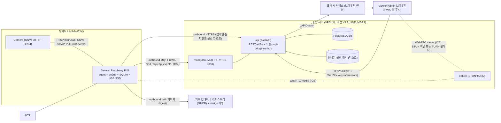
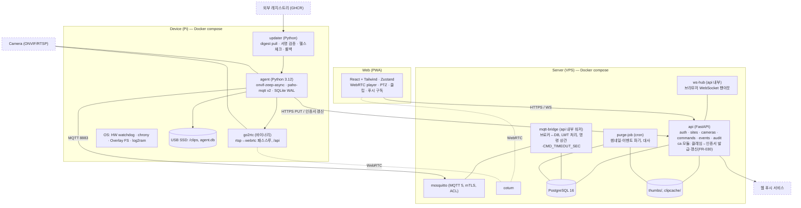
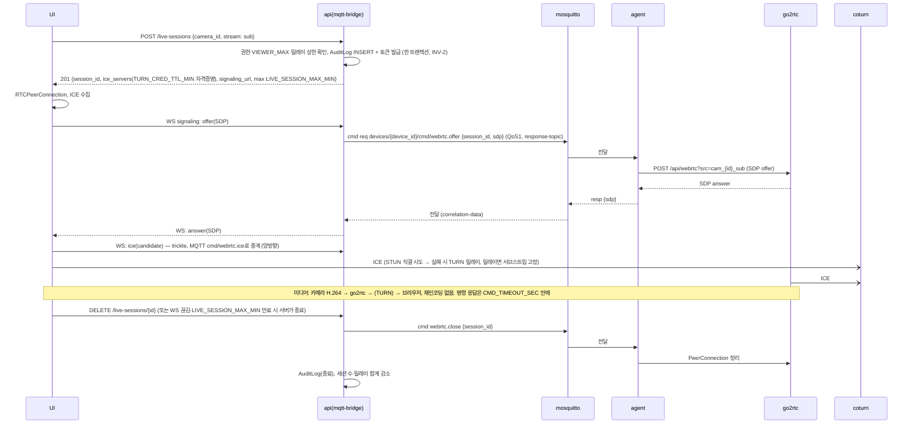
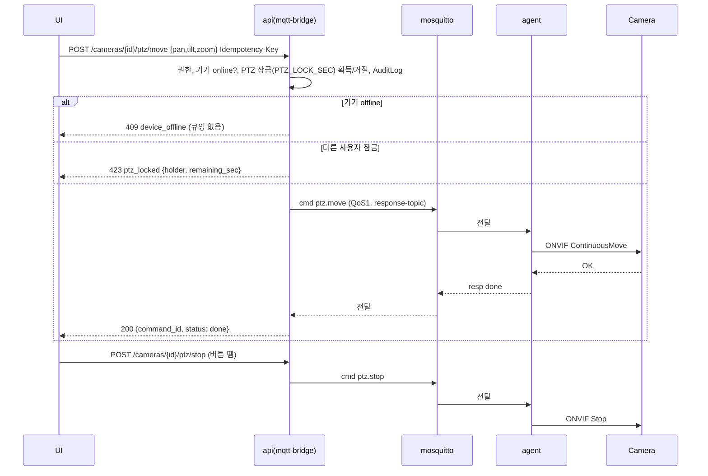
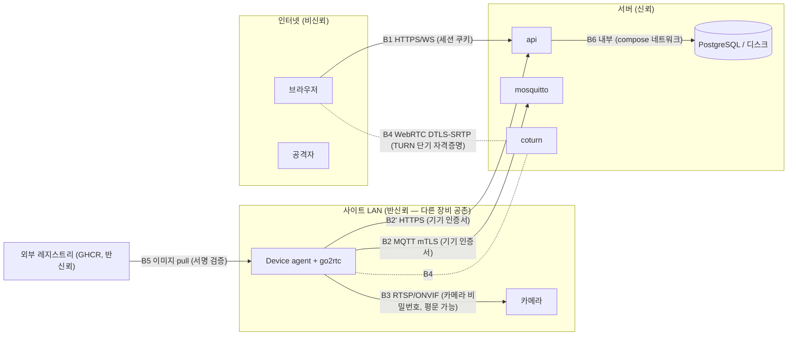

# 아키텍처 — PiCam Watch
버전: v1.2 · 기준 03 v1.2
개정: R1 반영 완료 (REVISIONS.md — 독립 검토 CONCERNS 16건 전부 채택) · R2(운영 상수 추가)는 이 문서에 영향 없음 · R3 GATE 반영(시퀀스 1 토픽 프리픽스를 05 규약으로 정정)
스킬: `ecc:architecture-decision-records`(검토한 대안을 ADR 형식으로, 별도 파일 대신 이 문서·decision-log에 흡수) · `ecc:security-review`(체크리스트를 위협모델 ③에 적용)

**근거 (진입 사전조사, 검색 1회)**
- 정량 — go2rtc README: "for stable external WebRTC access, you need to open the 8555 port on your router for both TCP and UDP", UDP 홀펀칭은 "sometimes" 동작. ONVIF 입력(`onvif://`)·ONVIF 서버 출력·"on-the-fly transcoding only if necessary" 명시 (github.com/AlexxIT/go2rtc README, 2026-09-08).
- 정성 — 같은 README가 포트 개방을 기본 안내로 둔다는 것은 NAT 뒤 기기의 원격 WebRTC가 이 스택의 검증되지 않은 경로라는 뜻이다. → 서버 경유 시그널링 + TURN 릴레이 조합은 **워킹 스켈레톤 첫 작업에서 실증**한다(잔여 리스크 R-1).
- 사용자 영향 — 운영자는 공유기 설정을 만지지 않는다. 기기를 꽂고 승인만 하면 어디서든 본다 (L-07 테슬러: 복잡성은 시스템이 흡수).

## Context & Scope
이미 설치된 ONVIF IP 카메라(H.264 스트림 1개 이상, INV-6)가 있는 소규모 사이트 ≤ SITES_MAX. 각 사이트에 Raspberry Pi 5(4GB) 1대가 카메라와 같은 LAN에 있고 NAT/방화벽 뒤에서 **아웃바운드만** 연다. 중앙 서버는 VPS 1대(FastAPI + PostgreSQL 16 + mosquitto + coturn). 시청자는 스마트폰·PC 브라우저. 기존 시스템 없음(신규). 인터넷 필수, 폐쇄망 아님.

## Goals / Non-goals
- Goals: G1 원격 실시간 확인·제어 (LIVE_LATENCY_P95, PTZ_CMD_LATENCY_P95) · G2 무인 운영 신뢰성 · G3 법 준수 내장. 세부는 03.
- Non-goals: 03 "범위 밖" 그대로. 추가로 이 문서 범위 밖 — 서버 다중화, 멀티리전, Pi 외 게이트웨이 HW.

## 설계

### 시스템 컨텍스트 다이어그램


### 구현 접근 — 난점과 선택
| 난점 | 선택 | 왜 |
|---|---|---|
| Pi 5에 HW 인코더 없음 | **무재인코딩 패스스루** (INV-4): 카메라 H.264 → go2rtc → WebRTC. 해상도는 카메라 sub/main 프로파일로 | 재인코딩은 CPU 포화 → 지연·프레임 드롭 |
| Pi가 NAT 뒤, 포트포워딩 금지 | **시그널링은 MQTT 5 요청/응답으로 서버 경유**(trickle ICE는 WS↔MQTT `ice` 메시지로 중계), 미디어는 ICE(STUN 직결 시도 → coturn 릴레이 폴백). Pi 측 go2rtc `ice_servers`는 설정 파일 항목이라 세션별 주입이 어렵다 → **기기 단위 TURN 자격증명**(DEVICE_TURN_CRED_TTL_HOURS 회전, agent가 설정 재생성·go2rtc reload). 브라우저는 세션별 TURN_CRED_TTL_MIN 자격증명. 릴레이 경로는 서브스트림 고정 + 전역 TURN_RELAY_MAX_MBPS 상한 (FR-006) | 서버는 제어면만 지나가고 미디어는 P2P/릴레이로 서버 대역을 아낀다. 릴레이 최악 = SITES_MAX × VIEWER_MAX × SUB_STREAM_BITRATE_KBPS × 2(수신+송신) ≈ VPS_LINE_MBPS의 5% — 메인 허용 시 250Mbps × 2로 회선 포화(검토 #2). go2rtc의 TURN 클라이언트 동작은 **가능성**(pion 기반) → 스켈레톤 첫 작업에서 실증 |
| 명령 왕복의 실패 모드 | 명령 응답 대기 CMD_TIMEOUT_SEC → `command-timeout`. `webrtc.offer`는 session_id로 멱등(QoS1 중복 전달 시 같은 answer 재생). 세션 종료(DELETE·WS 끊김·LIVE_SESSION_MAX_MIN)마다 `webrtc.close`로 go2rtc PeerConnection 정리 | ICE 타임아웃에 의존하면 Pi 자원이 샌다(검토 #6) |
| "실시간"의 정의 | 03 상수 LIVE_LATENCY_P95·LIVE_FIRST_FRAME_P95, stale 배지 STALE_AFTER_SEC | 측정 가능 |
| 클립이 Pi에 있음 | **온디맨드 업로드**: 재생 요청 → 서버가 Pi에 `clip.upload` 명령 → Pi가 서명된 PUT URL로 업로드 → 서버가 Range 지원 서명 URL로 브라우저에 스트리밍. 이벤트당 업로드는 **singleflight**(EVENT.cache_status uploading/ready), 임시파일 → 원자적 rename 후에만 서빙, 클라는 `202 clip-uploading`을 WS `event.clip_cached`/폴링으로 대기. 캐시는 CLIP_CACHE_TTL_MIN 뒤 삭제(활성 서명 토큰이 있으면 연장) | 리버스 HTTP 터널보다 단순, 개인정보가 서버에 상주하지 않음. 첫 재생까지 업로드 지연 ≈ 클립 크기 ÷ 업링크 (검토 #5) |
| 제어 채널 1개로 끝내기 | MQTT 5 한 채널: LWT(프레즌스), retained state, QoS1 명령, `response-topic`+`correlation-data`로 요청/응답 | WebSocket 추가 시 프레즌스·재전송 재구현 |
| 오프라인 자율 | Pi 에이전트는 서버 없이도 이벤트 감지·클립 저장·큐잉 (FR-022) | 서버 다운이 녹화 공백이 되지 않게 |
| 감사 로그 fail-closed | 토큰 발급과 AuditLog INSERT를 한 트랜잭션 (INV-2) | 법적 책임추적성 |

### 컴포넌트 구조


컴포넌트 책임 (한 줄씩)
- **agent**: 카메라 탐색·capability·RTSP URL을 go2rtc에 등록, ONVIF PullPoint 이벤트 구독 → Event 생성·클립 저장(ffmpeg copy, 재인코딩 없음)·썸네일 업로드, 명령 실행(PTZ/프리셋/스냅샷/녹화/재시작/클립 업로드/webrtc.close), 상태 보고, 로컬 큐, 파기 잡(클립). **카메라 연결 감시(FR-021)**: go2rtc `/api/streams` 상태 폴링 + PullPoint 구독 갱신 실패를 같은 경로로 감지 → Camera `connected ⇄ disconnected` 전이는 agent가 소유, CAM_RECONNECT_BACKOFF로 ONVIF 세션 재수립(go2rtc의 RTSP 재접속과 별개), `camera_disconnected`/`camera_reconnected` 이벤트 발행. **TURN 자격증명 회전**: DEVICE_TURN_CRED_TTL_HOURS마다 go2rtc 설정 재생성·reload. **인증서 갱신(FR-030)**: 만료 DEVICE_CERT_RENEW_BEFORE_DAYS 전 현재 인증서로 갱신 요청.
- **go2rtc**: RTSP 수신·WebRTC 송출. agent가 `/api/webrtc`로 SDP를 중계한다. 외부 노출 없음(localhost).
- **updater**: agent·go2rtc 컨테이너 이미지의 digest 교체와 롤백. agent와 분리해 agent가 죽어도 복구 가능.
- **api**: REST·WebSocket·토큰 발급·감사 로그·푸시. **ca 모듈**(api 내부): 클레임 토큰 검증 → CSR 서명(DEVICE_CERT_VALID_DAYS), 갱신 재발급, 만료 임박 미갱신 기기 알림, 인증서 지문 ↔ device_id 매핑(mosquitto는 CN=device_id로 ACL). **mqtt-bridge**: 브로커 구독, LWT→offline, 명령 응답 상관·CMD_TIMEOUT_SEC. **purge-job**: 서버 측 파기(행 DELETE + 파일 삭제, 일 1회)와 Pi 파기 대사(INV-1).
- **UI**: 03 UI 방향. 상태 4종.

### 데이터 흐름

#### 시나리오 1 — 라이브 시작 (US-1, FR-003·004·006)


#### 시나리오 2 — PTZ 조작 (US-2, FR-007·010)


#### 시나리오 3 — 모션 이벤트 → 클립 → 푸시 (US-3, FR-011·012·017)
```mermaid
sequenceDiagram
  participant CAM as Camera
  participant AG as agent
  participant SSD as USB SSD
  participant BRK as mosquitto
  participant API as api(mqtt-bridge)
  participant PUSH as 웹 푸시 서비스
  participant UI as UI
  CAM->>AG: PullPoint: MotionAlarm true
  AG->>AG: EVENT_COOLDOWN_SEC 병합, Event(ULID) 생성
  AG->>SSD: ffmpeg -c copy (링버퍼에서 CLIP_PRE_SEC 전부터) → clip.mp4 기록 시작
  AG->>BRK: event.created {event_id, camera_id, ts, clock_synced} (QoS1; 오프라인이면 로컬 큐)
  BRK->>API: 전달 → Event INSERT (ULID 멱등)
  API->>PUSH: VAPID push (ALERT_DAILY_MAX 초과면 요약)
  PUSH-->>UI: 알림
  AG->>SSD: CLIP_POST_SEC 후 기록 종료, SHA-256
  AG->>API: PUT /devices/{d}/events/{e}/thumbnail (HTTPS, 기기 인증서)
  AG->>BRK: event.clip_ready {event_id, duration, sha256, bytes}
  BRK->>API: 전달 → Event 상태 clip_ready
  UI->>API: POST /events/{e}/clip-access → cache_status none이면 cmd clip.upload(singleflight) → 202 clip-uploading
  AG->>API: PUT clipcache 임시파일 → 원자적 rename → cache_status ready (WS event.clip_cached)
  UI->>API: 재요청 → 200 서명 URL(Range), 캐시는 CLIP_CACHE_TTL_MIN
```

### 데이터 저장 (설계 결정에 관련된 부분만 — 전체 스키마는 05)
- **서버 PostgreSQL**: Workspace·User·Site·Device·Camera·Preset·Event(메타)·Command·AuditLog·PushSubscription·Deployment. 전 테이블 `workspace_id` (INV-7). **Event 파기는 purge-job의 행 DELETE + 썸네일 파일 삭제(일 1회, `purged_at`)로 INV-1(CLIP_RETENTION_DAYS + PURGE_MAX_DELAY_HOURS)을 지킨다** — 월 파티션은 저장 지역성용이며 DROP은 전 행 파기 후 정리에만 쓴다. AuditLog는 월 파티션 DROP으로 AUDIT_RETENTION_DAYS 보관(초과 보존은 법 위반이 아님).
- **서버 디스크**: `thumbs/{event_id}.jpg` (≤ THUMB_MAX_KB, CLIP_RETENTION_DAYS; 최악 용량 = EVENTS_PER_CAM_DAY_MAX × CAMERAS_PER_SITE_MAX × SITES_MAX × CLIP_RETENTION_DAYS × THUMB_MAX_KB — 디스크 사용률 알람은 07), `clipcache/{event_id}.mp4` (CLIP_CACHE_TTL_MIN 후 삭제, 활성 토큰 시 연장).
- **Pi SQLite(WAL, USB SSD)**: cameras(캐시), events(로컬 원본), outbox(큐, OFFLINE_QUEUE_MAX), commands(멱등 캐시). 클립 파일 `/clips/{camera_id}/{event_id}.mp4`.
- **Pi 링버퍼**: go2rtc 스트림에서 ffmpeg가 세그먼트(RINGBUF_SEGMENT_SEC)를 tmpfs(`size=RINGBUF_TMPFS_MB`, 초과 시 오래된 세그먼트 삭제)에 CLIP_PRE_SEC + 여유만큼 유지 — SD/SSD 쓰기 없이 프리롤 확보, RAM 상한 명시로 OOM 차단.

## 검토한 대안 (ADR 요약 — 상세 근거는 01-recon fit 표·decision-log)
| ADR | 결정 | 대안 | 왜 이쪽인가 | 결과(트레이드오프) |
|---|---|---|---|---|
| ADR-1 | go2rtc 패스스루 | MediaMTX / 직접 pion 구현 | Pi ARM 바이너리·WebRTC/MSE/HLS 동시 출력·ONVIF 입력, Frigate 채택 | go2rtc 설정 파일에 종속. 카메라 제어는 못 하므로 agent가 ONVIF를 별도로 다룸 |
| ADR-2 | MQTT 5 단일 제어 채널 (시그널링 포함) | MQTT + 별도 WebSocket 시그널링 터널 | 컴포넌트 1개 절약, LWT·QoS·요청/응답 내장 | SDP(수 KB)가 브로커를 지남 — 브로커 메시지 상한 MQTT_MSG_MAX_KB. 응답 대기 CMD_TIMEOUT_SEC, 세션 정리는 `webrtc.close`로 명시 |
| ADR-3 | 클립 온디맨드 업로드 + 서버 캐시 | 상시 업로드 / 리버스 HTTP 터널 / go2rtc 파일 스트림 | 개인정보 서버 비상주, 업링크 절약, 구현 단순 | 첫 재생까지 업로드 지연 ≈ (CLIP_PRE_SEC + CLIP_POST_SEC) × MAIN_STREAM_BITRATE_MBPS ÷ UPLINK_MIN_MBPS (수동 녹화는 MANUAL_REC_MAX_MIN 비례) → 202 폴링 필요. Pi 오프라인이면 클립 열람 불가(Q3에서 수용) |
| ADR-4 | 앱 계층 A/B OTA (컨테이너 digest, 외부 레지스트리 GHCR + cosign) | RAUC OS A/B / Mender / balena / 자체 레지스트리 | 유인 현장(Q5)·SITES_MAX 규모에서 비용 대비 충분, 레지스트리 운영 부담 0 | OS 계층 벽돌은 잔여 리스크 R-3 (Accept). 외부 레지스트리 장애 시 배포 불가(운영에는 무영향) |
| ADR-5 | coturn 자체 호스팅 (VPS 동거), 릴레이는 서브스트림 고정 + TURN_RELAY_MAX_MBPS 상한 | 관리형 TURN(Twilio 등) / 릴레이 무제한 | 규모 작고 비용 예측 가능, 자격증명 발급 통제. 최악 릴레이(전 세션 sub) = VPS_LINE_MBPS의 약 5% | 릴레이 경로는 고화질 불가(엣지케이스 17). 상한 도달 시 새 릴레이 세션 거절(SC-015). TURN_RELAY_COST 미확인 |
| ADR-6 | 웹 푸시(VAPID) PWA | 네이티브 앱 / SMS·알림톡 | 앱 없이 알림, 비용 0 | iOS는 홈 화면 추가한 PWA만 푸시 수신 — 온보딩에서 안내 |
| ADR-7 | 서버 단일 인스턴스 | HA 이중화 | 규모·팀에 맞음 | 서버 다운 중 라이브·알림 불가(엣지는 자율 녹화 계속). 07 복구 RTO로 관리 |

## 위협모델 (Cross-cutting: 보안)

### ① 무엇을 만드는가 — DFD + trust boundary


### ② 무엇이 잘못될 수 있는가 — STRIDE (경계별 전수)
| 자산/경계 | S | T | R | I | D | E |
|---|---|---|---|---|---|---|
| **B1 브라우저→api** | 자격증명 스터핑·세션 탈취 | 요청 변조(CSRF), 파라미터 변조 | 사용자가 "안 봤다" 부인 | 다른 workspace/사이트 데이터 열람, 오류에 스택 노출 | 로그인·라이브 세션 요청 폭주 | Viewer가 Admin API 호출, 스코프 우회 |
| **B2 Device→mosquitto/api** | 위조 기기(인증서 복제·클레임 토큰 재사용) | 이벤트·상태 메시지 변조, 재전송 | 기기가 보낸 이벤트 부인 — 해당없음(기기는 행위 주체가 아니라 센서, 사람 부인 대상 아님) | 다른 사이트 토픽 구독으로 이벤트 엿보기 | 기기 1대가 메시지 폭주로 브로커 포화 | 기기가 서버 명령 토픽에 발행(권한 상승) |
| **B3 Device↔카메라(LAN)** | LAN의 다른 장비가 카메라로 위장(ARP 스푸핑) | RTSP 평문 스트림 변조 | 해당없음(LAN 내부, 행위자 없음 — 감사는 B1에서) | 카메라 비밀번호가 Pi 디스크·로그에 평문 | LAN 장비가 카메라에 RTSP 세션 폭주 | 카메라 관리자 계정 탈취 → 펌웨어 조작 |
| **B4 WebRTC 미디어(TURN)** | TURN 자격증명 도용으로 릴레이 사용 | DTLS-SRTP가 막음 — 해당없음(표준 암호화) | 해당없음(미디어 채널, 행위는 B1 세션에 기록) | SDP 유출로 미디어 가로채기, TURN 서버에 평문 노출 없음(SRTP) | TURN 대역 고갈(자격증명 남용) | 해당없음(TURN에 권한 개념 없음 — D로 다룸) |
| **B5 레지스트리→Device (OTA)** | 가짜 레지스트리/이미지 | 이미지 변조 | 누가 무엇을 배포했나 부인 | 이미지에 비밀 포함 | 롤백 루프·배포 폭주 | 악성 이미지가 호스트 권한 획득(컨테이너 탈출) |
| **B6 서버 내부(api↔DB/디스크/coturn)** | 해당없음(compose 내부망, 외부 노출 없음) | DB 직접 변조(호스트 침해 시) | Admin의 설정 변경·삭제 부인 | DB 덤프·백업 유출, 썸네일 디스크 노출 | 디스크 포화(클립 캐시·썸네일) | 컨테이너 탈출 → 호스트 |

### ③ 무엇을 할 것인가 — 위협별 대응 (security-review 체크리스트 반영)
| 경계 | 위협 | 대응 | 방식 |
|---|---|---|---|
| B1 | 자격증명 스터핑 | argon2id, PASSWORD_MIN_LEN, 로그인 레이트리밋(IP·계정), 실패 지연 | Mitigate |
| B1 | 세션 탈취/CSRF | 세션 쿠키 HttpOnly·Secure·SameSite=Strict, 상태 변경은 SameSite + Origin 검사, WS는 세션 재검증 | Mitigate |
| B1 | 부인 | AuditLog fail-closed (INV-2), AUDIT_RETENTION_DAYS | Mitigate |
| B1 | 수평 권한 우회 | 모든 쿼리 `workspace_id` 필터 강제(리포지토리 계층), 스코프 `<모듈>:<자원>:<행위>` 검사, 오류는 RFC 9457에 스택 미포함 | Mitigate |
| B1 | DoS | 엔드포인트 레이트리밋, VIEWER_MAX, 라이브 세션 생성 분당 상한 | Mitigate |
| B1 | Viewer→Admin | 역할·스코프 서버측 검사, UI 숨김은 보안 아님 | Mitigate |
| B2 | 위조 기기 | 기기별 X.509(api ca 모듈, DEVICE_CERT_VALID_DAYS, DEVICE_CERT_RENEW_BEFORE_DAYS 전 갱신 — FR-030), 클레임 토큰 1회용·만료, 인증서 CN=device_id와 토픽 ACL 일치, 재사용 감지 알림(엣지케이스 16) | Mitigate |
| B2 | 메시지 변조·재전송 | mTLS, 이벤트 ULID 멱등, `webrtc.offer`는 session_id 멱등, 상태는 retained 최신값만 | Mitigate |
| B2 | 타 사이트 엿보기·권한 상승 | mosquitto 정적 ACL `pattern readwrite devices/%u/#`(%u = 인증서 CN = device_id)만 pub/sub, 서버 명령 토픽은 서버 계정만 pub (INV-3). 승인 시 ACL 갱신 불필요 | Eliminate |
| B2 | 브로커 포화 | 기기별 메시지 크기 MQTT_MSG_MAX_KB·분당 발행 상한, 초과 시 연결 끊고 알림 | Mitigate |
| B3 | 카메라 위장·스트림 변조 | 카메라 IP 고정(DHCP 예약 권고)·ONVIF 디바이스 ID 고정, 변조는 **Accept**(LAN 물리 보안은 운영자 책임 — 안내서에 명시) | Accept(사유: 소규모 사이트 LAN 격리는 범위 밖) |
| B3 | 카메라 비밀번호 노출 | Pi 디스크에 암호화 저장(기기 인증서 키로 파생), 로그 마스킹, 서버로 전송하지 않음 | Mitigate |
| B3 | RTSP 세션 폭주 | go2rtc가 카메라당 RTSP 1세션만 열고 시청자에게 팬아웃 | Eliminate |
| B3 | 카메라 관리자 탈취 | 등록 시 기본 비밀번호 감지·변경 권고, 카메라 펌웨어는 범위 밖 | Transfer(카메라 벤더·운영자) |
| B4 | TURN 자격증명 도용·대역 고갈 | coturn `use-auth-secret`: 브라우저 = 세션당 TURN_CRED_TTL_MIN, Pi = 기기당 DEVICE_TURN_CRED_TTL_HOURS 회전. 릴레이는 서브스트림 고정, 합계 TURN_RELAY_MAX_MBPS 초과 시 새 릴레이 세션 거절 + 알람 (FR-006, SC-015) | Mitigate |
| B4 | SDP 유출 | 시그널링은 인증된 WS·MQTT 경로만, DTLS 지문 SDP 포함(표준) | Mitigate |
| B5 | 가짜/변조 이미지 | digest 고정 + cosign 서명 검증(공개키는 기기 이미지에 내장), 외부 레지스트리(GHCR) TLS, 비밀은 이미지에 넣지 않음(런타임 env·파일) | Mitigate |
| B5 | 배포 부인 | Deployment 테이블(누가·언제·digest) + AuditLog | Mitigate |
| B5 | 롤백 루프 | 같은 digest 재시도 OTA_RETRY_MAX, 실패 시 `rolled_back` 고정·알림 | Mitigate |
| B5 | 배포 폭주(DoS) | 기기당 진행 중 배포 1건, 같은 release 재배포는 Idempotency-Key로 흡수, 배포 명령은 Admin 스코프 + 레이트리밋 | Mitigate |
| B5 | 컨테이너 탈출 | 컨테이너 non-root, `--cap-drop ALL`, USB 장치·/clips만 마운트, host network 미사용(go2rtc는 필요한 포트만) | Mitigate |
| B6 | DB·백업 유출 | 백업 암호화(age)·오프사이트, 디스크 권한 600, 썸네일 URL 서명 | Mitigate |
| B6 | 디스크 포화 | clipcache CLIP_CACHE_TTL_MIN, 썸네일 파기, 디스크 사용률 알람 | Mitigate |
| B6 | Admin 설정 변경·삭제 부인 (R) | 설정 변경·이벤트 삭제·사용자 초대·배포는 AuditLog `settings.change`/`event.delete`/`deploy` 행(actor·target·이전값 요약), AUDIT_RETENTION_DAYS | Mitigate |
| B6 | 서버 컨테이너 탈출 (E) | api·purge-job·mosquitto·coturn 컨테이너 non-root, `--cap-drop ALL`, read-only rootfs + 필요한 볼륨만, Docker 소켓 미마운트 | Mitigate |
| B6 | 호스트 침해 | VPS SSH 키·방화벽(443/8883/3478·49152-65535 UDP만), 자동 보안 업데이트, `npm/pip audit` CI | Mitigate |

security-review 체크리스트 적용: 비밀은 env·파일 마운트(하드코딩 0, `.env.example`은 07) · 입력은 pydantic 스키마 · 쿼리는 파라미터화(SQLAlchemy Core) · 파일 업로드(썸네일·클립)는 크기·MIME·확장자 화이트리스트 + 기기 인증서 소유 이벤트만 · 로그에 비밀번호·토큰·영상 미기록 · 의존성 `pip-audit` CI.

### ④ 충분한가 — 상위 리스크 3개 재검토 + 잔여 리스크
| # | 리스크 | 재검토 | 잔여 |
|---|---|---|---|
| R-1 | **NAT 뒤 Pi의 WebRTC가 TURN으로 안정 동작하는가** (go2rtc README는 포트 개방을 안내) — 실증 항목: ① go2rtc `ice_servers`에 TURN 자격증명(기기 단위) 설정 시 릴레이 경로 성립, ② DEVICE_TURN_CRED_TTL_HOURS 회전 시 진행 중 세션 유지 여부, ③ 브라우저 TURN_CRED_TTL_MIN 안에 LIVE_SESSION_MAX_MIN 세션이 끊기지 않는지, ④ trickle ICE 중계 시 LIVE_FIRST_FRAME_P95 | 실증 전까지 설계는 가능성. 실패 시 대안: agent가 pion으로 직접 WebRTC 송출(go2rtc RTSP 재배포를 소스로) 또는 LL-HLS 폴백(SC-001 미달) | 워킹 스켈레톤 첫 작업 = 이 실증. 미달 시 03 상수 개정(R#) |
| R-2 | **법 상수 미확정** (CLIP_RETENTION_DAYS·AUDIT_RETENTION_DAYS·AUDIT_REVIEW_INTERVAL_DAYS — 조문 원문 미인출) | 값은 상수 표 한 곳, 코드 상수 아님(설정) | 착수 전 law.go.kr 원문 확인 1회 — 핸드오프 선행 조건 |
| R-3 | **OS 계층 벽돌** (앱 A/B만) | 유인 현장 전제(Q5), OS 업데이트는 security만·재부팅 없음, SD 이미지 복원 절차를 07 런북에 | Accept. 무인 현장이 생기면 ADR-4 재검토 |
| R-4 | LAN 물리 보안(B3 Accept) | 카메라 비밀번호 암호화·로그 마스킹으로 노출면 축소 | Accept, 안내서 명시 |

## Cross-cutting: 관측성
Pi는 SD 쓰기 없이(log2ram) 구조화 로그(JSON)를 tmpfs에 두고 MQTT `state`(STATE_REFRESH_SEC)와 `log.error`(오류만) 토픽으로 서버에 올린다. 서버는 api·mqtt-bridge·coturn·mosquitto 로그를 journald → 로컬 파일(로테이션)로 두고, 4 골든 시그널 — Latency(라이브 첫 프레임·명령 왕복), Traffic(활성 세션·릴레이 세션), Errors(명령 실패율·command-timeout), Saturation(TURN 릴레이 대역 대비 TURN_RELAY_MAX_MBPS·디스크·Pi CPU) — 을 Prometheus 지표로 낸다. 알람·SLO·런북은 07.

## Cross-cutting: 프라이버시
영상·썸네일은 개인정보다. 서버에 상주하는 것은 썸네일(CLIP_RETENTION_DAYS)과 온디맨드 클립 캐시(STREAM_TOKEN_TTL_SEC)뿐이며, 모든 접근은 AuditLog에 남는다(INV-2). 로그·오류·푸시 본문에 영상·썸네일·카메라 비밀번호를 넣지 않는다(푸시는 "움직임 감지 — 매장 앞"까지만). 안내판 정보·운영 방침(FR-027)은 사이트 설정의 일부다. 파기는 Pi(클립)와 서버(썸네일·이벤트)가 각각 수행하고 purge-job이 대사한다(INV-1).
