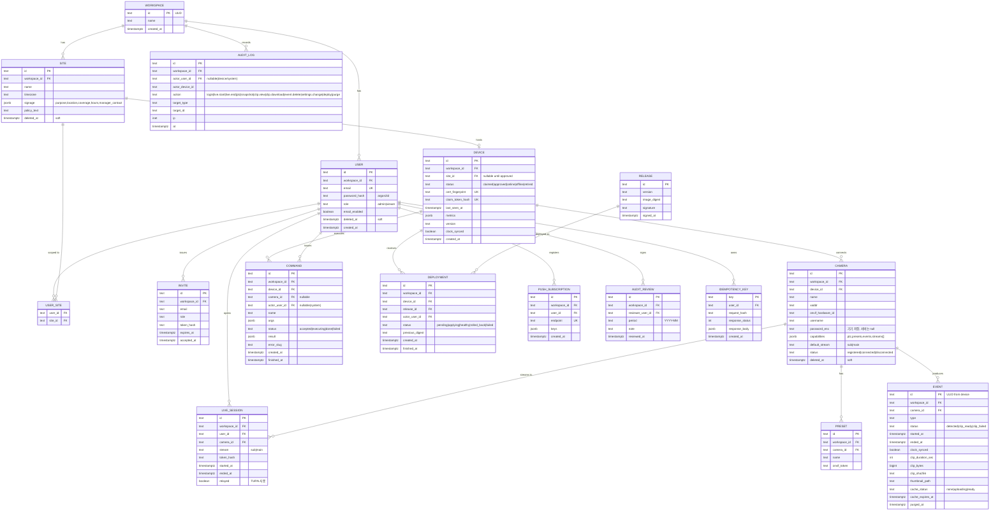

# API 계약 & 데이터 스키마 — PiCam Watch
버전: v1.1 · 기준 03 v1.2
개정: R1 반영 완료 (REVISIONS.md — 토픽 프리픽스·D04 인증서 갱신·클립 캐시·FR-030) · R2(운영 상수 추가)는 이 문서에 영향 없음 — 기준 버전만 갱신
스킬: `ecc:api-design`(자원 명명·상태코드·페이지네이션·레이트리밋 헤더) · `ecc:postgres-patterns`(인덱스·타입·파티션). 충돌 시 템플릿 규약 우선: URL 버저닝 대신 미디어타입, 자체 에러 봉투 대신 RFC 9457, offset 대신 커서.

**근거 (진입 사전조사, 검색 1회)**
- 정량 — `Idempotency-Key` 헤더는 IETF draft-ietf-httpapi-idempotency-key-header-07 (2025-10-15, 상태 expired). RFC가 아니므로 "사실상 표준"(Stripe 구현)으로 채택하고 의미는 이 문서가 정의한다 (datatracker.ietf.org, 2026-09-08).
- 정성 — 초안의 목적 문장: "can be used to make non-idempotent HTTP methods such as POST or PATCH fault-tolerant" — PTZ·재시작·배포처럼 두 번 실행되면 안 되는 명령이 이 서비스의 POST 대부분이다.
- 사용자 영향 — 재시도로 카메라가 두 번 움직이거나 기기가 두 번 재시작하지 않는다. 오류는 사람이 읽는 문장(해요체)과 다음 행동을 담는다 (T-08·L-06).

## 규약 (전 엔드포인트 공통)
- **베이스**: `https://{host}/api`. **버저닝**: `Accept: application/vnd.picam.v1+json` (기본 v1, 생략 시 v1). 스펙 파일 semver.
- **에러**: RFC 9457 `application/problem+json` — `type`(`https://picam.dev/problems/{slug}`)·`title`·`status`·`detail`(해요체)·`instance`·확장 `errors[]`(필드 검증). 스택트레이스 미노출. slug 목록은 아래 표.
- **페이지네이션**: 커서 — `?cursor=&limit=`(기본 20, 최대 100) → `meta.next_cursor`(불투명, ULID 기반).
- **멱등성**: 부작용 있는 POST(명령·세션 생성·배포)는 `Idempotency-Key`(클라 생성 ULID) 필수. 서버는 SESSION_TTL_HOURS 동안 보관하고 같은 키 재시도에 최초 응답을 그대로 재생. 같은 키·다른 본문은 `422 idempotency-key-mismatch`.
- **인증**: 브라우저 = 세션 쿠키 `picam_session`(HttpOnly·Secure·SameSite=Strict). 기기 = mTLS 클라이언트 인증서(CN=device_id), `/api/device/*` 전용. 서명 URL(클립·썸네일) = 세션 없이 토큰만.
- **권한 스코프**: `<모듈>:<자원>:<행위>` — Admin = 전부, Viewer = `live:session:create` `ptz:camera:move` `ptz:preset:goto` `clips:event:read` `clips:clip:read` `snapshot:camera:create` `record:camera:create` `push:subscription:write`. 사이트 범위는 `user_sites`로 제한(INV-7 workspace 필터 + 사이트 필터).
- **네이밍**: 경로 kebab-case 복수, JSON snake_case, 시각 UTC ISO 8601(`2026-09-08T05:31:30Z`), 식별자 ULID(26자).
- **레이트리밋**: `RateLimit-Limit/Remaining/Reset` 헤더, 초과 시 `429` + `Retry-After`. 로그인·라이브 세션 생성·PTZ는 별도 상한(07 설정).
- **응답 봉투**: `{ "data": … , "meta": … }`. 삭제·정지는 `204`.

### Problem slug 표
| slug | status | 언제 |
|---|---|---|
| `validation-failed` | 422 | 스키마 검증 실패 (`errors[]`) |
| `invalid-credentials` | 401 | 로그인 실패 |
| `unauthenticated` | 401 | 세션·인증서 없음 |
| `forbidden` | 403 | 스코프·사이트 범위 밖 |
| `not-found` | 404 | 자원 없음 또는 다른 workspace |
| `device-offline` | 409 | 기기 offline — 명령 큐잉 안 함 (FR-010) |
| `ptz-locked` | 423 | 다른 사용자가 PTZ_LOCK_SEC 안 조작 중 (`holder`, `remaining_sec`) |
| `ptz-unsupported` | 422 | 카메라 capability에 PTZ 없음 |
| `stream-unsupported` | 422 | 요청 스트림이 브라우저 재생 불가(H.265) — 엣지케이스 1 |
| `no-h264-stream` | 422 | 카메라 등록 거부 (INV-6) |
| `camera-auth-failed` | 422 | ONVIF 자격증명 오류 |
| `viewer-limit` | 429 | 사이트 VIEWER_MAX 도달 (`current_viewers`) 또는 릴레이 합계 TURN_RELAY_MAX_MBPS 도달 (`reason: relay-cap`, 직결 가능하면 재시도 안내) |
| `rate-limited` | 429 | 레이트리밋 |
| `claim-token-used` | 409 | 클레임 토큰 재사용 (엣지케이스 16) |
| `clip-purged` | 410 | 보존 만료로 파기됨 |
| `clip-uploading` | 202 | 온디맨드 업로드 진행 중 (`Retry-After`) |
| `idempotency-key-mismatch` | 422 | 같은 키·다른 본문 |
| `command-timeout` | 504 | 기기가 CMD_TIMEOUT_SEC 안에 응답하지 않음 |
| `internal` | 500 | 그 외. detail 고정 문구 |

## 엔드포인트 표
| ID | 메서드 경로 | 요청(핵심 필드) | 응답 | 주요 에러(slug) | 권한 스코프 |
|---|---|---|---|---|---|
| **인증·사용자** | | | | | |
| E01 | POST /auth/login | email, password | 200 {user, role, scopes} + Set-Cookie | invalid-credentials, rate-limited | 공개 |
| E02 | POST /auth/logout | — | 204 | unauthenticated | 세션 |
| E03 | GET /auth/me | — | 200 {user, workspace, role, scopes, sites[]} | unauthenticated | 세션 |
| E04 | POST /invites | email, role=viewer, site_ids[] | 201 {invite} | validation-failed, forbidden | admin:user:invite |
| E05 | POST /invites/{token}/accept | password (≥PASSWORD_MIN_LEN) | 201 {user} | not-found, validation-failed | 공개(토큰) |
| **사이트** | | | | | |
| E06 | GET /sites | cursor, limit | 200 {data[], meta} | — | 세션(사이트 범위) |
| E07 | POST /sites | name, timezone | 201 {site} | validation-failed | admin:site:write |
| E08 | GET /sites/{id} | — | 200 {site, signage, policy_text, devices[], cameras[]} | not-found | 세션 |
| E09 | PATCH /sites/{id} | name, signage{purpose, location, coverage, hours, manager_contact}, policy_text | 200 {site} | validation-failed | admin:site:write |
| E10 | GET /sites/{id}/signage.pdf | — | 200 application/pdf (안내판 인쇄) | not-found | admin:site:read |
| **기기** | | | | | |
| E11 | POST /device/claim | claim_token, csr (PEM) | 201 {device_id, cert_pem, ca_pem, mqtt{host,port}, topics} | claim-token-used, validation-failed | 공개(클레임 토큰) |
| E12 | GET /devices | site_id, cursor | 200 {data[]} | — | 세션 |
| E13 | GET /devices/{id} | — | 200 {device: status(claimed/approved/online/offline/retired), last_seen_at, metrics{cpu,temp_c,disk_free_pct,uplink_mbps}, version, clock_synced} | not-found | 세션 |
| E14 | POST /devices/{id}/approve | site_id | 200 {device} | not-found, validation-failed | admin:device:write |
| E15 | POST /devices/{id}/retire | — | 200 {device} | not-found | admin:device:write |
| E16 | POST /devices/{id}/restart | target=agent\|os · Idempotency-Key | 202 {command_id} | device-offline | admin:device:write |
| E17 | POST /devices/{id}/deployments | release_id · Idempotency-Key | 202 {deployment} | device-offline, not-found | admin:device:deploy |
| E18 | GET /devices/{id}/deployments | cursor | 200 {data[]: status(pending/applying/healthy/rolled_back/failed), image_digest, actor} | — | admin:device:read |
| E19 | GET /releases | — | 200 {data[]: version, image_digest, signed_at} | — | admin:device:read |
| **카메라** | | | | | |
| E20 | POST /devices/{id}/camera-discoveries | Idempotency-Key | 202 {command_id} | device-offline | admin:camera:write |
| E21 | GET /commands/{id} | — | 200 {command: status(accepted/executing/done/failed), result, error} | not-found | 세션(발행자·Admin) |
| E22 | POST /devices/{id}/cameras | xaddr, username, password, name | 201 {camera(capabilities)} | no-h264-stream, camera-auth-failed, device-offline | admin:camera:write |
| E23 | GET /cameras | site_id, cursor | 200 {data[]} | — | 세션 |
| E24 | GET /cameras/{id} | — | 200 {camera: status(registered/connected/disconnected), capabilities{ptz, presets, events, streams[{profile, codec, width, height}]}, default_stream} | not-found | 세션 |
| E25 | PATCH /cameras/{id} | name, default_stream | 200 {camera} | validation-failed | admin:camera:write |
| E26 | DELETE /cameras/{id} | — | 204 (soft delete) | not-found | admin:camera:write |
| **라이브** | | | | | |
| E27 | POST /live-sessions | camera_id, stream=sub\|main · Idempotency-Key | 201 {session_id, token, ice_servers[{urls, username, credential}](TURN_CRED_TTL_MIN), signaling_url, token_expires_at(STREAM_TOKEN_TTL_SEC), max_duration_min(LIVE_SESSION_MAX_MIN)}. 릴레이로 붙으면 서버가 `stream_effective: sub`를 WS로 통지(엣지 17) | viewer-limit(VIEWER_MAX 또는 relay-cap), device-offline, stream-unsupported | live:session:create |
| E28 | DELETE /live-sessions/{id} | — | 204 | not-found | 세션(소유자) |
| E29 | WS /live-sessions/{id}/signaling?token= | offer/ice 메시지 | answer/ice/error 메시지 (아래 WS 계약) | unauthenticated | 토큰 |
| **PTZ** | | | | | |
| E30 | POST /cameras/{id}/ptz/move | pan, tilt, zoom ∈ [-1,1] · Idempotency-Key | 200 {command_id, status} | device-offline, ptz-locked, ptz-unsupported | ptz:camera:move |
| E31 | POST /cameras/{id}/ptz/stop | — | 200 {command_id} | device-offline | ptz:camera:move |
| E32 | GET /cameras/{id}/presets | — | 200 {data[]: preset_id, name, onvif_token} | — | 세션 |
| E33 | POST /cameras/{id}/presets | name · Idempotency-Key | 201 {preset} (현재 위치 저장) | device-offline, ptz-unsupported | admin:preset:write |
| E34 | POST /cameras/{id}/presets/{pid}/goto | Idempotency-Key | 200 {command_id} | device-offline, ptz-locked | ptz:preset:goto |
| E35 | DELETE /cameras/{id}/presets/{pid} | — | 204 | not-found | admin:preset:write |
| **스냅샷·녹화** | | | | | |
| E36 | POST /cameras/{id}/snapshots | Idempotency-Key | 202 {command_id} → 완료 시 result{snapshot_id, url} | device-offline | snapshot:camera:create |
| E37 | POST /cameras/{id}/recordings | duration_sec (≤ MANUAL_REC_MAX_MIN×60) · Idempotency-Key | 202 {command_id, event_id} | device-offline, validation-failed | record:camera:create |
| E38 | POST /cameras/{id}/recordings/stop | — | 202 {command_id} | device-offline | record:camera:create |
| **이벤트·클립** | | | | | |
| E39 | GET /events | site_id, camera_id, type, from, to, cursor, limit | 200 {data[]: id, type(motion/manual/snapshot/camera_disconnected/camera_reconnected/disk_low/clip_failed), camera_id, started_at, ended_at, status(detected/clip_ready/clip_failed), thumbnail_url, clock_synced} | validation-failed | clips:event:read |
| E40 | GET /events/{id} | — | 200 {event, clip{duration_sec, bytes, sha256}} | not-found, clip-purged | clips:event:read |
| E41 | GET /events/{id}/thumbnail | — | 200 image/jpeg | not-found | clips:event:read |
| E42 | POST /events/{id}/clip-access | Idempotency-Key | 200 {clip_url(서명, Range 지원), expires_at(CLIP_CACHE_TTL_MIN, 활성 토큰 시 연장)} · 202 clip-uploading(Retry-After; 이벤트당 업로드 1회 singleflight — EVENT.cache_status) | device-offline, clip-purged | clips:clip:read |
| E43 | GET /clips/{token} | Range | 206/200 video/mp4 | not-found(만료) | 토큰 |
| E44 | DELETE /events/{id} | — | 204 (즉시 파기, 감사) | not-found | admin:event:delete |
| **알림** | | | | | |
| E45 | POST /push-subscriptions | endpoint, keys{p256dh, auth} | 201 {subscription} | validation-failed | push:subscription:write |
| E46 | DELETE /push-subscriptions/{id} | — | 204 | not-found | push:subscription:write |
| E47 | GET /notification-settings | — | 200 {email_enabled} | — | 세션 |
| E48 | PATCH /notification-settings | email_enabled | 200 | validation-failed | 세션 |
| **감사** | | | | | |
| E49 | GET /audit-logs | actor_id, action, from, to, cursor | 200 {data[]: id, actor, action, target, ip, at} | forbidden | admin:audit:read |
| E50 | POST /audit-reviews | period(YYYY-MM), note | 201 {review} | validation-failed | admin:audit:read |
| **기기 측 HTTPS (mTLS)** | | | | | |
| D01 | PUT /device/events/{event_id}/thumbnail | image/jpeg (≤ THUMB_MAX_KB, MIME·확장자 화이트리스트) | 204 | forbidden(타 기기 이벤트), validation-failed | 기기 인증서 |
| D02 | PUT /device/clip-uploads/{upload_id} | video/mp4 (upload_id는 cmd clip.upload 페이로드; 서버는 임시파일에 받고 완료 시 원자적 rename → cache_status ready) | 204 | not-found(만료), validation-failed | 기기 인증서 |
| D04 | POST /device/certificate | csr (PEM) — 현재 인증서로 mTLS, 만료 DEVICE_CERT_RENEW_BEFORE_DAYS 전 | 200 {cert_pem, expires_at(DEVICE_CERT_VALID_DAYS)} | unauthenticated(만료·폐기 인증서), validation-failed | 기기 인증서 |
| D03 | GET /device/config | — | 200 {constants(EVENT_COOLDOWN_SEC, CLIP_PRE_SEC, CLIP_POST_SEC, CLIP_RETENTION_DAYS, PURGE_MAX_DELAY_HOURS, CLIP_DISK_RESERVE_PCT, OFFLINE_QUEUE_MAX, STATE_REFRESH_SEC, MQTT_KEEPALIVE_SEC), mqtt} | unauthenticated | 기기 인증서 |

## WS 계약 (브라우저)
- **상태 채널** `WS /ws` (세션 쿠키): 서버→클라 `device.state` `camera.state` `event.created` `event.clip_ready` `command.updated` `deployment.updated` — 페이로드는 해당 REST 표현과 동일 필드. 클라→서버 `ping`만.
- **시그널링** E29: 클라→서버 `{type:"offer", sdp}` `{type:"ice", candidate}`(trickle); 서버→클라 `{type:"answer", sdp}` `{type:"ice", candidate}` `{type:"stream_effective", stream}` `{type:"error", problem}`. 서버는 offer를 MQTT `cmd/webrtc.offer`(session_id 멱등)로, ice를 `cmd/webrtc.ice`로 중계하고 answer·기기 측 ice를 되돌린다. WS 끊김·LIVE_SESSION_MAX_MIN 만료 = 세션 종료(E28과 동일 처리 + `cmd/webrtc.close` + AuditLog 종료). 상태 채널에 `event.clip_cached`(E42 202 → 200 전환 통지) 추가.

## MQTT 토픽 계약 (기기 ↔ 서버, MQTT 5, 메시지 ≤ MQTT_MSG_MAX_KB)
프리픽스 `devices/{device_id}/` — mosquitto 정적 ACL `pattern readwrite devices/%u/#`(%u = 인증서 CN = device_id): 기기는 pub `state` `events` `resp/#` `log/#`, sub `cmd/#`. 서버 계정: pub `cmd/#`, sub 전부 (INV-3). 사이트 매핑은 서버 DB(DEVICE.site_id)가 안다.
| 토픽 | 방향 | QoS/retain | 페이로드 |
|---|---|---|---|
| `state` | 기기→ | QoS1, retained, STATE_REFRESH_SEC | {online:true, cpu, temp_c, disk_free_pct, uplink_mbps, version, clock_synced, cameras[{camera_id, status}]} · LWT = {online:false} |
| `events` | 기기→ | QoS1 | {event_id(ULID), type, camera_id, started_at, ended_at, clock_synced, clip{duration_sec, bytes, sha256}} — type: motion, manual, snapshot, camera_disconnected, camera_reconnected, disk_low, clip_failed, clip_ready, purged |
| `cmd/{name}` | →기기 | QoS1, response-topic=`resp/{correlation}`, 응답 대기 CMD_TIMEOUT_SEC | {command_id, args} — name: webrtc.offer{session_id, sdp, stream}(session_id 멱등) · webrtc.ice{session_id, candidate} · webrtc.close{session_id} · ptz.move{pan,tilt,zoom} · ptz.stop · preset.list/set/goto/delete · snapshot · record.start{duration_sec}/record.stop · clip.upload{event_id, upload_url} · camera.discover · camera.add{xaddr, username, password} · camera.remove · restart{target} · deploy{image_digest, signature} · turn.credentials{username, credential, expires_at}(DEVICE_TURN_CRED_TTL_HOURS 회전, retained 아님) · purge.report |
| `resp/{correlation}` | 기기→ | QoS1 | {command_id, status: done\|failed, result, error{slug, detail}} |
| `log/error` | 기기→ | QoS0 | {at, component, message} (비밀·영상 없음) |

## OpenAPI 스케치 (핵심 3개 — 전문은 구현 단계)
```yaml
openapi: 3.1.0
info: {title: PiCam Watch API, version: 1.0.0}
paths:
  /live-sessions:
    post:
      operationId: createLiveSession
      parameters: [{name: Idempotency-Key, in: header, required: true, schema: {type: string, pattern: '^[0-9A-HJKMNP-TV-Z]{26}$'}}]
      requestBody:
        content: {application/json: {schema: {type: object, required: [camera_id, stream], properties: {camera_id: {type: string}, stream: {enum: [sub, main]}}}}}
      responses:
        '201': {content: {application/vnd.picam.v1+json: {schema: {$ref: '#/components/schemas/LiveSession'}}}}
        '429': {$ref: '#/components/responses/ViewerLimit'}
        '409': {$ref: '#/components/responses/DeviceOffline'}
        '422': {$ref: '#/components/responses/Problem'}
  /cameras/{id}/ptz/move:
    post:
      operationId: ptzMove
      parameters: [{name: id, in: path, required: true, schema: {type: string}}, {name: Idempotency-Key, in: header, required: true, schema: {type: string}}]
      requestBody:
        content: {application/json: {schema: {type: object, required: [pan, tilt, zoom], properties: {pan: {type: number, minimum: -1, maximum: 1}, tilt: {type: number, minimum: -1, maximum: 1}, zoom: {type: number, minimum: -1, maximum: 1}}}}}
      responses:
        '200': {content: {application/vnd.picam.v1+json: {schema: {$ref: '#/components/schemas/CommandAck'}}}}
        '423': {$ref: '#/components/responses/PtzLocked'}
        '409': {$ref: '#/components/responses/DeviceOffline'}
  /events:
    get:
      operationId: listEvents
      parameters:
        - {name: site_id, in: query, schema: {type: string}}
        - {name: camera_id, in: query, schema: {type: string}}
        - {name: type, in: query, schema: {type: string}}
        - {name: from, in: query, schema: {type: string, format: date-time}}
        - {name: to, in: query, schema: {type: string, format: date-time}}
        - {name: cursor, in: query, schema: {type: string}}
        - {name: limit, in: query, schema: {type: integer, minimum: 1, maximum: 100, default: 20}}
      responses:
        '200': {content: {application/vnd.picam.v1+json: {schema: {type: object, properties: {data: {type: array, items: {$ref: '#/components/schemas/Event'}}, meta: {type: object, properties: {next_cursor: {type: [string, 'null']}}}}}}}}
components:
  schemas:
    LiveSession: {type: object, properties: {session_id: {type: string}, token: {type: string}, ice_servers: {type: array, items: {type: object, properties: {urls: {type: array, items: {type: string}}, username: {type: string}, credential: {type: string}}}}, signaling_url: {type: string}, expires_at: {type: string, format: date-time}}}
    CommandAck: {type: object, properties: {command_id: {type: string}, status: {enum: [accepted, executing, done, failed]}}}
    Event: {type: object, properties: {id: {type: string}, type: {type: string}, camera_id: {type: string}, started_at: {type: string, format: date-time}, ended_at: {type: [string, 'null'], format: date-time}, status: {enum: [detected, clip_ready, clip_failed]}, thumbnail_url: {type: [string, 'null']}, clock_synced: {type: boolean}}}
    Problem: {type: object, properties: {type: {type: string, format: uri}, title: {type: string}, status: {type: integer}, detail: {type: string}, instance: {type: string}, errors: {type: array, items: {type: object, properties: {field: {type: string}, message: {type: string}}}}}}
  responses:
    Problem: {content: {application/problem+json: {schema: {$ref: '#/components/schemas/Problem'}}}}
    ViewerLimit: {content: {application/problem+json: {schema: {$ref: '#/components/schemas/Problem'}}}}
    DeviceOffline: {content: {application/problem+json: {schema: {$ref: '#/components/schemas/Problem'}}}}
    PtzLocked: {content: {application/problem+json: {schema: {$ref: '#/components/schemas/Problem'}}}}
```

## ERD


## DDL 스케치 (핵심 제약·인덱스 — postgres-patterns)
```sql
-- 모든 표에 workspace_id (INV-7). ULID는 text(26): 시간순이라 B-tree 지역성 유지 (random UUID 회피 권고에 부합)
CREATE TABLE event (
  id            text PRIMARY KEY CHECK (length(id) = 26),
  workspace_id  text NOT NULL REFERENCES workspace(id),
  camera_id     text NOT NULL REFERENCES camera(id),
  type          text NOT NULL CHECK (type IN ('motion','manual','snapshot','camera_disconnected','camera_reconnected','disk_low','clip_failed')),
  status        text NOT NULL DEFAULT 'detected' CHECK (status IN ('detected','clip_ready','clip_failed')),
  started_at    timestamptz NOT NULL,
  ended_at      timestamptz,
  clock_synced  boolean NOT NULL DEFAULT true,
  clip_duration_sec int, clip_bytes bigint, clip_sha256 text, thumbnail_path text,
  cache_status  text NOT NULL DEFAULT 'none' CHECK (cache_status IN ('none','uploading','ready')),
  cache_expires_at timestamptz,
  purged_at     timestamptz
) PARTITION BY RANGE (started_at);              -- 월 파티션은 지역성용. 보존 만료 파기 = purge-job 행 DELETE + 파일 삭제(일 1회, INV-1). DROP은 전 행 파기 후 정리만
CREATE INDEX event_cam_started ON event (workspace_id, camera_id, started_at DESC);   -- 목록·커서
CREATE INDEX event_purge ON event (started_at) WHERE purged_at IS NULL;               -- 파기 잡
CREATE INDEX event_cache ON event (cache_expires_at) WHERE cache_status = 'ready';    -- 캐시 정리 잡

CREATE TABLE live_session (
  id text PRIMARY KEY, workspace_id text NOT NULL, user_id text NOT NULL REFERENCES "user"(id),
  camera_id text NOT NULL REFERENCES camera(id), stream text NOT NULL CHECK (stream IN ('sub','main')),
  token_hash text NOT NULL, started_at timestamptz NOT NULL DEFAULT now(), ended_at timestamptz, relayed boolean
);
CREATE INDEX live_active ON live_session (camera_id) WHERE ended_at IS NULL;          -- VIEWER_MAX 카운트

CREATE TABLE audit_log (
  id text PRIMARY KEY, workspace_id text NOT NULL, actor_user_id text, actor_device_id text,
  action text NOT NULL, target_type text NOT NULL, target_id text NOT NULL, ip inet, at timestamptz NOT NULL DEFAULT now()
) PARTITION BY RANGE (at);                       -- AUDIT_RETENTION_DAYS 후 파티션 DROP
CREATE INDEX audit_actor_at ON audit_log (workspace_id, actor_user_id, at DESC);

CREATE TABLE device (
  id text PRIMARY KEY, workspace_id text NOT NULL, site_id text REFERENCES site(id),
  status text NOT NULL CHECK (status IN ('claimed','approved','online','offline','retired')),
  cert_fingerprint text UNIQUE, claim_token_hash text UNIQUE, last_seen_at timestamptz, metrics jsonb, version text, clock_synced boolean,
  CONSTRAINT device_site_when_approved CHECK (status = 'claimed' OR site_id IS NOT NULL)
);
CREATE UNIQUE INDEX device_one_per_site ON device (site_id) WHERE status <> 'retired';  -- 사이트당 기기 1대

-- PTZ 잠금: 별도 표 없이 advisory lock — pg_try_advisory_xact_lock(hashtext(camera_id)) + redis 없음. 잠금 보유자·만료는 camera.ptz_lock(jsonb: holder, until)로 기록, PTZ_LOCK_SEC.
-- 명령: command(status) 인덱스 (device_id, status) WHERE status IN ('accepted','executing') — 타임아웃 스캔.
-- 멱등키: idempotency_key(created_at) 인덱스, SESSION_TTL_HOURS 지난 행 삭제 잡.
```

## 데이터 규칙
- **시각**: `timestamptz`, API는 UTC ISO 8601. 기기 이벤트는 기기 시각 + `clock_synced`; false면 UI가 "기기 시계 미동기" 표시하고 서버 수신 시각을 병기.
- **식별자**: ULID text(26). 이벤트 ID는 **기기가 생성**(오프라인 큐 재전송 시 멱등, 엣지케이스 13).
- **비밀**: 카메라 비밀번호는 서버에 저장하지 않는다 — `camera.password_enc`는 기기 SQLite에만(기기 인증서 키 파생 암호화). E22 요청 본문은 MQTT `camera.add`로 기기에 전달 후 서버 메모리에서 폐기.
- **보존**: EVENT·썸네일 CLIP_RETENTION_DAYS → 파기(`purged_at`, 파일 삭제, 행 DELETE) · COMMAND·LIVE_SESSION·AUDIT_LOG AUDIT_RETENTION_DAYS(파티션 DROP) · IDEMPOTENCY_KEY SESSION_TTL_HOURS · 클립 캐시 CLIP_CACHE_TTL_MIN(활성 서명 토큰 시 연장). 소프트삭제: USER·SITE·CAMERA(`deleted_at`). 하드 파기: EVENT 클립·썸네일(법).
- **파일**: 썸네일 ≤ THUMB_MAX_KB JPEG, 클립 MP4(H.264 copy, faststart). 업로드는 MIME·확장자·크기 화이트리스트, 기기 인증서가 소유한 이벤트만.
- **기기 인증서**: DEVICE_CERT_VALID_DAYS 유효, D04로 갱신, 갱신 시 `cert_fingerprint` 교체 + 구 인증서 폐기 목록(CRL) 반영.
- **금액**: 없음.

## 규칙 상수 파일
03 상수 표를 `config/constants.yaml`로 옮기고 값마다 `source:`(출처 URL | 설계 결정 DL-# | 미확인) 필드를 붙인다. 기기는 D03으로 자기 몫만 받는다. 코드에 숫자 리터럴 금지(리뷰 항목).

## 커버리지 매핑 (P0·P1 매핑 0건 = 결함)
| FR-ID | 담당 엔드포인트/이벤트/토픽 |
|---|---|
| FR-001 | E11, E14, `state`(LWT), DEVICE.status |
| FR-002 | E20, E21, E22, `cmd/camera.discover`, `cmd/camera.add`, INV-6 검증(`no-h264-stream`) |
| FR-003 | E27, E29, `cmd/webrtc.offer` |
| FR-004 | E27(token, expires_at), E43(서명 URL), LIVE_SESSION.token_hash |
| FR-005 | E27 `viewer-limit`, `live_active` 인덱스 |
| FR-006 | E27 ice_servers(TURN_CRED_TTL_MIN 자격증명)·viewer-limit(relay-cap), WS `stream_effective`, LIVE_SESSION.relayed, `cmd/turn.credentials` |
| FR-007 | E30, E31, `cmd/ptz.move`, `cmd/ptz.stop`, `ptz-locked` |
| FR-008 | E32~E35, `cmd/preset.*` |
| FR-009 | E36, `cmd/snapshot`, EVENT.type=snapshot |
| FR-010 | 규약 Idempotency-Key, IDEMPOTENCY_KEY 표, `device-offline` 409 |
| FR-011 | `events`(type=motion), EVENT_COOLDOWN_SEC(D03 config) |
| FR-012 | `events`(clip_ready), D01 썸네일, CLIP_PRE/POST(D03) |
| FR-013 | E39, E40, E42, E43, D02, `cmd/clip.upload` |
| FR-014 | EVENT.purged_at, `events`(purged), `cmd/purge.report`, 파티션 DROP, AUDIT_LOG action=purge |
| FR-015 | `events`(disk_low), CLIP_DISK_RESERVE_PCT(D03) |
| FR-016 | E37, E38, `cmd/record.start/stop`, EVENT.type=manual |
| FR-017 | E45, E46, PUSH_SUBSCRIPTION, `events` → 푸시 워커 |
| FR-018 | 푸시 워커 ALERT_DAILY_MAX 요약(서버 내부, 엔드포인트 없음 — 07 설정) |
| FR-019 | E47, E48, USER.email_enabled |
| FR-020 | `state`(retained, LWT), E13, WS `device.state` |
| FR-021 | `events`(camera_disconnected/reconnected), CAMERA.status, WS `camera.state` |
| FR-022 | `events` QoS1 + 기기 outbox(SQLite), EVENT.id 기기 생성 멱등 |
| FR-023 | E17, E18, E19, `cmd/deploy`, DEPLOYMENT, RELEASE |
| FR-024 | E16, `cmd/restart` |
| FR-025 | E01~E03, USER, USER_SITE, 스코프 표 |
| FR-026 | AUDIT_LOG, E49, INV-2(E27·E42 트랜잭션) |
| FR-027 | E09(signage, policy_text), E10 |
| FR-028 | E04, E05, INVITE |
| FR-029 | E50, AUDIT_REVIEW, 리마인더 푸시(서버 스케줄) |
| FR-030 | D04, DEVICE.cert_fingerprint, 만료 임박 미갱신 알림(서버 스케줄 → 푸시) |
