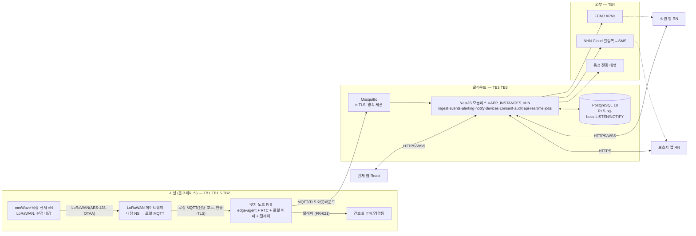
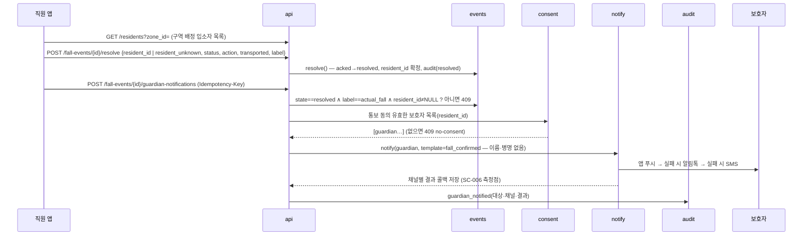
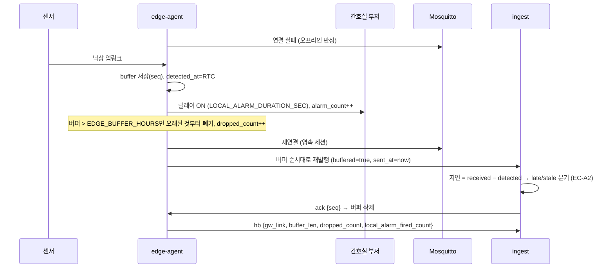

# 아키텍처 — 요양시설 낙상 감지·알림 서비스 (FallGuard)
버전: v1.1 · 기준 03 v1.1 · 개정 R1 적용(REVISIONS.md — A4 독립 검토 20건 반영, 2026-09-09)

## 진입 사전조사 (근거 3줄)
- 정량: 센서 1대 커버리지 — Vayyar Care 16㎡, Milesight VS373 4×5m(≤ SENSOR_COVERAGE_M2) → PILOT_MAX_BEDS 규모 시설에 센서 50~60대, LoRaWAN 게이트웨이 1~2대, 엣지 노드 1대 (01-recon, 확인 2026-09-08).
- 정성: 국내 병원 간호사 연구 — 알람 피로는 스트레스 증가·업무 성과 저하와 연관 (PMC13299418, 01-recon A4 정성). "지능형 필터링 없이 오탐을 걸러내지 못하면 임상의가 알람을 무시하게 된다."
- 사용자 영향: 알림 경로는 낙상(위험)과 장비 상태(정보)를 다른 채널·소리로 분리해야 직원이 진짜 알림을 무시하지 않는다(L-09). 인터넷이 끊겨도 간호실에서 소리가 나야 하고(FR-021), 관제는 "모른다"를 stale로 말해야 한다(L-06).

## Context & Scope
- 시설(온프레미스): 비영상 mmWave 낙상 센서(LoRaWAN, 판정 내장) N대 → 상용 LoRaWAN 게이트웨이(내장 네트워크 서버가 로컬 MQTT로 디코딩 업링크 발행 — **모델별 능력은 08 착수 조건에서 확인**) → **엣지 노드**(Raspberry Pi 5 + RTC + 릴레이 HAT, `edge-agent`) 시설당 1대. 게이트웨이↔엣지는 전용 포트/VLAN. 엣지는 시설 인터넷(유선 권장, LTE 백업은 시설 옵션)으로 클라우드에 아웃바운드 mTLS 연결만 한다. 포트 개방 없음.
- 클라우드: NestJS 모듈형 모놀리스 인스턴스 APP_INSTANCES_MIN + PostgreSQL 18(관리형, RLS, 일 백업+PITR) + Mosquitto 1노드(영속 세션). 외부: FCM/APNs, NHN Cloud(알림톡→SMS 대체발송), 음성 전화 대행(어댑터 뒤, 공급자 미확인 — 08 착수 조건), NTP.
- 클라이언트: 관제 웹(React, 간호실 PC — 개인 로그인·화면 잠금), 직원 앱·보호자 앱(React Native/Expo).
- 기존 시스템 없음. 법정 CCTV는 별개 시스템이며 연동하지 않는다(PX3).

## Goals / Non-goals
- Goals: G1 감지→알림 ALERT_LATENCY_P95 · G2 오탐 억제(병합·등급 분리·라벨 루프·억제 스위치) · G3 동의 기반 통보 + 감사로그. INV-1~9를 구조로 강제한다.
- Non-goals: 03 범위 밖 전부. 특히 원시 센서 데이터 클라우드 전송(INV-8), 자체 판정 모델, 너스콜 연동, 폐쇄망.

## 설계

### 시스템 컨텍스트 다이어그램


### 구현 접근 — 난점과 선택
| 난점 | 선택 | 이유 |
|---|---|---|
| 낙상 판정의 정확도·데이터 부재 | 센서 내장 판정 + **센서 어댑터**(벤더 페이로드 → 정규화 이벤트) | MVP는 감지를 사고, 알림·기록에 집중(DL-11). 어댑터로 벤더 교체 가능 |
| 다인실에서 "누가" 넘어졌는지 | 센서는 구역만 안다 → **resolve 시 직원이 구역 배정 입소자 목록에서 선택**(INV-9), 미상 허용. 통보는 특정된 이벤트만 | 비영상 레이더로 식별 불가. 침상별 센서는 비용 4배(DL-25) |
| 시설 인터넷 단일 회선 | 엣지 로컬 버퍼(SQLite WAL) + **종단 ack**(서버 DB 커밋 후 seq ack) + **로컬 경보 릴레이**(FR-021) | 단절 중에도 간호실에서 소리가 난다. 관제·앱은 같은 회선이라 최후 경로가 될 수 없다(R1 #2) |
| 초 단위 지연 + 야간 방해금지 | MQTT 상시 연결(폴링 없음) + 푸시 Time-Sensitive 기본, Critical Alert 승인 후 전환 + 관제 WSS + SMS 폴백 | 01 푸시 확정 사실. 승인 전에도 3경로. 무음 스위치는 Critical만 뚫는다(④) |
| 에스컬레이션 타이머 유실 | 이벤트 INSERT와 pg-boss 잡 INSERT를 **같은 트랜잭션** + SWEEPER_INTERVAL_SEC 스위퍼 + JOB_RETRY_LIMIT | 크래시 창에서도 타이머 없는 이벤트가 남지 않는다(FR-023, R1 #3) |
| 재전송 중복 vs 재감지 병합 | (edge_id, seq) 유니크 = 재전송 폐기 / DEDUP_WINDOW_SEC 병합은 **열린 이벤트(detected·acked)만** | 둘은 다른 문제(R1 #5). resolved 직후 두 번째 실제 낙상은 새 이벤트 |
| 시계 3개(GW·엣지·폰) | detected_at = **엣지 RTC**(로컬 MQTT 수신 시각), 메시지 sent_at으로 서버가 엣지별 오프셋 추정, CLOCK_SKEW_MAX_SEC 초과 = clock_suspect | SC-003·LATE 판정의 시계 원천을 하나로(INV-7, R1 #6) |
| 지연 도착 이벤트 | ingest 분기: ≤LATE_EVENT_SEC 정상 / ≤STALE_EVENT_MIN 지연 표시+정상 경로 / >STALE_EVENT_MIN 관제·관리자만 | 30분 전 낙상은 여전히 바닥일 수 있어 알리고, 밤새 묵은 이벤트로 새벽 통화는 막는다(FR-017) |
| 테넌트 격리 | PostgreSQL **RLS + FORCE** + 요청별 `SET LOCAL app.facility_id`(요청·인증서 CN·잡 페이로드·NOTIFY 페이로드 각각 규약) | 앱 필터 누락이 곧 유출인 도메인 → DB가 강제(INV-4). 오너 롤은 런타임 미사용 |
| 부인 방지·무결성 | audit_log append-only + **시설별** 해시 체인 + DELETE 권한 없는 롤 + AUDIT_CHAIN_VERIFY_INTERVAL_HOURS 검증 잡 | FR-009, 열람대장 3년 준용. 전역 체인은 시설 간 직렬화(R1 #13) |
| 동시 ACK | `UPDATE … WHERE acked_by IS NULL` 조건부 갱신 → 영향 행 0이면 winner:false | INV-5, 트랜잭션 1개 |
| 오탐 폭주 | 병합 + **억제 스위치**(FR-022: SUPPRESS_MAX_HOURS 만료·배지·감사) + 상태 알림 등급 분리 | P3 알람 폭주. 억제 중 실제 낙상 미알림은 배지로 가시화 |
| 하트비트 볼륨 | 엣지 하트비트 1행/EDGE_HEARTBEAT_SEC(센서 목록 내장) + device.last_seen_at 제자리 갱신. 원시 hb만 파티션·BRIN·HEARTBEAT_RAW_RETENTION_DAYS | 센서별 행이면 8.6만 행/일/시설(R1 #14). fall_event는 파티션 없음 |
| 인스턴스 2개 팬아웃 | 실시간 = PostgreSQL LISTEN/NOTIFY(페이로드는 ID만) → 각 인스턴스가 자기 WSS 클라이언트에 전달 | Redis 없이(DL-17과 일관). NOTIFY 8KB 한도는 ID만 보내 회피 |

### 홉별 지연 예산 (ALERT_LATENCY_P95 논증)
| 홉 | 예산 | 근거 |
|---|---|---|
| 센서 판정 → LoRaWAN 업링크(Class A 즉시) | 2초 | LoRaWAN 업링크는 이벤트 즉시, 재전송 1회 여유 |
| GW NS 디코드 → 로컬 MQTT | 1초 | 로컬 네트워크 |
| 엣지 정규화·버퍼·발행 → 브로커 → ingest | 1초 | 상시 TLS 세션, QoS1 |
| ingest 검증·DB 트랜잭션(이벤트+잡+audit) → alerting | 1초 | 단일 트랜잭션, 인덱스 조회 |
| 푸시 공급자(FCM/APNs) 배달 | PUSH_PROVIDER_LATENCY_BUDGET_SEC | **미확인 — 파일럿 실측**. 가장 큰 불확실 항 |
| 단말 수신 → 표시(E14 displayed) | 2초 | 앱 포그라운드/백그라운드 |
| 합계 | ≈ 12초 < ALERT_LATENCY_P95 | 여유 3초. 관제 WSS 경로는 푸시 홉이 없어 더 짧다 |

### 컴포넌트 구조
```mermaid
flowchart TB
  subgraph EDGE["edge-agent (TS, Pi 5)"]
    LORA[lorawan-client<br/>로컬 MQTT 구독(인증·TLS)]
    ADP[sensor-adapter<br/>벤더 페이로드→FallDetected/Heartbeat, detected_at=RTC]
    BUF[local-buffer<br/>SQLite WAL, seq 단조, 종단 ack 후 삭제, 초과 시 오래된 것 폐기]
    UP[cloud-uplink<br/>MQTT mTLS QoS1 영속 세션, sent_at, ack 구독]
    ALM[local-alarm<br/>릴레이 GPIO, 클라우드 단절 시 발동]
    HB[edge-heartbeat<br/>gw_link·buffer_len·dropped·ntp_synced·alarm_count]
    LORA --> ADP --> BUF --> UP
    ADP --> ALM
    UP --> HB
  end
  subgraph APP["NestJS 모놀리스 (×APP_INSTANCES_MIN)"]
    ING[ingest<br/>토픽 구독·zod 검증·(edge_id,seq) 멱등·오프셋/late/stale 분기·열린 이벤트 병합]
    EVT[events<br/>FallEvent 상태기계 detected→acked→resolved, resident 확정]
    ALT[alerting<br/>수신자 결정(당직 저장소)·팬아웃·에스컬레이션 잡·억제 확인]
    NTF[notify<br/>채널 어댑터 push/alimtalk/sms/voice + 결과 콜백(HMAC) + 미전달 판정]
    DEV[devices<br/>센서·GW·엣지 레지스트리·last_seen·오프라인 3단 판정·억제]
    CON[consent<br/>감지·통보 동의 기록·검증·배정 충돌 배지]
    AUD[audit<br/>append-only 시설별 해시 체인 — 전이·열람·설정 변경]
    STF[staff<br/>당직 구역 on/off·역할·퇴직 회수]
    RPT[reports<br/>월간 통계 CSV·오탐율 집계]
    API[api REST<br/>RFC 9457 · 스코프 · RLS 컨텍스트 · 계정 단위 rate limit]
    RT[realtime WSS<br/>LISTEN/NOTIFY 수신 → 관제·직원 앱]
    JOBS[jobs pg-boss<br/>ack-timeout·escalation·스위퍼·오프라인·리마인더·억제 만료·체인 검증·파기]
    ING --> EVT
    ING --> DEV
    ING --> JOBS
    EVT --> ALT
    EVT --> AUD
    EVT --> RT
    ALT --> NTF
    ALT --> JOBS
    ALT --> RT
    ALT --> AUD
    ALT --> STF
    DEV --> JOBS
    DEV --> RT
    JOBS --> EVT
    JOBS --> ALT
    JOBS --> DEV
    API --> EVT
    API --> CON
    API --> DEV
    API --> STF
    API --> RPT
    API --> NTF
    API --> AUD
    NTF --> AUD
    CON --> AUD
  end
  UP -- MQTT --> ING
  ING -- ack(seq) --> UP
  STAFFAPP[직원 앱] --> API
  CONSOLEW[관제 웹] --> API
  GUARDAPP[보호자 앱] --> API
```

### 데이터 흐름
**시나리오 1 — 감지 → 직원 알림 → ACK (FR-001~003, FR-023)**
```mermaid
sequenceDiagram
  participant S as 센서
  participant EN as edge-agent
  participant ING as ingest
  participant EVT as events
  participant JOBS as jobs
  participant ALT as alerting
  participant NTF as notify
  participant RT as realtime
  participant APP as 직원 앱
  S->>EN: LoRaWAN 업링크 (fall)
  EN->>EN: adapter 정규화, detected_at=RTC now, buffer 저장(seq)
  EN->>ING: MQTT f/{facility}/edge/{edge}/evt (QoS1, seq, detected_at, sent_at)
  ING->>ING: zod 검증 · (edge_id,seq) 중복이면 폐기 · 오프셋(received−sent) → clock_suspect · late/stale 분기 · 열린 이벤트 병합 판단
  ING->>EVT: TX 시작: INSERT fall_event(state=detected) + audit(created)
  ING->>JOBS: 같은 TX: INSERT ack-timeout 잡(STAFF_ACK_TIMEOUT_SEC)
  ING->>ING: TX 커밋
  ING->>EN: MQTT ack {seq} — 엣지는 버퍼에서 삭제
  EVT->>ALT: fall.detected (억제 중이면 기록만, 배지)
  ALT->>ALT: 수신자 = 당직 직원(구역) ∪ (0명이면 전 직원+시설장)
  ALT->>NTF: push(각 직원, time-sensitive/critical) — 실패 시 SMS 폴백
  ALT->>RT: NOTIFY fall.detected(ID) → 각 인스턴스 WSS 팬아웃(관제·직원 앱)
  NTF-->>APP: 푸시 표시 → E14 displayed (SC-003 측정점)
  APP->>EVT: POST /fall-events/{id}/ack (Idempotency-Key)
  EVT->>EVT: UPDATE … WHERE acked_by IS NULL → 승자 확정, audit(acked)
  EVT->>JOBS: ack-timeout 잡 취소
  EVT->>RT: "○○님이 확인했어요"
```

**시나리오 2 — 미확인 에스컬레이션 (FR-004, FR-023)**
```mermaid
sequenceDiagram
  participant JOBS as jobs(pg-boss)
  participant EVT as events
  participant ALT as alerting
  participant NTF as notify
  participant RT as realtime
  Note over JOBS: 스위퍼(SWEEPER_INTERVAL_SEC): state=detected ∧ 경과>STAFF_ACK_TIMEOUT_SEC ∧ escalation_level=0 → escalate 잡 보충
  JOBS->>EVT: ack-timeout 만료
  EVT-->>JOBS: state=detected (미확인)
  JOBS->>ALT: escalate(level=1)
  ALT->>NTF: push+SMS 전 직원 재알림, audit(escalated:1)
  ALT->>JOBS: 잡: escalation(level=2, ESCALATION_TIMEOUT_SEC − STAFF_ACK_TIMEOUT_SEC)
  JOBS->>ALT: escalate(level=2)
  ALT->>NTF: voice(야간 책임자·시설장, TTS) ×(1+ESCALATION_CALL_RETRY), 실패는 JOB_RETRY_LIMIT 재시도
  NTF-->>ALT: 통화 결과 콜백(응답/무응답, HMAC)
  ALT->>RT: 무응답이면 "에스컬레이션 미응답" 배지 + 시설장 SMS
```

**시나리오 3 — 조치 기록(입소자 확정) → 보호자 통보 (FR-005~007, INV-3·9)**


**시나리오 4 — 클라우드 단절 (FR-017, FR-021)**


### 데이터 저장 (설계 결정 관련 부분만, 전체 스키마는 05)
- `fall_event`: state CHECK, `acked_by NULL` 조건부 UPDATE로 승자 확정, `detected_at`·`received_at` NOT NULL(UTC), `resident_id` NULL→resolve 시 확정, `re_detected_count`, `late`, `clock_suspect`, `label` NULL until resolve. `UNIQUE(edge_id, seq)`. 파티션 없음(3년 ≈ 수만 행), EVENT_RETENTION_YEARS 파기 잡.
- `audit_log`: 시설별 `prev_hash`·`row_hash`, INSERT만 허용하는 롤. 검증 잡이 시설별 체인을 재계산(SC-011).
- `notification`: 유니크(event_id, recipient_id, channel, attempt) — INV-6 멱등. 결과 콜백 컬럼. 전 채널 실패 → 미전달 판정(FR-018).
- `consent`: (resident_id, guardian_id NULL 가능, kind, status, granted_at, withdrawn_at, evidence_ref). 통보 전 조회는 항상 이 표. 감지 동의 ↔ 구역 배정 충돌은 devices/consent 조인으로 배지.
- `device`: type sensor|gateway|edge_node, `report_interval_sec`(벤더 스펙), `last_seen_at`, `suppressed_until`·`suppression_reason`.
- `device_heartbeat`: 엣지 1행/EDGE_HEARTBEAT_SEC, 파티션(일)·BRIN, HEARTBEAT_RAW_RETENTION_DAYS.
- 모든 표 `facility_id NOT NULL` + RLS + FORCE. 롤: `app_owner`(마이그레이션만) / `app_rw`(DELETE 없음) / `app_jobs`(파기만).
- 엣지 `local-buffer`: SQLite(WAL) 이벤트 표 `seq, payload, acked_at NULL`. 개인정보 없음(ID만). 하트비트는 메모리. 로그는 log2ram.

## 검토한 대안 (ADR 형식 요약 — 상세·근거는 decision-log DL-16~21, DL-25~34)
| 결정 | 대안 | 왜 최종안인가 |
|---|---|---|
| 모듈형 모놀리스(NestJS 1개, 인스턴스 APP_INSTANCES_MIN) | 마이크로서비스 | 이벤트 수십/일·팀 2~4인. 분리는 배포·관측 비용만. 모듈 경계는 유지 |
| pg-boss(PostgreSQL 잡) + 이벤트와 같은 트랜잭션 + 스위퍼 | BullMQ + Redis | 구성요소 1개 줄임. 트랜잭션 원자성은 PG 잡이라서 가능 |
| MQTT(Mosquitto, mTLS, 영속 세션) + 애플리케이션 ack | HTTPS 배치 POST / 브로커 PUBACK만 신뢰 | QoS1·재접속·순서 보장 + DB 커밋 후 ack로 종단 유실 0 |
| 엣지 노드 별도(Pi 5 + 릴레이) | LoRaWAN GW 안에서 직접 클라우드 전송 | GW 펌웨어는 버퍼·재전송·어댑터·로컬 경보를 못 담는다(벤더 종속 기능 — 착수 조건에서 모델 확인) |
| RLS + FORCE + 롤 분리 | 애플리케이션 계층 where 절 | 필터 누락 1회 = 타 시설 건강정보 유출. DB 강제가 검증 가능(SC-010) |
| Time-Sensitive 기본 + Critical Alert 승인 신청 | Critical Alert 전제 | 승인 여부 미확인. 승인 전엔 SMS·관제·로컬 경보로 보완 |
| 시설별 해시 체인 감사로그 | 전역 체인 / WORM / 외부 앵커링 | 전역은 시설 간 직렬화. 외부 앵커링은 2단계 |
| 실시간 팬아웃 LISTEN/NOTIFY | Redis pub/sub | 구성요소 추가 없이 인스턴스 2개 팬아웃 |
| 하트비트 엣지 1행 + last_seen 갱신 | 센서별 행 | 8.6만 행/일/시설 회피 |
| resolve 시 입소자 선택 | 침상별 센서 / 웨어러블 태그 | 비용·착용 유지 문제. 미상 허용으로 기록은 남긴다 |

## 위협모델 (Cross-cutting: 보안)

### ① 무엇을 만드는가 — DFD + trust boundary
```mermaid
flowchart LR
  S[센서] -- "TB1 LoRaWAN(AES-128, OTAA)" --> GW[LoRaWAN GW<br/>관리 UI]
  GW -- "TB1.5 시설 LAN: 로컬 MQTT(전용 포트/VLAN, 인증·TLS)" --> EN[edge-agent<br/>Pi 5 물리]
  EN -- "TB2 인터넷: MQTT mTLS(기기 X.509)" --> MQ[Mosquitto]
  MQ --> ING[ingest]
  ING --> DB[(PostgreSQL RLS)]
  APPS[직원·보호자 앱 / 관제 웹(공용 PC)] -- "TB3 인터넷: HTTPS 토큰·쿠키" --> API[api]
  API --> DB
  NTF[notify] -- "TB4 외부 API 키" --> EXT[FCM/APNs · NHN · 음성]
  EXT -- "콜백 HMAC" --> NTF
  API -- "TB5 DB 롤·RLS" --> DB
```
자산: A1 FallEvent·조치 기록(건강정보=민감정보) · A2 입소자·보호자 신원·연락처 · A3 감사로그 · A4 기기 인증서·LoRaWAN AppKey(GW NS 저장)·외부 API 키 · A5 알림 경로(가용성 = 안전) · A6 동의 기록 · A7 보호자 연결 코드.

### ② 무엇이 잘못될 수 있는가 — STRIDE
| 자산/경계 | S | T | R | I | D | E |
|---|---|---|---|---|---|---|
| TB1 센서→GW (LoRaWAN) | 위조 센서가 가짜 낙상 주입 — OTAA 기기별 키 | 재전송 공격 — 프레임 카운터 | 해당없음(센서는 행위자가 아님, DevEUI로 추적) | 페이로드는 이벤트 코드만, AES-128 — 낮음 | 전파 재밍으로 감지 불능 — **Accept**(센서 오프라인 판정) | 해당없음(권한 개념 없음) |
| **TB1.5 시설 LAN: GW→엣지 로컬 MQTT, GW 관리 UI, 엣지 물리** | LAN 접근자가 가짜 낙상·가짜 하트비트 주입 — 전용 포트/VLAN + 로컬 MQTT 인증·TLS | GW 관리 UI 기본 계정으로 AppKey·NS 설정 변조 — 계정 변경·관리 포트 격리 | 해당없음(행위자 없음, 엣지 로그로 추적) | 엣지 SD카드의 X.509 개인키·버퍼 — 버퍼엔 ID만, 키는 파일 권한+도난 시 폐기 | 로컬 MQTT 플러딩·하트비트 억제 — 전용 포트 격리, 엣지 하트비트 gw_link 보고 | 해당없음 |
| TB2 엣지→클라우드 (MQTT) | 탈취 인증서로 시설 위장 — 기기별 X.509 + 폐기 목록 | 전송 중 변조 — TLS | 이벤트 발신 부인 — seq·기기 ID·서버 수신 로그 | 이벤트 메타 노출 — TLS, 원시 데이터 미전송(INV-8) | 브로커 플러딩 — 기기별 토픽 ACL·rate limit | 자기 시설 외 토픽 발행 — ACL `f/{facility}/#`만 |
| TB3 앱·웹→API | 훔친 토큰으로 직원 위장 — 짧은 세션(STAFF_SESSION_HOURS)·기기 분실 시 서버 폐기·퇴직 시 회수 | 요청 변조(ack를 남 이름으로) — 서버가 토큰 주체로만 기록 | "내가 확인 안 했다" — 감사로그 해시 체인. 관제 공용 PC는 개인 로그인·화면 잠금 | 타 시설·타 입소자 조회 — RLS + 보호자 스코프. 연결 코드 브루트포스 — LINK_CODE_MAX_ATTEMPTS·TTL. 잠금화면 미리보기 — 본문에 이름 없음 | 로그인·ack 폭주 — 계정 단위 rate limit(ack는 완화, IP 제한 아님: 시설 NAT) | 보호자가 직원 API 호출 — 스코프 검사 |
| TB4 외부 알림 대행 | 가짜 콜백 — HMAC 서명·CALLBACK_TIMESTAMP_WINDOW_SEC·IP 허용 목록. API 키 유출로 우리 명의 발송 — 비밀 저장소·회전·발신 프로필 제한 | 콜백 변조 — 동일 | 발송 부인 — 대행사 발송 ID 저장 | 알림 본문 최소화(구역·시각·조치 요약, 이름·병명 없음) | 대행사 장애 — 채널 폴백 체인 + 미전달 표시(FR-018) | 해당없음(대행사에 우리 권한 없음) |
| TB5 앱→DB | 앱 롤 오용 — 최소 권한 롤(감사로그 INSERT만) | 감사로그 UPDATE/DELETE — 권한 없음 + 체인 | 해당없음(DB 접근은 앱 경유, 앱 로그로 추적) | 덤프·백업 유출 — 저장·백업 암호화·접근 로그 | 파티션·잠금 — hb 파티션·보존 파기 | 관리자 롤·오너 롤로 RLS 우회 — FORCE RLS, 오너 런타임 미사용, 운영 접근 MFA·감사 |
| A5 알림 경로(가용성) | 해당없음 | 해당없음 | 해당없음 | 해당없음 | 푸시 미도달·앱 종료·방해금지·무음·시설 회선 단절 — 3경로 + 에스컬레이션 전화 + **로컬 경보** | 해당없음 |
| A6 동의 기록 | 위조 동의 입력 — 관리자만 + 증빙 참조 + 감사 | 철회 삭제 — append-only 상태 전이 | 동의 부인 — 증빙·일시·입력자 | 해당없음(동의 자체는 민감정보 아님) | 해당없음 | 직원이 동의 조작 — 관리자 스코프만 |

### ③ 무엇을 할 것인가 — 위협별 대응 (security-review 체크리스트 반영)
| 위협 | 대응 | 대책 |
|---|---|---|
| 위조 센서·재전송(TB1) | Mitigate | LoRaWAN OTAA 기기별 AppKey, 프레임 카운터 검증(GW NS), 미등록 DevEUI 거부 |
| 시설 LAN 주입·GW 관리 UI(TB1.5) | Mitigate | GW↔엣지 전용 포트/VLAN, 로컬 MQTT username/password + TLS, GW 관리 UI 기본 계정 변경·관리 포트 LAN 격리·펌웨어 갱신, 설치 체크리스트(07) |
| 엣지 물리 접근(TB1.5) | Mitigate + Accept | 키 파일 권한 최소, 버퍼에 개인정보 없음(ID만), 하트비트 소실 시 도난 의심 알림, 인증서 폐기. 디스크 암호화는 Pi 5에 TPM이 없어 **Accept**(잔여) |
| 시설 위장·토픽 월권(TB2) | Mitigate | 기기별 X.509(프로비저닝 시 발급), Mosquitto ACL `f/{facility}/#`, 인증서 폐기 목록, 브로커 rate limit |
| 토큰 탈취·퇴직 계정(TB3) | Mitigate | 웹: httpOnly·Secure·SameSite=Strict 쿠키 + CSRF 토큰 / 앱: 단기 액세스 + 회전 리프레시, 서버측 세션 폐기 API, argon2id. 직원 비활성화 시 세션 전부 폐기(E04) |
| 권한 상승(TB3) | Mitigate | 스코프 `fall:event:ack` 등 라우트 가드, 보호자 리소스는 guardian_link 검증, RLS 이중 |
| 연결 코드 브루트포스(TB3) | Mitigate | 코드 영숫자 8자리, LINK_CODE_TTL_HOURS, 입소자 단위 LINK_CODE_MAX_ATTEMPTS 후 잠금(423) |
| 잠금화면 미리보기(TB3 I) | Mitigate | 직원 알림 본문 = "302호 확인 필요" 수준(이름 없음), 보호자 알림도 이름 마스킹 |
| 입력 변조·인젝션(TB3·TB2) | Mitigate | 모든 입력 zod 스키마(MQTT 페이로드 포함), ORM 파라미터 쿼리, 에러는 RFC 9457 + 스택 미노출 |
| 레이트리밋(TB3 D) | Mitigate | 계정 단위 300/분, `/auth/*` 10/분, ack 엔드포인트는 계정 단위 완화(다발 낙상 시 차단 방지), IP 제한은 인증 전 구간만 |
| 가짜 콜백·API 키 유출(TB4) | Mitigate | HMAC-SHA256 서명 검증·CALLBACK_TIMESTAMP_WINDOW_SEC·IP 허용 목록(대행사가 제공하면). 키는 비밀 저장소·분기 회전·발신 프로필/번호 제한 |
| 대행사 장애(TB4) | Mitigate + Accept | 폴백 체인·미전달 표시. 전 채널 동시 장애는 Accept(로컬 경보는 단절 시에만 발동) |
| 감사로그 변조(TB5) | Mitigate | 앱 롤에 audit_log UPDATE/DELETE 권한 없음, 시설별 해시 체인, AUDIT_CHAIN_VERIFY_INTERVAL_HOURS 검증 잡 |
| RLS 우회(TB5 E) | Mitigate | FORCE ROW LEVEL SECURITY, 오너 롤 런타임 미사용, 운영자 DB 접근 MFA + 세션 기록 |
| 백업 유출(TB5) | Mitigate | 저장 암호화 + 백업 암호화 + 접근 감사. 키는 KMS/비밀 저장소, 코드·산출물에 값 없음 |
| 전파 재밍·정전(TB1) | Accept | 감지 불능을 막을 수 없음. 오프라인 판정(FR-008)으로 "모른다"를 알린다. 시설에 사전 고지 |
| 비밀 관리 | Mitigate | 전부 환경변수·비밀 저장소, `.env` gitignore, 시크릿 스캔 CI |
| 의존성 | Mitigate | lockfile 커밋, `npm audit` CI 게이트, Dependabot |
| 로그 내 민감정보 | Mitigate | 로그에 입소자 실명·연락처 금지(ID만), 알림 본문 로그 마스킹 |

### ④ 충분한가 — 상위 리스크 3 재검토 + 잔여 리스크
1. **알림 미도달(A5, D)** — 가장 비싼 실패(바닥 방치). 대책: 푸시·관제 WSS·SMS 3경로 + 에스컬레이션 전화 + 시설 회선 단절 시 로컬 경보(FR-021). 잔여: (a) iOS **무음 스위치**는 Critical Alert 승인 전에는 Time-Sensitive로 못 뚫는다 → SC-003 시험 조건에 무음 폰 포함, 승인 신청은 착수 조건; (b) 음성 대행 미확보 시 level 2는 SMS만; (c) 인터넷 단절 중 직원 앱·관제는 침묵하고 로컬 경보만 남는다 — EDGE_BUFFER_HOURS 안에 복구되지 않으면 이벤트 폐기(dropped_count로 사후 확인). 시설에 서면 고지.
2. **타 시설·타 입소자 건강정보 노출(TB3·TB5, I)** — RLS+FORCE + 스코프 + 연결 코드 잠금 + 자동 테스트(SC-010). 잔여: 운영자 DB 직접 접근 — MFA·접근 로그로 억제, 완전 제거는 못 함. 관제 공용 PC의 어깨너머 노출 — 화면 잠금·마스킹.
3. **위조·재전송 이벤트로 오탐 유발(TB1·TB1.5·TB2, S/T)** — 기기 키·프레임 카운터·LAN 격리·로컬 MQTT 인증·ACL·(edge_id, seq) 멱등. 잔여: 물리 접근한 내부자가 센서를 옮겨 다는 것 — 바인딩 변경은 관리자 감사로그로 추적만.
- 잔여 리스크(수용): 정전·재밍 중 감지 불능(EC-D3), 센서 내장 판정의 블랙박스(파일럿 SC-001·002로만 검증), 다인실 "미상" 이벤트는 통보 불가(기록만), 엣지 디스크 미암호화(ID만 저장), 전 채널 동시 장애.

## Cross-cutting
- **엣지 노드 운영(P1 대책 이관)**: read-only rootfs + 쓰기 구역(tmpfs, 버퍼 파티션만 영속), log2ram, HW watchdog(≤15초) + systemd 재시작, A/B 파티션 OTA + 서명 검증 + 시설 단위 카나리, RTC 모듈 + NTP(ntp_synced를 하트비트에), 릴레이 HAT(간호실 부저/경광등), 프로비저닝은 이미지 클레임 → 첫 접속 시 시설 바인딩. 게이트웨이·엣지·센서 오프라인은 devices가 3단으로 구분(EC-D1).
- **배포·DR 구조(상세 07)**: 앱 인스턴스 APP_INSTANCES_MIN 뒤 로드밸런서(롤링 배포, WSS는 재접속), 관리형 PostgreSQL 일 백업 + PITR(RPO_HOURS·RTO_HOURS), Mosquitto 단일 노드(재시작 수십 초 — 엣지 버퍼·영속 세션이 흡수), SLO는 SERVICE_AVAILABILITY_SLO — 클라우드 다운 시에도 로컬 경보(FR-021)가 감지→경보를 유지하므로 MVP 수준으로 수용(DL-28).
- **관측성**(상세 07): 골든 시그널은 "감지→표시 지연"(latency, 홉별 타임스탬프)·"이벤트/알림 처리량"·"채널 실패율·미전달"·"pg-boss 잡 지연·큐 길이·스위퍼 보충 건수"(saturation). 모든 로그에 facility_id·event_id 상관 ID. 엣지는 하트비트에 버퍼 길이·폐기 수·gw_link·ntp_synced·로컬 경보 횟수.
- **프라이버시**: 클라우드는 이벤트 메타·조치 요약·연락처만 보유(INV-8). 알림 본문에 이름·병명·상태 세부 없음. 보존 EVENT_RETENTION_YEARS 후 파기, 동의 철회 CONSENT_WITHDRAW_PURGE_DAYS 후 보호자 연결 파기(FR-019). 입소자 실명은 앱 로컬 캐시 미저장(P4). 법정 CCTV와 데이터 미연동. 다인실 감지 동의 정책은 03 FR-007·가정 목록.
