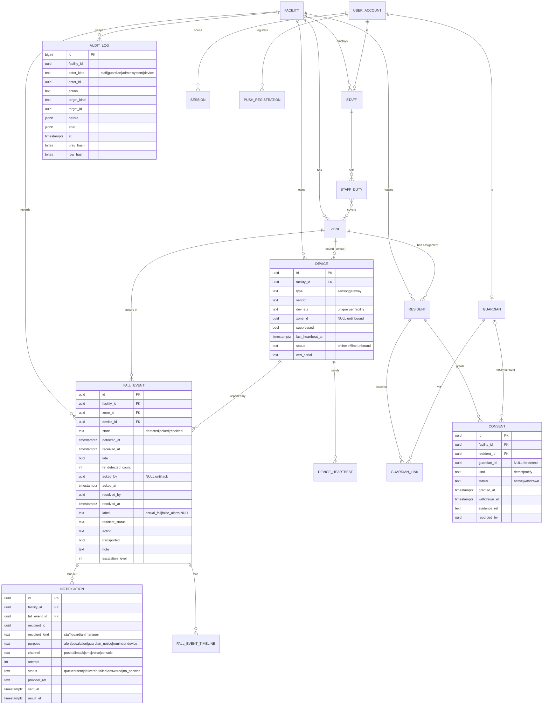

# API 계약 & 데이터 스키마 — 요양시설 낙상 감지·알림 서비스 (FallGuard)
버전: v1.0 · 기준 03 v1.0
개정 노트 R1 적용 대기 — REVISIONS.md R1 (05 패치 목록대로 적용 후 v1.1 · 기준 03 v1.1로 올리고 이 줄을 지운다)

## 진입 사전조사 (근거 3줄)
- 정량: NHN Cloud 알림톡은 카카오 발송 실패가 확정된 뒤 SMS 대체발송되며 문자 수신까지 최대 수십 초 소요 (01-recon 스택 후보, docs.nhncloud.com, 확인 2026-09-08) → 통보 도달 측정은 "첫 채널 도달 콜백" 기준(SC-006), 폴백 체인은 서버가 순차 실행.
- 정성: 유사 제품 API 스펙 공개 사례 미확인(01-recon A5) → 외부 참조 없이 Zalando 가이드·RFC 9457·Stripe 멱등성 관례를 따른다.
- 사용자 영향: 직원 앱의 ack는 한 탭이므로 네트워크 재시도가 자동으로 일어난다 → Idempotency-Key 없이는 중복 ack·중복 통보가 생긴다(UX-01 유지 + INV-5·6).

## 규약 (전 엔드포인트 공통)
- **베이스**: `https://api.<domain>/` — 경로 kebab-case, 자원 복수형, 동사는 상태 전이 액션에만(`/ack`, `/resolve`).
- **버저닝**: `Accept: application/vnd.fallguard.v1+json` (생략 시 v1). URL 버저닝 안 함(stage-templates 우선, api-design 스킬과 충돌 — DL-22). 스펙 파일 semver.
- **에러 포맷**: RFC 9457 `application/problem+json` — `type`(`https://fallguard.dev/problems/<slug>`), `title`, `status`, `detail`, `instance`, 검증 오류는 `errors[]{field, code}`. 스택트레이스·SQL 미노출.
- **인증**: 웹 관제·관리자 = httpOnly·Secure·SameSite=Strict 세션 쿠키 + CSRF 토큰. 앱 = `Authorization: Bearer <access>`(만료 15분) + 회전 리프레시(직원 STAFF_SESSION_HOURS, 보호자 GUARDIAN_SESSION_DAYS). 게이트웨이 = MQTT mTLS(HTTP 없음).
- **권한 스코프**: `<모듈>:<자원>:<행위>` — 역할별 기본 묶음: `staff`(fall:event:read/ack/resolve/notify, staff:duty:write, device:status:read) · `manager`(staff + admin:*:read, report:*:read, consent:*:write) · `admin`(전부) · `guardian`(guardian:me:*만). 모든 요청은 세션의 facility_id로 `SET LOCAL app.facility_id` → RLS(INV-4). 보호자 리소스는 guardian_link 검증 추가.
- **페이지네이션**: 커서(`?cursor=&limit=`, 기본 50·최대 200), 응답 `meta.next_cursor`. offset 없음.
- **멱등성**: 부작용 있는 POST는 `Idempotency-Key`(클라이언트 UUID) 필수. 서버 24h 보관, 같은 키+같은 본문 → 최초 응답 재생, 같은 키+다른 본문 → 422 `idempotency-key-reuse`.
- **레이트리밋**: 인증 전 IP 30/분, 인증 후 사용자 300/분, `/auth/*` 10/분, 웹훅 공급자별 600/분. 초과 429 + `Retry-After`.
- **시각·식별자**: 모든 시각 UTC ISO 8601(`2026-09-08T05:32:07.120Z`), ID는 UUIDv7(시간 정렬, 클라이언트 생성 허용은 Idempotency-Key만). 전화번호 E.164.
- **응답 봉투**: 단건 `{data}`, 목록 `{data[], meta{next_cursor}}`. 성공 코드: 200/201(+Location)/204.
- **실시간**: `wss://api.<domain>/realtime` — 세션 인증 후 `subscribe {channels:["zones","fall-events"]}`. 서버→클라 메시지 `{type, data, at}`; `type ∈ fall.detected|fall.acked|fall.escalated|fall.resolved|device.offline|device.online|zone.status`. 하트비트 STALE_AFTER_SEC 미만 주기.

## 문제 유형 카탈로그 (RFC 9457 `type` slug)
| slug | status | 언제 |
|---|---|---|
| validation-error | 422 | 스키마 위반(errors[] 동봉) |
| unauthenticated | 401 | 토큰·세션 없음/만료 |
| forbidden-scope | 403 | 스코프 없음 또는 타 시설·타 입소자 |
| not-found | 404 | RLS 밖 자원도 404(존재 노출 금지) |
| event-state-conflict | 409 | 상태 전이 위반(INV-2) — 예: detected 상태에서 resolve |
| event-not-notifiable | 409 | resolved 아님 또는 label ≠ actual_fall (INV-3, EC-C4) |
| no-consent | 409 | 통보 동의 유효 보호자 0명 (EC-C2) |
| device-not-bound | 409 | 구역 미바인딩 센서의 이벤트·명령 |
| idempotency-key-reuse | 422 | 같은 키·다른 본문 |
| rate-limited | 429 | 레이트리밋 |
| version-unsupported | 406 | 미지원 Accept 버전 |
| app-update-required | 426 | 직원 앱 hard gate (FR-020) |

## 엔드포인트 표
| ID | 메서드 경로 | 요청(핵심 필드) | 응답 | 주요 에러(type) | 스코프 |
|---|---|---|---|---|---|
| E01 | POST /auth/sessions | login(email 또는 phone), password, client(web/app), device_name | 200 {access, refresh, user{role, facility_id}} 또는 Set-Cookie | unauthenticated, rate-limited | 공개 |
| E02 | POST /auth/sessions/refresh | refresh | 200 {access, refresh} (회전) | unauthenticated | 공개 |
| E03 | DELETE /auth/sessions/current | — | 204 | — | 인증 |
| E04 | POST /auth/sessions/revoke-all | user_id(자기 또는 admin) | 204 | forbidden-scope | 인증 / admin:user:write |
| E05 | PUT /push-registrations/current | platform(ios/android), token, critical_alert_granted(bool) | 200 | validation-error | 인증(앱) |
| E06 | PUT /staff/me/duty | on(bool), zone_ids[] | 200 {on, zone_ids, since} | validation-error | staff:duty:write |
| E07 | GET /staff/me | — | 200 {id, name, role, duty} | — | 인증 |
| E08 | GET /fall-events | state, zone_id, since, until, label, cursor, limit | 200 {data[], meta} | validation-error | fall:event:read |
| E09 | GET /fall-events/{id} | — | 200 {…, timeline[]: detected/alerted/escalated/acked/resolved/notified} | not-found | fall:event:read |
| E10 | POST /fall-events/{id}/ack | Idempotency-Key | 200 {acked_by, acked_at, winner(bool)} — 타인이 먼저면 winner=false(INV-5, EC-B1) | event-state-conflict(resolved 후), not-found | fall:event:ack |
| E11 | POST /fall-events/{id}/resolve | Idempotency-Key, resident_status(enum), action(enum), transported(bool), label(actual_fall/false_alarm), note? | 200 {state:resolved, label, resolved_by} | event-state-conflict(acked 아님), validation-error(label 누락) | fall:event:resolve |
| E12 | POST /fall-events/{id}/guardian-notifications | Idempotency-Key | 202 {notifications[]{guardian_id, id, channel_plan[]}} | event-not-notifiable, no-consent | fall:event:notify |
| E13 | GET /fall-events/{id}/notifications | — | 200 {data[]{recipient, channel, attempt, status, provider_ref, at}} | not-found | fall:event:read |
| E14 | POST /fall-events/{id}/client-events | kind(displayed/opened), at(클라이언트 UTC), device_id | 202 | validation-error | fall:event:read |
| E15 | GET /zones | — | 200 {data[]{id, name, kind, status(normal/alert/acked/offline/consent-missing), devices[], open_event_id}} | — | device:status:read |
| E16 | GET /devices | type(sensor/gateway), status, cursor | 200 {data[]{id, type, zone_id, last_heartbeat_at, status, suppressed}} | — | device:status:read |
| E17 | POST /devices | Idempotency-Key, type, vendor, dev_eui 또는 gw_id, claim_code | 201 +Location | validation-error | admin:device:write |
| E18 | POST /devices/{id}/bindings | Idempotency-Key, zone_id, qr_claim | 201 {device_id, zone_id, bound_at} | device-not-bound(claim 불일치), not-found | admin:device:write |
| E19 | PATCH /devices/{id} | name?, suppressed?(bool, 사유) | 200 | validation-error | admin:device:write |
| E20 | GET /residents/{id}/consents | — | 200 {data[]{id, kind, guardian_id, status, granted_at, withdrawn_at, evidence_ref}} | not-found | consent:record:read |
| E21 | POST /residents/{id}/consents | Idempotency-Key, kind(detect/notify), guardian_id?(notify 필수), granted_at, evidence_ref | 201 | validation-error | consent:record:write |
| E22 | POST /consents/{id}/withdrawal | Idempotency-Key, withdrawn_at, reason? | 200 {status:withdrawn} | event-state-conflict(이미 철회) | consent:record:write |
| E23 | GET/POST /residents · PATCH /residents/{id} | name, zone_id(침상 배정), birth_year, active | 200/201 | validation-error | admin:resident:* |
| E24 | GET/POST /zones · PATCH /zones/{id} | name, kind(bedroom/corridor/living/bathroom), floor | 200/201 | validation-error | admin:zone:* |
| E25 | GET/POST /staff · PATCH /staff/{id} | name, role, phone, email, active (초대 메일/문자 발송) | 200/201 | validation-error | admin:staff:* |
| E26 | POST /residents/{id}/guardian-link-codes | Idempotency-Key | 201 {code, expires_at(72h)} | not-found | admin:resident:write |
| E27 | POST /guardians/me/links | code | 201 {resident{id, name_masked}, facility{name, phone}} | not-found(코드 무효/만료) | guardian:me:write |
| E28 | GET /guardians/me/notifications | cursor | 200 {data[]{id, resident_name_masked, zone, detected_at, acked_at, resolved_at, summary, facility_phone}} | — | guardian:me:read |
| E29 | GET /reports/fall-statistics | month(YYYY-MM), format(csv/json) | 200 CSV/JSON | validation-error | report:stat:read |
| E30 | GET /reports/false-alarm-rates | days(기본 30) | 200 {data[]{device_id, zone, events, false_alarms, rate}} | — | report:stat:read |
| E31 | GET /audit-logs · GET /audit-logs/verification | cursor / — | 200 {data[]} / 200 {ok(bool), checked, broken_at?} | — | admin:audit:read |
| E32 | GET /app-versions/{platform} | app(staff/guardian) | 200 {min_supported, latest, gate(hard/soft)} | — | 공개 |
| E33 | POST /webhooks/notification-providers/{provider} | 공급자 페이로드 + 서명 헤더 | 204 | forbidden-scope(서명 불일치) | HMAC |
| E34 | GET /health · GET /metrics | — | 200 | — | 내부(네트워크 제한) |

### 엣지 계약 (MQTT, HTTP 아님)
| 토픽 | 방향 | 페이로드(JSON, zod 검증) | QoS |
|---|---|---|---|
| `f/{facility_id}/gw/{gw_id}/evt` | GW→클라우드 | `{seq(int64, 단조), kind:"fall", device_id, detected_at(UTC), vendor_ref?, buffered(bool)}` | 1 |
| `f/{facility_id}/gw/{gw_id}/hb` | GW→클라우드 | `{at, gw:{uptime_s, buffer_len, last_sent_seq, clock_source(ntp/rtc)}, devices[]{device_id, last_seen_at, battery?, rssi?}}` 주기 SENSOR_HEARTBEAT_SEC | 0 |
| `f/{facility_id}/gw/{gw_id}/ack` | 클라우드→GW | `{seq}` — 수신 확인, GW는 이 seq 이하를 버퍼에서 제거 | 1 |
| `f/{facility_id}/gw/{gw_id}/cmd` | 클라우드→GW | `{cmd:"resync"\|"suppress"\|"unsuppress", device_id?}` | 1 |
브로커 ACL: 인증서 CN=`gw:{facility_id}:{gw_id}` → 자기 토픽만 발행·구독. 순서 보장: seq 단조, 서버는 (gw_id, seq) 유니크로 중복 폐기(FR-017). received_at − detected_at > LATE_EVENT_SEC → `late=true` 표시.

## OpenAPI 스케치 (핵심 3개)
```yaml
openapi: 3.1.0
info: {title: FallGuard API, version: 1.0.0}
paths:
  /fall-events/{id}/ack:
    post:
      parameters: [{name: id, in: path, required: true, schema: {type: string, format: uuid}},
                   {name: Idempotency-Key, in: header, required: true, schema: {type: string, format: uuid}}]
      responses:
        "200": {description: 확인 처리(승자 여부 포함), content: {application/json: {schema:
          {type: object, required: [data], properties: {data: {type: object, required: [acked_by, acked_at, winner],
           properties: {acked_by: {type: string}, acked_at: {type: string, format: date-time}, winner: {type: boolean}}}}}}}}
        "409": {$ref: "#/components/responses/Problem"}
  /fall-events/{id}/resolve:
    post:
      requestBody: {required: true, content: {application/json: {schema:
        {type: object, required: [resident_status, action, transported, label],
         properties: {resident_status: {enum: [uninjured, minor_injury, injury, unresponsive]},
                      action: {enum: [assisted_up, first_aid, observation, called_119]},
                      transported: {type: boolean}, label: {enum: [actual_fall, false_alarm]},
                      note: {type: string, maxLength: 500}}}}}}
      responses: {"200": {description: resolved}, "409": {$ref: "#/components/responses/Problem"}, "422": {$ref: "#/components/responses/Problem"}}
  /fall-events/{id}/guardian-notifications:
    post:
      responses: {"202": {description: 발송 접수(보호자별 notification id)}, "409": {$ref: "#/components/responses/Problem"}}
components:
  responses:
    Problem: {description: RFC 9457, content: {application/problem+json: {schema:
      {type: object, properties: {type: {type: string, format: uri}, title: {type: string}, status: {type: integer},
       detail: {type: string}, instance: {type: string}, errors: {type: array, items: {type: object, properties: {field: {type: string}, code: {type: string}}}}}}}}}
```

## ERD

소프트삭제: RESIDENT·STAFF·GUARDIAN·DEVICE·ZONE은 `deactivated_at`(소프트). FALL_EVENT·AUDIT_LOG·CONSENT·NOTIFICATION은 삭제·비활성 없음(보존 만료 파기 배치만, FR-019).

## DDL 스케치 (제약이 불변식을 강제하는 표만)
```sql
CREATE TABLE fall_event (
  id uuid PRIMARY KEY,                       -- UUIDv7
  facility_id uuid NOT NULL REFERENCES facility(id),
  zone_id uuid NOT NULL REFERENCES zone(id),
  device_id uuid NOT NULL REFERENCES device(id),
  gw_id uuid NOT NULL, seq bigint NOT NULL,
  state text NOT NULL CHECK (state IN ('detected','acked','resolved')),
  detected_at timestamptz NOT NULL, received_at timestamptz NOT NULL,   -- INV-7
  late boolean NOT NULL DEFAULT false,
  re_detected_count int NOT NULL DEFAULT 0,
  acked_by uuid, acked_at timestamptz,
  resolved_by uuid, resolved_at timestamptz,
  label text CHECK (label IN ('actual_fall','false_alarm')),
  resident_status text, action text, transported boolean, note text,
  escalation_level int NOT NULL DEFAULT 0,
  CONSTRAINT ack_pair CHECK ((acked_by IS NULL) = (acked_at IS NULL)),
  CONSTRAINT resolved_needs_label CHECK (state <> 'resolved' OR label IS NOT NULL),          -- FR-005
  CONSTRAINT state_order CHECK (
    (state = 'detected' AND acked_at IS NULL AND resolved_at IS NULL) OR
    (state = 'acked' AND acked_at IS NOT NULL AND resolved_at IS NULL) OR
    (state = 'resolved' AND acked_at IS NOT NULL AND resolved_at IS NOT NULL)),             -- INV-2
  UNIQUE (gw_id, seq)                                                                         -- FR-017 중복 폐기
) PARTITION BY RANGE (detected_at);                                                           -- 월 파티션, EVENT_RETENTION_YEARS
CREATE INDEX fall_event_open ON fall_event (facility_id, zone_id) WHERE state <> 'resolved';  -- 관제 상태판·DEDUP 조회
CREATE INDEX fall_event_facility_time ON fall_event (facility_id, detected_at DESC);
-- ack 승자 확정 (INV-5): UPDATE fall_event SET state='acked', acked_by=$1, acked_at=now()
--   WHERE id=$2 AND facility_id=current_setting('app.facility_id')::uuid AND acked_by IS NULL;  → 영향 행 0 = winner:false
ALTER TABLE fall_event ENABLE ROW LEVEL SECURITY;
CREATE POLICY fall_event_tenant ON fall_event USING (facility_id = (SELECT current_setting('app.facility_id')::uuid));
REVOKE DELETE ON fall_event FROM app_rw;                                                      -- INV-1

CREATE TABLE notification (
  id uuid PRIMARY KEY, facility_id uuid NOT NULL, fall_event_id uuid,
  recipient_id uuid NOT NULL, recipient_kind text NOT NULL, purpose text NOT NULL,
  channel text NOT NULL CHECK (channel IN ('push','alimtalk','sms','voice','console')),
  attempt int NOT NULL DEFAULT 1, status text NOT NULL, provider_ref text,
  sent_at timestamptz, result_at timestamptz,
  UNIQUE (fall_event_id, recipient_id, channel, attempt)                                      -- INV-6
);

CREATE TABLE consent (
  id uuid PRIMARY KEY, facility_id uuid NOT NULL, resident_id uuid NOT NULL REFERENCES resident(id),
  guardian_id uuid REFERENCES guardian(id),
  kind text NOT NULL CHECK (kind IN ('detect','notify')),
  status text NOT NULL CHECK (status IN ('active','withdrawn')),
  granted_at timestamptz NOT NULL, withdrawn_at timestamptz, evidence_ref text NOT NULL, recorded_by uuid NOT NULL,
  CONSTRAINT notify_needs_guardian CHECK (kind <> 'notify' OR guardian_id IS NOT NULL),
  CONSTRAINT withdrawn_pair CHECK ((status = 'withdrawn') = (withdrawn_at IS NOT NULL))
);
CREATE UNIQUE INDEX consent_active_notify ON consent (resident_id, guardian_id) WHERE kind='notify' AND status='active';

CREATE TABLE audit_log (
  id bigint GENERATED ALWAYS AS IDENTITY PRIMARY KEY, facility_id uuid NOT NULL,
  actor_kind text NOT NULL, actor_id uuid, action text NOT NULL, target_kind text NOT NULL, target_id uuid,
  before jsonb, after jsonb, at timestamptz NOT NULL DEFAULT now(),
  prev_hash bytea NOT NULL, row_hash bytea NOT NULL                                          -- SHA-256(prev_hash || canonical(row))
);
GRANT INSERT, SELECT ON audit_log TO app_rw; REVOKE UPDATE, DELETE ON audit_log FROM app_rw;  -- FR-009, SC-011
CREATE INDEX audit_log_facility_time ON audit_log (facility_id, at DESC);

CREATE TABLE idempotency_key (
  key uuid NOT NULL, user_id uuid NOT NULL, route text NOT NULL, request_hash bytea NOT NULL,
  response_status int, response_body jsonb, created_at timestamptz NOT NULL DEFAULT now(),
  PRIMARY KEY (user_id, key)
);                                                                                            -- 24h 파기 잡
CREATE TABLE device_heartbeat (device_id uuid NOT NULL, at timestamptz NOT NULL, payload jsonb) PARTITION BY RANGE (at);  -- HEARTBEAT_RAW_RETENTION_DAYS
CREATE INDEX device_heartbeat_brin ON device_heartbeat USING brin (at);
```
공통: 모든 표 `facility_id NOT NULL` + RLS 정책 동일. 시각 `timestamptz`. 문자열 `text`. 앱 롤 `app_rw`(DELETE 없음), 잡 롤 `app_jobs`(파기 배치만 DELETE — 보존 만료 조건 함수로 제한), 운영 롤은 MFA.

## 데이터 규칙
- 시각: 전부 UTC `timestamptz`. 클라이언트 표시만 시설 시간대(Asia/Seoul). SC-003 지연 = `client_displayed_at − detected_at` (클라이언트 시각은 서버 시각과의 오프셋을 E14 수신 시 보정).
- 식별자: UUIDv7. 외부 노출 ID = 내부 ID(RLS로 보호되므로 별도 난독화 없음). 감사로그 id는 bigint(체인 순서).
- 개인정보: 보호자 응답에서 입소자 이름은 마스킹(`김○○`), 알림 본문에 병명·상태 세부 없음. 로그에는 ID만.
- 보존: FALL_EVENT·AUDIT_LOG·NOTIFICATION·CONSENT = EVENT_RETENTION_YEARS / AUDIT_RETENTION_YEARS, DEVICE_HEARTBEAT = HEARTBEAT_RAW_RETENTION_DAYS, idempotency_key = 24h, 동의 철회 후 GUARDIAN_LINK = CONSENT_WITHDRAW_PURGE_DAYS.
- 금액 없음(MVP 결제 없음).

## 규칙·상수 파일
`packages/shared/src/constants.ts` — 03 상수 표의 이름을 그대로 export하고 값은 03이 단일 출처. 각 항목에 `source: "03-prd 상수 표 DL-#"` 주석. 게임·시뮬 아님이므로 임의값 비율 리포트는 해당 없음.

## 커버리지 매핑 (P0·P1 요구사항 → 엔드포인트/이벤트; 매핑 0건 = 결함)
| FR-ID | 우선순위 | 담당 엔드포인트/이벤트 |
|---|---|---|
| FR-001 | P0 | MQTT `evt` 토픽 → ingest(DEDUP_WINDOW_SEC 병합), E09 timeline |
| FR-002 | P0 | 내부 fall.detected → notify(push) + WSS `fall.detected`, E05(푸시 토큰), E14(표시 시각 측정) |
| FR-003 | P0 | E10 |
| FR-004 | P0 | pg-boss ack-timeout/escalation 잡 → notify(push/sms/voice), WSS `fall.escalated`, E09 timeline |
| FR-005 | P1 | E11, 리마인더 잡(RESOLVE_REMINDER_MIN) |
| FR-006 | P1 | E12, E13, E33 |
| FR-007 | P0 | E20, E21, E22, E15(consent-missing 상태) |
| FR-008 | P0 | MQTT `hb` 토픽 → devices, 오프라인 잡, E15, E16, WSS `device.offline/online` |
| FR-009 | P0 | audit 모듈(모든 전이), E31 |
| FR-010 | P1 | E15, E08, WSS `zone.status` |
| FR-011 | P1 | E01, E06, E07, E10, E11 |
| FR-012 | P1 | E27, E28 |
| FR-013 | P2 | E17, E18, E23, E24, E25, E26 |
| FR-014 | P2 | E29 |
| FR-015 | P0 | 전 엔드포인트 RLS 컨텍스트(규약), E01 세션의 facility_id |
| FR-016 | P1 | E30 |
| FR-017 | P0 | MQTT `evt`(seq, buffered) + `ack` 토픽, (gw_id, seq) 유니크, `late` 표시 |
| FR-018 | P1 | E33, E13, WSS/E15 미전달 표시 |
| FR-019 | P2 | 파기 잡(엔드포인트 없음, app_jobs 롤) |
| FR-020 | P2 | E32, 426 app-update-required |
P0·P1 20건 중 P0 9 · P1 7 전부 매핑됨(P2 4건도 매핑). UX-01(1탭 ack) = E10 단일 호출·Idempotency-Key 재시도 안전.
