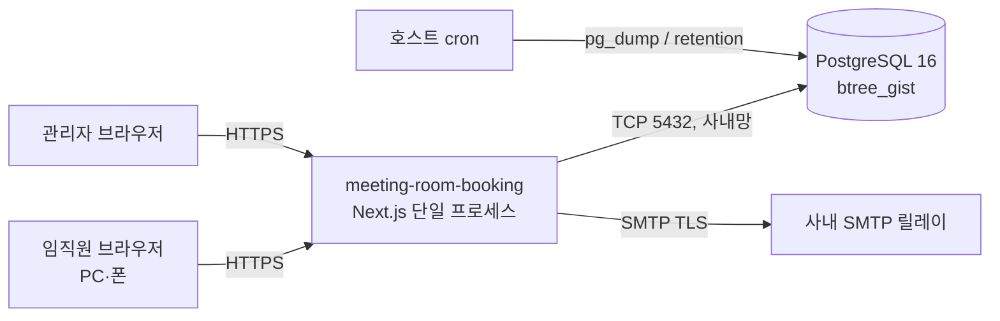
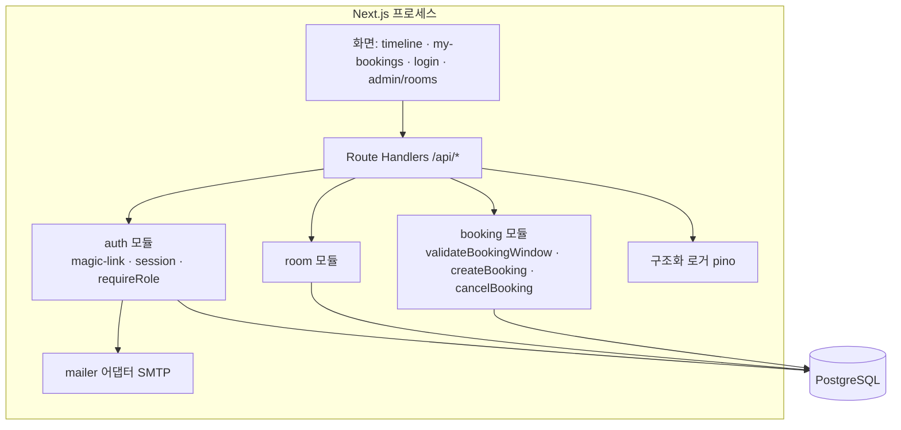
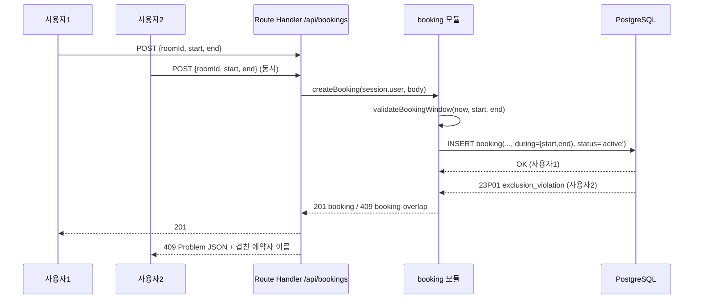
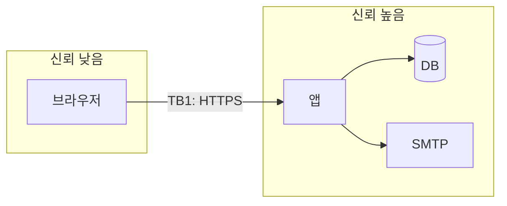

# 아키텍처 — 사내 회의실 예약
버전: v1.1 · 기준 03 v1.1

> 근거 (진입 사전조사 3줄 — 웹 예산 소진, 01 근거 재사용)
> - 정량: PostgreSQL `EXCLUDE USING GIST (room WITH =, during WITH &&)`가 같은 방의 겹치는 구간을 DB 레벨에서 거부 — https://www.postgresql.org/docs/current/rangetypes.html (2026-09-09)
> - 정성: LibreBooking README — 원본 Booked Scheduler는 2020년 이후 갱신 중단, 포크가 이어받음 (https://github.com/effgarces/BookedScheduler, 2026-09-09). 자체 구축 시에도 "1인 운영이 멈추면 끝"이라는 같은 리스크 — 컴포넌트 수를 최소로
> - 사용자 영향: 사용자는 아키텍처를 보지 못한다. 보이는 것은 "두 명이 동시에 눌러도 한 명만 잡힌다"(EC-2)와 "타임라인이 1초 안에 뜬다"(SC-004) — L-06·L-10

## Context & Scope
사내망(또는 IP 제한 VPS)에 놓이는 단일 웹 앱. 외부 연동은 매직링크 발송용 SMTP 하나. 기존 시스템 없음(화이트보드). 규모는 03 상수 ROOM_MAX·USER_MAX. 운영자 1인.

## Goals / Non-goals
- Goals: G1 화이트보드 대체, G2 이중예약 구조적 0건 (03).
- Non-goals: 03 범위 밖 전부. 추가로 아키텍처 non-goal — 다중 노드·큐·캐시 계층·마이크로서비스. 컨테이너 2개(app·db)가 상한.

## 설계

### 시스템 컨텍스트


### 구현 접근 — 난점과 선택
| 난점 | 선택 | 이유 |
|---|---|---|
| 동시 예약 경합(INV-1) | `booking.during tstzrange` + `EXCLUDE USING GIST (room_id WITH =, during WITH &&) WHERE (status = 'active')` | 앱이 "먼저 조회 후 삽입"하면 경합 창이 남는다. 제약 위반 SQLSTATE 23P01을 잡아 409로 변환하는 것이 코드 10줄 |
| 격자·상한 검증(INV-2) | 서버 zod 스키마 + 순수 함수 `validateBookingWindow(now, start, end, consts)` | 클라이언트 검증은 UX 안내용 복제. 서버가 진실. 순수 함수라 단위 테스트 가능 |
| 비밀번호 없는 인증 | 매직링크 토큰(TOKEN_BYTES 랜덤, 해시 저장, TTL·단회) → 서버 세션(DB `session` 테이블, HttpOnly·Secure·SameSite=Lax 쿠키) | 비밀번호 리셋·해시 정책이 통째로 사라짐. Lax는 메일 링크 클릭(top-level GET)이 통과해야 하므로 Strict 불가 — 상태 변경은 전부 POST/PATCH + Origin 검사로 CSRF 방어 |
| 시각 처리(INV-5) | 서버 `now()`·UTC 저장, 표시만 Asia/Seoul. 격자 판정도 서버 | 폰 시계 오차·시간대 혼동 제거 |
| 관리자 화면 | 같은 앱의 `/admin` 라우트, role 검사 미들웨어 | 별도 앱은 1인 운영에 과잉 |

프레임워크: Next.js(App Router; 화면은 서버 컴포넌트, 변경은 Route Handler `/api/*`) + Drizzle ORM(raw SQL로 EXCLUDE 마이그레이션) + PostgreSQL 16 + Docker Compose. 근거 DL-5.

### 컴포넌트 구조

auth 모듈만 인터페이스(`AuthProvider`)를 두어 SSO 교체 여지를 남긴다(DL-7). 나머지는 모듈 = 디렉터리, 추상화 없음.

### 데이터 흐름
**시나리오 1 — 예약 경합 (EC-2)**

**시나리오 2 — 매직링크 로그인 (FR-001)**
```mermaid
sequenceDiagram
  participant B as 브라우저
  participant API as /api/auth/*
  participant AUTH as auth 모듈
  participant DB as PostgreSQL
  participant MAIL as SMTP
  B->>API: POST /api/auth/magic-link {email}
  API->>AUTH: requestLink(email)
  AUTH->>AUTH: 도메인 화이트리스트 · 레이트리밋(MAGIC_LINK_RATE)
  AUTH->>DB: INSERT magic_link(token_hash, expires_at)
  AUTH->>MAIL: 링크 메일 발송
  API-->>B: 202 (존재 여부 무관 동일 응답)
  B->>API: GET /auth/callback?token=…
  API->>AUTH: consume(token)
  AUTH->>DB: SELECT … WHERE token_hash AND used_at IS NULL AND expires_at > now(); UPDATE used_at
  AUTH->>DB: INSERT session
  API-->>B: 302 /timeline + Set-Cookie(HttpOnly Secure SameSite=Lax)
```

### 데이터 저장 (설계 결정 관련 부분만)
- `booking.during tstzrange` 반열린 `[start, end)` — 10:00–11:00과 11:00–12:00은 겹치지 않음. 전체 스키마·DDL은 05.
- cancelled 행도 남긴다(INV-3). EXCLUDE는 `WHERE (status='active')` 부분 제약이라 취소된 구간은 재예약 가능.
- 세션·매직링크 토큰은 해시로만 저장.

## 검토한 대안
| 대안 | 트레이드오프 | 결론 |
|---|---|---|
| 앱 트랜잭션 `SELECT … FOR UPDATE` 후 INSERT | 방 단위 잠금으로 경합 해결 가능하나 잠금 범위·데드락·격리 수준을 개발자가 책임짐 | 기각 — DB 제약이 더 짧고 증명 가능 |
| SQLite 단일 파일 | 컨테이너 1개, 백업 = 파일 복사 | 기각 — range/EXCLUDE 없음, INV-1이 앱 코드로 이동(DL-5) |
| MRBS/LibreBooking 도입 | 0원, 반나절 | **핸드오프 선행 조건으로 유지**(DL-4). 자체 구축 근거는 무설명 UX·TS 스택 |
| 매직링크 대신 비밀번호 | 메일 의존 제거 | 기각 — 리셋·해시·정책 코드 증가, 50명 규모에 이득 없음 |
| Redis 세션 | 세션 조회 빠름 | 기각 — 컨테이너 +1, 50명 규모에서 DB 세션 조회는 무시 가능 |

## 위협모델
lite 판정: full 신호(돈·안전·법·민감정보·외부 연동 2+·100명+·하드웨어·다인 팀) 없음 → STRIDE 전수 표 대신 **trust boundary 1개(브라우저→앱)** 만 6범주로 짧게 검토한다. 처리 자산은 이름·사내 이메일·예약 시각이며 결제·민감정보는 없다. DB·SMTP는 사내망 안(같은 신뢰 구역)이라 별도 경계로 두지 않는다 — 단, DB 포트는 호스트 밖으로 노출하지 않는다.

### ① DFD


### ② 무엇이 잘못될 수 있는가 — TB1 브라우저→앱
| 범주 | 위협 | 대응 |
|---|---|---|
| S | 매직링크 토큰 추측·재사용, 세션 쿠키 탈취 | Mitigate: TOKEN_BYTES 랜덤·해시 저장·TTL·단회(FR-001), 쿠키 HttpOnly+Secure, 세션 서버측 폐기 |
| T | 요청 본문의 user_id/role 조작, 클라 시계로 과거 예약 | Mitigate: INV-4·INV-5 — 서버 세션과 서버 now()만 사용, zod 스키마 화이트리스트 검증 |
| R | "내가 취소 안 했다" | Mitigate: cancelled_by·cancelled_at + 구조화 로그 actor (FR-008) |
| I | 타인 이메일 노출, 에러에 스택 노출, 이메일 존재 여부 유출 | Mitigate: 이메일은 본인·admin만 응답에 포함, Problem JSON에 detail만, 매직링크 요청은 존재 여부 무관 202 |
| D | 매직링크 메일 폭탄, 예약 독점, 대량 조회 | Mitigate: MAGIC_LINK_RATE, MAX_ACTIVE_PER_USER, 조회 API API_RATE_PER_MIN. 외부 DoS는 사내망·IP 제한으로 Transfer(네트워크) |
| E | member가 /admin·타인 예약 취소 호출 | Mitigate: requireRole 미들웨어 + 핸들러 안 소유자 검사(이중), EC-7 테스트 |

### ③ 상위 리스크 3개와 잔여
1. 이중예약(INV-1) — DB 제약. 잔여: 마이그레이션에서 제약이 빠지면 무방비 → 06에 "제약 존재 확인" 테스트.
2. 세션 탈취 — HttpOnly·Secure·SESSION_DAYS 만료. 잔여: 사내 PC 공유 시 로그아웃 안 함 → 로그아웃 버튼 + 만료.
3. SMTP 장애 = 신규 로그인 불가 — EC-10 안내 + 관리자 수동 링크 발급(`/admin/users` 에서 링크 복사). 잔여: 관리자 본인 세션 만료 시 → 07 복구 절차(CLI로 세션 발급).

### ④ 충분한가
사내 50명·비민감 데이터 기준으로 충분 [추론]. 외부 공개·SSO·결제가 붙는 순간 full 재판정(STRIDE 전수).

## Cross-cutting
- 관측성: pino JSON 로그(event, actor_id, room_id, booking_id, latency_ms, status) → stdout → 호스트 journald/파일, 보존 LOG_RETENTION_DAYS. `/healthz`(FR-010). 상세 07.
- 프라이버시: 수집 = 이름·이메일·예약 시각. 로그에 이메일 대신 user_id. RETENTION_DAYS 후 파기(FR-009). 이메일은 본인·admin 외 응답에 싣지 않는다.
