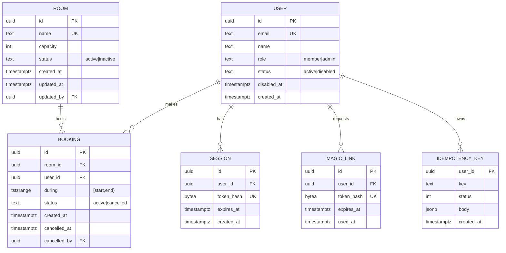

# API 계약 & 데이터 스키마 — 사내 회의실 예약
버전: v1.1 · 기준 03 v1.1

## 규약 (전 엔드포인트 공통)
- 에러 포맷: RFC 9457 Problem JSON `{type, title, status, detail, instance}` + 검증 오류는 `errors: [{field, code}]`. `type`은 `https://booking.local/problems/<slug>` (slug는 아래 표). 스택트레이스·SQL 문구는 노출하지 않는다.
- 버저닝: URL 버저닝 없음(사내 단일 클라이언트, 배포가 동시). 호환 깨는 변경은 `Accept: application/vnd.mrb.v2+json`로 열 수 있게 미디어타입 자리만 예약. 계약 문서는 semver(이 파일 버전).
- 페이지네이션: **없음.** 모든 목록의 상한이 03 상수로 묶인다 — rooms ≤ ROOM_MAX, users ≤ USER_MAX, 내 예약 ≤ MAX_ACTIVE_PER_USER, 타임라인은 날짜 범위 ≤ TIMELINE_RANGE_MAX_DAYS × ROOM_MAX × 48슬롯. 상한이 풀리면 커서 기반으로 추가.
- 멱등성: `POST /api/bookings`는 `Idempotency-Key` 헤더(클라 UUID) 필수. 서버는 (user_id, key) → 응답을 IDEMPOTENCY_TTL_HOURS 보관, 재시도 시 최초 응답 재생. 더블탭·재전송으로 같은 예약이 두 번 시도되는 것을 막는다(EXCLUDE가 두 번째를 409로 막긴 하지만, 사용자에게는 "이미 잡혔어요"가 아니라 201이 맞다). `cancel`은 자연 멱등(이미 cancelled면 200 그대로).
- 인증: 세션 쿠키 `mrb_session` (HttpOnly·Secure·SameSite=Lax). 상태 변경 요청은 `Origin` 헤더가 앱 오리진과 같아야 한다(04 DL-13). 미인증 401 `unauthenticated`.
- 권한 스코프: `booking:own:write` (member 기본) · `booking:any:write` · `room:any:write` · `user:any:write` (admin). role→스코프 매핑은 서버 상수.
- 시각: 요청·응답 모두 UTC ISO 8601 (`2026-09-10T01:00:00Z`). 표시 변환은 클라이언트. 날짜 파라미터(`date=2026-09-10`)만 Asia/Seoul 달력일로 해석하고 서버가 UTC 구간으로 변환.
- 레이트리밋: 인증 사용자 API_RATE_PER_MIN(조회), 매직링크 요청 MAGIC_LINK_RATE. 초과 429 `rate-limited` + `Retry-After`.
- 네이밍: 경로 kebab-case 복수 명사, JSON 필드 camelCase.

## 엔드포인트 표
| ID | 메서드 경로 | 요청(핵심 필드) | 응답 | 주요 에러(slug) | 스코프 |
|---|---|---|---|---|---|
| AUTH-1 | `POST /api/auth/magic-link` | `{email}` | 202 (존재 여부 무관 동일 본문) | 422 `email-domain-not-allowed` · 429 `rate-limited` · 503 `mail-unavailable` | 공개 |
| AUTH-2 | `GET /auth/callback?token=` | 쿼리 token | 302 → `/timeline` + Set-Cookie | 302 → `/login?reason=link-expired` (만료·사용됨·위조 모두 동일) | 공개 |
| AUTH-3 | `POST /api/auth/logout` | — | 204, 세션 행 삭제 | 401 | 인증 |
| AUTH-4 | `GET /api/me` | — | 200 `{id, name, email, role}` | 401 | 인증 |
| ROOM-1 | `GET /api/rooms?status=active\|all` | — | 200 `[{id, name, capacity, status}]` (status=all은 admin만) | 401 · 403 | 인증 / `room:any:write`(all) |
| ROOM-2 | `POST /api/rooms` | `{name, capacity}` | 201 + Location | 422 `validation` · 409 `room-name-taken` · 422 `room-limit` (ROOM_MAX) | `room:any:write` |
| ROOM-3 | `PATCH /api/rooms/{id}` | `{name?, capacity?, status?: active\|inactive}` | 200 | 404 `not-found` · 409 `room-name-taken` | `room:any:write` |
| BK-1 | `GET /api/bookings?from=YYYY-MM-DD&to=YYYY-MM-DD` | 달력일 범위(≤ TIMELINE_RANGE_MAX_DAYS, 기본 오늘) | 200 `[{id, roomId, start, end, status, user: {id, name}}]` active만 | 422 `range-too-wide` | 인증 |
| BK-2 | `POST /api/bookings` + `Idempotency-Key` | `{roomId, start, end}` | 201 + Location `{id, roomId, start, end, status, user}` | 409 `booking-overlap` (+ `conflicts: [{userName, start, end}]`) · 422 `booking-in-past` · 422 `booking-too-far` · 422 `booking-off-grid` · 422 `booking-too-long` · 422 `booking-outside-hours` · 422 `booking-quota` · 409 `room-inactive` · 400 `idempotency-key-required` | `booking:own:write` |
| BK-3 | `POST /api/bookings/{id}/cancel` | — | 200 `{id, status: cancelled, cancelledAt, cancelledBy}` | 403 `forbidden` (타인, member) · 409 `booking-ended` · 404 | `booking:own:write` (본인) / `booking:any:write` |
| BK-4 | `GET /api/me/bookings` | — | 200 예정 active 목록, start 오름차순 | 401 | 인증 |
| USER-1 | `GET /api/users` | — | 200 `[{id, name, email, role, status}]` | 403 | `user:any:write` |
| USER-2 | `PATCH /api/users/{id}` | `{name?, status?: active\|disabled}` | 200 | 404 · 409 `cannot-disable-self` | `user:any:write` |
| USER-3 | `POST /api/users/{id}/magic-link` | — | 200 `{url}` (SMTP 장애 시 관리자가 수동 전달) | 404 | `user:any:write` |
| OPS-1 | `GET /healthz` | — | 200 `{db: ok}` / 503 | — | 공개(사내망) |
| JOB-1 | (cron, HTTP 아님) `retention` 일 1회 | — | 삭제·익명화 건수를 로그 event `retention.run` | 실패 시 로그 + 다음 날 재시도 | — |

에러 slug 전체(06 계약 테스트 기준): `unauthenticated` `forbidden` `not-found` `validation` `rate-limited` `mail-unavailable` `email-domain-not-allowed` `room-name-taken` `room-limit` `room-inactive` `range-too-wide` `booking-overlap` `booking-in-past` `booking-too-far` `booking-off-grid` `booking-too-long` `booking-outside-hours` `booking-quota` `booking-ended` `idempotency-key-required` `cannot-disable-self`.

## ERD

소프트삭제: BOOKING·ROOM·USER는 상태 전이만(INV-3). 하드삭제는 JOB-1(BOOKING) 및 만료 MAGIC_LINK·SESSION·IDEMPOTENCY_KEY 정리뿐.

## DDL 스케치 (lite: 컬럼·제약까지)
```sql
CREATE EXTENSION IF NOT EXISTS btree_gist;

CREATE TABLE users (
  id          uuid PRIMARY KEY DEFAULT gen_random_uuid(),
  email       text NOT NULL UNIQUE,                 -- 소문자 정규화 후 저장
  name        text NOT NULL CHECK (length(name) BETWEEN 1 AND 50),
  role        text NOT NULL DEFAULT 'member' CHECK (role IN ('member','admin')),
  status      text NOT NULL DEFAULT 'active' CHECK (status IN ('active','disabled')),
  disabled_at timestamptz,
  created_at  timestamptz NOT NULL DEFAULT now()
);

CREATE TABLE rooms (
  id         uuid PRIMARY KEY DEFAULT gen_random_uuid(),
  name       text NOT NULL UNIQUE CHECK (length(name) BETWEEN 1 AND 30),
  capacity   int  NOT NULL CHECK (capacity BETWEEN 1 AND 200),
  status     text NOT NULL DEFAULT 'active' CHECK (status IN ('active','inactive')),
  created_at timestamptz NOT NULL DEFAULT now(),
  updated_at timestamptz NOT NULL DEFAULT now(),
  updated_by uuid REFERENCES users(id)
);

CREATE TABLE bookings (
  id           uuid PRIMARY KEY DEFAULT gen_random_uuid(),
  room_id      uuid NOT NULL REFERENCES rooms(id),
  user_id      uuid NOT NULL REFERENCES users(id),
  during       tstzrange NOT NULL CHECK (NOT isempty(during)
                 AND lower_inc(during) AND NOT upper_inc(during)),   -- [start,end)
  status       text NOT NULL DEFAULT 'active' CHECK (status IN ('active','cancelled')),
  created_at   timestamptz NOT NULL DEFAULT now(),
  cancelled_at timestamptz,
  cancelled_by uuid REFERENCES users(id),
  CHECK ((status = 'active') = (cancelled_at IS NULL)),
  -- INV-1: 같은 방의 active 예약은 겹칠 수 없다 (PostgreSQL 문서 §Constraints on Ranges)
  CONSTRAINT bookings_no_overlap EXCLUDE USING gist (room_id WITH =, during WITH &&)
    WHERE (status = 'active')
);
CREATE INDEX bookings_user_active_idx ON bookings (user_id) WHERE status = 'active';
CREATE INDEX bookings_during_idx ON bookings USING gist (during);   -- 타임라인 범위 조회

CREATE TABLE magic_links (
  id         uuid PRIMARY KEY DEFAULT gen_random_uuid(),
  user_id    uuid NOT NULL REFERENCES users(id),
  token_hash bytea NOT NULL UNIQUE,                   -- sha256(token)
  expires_at timestamptz NOT NULL,
  used_at    timestamptz
);

CREATE TABLE sessions (
  id         uuid PRIMARY KEY DEFAULT gen_random_uuid(),
  user_id    uuid NOT NULL REFERENCES users(id) ON DELETE CASCADE,
  token_hash bytea NOT NULL UNIQUE,
  expires_at timestamptz NOT NULL,
  created_at timestamptz NOT NULL DEFAULT now()
);

CREATE TABLE idempotency_keys (
  user_id    uuid NOT NULL REFERENCES users(id) ON DELETE CASCADE,
  key        text NOT NULL,
  status     int  NOT NULL,
  body       jsonb NOT NULL,
  created_at timestamptz NOT NULL DEFAULT now(),
  PRIMARY KEY (user_id, key)
);
```
INV-2의 격자·길이·선예약·업무시간 검사는 앱 `validateBookingWindow`(04)가 담당한다 — 상수가 .env로 바뀌므로 DB CHECK로 고정하지 않는다. INV-1만 DB가 최종 방어.

## 데이터 규칙
- 시각: timestamptz(UTC). 응답 ISO 8601 `Z`. 달력일 파라미터만 Asia/Seoul.
- 식별자: uuid v4(gen_random_uuid). 외부 노출 id는 uuid만(순번 노출 없음).
- 이메일: 소문자 정규화, ALLOWED_EMAIL_DOMAINS 화이트리스트. 응답에는 본인(`/api/me`)과 admin(`/api/users`)에게만 포함.
- 보존: BOOKING은 end 또는 cancelled_at + RETENTION_DAYS 후 하드삭제, USER는 disabled_at + RETENTION_DAYS 후 name/email 익명화(`deleted-<id>`), MAGIC_LINK·SESSION은 expires_at + 1일, IDEMPOTENCY_KEY는 IDEMPOTENCY_TTL_HOURS (JOB-1).
- 금액: 없음.

## 커버리지 매핑 (P0·P1 = 0건 결함)
| FR-ID | 우선순위 | 담당 엔드포인트/이벤트 |
|---|---|---|
| FR-001 | P0 | AUTH-1 · AUTH-2 · AUTH-3 · AUTH-4 (+ USER-3 SMTP 장애 대체 경로) |
| FR-002 | P0 | BK-1 · ROOM-1 |
| FR-003 | P0 | BK-2 (DDL `bookings_no_overlap`, `validateBookingWindow`) |
| FR-004 | P0 | BK-3 (본인) |
| FR-005 | P1 | BK-4 |
| FR-006 | P0 | ROOM-1(status=all) · ROOM-2 · ROOM-3 |
| FR-007 | P1 | BK-3 (`booking:any:write`) |
| FR-008 | P1 | BOOKING/ROOM 감사 컬럼(created_at·cancelled_by·updated_by) + 로그 event `booking.created` `booking.cancelled` `room.updated` `auth.login` `auth.failed` (07 로깅 표) |
| FR-009 | P2 | JOB-1 retention |
| FR-010 | P2 | OPS-1 |
