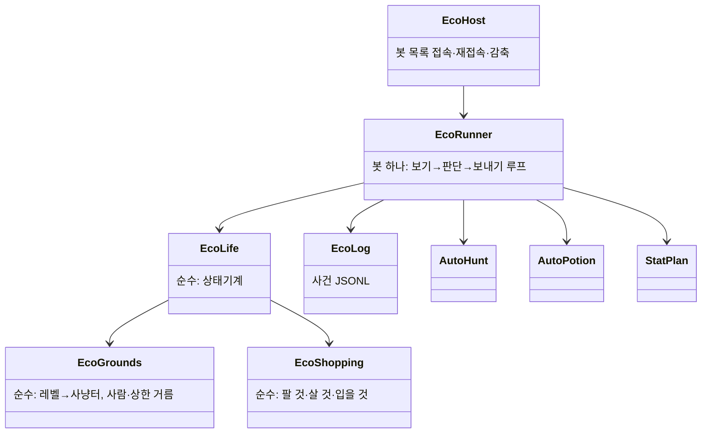
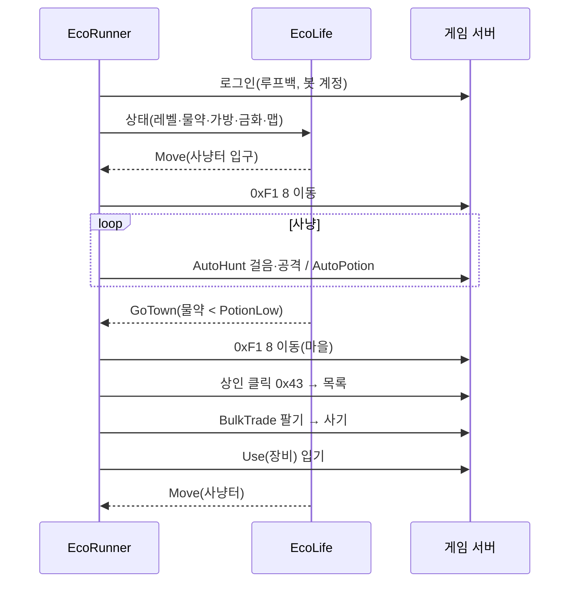

# 아키텍처 — 생태계 봇
버전: v1.0 · 기준 03 v1.2

## Context & Scope
오라클 무료 티어 VM 하나에 게임 서버(`lod`)·동료 봇(`lod-bot@1~5`)·대신 사냥(`lod-proxy`)이 돈다. 여기에 서비스 하나(`lod-eco`)를 더한다. 서버 fork 는 작게(봇 표시·이동 요청·병목 하나·활동 숫자 칸) 고친다.

## Goals / Non-goals
목표·범위 밖은 `03-prd.md`. 이 문서는 어떻게 나누는지만.

## 설계

### 시스템 컨텍스트
```mermaid
flowchart LR
  subgraph VM[오라클 VM]
    S[게임 서버 lod\nHades fork]
    E[lod-eco\nLod.EcoBots\n봇 N 접속]
    C[lod-bot@1~5 동료 봇]
    P[lod-proxy 대신 사냥]
    A[(activity/*.jsonl\n원본 90일)]
    L[(eco/*.jsonl\n봇 사건)]
    M[(ml/*.jsonl.gz\n학습용 사본)]
    X[cron 내보내기\nscripts/ml/export-activity.py]
  end
  Phone[폰 앱] -- TCP 2610/2615 --> S
  E -- 루프백 TCP --> S
  C -- 루프백 --> S
  P -- 루프백 --> S
  S --> A
  E --> L
  A --> X --> M
  L --> X
```

### 구현 접근
- **봇 = 헤드리스 클라이언트**: 알맹이 `WorldClient` 그대로. 한 프로그램이 봇마다 `Task` 하나(대신 사냥 `ProxyHost` 꼴). 근거 01 §4-1·2.
- **판단은 알맹이 순수 함수**: `EcoLife.Next(EcoSight) → EcoStep` (Hunt/GoTown/Shop/Equip/Revive/Move/Wait). 사냥 중 세부는 기존 `AutoHunt` 에 맡긴다. 엔진 없이 단위 시험.
- **사냥터·마을 표는 guide.txt**(`zone`·`area`·`npc`) — 서버 워프·NPC 에서 생성된 것이라 서버와 맞는다.
- **이동은 순간이동 요청 한 줄**(0xF1 8) — 서버가 봇 계정 + 루프백일 때만. 맵 사이 걷기는 P2.
- **상점**: guide.txt `npc` 로 마을의 상인 위치 → 걸어가 클릭(0x43) → 상점 목록(`DialogueGoods`: 가격·직업·성별·서클·능력치) → `BulkTradeAsync` 로 팔고 사기 → `UseAsync` 로 입기.
- **장비 고르기 규칙**(`EcoShopping`, 순수 함수): 부위마다 후보 = 직업 맞음 ∧ 성별 맞음 ∧ 서클 ≤ 내 서클 ∧ 값 ≤ (금화 − 물약 예산). 점수 = 서클 → 능력치 합. 지금 입은 것보다 점수가 높을 때만.
- **서버 고침 넷**: ① `EcoBots` 설정 + `IsEcoBot` ② 0xF1 8 이동 ③ `CheckObjectClients` 이름 집합 ④ 활동 기록 숫자 칸. [접속자] 봇 표시는 0x36 의 길드명 꼬리에 「AI」 — 앱 변경 없음.

### 컴포넌트


### 데이터 흐름 — 한 바퀴


### 데이터 저장
봇 캐릭터는 서버 JSON 그대로. 봇 프로그램은 상태를 따로 저장하지 않는다(재접속 때 캐릭터에서 다시 계산). 사건 기록은 05 §기록 형식.

## 검토한 대안
| 대안 | 이득 | 비용 | 판정 |
|---|---|---|---|
| A. 외부 클라이언트, 프로그램 하나 봇 여럿(채택) | 알맹이·대신 사냥 재사용, 봇 예외가 서버를 못 죽임, 실제 프로토콜 경로를 같이 시험 | 봇당 0.0023코어 · 루프백 소켓 | 채택 |
| B. 서버 안 가짜 세션(playerbots 식) | 봇 프로그램 몫 0 | 서버 비용 대부분(시야 갱신)은 그대로, `GameClient` 가 소켓에 묶여 큰 공사, 봇 판단을 서버 C# 으로 다시 씀 | 버림 |
| C. 봇마다 프로세스(지금 동료 봇 식) | 격리 | 프로세스당 .NET 런타임 메모리 수십 MB × 100 | 버림 |
| D. 통계식 성장만(접속 없음) | CPU 거의 0 | 세상이 살아 보이지 않음 — 목표 1과 어긋남 | P2 보조로 |
| 이동: 걷기 vs 순간이동 | 걷기가 보기 좋음 | 맵 그래프·월드맵·막힘 처리 | 순간이동 먼저(playerbots 도 순간이동), 걷기 P2 |

## 위협모델 (lite — 신호: 로그인 인증 경계)
- ① 새 경계: 봇 계정 로그인, 0xF1 8 이동 요청.
- ② STRIDE: **S** 봇 계정 비밀번호가 새면 밖에서 봇으로 접속 → 봇 계정은 루프백만 허락(Mitigate). **T** 해당 없음 — 봇도 일반 클라이언트 권한, 서버가 모든 행동 검증. **R** 활동 기록이 봇 행동을 `bot=true` 로 남김. **I** 학습용 사본에 IP·원래 이름·대화 없음(Mitigate, SC-005). **D** 봇 수 상한·맵 상한·지연 감축(Mitigate). **E** 사람 계정이 0xF1 8 을 보내 순간이동 → 서버가 `IsEcoBot` 아니면 버림(Mitigate, 시험).
- ③④ 남는 위험: 봇 비밀번호 파일이 VM 에 평문(권한 600) — 기존 동료 봇과 같음, Accept(1인 운영).

## Cross-cutting
- 관측성: `cloud-server.sh eco-logs` + 5분 요약(봇 수·사냥/마을/죽음 수·평균 레벨) + 대시보드(P2).
- 프라이버시: 학습용 사본은 가명(소금 해시)·IP 없음. 봇 기록에는 사람 정보가 없다.
