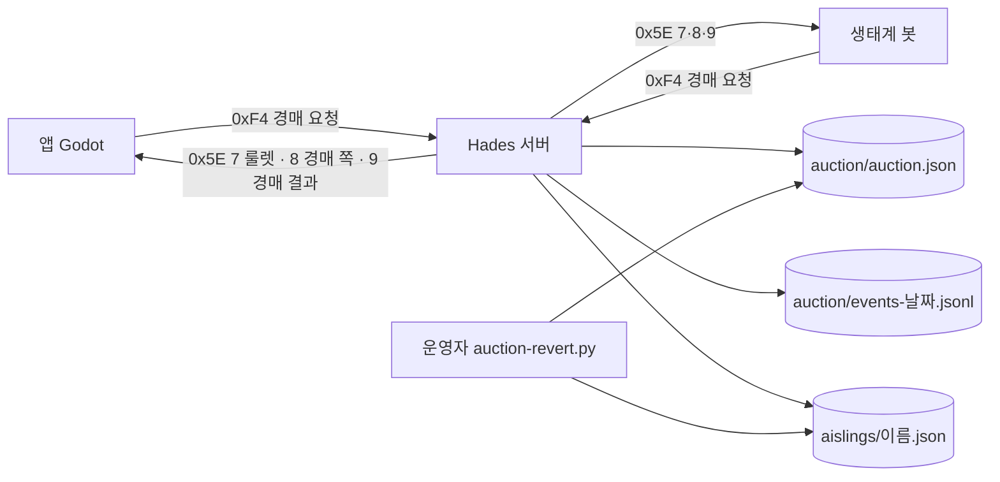
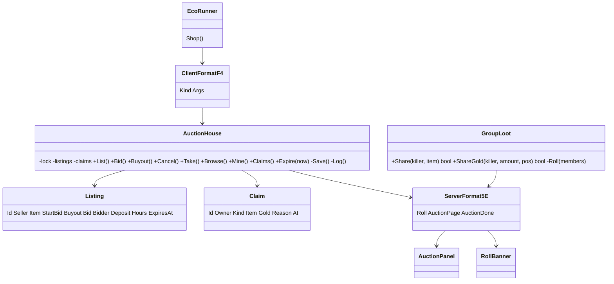
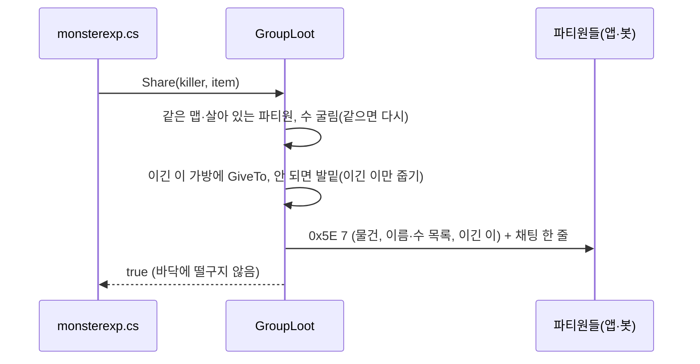
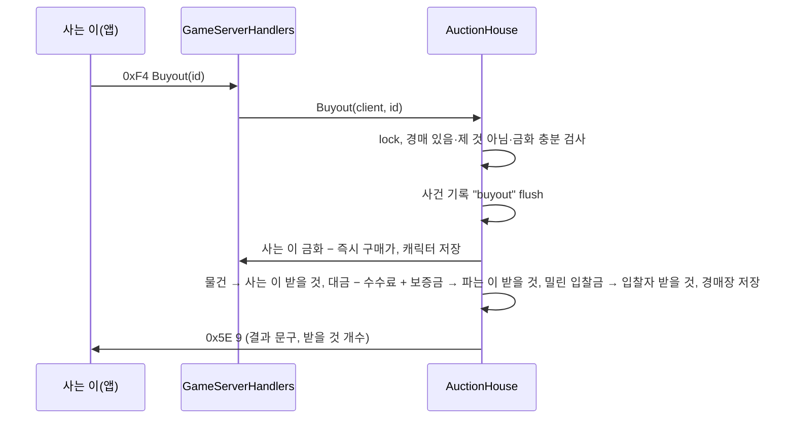
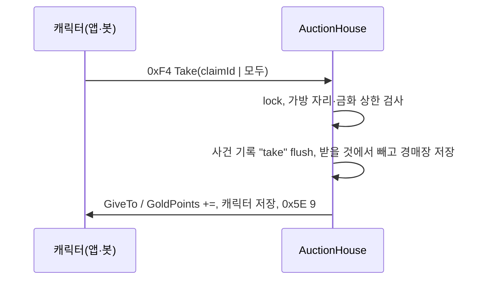
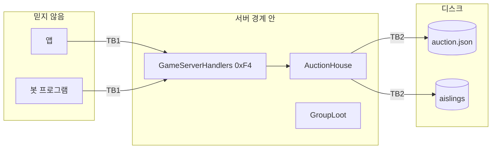

# 아키텍처 — 그룹 전리품 룰렛 · 경매장
버전: v1.0 · 기준 03 v1.0

사전조사 3줄 — 정량: 봇 30~50 + 사람 몇 명, 올린 것 ≤ 약 1천 줄. 정성: 서버 전역 상태는 이미 JSON 파일(게시판·대신 사냥)이고 DB 없음. 사용자 영향: 물건·금화 복제/유실이 가장 비싸다(INV-1~3).

## Context & Scope
서버 Hades(`sources/wren11/Dark-Ages-Private-Server`, H=`src/Hades.Server.Base`)가 모든 판단·저장을 한다. 앱(`mobile/client`)과 생태계 봇(`mobile/bots/Lod.EcoBots`)은 같은 알맹이(`mobile/src/Lod.Mobile.Core`)로 같은 패킷을 보낸다.
작업은 루트·서버 모두 브랜치 `feature/loot-roll-auction` — 합치기 전까지 배포 브랜치와 분리.

## Goals / Non-goals
03 의 목표·범위 밖과 같다.

## 설계

### 시스템 컨텍스트

### 구현 접근
- **룰렛**: 드롭 스크립트 `database/server/scripts/Formulas/monsterexp.cs` 의 `GenerateGold`·`GenerateDrops` 가 바닥에 `Release` 하기 직전에 `GroupLoot.Share(...)` 를 부른다. 그룹이 아니거나 `GroupLootRoll` 이 꺼져 있으면 false 를 돌려주고 지금처럼 바닥으로.
  같은 맵·살아 있는 파티원 = `killer.GroupParty.PartyMembers` 중 `CurrentMapId` 같고 `!Dead`.
- **줍기 보호 결함**: `H/Types/Area.cs:386-391` 의 `stale` 식을 고쳐 3분 보호가 실제로 걸리게 한다. 넘친 룰렛 몫은 `AuthenticatedAislings = [이긴 이]`, `Cursed = true` 로 떨군다.
- **경매장**: `H/Types/AuctionHouse.cs` 하나 — 메모리 상태 + 한 자물쇠 + JSON 저장(`SafeFile`, 원자적 교체) + 사건 기록. 물건은 캐릭터 파일과 같은 Newtonsoft 설정으로 `Item` 통째 직렬화(템플릿·Upgrades·ItemVariance·Durability·Stacks·Color 보존, `Serial` 은 꺼낼 때 새로).
- **기간 끝**: 서버 주기 일(대신 사냥 `ProxyHunt` 이 도는 곳과 같은 틀)에서 AUCTION_TICK 마다 `AuctionHouse.Expire(now)`.
- **패킷**: 앱→서버 새 `ClientFormatF4`(종류 바이트 + 값), 서버→앱 기존 앱 전용 `0x5E` 에 종류 7·8·9 추가. 추가 방법은 01 감사의 순서(FormatStubs 3파일 + 핸들러 + 알맹이 opcode).
- **앱**: `GameWindow.Auction` + `AuctionPanel`(`client/src/Windows/`, `WindowFrame` 탭) + `GameScreen.TopBar.cs` 의 「설정」 옆 `MenuButton("경매장")` + 룰렛 띠 `RollBanner`(창이 아니라 화면 위 겹침).
- **봇**: `EcoRunner.Shop` 첫머리에 받을 것 받기 → `EcoPlan.ToAuction`(못 입는 룰렛 물건 중 Tradeable) 올리기 → `EcoPlan.AuctionBuys`(지금 것보다 점수가 높고 맞는 장비) 사기 → 나머지는 지금처럼 NPC 판매.
- **되돌리기**: 설정 두 개(FR-016)로 기능을 끄고, 브랜치를 되돌리기 전에 `scripts/ops/auction-revert.py`(FR-017)로 맡긴 것을 은행으로 옮긴다.

### 컴포넌트 구조

### 데이터 흐름

그룹 처치 → 룰렛

즉시 구매(INV-3 순서)

받기

### 데이터 저장
`{StoragePath}/auction/auction.json` = `{ nextId, listings[], claims[] }` 한 파일(05 ERD). 사건은 `{StoragePath}/auction/events-YYYY-MM-DD.jsonl`(UTC 날짜).

## 검토한 대안
- **와우식 우편**: 서버에 우편이 없어(01) 새로 만들면 범위가 두 배 → 경매장 안 「받을 것」으로 대신.
- **캐릭터 파일에 받을 것 저장**: 오프라인 캐릭터 파일을 서버가 고쳐야 해 경쟁 위험 → 경매장 파일 하나에 모음.
- **SQLite**: 원자성은 좋지만 서버에 DB 가 없고 배포·되돌리기가 무거워짐 → JSON 한 파일 + 원자적 교체 + 사건 기록. 볼륨(≤1천 줄)에 충분.
- **0xF2 묶음 거래 재사용**: 종류 바이트가 은행과 섞여 읽기 어려움 → 새 0xF4.
- **필요/차비 버튼**: Q1 에서 자동 룰렛으로.

## 위협모델

### ① 무엇을 만드는가

TB1 = 패킷 경계(로그인된 세션), TB2 = 서버 → 디스크.

### ② STRIDE
| 자산/경계 | S | T | R | I | D | E |
|---|---|---|---|---|---|---|
| TB1 경매 요청 | 남의 이름으로 올림·입찰 | 슬롯·값·경매 번호 위조, 음수·넘침 금액 | "안 샀다" 부인 | 파는 이·입찰자 이름, 남의 받을 것 엿보기 | 찾기·올림 폭주 | 운영자 기능(되돌리기) 호출 |
| TB1 룰렛 | 해당없음 — 룰렛은 서버가 굴리고 앱은 보기만 | 해당없음 — 앱이 보내는 값 없음 | 이긴 이 다툼 | 다른 맵 파티원에게 보냄 | 해당없음 — 처치마다 파티원 수만큼 한 패킷 | 해당없음 — 권한 있는 조작 없음 |
| TB2 디스크 | 해당없음 — 서버 프로세스만 씀 | 파일 손 편집 | 기록 없는 변경 | 해당없음 — 게임 내 공개 정보뿐, 개인정보 없음 | 큰 파일 반복 쓰기로 느려짐 | 해당없음 — 서버 계정 외 쓰기 없음 |
| 경제(복제) | 해당없음 | 경매·교환(0x4A)·은행 동시 사용으로 같은 물건 두 번 | 해당없음 | 해당없음 | 해당없음 | 해당없음 |

### ③ 대책
- **S(TB1)** Mitigate: 서버는 패킷의 이름을 쓰지 않고 `client.Aisling` 만 쓴다.
- **T(TB1)** Mitigate: 슬롯은 제 가방의 것만, 값은 1 ≤ 시작가 ≤ 즉시 구매가(또는 0) ≤ `MaxCarryGold`, 기간은 AUCTION_DURATIONS 중 하나, 입찰 ≥ 현재가 + AUCTION_MIN_STEP, 계산은 long. 경매 번호가 없거나 끝났으면 「이미 끝난 경매입니다」.
- **T(경제)** Mitigate: 올림·입찰·즉시 구매는 교환 중(ExchangeSession 열림)·유령·죽음이면 거절, 물건은 경매장 저장 전에 가방에서 먼저 빼고 캐릭터를 저장(INV-3).
- **R(TB1·룰렛)** Mitigate: 모든 조작과 룰렛(굴린 수 전부)을 사건 기록(FR-018)에 — 누가·무엇·금화 전후.
- **I** Mitigate: 찾기 응답에 파는 이·입찰자 이름을 넣지 않고(와우), 받을 것·내 경매는 제 것만. 룰렛 결과는 같은 맵 파티원에게만.
- **D(TB1)** Mitigate: 캐릭터당 AUCTION_MAX_LISTINGS, 봇당 ECO_AUCTION_MAX, 같은 세션 경매 요청은 0.3초에 한 번(넘으면 버림).
- **D(TB2)** Accept(측정): 물건 통째 직렬화로 파일이 수 MB 일 수 있음 — 조작마다 한 번 쓰기, 시험에서 1천 줄 쓰기 시간을 재 07 지표로 둔다.
- **T·R(TB2)** Accept: 디스크는 운영자만 만진다(SSH 키). 손 편집은 운영자 책임.
- **E** Eliminate: 되돌리기는 패킷으로 노출하지 않고 운영자 스크립트만.

### ④ 충분한가
상위 리스크 1 복제(경매+교환/은행) — 거절 규칙 + INV-3 순서 + SC-003·004 시험. 2 크래시 사이 유실 — 사건 기록으로 복구(잔여 리스크: 운영자 수작업). 3 봇이 시장을 채움 — 봇 상한 + SC-006 관찰.

## Cross-cutting: 관측성·프라이버시
관측성: 사건 JSONL + 서버 로그 한 줄(올림·낙찰 수). 프라이버시: 게임 캐릭터 이름 외 개인정보 없음, 경매에서는 파는 이 이름도 숨김.
