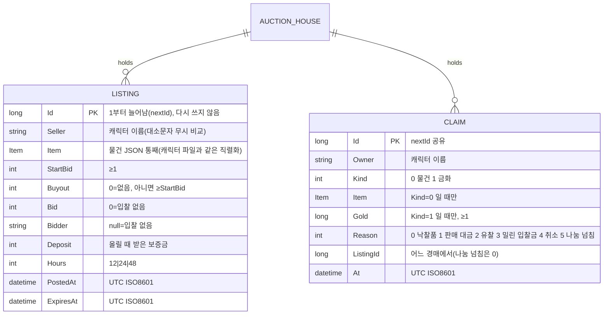

# API 계약 & 데이터 스키마 — 그룹 전리품 룰렛 · 경매장
버전: v1.1 · 기준 03 v1.1

## 규약
- HTTP 가 아니라 게임 패킷이다. 앱→서버 `0xF4`(새), 서버→앱 `0x5E` 종류 7·8·9(기존 앱 전용 패킷에 추가). 숫자는 빅엔디언, 글자는 Hades `WriteStringA`/`ReadStringA`(u8 길이 + EUC-KR) — 0x5E 기존 종류와 같다.
- 에러: RFC 9457 대신 `0x5E 9` 의 `ok=0` + 사람이 읽는 한 줄. 서버 내부 예외·스택은 보내지 않는다(서버 로그에만).
- 버저닝: 종류 바이트로 넓힌다. 모르는 종류는 앱·서버 모두 버린다(옛 앱 호환, 02 P4).
- 페이지: 쪽 번호(u16, 0부터) — 1천 줄 규모라 커서 대신 쪽(와우 경매장도 쪽). 목록은 요청 순간의 정렬 결과.
- 멱등성: TCP 라 다시 보냄이 없다. 앱은 `0x5E 9` 를 받을 때까지 그 단추를 잠근다. 같은 즉시 구매가 두 번 와도 두 번째는 「이미 끝난 경매입니다」(서버 자물쇠).
- 권한: 로그인된 세션의 캐릭터만. 운영자 기능은 패킷이 없다(04 E).
- 요청 간격: 같은 세션 `0xF4` 는 0.3초에 하나(넘으면 버림, 04 D).

## 패킷 표 — 앱/봇 → 서버 `0xF4`
| ID | 종류 | 본문(종류 뒤) | 서버 응답 | 주요 거절 문구 | 권한 |
|---|---|---|---|---|---|
| P-01 | 0 찾기 | u8 종류(0 전체 1 무기 2 방어구 3 장신구 4 기타) · u8 정렬(0 남은 시간 1 현재가 2 즉시 구매가) · u16 쪽 · str 검색어 | 0x5E 8 (보기 0) | — | 로그인 |
| P-02 | 1 내 경매 | u16 쪽 | 0x5E 8 (보기 1) | — | 로그인 |
| P-03 | 2 받을 것 | u16 쪽 | 0x5E 8 (보기 2) | — | 로그인 |
| P-04 | 3 올림 | u8 가방 슬롯 · u32 시작가 · u32 즉시 구매가(0 없음) · u8 시간(12/24/48) | 0x5E 9 | 경매장이 닫혀 있습니다 · 올릴 수 없는 물건입니다 · 올린 물건이 너무 많습니다 · 보증금이 모자랍니다 · 값이 맞지 않습니다 · 교환 중에는 안 됩니다 | 로그인, 살아 있음 |
| P-05 | 4 입찰 | u32 경매 번호 · u32 금액 | 0x5E 9 | 이미 끝난 경매입니다 · 제 물건에는 입찰할 수 없습니다 · 입찰가가 낮습니다 · 금화가 모자랍니다 | 로그인, 살아 있음 |
| P-06 | 5 즉시 구매 | u32 경매 번호 | 0x5E 9 | 이미 끝난 경매입니다 · 즉시 구매가 없는 경매입니다 · 제 물건입니다 · 금화가 모자랍니다 | 로그인, 살아 있음 |
| P-07 | 6 취소 | u32 경매 번호 | 0x5E 9 | 이미 끝난 경매입니다 · 내 경매가 아닙니다 · 수수료가 모자랍니다 | 로그인 |
| P-08 | 7 받기 | u32 받을 것 번호(0 = 모두) | 0x5E 9 | 가방에 자리가 없습니다 · 들 수 있는 금화를 넘습니다(남은 것은 그대로) | 로그인 |

## 패킷 표 — 서버 → 앱/봇 `0x5E`
모든 0x5E 는 `종류 · u32 serial · 본문` — 기존 `ServerFormat5E.Serialize` 가 종류 뒤 u32 를 늘 쓰므로(`ServerFormat5E.cs:89-90`) 7·8·9 는 serial 0 을 쓰고 본문은 그 뒤.

| ID | 종류 | 본문 | 보내는 때 |
|---|---|---|---|
| E-01 | 7 룰렛 | u16 물건 그림 · u8 색 · str 물건 이름 · u8 n · n×(u32 serial · str 이름 · u8 수) · u32 이긴 이 serial | 그룹 처치로 룰렛이 끝날 때, 같은 맵 파티원 모두 |
| E-02 | 8 경매 쪽 | u8 보기(0 찾기 1 내 경매 2 받을 것) · u16 쪽 · u16 쪽 수 · u16 받을 것 개수 · u8 n · 줄 n개(아래) | P-01~03 응답 |
| E-03 | 9 경매 결과 | u8 ok · str 문구 · u16 받을 것 개수 | P-04~08 응답, 내 물건이 팔리거나 밀렸을 때(접속 중이면) |

E-02 줄: 보기 0·1 = u32 번호 · u16 그림 · u8 색 · str 이름 · u16 묶음 · u8 남은 시간 띠(0 짧게 1 보통 2 길게 3 아주 길게) · u32 현재가(입찰 없으면 시작가) · u32 즉시 구매가 · u8 표시(1 내가 올림 · 2 내가 최고 입찰 · 4 입찰 있음).
보기 0·1 은 줄 n개 뒤에 **꼬리**(2026-10-07, SPEC S-13): 줄마다 장비 수치 54바이트 — 소지품 0x0F 꼬리(`ServerFormat0F.WriteNumbers`)와 같은 모양. 봇·앱이 「맞고 더 좋은지」를 본다. 옛 앱은 줄까지만 읽는다.
보기 2 = u32 번호 · u8 갈래(0 물건 1 금화) · u16 그림 · u8 색 · str 이름 · u16 묶음 · u32 금화 · u8 까닭(0 낙찰품 1 판매 대금 2 유찰 3 밀린 입찰금 4 취소 5 나눔 넘침).

## 알맹이 API(앱·봇 공용, `WorldClient.Auction.cs`)
`AuctionBrowseAsync(kind, sort, page, query)` · `AuctionMineAsync(page)` · `AuctionClaimsAsync(page)` · `AuctionPostAsync(slot, start, buyout, hours)` · `AuctionBidAsync(id, amount)` · `AuctionBuyoutAsync(id)` · `AuctionCancelAsync(id)` · `AuctionTakeAsync(id)` — 응답은 `World.AuctionPage`·`World.AuctionDone`·`World.LastRoll` 로 들어온다.

## ERD

사건 기록 한 줄(JSONL): `{"seq":1,"at":"2026-10-07T01:02:03Z","ev":"post|bid|outbid|buyout|sold|expired|cancel|take|roll|split|commit","who":"이름","listing":12,"item":"이름","gold":30000,"goldBefore":0,"goldAfter":0,"data":{}}` — 룰렛은 `data.rolls=[{"name":"…","roll":0}]`, 나눔은 `data.shares`. `seq` 는 경매장 파일의 `lastSeq` 와 함께 늘고, 조작이 두 저장을 다 마치면 같은 seq 로 `commit` 한 줄 — commit 없는 seq 가 끊긴 조작이다(07 R1). 경매장 파일은 `{ nextId, lastSeq, listings[], claims[] }`.

## 데이터 규칙
- 금화: 패킷 u32, 서버 계산 long, 캐릭터 `GoldPoints` int(≤ `MaxCarryGold`). 받을 것 금화는 long(상한 없음 — 받을 때 상한).
- 보증금 = max(1, ⌊상점가(03 용어) × AUCTION_DEPOSIT_RATE[시간] / 100⌋). 수수료 = ⌊낙찰가 × AUCTION_CUT / 100⌋.
- 다음 최소 입찰 = 입찰 없으면 시작가, 있으면 현재가 + max(1, ⌊현재가 × AUCTION_MIN_STEP / 100⌋).
- 남은 시간 띠: < 30분 짧게 · < 2시간 보통 · < 12시간 길게 · 그 위 아주 길게(와우).
- 종류: 무기 = 무기 칸, 방어구 = 갑옷·투구·방패·장갑·신발 칸, 장신구 = 반지·귀걸이·목걸이 칸, 나머지 기타. 칸 번호 표는 BUILD 첫 작업에서 `ItemTemplate.EquipmentSlot` 값으로 만든다.
- 시각 UTC. 이름 비교는 대소문자 무시. 받을 것 보존 기간: 무기한.

## 규칙·밸런스 상수 파일
서버 `H/Types/AuctionHouse.cs` 머리의 `const` 와 봇 `Tuning.cs` 에 03 상수 표 이름 그대로 둔다. 근거(source):
ROLL_MAX·AUCTION_DURATIONS·AUCTION_DEPOSIT_RATE·AUCTION_CUT = 와우 출처 URL(03) · AUCTION_MIN_STEP·AUCTION_MAX_LISTINGS·AUCTION_PAGE·AUCTION_TICK·ROLL_SHOW·ECO_AUCTION_* = 임의값(설계 결정, 클라우드 사건 기록으로 조정) — 임의값 10/14.
설정(LoruleConfig): `GroupLootRoll`(bool, 기본 true) · `AuctionEnabled`(bool, 기본 true).

## 커버리지 매핑
| FR-ID | 담당 패킷/이벤트 |
|---|---|
| FR-001 | `GroupLoot.Share` (드롭 스크립트) → E-01 |
| FR-002 | E-01 + 채팅 0x0A 한 줄 |
| FR-003 | `GroupLoot.Share`(돌림 차례) |
| FR-004 | `GroupLoot.ShareGold` + 사건 split |
| FR-005 | `GroupLoot` 물건 넘침 떨굼 + `Area.cs` 보호 고침 · 금화 넘침 → `AuctionHouse` 받을 것(까닭 5) |
| FR-006 | P-04 → E-03 |
| FR-007 | P-05 → E-03 (밀린 이 E-03) |
| FR-008 | P-06 → E-03 |
| FR-009 | `AuctionHouse.Expire` (AUCTION_TICK) → 접속 중이면 E-03 |
| FR-010 | P-07 → E-03 |
| FR-011 | P-03 · P-08 → E-02 · E-03 |
| FR-012 | P-01 → E-02 |
| FR-013 | 앱 `AuctionPanel` 이 P-01~08 · E-02·E-03 사용 |
| FR-014 | 봇 P-03 · P-08 · P-04 |
| FR-015 | 봇 P-01 · P-06 |
| FR-016 | 설정 → P-04~07 거절 「경매장이 닫혀 있습니다」, `GroupLoot` false |
| FR-017 | `scripts/ops/auction-revert.py` (패킷 없음) |
| FR-018 | 사건 기록 JSONL 전 종류 |
