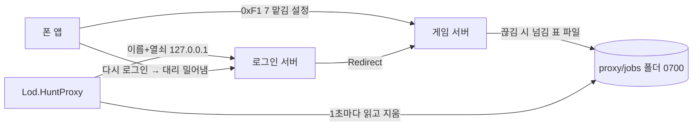
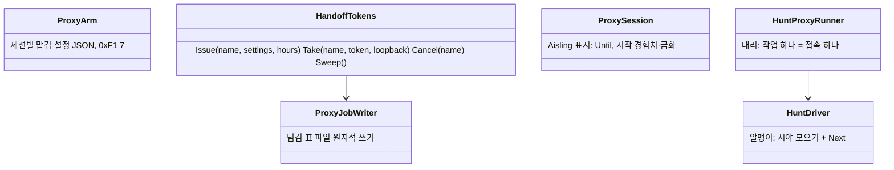
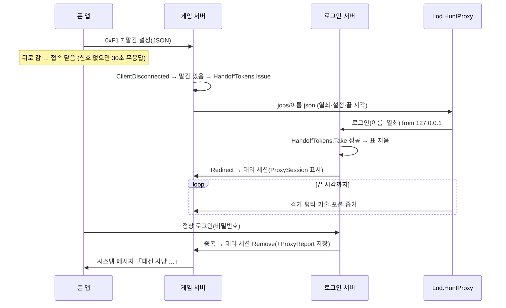
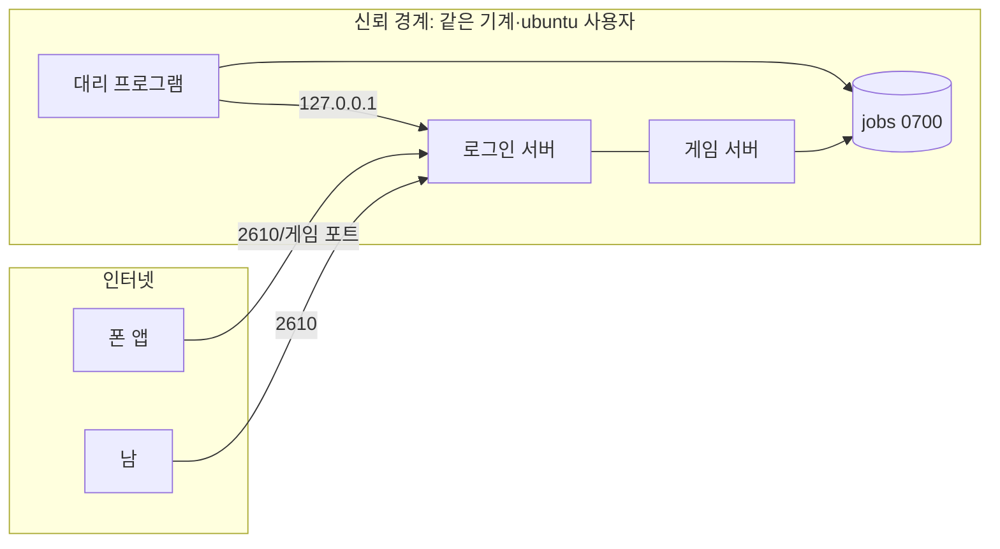

# 아키텍처 — 대신 사냥
버전: v1.0 · 기준 03 v1.1

> 진입 사전조사 — 정량: 동료 봇 5개가 이미 같은 기계에서 돈다(`cloud-server.sh` lod-bot@1~5). 정성: 새 접속이 늘 이기는 중복 로그인 규칙(01 감사)이 「넘겨받기」를 공짜로 준다. 사용자 영향: 넘김 때 몇 초 동안 캐릭터가 월드에서 사라진다(수용).

## Context & Scope
클라우드 한 기계: 로그인 서버(2610)·게임 서버(Hades, .NET) · 동료 봇(systemd). 앱은 폰. 새로 드는 것: 서버의 맡김·넘김·열쇠 로그인, 대리 프로그램 `Lod.HuntProxy`(systemd `lod-proxy` 하나), 앱의 맡김 송신·뒤로 감 처리·설정 줄.

## Goals / Non-goals
03 목표·범위 밖 그대로.

## 설계
### 시스템 컨텍스트

### 구현 접근
- **넘김 계기 = 앱 접속 끊김**(소켓 닫힘이든 무응답 30초든). iOS 수명 신호가 안 올 수 있어(01) 서버의 끊김만 믿는다. 앱이 뒤로 감 신호를 받으면 접속을 닫아 30초를 앞당길 뿐.
- **열쇠**: 서버(게임·로그인 같은 프로세스 — `ServerContext` 공유)가 `HandoffTokens` 표(이름 → 열쇠·만료·끝 시각·설정)를 메모리에 둔다. 로그인 서버 `Format03Handler` 앞에서 루프백 + 표 일치(고정 시간 비교) → `LoginAsAisling`. 비밀번호는 어디에도 새로 생기지 않는다.
- **서버→대리 전달 = 파일**(`ProxyJobFolder`, 0700, 파일 0600, 원자적 쓰기 tmp→rename). 대리 프로그램이 읽은 즉시 지운다. 소켓·IPC를 새로 열지 않아 공격면이 늘지 않는다.
- **대리 판단**: 앱 연결부 `WorldView.AutoHuntTick` 의 시야 모으기를 알맹이로 옮긴 `HuntDriver`(엔진 없음 — `WorldClient` + 벽 + 출구 + 맡김 설정 → `HuntStep` 실행)를 대리가 쓴다. 앱은 지금 연결부를 그대로 두되 시야 모으기를 같은 함수로 바꿔 SC-005 를 지킨다. 걸음 간격은 `Tuning.StepSeconds`, 이동은 동료 봇처럼 스스로 칸을 옮기고 서버 자리(0x04)로 바로잡는다(`CompanionRunner` 주석과 같은 이유).
- **대리 프로그램 틀**: `Lod.CompanionBot` 의 `BotLog`·`MapWalls`·기록 형식·systemd·배포(`cloud-server.sh`)를 따른다. 지도 벽 `map*.txt` 와 출구 `guide.txt` 를 같이 올린다.
- **결과 요약**: 서버가 대리 세션 시작 때 경험치·금화를 적어 두고 Remove 때 차를 `Aisling.ProxyReport`(문자열 한 줄)로 저장 → 정상 로그인 때 시스템 메시지로 보내고 비움.

### 컴포넌트 구조

### 데이터 흐름

### 데이터 저장
- 메모리: 세션 맡김 설정, `HandoffTokens`. 디스크: 넘김 표 파일(수 초 수명), `Aisling.ProxyReport`(캐릭터 JSON 한 필드). 스키마 05.

## 검토한 대안
- 앱이 비밀번호를 대리에 넘김 — 비밀번호 사본이 생김. 버림.
- 대리 전용 고정 비밀(봇 설정 파일)로 아무 캐릭터나 로그인 — 비밀 하나가 새면 모든 계정. 버림. 일회용·이름 묶음 열쇠가 피해 범위가 작다.
- 서버→대리 로컬 TCP — 포트 하나 더, 인증 또 필요. 파일이 더 작다.
- 서버 안 판단(B) — 사용자가 버림(02 Q2).

## 위협모델
### ① 무엇을 만드는가

경계: (a) 인터넷 → 로그인 서버, (b) 앱 세션 → 0xF1 7, (c) 서버 → jobs 파일 → 대리.

### ② STRIDE
| 경계 | S | T | R | I | D | E |
|---|---|---|---|---|---|---|
| (a) 인터넷→로그인 | 남이 열쇠로 로그인 시도 — 루프백 아니면 열쇠 길 자체를 안 탐 | 해당없음(로그인 패킷 변조는 기존과 같음) | 열쇠 로그인 성공·거절을 서버 기록에 | 열쇠 길 거절 문구는 비밀번호 틀림과 같게(존재 여부 안 드러냄) | 열쇠 맞추기 무차별 — 원격은 길이 없고, 루프백도 256비트 | 열쇠는 그 이름 하나만 |
| (b) 앱→0xF1 7 | 맡김은 인증된 세션의 자기 캐릭터에만 — 남의 이름 지정 불가(필드 없음) | 시간 조작 → 서버가 `ProxyHoursMax` 로 자름, JSON 크기 `ArmBytesMax` | 맡김·넘김을 활동 기록에 | 해당없음(자기 설정) | 맡김 연타 — 세션당 하나 덮어쓰기, 넘김은 끊김 때 한 번 | 맡김 설정은 대리 판단 입력일 뿐 서버 권한 없음 |
| (c) 서버→jobs→대리 | 같은 기계의 다른 사용자가 가짜 작업 — 폴더 0700 ubuntu | 작업 파일 변조 — 같은 이유, 열쇠는 서버 표와 대조되므로 바꾼 이름·열쇠는 무용 | 대리 기록에 작업 집기·끝 | 열쇠가 기록에 찍힘 — 기록 금지, 파일은 읽고 즉시 삭제 | 작업 폭주 — `ProxyMax`, 넘는 작업은 버리고 기록 | 대리 세션은 일반 플레이어와 같은 패킷만 — GM 이름이어도 GM 명령 안 씀 |

### ③ 대책
- Mitigate: 루프백 검사(`RemoteEndPoint` IPAddress.IsLoopback), `CryptographicOperations.FixedTimeEquals`, 일회용·`TokenTtl`, 이미 접속이면 거절, 상한 자르기, 폴더 권한, 기록에 열쇠 금지, 서버 측 끝 시각 강제(FR-011).
- Accept: 같은 기계 ubuntu 사용자가 뚫리면 서버 저장 파일 자체가 이미 노출 — 이 기능이 위험을 늘리지 않음.

### ④ 충분한가
상위 리스크: ① 루프백 판정 실수(프록시 뒤 서버면 모든 접속이 루프백) — 클라우드는 직접 바인딩, 시험에 원격 거절 포함(SC-003). ② 대리가 앱을 밀어냄 — 「이미 접속이면 거절」로 제거. ③ 끝없는 대리 — 서버 강제 끊기. 잔여: 넘김 몇 초 동안 캐릭터 부재(수용).

## 관측성·프라이버시
대리 프로그램 기록(봇과 같은 5분 요약 + 작업 시작/끝/까닭), 서버 기록 한 줄(넘김 발급·열쇠 로그인 성공/거절·강제 끊김). 열쇠·비밀번호는 어디에도 찍지 않는다. 상세 07.
