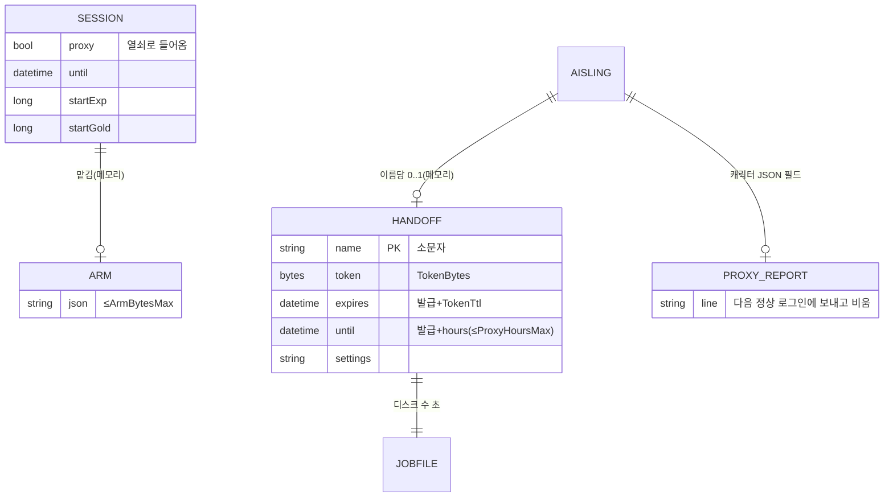

# API 계약 & 데이터 스키마 — 대신 사냥
버전: v1.1 · 기준 03 v1.1

## 규약
HTTP 가 아니라 게임 프로토콜 확장. 에러는 기존처럼 시스템 메시지 문구(스택 노출 없음). 버저닝 = 0xF1 종류 번호(옛 서버는 모르는 종류를 버림, 옛 앱은 안 보냄). 멱등: 맡김은 세션당 마지막 것으로 덮어쓰기.

## 계약 표
| ID | 방향·형식 | 내용 | 응답 | 에러 | 권한 |
|---|---|---|---|---|---|
| E-1 | 앱→서버 0xF1 종류 7 | u16 길이 + UTF-8 JSON(맡김 설정, ≤ `ArmBytesMax`). 길이 0 = 맡김 지움 | 없음 | 크기 초과·JSON 틀림 → 조용히 버리고 서버 기록 | 로그인한 세션 자기 캐릭터 |
| E-2 | 서버 내부 이벤트 ClientDisconnected | 맡김 있고 세션이 대리 아님 → `HandoffTokens.Issue` + 작업 파일 | — | 쓰기 실패 → 기록, 넘김 없음 | 서버 |
| E-3 | 파일 `ProxyJobFolder/<이름>.json` | 아래 스키마 | 대리가 읽고 지움 | 깨진 파일 → 지우고 기록 | 폴더 0700 |
| E-4 | 대리→로그인 서버 0x03(기존 로그인) | 이름 + 비밀번호 자리에 열쇠(hex 64자) | 기존 Redirect | 거절 → 「비밀번호가 틀렸습니다」(기존 문구) | 루프백 + 표 일치 |
| E-5 | 서버→앱 시스템 메시지(기존 0x0A) | 「대신 사냥 1시간 12분 · 경험치 +1,234,567 · 금화 +12,000 · 시간 끝」 | — | — | 정상 로그인 때 한 번 |
| E-6 | 서버 내부 1초 틱 | 대리 세션 `Until + ProxyGrace` 지나면 끊기, 만료 열쇠 지우기 | — | — | 서버 |

### 맡김 설정 JSON (E-1, 작업 파일 `settings` 와 같음)
```json
{"v":1,"hours":2,"radius":12,"healPercent":50,
 "hp":{"enabled":true,"percent":70,"potion":"쿠룸","ceiling":0},
 "mp":{"enabled":true,"percent":30,"potion":"마라디움","ceiling":1300},
 "loot":true,"skills":["이름",...],"spells":["이름",...],"enemySpells":["이름",...],
 "map":441,"x":10,"y":12}
```
기술·마법은 **이름**으로(칸 번호는 앱 배치 기준이라 대리의 칸과 다를 수 있음). 대리는 `WorldClient.Skills/Spells` 에서 이름으로 칸을 찾는다.

### 작업 파일 (E-3)
```json
{"name":"monk5","token":"<64 hex>","until":"2026-10-05T23:00:00Z","settings":{...}}
```

## ERD


## 데이터 규칙
시각 UTC ISO8601 · 이름 소문자 키 · 경험치·금화 정수 · 작업 파일 수명 = 대리가 읽을 때까지(최대 `TokenTtl`, 서버가 만료 때 같이 지움).

## 커버리지 매핑
| FR | 담당 |
|---|---|
| FR-001 | E-1 |
| FR-002 | E-1 |
| FR-003 | E-2, E-3 |
| FR-004 | E-4 |
| FR-005 | E-3, E-4 (대리 `HuntProxyRunner`) |
| FR-006 | 대리 `HuntProxyRunner` 끝 조건 |
| FR-007 | E-4(기존 중복 로그인) + `HandoffTokens.Cancel` |
| FR-008 | E-5 |
| FR-009 | 앱 수명 처리 → 기존 로그인 |
| FR-010 | 앱 설정 → E-1 `hours` |
| FR-011 | E-6 |
| FR-012 | 활동 기록 kind `proxy` |
