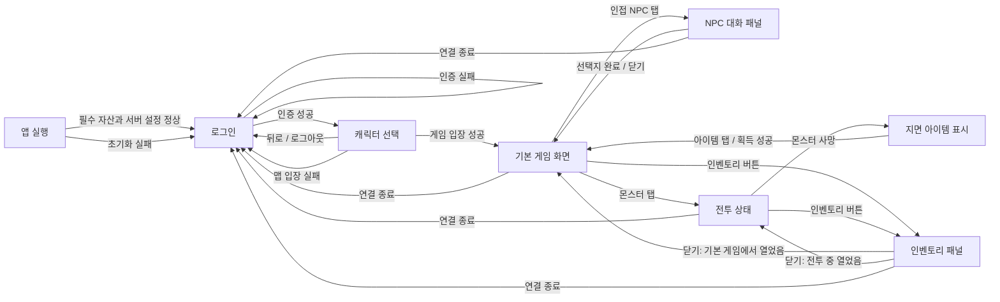

# 모바일 전환 첫 테스트 — 화면 흐름 및 구조 와이어프레임

- 문서 버전: 0.7 (8.1절 장비 탭 — 벗기까지 이었다)
- 상태: **승인됨 (2026-09-10)** — greybox 구현 착수 가능
- 기준일: 2026-09-10
- 기준 PRD: [모바일 전환 첫 테스트 버전](mobile-test-v1-prd.md)
- 대상: Android 스마트폰과 iPhone, **세로와 가로 두 방향**
- 범위: 로그인, 캐릭터 선택, 기본 게임 HUD, NPC 대화, 전투, 인벤토리의 6개 UI 상태

이 문서는 화면의 정보 구조와 조작 위치만 정한다. 색상, 장식, 최종 그래픽 스타일은 정하지 않는다. 6개 항목을 독립 화면 6장으로 만들지 않고, `로그인`, `캐릭터 확인`, `게임 월드`의 기본 프레임 3개와 게임 월드의 `NPC 대화`, `전투`, `인벤토리` 변형 상태 3개로 관리한다.

## 0. 조사 결과와 이 프로젝트의 적용 방식

### 0.1 조사를 반영한 실무형 산출물 단계

GDC의 게임 UX 실무 발표는 정보 구조에서 시작해 box wire, 클릭 프로토타입, 상세 wire, 시간에 따른 motion sketch, 구현 명세 순으로 구체화하고, 실제 기기에서 흐름과 어색한 전환을 검토하는 방식을 제시한다. Apple의 게임 UI 지침도 HUD를 정적인 한 장이 아니라 플레이 상황에 따라 필요한 조작만 보여 주는 인터페이스로 다룬다.

이를 현재 프로젝트에 다음처럼 적용한다.

| 단계 | 산출물 | 현재 상태 |
|---|---|---|
| 1. 흐름 지도 | 로그인부터 아이템 획득까지의 상태 전환과 실패 복귀 경로 | 이 문서 1절에 포함 |
| 2. Box wire | 정보·조작 영역만 사각형으로 배치한 저충실도 구조 | 이 문서 3~8절에 포함 |
| 3. 상태 시트 | 기본·눌림·처리 중·성공·실패·모달 상태와 표시 시점 | 이 문서 0.3절과 각 화면 전환 조건에 포함 |
| 4. In-engine greybox | 실제 맵 화면 위에 무채색 HUD를 얹고 터치·가림·전환을 기기에서 확인 | **승인 후 별도 구현 단계** |
| 5. Visual skin | 색상, 재질, 아이콘, 애니메이션, 최종 아트 | 첫 테스트 범위 밖 |

기존 게임 코드와 리소스가 있으므로 일반 앱처럼 고해상도 정적 목업을 먼저 만들지 않는다. 구조 승인 뒤 실제 게임 캡처 또는 Godot 테스트 맵 위에 HUD greybox를 올려, 엄지 가림과 전투 중 정보 노출을 실제 시간 흐름에서 확인한다. 이번 문서 작업에는 그 구현을 포함하지 않는다.

### 0.2 기본 프레임과 변형 상태

| ID | UI 상태 | 형태 | 유지되는 배경 |
|---|---|---|---|
| AUTH-01 | 로그인 | 전체 화면 기본 프레임 | 없음 |
| AUTH-02 | 캐릭터 확인 | 전체 화면 기본 프레임 | 없음 |
| GAME-01 | 기본 게임 HUD | 전체 화면 기본 프레임 | 게임 월드 |
| GAME-01-DIALOG | NPC 대화 | GAME-01 위 모달 변형 | 월드는 보이지만 입력 차단 |
| GAME-01-COMBAT | 전투 | GAME-01의 HUD 상태 변형 | 월드와 이동 조작 유지 |
| GAME-01-INVENTORY | 인벤토리 | GAME-01 위 모달 변형 | 월드는 보이지만 입력 차단 |

이 구분으로 전투용 scene이나 대화용 월드를 중복 제작하지 않고, 어떤 HUD 요소가 계속 남고 어떤 입력이 잠기는지 명확히 검토할 수 있다.

### 0.3 시간에 따른 공통 상태

게임 UI는 한 장의 배치뿐 아니라 입력 이후의 시간 흐름까지 정의해야 한다.

| 상태 | 표시 규칙 | 종료 조건 |
|---|---|---|
| 기본 | 현재 가능한 조작을 표시 | 사용자가 입력 |
| 눌림 | 첫 테스트 목표값으로 100ms 안에 모양·테두리·크기 중 하나로 피드백 | 손을 떼거나 길게 누르기 판정 |
| 서버 처리 중 | 해당 요청의 중복 입력만 잠그고 짧은 진행 상태 표시 | 응답·시간 초과·연결 종료 |
| 성공 | HP·좌표·아이템처럼 서버가 확정한 결과를 갱신 | 다음 상태로 자연스럽게 복귀 |
| 실패 | 기존 게임 상태를 보존하고 짧은 원인/재시도 안내 | 사용자가 다시 입력 |
| 모달 | 대화 또는 인벤토리 안에서만 조작 가능 | 명시적인 닫기·완료·연결 종료 |

### 0.4 조사 근거

- [GDC — Holistic UX Design](https://media.gdcvault.com/gdc2017/Presentations/rybicki-Holistic_UX_design-PDF.pdf): 정보 구조 → box wire → click prototype → 상세 wire → motion → 명세의 실무 흐름, 실제 기기 검토
- [Apple — Game controls](https://developer.apple.com/design/human-interface-guidelines/game-controls): 왼쪽 이동/오른쪽 행동의 엄지 도달 영역, 직접 객체 탭, 44×44pt 이상의 주요 조작, 상황에 따른 가상 조작 표시
- [Apple — Layout](https://developer.apple.com/design/human-interface-guidelines/layout): full-bleed 게임 화면, safe area, 다양한 화면 크기·글자 크기·양쪽 가로 방향 검증
- [Android — Display cutouts](https://developer.android.com/develop/ui/views/layout/display-cutout): cutout 안에 중요한 글자나 정밀 터치 조작을 두지 않고 고정값 대신 실제 inset 사용
- [Android — Responsive/adaptive design](https://developer.android.com/develop/ui/views/layout/responsive-adaptive-design-with-views): 고정 좌표보다 현재 window 크기와 요소 간 관계를 기준으로 배치하는 일반 원칙. Android `ConstraintLayout` API를 Godot에 그대로 사용한다는 뜻은 아님
- [Godot 4.6 — Multiple resolutions](https://docs.godotengine.org/en/4.6/tutorials/rendering/multiple_resolutions.html): 가로 모바일 1280×720 설계 크기, `canvas_items` + `expand`, 모서리 anchor를 이용한 화면비 대응

## 1. 전체 화면 흐름



화면 전환 원칙:

- 로그인과 캐릭터 선택은 전체 화면이다.
- 기본 게임 화면은 맵 입장 뒤 유지되는 기본 화면이다.
- NPC 대화와 인벤토리는 게임 화면 위의 모달 패널이다. 열려 있는 동안 맵 탭, 이동, 공격 입력을 막는다.
- 전투는 별도 전체 화면이 아니다. 기본 게임 화면에 대상 정보와 선택 표식이 추가되는 상태다.
- 서버 연결이 명시적으로 끊기면 열린 패널을 모두 닫고 3초 안에 로그인 화면으로 돌아간다(AC-012).

## 2. 공통 배치 규칙

### 2.0 플레이 중 조작 구역

```text
┌────────────────────────────── 안전 영역 ──────────────────────────────┐
│        보조 정보/메뉴 구역          읽기 정보          보조 메뉴 구역 │
│                                                                       │
│                         가리지 않아야 할 게임 초점                     │
│                     플레이어 · 대상 · NPC · 지면 아이템                │
│                                                                       │
│  왼손 엄지 주 조작 구역             상태 알림          오른손 엄지 주 조작 구역 │
│       4방향 이동                                          공격        │
└───────────────────────────────────────────────────────────────────────┘
```

- 자주 쓰는 이동과 공격은 양쪽 아래 엄지 도달 영역에 고정한다.
- 인벤토리처럼 덜 자주 쓰는 행동은 상단에 둔다.
- NPC·몬스터·아이템 선택은 별도 선택 버튼을 만들지 않고 월드 객체 직접 탭으로 처리한다.
- 일반적인 모바일 게임은 넓은 이동 입력 영역이나 floating stick도 사용하지만, 이 게임은 4방향 한 타일 이동의 정확성이 핵심이므로 첫 테스트는 고정 4방향 패드를 유지한다.

### 2.1 기준 영역과 화면 비율

```text
기기 실제 화면
┌─ 노치·둥근 모서리·홈 표시 영역을 포함한 전체 렌더 영역 ─────────────┐
│  ┌─ 안전 영역: 모든 글자와 필수 버튼을 두는 영역 ───────────────┐  │
│  │                                                            │  │
│  │                    실제 조작 가능 화면                       │  │
│  │                                                            │  │
│  └────────────────────────────────────────────────────────────┘  │
└──────────────────────────────────────────────────────────────────┘
```

- 설계 기준은 Godot 공식 가로 모바일 예시와 같은 1280×720 논리 좌표(16:9)다. 실제 픽셀 수가 아니라 엔진에서 스케일되는 설계 크기다.
- `canvas_items`와 `expand` 방식으로 월드와 배경은 실제 화면 전체를 채운다. 16:9보다 넓어지면 중앙 객체와 HUD를 가로로 잡아늘이지 않고 게임 월드의 좌우 가시 영역만 늘린다.
- 20:9와 21:9 이상에서도 화면 전체를 일괄 레터박스로 막지 않는다. 대신 양손 주요 조작의 중심 간격에 최대 폭을 두어 지나치게 넓은 기기에서도 엄지 이동 거리가 커지지 않게 한다. 특정 맵이 확장 화면비에서 게임 정보를 노출하거나 구도를 깨뜨릴 때만 그 맵의 카메라 영역에 제한을 두며, 이는 실제 기기 greybox에서 결정한다.
- 노치, 카메라 구멍, 둥근 모서리, iPhone 홈 표시줄은 안전 영역에서 제외한다. 배경과 맵은 바깥까지 그릴 수 있지만 글자와 필수 조작은 반드시 안전 영역 안에 둔다.
- 화면 방향은 세로와 가로를 모두 지원한다(2.3절). iPhone을 왼쪽 또는 오른쪽으로 돌린 두 가로 방향 모두에서 safe inset과 조작 위치를 검증한다.
- 로그인 중 화면 키보드가 나타나면 입력 폼을 위로 이동하거나 화면을 스크롤해 현재 입력칸과 로그인 버튼이 가려지지 않게 한다.

### 2.3 화면 방향 — 세로와 가로

세로는 가로를 눌러 담은 것이 아니다. 두 방향은 **쓸 수 있는 세로 공간의 양이 달라서 구조 자체가 다르다**. 화면 조각은 한 벌만 만들고 자리만 두 번 정한다.

| 항목 | 세로 360×780 | 가로 800×360 |
|---|---|---|
| 월드 | 위쪽 400. 조작 영역과 겹치지 않는다 | 화면 전체. HUD가 그 위에 뜬다 |
| 손가락 가림 | **없다.** 조작이 월드 밖에 있다 | 아래 양쪽 모서리를 가린다 |
| 대화·전투 기록 | 월드 아래 76 높이로 상시 노출 | 자리가 없어 지나가는 알림으로 대체 |
| 상태(이름·HP·MP) | 위쪽 왼편, 높이 52의 자기 자리 | 왼쪽 위, 월드 위에 겹침 |
| 시스템 버튼 | 위쪽 오른편. 엄지가 닿지 않으므로 급하지 않은 것만 | 위쪽 오른편. 양손으로 쥐므로 닿는다 |
| 빠른 슬롯 | 가운데 아래 가로줄. 양쪽 엄지 모두 닿는다 | 오른쪽 세로줄. 공격 버튼 바로 위 |
| 이동·공격 | 왼쪽 아래 방향판, 오른쪽 아래 공격 | 같음 |
| 모달(대화·인벤토리) | 월드 아래 전폭. 월드를 가리지 않는다 | 아래쪽 또는 오른쪽 패널. 월드 일부를 가린다 |

세로를 지원하는 이유는 하나다 — **손가락이 보려는 것을 가리지 않는다.** 원작이 아래쪽에 두었던 대화창이 세로에서는 그대로 되살아난다. 가로는 한 화면에 더 넓은 월드를 보여주는 대신 그 두 가지를 포기한다.

세로 780을 나눈 근거:

| 영역 | 높이 | 근거 |
|---|---|---|
| 상태 막대 | 52 | 48 터치 버튼 + 위아래 2 여백 |
| 월드 | 400 | 원작 타일 기준 세로 약 15칸. 이보다 낮으면 다가오는 적을 늦게 본다 |
| 기록 | 76 | 11sp 네 줄. 원작 대화창의 최소 분량 |
| 조작 | 252 | 빠른 슬롯 48 + 방향판 150 + 여백. 방향판은 세 줄이 모두 엄지 안쪽에 들어와야 한다 |

가로 360을 나눈 근거: HUD를 겹치지 않고서는 방향판 150과 월드를 동시에 넣을 수 없다. 그래서 가로는 겹치되, 겹치는 자리를 아래 양쪽 모서리로 몰아 화면 가운데(플레이어가 서 있는 곳)를 비워 둔다.

확인: [`개발 대시보드의 화면 실험실`](index.html?view=prototypes)에서 여섯 화면과 HUD 상태를 바로 바꿔 볼 수 있다.

### 2.2 터치와 글자 기준

| 항목 | 구조 기준 |
|---|---|
| 필수 터치 영역 | 최소 48×48 논리 dp 상당. iOS의 44×44pt 권장도 함께 충족하도록 공통 기준을 48로 사용 |
| 버튼 사이 간격 | 최소 8 논리 단위. 서로 다른 행동의 오터치를 막아야 함 |
| 화면 가장자리 | 안전 영역 경계에서 최소 8 논리 단위 안쪽 |
| 본문·입력 글자 | 16sp/pt 상당 이상 |
| 주요 버튼 글자 | 16sp/pt 상당 이상, 아이콘만 쓰지 않고 짧은 글자 라벨 병기 |
| 화면 제목 | 22~24sp/pt 상당 |
| HUD 보조 정보 | 14sp/pt 상당 이상. HP·연결 상태처럼 필수인 정보는 숫자나 글자를 함께 표시 |
| 확대 글자 | 운영체제 글자 확대 시 두 줄까지 허용하고 버튼 높이를 늘림. 글자를 잘라내거나 겹치게 하지 않음 |
| 입력 반응 | 탭 뒤 100ms 안에 눌림/선택 상태 표시, 정상 LAN의 서버 결과는 400ms 안에 반영 목표(NFR-004) |
| 양손 도달성 검증 | 기기를 가로로 양손에 잡고 손의 잡는 위치를 바꾸지 않은 채 4방향 각 10회와 공격 10회를 누른다. 도달 불가·잘못된 버튼 입력·safe area 이탈이 1회라도 있으면 배치 실패로 기록 |

접근성 공통 규칙:

- 색만으로 성공, 실패, 선택, HP를 구분하지 않는다. 글자, 수치, 테두리 또는 표식을 함께 사용한다.
- 모든 버튼과 월드 객체는 읽을 수 있는 이름과 역할을 가진다. 예: `공격 버튼`, `NPC 이름, 대화 가능`, `거미, 체력 3/10`.
- 상태 알림은 화면 중앙 하단에 표시하는 동시에 스크린 리더의 정중한 알림 영역으로 전달한다.
- 모달 패널을 열면 접근성 초점을 패널 제목으로 옮기고 패널 내부에 가둔다. 닫으면 패널을 연 버튼 또는 월드 객체로 되돌린다.
- 드래그, 스와이프, 멀티터치만으로 가능한 필수 행동은 두지 않는다.

## 3. 로그인

### 구조 와이어프레임

```text
┌──────────────────────────── 안전 영역 ────────────────────────────┐
│ [테스트 환경명]                              [서버 상태: 연결 가능] │
│                                                                  │
│                    ┌────────────────────────┐                    │
│                    │        게임 제목        │                    │
│                    │                        │                    │
│                    │ 사용자명               │                    │
│                    │ [____________________] │                    │
│                    │ 비밀번호               │                    │
│                    │ [____________________] │                    │
│                    │ [오류 또는 진행 상태]   │                    │
│                    │ [      로그인       ]  │                    │
│                    └────────────────────────┘                    │
│ [클라이언트 버전]                                                │
└──────────────────────────────────────────────────────────────────┘
```

| 구역 | 표시 정보·버튼 | 위치 |
|---|---|---|
| 상태 줄 | 테스트 환경명, 서버 연결 가능 여부 | 안전 영역 상단. 환경명 왼쪽, 상태 오른쪽 |
| 로그인 폼 | 사용자명, 비밀번호, 입력 오류 또는 접속 진행 상태 | 화면 중앙. 너비는 안전 영역의 절반 이하, 글자 확대 시 필요한 만큼 높이 증가 |
| 기본 행동 | `로그인` | 폼 맨 아래, 입력칸과 같은 너비, 최소 높이 48 |
| 보조 정보 | 클라이언트 버전 | 왼쪽 아래. 필수 행동보다 낮은 시각 우선순위 |

전환 조건:

- 앱 초기화가 끝나면 5초 안에 이 화면을 조작할 수 있어야 한다(AC-001).
- 사용자명과 비밀번호가 모두 입력되기 전에는 로그인 요청을 보내지 않는다.
- 로그인 탭 또는 키보드의 완료 동작으로 요청하고, 처리 중에는 중복 제출을 막는다.
- 인증 성공 시 비밀번호 값을 화면과 로그에서 제거하고 캐릭터 선택으로 이동한다(AC-002).
- 실패 시 계정 존재 여부를 구분하지 않는 한 문장 오류를 폼 안에 표시하고 이 화면에 남는다(AC-003).

범위 제외: 회원가입, 비밀번호 찾기, 소셜 로그인, 계정 저장, 서버 목록 선택.

## 4. 캐릭터 선택

Hades는 계정과 별도의 복수 캐릭터 목록이 없다. 따라서 이 화면은 로그인한 단일 `Aisling`을 확인하고 입장하는 단계다.

### 구조 와이어프레임

```text
┌──────────────────────────── 안전 영역 ────────────────────────────┐
│ [뒤로/로그아웃]              캐릭터 선택              [연결 상태] │
│                                                                  │
│                    ┌────────────────────────┐                    │
│                    │     [캐릭터 모습]       │                    │
│                    │                        │                    │
│                    │       캐릭터 이름       │                    │
│                    │     단일 캐릭터 안내     │                    │
│                    │                        │                    │
│                    │ [     게임 입장      ] │                    │
│                    └────────────────────────┘                    │
│                         [입장 진행/오류]                          │
└──────────────────────────────────────────────────────────────────┘
```

| 구역 | 표시 정보·버튼 | 위치 |
|---|---|---|
| 상단 | `뒤로/로그아웃`, 화면 제목, 연결 상태 | 안전 영역 상단 |
| 캐릭터 카드 | 기존 캐릭터 모습이 있으면 표시, 캐릭터 이름, 단일 캐릭터라는 안내 | 화면 중앙. 카드 하나만 표시 |
| 기본 행동 | `게임 입장` | 카드 하단, 최소 높이 48 |
| 상태 | 게임 서버 연결 및 맵 로딩 상태, 실패 문구 | 카드 바로 아래 |

전환 조건:

- 로그인 성공과 단일 캐릭터 로드가 끝나면 표시한다.
- `게임 입장`을 탭하면 버튼을 잠그고 로그인 서버 리다이렉트와 게임 서버 접속을 시작한다(AC-004).
- 맵 입장 성공 시 5초 안에 기본 게임 화면으로 이동한다(AC-005).
- 캐릭터나 맵 로드가 실패하면 원인을 일반 사용자 문장으로 알리고 로그인으로 돌아간다(AC-013).
- `뒤로/로그아웃`은 현재 인증 상태를 정리한 뒤 로그인으로 돌아간다.

범위 제외: 캐릭터 생성·삭제, 복수 슬롯, 직업·장비·능력치 선택.

## 5. 기본 게임 화면

### 구조 와이어프레임

```text
┌──────────────────────────── 안전 영역 ────────────────────────────┐
│ [캐릭터 이름] [HP 수치/막대]       [맵 이름] [연결] [인벤토리]    │
│                                                                  │
│                                                                  │
│                    맵과 게임 객체 표시 영역                       │
│             [NPC] [플레이어] [몬스터] [지면 아이템]               │
│                                                                  │
│                                                                  │
│ [     ↑     ]                 [획득·오류 상태]                    │
│ [  ←  ·  →  ]                                          [공격]   │
│ [     ↓     ]                                                   │
└──────────────────────────────────────────────────────────────────┘
```

| 구역 | 표시 정보·버튼 | 위치 |
|---|---|---|
| 플레이어 상태 | 캐릭터 이름, 현재/최대 HP | 왼쪽 위. HP는 막대와 숫자를 함께 표시 |
| 월드 상태 | 맵 이름, 연결 상태 | 상단 중앙~오른쪽. 연결 끊김은 글자로도 알림 |
| 인벤토리 | `인벤토리` 글자 또는 가방 아이콘+접근성 라벨 | 오른쪽 위, 최소 48×48 |
| 게임 월드 | 맵, 플레이어, NPC, 몬스터, 지면 아이템 | 중앙 전체. 고정 HUD 아래에서 최대한 넓게 사용 |
| 이동 패드 | 위·아래·왼쪽·오른쪽, 중앙은 비활성 | 왼쪽 아래. 각 방향 최소 48×48, 대각선 없음 |
| 공격 | `공격` | 오른쪽 아래, 최소 64×64 권장·48×48 미만 금지 |
| 상태 알림 | 이동 거부, 획득, 공격 실패, 연결 상태 같은 짧은 문장 | 중앙 하단, 조작 버튼과 겹치지 않음 |

조작과 전환 조건:

- 방향 1회 탭은 한 타일 이동을 요청하고, 길게 누르면 서버 제한을 넘지 않는 간격으로 반복한다(AC-006, AC-007).
- 인접 NPC 탭은 선택 표식을 먼저 표시한 뒤 NPC 대화 패널을 연다.
- 몬스터 탭은 전투 상태로 전환한다. 자동 이동이나 자동 공격은 하지 않는다.
- 지면 아이템 탭은 획득을 요청한다. 성공하면 객체를 제거하고 상태 알림과 인벤토리를 갱신한다(AC-011).
- 인벤토리 버튼은 인벤토리 패널을 연다.

범위 제외: 채팅, 미니맵, 퀘스트 추적, 스킬바, 자동 이동, 자동 전투.

## 6. NPC 대화

NPC 대화는 기본 게임 화면 위에 표시되는 모달 패널이다.

### 구조 와이어프레임

```text
┌──────────────────────────── 안전 영역 ────────────────────────────┐
│ [게임 화면은 보이지만 입력 불가]                                  │
│                                                                  │
│     ┌──────────────────── NPC 대화 패널 ─────────────────────┐    │
│     │ [NPC 모습]  NPC 이름                              [닫기] │    │
│     │                                                        │    │
│     │ 대화 문장. 글자가 커지면 패널 안에서 여러 줄로 표시한다. │    │
│     │                                                        │    │
│     │ [ 선택지 1                                             ] │    │
│     └────────────────────────────────────────────────────────┘    │
└──────────────────────────────────────────────────────────────────┘
```

| 구역 | 표시 정보·버튼 | 위치 |
|---|---|---|
| 대화 머리말 | 기존 모습이 있으면 NPC 모습, NPC 이름, `닫기` | 패널 상단. 닫기는 오른쪽 위 최소 48×48 |
| 대화 본문 | 현재 대화 문장 | 패널 중앙. 최소 16sp/pt, 줄바꿈 허용 |
| 선택지 | 첫 테스트용 선택지 1개 | 패널 하단, 가로로 넓은 최소 높이 48 버튼 |

전환 조건:

- 대화 가능한 거리의 NPC를 탭하고 서버 응답이 오면 연다(AC-008).
- 선택지를 탭하면 중복 입력을 막고 다음 문장 또는 종료 상태를 기다린다.
- 대화가 끝나거나 `닫기`를 탭하면 패널을 닫고 기본 게임 화면 입력을 복원한다.
- 패널이 열린 동안 이동 패드, 공격, 월드 객체 탭은 동작하지 않는다.

범위 제외: 상점, 퀘스트 수락, 여러 단계 분기 대화, 텍스트 입력.

## 7. 전투

전투는 기본 게임 화면의 상태 변화다. 이동 패드와 인벤토리는 유지되고, 선택 대상 정보와 표식이 추가된다.

### 구조 와이어프레임

```text
┌──────────────────────────── 안전 영역 ────────────────────────────┐
│ [캐릭터/HP]       [선택 몬스터 이름 | HP 3/10]       [인벤토리]   │
│                                                                  │
│                    맵과 게임 객체 표시 영역                       │
│                      ┌─ 대상 표식 ─┐                              │
│             [플레이어]       [몬스터]                             │
│                                                                  │
│ [     ↑     ]              [공격 결과/재사용 대기]                │
│ [  ←  ·  →  ]                                          [공격]   │
│ [     ↓     ]                                                   │
└──────────────────────────────────────────────────────────────────┘
```

| 구역 | 표시 정보·버튼 | 위치 |
|---|---|---|
| 대상 상태 | 몬스터 이름, 현재/최대 HP | 상단 중앙. HP는 막대와 숫자를 함께 표시 |
| 대상 표식 | 선택된 몬스터임을 나타내는 테두리 또는 표식 | 몬스터 객체 주변. 색만으로 구분하지 않음 |
| 공격 결과 | 피해, 거리·방향 오류, 공격 간격 대기 같은 짧은 상태 | 중앙 하단 |
| 행동 | 기존 이동 패드, `공격`, 인벤토리 | 기본 게임 화면과 같은 위치를 유지 |

전환 조건:

- 몬스터를 탭하면 대상 정보와 표식을 표시한다.
- 정면 인접 대상이 있을 때 `공격`을 탭하면 서버에 기본 공격을 요청한다. 자동으로 대상을 추적하거나 반복 공격하지 않는다(AC-009).
- 서버가 공격을 거부해도 클라이언트가 피해를 임의 반영하지 않고 짧은 상태 문구를 표시한다.
- HP가 0이 되면 대상 상태를 해제하고 서버가 보낸 위치에 시험 아이템을 표시한다(AC-010).
- 사용자가 다른 월드 객체를 선택하거나 대상이 사라지면 전투 상태를 끝내고 기본 게임 화면으로 돌아간다.

범위 제외: 스킬·마법 버튼, 자동 공격, 전투 로그 창, 파티 HP, 피해량 연출 설정.

## 8. 인벤토리

인벤토리는 게임 화면 위의 모달 패널이다. **원작대로 이름 없는 아이콘 격자**로 그린다 — 
`DAGL/UI/InventoryPane_A.cs` 의 60칸 격자와 `ItemPane.Render`(그림과 선택 테두리만, 글자 없음)가 근거다. 
한 줄에 이름을 쓰면 360폭에서 이름이 잘리고 두세 개밖에 못 보여 준다(2026-09-11에 실제로 그랬다). 
고른 칸의 이름과 할 수 있는 일은 패널 아래 한 줄에 쓴다.

**장비 칸을 위에, 소지품을 아래에 둔다.** 원작에는 걸친 것을 보여 주는 창이 따로 있었고, 
서버도 그것을 위해 `0x37`(자리가 찼다)·`0x38`(비었다)을 보낸다. 자리 이름은 서버의 `ItemSlots` 
번호를 그대로 쓴다(1 무기 · 2 갑옷 · 3 방패 · 4 투구 … 13 신발).

**착용·버리기·정렬을 넣는다**(2026-09-11 변경). 착용이 없으면 "갈아입어도 다시 안 그려지는 것"을
고쳐도 확인할 방법이 없었고, 버리기와 정렬은 원작에 있던 것이다. 서버도 셋 다 받아 준다 —
`0x1C` 쓰기 · `0x08` 버리기(칸·좌표·개수) · `0x30` 칸 맞바꾸기. 정렬은 서버에 그런 명령이 없고,
맞바꾸기를 여러 번 보내는 것이다(`PackOrder.Tidy` 가 그 순서를 계산한다).

**패널은 두 방향 모두 화면을 덮는다.** 위 줄만 남기고 조작 줄 위까지 내려온다 — 어느 방향에서도
줄 사이에 남는 높이가 아이콘 한 칸도 안 되고, 모달이라 그 아래는 어차피 눌리지 않는다.

### 구조 와이어프레임

```text
┌──────────────────────────── 안전 영역 ────────────────────────────┐
│ [게임 화면은 보이지만 입력 불가]            ┌──────────────────┐ │
│                                             │ 인벤토리    [닫기]│ │
│                                             │                  │ │
│                                             │ [아이템 칸/목록] │ │
│                                             │ [획득 아이템 ×1] │ │
│                                             │ [빈 칸]          │ │
│                                             │                  │ │
│                                             │ 보유 수량 표시   │ │
│                                             └──────────────────┘ │
└──────────────────────────────────────────────────────────────────┘
```

| 구역 | 표시 정보·버튼 | 위치 |
|---|---|---|
| 머리말 | `인벤토리`, `닫기` | 안전 영역 안의 오른쪽 패널 상단. 닫기는 최소 48×48 |
| 아이템 영역 | 서버가 보낸 아이템 모습 또는 자리 표시, 이름, 수량 | 세로 목록 또는 칸. 각 항목의 전체 터치/읽기 영역 최소 48 높이 |
| 확인 정보 | 시험 아이템 획득 수량 | 패널 하단. 획득 성공을 글자로도 확인 가능 |

반응형 규칙:

- 18:9~20:9에서는 안전 영역 너비의 약 35~40%를 사용하는 오른쪽 패널로 표시한다.
- 16:9 또는 글자 확대 상태에서는 필요한 너비를 확보하도록 안전 영역의 절반까지 넓힌다.
- 항목이 패널 높이를 넘을 때만 패널 내부 세로 스크롤을 허용한다. 가로 스크롤은 사용하지 않는다.

전환 조건:

- 기본 게임 또는 전투 상태에서 인벤토리 버튼을 탭하면 연다.
- 열릴 때 첫 항목 또는 빈 상태 안내에 접근성 초점을 둔다.
- `닫기`를 탭하면 직전 게임 상태로 돌아가고 인벤토리 버튼으로 초점을 돌린다.
- 패널이 열린 동안 이동, 공격, 월드 객체 탭을 막지만 서버가 보낸 인벤토리 변경은 목록에 반영한다.

범위 제외: 아이템 사용·장착·삭제·드롭·정렬·필터·상세 능력치.

## 8.1 장비 탭 (2026-09-11 추가)

**장비와 소지품을 한 패널에 쌓지 않고 탭으로 가른다.** 8절대로 장비 칸을 소지품 위에 올려 봤더니
칸이 늘수록 소지품이 화면 밖으로 밀렸고, 장비 자리 18개를 한 줄 여섯씩 늘어놓으면 어느 칸이
어느 부위인지 읽히지 않는다. 원작은 애초에 **창을 따로** 두었다.

### 근거 — 원작 신형 장비창

좌표 전부는 [`original-equipment-window.md`](original-equipment-window.md). 요약하면:

- `setoa.dat` → `_nui_eq.spf` · 599 x 306 · 칸 **18**개, 각 **32 x 32** · 종이인형 **110 x 84**
- 자리 18개가 우리 서버의 `WornPlace` 1~17 + 18과 **그대로 맞는다**. 구형 14칸에는 장신구·겉투구가 없다
- 원작 창은 **책 두 쪽**이다 — 왼쪽이 장비, 오른쪽이 이름·직업·무리·칭호·초상·능력치

**모바일은 왼쪽 쪽만 쓴다.** 오른쪽 쪽(이름·능력치)은 폰에서 한 번에 같이 볼 이유가 없고, 필요해지면
그때 별도 탭으로 나눈다. 이 절의 범위는 왼쪽 쪽뿐이다.

### 자리 배치 — 종이인형을 두르는 고리

원작은 격자가 아니라 **종이인형을 둘러싸는 고리**다. 행 2·6은 안쪽으로, 행 3~5는 바깥쪽으로 물러난다.

```text
                  [투구]
      [귀고리]              [목걸이]
 [장신구][갑옷]   ┌──────┐  [겉옷][장신구2]
         [무기]   │종이  │  [방패][장신구3]
   [왼팔][왼손]   │인형  │  [오른손][오른팔]
                  └──────┘
      [다리]   [신발]      [허리]
```

| 행 | 왼쪽 바깥 | 왼쪽 안쪽 | 가운데 | 오른쪽 안쪽 | 오른쪽 바깥 |
|---|---|---|---|---|---|
| 1 | | | 투구(4) | | |
| 2 | | 귀고리(5) | | 목걸이(6) | |
| 3 | 장신구(14) | 갑옷(2) | 종이인형 | 겉옷(15) | 장신구2(17) |
| 4 | | 무기(1) | 종이인형 | 방패(3) | 장신구3(18) |
| 5 | 왼팔(9) | 왼손(7) | 종이인형 | 오른손(8) | 오른팔(10) |
| 6 | | 다리(12) | 신발(13) | 허리(11) | |

괄호 안은 서버가 보내는 자리 번호(`WornPlace`)다. **겉투구(16)** 는 원작에서 투구 바로 아래 칸이므로
행 1을 두 칸으로 쓴다 — 투구 위, 겉투구 아래.

### 세로 — 폭이 딱 한 번 맞는다

기준 360 x 780. 안전 여백을 빼면 쓸 수 있는 폭이 **344** 다.

```
8 + 48 + 48 + 8 + 120 + 8 + 48 + 48 + 8 = 344
여백  바깥 안쪽  틈  종이인형  틈  안쪽 바깥  여백
```

- 칸은 **48**(`Main.TouchMinimum`). 원작 32를 그대로 비례로 키우면 43.6이 되어 **터치 최소치를 못 맞춘다** — 비례가 아니라 이 격자로 다시 앉힌다.
- 가운데 **120**은 원작 종이인형 110을 담고 남는 값이다. 이보다 좁히면 종이인형이 잘린다.
- 높이는 6행 x 48 + 행간 4 x 5 = **308**. 상태줄·탭줄·고른 것 줄을 더해도 780 안에 넉넉하다.
- 행 2·6의 안쪽 칸은 가운데에서 ±60에 둔다. 그 두 행에는 종이인형이 없으므로 가운데 영역을 침범해도 된다.

### 가로 — 행간 0, 그래도 세로로는 넘친다

기준 800 x 360, 최악 640 x 360.

- 가로에서는 **행간 0**, 칸을 붙인다. 원작도 칸이 붙어 있다. 6행 x 48 = **288**.
- **그래도 들어가지 않는다.** 패널은 위 줄 아래(y 80)에서 시작하므로 쓸 수 있는 높이가 280뿐이고,
  머리말 48과 꼬리 48을 빼면 링에 남는 것이 160이다. **가로에서 장비 탭은 세로로 스크롤된다** —
  8절이 이미 허용한 것이고, 줄이려면 칸을 터치 최소치 아래로 내려야 해서 그러지 않는다.
- 스크롤이 늘 있으므로 **패널 폭에 스크롤 막대를 넣어야 한다**: 링 312(48 x 4 + 종이인형 120) +
  패널 여백 16 + 막대. 코드는 이 값을 `GearGrid.PanelWidth` 에서 재서 쓴다 — 눈으로 셌다가
  두 번 틀렸다(간격을 두 번 세고, 막대를 빼먹었다).
- 오른쪽 기둥의 폭은 고정 비율이 아니라 그 값에서 거꾸로 잡는다. 640 x 360에서는 화면의 절반 남짓이 된다.

### 탭 줄

```text
┌──────────────────────────────────────────┐
│ [장비] [소지품]              [정렬] [닫기]│   정렬은 소지품 탭에서만
├──────────────────────────────────────────┤
│                                          │
│            (탭 내용)                      │
│                                          │
├──────────────────────────────────────────┤
│ 고른 것의 이름            [벗기] 또는 [입기]│
└──────────────────────────────────────────┘
```

| 구역 | 내용 | 규칙 |
|---|---|---|
| 탭 줄 | `장비` · `소지품` | 각 최소 48 높이. 고른 탭은 테두리·바탕으로 구분 |
| 머리 오른쪽 | `정렬` `닫기` | 각 48 x 48. `정렬`은 소지품 탭에서만 보인다 |
| 장비 탭 | 칸 18개 + 종이인형 | 빈 칸에는 `_nui_eqi.spf` 의 부위 그림을 깐다 |
| 소지품 탭 | 8절의 아이콘 격자 그대로 | 바뀌지 않는다 |
| 꼬리 | 고른 것의 이름과 할 수 있는 일 | 버튼은 하나다. 소지품에서 고르면 `입기`(+`버리기`), 장비 탭에서 고르면 `벗기`. 걸친 것은 바로 못 버린다 — 벗어야 버릴 것이 생긴다 |

### 상태

| 상태 | 장비 탭이 보여 주는 것 |
|---|---|
| 빈 자리 | 부위 그림을 흐리게. 눌러도 아무 일 없음 |
| 찬 자리 | 아이템 아이콘. 누르면 꼬리에 이름과 `벗기` |
| 서버 처리 중 | 그 칸만 잠근다. 다른 칸은 계속 누를 수 있다 |
| 실패 | 칸을 원래대로 두고 꼬리에 서버가 한 말을 쓴다 |

전환 조건: 8절의 인벤토리와 같다. 탭 전환은 서버에 아무것도 보내지 않는다 — 둘 다 이미 받아 둔 것이다.

## 9. 화면별 전환 조건 요약

| 현재 화면/상태 | 사용자 또는 시스템 조건 | 다음 화면/상태 | 실패 시 |
|---|---|---|---|
| 앱 실행 | 초기화 완료 | 로그인 | 로그인에 초기화 오류 표시 |
| 로그인 | 인증 성공 | 캐릭터 선택 | 로그인에 일반 인증 오류 표시 |
| 캐릭터 선택 | 게임 입장 및 맵 로드 성공 | 기본 게임 | 로그인으로 복귀하고 입장 실패 표시 |
| 기본 게임 | 인접 NPC 탭 및 응답 성공 | NPC 대화 | 기본 게임에 상호작용 실패 표시 |
| NPC 대화 | 선택 완료 또는 닫기 | 기본 게임 | 대화 패널에 재시도 가능한 오류 표시 |
| 기본 게임 | 몬스터 탭 | 전투 상태 | 선택하지 않고 상태 알림 표시 |
| 전투 상태 | 몬스터 사망 | 기본 게임 + 지면 아이템 | 서버 상태를 그대로 기다리고 오류 표시 |
| 기본 게임/전투 | 인벤토리 버튼 | 인벤토리 패널 | 기본 게임에 불러오기 실패 표시 |
| 인벤토리 | 닫기 | 직전 게임 상태 | 해당 없음 |
| 모든 게임 상태 | 연결 종료 | 로그인 | 열린 패널을 모두 닫고 종료 이유 표시 |

## 9.1 Greybox 검토 시나리오 — 승인 후 수행

아래는 다음 구현 단계의 검증 순서이며 이번 문서 커밋에서는 실행하지 않는다.

1. 실제 테스트 맵 장면 또는 캡처 위에 GAME-01 box wire를 겹친다.
2. 16:9, 19.5:9, 20:9, 가장 넓은 보유 기기 비율에서 HUD가 플레이어·NPC·몬스터·드롭을 가리는지 비교한다.
3. 화면을 양손으로 잡은 상태에서 이동 10회, 대상 선택, 공격 10회, NPC 대화, 아이템 확인을 연속 수행한다.
4. 기본→눌림→서버 대기→성공/실패 상태가 구분되는지 화면 녹화로 검토한다.
5. 대화와 인벤토리를 닫았을 때 직전 선택 대상과 접근성 초점이 정확히 복원되는지 확인한다.
6. 기본 글자와 확대 글자, 왼쪽/오른쪽 landscape, cutout이 있는 Android/iPhone에서 잘림과 오터치를 기록한다.

## 10. 결정 사항 (2026-09-10 확정)

| # | 결정 | 이유 |
|---|---|---|
| 1 | **우리가 만드는 UI 문구는 한국어로 고정. 서버가 보내는 메시지는 영문 그대로 둔다.** | 한글 표시의 위험은 번역이 아니라 렌더링에 있다 — 글꼴 유무, 버튼 안에서의 줄바꿈과 넘침, CP949↔UTF-8 변환. 껍데기를 한국어로 두면 이 셋을 첫 화면부터 검증하면서 번역 작업은 하지 않는다. 서버 메시지는 대부분 `LoruleConfig.json`의 설정값이라 나중에 파일 수정으로 옮길 수 있고, NPC 대사·메뉴는 스크립트 135개에 있어 별도 작업이다 |
| 2 | **공통 자리 표시 그림(회색 사각)을 둔다.** 이름만 표시하지 않는다 | 원본 그림은 `.dat` 아카이브 안에 있어 추출·변환이 선행돼야 한다. 자리가 비어 있으면 터치 영역 크기와 간격이 적절한지 판단할 수 없고, greybox 단계의 목적이 바로 그 판단이다 |
| 3 | **뒤로 가기: 캐릭터 선택 = 로그아웃(확인 1회), 대화·인벤토리 = 닫기, 게임 화면(열린 창 없음) = "한 번 더 누르면 종료" 안내 후 종료** | 안드로이드 관행을 따르며 별도 종료 화면을 만들지 않는다는 기존 범위를 지킨다 |
| 4 | **인벤토리는 단순 목록으로 시작한다.** 서버 슬롯 구조는 반영하지 않는다 | 현재 서버가 올리는 아이템 템플릿이 3종이다. 슬롯 격자는 대부분 빈칸을 그리는 일이며, 첫 테스트의 인벤토리는 읽기 전용이다 |

승인에 따라 4절의 in-engine greybox 단계를 시작할 수 있다. 색상·아트·최종 UX는 여전히 이 문서의 범위 밖이다.
