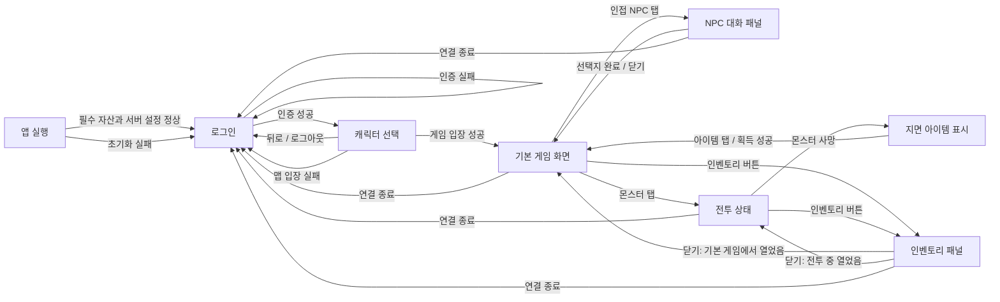

# 모바일 전환 첫 테스트 — 화면 흐름 및 구조 와이어프레임

- 문서 버전: 0.1
- 상태: 검토안 — 승인 전 구현 금지
- 기준일: 2026-09-09
- 기준 PRD: [모바일 전환 첫 테스트 버전](mobile-test-v1-prd.md)
- 대상: Android 스마트폰과 iPhone, 가로 방향
- 범위: 로그인, 캐릭터 선택, 기본 게임 화면, NPC 대화, 전투, 인벤토리

이 문서는 화면의 정보 구조와 조작 위치만 정한다. 색상, 장식, 애니메이션, 최종 그래픽 스타일은 정하지 않는다. NPC 대화·전투·인벤토리는 별도의 월드가 아니라 기본 게임 화면 위에 나타나는 상태 또는 패널이다.

## 1. 전체 화면 흐름



화면 전환 원칙:

- 로그인과 캐릭터 선택은 전체 화면이다.
- 기본 게임 화면은 맵 입장 뒤 유지되는 기본 화면이다.
- NPC 대화와 인벤토리는 게임 화면 위의 모달 패널이다. 열려 있는 동안 맵 탭, 이동, 공격 입력을 막는다.
- 전투는 별도 전체 화면이 아니다. 기본 게임 화면에 대상 정보와 선택 표식이 추가되는 상태다.
- 서버 연결이 명시적으로 끊기면 열린 패널을 모두 닫고 3초 안에 로그인 화면으로 돌아간다(AC-012).

## 2. 공통 배치 규칙

### 2.1 기준 영역과 화면 비율

```text
기기 실제 화면
┌─ 노치·둥근 모서리·홈 표시 영역을 포함한 전체 렌더 영역 ─────────────┐
│  ┌─ 안전 영역: 모든 글자와 필수 버튼을 두는 영역 ───────────────┐  │
│  │                                                            │  │
│  │                    실제 조작 가능 화면                       │  │
│  │                                                            │  │
│  └────────────────────────────────────────────────────────────┘  │
└──────────────────────────────────────────────────────────────────┘
```

- 설계 기준은 가로 1280×720 논리 좌표(16:9)다. 실제 픽셀 수가 아니라 엔진에서 스케일되는 기준 크기다.
- 16:9부터 20:9까지는 중앙의 게임 맵 또는 빈 여백이 늘어난다. 버튼 크기와 안전 영역 여백은 늘이거나 줄이지 않는다.
- 21:9 이상은 PRD AC-014에 따라 최대 21:9의 조작 화면을 가운데 두고 바깥을 레터박스로 처리한다.
- 노치, 카메라 구멍, 둥근 모서리, iPhone 홈 표시줄은 안전 영역에서 제외한다. 배경과 맵은 바깥까지 그릴 수 있지만 글자와 필수 조작은 반드시 안전 영역 안에 둔다.
- 화면 회전은 가로로 고정한다. 실행 중 세로 재배치는 첫 테스트 범위가 아니다.
- 로그인 중 화면 키보드가 나타나면 입력 폼을 위로 이동하거나 화면을 스크롤해 현재 입력칸과 로그인 버튼이 가려지지 않게 한다.

### 2.2 터치와 글자 기준

| 항목 | 구조 기준 |
|---|---|
| 필수 터치 영역 | 최소 48×48 논리 dp 상당. iOS의 44×44pt 권장도 함께 충족하도록 공통 기준을 48로 사용 |
| 버튼 사이 간격 | 최소 8 논리 단위. 서로 다른 행동의 오터치를 막아야 함 |
| 화면 가장자리 | 안전 영역 경계에서 최소 8 논리 단위 안쪽 |
| 본문·입력 글자 | 16sp/pt 상당 이상 |
| 주요 버튼 글자 | 16sp/pt 상당 이상, 아이콘만 쓰지 않고 짧은 글자 라벨 병기 |
| 화면 제목 | 22~24sp/pt 상당 |
| HUD 보조 정보 | 14sp/pt 상당 이상. HP·연결 상태처럼 필수인 정보는 숫자나 글자를 함께 표시 |
| 확대 글자 | 운영체제 글자 확대 시 두 줄까지 허용하고 버튼 높이를 늘림. 글자를 잘라내거나 겹치게 하지 않음 |
| 입력 반응 | 탭 뒤 100ms 안에 눌림/선택 상태 표시, 정상 LAN의 서버 결과는 400ms 안에 반영 목표(NFR-004) |

접근성 공통 규칙:

- 색만으로 성공, 실패, 선택, HP를 구분하지 않는다. 글자, 수치, 테두리 또는 표식을 함께 사용한다.
- 모든 버튼과 월드 객체는 읽을 수 있는 이름과 역할을 가진다. 예: `공격 버튼`, `NPC 이름, 대화 가능`, `거미, 체력 3/10`.
- 상태 알림은 화면 중앙 하단에 표시하는 동시에 스크린 리더의 정중한 알림 영역으로 전달한다.
- 모달 패널을 열면 접근성 초점을 패널 제목으로 옮기고 패널 내부에 가둔다. 닫으면 패널을 연 버튼 또는 월드 객체로 되돌린다.
- 드래그, 스와이프, 멀티터치만으로 가능한 필수 행동은 두지 않는다.

## 3. 로그인

### 구조 와이어프레임

```text
┌──────────────────────────── 안전 영역 ────────────────────────────┐
│ [테스트 환경명]                              [서버 상태: 연결 가능] │
│                                                                  │
│                    ┌────────────────────────┐                    │
│                    │        게임 제목        │                    │
│                    │                        │                    │
│                    │ 사용자명               │                    │
│                    │ [____________________] │                    │
│                    │ 비밀번호               │                    │
│                    │ [____________________] │                    │
│                    │ [오류 또는 진행 상태]   │                    │
│                    │ [      로그인       ]  │                    │
│                    └────────────────────────┘                    │
│ [클라이언트 버전]                                                │
└──────────────────────────────────────────────────────────────────┘
```

| 구역 | 표시 정보·버튼 | 위치 |
|---|---|---|
| 상태 줄 | 테스트 환경명, 서버 연결 가능 여부 | 안전 영역 상단. 환경명 왼쪽, 상태 오른쪽 |
| 로그인 폼 | 사용자명, 비밀번호, 입력 오류 또는 접속 진행 상태 | 화면 중앙. 너비는 안전 영역의 절반 이하, 글자 확대 시 필요한 만큼 높이 증가 |
| 기본 행동 | `로그인` | 폼 맨 아래, 입력칸과 같은 너비, 최소 높이 48 |
| 보조 정보 | 클라이언트 버전 | 왼쪽 아래. 필수 행동보다 낮은 시각 우선순위 |

전환 조건:

- 앱 초기화가 끝나면 5초 안에 이 화면을 조작할 수 있어야 한다(AC-001).
- 사용자명과 비밀번호가 모두 입력되기 전에는 로그인 요청을 보내지 않는다.
- 로그인 탭 또는 키보드의 완료 동작으로 요청하고, 처리 중에는 중복 제출을 막는다.
- 인증 성공 시 비밀번호 값을 화면과 로그에서 제거하고 캐릭터 선택으로 이동한다(AC-002).
- 실패 시 계정 존재 여부를 구분하지 않는 한 문장 오류를 폼 안에 표시하고 이 화면에 남는다(AC-003).

범위 제외: 회원가입, 비밀번호 찾기, 소셜 로그인, 계정 저장, 서버 목록 선택.

## 4. 캐릭터 선택

Hades는 계정과 별도의 복수 캐릭터 목록이 없다. 따라서 이 화면은 로그인한 단일 `Aisling`을 확인하고 입장하는 단계다.

### 구조 와이어프레임

```text
┌──────────────────────────── 안전 영역 ────────────────────────────┐
│ [뒤로/로그아웃]              캐릭터 선택              [연결 상태] │
│                                                                  │
│                    ┌────────────────────────┐                    │
│                    │     [캐릭터 모습]       │                    │
│                    │                        │                    │
│                    │       캐릭터 이름       │                    │
│                    │     단일 캐릭터 안내     │                    │
│                    │                        │                    │
│                    │ [     게임 입장      ] │                    │
│                    └────────────────────────┘                    │
│                         [입장 진행/오류]                          │
└──────────────────────────────────────────────────────────────────┘
```

| 구역 | 표시 정보·버튼 | 위치 |
|---|---|---|
| 상단 | `뒤로/로그아웃`, 화면 제목, 연결 상태 | 안전 영역 상단 |
| 캐릭터 카드 | 기존 캐릭터 모습이 있으면 표시, 캐릭터 이름, 단일 캐릭터라는 안내 | 화면 중앙. 카드 하나만 표시 |
| 기본 행동 | `게임 입장` | 카드 하단, 최소 높이 48 |
| 상태 | 게임 서버 연결 및 맵 로딩 상태, 실패 문구 | 카드 바로 아래 |

전환 조건:

- 로그인 성공과 단일 캐릭터 로드가 끝나면 표시한다.
- `게임 입장`을 탭하면 버튼을 잠그고 로그인 서버 리다이렉트와 게임 서버 접속을 시작한다(AC-004).
- 맵 입장 성공 시 5초 안에 기본 게임 화면으로 이동한다(AC-005).
- 캐릭터나 맵 로드가 실패하면 원인을 일반 사용자 문장으로 알리고 로그인으로 돌아간다(AC-013).
- `뒤로/로그아웃`은 현재 인증 상태를 정리한 뒤 로그인으로 돌아간다.

범위 제외: 캐릭터 생성·삭제, 복수 슬롯, 직업·장비·능력치 선택.

## 5. 기본 게임 화면

### 구조 와이어프레임

```text
┌──────────────────────────── 안전 영역 ────────────────────────────┐
│ [캐릭터 이름] [HP 수치/막대]       [맵 이름] [연결] [인벤토리]    │
│                                                                  │
│                                                                  │
│                    맵과 게임 객체 표시 영역                       │
│             [NPC] [플레이어] [몬스터] [지면 아이템]               │
│                                                                  │
│                                                                  │
│ [     ↑     ]                 [획득·오류 상태]                    │
│ [  ←  ·  →  ]                                          [공격]   │
│ [     ↓     ]                                                   │
└──────────────────────────────────────────────────────────────────┘
```

| 구역 | 표시 정보·버튼 | 위치 |
|---|---|---|
| 플레이어 상태 | 캐릭터 이름, 현재/최대 HP | 왼쪽 위. HP는 막대와 숫자를 함께 표시 |
| 월드 상태 | 맵 이름, 연결 상태 | 상단 중앙~오른쪽. 연결 끊김은 글자로도 알림 |
| 인벤토리 | `인벤토리` 글자 또는 가방 아이콘+접근성 라벨 | 오른쪽 위, 최소 48×48 |
| 게임 월드 | 맵, 플레이어, NPC, 몬스터, 지면 아이템 | 중앙 전체. 고정 HUD 아래에서 최대한 넓게 사용 |
| 이동 패드 | 위·아래·왼쪽·오른쪽, 중앙은 비활성 | 왼쪽 아래. 각 방향 최소 48×48, 대각선 없음 |
| 공격 | `공격` | 오른쪽 아래, 최소 64×64 권장·48×48 미만 금지 |
| 상태 알림 | 이동 거부, 획득, 공격 실패, 연결 상태 같은 짧은 문장 | 중앙 하단, 조작 버튼과 겹치지 않음 |

조작과 전환 조건:

- 방향 1회 탭은 한 타일 이동을 요청하고, 길게 누르면 서버 제한을 넘지 않는 간격으로 반복한다(AC-006, AC-007).
- 인접 NPC 탭은 선택 표식을 먼저 표시한 뒤 NPC 대화 패널을 연다.
- 몬스터 탭은 전투 상태로 전환한다. 자동 이동이나 자동 공격은 하지 않는다.
- 지면 아이템 탭은 획득을 요청한다. 성공하면 객체를 제거하고 상태 알림과 인벤토리를 갱신한다(AC-011).
- 인벤토리 버튼은 인벤토리 패널을 연다.

범위 제외: 채팅, 미니맵, 퀘스트 추적, 스킬바, 자동 이동, 자동 전투.

## 6. NPC 대화

NPC 대화는 기본 게임 화면 위에 표시되는 모달 패널이다.

### 구조 와이어프레임

```text
┌──────────────────────────── 안전 영역 ────────────────────────────┐
│ [게임 화면은 보이지만 입력 불가]                                  │
│                                                                  │
│     ┌──────────────────── NPC 대화 패널 ─────────────────────┐    │
│     │ [NPC 모습]  NPC 이름                              [닫기] │    │
│     │                                                        │    │
│     │ 대화 문장. 글자가 커지면 패널 안에서 여러 줄로 표시한다. │    │
│     │                                                        │    │
│     │ [ 선택지 1                                             ] │    │
│     └────────────────────────────────────────────────────────┘    │
└──────────────────────────────────────────────────────────────────┘
```

| 구역 | 표시 정보·버튼 | 위치 |
|---|---|---|
| 대화 머리말 | 기존 모습이 있으면 NPC 모습, NPC 이름, `닫기` | 패널 상단. 닫기는 오른쪽 위 최소 48×48 |
| 대화 본문 | 현재 대화 문장 | 패널 중앙. 최소 16sp/pt, 줄바꿈 허용 |
| 선택지 | 첫 테스트용 선택지 1개 | 패널 하단, 가로로 넓은 최소 높이 48 버튼 |

전환 조건:

- 대화 가능한 거리의 NPC를 탭하고 서버 응답이 오면 연다(AC-008).
- 선택지를 탭하면 중복 입력을 막고 다음 문장 또는 종료 상태를 기다린다.
- 대화가 끝나거나 `닫기`를 탭하면 패널을 닫고 기본 게임 화면 입력을 복원한다.
- 패널이 열린 동안 이동 패드, 공격, 월드 객체 탭은 동작하지 않는다.

범위 제외: 상점, 퀘스트 수락, 여러 단계 분기 대화, 텍스트 입력.

## 7. 전투

전투는 기본 게임 화면의 상태 변화다. 이동 패드와 인벤토리는 유지되고, 선택 대상 정보와 표식이 추가된다.

### 구조 와이어프레임

```text
┌──────────────────────────── 안전 영역 ────────────────────────────┐
│ [캐릭터/HP]       [선택 몬스터 이름 | HP 3/10]       [인벤토리]   │
│                                                                  │
│                    맵과 게임 객체 표시 영역                       │
│                      ┌─ 대상 표식 ─┐                              │
│             [플레이어]       [몬스터]                             │
│                                                                  │
│ [     ↑     ]              [공격 결과/재사용 대기]                │
│ [  ←  ·  →  ]                                          [공격]   │
│ [     ↓     ]                                                   │
└──────────────────────────────────────────────────────────────────┘
```

| 구역 | 표시 정보·버튼 | 위치 |
|---|---|---|
| 대상 상태 | 몬스터 이름, 현재/최대 HP | 상단 중앙. HP는 막대와 숫자를 함께 표시 |
| 대상 표식 | 선택된 몬스터임을 나타내는 테두리 또는 표식 | 몬스터 객체 주변. 색만으로 구분하지 않음 |
| 공격 결과 | 피해, 거리·방향 오류, 공격 간격 대기 같은 짧은 상태 | 중앙 하단 |
| 행동 | 기존 이동 패드, `공격`, 인벤토리 | 기본 게임 화면과 같은 위치를 유지 |

전환 조건:

- 몬스터를 탭하면 대상 정보와 표식을 표시한다.
- 정면 인접 대상이 있을 때 `공격`을 탭하면 서버에 기본 공격을 요청한다. 자동으로 대상을 추적하거나 반복 공격하지 않는다(AC-009).
- 서버가 공격을 거부해도 클라이언트가 피해를 임의 반영하지 않고 짧은 상태 문구를 표시한다.
- HP가 0이 되면 대상 상태를 해제하고 서버가 보낸 위치에 시험 아이템을 표시한다(AC-010).
- 사용자가 다른 월드 객체를 선택하거나 대상이 사라지면 전투 상태를 끝내고 기본 게임 화면으로 돌아간다.

범위 제외: 스킬·마법 버튼, 자동 공격, 전투 로그 창, 파티 HP, 피해량 연출 설정.

## 8. 인벤토리

인벤토리는 획득 성공을 확인하기 위한 읽기 중심 모달 패널이다. 장착, 사용, 버리기, 정렬은 넣지 않는다.

### 구조 와이어프레임

```text
┌──────────────────────────── 안전 영역 ────────────────────────────┐
│ [게임 화면은 보이지만 입력 불가]            ┌──────────────────┐ │
│                                             │ 인벤토리    [닫기]│ │
│                                             │                  │ │
│                                             │ [아이템 칸/목록] │ │
│                                             │ [획득 아이템 ×1] │ │
│                                             │ [빈 칸]          │ │
│                                             │                  │ │
│                                             │ 보유 수량 표시   │ │
│                                             └──────────────────┘ │
└──────────────────────────────────────────────────────────────────┘
```

| 구역 | 표시 정보·버튼 | 위치 |
|---|---|---|
| 머리말 | `인벤토리`, `닫기` | 안전 영역 안의 오른쪽 패널 상단. 닫기는 최소 48×48 |
| 아이템 영역 | 서버가 보낸 아이템 모습 또는 자리 표시, 이름, 수량 | 세로 목록 또는 칸. 각 항목의 전체 터치/읽기 영역 최소 48 높이 |
| 확인 정보 | 시험 아이템 획득 수량 | 패널 하단. 획득 성공을 글자로도 확인 가능 |

반응형 규칙:

- 18:9~20:9에서는 안전 영역 너비의 약 35~40%를 사용하는 오른쪽 패널로 표시한다.
- 16:9 또는 글자 확대 상태에서는 필요한 너비를 확보하도록 안전 영역의 절반까지 넓힌다.
- 항목이 패널 높이를 넘을 때만 패널 내부 세로 스크롤을 허용한다. 가로 스크롤은 사용하지 않는다.

전환 조건:

- 기본 게임 또는 전투 상태에서 인벤토리 버튼을 탭하면 연다.
- 열릴 때 첫 항목 또는 빈 상태 안내에 접근성 초점을 둔다.
- `닫기`를 탭하면 직전 게임 상태로 돌아가고 인벤토리 버튼으로 초점을 돌린다.
- 패널이 열린 동안 이동, 공격, 월드 객체 탭을 막지만 서버가 보낸 인벤토리 변경은 목록에 반영한다.

범위 제외: 아이템 사용·장착·삭제·드롭·정렬·필터·상세 능력치.

## 9. 화면별 전환 조건 요약

| 현재 화면/상태 | 사용자 또는 시스템 조건 | 다음 화면/상태 | 실패 시 |
|---|---|---|---|
| 앱 실행 | 초기화 완료 | 로그인 | 로그인에 초기화 오류 표시 |
| 로그인 | 인증 성공 | 캐릭터 선택 | 로그인에 일반 인증 오류 표시 |
| 캐릭터 선택 | 게임 입장 및 맵 로드 성공 | 기본 게임 | 로그인으로 복귀하고 입장 실패 표시 |
| 기본 게임 | 인접 NPC 탭 및 응답 성공 | NPC 대화 | 기본 게임에 상호작용 실패 표시 |
| NPC 대화 | 선택 완료 또는 닫기 | 기본 게임 | 대화 패널에 재시도 가능한 오류 표시 |
| 기본 게임 | 몬스터 탭 | 전투 상태 | 선택하지 않고 상태 알림 표시 |
| 전투 상태 | 몬스터 사망 | 기본 게임 + 지면 아이템 | 서버 상태를 그대로 기다리고 오류 표시 |
| 기본 게임/전투 | 인벤토리 버튼 | 인벤토리 패널 | 기본 게임에 불러오기 실패 표시 |
| 인벤토리 | 닫기 | 직전 게임 상태 | 해당 없음 |
| 모든 게임 상태 | 연결 종료 | 로그인 | 열린 패널을 모두 닫고 종료 이유 표시 |

## 10. 검토 시 확인할 결정 사항

아래 항목은 구현에 포함하지 않고 문서 승인 때만 결정한다.

1. UI 표시 언어를 첫 테스트에서 한국어로 고정할지, 기존 서버 문자열을 그대로 표시할지.
2. 캐릭터 카드와 NPC 대화에 기존 sprite를 표시할 수 없을 때 이름만 표시할지, 공통 자리 표시 이미지를 둘지.
3. Android 시스템 뒤로 가기를 캐릭터 선택에서는 로그아웃, 대화·인벤토리에서는 닫기로 사용할지. 기본 게임에서의 뒤로 가기 동작은 별도 종료 화면을 추가하지 않는 범위에서 정해야 한다.
4. 인벤토리를 서버 슬롯 구조 그대로 보여줄지, 첫 테스트 아이템만 보이는 단순 목록으로 시작할지.

이 네 가지가 결정되기 전에도 로그인 프로토콜 계약과 테스트 fixture 조사는 진행할 수 있지만 UI 구현은 시작하지 않는다.
