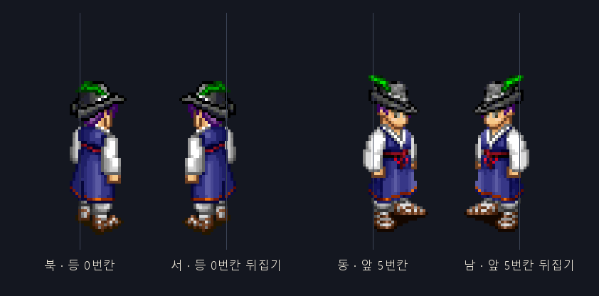

# 원작 캐릭터 동작 구조 — 방향·프레임 구간

- 문서 버전: 2.0 (`skill.tbl` 원문을 찾아 추정 규칙을 권위 표로 교체)
- 기준일: 2026-09-10
- 근거: 이 저장소의 `game/khan.dat`·`khan2.dat`·`hades.dat`·`roh.dat` 직접 해독 +
  설치 클라이언트의 `Legend.dat/skill.tbl`·`MobTile.tbl` + 저장소 안의 참고 클라이언트
  `sources/FallenDev/dark-ages-ts`
- 도구: `tools/dat-extract` (`epf` `mpf` `pose` 명령)

> **왜 이 문서가 필요한가.** 걷기에서 "북과 서가 같은 방향을 보고 동과 남이 같다"는 문제가 나왔다.
> 그건 버그가 아니라 **원작이 원래 그렇게 만들어져 있기 때문**이다. 같은 구조가 스킬·주문·감정표현에서
> 그대로 반복되므로, 매번 다시 알아내지 않도록 여기 한 곳에 적어 둔다.

---

## 1. 한 줄 요약

원작은 캐릭터를 **네 방향으로 그리지 않는다. 두 벌만 그리고 나머지 둘은 좌우로 뒤집어 쓴다.**
그리고 한 파일 안에 여러 스킬 동작이 이어 붙어 있는데, **어느 칸이 어느 스킬인지는 그림 파일이 아니라
`Legend.dat` 안의 `skill.tbl`이 정한다.**

---

## 2. 방향 — 두 벌 + 좌우 뒤집기

원작 화면은 마름모(아이소메트릭)라서 게임의 동서남북이 화면에서는 대각선 네 방향이 된다.

| 게임 방향 | 화면에서 | 쓰는 그림 | 좌우 뒤집기 |
|---|---|---|---|
| 북 | 오른쪽 위 | **등을 보이는 벌** (구간의 첫 FC칸) | 아니오 |
| 서 | 왼쪽 위 | **등을 보이는 벌** (구간의 첫 FC칸) | **예** |
| 동 | 오른쪽 아래 | **앞을 보는 벌** (구간의 뒤 FC칸) | 아니오 |
| 남 | 왼쪽 아래 | **앞을 보는 벌** (구간의 뒤 FC칸) | **예** |



*세로선이 뒤집는 축이다. 북과 서는 같은 그림, 동과 남도 같은 그림이다.*

저장소의 참고 클라이언트가 같은 규칙을 그대로 쓴다:

```ts
// sources/FallenDev/dark-ages-ts/.../atlas-sprite-animator.ts
public directionFrame(direction: number) {
  if (direction === 0 || direction === 3) {   // UP_RIGHT(북), UP_LEFT(서)
    return this._animation.startUp + this._frame;
  } else {                                     // DOWN_RIGHT(동), DOWN_LEFT(남)
    return this._animation.startDown + this._frame;
  }
}
```

```ts
// sources/FallenDev/dark-ages-ts/.../paper-doll-container.ts
case Direction.UP_RIGHT:   this.sendToBack(this.pieces.shield);  this.setScale( 1, 1); break;
case Direction.DOWN_RIGHT: this.bringToTop(this.pieces.shield);  this.setScale( 1, 1); break;
case Direction.DOWN_LEFT:  this.bringToTop(this.pieces.shield);  this.setScale(-1, 1); break;
case Direction.UP_LEFT:    this.sendToBack(this.pieces.shield);  this.setScale(-1, 1); break;
```

### 2.1 함께 따라오는 두 가지

1. **겹치는 순서가 방향에 따라 바뀐다.** 등을 보일 때는 방패가 몸 뒤로, 앞을 볼 때는 몸 앞으로 간다.
   무기·망토도 같은 처리가 필요하다. 방향만 바꾸고 순서를 안 바꾸면 방패가 등을 뚫고 나온다.
2. **뒤집는 축은 그림 칸의 한가운데가 아니라 발이 닿는 자리다.** 원작 조각은 칸 안에서 한쪽으로 치우쳐
   있어서, 칸 중심을 축으로 뒤집으면 캐릭터가 옆으로 밀린다. 우리 시안에서는
   `transform-origin: calc(50% + var(--ox)) center`로 축을 발 위치에 맞췄다.

---

## 3. 동작 파일 — 한 부위에 여덟 벌

부위 하나(예: 몸 `mb001`)는 파일 여덟 개로 나뉜다. **이름 끝 글자가 동작 묶음**을 뜻한다.

| 접미사 | 흔한 칸 수 | 실제 칸 수 | 내용 |
|---|---|---|---|
| `01` | 10 | 10 | **서기 + 걷기** |
| `02` | 4 | 4 | **평타(기본 공격)** |
| `03` | 10 | 10 | **감정표현** — 절, 만세, 하트 등 |
| `b` | 20 | **14** | **성직자 스킬 동작** |
| `c` | 30 | **30** | **전사 스킬 동작** |
| `d` | 20 | **18** | **도가(무도) 스킬 동작** |
| `e` | 40 | **36** | **도적 스킬 동작** |
| `f` | 20 | **12** | **마법사 스킬 동작** |
| `04` | 8~32 | — | 드묾(10,417개 중 80개). 미확인 |

"흔한 칸 수"는 파일이 선언한 칸 수이고, "실제 칸 수"는 그림이 들어 있는 칸이다. **차이는 빈 칸(패딩)**
이며 재생에 쓰이지 않는다.

그림: [`ui/assets/motion/`](ui/assets/motion/) — 위 표의 각 접미사를 실제로 그린 것.

### 3.1 스킬 구간의 권위 — `Legend.dat` 의 `skill.tbl`

설치 클라이언트의 `Legend.dat` 안에 표가 들어 있고, **원작 개발자가 한글 주석까지 달아 두었다.**

```
; NO : 스킬의 번호
; FN : 스킬 그림이 들어 있는 파일의 번호 (b = 1, c = 2, .... )
;b: priest special 1
;c: warrior special 2
;d: monk special 3
;e: rogue special 4
;f: wizard special 5
; SI : 해당 스킬이 시작 index
; FC : 해당 스킬의 프레임 수
; ST : 이 스킬을 쓸 수 있는 옷의 번호가 일렬로 주우욱...
```

**한 스킬이 쓰는 칸:**

```
등을 보이는 벌 :  SI      ..  SI + FC - 1
앞을 보는 벌   :  SI + FC ..  SI + 2·FC - 1
```

즉 **한 스킬 = 연속된 2·FC칸**이고, 파일은 그런 묶음을 이어 붙인 것이다.
**FC는 스킬마다 다르므로 파일만 보고는 알 수 없다.**

### 3.2 전체 표 (18행, 세 파일 모두 동일)

| NO | 직업 파일 | SI | FC | 등 구간 | 앞 구간 |
|---:|---|---:|---:|---|---|
| 0 | `b` 성직자 | 0 | 3 | 0–2 | 3–5 |
| 9 | `b` 성직자 | 6 | 3 | 6–8 | 9–11 |
| 10 | `b` 성직자 | 12 | 1 | 12 | 13 |
| 1 | `c` 전사 | 0 | 4 | 0–3 | 4–7 |
| 2 | `c` 전사 | 8 | 3 | 8–10 | 11–13 |
| 11 | `c` 전사 | 14 | 2 | 14–15 | 16–17 |
| 12 | `c` 전사 | 18 | 3 | 18–20 | 21–23 |
| 13 | `c` 전사 | 24 | 3 | 24–26 | 27–29 |
| 3 | `d` 도가 | 0 | 3 | 0–2 | 3–5 |
| 4 | `d` 도가 | 6 | 2 | 6–7 | 8–9 |
| 5 | `d` 도가 | 10 | 4 | 10–13 | 14–17 |
| 6 | `e` 도적 | 0 | 2 | 0–1 | 2–3 |
| 7 | `e` 도적 | 4 | 2 | 4–5 | 6–7 |
| 14 | `e` 도적 | 8 | 4 | 8–11 | 12–15 |
| 15 | `e` 도적 | 16 | 6 | 16–21 | 22–27 |
| 16 | `e` 도적 | 28 | 4 | 28–31 | 32–35 |
| 8 | `f` 마법사 | 0 | 2 | 0–1 | 2–3 |
| 17 | `f` 마법사 | 4 | 4 | 4–7 | 8–11 |

**빈틈없이 딱 맞는다.** 각 직업 파일의 실제 칸 수와 정확히 일치한다 —
b는 0–13(14칸), c는 0–29(30칸), d는 0–17(18칸), e는 0–35(36칸), f는 0–11(12칸).
우리가 파일에서 센 실제 칸 수와 한 칸도 어긋나지 않으므로, 이 표는 검증된 것으로 본다.

`skill_e.tbl`·`skill_i.tbl`도 같은 폴더에 있는데 **NO·FN·SI·FC가 셋 다 똑같고 ST(입을 수 있는 옷
목록)만 다르다.** 즉 지역·판본별 옷 목록 차이일 뿐 동작 구간은 하나다.

### 3.3 `01`·`02`·`03`은 표에 없다

걷기·평타·감정표현은 `skill.tbl`에 없다. 클라이언트가 직접 들고 있는 값이고, 참고 클라이언트가 적어
둔 것과 우리가 눈으로 본 것이 일치한다.

| 동작 | 파일 | 등 구간 | 앞 구간 |
|---|---|---|---|
| 서기 | `01` | 0 | 5 |
| 걷기 | `01` | 1–4 | 6–9 |
| 평타 | `02` | 0–1 | 2–3 |
| 감정표현 | `03` | 0–4 | 5–9 |

`01`·`02`는 결과적으로 "파일을 반으로 나눈 것"과 같지만, **그건 그 파일에 묶음이 하나뿐이어서 생긴
우연이다.** `c`처럼 묶음이 다섯 개면 절반으로 나누는 규칙은 틀린다. 항상 SI/FC로 계산한다.

### 3.4 ST 컬럼 주의

`ST`는 **"이 스킬을 쓸 수 있는 옷(u 슬롯) 번호"**이지 무기 번호가 아니다. 슬롯마다 번호 공간이 겹치므로
(옷 5번 ≠ 무기 5번) `ST`를 무기 번호로 갖다 쓰면 슬롯이 충돌한다. **무기의 동작은 그 무기의 직업으로
결정한다.**

**직업 동작은 그 직업 의상에서만 온전하다 (2026-09-17, 사용자 확인).** 기본 옷(바지 `n001`)으로 도적 동작을 하면
몸이 비치거나 옷이 빠지는데, 원작도 그 조합은 지원하지 않는다. 파일이 그걸 보여 준다 — 직업 갑옷은 **자기 직업
동작 파일만** 갖는다(전사 옷 `mu002` 는 `01 02 03 c`, 도적 옷 `mu004` 는 `01 02 03 e`), 바지에는 `e` 가 없다.
같은 직업 안에서도 줄이 갈린다: 129·130 은 전사 옷 목록이지만 139~141 은 **검투사**, 142~144 는 **궁수**,
137·138 은 **바드**, 145 는 **소환사** 옷 목록이다(5.99 는 139 를 검투술, 142 를 사격, 137 을 여러 마법에 쓴다).

옷 번호에는 직업 규칙이 있다 — 1~26 은 5 로 나눈 나머지(0 성직자 · 2 전사 · 3 도가 · 4 도적 · 1 마법사), 43
부터는 네 벌씩 전사 · 도적 · 마법사 · 성직자 · 도가 차례, 156~160 은 모든 직업. **5.99 아이템의 `직업제한`
코드는 1 전사 · 2 도적 · 3 마법사 · 4 성직자 · 5 도가**다(5.99 스크립트 `get_class` 도 전사가 1). `착용이미지`
가 옷 번호다. 갑옷 폴더에는 반지·장갑처럼 다른 칸 장비가 같은 번호를 쓰므로 번호만으로 세면 섞인다.

---

## 4. 몬스터 — `MobTile.tbl`

몬스터는 `hades.dat`의 `MNS###.MPF` 파일 머리말에 서기·걷기·공격 구간이 이미 들어 있다(그래서 우리
`mpf` 명령이 그대로 읽는다). `Legend.dat`의 `MobTile.tbl`은 그 위에 **행동 규칙**을 얹는다.

| 컬럼 | 뜻 |
|---|---|
| `NO` | 서버가 보내는 몬스터 번호 |
| `Sgs` | 그림 파일의 세그먼트 수 |
| `SFCnt` `WFCnt` `AFCnt` | 서기 · 걷기 · 공격 동작의 프레임 수 |
| `fStop` | 가만히 서 있을 수 있는가 (원문 주석: *"말벌 같은 것은 계속 날개짓을 해야하므로 0"*) |
| `fChgDir` | 방향을 바꿀 수 있는가 (보통 NPC는 한 방향만 보므로 0) |
| `SMDly` | 계속 움직이는 동물의 동작 간 지연 |
| `BMDlyMn` `BMDlyMx` | NPC 동작 간격의 최소·최대 (이 사이에서 무작위) |
| `SMCnt` | 제자리 동작의 프레임 수 (0이면 전체 반복) |
| `SMFR` | 제자리 동작에서 다른 동작으로 넘어갈 확률 |

107행뿐이라 742마리를 다 덮지 못한다. **프레임 구간은 MPF 머리말이 권위이고, `MobTile.tbl`은 행동
성향을 더한다.**

### 뽑을 때 — `strip` 이 두 가지를 같이 낸다

```powershell
dat-extract mpf <hades.dat> MNS001.MPF out.png 1 transparent strip
```

- **정사각 칸 한 줄.** 클라이언트는 시트만 보고 프레임 크기를 안다(`너비 / 높이` = 프레임 수).
  이것이 없으면 세로로 긴 괴물에서 칸이 어긋난다 — `MNS053` 은 55x41 이라 정사각이 아니고,
  `MNS197` 은 14프레임이라 예전 방식에서는 **두 줄**로 나와 아예 못 잘랐다.
- **`out.txt` 가 옆에 나온다** — `frames / stand / walk / attack` 네 줄. 괴물마다 번호가 달라서
  이것이 없으면 재생할 수가 없다.

**사람 번호로 괴물을 재생하면 안 된다.** 사람은 열 프레임에 서기 0·5, 걷기 1~4·6~9 로 고정이지만
괴물은 제각각이다. 실제로 그렇게 돼 있었고, 여덟 프레임짜리 말벌에게 8·9번 칸을 달라고 해
**걷는 동안 절반이 빈 화면**이었다. 지금은 `CreatureMotion` 이 그 파일의 구간을 읽어 쓴다.

**구간 하나는 두 벌이다 — 등 보이는 N장 뒤에 앞 보는 N장.** 머리말은 한 벌의 시작과 장수만 준다. 그래서
시트의 프레임 수가 늘 (걷기+공격)×2 다: 말벌 (2+2)×2=8 · MNS053 (3+1)×2=8 · MNS197 (5+2)×2=14.
MNS197 은 걷기 0~4 가 뒷모습, 5~9 가 앞모습, 공격 10~11 · 12~13. 방향 고르기와 좌우 뒤집기는 사람과 같다(2절).
예전에는 앞 벌만 써서 **괴물이 어느 쪽으로 가든 등을 보였다**(2026-09-17 고침, `CreatureMotion.Pick`).

`서기 0+0` 은 **설 줄 모른다**는 뜻이다(`fStop=0` 과 같은 말). 그때는 걷기 첫 프레임을 보여 준다 —
없는 프레임을 달라고 하면 빈 칸이 된다.

검증: 1번(말벌)은 `SFCnt=2 WFCnt=2 AFCnt=2 fStop=0`. 우리 `mpf` 명령이 `MNS001.MPF`에서 읽은 값
(서기 2, 걷기 2, 공격 2)과 정확히 같고, `fStop=0`은 주석의 말벌 설명과 맞는다.

---

## 5. 주문 효과 그림은 몸 동작과 별개다

몸이 시전 자세를 취하는 것과, 화면에 터지는 효과 그림은 **다른 자산**이다.

| 대상 | 어디에 | 형식 |
|---|---|---|
| 몸 동작 | `khan.dat` / `khan2.dat` 의 `b`~`f` | EPF + `skill.tbl` |
| 효과 그림 | `roh.dat` 의 `efct###.epf` 278개 · `efct###.efa` 133개 | EPF / EFA |
| 효과 재생 순서 | `roh.dat` 의 **단일 `effect.tbl`** | 첫 줄은 항목 수, 이후 한 줄마다 효과 하나의 칸 번호 나열 |
| 효과별 바이너리 메타데이터 | `roh.dat` 의 `efct###.tbl`을 포함한 `.tbl` 282개 | 재생 순서가 아닌 바이너리 값. 아직 의미 미확인 |

효과 표 형식은 `sources/wren11/da-lib/DALib/Drawing/EffectTable.cs` 가 이미 읽는다 — `roh.dat`의
**`effect.tbl` 하나**를 열어 첫 줄을 개수로, 이후 각 줄을 **그 효과가 재생할 칸 번호의 나열**로
읽는다. ID는 1부터 시작해 표의 `ID - 1`번째 줄을 고른다. 예를 들어 효과 203의 순서는 `0 1 1`이다.

**개별 `efct203.tbl`을 글자 표로 읽으면 안 된다.** 실제 파일은 8바이트
`1C 00 46 00 1C 00 FF FF`인 바이너리 메타데이터다. 몸 동작의 `SI/FC`와 마찬가지로 효과도 파일을
보고 임의로 반분하거나 순차 재생하지 않고, 반드시 전역 `effect.tbl`의 순서를 사용한다.

---

## 6. 서버가 보내는 번호

| 패킷 | 뜻 | 내용 |
|---|---|---|
| `0x1A` (`ServerFormat1A`) | **몸 동작** | 대상 serial + 동작 번호(1바이트) + 속도 |
| `0x29` (`ServerFormat29`) | **효과 그림** | 시전자/대상 serial + 효과 번호 + 속도, 또는 좌표 |

감정표현은 클라이언트가 0~35를 보내고 서버가 **+9** 해서 되돌린다
(`GameServerHandlers.Format1DHandler`). 즉 **0~8은 내장 동작 자리**이고 9~44가 감정표현이다.
**몸 동작 번호 (2026-09-17 확인):** `1` 은 평타(`02` 파일), **`128 + NO`** 가 `skill.tbl` 의 NO 번째 줄이다
(128 성직자 시전 · 131 발차기 · 132 주먹 · 133 돌려차기 · 136 마법사 시전 … 145 소환). 참고 저장소 둘이 같은
이름표를 갖고 있다 — `Arbiter/Arbiter.Net/Types/BodyAnimation.cs`, `ETDA/BotCore/Types/Action.cs`.
`6`(HandsUp)은 어느 파일인지 아직 모른다 — 하데스는 성직자·마법사가 아닌 직업이 마법을 쓸 때 이것을 보낸다.
속도(`ServerFormat1A.Speed`)는 **동작 전체를 1/100초로 적은 것으로 읽는다** — 적힌 곳은 없고, 하데스 평타의
30 이 그동안 그리던 한 칸 0.14초와 맞아서 그렇게 정했다(`BodyMotion.SecondsPerFrame`).
5.99 스크립트는 1 · 128~139 · 142 를 쓰고, 가장 많은 것은 `motion 137, 50` 이다.

스킬·주문 템플릿에는 효과 번호가 들어 있다(`SkillTemplate.TargetAnimation`,
`SpellTemplate.Animation`). **몸 동작 번호는 템플릿에 없다** — 서버가 스킬을 실행할 때 별도로
`0x1A`를 보내는 구조다.

---

## 7. 파일 이름 읽는 법

```
m  b   001   c  .epf
│  │    │    └─ 동작 접미사 (3절)
│  │    └────── 부위 안에서의 번호
│  └─────────── 부위 글자 (아래 표)
└────────────── 성별 — m 남자(khan.dat) · w 여자(khan2.dat)
```

부위 글자와 동작 접미사는 **자리가 달라서** 같은 글자라도 뜻이 다르다. `mb001c`는 *몸(b) 001번의
전사(c) 동작*이다.

| 부위 글자 | 부위 | 확인 |
|---|---|---|
| `s` | 방패 | 참고 클라이언트 |
| `m` | 몸 | 참고 클라이언트 |
| `n` | 바지 | 참고 클라이언트 |
| `u` | 갑옷 | 참고 클라이언트 |
| `w` | 무기 | 참고 클라이언트 |
| `l` | 신발 | 참고 클라이언트 |
| `h` | 모자·투구 | 참고 클라이언트 |
| `c` | 장신구 | 참고 클라이언트 |
| `a` | 팔(맨살) | 눈으로 확인 |
| `b` | 몸 | 눈으로 확인 (`m`과 다른 파일) |
| `g` | 날개 | 눈으로 확인 |
| `i` | 도포(한 벌 옷) | 눈으로 확인 |
| `o` | 얼굴 가리개 | 눈으로 확인 |
| `p` | 작은 장식 | 눈으로 확인 |
| `e` `f` `j` | 미확인 | — |

여자 아카이브에는 팔레트가 없고 `khan.dat` 것을 함께 쓴다. 색은 부위 글자별 표에서 찾는다 —
`palh.tbl`(모자), `palc.tbl`(장신구) …. 표의 셋째 값이 `-1`이면 남자 전용 줄, `-2`면 여자 전용 줄이다.

### 서버가 주는 번호는 어느 파일인가

서버는 사람을 보여 줄 때(`0x33`) 자리·방향·일련번호 9바이트 뒤에 입은 것을 21바이트 붙이고, 마지막에
이름을 붙인다. `Lod.Mobile.Core.World.Appearance` 가 그 21바이트다. 번호는 그대로 파일 이름의 가운데
세 자리다 — 성별 글자 + 부위 글자 + 번호(3자리) + 동작(2자리).

| `Appearance` 칸 | 자리 | 부위 글자 | 확인 |
|---|---|---|---|
| `Head` | 9–10 | `h` | `build-client-assets.ps1` 의 `MH28501` |
| `Body` | 11 | `b` | 같은 스크립트의 `mb00101`. 서버가 몸 번호에 바지를 더해서 보낸다 |
| `Armor` | 12–13 | `u` | 같은 스크립트의 `MU06101` |
| `OverCoat` | 28–29 | `i` | 같은 스크립트의 `mi00101` |
| `Boots` | 14 | `l` | 부위 글자 표(참고 클라이언트) |
| `Shield` | 17 | `s` | 〃 |
| `Weapon` | 18 | `w` | 〃 |
| `HeadAccessory1` `HeadAccessory2` | 21–22 · 24–25 | `c` `p` `o` 중 하나 | **미확인** |
| `HairColor` `BootColor` | 19 · 20 | — | 파일이 아니라 팔레트 줄 번호 |

투구를 쓰면 `Head` 에 투구 번호가 오고 안 썼으면 머리 모양 번호가 온다. **서버는 둘 중 무엇인지
말해 주지 않는다** — 원작은 100 이하를 머리로 봤다(`ServerFormat33`).

자리 15–16 은 갑옷을 한 번 더 쓴 것이고 26 은 서버가 비워 둔다. 죽은 사람은 옷 대신 0 이 오고
**이름도 오지 않는다**. 변신한 사람은 9–10 이 `0xFFFF` 고 그 뒤가 다른 짜임이다(확인 못 함).

### 부위를 따로 뽑아 겹치기 — 바탕의 **가운데**를 맞춘다

부위마다 **자기 바탕 크기**가 EPF 머리말에 들어 있다(둘째·셋째 낱말). 겹칠 때는 그 **바탕들의 가운데를
포개야 한다.** 왼쪽 위를 맞추면 무기가 사람 옆에 따로 떠 버린다.

| 부위 | 머리말이 말하는 바탕 | 실제로 쓰는 바탕 |
|---|---|---|
| 몸 `mb001` · 바지 `mn001` | 57x85 | 57x85 |
| 갑옷 `mu061` | 27x39 | **57x85** |
| 모자 `mh285` | 20x16 | **57x85** |
| 방패 `ms006` | 15x28 | **57x85** |
| 무기 `mw001` · `mw028` · 장신구 `mc001` | 111x85 | 111x85 |
| 무기 `mw002` | **20x18** | **111x85** |
| 무기 `mw004` | **27x25** | **111x85** |

**빈 칸도 번호를 차지한다.** EPF 에는 그림이 없는 칸(크기 0)이 섞여 있다 — 단검 `mw028e` 는 10칸 중 2·7번이
비었다. 예전 읽기 코드가 빈 칸을 버려 뒤 칸이 하나씩 당겨졌고, 도적 동작에서 단검 불꽃이 손을 떠났다
(2026-09-17 사용자 지적). 참고 클라이언트 아틀라스도 `mw028e_2`·`_7` 만 빠져 있다. 동작·이펙트·아이콘은 모두
칸을 번호로 찾으므로 빈 칸은 자리표시로 남긴다(`tools/dat-extract/Epf.cs`). 괴물 그림을 읽는 `Mpf.cs` 에도
같은 모양의 건너뛰기가 있다 — 아직 확인 안 함.

**바탕은 머리말이 아니라 부위 글자가 정한다 — 무기(`w`)·장신구(`c`)는 111x85, 나머지는 모두 57x85.**
처음에는 "바탕 = max(머리말, 57x85)" 로 읽었는데, 무기도 머리말이 작은 것이 있어(`mw002` 20x18) 칼이 손에서
27 픽셀 떨어져 그려졌다(2026-09-17, 무기를 처음 옷장에 넣고 녹화해서 발견). 참고 클라이언트 아틀라스는
남자 무기 9,962칸·장신구 전부가 111x85, 그 밖의 부위는 전부 57x85 다. 그래서 무기는 왼쪽으로
(111−57)/2 = **27** 만큼 당겨야 손에 들린다.

**근거는 참고 클라이언트가 이미 뽑아 둔 아틀라스다** —
`sources/FallenDev/dark-ages-ts/apps/client/public/aislings/<이름>/<이름>.atlas` 의 `offsets:` 줄이
`x, y(아래에서), 바탕 너비, 바탕 높이` 이고, 위 표의 "실제로 쓰는 바탕" 이 거기 적힌 값이다.
`x` 는 우리가 읽는 `Left` 와 같고, `y` 는 `바탕 높이 − 그림 높이 − Top` 이다(조각마다 확인함).

`dat-extract pose` 가 이 계산을 하고, 마지막 인자로 **모든 부위를 같은 칸(`120x96`)** 으로 뽑는다(2026-09-17 에 80x88 에서 키웠다 — 무기가 가로 114 까지 뻗는다).
칸을 부위마다 자기 그림에 맞추면 모자가 머리에서 벗겨진다. 칸보다 큰 그림이 나오면 잘라 내지 않고
멈춘다.

여자 그림(`khan2.dat`)에는 색표가 없어 `khan.dat` 것을 빌려 쓴다 — `pose` 가 알아서 옆집을 연다.
5.99 한국 클라이언트의 `khan2.dat` 에는 색표가 하나(`palb00`)만 들어 있어서, 색표가 있다고 옆집을 안 열면
나머지를 못 찾는다 — 여자 그림은 늘 옆집 색표도 함께 읽는다.

### 색 — 그림을 다시 그리지 않고 염색한다

같은 머리 모양을 색만 바꿔 쓰려고 그림을 색깔 수만큼 뽑지 않는다. **그 조각이 그려진 팔레트의
98번부터 여섯 칸을 색표의 여섯 색으로 덮어쓴다.** 그게 전부다.

- 근거: `sources/wren11/da-lib/DALib/Drawing/Palette.cs` 의 `Dye()`, 시작 번호는 같은 저장소
  `Definitions/CONSTANTS.cs` 의 `PALETTE_DYE_INDEX_START = 98`.
- 색표: `Legend.dat` 의 `color0.tbl`(번호 0~71, 한 번호에 여섯 색). `color.tbl` 은 14번부터인 부분표다.
- 염색되는 부위는 셋뿐이다 — **머리/투구**(`HairColor`), **신발**(`BootColor`), **바지**(몸 바이트의
  아래 반쪽). 갑옷·방패·무기·장신구는 참고 클라이언트도 염색하지 않는다
  (`map-scene.ts` 의 `onDisplayAisling`).

우리는 실행 중에 사람마다 색이 달라야 하므로, **염색 자리를 표시색으로 구워 둔다.**
`dat-extract pose … marker` 가 98~103번을 `255,0,250`~`255,0,255` 로 칠하고
(`dat-extract dyeslots` 가 그 여섯 값을 파일로 적어 준다), 클라이언트가 그 화소만 찾아 진짜 색으로
갈아 끼운다(`mobile/client/src/Palettes.cs`, 조각·색 한 쌍당 한 번만 만들고 보관한다).

표시색이 팔레트의 다른 자리와 겹치면 엉뚱한 화소가 칠해지므로, `pose` 가 굽기 전에 겹침을 확인하고
겹치면 멈춘다.

---

## 8. `Legend.dat` 은 저장소 안에 있다

> **2026-09-10 정정.** 이 절은 "이 저장소에 없다, 설치 클라이언트에만 있다"고 적혀 있었다. **틀렸다.**
> 그림 자료 폴더에 없을 뿐 서버 저장소 쪽에 들어 있다. 그 문장 때문에 한 번 헛되이 접었다 —
> `docs/where-the-answers-are.md` 4절 참고.

`skill.tbl`·`MobTile.tbl`·`itempal.tbl`·`color.tbl`·`emo32~40.tbl` 이 모두 여기 들어 있다:

```
sources/wren11/Dark-Ages-Private-Server/database/archives/legend/Legend.dat   (13MB)
```

읽는 법:

```
dat-extract list sources/wren11/Dark-Ages-Private-Server/database/archives/legend/Legend.dat
dat-extract dump sources/wren11/Dark-Ages-Private-Server/database/archives/legend/Legend.dat <출력폴더> .tbl
```

안에는 `.tbl` 16개 · 이야기 삽화 `.epf` 186장 · 음악 `.mp3` 165곡이 있다. 규칙 표 16개(50KB)는
[`../data/legend-tables/`](../data/legend-tables/) 에 그대로 뽑아 두었다 — **아카이브 안의 것과 같은
파일들이다.** 13MB를 매번 열지 않으려는 것뿐이다. `cious.dat`(8MB)는 여전히 없고 설치 클라이언트에만
있다.

---

## 9. 우리 코드가 이 규칙을 쓰는 곳

| 위치 | 내용 |
|---|---|
| `docs/index.html?view=prototypes` | 개발 대시보드 안에서 원작 월드와 모바일 HUD 배치를 함께 확인 |
| `tools/dat-extract/Epf.cs` | EPF 읽기 |
| `tools/dat-extract/Mpf.cs` | MPF 읽기 (서기·걷기·공격 구간 포함) |
| `tools/dat-extract/Program.cs` | `epf`(칸 전부 뽑기) · `pose`(부위 겹치기) · `mpf`(몬스터) |

---

## 10. 남은 것

- 서버 동작 번호 0~8과 `skill.tbl` NO의 대응 확인
- `skill.tbl` NO 0~17에 실제 스킬 이름 붙이기 (`ST`의 옷 번호로 직업·등급 추정 가능)
- `04` 접미사(80개)의 정체
- 부위 글자 `e` `f` `j` 확인
- `Legend.dat`을 저장소에 포함할지 결정 (지금은 설치 클라이언트에서만 읽을 수 있다)
